<title>Creating ML Applications with Firebase</title>  

# 用 Firebase 创建 ML 应用程序

在前一章中，我们学习了使用一些不同的谷歌机器学习 API 来预测/分类一个事件。然而，我们在 Datalab 中完成了所有的工作。在现实世界中，我们可能希望将机器学习 API 集成到我们构建的 web 应用程序或移动应用程序中。在这种情况下，Firebase 就派上了用场。Firebase 是一个允许我们在没有服务器端编程的情况下构建 web 和移动应用程序的平台。Firebase 提供了多种特性，确保开发人员专注于构建应用程序，而后端则由他们负责。Firebase 提供的一些功能包括:

*   实时数据库
*   文件存储器
*   云函数
*   主办；主持
*   性能监控
*   分析学
*   证明

在这一章中，我们将更多地了解 Firebase 提供的各种功能。此外，为了了解 Firebase 如何帮助构建具有机器学习功能的应用程序，我们将构建一个 web 应用程序和一个移动应用程序，使用 Google Translate API 将任何给定语言的文本翻译成英语，并提供最多的翻译文本。

<title>Features of Firebase</title>  

# 火碱的特性

Firebase 提供的一些功能如下:

*   **实时数据库**:使我们能够在几毫秒内存储和同步应用数据
*   **Cloud firestore** :使我们能够在全球范围内存储和同步数据
*   **云功能**:使我们能够在不管理服务器的情况下运行后端代码
*   **托管**:快速安全地交付 web 应用资产
*   **性能监控**:帮助深入了解应用的性能
*   **Crashlytics** :通过强大的实时崩溃报告，使我们能够确定问题的优先级并解决问题
*   **认证**:帮助我们简单安全地认证用户
*   云存储:使我们能够以谷歌的规模存储和提供文件
*   **预测**:使我们能够根据预测的行为定义动态用户组
*   **远程配置**:使我们能够修改我们的应用，而无需部署新版本
*   **应用索引**:使我们能够推动移动应用的搜索流量
*   **云消息**:使我们能够发送有针对性的消息和通知
*   **动态链接**:使我们能够通过使用具有属性的深层链接来推动增长
*   **邀请**:使我们能够通过使用深层归因链接来推动增长

在这一章中，我们将构建一个应用程序，它接受输入文本并将其翻译成英语——首先是一个 web 应用程序，然后是一个移动应用程序。

<title>Building a web application</title>  

# 构建 web 应用程序

为了构建 web 应用程序，我们使用 Node.js。

下载并安装 Node.js:

1.  `node.js`可以从这里的链接下载:[https://nodejs.org/en/](https://nodejs.org/en/)。
    对于我们现在正在构建的版本，我们将在 Windows 64 位机器上使用 Node.js 的 8.11.1 LTS 版本。
2.  一旦你从[https://nodejs.org/dist/v8.11.1/node-v8.11.1-x64.msi](https://nodejs.org/dist/v8.11.1/node-v8.11.1-x64.msi)下载了可执行文件，确保使用默认参数安装 Node.js。

创建 Firebase 项目:

1.  登陆 Firebase 控制台可以创建一个 Firebase 项目:[https://console.firebase.google.com](https://console.firebase.google.com/)
2.  在控制台中，单击添加项目:

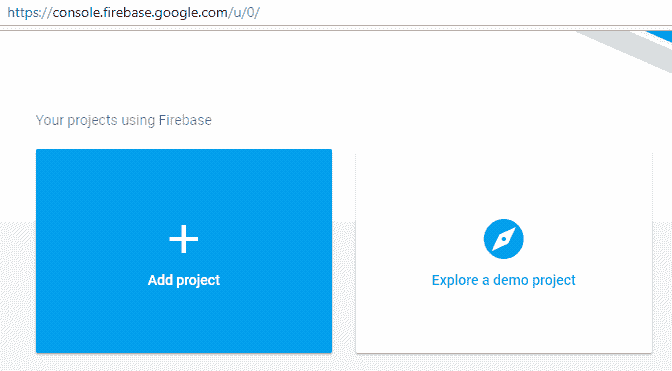

3.  输入项目名称(以红色突出显示)并获取项目 ID(以黑色突出显示)，如下所示:

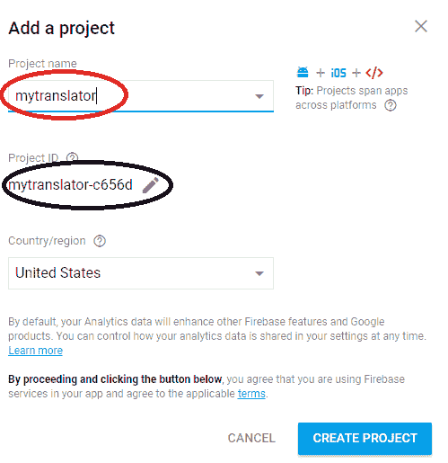

4.  使用 Node.js 包管理器安装 Firebase 工具，如下所示:
    *   将目录切换到需要存储`firebase`功能文件的文件夹。在下面的截图中，我们在`E`驱动器中创建了一个名为`firebase`的文件夹:

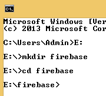

5.  我们使用以下代码片段安装 Firebase 工具:

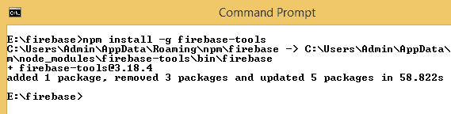

登录并初始化 Firebase:

1.  我们通过指定以下内容登录 Firebase:

```
firebase login --reauth
```

2.  前面的代码片段允许我们使用凭据登录。确保允许 Firebase CLI 访问您的 Google 帐户。
3.  一旦我们登录到 Firebase，我们初始化`firebase`如下:

```
firebase init
```

4.  您将看到以下屏幕:

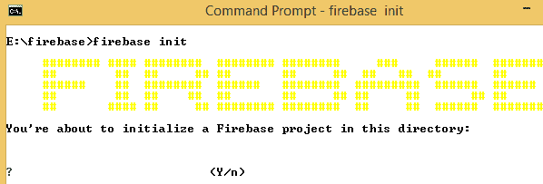

5.  按下 *Y* 初始化 Firebase。

6.  通过按空格键选择当前应用所需的功能，选择完成后，按 *Enter* :

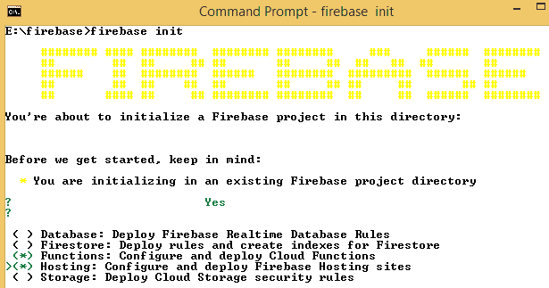

7.  一旦选定，对于我们在这里使用的版本，让我们指定我们的函数使用 JavaScript 部署，如下所示:

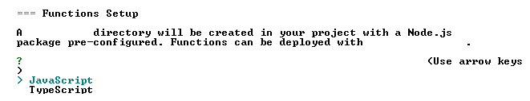

8.  选中后，我们用项目目录设置项目:

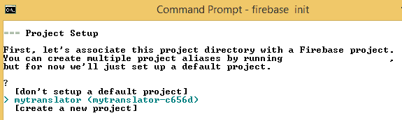

请注意，`mytranslator`是我们在*步骤 2* 中创建的项目。另请注意，一旦我们初始化了 Firebase，文件夹结构如下所示:

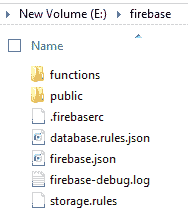

9.  在命令提示符下，初始化 Firebase 后，按*键输入*出现各种提示。在初始化结束时，您应该会收到完成初始化的确认，如下所示:


滚动到`functions`文件夹后，使用 Node.js 包管理器安装 Google Translate:

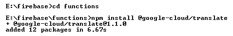

我们指定了用例所需的所有功能(公共 API 方法)。这些函数处理所有的服务器编程:

1.  为了指定这些，让我们用下面的代码片段覆盖位于`functions`文件夹中的`index.js`文件。

```
const functions = require('firebase-functions');
const Translate = require('@google-cloud/translate');
const admin = require("firebase-admin")

//setting connection to db
admin.initializeApp();

const translate = new Translate({
    projectId: 'mytranslator-c656d'
});
//Extract the most searched term

exports.getMessageStats=functions.https.onRequest((req,res) =>
 {
 var output;
 var db = admin.database();
 var ref = db.ref("/translateMessageStats");

// Attach an asynchronous callback to read the data at our posts reference
 ref.orderByChild("count").limitToLast(1).on("value", function(snapshot) {

console.log(snapshot.forEach(element => {
 output=element.key+" : "+element.val().count + 'times'
 }))
 res.header("Access-Control-Allow-Origin", "*");
 return res.send(JSON.stringify(output));
 }, function (errorObject) {
 console.log("The read failed: " + errorObject.code);
 });
})

// create a public API method of name "translateMessage"

exports.translateMessage=functions.https.onRequest((req,res) =>
 {
 const input = req.query.text;

translate.translate(input,'en').then(results =>
 {
 const output = results[0];
 console.log(output);

const db = admin.database();
var ref = db.ref("/translateMessageStats");

//update database
 var dataRef= ref.child(input);

dataRef.once('value', function(snapshot) {
 if (snapshot.exists()) {
 dataRef.update({"count":snapshot.val().count+1});
 console.log("data exists")
 }
 else
 {
 console.log("data does not exist")
 dataRef.update({"count":1});
 }
 });

res.header("Access-Control-Allow-Origin", "*");
 return res.send(JSON.stringify(output));
 })
});
```

2.  在这段代码中，我们使用以下代码导入所需的 Node.js 包:

```
const functions = require('firebase-functions');
const Translate = require('@google-cloud/translate');
const admin = require("firebase-admin")
```

3.  我们通过指定以下内容来初始化与数据库的连接:

```
admin.initializeApp();
```

4.  我们创建`translate`对象，并将项目 ID 作为参数传递给它，如下所示:

```
const translate = new Translate({
    projectId: 'mytranslator-c656d'
});
```

5.  然后我们创建一个名为`translateMessage`的面向公众的 API，如下所示:

```
exports.translateMessage=functions.https.onRequest((req,res) =>
```

6.  用户给出的输入通过以下行获取:

```
const input = req.query.text;
```

7.  输入文本的翻译和相应的翻译文本在输出中的存储由以下代码完成:

```
translate.translate(input,'en').then(results =>
{
    const output = results[0];
```

8.  我们创建一个数据库实例，如下所示:

```
const db = admin.database();
 var ref = db.ref("/translateMessageStats");
```

9.  数据库中的输入被更新:

```
var dataRef= ref.child(input);
```

10.  如果给出新的输入，`count`被初始化为`1`；否则，`count`增加`1`:

```
dataRef.once('value', function(snapshot) {
    if (snapshot.exists()) {
        dataRef.update({"count":snapshot.val().count+1});
        console.log("data exists")
    }
    else
    {
        console.log("data does not exist")
        dataRef.update({"count":1});
    }
  });
```

启用**谷歌云翻译 API** ，如下所示:

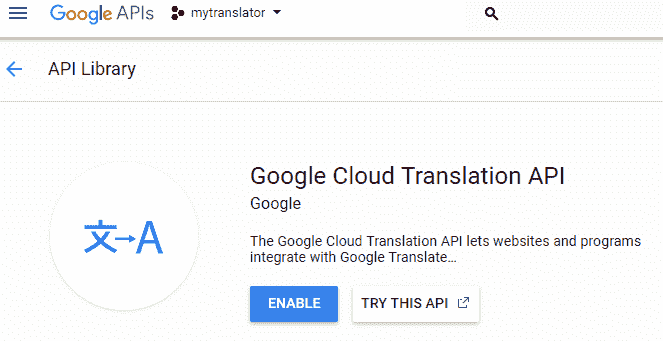

展开`firebase`功能:

1.  我们可以部署`firebase`函数，如下图所示:

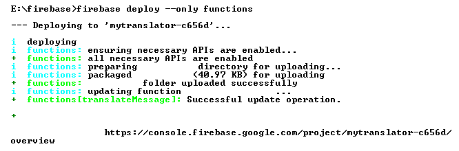

2.  一旦部署了该功能，请查看项目概述的开发部分中的功能:


3.  单击 Functions 后，我们应该能够看到一个包含我们刚刚创建的功能的仪表板— `translateMessage`:

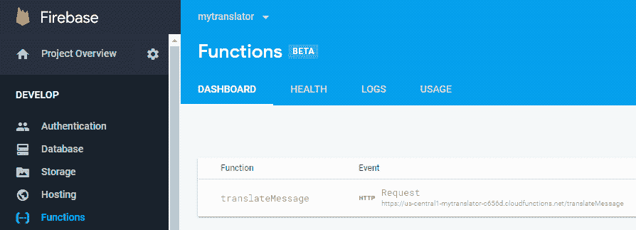

请注意，前面的事件为我们提供了一个 URL，使用它我们应该能够翻译输入文本，如下所示:

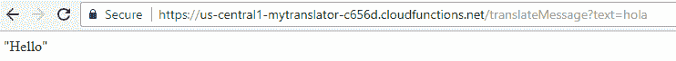

注意 URL 中`?text=`的用法，它是输入。

如果执行中出现问题，我们应该能够在 Logs 选项卡(Functions dashboard 的)中了解它们。

此外，我们搜索的所有输入都存储在数据库中:

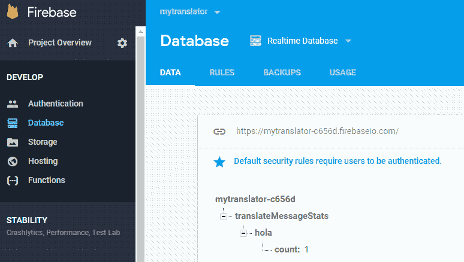

注意，当搜索术语`hola`时，计数值被初始化。

用下面的代码片段替换`public`文件夹中`index.html`文件的内容。以下代码片段的输出将是创建一个文本框，让我们给出一个输入文本，翻译文本，并产生翻译后的输出。

1.  在执行过程中，用您自己的项目 ID 替换项目 ID `mytranslator-c656d`:

```
<html>
  <script src="img/jquery.min.js">  </script>
  <script>

    $(document).ready(
      getMessageStats()
    );
<!-- The following code extracts the most searched term from the database that we create in the next function -->

    function getMessageStats(){
      var xhr = new XMLHttpRequest();
      xhr.open('GET', "https://us-central1-mytranslator-c656d.cloudfunctions.net/getMessageStats", true);
      xhr.send();

      xhr.onreadystatechange = processRequest;

      function processRequest(e) {
        if (xhr.readyState == 4) {
          var response = JSON.parse(xhr.responseText);
          document.getElementById("mostSearched").innerHTML=response;
        }
      }
    }
<!-- the following function translates the input value into english -->
    function translateText()
    {
      var textInput= document.getElementById("input").value;
      var xhr = new XMLHttpRequest();
      xhr.open('GET', "https://us-central1-mytranslator-c656d.cloudfunctions.net/translateMessage?text="+textInput, true);
      xhr.send();

      xhr.onreadystatechange = processRequest;
      function processRequest(e) {

        if (xhr.readyState == 4) {
          var response = JSON.parse(xhr.responseText);
          document.getElementById("output").innerHTML=response;
          getMessageStats();
        }
      }
    }
  </script>
<!-- the following code creates the layout of web application, with input text box and output-->
  <body>
    <label>Enter Input Text</label>
    <input id="input" type="text-area"></input>
    <button onclick="translateText()" id="btnTrans">Translate</button>
    <label id="output"></label>
    <br/>
    <div>
      <h1>Most Searched element</h1>
      <label id="mostSearched"></label>
    </div>
  </body>
</html>
```

我们部署 Firebase，以便上传 HTML 文件，该文件指定我们将处理的最终 URL 的结构:

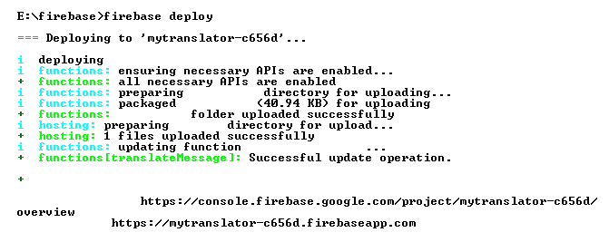

我们现在应该能够访问所示的链接，该链接有助于我们翻译文本，如下所示:

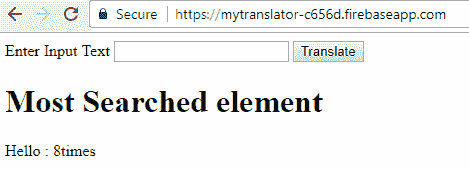

由此可见，我们能够创建一个翻译任何给定输入文本的 web 应用程序。请注意，web 应用程序使用了由函数创建的 API 端点，前端代码只会因我们使用的框架而异——当我们在 HTML 上使用 Angular 时，它可能会有所不同，但服务器端代码将保持不变。

<title>Building a mobile application</title>  

# 构建移动应用程序

在上一节中，我们了解了为我们翻译输入的 HTML 页面的前端。在本节中，我们将构建一个 Android 应用程序的前端，它利用我们为函数生成的端点来为我们返回翻译后的文本。

我们创建应用程序的布局如下:

```
<?xml version="1.0" encoding="utf-8"?>
 <android.support.constraint.ConstraintLayout xmlns:android="http://schemas.android.com/apk/res/android"
     xmlns:app="http://schemas.android.com/apk/res-auto"
     xmlns:tools="http://schemas.android.com/tools"
     android:layout_width="match_parent"
     android:layout_height="match_parent"
     tools:context=".MainActivity">

     <Button
         android:id="@+id/button"
         android:layout_width="wrap_content"
         android:layout_height="wrap_content"
         android:layout_marginStart="148dp"
         android:layout_marginTop="56dp"
         android:text="Translate"
         app:layout_constraintStart_toStartOf="parent"
         app:layout_constraintTop_toBottomOf="@+id/input" />

     <EditText
         android:id="@+id/input"
         android:layout_width="wrap_content"
         android:layout_height="wrap_content"
         android:layout_marginStart="84dp"
         android:layout_marginTop="84dp"
         android:ems="10"
         android:inputType="textPersonName"
         app:layout_constraintStart_toStartOf="parent"
         app:layout_constraintTop_toTopOf="parent" />

     <TextView
         android:id="@+id/out"
         android:layout_width="197dp"
         android:layout_height="80dp"
         android:layout_marginStart="92dp"
         android:layout_marginTop="56dp"
         app:layout_constraintStart_toStartOf="parent"
         app:layout_constraintTop_toBottomOf="@+id/button" />

 </android.support.constraint.ConstraintLayout>
```

前面的代码会输出应用程序的布局:

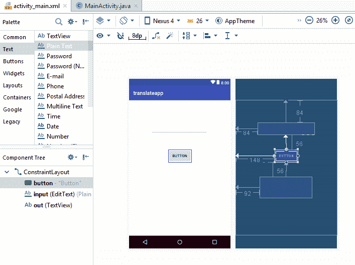

注意，我们有一个接受输入的 EditText 视图。

按钮用于执行翻译，out 是显示输出的文本视图。

还要注意，在前面的代码中，我们已经确保组件与屏幕对齐。

在 main activity 中，我们执行以下代码:

```
package com.example.admin.translateapp;

 import android.os.AsyncTask;
 import android.support.v7.app.AppCompatActivity;
 import android.os.Bundle;
 import android.view.View;
 import android.widget.Button;
 import android.widget.EditText;
 import android.widget.TextView;

 import java.io.BufferedReader;
 import java.io.IOException;
 import java.io.InputStreamReader;
 import java.net.HttpURLConnection;
 import java.net.URL;

 import javax.net.ssl.HttpsURLConnection;

 public class MainActivity extends AppCompatActivity {
     public String myurl;
     public String result;
     public String response;
     public EditText inp;
     public TextView out;
     public Button btn;

     @Override
     protected void onCreate(Bundle savedInstanceState) {
         super.onCreate(savedInstanceState);
         setContentView(R.layout.activity_main);
         inp = (EditText) findViewById(R.id.input);
         out = (TextView) findViewById(R.id.out);
         btn = (Button) findViewById(R.id.button);
         myurl = "http://us-central1-mytranslator-c656d.cloudfunctions.net/translateMessage?text=";

         btn.setOnClickListener(new View.OnClickListener() {
             public void onClick(View v) {
                 RequestTask task = new RequestTask();
                 task.execute(inp.getText().toString());
             }
         });
     }

     private class RequestTask extends AsyncTask<String, String, String> {

         @Override
         protected String doInBackground(String... uri) {
             try {
                 URL url = new URL(myurl+uri[0].toString());
                 HttpURLConnection conn = (HttpURLConnection) url.openConnection();
                 conn.setRequestMethod("GET");
                 conn.connect();
                 if (conn.getResponseCode() == HttpURLConnection.HTTP_OK) {
                     InputStreamReader streamReader = new
                             InputStreamReader(conn.getInputStream());
                     //Create a new buffered reader and String Builder
                     BufferedReader reader = new BufferedReader(streamReader);
                     StringBuilder stringBuilder = new StringBuilder();
                     //Check if the line we are reading is not null
                     String inputLine;
                     while((inputLine = reader.readLine()) != null){
                         stringBuilder.append(inputLine);
                     }
                     //Close our InputStream and Buffered reader
                     reader.close();
                     streamReader.close();
                     //Set our result equal to our stringBuilder
                     result = stringBuilder.toString();
                     //result = conn.getResponseMessage();
                 } else {
                 }
             } catch (IOException e) {
                 //TODO Handle problems..
             }
             return result;
         }

         @Override
         protected void onPostExecute(String result1) {
             super.onPostExecute(result1);
             out.setText(result1); }
     }
 }
```

让我们理解前面的代码。

导入相关包:

```
import android.os.AsyncTask;
 import android.support.v7.app.AppCompatActivity;
 import android.os.Bundle;
 import android.view.View;
 import android.widget.Button;
 import android.widget.EditText;
 import android.widget.TextView;

 import java.io.BufferedReader;
 import java.io.IOException;
 import java.io.InputStreamReader;
 import java.net.HttpURLConnection;
 import java.net.URL;
```

初始化我们在`MainActivity`类中使用的对象:

```
public String myurl;
 public String result;
 public String response;
 public EditText inp;
 public TextView out;
 public Button btn;
```

此外，使用以下代码初始化视图:

```
inp = (EditText) findViewById(R.id.*input*);
 out = (TextView) findViewById(R.id.*out*);
 btn = (Button) findViewById(R.id.*button*);
```

设置点击监听器:

```
btn.setOnClickListener(new View.OnClickListener() {
     public void onClick(View v) {
         RequestTask task = new RequestTask();
         task.execute(inp.getText().toString());
```

指定单击按钮时需要执行的任务:

```
URL url = new URL(myurl+uri[0].toString());
 HttpURLConnection conn = (HttpURLConnection) url.openConnection();
 conn.setRequestMethod("GET");
 conn.connect();
 if (conn.getResponseCode() == HttpURLConnection.*HTTP_OK*) {
     InputStreamReader streamReader = new
             InputStreamReader(conn.getInputStream());
     //Create a new buffered reader and String Builder
     BufferedReader reader = new BufferedReader(streamReader);
     StringBuilder stringBuilder = new StringBuilder();
     //Check if the line we are reading is not null
     String inputLine;
     while((inputLine = reader.readLine()) != null){
         stringBuilder.append(inputLine);
     }
     //Close our InputStream and Buffered reader
     reader.close();
     streamReader.close();
     //Set our result equal to our stringBuilder
     result = stringBuilder.toString();
```

在前面的代码中，URL 被评估为我们在前面的 web 应用程序部分中看到的 URL。

上述代码的输出如下:

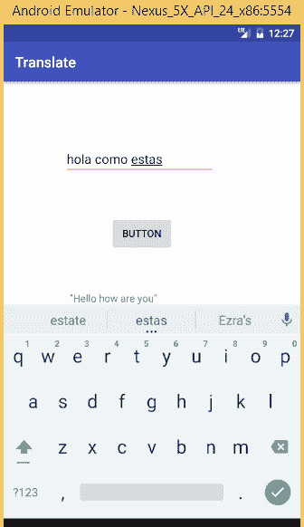

请注意，点击按钮，我们应该能够翻译我们的文本。

<title>Summary</title>  

# 摘要

在本章中，我们了解了 Firebase 的各种特性，以及如何使用`firebase`函数来构建 web 和移动应用程序的后端。我们还使用了`firebase`函数来实时更新数据库，并从数据库中检索历史上搜索次数最多的术语。