# 九、使用TensorFlow和 Keras 的神经网络

神经网络是一种监督学习算法，它是由大脑功能的方式松散地启发而来的。类似于神经元在大脑中相互连接的方式，神经网络接受输入并将其传递给一个函数，基于该函数，某些后续神经元兴奋，并产生输出。

在这一章中，我们将重点介绍使用 TensorFlow 和 Keras 的神经网络的实际实现。TensorFlow 提供了一个低级框架来创建神经网络模型。Keras 是一个高级神经网络 API，它大大简化了定义神经网络模型的任务。我们将展示如何在 TensorFlow 上使用 Keras 来定义和训练 GCP 上的模型。我们将介绍 Python 中的 Keras API，并使用应用于经典 MNIST 数据集的简单前馈网络。此外，我们将了解神经网络的不同组成部分:

*   初始化
*   度量和损失函数
*   激活功能
*   网络的深度


# 神经网络概述

神经网络的起源源于这样一个事实，即每个函数都不能用线性/逻辑回归来近似，数据中可能存在只能用复杂函数来近似的潜在复杂形状。

函数越复杂(以某种方式处理过拟合)，预测精度就越好。

下图解释了神经网络将数据拟合到模型中的方式。

神经网络的典型结构如下:


此图中的输入级别/层通常由用于预测输出(因变量)级别或层的独立变量组成。

隐藏级别/层用于将输入变量转换为高阶函数。隐藏层转换输出的方式如下:

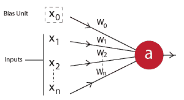

在上图中，*x[1]T3， *x [2]* ，...、 *x [n]* 是自变量，而 *x [0]* 是偏差项(类似于我们在线性/逻辑回归中有偏差的方式)。*

*w[1]T3、*w[2]T7、...， *w [n]* 是赋予每个输入变量的权重。如果 *a* 是隐藏层中的一个神经元，它将等于:**

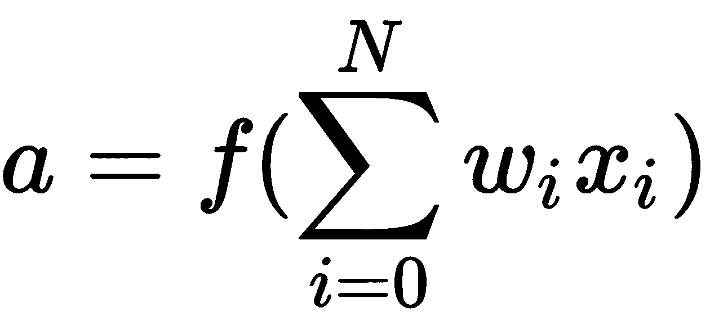

我们在这个方程中看到的函数是激活函数，我们将它应用于求和之上，从而获得非线性。我们需要非线性，这样我们的模型才能学习复杂的模式。

此外，具有一个以上的隐藏层有助于实现高度的非线性。

可以在神经网络中调整的各种参数的细节将在随后的章节中提供。


# 设置谷歌云数据实验室

为了设置 Google Cloud Datalab，我们单击云外壳图标:


在云外壳中，设置需要处理的项目，如下所示:

```
gcloud config set core/project gcp-test-196204
```

设置项目后，按如下方式配置区域:

```
gcloud config set compute/zone us-west1-b
```

最后，通过指定以下内容创建一个 Datalab 实例:

*   对于 CPU 版本:

```
datalab create --no-create-repository mlgcp
```

*   对于 GPU 版本:

首先，您需要通过配额页面请求一个 GPU 版本，如下所示:


提交配额请求，您应该很快就会收到在给定区域使用 GPU 的许可。

请注意，在构建神经网络模型时，GPU 版本更好，因为 GPU 中的多个处理器可以并行更新神经网络的多个权重。

将端口更改为`8081`以打开 Datalab，从而打开笔记本。


# 安装和导入所需的软件包

TensorFlow 作为一个包，是为执行神经网络计算而构建的。它与惰性评估概念一起工作，在执行代码之前，指定神经网络连接的各种元素。

另一个名为 Keras 的 API 使得构建神经网络更加容易。在本章中，我们将首先利用 Keras 包，TensorFlow 在其后端运行，然后我们将展示如何使用 TensorFlow 中的预制估计器和自定义估计器来构建神经网络。

在前面的章节中，我们了解了如何设置 Datalab 笔记本。在本章中，我们将了解如何将所需的包安装和导入到 Datalab 笔记本中。

默认情况下，Datalab 附带预装的 TensorFlow 包。但是，默认情况下，它不包含 Keras。让我们看看如何安装`keras`包:

```
!pip install keras
```

一旦安装了 Keras，让我们导入两个必需的包:

```
import keras as K
import tensorflow as tf
```


# 简单神经网络的工作细节

为了理解神经网络如何工作，我们将建立一个非常简单的网络。投入和预期产出如下:

```
import numpy as np
x=np.array([[1,2],[3,4]])
y=np.array([0,1])
```

注意`x`是两行中每一行都有两个变量的输入数据集。`y`是两个输入的预期输出。

本质上，我们已经有了输入和输出层。

例如，对于前面的数据点之一，网络的输入和输出值将如下所示:

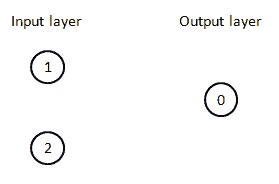

在传统的机器学习中，你会发现输入和输出值之间的直接关系。然而，神经网络架构基于以下直觉工作:

*“输入值可以在更丰富(更高)的维度空间中表示。表示输入值的维度越多，捕获的输入数据集中的复杂性就越大。”*

根据前面的直觉，让我们在神经网络中建立一个具有三个单元的隐藏层:

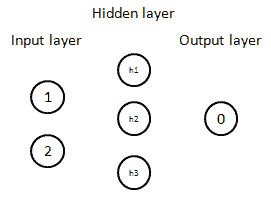

现在已经构建了层，让我们在每个单元之间建立连接，如下所示:

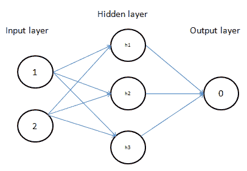

既然在每个单元之间建立了连接，那么将会有一定量的权重与每个连接相关联。在下图中，我们将初始化每个连接所代表的权重:

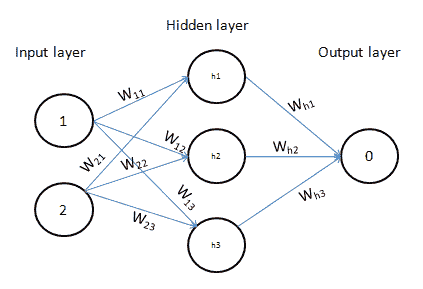

注意，权重 **W** 代表连接的强度。

现在我们已经建立了一个简单的神经网络。让我们随机初始化输入层和隐藏层之间的权重值，以了解隐藏层值是如何计算的:

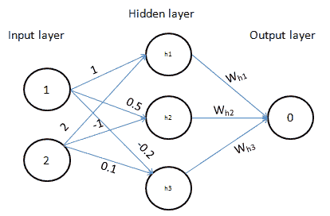

隐藏层值通过输入值和与其相关的权重的乘积来计算，如下所示:

*h1 = 1*1 + 2*(2) = 5*

*H2 = 1 * 0.5+2 *(1)=-1.5*

*H3 = 1 *(0.2)+2 * 0.1 = 0*

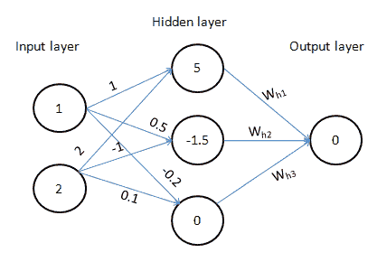

既然隐藏值已经计算出来了，我们就让它们通过一个激活函数。激活功能的直觉如下:

*“我们之前提出的状态下的神经网络(没有激活函数)是输入变量的大线性组合。只能通过在隐藏层值的顶部执行激活来获得非线性。”*

为简单起见，从现在开始，我们假设我们要应用的非线性是 sigmoid 函数。

sigmoid 函数的工作方式如下:

*   它接受一个输入值 *x* ，并转换成一个新值 *1/(1+exp(-x))*

对于不同的 *x* 值，s 形曲线的非线性如下所示:

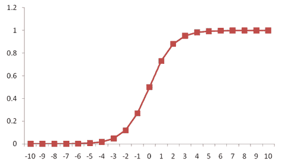

因此，隐藏层值(5、-1.5 和 0)被转换为 **0.99** 、 **0.18** 和 **0.5** :

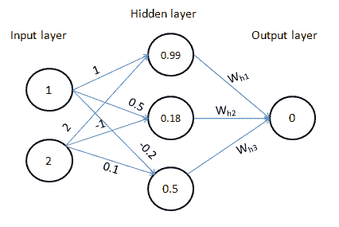

现在隐藏层的值已经计算出来了，让我们初始化连接隐藏层和输出层的权重。

请注意，权重也是随机初始化的:


现在权重已初始化，让我们来计算与输出图层相关的值:

*0.99 * 1+0.18 *(1)+0.5 * 0.2 = 0.91*

输出层的期望值为 *0.91* ，而实际值为 0。

因此，这种情况下的相关损失为 *(0.91 - 0)^2 = 0.83* )。

到目前为止，我们计算对应于权重值的损失的过程被称为**前馈过程**。

到目前为止，在本节中，我们已经了解了:

*   砝码
*   激活功能
*   损失计算

在前面的场景中，虽然对于我们试图解决的给定目标，损失函数保持不变，但是对于不同的网络架构，权重初始化和激活函数可以不同。

刚才提出的问题的目标是通过迭代地改变权重来最小化对应于网络架构的损耗。

例如，在前面的架构中，可以通过将从隐藏层到输出层连接的最终权重从 *0.2* 更改为 *0.1* 来减少损失。一旦改变重量，损失从 *0.83* 减少到 *0.74* 。

迭代改变权重以最小化损失值的过程被称为**反向传播**。

每个给定数据集发生重量变化的次数称为**时期**。本质上，一个时期由前馈和反向传播组成。

智能达到最佳权重值的技术之一被称为**梯度下降**——在后面的章节中会有更多关于各种权重优化器的内容。


# 反向传播

在前面的部分中，我们已经看到了在反向传播中权重是如何更新的。在本节中，我们将详细了解权重更新流程的工作原理:

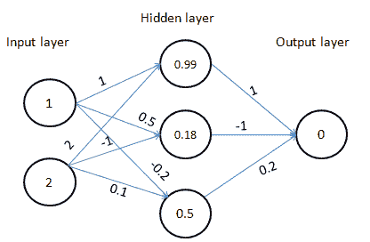

在反向传播过程中，我们从神经网络末端的权重开始反向工作。

在上图(1)中，我们针对连接隐藏层和输出层的每个权重，以少量(0.01)迭代更改权重值:

| **原始重量** | **改变重量** | **错误** | **误差减少** |
| one | One point zero one | 0.84261 | -1.811 |
| -1 | -0.99 | Zero point eight four nine | -0.32 |
| Zero point two | Zero point two one | Zero point eight three seven | -0.91 |

从上表中，我们注意到不应增加权重值，而应减少权重值以改善误差:

| **原始重量** | **改变重量** | **错误** | **误差减少** |
| one | Zero point nine nine | 0.8108 | One point seven nine two |
| -1 | -1.01 | 0.8248 | Zero point three two seven |
| Zero point two | Zero point one nine | Zero point eight one nine | 0.9075 |

现在我们注意到，对于一些权重更新，误差的改善很高，而对于一些其他权重更新，误差的改善很低。

这表明，对于误差改善很多的一些权重，权重更新可以更快；而对于误差改善相对较低的一些权重，权重更新可能较慢。

值为 1 的权重的改变后的权重可以是:

*改变后的权重=原始权重+学习率 X 误差减少量*

暂且假设学习率为*0.05*；然后:

*改变后的重量= 1 + 0.05*(1.792) = 1.089*

其他权重将使用相同的公式进行更改。

直观上，学习率有助于我们建立对算法的信任。例如，当决定权重更新的幅度时，我们可能不会一次改变所有内容，而是采取更谨慎的方法来更慢地更新权重。

一旦所有的权重都使用所安排的过程更新，反向传播过程就完成了，我们再次进行正向传播。

前馈和反向传播步骤一起被称为**时期**。

请注意，我们计算的是一次预测一个数据点的误差值，因此形成的批量大小为 1。在实践中，我们计算一组数据点的误差值，然后使用一批数据而不是单个数据点不断更新权重。


# 在 Keras 中实现一个简单的神经网络

从前面的讨论中，我们已经看到神经网络中的关键组件是:

*   隐藏层
*   隐藏层中的激活
*   损失函数

除此之外，神经网络中还有一些其他关键组件。然而，我们将在后面的章节中了解它们。

现在，我们将使用 Keras 中给定的玩具数据集，以及我们在前面几节中获得的知识，构建一个神经网络模型:

导入相关函数:

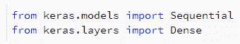

顺序模型是层(输入、隐藏和输出)的线性堆栈。

在每一层中，`dense`帮助实现网络中指定的操作。

让我们继续构建网络，如下所示:

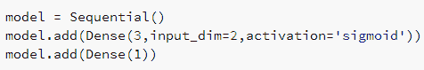

在我们的数据中，我们采用二维的输入数据集，并在第一步中将其转换为三维的隐藏层单元。

一旦计算出隐藏层的值，我们在第二步中让它们通过一个 sigmoid 激活。

前面两个步骤在模型规范的第二行中。

从隐藏层，我们将它连接到一维的输出层，因此第三行代码有`Dense(1)`。

让我们看看我们指定的模型的摘要:

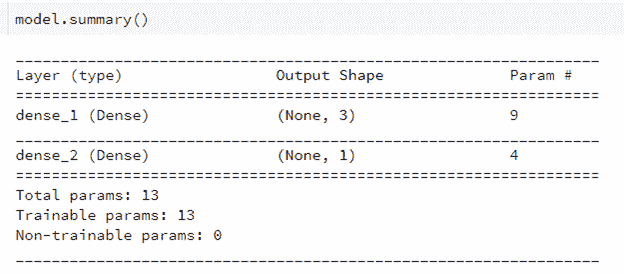

让我们来理解前面总结的输出形状列:`(None, 3)`。

`None`表示输出与输入的数量无关(不要与输入的维数混淆)。`3`代表隐藏层的单元数。

同样第二层的`(None,1)`表示输出层的维度(输出层只有一个单元)。

`Param #`表示与网络相关的参数数量。

请注意，输入层和隐藏层之间的连接总共有九个参数，因为有六个权重值(如上一节中的图表所示)和三个与隐藏层中的每个单元相关联的偏差项。

类似地，在隐藏层和输出层之间的连接中有四个参数，因为在隐藏层和输出层之间有三个权重值和一个与输出层相关联的偏置项。

现在已经指定了网络架构，让我们编译模型，如下所示:

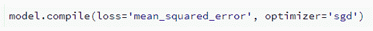

在前面的代码行中，我们指定损失是基于均方差计算的，均方差是输入中所有数据点的实际值和预测值之间的平方差的平均值。

类似地，我们指定优化技术基于随机梯度下降。

既然已经指定了模型结构、我们正在计算的损失函数以及我们正在使用的优化技术，那么让我们根据输入和输出值来拟合模型。

拟合模型时，我们需要指定的其他指标有:

*   输入和输出值
*   要在模型上运行的时期数:

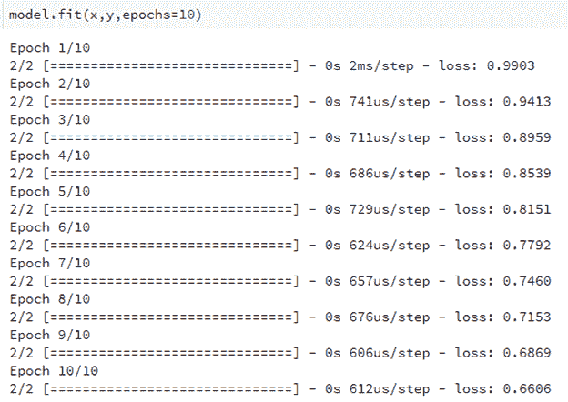

注意，我们指定的输入和输出变量是`x`、`y`。

此外，您应该注意到，随着权重值被调整为在 10 个时期内尽可能减少损失，损失值会在不同时期内减少。

现在模型已经建立，让我们看看如何获取每一层的权重值:

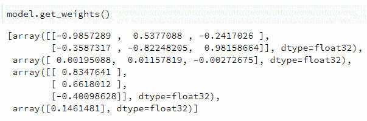

对应于新输入值的值现在可以计算如下:

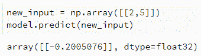

在前面的代码片段中，我们初始化了一个新的输入，并使用通过运行模型获得的最佳权重预测了与该新输入相对应的输出。

我们来了解一下输出是如何获得的。

获取对应于隐藏层中三个单元的值:

*h1 = 2 *(0.985)+5 *(0.3587)+0.00195 =-3.76*

*H2 = 2 * 0.537+5 *(0.8225)+0.0011 =-3.025*

*H3 = 2 *(0.24)+5 * 0.98-0.0027 = 4.421*

一旦计算出隐藏层值，我们就将它们传递给 sigmoid 激活函数，如模型架构中所指定的:

*最终 h1 = sigmoid(h1) = 0.0226*

*最终 h2 = sigmoid(h2) = 0.0462*

*最终 h3 = sigmoid(h3) = 0.988*

一旦获得最终的隐藏层单元值，我们将它们乘以连接隐藏层和输出层的权重，如下所示:

*输出= 0.0226 * 0.834+0.0462 * 0.6618+(-0.401)* 0.988+0.14615 =-0.20051*

注意，我们获得的值与在`model.predict`函数中获得的值相同。这证明了我们到目前为止所学的架构功能。

现在我们已经构建了模型，让我们重新执行代码，看看结果是否保持不变:

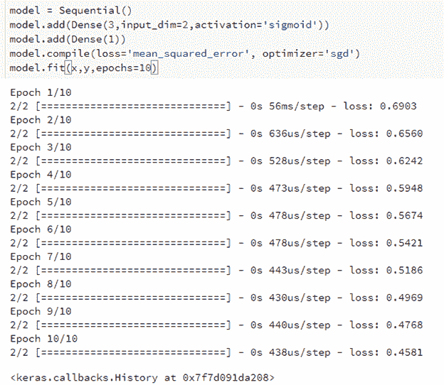

请注意，损失值不同于我们在前一次迭代中获得的值。这是因为权重是在神经网络运行的第一个时期随机初始化的。解决这个问题的一个方法是设置一个种子。每次神经网络运行时，种子有助于初始化同一组随机值。

请注意，种子应该在每次重新构建模型时运行。设置种子的代码片段如下所示:

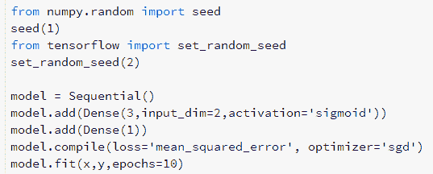

# 理解各种损失函数

正如上一章所讨论的，有两种类型的因变量——连续变量和分类变量。在连续变量预测的情况下，可以通过使用所有预测的误差平方和来计算损失(误差)函数。

如果因变量是一个分类变量，并且只有两个不同的值与之相关联，则使用以下公式将损失计算为二进制交叉熵误差:

*y*logp + (1-y)*log(1-p)*

在因变量是具有多个不同值的分类变量的情况下，使用分类交叉熵误差计算损失，如下所示:

*∑ y*logp*

其中 *p* 是事件为 1 的概率。

分类变量在实践中通常是一键编码的，如下所示:

假设跨三个不同行的输出是`[1,2,3]`；然后输出值表示为`[[1,0,0], [0,1,0], [0,0,1]]`。其中每个索引值代表不同的值是否存在。在上面的示例中，第 0 个索引对应于 1，因此对于第 0 个，只有第一行的值为 1，而其余行的值为 0。

Keras 中可用的其他损失函数有:

*   绝对平均误差
*   平均绝对百分比误差
*   均方对数误差
*   方形铰链
*   关键
*   分类铰链
*   对数曲线


# Softmax 激活

从上一节中，我们应该注意到，在分类变量预测的情况下，输出图层中单元的数量将与因变量中不同值的数量相同。

另外，请注意，对于输出图层中的任何单位，预测值都不能大于 1 或小于 0。同时，输出中所有节点的值之和应该等于 1。

例如，假设输出的两个节点的输出是-1 和 5。假设输出的期望值应该在 0 和 1(事件发生的概率)之间，我们通过 softmax 激活传递输出值，如下所示:

*   通过指数函数传递值:

*exp(-1) = 0.367*

*exp(5) = 148*

*   归一化输出值以获得 0 到 1 之间的概率，并确保两个输出节点之间的概率之和为 1:

*0.367/(0.367+148) =0.001*

*148/(0.367+148) = 0.999*

因此，softmax 激活有助于我们将输出值转换成概率值。


# 在 Keras 建立更复杂的网络

到目前为止，我们已经建立了一个相当简单的神经网络。传统的神经网络会有更多的参数，这些参数可以改变以获得更好的预测能力。

让我们通过使用经典的 MNIST 数据集来理解它们。MNIST 是一个手写数字数据集，包含大小为 28 x 28 像素的图像，这些图像表示为 28 x 28 维的 NumPy 数组。

每个图像都是一个数字，现在的挑战是预测图像对应的数字。

让我们下载并浏览 MNIST 数据集中的一些影像，如下所示:

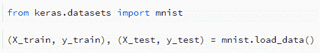

在前面的代码片段中，我们使用`load_data`函数导入 MNIST 对象并下载 MNIST 数据集。

还要注意的是，`load_data`函数有助于将 MNIST 数据集自动分割成训练数据集和测试数据集。

让我们将训练数据集中的一幅图像可视化:


请注意，前面的数字是 5，我们看到的网格大小是 28 x 28。

让我们看看输入和输出的形状，以进一步理解数据集:


假设每个输入图像的大小为 28 x 28，让我们将其展平以获得`784`像素值的分数:

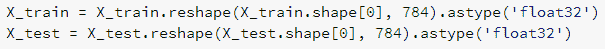

输出层需要预测图像是否对应于从 0 到 9 的数字之一。因此，输出层由 10 个单元组成，分别对应于 10 个不同的数字:

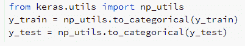

在前面的代码中，`to_categorical`提供了一个标签的热编码版本。

现在我们已经有了训练和测试数据集，让我们继续在下面的部分中构建神经网络的架构:

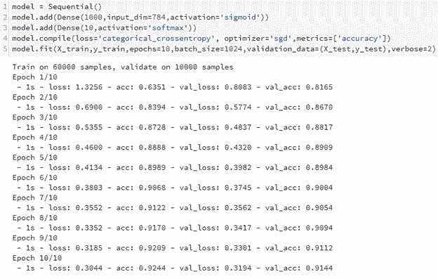

注意，前面截图中的`batch_size`指的是被认为是更新权重的数据点的数量。批量的直觉是:

*“如果在 1，000 个数据点的数据集中，批量大小为 100，则在扫描整个数据时有 10 次重量更新”*。

请注意，预测测试数据集上标签的准确度为 91%。

一旦历元数达到 300，这个准确度就增加到 94.9%。注意，对于测试数据集上 94.9%的准确度，训练数据集上的准确度是 99%。

这是一个经典的过拟合案例，处理方法将在后续章节中讨论。


# 激活功能

到目前为止，我们只考虑了隐藏层中的 sigmoid 激活函数。然而，有相当多的其他激活函数在构建神经网络中是有用的。该图表给出了各种激活功能的详细信息:


更常用的激活函数是 ReLU、TanH 和逻辑或 sigmoid 激活。

让我们探索不同激活函数在测试数据集上的准确性:


注意，当使用 ReLU 激活时，测试数据集上的准确率仅为 29.75%。

但是，在执行 ReLU 激活时，在拟合模型之前缩放数据总是一个好主意。缩放是减少输入数据集中所有值的大小的一种方式。

让我们首先按如下方式调整输入:

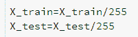

现在，让我们重新运行模型，看看测试数据集的准确性:

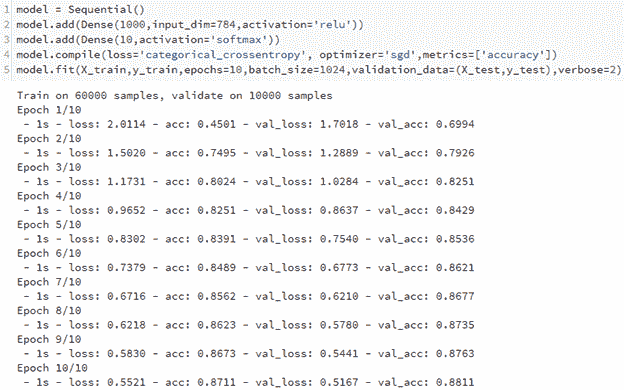

注意，在运行 10 次迭代之后，测试数据集上的准确率是 88.1%。现在，让我们运行 300 个时期的模型，以便我们可以比较 sigmoid 激活和 ReLU 激活的输出。

您会注意到，测试数据集上的准确率为 95.76%，略高于 sigmoid 激活的准确率。然而，在训练数据集上的准确率为 96%，这表明它不太可能在数据集上过拟合；因此，更多的历元可能会进一步提高测试数据集的准确性。

让我们使用 TanH 激活重新运行模型，先不缩放，后缩放。

当模型在未缩放的数据上运行时，10 个时期后的准确率为 92.89%，300 个时期后的准确率为 94.6%。

一旦我们缩放输入数据集，测试数据的准确度在 10 个时期后为 88%,在 300 个时期后为 93%。

注意，当数据集被缩放时，不管使用的激活函数如何，都不会出现过拟合的问题(训练数据集精度比测试数据集精度高得多)。


# 优化者

在上一节中，我们研究了各种激活函数，并注意到 ReLU 激活函数在运行大量时期时会产生更好的结果。

在这一节中，我们将看看在激活函数仍然依赖于缩放数据集的情况下改变优化器的影响。

运行 10 个时期时，各种损失函数及其在测试数据集上的相应精度如下:

| **优化器** | **测试数据集准确度** |
| 签名于 | 88% |
| RMSprop | 98.44% |
| 圣经》和《古兰经》传统中）亚当（人类第一人的名字 | 98.4% |

现在我们已经看到，RMSprop 和 Adam 优化器的性能优于随机梯度下降优化器；让我们看看优化器中的另一个参数，可以修改它来提高模型的准确性——学习率。

优化器的学习率可以通过如下指定来改变:

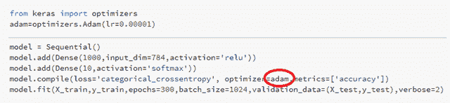

在前面的代码片段中，`lr`表示学习率。学习率的典型值在 0.001 和 0.1 之间变化。

在 MNIST 数据集上，当我们改变学习率时，准确率没有进一步提高；然而，通常对于较低的学习速率，需要更多的历元来达到相同的准确度。


# 增加网络的深度

增加隐藏层的深度等同于增加神经网络中隐藏层的数量。

通常，对于隐藏层中较高数量的隐藏单元和/或较高数量的隐藏层，预测更准确。

假设 Adam 优化器或 RMSprop 在一定数量的时期后具有饱和的精度，让我们切换回随机梯度下降，以理解模型运行 300 个时期时的精度；但是这次我们在隐藏层使用了更多的单位:


注意，通过在隐藏层中使用 2000 个单位，我们的准确度在 300 个时期结束时增加到 95.76%。这可能是因为输入现在可以在更高维度的空间中表达，因此与 1000 维空间场景相比，可以学习到更好的表示。

现在，我们将增加隐藏层的数量，以了解构建深度神经网络对准确性的影响:

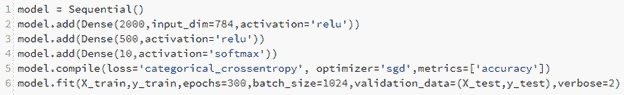

注意，当网络很深，具有两个隐藏层而不是一个时，300 个时期后的准确度是 97.24%，与单个隐藏层网络相比，这是明显的改进。

类似地，当层中隐藏单元的数量增加时，网络学习更复杂的数据表示，当隐藏层的数量增加时，网络也学习复杂的数据表示。


# 对批量变化的影响

如前所述，批量越小，给定神经网络中的权重更新越频繁。这导致在网络上实现一定精度所需的时期数量减少。同时，如果批量太小，网络结构可能会导致模型不稳定。

让我们比较一下先前构建的网络，在一个场景中批量较小，在下一个场景中批量较大:

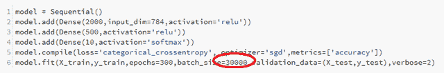

请注意，在前面的场景中，批量非常大，在 300 个时期结束时，测试数据集的准确率仅为 89.91%。

其原因是批量大小为 1，024 的网络比批量大小为 30，000 的网络学习权重的速度要快得多，因为批量越小，权重更新的次数就越多。

在下一个场景中，我们将把批处理大小减少到一个非常小的数字，以查看对网络精度的影响:

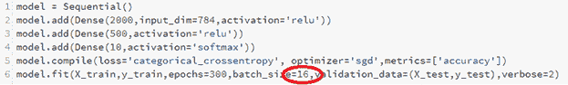

请注意，虽然精确度在 10 个时期内迅速提高到 97.77%，但产生结果需要很长时间，因为每个时期的重量更新次数很高。这导致更多的计算，从而有更多的时间来执行。


# 在 TensorFlow 中实现神经网络

在前面的章节中，我们已经了解了神经网络如何工作，以及如何在 Keras 中构建神经网络模型。在本节中，我们将致力于在 TensorFlow 中构建一个神经网络模型。有两种方法可以在 TensorFlow 中建立模型:

*   使用预制估算器
*   定义自定义评估员


# 使用预制估算器

预制估计器类似于 scikit-learn 等软件包中提供的方法，其中指定了输入特征和输出标签，以及各种超参数。然后，方法可以优化求解损失函数，该损失函数被预定义为默认值，但是可以通过在参数中传递不同的函数来改变。

让我们探索如何在代码中构建训练和测试数据集:

1.  导入相关包:


2.  导入数据集。在本练习中，我们将使用`MNIST`数据集:

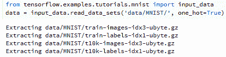

图像和标签的形状如下:

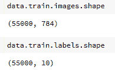

premade 函数对标签值起作用，而不是对一次性编码版本起作用。让我们将独热编码标签转换为值，如下所示:

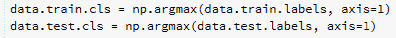

让我们了解一下数据点是什么样子的:

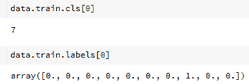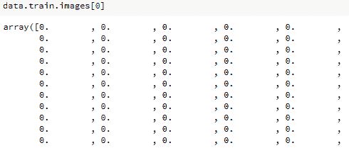

3.  将数据集输入到消耗自变量(`x`)和因变量(`y`)的函数中:

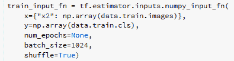

注意，我们将自变量命名为`x2`，将因变量命名为`y`。

另外，请注意，我们已经传递了构成自变量和因变量的数组。

`batch_size`表示计算损失函数所消耗的训练样本的数量，`num_epochs = None`表示稍后将提供要运行的时期的数量。

`train_input_fn`返回特征和标签，如下所示:

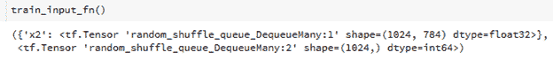

同样，我们通过了测试数据集:

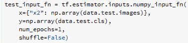

请注意，在测试数据集的情况下，`num_epochs = 1`因为一旦从训练中导出模型权重，我们只让它通过测试数据集的前馈。

一个数据集可能包含多个列，因此让我们指定要素列及其类型，如下所示:

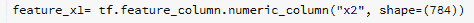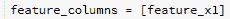

如果有多列，我们将指定一个列表中的所有列，如下所示:

`feature_columns = [feature_x1, feature_x2]`

其中`feature_x1`是一个特征，`feature_x2`是另一个特征。

现在，我们将指定隐藏层的数量以及每层中的隐藏单元:

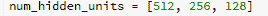

注意，通过以前述方式指定隐藏单元的数量，我们指定了三个隐藏层，其中第一个隐藏层具有 **512** 个单元，第二个隐藏层具有 **256** 个单元，最后一个隐藏层具有 **128** 个单元。

现在我们已经指定了特征和隐藏层，让我们指定神经网络的架构，如下所示:

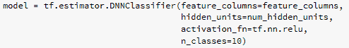

现在我们已经指定了模型架构，我们可以继续训练模型了。如果您想进一步更改功能中可用的超参数，您可以使用`help`功能查看可用的超参数控制杆，如下所示:

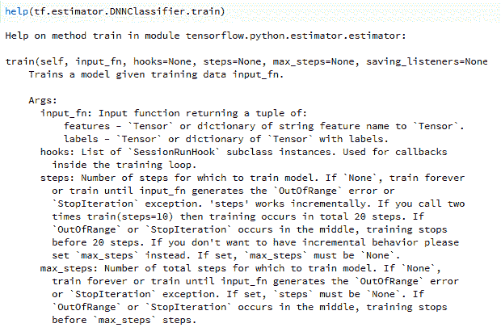

下面的代码总共运行神经网络模型 2，000 个时期:

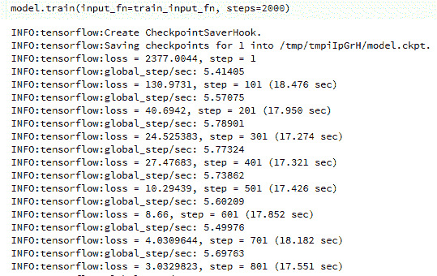

现在我们的模型已经运行，让我们评估测试数据集的准确性，如下所示:

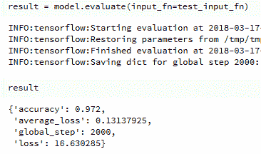

我们可以看到，该模型在测试数据集上的准确率为 97.2%。

到目前为止，我们一直在实施一个模型使用预制估计；在下一节中，我们将研究如何在没有预先估计的情况下定义模型。


# 创建自定义评估员

预制估算器限制了TensorFlow的全部潜力；例如，在不同的层之后，我们将不能有不同的下降值。在这方面，让我们继续创建我们自己的函数，如下所示:

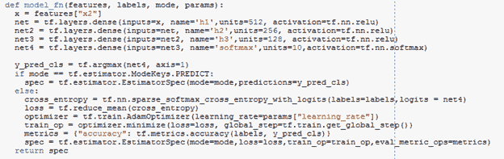

让我们详细研究一下前面代码片段的每一部分:

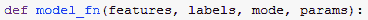

该函数将特征(自变量)和标签(因变量)作为输入。`mode`表示我们是否要训练、预测或评估给定的数据。

`params`为我们提供了提供参数信息的功能；例如，学习率:

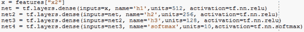

前面的代码片段类似于我们在 Keras 中定义模型架构的方式，其中我们指定了输入、隐藏层激活和隐藏层中的单元数量:


如果我们的模式是预测类，我们就不必训练模型，而只需通过预测的类，因此在这种情况下，估计器 spec 只需计算`y_pred_cls`值，因此代码如下:

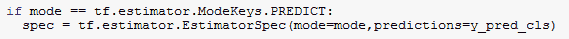

如果模式是训练或测试模型，我们将必须计算损失，因此需要以下代码:


在前面的代码中，第一行用于定义交叉熵计算。第二行是所有行的交叉熵的平均值。

`optimizer`指定我们感兴趣的优化器和学习率。`train_op`指定我们对最小化损失感兴趣，并且`global_step`参数保持模型当前所处的步骤(时期)的计数。`metrics`指定我们有兴趣计算的指标，最终计算的`spec`将是我们已经定义的所有前述参数的组合。

一旦定义了模型架构和需要返回的评估者规范，我们就定义如下的参数和模式:

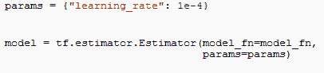

从前面的代码中，该函数了解需要更改的参数以及需要处理的模型架构(`model_fn`):


我们通过指定一定数量的时期(在本例中为`2000`)来运行模型(在本例中为`train`)。

运行模型后，我们在测试数据集上评估模型的准确性，如下所示:


# 摘要

在这一章中，我们学习了在 Google Cloud 上设置 Datalab 来执行神经网络。我们还学习了神经网络的结构，以及各种参数(如深度、隐藏单元的数量、激活函数、优化器、批量大小和时期数量)如何影响模型的准确性。我们还看到了如何在 Keras 和 TensorFlow 中实现神经网络。涵盖了使用预制估值器和在 TensorFlow 中创建自定义估值器等主题。