# 使用 TensorBoard 评估结果

在前一章中，我们了解了神经网络如何工作，神经网络中的各种超参数是什么，以及如何进一步调整它们以提高我们模型的准确性。

谷歌提供 TensorBoard，这是模型训练日志的可视化。在这一章中，我们将展示如何为 TensorFlow 和 Keras 使用 TensorBoard。我们解释 TensorBoard 生成的可视化，以了解我们的模型的性能，并了解 TensorBoard 中可以帮助我们更好地可视化数据集的其他功能。

如前一章所述，Keras 作为一个框架是 TensorFlow 或 Theano 之上的一个包装器。您将使用 TensorFlow 进行的计算，例如训练大规模深度神经网络，可能会非常复杂和令人困惑。为了更容易理解、调试和优化 TensorFlow 程序，TensorFlow 的创建者包括了一套名为 TensorBoard 的可视化工具。

您可以使用 TensorBoard 来可视化您的 TensorFlow 图形，绘制有关图形执行的量化指标，还可以查看其他数据，如作为输入给出的图像。TensorBoard 完全配置后，看起来像这样:

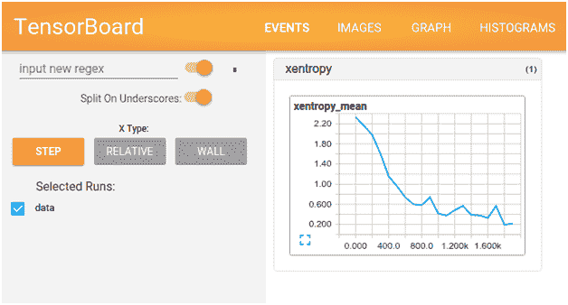

从这个屏幕截图中，您可以注意到，该图表显示了平均交叉熵误差随着时期数量的增加而减少。在本章的后面几节中，我们将讨论以下内容:

*   安装张量板
*   TensorBoard 捕获的各种汇总操作概述
*   调试代码的方法


# 设置张量板

在前一章中，我们了解了如何设置 Datalab。在 Datalab 中安装 TensorBoard 非常简单，只需指定以下代码:

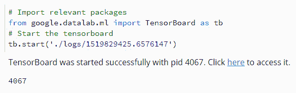

注意，我们不需要为 TensorBoard 做任何单独的安装，它是在`google.datalab.ml`包中预先构建的。

一旦导入了包，我们需要通过指定日志的位置来启动 TensorBoard，这些日志包含模型拟合过程编写的摘要。

`tb.start`方法的工作原理如下:

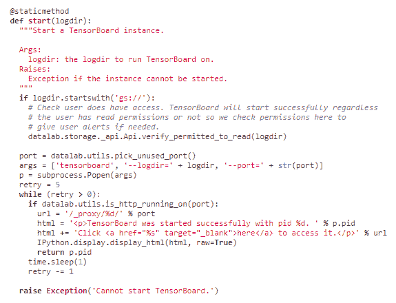

注意，在第一步中，它检查用户是否被允许执行计算。接下来，它选择一个未使用的端口来打开 TensorBoard，最后它启动 TensorBoard 并打印打开 TensorBoard 的链接。

我们将在下一节学习更多关于写日志的内容。


# 汇总操作概述

摘要提供了一种导出关于模型的精简信息的方法，然后可以在 TensorBoard 等工具中访问这些信息。

一些常用的汇总函数有:

*   `scalar`
*   `histogram`
*   `audio`
*   `image`
*   `merge`
*   `merge_all`

`scalar` summary 操作返回一个标量，即某个度量在越来越多的时期内的值。

一个`histogram`汇总操作返回各种值的直方图——每一层的潜在权重和偏差。

`image`和`audio`汇总操作返回图像和音频，分别可以在 TensorBoard 中可视化和播放。

一个`merge`操作返回输入汇总的所有值的并集，而`merge_all`返回模型规范中包含的所有汇总的并集。

这里讨论的一些概要的可视化将在下一节提供。


# 调试代码的方法

为了理解 TensorBoard 是如何帮助我们的，让我们按如下方式初始化一个模型结构，一个注定无法工作的结构:

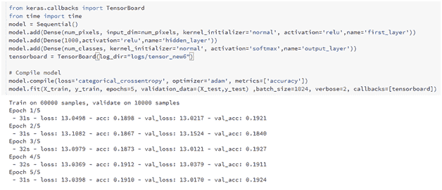

注意，在这个代码片段中，验证准确性只有 19%左右。

验证准确度如此之低的原因是输入数据集没有缩放，我们在未缩放的数据集上执行 ReLU 激活。

注意，在前面的代码中，我们将模型运行的日志存储在目录`logs/tensor_new6`中(子目录可以命名为任何东西)。

一旦日志存储在这个位置，我们就按如下方式启动 TensorBoard:

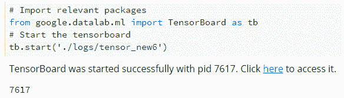

前面的代码启动 TensorBoard，如下所示:

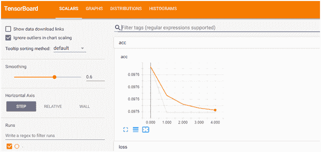

注意，默认情况下，输出给出标量的度量，即训练和测试数据集的精度和损失值。

使用`Filter`标签中的正则表达式`.*`,可以将输出显示为彼此相邻，如下所示:

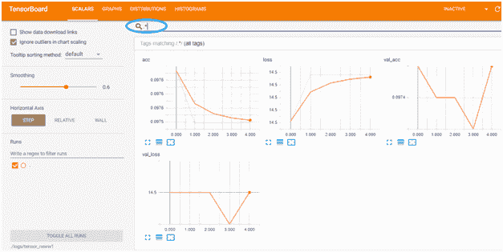

请注意，此屏幕截图中的前两个图表表示训练数据集的准确性和损失，而接下来的两个图表表示验证数据集的准确性和损失。

当我们查看不同层的权重和偏差直方图时，我们了解到权重和偏差不会在不同时期发生变化:

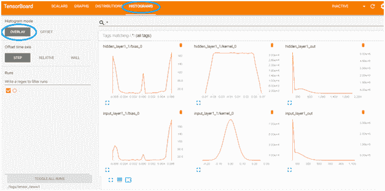

这表明网络架构中没有学习。

当我们在另一个选项卡中查看不同时期的权重和偏差分布时，也可以注意到同样的情况:

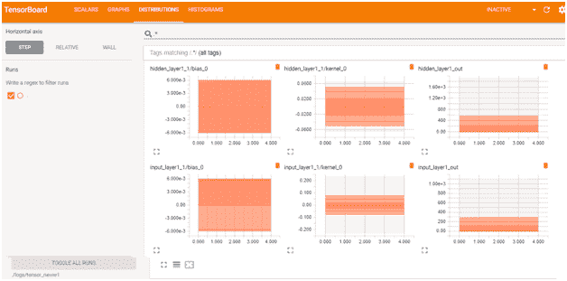

从这张截图可以得出为什么模型的准确率这么低；这是因为模型不能更新权重。

现在，通过单击 GRAPHS 选项卡，让我们看看模型是否被正确初始化:

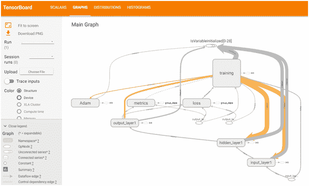

您应该注意到，图中的训练块与其他块相连。这是因为，为了计算梯度，需要连接到图中的每个变量(因为每个变量都包含需要调整的权重)。

现在，让我们从图表中移除训练块。这可以通过右键单击培训模块来完成，如下所示:

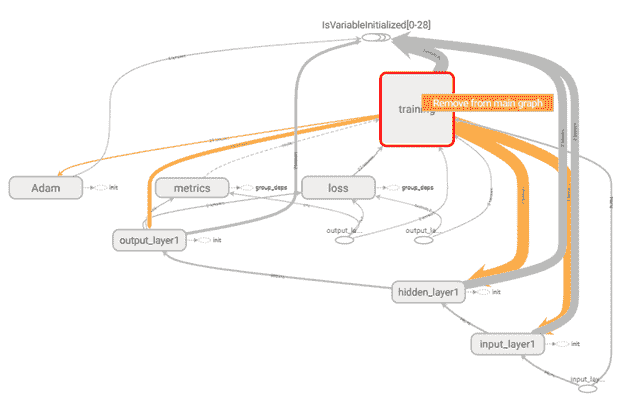

移除训练块后的结果图如下:

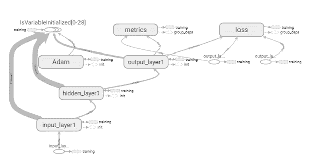

请注意，输入层连接到隐藏层，隐藏层又连接到输出层，从输出层计算度量和损耗。让我们通过双击各个块来探索连接，如下所示:

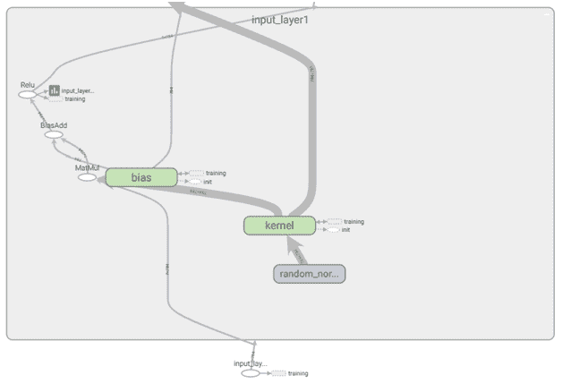

放大这些连接有助于我们理解不同区块的形状:


输入层的维数为(784 ),因为可以有任意数量的输入样本，但每个样本都是 784 维的。类似地，核(权重矩阵)在维度上是 784×784，偏差将具有 784 个初始化值，等等。

请注意，在上图中，我们获取输入层中的值，并使用使用`random_normal`初始化进行初始化的内核执行矩阵乘法。还要注意`random_normal`初始化没有连接到训练块，而内核块连接到训练块。

让我们看看输出层是否按照预期连接到所有相关模块。鉴于图形看起来非常复杂，我们可以使用 TensorBoard 中提供的另一个功能:跟踪输入。跟踪输入有助于仅突出显示那些与任何感兴趣的块相连接的块。通过选择感兴趣的块并切换左侧窗格中的开关来激活它，如下所示:

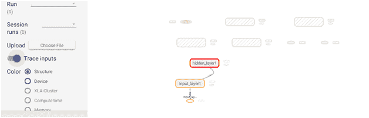

现在所有的连接看起来都很好，但是渐变仍然没有更新；让我们将激活函数更改为 sigmoid，然后检查权重直方图:

我们如下构建具有 sigmoid 激活的神经网络:

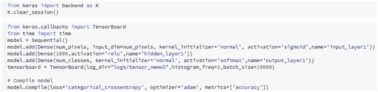

一旦神经网络结构被定义和编译，让我们如下拟合模型:

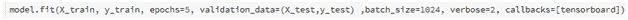

为了打开 TensorBoard，我们将执行以下代码:

```
from google.datalab.ml import TensorBoard as tb
tb.start('./logs/tensor_neww3')
```

然后，我们将收到以下输出:


与此同时，我们应该注意到准确性和损失指标有了很大的提高:

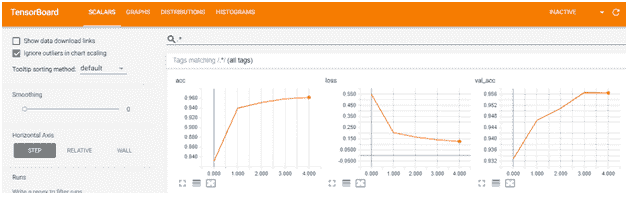

还可以通过在 TensorBoard 函数中指定 write_grads=True 来可视化梯度直方图。输出将如下所示:

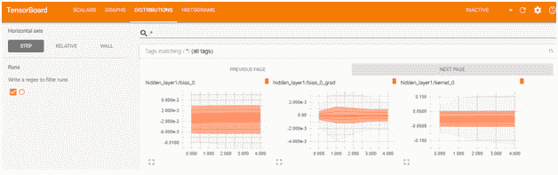

# 从 TensorFlow 设置 TensorBoard

在前一章中，我们已经看到在 TensorFlow 中有两种定义模型的方法:

*   预制估值器
*   构建自定义评估器

在下面的代码中，我们将考虑一个额外的代码片段，它将使我们能够可视化各种汇总操作:

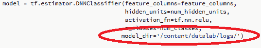

注意，我们只需要在预制的估算器中指定`model_dir`来存储 TensorFlow 操作生成的各种日志文件。

然后，TensorBoard 可以通过参考模型目录进行初始化，如下所示:

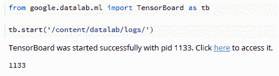

前面的代码会产生一个 TensorBoard 可视化，其中内置了所有的摘要。


# 来自自定义评估者的摘要

在上一节中，我们研究了如何从 TensorBoard 中的预制估计量中获取预定义的汇总。在本节中，我们将了解如何在自定义估算器中获取汇总，以便在 TensorBoard 中可视化。

需要捕获的汇总操作应该在自定义估计器函数中指定，如下所示:

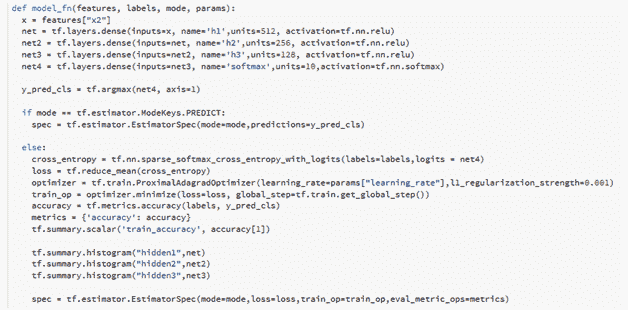

请注意，模型函数仍然非常类似于我们在上一节学习自定义估计量时定义的函数；但是，添加了几行将摘要写入日志文件的代码。

`tf.summary.scalar`添加精度指标。类似地，我们可能想要在日志中添加损失(这是另一个标量);但是，默认情况下会添加它(注意，当我们训练模型时会显示 loss)。

`tf.summary.histogram`给出网络内的权重分布。

一旦模型被训练，我们应该注意到张量板输出中的标量和直方图/分布。训练模型和启动 TensorBoard 的代码如下:

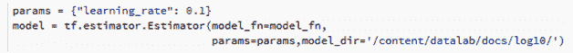

在前面的代码片段中，我们已经指定了模型函数和参数以及日志文件将被写入的目录:

```
model.train(input_fn=train_input_fn, steps=1000)
```

上面的代码片段为 1，000 批 1，024(批大小)数据点的模型定型:

```
from google.datalab.ml import TensorBoard as tb
tb.start('/content/datalab/docs/log10/')
```

这段代码片段通过使用写在给定文件夹中的日志文件来启动 TensorBoard。


# 摘要

在这一章中，我们从 Keras 和 TensorFlow 了解了在 TensorBoard 中可视化神经网络模型。我们还考虑了如何在预制估计器和自定义估计器中可视化模型、权重分布和损失/准确性度量。以及神经网络中的各种度量。