# 十四、使用 LSTMs 的时间序列

在许多涉及现实生活多个领域的情况下，需要计划未来的行动。**预测**是高效计划的重要工具。此外，这一工具使决策者不易受到意外事件的影响，因为它要求对其所处环境的知识采取更科学的方法。通常，对未来行动的规划来自于对长期积累的数据的分析，以提取信息来描述所观察到的现象。

按时间顺序记录事件产生了一种新的行为，确切地说，这种行为被称为时间序列。时间序列是指在连续的瞬间或时间间隔内对某一现象进行的一系列观察。通常，即使不是必须的，它们也是等间距或等长的。时间序列预测要求神经网络对数据序列有某种记忆。被称为**长短期记忆** ( **LSTM** )网络的特定架构非常适合时间序列分析。在这一章中，我们将展示如何在 GCD 上使用 Keras 创建和训练我们自己的 LSTMs，并将其应用于预测金融时间序列。我们会发现最常用的建模方法:**自回归** ( **AR** )，**移动平均** ( **MA** )，**自回归移动平均** ( **ARMA** )，以及**自回归综合移动平均** ( **ARIMA** )。

本章涵盖的主题有:

*   时间序列的经典方法
*   时间序列分解
*   时间序列模型
*   用于时间序列分析的 LSTM

在本章的结尾，我们将能够处理关于时间序列的问题。我们将知道如何识别时间序列的不同组成部分、趋势季节性和残差，以及消除季节性以使预测更容易理解。最后，我们将通过一个实例来了解如何实现循环 LSTM 网络。


# 时间序列简介

时间序列由在连续瞬间或时间间隔内对一种现象进行的一系列观察组成，这些连续瞬间或时间间隔通常(即使不是必须的)间隔均匀或长度相同。大宗商品价格趋势、股市指数、BTP/德国国债息差和失业率只是时间序列的几个例子。

与经典统计学中发生的情况相反，在经典统计学中，假设一个独立的观察值来自单个随机变量，在时间序列中，假设有 n 个观察值来自同样多的相关随机变量。因此，时间序列的推断被配置为试图将时间序列带回其生成过程的过程。

时间序列有两种类型:

*   **确定性**:如果变量的值可以在先前值的基础上准确确定
*   **随机**:如果变量的值只能部分基于以前的值来确定

大多数时间序列都是随机的，因此不可能做出准确无误的预测。一般认为，观察到的时间序列是这两个部分合成的结果。这两个序列不是单独可观察的，而是必须在样本的基础上确定的。

我们将该系列表示为这两个贡献的总和:

*Y[t] = f(t) + w(t)*

根据时间序列的经典方法，假设存在现象的时间演化规律，用 *f(t)* 表示。假设随机分量 *w(t)* 代表一组环境，每一个都是可忽略的实体，在 *Y [t]* 中我们不想或不能考虑。

于是，*Y[t]的剩余部分，没有被 *f(t)* 解释，就被归算到案例中，同化为一组偶然错误。这相当于假设随机分量 *w(t)* 是由白噪声过程产生的，即由一系列独立同分布的均值为零、方差恒定的随机变量产生的。总之，在经典方法中，注意力集中在 *f(t)* *，*被 *w(t)* 视为具有不相关组件的过程，因此可以忽略不计。*

用 t = 1 表示时间。T ，我们会注明这个顺序*y[t]T5；时间是决定事件顺序的不可忽视的参数，所以我们也需要知道观察在时间维度上的位置。一般用于在笛卡儿图上用连续线图表示一对值 *(t，y [t] )* 就好像连续检测到现象一样。这个图被称为**时间序列图**。在下图中，我们看到了从 1871 年到 1970 年阿斯旺尼罗河流量的时间序列图:*

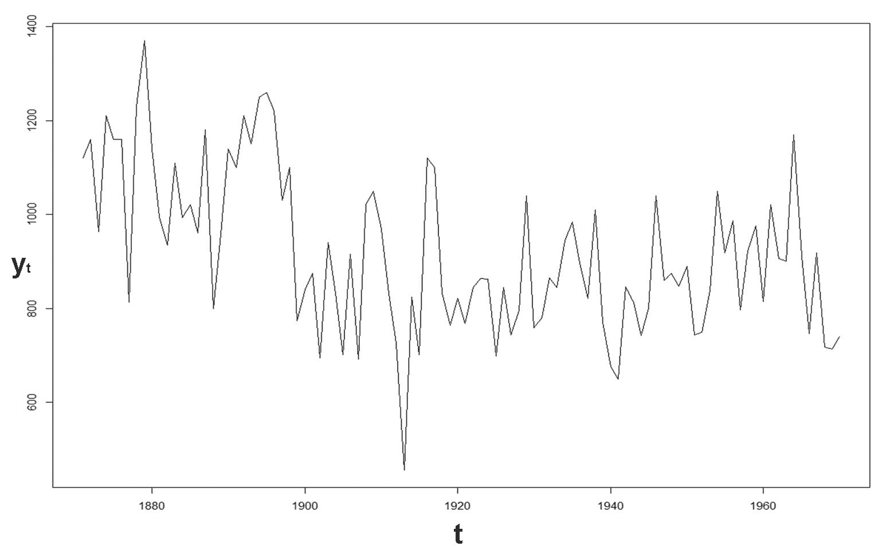

时间序列图立即揭示了趋势或定期振荡，以及其他系统的趋势随着时间的推移。上图显示了长期内系统下降趋势的年度数据。特别是，它具有锯齿形图案；由于数据是月度的，所以有一种现象叫做**季节性**。可以注意到，高峰总是出现在预计会下雨的月份。

时间序列的单变量分析旨在解释产生该序列的动态机制，并预测该现象的未来实现。在这些操作中，被利用的信息仅与夫妇*(t；Y [t] )* ，其中 *t = 1，…，T* 。最根本的一点是，过去和现在包含了相关信息，可以预测现象的未来演变。

可以认为单变量分析限制性太大；我们通常有与要预测的现象相关的信息，这些信息应该被适当地合并，以便改进修正模型的性能。尽管如此，它是一个有用的基准，允许验证更复杂的替代方案。

在时间序列图中，可以根据时间确定四种类型的模式:

*   **水平模式**:在这种情况下，数列围绕一个常数值(数列平均值)振荡。这个系列叫做**平稳**于**平均**。这是在质量控制中发生的典型情况，此时过程相对于平均值保持在控制之下。
*   **季节性模式**:序列受季节性因素影响时存在(例如，月度、半年度、季度等)。冰淇淋、软饮料、电力消耗等产品受季节现象影响。受季节性影响的序列也被称为**周期序列**，因为季节性周期在一个固定的周期内重复。在年度数据中，不存在季节性。
*   **周期模式**:当数列有非固定周期的增减时，出现这种趋势。这是周期性波动和季节性波动的主要区别。此外，周期性振荡的幅度通常比季节性振荡的幅度大。在经济序列中，周期模式是由推测现象引起的经济扩张和收缩决定的。
*   **趋势或潜在趋势**:以上升或下降的长期趋势为特征。世界常住人口系列是增长趋势的一个例子；另一方面，月啤酒销售量系列没有显示出任何趋势。它有一个水平的背景图案。

许多系列强调这些模式的组合。正是这种复杂性使得预测操作非常有趣。事实上，预测方法必须能够识别序列的各种组成部分，以便在未来重现它们，假设过去的模式继续以其进化特征在未来重演。

时间序列的经典方法是基于将序列的确定性部分分解成一组信号分量(表达序列的结构信息),而忽略噪声部分。在实践中，我们将尝试识别我们之前在时间序列趋势中列出的一些模式。下图显示了一个时间序列，其中包含一些已确定的组件:

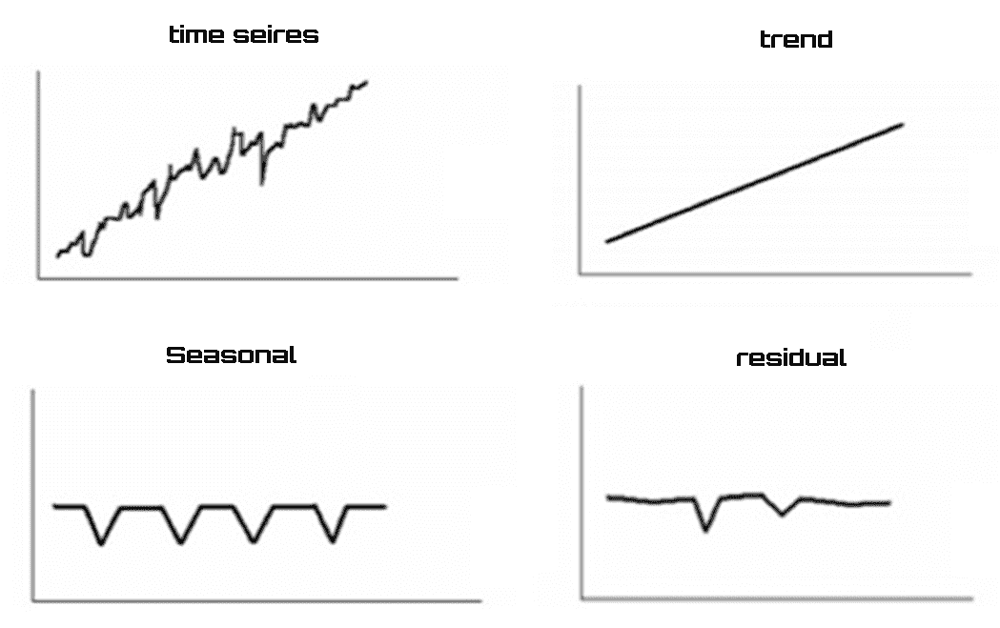

在上图中，我们确定的组件是:

*   **趋势**:是所考虑现象的潜在趋势，指的是很长一段时间。
*   **季节性**:由一年中的现象变化组成。由于气候和社会因素的影响，它们往往在同一时期以类似的方式重复出现(例如，月、季度等)。
*   **残差**:在时间序列模型中，被观察变量和不同组件之间从来没有完美的关系。偶然因素考虑到了这一点以及经济主体、社会等不可预测的行为。

最后，我们可以说，通过采用这种方法，时间序列可以被视为刚刚分析的三个组成部分的总和(加法)。


# 时间序列的经典方法

到目前为止，我们已经根据该主题的经典方法处理了时间序列。从这个角度来看，试图模拟这一现象的经典模型有两种类型:

*   **合成模型**:基本组件已知，通过假设某种形式的聚合，得到结果序列
*   **分解模型**:从一个观察到的序列中假设存在一些我们想要确定其特征的基本趋势

分解模型是实践中最常用的，因此，我们将详细分析它们。

时间序列的组成部分可以根据不同类型的方法进行汇总:

*   **加法**:*Y(t)=τ(t)+C(t)+S(t)+r(t)*
*   **乘法**:*Y(t)=τ(t)* C(t)* S(t)* r(t)*
*   **混合法**:*Y(t)=τ(t)* C(t)+S(t)* r(t)*

在这些公式中，因子定义如下:

*   *Y(t)* 表示时间序列
*   *τ(t)* 代表趋势分量
*   *C(t)* 表示环状组件
*   *S(t)* 代表季节性组件
*   *r(t)* 代表剩余分量

乘法模型可以通过对该系列的分量进行对数变换而追溯到加法模型:

*Y(t) = τ(t) * C(t) * S(t) * r(t)*

通过对所有因子应用对数函数，该公式变为:

*lnY(t)= lnτ(t)+lnC(t)+lnS(t)+lnr(t)*


# 趋势分量的估计

趋势分量的估计可以根据线性/非线性特性以两种不同的模式进行。

如果序列趋势是线性的，或者通过对数变换在参数上是可线性化的，那么这些趋势可以通过从线性回归导出的程序来估计。我们可以假设一个多项式趋势，可以用下面的等式来表示:

*(t)=α[【0】]+α[[[【2】][【2】]+-我...。+α[q]t[q]+t]]*

在这个公式中， *q* 表示多项式的次数。

根据由 *q* 假定的值，可以表示以下情况:

| **问** | **案例** |
| *0* | 获得了恒定的趋势 |
| *1* | 我们得到一个线性趋势 |
| *2* | 我们得到一个抛物线趋势 |

相反，非线性趋势的存在使得很难(如果不是不可能的话)识别用来表达趋势分量的已知函数形式 *f(t)* 。

在这些情况下，使用毫安仪器。MA 是从数据序列的开始到结束移动到每个新迭代(在任何时间 *t* )的算术平均值(简单或加权)。

假设我们有 *n* 个数据项:

*a1，a2，a3，...，一个 ^((n-1)) ，一个 ^n*

采用以下程序:

1.  首先，我们计算前三个数据的平均值，并用平均值代替中心数据
2.  然后，我们对后三个数据重复该过程
3.  当没有更多的数据可用时，该过程结束

在所考虑的情况下，MA 仅由三个数据组成。移动授权订单可以扩展到 5、7、9 等等。为了使 MA 相对于可用数据居中，顺序必须是奇数。


# 估计季节性组件

研究历史序列的季节性有以下目的:

*   简单估计季节性因素
*   一旦它被估计出来，就把它从一般的课程中除去

如果你必须比较几个具有不同季节性的时间序列，唯一的方法就是对它们进行季节性调整。

有几种方法可以估计季节性因素。其中之一是使用二分辅助变量(虚拟变量)的回归模型。

假设存在一个没有趋势分量的加性模型:

*Y(t) = S(t) + r(t)*

假设我们已经按月测量了这个系列。虚拟变量可以用以下方式定义:

*   *d [j] (t)* : 1 如果观测值 *t* 相对于一年中的 *j ^(th)* 月
*   *d [j] (t)* : 0 否则

一旦创建了周期性虚拟变量，就可以使用以下回归模型来估计季节性组件:

*和(t)=β[【1】]【d】[【1】]+β[【2】]【2】+-我...。+β[n]d[n]+ε(t)*

模型剩余的 *ε(t)* 部分代表序列中无法用季节性解释的部分。如果趋势组件出现在序列中，它将与 *ε(t)* 精确重合。


# 时间序列模型

在前面的章节中，我们探讨了时间序列背后的基础知识。为了根据过去发生的事情对未来事件进行正确的预测，有必要构建一个合适的数值模拟模型。选择一个合适的模型是非常重要的，因为它反映了该系列的基本结构。在实践中，有两种类型的模型可用:线性或非线性(取决于序列的当前值是过去观察值的线性函数还是非线性函数)。

以下是预测时间序列数据最广泛使用的模型:

*   阿肯色州
*   马萨诸塞州
*   ARMA
*   ARIMA


# 自回归模型

AR 模型是解决时间序列预测问题的一个非常有用的工具。通常可以观察到一个系列的连续值之间有很强的相关性。在这种情况下，当我们考虑相邻值时，我们称之为一阶自相关，如果我们参考两个周期之后的序列值之间的关系，我们称之为二阶自相关，如果所考虑的值之间有 *p* 个周期，我们称之为*p^(th)阶自相关。AR 模型允许利用这些结合来获得对序列的未来行为的有用预测。*

AR 是一种线性预测建模技术。该模型尝试使用 AR 参数作为系数，基于假定的先前值来预测时间序列。用于预测的样本数量决定了模型的阶数( *p* )。顾名思义，它是变量对自身的回归；也就是说，变量的过去值的线性组合用于预测未来值。 *p* 订单的 AR 模型定义为:

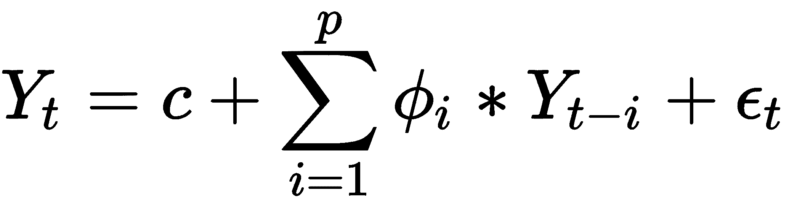

在前面的公式中，术语定义如下:

*   *Y[t]是时间段 *t* 的实际值*
*   c 是一个常数
*   *ϕ [i] (i = 1，2，...，p)* 是模型参数
*   *Y[t-I]是时间段 *t-i* 的过去值*
*   *ε[t]为时间段 *t* 的随机误差(白噪声)*

常数项可能被省略；这样做是为了使模型尽可能简单。


# 移动平均模型

MA 模型规定输出变量线性依赖于随机项的过去和当前过去值(不完全可预测)。MA 模型不应与我们在前面章节中看到的 MA 混淆。这是一个本质上不同的概念，尽管有些相似之处是显而易见的。与 AR 模型不同，完成的 MA 模型总是静止的。

正如模型 AR ( *p* )相对于序列的过去值进行回归，MA ( *q* )模型使用过去的误差作为解释变量。

*q* 订单的 MA 模型定义为:

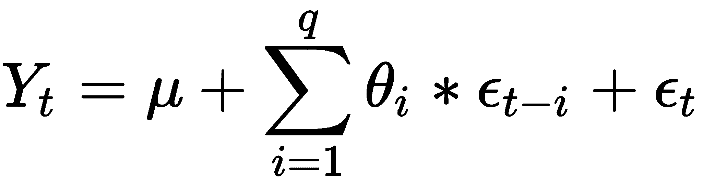

在前面的公式中，术语定义如下:

*   *Y[t]是时间段 *t* 的实际值*
*   *μ* 是系列的平均值
*   *θ [i] (i = 1，2...，q)* 是模型参数
*   *ε[t-I]是时间段 *t-i* 过去的随机误差*
*   *ε[t]为时间段 *t* 的随机误差(白噪声)*

MA 模型本质上是应用于白噪声的有限脉冲响应滤波器，并对其进行了一些额外的解释。


# 自回归移动平均模型

ARMA 是一种线性数学模型，它根据以前的输入和输出值提供即时的输出值。该系统被视为一个实体，它时刻接收一个输入值(input)并产生一个输出(output)，该输出是根据内部参数计算的，而内部参数又按照线性规律变化。因此，每个内部参数在每个时刻都等于前一时刻的所有内部参数和输入值的线性组合。反过来，输出值将是内部参数的线性组合，在极少数情况下，也是输入参数的线性组合。

更简单地说，ARMA 可以被视为 AR 和 MA 模型的有效组合，以形成一类通用而有用的时间序列模型。

该模型通常被定义为 ARMA 模型 *(p，q)* ，其中 *p* 是 AR 部分的阶数， *q* 是 MA 部分的阶数。ARMA 模型由以下公式定义:

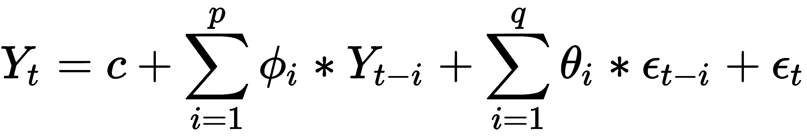

这些术语定义如下:

*   *Y[t]是时间段 *t* 的实际值*
*   c 也是一个常数
*   *ϕ [i] (i = 1，2，...，p)* 是 AR 模型参数
*   *Y[t-I]是时间段 *t-i* 的过去值*
*   *θ [i] (i = 1，2...，q)* 是 MA 模型的参数
*   *ε[t-I]是时间段 *t-i* 过去的随机误差*
*   *ε[t]为时间段 *t* 的随机误差(白噪声)*

一般来说，一旦已经选择了顺序 *(p，q)* ，ARMA 模型 *(p，q)* 的参数就可以通过例如最大似然估计器来估计。至于 AR 模型，模型阶的选择必须响应对数据的良好适应和要估计的参数数目的节省的对立需求。


# 自回归综合移动平均模型

ARIMA 模型是 ARMA 模型的推广。ARIMA 模型适用于数据显示明显的非平稳趋势的情况。在这些情况下，为了消除非平稳性，初始微分步骤被添加到应用一次或多次的 ARMA 算法(对应于模型的积分部分)。

因此，该算法基本上由三部分组成:

*   AR 部分根据其自身的延迟值(即先前值)确定对感兴趣的进化变量的回归。
*   马那部分。它表明回归误差实际上是误差项的线性组合，这些误差项的值在过去的不同时间同时出现。
*   集成部分；它指示数据值已经被替换为它们的当前值和先前值之间的差(并且该微分过程可能已经执行了不止一次)。

这些功能中的每一个的目的都是使模型以尽可能好的方式适用于数据。

为了用公式表示 ARIMA 模型的代表方程，我们从 ARMA 模型方程开始:


只需将 AR 部分移至等式右侧，即可获得以下等式(小于常数 *c* ):

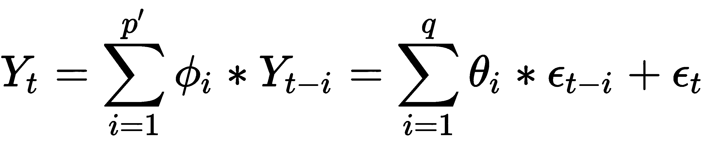

通过引入滞后运算符( *L* )，我们可以将该等式改写如下:

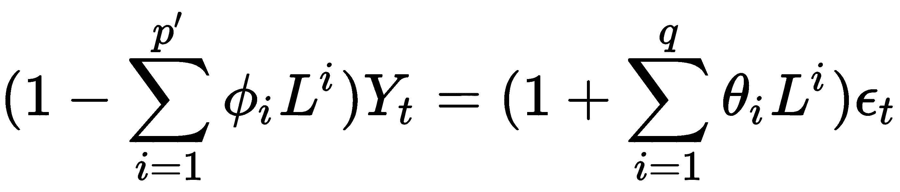

记住:滞后操作符( *L* )对时间序列的一个元素进行操作以产生前一个元素，意思是 *LY [t] = Y [t-1]* 。

假设:

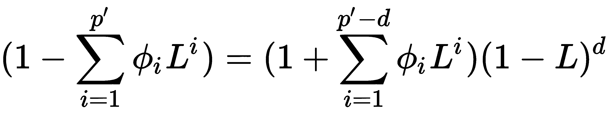

其精确地表达了先前为消除非平稳性而执行的顺序为 *d* 的因子分解过程。基于这个假设和设置 *p = p'-d* ，我们可以写出下面的等式来表示使用滞后多项式的 ARIMA *(p，d，q)* 模型的数学公式:

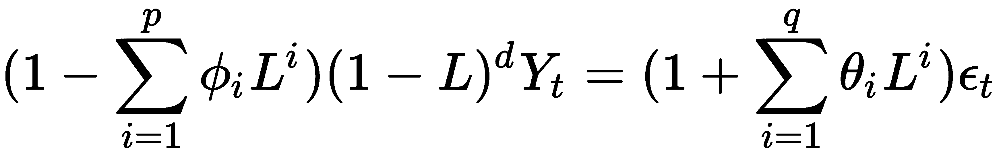

*d* 参数控制微分的级别。一般情况下 *d=1* 就足够了。


# 从时间序列中删除季节性

在经济和金融分析中，通常根据许多指标进行分析，为了能够更清楚地掌握所考虑现象的短期演变，广泛使用以季节调整形式(即扣除季节波动)提供的数据。

在时间序列的动态中，季节性是每年定期重复的组件，在连续几年的同一时期(月、季度、半年等)强度的变化或多或少相似；同一年有不同的强度。这方面的典型例子是，许多公司在假期关闭后，8 月份的工业生产下降，12 月份的零售额因假期而增加。

季节性波动掩盖了其他利益变动(典型的是周期性波动)，在经济形势分析中经常被认为是一个麻烦。例如，季节性的存在给分析和解释一年中两个连续时期(月份和季度)之间的历史序列中观察到的变化带来了问题，即所谓的**经济变化**。这些通常在很大程度上受季节性波动的影响，而不是受其他原因(如经济周期)的影响。另一方面，后者可以通过计算季节性调整数据的经济变化而得到正确的强调。此外，由于每个时间序列都有特定的季节性特征，使用经季节性调整的数据可以比较不同时间序列的演变，并广泛应用于联合使用不同国家编制的统计数据。


# 分析时间序列数据集

为了了解如何对时间序列执行季节性移除操作，我们将使用月产奶量数据集(每头奶牛的磅数；1962 年 1 月至 1975 年 12 月)。以下是关于该数据集的一些有用信息:

*   **单位**:每头牛的磅数
*   **数据集指标**:一个时间序列中的 168 个数值
*   **时间粒度**:月
*   **时间范围**:1962 年 1 月-1975 年 12 月
*   **来源**:时间序列数据库

**时间序列数据库** ( **TSDL** )是由澳洲莫纳什大学的统计学教授罗布·海曼创建的。

数据可以在名为`milk-production-pounds.csv`的`.csv`文件中获得。首先，让我们看看如何将数据导入 Python，然后如何显示数据以识别可能存在的季节性。首先要做的是导入我们将使用的库:

```
import pandas as pd
import matplotlib.pyplot as plt
```

在第一行中，我们导入了`pandas`库，在第二行中，我们从`matplotlib`库中导入了`pyplot`模块。

`pandas` is an open source, BSD-licensed library providing high-performance, easy-to-use data structures and data analysis tools for the Python programming language. In particular, it offers data structures and operations for manipulating numerical tables and time series.

Matplotlib 是一个 Python 2D 绘图库，它以各种硬拷贝格式和跨平台的交互环境生成出版物质量的图形。Matplotlib 可用于 Python 脚本、Python 和 IPython shell、Jupyter Notebook、web 应用服务器和四个图形用户界面工具包。`matplotlib.pyplot`模块包含允许您快速生成多种图形的功能。现在让我们看看如何在 Python 中导入数据集中包含的数据:

```
data = pd.read_csv('milk-production-pounds.csv',
               parse_dates=True,index_col='DateTime',
               names=['DateTime', 'Milk'], header=None)
```

为了导入数据集，我们使用了`pandas`库的`read_csv`模块。`read_csv`方法将数据加载到一个名为`data`的熊猫数据帧中。要在视频上显示导入的数据帧的前五行，我们可以如下使用`head()`功能:

```
print(data.head())
```

将返回以下结果:

```
DateTime     Milk
1962-01-01   589
1962-02-01   561
1962-03-01   640
1962-04-01   656
1962-05-01   727
```

没有参数的`head()`函数从 DataFrame 中获取前五行数据。现在时间序列在我们的 Python 环境中是可用的；为了预览其中包含的数据，我们可以计算一系列基本的统计数据。为此，我们将以如下方式使用`describe()`函数:

```
print(data.describe())
```

将返回以下结果:

```
 Milk
count  168.000000
mean   754.708333
std    102.204524
min    553.000000
25%    677.750000
50%    761.000000
75%    824.500000
max    969.000000
```

`describe()`函数生成描述性统计数据，这些统计数据总结了数据集分布的集中趋势、离散度和形状，但不包括 NaN 值。它分析数字和对象序列，以及混合数据类型的 DataFrame 列集。根据所提供的内容，输出会有所不同。为了提取进一步的信息，我们可以如下调用函数`info()`:

```
print(data.info())
```

将返回以下结果:

```
<class 'pandas.core.frame.DataFrame'>
DatetimeIndex: 168 entries, 1962-01-01 to 1975-12-01
Data columns (total 1 columns):
Milk    168 non-null int64
dtypes: int64(1)
memory usage: 2.6 KB
None
```

在看了数据集的内容之后，我们将执行一个初步的可视化探索性分析。Pandas 内置了相对广泛的绘图功能，可用于探索性图表——在数据分析中尤其有用。熊猫自带的`.plot()`命令提供了大量的功能:

```
data.plot()
plt.show()
```

`data.plot()`命令使用`matplotlib` / `pylab`绘制数据帧。为了在视频上显示刚刚创建的图形，我们必须使用`plt.show()`功能，如下图所示:


通过对上图的分析，我们可以肯定地认识到牛奶产量正在增长(我们注意到一个积极的趋势)，但也表明了一定的可变性(围绕一条假设的趋势线波动)。随着时间的推移，这种情况几乎一直保持着。


# 识别时间序列中的趋势

如果我们想尝试预测下一个 1 月份的牛奶产量，我们可以按以下方式思考:利用获得的数据，我们可以跟踪趋势线，并将其延长到下一个 1 月份。通过这种方式，我们可以对不久的将来的牛奶产量有一个粗略的估计。

但是追踪趋势线就是追踪回归线。线性回归方法包括精确地识别能够在二维平面中表示点分布的线。很容易想象，如果对应于观察值的点在直线附近，那么选择的模型将能够有效地描述变量之间的联系。理论上，有无限多条线可以近似观察值。实际上，只有一个数学模型可以优化数据的表示。

为了适应线性回归模型，我们开始导入另外两个库:

```
import numpy
from sklearn.linear_model import LinearRegression
```

NumPy 是使用 Python 进行科学计算的基础包。除其他外，它包括:

*   一个强大的 N 维数组对象
*   复杂的(广播)功能
*   集成 C/C++和 FORTRAN 代码的工具
*   有用的线性代数、傅立叶变换和随机数功能

除了其明显的科学用途，NumPy 还可以用作通用数据的高效多维容器。可以定义任意数据类型。这使得 NumPy 可以无缝、快速地与各种数据库集成。

sklearn 是 Python 编程语言的免费软件机器学习库。它具有各种分类、回归和聚类算法，包括支持向量机、随机森林、梯度增强、k-means 和 DBSCAN，旨在与 Python 数值和科学库 NumPy 和 SciPy 互操作。

记住，要导入 Python 初始发行版中没有的库，必须使用`pip` install 命令，后跟库的名称。该命令应该只使用一次，而不是每次运行代码时都使用。

我们开始准备数据:

```
X = [i for i in range(0, len(data))]
X = numpy.reshape(X, (len(X), 1))
y = data.values
```

首先，我们统计了数据；然后我们使用`reshape()`函数给一个数组一个新的形状，而不改变它的数据。最后，我们将时间序列值插入到`y`变量中。现在我们可以建立线性回归模型:

```
LModel = LinearRegression()
```

`LinearRegression()`函数执行普通的最小二乘线性回归。普通最小二乘法是一种优化技术(或回归)，它允许我们找到一个函数，用尽可能接近一组数据的最优曲线(或回归曲线)来表示。特别是，找到的函数必须是使观察数据和代表函数本身的曲线数据之间的距离平方和最小的函数。

给定 n 个点( *x [1]* 、 *y [1]* )、( *x [2]* 、 *y [2]* )，...( *x [n]*

*y=α*x+β*

以下数量最少:

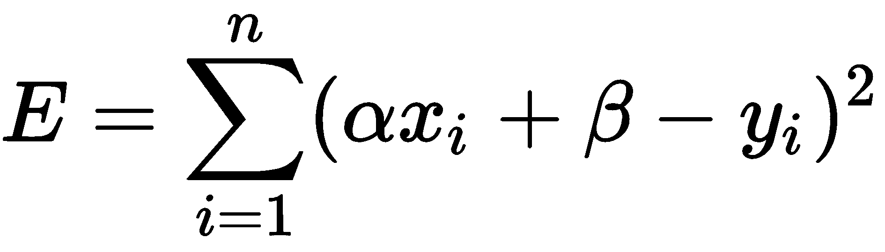

这个量代表每个实验数据( *x [i] ，y [i]* )到直线上相应点 *(x [i] ，αx [i] +β)* 的距离的平方和，如下图所示:

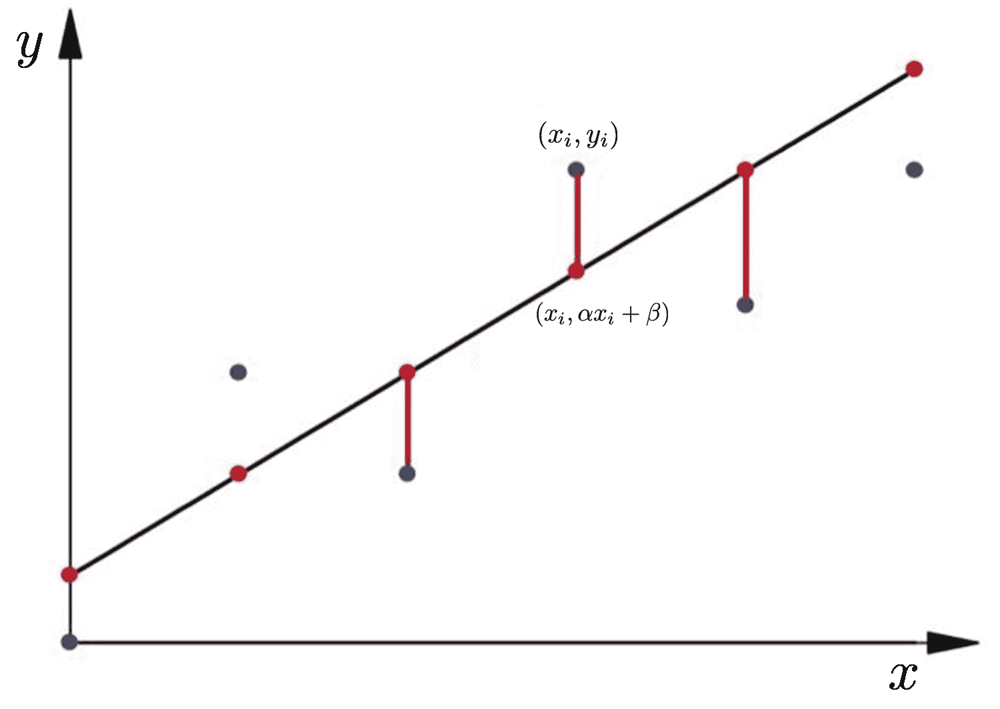

现在，我们必须应用`fit`方法来拟合线性模型:

```
LModel.fit(X, y)
```

线性回归模型基本上可以找到截距和斜率的最佳值，从而得到最符合数据的直线。要查看由线性回归算法为数据集计算的截距和斜率值，请执行以下代码:

```
print(LModel.intercept_,LModel.coef_)
```

将返回以下结果:

```
[613.37496478] [[1.69261519]]
```

首先是拦截；第二个是回归线的系数。现在我们已经训练了我们的算法，是时候做一些预测了。为此，我们将使用全部数据，并查看我们的算法预测百分比分数的准确性。记住，我们的范围是定位时间序列趋势。要对整个数据进行预测，请执行以下代码:

```
trend = LModel.predict(X)
```

是时候想象我们已经取得的成就了:

```
plt.plot(y)
plt.plot(trend)
plt.show()
```

有了这个代码，我们首先追踪了时间序列。所以我们添加了代表数据趋势的回归线，最后我们把整个东西打印出来，如下图所示:

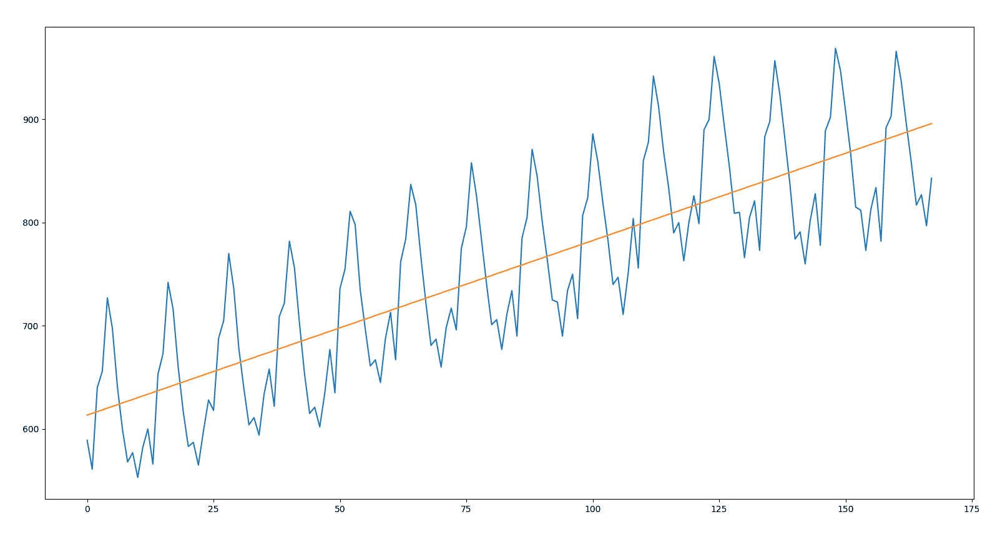

我们记得，这代表了一种长期的单调趋势运动，它突出了现象的结构性演变，原因是以系统的方式作用于同一现象。通过对上图的分析，我们可以注意到:在某些情况下，根据显示时间序列趋势的直线来估计某一精确时期的牛奶产量可能是灾难性的。这是因为季节性高点和低点距离回归线很远。很明显，不可能用这条线来估计牛奶产量。


# 时间序列分解

时间序列的经典分析的基本目的之一是将序列分解成它的组成部分，将它们分离出来以便更好地研究它们。此外，为了能够将随机方法应用于时间序列，几乎总是需要消除趋势和季节性，以获得稳定的过程。正如我们在前面几节中所指出的，时间序列的组成部分通常如下:趋势、季节性、周期和残差。

如前所述，它们可以通过加法方式分解:

*Y(t) = τ(t) + S(t) + r(t)*

它们也可以用乘法分解:

*Y(t) = τ(t) * S(t) * r(t)*

在接下来的小节中，我们将看看如何使用这两种方法来派生这些组件。


# 加色法

为了执行时间序列分解，我们可以使用自动化程序。`stats`模型库在一个名为`seasonal_decompose()`的函数中提供了简单的或者经典的分解方法的实现。加法或乘法都是可行的。

我们开始导入`stats`模型库:

```
from statsmodels.tsa.seasonal import seasonal_decompose
```

特别是，我们导入了`seasonal_decompose`模块来使用 MAs 执行季节分解。我们通过应用加法来执行分解:

```
DecompDataAdd = seasonal_decompose(data, model='additive', freq=1)
```

首先通过对数据应用卷积滤波器来去除季节性组件。每个周期的平滑序列的平均值就是返回的季节性分量。让我们通过已识别组件的可视化来看看发生了什么:

```
DecompDataAdd.plot()
plt.show()
```

下图显示了加法分解的结果:

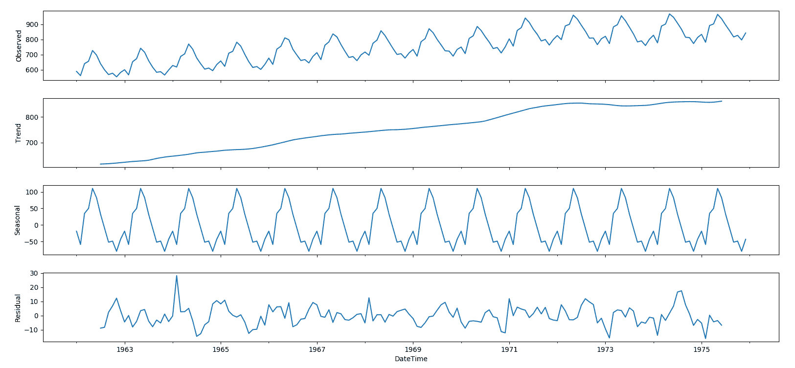

在该图中，时间序列的三个组成部分被清楚地表示出来:趋势、季节和剩余。这些属性包含在方法`seasonal_decompose()`返回的对象中。这意味着我们可以使用该对象的内容从时间序列中去除季节性的影响。让我们看看如何:

```
SeasRemov= data-DecompDataAdd.seasonal
```

通过这行代码，我们简化了由`seasonal_decompose()`方法从数据中返回的季节属性。此时，我们只需想象结果:

```
SeasRemov.plot()
plt.show()
```

下图显示了扣除季节性因素后的每月牛奶产量(从 1962 年 1 月至 1975 年 12 月每头奶牛的磅数):

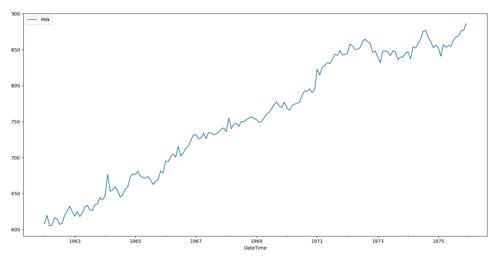

在获得的图表中，季节性因素已经被清楚地去除，而趋势因素则清晰可见。


# 乘法方法

正如我们所说的，`seasonal_decompose()`执行加法和乘法分解。要运行乘法方法，只需键入以下命令:

```
DecompDataMult = seasonal_decompose(data, model='multiplicative')
```

此时，我们只需想象结果:

```
DecompDataMult.plot()
plt.show()
```

下图显示了乘法分解的结果:

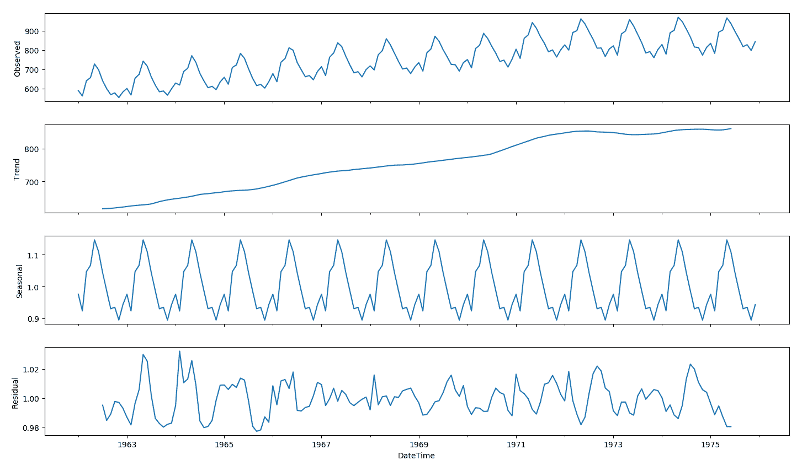

在上图中，我们可以注意到，从时间序列中提取的趋势和季节性信息似乎是合理的。残差显示了一个有趣的变化；在时间序列的前几年和后几年，可以清楚地识别出高度变化的时期。


# 用于时间序列分析的 LSTM

LSTM 是一种特殊的循环神经网络结构，最初由 Hochreiter 和 Schmidhuber 于 1997 年提出。这种类型的神经网络最近在深度学习的背景下被重新发现，因为它没有消失梯度的问题，并且在实践中它提供了优异的结果和性能。

基于 LSTM 的网络是时间序列预测和分类的理想选择，正在取代许多经典的机器学习方法。这是因为 LSTM 网络能够考虑数据之间的长期相关性，在语音识别的情况下，这意味着管理句子中的上下文以提高识别能力。


# 时间序列数据集概述

来自美国国家海洋和大气管理局的科学家从 1965 年到 1980 年测量了莫纳罗亚火山锥顶部附近大气中的二氧化碳。该数据集涵盖了 317.25 至 341.19 **百万分之** ( **ppm** )的二氧化碳浓度，并包含 192 个月记录。以下是关于该数据集的一些有用信息:

*   **单位** : ppm
*   **数据集指标**:一个时间序列中的 192 个事实值
*   **时间粒度**:月
*   **时间范围**:1965 年 1 月-1980 年 12 月

来源:TSDL，由澳大利亚莫纳什大学统计学教授罗布·海曼创建。

数据在名为`co2-ppm-mauna-loa-19651980.csv`的`.csv`文件中可用。首先，让我们看看如何将数据导入 Python，然后如何显示它们以识别可能存在的季节性。首先要做的是导入我们将使用的库:

```
import pandas as pd
import matplotlib.pyplot as plt
```

在第一行中，我们导入了`pandas`，在第二行中，我们从`matplotlib`库中导入了`pyplot`模块。现在让我们看看如何在 Python 中导入数据集中包含的数据:

```
dataset = pd.read_csv(' co2-ppm-mauna-loa-19651980.csv',
               parse_dates=True,index_col='DateTime',
               names=['DateTime', 'CO2'], header=None)
```

为了导入数据集，我们使用了`pandas`库的`read_csv`模块。`read_csv`方法将数据加载到一个名为 dataset 的 Pandas 数据帧中。要在视频上显示导入的数据帧的前五行，我们可以如下使用`head()`功能:

```
print(dataset.head())
```

将返回以下结果:

```
DateTime    CO2
1965-01-01  319.32
1965-02-01  320.36
1965-03-01  320.82
1965-04-01  322.06
1965-05-01  322.17
```

没有参数的`head()`函数从 DataFrame 中获取前五行数据。现在时间序列在我们的 Python 环境中是可用的；为了预览其中包含的数据，我们可以计算一系列基本的统计数据。为此，我们将以如下方式使用`describe()`函数:

```
print(dataset.describe())
```

将返回以下结果:

```
 CO2
count  192.000000
mean   328.463958
std      5.962682
min    317.250000
25%    323.397500
50%    328.295000
75%    333.095000
max    341.190000
```

`describe()`函数生成描述性统计数据，这些统计数据总结了数据集分布的集中趋势、离散度和形状，但不包括 NaN 值。它分析数字和对象序列，以及混合数据类型的 DataFrame 列集。根据所提供的内容，输出会有所不同。为了提取更多的信息，我们可以调用函数`info()`:

```
print(data.info())
```

将返回以下结果:

```
<class 'pandas.core.frame.DataFrame'>
DatetimeIndex: 192 entries, 1965-01-01 to 1980-12-01
Data columns (total 1 columns):
CO2    192 non-null float64
dtypes: float64(1)
memory usage: 3.0 KB
```

在看了数据集的内容之后，我们将执行一个初步的可视化探索性分析。熊猫内置了相对广泛的绘图功能，可用于探索性图表；这在数据分析中特别有用。熊猫自带的`.plot()`命令提供了大量的功能:

```
dataset.plot()
plt.show()
```

`dataset.plot()`命令使用`matplotlib` / `pylab`绘制数据帧。为了在视频上显示刚刚创建的图形，我们必须使用`plt.show()`功能，如下图所示:

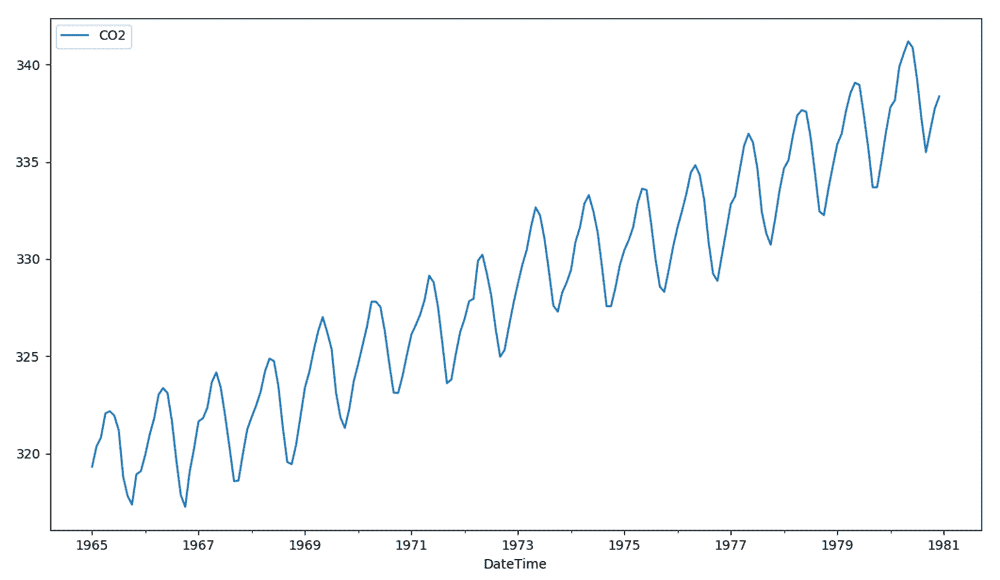

从上图的分析中，我们当然可以认识到大气中的二氧化碳在增长。我们注意到一个积极的趋势。但它也表示某种可变性(围绕假设趋势线的振荡)，这种可变性随着时间的推移几乎保持不变。


# 数据缩放

**数据缩放**是通常在特征选择和分类之前采用的预处理技术。许多基于人工智能的系统使用由许多不同的特征提取算法产生的特征，这些特征具有不同种类的来源。这些特征可以具有不同的动态范围。

此外，在具有大量具有大动态范围的特征的若干数据挖掘应用中，特征缩放可以提高拟合模型的性能。但是，适当选择这些技术是一个重要的问题，因为对输入应用缩放可能会改变数据的结构，从而影响数据挖掘中使用的多变量分析的结果。

为了缩放数据，我们将使用最小-最大归一化(通常称为**特征缩放**)；它对原始数据执行线性变换。该技术获取范围(0，1)内的所有缩放数据。实现这一点的公式是:

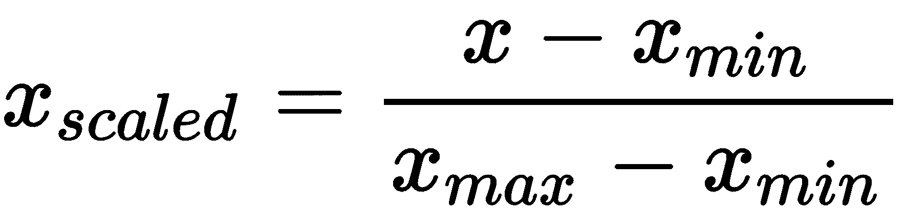

最小-最大归一化保留了原始数据值之间的关系。拥有这个有界范围的代价是，我们最终会得到更小的标准差，这可以抑制异常值的影响。

为了执行最小-最大归一化，我们将使用`sklearn.preprocessing`类的`MinMaxScaler()`模块。该模块通过将每个特征缩放到给定范围来变换特征。该估计器单独缩放和转换每个特征，使得它在训练集的给定范围内，即在零和一之间。以下代码显示了如何将该模块应用于我们的数据:

```
scaler = MinMaxScaler()
dataset = scaler.fit_transform(dataset)
```

首先，我们使用了`MinMaxScaler()`函数来设置归一化间隔(默认为(0，1))。在第二行代码中，我们应用了`fit_transform()`函数；它使转换器适合数据集，并返回数据的转换版本。这个函数特别有用，因为它存储了所使用的转换参数。在做出预测后，当我们必须以初始形式(标准化前)报告数据以与实际数据进行比较时，这些参数将非常有用。


# 数据分割

现在，让我们将数据分为训练模型和测试模型。训练和测试该模型形成了在预测分析中进一步使用该模型进行预测的基础。给定一个包含 192 行数据的数据集，我们将它分成一个合适的比例(比如 70:30)，并分配 134 行用于训练，58 行用于测试。

通常，在基于人工神经网络的算法中，通过随机选择行来进行分割，以减少偏差。对于时间序列数据，值的顺序很重要，因此这种方法不可行。我们可以使用的一个简单方法是将有序数据集分为训练和测试。正如我们所预期的，下面的代码计算分割点指数，并分离训练数据集中的数据，其中 70%的观察值供我们用来训练我们的模型；剩下的 30%用来测试模型:

```
train_len = int(len(dataset) * 0.70)
test_len  = len(dataset) - train_len
train = dataset[0:train_len,:]
test  = dataset[train_len:len(dataset),:]
```

前两行代码设置两组数据的长度。接下来的两行将数据集分成两部分:对于训练集，从第 1 行到第`train_len -1`行；对于测试集，从第`train_len`行到最后一行。为了确认数据的正确分割，我们可以打印两个数据集的长度:

```
print(len(train), len(test))
```

这给出了以下结果:

```
134 58
```

正如我们预期的那样，操作将数据集分成了`134`(训练集)和`58`行(测试集)。


# 构建模型

我们的目标是使用数据集中的数据进行预测。特别是，我们希望根据`.csv`文件中的可用数据来预测空气中二氧化碳的存在。我们需要输入和输出来训练和测试我们的网络。很明显，输入是由数据集中的数据表示的。然后，我们必须构建我们的输出；我们将这样做，假设我们想要相对于在时间 *t* 测量的值预测在时间 *t + 1* 大气中存在的 CO2。因此，我们将拥有:

*输入=数据(t)*

*输出=数据(t + 1)*

我们说过一个循环网络是有记忆的，它是通过固定所谓的**时间步长**来维持的。时间步长与 backprop 在训练期间计算权重更新的梯度时使用的时间后退的步数有关。这样，我们设置*时间步长= 1* 。然后，我们定义一个函数，该函数给出一个数据集，一个时间步长返回输入和输出数据:

```
def dataset_creating(dataset):
   Xdata, Ydata = [], []
   for i in range(len(dataset)-1):
         Xdata.append(dataset[i, 0])
         Ydata.append(dataset[i + 1, 0])
   return numpy.array(Xdata), numpy.array(Ydata)
```

在该函数中，`Xdata=Input= data(t)`是输入变量，`Ydata=output= data(t + 1)`是下一个时间段的预测值。让我们使用此函数来设置我们将在下一阶段(网络建模)使用的训练和测试数据集:

```
trainX, trainY = create_dataset(train)
testX, testY = create_dataset(test)
```

这样，我们就创建了网络训练和测试所需的所有数据。此函数将值数组转换为数据集矩阵。现在，我们必须按照我们打算使用的机器学习算法(LSTM)所要求的形式，准备两个输入数据集(`trainX`和`testX`)。要做到这一点，就要深化这个概念。

在一个经典的前馈网络中，就像前面几章已经分析过的那样，输入包含每个观察变量的假设值。这意味着输入采用以下形式:

*(观察数量，特征数量)*

在 LSTM/RNN 网络中，每个 LSTM 层的输入必须包含以下信息:

*   **观察值**:收集的观察值数量
*   **时间步长**:时间步长是样本中的一个观察点
*   **特征**:每一步一个特征

因此，有必要为传统网络增加一个时间维度。因此，输入形状变为:

*(观察次数、时间步数、每步特征数)*

这样，每个 LSTM 层的输入都变成了三维的。为了以 3D 形式转换输入数据集，我们将使用如下的`numpy.reshape()`函数:

```
trainX = numpy.reshape(trainX, (trainX.shape[0], 1, 1))
testX = numpy.reshape(testX, (testX.shape[0], 1, 1))
```

函数给一个数组一个新的形状而不改变它的数据。使用的函数参数有:

*   `trainX`、`testX`:要整形的阵列
*   `(trainX.shape[0], 1, 1)`、`(testX.shape[0], 1, 1)`:新形状

新形状应该与原始形状兼容。在我们的例子中，新的形状是`trainX`的(133，1，1)和`testX`的(57，1，1)。既然数据的格式正确，就该创建模型了:

```
timesteps = 1
model = Sequential()
```

我们开始定义时间步长；然后我们用一个顺序模型，也就是层的线性堆叠。要创建一个顺序模型，我们必须将一个层实例列表传递给构造函数。我们也可以通过`.add()`方法简单地添加层:

```
model.add(LSTM(4, input_shape=(1, timesteps)))
model.add(Dense(1))
```

第一层是 LSTM 层，隐藏层有四个 LSTM 块。模型需要知道它应该期望什么样的输入形状。为此，我们向该层传递了一个`input_shape`参数。在下一行中，我们添加了一个实现默认 sigmoid 激活功能的密集层。现在，我们必须为训练配置模型:

```
model.compile(loss='mean_squared_error', optimizer='adam')
```

为此，我们使用了编译模块。传递的参数是损失函数`mean_squared_error`和随机梯度下降`optimizer`。最后，我们可以拟合模型:

```
model.fit(trainX, trainY, epochs=1000, batch_size=1, verbose=2)
```

在训练阶段，使用`trainX`和`trainY`数据，有 1000 个时期(训练集上的完整训练周期)。传递的批次大小为 1 (batch_size =每次梯度更新的样本数)。最后`verbose=2`(详细的参数提供了关于计算机正在做什么的更多细节)打印每个时期的损失值。


# 做预测

我们的模型现在可以使用了。因此，我们可以用它来执行我们的预测:

```
trainPred = model.predict(trainX)
testPred = model.predict(testX)
```

使用了`predict()`模块，该模块为输入样本生成输出预测。计算是分批进行的。返回 Numpy 个预测数组。以前，当执行数据缩放时，我们使用`fit_transform()`函数。正如我们所说的，这个函数特别有用，因为它存储了所使用的转换参数。在做出预测后，当我们必须以初始形式(标准化前)报告数据，并将其与实际数据进行比较时，这些参数将非常有用。事实上，现在预测必须以原始形式报告，以便与实际值进行比较:

```
trainPred = scaler.inverse_transform(trainPred)
trainY = scaler.inverse_transform([trainY])
testPred = scaler.inverse_transform(testPred)
testY = scaler.inverse_transform([testY])
```

此代码块专门用于取消规范化的效果，并将初始形式还原到数据集。为了估计算法的性能，我们将计算均方根误差:

```
trainScore = math.sqrt(mean_squared_error(trainY[0], trainPred[:,0]))
print('Train Score: %.2f RMSE' % (trainScore))
testScore = math.sqrt(mean_squared_error(testY[0], testPred[:,0]))
print('Test Score: %.2f RMSE' % (testScore))
```

**Root mean square error** (**RMSE**) measures how much error there is between two datasets. In other words, it compares a predicted value and an observed value.

将返回以下结果:

```
Train Score: 1.12 RMSE
Test Score: 1.35 RMSE
```

在评估了该方法的性能之后，我们现在可以通过绘制适当的图形来可视化结果。为了正确显示时间序列，需要进行预测转换。该操作必须在列车组和测试组上进行:

```
trainPredPlot = numpy.empty_like(dataset)
trainPredPlot[:,:] = numpy.nan
trainPredPlot[1:len(trainPred)+1,:] = trainPred
```

然后对测试集执行相同的操作:

```
testPredPlot = numpy.empty_like(dataset)
testPredPlot[:,:] = numpy.nan
testPredPlot[len(trainPred)+2:len(dataset),:] = testPred
```

最后，我们必须绘制实际数据和预测:

```
plt.plot(scaler.inverse_transform(dataset))
plt.plot(trainPredPlot)
plt.plot(testPredPlot)
plt.show()
```

下图显示了实际数据和预测值:

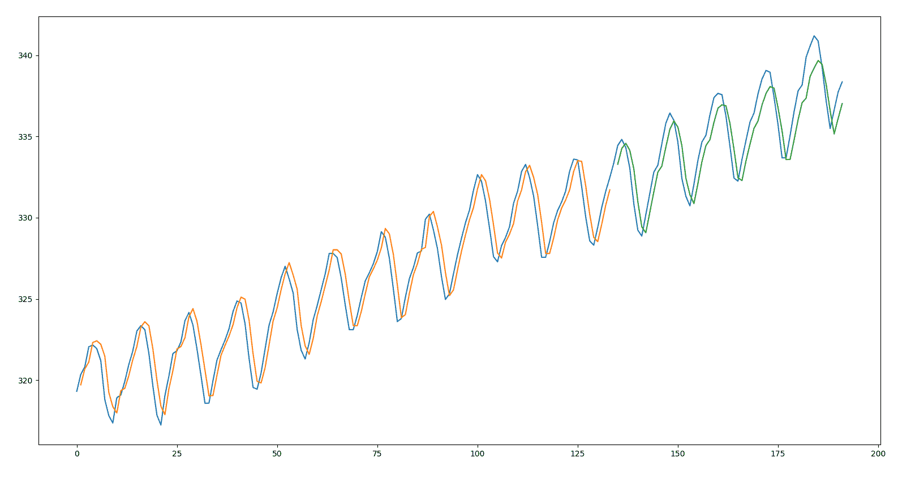

从对上图的分析中，我们可以看到 RMSE 报告的内容得到了图表的证实。事实上，我们可以看到该模型在训练和测试数据集的拟合方面做得非常好。


# 摘要

在本章中，我们探讨了时间序列数据。时间序列是对一种现象的一系列观察。在时间序列中，我们可以确定几个组成部分:趋势、季节性、周期和残差。我们通过一个实例学习了如何从时间序列中去除季节性。

然后介绍了最常用的时间序列模型:AR、MA、ARMA 和 ARIMA。对于每一个，分析了基本概念，然后提供了模型的数学公式。

最后，提出了时间序列分析的 LSTM 模型。使用一个实际的例子，我们可以看到如何处理一个时间序列回归问题与循环神经网络模型的 LSTM 类型。