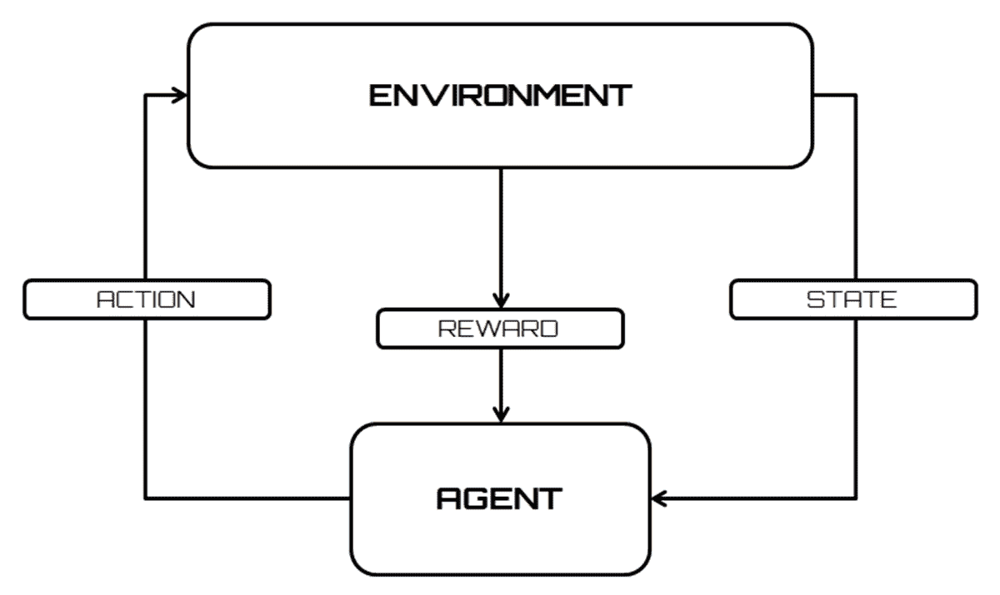
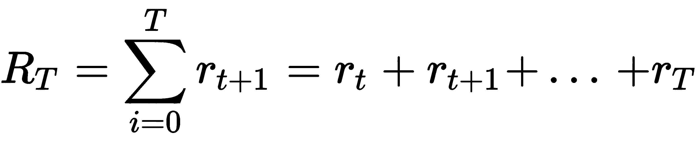
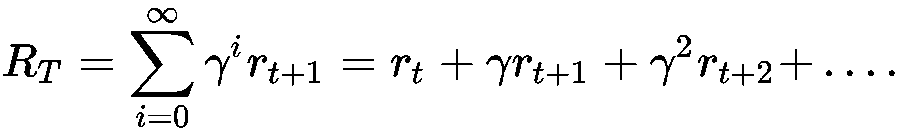
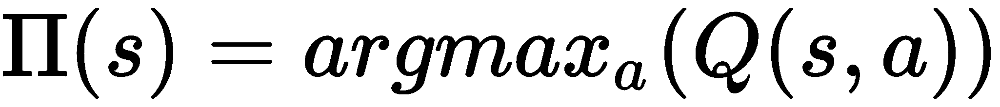
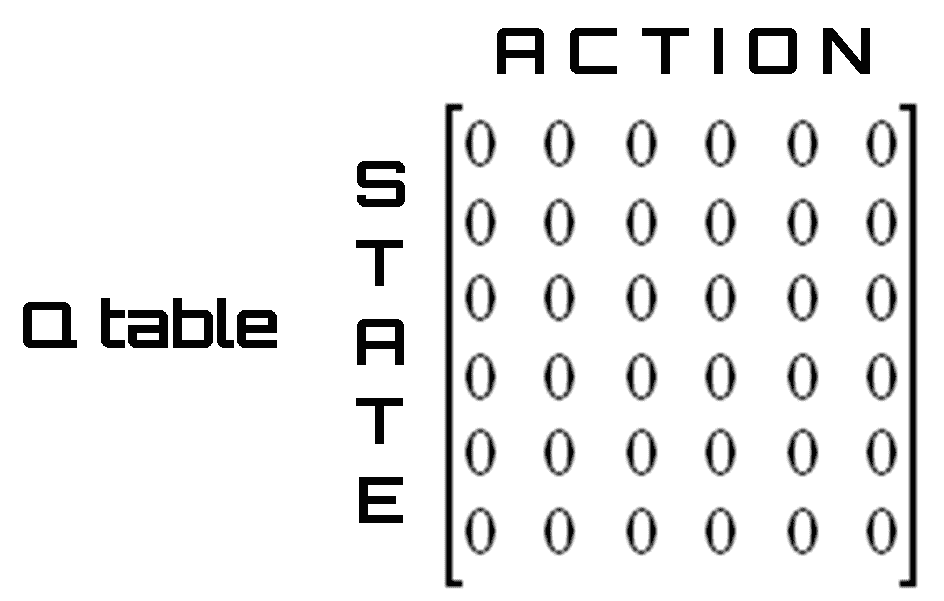
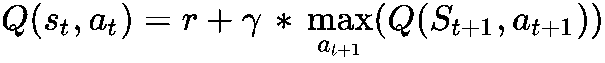
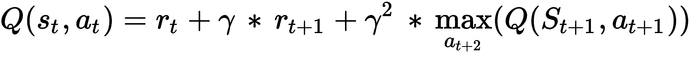
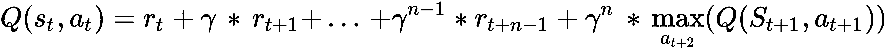
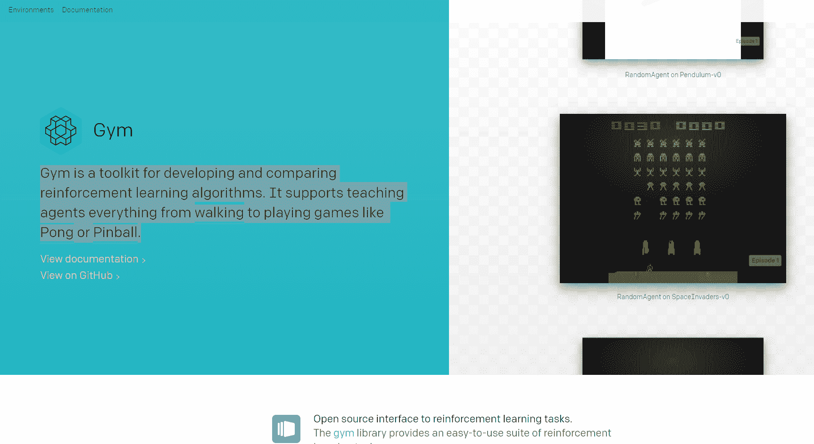
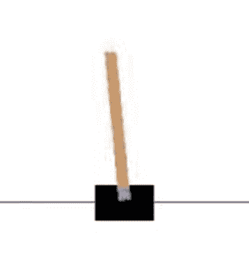

# 强化学习

如今，大多数计算机都是基于一个符号化的阐述。问题首先被编码成一组变量，然后使用显式算法进行处理，对于问题的每个可能的输入，该算法提供适当的输出。然而，存在这样的问题，其中通过显式算法的解析是低效的或者甚至是不自然的，例如语音识别器；用传统的方法处理这种问题是低效的。这个问题和其他类似的问题，如机器人的自主导航或执行操作时的语音辅助，是可以通过基于强化学习的解决方案直接解决的一组非常多样化的问题的一部分。

强化学习是基于一种心理学理论，是在对动物进行了一系列实验后形成的。定义一个要实现的目标，强化学习试图最大化执行一个或一组行动所获得的回报，使我们能够达到指定的目标。强化学习是机器学习中一个非常令人兴奋的领域，被用于从自动驾驶汽车到视频游戏的方方面面。它旨在创建能够学习和适应环境变化的算法。

本章涵盖的主题有:

*   强化学习
*   **马氏决策过程** ( **MDP** )
*   q 学习
*   **时差** ( **TD** )学习
*   深度 Q 学习网络

在这一章的最后，你将会完全了解强化学习的力量，并且会学到这种技术的不同方法。几个强化学习方法将被涵盖。


# 强化学习简介

强化学习旨在创造能够学习和适应环境变化的算法。这种编程技术基于根据算法选择接收外部刺激的概念。正确的选择会带来奖励，而错误的选择会导致惩罚。当然，这个系统的目标是达到最好的结果。

在监督学习中，有一个老师告诉系统哪个是正确的输出(跟着老师学习)。这并不总是可能的。通常我们只有定性信息(有时是二元的，对/错，或成功/失败)。可用的信息被称为**强化信号**。但是系统并没有给出任何关于如何更新代理行为的信息(也就是权重)。您不能定义成本函数或梯度。该系统的目标是创建能够从经验中学习的智能代理。

以下是显示强化学习与环境交互的流程图:



科学文献对强化学习的分类采取了不确定的立场。事实上，在最初阶段，它被认为是监督学习的一个特例，然后它被完全推广为机器学习算法的第三范式。它适用于监督学习效率低下的不同环境；与环境相互作用的问题就是明显的例子。

以下流程显示了正确应用强化学习算法应遵循的步骤:

1.  制剂的制备
2.  观察环境
3.  最佳策略的选择
4.  行动的执行
5.  相应奖励(或惩罚)的计算
6.  制定更新策略(如有必要)
7.  重复步骤 2-5，直到代理学习到最佳策略

强化学习是基于一些心理学理论，在动物身上进行了一系列实验后详细阐述的。特别是，美国心理学家爱德华·桑戴克指出，如果一只猫在执行了被认为正确的行为后立即得到奖励，这种行为重复发生的可能性就会增加。而面对不想要的行为，惩罚的应用降低了重复错误的可能性。

在这一理论的基础上，通过定义要实现的目标，强化学习试图最大化执行一个或一组行动所获得的回报，从而让我们达到指定的目标。


# 代理-环境界面

强化学习可以被看作是实现目标的交互问题的一个特例。必须达到目标的实体称为**代理**。代理必须与之交互的实体被称为**环境**，它对应于代理外部的一切。

到目前为止，我们更多地关注代理这个术语，但是它代表什么呢？代理是一个软件实体，它代表另一个程序执行服务，通常是自动和不可见的。这些软件也被称为**智能代理**。

以下是代理最重要的特征:

*   它可以在连续集和离散集之间选择对环境的动作
*   行动视情况而定。系统状态中总结了这种情况
*   代理持续监控环境(输入)并持续改变状态
*   行动的选择并不简单，需要一定程度的智慧
*   这个代理人有聪明的记忆力

主体具有目标导向的行为，但是在事先不知道或部分知道的不确定环境中行动。智能体通过与环境互动来学习。可以在通过代理自身进行的测量了解环境的同时制定计划。这个策略接近于试错理论。

试错法是解决问题的基本方法。它的特点是不断重复不同的尝试，直到成功，或者直到代理停止尝试。

媒介与环境的相互作用是连续的；主体选择要采取的行动，作为响应，环境改变状态，呈现要面对的新情况。

在强化学习的特殊情况下，环境为代理人提供奖励；至关重要的是，奖励的来源是环境，以避免在代理人内部形成会损害学习的个人强化机制。

奖励的价值与行动对实现目标的影响成正比；因此，在正确动作的情况下，它是正的或高的，或者在不正确动作的情况下，它是负的或低的。

以下是现实生活中的一些例子，在这些例子中，代理人和环境之间存在相互作用来解决问题:

*   一个国际象棋选手，每走一步，都有关于能创造的棋子配置和对手可能的反棋的信息
*   一只小长颈鹿在几个小时内学会了以 50 公里/小时的速度站立和奔跑
*   一个真正自主的机器人学会在房间里移动并离开它
*   炼油厂的参数(油压、流量等)是实时设置的，以便获得最高产量或最高质量

我们分析的所有示例都有以下共同特征:

*   与环境的相互作用
*   代理的目标
*   不确定性或对环境的片面了解

通过对这些例子的分析，可以得出以下结论:

*   代理从自己的经验中学习。
*   当行动改变了状态(情况)，未来选择的可能性也改变了(延迟奖励)。
*   一个行动的效果是无法完全预测的。
*   代理对它的行为有一个全局的评估。
*   它必须利用这些信息来改进他的选择。选择随着经验而改进。
*   问题可以有一个有限或无限的时间范围。


# 马尔可夫决策过程

为了避免负载问题和计算困难，代理-环境的相互作用被认为是一个 MDP。MDP 是一个离散时间随机控制过程。在每个时间步，流程处于状态 *s* ，决策者可以选择状态 *s* 中可用的任何动作 *a* 。该流程在下一个时间步通过随机进入新状态*s’*做出响应，并给予决策者相应的奖励 *r(s，s’)*。

在这些假设下，主体与环境的相互作用可以概括如下:

*   代理和环境在时间上以离散的间隔相互作用， *t = 0，1，2，… n* 。
*   在每个间隔，代理接收环境的状态 *st* 的表示。
*   *S* 的每个元素*S[t]，其中 *S* 是可能状态的集合。*
*   一旦状态被识别，代理必须采取 *A(s [t] )* 的动作 a [t] ，其中 *A(s [t] )* 是状态 *s [t]* 中可能的动作集合。
*   要采取的行动的选择取决于要实现的目标，并通过符号 *π* (折扣累积奖励)指示的策略进行映射，该策略将行动与每个状态 *s* 的 *A(s)* 的 [t] 相关联。术语 *π [t] (s，a)* 表示在状态 *s* 下执行动作 *a* 的概率。
*   在下一个时间间隔 *t + 1* 期间，作为 at 处的动作的结果的一部分，代理接收与先前在 [t] 采取的动作相对应的数字奖励*R[t]+1*R。
*   相反，动作的结果代表新的状态*s[t]。此时，代理必须再次对状态进行编码，并做出动作选择。*
*   这种迭代不断重复，直到代理实现目标。

状态 *s [t] + 1* 的定义取决于之前的状态和 MDP 采取的行动，即:

*s[t] + 1 = δ (s[t],a[t])*

这里 *δ* 代表状态函数。

总而言之:

*   在 MDP 中，代理可以感知他所处的状态，并有一套动作供他支配
*   在每个离散的时间间隔 *t* ，代理检测当前状态 *st* 并决定在 *A* 执行一个动作
*   环境的反应是提供一个奖励(一个强化) *r [t] = r (s [t] ，a [t] )* 并进入状态 *s [t] + 1 = δ (s [t] ，a [t] )*
*   *r* 和 *δ* 函数是环境的一部分；它们只取决于当前的状态和动作(而不是先前的状态和动作),并且不一定为代理所知
*   强化学习的目标是学习一个策略，对于系统所处的每个状态 *s* ,该策略向代理指示一个动作，以最大化在整个动作序列期间接收的总强化

让我们更深入地了解一些使用的术语:

*   一个**奖励函数**定义了强化学习问题中的目标。它将检测到的环境状态映射成一个数字，从而定义一个奖励。如前所述，唯一的目标是最大化长期的总回报。奖励函数定义了代理的好的和坏的事件。奖励函数有正确的需要，可以作为改变政策的依据。例如，如果策略选择的一个动作之后是低奖励，则可以在下一步中改变策略以选择该情况下的其他动作。
*   一个**策略**定义了学习代理在给定时间的行为。它映射了检测到的环境状态以及当它们处于这些状态时要采取的操作。对应于心理学上所谓的一套规则或刺激反应的关联**。政策是强化学习代理的基本部分，从这个意义上说，它本身就足以决定行为。**
*   一个**值函数**代表一个状态对于一个代理来说有多好。它等于状态为 *s* 的代理期望的总报酬。值函数取决于代理选择要执行的操作的策略。


# 折扣累积奖励

在上一节中，我们说过:强化学习的目标是学习一个策略，对于系统所处的每个状态 *s* ，该策略向代理指示一个动作，以最大化在整个动作序列期间接收的总强化。但是，我们怎样才能在整个行动过程中最大限度地获得总的强化呢？

从保单中获得的总加固量计算如下:



这里， *r [T]* 代表在终端状态 *s [T]* 下驱动环境的动作的奖励。

这个问题的一个可能的解决方案是把提供最高奖赏的行动与每个单独的州联系起来；也就是说，我们必须确定一个最优策略，使以前的数量最大化。

对于在有限步数(持续任务)内没有达到目标或最终状态的问题，R*t[t]T3 趋于无穷大。*

在这些情况下，一个人想要最大化的回报之和在无穷远处发散，所以这种方法不适用。因此，有必要开发一种替代的加固技术。

最适合强化学习范式的技术是贴现累积奖励，它试图最大化以下数量:



这里， *γ* 被称为**贴现因子**，它代表未来报酬的重要性。该参数可以取值 *0 ≤ γ ≤ 1* ，含义如下:

*   如果 *γ < 1* ，序列*r[t]将收敛到一个有限值*
*   如果 *γ = 0* ，代理人将对未来的奖励不感兴趣，但将只对当前状态尝试最大化奖励
*   如果 *γ = 1* ，代理人将试图增加未来的回报，即使是以眼前的回报为代价

折扣因子可以在学习过程中修改，以突出或不突出特定的动作或状态。一个最优的策略可以使执行一个动作所获得的强化甚至更低(甚至是负的)，只要总体上这导致了更大的强化。


# 探索与开发

理想情况下，代理人必须在各自的奖励 *r* 下与每个行为相关联，以便为实现目标选择奖励最多的行为。因此，这种方法对于复杂的问题是不切实际的，在这些问题中，状态的数量特别多，因此可能的关联呈指数增长。

这个问题被称为**勘探开发困境**。理想情况下，代理人必须探索每个状态的所有可能的行动，找到一个在实现其目标时实际上最有回报的行动。

因此，决策涉及一个基本的选择:

*   **开发**:根据当前信息做出最佳决策
*   **探索**:收集更多信息

在这个过程中，最好的长期战略可能会导致短期内的巨大牺牲。因此，有必要收集足够的信息来做出最佳决策。

下面是一些在现实生活中采用这种技术的例子:

**选择店铺**:

*   **剥削**:去你最喜欢的商店
*   探索:尝试一家新店

**路线的选择**:

*   **开拓**:选择目前为止最好的路线
*   探索:尝试一条新路线

实际上，在非常复杂的问题中，收敛到一个非常好的策略会太慢。

解决这个问题的好办法是在探索和利用之间找到一个平衡点:

*   一个局限于探索的代理人在每个状态下总是以一种随意的方式行动，很明显，收敛到一个最优策略是不可能的
*   如果代理很少探索，它将总是使用通常的动作，这可能不是最佳的


# 强化学习技术

正如我们在前面几节中看到的，强化学习是一种编程哲学，旨在开发能够学习和适应环境变化的算法。这种编程技术基于这样的假设，即能够根据算法的选择从外部接收刺激。因此，一个正确的选择将导致奖励，而一个错误的选择将导致系统的惩罚。该系统的目标是获得尽可能高的奖金，从而获得尽可能好的结果。与强化学习相关的技术分为两类:

*   **连续学习算法**:这些技术的出发点是假设有一个简单的机制能够评估算法的选择，然后根据结果奖励或惩罚算法。这些技术也可以适应环境的重大变化。一个例子是语音识别程序或 OCR 程序，它们随着使用而提高性能。
*   **预防性训练算法**:这些算法从观察开始，即不断评估算法的动作可能是一个不能自动化或非常昂贵的过程。在这种情况下，应用第一阶段，其中教授算法；当系统被认为是可靠的时，它就被具体化，不再可编辑。许多电子元件在其内部使用神经网络，并且这些网络的突触权重是不可变的，因为它们在电路的构建期间是固定的。

应该注意，前面提到的类别是实现选择，而不是算法中的概念差异。因此，一个算法通常可以属于第一类或第二类，这取决于设计者如何实现它。


# q 学习

q 学习是最常用的强化学习算法之一。这是因为它能够在不需要环境模型的情况下比较可用操作的预期效用。

由于这种技术，有可能在完成的 MDP 中为每个给定的状态找到最优的动作。

由于学习过程，强化学习问题的一般解决方案是估计评估函数。该功能必须能够通过奖励的总和来评估特定政策的便利性或其他方面。事实上，Q-learning 试图最大化 *Q* 函数的值(行动值函数)，它代表当我们在状态 *s* 执行行动 *a* 时的最大贴现未来回报，如下所示:

*Q(S [t] ，a[t])= max(R[t+1])*

已知 *Q* 函数，处于状态 *s* 的最优动作 *a* 就是具有最高 *Q* 值的那个。此时，我们可以定义一个策略 *π(s)* ，它为我们提供了任何状态下的最佳操作。回想一下策略 *π* 关联对*(s；a)* 以概率*(s；a)* 即动作是在状态 *s* 下进行的，我们可以编写如下:



问题简化为对 *Q* 函数的求值。然后，我们可以通过递归过程，根据下一个点的 *Q* 函数来估计过渡点的 *Q* 函数。以下是在该过程的一个步骤中使用的等式。这个方程被称为**贝尔曼方程**，代表了 Q-learning 的转换规则:


这些术语定义如下:

*   *Q(s [t] ，a [t] )* 是当前的行动方针 *a* 从状态 *s.*
*   r 是行动的回报。
*   *max[t+1](Q(s[t+1]，a[t+1])*定义了未来的最大奖励。我们执行 *a [t]* 动作以状态*s[t]到达*s[t+1]状态。从这里开始，我们可能有多个动作，每个动作对应一些奖励。计算奖励的最大值。**
*   *γ* 是贴现因子。 *γ* 值从 0 到 1 不等；如果该值接近 0，则优先考虑立即奖励。如果它接近 1，未来奖励的重要性增加到 1，在这里它被认为等同于即时奖励。

基于前面的等式，评估函数 *Q* 由直接奖励和从下一个状态开始可获得的最大奖励之和给出。

应用前面的公式，我们正试图将延迟的奖励公式化为即时的奖励。我们之前已经说过, *Q* 函数的求值代表了一个递归过程。然后，我们可以将在这个过程中获得的值输入到一个表中，当然，我们将称之为 table *Q* 。在该表中，行是状态，列是动作。作为起始表 *Q* ，我们可以使用一个包含全零的矩阵(我们已经初始化了表 *Q* ，如下图所示:



该表的元素 *Q* (单元格)是当一个人处于该行给出的状态并且执行该列给出的动作时获得的奖励。在任何状态下采取的最佳行动都是奖励最高的行动。我们现在的任务是用新值更新这个表。为此，我们可以采用以下算法:

1.  状态*s[t]被解码*
2.  选择一个动作*一个[t]T3*
3.  执行动作*a[t]并接收奖励 *r**
4.  表中的元素*Q(s[t]；用贝尔曼方程提供的训练规则更新 a [t] )*
5.  动作 a 的执行在状态*s[t+1]中移动环境*
6.  将下一个状态设置为当前状态( *s [t] = s [t+1]* )
7.  再次从第 1 点开始，重复该过程，直到达到终端状态

在更复杂和有效的公式中，有可能用神经网络来代替表，该表的迭代对于复杂问题仍然是低效的，在该神经网络中，学习过程将改变突触连接的权重。


# 时间差异学习

TD 学习算法基于减少代理在不同时间做出的估计之间的差异。前面提到的 Q-learning 是一种 TD 算法，但它是基于紧邻时刻状态之间的差异。TD 更通用，可以考虑更远的时刻和状态。

它结合了**蒙特卡罗** ( **MC** )方法和**动态规划** ( **DP** )的思想。

MC 方法允许基于所获得结果的平均值来解决强化学习问题。

DP 代表一组算法，在给定 MDP 形式的完美环境模型的情况下，这些算法可用于计算最佳策略。

TD 算法可以直接从原始数据中学习，而不需要环境的动态模型(如 MC)。该算法部分基于先前学习的估计来更新估计，而不等待最终结果(自举，例如 DP)。它适用于没有动态环境模型的学习。如果时间步长足够小，或者时间步长随着时间的推移而减小，则使用固定策略进行收敛。

正如我们在上一节中看到的，Q-learning 根据以下公式计算其值:



通过采用单步前瞻。

前瞻是一个过程的通称，该过程试图预见选择一个分支变量来评估它的一个值的影响。前瞻的两个主要目的是选择下一个要评估的变量和赋给它的值的顺序。

很明显，也可以使用两步公式，如下行所示:



更一般地，对于 n 步前瞻，我们获得以下公式:



# 动态规划

DP 代表一组算法，在给定 MDP 形式的完美环境模型的情况下，这些算法可用于计算最佳策略。DP 的基本思想，以及一般的强化学习，是利用国家价值和行动来寻找好的政策。

DP 方法通过称为**策略评估**和**策略改进**的两个过程的迭代来解决马尔可夫决策过程。

*   策略评估算法在于将迭代方法应用于贝尔曼方程的求解。由于仅对 *k → ∞* 保证收敛，我们必须满足于通过施加停止条件得到良好的近似。
*   策略改进算法基于当前值改进策略。

策略迭代算法的缺点是我们必须在每一步评估一个策略。这涉及一个迭代过程，其收敛时间我们事先不知道。除其他因素外，这将取决于如何选择启动政策。

克服这个缺点的一个方法是在特定的步骤切断对策略的评估。该操作不会改变收敛到最优值的保证。一种特殊情况是，策略的评估被一个按状态的步骤(也称为**扫描**)阻止，这种情况定义了值迭代算法。在值迭代算法中，在策略改进的每个步骤之间执行值计算的单次迭代。

因此，动态规划算法本质上是基于并行发生的两个过程:政策评估和政策改进。这两个过程的反复执行使得一般过程向最优解收敛。在策略迭代算法中，两个阶段交替进行，并且每个阶段在另一个阶段开始之前结束。

DP 方法通过环境可以假设的整个状态集进行操作，在每次迭代中对每个状态执行完整的备份。由备份执行的每个更新操作基于所有可能的后续状态的值来更新状态的值，对它们发生的概率进行加权，并且由选择的策略和环境的动态性来诱导。完整备份与贝尔曼方程密切相关；它们只不过是将等式转换成赋值指令。

当一个完整的备份迭代没有给状态值带来任何变化时，获得收敛；因此，最终状态值完全满足贝尔曼方程。只有当交流发电机有一个完美的模型时，DP 方法才适用，该模型必须相当于 MDP。

正是由于这个原因，DP 算法在强化学习中几乎没有用，因为它们假设了完美的环境模型，并且计算量高且昂贵，但是仍然有必要提及它们，因为它们代表了强化学习的理论基础。事实上，所有的强化学习方法都试图实现与动态规划方法相同的目标，只是计算成本更低，并且不需要假设环境的完美模型。

相对于基于直接搜索的方法所需的指数运算数量 *m*n* ，DP 方法通过关于状态数量 *n* 和动作数量 *m* 的多个多项式运算收敛到最优解。

DP 方法基于后继状态的值的估计来更新状态的值的估计；或者他们在过去估计的基础上更新估计。这代表了一个特殊的属性，称为**自举**。强化学习的几种方法执行引导，甚至不需要如 DP 方法所要求的完美环境模型的方法。


# 蒙特卡罗方法

用于估计价值函数和发现优秀策略的 MC 方法不需要环境模型的存在。他们能够通过单独使用代理人的经验或从代理人和环境之间的相互作用中获得的状态序列、动作和奖励的样本来学习。该经验可以由代理根据学习过程获得，或者由先前填充的数据集模拟。在学习(在线学习)过程中获得经验的可能性是有趣的，因为它允许即使在缺乏环境动态的先验知识的情况下也能获得优秀的行为。甚至通过已经填充的经验数据集学习也可能是有趣的，因为如果与在线学习相结合，它使得由其他人的经验诱导的自动政策改进成为可能。

为了解决强化学习问题，MC 方法基于在过去的事件中平均获得的奖励的总和来估计价值函数。这假设体验被分成几集，并且所有的集都由有限数量的过渡组成。这是因为在 MC 方法中，只有当一个事件完成时，才进行新值的估计和策略的修改。MC 方法迭代地估计策略和价值函数。然而，在这种情况下，每个迭代周期相当于完成一集——政策和价值函数的新估计一集接一集地出现。

通常术语 MC 用于估计方法，其运算涉及随机分量；在这种情况下，MC 指的是基于总回报平均值的强化学习方法。与计算每个状态的值的 DP 方法不同，MC 方法计算每个状态-动作对的值，因为在没有模型的情况下，仅状态值不足以决定在某个状态下执行哪个动作最好。


# 深度 Q 网络

**深度 Q 网络** ( **DQN** )算法结合了强化学习方法和深度学习方法。DQN 靠自己学习，以一种经验的方式学习，没有针对特定目标的严格程序，比如赢得一盘棋。

DQN 代表了 Q 学习的应用，其使用深度学习来近似评估函数。DQN 是由 Mnih 等人通过 2015 年 2 月 26 日发表在 *Nature* 上的一篇文章提出的。因此，许多研究机构加入了这一领域，因为深度神经网络可以使强化学习算法直接处理高维状态。

深度神经网络的使用是由于研究人员注意到以下事实:在具有强化学习的算法中使用神经网络来逼近 **Q-evaluation** 函数会使系统不稳定或发散。事实上，可以注意到对 *Q* 的微小更新可以显著改变政策、数据分布以及 *Q* 和目标值之间的相关性。这些存在于观察序列中的相关性是算法不稳定的原因。

要将普通 Q 网络转换为 DQN，必须采取以下预防措施:

*   用多级卷积网络代替单级神经网络来近似 Q 函数评估
*   实现体验回放
*   在更新过程中，使用第二个网络来计算目标 Q 值

术语**体验回放**是什么意思？这意味着，当状态/动作对在模拟或实际体验中出现时，系统存储发现的数据，通常存储在一个大表中，而不是对它们运行 Q 学习。通过这种方式，我们的网络可以使用存储的经验记忆来训练自己。


# OpenAI Gym

**OpenAI Gym** 是一个帮助我们实现基于强化学习的算法的库。它包括越来越多的基准问题，这些问题暴露了一个公共接口，以及一个人们可以分享他们的结果和比较算法性能的网站。

OpenAI Gym 专注于强化学习的情景设置。换句话说，代理人的经历分为一系列的插曲。代理的初始状态是由一个分布随机抽样的，交互一直进行到环境达到一个终止状态。每集都重复这一过程，目的是最大化每集的总回报预期，并在尽可能少的剧集中实现高水平的表现。

Gym 是一个开发和比较强化学习算法的工具包。它支持教会代理从走路到玩游戏(如 Pong 或 Pinball)的能力。该库可从以下 URL 获得:

[https://gym.openai.com/](https://gym.openai.com/)

下图是 OpenAI 健身房项目网站的主页:



OpenAI 健身房是一个更加雄心勃勃的项目的一部分:OpenAI 项目。OpenAI 是一家**人工智能** ( **AI** )研究公司，由埃隆·马斯克(Elon Musk)和山姆·奥特曼(Sam Altman)创办。这是一个非营利项目，旨在以造福全人类的方式促进和发展友好的人工智能。该组织旨在通过向公众开放他们的专利和研究，与其他机构和研究人员自由合作。创始人决定承担这个项目，因为他们担心滥用人工智能带来的生存风险。

OpenAI Gym 是一个程序库，允许您开发人工智能，测量他们的智力能力，并增强他们的学习能力。简而言之，一个以算法形式训练现在的数字大脑来打开 AI 健身房的健身房将它们投射到未来。

但还有另一个目标。OpenAI 希望通过资助那些即使在没有经济回报的领域也能让人类进步的项目，来刺激人工智能领域的研究。另一方面，通过 Gym，它打算将人工智能的测量标准化，以便研究人员可以在平等的条件下竞争，并知道他们的同事取得了什么成就，但最重要的是，专注于对每个人真正有用的结果。

可用的工具有很多。从玩像 Pong 这样的老式视频游戏的能力，到在 GO 中控制机器人的战斗能力，我们只需在这个数字地方输入我们的算法，看看它是如何工作的。第二步是将获得的基准与其他基准进行比较，看看我们与其他基准相比处于什么位置，也许我们可以与他们合作以获得互惠互利。

OpenAI Gym 对我们的代理的结构没有任何假设，并且兼容任何数值计算库，如 TensorFlow 或 Theano。健身房图书馆是一个测试问题——环境——的集合，我们可以用它来制定我们的强化学习算法。这些环境有一个共享的接口，允许你编写通用算法。

要安装 OpenAI Gym，请确保您之前已经安装了 Python 3.5+版本；然后只需键入以下命令:

```
pip install gym
```

一旦完成，我们将能够以一种简单而直接的方式插入该库提供的工具。


# 车杆系统

车杆系统是强化学习的经典问题。该系统由一根通过接头连接到推车上的杆(其作用类似倒立摆)组成，如下图所示:



通过对推车施加+1 或-1 的力来控制该系统。施加在推车上的力是可以控制的，目的是向上摆动杆子并使其稳定。这必须在手推车不落地的情况下完成。在每一步，代理人可以选择向左或向右移动手推车，并且它会在杆子平衡的每一个时间步获得 1 的奖励。如果杆偏离竖直方向超过 15 度，则程序结束。

要使用 OpenAI Gym 库运行 Cart-Pole 示例，只需键入以下代码:

```
import gym
env = gym.make('CartPole-v0')
env.reset()
for i in range(1000):
    env.render()
    env.step(env.action_space.sample())
```

像往常一样，我们将详细解释每一行代码的含义。第一行用于导入`gym`库:

```
import gym
```

然后我们继续通过调用`make`方法来创建环境:

```
env = gym.make('CartPole-v0')
```

这个方法创建了我们的代理将在其中运行的环境。环境是指代理可以与之交互的最小界面的问题。OpenAI 健身房的环境设计是为了允许对代理人的能力进行客观测试和基准测试。健身房图书馆有一套不同的环境，从容易到困难，涉及许多不同种类的数据。

有关可用环境的列表，请参阅以下链接:

[https://gym.openai.com/envs](https://gym.openai.com/envs)

这里列出了最常用的环境:

*   **经典控制和玩具正文**:完成小规模任务，多来自强化学习文献。他们是来帮你开始的。
*   **算法**:进行多位数相加、逆序等运算。
*   **雅达利**:玩经典的雅达利游戏。
*   **2D 和 3D 机器人**:模拟控制机器人。

在我们的例子中，我们称之为 CartPole-v0 环境。`make`方法返回一个`env`对象，我们将使用它与游戏进行交互。但是让我们回到分析代码。现在我们必须使用`reset()`方法初始化系统:

```
env.reset()
```

该方法将环境置于其初始状态，返回描述它的数组。此时，我们将使用一个`for`循环运行 CartPole-v0 环境的一个实例，持续`1000`个时间步长，在每一步呈现环境:

```
for i in range(1000):
    env.render()
    env.step(env.action_space.sample())
```

调用`render()`方法将直观地显示当前状态，而对`env.step()`的后续调用将允许我们与环境交互，返回新的状态以响应我们调用它的动作。

这样，我们在每一步都采取了随机行动。在这一点上，知道我们正在对环境采取什么行动来决定未来的行动肯定是有用的。`step()`方法返回的正是这个。实际上，此方法返回以下四个值:

*   `observation (object)`:一个特定环境的物体，代表你对环境的观察。
*   `reward (float)`:上一次行动获得的奖励金额。规模因环境而异，但目标始终是增加你的总回报。
*   `done (boolean)`:是否又到了重置环境的时候了。大多数(但不是全部)任务被划分成定义明确的片段，而`done`为`True`则表示该片段已经终止。
*   `info (dict)`:对调试有用的诊断信息。它有时对学习很有用。

要运行这个简单的示例，将代码保存在名为`cart.py`的文件中，并在 bash 窗口中键入以下命令:

```
python cart.py
```

这样，将显示一个包含我们的系统的窗口，该系统不稳定，很快就会退出屏幕。这是因为推车的推力是随机产生的，没有考虑杆子的位置。

为了解决这个问题，也就是说，为了平衡杆子，因此有必要将推力设置为与杆子的倾斜方向相反。所以，我们只需要设置两个动作，-1 或+1，向左或向右推购物车。但是为了做到这一点，我们需要随时了解从环境观察中获得的数据。正如我们已经说过的，这些数据是由`step()`方法返回的，特别是它们包含在观察对象中。

该对象包含以下参数:

*   推车位置
*   推车速度
*   磁极角度
*   尖端的极点速度

这四个值成为我们问题的输入。正如我们所预料的那样，系统是通过推手推车来保持平衡的。有两种可能的选择:

*   将购物车推至左侧(0)
*   向右推它(1)

很明显，这是一个二进制分类问题:四个输入和一个二进制输出。

让我们首先考虑如何提取要用作输入的值。要提取这些参数，我们只需更改前面建议的代码:

```
import gym
env = gym.make('CartPole-v0')
observation = env.reset()
for i in range(1000):
    env.render()
    print(observation)
    observation, reward, done, info = env.step(env.action_space.sample())
```

通过运行代码，我们可以看到包含在观察对象中的值现在被打印在屏幕上。这些很快就会有用的。

使用从环境观察返回的值，代理必须决定两个可能的动作之一:向左或向右移动购物车。


# 学习阶段

现在我们要面对最苛刻的阶段，即我们系统的训练。在上一节中，我们说过健身房图书馆专注于强化学习的情景设置。经纪人的经历分为一系列的插曲。代理的初始状态是由一个分布随机抽样的，交互作用一直进行到环境达到一个终止状态。每集都重复这一过程，目的是最大化每集的总回报预期，并在尽可能少的剧集中实现高水平的表现。

在学习阶段，我们必须估计一个评价函数。该功能必须能够通过奖励的总和来评估特定政策的便利性或其他方面。换句话说，我们必须逼近评价函数。我们能做什么？一种解决方案是使用人工神经网络作为函数逼近器。

回想一下，神经网络的训练旨在识别神经元之间连接的权重。在这种情况下，我们将为每集选择带权重的随机值。最后，我们将选择能获得最大回报的重量组合。

系统在给定时刻的状态是由观察对象返回给我们的。为了从实际状态中选择一个动作，我们可以使用权重和观察值的线性组合。这是函数逼近最重要的特例之一，其中逼近函数是权向量 *w* 的线性函数。对于每个状态 *s* ，都有一个实值向量 *x(s)* ，其分量数与 *w* 相同。线性方法通过 *w* 和 *x(s)* 之间的内积来近似状态值函数。

这样，我们就确定了解决问题的方法。现在，为了使整个训练阶段易于理解，我们报告整个代码块，然后逐行对其进行详细注释:

```
import gym
import numpy as np
env = gym.make('CartPole-v0')
HighReward = 0
BestWeights = None
for i in range(200):
  observation = env.reset()
  Weights = np.random.uniform(-1,1,4)
  SumReward = 0
  for j in range(1000):
    env.render()
    action = 0 if np.matmul(Weights,observation) < 0 else 1
    observation, reward, done, info = env.step(action)
    SumReward += reward
    print( i, j, Weights, observation, action, SumReward, BestWeights)

  if SumReward > HighReward:
    HighReward = SumReward
    BestWeights = Weights
```

代码的第一部分处理库的导入:

```
import gym
import numpy as np
```

然后我们继续通过调用`make`方法来创建环境:

```
env = gym.make('CartPole-v0')
```

这个方法创建了我们的代理将在其中运行的环境。现在让我们初始化将要使用的参数:

```
HighReward = 0
BestWeights = None
```

`HighReward`将包含到当前剧集为止获得的最大奖励；该值将用作比较值。`BestWeights`将包含记录最大奖励的重量序列。现在，我们可以通过针对情节的迭代过程来实现最佳权重序列搜索:

```
for i in range(200):
```

我们决定执行过程`200`次，所以我们使用`reset()`方法初始化系统:

```
  observation = env.reset() 
```

在每集中，我们使用一系列重量，其数量等于对环境的观察，如前所述为四个(小车位置、小车速度、杆角度和尖端的杆速度):

```
Weights = np.random.uniform(-1,1,4)
```

为了确定权重，我们使用了`np.random.uniform()`函数。该函数从均匀分布中抽取样本。样本均匀分布在半开区间(低和高)。它包括低，但不包括高。

换句话说，给定区间内的任何值都同样可能由均匀分布得出。已经传递了三个参数:输出间隔的下边界、上边界和输出形状。在我们的例子中，我们请求在区间`(-1,1)`中的四个随机值。完成后，我们初始化奖励的总和:

```
SumReward = 0
```

此时，我们实施另一个迭代周期来确定我们可以用这些权重获得的最大回报:

```
for j in range(1000):
```

调用`render()`方法将直观显示当前状态:

```
env.render()
```

现在，我们必须决定`action`:

```
action = 0 if np.matmul(Weights,observation) < 0 else 1
```

正如我们所说，为了决定动作，我们使用了两个向量的线性组合:`weights`和`observation`。为了执行线性组合，我们使用了`np.matmul()`功能；它实现了两个数组的矩阵乘积。所以，如果这个乘积是`<0`，那么`action`就是 0(左移)；否则，`action`为 1(右移)。

需要注意的是，负的乘积意味着杆子向左倾斜，所以为了平衡这种趋势，需要向左推动大车。正的乘积意味着极点向右倾斜，所以为了平衡这种趋势，有必要将推车向右推。

现在我们使用`step()`方法来返回新的状态，以响应我们调用它的动作。显然，我们传递给方法的动作就是我们刚刚决定的动作:

```
observation, reward, done, info = env.step(action)
```

正如我们所说的，该方法返回以下四个值:

*   `observation` ( `object`):一个特定环境的物体，代表你对环境的观察。
*   `reward` ( `float`):前一次行动获得的奖励金额。规模因环境而异，但目标始终是增加你的总回报。
*   `done` ( `boolean`):是否又到了重置环境的时候了。大多数(但不是全部)任务被划分成定义明确的剧集，而`done`为`True`则表示该剧集已经终止。
*   `info` ( `dict`):对调试有用的诊断信息。它有时对学习很有用。

然后，我们可以用刚刚获得的奖励来更新奖励的总和。请记住，对于我们保持直杆的每个时间步长，我们会得到+1 `reward`:

```
SumReward += reward
```

我们只需打印在这一步中获得的值:

```
print( i, j, Weights, observation, action, SumReward, BestWeights)
```

在当前迭代结束时，我们可以进行比较，以检查获得的总奖励是否是迄今为止获得的最高奖励:

```
if SumReward > HighReward:
```

如果这是到目前为止获得的最高奖励，用这个值更新`HighReward`参数:

```
HighReward = SumReward
```

完成后，将当前步骤的`Weights`顺序固定为最佳顺序:

```
BestWeights = Weights
```

根据该指令，训练阶段结束，这将为我们提供最接近评估函数的权重序列。我们现在可以测试系统了。


# 测试阶段

当训练阶段完成时，实际上意味着我们已经找到了最接近该函数的权重序列，也就是说，已经返回了可实现的最佳回报的权重序列。现在，我们必须用这些值来测试系统，以检查极点是否能够承受至少`100`个时间步长。

现在，正如我们在培训阶段已经完成的那样，为了使整个测试阶段易于理解，我们报告整个代码块，然后逐行对其进行详细注释:

```
observation = env.reset()
for j in range(100):
  env.render()
  action = 0 if np.matmul(BestWeights,observation) < 0 else 1
  observation, reward, done, info = env.step(action)
  print( j, action)
```

首先，我们必须使用`reset()`方法再次初始化系统:

```
observation = env.reset() 
```

然后，我们必须运行一个迭代周期来应用在训练阶段获得的结果:

```
for j in range(100):
```

对于每一步，我们将调用`render()`方法来直观地显示当前状态:

```
env.render()
```

现在，我们必须根据在训练阶段获得的最佳权重和对当前状态的观察来决定对系统执行的操作:

```
action = 0 if np.matmul(BestWeights,observation) < 0 else 1
```

现在我们使用`step()`方法，返回新的状态来响应我们调用它的动作。传递给该方法的操作就是我们刚刚决定的操作:

```
observation, reward, done, info = env.step(action)
```

最后，我们打印步骤号和为可视化流程控制而决定的动作。

通过运行建议的代码，我们可以验证在训练阶段之后，系统能够在 100 个时间步长内保持极点平衡。


# 摘要

强化学习旨在创造能够学习和适应环境变化的算法。这种编程技术基于根据算法选择接收外部刺激的概念。正确的选择会带来奖励，而错误的选择会导致惩罚。当然，系统的目标是达到最好的结果。在这一章中，我们讨论了强化学习的基础。

首先，我们看到强化学习的目标是创造能够从经验中学习的智能主体。因此，我们分析了正确应用强化学习算法的步骤。稍后，我们探索了代理-环境接口。必须实现目标的实体称为**代理**。代理必须与之交互的实体被称为**环境**，它对应于代理之外的一切。

为了避免负载问题和计算困难，代理-环境的相互作用被认为是一个 MDP。MDP 是一个随机控制过程。然后引入了贴现因子的概念。折扣因子可以在学习过程中修改，以突出或不突出特定的动作或状态。一个最优的策略可以使执行一个动作所获得的强化甚至更低(或负的)，只要总体上这导致了更大的强化。

在本章的中心部分，我们致力于分析最常见的强化学习技术。涵盖了 Q 学习、TD 学习和深度 Q 学习网络。最后，我们探索了 OpenAI 健身房图书馆，并着手分析了一个强化学习的实例。