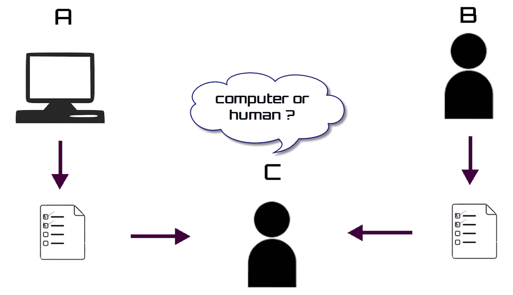
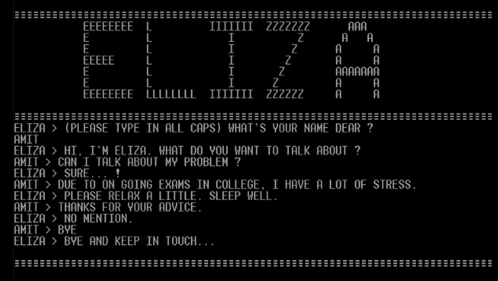
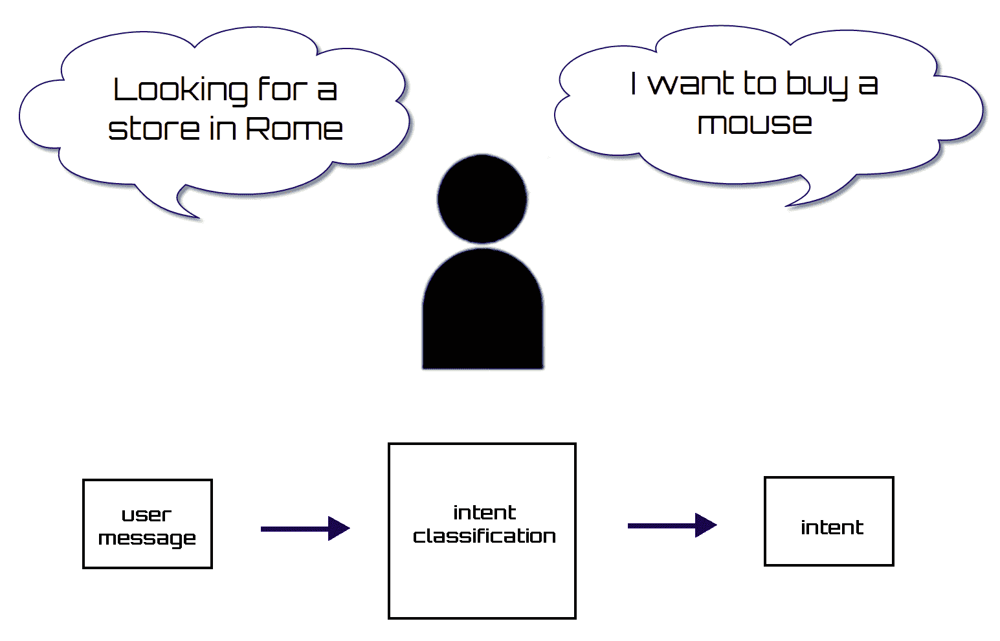
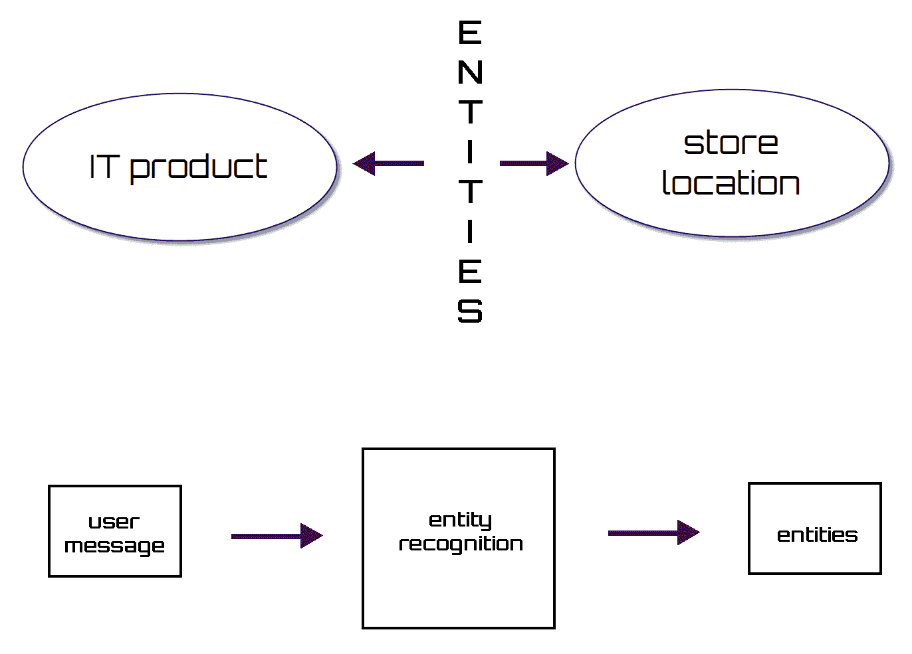
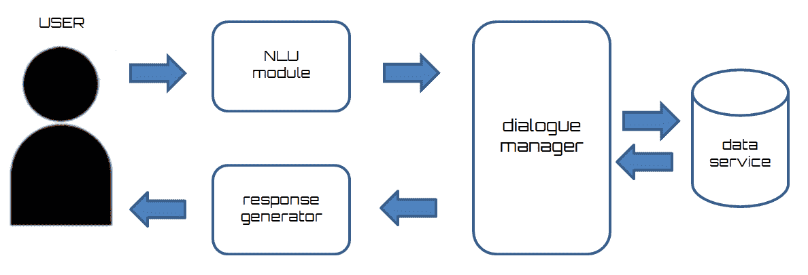
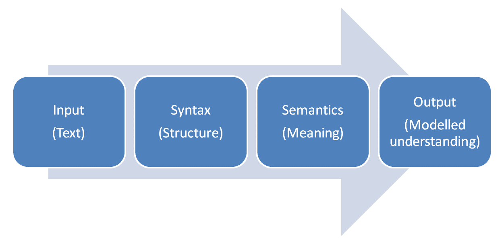
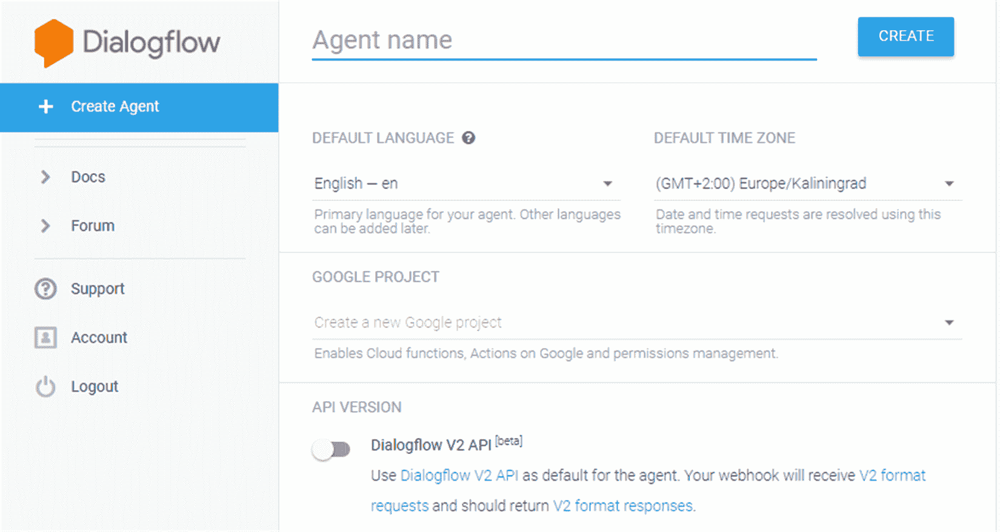
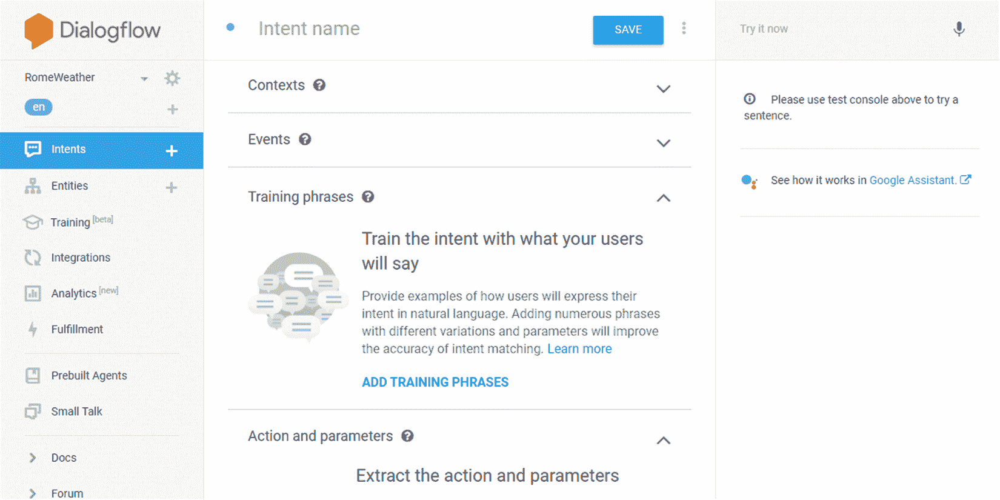
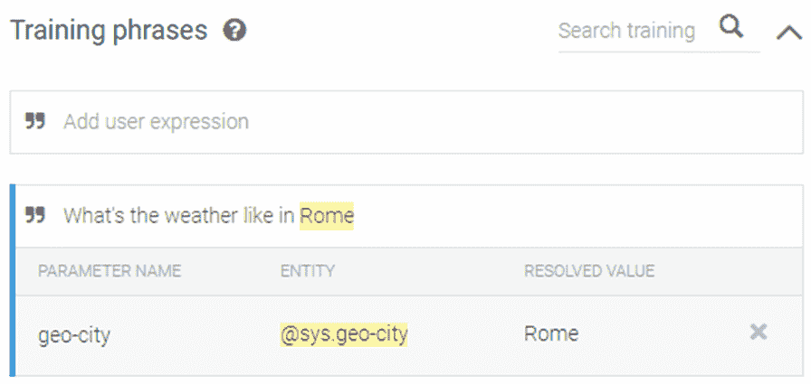
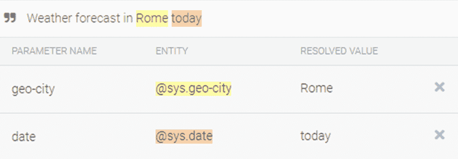

<title>Chatbots</title>  

# 聊天机器人

聊天机器人的时代已经到来，这是一种新的技术现象，它帮助产生了一种与机器互动的新方式，从而创造了商业。聊天机器人是通过聊天与用户互动的机器人，能够通过执行极其有限的任务来帮助用户:提供当前帐户的信息，购买机票，接收天气消息，等等。

聊天机器人处理用户提交的文本，然后根据一套复杂的算法做出响应，解释和识别用户所说的内容。在扣除用户需求后，它根据从上下文中提取的信息确定一组适当的响应。一些聊天机器人提供了非常真实的对话体验，其中很难确定代理是机器人还是人。

聊天机器人也是人工智能带来的最令人兴奋的创新之一。在本章中，在介绍了所有这些技术所基于的主要概念之后，我们将介绍构建上下文聊天机器人的方法，并在 GCP 上实现一个简单的端到端聊天机器人应用程序。

涵盖的主题:

*   聊天机器人基础
*   聊天机器人设计技术
*   自然语言处理
*   谷歌云对话流
*   GCP 聊天机器人的构建与实现

在本章结束时，读者将完成对聊天机器人的实际操作介绍，并学习如何训练一个上下文聊天机器人，同时在一个真实的 web 应用程序中实现它。

<title>Chatbots fundamentals</title>  

# 聊天机器人基础知识

聊天机器人，或聊天机器人，是可以通过聊天与人类互动的程序，模拟他们的行为。然后在人类和机器人之间建立对话。自从计算机科学首次发展以来，学者们与其他学科合作，试图通过使用机器来再现典型的人类认知过程。他们通常用于简单和重复的活动，否则可能会花费大量时间或不值得分配人力资源。

考虑到它们的复杂性，很明显，在这种情况下，你不能说是对人自身行为的令人满意的模拟，但却可以开始提到人工智能的概念。

机器人可以执行一个方案并显示其操作。从自动回复信息到允许网上购物，机器人无所不能。他们可以接收任何类型的新闻，发布天气状况，或者播放音乐视频，所有这些都只通过聊天来实现。

有几个平台实现了使用机器人的能力。其中包括:电报、Skype、Messenger、Slack、SMS 和电子邮件。这些机器人允许您使用这些平台(用户已经知道并用于其他功能(如消息传递)的应用程序)，在其中执行最不同的功能，从而节省用户在用户设备上使用和安装其他应用程序的精力。

<title>Chatbot history</title>  

# 聊天机器人历史

聊天机器人的历史比你想象的要早得多。我们身处 20 世纪中期的英国，艾伦·图灵问了一个问题*机器能思考吗？提出了一个将智力与对话能力联系起来的测试。从那时起，创建能够以越来越精确的方式模拟人类语言的软件的挑战就从未停止过。*

<title>The imitation game</title>  

# 模仿游戏

在 20 世纪 50 年代，艾伦·图灵写了一篇名为*计算机械与智能*的文章，其中的问题是关于建立一个判断机器是否能够思考的标准。准则是基于*的模仿游戏*，游戏中有一台电脑 **A** ，一个人类 **B** ，另一个人类 **C** (审讯者)。人类 **C** 必须确定谁是 **A** 谁是 **B** 。审问者问了他们两个问题，A**和 B**以书面形式回答。当 **C** 错误地判断 **A** 的身份，认为它是人类时，计算机 **A** 赢得游戏。下图是一个模仿游戏方案:



尽管有许多批评声称这个标准不足以确定机器是否可以思考，但图灵的游戏在过去几十年中引发了一个挑战，导致了以越来越准确的方式模拟人类语言的软件的诞生。

1990 年，基于图灵测试设立了一项名为**罗布纳奖**的竞赛，奖励行为与人类思维最相似的计算机。这项比赛每年都举行。这里是比赛的官方网站:【http://www.aisb.org.uk/events/loebner-prize[。](http://www.aisb.org.uk/events/loebner-prize)

<title>Eliza</title>  

# 伊莱扎

1966 年，Joseph Weizenbaum 创建了 Eliza，一个旨在模仿治疗师和他的病人在最初阶段的对话的程序。在这个过程中，发生了一个简单问题的交流，不需要很深的感情。在下面的截图中，显示了一个简单的 Eliza 聊天机器人:



Eliza 依赖于使用正则表达式将用户输入转换为输出，从而使对话具有连续性和明显的一致性。在其他时候，它不会产生上下文观察，而是产生完全符合心理治疗师态度的东西，例如*非常有趣*、*请*、*继续*或 c *你能详细说明一下吗？*

<title>Parry</title>  

# 避开

在医学领域，帕里模拟了一个患有偏执型精神分裂症的人的行为。它是精神病学家肯尼斯·科尔比在 1972 年发明的，作为他的学生在与真正的病人打交道之前的一种练习工具。

在图灵测试的一个微小变化中，精神病学家被要求阅读帕里和真实病人的记录，以区分他们来自两者中的哪一个。这在当时是一个不可思议的结果；精神病学家只能在 48%的情况下识别出行为的不同。

1973 年 1 月，作为一次国际计算机会议上的演示，计算机科学先驱温顿·瑟夫决定让机器人得出合乎逻辑的结论。通过 ARPANET，他在伊莱扎和帕里之间建立了对话。这是一次两岸计算机头脑的会议；伊莱扎在麻省理工工作，帕里在斯坦福工作。以下是两个机器人对话的简短摘录:

*   伊莉莎:晚上好。告诉我你的问题。请用句号或问号结束输入。
*   帕里:人们有时让我心烦。
*   伊莉莎:我不确定我完全了解你。
*   帕里:*你应该多加注意。*
*   伊莱扎:我想你应该更加注意。
*   帕里:你有权保留自己的观点。
*   伊莱扎:你凭什么认为我有资格拥有自己的观点？
*   帕里:*一般来说，光是和人在一起就让我很困扰。*
*   伊莱扎:请继续。
*   帕里:不久前我去了贝梅多斯的赛马场。
*   伊莱扎:*这让你想到了什么？*
*   帕里:我去看了赛马。

<title>Jabberwacky</title>  

# 无意义的话

Jabberwacky 是程序员罗洛·卡彭特在 1988 年创造的。这个机器人的目的是通过图灵测试。Jabberwacky 能够以幽默的方式模拟人的声音。目前，机器人的开发仍在进行中，旨在基于良好的学习在机器人或会说话的宠物上实现该系统。

这是一个基于机器学习的 bot 事实上，为了与我们互动，它只使用学到的材料，并在增加知识的同时借用我们的一些智力。没有硬编码的规则，它完全基于反馈的原则。

Cleverbot 是 1997 年发布的 Jabberwacky 的变种，取得了很大的成绩；2011 年，它在印度 IIT·古瓦哈蒂参加了图灵测试，被认为是人类的概率为 59.3%。

<title>Dr. Sbaitso</title>  

# Dr. Sbaitso

斯拜索博士还被设计用来模拟能够解决用户情感问题的心理学家的行为，并可由装有 MS-DOS 操作系统的个人电脑使用。它是由 Creative Labs 于 1992 年开发的，目的是演示声卡生成合成声音的能力。以下屏幕截图显示了 MS-DOS 窗口，其中显示了 Sbaitso 博士的欢迎消息:


大部分问题都是`WHY DO YOU FEEL THAT WAY?`。从而避免更复杂的交互。当他收到听不懂的句子时，他通常会回答`THAT'S NOT MY PROBLEM`。

<title>ALICE</title>  

# 爱丽丝

**人工语言互联网计算机实体** ( **爱丽丝**)是基于**自然语言处理** ( **NLP** )的开源软件。它是由科学家理查德·华莱士(Richard S. Wallace)在 1995 年用**人工智能标记语言** ( **AIML** )设计的。爱丽丝的解释系统是基于一种最简单的方法。通过特定的关键词或术语(词根)来阐述句子的意思，避免深入和复杂的分析。爱丽丝三次获得罗布纳奖:2000 年、2001 年和 2004 年。

<title>SmarterChild</title>  

# 聪明的孩子

SmarterChild 是一个非常成功的聊天机器人，可以在 AOL instant messenger 和 MSN messenger 上使用。由 ActiveBuddy Inc .于 2001 年开发，有超过 3000 万用户使用。从 SmarterChild 的迅速成功衍生出面向市场的机器人，如电台司令、Austin Powers、英特尔、Keebler、Sporting News 等。

<title>IBM Watson</title>  

# IBM 沃森

Watson 是 IBM 在 2006 年开发的一个 AI 系统，能够回答用自然语言表达的问题。起初，沃森被创造出来是为了参加一个名为 **Jeopardy 的美国电视智力竞赛。然而，在第一次参与时，它只能回答 35%的问题。在 IBM 团队进行了几次改进后，沃森在 2011 年再次尝试，这一次它成功击败了智力竞赛的人类冠军。**

在游戏中，沃森在没有连接到互联网的情况下工作，占用了 4tb 的磁盘空间。后来，它被用于许多其他完全不同的背景下，例如在纪念斯隆-凯特琳癌症中心管理肺癌治疗决策。

<title>Building a bot</title>  

# 建造一个机器人

在最初的聊天机器人中，使用非常简单的算法来分析输入消息并返回输出响应；这些算法旨在通过提供一致的响应作为输出来模拟计算机对输入内容的理解。随着时间的推移和技术的发展，越来越多复杂的人工智能方法被创造出来，聊天机器人能够在人类之间建立越来越接近真实的对话。为了正确设计聊天机器人，有必要从哪些基础开始？bot 构建中的基本主题是意图、实体和上下文。在下一节中，我们将分析它们，以了解如何有效地使用它们。

<title>Intents</title>  

# 意图

用户的意图就是他们的目的，最终目标。例子是订购一些东西，想要激活用户窗口上的一些东西，寻找表演，或者简单地说再见。聊天机器人应该能够根据它从用户信息中检测到的意图来执行一些操作。

假设我们想为一家销售 IT 相关产品的商店创建一个聊天机器人。作为初步程序，有必要考虑一旦用户请求，聊天机器人将能够执行什么动作。例如，当用户要求查看商店出售的产品时，聊天机器人需要用适当的信息来响应用户:我想买一个鼠标。类似地，当用户发送一条消息，比如**在罗马**寻找一家商店，聊天机器人应该能够定位该特定位置附近的所有商店。要执行这些操作，聊天机器人必须能够区分用户的两种意图:搜索产品还是销售点。在下图中，用户表达了两种可能的意图:



从用户信息中发现意图是机器学习领域中一个非常常见的问题。这是一种叫做**文本分类**的技术，其中程序的目标是将文档/短语分类为几个代表用户意图的类别。理解用户的请求是聊天机器人的智能部分，因为有许多方法可以用自然语言表达请求。聊天机器人将试图通过识别最接近的意图来解释用户的请求。自然，这种关联不会总是精确的；事实上，会返回一个可能解释的排序。但是从这个角度来看，可以通过提供相同请求的更多替代示例来改进答案。

<title>Entities</title>  

# 实体

实体是包含在来自用户的消息中的相关主题，例如，对象、颜色或日期。如果意图是激活网页上的某个东西，用户也可以指明是什么，比如按钮或窗口。因此，实体是聊天机器人可以识别的关键字。由于这些实体，聊天机器人能够识别对话的主题，从而提供有针对性的信息作为输出。在下图中，聊天机器人识别了两个可能的实体:



假设我们有以下消息作为输入:`I want to buy a monitor`。很明显，用户想要购买 It 产品，但是如果机器人不能识别用户试图购买的产品类型，则返回的信息将是关于所有类型的 IT 产品，其中许多是用户不感兴趣的。如果聊天机器人能够检测到用户试图购买显示器，那么它只会返回这种类型的 it 产品的信息，从而减少了可用的选项。这有利于用户。

<title>Context</title>  

# 语境

聊天机器人的目的是简化和自动化流程。因此，如果聊天机器人将以前由人类以简单方式管理的过程复杂化，它就会失败。例如，假设您搜索天气信息。如果您使用电话请求信息，服务提供商可能会使用您的电话号码作为您的地址来查找您的帐户信息。同样的程序应该适用于聊天机器人。如果你的目标是创造一个比使用电话效率更高或更低的机器人，聊天机器人的背景是非常重要的。

当我们在聊天机器人方面谈论上下文时，我们指的是机器人能够识别它已经知道的信息，并且能够只寻找它需要的未知信息来提供适当的解决方案。在这种情况下，它必须提供该地区未来几天的天气信息。如果这个天气信息聊天机器人恰当地使用了上下文，那么它不应该询问它已经知道的信息。由于上下文的维护，使用机器人已经拥有的信息使得返回信息的过程更快。

一旦意图和实体被放入系统，对话的逻辑流程就创建了，因为区别对话和简单的**常见问题** ( **常见问题**)的是上下文。由于上下文，可以将用户的当前输入连接到前面提到的输入。

上下文在聊天机器人和用户之间来回传递。聊天机器人的责任是从一个对话转移到下一个对话来维护上下文。上下文包括与用户的每次对话的唯一标识符，以及在每次对话中递增的计数器。如果我们不保留上下文，每一轮输入似乎都是新对话的开始。

<title>Chatbots</title>  

# 聊天机器人

我们不必从头开始设计聊天机器人。事实上，我们可以利用程序员在开发应用程序时积累的经验，这些经验我们在前面的章节中已经分析过了。所有收集到的信息都代表了一种技术诀窍，从中我们可以为我们的应用提供有用的线索。

<title>Essential requirements</title>  

# 基本要求

首先，我们可以看看一个优秀的聊天机器人必须满足的要求，以确保它提供的服务取得成功。下面的列表提到了一些我们必须牢记的聊天机器人设计的关键元素:

*   保证用户最少的手工操作:这是聊天机器人设计的起点。为了服务的成功，最大限度地减少人工干预来陪伴用户进行选择是至关重要的。这是通过大幅减少帮助机器人确定问题的最佳解决方案所需的触摸、击键或鼠标点击次数来实现的。为此，您需要确保大多数选项都是由同一个聊天机器人提供的，用户只需选择正确的选项。这样，在用户和聊天机器人的交互中可以节省大量的时间。
*   **预测正确的选项**:为了确保系统只显示与该上下文相关的选项，必须通过一系列选择来提供正确的选项。为了实现这一点，系统必须能够识别用户的需求。必须用最少的问题和用户的手工努力来识别用户需求。
*   聊天机器人的定制:这是根据服务用户的特征构建不同用户聊天机器人交互的可能性。例如，可以使系统记住用户简档、以前的交互、系统中其他用户的交互、当前上下文和环境知识。这些属性中的每一个都必须和其他属性一起理解，才能真正理解用户以及他们现在可能需要什么。

<title>The importance of the text</title>  

# 文本的重要性

在应用任何文本解读策略之前，有必要进行一系列的阐述。以下阶段尤其重要:

*   **文本清理**:清除文本中所有可能改变后续分析的元素(例如，消息开头和结尾的空格)
*   **文本**的字符验证:检查文本中是否包含等同于其他可能导致后续分析无效的字符
*   **文本规范化**:将大写字符转换成小写字符，以便用大写字母而不是小写字母书写的同一个单词以相同的方式进行解释(这种方法并不总是最佳的，因为大写有时会产生歧视性的值)

<title>Word transposition</title>  

# 单词换位

这种技术已经被 Eliza 类型的聊天机器人广泛使用。它包括重构输入消息以生成相应的输出。例如，如果用户写*你是聊天机器人*聊天机器人的答案将是*，所以你认为我是聊天机器人*。

使用这种技巧进行的替换主要涉及人称代词(你→我)和动词(你是→我是)，因此将第一人称的所有形式转换为第二人称的形式，反之亦然。

<title>Checking a value against a pattern</title>  

# 对照模式检查值

任何使用过文字处理程序的人都不得不面对在时间段内搜索文本串的问题。也许在不知情的情况下，我们遇到了模式匹配问题。模式匹配是一个过程，在这个过程中，您检查一个令牌序列是否具有特定的模式，即符合特定模式的字符组合。

词汇标记，或简称为标记，是一个具有指定的和可识别的含义的字符串。它的结构是由一个标记名和一个可选的标记值组成的一对。标记名是词汇单位的一个范畴。

至于聊天机器人对输入的解释，模式匹配对于识别某些消息集是有用的。比如感谢模式匹配，可以回答*你好！*对所有包含 *hello* 或 *hi* 字样的消息；或者您可以通过检查最后一个标记是否为*来识别消息是否为问题类型？*。

模式识别的一个非常有用的工具是正则表达式，它提供了一个标识字符串集合的符号系统。

<title>Maintaining context</title>  

# 维护上下文

存储上下文是一种策略，用于跟踪之前说过的话，并能够在对话中重复使用。当聊天机器人的响应不能只基于用户发送的最后一条消息，而是必须从一些先前的消息中提取信息时，这就变得必要了。

为了更好地理解上下文管理的有用性，让我们举一个例子:

*   用户:*我叫朱塞佩。*
*   好的朱塞佩。
*   用户:*我叫什么名字？*
*   你在叫你朱塞佩之前告诉我的。

如果用户还没有说出自己的名字，聊天机器人的回答应该是这样的:

*   用户:*我叫什么名字？*
*   你还没有告诉我你的名字。

因此，很容易理解如何管理上下文来制定答案。为了让聊天机器人看起来不那么机械，更人性化，这一点非常重要。

拥有以前消息的记忆对于检测用户何时重复发送消息也是有用的，或者它可以通过在选择下一条消息之前检查上一条消息的值来防止同一个聊天机器人发送相同的消息。

<title>Chatbots architecture</title>  

# 聊天机器人架构

聊天机器人的主要模块是对话管理器。这个模块控制人机交互的流程。它接收用户的请求作为输入，并决定系统的响应。它会以某种形式记忆对话上下文，例如，通过成对的键值，来管理用户和系统之间几个步骤的对话。

为了使对话管理器能够为用户提出的请求选择正确的答案，有必要理解用户的意图。在能够理解人类语言的最先进的聊天机器人中，用户的表情将被翻译成由用户意图和实体组成的语义表示。这个操作将由自然语言理解模块来执行。这个模块必须事先接受训练，以理解开发人员事先确定的一系列用户意图。该模块基于**自然语言理解**(**)组件。**

 **在语音输入的情况下，系统还必须配备语音识别模块，该模块可以在将输入传递给自然语言理解模块之前将其翻译成文本。在操作结束时，系统响应(输出)必须首先用语音合成器模块处理，该模块将系统的文本响应转换成语音。

当用户输入被理解时，对话管理器采取行动。为了执行动作或生成响应，对话管理器从数据源中检索所需的信息。此后，响应生成组件生成响应消息，并发送给用户。下图是一个聊天机器人架构方案:



为了跟踪上下文，对话管理器保存对话状态，以了解请求是否与之前的对话相关，或者是否在对话中引入了新的主题。

<title>Natural language processing</title>  

# 自然语言处理

NLP 是计算语言学的一个领域，处理计算机和自然语言之间的交互。

计算语言学通过使用计算机方法处理和分析自然语言。它专注于自然语言功能的描述性形式的发展，这样它们可以被转换成计算机可以执行的程序。

传统上，计算机要求你通过编程语言与它们进行交互，因此它应该是一种精确、明确、高度结构化的通信方式，使用有限数量的已知命令。相反，人类的语言并不精确；它往往是模糊的，语言结构可以取决于许多不同的变量，如方言和各种社会背景。

由于这个原因，NLP 是一个极其重要的部门，因为它研究并试图解决计算机在解释或分析人类语言时遇到的所有困难。人类语言的许多歧义使得算法理解人类语言特别困难。为了理解一个话语，有必要对现实和周围世界有更广泛的了解。事实上，仅仅知道每个单词的意思不足以正确地解释句子的意思；相反，它会导致矛盾和无意义的沟通。

自然语言的研究按精确的顺序分阶段进行，其特点是语义价值不断增长，如下所述:

*   发音和解码一种语言的声音，使我们能够识别声音和字母。
*   了解一种语言的单词、它们的结构(复数/单数)和它们的组织(名词、动词和形容词)。词法分析识别组成语言的词汇，并在词典中找到定义。形态分析识别复数/单数结构、动词模式和动词时间；它给每个单词分配了自己的形态类别，被理解为形容词、名词和动词。
*   由复杂成分组成的词(词类)。语法将语音的各个部分标识为主语、谓语、补语或具有单一含义的词组(如热狗),或者具有完整语法树的派生的名词和动词部分。
*   简单和复杂语言表达的意义分配。语义学试图根据上下文来确定单词的意思。
*   在适合交流目的的上下文、情境和方式中使用句子。实用主义者观察语言的使用方式和目的，区分它是否是叙述、对话、隐喻等问题。

然后将获得的结果应用于 NLP 的两个主要类别:

*   自然语言生成 ( **NLG** )，处理从数据库到人类可读语言的信息转换
*   NLU，它将人类语言转换成易于程序操作的表现形式

NLP 面临许多问题:

*   **语音分割**:将一个声道转换成具有完整意义的字符和单词
*   **文本分割**:识别用表意文字而不是字母书写的文本中的单个单词(中文、日文、泰文等)
*   **词性标注**:识别句子的语法成分，如名词、形容词、动词、代词
*   **词义消歧**:从一个通常用来表示多个概念的术语的上下文中进行推断
*   **不完善或不规则的输入**:识别和纠正任何地方口音、错别字或光学字符识别工具产生的错误

语言学领域中阐述的困难也可以通过考虑自然语言本身最明显的特征来解释:

*   灵活性，因为它使用不同的方式来确认同一事实
*   歧义，因为同一句话可能有一个以上的意思
*   动态，由不断创造新词引起

正是因为这些特殊性，自然语言的理解通常被认为是一个完全人工智能的问题，也就是说，这个问题的解决方案相当于创造一个人工智能。事实上，理解文本需要理解与之相关的概念，因此需要广泛的现实知识和驾驭现实的巨大能力。

**AI-complete** 被定义为最困难的问题；也就是说，他们提出的计算问题相当于解决人工智能本身的问题——让计算机像人一样智能。因此，术语 AI-complete 表示一个简单的特定算法无法解决的问题。

对人来说，语言理解是一个心智过程的结果，机器无法复制；此外，语言是人与人之间交流和互动的一种形式，它反映了意义的表层，使人们能够相互理解。而一台计算机，不管它的软件有多复杂，都是建立在预先确定的程序基础上的。

<title>Natural language understanding</title>  

# 自然语言理解

NLU 包括阅读用自然语言表达的文本；通过给术语、句子和段落赋予某种意义来确定其意义，并对这些元素进行推理以得出它们的显式或隐式属性。特别是，对文本表示建模的最突出的问题之一是捕获概念之间的语义关系。为了解决这个任务，在文献中已经提出了几种方法，其中一些谈到了对外部知识库的访问。相反，其他人构建语义分布空间，分析文本集合的内容，而不利用先验知识。

根据 NLU 的定义，计算机的应用范围很广，从简单的操作，如给机器人下达简短的命令，到复杂的操作，如完全理解文本。在现实世界中，现在广泛使用基于 NLU 的算法；例如，对电子邮件中标签的属性进行文本分类并不需要对文本进行彻底的理解，但需要处理许多词汇项。

文本输入的分解和解析过程非常复杂，因为在输入中会出现未知和意外的特征，并且在输出语言时需要确定适当的句法和语义方案以应用于该输入(预先确定的因素)。在下图中，您可以看到 NLU 流程的流程图:



NLU，帮助我们分析输入文本的语义特征，并从内容中提取元数据，如类别，概念，情感，实体，关键词，元数据，关系和语义角色。通过 NLU，开发人员将文本翻译成机器可读的形式表示，使其内容的相关方面显而易见。

<title>Google Cloud Dialogflow</title>  

# 谷歌云对话流

从聊天机器人到物联网设备，能够以最自然的语言进行交互的对话式虚拟辅助应用程序的广泛使用，意味着需要创造更具吸引力的个人交互。挑战是双重的:不仅是识别和传输优化的基本信息，而且是让用户参与并帮助他们实现目标。这预示着自动系统有能力尽可能地调整自己的语言，以适应用户的语言，这要归功于数据分析以及机器学习和人工智能技术的力量。

<title>Dialogflow overview</title>  

# 对话流概述

谷歌用 Dialogflow 回应了这一挑战，这是一个基于机器学习创建语音和文本对话应用的平台。它支持 14 种语言，可以通过服务 API 与谷歌助手、Facebook Messenger、Slack、Skype、Telegram 等主要聊天平台以及自己的应用程序集成。

最近，鉴于开发人员对标准版添加业务功能的巨大需求，谷歌宣布发布 Dialogflow 企业版，可用于测试版。

以下是 Dialogflow 提供的一些功能:

*   **基于机器学习的对话交互** : Dialogflow 使用 NLP 创建更快的对话体验，迭代速度更快。只要给出一些用户可能会说的例子，Dialogflow 就会创建一个特定的模型，它可以学习激活哪些动作，提取哪些数据来提供最相关和最准确的答案。
*   **一次创建，随处部署**:使用 Dialogflow 创建一个对话应用，并将其部署到您的网站、应用或 32 个不同的平台，包括谷歌助手和其他流行的消息服务。Dialogflow 还包括多语言支持和多语言体验，以覆盖世界各地的用户。
*   **高级履行选项**:履行是指响应用户所说的相应动作，例如处理食品订单或激活用户问题的正确答案。为此，Dialogflow 允许您连接到任何 web hook，无论它是托管在公共云中还是本地。Dialogflow 集成代码编辑器允许您直接在 Dialogflow 控制台中编码、测试和实现这些操作。
*   **带语音识别的语音识别** : Dialogflow 使对话应用程序能够响应命令或语音对话。它可以在一个 API 调用中获得，该 API 调用将语音识别与自然语言理解结合在一起。

除了对自然语言的理解，也是 Dialogflow 的灵活性让开发者超越了决策结构和功能，例如与云功能的深度集成，将基本的无服务器脚本直接写入其界面，从而将 Dialogflow 与一些竞争对手区分开来。Dialogflow 还简化了与其他应用程序的连接，而不管它们托管在哪里。例如，如果你想将你的对话应用程序与你的订购和运输系统集成，这是你需要的。

<title>Basics Dialogflow elements</title>  

# 基础对话流元素

在详细分析构建聊天机器人的实际案例之前，最好先详细分析一下 Dialogflow 的基本元素。我们现在将讨论聊天机器人建筑中最常用的元素。

<title>Agents</title>  

# 代理人

代理是响应特定任务的程序。可能是酒店订房的女服务员。也可能是一个了解网上商店所有产品和价目表的商业专家。或者是我们购买的家用电器的技术支持人员。也可能是汽车的车载电脑。

重要的是，代理人有特定的目的和有限的知识包袱；我们对与预订机票的机器人下棋不感兴趣，而且无论如何它也不能这么做。

使用 Dialogflow，代理的创建非常简单；只需转到服务的初始页面，单击 CREATE AGENT 按钮，并为其命名，如下面的屏幕截图所示:


要访问 Dialogflow，只需使用 URL[https://dialogflow.com/](https://dialogflow.com/)。你可以注册或使用谷歌账户登录。

<title>Intent</title>  

# 目的

意图是最终用户可以向代理询问的内容。预订酒店房间是一种意图；另一个意图是咨询午餐时间，或者取消已经预订的座位。

理解用户的请求是什么是智能代理的智能部分，因为有许多方法可以用自然语言表达请求，即我们人类谈论的内容。

代理将试图通过识别最接近的意图来解释用户的请求。自然，这种联系并不总是精确的；事实上，返回了可能的解释的排序。但是，从这个角度来看，我们可以通过提供相同请求的更多替代示例来改进答案。也有可能应用机器学习算法，以便从先前的答案中学习。

<title>Entity</title>  

# 实体

如果意图与请求匹配，则实体对应于细节。在预订酒店房间时，你需要知道确切的日期、入住的人或用户的要求。从代理的设计角度来看，定义了一个实体，如酒店房间，它包含所有必要的细节。

Dialogflow 有一系列已经创建的系统实体，便于管理更简单的概念(例如，日期)。开发人员可以定义一系列实体(Dev entity)来概括代理的行为。最后，最终用户为每个请求创建一个实体。一个 Dev 实体可以有一个由列表决定的值，执行映射，或者由其他实体组成，等等。

<title>Action</title>  

# 行动

到目前为止，我们处理的是解释用户的请求；现在是回答的问题了。现实中，概念更广；一旦我们理解了一个请求，我们就可以满足它，例如，通过预订房间，开一张票，或与餐厅沟通。但是如果我们做的是一个聊天机器人，答案可能会与动作相对应。

当用户的输入触发了一个特定的意图时，一个动作对应于你的应用程序将要采取的步骤。动作名称及其参数都在意图的动作部分中定义。

<title>Context</title>  

# 语境

客人什么时候到达饭店？你吃了什么？这些是没有上下文的无意义的短语，但在更广泛的对话中变得可以理解；这就是上下文的用途。从上下文中收集参数的语法非常简单:

```
  # context_name.parameter_name
```

使用 Dialogflow，一个上下文可以维护 10 分钟或五个请求。

<title>Building a chatbot with Dialogflow</title>  

# 用 Dialogflow 构建聊天机器人

在分析了 Dialogflow 的主要组件之后，是时候关注一个实际应用程序了。事实上，我们将创建一个简单的聊天机器人，帮助用户检索世界上最美丽城市的天气信息。

要做的第一件事是创建代理，即包含您想要交付给用户的意图、实体和答案的项目。意图是收集用户请求(使用实体)并指导代理相应地响应的机制。对于不包括在对话之外收集的信息的简单答案，您可以直接在意图中定义答案。您可以使用自己的逻辑和 web 钩子来执行更高级的响应。

web 挂钩是要调用的 URL，它承载实现要执行的操作的代码。与其他环境不同，Dialogflow 还允许您使用 HTTP 协议(而不仅仅是 HTTPS 协议)。

<title>Agent creation</title>  

# 代理创建

要创建代理，请执行以下步骤:

1.  如果您没有 Dialogflow 帐户，请注册。如果您有帐户，请登录。
2.  单击左侧导航栏中的“创建代理”,并填写字段。将打开以下窗口:



在此窗口中，我们必须设置一些参数:

对于某些类型的请求，已经有了一系列的代理(预构建的代理),可以根据您的需要进行定制和丰富。可用代理的数量取决于语言；有 30 多种不同的英语代理可用。

3.  点击保存按钮。

<title>Intent definition</title>  

# 意图定义

正如我们之前所说，用户的意图就是他们的目的，也就是最终目标。例子是订购一些东西，想要激活用户窗口上的一些东西，寻找表演，或者简单地说再见。聊天机器人应该能够根据它从用户信息中检测到的意图来执行一些操作。

要创建意图，请单击意图旁边的加号图标；将打开以下窗口:



在此窗口中，我们必须设置一些参数:

*   意图名称:意图的名称。
*   上下文:这用于管理对话的流程。
*   Events:这是一个允许您通过事件名称而不是用户查询来调用意图的特性。外部服务可以使用事件来触发 Dialogflow 意图，例如，Google Assistant 的内置意图。
*   训练短语:识别意图的短语必须用自然语言报告。您可以使用示例(用“图标”标识的示例模式)和模板(用@图标标识的模板模式)。提供句子的其他例子，代理将越智能，或者他将能够更好地识别用户请求并解决歧义。
*   动作和参数:这指定了要执行的可能动作及其可以从对话中提取的参数。
*   响应:必须报告当意图被识别时返回给用户的答案。为了使它更像人类，你可以为同一个答案输入不同的变体。答案也可以参数化，根据所使用的集成，它们可以由丰富的消息组成。
*   实现:调用一个 web 服务来连接你的后端。将意图、参数和上下文发送到您的云功能或 web 服务。执行必要的逻辑，用书面、口头或视觉回应。

当一个例句被插入时，它被自动标注，识别出作为实体被收集的部分。代理始终包含一个默认的回退意图，该意图收集尚未识别出其他意图的所有情况。

我们要插入的第一个意图的目的是指定与天气预报相关的位置。我们说过意图代表用户的目的，所以我们需要考虑用户可能会问什么问题来接收天气预报。我们需要不同的意图，因为有许多方法可以问同一个问题。识别意图的过程是映射用户可以用来表达意图的所有可能的方式。我们可能期望从用户那里得到的请求应该在训练短语部分详细说明。首先，让我们插入以下短语:

*   `What's the weather like in Rome`
*   `How's the weather in Rome`
*   `Weather in Rome`
*   `Rome weather forecast`

要插入一个短语，只需在训练短语文本字段中添加用户表达式，然后按 *Enter* 添加另一个短语。我们会注意到这句话将被添加到我们的意向声明中。特别是可以看到罗马这个词被突出显示。这意味着它被标注为分配给现有城市实体的参数，如下面的屏幕截图所示:



我们继续插入句子。定义了地点之后，就要定义时间了。很明显，用户需要知道某一天的预测，例如今天或明天。然后我们还包括这些短语:

*   `What is the weather today`
*   `Weather for tomorrow`
*   `Weather forecast in Rome today`

和以前一样，时间参数也被突出显示，这一次使用了不同的颜色。最后一句话很有趣，因为它包含了一个`date`参数和一个`geo-city`参数，如下面的截图所示:



首先，我们让其他字段保持原样，只关注聊天机器人必须向用户提供的答案。到目前为止，我们还没有考虑从任何外部引用中检索用户请求的信息。这意味着，至少在目前，我们将不得不插入这样的模糊答案:

*   `I'm sorry, I do not have this information right now`
*   `Forecasts for $date are not available`
*   `The weather forecast for $date in $geo-city is not available`

在最后两个短语中，我们插入了以下引用实体:`$date`和`$geo-city`。因此，当代理响应时，它会考虑收集到的参数值，并将使用包含其收集到的那些值的回复。

完成后，我们单击保存按钮。以下消息出现在窗口的右下角:

*   意向已保存
*   代理培训开始
*   代理培训完成

意思很明确。现在，您的代理可以理解用户的基本请求，尝试一下您到目前为止所做的工作。要尝试新创建的代理，我们可以使用右上方控制台中的相应框。为此，我们只需输入一个请求。让我们通过键入与*培训短语*部分中给出的示例略有不同的请求来尝试我们的代理。比如我们问:`Hows the weather in Rome today`。之后，我们按*进入*，返回如下窗口:


我们可以理解用户没有恢复搜索到的信息的沮丧，但是当代理正确地解释了问题并提供了一个看似合理的答案时，我们已经很满意了。请记住，至少在目前，预测数据是不可用的，这是代理人说的。此外，正如预期的那样，代理已经标识了两个引用实体，并重用它们来构造响应。

<title>Summary</title>  

# 摘要

在这一章中，我们发现了聊天机器人的神奇世界。聊天机器人是机器人，通过聊天与用户互动，并能够通过执行极其有限的任务来帮助他们:提供当前帐户的信息，购买机票，接收天气新闻，等等。

首先，我们看了一下这个主题的基础，从 20 世纪 50 年代聊天机器人的历史开始，通过 Alan Turing 的努力和各种完善基本概念的聊天机器人的后续实现。Eliza、Parry、Jabberwacky、Sbaitso 博士、ALICE、SmarterChild 和 IBM Watson 是最重要的例子。随着时间的推移和技术的发展，越来越多复杂的人工智能方法被创造出来。

在介绍了基本概念之后，我们将重点放在聊天机器人的设计技术上，然后继续分析聊天机器人的架构。我们探索了 NLP 和 NLU 的有趣领域。

在本章的最后一部分，我们介绍了 Google Cloud Dialogflow，这是一个基于机器学习创建语音和文本对话应用程序的平台。它支持 14 种语言，可以与各大聊天平台集成。最后，我们创建了一个简单的聊天机器人，帮助用户检索世界上最美丽的城市罗马的天气信息。这可能是一个旅行的机会，至少是心灵旅行。**