<title>Feature Extraction - A Bag of Tricks</title>  

# 特征提取——锦囊妙计

在这一章中，我们将提供一个从现实生活数据中提取和选择特征的实践指南，强调实际的机器学习系统都是关于适当的特征工程的事实。本章将重点教你如何将数据输入到你的机器学习算法中。此外，它还将向您展示如何删除可能对您的机器学习系统的性能产生负面影响的冗余数据。最后，它将向您展示一些组合来自不同来源的数据的策略。

我们将在本章中讨论以下主题:

*   预处理
*   维度缩减
*   数据融合
*   一整套巧妙的计划

<title>Preprocessing</title>  

# 预处理

预处理是什么意思？

除了选择要用于特定机器学习项目的特定数据集之外，您还需要预处理该数据。这通常涉及格式化、清理和采样(或分析)等任务。我们不会深入探究这些任务的定义，并假设读者已经理解了它们的含义和目的。我们会说,**格式化**是一种简单地将数据源转换成一种在项目中易于理解和使用的形式的方法。**清理**主要是移除不需要的数据，而**采样**则是为了降低数据的整体大小以提高性能。

虽然，作为一名开发人员，我渴望通过编写脚本或仔细阅读并从开源库中选择一个函数来承担这些任务，但是，让我们来探索一下 Watson Studio 为我们实现这些目标提供了什么。

<title>The data refinery</title>  

# 数据精炼厂

作为预处理的一部分，Watson Studio 为您提供了提炼数据的能力。在联机文档中，细化数据被描述为数据的清理和整形。

当您使用 refinery 特性在 Watson Studio 中操作数据时，您构建了一个被称为定制数据精炼流程的东西。我们可以通过完成以下步骤(从一些设置开始)来尝试 data refinery 提供的一些特性和功能:

1.  要创建项目，请单击 Watson Studio“我的项目”页面右侧的“新建项目”,如下面的屏幕截图所示:

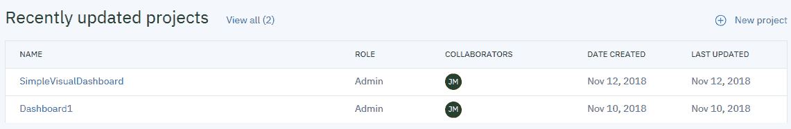

2.  接下来，选择一个项目启动者。我们将选择数据工程，如下面的屏幕截图所示(根据您的选择，您可能需要在这一步选择或提供所需的服务；对于我们的选择，不需要额外的服务):

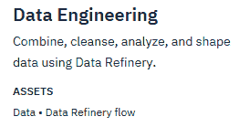

3.  在 New project 屏幕上，您可以添加项目的名称和描述，如下面的屏幕截图所示:

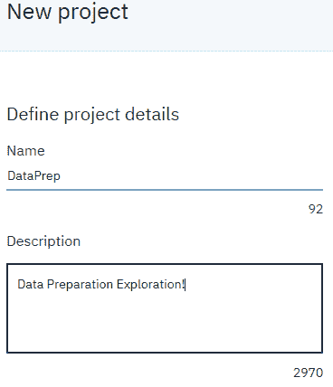

此时，您需要选择是否限制您可以添加为协作者的人员(在此示例中，我们将使用默认设置)，并且当您添加需要服务的资产时，系统可能会提示您添加服务(在此示例中，不需要其他服务，但是作为参考，您也可以在使用设置页面创建项目后添加其他服务)。

4.  接下来，单击 Create，如下面的屏幕截图所示:

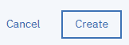

点击 Create 后，Watson Studio 将为您准备项目，显示如下图所示的对话框:

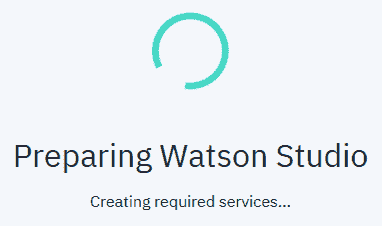

最后(通常只需要一两分钟)，您的新项目将会打开，准备就绪，您可以开始享受开发它的乐趣了！

<title>Data</title>  

# 数据

当然，每个项目都需要数据，所以下一步是向我们的项目添加数据。当您添加数据时，它被视为一个**数据资产**，默认情况下，项目的所有协作者都被自动授权访问该数据。通过以下步骤将数据文件添加到项目中:

1.  从项目的 Assets 页面，点击 Find and add data 图标，如下面的截图 *:* 所示

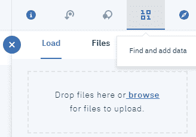

2.  接下来，单击 Load，然后浏览以找到该文件或将它拖到 Load 窗格上，如下面的屏幕截图所示:

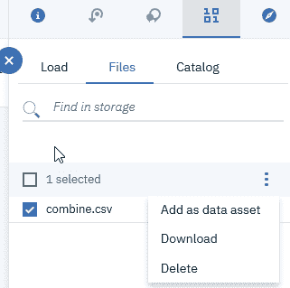

在加载完成之前，您必须停留在页面上。如果要停止加载文件，可以取消正在进行的加载过程。请注意，当文件正在加载时，实际上没有任何进度指示器，所以给它几分钟时间！！

我们在这个项目中使用的文件(`combine.csv`)是一个逗号分隔的文本文件，包含参加 NFL scouting combine 的球员的统计数据。

3.  您添加的文件保存在与您的项目相关联的对象存储箱中，并在您的项目的**资产**页面上作为数据资产列出(如您在前面的屏幕截图中所见)。在那里，您必须选择特定的文件，然后单击添加为数据资产。此时，系统会提示您单击 Apply，如下面的屏幕截图所示:

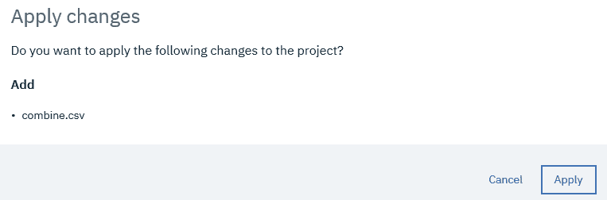

现在，我们准备在我们的项目中使用该文件:

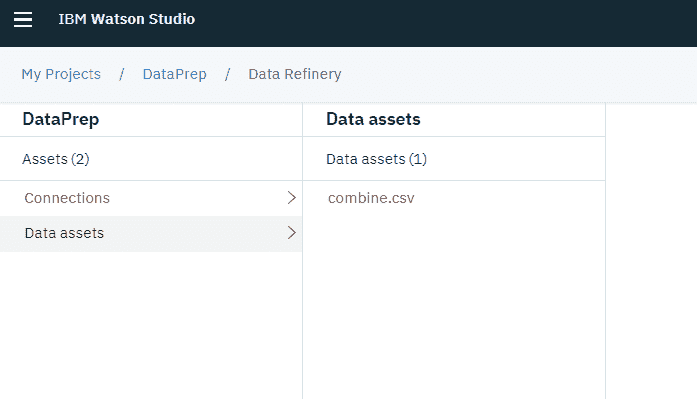<title>Adding the refinery</title>  

# 添加炼油厂

让我们通过以下步骤来添加精炼厂:

1.  要访问 IBM Watson Studio 数据精炼，您可以单击 Add to project，如下面的屏幕截图所示:

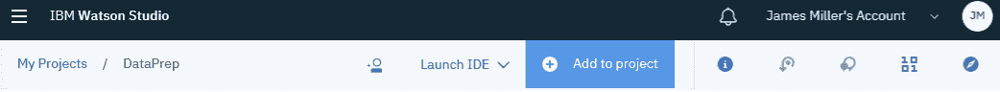

2.  然后，选择数据提炼流程，如下图所示:


3.  在您调用了 refinery 之后，您需要添加我们的数据文件(通过点击数据资产(文件))，然后点击页面右下角的 **Add** 。一旦数据被读入精炼厂(如下图所示)，您就可以处理它了:

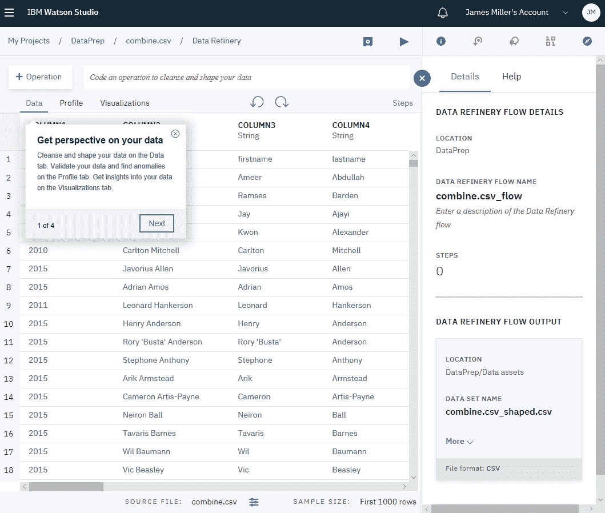<title>Refining data by using commands</title>  

# 使用命令优化数据

您可以使用命令(也称为**操作**)来预处理数据，而不是使用脚本来处理或细化数据。为此，您可以通过输入命令(或**操作名称**)开始，并让 Watson Studio 的自动完成功能帮助您找到正确的操作和语法(不涉及编程！).

请注意，如果您将鼠标悬停在任何操作或函数名称上，您将会看到完成该命令的描述和详细信息。

当您准备好时，您可以点击 Apply 将操作添加到您的数据提炼流程中。

例如，您可能希望对一列数据进行排序或重新排序。如果您开始键入`arra`，您将看到以下结果:

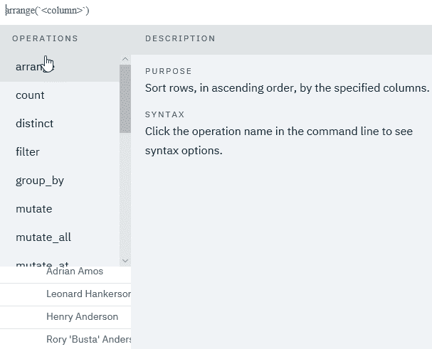

如果您随后单击选择 arrange()函数，您可以单击()并从数据文件中选择一列，如下面的屏幕截图所示:

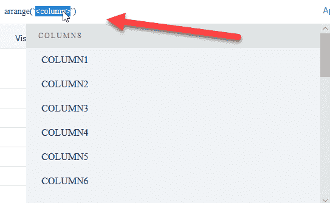

准备就绪后，单击 Apply 按钮将命令添加到数据提炼流程中，如下面的屏幕截图所示:


无需保存数据精炼(稍后将详细介绍)，Watson Studio 将显示对数据应用该命令的效果，如下面的屏幕截图所示:

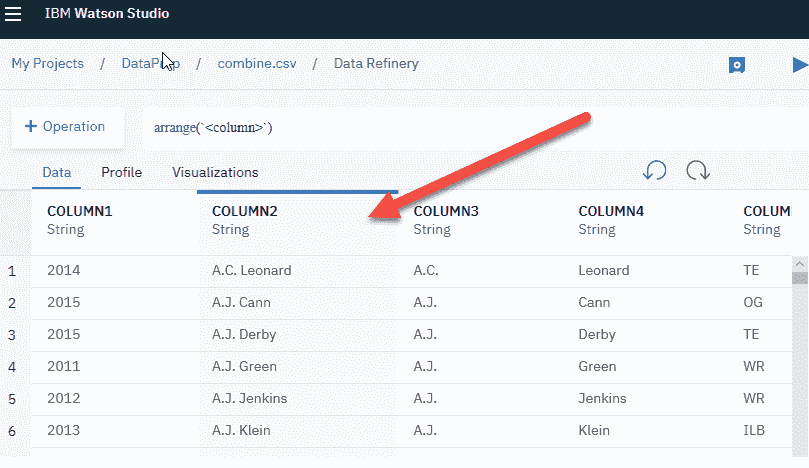

有许多命令可以添加到数据提炼流程中。每个命令都将作为流程中的一个步骤添加。如果您单击“步骤”(如下图所示),您可以查看和编辑您为流程定义的每个步骤；如果你愿意，你甚至可以删除它们。在我们的示例中，我添加了三个步骤:第一个步骤是排列(排序)数据，第二个步骤是将第一列从字符串转换为整数，第三个步骤是仅过滤出 2011 年之前的记录，如下面的屏幕截图所示:

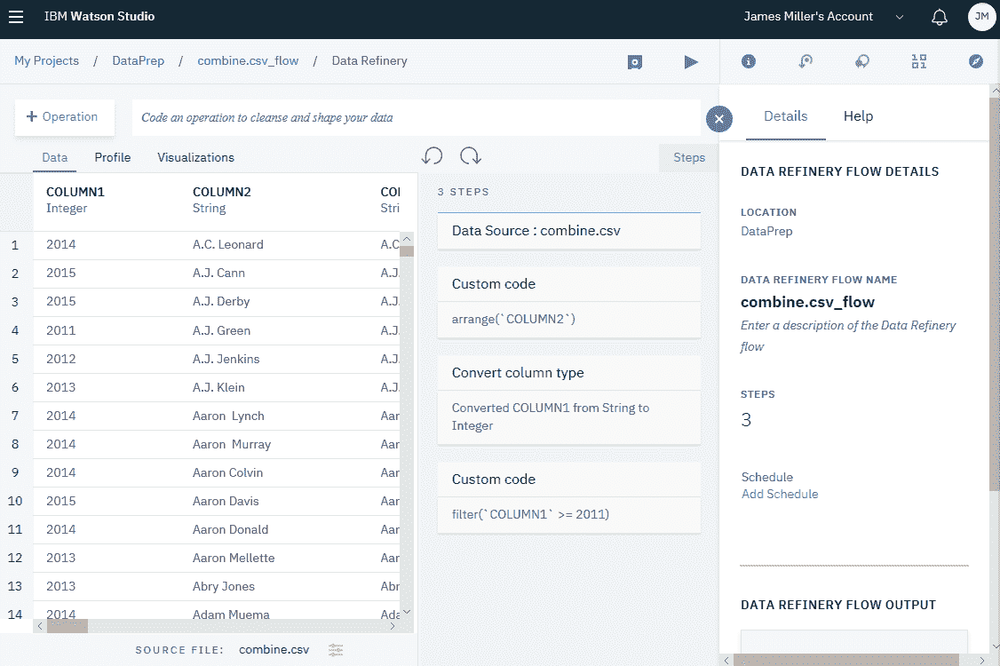

您可以随时通过单击保存数据提炼流程和运行数据提炼流程图标来保存和运行数据提炼流程，如下图所示:

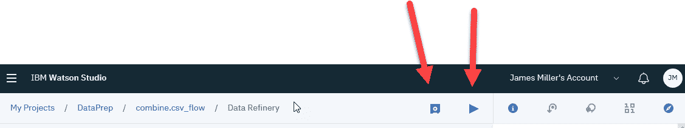

同样，有一些命令可以执行大多数机器学习项目中所需的几乎任何预处理任务，例如`group`、`rename`、`sample_n`和`summarize`。也许最重要的是，数据精炼为许多`dplyr`库操作、函数和逻辑操作符提供了脚本支持。例如，`sample_frac`和`sample_n`受到数据精炼的支持，对于为原始数据源生成样本数据集非常有用。

我们可以使用下面的命令获取我们的原始文件(`combine_.csv`)并创建一个数据提炼流程来生成一个样本:

```
Sample_n(199, replace=TRUE)
```

前面的命令将生成以下输出:

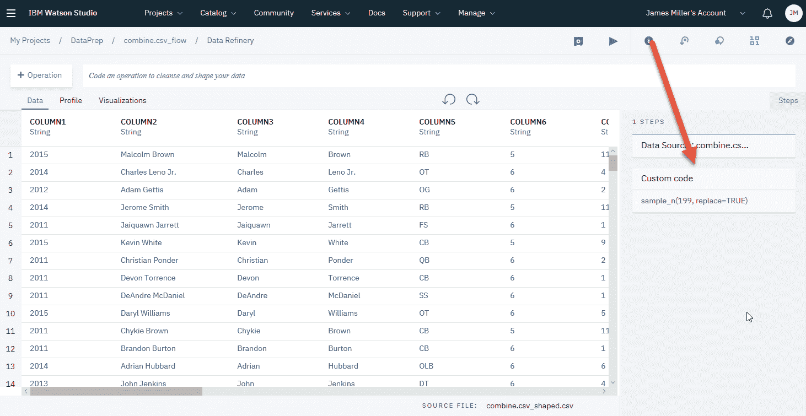

这将自动读取我们的原始文件，并根据指定的行数(在我们的例子中是 99)创建一个随机的数据样本。`replace`参数表示如果一个数据集已经以输出文件名存在，那么它将被覆盖。

在保存并运行数据提炼流程之后，我们将看到我们的结果摘要(以及我们之前运行的列表)，如下面的屏幕截图所示:

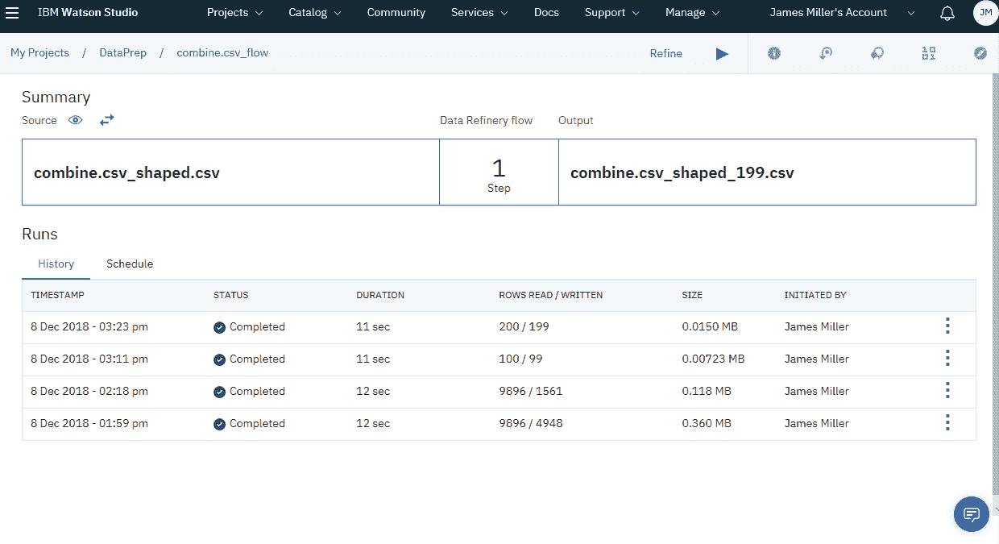

我们可以看到，我们已经从原始文件创建了一个示例文件，名为`combine.csv_sharped_199.csv`，如下面的截图所示:

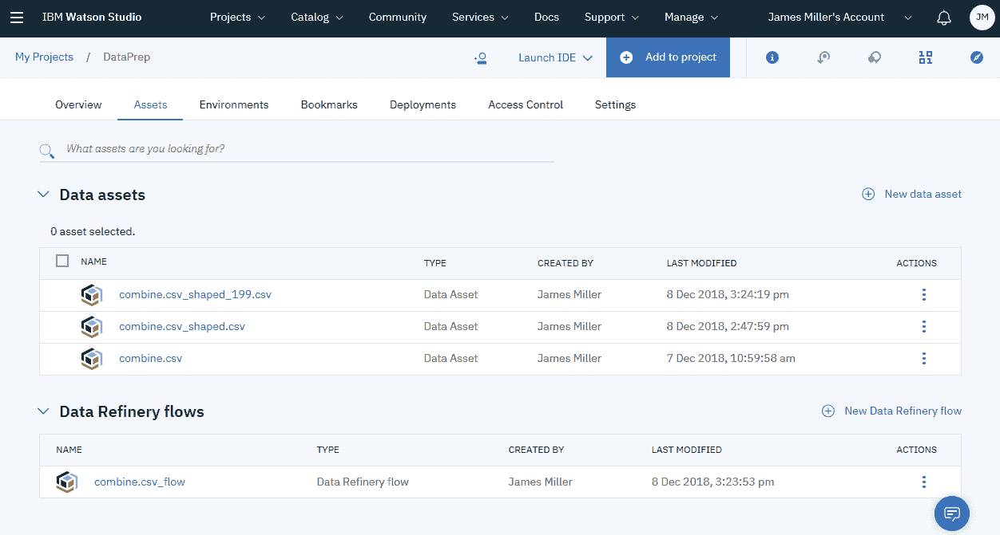

<title>Dimensional reduction</title>  

# 维度缩减

**降维**通常用于减少机器学习项目中要考虑的变量数量。它通常用于文件中的数据列缺少的值超过可接受的数量、方差很小或者本质上变化很大的情况。在试图通过删除那些不需要的列来减少数据源之前，您需要确信这样做是正确的。换句话说，您希望确保减少的数据不会对剩余的数据产生偏差。分析数据是确定特定一列或多列的维度缩减是否合适的极好方法。**数据** **剖析**是一种用于检查**数据**以确定其准确性和完整性的技术。这是检查**数据源**的过程，以发现**数据**中的错误部分。

您可以创建有效的脚本来实现这一点，正如所料，有许多包和库可供您下载和使用。然而，再次，沃森工作室可以很容易地为我们做到这一点。

通过创建数据资产概要，我们可以收集我们需要的信息来概要分析我们的数据源，而不需要脚本或编程。默认情况下，Watson Studio 创建的数据资产配置文件包括生成的元数据和关于数据文件文本内容的统计信息。

要为您的数据创建配置文件，您可以转到资产的配置文件页面，然后单击创建配置文件。

当数据更改时，您可以更新任何现有的配置文件。

单击创建配置文件后，将显示结果，如下面的屏幕截图所示:

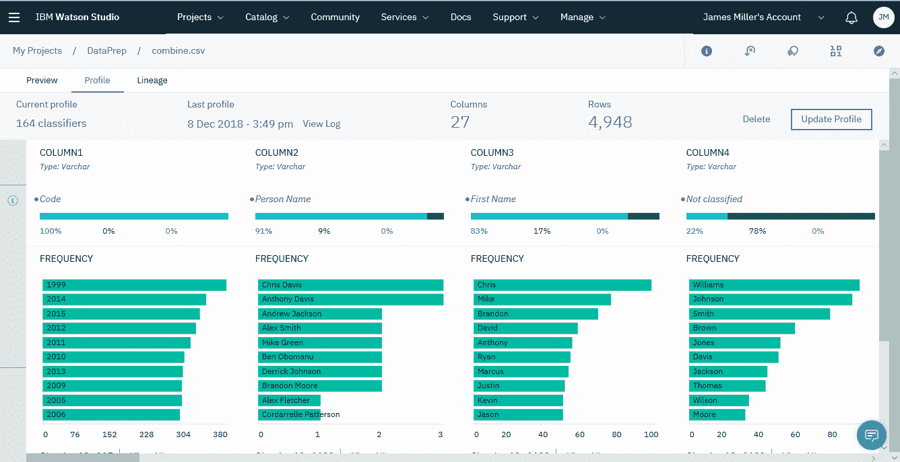

您可以花一两分钟的时间来浏览生成的概要文件，以查看各种统计数据，比如列和行的总数。您可以按列或数据点、值频率、唯一值、最小值/最大值、平均值等进行搜索。

<title>Data fusion</title>  

# 数据融合

数据融合不是数据分析实践，而是描述来自不同来源的数据的集成。令人欣慰的是，你会发现，你可以使用 Watson Studio 来收集和组合数据源，而不需要太多的努力。

使用 Watson Studio，您可以为您的所有数据源建立一个**目录**，这样您就可以轻松地找到并共享数据(和其他资产)。目录是环境或组织中定义的私有空间。这是一种跨多个数据科学项目组织资源的方法，这些资源包括数据资产和分析资产，并且可用于管理用户对这些资产的访问权限。

此功能特别令人兴奋的是，您可以在一个目录中组织和控制对许多不同类型资产的访问，包括:

*   文件中的数据
*   连接的数据
*   连接本身
*   文件夹
*   大量其他分析资产(我们将在本书后面进行实验)

<title>Catalog setup</title>  

# 目录设置

创建目录很容易。让我们通过以下步骤创建一个目录:

1.  首先单击目录，然后查看所有目录，然后单击新建目录，如下面的屏幕截图所示:

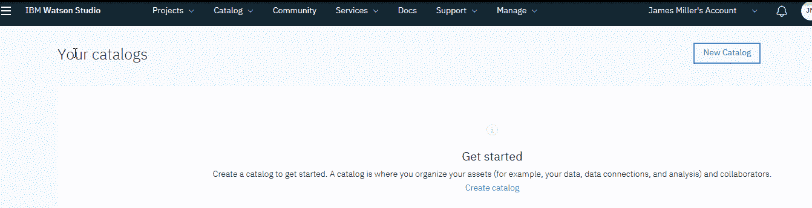

2.  然后提供一些基本信息，比如新目录的名称和描述，然后单击 Create，如下面的屏幕截图所示:

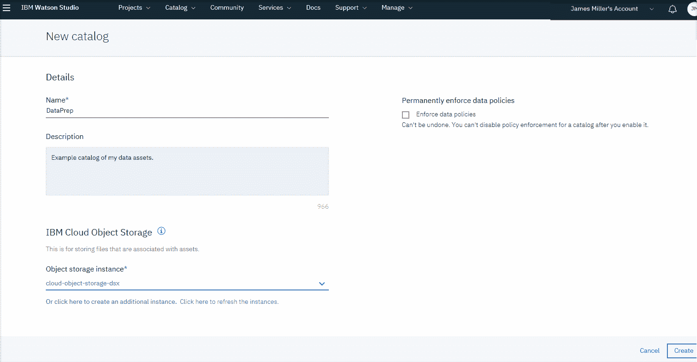

几乎是瞬间，新的目录就创建好了，可以使用了，如下图所示:

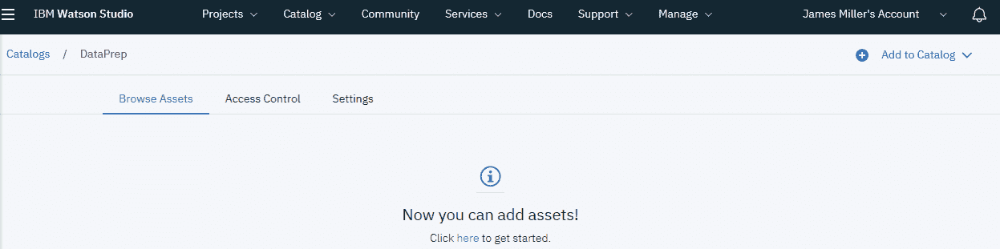

3.  要将一些资产添加到目录中，您可以单击“添加到目录”(在页面的右上角),然后选择要添加的资产类型(本地文件、连接的资产或连接),如以下屏幕截图所示:


4.  在这里，我们只是将一些本地文件添加到我们的目录中。单击本地文件后，将显示从本地文件添加数据资产页面(如下图所示)，您可以在其中浏览并选择要添加的文件:

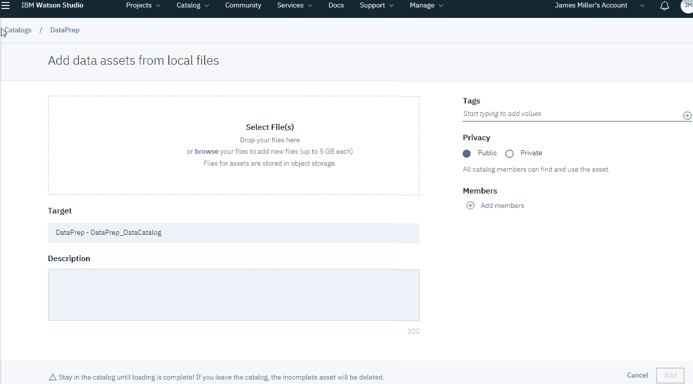

5.  将所有文件添加到此页面后，您必须单击 Add，如下面的屏幕截图所示:

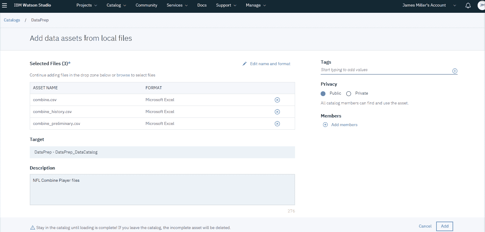

同样，在短暂的停顿之后，目录将被更新、组织并准备好使用，如下面的屏幕截图所示:

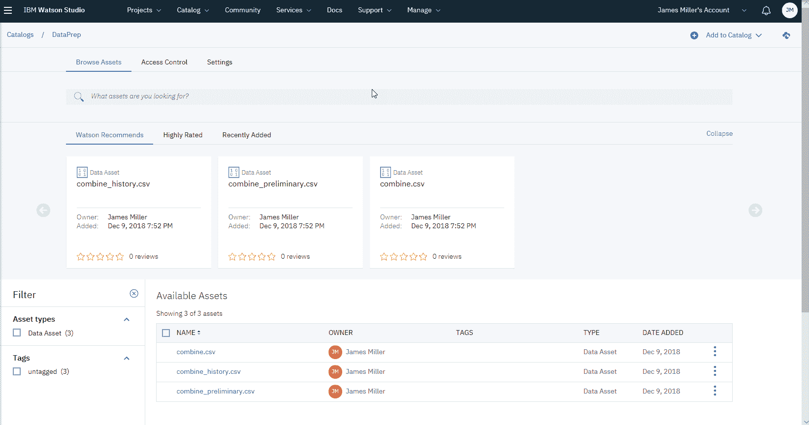

6.  创建和更新目录后，您可以通过单击“访问控制”来管理哪些人可以访问目录以及他们如何访问目录，如以下屏幕截图所示:

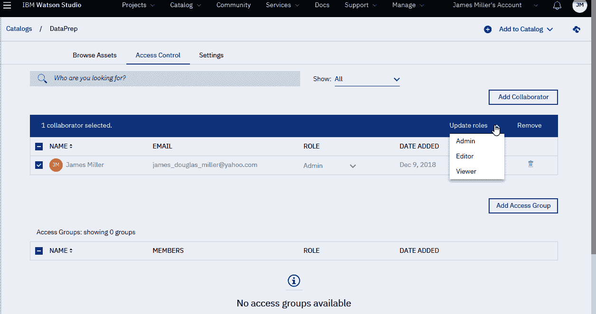

Watson Studio 目录允许协作者快速轻松地查找、预览、评定和使用目录中的每项资产。我们将在本书后面更详细地研究星表。

<title>Recommended assets</title>  

# 推荐资产

Watson Studio 目录的另一个很酷的功能是，Watson Studio 实际上使用 **Watson Machine Learning** 来根据您已经查看、创建并添加到项目中的资产的公共属性(如标签、资产分类、属性分类器、数据类型、资产所有者和资产类型)来导出您尚未访问的资产列表。您访问和编目的资产越多，推荐就越好。同样，我们将在本书后面的章节中深入探讨这个特性！

<title>A bag of tricks</title>  

# 一整套巧妙的计划

你在处理数据时越有条理，你就越有可能取得一致和更好的结果(任何项目)。为机器学习算法准备数据的过程(选择、预处理和转换)可以使用 IBM Watson Studio 来完成，只需要很少的编程或脚本，并且通过利用数据精炼和目录功能，您在开始时所做的工作可以反复使用，只需要很少或不需要返工。

这里有一些临别赠言:

*   花时间为您的资产添加描述，并始终使用描述性名称
*   管理好您的数据资产:立即删除无关的副本或测试版本，并保持您的目录整洁
*   虔诚地使用剖析功能，以更好地了解您的资产
*   通过管理项目和资产协作者来控制谁可以访问您的资产

<title>Summary</title>  

# 摘要

在本章中，我们直接使用 IBM Watson Studio 的各种特性来完成各种数据预处理和设置目标，例如使用内置的 R 库进行数据预处理、降维和数据融合。然后我们提供了一些建议来节省你准备 ML 项目的时间。

在下一章，我们将研究机器学习范式，并关注各种方法和算法。本章将首先给出机器学习中模型评估、模型选择和算法选择的实际背景，然后将涵盖监督学习。