# 数据的监督机器学习模型

这一章(连同前两章)是整本书的主干。它提供了一个机器学习范例之旅——通过 IBM Cloud 和 IBM Watson 平台提供的特性和功能，重点关注众所周知的方法和算法。我们将从给出机器学习中的模型评估、模型选择和算法选择的实际背景开始这一章。接下来，我们将看看 IBM 云平台如何帮助简化和快速跟踪整个过程。

此外，本章将讨论用于分类和回归问题的机器学习算法，并再次使用 IBM 云平台讨论这些主题。在本章结束时，读者应该不仅能够理解选择适当的分类技术和估计器所涉及的概念，而且能够使用 IBM Cloud 为手头的数据构建和部署基本的机器学习模型。

我们将本章分为以下几个部分:

*   型号选择
*   测试模型
*   分类
*   回归
*   测试预测能力

# 型号选择

机器学习已经变得越来越普通，根据你的数据和目标理解使用哪种机器学习算法(或模型类型)很重要，如果你对这个过程相对陌生，这可能会令人生畏。将模型拟合到训练数据是一回事，但您如何知道您选择的模型(技术)或算法将很好地推广到您的所有数据并创建最佳预测呢？过多的训练或者过度的适应并不能解决这个问题；事实上，在这种情况下，对于全新的数据，模型通常表现不佳。

IBM 云平台再次提供了强大而实用的工具来帮助您完成这个过程。

云提供机器学习服务(IBM Watson 机器学习)。该服务提供了使用持续学习系统管理您开发的机器学习模型的能力，以及一种简单的部署方法，包括在线、批处理和流模式。

你可以点击以下链接了解更多关于 IBM Watson 机器学习的信息:[https://console . bluemix . net/catalog/services/Machine-Learning](https://console.bluemix.net/catalog/services/machine-learning)。

此外，IBM Watson Studio 中提供的模型构建器(包括教程和样本数据集，以说明如何在不需要编码的情况下训练不同类型的机器学习模型)可以让您快速完成模型选择(甚至评估和部署)的任务，这可能很繁琐。

在本章的后面，我们将引用提供的数据资产来说明让读者理解选择模型类型的过程、训练模型的步骤以及评估模型性能的过程。

# IBM Watson Studio 模型构建器

IBM Watson Studio 中的模型构建器是一个图形工具，它实际上一步一步地指导您构建第一个机器学习模型。模型构建器利用以下工作流:

1.  将数据上传至列车
2.  选择一种机器学习技术和算法
3.  训练和评估模型
4.  测试和部署模型

模型构建器(目前)专注于创建三种基本类型的机器学习模型技术(对于大多数机器学习项目来说，这通常是绰绰有余的)。此外，对于每种模型，您可以从模型中选择多种算法来实现。这些被称为模型技术。

构建机器学习解决方案的一部分焦虑是选择要使用的适当的 ML 算法。如果不确定，或者为了节省时间，至少在最初的几次尝试中，您可能希望使用让模型构建器根据您提供的训练数据自动为您选择算法的选项。模型技术包括以下内容:

*   **二元分类器**:将数据分为两类
*   **多类分类器**:将数据分为多个类别
*   **回归**:从一组连续的值中预测一个值

# 使用模型构建器

现在，让我们逐步了解一些使用模型构建器的初始示例:

1.  要使用模型构建器，您需要将 Watson 机器学习服务作为资产添加到新的或现有的项目中(这被称为将服务与项目相关联)。要在您的项目中执行此操作，您可以单击 Add to project，然后选择 WATSON MACHINE LEARNING service 作为资产类型，如下面的屏幕截图所示:

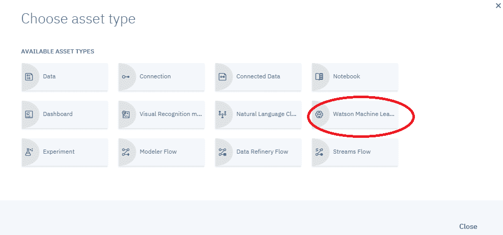

2.  将该服务添加到项目中后，您只需点击 models 下的 New Watson Machine Learning model，即可创建新模型并将其添加到项目中:

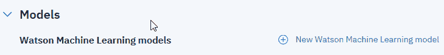

3.  在“新型号”页面上(如下图所示)，您必须提供新型号的基本详细信息，如下所示:

*   名称:新型号的名称。
*   描述:对您的模型的描述。
*   机器学习服务:模型将使用的服务(还有其他服务，但是现在，我们将选择 IBM Watson 机器学习服务:Machine Learning-bg)。
*   选择模型类型:在第一次尝试中，我们希望让模型构建器帮助我们选择模型类型和算法，因此您可以选择 Automatic。
*   选择运行时:选择运行时环境(现在只使用默认的 Spark Scala 2.11 选项)。运行时环境是内存、空间和 CPU 的组合，会影响定价和成本。可以在线查看各种运行时的详细信息([https://data platform . cloud . IBM . com/docs/content/wsj/console/environment-runtimes . html](https://dataplatform.cloud.ibm.com/docs/content/wsj/console/environment-runtimes.html))。

4.  最后，您可以点击创建:

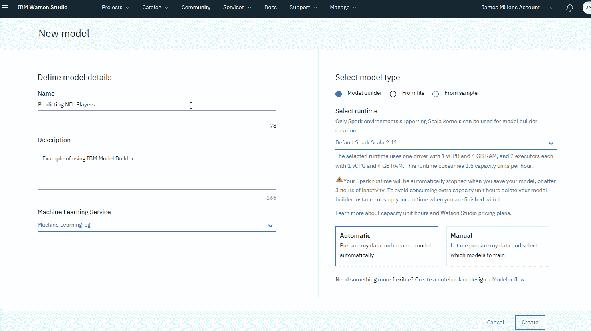

Scala 已经很受欢迎，被许多公司广泛使用。Scala 和 Spark 正在脸书、Pinterest、网飞、Conviva 和猫途鹰用于大数据和机器学习应用。IBM 云平台将 Scala 作为其默认设置之一。

如果您错过或跳过关联机器学习服务的步骤，当您单击创建时，您将看到以下消息:

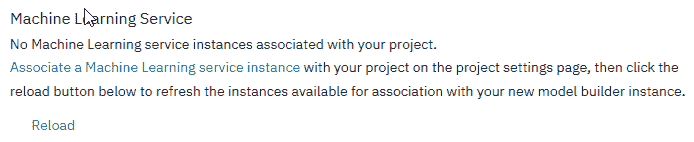

5.  如果您确实看到此消息，您需要单击关联机器学习服务实例链接，选择一个服务，然后单击重新加载，然后才能继续创建模型。

# 训练用数据

此时，我们需要为我们的模型选择一些训练数据。因此，从“选择数据资产”页面，我们需要找到我们特定的数据资产(文件)，单击它左侧的选择单选按钮，然后单击“下一步”:

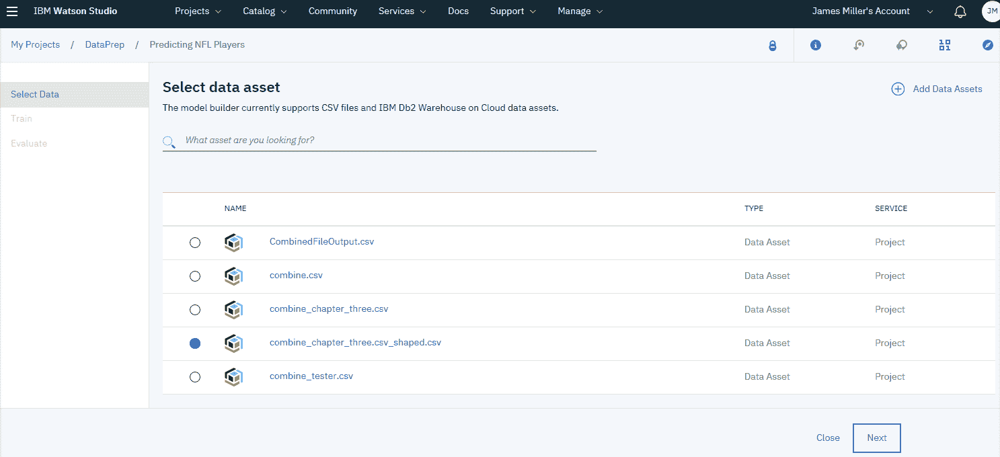

请注意,“选择数据资产”页面使确定使用哪个数据资产来训练模型变得很容易，它具有诸如“单击以预览数据”这样的功能:

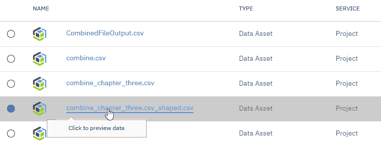

将鼠标悬停在任何列出的资产上，然后点击它(点击预览日期)，Watson 将检索并加载数据供您查看。

您不能在此修改或细化数据，但可以滚动浏览数据以确保这是您想要用来训练模型的数据资产。如果您确定要在您的模型中使用这些数据，您可以点击使用这些数据:

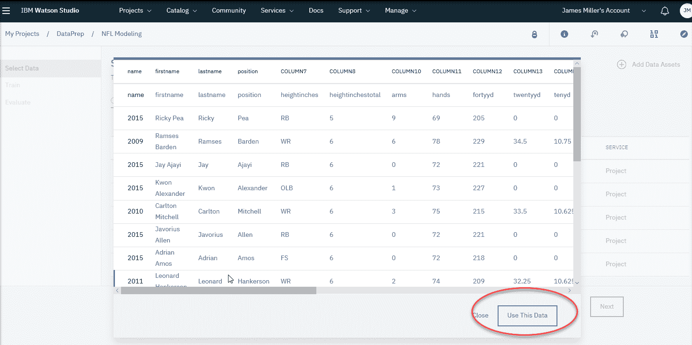

此时，是时候从三种建模技术中选择一种来使用了。首先，选择要预测的内容(数据文件中的列，称为标签列，您希望模型预测其值)和用于确定预测的列。这些被称为数据资产中的数据列，模型应该以这些列为特征，或者称为特征列。

然后，您可以使用模型构建器建议的技术(或换句话说算法)或选择您自己的技术:

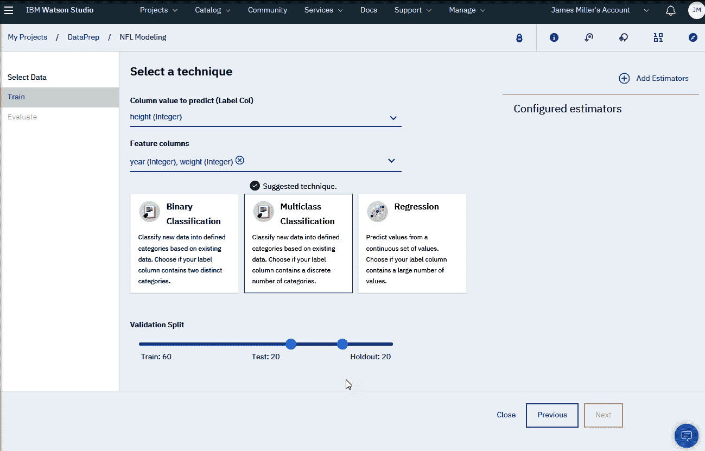

使用模型构建器的一个明显优势是，可以说，您可以在购买之前轻松地进行尝试。换句话说，如果您不确定选择和使用哪种建模技术，您有机会以最小的投资快速使用和评估每个选项。在前面的例子中，我选择使用一个非常简单的幽会:我希望模型在给定体重的情况下，预测某个球员在选定年份(或 NFL 赛季)的身高。

查看提供的模型技术选项，多类分类是将实例分类到三个或更多类中的一个的过程；**二元分类**；是将实例分类为两个类中的一个，而回归可以处理大量的类。

# 猜测使用哪种技术

在本例中，身高的值很可能有两个以上的可能值，因此我们可以选择多类分类甚至回归。同样，由于模型构建器可以快速完成这项工作，所以最好尝试这两种方法，然后评估结果。

接下来，如果您指定了手动方法(或选择了手动模式)来构建模型，您必须单击“添加评估者”(在页面的右上角)来选择一个或多个特定的评估者。选择正确的模型估计器通常比选择技术更难。对于不同类型的数据和解决不同的问题，不同的估计值是更好的匹配。

正如我们将在本章后面看到的，模型构建器允许您为同一模型选择多个估计器，并对每个估计器进行训练，这样您就可以在同一页面上轻松地比较和对比每个估计器的性能结果。

使用模型构建器，根据所选的分类技术，您将有许多估计器可供选择(如下面的屏幕截图所示)。例如，我们选择了多类分类，因此您可以选择以下估计值之一:

*   决策树分类器
*   随机预测分类器
*   朴素贝叶斯

在这里，我们将选择随机森林分类器估计值，并单击添加:

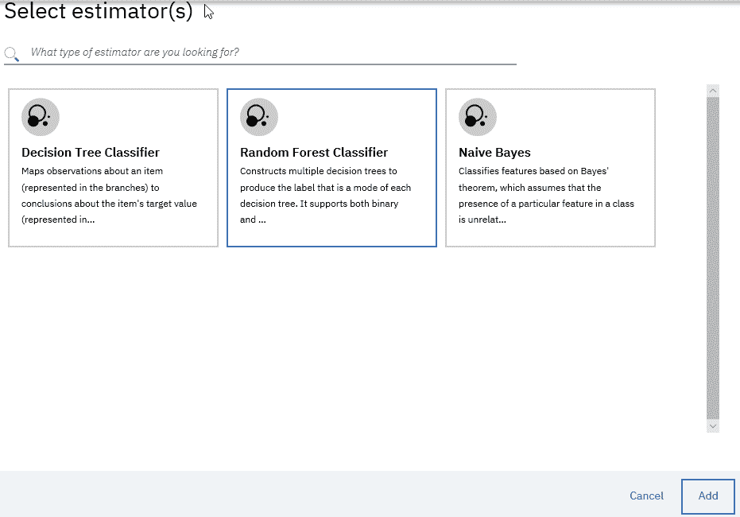

单击 Add，然后单击 Next，模型将根据所选的数据、技术和估计值进行训练。然后，结果将被发布到“选择模型”页面(如下面的屏幕截图所示)，在该页面中，您可以单击“保存”来保存模型结果以供评估:

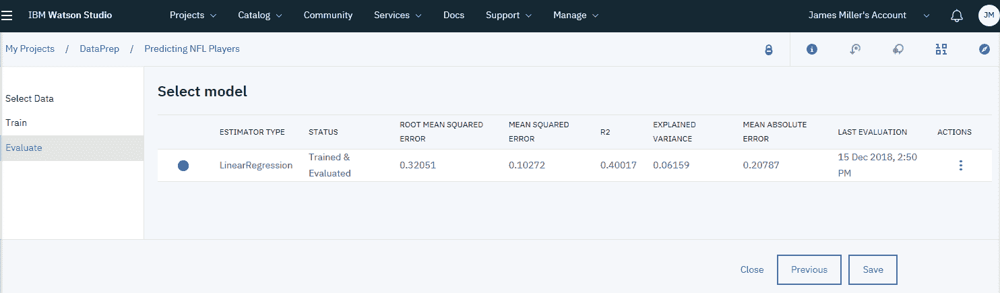

Watson 机器学习模型(使用模型构建器创建)成为一项资产，并在 IBM Watson Studio 项目页面上列出(如上所示),供以后参考、改进和重用。

值得一提的是，学习如何选择分类技术(算法)和估计器的方法是通过对模型构建器进行实验。换句话说，使用更广泛的分类和特征选择术语，模型构建器现在使其足够有效和高效，可以用各种方法测试假设，轻松评估结果，然后部署最佳拟合(在本章的后面部分和本书中有更多关于评估模型性能和准确性的内容)作为具有新的和看不见的数据的连续学习模型。

我们将在本章后面的实验中看到更多关于这个过程的内容。

# 部署

由于面临各种挑战，部署预测模型以便在日常决策中加以利用通常是一个有点复杂的过程，让我们面对现实吧——从未部署的预测模型永远不会增加价值。

当您使用 IBM Watson Studio 模型构建器创建模型时，您可以在训练模型之后直接从模型构建器部署模型。更好的是，在您部署您的模型之后，您可以为您的模型建立一个持续的学习和评估过程。

当您部署一个模型时，您将它保存到与 Watson 机器学习服务相关联的模型库中，然后您可以使用您部署的模型对数据进行评分并构建应用。

# 模型生成器部署步骤

要部署我们的预测模型，我们可以使用以下步骤:

1.  在模型页面上，单击添加部署。
2.  在“部署模型”页面上，选择在线部署类型，并输入部署名称和描述。
3.  点击部署。
4.  模型部署完成后，从 ACTIONS 菜单(在下面的屏幕截图中圈出)中，单击 View:

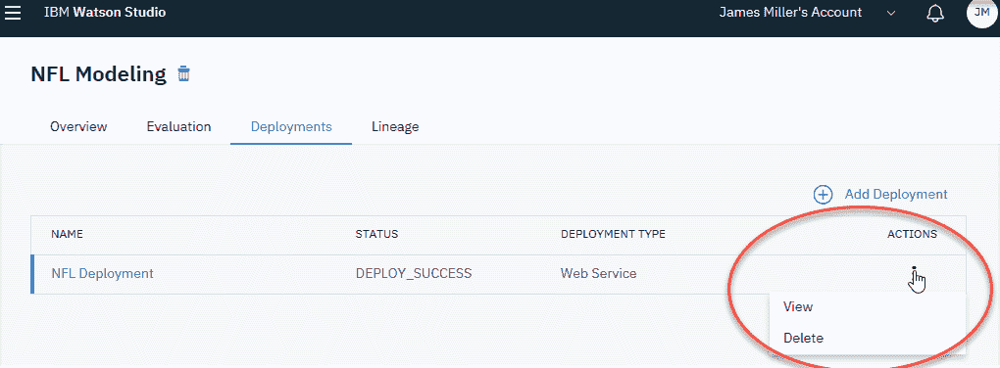

将出现“部署详细信息”窗口，显示三个选项卡:概述、实现和测试(如下面的屏幕截图所示):

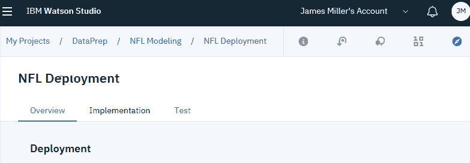

# 测试模型

现在是时候看看如何在 IBM Watson Studio 中测试模型预测了。为此，您可以点击测试:

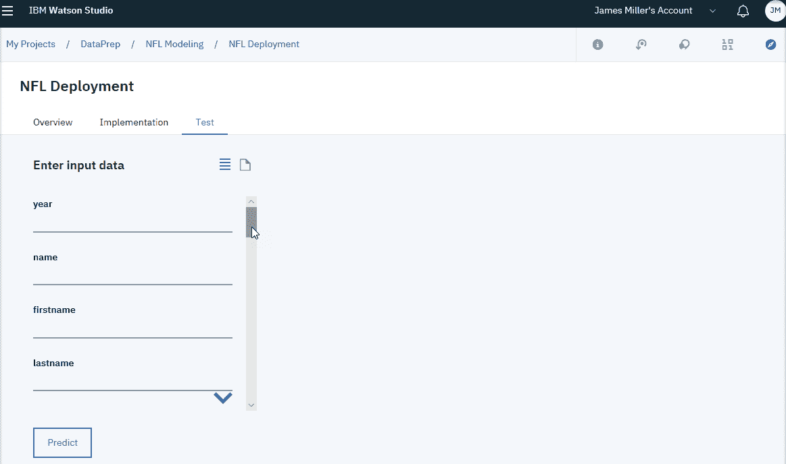

生成的默认测试格式向您展示了一个输入表单，您可以使用它来输入数据值。稍后，您将会看到，如果您有一个生成测试数据的外部流程，您可以使用输入格式图标来使用 JSON 数据文件格式并粘贴您的数据测试值:

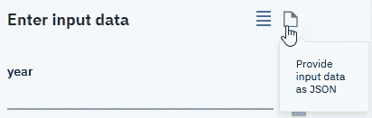

现在(停留在 Test 选项卡上)，保留默认格式(输入表单)并为重要的列输入一些值(输入数据表单由数据集中的示例记录填充)。要测试模型，请更改值并单击预测:

1.  对于年份，输入`2016`
2.  对于位置，输入`QB`
3.  对于重量，输入`225`
4.  点击预测

一旦您的模型测试完成，IBM Watson Studio 将显示该列预测结果的能力的图形分数(带有百分比)。在下面的例子中，字段 5 和字段 6 分别是**位置**和**权重**，我们可以通过模型的性能得分看出它们预测结果的能力:

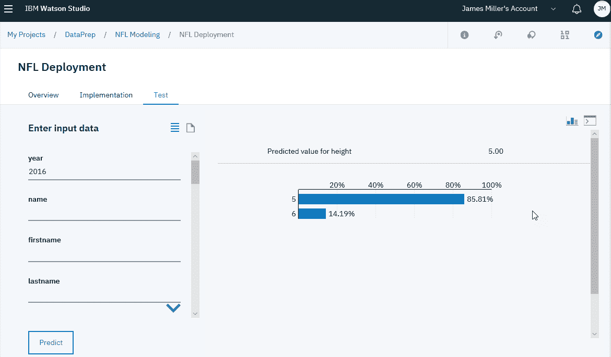

因此，考虑到前面的输出，我们也许可以得出结论，在我们的 NFL 球员统计文件中，球员的位置是一个很好的指示球员身高的指标。

如果您愿意，可以单击输出格式图标(在下面的屏幕截图中用圆圈表示)，将性能信息转换为原始输出(查看原始输出):

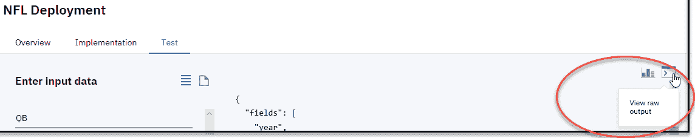

当您以这种方式部署您的模型时(使用 Watson Studio deploy)，部署是一次性事件。换句话说，您输入您的数据，根据数据训练模型，然后查看性能结果并得出您的结论。

这适用于探索和调查目的，但实际上，您可能希望保留模型，并在新数据可用时继续用新数据训练模型。为此，您可以使用 IBM Watson 机器学习连续学习系统，该系统提供了对模型性能的自动监控(将在本章的下一节中简要讨论)、重新训练和重新部署，以确保模型的预测质量。

# 持续学习和模型评估

虽然在本章中我们不会花时间深入探讨这个主题，但是 IBM Watson Studio 确实提供了一种简单的方法来完成这个任务，使用您使用模型构建器开发和部署的模型。这种方法确实需要选择一个 Spark 服务或环境选项，并建立一个反馈数据存储作为项目资源，其中将保留(保存)最终的模型性能度量。

可以使用以下屏幕截图中显示的“配置性能监视”页面来配置这些资源:

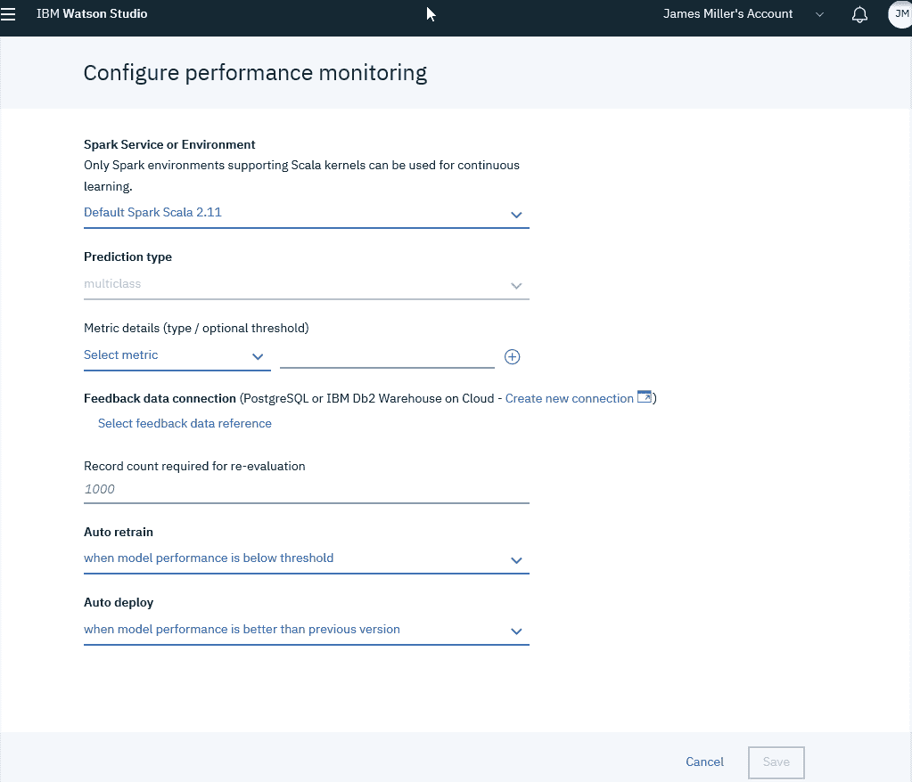

建立(反馈)数据存储后，您可以使用 Watson Studio 和 model builder 轻松定义指标和触发器，作为持续学习过程的一部分，并定期查看更新的模型性能指标，使用图表控件切换指标或以图表或表格的形式查看结果。

# 分类

分类是机器学习和统计学中的一个关键概念。我们已经展示了模型构建器提供了二元和多类分类技术(以及回归)。在本章的前面，我们使用了模型构建器，并任意选择了一种分类技术，只是为了展示使用该工具构建、训练和部署模型是多么容易。在本节中，我们将仔细研究每种技术，并根据我们的训练数据，选择最有意义的技术。

# 二元分类

二进制(也称为**二项式**)分类是根据一个分类规则将给定集合的元素分成两组的过程。产品文档提供了一个很好的示例练习，您可以使用它来理解二元分类何时可能是您的模型的最佳选择。该示例训练一个模型，在给定训练数据示例的情况下，预测客户是否可能从户外装备商店购买帐篷。如果您继续下载示例数据，然后检查这些列，您就可以理解二进制分类是如何工作的。我们来分析一下练习。

我们希望建立一个模型，预测给定的客户是否有可能购买特定的产品；在这种情况下，一个帐篷。假设我们再次使用模型构建器来创建一个新的模型，加载所提供的样本数据，并设置基本的模型细节。

流程如下:

1.  定义标签列。在这个例子中，选择是`IS_TENT`。该列指示客户是否购买了帐篷。
2.  定义特征列。特征列是数据中包含特征的列，机器学习模型将基于这些特征进行预测。在该历史数据中，有以下四个特征列:

*   `GENDER`:客户性别
*   `AGE`:客户年龄
*   `MARITAL_STATUS` : `Married`、`Single`或`Unspecified`
*   `PROFESSION`:客户职业的一般类别，如接待或销售，或简单的其他

3.  将构建类型设置为自动(这将使模型构建器自动选择一种算法来实现您指定的机器学习技术)。
4.  点击创建并添加训练数据。

为了训练模型，您将指定前面的标签和特征列，然后选择机器学习技术:二元分类。保存模型后，模型详细信息页面将自动打开。要查看模型构建器使用的算法，您可以转到模型详细信息页面上概述信息中的摘要表(如下图所示),然后单击模型构建器详细信息行中的查看:

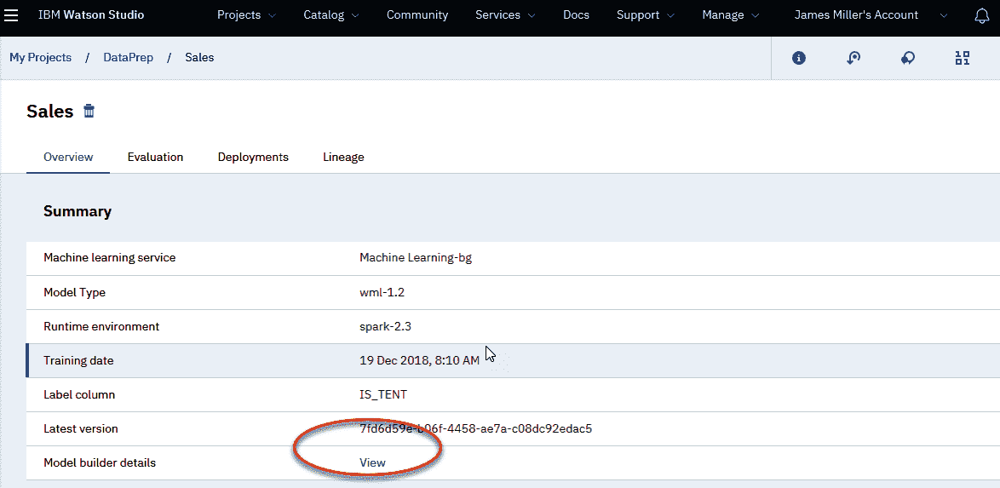

这将显示以下详细信息以供审查:

您可以看到，在我们选择了二元分类后，模型构建器选择了 LogisticRegression 作为估计量的最佳选择。当因变量为二分变量时，通常选择逻辑回归。在我们的例子中，因变量是我们的标签列，`IS_TENT`。

考虑到我们的数据和目标，结论是选择二进制分类作为技术，因为我们希望将数据分类到定义的类别中(考虑如何对训练数据中的记录进行分组，例如:男性，已婚，从事销售工作；男性，单身，从事专业工作；以此类推)。选择使用的估计值(逻辑回归)是因为，同样，因变量是二元的(将购买或不购买)。

将样本数据值与所选择的技术和估计量对齐，这些选择背后的推理应该开始变得有意义。最好继续试验数据和模型构建器，以进一步熟悉这些概念。

# 多类分类

多类(也称为**多项式**)分类是将预先安排的集合中的元素分类为三个或更多组中的一个的职责。同样，产品文档提供了一个很好的例子:训练一个模型来预测户外设备商店中的客户最有可能对哪个产品类别感兴趣。

在前面的部分中，示例使用了相同的数据，但是这个示例用例希望确定产品类别(组)作为结果，而不是特定的购买决策。本例中构建的模型将预测给定客户最有可能对哪个产品线感兴趣。

逐步执行示例流程，我们将拥有相同的训练数据和相同的特性列(与前面的示例相同)，但是标签列不同:`PRODUCT_LINE`。此外，在本例中，不要选择自动，而是选择手动，以便您可以选择模型使用的特定算法。

因此，为了训练这个模型，您将指定前面的标签和特征列，然后选择机器学习技术:多类分类。本练习的另一个不同之处是，我们希望为模型添加两个评估器(算法选择),以便我们可以比较每个性能:

1.  单击添加估计量查看可用于模型构建器中多类分类技术的估计量(算法)。
2.  单击标有朴素贝叶斯的卡片，然后单击添加。
3.  再次点击添加估价人。
4.  单击标有随机森林分类器的卡片，然后单击添加:

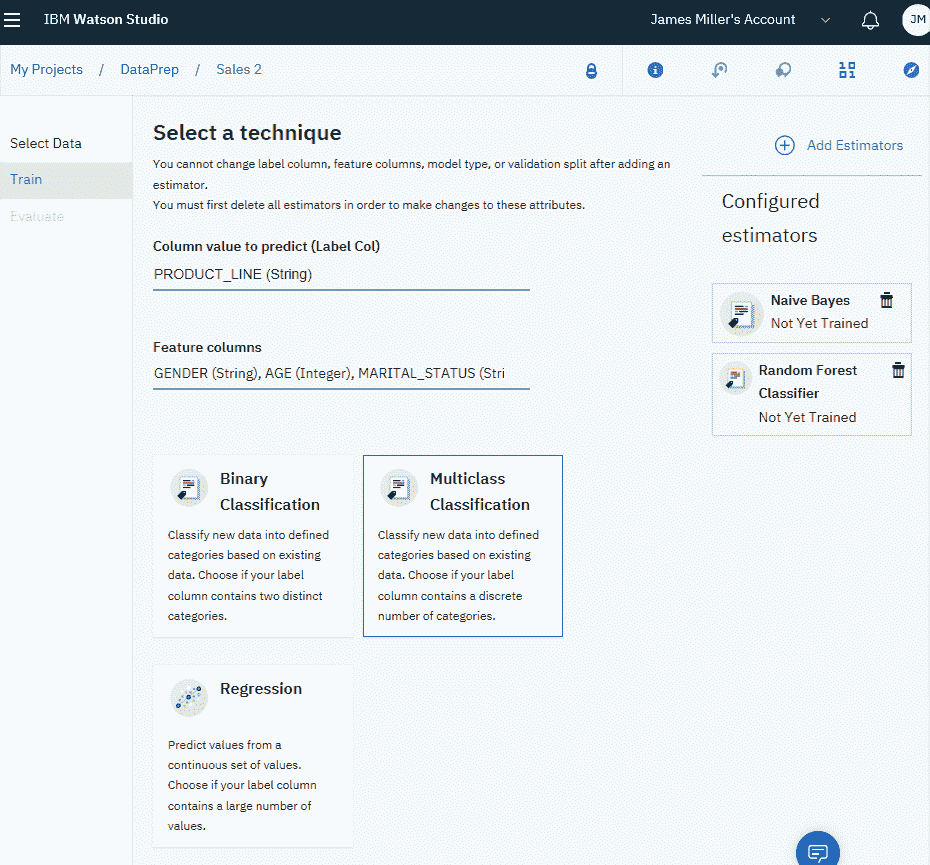

模型构建器的一个简洁功能是，在训练完成后，您可以看到对两种算法选择的评估(如下面的屏幕截图所示):

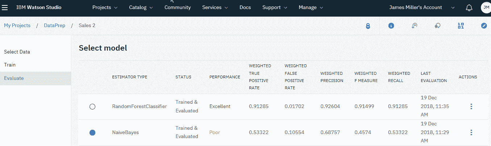

在前面的截图中，您可以看到使用朴素贝叶斯的模型的性能评估被评为差，而使用随机森林分类的模型的性能则非常好。考虑下面这些，正如我在本章中已经提到的，甚至在产品文档中也提到了。

“为了找到给定机器学习问题的最佳解决方案，有时您必须对您的训练数据、模型设计和/或使用的算法进行实验。使用模型构建器，您可以轻松地比较使用的不同算法的结果(以更好地了解最佳选择应该是什么)。”

这是非常好和实用的建议，尤其是对那些相对较新的机器学习器来说。

现在让我们进入本章的最后一个主题:回归。

# 回归

回归本质上是一种统计方法，用于寻找变量之间的关系。在机器学习中，这用于根据从数据集获得的变量之间的关系来预测事件的结果。

正如我们在之前的模型训练选项中看到的那样，产品文档为我们提供了一个非常好的示例练习，我们可以用它来说明机器学习的回归方法:训练一个模型来预测客户在户外装备商店的旅行中可能花费的金额。

同样，我们将回顾本练习所需的适当步骤。在本练习中，我们将选择以下内容:

*   `PURCHASE_AMOUNT`(顾客每次光顾商店的平均消费金额)作为我们的标签列
*   `GENDER`、`AGE`、`MARITAL_STATUS`、`PROFESSION`为我们的特色栏目

接下来，与上一节的练习一样，我们将再次单击 Manual，以便能够选择模型使用的特定算法(而不是让模型构建器为我们选择)，然后执行以下步骤:

1.  对于“选择一种技术”选项(如下图所示)，选择“回归”。
2.  添加名为梯度增强树回归的估计量。下面的屏幕截图显示了我们为此练习模型构建选择的参数:

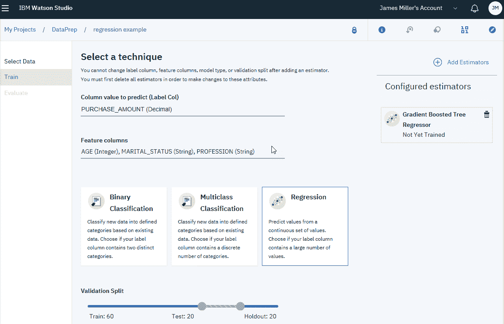

3.  设置好前面的细节后，您可以单击 Next，使用所选的技术和估计器，开始用样本数据训练模型。训练完成后，您可以单击保存。当然，保存模型后，模型详细信息页面会自动打开:

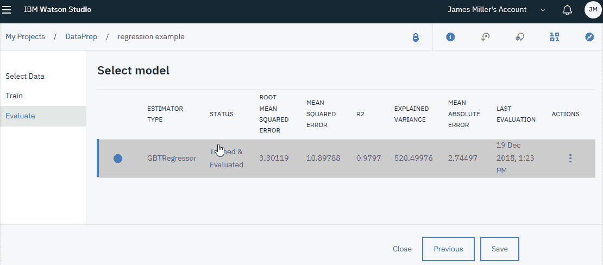

4.  通常，要验证模型构建器使用的算法，您可以再次转到模型详细信息页面上概述信息中的摘要表(如下图所示),并单击模型构建器详细信息行中的查看:

# 测试预测能力

模型构建器的另一个有用特性是，它使您能够轻松测试已部署模型的预测能力，而无需进行任何编程。

要从“部署详细信息”页面测试已部署的模型，请执行以下步骤:

1.  首先，在 deployment details 页面的 Test 区域，会有一个简单的输入表单(见下面的截图)，您可以在其中为特性列键入一些值:`GENDER`、`AGE`、`MARITAL_STATUS`和`PROFESSION`(您可以忽略表单中的其他字段):

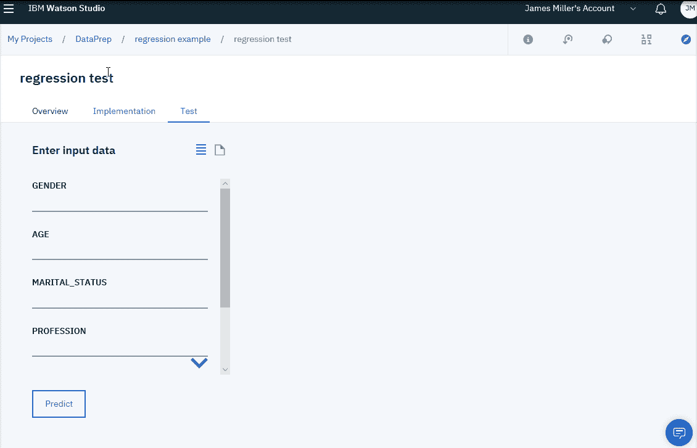

2.  接下来，单击 Predict，根据您刚才输入的值和您建立的模型创建一个预测。这将是对具有所输入属性的顾客在去商店的一次旅行中可能花费多少钱的预测。下面的截图显示了一个测试的结果。预计花费金额为 118.81 美元:

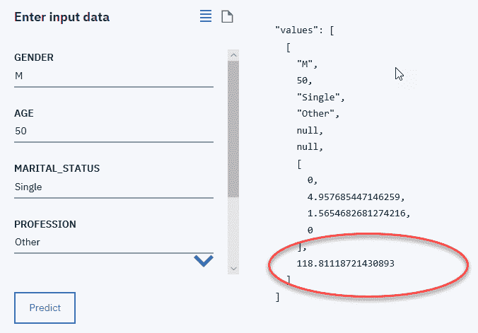

正如文档所建议的，您可以从训练文件中提取额外的值组合，并将它们输入到输入数据表单中，以进行额外的测试。

# 摘要

在这一章中，我们讨论了模型选择的意义；具体来说，选择分类技术和相关的估计。我们看到了如何使用 IBM 云平台和 Watson Studio 以高效和有效的方式提供了一种探索各种技术和评估器的性能的方法。使用这个简单的探索过程，您可以确信您选择的模型很好地符合数据。我们还看到了如何使用 Watson Studio 来构建、部署和测试一个模型，并为持续学习而配置它。

在下一章，我们将讨论监督学习和非监督学习的区别，以及半监督学习。此外，我们将研究聚类算法的概念，并检查在线学习与批量学习的对比。