# IBM Cloud 上的机器学习训练

在本章中，我们将使用 IBM 云平台进行几个示例机器学习(ML)练习，以揭示作为机器学习编程语言选择的 **Python** 语言的强大功能，并查看 IBM Watson Studio 提供的机器学习服务。

本章将使您能够理解适当的特征工程的实践，并演示使用 IBM Watson Studio 在 IBM Cloud 中运行**监督**(分类)和**非监督**(聚类)算法的能力。

通过简单的实践示例，本章将指导您使用 IBM Watson Studio 实现各种机器学习项目的步骤。

我们将本章分为以下几个部分:

*   沃森工作室和 Python
*   数据清理和准备
*   k 均值聚类示例
*   K 近邻示例
*   时间序列预测示例


# 沃森工作室和 Python

如前所述，Python 很可能是(至少目前是)预测建模和数据科学项目最常选择的编程或脚本语言。这类计算领域的一个重大进步是 **Jupyter** **Notebook** (前身为 IPython) 技术。

Jupyter Notebook 是一个基于网络的环境，旨在进行交互式计算，在这里您可以运行小代码来处理数据，并立即查看代码的结果。笔记本包括处理数据所需的所有构件:

*   数据
*   处理数据的代码计算
*   (代码计算)结果的可视化
*   文本和富媒体来增强您的理解

此外，保存的笔记本记录了您如何处理数据，因此您可以更容易地准确了解所做的工作，一致地再现这些计算，甚至与他人分享您的发现以进行协作。


# 设置环境

使用 IBM Watson Studio，创建 Python、Scala 或 R notebook 是一个非常简单的过程。然后，这些笔记本可以用于分析、清理和转换数据，并执行数值模拟、统计建模、数据可视化、机器学习和其他任务。

为了让我们继续本章的示例项目，我们需要采取以下步骤来创建一个新项目，并在 IBM Watson Studio 中添加一个笔记本:

1.  首先单击“新建项目”创建一个新项目；然后，从创建项目页面(如下所示)，找到深度学习，然后点击创建项目:

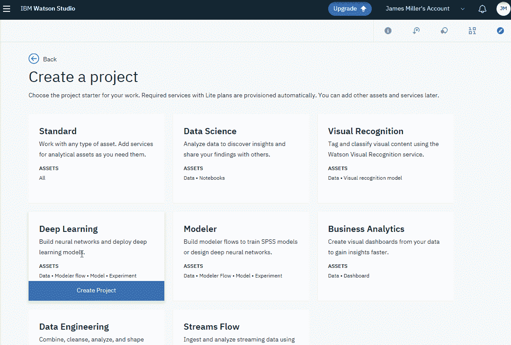

2.  接下来，选择机器学习服务要运行的区域，然后单击选择:


3.  在新建项目页面上命名您的项目(如下所示)，然后点击 **Create** :

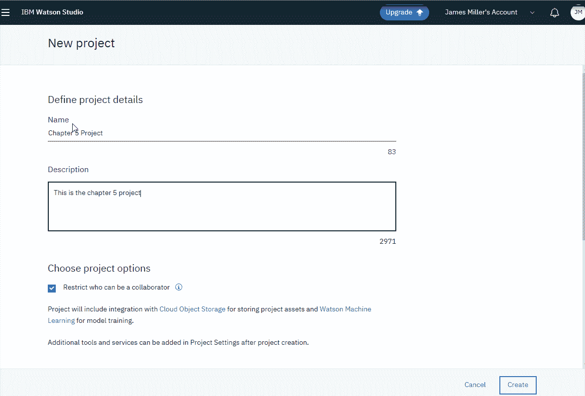

4.  现在我们已经创建了一个机器学习项目，我们准备创建一个笔记本。笔记本被视为可以使用和共享的项目资产。要在项目中创建笔记本，请单击添加到项目:

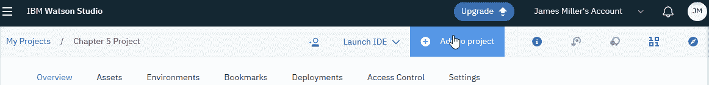

5.  单击“添加到项目”后，您需要选择一种资产类型。在前面的示例中，我们选择了数据和仪表板资产类型；这里我们将选择笔记本:

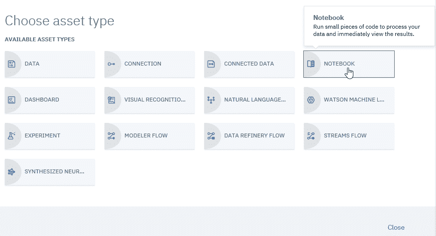

6.  与创建项目一样，选择“笔记本”作为资产类型后，您需要在新笔记本的“名称和描述”选项下提供名称和描述:

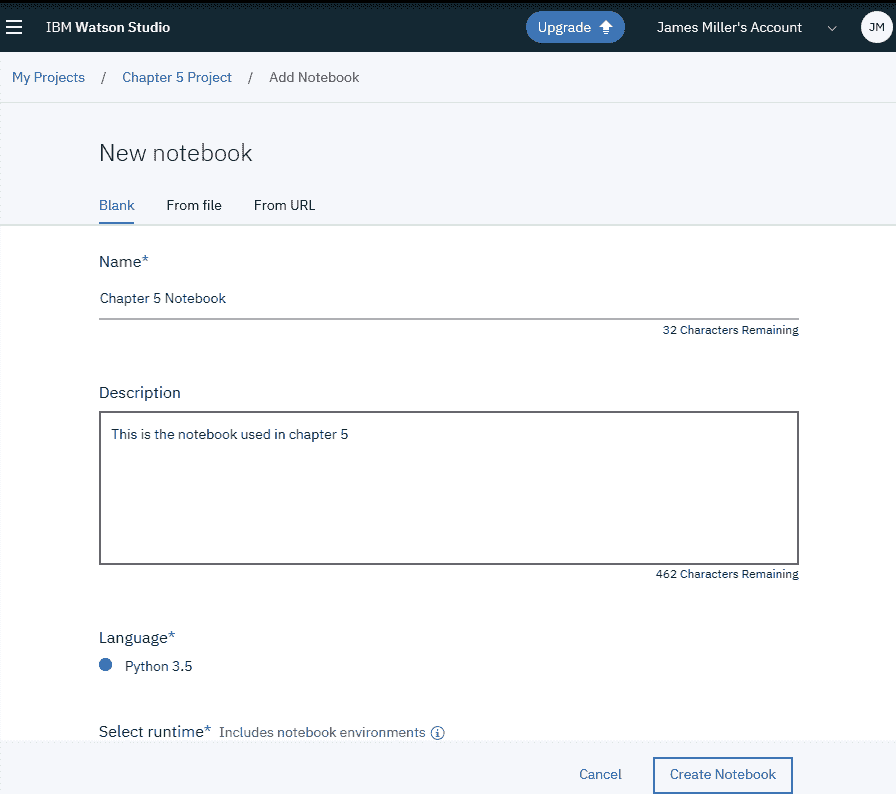

7.  此外，在页面的左下方，您需要选择笔记本要使用的语言。请注意，默认值是 Python 3.5:

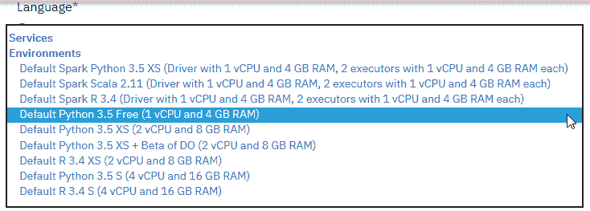

8.  由于我们将在例子中使用 Python，我们可以简单地点击 Create Notebook。请注意，IBM Watson Studio 笔记本(目前)支持以下运行时语言。单击“创建笔记本”后，将创建并初始化笔记本实例以供使用:

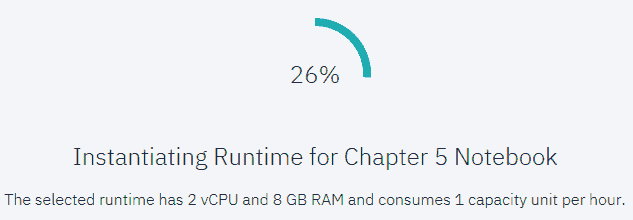


# 尝试一下

一旦您的笔记本被实例化，您就可以运行 Python 命令和代码了。请注意下面截图中的一些事情。例如，我们在笔记本的第一个**单元格**中输入了一小段 Python 代码，它使用 For 循环进行迭代并打印数据列。另一件需要注意的事情是，我们单击了 Find and add data，并添加了一个新文件(winemag-data-130k-v2.csv)作为资产，如下面的屏幕截图所示:

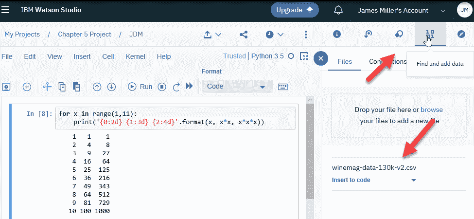

为了方便起见，我们可以点击文件名下面的链接插入代码，然后选择插入熊猫数据帧。结果是为我们导入了适当的 **Python** 模块(pandas 是为 Python 编程语言编写的软件库，用于数据操作和分析),并且自动定义了 Python 数据框架。这显示在下面截图中的笔记本单元格(在[9]中)中:

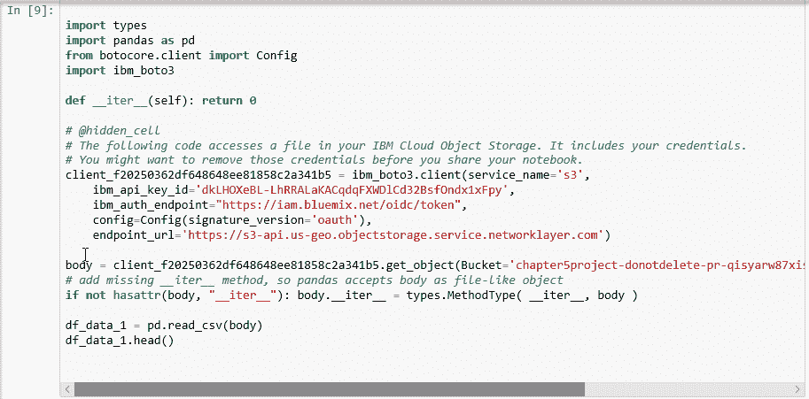

最后一行代码生成的输出，`df_data_1.head()`显示在笔记本单元格 Out [9]中:

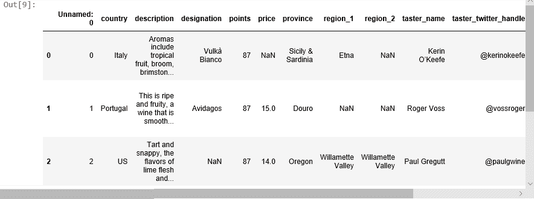

现在我们有了一个数据资产(一个 CVS 文件),可以在 Watson Studio 项目中通过 DataFrame 对象进行加载和访问。


# 数据清理和准备

对数据清理和准备的一个常见描述是将**原始数据**转换为一种形式的工作，数据科学家和分析师可以更容易地通过机器学习算法运行这种形式，以揭示见解或基于该数据进行预测。

此过程可能会因记录缺失或不完整，或者只是在数据源中找到无关的信息列等问题而变得复杂。

在前面的示例屏幕截图中，我们可以看到 DataFrame 对象包括列 country、description、designation、points、price、province 等等。

作为一个旨在演示如何在 Watson Studio 中轻松使用 Python 来准备数据的练习，让我们假设我们想要从 DataFrame 中删除一个或多个列。为了完成这项任务，我们使用以下 Python 语句:

```
to_drop = ['points']
df_data_1.drop(to_drop, inplace=True, axis=1)
df_data_1.head()
```

前面的简单 Python 命令定义了要从数据帧中删除的列名，即指向并从`df_data_1`数据帧中删除该列:

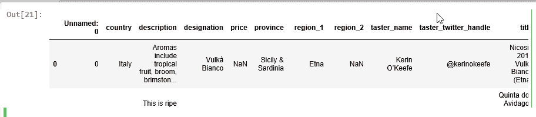

在 IBM Watson Studio 中，使用我们在本章前面创建的笔记本，我们可以输入并运行前面的命令，然后使用`head()`函数来验证我们指出的列实际上已经被删除。

尽管前面的演示过于简单，并没有触及数据清理和准备的过程，但它确实展示了在 Watson Studio 中轻松使用 Python 来访问和操作数据的能力。

我们不再继续额外的基本数据操作，而是继续看一些更复杂的东西。


# K-means 使用 Python 进行聚类

从[第 4 章](630e47b4-11b7-4be9-a881-8be2cb492314.xhtml)、*回顾 IBM Cloud 上的机器学习训练*、 **k-means 聚类**是一种无监督的机器学习方法——一种常用于在**未标记**数据中寻找群体的算法。同样，因为这里的目标是演示如何在 Watson Studio 中使用 Python 将这种方法应用于一些数据，所以我们不会费心剖析 k-means 如何工作的细节，而是将展示该算法的一个工作示例，使用 Watson Studio 作为概念证明。

网上和其他地方有大量的例子展示了使用 Python 实现 k-means 逻辑。这里，我们将使用一个简单易懂的例子，并使用可用的 Python 模块，如`matplotlib`、`pandas`和`scipy`。

我们的练习，使用 IBM Watson Studio 和笔记本(我们在本章的小节中创建)将:

1.  为二维数据集创建数据帧
2.  找到三个群集的质心，然后找到四个群集的质心
3.  添加一个**图形用户界面** ( **GUI** )来显示结果

组内最有代表性的点称为**质心**。它被定义为集群中的**数据**的点的值的平均值。每个聚类应该由最接近它的**数据**的点组成。


# Python 代码

首先，我们可以看一下 Python 代码:

1.  这一步引用`pandas`，然后定义我们的二维数据框架。注意，数据只是两个数字列表，定义为`x`和`y`:

```
from pandas import DataFrame
Data = {'x': [25,34,22,27,33,33,31,22,35,34,67,54,57,43,50,57,59,52,65,47,49,48,35,33,44,45,38,43,51,46],
        'y': [79,51,53,78,59,74,73,57,69,75,51,32,40,47,53,36,35,58,59,50,25,20,14,12,20,5,29,27,8,7]
      }
df = DataFrame(Data,columns=['x','y'])
print (df)
```

添加了最后一个命令(`print(df)`)，这样，如果您运行代码，您将看到输出，它应该与定义的数据集相匹配。

2.  下一步，我们将使用`sklearn` Python 模块找到三个集群的质心，然后是四个集群的质心，并使用`matplotlib`模块创建一些图表来可视化算法的结果。

Scikit-learn 通过 Python 中的一致接口提供了一系列监督和非监督学习算法。该库是基于 SciPy(科学 Python)构建的。 **Matplotlib** 是 Python 及其数值数学扩展 NumPy(维基百科，2019)的绘图库。

3.  一旦使用输入的数据列创建了 DataFrame，Python 代码的下一个块也将导入前面提到的两个 Python 模块，并使用`KMeans`算法指定要创建的聚类数，最后使用`matplotlib`生成一些散点图:

```
from pandas import DataFrame
import matplotlib.pyplot as plt
from sklearn.cluster import KMeans
Data = {'x': [25,34,22,27,33,33,31,22,35,34,67,54,57,43,50,57,59,52,65,47,49,48,35,33,44,45,38,43,51,46],
        'y': [79,51,53,78,59,74,73,57,69,75,51,32,40,47,53,36,35,58,59,50,25,20,14,12,20,5,29,27,8,7]
       }
df = DataFrame(Data,columns=['x','y'])
kmeans = KMeans(n_clusters=3).fit(df)
centroids = kmeans.cluster_centers_
print(centroids)
plt.scatter(df['x'], df['y'], c= kmeans.labels_.astype(float), s=50, alpha=0.5)
plt.scatter(centroids[:, 0], centroids[:, 1], c='red', s=50)
plt.show()
```

上述 Python 代码的输出会生成以下输出:

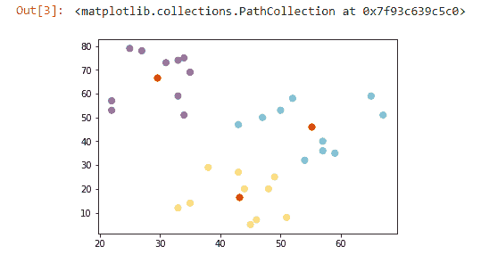


# 观察结果

请注意，三个群集的中心(红色)代表属于该群集的所有观察值的平均值。您可能还会看到，与其他聚类的中心相比，属于给定聚类的观察值更接近该聚类的中心。


# 在 Watson 中实施

同样，与其纠结于对前面输出的解释，不如让我们看看如何使用 IBM Watson Studio 实现同样的练习。我们可以使用本章前面创建的笔记本，但是让我们创建一个全新的笔记本(按照前面使用的相同过程)。

一旦笔记本打开并准备就绪，我们就可以运行我们刚刚查看过的 Python 代码了。首先将原始代码块粘贴到第一个笔记本单元格中，然后单击 Run:

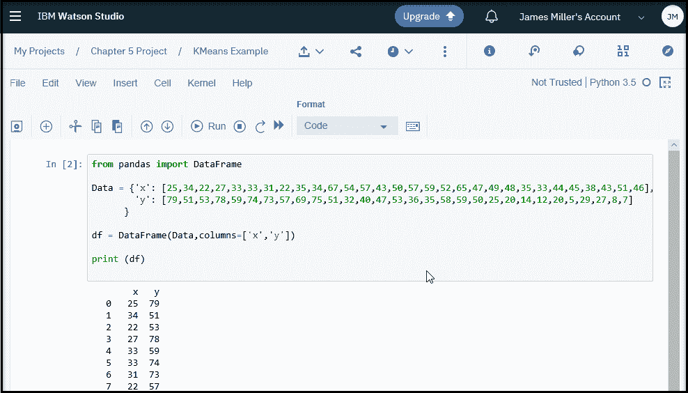

重复该步骤，但使用以下代码块:

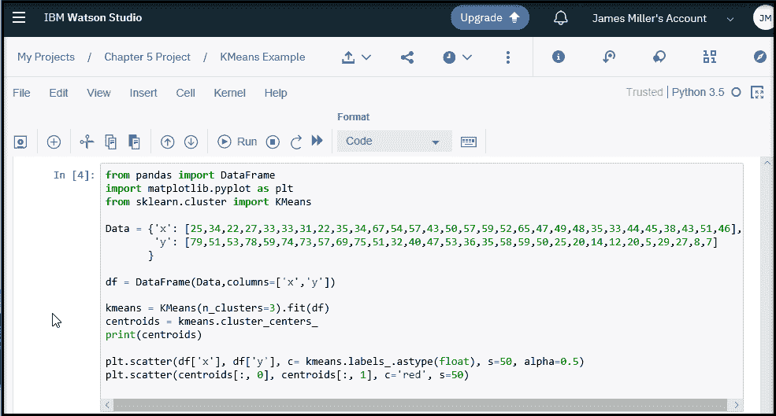

这会产生以下输出:

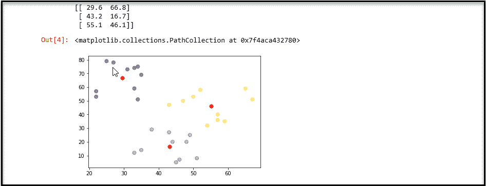


# 保存您的工作

如果您对结果感到满意，您应该单击“文件”,然后单击“保存”来保存笔记本。此外，一个很好的功能是能够下载各种格式的笔记本，这样您就可以与其他可能无法访问 Watson Studio 的人共享。我们将在下一节详细讨论这一点。

现在，尝试导航到文件|下载为| Python(。py)，它将把笔记本中的所有 Python 代码块保存为标准的 Python 代码文件，可以在其他 Python 环境中共享和运行:

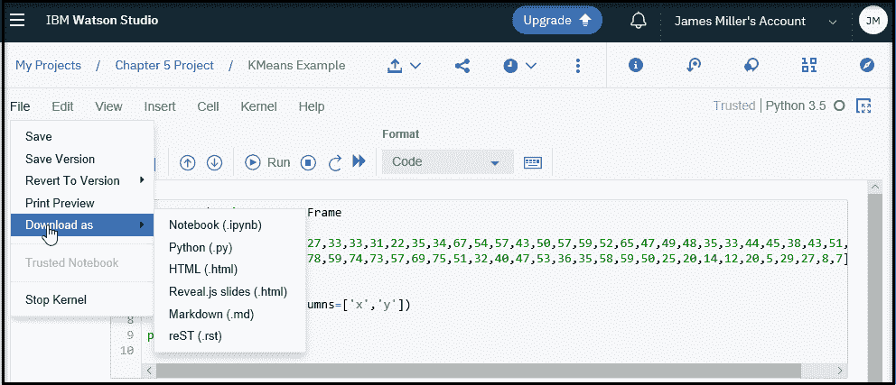

# k-最近邻

由于之前的算法(`KMeans`)是一种**无监督的**学习方法论，所以 **K 近邻** ( **KNN** )算法是一种从根本上简单易懂的**监督的**机器学习方法论。KNN 算法的概念通常被描述为通过识别其最近的邻居来对数据进行分类，或者，我最喜欢的类比是，您可以通过识别谁与数据关联最大或找到其最近的邻居来识别或分类数据。


# Python 代码

如前所述，我们的目标是演示如何在 IBM Watson Studio 中实现各种类型的 ML 算法，而不是提供每种算法背后的理论；除此之外，与上一节一致，我们将利用现有的示例 Python 脚本集来说明 Watson Studio 平台中提供的功能和特性，而不是尝试创建新的解决方案。

在这个实现的示例中，我们必须执行以下操作:

*   查找距离需要分类的新数据样本最近的预定义数量的训练样本
*   确保新数据样本的标签(分类)是由那些(训练样本)邻居定义的
*   为需要确定的邻居数量设置一个固定的用户定义常数
*   使用新样本的最近邻的多数投票来计算分类


# 在 Watson 中实施

同样，按照本章前面使用的步骤，我们可以在 IBM Watson Studio 中打开我们的机器学习项目，并创建一个新的笔记本。从那里，我们可以将示例 Python 代码粘贴到笔记本的单元格中，并按 Run 来测试每个单元格的代码。

正如我们所看到的，您可以在笔记本中使用多个单元来分割代码的功能块。使用菜单栏，您还可以剪切和粘贴单元格，拆分和合并单元格，以及在笔记本中上下移动单元格。为了清楚起见，另一个方便的特性是在笔记本中显示每个 Python 命令的行号。您可以通过单击菜单栏上“编辑”或“查看”下的相应菜单选项来完成此操作:

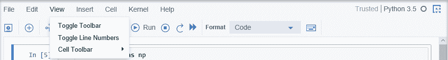

您可能希望拆分单元格以显示中间单元格输出，或者将单元格合并为一个单元格并显示合并后的输出。例如，在下一个屏幕截图中，您可以看到两个单元格，每个单元格后面都有各自的输出:

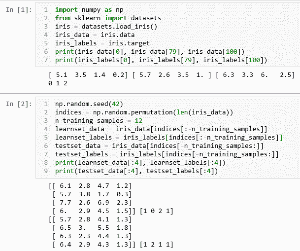

下面的屏幕截图显示了这两个单元合并成一个单元，然后是合并的输出:

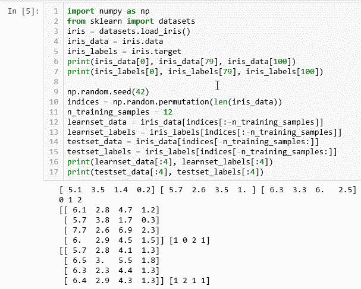

使用菜单选项，您可以创建一个组织良好、实用且可共享的解决方案。在下一节中，我们将在 Watson Studio 中使用 **Markdown** **标签**来创建一个更有价值的解决方案。


# 探索降价文本

**Markdown** 是一种易于使用的标记语言，它与纯文本一起使用，在不使用正式文本编辑器或使用 **HTML** 标签的情况下，向纯文本添加格式化元素(标题、项目符号列表、URL 等)。Markdown 与设备无关，并在各种设备类型中一致地显示书写格式，以努力在您创建的笔记本解决方案中创造视觉兴趣。

让我们完成我们最新的例子。我们将假设所有示例 Python 代码都已粘贴到笔记本的单元格中，并且我们已经完整地运行了该解决方案。

现在，假设我们想保存这个解决方案，并与不熟悉我们的项目和思考过程的其他人分享？我们可以做的是在笔记本中插入额外的单元格，而不是将代码粘贴到其中，我们可以添加注释和其他信息作为说明性文本，以便其他人可以更容易地理解我们所创建的内容。例如，看看下面的截图:

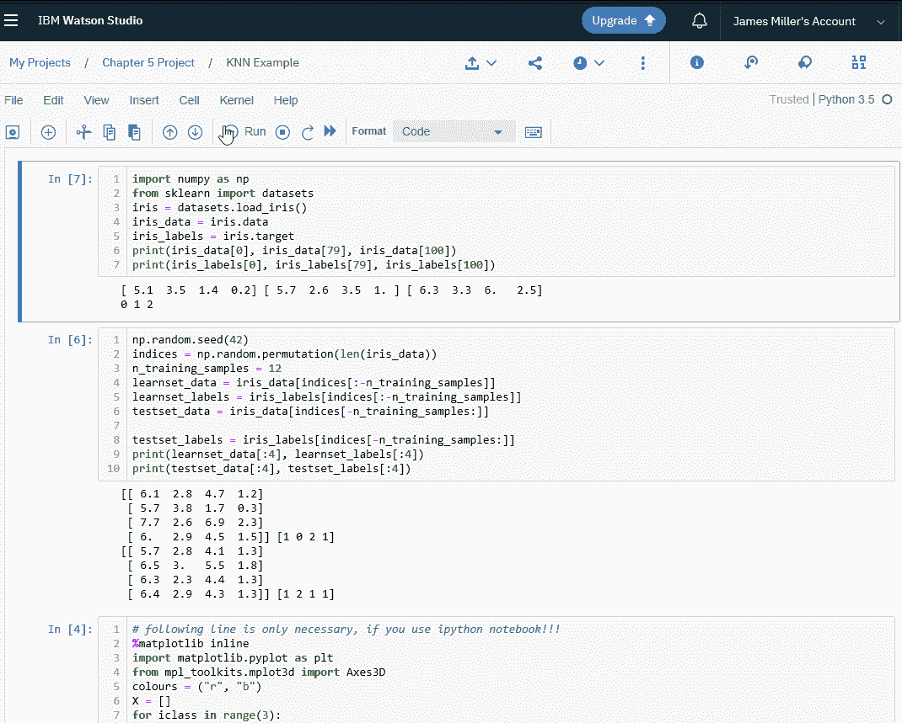

让我们通过执行以下步骤来看看这是如何做到的:

1.  我们可以单击笔记本中的第一个单元格，然后单击插入，然后在上面插入单元格。接下来单击新单元格，并将(单元格的)格式更改为 Markdown:

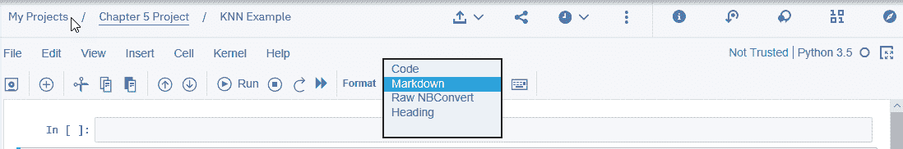

2.  接下来，在新的单元格中输入`k-Nearest-Neighbor Classifier`文本:

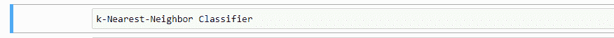

3.  然后，单击键盘图标并选择将单元格更改为标题 1:

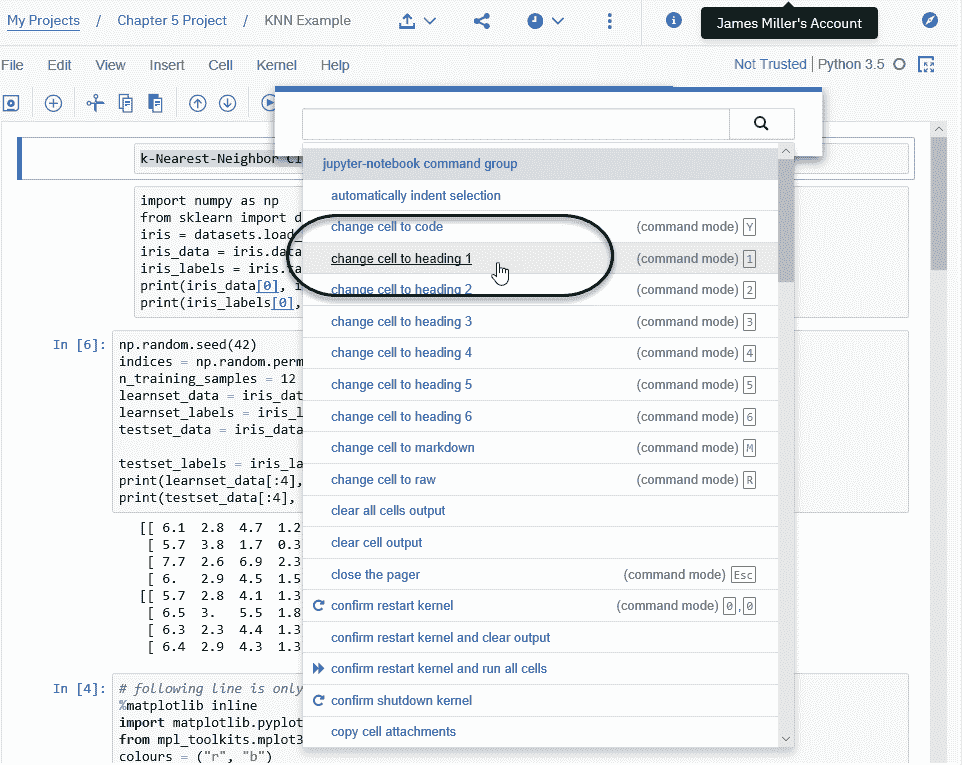

4.  执行上述步骤后，您可以看到 Markdown 单元格看起来有点不同:

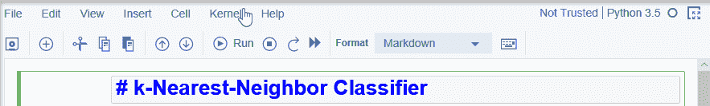

5.  单击运行后，您可以看到结果:

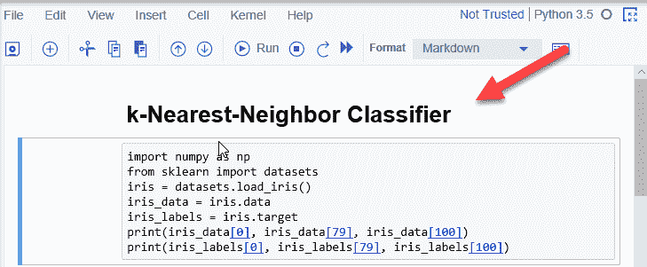

使用普通降价，我们可以在整个笔记本中插入评论:

*   您可以在笔记本顶部添加一个新单元格，将格式转换为 Markdown，然后将图像拖放到该单元格中(如下所示)。这可用于添加公司徽标，甚至是工作流程图:

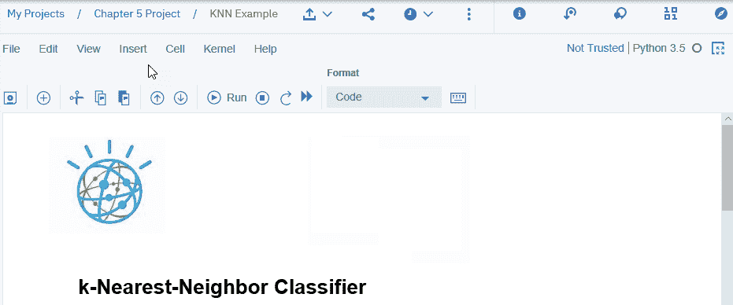

*   使用其他标记，如标题级别、缩进和项目符号列表，您可以提供有关假设的详细信息，如所用数据的来源和数据中的内容:

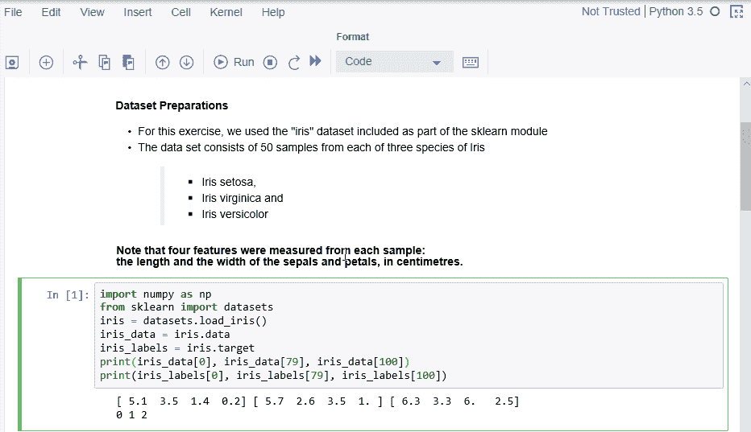

*   使用附加的类似 HTML 的降价(如`<font color=></font>`)，您可以创建如下的降价单元格:

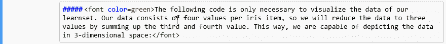

这会产生以下输出:

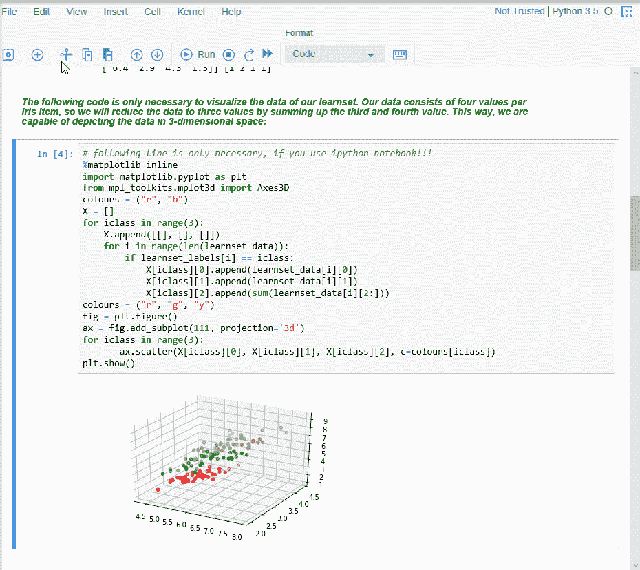

你可以尝试全功能减价，看看什么最适合你。你可以去:[https://commonmark.org/help/](https://commonmark.org/help/)找到一份完整的降价清单。


# 时间序列预测示例

在本节中，我们的目标是尝试使用 Python 和 Watson Studio 实现一个时间序列模型。

时间序列分析包括分析时间序列数据的方法(当然),因此我们可以提取有意义的统计数据和数据的其他特征。时间序列预测是一个过程，在这个过程中，我们使用一种算法根据以前观察到的值来预测未来的值。


# 时间序列分析

时间序列数据在本质上可能是**平稳**或**非平稳**。平稳意味着平稳，没有周期性波动，而非平稳数据的值通常会频繁变化。您会看到时间序列分析通常用于非平稳数据，例如评估和预测零售销售。在这个例子中，我们将再次利用一个研究练习(可以在 GitHub 上获得)来演示零售数据的分析和预测中涉及的基本步骤，就像用 IBM Watson Studio 实现的一样。


# 设置

使用(现在)熟悉的向我们的 Watson Studio 项目添加数据的过程，我们已经使用 CSV 数据文件创建了一个新资产，并且为了更好地理解数据，使用数据提炼特性来分析、描述和可视化我们的资产。从那里(正如我们在本章前面的*时间序列分析*部分所做的)，我们使用 Insert 来编码，然后插入 pandas DataFrame，以便 Watson Studio 生成导入所需 Python 模块所需的代码，加载数据(到一个名为`df_data_1`的 Python DataFrame 对象中)并打印前五行，如下面的屏幕截图所示:

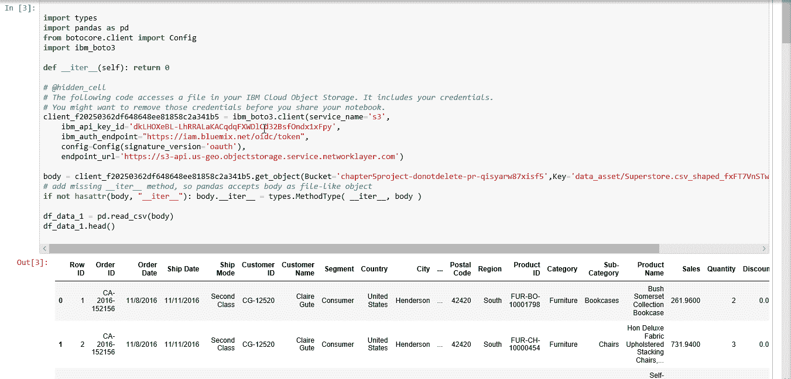

# 数据预处理

在使用**数据提炼**特性时，我们注意到数据文件中有一个名为`Category`的列，它似乎表明了所销售产品的类型(家具、办公用品和其他几种)。在本例中，数据科学家只对家具销售感兴趣，因此使用以下代码行来过滤数据，然后验证该类别是否有合理的数据量来执行适当的分析:

```
furniture = df.loc[df['Category'] == 'Furniture']
furniture['Order Date'].min(), furniture['Order Date'].max()
```

在 Watson Studio 中执行的上述代码如下面的屏幕截图所示，它过滤了销售数据，并通过显示最早和最晚的时间戳来验证我们在该数据文件中有四年的家具销售:

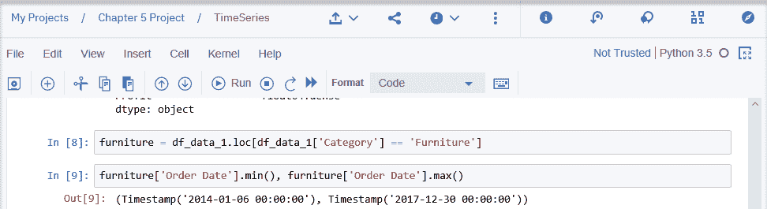

在所选示例中，数据科学家选择使用原始 Python 命令来删除(丢弃)分析中不需要的数据列，检查缺失值，按日期聚合(分组)销售交易，等等。尽管使用 Python 脚本来完成这些任务并不太复杂，但是您也可以通过拖放 Watson **数据提炼流程**来执行所有这些(甚至更多)任务。

正如我们前面提到的，数据提炼流程是一组有序的步骤，用于净化、塑造和增强数据资产。当您通过对数据应用操作来提炼数据时，您实际上是在动态地构建一个定制的数据提炼流程，该流程可以实时修改，并在新数据可用时保存以备将来使用！


# 可视化索引

数据准备就绪后，数据科学家使用`Pandas set_index`命令设置`Order Date`列，将(销售交易的)行索引为我们将执行初始分析的字段。换句话说，我们希望最终能够预测每月的家具销售额。下面的屏幕截图显示了在我们的 Watson 项目中执行的 Python 语句，用于设置索引和打印命令的结果:

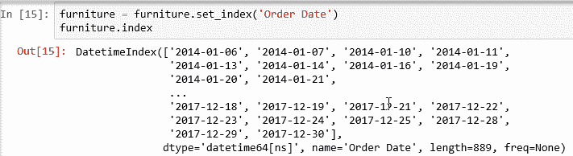

然后，数据科学家继续指出，查看每个月的平均日销售额会更合理(给定数据)，因此使用以下命令对销售数据进行重新采样，使用每个月的开始(MS)作为时间戳，然后，作为健全性检查，查看一些数据(订单月份，后面是计算的平均销售额):

```
y = furniture['Sales'].resample('MS').mean()
y["2017":]
```

下面的屏幕截图显示了在我们的 Watson 项目中执行的上述命令:

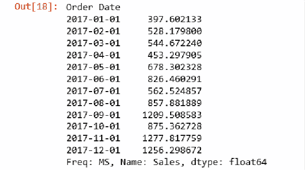

# 形象化

为了实际显示 4 年系列的平均销售量，使用了`plot`命令:

```
y.plot(figsize=(15, 6))
plt.show()
```

这会产生以下可视化效果，此处显示的是在 Watson Studio 中执行的:

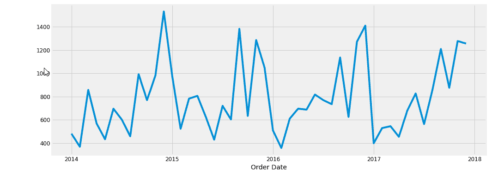

当您绘制或可视化数据时，识别模式要容易得多。在本例中，数据科学家指出了一种通常被称为季节性的模式。然后，数据科学家更进一步，使用以下命令执行时间序列分解，分解趋势、季节性和噪声:

```
from pylab import rcParams
rcParams['figure.figsize'] = 18, 8
decomposition = sm.tsa.seasonal_decompose(y, model='additive')
fig = decomposition.plot()
plt.show()
```

同样，在 Watson Studio 中执行时，我们有以下内容:

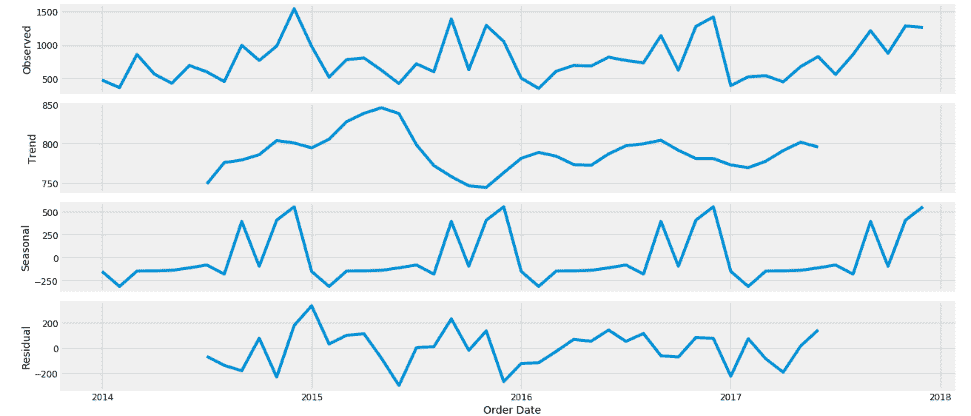


# 预测销售额

最后，在完成前面的时间序列数据分析和分解之后，我们就可以进入实际的预测步骤了！仍然与所选示例中概述的路线保持一致，数据科学家选择应用时间序列预测最常用的方法之一，**自回归综合移动平均法** ( **ARIMA** )。

你可以点击下面的链接来了解更多关于 http://www.forecastingsolutions.com/arima.html 的信息。

要使用 ARIMA 模型或方法进行时间序列预测，你需要了解如何为算法的三个主要参数选择值:as *P* 、 *D* 和 *Q* 。假设您已经验证了您的模型选择(首先使用 ARIMA)，构建实际预测模型并使用该模型生成预测的最困难部分是选择最适合该模型的参数值(给定数据):

*   *P* 是自回归项的个数
*   D 是平稳性所需的非季节性差异的数量
*   *Q* 是预测方程中滞后预测误差的数量

在不深究参数选择背后的理论的情况下，我们在这里说，这一步包括确定可能的参数值组合，查看它们的总体拟合结果，运行适当的诊断以调查模型的任何异常行为，以及验证模型生成的结果。

以下是用 IBM Watson Studio 实现的代码块和选定输出:

让我们看一下第一段代码，它展示了参数组合的例子:

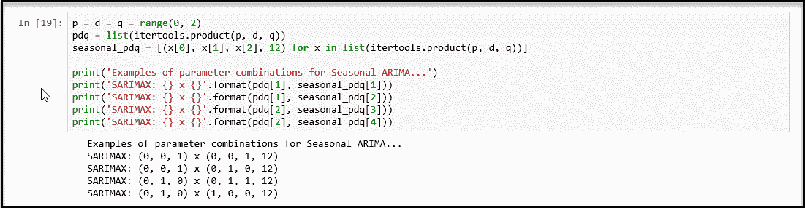

让我们看看下面的代码:

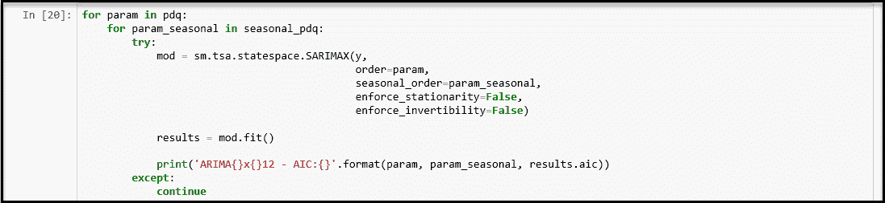

现在，看一下下面的截图:

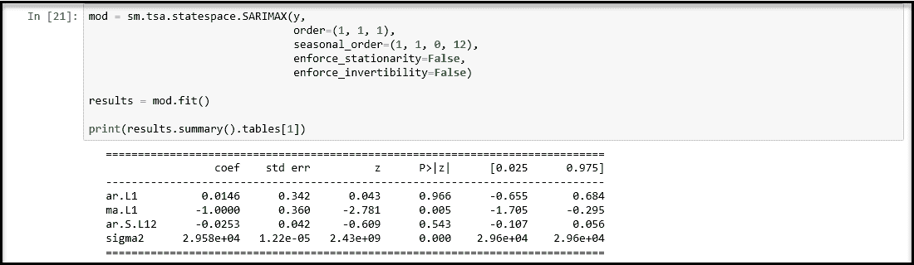

现在，让我们一起来看看这里的所有图表:

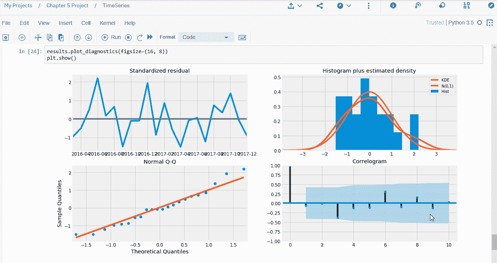


# 确认

当然，数据科学家不可能生成一个预测就完事了。必须努力检查模型的性能或预测准确性。为了帮助理解模型的准确性，*预测的*销售额与实际销售额进行比较，设置预测从 2017-07-01 开始(到数据结束)。同样，使用一个图来可视化输出，显示与滚动预测相比的*观测值*。总的来说，销售预测似乎与实际销售值一致，并显示出从年初开始的上升趋势。

我们看到下面的代码块:

```
pred = results.get_prediction(start=pd.to_datetime('2017-01-01'), dynamic=False)
pred_ci = pred.conf_int()
ax = y['2014':].plot(label='observed')
pred.predicted_mean.plot(ax=ax, label='One-step' ahead Forecast', alpha=.7, figsize=(14, 7))
ax.fill_between(pred_ci.index, pred_ci.iloc[:, 0], pred_ci.iloc[:, 1], color='k', alpha)
ax.set_xlabel('Date')
ax.set_ylabel('Furniture Sales')
plt.legend()
plt.show() 
```

在 Watson Studio 中实现的实际结果如下:

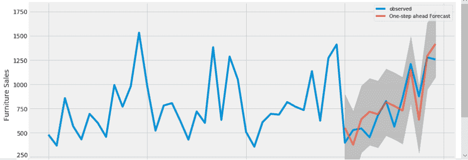

# 摘要

在本章中，我们在 IBM Watson Studio 中创建了一个新的机器学习项目，并向其中添加了笔记本，这样我们就可以使用 Python 作为项目目标的编程语言。

使用 Python，我们展示了将数据加载到数据帧中并对其执行操作以准备进一步处理是多么容易。我们还使用了额外的笔记本来说明使用 Watson Studio 实现各种机器学习项目是多么容易。

在下一章中，我们将提供在 IBM Watson Studio 中创建 Spark 机器学习管道的指南。