<title>Creating a Facial Expression Platform on IBM Cloud</title>  

# 在 IBM Cloud 上创建面部表情平台

在本章中，我们将介绍一个完整的基于 IBM 云的表达式分类解决方案，该解决方案将在 IBM 云平台上使用深度学习机器学习技术。该解决方案将使用 TensorFlow 和 IBM Watson Studio 提供的 ML 服务实现一个简单而高效的 ML 模型。目标是说明一个复杂的 ML 任务的端到端解决方案。

我们将本章分为以下几个部分:

*   理解面部表情分类
*   探索表达式数据库
*   预处理人脸
*   学习表达式分类器
*   评估表达式分类器

<title>Understanding facial expression classification</title>  

# 理解面部表情分类

让我们从一个简短的讨论开始，引出我们所说的*面部表情分类*的含义。

在[第七章](99762d15-664d-4987-82cf-74440dedabb3.xhtml)、*在 IBM 云上使用 TensorFlow 的深度学习*中，我们使用 IBM Watson Studio 在随机图像内执行*物体检测*。在那个用例中，我们要求我们项目的模型寻找或检测可能在图像中被描绘的常见或已知的对象。例如，我们提交了一张动物的图像，解决方案正确地检测并识别了一匹平托马，尽管没有产生关于检测到的对象的进一步信息，例如马是生气还是害怕。

<title>Face detection</title>  

# 人脸检测

或许这个旅程的下一步(在图像中的对象检测之后)是人脸检测。人脸检测是一种应用于各种应用中的计算机技术，致力于在数字图像中识别人脸。

面部识别是一种通过使用技术来检测和识别人脸的方法。面部识别解决方案利用生物统计学的逻辑来绘制照片(甚至视频)的面部特征，然后将信息与已知面部的数据库进行比较，寻找匹配。

生物识别是对人的独特身体和行为特征的测量和统计检查，其原理是每个人都可以通过他或她的内在身体或行为特征来准确识别。

<title>Facial expression analysis</title>  

# 面部表情分析

现在可以进入正题:*面部表情分析*。

这一概念通常将所有面部表情归类为与六种普遍情绪之一相关的情绪——喜悦(快乐)、惊讶、厌恶、悲伤、愤怒和恐惧以及中性情绪。

情绪是使我们成为人类的一个因素，而且(信不信由你)它们很难隐藏，因为所有的情绪，无论是否被抑制，都可能产生明显的物理效应，如果我们能够自动检测并解释物理效应，这将是有价值的。

一旦被发现，解释(面部表情)的过程(也许)只是另一个分类练习。在实践中，你会发现面部表情分类将基于所谓的 **TBM** 或**可转移信念模型**框架。

<title>TBM</title>  

# 战术弹道导弹（Tactical Ballistic Missile 的缩写）

TBM 提供了一个有趣的前提。在不打算提供 TBM 框架的全面解释的情况下，关键的一点是它引入了信任度和转移度(产生了该方法的名称:可转移信任模型)，这允许模型做出执行适当分类(表达式)所需的必要假设。基本上，这意味着它对其假设进行评分，也就是说，表达式是一个快乐表达式的假设被确定为有 *n* 个百分比的机会是正确的(我们将在本章稍后查看我们项目的结果时看到这一点)。

此外(我过于简单化了)，TBM 希望使用量化的信念来做出分类决策。也许更容易理解的是，面部表情分析提取面部特征(嘴、眼睛和眉毛)的表情骨架，然后从面部图像中导出简单的距离系数。这些特征距离然后被馈送到基于规则的决策系统，该决策系统依赖于 TBM，以便将面部表情分配给面部图像。

同样，我们的目标不是定义 TBM 背后的理论，甚至不是面部表情分析解决方案的细节，而是展示一个这样的工作示例；因此，我们将继续下一部分和我们的用例示例，并留给读者研究这个主题的进一步工作。

<title>Exploring expression databases</title>  

# 探索表达式数据库

所有面部表情分析解决方案的核心是表情数据库。

一个(**【面部】** ) **表情数据库**是显示一系列情绪的特定面部表情的图像集合。如果这些图像对表情识别系统及其相关算法有用的话，它们必须被很好地注释或情感标记。

自动人类行为分析领域新发展的一个主要障碍是缺乏显示行为和情感的合适数据库。在这一领域已经取得了直接的进展，如在 **MMI 面部表情数据库**项目中，该项目旨在向面部表情分析社区提供大量**面部表情视觉数据**。

MMI 面部表情数据库最初创建于 2002 年，作为构建和评估面部表情识别算法的资源。这个数据库的一个重要意义是，其他数据库专注于六种基本情绪的表情(我们之前提到过)，而这个数据库既包含这些原型表情，也包含激活了单个**面部动作编码系统** ( **FACS** )或**动作单元** ( **AU** )，用于所有现有的 AU 和许多其他**动作描述符** ( **AD** )的表情。最近，自然主义表达的录音也加入了进来。
该数据库对科学界免费开放。请访问 [https://mmifacedb.eu](https://mmifacedb.eu) 了解更多关于数据库的在线信息。

在其他的示例项目中，我们已经能够创建我们自己的测试数据或者改变现有的数据集以在项目中使用。然而，使用**表达式分析**项目，创建一个合理大小的数据库(什么都不用说)是不现实的，这需要收集和处理几乎成千上万的图像，所有图像都被适当地记录。

在收集之后，每一张(面部)图像都需要进行检查，并根据显示的情绪进行分类，分为七类(愤怒、厌恶、恐惧、快乐、悲伤、惊讶和中性)。使这项工作更加复杂的是，图像可能没有对齐和适当的比例。

底线是，即使你有大量的图像，如果图像没有被正确地标记或者仅仅是不包含可检测的面部图像，那么表情分析和检测过程的性能将会受到损害(其性能将会很差)。

这些类型的挑战使分类过程变得更加困难，因为模型被迫进行概化。

<title>Training with the Watson Visual Recognition service</title>  

# 沃森视觉识别服务培训

考虑到上述挑战，IBM Watson Studio 通过提供 **Watson 视觉识别**服务来帮助我们起步。

这项有价值的服务有助于使用机器学习逻辑准确分析、分类和训练图像的过程(尽管，可以肯定的是，它仍然需要合理数量的相关训练数据来开始，但稍后会详细介绍)。

幸运的是，我们有一套内置的模型，无需无休止的训练就能提供高度准确的结果。这些模型如下:

*   **通用模型**:通用分类器类别
*   **人脸模型:**定位图像中的人脸，性别和年龄
*   **显式模型**:图像是否不适合一般使用
*   **b 型号**:专门用于食品的图像

在本章的项目中，我们将展示如何使用视觉识别服务和人脸模型来构建一个端到端的工作解决方案，该解决方案可以查看人脸图像，执行表情分析和简单分类，并最终确定个人是感到快乐还是悲伤。

<title>Preprocessing faces</title>  

# 预处理人脸

我们刚刚提到，建立一个合适的表达式数据库是一个很大的工作量。为了能够构建一个端到端的工作表达式分析解决方案(并将其全部放入本书的单个章节中)，我们将对我们的项目进行一些修改:

*   我们将限制我们的模型只能检测和分类两种情绪——快乐和悲伤
*   我们将只提供有限数量的表达式数据来训练我们的模型

显然，在现实世界中，我们的第二个假设是有风险的；与任何 ML 模型一样，较少的训练数据通常会产生价值较低的结果。

<title>Preparing the training data</title>  

# 准备培训数据

同样，如果我们决定只满足使用人脸模型和视觉识别服务的最低要求，我们可以只为我们的模型要训练的每个类别收集 10 张图像(10 张快乐的脸、10 张悲伤的脸和 10 张消极的脸)。

这些单独的培训文件需要如下:

*   JPEG ( `.jpg`)和 PNG ( `.png`)格式
*   尺寸至少为 32*32 像素
*   作为一个组压缩到类 ZIP 文件中，即 10 张笑脸在一个`happy.zip`文件中，10 张笑脸在一个`sad.zip`文件中

下面的截图显示了我们的初始快乐模型训练数据的示例:

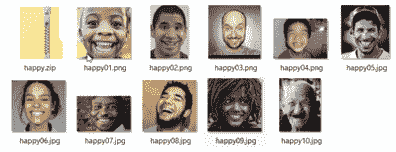

前面的 10 张照片展示了我们认为可以被归类为快乐面部表情的代表。注意，各个文件都被添加到名为`happy.zip`的压缩(ZIP)文件中。

我们的初始 sad 模型训练数据的样本显示在下面的屏幕截图中:

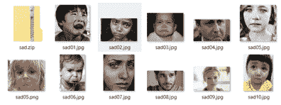

很明显，前一组显示的是快乐，后一组的图像显示的是我们认为可以被归类为悲伤表情的代表的脸(单独的文件和压缩文件，`sad.zip`)。

<title>Negative or non-positive classing</title>  

# 消极或非积极分类

为了使人脸模型正确工作，还需要负面图像，不是用来在创建的分类器中创建一个类(我们将在接下来的部分中介绍这一点)，而是用来定义更新的分类器不是什么。负面示例文件不应包含以任何正面类别(快乐和悲伤)为主题的图像。本质上，这组人的面部图像应该被认为是中性的。你只需要指定一个反面的例子文件。

因为您想给模型提供不要寻找什么的例子，所以您必须提供负类。提供一个包含所有正面图像的 ML 模型将意味着它只是假设所有东西都是正面的，并产生一个危险的结果。

所以最后，我们最初的负面模型训练数据显示在下面的截图中:

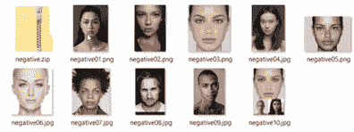

<title>Preparing the environment</title>  

# 准备环境

现在让我们继续项目模型开发。

下一步(假设您已经创建了一个新的 IBM Watson Studio 项目)是将 Watson 视觉识别服务与项目关联起来。我们在[第 7 章](99762d15-664d-4987-82cf-74440dedabb3.xhtml) *中介绍了如何做到这一点，在 IBM Cloud* 上使用 TensorFlow 进行深度学习，因此我们假设您已经将服务添加到这个新项目中。如果没有，复习一下[第七章](99762d15-664d-4987-82cf-74440dedabb3.xhtml) *、在 IBM Cloud* 上使用 TensorFlow 的深度学习，或者在线 Watson Studio 文档。

<title>Project assets</title>  

# 项目资产

在这一章的项目中，我们的资产将主要是我们收集的训练图像，并且可能间接地被分类。这些图像资产的添加方式类似于我们在前面章节中向 Watson Studio 项目添加数据资产的过程，但是有一些不同之处，我们很快就会看到。

现在，我们将执行以下步骤:

1.  转到“资产”选项卡，在“模型”下，单击“新视觉识别模型”:

2.  一旦创建了模型(应该只需要几分钟)，您就可以浏览或者拖放我们在本章前面部分收集的培训(`.zip`)文件，将它们添加到我们的新项目中。这将把图像文件上传到**云对象存储** ( **首席运营官**)，使它们可用于我们的项目:

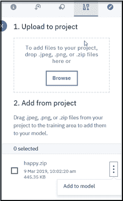

您不必单独加载每个图像文件，只需加载三个压缩文件(`happy.zip`、`sad.zip`和`negative.zip`)。然后，ZIP 文件应该如前面的屏幕截图所示列出。

尽管您可以上传 ZIP 文件，但 Watson 不允许这些 ZIP 文件使用数据资产页面上的预览功能。不过这不是问题，因为您仍然可以从模型页面预览图像，我们很快就会看到。

<title>Creating classes for our model</title>  

# 为我们的模型创建类

现在，从默认的定制模型页面，我们需要创建两个类。执行以下步骤为模型创建类:

1.  点击创建一个类。
2.  为其输入一个类名。

3.  单击蓝色的创建按钮:

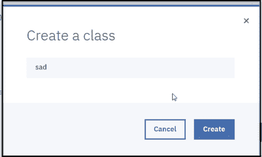

我们实际上只需要为这个项目创建两个类:快乐和悲伤，因为 Watson 已经为我们创建了负类。每个模型只有一个负类，但是您可以根据项目目标的需要拥有任意多个其他类。

一旦创建了类，您就需要简单地将`.zip`文件拖放到相应的类中，如下面的屏幕截图所示:

如您所见，我们将三个 ZIP 文件分别放到了它们对应的类窗格中。

正如我们在本章前面所述，Watson preview 不能处理压缩的图像文件资源；但是，从默认的自定义模型页面(如下图所示),我们可以单击所有图像并滚动浏览加载的内容，以查看文件名、标签和内容:

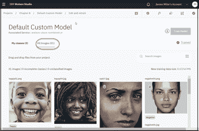

<title>Automatic labeling</title>  

# 自动标记

在本章的前面，我们已经指出，在收集了用于表情分析和识别的图像之后，每个单独的图像都必须被标注或标记为属于哪个情感组。这可能是一项艰巨的任务。幸运的是，在使用 IBM Watson Studio 时，您可以简单地将适当的图像包含在一个 ZIP 文件中，并将该 ZIP 文件放到一个类中，Watson 就会自动标记该图像文件。例如，在下面的屏幕截图中，您可以看到我们可以正确地识别出要包含在我们的 **happy** 类中的那些图像(以绿色轮廓显示)，而单个图像`sad05`(以红色轮廓显示)不属于我们的 ZIP 文件，应该从其中排除:

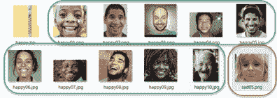

这是一个非常简单的过程，但是可能会出错。由于它简单快捷，您可能会错误地包含会稀释训练样本的图像。请记住，即使图像文件被直观地命名，例如快乐或悲伤，Watson 也不关心名称，它只是将文件中的所有图像标记为与类匹配的*正*或*。*

最后，关于训练数据还有一点需要注意。一旦您将数据作为 IBM Watson Studio 资产收集并上传，这些数据就可以用于您的任何项目，并且如果您愿意，您可以与任何其他 Watson Studio 用户共享这些数据！这促进了跨项目和用户的资产开发，并增加了您的投资回报。

<title>Learning the expression classifier</title>  

# 学习表达式分类器

一旦您注意到模型状态(显示在默认自定义模型页面的右上方)已更改为“模型准备好训练”，您就可以单击“训练模型”按钮，开始在我们提供的训练图像上训练人脸模型:

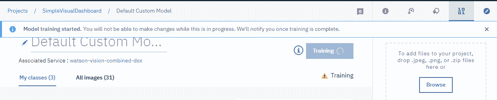

因为我们只提供了大约 30 幅训练图像，所以训练过程应该不到 5 到 10 分钟。在培训期间，您将无法对模型或课程进行任何更改。

<title>Evaluating the expression classifier</title>  

# 评估表达式分类器

模型训练完成后，您应该会看到以下训练成功消息:

现在，您可以单击弹出窗口中的 here 超链接来查看和测试模型。

<title>Viewing the model training results</title>  

# 查看模型训练结果

成功训练模型后，您将被重定向到一个页面，在该页面上您可以看到模型构建的概述或摘要(模型 ID、状态和其他元数据)(记下模型 ID，因为在实施阶段将需要它):

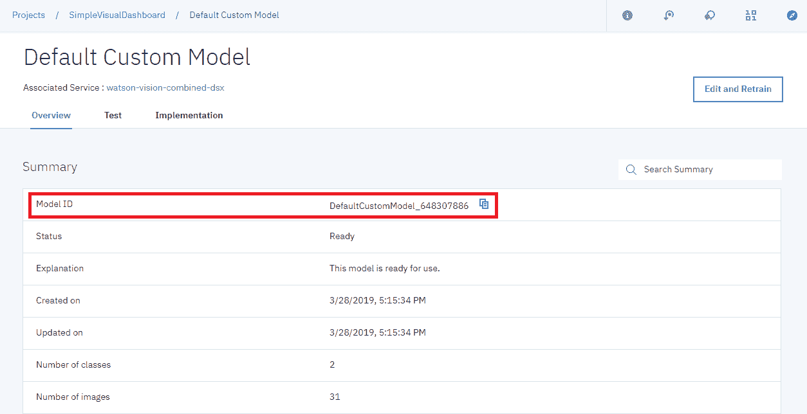

我们还可以看到模型的类信息:

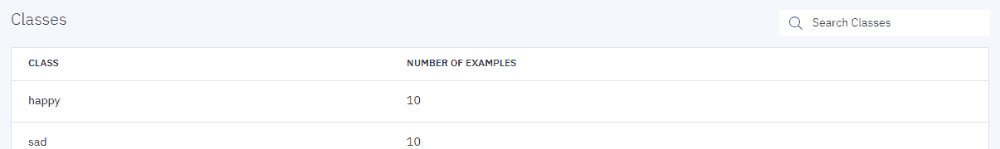<title>Testing the model</title>  

# 测试模型

为了测试和理解我们的模型如何执行(或者它是否工作！)，您可以在上一页视图的测试选项卡中上传图像。我们试试吧！

要使用图像进行测试，请单击测试:

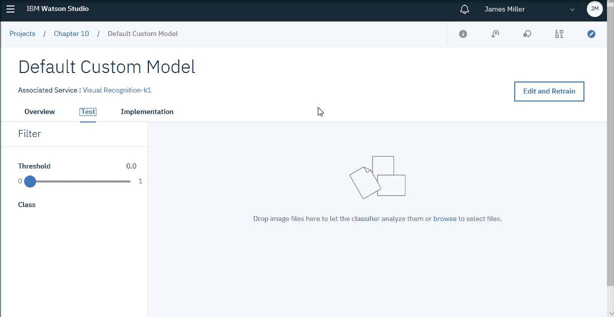

就像我们收集快乐和悲伤的图像一样，我们可以识别几个随机图像(不考虑图像中显示的表情)来测试我们的模型检测表情的能力:

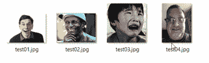

<title>Test scores</title>  

# 考试成绩

我们的模型的想法是解释前面的图像，执行一些表情分析，然后将每个图像分类为快乐或悲伤的面部表情。此外，模型应该生成并显示每个已定义类别的分数(负类别除外)。

正如您在我们的模型中看到的，我们只定义了两个要分类的类别——快乐和悲伤。对于每个测试图像，该模型应该显示百分比分数，该百分比分数显示检测到的表情是快乐还是悲伤的百分比。例如，下面的分数表示被识别的表情有大约 90%的可能性是快乐的:

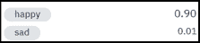

<title>Test the model</title>  

# 测试模型

要使用以下图像测试模型，我们可以简单地将图像文件拖放到前面的页面上，让分类器对它们进行分析:

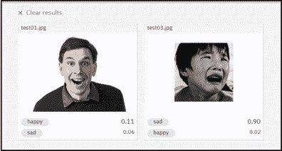

看看下面的截图:

成功！看起来我们随机选择的四张人脸都被我们的人脸模型正确地评估和评分了。我们可以看到，在前两张图片中，模型分别显示了 11%和 90%的人快乐和悲伤。

<title>Improving the model</title>  

# 改进模型

尽管看起来我们的小解决方案工作正常，但我们仍然必须记住，该模型是根据非常少量的数据进行训练的。

要改进模型，从默认的定制模型页面，您可以单击标有“编辑和重新培训”的蓝色按钮:

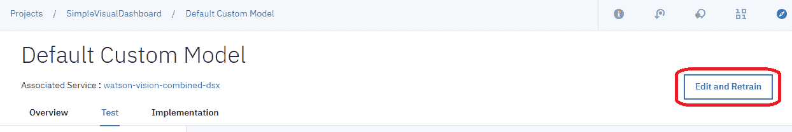

这将使我们的项目可编辑。

<title>More training data</title>  

# 更多训练数据

对我们的解决方案的一些改进将包括给快乐和悲伤的组添加额外的图像。为此，您可以使用新的和附加的图像创建一个新的 ZIP 文件，并将其上传到 IBM Watson Studio(与我们在本章前面所做的方式相同)，上传文件，并将新的 ZIP 文件放入相应的类中。Watson 将添加新图像(并且不会覆盖已经定义的图像):

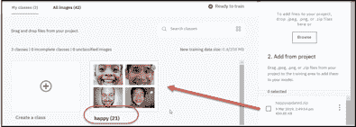

<title>Adding more classes</title>  

# 添加更多类别

我们解决方案的另一个重大改进是添加额外的类。这是为了让我们的模型支持检测除了快乐和悲伤之外的第三种情绪或表达。让我们试着把愤怒作为我们的第三类(不包括负面的):

1.  当然，第一步是收集和压缩我们的愤怒图像训练数据:

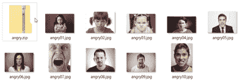

请记住，单个图像文件的名称并不重要，重要的是它们都代表同一种情绪，愤怒。

2.  在我们上传了`angry.zip`文件(作为我们项目可用的另一个数据资产)之后，我们可以点击 Create a class，输入`angry`作为类名，然后点击 Create:

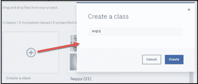

片刻之后，我们的新`angry`类就准备好了:

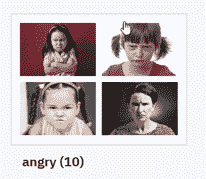

3.  现在，我们可以再次点击训练模型按钮，开始根据我们提供的训练图像以及我们新的愤怒类来重新训练人脸模型。过一会儿，我们应该会再次看到模型训练过的消息:

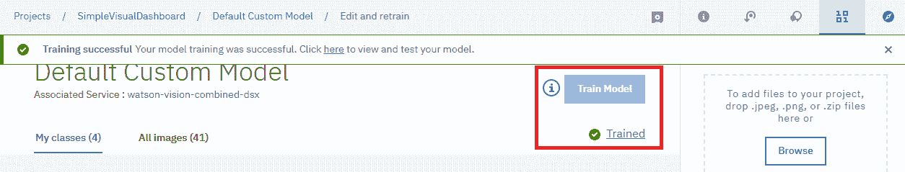<title>Results</title>  

# 结果

同样，我们可以转到默认的定制模型页面，单击 Test 选项卡，并为模型拖放一些新的测试图像以进行评估和分类:

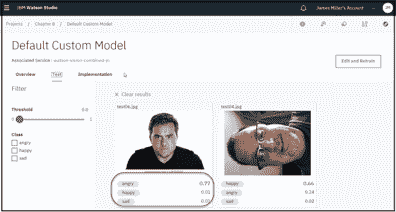

你可以看到模型已经正确地将第一个图像分类为 0.77 生气。我们还重新测试了之前的一张图片，作为回归测试，模型再次正确地将其分类(0.66 快乐)。

请注意，现在我们的模型为每个测试图像提供了三个分数:愤怒、快乐和悲伤，对应于我们模型定义的每个类别:

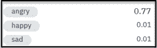

<title>Summary</title>  

# 摘要

在这一章中，我们探索了表情分析和检测背后的概念，并使用 IBM Watson Studio、Watson 视觉识别服务和默认人脸模型来构建、训练和测试一个几乎不需要编程的端到端视觉表情分类解决方案！

在下一章中，我们将在 IBM 云平台上使用 ML 发现岩相地层的自动分类。