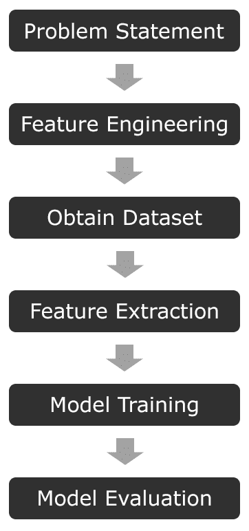
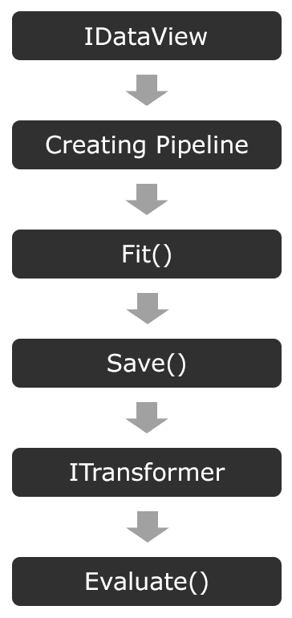

# 二、机器学习和 ML.NET 入门

通过打开这本书，你通过用机器学习接近复杂问题的解决方案，迈出了扰乱你自己的知识的第一步。您将通过使用微软的 ML.NET 框架来实现这一目标。我花了几年时间将机器学习应用于网络安全，我相信你从这本书获得的知识不仅会为你带来职业机会，还会打开你的思维过程，改变你处理问题的方式。你再也不会在不考虑机器学习可能如何解决的情况下处理一个复杂的问题。

在本书的学习过程中，您将了解以下内容:

*   如何以及何时使用 ML.NET 提供的五种不同算法
*   展示 ML.NET 算法的真实端到端示例
*   训练模型、构建训练集和特征工程时的最佳实践
*   使用 TensorFlow 和 ONNX 格式的预训练模型

这本书假设你对 C#有相当扎实的理解。如果您有其他使用强类型面向对象编程语言(如 C++或 Java)的经验，那么语法和设计模式是足够相似的，不会妨碍您理解这本书。然而，如果这是你第一次深入学习 C#这样的强类型语言，我强烈建议你拿起《7 天学习 C#》中的*，*，*由 Gaurav Aroraa 著，Packt 出版公司出版的书，快速入门。此外，虽然粗略的理解会加快你的学习，但不需要或不期望有先前的机器学习经验。*

 *在本章中，我们将介绍以下内容:

*   今天学习机器学习的重要性
*   建模过程
*   探索学习的类型
*   探索各种机器学习算法
*   ML.NET 简介

到本章结束时，你应该对从头到尾构建一个模型有一个基本的了解，为本书的其余部分提供基础。

# 今天学习机器学习的重要性

近年来，机器学习和人工智能已经成为我们许多生活中不可或缺的一部分，其使用案例多种多样，如在核磁共振成像中发现癌细胞，以及在职业篮球比赛中进行面部和物体识别。仅在 2013 年至 2017 年的四年时间里，仅机器学习专利就增长了 34%，而到 2021 年，支出预计将增长到 576 亿美元([https://www . Forbes . com/sites/louiscolombus/2018/02/18/round up-of-machine-learning-forecasts-and-market-estimates-2018/# 794 D6 F6 c 2225](https://www.forbes.com/sites/louiscolumbus/2018/02/18/roundup-of-machine-learning-forecasts-and-market-estimates-2018/#794d6f6c2225))。

尽管机器学习是一项不断发展的技术，但这个术语是阿瑟·塞缪尔在 1959 年创造的——那么是什么导致了它被采用之前的 60 年间隔呢？也许两个最重要的因素是能够足够快地处理模型预测的技术的可用性，以及每分钟以数字方式捕获的数据量。据 DOMO Inc 称，2017 年的一项研究得出结论，每天产生 2.5 万亿字节，当时，世界上 90%的数据是在 2015 年至 2017 年([https://www.domo.com/learn/data-never-sleeps-5?)之间创建的 aid = ogsm 072517 _ 1&SF 100871281 = 1](https://www.domo.com/learn/data-never-sleeps-5?aid=ogsm072517_1&sf100871281=1)。到 2025 年，预计每天将产生 463 艾字节的数据([https://www . visual capitalist . com/how-much-data-is-generated-the-day/](https://www.visualcapitalist.com/how-much-data-is-generated-each-day/))，其中大部分将来自汽车、视频、图片、物联网设备、电子邮件，甚至尚未过渡到智能运动的设备。

在过去十年中，数据量的增长引发了一些问题，如企业或公司如何利用这些数据进行更好的销售预测、预测客户需求或检测文件中的恶意字节。传统的统计方法可能需要成倍增加的工作人员来满足当前的需求，更不用说扩展所捕获的数据了。以谷歌地图为例。随着谷歌在 2013 年收购 Waze，谷歌地图的用户已经根据其用户的匿名化 GPS 数据提供了极其准确的路线建议。有了这个模型，数据点越多(在这种情况下是来自智能手机的 GPS 数据)，谷歌就能对你的旅行做出更好的预测。正如我们将在本章后面讨论的，高质量的数据集是机器学习的关键组成部分，特别是在谷歌地图的情况下，如果没有合适的数据集，用户体验将是不合格的。

此外，计算机硬件的速度，特别是为机器学习量身定制的专门硬件，也发挥了作用。专用集成电路的使用呈指数级增长。市场上最受欢迎的 ASICs 之一是谷歌**张量处理单元** ( **TPU** )。它最初于 2016 年发布，此后经历了两次迭代，并在谷歌云平台上为机器学习任务提供基于云的加速。其他云平台，如亚马逊的 AWS 和微软的 Azure，也提供 FPGAs。

此外，AMD 和 NVIDIA 的**图形处理单元**(**GPU**)分别通过 ROCm 平台和 CUDA 加速库来加速基于云的和本地的工作负载。除了加速工作负载之外，AMD 和 NVIDIA 提供的典型专业 GPU 提供了比传统的纯 CPU 方法高得多的处理器密度。例如，AMD 镭龙 Instinct MI60 提供 4，096 个流处理器。虽然不是成熟的 x86 内核，但它不是一对一的比较，双精度浮点任务的峰值性能为 7.373 TFLOPs，相比之下，AMD 极其强大的 EPYC 7742 服务器 CPU 的峰值性能为 2.3 TFLOPs。从成本和可扩展性的角度来看，如果算法得到加速，以利用 AMD 和 NVIDIA 提供的更专业的核心，即使在工作站配置中使用 GPU 也可以大幅减少训练时间。幸运的是，ML.NET 几乎不需要额外的努力就能提供 GPU 加速。

从软件工程职业的角度来看，随着这种增长和需求远远超过供应，作为一名软件工程师，现在是开发机器学习技能的最佳时机。此外，软件工程师还拥有传统数据科学家所不具备的技能，例如，能够自动执行建模流程等任务，而不是依赖手动脚本。软件工程师可以提供更多价值的另一个例子是在训练模型时，将单元测试和功效测试作为完整管道的一部分。在大型生产应用中，拥有这些自动化测试对于避免生产问题至关重要。

最后，在 2018 年，有史以来第一次，数据被认为比石油更有价值。随着各行业继续采用数据收集的使用，以及现有行业利用他们拥有的数据，机器学习将与数据交织在一起。机器学习对于数据就像炼油厂对于石油一样。

# 模型构建过程

在深入 ML.NET 之前，需要理解核心的机器学习概念。当我们开始建立模型和学习 ML.NET 在本书中提供的各种算法时，这些概念将帮助你建立一个基础。在高层次上，生产一个模型是一个复杂的过程；但是，它可以分为六个主要步骤:

在接下来的几节中，我们将详细介绍每个步骤，以便让您清楚地了解如何执行每个步骤，以及每个步骤如何与整个机器学习过程相关联。

# 定义您的问题陈述

实际上，你试图解决什么问题？在这一点上变得具体是至关重要的，因为一个不太简洁的问题可能会导致大量的返工。例如，以下面的问题陈述为例:*预测选举结果*。听到问题陈述后，我的第一个问题是，在什么水平上？县、州或国家？每一级都很可能需要比上一级多得多的特征和数据来正确预测。一个更好的问题陈述，尤其是在你的机器学习之旅的早期，将是针对县级的特定职位，例如*预测 2020 年约翰·多伊县市长*。有了这种更直接的问题陈述，您的要素和数据集就更有针对性，也更有可能实现。即使在机器学习方面有更多的经验，正确界定问题陈述的范围也是至关重要的。应该遵循“谁、什么、何时、何地和为什么”这五个“w ”,以保持你的陈述简洁。

# 定义您的特征

机器学习的第二步是定义你的特征。将功能视为您希望解决的问题的组成部分或属性。在机器学习中，特别是在创建新模型时，特征是对模型性能的最大影响之一。正确思考您的问题陈述将提升一组初始要素，这些要素将推动您的数据集和模型结果之间的差异。回到上一节中的市长示例，您认为市民的数据点有哪些特征？也许可以从市长的竞争对手开始，看看他/她与其他候选人在问题上的不同之处。这些值可以转化为特征，然后进行民意调查，让 John Doe 县的公民回答。使用这些数据点将创建一个可靠的第一遍特征。在模型构建中也可以发现的一个方面是运行多次迭代的特征工程和模型训练，尤其是当数据集增长时。模型评估后，*特性重要性*用于确定哪些特性实际上在驱动您的预测。偶尔，你会发现在模型训练和特征工程的几次迭代之后，直觉特征实际上是无关紧要的。

在[第 11 章](116bbc2d-9659-4d34-9b2b-26593e29f54a.xhtml)、*训练和构建生产模型*中，我们将深入探讨在定义特性和复杂问题的通用方法时的最佳实践，从而在特性工程方面获得坚实的第一关。

# 获取数据集

可以想象，模型构建过程中最重要的一个方面是获得高质量的数据集。在上述监督学习的情况下，数据集用于训练关于输出应该是什么的模型。在无监督学习的情况下，需要对数据集进行标注。创建数据集时一个常见的误解是越大越好。在很多情况下，这与事实相去甚远。继续前面的例子，如果所有的调查结果对每一个问题的回答都是一样的，会怎么样呢？此时，您的数据集由所有相同的数据点组成，您的模型将无法正确预测任何其他候选数据。这种结果称为*过拟合*。机器学习算法需要多样化但具有代表性的数据集来正确构建生产就绪模型。

在[第 11 章](116bbc2d-9659-4d34-9b2b-26593e29f54a.xhtml)、*训练和构建生产模型*中，我们将深入探讨获取高质量数据集的方法、寻找有用的资源、管理数据集的方法以及转换数据，通常称为数据争论。

# 特征提取和流水线

获取要素和数据集后，下一步是执行要素提取。根据数据集和要素的大小，要素提取可能是模型构建过程中最耗时的要素之一。

例如，让我们假设来自前面提到的虚构的 John Doe 县选举投票的结果有 40，000 个响应。每个响应都存储在从 web 表单捕获的 SQL 数据库中。执行 SQL 查询，假设您将所有数据返回到一个 CSV 文件中，使用该文件可以训练您的模型。在高层次上，这是您的特征提取和管道。对于更复杂的情况，如预测恶意 web 内容或图像分类，提取将包括文件中特定字节的二进制提取。正确存储这些数据以避免必须重新运行提取对于快速迭代至关重要(假设要素没有改变)。

在第 11 章，*训练和构建生产模型，*中，我们将深入探讨如何对提取特征的数据进行版本化，并保持对数据的控制，尤其是在数据集变大的情况下。

# 模特训练

在特征提取之后，您现在准备好训练您的模型。谢天谢地，Model 的模特训练非常简单。根据特征提取阶段提取的数据量、管道的复杂性以及主机的规格，此步骤可能需要几个小时才能完成。当您的管道变得更大、模型变得更复杂时，您可能会发现自己需要的计算资源可能比笔记本电脑或台式机所能提供的更多；Spark 等工具可以帮助您扩展到 *n* 个节点。

在第 11 章*训练和构建生产模型*中，我们将讨论使用易于使用的开源项目来扩展这一步骤的工具和技巧。

# 模型评估

一旦模型被训练，最后一步是评估模型。模型评估的典型方法是*拿出*数据集的一部分进行评估。这背后的想法是获取已知的数据，提交给你的训练模型，并衡量你的模型的功效。这一步的关键部分是展示数据的代表性数据集。如果您的坚持组受到这样或那样的影响，那么您很可能会得到高性能或低性能的错误感觉。在下一章，我们将深入探讨各种评分和评估指标。model 提供了一个相对简单的界面来评估一个模型；但是，每种算法都有独特的属性需要验证，我们将在深入研究各种算法时回顾这些属性。

# 探索学习的类型

既然您已经理解了构成模型构建过程的步骤，接下来要介绍的主成分是两种主要的学习类型。还有其他几种类型的机器学习，比如强化学习。然而，就本书的范围而言，我们将把重点放在 ML.NET 提供的两种算法上——监督学习和非监督学习。如果你对其他类型的学习感兴趣，可以看看 Giuseppe Bonaccorso 出版的*机器学习算法*。

# 监督学习

监督学习是两种类型中更常见的一种，因此，它也用于我们将在本书中讨论的大多数算法。简而言之，作为数据科学家，监督学习需要您将已知输出作为训练的一部分传递给模型。以本章前面讨论的选举为例。通过监督学习，选举投票中用作特征的每个数据点以及他们表示将投票给谁，都在训练期间被发送到模型。这一步在分类算法中习惯上称为**标注**，其中输出值将是预训练标签之一。

# 无监督学习

相反，在无监督学习中，典型的用例是当计算输入和输出标签被证明是困难的时候。使用选举场景，当您不确定哪些特征将真正为模型提供数据点以确定选民的投票时，无监督学习可以提供价值和洞察力。这种方法的好处在于，您选择的算法决定了驱动标注的要素。例如，使用诸如 k-means 之类的聚类算法，您可以将所有的选民数据点提交给模型。然后，该算法将能够将选民数据分组，并预测看不见的数据。我们将在第 5 章*，聚类模型*中深入探讨聚类的无监督学习。

# 探索各种机器学习算法

机器学习的核心是用于解决复杂问题的各种算法。正如导言中提到的，本书将涵盖五种算法:

*   二元分类
*   回归
*   异常检测
*   使聚集
*   矩阵分解

每一个都将是本书后面一章的重点，但是现在，让我们快速的浏览一下。

# 二元分类

最容易理解的算法之一是二进制分类。二进制分类是一种监督机器学习算法。顾名思义，用二进制分类算法训练的模型的输出将返回真或假的判定(如 0 或 1)。最适合二进制分类模型的问题包括确定评论是恶意的还是文件是恶意的。ML.NET 提供了几个二进制分类模型算法，我们将在第 4 章*分类模型*中讨论，以及一个确定文件是否恶意的工作示例。

# 回归

另一个强大但易于理解的算法是回归。回归是另一种监督机器学习算法。回归算法返回实数值，而不是二进制算法或从一组特定值返回的算法。您可以将回归算法视为代数方程求解器，其中有许多已知值，目标是预测一个未知值。最适合回归算法的一些问题的例子是预测损耗、天气预报、股票市场预测和房屋定价，等等。

此外，还有一个回归算法子集，称为**逻辑回归**模型。如前所述，传统的线性回归算法返回预测值，而逻辑回归模型将返回结果发生的概率。

ML.NET 提供了几种回归模型算法，我们将在第 3 章*回归模型*中介绍。

# 异常检测

顾名思义，异常检测在提交给模型的数据中寻找意外事件。正如您可能猜到的那样，该算法的数据需要一段时间的数据。ML.NET 的异常检测同时关注峰值和变化点。**尖峰**顾名思义是暂时的，而**变化点**则是更长变化的起点。

Model 提供了一种异常检测算法，我们将在第 6 章*异常检测模型*中讨论。

# 使聚集

聚类算法是无监督的算法，为寻找与相关项目最匹配的解决方案的问题提供了唯一的解决方案。在数据的训练期间，数据基于特征进行分组，然后在预测期间，选择最接近的匹配。使用聚类算法的一些示例包括文件类型分类和预测客户选择。

Model 特别使用了 k-means 算法，我们将在第 5 章*聚类模型*中深入探讨。

# 矩阵分解

最后但同样重要的是，矩阵分解算法为提供推荐提供了一个强大且易于使用的算法。该算法适用于历史数据可用的问题，要解决的问题是从这些数据中预测选择，如电影或音乐预测。网飞的电影建议系统使用一种矩阵分解的形式来建议你喜欢什么电影。

我们将在第 7 章*矩阵分解模型*中详细介绍矩阵分解。

# 什么是 ML.NET？

既然你对核心机器学习概念有了相当坚定的理解，我们现在可以深入微软的 ML.NET 框架了。ML.NET 是微软首要的机器学习框架。它提供了一个易于使用的框架，可以在。网络生态系统。

微软的 ML.NET 于 2018 年 5 月在华盛顿州西雅图的微软开发者大会 BUILD 上宣布并发布(版本 0.1)。该项目本身是开源的，在 GitHub([https://github.com/dotnet/machinelearning](https://github.com/dotnet/machinelearning))上获得了麻省理工学院的许可，在撰写本文时，自第一次发布以来，已经经历了总共 17 次更新。

微软内部使用 Slide 的一些产品包括 Excel 中的图表决策、PowerPoint 中的幻灯片设计、Windows Hello 和 Azure 机器学习。这强调了 ML.NET 为您自己的生产部署做好了生产准备。

从一开始，ML.NET 的设计和构建就是为了方便 C#和 F#开发人员使用机器学习，使用熟悉该架构的人会很自然地熟悉它。NET 框架。在 ML.NET 到来之前，还没有一个成熟的、受支持的框架，在这个框架中，你不仅可以训练，还可以在不离开。网络生态系统。例如，谷歌的 TensorFlow 在 GitHub([https://github.com/migueldeicaza/TensorFlowSharp](https://github.com/migueldeicaza/TensorFlowSharp))上有一个由米格尔·德·伊卡萨编写的开源包装器；然而，在撰写本书时，大多数工作流需要使用 Python 来训练模型，然后 C#包装器可以使用该模型来运行预测。

此外，微软致力于支持所有主要平台。在过去的几年中，NET 开发人员已经习惯于发布他们的应用。以下是一些平台的示例，括号中是它们的目标框架:

*   网络(ASP.NET)
*   手机(Xamarin)
*   桌面(UWP、WPF 和 WinForms)
*   游戏(一夫一妻制和 SharpDX)
*   物联网(。网络核心和 UWP)

在本书的后面，我们将在大多数平台上实现几个真实世界的应用，以演示如何将 ML.NET 集成到各种应用类型和平台中。

# ML.NET 的技术细节

随着 ML.NET 1.4 的发布。建议使用 NET Core 3.0 或更高版本来利用作为的一部分添加的硬件内部函数。网芯 3.0。对于那些不熟悉的。NET Core 2.x(及更早版本)以及。NET Framework 针对具有**流******扩展** ( **SSE** )的 CPU 进行了优化。实际上，这些指令为在数据集上执行多个 CPU 指令提供了优化的路径。这种方法被称为**单指令多数据** ( **SIMD** )。鉴于 SSE CPU 扩展早在 1999 年就首次添加到 Pentium III 中，后来由 AMD 在 2001 年添加到 Athlon XP 中，这提供了一种非常向后兼容的途径。然而，这也不允许代码利用 CPU 扩展在过去 20 年中取得的所有进步。其中一项进步是在 2011 年或之后创建的大多数英特尔和 AMD CPUs 上提供的**高级矢量扩展** ( **AVX** )。**

 **这在单个指令中提供了八个 32 位操作，而 SSE 提供了四个。你大概能猜到，机器学习可以利用这种指令翻倍的优势。对于中的 CPU。还不支持的 NET Core 3(如 ARM)，。NET Core 3 自动退回到基于软件的实现。

# ML.NET 的组成部分

如前所述，ML.NET 的设计对有经验的人来说是直观的。NET 开发人员。建筑和组件与 ASP.NET 和 WPF 的模式非常相似。

ML.NET 的核心是`MLContext`物体。与. NET 应用中的`AppContext`类似，`MLContext`是一个单例类。`MLContext`对象本身提供了对 NuGet 提供的所有教练目录的访问(一些由附加的 NuGet 包提供)。你可以把 ML.NET 的教练目录想象成一个特定的算法，比如二进制分类或聚类。

以下是一些 ML.NET 的产品目录:

*   异常检测
*   二元分类
*   使聚集
*   预测
*   回归
*   时间序列

这六组算法在本章前面已经讨论过了，将在本书后面的专门章节中详细讨论。

此外，ML.NET 1.4 最近增加了直接从数据库导入数据的能力。这一特性在撰写时处于预览状态，它不仅可以简化特征提取过程，还扩展了在现有应用或管道中进行实时预测的可能性。支持所有主流数据库，包括 SQL Server、Oracle、SQLite、PostgreSQL、MySQL、DB2 和 Azure SQL。我们将在第 4 章*分类模型*中探索这一特性，使用一个使用 SQLite 数据库的控制台应用。

下图展示了 ML 的高级架构。网络:

在这里，你可以看到与传统的机器学习过程几乎完全匹配。这样做是为了减少那些熟悉其他框架的人的学习曲线。该体系结构中的每个步骤可以总结如下:

1.  **IDataView** :用于将加载的训练数据存储到内存中。
2.  **创建管道**:管道创建将`IDataView`对象属性映射到发送给模型进行训练的值。
3.  **Fit()** :不管是什么算法，在创建管道之后，调用`Fit()`开始实际的模型训练。
4.  **Save()** :顾名思义，这将模型(以二进制格式)保存到一个文件中。
5.  **it 变压器** : 这将模型加载回内存以运行预测。
6.  **Evaluate()** :顾名思义，这是对模型进行评估([第 2 章](b8decd34-4bcb-4b1b-80d2-b2bfd0fa31c1.xhtml)、*设置 model 环境*将进一步深入评估架构)。

在本书的整个过程中，我们将更彻底地探究这些方法。

# ML.NET 的延展性

最后，像大多数健壮的框架一样，ML.NET 提供了相当大的可扩展性。此后，Microsoft 推出了附加的可扩展性支持，以便能够运行以下外部训练的模型类型，等等:

*   TensorFlow
*   ONNX
*   Infer.Net
*   CNTK

如前所述，tensor flow([https://www.tensorflow.org/](https://www.tensorflow.org/))是谷歌的机器学习框架，官方支持 C++、Go、Java 和 JavaScript 的绑定。此外，TensorFlow 可以通过 GPU 加速，如前所述，还可以通过谷歌自己的 TPUs 加速。此外，像 ML.NET 一样，它提供了在各种平台上运行预测的能力，包括 iOS、Android、macOS、ARM、Linux 和 Windows。谷歌提供了几个预先训练好的模型。一个比较流行的模型是图像分类模型，它对提交的图像中的对象进行分类。model 最近的改进使你能够基于预先训练的模型创建你自己的图像分类器。我们将在第 12 章【ML.NET】*使用 TensorFlow 详细介绍这一场景。*

ONNX([https://onnx.ai/](https://onnx.ai/))，开放神经网络交换格式的首字母缩写，由于能够导出到通用格式，因此是数据科学领域中广泛使用的格式。ONNX 有用于 XGBoost、TensorFlow、scikit-learn、LibSVM 和 CoreML 等的转换器。微软在 ML.NET 对 ONNX 格式的原生支持不仅允许现有机器学习管道具有更好的可扩展性，还增加了 ML.NET 在机器学习领域的采用。我们将在[第 13 章](788ee637-ad9b-4ddf-8018-b804d3004404.xhtml)、*中利用预训练的 ONNX 格式模型，使用 ONNX 和 ML.NET*。

Infer.Net 是另一个开源的微软机器学习框架，专注于概率编程。你可能想知道什么是概率编程。在高层次上，概率编程处理传统变量类型明确的灰色区域，如布尔或整数。概率编程使用随机变量，这些变量有一个取值范围，结果可能是，类似于一个数组。规则数组和概率编程中的变量之间的区别在于，对于每个值，都有特定值出现的概率。

Infer.Net 在现实世界中的一个伟大应用是微软 TrueSkill 背后的技术。TrueSkill 是一个评级系统，它为*光环*和*战争机器*中的配对提供了动力，在这两个游戏中，玩家是根据众多变量、游戏类型以及地图进行配对的，即使是两个玩家也是如此。虽然超出了本书的范围，但总体来说，可以在这里找到一本深入研究 Infer.Net 和概率编程的优秀白皮书:【https://dotnet.github.io/infer/InferNet_Intro.pdf。

同样来自微软的 CNTK，是 Cognitive Toolkit 的简称，是一个深度学习工具包，专注于神经网络。CNTK 的一个独特之处是它通过有向图来描述神经网络。虽然超出了本书的范围(我们将在第 12 章中用 TensorFlow 介绍神经网络)，但前馈深度神经网络、卷积神经网络和循环神经网络的世界非常迷人。为了更深入地研究神经网络，我建议使用 C# 的*手动神经网络编程，同样来自 Packt。*

对 Azure 和其他模型支持(如 py torch([https://pytorch.org/](https://pytorch.org/))的额外扩展正在路线图上，但在撰写本文时时间表尚未确定。

# 摘要

在这一章中，你已经了解了发现机器学习的重要性。此外，你还学习了机器学习的核心概念，包括学习中的差异以及我们将在本书后面介绍的各种算法。你也收到了 ML.NET 的介绍。本章中的核心概念是本书其余部分的基础，我们将在随后的每一章中以它们为基础。在下一章，我们将在 ML.NET 设置你的环境并训练你的第一个模型！***