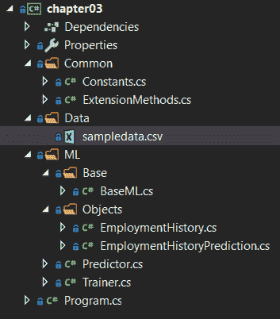
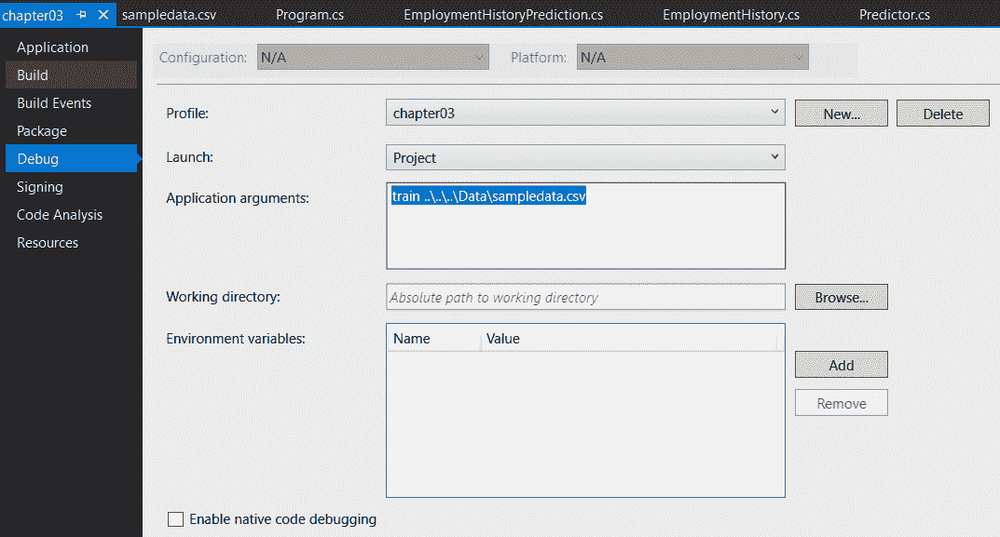
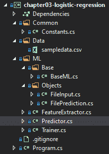
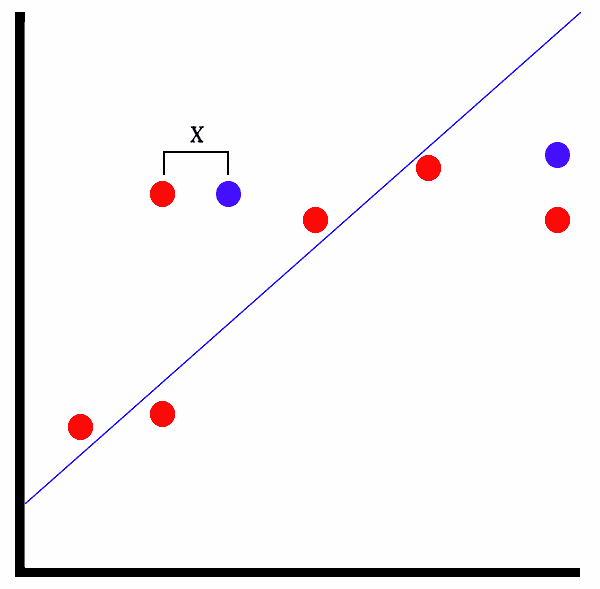

# 三、回归模型

随着开发环境的配置和第一个 ML.NET 应用的完成，现在是时候深入回归模型了。在本章中，我们将深入回归模型背后的数学，以及回归模型的各种应用。我们还将构建两个额外的 ML.NET 应用，一个利用线性回归模型，另一个利用逻辑回归模型。线性回归应用将基于各种员工属性预测员工流失。逻辑回归应用将对文件执行基本的静态文件分析，以确定它是恶意的还是良性的。最后，我们将探索如何用 model 在回归模型中揭示的属性来评估回归模型。

在本章中，我们将讨论以下主题:

*   分解各种回归模型
*   创建线性回归应用
*   创建逻辑回归应用
*   评估回归模型


# 分解回归模型

虽然在机器学习生态系统中有几种可用的回归模型类型，但有两种主要的回归模型组:线性和逻辑，这两种模型在 ML.NET 都有丰富的实现。

ML.NET 提供以下线性回归训练器:

*   `FastTreeRegressionTrainer`
*   `FastTreeTweedieTrainer`
*   `FastForestRegressionTrainer`
*   `GamRegressionTrainer`

*   `LbfgsPoissonRegressionTrainer`
*   `LightGbmRegressionTrainer`
*   `OlsTrainer`
*   `OnlineGradientDescentTrainer`
*   `SdcaRegressionTrainer`

我们将在本章后面创建的员工流失应用利用了线性回归 SDCA 训练器。

此外，ML.NET 提供以下二元逻辑回归训练器:

*   `LbfgsLogisticRegressionBinaryTrainer`
*   `SdcaLogisticRegressionBinaryTrainer`
*   `SdcaNonCalibratedBinaryTrainer`
*   `SymbolicSgdLogisticRegressionBinaryTrainer`

对于文件分类应用，我们将利用`SDCALogisticRegressionBinaryTrainer`模型。


# 选择回归模型的类型

面对所有这些选择，如何选择正确的回归模型类型呢？

您选择的回归模型类型取决于您的预期输出。如果你正在寻找的只是一个布尔值(即 0 或 1)，逻辑回归模型应该像在文件分类应用中一样使用，我们将在本章后面编写。此外，如果您希望返回特定的预定义范围的值，例如轿车、敞篷车或掀背车等汽车类型，逻辑回归模型是可供选择的正确模型。

相反，线性回归模型返回一个数值，例如我们将在本章后面探讨的雇佣持续时间示例。

因此，总结一下，我们有以下几点:

*   如果您的输出是布尔值，请使用逻辑回归模型。
*   如果输出包含预设范围类型的值(类似于枚举)，请使用逻辑回归模型。
*   如果您的输出是未知数值，请使用线性回归模型。


# 选择线性回归训练器

当看着 ML.NET 列出的九个线性回归训练师时，问哪一个是最好的可能有点令人生畏。

对于 ML.NET 线性回归训练器，总的来说，最流行的是 FastTree 和 LightGBM。这三种快速树算法利用邻居连接，并使用试探法来快速识别候选连接，以构建决策树。LightGBM 是一种非常流行的线性回归算法，它利用基于**梯度的单侧采样** ( **高斯**)来过滤出数据实例，以找到拆分值。两个训练器都提供快速训练和预测时间，同时还提供非常准确的模型性能。此外，更多的文档、论文和研究可用于这两种算法。

剩下的五个训练器是有用的，值得深入实验，但总体来说，你可能会发现 LightGBM 和 FastTree 同样成功或更成功。


# 选择逻辑回归训练器

给定 ML.NET 现有的四种逻辑回归训练器，哪一种最适合你的问题？虽然所有四个回归训练器都返回二进制分类，但它们针对不同的数据集和工作负载进行了优化。

您是否希望在低记忆环境中进行训练和预测？如果是这样，L-BFGS 逻辑回归训练器(`LbfgsLogisticRegressionBinaryTrainer`)是一个合理的选择，因为它是为处理记忆受限的环境而创建的。

总部位于 SDCA 的两个训练师——`SdcaLogisticRegressionBinaryTrainer`和`SdcaNonCalibratedBinaryTrainer`——都针对训练的可扩展性进行了优化。如果你的训练集很大，并且你正在寻找二进制分类，这两个 SDCA 训练器都是不错的选择。

`SymbolicSgdLogisticRegressionBinaryTrainer`模型不同于其他三个模型，因为它基于随机梯度下降算法。这意味着该算法不是寻求最大化误差函数，而是寻求最小化误差函数。

如果您想扩展您对 scda 的了解，特别是微软研究院如何对扩展 scda 进行实验，请阅读此白皮书:[https://www . Microsoft . com/en-us/Research/WP-content/uploads/2016/06/main-3 . pdf](https://www.microsoft.com/en-us/research/wp-content/uploads/2016/06/main-3.pdf)。


# 创建线性回归应用

如前所述，我们将创建的应用是一个员工流失预测器。给定一组与员工相关的属性，我们可以预测他们将在当前工作岗位上呆多长时间。本例中包含的属性不是一个确定的属性列表，也不应该在生产环境中按原样使用；但是，我们可以以此为起点，根据几个属性来预测单个数字输出。

与[第一章](b8d873e1-9234-4f11-ad94-76df5ffbb228.xhtml)、*机器学习入门和 ML.NET*一样，完整的项目代码、样本数据集和项目文件可以在这里下载:[https://github . com/packt publishing/Hands-On-Machine-Learning-With-ML。NET/tree/master/chapter 03 _ 线性 _ 回归](https://github.com/PacktPublishing/Hands-On-Machine-Learning-With-ML.NET/tree/master/chapter03_linear_regression)。


# 潜入教练

如前所述，对于这个线性回归应用，我们将使用 SDCA 训练器。 **SDCA** 代表**随机对偶坐标上升**，如果你还记得的话，我们在[第 2 章](b8decd34-4bcb-4b1b-80d2-b2bfd0fa31c1.xhtml)、*设置 ML.NET 环境*的例子中使用了该训练器的逻辑回归版本。

对于普通读者来说，组成 SDCA 的所有四个单词可能都不知道，所以让我们来分解每个单词的意思，以便更清楚地说明当你使用 SDCA 教练时会发生什么。从*随机*开始，换句话说，就是不可预测性。在机器学习的情况下，这意味着尝试从概率上预测误差函数，并将训练集中的随机样本输入优化器。使用*双坐标*意味着在训练模型时两个变量是耦合的。正如您可能已经猜到的，这使得模型更加复杂，但是不需要任何额外的工作来利用。最后，*上升*指的是最大化误差函数值。


# 探索项目架构

基于我们在[第 2 章](b8decd34-4bcb-4b1b-80d2-b2bfd0fa31c1.xhtml)、*设置 ML.NET 环境*中创建的项目架构和代码，本例中架构上的主要变化是输入机制。[第 2 章](b8decd34-4bcb-4b1b-80d2-b2bfd0fa31c1.xhtml)，*设置 ML.NET 环境*，使用一个简单的字符串通过命令行参数提供情感分析。在这个应用中，有几个属性要传递到模型中；因此，对于这个应用，我们现在使用 JSON 文件来包含我们的输入数据。随着这一增加，我们现在包括了流行的`Newtonsoft.Json` NuGet 包(12.0.2 版本是撰写本文时的最新版本，也是包含的示例中使用的版本)。如果您是从零开始构建这个项目，并且不记得如何添加一个 NuGet 引用，请返回参考[第 2 章](b8decd34-4bcb-4b1b-80d2-b2bfd0fa31c1.xhtml)、*设置 ML.NET 环境*。

下面的屏幕截图显示了该项目的 Visual Studio 解决方案资源管理器视图。解决方案中新增加的是`ExtensionMethods`类文件，我们将在下一节中查看它:



`sampledata.csv`文件包含 40 行随机数据；请随意调整数据以适应您自己的观察或调整训练好的模型。以下是数据片段:

```
16,1,1,0,20,38,1,1,1
23,1,1,1,17,36,0,1,0
6,1,1,0,10,30,1,0,1
4,0,1,0,6,26,1,0,1
14,0,0,0,4,27,1,0,1
24,1,1,1,14,30,1,0,1
5,1,1,0,8,31,0,1,1
12,1,1,0,20,50,0,1,1
12,1,1,0,12,50,1,0,1
6,1,1,0,10,52,0,1,1
```

这些行中的每一行都包含了新创建的`EmploymentHistory`类中的属性值，我们将在本章的后面进行回顾。

如果您想使用更大的数据集来训练和扩展这个示例，网站 Kaggle 提供了一个由 IBM 数据科学家创建的数据集。这个数据集可以在这里找到:[https://www . ka ggle . com/pavansubhasht/IBM-HR-analytics-attraction-dataset](https://www.kaggle.com/pavansubhasht/ibm-hr-analytics-attrition-dataset)。


# 钻研代码

对于上面提到的这个应用，我们在第 2 章、*中完成的工作基础上构建 ML.NET 环境*。在这次深入探讨中，我们将只关注针对该应用更改的代码。

更改或添加的类如下:

*   `ExtensionMethods`
*   `EmploymentHistory`
*   `EmploymentHistoryPrediction`
*   `Predictor`
*   `Trainer`
*   `Program`


# ExtensionMethods 类

这个新添加的类提供了一个易于使用的扩展方法来返回类中除标签之外的所有属性。如果你不熟悉扩展方法，这些方法提供了一个非常简单的语法，可以在单个对象上提供复杂的操作，就像在这个例子中，我们取一个任意的类型并返回它包含的所有属性(除了`labelName`):

```
using System;
using System.Linq;

namespace chapter03.Common
{
    public static class ExtensionMethods
    {
        public static string[] ToPropertyList<T>(this Type objType, string labelName) =>                     objType.GetProperties().Where(a => a.Name != labelName).Select(a =>                             a.Name).ToArray();
    }
}
```


# EmploymentHistory 类

`EmploymentHistory`类是容器类，包含预测和训练我们模型的数据。这些列按照前面查看的示例数据的顺序进行映射。如果您开始尝试新功能并添加到此列表中，请确保适当增加数组索引:

```
using Microsoft.ML.Data;

namespace chapter03.ML.Objects
{
    public class EmploymentHistory
    {
        [LoadColumn(0)]
        public float DurationInMonths { get; set; }

        [LoadColumn(1)]
        public float IsMarried { get; set; }

        [LoadColumn(2)]
        public float BSDegree { get; set; }

        [LoadColumn(3)]
        public float MSDegree { get; set; }

        [LoadColumn(4)]
        public float YearsExperience { get; set; }

        [LoadColumn(5)]
        public float AgeAtHire { get; set; }

        [LoadColumn(6)]
        public float HasKids { get; set; }

        [LoadColumn(7)]
        public float WithinMonthOfVesting { get; set; }

        [LoadColumn(8)]
        public float DeskDecorations { get; set; }

        [LoadColumn(9)]
        public float LongCommute { get; set; }
    }
}
```


# EmploymentHistoryPrediction 类

`EmploymentHistoryPrediction`类仅包含预计雇员在`DurationInMonths`属性中工作几个月的预测值:

```
using Microsoft.ML.Data;

namespace chapter03.ML.Objects
{
    public class EmploymentHistoryPrediction
    {
        [ColumnName("Score")]
        public float DurationInMonths;
    }
}
```


# 预测器类

为了处理就业预测场景，该类中有一些变化:

1.  首先，在对输入文件进行预测之前，验证它是否存在:

```
if (!File.Exists(inputDataFile))
{
    Console.WriteLine($"Failed to find input data at {inputDataFile}");

    return;
}
```

2.  另一个变化是预测调用本身。正如您可能猜到的，TSrc 和 TDst 参数需要调整，以利用我们创建的两个新类，`EmploymentHistory`和`EmploymentHistoryPrediction`:

```
var predictionEngine = MlContext.Model.CreatePredictionEngine<EmploymentHistory, EmploymentHistoryPrediction>(mlModel);
```

3.  鉴于我们不再简单地传入字符串并动态构建一个对象，我们需要首先以文本形式读入文件。然后我们将 JSON 反序列化到我们的`EmploymentHistory`对象中:

```
var json = File.ReadAllText(inputDataFile);

var prediction = predictionEngine.Predict(JsonConvert.DeserializeObject<EmploymentHistory>(json));
```

4.  最后，我们需要调整预测的输出，以匹配新的`EmploymentHistoryPrediction`属性:

```
Console.WriteLine(
 $"Based on input json:{System.Environment.NewLine}" +
 $"{json}{System.Environment.NewLine}" + 
 $"The employee is predicted to work {prediction.DurationInMonths:#.##} months");
```


# 训练师课程

在`Trainer`类中，很大一部分被重写，以处理所使用的扩展特性，并提供回归算法评估，这与我们在[第 2 章](b8decd34-4bcb-4b1b-80d2-b2bfd0fa31c1.xhtml)、*设置 ML.NET 环境*中看到的二进制分类相反。

第一个变化是使用逗号来分隔数据，而不是我们在第 2 章、*设置 ML.NET 环境*中使用的默认选项卡:

```
var trainingDataView = MlContext.Data.LoadFromTextFile<EmploymentHistory>(trainingFileName, ',');
```

下一个变化是管道创建本身。在我们的第一个应用中，我们有一个标签并将其直接输入到管道中。在这个应用中，我们在`DurationInMonths`属性中有九个特性来预测一个人的雇佣期，并使用 C# 6.0 特性`nameof`将它们中的每一个附加到管道中。您可能已经注意到，在 GitHub 和 MSDN 的各种代码示例中，使用了神奇的字符串来将类属性映射到特性；我个人认为，与强类型方法相比，这种方法容易出错。

对于每个属性，我们调用`NormalizeMeanVariance` transform 方法，顾名思义，该方法根据平均值和方差对输入数据进行归一化。ML.NET 通过减去输入数据的平均值并除以输入数据的方差来计算。这样做的目的是消除输入数据中的异常值，使模型在处理与正常范围相比的边缘情况时不会出现偏差。例如，假设就业历史的样本数据集有 20 行，除了一行之外，所有行都有一个有 50 年工作经验的人。不符合的一行将被规范化，以更好地符合输入到模型中的值范围。

此外，注意前面提到的扩展方法的使用，当我们连接所有的特性列时，它有助于简化下面的代码:

```
var dataProcessPipeline = MlContext.Transforms.CopyColumns("Label", nameof(EmploymentHistory.DurationInMonths))
 .Append(MlContext.Transforms.NormalizeMeanVariance(nameof(EmploymentHistory.IsMarried)))
 .Append(MlContext.Transforms.NormalizeMeanVariance(nameof(EmploymentHistory.BSDegree)))
 .Append(MlContext.Transforms.NormalizeMeanVariance(nameof(EmploymentHistory.MSDegree)))
 .Append(MlContext.Transforms.NormalizeMeanVariance(nameof(EmploymentHistory.YearsExperience))
 .Append(MlContext.Transforms.NormalizeMeanVariance(nameof(EmploymentHistory.AgeAtHire)))
 .Append(MlContext.Transforms.NormalizeMeanVariance(nameof(EmploymentHistory.HasKids)))
 .Append(MlContext.Transforms.NormalizeMeanVariance(nameof(EmploymentHistory.WithinMonthOfVesting)))
 .Append(MlContext.Transforms.NormalizeMeanVariance(nameof(EmploymentHistory.DeskDecorations)))
 .Append(MlContext.Transforms.NormalizeMeanVariance(nameof(EmploymentHistory.LongCommute)))
 .Append(MlContext.Transforms.Concatenate("Features",
 typeof(EmploymentHistory).ToPropertyList<EmploymentHistory>(nameof(EmploymentHistory.DurationInMonths)))));
```

然后，我们可以使用默认参数(`"Label"`和`"Features"`)创建`Sdca`教练:

```
var trainer = MlContext.Regression.Trainers.Sdca(labelColumnName: "Label", featureColumnName: "Features");
```

最后，我们调用`Regression.Evaluate`方法来提供回归特定的指标，然后调用`Console.WriteLine`将这些指标提供给控制台输出。我们将在本章的最后一节详细介绍每一项的含义:

```
var modelMetrics = MlContext.Regression.Evaluate(testSetTransform);

Console.WriteLine($"Loss Function: {modelMetrics.LossFunction:0.##}{Environment.NewLine}" +
 $"Mean Absolute Error: {modelMetrics.MeanAbsoluteError:#.##}{Environment.NewLine}" +
 $"Mean Squared Error: {modelMetrics.MeanSquaredError:#.##}{Environment.NewLine}" +
 $"RSquared: {modelMetrics.RSquared:0.##}{Environment.NewLine}" +
 $"Root Mean Squared Error: {modelMetrics.RootMeanSquaredError:#.##}");
```


# 程序类

`Program`类中唯一的变化是帮助文本指出预测的用法需要文件名，而不是字符串:

```
if (args.Length != 2)
{
    Console.WriteLine($"Invalid arguments passed in, exiting.{Environment.NewLine}                    {Environment.NewLine}Usage:{Environment.NewLine}" +
        $"predict <path to input json file>{Environment.NewLine}" +
        $"or {Environment.NewLine}" +
        $"train <path to training data file>{Environment.NewLine}");

        return;
}
```


# 运行应用

运行应用的过程与第 2 章的示例应用几乎相同。为了更快地迭代，调试配置自动将包含的`sampledata.csv`文件作为命令行参数传入:



展望未来，由于应用越来越复杂，所有示例应用都将具有以下预设:

1.  要像我们在[第 1 章](b8d873e1-9234-4f11-ad94-76df5ffbb228.xhtml)、*机器学习和 line 入门、*中所做的那样在命令行上运行训练，只需传入以下命令(假设您使用的是附带的样本数据集):

```
PS chapter03\bin\Debug\netcoreapp3.0> .\chapter03.exe train ..\..\..\Data\sampledata.csv 
Loss Function: 324.71
Mean Absolute Error: 12.68
Mean Squared Error: 324.71
RSquared: 0.14
Root Mean Squared Error: 18.02
```

请注意扩展后的输出包括了几个度量数据点——我们将在本章的最后讨论每个数据点的含义。

2.  训练完模型后，构建一个样本 JSON 文件，并将其保存为`input.json`:

```
{
  "durationInMonths": 0.0,
  "isMarried": 0,
  "bsDegree": 1,
  "msDegree": 1,
  "yearsExperience": 2,
  "ageAtHire": 29,
  "hasKids": 0,
  "withinMonthOfVesting": 0,
  "deskDecorations": 1,
  "longCommute": 1
}
```

3.  要使用该文件运行模型，只需将文件名传递给构建的应用，预测的输出将显示:

```
PS chapter03\bin\Debug\netcoreapp3.0> .\chapter03.exe predict input.json 
Based on input json:
{
 "durationInMonths": 0.0,
 "isMarried": 0,
 "bsDegree": 1,
 "msDegree": 1,
 "yearsExperience": 2,
 "ageAtHire": 29,
 "hasKids": 0,
 "withinMonthOfVesting": 0,
 "deskDecorations": 1,
 "longCommute": 1
}

The employee is predicted to work 22.82 months
```

您可以随意修改这些值，并查看预测如何基于模型所基于的数据集而发生变化。从这一点来看，一些实验领域可能要做以下事情:

*   根据自己的经验增加一些额外的功能。
*   修改`sampledata.csv`以包含您团队的经验。
*   修改示例应用，使其具有一个 GUI，使运行预测更容易。


# 创建逻辑回归应用

如前所述，我们将创建的用于演示逻辑回归的应用是一个文件分类器。给定一个文件(任何类型)，我们从文件中提取字符串。这是执行文件分类的一种非常常见的方法，尽管像前面的例子一样，这通常只是文件分类的一个元素，而不是唯一的组成部分。所以，不要指望这个能找到下一个零时差的恶意软件！

完整的项目代码、样本数据集和项目文件可以在这里下载:[https://github . com/packt publishing/Hands-On-Machine-Learning-With-ML。NET/tree/master/chapter 03 _ logistic _ 回归](https://github.com/PacktPublishing/Hands-On-Machine-Learning-With-ML.NET/tree/master/chapter03_logistic_regression) [。](https://github.com/PacktPublishing/Hands-On-Machine-Learning-With-ML.NET/tree/master/chapter03_logistic_regression)

本应用中使用的训练器也使用 SDCA，但使用了本章前面讨论的逻辑回归变量。

和前面的例子一样，我们将从探索项目架构开始，深入研究代码，然后展示如何运行这个例子来训练和预测。


# 探索项目架构

基于我们在前一个例子中创建的项目架构和代码，这个例子中架构上的主要变化是特征提取。在这个例子中，除了创建新的输入和预测类之外，我们还将添加`FeatureExtractor`类。这样做的原因要追溯到保持事物分离和良好定义的理念，正如在[第 2 章](b8decd34-4bcb-4b1b-80d2-b2bfd0fa31c1.xhtml)、*设置 ML.NET 环境*中所讨论的。对于这个示例应用和您可能编写的未来应用，它们很可能会有要转换成数据行的输入文件。通过让一个单独的类处理管道的这一部分，您可以干净地封装这一功能。

下面的屏幕截图显示了该项目的 Visual Studio 解决方案资源管理器视图。解决方案中新增加的是`FeatureExtractor`类文件，我们将在下一节中查看:



`sampledata.csv`文件包含八行随机数据。请随意调整数据以适应您自己的观察或调整训练好的模型。以下是包含的示例数据:

```
False !This program cannot be run in DOS mode.L$ SUVWH\$ UVWAVAWH\$ VWAVHWATAUAVAWHA_AA]A\_l$ VWAVHt
False !This program cannot be run in DOS mode.L$ SUVWH\$ VWAVHUVWAVAWHUVWATAUAVAWHA_AA]A\_]UVWAVAWHU
False !This program cannot be run in DOS mode.$7ckw7ckw7ckw>jv$ckw7cjwiv6ckwRich7ckw9A98u6A9xx ATAVA
False !This program cannot be run in DOS mode.EventSetInformationmshelp URL calledLaunchFwLink"mshelp
True !This program cannot be run in DOS mode.Fm;Ld &~_New_ptrt(M4_Alloc_max"uJIif94H3"j?TjV*?invalid
True <</Length 17268/Type/EmbeddedFile/Filter/FlateDecode/Params<</ModDate(D:20191003012641+00'00'/Size
True !This program cannot be run in DOS mode._New_ptr7(_MaskQAlloc_maxtEqx?$xjinvalid argumC:\Program F
True __gmon_startN_easy_cKcxa_amxBZNSt8ios_bEe4IeD1Evxxe6naDtqv_Z<4endlIcgLSaQ6appw3d_ResumeCXXABI_1.3%d
```

这些行中的每一行都包含相当于两列的数据。首先是分类，真的是恶意的，假的是良性的。这些属性被映射到新创建的`FileInput`类中，我们将在本章后面回顾这个类。


# 钻研代码

对于上面提到的这个应用，我们是在本章前面完成的工作的基础上构建的。同样，在这次深入探讨中，我们将只关注针对该应用更改的代码。

更改或添加的类如下:

*   `FeatureExtractor`
*   `FileInput`
*   `FilePrediction`
*   `BaseML`
*   `Predictor`
*   `Trainer`
*   `Program`


# FeatureExtractor 类

这个新添加的类为文件**的给定文件夹提供了我们的特征提取。**一旦提取完成，分类和字符串数据被写出到`sampledata`文件:

```
using System;
using System.IO;

using chapter03_logistic_regression.Common;
using chapter03_logistic_regression.ML.Base;

namespace chapter03_logistic_regression.ML
{
    public class FeatureExtractor : BaseML
    {
        public void Extract(string folderPath)
        {
            var files = Directory.GetFiles(folderPath);

            using (var streamWriter =
                new StreamWriter(Path.Combine(AppContext.BaseDirectory, $"../../../Data/{Constants.SAMPLE_DATA}")))
            {
                foreach (var file in files)
                {
                    var strings = GetStrings(File.ReadAllBytes(file));

                    streamWriter.WriteLine($"{file.ToLower().Contains("malicious")}\t{strings}");
                }
            }

            Console.WriteLine($"Extracted {files.Length} to {Constants.SAMPLE_DATA}");
        }
    }
}
```


# FileInput 类

`FileInput`类为经过训练的分类和我们提取的字符串数据提供了容器:

```
using Microsoft.ML.Data;

namespace chapter03_logistic_regression.ML.Objects
{
    public class FileInput
    {
        [LoadColumn(0)]
        public bool Label { get; set; }

        [LoadColumn(1)]
        public string Strings { get; set; }
    }
}
```


# FilePrediction 类

`FilePrediction`类提供了分类、概率和分数的容器:

```
using Microsoft.ML.Data;

namespace chapter03_logistic_regression.ML.Objects
{
    public class FilePrediction
    {
        [ColumnName("PredictedLabel")]
        public bool IsMalicious { get; set; }

        public float Probability { get; set; }

        public float Score { get; set; }
    }
}
```


# BaseML 类

对于`BaseML`类，我们从构造函数开始做了一些改进。在构造函数中，我们将变量`stringRex`初始化为正则表达式，我们将使用它来提取字符串。`Encoding.RegisterProvider`利用 Windows-1252 编码至关重要。此编码是 Windows 可执行文件使用的编码:

```
private static Regex _stringRex;

protected BaseML()
{
    MlContext = new MLContext(2020);

    Encoding.RegisterProvider(CodePagesEncodingProvider.Instance);

    _stringRex = new Regex(@"[ -~\t]{8,}", RegexOptions.Compiled);
}
```

下一个主要的增加是`GetStrings`方法。此方法获取字节，运行先前创建的已编译正则表达式，并提取匹配的字符串:

1.  首先，我们定义方法定义并初始化`stringLines`变量来保存字符串:

```
protected string GetStrings(byte[] data)
{
    var stringLines = new StringBuilder();
```

2.  接下来，我们将检查输入数据是否为空:

```
if (data == null || data.Length == 0)
{
    return stringLines.ToString();
}
```

3.  下一个代码块我们打开一个`MemoryStream`对象，然后打开一个`StreamReader`对象:

```
 using (var ms = new MemoryStream(data, false))
 {
     using (var streamReader = new StreamReader(ms, Encoding.GetEncoding(1252), false, 2048, false))
     {
```

4.  然后我们将遍历`streamReader`对象，直到达到`EndOfStream`条件，逐行读取:

```
while (!streamReader.EndOfStream)
{
    var line = streamReader.ReadLine();
```

5.  然后，我们将对数据进行一些字符串清理，并优雅地处理该行是否为空:

```
if (string.IsNullOrEmpty(line))
{
    continue;
}

line = line.Replace("^", "").Replace(")", "").Replace("-", "");
```

6.  然后，我们将添加正则表达式匹配，并将这些匹配添加到先前定义的`stringLines`变量:

```
stringLines.Append(string.Join(string.Empty,
                    _stringRex.Matches(line).Where(a => !string.IsNullOrEmpty(a.Value) && !string.IsNullOrWhiteSpace(a.Value)).ToList()));
```

7.  最后，我们将返回使用`string.Join`方法转换成单个字符串的`stringLines`变量:

```
    return string.Join(string.Empty, stringLines);
}
```


# 预测器类

与线性回归示例中的变化非常相似，只需修改`Predictor`类即可支持新模型并返回分类:

1.  我们首先向`CreatePredictionEngine`方法传递两个新类`FileInput`和`FilePrediction`、**、**:

```
var predictionEngine = MlContext.Model.CreatePredictionEngine<FileInput, FilePrediction>(mlModel);
```

2.  接下来，我们创建`FileInput`对象，用我们之前编写的`GetStrings`方法的返回值设置`Strings`属性:

```
var prediction = predictionEngine.Predict(new FileInput
{
    Strings = GetStrings(File.ReadAllBytes(inputDataFile))
});
```

3.  最后，我们用我们的文件分类和概率更新对`Console`对象的输出调用:

```
Console.WriteLine(
                    $"Based on the file ({inputDataFile}) the file is classified as {(prediction.IsMalicious ? "malicious" : "benign")}" + 
                    $" at a confidence level of {prediction.Probability:P0}");
```


# 训练师课程

在`Trainer`类中，我们将构建一个新的管道来训练我们的模型。`FeaturizeText`转换从我们之前从文件中提取的字符串数据构建 NGrams。 **NGrams** 是一种流行的方法，它从字符串创建向量，反过来，提供给模型。您可以将 NGram 看作是根据 NGram 参数的值将一个较长的字符串分成多个字符范围。例如，一个二元语法会把下面的句子*ML.NET 很棒*转换成 *ML-。N-ET-is-gr-ea-t* 。最后，我们构建了`SdcaLogisticRegression`训练器对象:

```
var dataProcessPipeline = MlContext.Transforms.CopyColumns("Label", nameof(FileInput.Label))
 .Append(MlContext.Transforms.Text.FeaturizeText("NGrams", nameof(FileInput.Strings)))
 .Append(MlContext.Transforms.Concatenate("Features", "NGrams"));

var trainer = MlContext.BinaryClassification.Trainers.SdcaLogisticRegression(labelColumnName: "Label", featureColumnName: "Features");
```

对于那些希望进一步深入研究`Transforms`目录 API 的人，请在此处查看来自微软的文档:[https://docs . Microsoft . com/en-us/dot net/API/Microsoft . ml . transforms Catalog？view=ml-dotnet](https://docs.microsoft.com/en-us/dotnet/api/microsoft.ml.transformscatalog?view=ml-dotnet) 。


# 程序类

在`Program`类中，我们添加了第三个选项来提取特征并创建样本数据`.tsv`文件:

1.  首先，我们修改帮助文本，以指示新的提取选项，该选项采用到 training 文件夹的路径:

```
if (args.Length != 2)
{
    Console.WriteLine($"Invalid arguments passed in, exiting.{Environment.NewLine}{Environment.NewLine}Usage:{Environment.NewLine}" +
                      $"predict <path to input file>{Environment.NewLine}" +
                      $"or {Environment.NewLine}" +
                      $"train <path to training data file>{Environment.NewLine}" + 
                      $"or {Environment.NewLine}" +
                      $"extract <path to folder>{Environment.NewLine}");

    return;
}
```

2.  此外，我们还需要修改主开关/外壳以支持`extract`参数:

```
switch (args[0])
{
    case "extract":
        new FeatureExtractor().Extract(args[1]);
        break;
    case "predict":
        new Predictor().Predict(args[1]);
        break;
    case "train":
        new Trainer().Train(args[1]);
        break;
    default:
        Console.WriteLine($"{args[0]} is an invalid option");
        break;
}
```


# 运行应用

随着我们的管道中添加了特征提取，我们首先需要对文件执行特征提取:

1.  假设名为`temp_data`的文件夹存在，执行以下命令:

```
PS chapter03-logistic-regression\bin\Debug\netcoreapp3.0> .\chapter03-logistic-regression.exe extract temp_data                                                
Extracted 8 to sampledata.csv
```

输出显示了提取文件的数量和输出样本文件。

2.  要使用附带的`sampledata.csv`或您自己训练的来训练模型，执行以下命令:

```
PS chapter03-logistic-regression\bin\Debug\netcoreapp3.0> .\chapter03-logistic-regression.exe train ..\..\..\Data\sampledata.csv
```

一旦完成，模型文件应该存在于执行的文件夹中。

3.  要针对现有文件(如编译的`chapter3`可执行文件)运行新训练的模型，请运行以下命令:

```
PS chapter03-logistic-regression\bin\Debug\netcoreapp3.0> .\chapter03-logistic-regression.exe predict .\chapter03-logistic-regression.exe                      
Based on the file (.\chapter03-logistic-regression.exe) the file is classified as benign at a confidence level of 8%
```

如果您正在寻找示例文件，`c:\Windows`和`c:\Windows\System32`文件夹包含大量的 Windows 可执行文件和 dll。此外，如果你想创建看起来恶意但实际上干净的文件，你可以在 [http://cwg.io](http://cwg.io) 上创建各种文件格式的文件。这是网络安全领域的一个有用工具，在这里，在开发机器上测试新功能比在上面引爆真正的零日威胁要安全得多！


# 评估回归模型

如前几章所述，评估模型是整个模型构建过程的关键部分。训练不足的模型只会提供不准确的预测。幸运的是，ML.NET 提供了许多流行的属性来计算模型的准确性，这些属性基于训练时的测试集，让您了解您的模型在生产环境中的表现。

在 ML.NET，正如前面线性回归示例应用中提到的，有五个属性组成了`RegressionMetrics`类对象。其中包括以下内容:

*   损失函数
*   绝对平均误差
*   均方误差
*   r 平方
*   均方根误差

在接下来的部分中，我们将分解这些值是如何计算的，以及要寻找的理想值。


# 损失函数

该属性使用初始化回归训练器时设置的损失函数。在我们的线性回归示例应用中，我们使用了默认的构造函数，对于 SDCA，它默认为`SquaredLoss`类。

ML.NET 提供的其他回归损失函数如下:

*   `TweedieLoss`(用于特威迪回归模型)
*   `PoissonLoss`(用于泊松回归模型)

与使用固定算法进行评估的其他四个属性相比，此属性背后的想法是在评估模型时允许一定的灵活性。


# 均方误差

**均方误差**，也称为 **MSE** ，定义为误差平方平均值的度量。简单来说，请参考以下情节:


点与我们模型的数据点相关，而蓝线是预测线。红点和预测线之间的距离就是误差。对于 MSE，该值是基于这些点及其到线的距离计算的。根据该值，计算平均值。对于 MSE，该值越小，模型的拟合越好，预测越准确。

当异常值对预测输出至关重要时，MSE 最适合用于评估模型。


# 绝对平均误差

**平均绝对误差**，也称为 **MAE** ，类似于 MSE，其关键区别在于它将点和预测线之间的距离相加，而不是计算平均值。应该注意的是，MAE 在计算总和时不考虑方向。例如，如果您有两个数据点，与直线等距，一个在上方，另一个在下方，实际上，这将通过正值和负值来平衡。在机器学习中，这被称为均值偏差误差，然而，在撰写本文时，ML.NET 没有将此作为`RegressionMetrics`类的一部分提供。

当异常值被认为是简单的异常，并且在评估模型的性能时不应该被计算在内时，MAE 最适合用于评估模型。


# r 平方

r 平方也称为决定系数，是另一种表示预测与测试集相比有多精确的方法。r 平方的计算方法是，取每个数据点之间的距离和均方值，减去它们，然后平方。

r 平方值通常介于 0 和 1 之间，表示为浮点值。当拟合模型被评估为比平均拟合差时，可能出现负值。但是，数字低并不总是反映模型不好。像我们在本章中看到的那种基于预测人类行为的预测，经常被发现低于 50%。

相反，较高的值不一定是模型性能的确定标志，因为这可能被认为是模型的过拟合。这种情况发生在当有许多特征输入到模型中时，从而使模型比，例如，我们在[第 1 章](b8d873e1-9234-4f11-ad94-76df5ffbb228.xhtml)、*机器学习入门和 ML.NET*中建立的模型更复杂，或者在训练和测试集中没有足够的多样性。例如，如果所有雇员的值大致相同，并且测试集维持由相同范围的值组成，则这将被视为过拟合。


# 均方根误差

**均方根** **误差**，也称为 **RMSE** ，鉴于之前的方法，可以说是最容易理解的。以下面这个情节为例:



在我们之前使用维持集测试模型的情况下，红点是测试集的实际值，而蓝点是预测值。所描绘的 *X* 是预测值与实际值之间的距离。RMSE 只是取所有这些距离的平均值，平方这个值，然后求平方根。

低于 180 的值通常被认为是好的模型。


# 摘要

在本章中，我们研究了线性回归模型和逻辑回归模型之间的差异。此外，我们回顾了何时选择线性或逻辑模型以及 ML.NET 提供的训练师。我们还使用 ML.NET 和 SDCA 创建并训练了第一个线性回归应用来预测员工流失。我们还使用 ML.NET 和 SDCA 创建了一个逻辑回归应用来提供文件分类。最后，我们还深入探讨了如何评估回归模型，以及 model 揭示的各种属性，以实现对回归模型的正确评估。

在下一章，我们将深入研究二进制分类算法。