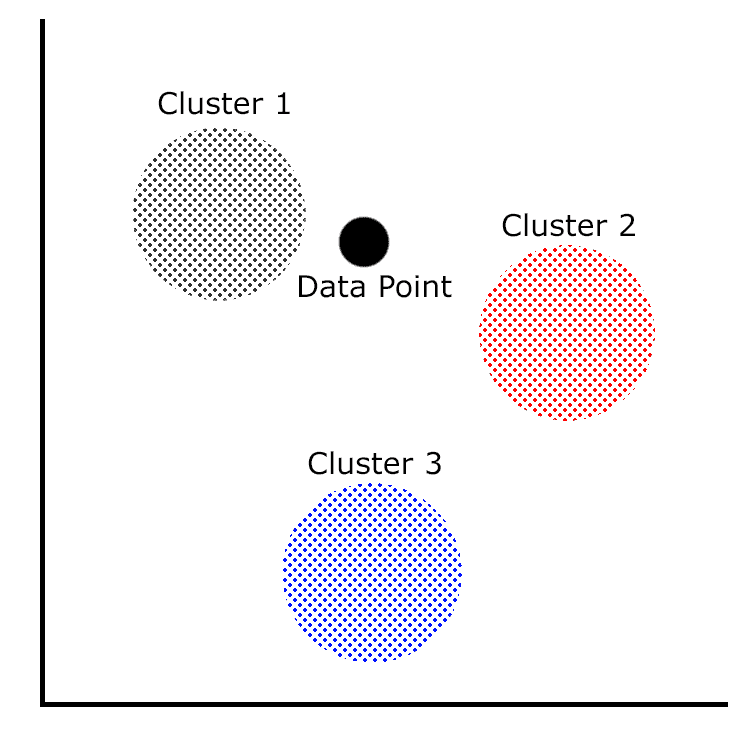

# 聚类模型

分类模型已经过去，现在是时候深入研究聚类模型了。目前，在 ML.NET 只有一种聚类算法，k-means。在本章中，我们将深入研究 k-means 聚类以及最适合利用聚类算法的各种应用。此外，我们将构建一个新的 ML.NET 集群应用程序，它只需通过查看内容就可以确定文件的类型。最后，我们将探讨如何用 model 揭示的特性来评估 k-means 聚类模型。

在本章中，我们将讨论以下主题:

*   分解 k-means 算法
*   创建集群应用程序
*   评估 k 均值模型


# 分解 k-means 算法

在[第一章](b8d873e1-9234-4f11-ad94-76df5ffbb228.xhtml)、*机器学习入门和 ML.NET 中提到，* k-means 聚类，顾名思义，是一种无监督的学习算法。这意味着数据根据提供给模型用于训练的数据分组到聚类中。在本节中，我们将深入研究聚类和 k-means 训练器的一些用例。


# 集群的用例

正如您可能开始意识到的那样，聚类有许多应用，在这些应用中，输出将相似的输出分类到相似数据点的组中。

它的一些潜在应用包括:

*   自然灾害跟踪，如地震或飓风，并创建高危险区集群
*   根据作者、主题和来源分类的书或文件
*   将客户数据分组为有针对性的营销预测
*   其他用户认为有用的相似结果的搜索结果分组

此外，它还有许多其他应用，如预测恶意软件家族或用于癌症研究的医疗目的。


# 潜入 k-means 训练器

ML.NET 使用的 k-means 训练器是基于阴阳方法，而不是经典的 k-means 实现。就像我们在前几章看到的一些训练器一样，所有的输入都必须是浮点型的。此外，所有输入必须被归一化成单个特征向量。幸运的是，k-means 训练器包含在主 ML.NET nu get 包中；因此，不需要额外的依赖关系。

要了解更多关于阴阳实现的信息，微软研究院在这里发布了白皮书:[https://www . Microsoft . com/en-us/Research/WP-content/uploads/2016/02/ding 15 . pdf](https://www.microsoft.com/en-us/research/wp-content/uploads/2016/02/ding15.pdf)。

请看下图，其中显示了三个集群和一个数据点:



在聚类分析中，每个聚类代表一组相似的数据点。使用 k-means 聚类分析(和其他聚类分析算法)，数据点和每个聚类之间的距离是模型将返回哪个聚类的度量。特别是对于 k-means 聚类，它使用每个聚类的中心点(也称为质心)，然后计算到数据点的距离。这些值中的最小值就是预测的聚类。

对于 k-means 训练器，可以通过三种方式之一进行初始化。一种方法是利用随机初始化——正如您可能已经猜到的，这可能会导致随机的预测结果。另一种方法是利用 k-means++，它努力产生 O(log K)预测。最后，k-means | |(ML.NET 的默认方法)使用并行方法来减少初始化所需的次数。

更多关于 k-means||，可以参考斯坦福发表的一篇论文，里面有详细的解释:[https://theory.stanford.edu/~sergei/papers/vldb12-kmpar.pdf](https://theory.stanford.edu/~sergei/papers/vldb12-kmpar.pdf)。 [](https://theory.stanford.edu/~sergei/papers/vldb12-kmpar.pdf) 
关于 k-means++的更多信息，可以参考斯坦福大学 2006 年发表的一篇论文，详细解释:[http://ilpubs.stanford.edu:8090/778/1/2006-13.pdf](http://ilpubs.stanford.edu:8090/778/1/2006-13.pdf)。

我们将在下一节的示例应用程序中演示这个训练器。


# 创建集群应用程序

如前所述，我们将要创建的应用程序是一个文件类型分类器。给定从文件中静态提取的一组属性，如果它是文档、可执行文件或脚本，预测将返回。对于那些使用过 Linux `file`命令的人来说，这是一个简化版本，但是基于机器学习。本例中包含的属性不是属性的最终列表，也不应该在生产环境中按原样使用；然而，您可以以此为起点，为 Linux `file`命令创建一个真正的基于 ML 的替代品。

和前面的章节一样，完整的项目代码、样本数据集和项目文件可以在这里下载:[https://github . com/packt publishing/Hands-On-Machine-Learning-With-ML。网/树/主/第 05 章](https://github.com/PacktPublishing/Hands-On-Machine-Learning-With-ML.NET/tree/master/chapter05)。


# 探索项目架构

基于我们在前几章中创建的项目架构和代码，架构上的主要变化是在训练集和测试集上进行的特征提取。

在这里，您将找到该项目的 Visual Studio 解决方案资源管理器视图。该解决方案的新增内容是`FileTypes`、`FileData`和`FilePrediction`文件，我们将在本节的稍后部分查看这些文件:


`sampledata.csv`文件包含我系统上的 80 行随机文件，包括 30 个 Windows 可执行文件、20 个 PowerShell 脚本和 20 个 Word 文档。请随意调整数据以适应您自己的观察或调整训练好的模型。以下是数据片段:

```
0,1,1,0
0,1,1,0
0,1,1,0
2,0,0,0
2,0,0,0
2,0,0,0
2,0,0,0
2,0,0,0
2,0,0,0
2,0,0,0
2,0,0,0
2,0,0,0
2,0,0,0
2,0,0,0
1,1,0,1
1,1,0,1
1,1,0,1
1,1,0,1
```

这些行中的每一行都包含了新创建的`FileData`类中的属性值，我们将在本章的后面进行回顾。

除此之外，我们还添加了`testdata.csv`文件，它包含额外的数据点来测试新训练的模型并对其进行评估。细分甚至包括 10 个 Windows 可执行文件、10 个 PowerShell 脚本和 10 个 Word 文档。下面是`testdata.csv`中的一段数据:

```
0,1,1,0
0,1,1,0
2,0,0,0
2,0,0,0
2,0,0,0
2,0,0,0
2,0,0,0
2,0,0,0
1,1,0,1
```


# 钻研代码

对于这个应用程序，如前一节所述，我们在第四章、*中完成的工作的基础上构建分类模型*。在这次深入探讨中，我们将只关注针对该应用程序更改的代码。

更改或添加的类如下:

*   `Constants`
*   ``BaseML``
*   `FileTypes`
*   `FileData`
*   `FileTypePrediction`
*   `FeatureExtractor`
*   `Predictor`
*   `Trainer`
*   `Program`


# 常量类

除了支持特征提取的`testdata.csv`变量之外，`Constants`类已经被修改以将模型保存到`chapter5.mdl`。以下代码块反映了这些更改:

```
namespace chapter05.Common
{
    public class Constants
    {
        public const string MODEL_FILENAME = "chapter5.mdl";

        public const string SAMPLE_DATA = "sampledata.csv";

        public const string TEST_DATA = "testdata.csv";
    }
}
```


# BaseML 类

`BaseML`类中唯一的变化是增加了`FEATURES`变量。通过在这里使用一个变量，我们可以在我们的`Trainer`类中删除一个神奇字符串的使用(我们将在本节稍后讨论这一点):

```
protected const string FEATURES = "Features";
```


# 文件类型枚举

枚举包含一个强类型方法，用于映射我们的分类和一个数值。正如我们在前面的示例中所发现的，与魔术值或常量值相比，使用枚举可以提供更好的灵活性，如这里和其余的类所示:

```
namespace chapter05.Enums
{
    public enum FileTypes
    {
        Executable = 0,
        Document = 1,
        Script = 2
    }
}
```


# FileData 类

`FileData` 类是包含预测和训练我们的模型的数据的容器类:

1.  首先，我们为`True`和`False`添加常量值，因为 k-means 需要浮点值:

```
public class FileData
{
    private const float TRUE = 1.0f;
    private const float FALSE = 0.0f;
```

2.  接下来，我们创建一个支持预测和训练的构造函数。我们可选地为训练传递文件名，以提供一个标签，在本例中，分别为脚本、可执行文件和文档传递`ps1`、`exe`和`doc`。我们还调用 helper 方法来确定文件是二进制的，还是以 MZ 或 PK 开头:

```
public FileData(Span<byte> data, string fileName = null)
{
    // Used for training purposes only
    if (!string.IsNullOrEmpty(fileName))
    {
        if (fileName.Contains("ps1"))
        {
            Label = (float) FileTypes.Script;
        } else if (fileName.Contains("exe"))
        {
            Label = (float) FileTypes.Executable;
        } else if (fileName.Contains("doc"))
        {
            Label = (float) FileTypes.Document;
        }
    }

    IsBinary = HasBinaryContent(data) ? TRUE : FALSE;

    IsMZHeader = HasHeaderBytes(data.Slice(0, 2), "MZ") ? TRUE : FALSE;

    IsPKHeader = HasHeaderBytes(data.Slice(0, 2), "PK") ? TRUE : FALSE;
}
```

MZ 和 PK 被认为是 Windows 可执行文件和现代微软 Office 文件的神奇数字。幻数是唯一的字节串，出现在每个文件的开头。在这种情况下，两者都只是两个字节。对文件执行分析时，快速做出决定对性能至关重要。对于敏锐的读者来说，PK 也是 ZIP 的神奇数字。现代的 Microsoft Office 文档实际上是 ZIP 存档。为了简单起见，本例中使用 PK，而不是执行额外的检测。

3.  接下来，我们还添加了一个额外的构造函数来支持值的硬真值设置。我们将在本节的后面部分深入探讨这一附加功能的目的:

```
/// <summary>
/// Used for mapping cluster ids to results only
/// </summary>
/// <param name="fileType"></param>
public FileData(FileTypes fileType)
{
    Label = (float)fileType;

    switch (fileType)
    {
        case FileTypes.Document:
            IsBinary = TRUE;
            IsMZHeader = FALSE;
            IsPKHeader = TRUE;
            break;
        case FileTypes.Executable:
            IsBinary = TRUE;
            IsMZHeader = TRUE;
            IsPKHeader = FALSE;
            break;
        case FileTypes.Script:
            IsBinary = FALSE;
            IsMZHeader = FALSE;
            IsPKHeader = FALSE;
            break;
    }
}
```

4.  接下来，我们实现我们的两个助手方法。第一个是`HasBinaryContent`，顾名思义，它获取原始二进制数据并搜索非文本字符以确保它是一个二进制文件。其次，我们定义`HasHeaderBytes`；该方法获取一个字节数组，将其转换为一个`UTF8`字符串，然后检查该字符串是否与传入的字符串匹配:

```
private static bool HasBinaryContent(Span<byte> fileContent) =>
            System.Text.Encoding.UTF8.GetString(fileContent.ToArray()).Any(a => char.IsControl(a) && a != '\r' && a != '\n');

private static bool HasHeaderBytes(Span<byte> data, string match) => System.Text.Encoding.UTF8.GetString(data) == match;
```

5.  接下来，我们添加用于预测、训练和测试的属性:

```
[ColumnName("Label")]
public float Label { get; set; }

public float IsBinary { get; set; }

public float IsMZHeader { get; set; }

public float IsPKHeader { get; set; }
```

6.  最后，我们覆盖了用于特征提取的`ToString`方法:

```
public override string ToString() => $"{Label},{IsBinary},{IsMZHeader},{IsPKHeader}";
```


# FileTypePrediction 类

`FileTypePrediction` 类包含映射到我们的预测输出的属性。在 k-means 聚类中，`PredictedClusterId`属性存储找到的最近的聚类。除此之外，`Distances`数组包含从数据点到每个聚类的距离:

```
using Microsoft.ML.Data;

namespace chapter05.ML.Objects
{
    public class FileTypePrediction
    {
        [ColumnName("PredictedLabel")]
        public uint PredictedClusterId;

        [ColumnName("Score")]
        public float[] Distances;
    }
}
```


# FeatureExtractor 类

我们在第三章*回归模型*的[逻辑回归示例中使用的`FeatureExtractor`类，已经被修改为支持测试和训练数据提取:](8bcfc000-9adc-4eda-a91a-e09f676eac85.xhtml)

1.  首先，我们将提取归纳为文件夹路径和输出文件。如前所述，我们还传入文件名，让`Labeling`在`FileData`类中干净地出现:

```
private void ExtractFolder(string folderPath, string outputFile)
{
    if (!Directory.Exists(folderPath))
    {
        Console.WriteLine($"{folderPath} does not exist");

        return;
    }

    var files = Directory.GetFiles(folderPath);

    using (var streamWriter =
        new StreamWriter(Path.Combine(AppContext.BaseDirectory, $"../../../Data/{outputFile}")))
    {
        foreach (var file in files)
        {
            var extractedData = new FileData(File.ReadAllBytes(file), file);

            streamWriter.WriteLine(extractedData.ToString());
        }
    }

    Console.WriteLine($"Extracted {files.Length} to {outputFile}");
}
```

2.  最后，我们从命令行获取两个参数(从`Program`类调用),并简单地再次调用前面的方法:

```
public void Extract(string trainingPath, string testPath)
{
    ExtractFolder(trainingPath, Constants.SAMPLE_DATA);
    ExtractFolder(testPath, Constants.TEST_DATA);
}
```


# 预测器类

为了处理文件类型预测的情况，这个类中有一些变化:

1.  首先，我们添加一个助手方法`GetClusterToMap`，它将已知值映射到预测集群。注意这里`Enum.GetValues`的用法；当您添加更多文件类型时，不需要修改此方法:

```
private Dictionary<uint, FileTypes> GetClusterToMap(PredictionEngineBase<FileData, FileTypePrediction> predictionEngine)
{
    var map = new Dictionary<uint, FileTypes>();

    var fileTypes = Enum.GetValues(typeof(FileTypes)).Cast<FileTypes>();

    foreach (var fileType in fileTypes)
    {
        var fileData = new FileData(fileType);

        var prediction = predictionEngine.Predict(fileData);

        map.Add(prediction.PredictedClusterId, fileType);
    }

    return map;
}         
```

2.  接下来，我们将`FileData`和`FileTypePrediction`类型传递给`CreatePredictionEngine`方法来创建我们的预测引擎。然后，我们将文件作为二进制文件读入，并在运行预测和映射初始化之前将这些字节传递给`FileData`的构造函数:

```
var predictionEngine = MlContext.Model.CreatePredictionEngine<FileData, FileTypePrediction>(mlModel);

var fileData = new FileData(File.ReadAllBytes(inputDataFile));

var prediction = predictionEngine.Predict(fileData);

var mapping = GetClusterToMap(predictionEngine);
```

3.  最后，我们需要调整输出以匹配 k 均值预测返回的输出，包括欧几里德距离:

```
Console.WriteLine(
    $"Based on input file: {inputDataFile}{Environment.NewLine}{Environment.NewLine}" +
    $"Feature Extraction: {fileData}{Environment.NewLine}{Environment.NewLine}" +
    $"The file is predicted to be a {mapping[prediction.PredictedClusterId]}{Environment.NewLine}");

Console.WriteLine("Distances from all clusters:");

for (uint x = 0; x < prediction.Distances.Length; x++) { 
    Console.WriteLine($"{mapping[x+1]}: {prediction.Distances[x]}");
}
```


# 训练师课程

在`Trainer`类中，需要进行一些修改来支持 k-means 分类:

1.  第一个变化是添加了一个`GetDataView`辅助方法，该方法从先前在`FileData`类中定义的列构建`IDataView`对象:

```
private IDataView GetDataView(string fileName)
{
    return MlContext.Data.LoadFromTextFile(path: fileName,
        columns: new[]
        {
            new TextLoader.Column(nameof(FileData.Label), DataKind.Single, 0),
            new TextLoader.Column(nameof(FileData.IsBinary), DataKind.Single, 1),
            new TextLoader.Column(nameof(FileData.IsMZHeader), DataKind.Single, 2),
            new TextLoader.Column(nameof(FileData.IsPKHeader), DataKind.Single, 3)
        },
        hasHeader: false,
        separatorChar: ',');
}
```

2.  然后，我们构建数据处理管道，将这些列转换成一个单独的`Features`列:

```
var trainingDataView = GetDataView(trainingFileName);

var dataProcessPipeline = MlContext.Transforms.Concatenate(
    FEATURES,
    nameof(FileData.IsBinary),
    nameof(FileData.IsMZHeader),
    nameof(FileData.IsPKHeader));
```

3.  然后，我们可以创建聚类大小为 3 的 k 均值训练器，并创建模型:

```
var trainer = MlContext.Clustering.Trainers.KMeans(featureColumnName: FEATURES, numberOfClusters: 3);
var trainingPipeline = dataProcessPipeline.Append(trainer);
var trainedModel = trainingPipeline.Fit(trainingDataView);

MlContext.Model.Save(trainedModel, trainingDataView.Schema, ModelPath);
```

聚类数的默认值是 5。基于该数据集或您修改的数据集运行的一个有趣实验是，通过调整该值来查看预测结果如何变化。

4.  现在，我们使用测试数据集评估刚刚训练的模型:

```
var testingDataView = GetDataView(testingFileName);

IDataView testDataView = trainedModel.Transform(testingDataView);

ClusteringMetrics modelMetrics = MlContext.Clustering.Evaluate(
    data: testDataView,
    labelColumnName: "Label",
    scoreColumnName: "Score",
    featureColumnName: FEATURES);
```

5.  最后，我们输出所有分类指标，我们将在下一部分详细介绍每一项指标:

```
Console.WriteLine($"Average Distance: {modelMetrics.AverageDistance}");
Console.WriteLine($"Davies Bould Index: {modelMetrics.DaviesBouldinIndex}");
Console.WriteLine($"Normalized Mutual Information: {modelMetrics.NormalizedMutualInformation}");
```


# 程序类

如前几章所述,`Program`类是我们应用程序的主要入口点。在`Program`类中唯一的变化是帮助文本，指示提取的用法，以接受用于提取的测试文件夹路径:

```
if (args.Length < 2)
{
    Console.WriteLine($"Invalid arguments passed in, exiting.{Environment.NewLine}{Environment.NewLine}Usage:{Environment.NewLine}" +
                      $"predict <path to input file>{Environment.NewLine}" +
                      $"or {Environment.NewLine}" +
                      $"train <path to training data file> <path to test data file>{Environment.NewLine}" +
                      $"or {Environment.NewLine}" + $"extract <path to training folder> <path to test folder>{Environment.NewLine}");

    return;
}
```

最后，我们修改`switch` / `case`语句以支持`extract`方法的附加参数，从而支持训练和测试数据集:

```
switch (args[0])
{
    case "extract":
        new FeatureExtractor().Extract(args[1], args[2]);
        break;
    case "predict":
        new Predictor().Predict(args[1]);
        break;
    case "train":
        new Trainer().Train(args[1], args[2]);
        break;
    default:
        Console.WriteLine($"{args[0]} is an invalid option");
        break;
}
```


# 运行应用程序

要运行该应用程序，流程与第 3 章、*回归模型*的示例应用程序几乎相同，只是在训练时传递了测试数据集:

1.  要像我们在前面章节中所做的那样在命令行上运行训练，只需传入以下命令(假设您已经添加了两组文件；训练集和测试集各一个):

```
PS chapter05\bin\Debug\netcoreapp3.0> .\chapter05.exe extract ..\..\..\TrainingData\ ..\..\..\TestData\
Extracted 80 to sampledata.csv
Extracted 30 to testdata.csv
```

代码库中包括两个预特征提取文件(`sampledata.csv`和 t `estdata.csv`)，允许您在不执行自己的特征提取的情况下训练模型。如果你想执行你自己的特征提取，创建一个`TestData`和`TrainingData`文件夹。用 **PowerShell** ( **PS1** )、 **Windows 可执行文件** ( **EXE** )和 **Microsoft Word 文档** ( **DOCX** )的样本填充这些文件夹。

2.  提取数据后，我们必须通过传入新创建的`sampledata.csv`和`testdata.csv`文件来训练模型:

```
PS chapter05\bin\Debug\netcoreapp3.0> .\chapter05.exe train ..\..\..\Data\sampledata.csv ..\..\..\Data\testdata.csv 
Average Distance: 0
Davies Bould Index: 0
Normalized Mutual Information: 1
```

3.  要使用该文件运行模型，只需将文件名传递给构建的应用程序(在本例中，使用编译的`chapter05.exe`),预测的输出将显示:

```
PS chapter05\bin\Debug\netcoreapp3.0> .\chapter05.exe predict .\chapter05.exe
Based on input file: .\chapter05.exe

Feature Extraction: 0,1,1,0

The file is predicted to be a Executable

Distances from all clusters:
Executable: 0
Script: 2
Document: 2
```

请注意扩展后的输出包括了几个度量数据点——我们将在本章的最后讨论每个数据点的含义。

您可以随意修改这些值，并查看预测如何基于模型所基于的数据集而发生变化。从这一点出发，一些实验领域可能包括以下内容:

*   添加一些额外的特征来提高预测精度
*   向集群添加其他文件类型，如视频或音频
*   添加新的文件范围以生成新的样本和测试数据


# 评估 k 均值模型

如前几章所述，评估模型是整个模型构建过程的关键部分。训练不足的模型只会提供不准确的预测。幸运的是，ML.NET 提供了许多流行的属性来计算模型的准确性，这些属性基于训练时的测试集，让您了解您的模型在生产环境中的表现。

在 ML.NET 中，如示例应用程序所述，有三个属性组成了`ClusteringMetrics`类对象。让我们深入研究一下`ClusteringMetrics`对象中公开的属性:

*   平均距离
*   戴维斯-波尔丁指数
*   归一化互信息

在接下来的部分中，我们将分解这些值是如何计算的，以及要寻找的理想值。


# 平均距离

也被称为**平均分数**是从一个聚类的中心到测试数据的距离。double 类型的值将随着聚类数的增加而减少，从而有效地为边缘情况创建聚类。除此之外，当您的要素创建不同的聚类时，值 0(如我们示例中的值)也是可能的。这意味着，如果您发现自己的预测性能很差，您应该增加分类的数量。


# 戴维斯-波尔丁指数

Davies-Bouldin 指数是聚类质量的另一种度量。具体来说，Davies-Bouldin 指数用范围从 0 到 double 类型)的值来测量簇分离的分散，值 0 是理想的(如我们的示例的情况)。

关于戴维斯-波尔丁指数的更多细节，特别是算法背后的数学，可以在这里找到一个很好的资源:[https://en.wikipedia.org/wiki/Davies%E2%80%93Bouldin_index](https://en.wikipedia.org/wiki/Davies%E2%80%93Bouldin_index)。


# 归一化互信息

归一化互信息度量用于测量特征变量的相互依赖性。

值的范围是从 0 到 1(类型是 double)-接近或等于 1 是理想的，类似于我们在本章前面训练的模型。

有关标准化互信息以及算法背后的数学的更多细节，请阅读[http://en . Wikipedia . org/wiki/Mutual _ information # Normalized _ variants](http://en.wikipedia.org/wiki/Mutual_information#Normalized_variants)。


# 摘要

在这一章的过程中，我们进入了 ML。NET 通过 k-means 聚类算法提供的聚类支持。我们还使用 k-means 创建并训练了第一个集群应用程序，以预测文件的文件类型。最后，我们深入探讨了如何评估 k-均值聚类模型，以及 ML.NET 揭示的各种属性，以实现对 k-均值聚类模型的正确评估。

在下一章中，我们将通过创建一个登录异常预测器来深入研究 ML.NET 的异常检测算法。