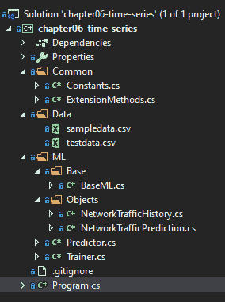
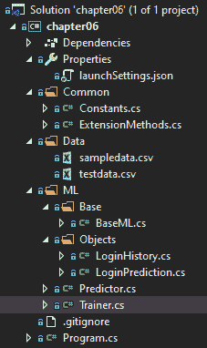
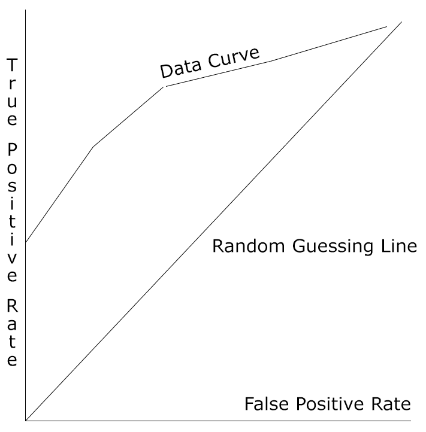

# 六、异常检测模型

随着 k-means 聚类模型的出现，现在是时候深入研究异常检测模型了。异常检测是 ML.NET 新增的功能之一，特别是时间序列变换。在本章中，我们将深入探讨异常检测以及最适合利用异常检测的各种应用。此外，我们将构建两个新的示例应用:一个异常检测应用用于确定登录尝试是否异常，演示随机 PCA 训练器，另一个用于演示网络流量异常检测应用中的时间序列。最后，我们将探索如何用 model 揭示的属性来评估异常检测模型。

在本章中，我们将讨论以下主题:

*   分解异常检测
*   创建时序应用
*   创建异常检测应用
*   评估异常检测模型


# 分解异常检测

正如在[第一章](b8d873e1-9234-4f11-ad94-76df5ffbb228.xhtml)、*机器学习入门和 ML.NET 中提到的，*异常检测，根据定义，是一种无监督的学习算法。这意味着该算法将对数据进行训练，并寻找不符合正常数据的数据。在这一节中，我们将深入探讨异常检测的用例，以及在 ML.NET 可用于异常检测的各种训练器。


# 异常检测的用例

正如您可能已经意识到的，异常检测有许多应用，其中数据是可用的，但是不知道数据中是否有异常。无需手动抽查，异常检测算法就可以对这些数据进行训练，并确定是否存在任何异常。ML.NET 提供了各种异常检测值，供您在应用内部以编程方式查看。我们将在本章的后面回顾这些值，以更好地确保任何检测都不是误报。

最适合异常检测的一些潜在应用包括:

*   销售预测
*   股票市场
*   欺诈检测
*   预测由于各种因素导致的设备故障
*   用于远程连接和网络流量登录历史的网络安全应用，例如我们稍后将深入探讨的示例应用


# 进入随机 PCA 训练器

在撰写本文时，随机 PCA 训练器是在 ML.NET 发现的唯一用于异常检测的传统训练器。随机化的 PCA 训练器要求值的标准化；但是，缓存不是必需的，使用训练器也不需要额外的 NuGet 包。

与其他算法类似，输入是一个已知大小的`Float`类型的向量。输出包含两个属性:`Score`和`PredictedLabel`。`Score`值属于`Float`类型，非负且无界。相反，`PredictedLabel`属性指示基于阈值集的有效异常；值为 true 表示异常，而值为 false 则表示异常。ML。NET 的默认阈值是 0.5，可以通过`ChangeModelThreshold`方法进行调整。实际上，高于阈值的值返回 true，低于阈值的值返回 false。

在遮光罩下，该算法使用特征向量来估计包含正常类的子空间，然后计算实际特征向量和该子空间中的投影特征向量之间的归一化差异。简而言之，如果计算误差不接近 0，则该算法找到边缘情况。如果发现误差接近于 0，则认为是正常数据点(即非异常)。

我们将在本章后面的第二个示例应用中通过检测登录异常来演示这个训练器。

如果你想更深入地研究随机化 PCA，下面的论文是一个很好的资源:[https://web . Stanford . edu/group/mmds/slides 2010/Martins son . pdf](https://web.stanford.edu/group/mmds/slides2010/Martinsson.pdf)。


# 深入研究时间序列转换

与本书中的其他算法和 ML.NET 本身不同，时间序列支持是作为一系列转换添加到您的训练和测试数据中的。如前所述，时间序列也是 ML.NET 的新增功能之一，是在 1.2.0 中添加的。

在 ML.NET，时序转换被归入`TimeSeriesCatalog`类。这个类中有六种不同的方法:

*   `DetectAnomalyBySrCnn`:用 SRCNN 算法检测异常
*   `DetectChangePointBySsa`:用**奇异谱分析** ( **SSA** )算法对变点进行异常检测
*   `DetectIidChangePoint`:检测变化，用**独立同分布**(**I . I . d .**)算法预测变化点
*   `DetectIidSpike`:用 i.i.d 算法检测变化，但预测尖峰而不是变化点
*   `DetectSpikeBySsa`:使用 SSA 算法检测尖峰
*   `ForecastBySsa`:使用 SSA 算法进行基于单一变量(通常称为单变量)的时间序列预测

根据应用的不同，您可能希望寻找数据变化的峰值或变化点(在上升或下降螺旋上)。在本章的时间序列示例中，我们将利用`DetectSpikeBySsa`来寻找网络传输中的峰值。

关于 SSA 预测的更多信息，可以在这里找到很好的资源:[http://arxiv.org/pdf/1206.6910.pdf](http://arxiv.org/pdf/1206.6910.pdf)。


# 创建时序应用

如前所述，我们将创建的应用是一个网络流量异常检测器。给定一组与网络流量(以字节为单位)相关的属性，应用将使用该数据来查找给定检查点的流量异常。与其他应用一样，这并不意味着支持下一个 ML 网络流量异常检测产品；然而，它将向您展示如何在 ML.NET 使用时间序列，特别是使用 SSA 来检测峰值。

和前面的章节一样，完整的项目代码、样本数据集和项目文件可以在这里下载:[https://github . com/packt publishing/Hands-On-Machine-Learning-With-ML。NET/tree/master/chapter 06-时序](https://github.com/PacktPublishing/Hands-On-Machine-Learning-With-ML.NET/tree/master/chapter06-time-series)。


# 探索项目架构

基于我们在前面章节中创建的项目架构和代码，大部分的变化都是在模型的训练中，因为时间序列需要一个相对于我们在前面章节中所回顾的相当重要的范式转换。除此之外，当使用时序转换时，如果您正在从头开始创建一个项目，您将需要添加`Microsoft.ML.TimeSeries` NuGet 包。GitHub 存储库中可用的示例应用已经包含了这个包。

在下面的屏幕截图中，您将找到该项目的 Visual Studio 解决方案资源管理器视图。该解决方案的新增内容是`NetworkTrafficHistory` 和`NetworkTrafficPrediction` 文件，我们将在本节稍后回顾这些文件:



`sampledata.csv`文件包含八行网络流量数据。请随意调整数据以适应您自己的观察或调整训练好的模型。以下是数据片段:

```
laptop,2019-11-14T11:13:23,1500
laptop,2019-11-15T11:13:23,1000
laptop,2019-11-16T11:13:23,1100
laptop,2019-11-17T11:13:23,1600
laptop,2019-11-18T11:13:23,1000
laptop,2019-11-19T11:13:23,1100
laptop,2019-11-20T11:13:23,1000
laptop,2019-11-21T11:13:23,1000
```

这些行中的每一行都包含了新创建的`NetworkTrafficHistory` 类中的属性值，我们将在本章后面的内容中进行回顾。

除此之外，我们还添加了`testdata.csv`文件，它包含额外的数据点来测试新训练的模型并对其进行评估。下面是`testdata.csv`中的一段数据:

```
laptop,2019-11-22T11:13:23,1000
laptop,2019-11-23T11:13:23,1100
laptop,2019-11-24T11:13:23,1200
laptop,2019-11-25T11:13:23,1300
laptop,2019-11-26T11:13:23,1400
laptop,2019-11-27T11:13:23,3000
laptop,2019-11-28T11:13:23,1500
laptop,2019-11-29T11:13:23,1600
```


# 钻研代码

对于这个应用，如前一节所述，我们在第五章、*中完成的工作基础上构建集群模型*。在这次深入探讨中，我们将只关注针对该应用更改的代码。

更改或添加的类如下:

*   `NetworkTrafficHistory`
*   `NetworkTrafficPrediction`
*   `Predictor`
*   `Trainer`
*   `Program`


# NetworkTrafficHistory 类

`NetworkTrafficHistory` 类是容器类，包含预测和训练我们模型的数据。如前几章所述，`LoadColumn`装饰器中的数字映射到 CSV 文件中的索引。如前所述，ML.NET 的异常检测需要使用单个浮点值；在这种情况下，它是`BytesTransferred`的财产:

```
using System;

using Microsoft.ML.Data;

namespace chapter06.ML.Objects
{
    public class NetworkTrafficHistory
    {
        [LoadColumn(0)]
        public string HostMachine { get; set; }

        [LoadColumn(1)]
        public DateTime Timestamp { get; set; }

        [LoadColumn(2)] 
        public float BytesTransferred { get; set; }
    }
}
```


# 网络流量预测类

`NetworkTrafficPrediction` 类包含映射到我们的预测输出的属性。`VectorType(3)`函数保存警报、分数和 p 值。我们将在本节的后面部分回顾这些值:

```
using Microsoft.ML.Data;

namespace chapter06.ML.Objects
{
    public class NetworkTrafficPrediction
    {
        [VectorType(3)]
        public double[] Prediction { get; set; }
    }
}
```


# 预测器类

为了处理网络流量预测场景，需要对此类进行一些更改:

1.  首先，我们用`NetworkTrafficHistory` 和`NetworkHistoryPrediction`类型创建我们的预测引擎:

```
var predictionEngine = MlContext.Model.CreatePredictionEngine<NetworkTrafficHistory, NetworkTrafficPrediction>(mlModel);
```

2.  接下来，我们将输入文件读入一个`IDataView`变量(注意使用逗号作为`separatorChar`)中:

```
var inputData = MlContext.Data.LoadFromTextFile<NetworkTrafficHistory>(inputDataFile, separatorChar: ',');
```

3.  接下来，我们获取新创建的`IDataView`变量，并基于该数据视图获得一个可枚举变量:

```
var rows = MlContext.Data.CreateEnumerable<NetworkTrafficHistory>(inputData, false);
```

4.  最后，我们需要运行预测，然后输出模型运行的结果:

```
Console.WriteLine($"Based on input file ({inputDataFile}):");

foreach (var row in rows)
{
    var prediction = predictionEngine.Predict(row);

    Console.Write($"HOST: {row.HostMachine} TIMESTAMP: {row.Timestamp} TRANSFER: {row.BytesTransferred} ");
    Console.Write($"ALERT: {prediction.Prediction[0]} SCORE: {prediction.Prediction[1]:f2} P-VALUE: {prediction.Prediction[2]:F2}{Environment.NewLine}");
}
```

在`Transform`只返回三元素向量的情况下，输出原始行数据以给出上下文。


# 训练师课程

在`Trainer`类中，需要进行一些修改来支持时序转换。在许多方面，简化是必要的。执行评估和测试数据负载的移除:

1.  第一个加法是发送到转换的四个变量:

```
private const int PvalueHistoryLength = 3;
private const int SeasonalityWindowSize = 3;
private const int TrainingWindowSize = 7;
private const int Confidence = 98;
```

由于撰写本文时 ML.NET 库中的限制，训练窗口大小必须大于 p 值历史长度的两倍。

2.  然后，我们从 CSV 训练文件构建`DataView`对象:

```
var trainingDataView = GetDataView(trainingFileName);
```

3.  然后，我们可以创建 SSA 尖峰检测:

```
var trainingPipeLine = MlContext.Transforms.DetectSpikeBySsa(
    nameof(NetworkTrafficPrediction.Prediction),
    nameof(NetworkTrafficHistory.BytesTransferred),
    confidence: Confidence,
    pvalueHistoryLength: PvalueHistoryLength,
    trainingWindowSize: TrainingWindowSize,
    seasonalityWindowSize: SeasonalityWindowSize);
```

4.  现在，我们根据训练数据拟合模型并保存模型:

```
ITransformer trainedModel = trainingPipeLine.Fit(trainingDataView);

MlContext.Model.Save(trainedModel, trainingDataView.Schema, ModelPath);

Console.WriteLine("Model trained");
```


# 程序类

鉴于训练只需要训练数据，必须对`Program`类进行一些修改:

1.  帮助文本需要更新以反映新的用法:

```
if (args.Length < 2)
{
    Console.WriteLine($"Invalid arguments passed in, exiting.{Environment.NewLine}{Environment.NewLine}Usage:{Environment.NewLine}" +
                      $"predict <path to input file>{Environment.NewLine}" +
                      $"or {Environment.NewLine}" +
                      $"train <path to training data file>{Environment.NewLine}");

    return;
}
```

2.  此外，需要更新 switch case 语句，以反映为预测传递的单个参数:

```
switch (args[0])
{
    case "predict":
        new Predictor().Predict(args[1]);
        break;
    case "train":
        new Trainer().Train(args[1]);
        break;
    default:
        Console.WriteLine($"{args[0]} is an invalid option");
        break;
}
```


# 运行应用

为了运行应用，我们使用的过程与第三章、*回归模型*的示例应用几乎相同:

1.  准备好数据后，我们必须通过传入新创建的`sampledata.csv`文件来训练模型:

```
PS chapter06-time-series\bin\Debug\netcoreapp3.0> .\chapter06-time-series.exe train ..\..\..\Data\sampledata.csv
Model trained
```

2.  要使用这个文件运行模型，只需将前面提到的`testdata.csv`文件传递到新构建的应用中，预测的输出将显示如下:

```
PS bin\debug\netcoreapp3.0> .\chapter06-time-series.exe predict ..\..\..\Data\testdata.csv
Based on input file (..\..\..\Data\testdata.csv):
HOST: laptop TIMESTAMP: 11/22/2019 11:13:23 AM TRANSFER: 1000 ALERT: 0 SCORE: 46.07 P-VALUE: 0.50
HOST: laptop TIMESTAMP: 11/23/2019 11:13:23 AM TRANSFER: 1100 ALERT: 0 SCORE: 131.36 P-VALUE: 0.00
HOST: laptop TIMESTAMP: 11/24/2019 11:13:23 AM TRANSFER: 1200 ALERT: 0 SCORE: 180.44 P-VALUE: 0.06
HOST: laptop TIMESTAMP: 11/25/2019 11:13:23 AM TRANSFER: 1300 ALERT: 0 SCORE: 195.42 P-VALUE: 0.17
HOST: laptop TIMESTAMP: 11/26/2019 11:13:23 AM TRANSFER: 1400 ALERT: 0 SCORE: 201.15 P-VALUE: 0.22
HOST: laptop TIMESTAMP: 11/27/2019 11:13:23 AM TRANSFER: 3000 ALERT: 1 SCORE: 1365.42 P-VALUE: 0.00
HOST: laptop TIMESTAMP: 11/28/2019 11:13:23 AM TRANSFER: 1500 ALERT: 0 SCORE: -324.58 P-VALUE: 0.11
HOST: laptop TIMESTAMP: 11/29/2019 11:13:23 AM TRANSFER: 1600 ALERT: 0 SCORE: -312.93 P-VALUE: 0.25
```

输出包括三个数据点:`HOST`、`TIMESTAMP`和`TRANSFER`。新增加的是`ALERT`、`SCORE`和`P-VALUE`。非零值表示异常。`SCORE`是异常分数的数值表示；较高的值表示峰值。`P-VALUE`，0-1 之间的值，是当前点到平均点的距离。接近或等于 0 的值是尖峰的另一个指示。在评估您的模型和功效时，结合使用这三个数据点，您可以保证获得真实的峰值，从而有效减少潜在的假阳性计数。

您可以随意修改这些值，并根据模型所基于的数据集来研究预测如何变化。从这一点来看，一些实验领域可能如下:

*   添加更具体的数据点，如 IP 地址
*   向训练和测试数据添加多样化和更多的数据点


# 创建异常检测应用

如前所述，我们将创建的应用是一个登录异常检测器。给定一组与登录相关的属性，应用将使用这些数据来发现异常情况，比如异常的登录时间。与其他应用一样，这并不意味着支持下一个 ML 登录异常检测产品；但是，它将向您展示如何在 ML.NET 使用异常检测。

和前面的章节一样，完整的项目代码、样本数据集和项目文件可以在这里下载:[https://github . com/packt publishing/Hands-On-Machine-Learning-With-ML。网/树/主/第 06 章](https://github.com/PacktPublishing/Hands-On-Machine-Learning-With-ML.NET/tree/master/chapter06)。


# 探索项目架构

基于我们在前几章中创建的项目架构和代码，本例中的大部分更改都是在模型的训练中。

在下面的屏幕截图中，您将找到该项目的 Visual Studio 解决方案资源管理器视图。该解决方案的新增内容是`LoginHistory` 和`LoginPrediction`文件，我们将在本节的后面查看:



`sampledata.csv`文件包含 10 行登录数据。请随意调整数据以适应您自己的观察或调整训练好的模型。以下是数据片段:

```
0,1,0,1,1,0
0,1,0,1,1,0
0,0,1,0,1,0
0,0,1,0,1,0
0,0,1,1,0,1
1,1,0,1,1,0
1,1,0,1,1,0
1,0,1,0,1,0
1,0,1,0,1,1
1,0,1,1,0,0
```

这些行中的每一行都包含新创建的`LoginHistory`类中的属性值，我们将在本章的后面回顾这些值。

除此之外，我们还添加了`testdata.csv`文件，它包含额外的数据点来测试新训练的模型并对其进行评估。下面是`testdata.csv`中的一段数据:

```
0,1,0,1,1,0
0,1,0,1,1,0
0,0,1,0,1,0
0,0,1,0,1,0
0,0,1,1,0,1
1,1,0,1,1,0
1,1,0,1,1,0
1,0,1,0,1,0
1,0,1,0,1,1
1,0,1,1,0,0
```


# 钻研代码

对于这个应用，如前一节所述，我们在第五章、*中完成的工作基础上构建集群模型*。在这次深入探讨中，我们将只关注针对该应用更改的代码。

更改或添加的类如下:

*   `Constants`
*   `LoginHistory`
*   `LoginPrediction`
*   `Predictor`
*   `Trainer`


# 常量类

已经更改了`Constants`类，以便将模型保存到`chapter6.mdl`。以下代码块反映了这些更改:

```
namespace chapter06.Common
{
    public class Constants
    {
        public const string MODEL_FILENAME = "chapter6.mdl";

        public const string SAMPLE_DATA = "sampledata.csv";

        public const string TEST_DATA = "testdata.csv";
    }
}
```


# LoginHistory 类

`LoginHistory` 类是容器类，包含预测和训练我们模型的数据。如前几章所述，`LoadColumn`装饰器中的数字映射到 CSV 文件中的索引。每个属性映射到一个值，该值将被发送到模型中进行异常检测:

```
using Microsoft.ML.Data;

namespace chapter06.ML.Objects
{
    public class LoginHistory
    {
        [LoadColumn(0)]
        public float UserID { get; set; }

        [LoadColumn(1)]
        public float CorporateNetwork { get; set; }

        [LoadColumn(2)] 
        public float HomeNetwork { get; set; }

        [LoadColumn(3)] 
        public float WithinWorkHours { get; set; }

        [LoadColumn(4)] 
        public float WorkDay { get; set; }

        [LoadColumn(5)] 
        public float Label { get; set; }
    }
}
```


# LoginPrediction 类

`LoginPrediction` 类包含映射到我们预测输出的属性。下面的`PredictedLabel`属性将保存我们的预测，而`Label`和`Score`属性用于评估:

```
namespace chapter06.ML.Objects
{
    public class LoginPrediction
    {
        public float Label;

        public float Score;

        public bool PredictedLabel;
    }
}
```


# 预测器类

为了处理`Login`异常检测场景，需要对此类进行一些更改:

1.  首先，我们用`LoginHistory` 和`LoginPrediction`类型创建我们的预测引擎:

```
var predictionEngine = MlContext.Model.CreatePredictionEngine<LoginHistory, LoginPrediction>(mlModel);     
```

2.  接下来，我们将输入文件读入一个字符串变量:

```
var json = File.ReadAllText(inputDataFile);
```

3.  最后，我们运行预测，然后输出模型运行的结果:

```
var prediction = predictionEngine.Predict(JsonConvert.DeserializeObject<LoginHistory>(json));

Console.WriteLine(
                    $"Based on input json:{System.Environment.NewLine}" +
                    $"{json}{System.Environment.NewLine}" + 
                    $"The login history is {(prediction.PredictedLabel ? "abnormal" : "normal")}, with a {prediction.Score:F2} outlier score");
```


# 训练师课程

在`Trainer`类中，需要使用随机 PCA 训练器进行一些修改以支持异常检测分类:

1.  第一个变化是添加了一个`GetDataView`助手方法，该方法从之前在`LoginHistory`类中定义的列构建`IDataView`数据视图:

```
private (IDataView DataView, IEstimator<ITransformer> Transformer) GetDataView(string fileName, bool training = true)
{
    var trainingDataView = MlContext.Data.LoadFromTextFile<LoginHistory>(fileName, ',');

    if (!training)
    {
        return (trainingDataView, null);
    }

    IEstimator<ITransformer> dataProcessPipeline = MlContext.Transforms.Concatenate(
        FEATURES, 
        typeof(LoginHistory).ToPropertyList<LoginHistory>(nameof(LoginHistory.Label)));

    return (trainingDataView, dataProcessPipeline);
}
```

2.  然后我们构建训练数据视图和`RandomizedPcaTrainer.Options`对象:

```
var trainingDataView = GetDataView(trainingFileName);

var options = new RandomizedPcaTrainer.Options
{
    FeatureColumnName = FEATURES,
    ExampleWeightColumnName = null,
    Rank = 5,
    Oversampling = 20,
    EnsureZeroMean = true,
    Seed = 1
};

```

请注意，`Rank`属性必须等于或小于特性。

3.  然后，我们可以创建随机 PCA 训练器，将其附加到训练数据视图，拟合我们的模型，然后保存它:

```
IEstimator<ITransformer> trainer = MlContext.AnomalyDetection.Trainers.RandomizedPca(options: options);

EstimatorChain<ITransformer> trainingPipeline = trainingDataView.Transformer.Append(trainer);

TransformerChain<ITransformer> trainedModel = trainingPipeline.Fit(trainingDataView.DataView);

MlContext.Model.Save(trainedModel, trainingDataView.DataView.Schema, ModelPath);
```

4.  现在，我们使用测试数据集评估刚刚训练的模型:

```
var testingDataView = GetDataView(testingFileName, true);

var testSetTransform = trainedModel.Transform(testingDataView.DataView);

var modelMetrics = MlContext.AnomalyDetection.Evaluate(testSetTransform);
```

5.  最后，我们输出所有的分类指标。这些都将在下一节中详细介绍:

```
Console.WriteLine($"Area Under Curve: {modelMetrics.AreaUnderRocCurve:P2}{Environment.NewLine}" +
                  $"Detection at FP Count: {modelMetrics.DetectionRateAtFalsePositiveCount}");
```


# 运行应用

为了运行应用，我们使用的过程与第三章、*回归模型*的示例应用几乎相同，只是在训练时传递了测试数据集:

1.  提取数据后，我们必须通过传入新创建的`sampledata.csv`和`testdata.csv`文件来训练模型:

```
PS chapter06\bin\Debug\netcoreapp3.0> .\chapter06.exe train ..\..\..\Data\sampledata.csv ..\..\..\Data\testdata.csv 
Area Under Curve: 78.12%
Detection at FP Count: 1
```

2.  要使用这个文件运行模型，只需传入一个构造好的 JSON 文件(在本例中为`input.json`),预测的输出将显示:

```
PS chapter06\bin\Debug\netcoreapp3.0> .\chapter06.exe predict input.json 
Based on input json:
{
 "UserID": 0, "CorporateNetwork": 1, "HomeNetwork": 0, "WithinWorkHours": 1, "WorkDay": 1
}
The login history is normal, with a 0% score
```

请注意，模型训练的扩展输出包括两个度量数据点。我们将在本章末尾讨论每一项的含义。

您可以随意修改这些值，并根据模型所基于的数据集来研究预测如何变化。从这一点来看，一些实验领域可能包括以下内容:

*   添加一些附加属性以提高生产场景中的预测准确性，例如登录发生在一天中的哪个小时
*   增加训练和测试数据的多样性


# 评估随机 PCA 模型

如前几章所述，评估模型是整个模型构建过程的关键部分。训练不足的模型只会提供不准确的预测。幸运的是，ML.NET 提供了许多流行的属性来计算模型的准确性，这些属性基于训练时的测试集，让您了解您的模型在生产环境中的表现。

如示例应用所述，在 ML.NET 中，有两个属性组成了`AnomalyDetectionMetrics` 类对象。让我们深入到`AnomalyDetectionMetrics` 对象中暴露的属性:

*   ROC 曲线下面积
*   假阳性计数的检测率

在接下来的部分中，我们将分解这些值是如何计算的，以及要寻找的理想值。


# ROC 曲线下面积

ROC 曲线下面积[第三章](8bcfc000-9adc-4eda-a91a-e09f676eac85.xhtml)、*回归模型*中提到的 ROC 曲线下面积，顾名思义就是**受试者工作特性** ( **ROC** )曲线下的面积。可能会想到的一个问题是:这与评估异常检测模型有什么关系？

这个计算出的面积等于算法(在我们的例子中，随机化 PCA)对正例的得分高于负例的概率，两者都是随机选择的，以更好地评估数据。返回的接近 100%的数字是理想值，而如果接近 0%，您很可能会有严重的误报。您可能还记得我们之前的示例应用获得了 78%的收益。这意味着有 22%的机会出现假阳性；下面列出了一些改进模型的建议，应该可以减少这个数字。

下图直观地反映了随机猜测线和任意数据曲线。随机猜测线之间的数据曲线下的面积是 ROC 曲线数据指标下的面积:




# 假阳性计数的检测率

误报计数属性的检测率为 *K* 误报的检测率。异常检测场景中的误报是将数据点视为异常，而实际上它不是。该比率的计算方法如下:

*K 个误报的检出率= X / Y*

这里， *X* 被计算为基于先前在异常检测示例中描述的分数的顶部测试样本(以降序排序)。这些被认为是最高真阳性(也就是说，更有可能是实际异常)。

*Y* 计算为测试数据中异常的总数，不考虑分值(不过滤到看起来可疑或不可疑的点)。理论上，如果训练数据中的误报数量很高，这个数字可能会很高。当您使用随机化 PCA 构建生产模型时，请确保您的数据尽可能接近生产，以避免过拟合或欠拟合异常。


# 摘要

在本章中，我们讨论了 ML。NET 的异常检测支持通过随机 PCA 算法。我们还使用随机 PCA 算法创建并训练了第一个异常检测应用，以预测异常登录。除此之外，我们还创建了一个时序应用，查看网络流量并发现传输数据量的峰值。最后，我们还研究了如何评估异常检测模型，以及 ML.NET 公开的各种属性，以实现对异常检测模型的正确评估。

在下一章中，我们将深入研究用 ML.NET 矩阵分解来创建音乐偏好预测器。