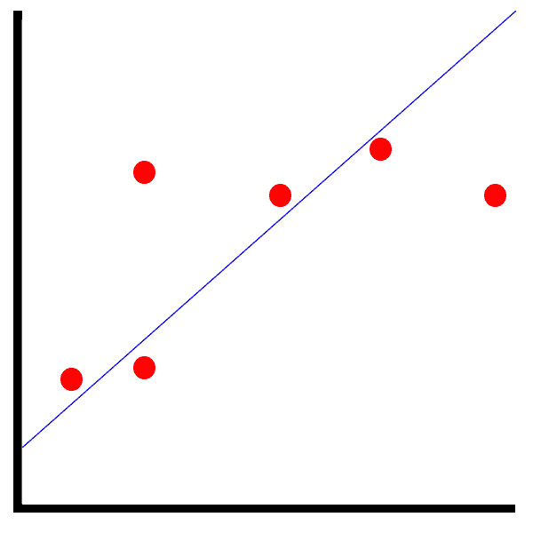
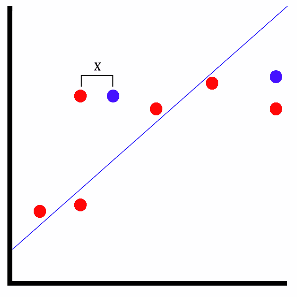

# 九、矩阵分解模型

异常检测模型已经过去，现在是时候深入研究矩阵分解模型了。矩阵因式分解是 ML.NET 的一个较新的补充，有一个同名的变换。在本章中，我们将深入探讨矩阵分解，以及最适合利用矩阵分解的各种应用。此外，我们将构建一个新的示例应用，根据示例训练数据来预测音乐推荐。最后，我们将探索如何用 model 揭示的性质来评估矩阵分解模型。

在本章中，我们将讨论以下主题:

*   分解矩阵分解
*   创建矩阵分解应用
*   评估矩阵分解模型


# 分解矩阵分解

正如在[第一章](b8d873e1-9234-4f11-ad94-76df5ffbb228.xhtml)、*机器学习入门和 ML.NET*中提到的，矩阵分解，根据定义，是一种无监督的学习算法。这意味着该算法将对数据进行训练，并建立用户评级的模式矩阵，在预测呼叫期间，将尝试根据提供的数据找到类似的评级。在这一部分，我们将深入矩阵分解的用例，并看看 ML.NET 的矩阵分解训练器。


# 矩阵分解的用例

正如您可能开始意识到的那样，矩阵分解在数据可用的情况下有许多应用，但其思想是基于以前未选择的数据来建议其他匹配。无需进行手动抽查，矩阵分解算法就可以对这些未选择的数据进行训练，并使用键值对组合来确定模式。ML.NET 提供了各种矩阵分解值，以便在应用内部以编程方式查看。我们将在本章的后面回顾这些值，以更好地确保建议不是误报。

最适合矩阵分解的一些潜在应用有:

*   音乐推荐
*   产品推荐
*   电影推荐
*   书籍推荐

实际上，任何数据可以追溯到单个用户，然后随着更多数据的输入而构建的东西都可以利用矩阵分解。这个问题叫做**冷启动**T2 问题。举个例子，一个新的音乐平台可以帮助你找到新的乐队来听。当您第一次到达该站点并创建一个配置文件时，没有可用的先前数据。作为最终用户，你必须告诉系统你喜欢什么，不喜欢什么。由于算法的性质，矩阵分解比我们在前面章节中探讨的直接回归或二进制分类算法更适合这种应用。


# 深入矩阵分解训练器

在撰写本文时，矩阵分解训练器是 ML.NET 唯一的传统训练器。矩阵分解训练器需要值的规范化和缓存。此外，要在 NuGet 中利用矩阵分解，如果您是从零开始创建项目，则需要`Microsoft.ML.Recommender` NuGet 包。GitHub 资源库中包含的示例包括这个包。

与其他算法类似，需要归一化，但矩阵分解是唯一的。其他算法，如我们在二进制分类或回归算法中看到的，有多个可以标准化的值。在矩阵分解中，只涉及到三个值:`Label`、`Row`、`Column`值。输出由两个属性组成:`Score` 和`Label`。`Score`值属于`Float`类型，非负且无界。

需要注意的是，在 2018 年 7 月的 ML.NET 0.3 更新中，添加了场感知因子分解机器。然而，这种类型的训练器只提供二进制建议(如喜欢或不喜欢)，而不是矩阵分解，它支持任何范围的浮点值。这在使用上提供了更好的灵活性，比如获得更精细的预测。例如，如果从 0 到 100 范围内的矩阵分解推荐返回 30，推荐引擎很可能会返回一个负面推荐。对于简单的二进制响应，应用(以及最终用户)无论如何都不会看到推荐有多强。

在下一节中，我们将通过提供音乐推荐在示例应用中演示这个训练器。


# 创建矩阵分解应用

如前所述，我们将要创建的应用是用于音乐预测的。给定一个 UserID、MusicID 和一个等级，该算法将使用这些数据来创建推荐。与其他应用一样，这并不意味着为下一个 Spotifyesque 机器学习产品提供动力；然而，它将告诉你如何在 ML.NET 使用矩阵分解。

和前面的章节一样，完整的项目代码、样本数据集和项目文件可以在这里下载:[https://github . com/packt publishing/Hands-On-Machine-Learning-With-ML。网/树/主/第 07 章](https://github.com/PacktPublishing/Hands-On-Machine-Learning-With-ML.NET/tree/master/chapter07)。


# 探索项目架构

基于我们在前几章中创建的项目架构和代码，大部分的更改都是在模型的训练中，因为矩阵分解需要从我们在前几章中回顾的内容进行相当大的范式转换。

在下面的屏幕截图中，您将找到该项目的 Visual Studio 解决方案资源管理器视图。该解决方案的新增内容是`MusicRating` 和`MusicPrediction` 文件，我们将在本节后面的内容中回顾这些文件:


`sampledata.csv`文件包含 10 行随机音乐评级。请随意调整数据以适应您自己的观察，或者调整训练好的模型。以下是数据片段:

```
1,1000,4
1,1001,3.5
1,1002,1
1,1003,2
2,1000,1.5
2,1001,2
2,1002,4
2,1003,4
3,1000,1
3,1001,3
```

这些行中的每一行都包含了新创建的`MusicRating` 类中的属性值，我们将在本章后面的内容中进行回顾。

除此之外，我们还添加了包含额外数据点的`testdata.csv`文件，用于测试和评估新训练的模型。下面是`testdata.csv`中的一段数据:

```
1,1000,4
1,1001,3.5
2,1002,1
2,1003,2
3,1000,1.5
3,1001,2
4,1002,4
4,1003,4
```


# 钻研代码

对于这个应用，如前一节所述，我们在第 6 章、*中完成的工作基础上构建异常检测模型*。在这次深入探讨中，我们将只关注针对该应用更改的代码。

更改或添加的类如下:

*   `MusicRating`
*   `MusicPrediction`
*   `Predictor`
*   `Trainer`
*   `Constants`


# 音乐评级课

`MusicRating` 类是容器类，包含预测和训练我们模型的数据。如前几章所述，`LoadColumn`装饰器中的数字映射到 CSV 文件中的索引。如前所述，ML.NET 的矩阵分解需要使用规范化，如下面的代码块所示:

```
using Microsoft.ML.Data;

namespace chapter07.ML.Objects
{
    public class MusicRating
    {
        [LoadColumn(0)]
        public float UserID { get; set; }

        [LoadColumn(1)]
        public float MovieID { get; set; }

        [LoadColumn(2)]
        public float Label { get; set; }
    }
}
```


# 音乐预测课程

`MusicPrediction` 类包含映射到我们的预测输出的属性。`Score`包含预测准确的可能性。我们将在本节的稍后部分回顾这些值，但是现在，它们可以在下面的代码块中看到:

```
namespace chapter07.ML.Objects
{
    public class MusicPrediction
    {
        public float Label { get; set; }

        public float Score { get; set; }
    }
}
```


# 预测器类

为了处理音乐预测的情况，这个类中有一些变化，如下所示:

1.  首先，我们用`MusicRating` 和`MusicPrediction`类型创建预测引擎，如下所示:

```
var predictionEngine = MlContext.Model.CreatePredictionEngine<MusicRating, MusicPrediction>(mlModel);
```

2.  接下来，我们将输入文件读入一个字符串对象，如下所示:

```
var json = File.ReadAllText(inputDataFile);
```

3.接下来，我们将字符串反序列化为类型为`MusicRating`的对象，如下所示:

```
var rating = JsonConvert.DeserializeObject<MusicRating>(json);
```

4.  最后，我们需要运行预测，然后输出模型运行的结果，如下所示:

```
var prediction = predictionEngine.Predict(rating);

Console.WriteLine(
    $"Based on input:{System.Environment.NewLine}" +
    $"Label: {rating.Label} | MusicID: {rating.MusicID} | UserID: {rating.UserID}{System.Environment.NewLine}" +
    $"The music is {(prediction.Score > Constants.SCORE_THRESHOLD ? "recommended" : "not recommended")}");
```

由于转换只返回三元素向量，因此输出原始行数据以给出上下文。


# 训练师课程

在`Trainer`类中，需要做一些修改来支持矩阵分解。在许多方面，由于只有三个输入的性质，需要进行简化:

1.  第一项是变量编码的两个常量变量，如下面的代码块所示:

```
private const string UserIDEncoding = "UserIDEncoding";
private const string MovieIDEncoding = "MovieIDEncoding";
```

2.  然后我们构建`MatrixFactorizationTrainer`选项。`Row`和`Column`属性被设置为先前定义的列名。`Quiet`标志显示每次迭代的附加模型构建信息，如下面的代码块所示:

```
var options = new MatrixFactorizationTrainer.Options
{
    MatrixColumnIndexColumnName = UserIDEncoding,
    MatrixRowIndexColumnName = MovieIDEncoding,
    LabelColumnName = "Label",
    NumberOfIterations = 20,
    ApproximationRank = 10,
    Quiet = false
};
```

3.  然后，我们可以创建矩阵分解训练器，如下所示:

```
var trainingPipeline = trainingDataView.Transformer.Append(MlContext.Recommendation().Trainers.MatrixFactorization(options));
```

4.  现在，我们根据训练数据拟合模型并保存模型，如下所示:

```
ITransformer trainedModel = trainingPipeLine.Fit(trainingDataView.DataView);

MlContext.Model.Save(trainedModel, trainingDataView.DataView.Schema, ModelPath);

Console.WriteLine($"Model saved to {ModelPath}{Environment.NewLine}");
```

5.  最后，我们加载测试数据，并将数据传递给矩阵分解计算器，如下所示:

```
var testingDataView = GetDataView(testingFileName, true);

var testSetTransform = trainedModel.Transform(testingDataView.DataView);

var modelMetrics = MlContext.Recommendation().Evaluate(testSetTransform);

Console.WriteLine($"matrix factorization Evaluation:{Environment.NewLine}{Environment.NewLine}" +
                  $"Loss Function: {modelMetrics.LossFunction}{Environment.NewLine}" +
                  $"Mean Absolute Error: {modelMetrics.MeanAbsoluteError}{Environment.NewLine}" +
                  $"Mean Squared Error: {modelMetrics.MeanSquaredError}{Environment.NewLine}" +
                  $"R Squared: {modelMetrics.RSquared}{Environment.NewLine}" +
                  $"Root Mean Squared Error: {modelMetrics.RootMeanSquaredError}");
```


# 常量类

此外，鉴于训练只需要训练数据，需要对`Program`类进行一些修改，如下所示:

```
namespace chapter07.Common
{
    public class Constants
    {
        public const string MODEL_FILENAME = "chapter7.mdl";

        public const float SCORE_THRESHOLD = 3.0f;
    }
}
```


# 运行应用

要运行该应用，过程与第 6 章的示例应用几乎相同，如下所示:

1.  准备好数据后，我们必须通过传入新创建的`sampledata.csv`文件来训练模型，如下所示:

```
PS Debug\netcoreapp3.0> .\chapter07.exe train ..\..\..\Data\sampledata.csv ..\..\..\Data\testdata.csv
iter tr_rmse obj
   0 2.4172 9.6129e+01
   1 1.9634 6.6078e+01
   2 1.5140 4.2233e+01
   3 1.3417 3.5027e+01
   4 1.2860 3.2934e+01
   5 1.1818 2.9107e+01
   6 1.1414 2.7737e+01
   7 1.0669 2.4966e+01
   8 0.9819 2.2615e+01
   9 0.9055 2.0387e+01
  10 0.8656 1.9472e+01
  11 0.7534 1.6725e+01
  12 0.6862 1.5413e+01
  13 0.6240 1.4311e+01
  14 0.5621 1.3231e+01
  15 0.5241 1.2795e+01
  16 0.4863 1.2281e+01
  17 0.4571 1.1938e+01
```

```
  18 0.4209 1.1532e+01
  19 0.3975 1.1227e+01

Model saved to Debug\netcoreapp3.0\chapter7.mdl
```

2.  要使用这个文件运行模型，只需将前面提到的`testdata.csv`文件传递到新构建的应用中，预测的输出将显示如下:

```
matrix factorization Evaluation:

Loss Function: 0.140
Mean Absolute Error: 0.279
Mean Squared Error: 0.140
R Squared: 0.922
Root Mean Squared Error: 0.375
```

在运行预测之前，在记事本中用以下文本创建一个 JSON 文件:

```
{ "UserID": 10, "MusicID": 4, "Label": 3 }
```

然后将文件保存到输出文件夹中。

3.  然后，运行预测，就像这样:

```
PS Debug\netcoreapp3.0> .\chapter07.exe predict input.json
Based on input:
Label: 3 | MusicID: 4 | UserID: 10
The music is not recommended
```

您可以随意修改这些值，并查看预测如何基于模型所基于的数据集而发生变化。从这一点来看，一些实验领域可能是:

*   改变`Trainer`级深潜中提到的超参数。
*   向训练和测试数据添加多样化和更多的数据点。


# 评估矩阵分解模型

如前几章所述，评估模型是整个模型构建过程的关键部分。训练不足的模型只会提供不准确的预测。幸运的是，ML.NET 提供了许多流行的属性来根据训练时的测试集计算模型准确性，让您了解模型在生产环境中的表现。

正如前面在示例应用中提到的，对于 model 的矩阵分解模型评估，有五个属性组成了`RegressionMetrics` 类对象。让我们在这里深入探讨一下`RegressionMetrics` 对象中暴露的属性:

*   损失函数
*   **均方误差** ( **MSE** )
*   **平均绝对误差** ( **MAE** )
*   r 平方
*   **均方根误差** ( **RMSE** )

在接下来的部分中，我们将分解这些值是如何计算的，并详细说明要寻找的理想值。


# 损失函数

该属性使用初始化矩阵分解训练器时设置的损失函数。在我们的矩阵分解示例应用中，我们使用了默认的构造函数，它默认为`SquaredLossRegression`类。

ML.NET 提供的其他回归损失函数有:

*   平方损失一类
*   平方损失回归

与使用固定算法进行评估的其他四个属性相比，此属性背后的想法是在评估模型时允许一定的灵活性。


# 均方误差(mean square error)

MSE 定义为误差平方平均值的度量。简单来说，以下面的截图为例:



点与我们模型的数据点相关，而蓝线是预测线。红点和预测线之间的距离就是误差。对于 MSE，该值是基于这些点及其到线的距离计算的。根据该值，计算平均值。对于 MSE，值越小，拟合越好，模型的预测就越准确。

当异常值对预测输出至关重要时，MSE 最适合用于评估模型。


# 平均绝对误差

MAE 类似于 MSE，关键区别在于它对点和预测线之间的距离求和，而不是计算平均值。应该注意，MAE 在计算总和时不考虑方向。例如，如果你有两个数据点与直线的距离相等，一个在上面，另一个在下面，实际上这可以用一个正值和负值来平衡。在机器学习中，这被称为**平均偏差误差** ( **MBE** )。然而，在撰写本文时，ML.NET 并没有将此作为`RegressionMetrics`类的一部分提供。

当异常值被认为是简单的异常时，MAE 最适合用于评估模型，并且在评估模型的性能时不应该将其计算在内。


# r 平方

r 平方，也称为**决定系数**，是另一种表示预测与测试集相比有多好的方法。r 平方的计算方法是:取每个预测值与其对应的实际值之间的差值，对该差值求平方，然后对每对点的平方求和。

r 平方值通常介于 0 和 1 之间，表示为浮点值。当拟合模型被评估为比平均拟合差时，可能出现负值。但是，数字低并不总是反映模型不好。基于预测人类行为的预测，比如我们在本章中看到的，经常被发现低于 50%。

相反，较高的值不一定是模型性能的确定标志，因为这可能被认为是模型的过拟合。这种情况发生在当有许多特性被提供给模型时，从而使模型比我们在[第 2 章](b8decd34-4bcb-4b1b-80d2-b2bfd0fa31c1.xhtml)、*建立 ML.NET 环境*的*创建您的第一个 ML.NET 应用*部分中构建的模型更复杂，因为在训练和测试集中没有足够的多样性。例如，如果所有雇员的值大致相同，然后测试集维持由相同范围的值组成，这将被视为过拟合。


# 均方根误差

鉴于前面的方法，RMSE 可以说是最容易理解的属性。以下面截图所示的情节为例:



在测试模型的情况下，正如我们之前对维持集所做的那样，红点是测试集中的实际值，而蓝点是预测值。描绘的 X 是预测值和实际值之间的距离。RMSE 只是取所有这些距离的平均值，平方这个值，然后求平方根。

低于 180 的值通常被认为是好的模型。


# 摘要

在本章的过程中，我们深入研究了 ML。NET 的矩阵分解支持。我们还创建并训练了第一个矩阵分解应用来预测音乐推荐。最后，我们还深入探讨了如何评估矩阵分解模型，并研究了 ML.NET 揭示的各种属性，以实现对矩阵分解模型的正确评估。

随着本章接近尾声，我们也完成了对 close 提供的各种模型的初步调查。在下一章中，我们将基于前几章积累的知识创建完整的应用，第一章是完整的。NET 核心应用提供股票预测。