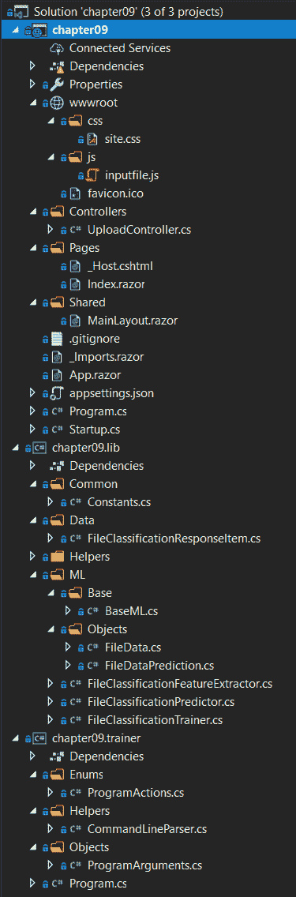
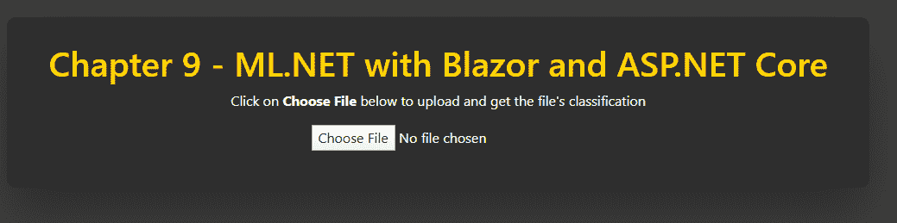
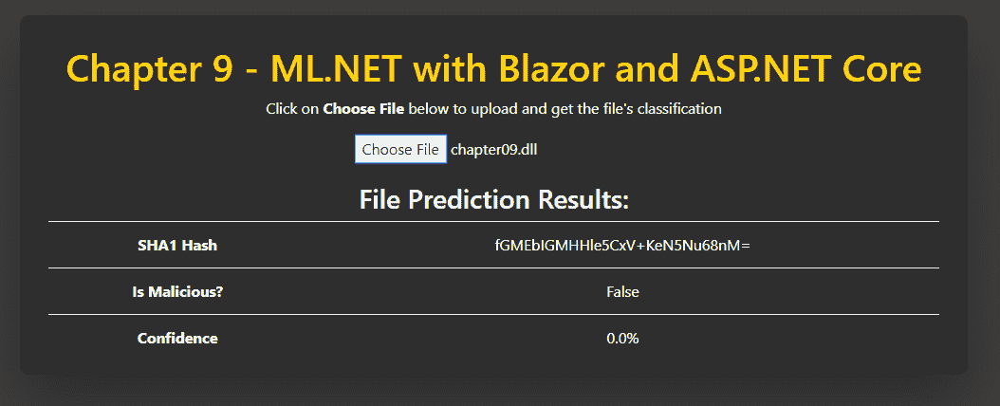

# 九、ML.NET 和 ASP.NET 核心

既然我们已经有了如何创建生产级的想法。NET 核心控制台应用，在这一章中，我们将深入到创建一个功能齐全的 ASP.NET 核心 Blazor web 应用。该应用将利用 ML.NET 二进制分类模型对 Windows 可执行文件(**可移植可执行文件** ( **PE** )进行文件分类，以确定文件本身是干净的还是恶意的。此外，我们将探索使用. NET 核心库将我们的应用代码分解成基于组件的架构，以在我们的 web 应用和将训练我们的模型的控制台应用之间共享。在本章结束时，你应该已经牢牢掌握了用 ML.NET 设计和编写一个生产级 ASP.NET Core Blazor web 应用。

在本章中，我们将讨论以下主题:

*   分解 ASP.NET 核心
*   创建文件分类 web 应用
*   探索其他生产应用增强功能


# 分解 ASP.NET 核心

建立在同样的基础上。NET 核心技术在[第八章](a29eb79a-eca6-4b4f-b6a1-ee4c57d6d4d4.xhtml)中讨论，使用 ML.NET 与*。NET 核心和预测*，ASP.NET 核心增加了一个强大的 web 框架。这个 web 框架除了支持可伸缩的**表述性状态转移** ( **REST** )服务之外，还包括一个强大的渲染引擎 Razor。本章中的例子将使用这种技术来创建我们的文件分类前端。在接下来的两节中，我们将深入 ASP.NET 核心架构，并讨论 Blazor，微软的新 web 框架。


# 了解 ASP.NET 核心架构

总体而言，ASP.NET 核心构建于。NET Core，提供了一个全功能的 web 框架。和一样。NET Core、ASP.NET Core 运行在 Windows、Linux 和 macOS 上，此外还允许部署到 x86、x64 和**高级 RISC 机器** ( **ARM** ) CPU 架构。

典型的 ASP.NET 核心应用包括以下内容:

*   模型
*   视图
*   控制器

这些组件形成了一个通用的 web 架构原则，即**模型-视图-控制器**，也称为 **MVC** 。


# 控制器

控制器为 web 应用和 REST 服务提供处理业务逻辑的服务器端代码。控制器可以在同一个控制器中包含 web 和 REST 调用，尽管我建议将它们分开，以确保您的代码组织得很干净。


# 模型

模型提供了从控制器到视图的数据容器，反之亦然。例如，从数据库中提取数据的列表页面。控制器将返回一个填充了该数据的模型，如果同样的数据用于过滤，它也将被序列化为 **JavaScript 对象符号** ( **JSON** )并发送回控制器。


# 视图

视图为支持模型绑定的前端视图提供模板。模型绑定允许绑定到各种**域对象模型** ( **DOM** )对象的属性——比如文本框、复选框和下拉列表——被干净地映射到和映射自。这种模型绑定的方法有一个额外的好处，就是支持强类型引用，当一个复杂的视图有几十个属性绑定到一个模型时，这非常方便。

带有模型绑定的表单处理提供了一个类似于**模型-视图-视图模型** ( **MVVM** )方法的模型，我们将在[第 10 章](9c105516-7e4f-4f99-b70f-8b0d6165d8c5.xhtml)、*中使用 ML.NET 和 UWP* ，以及一个**通用 Windows 平台** ( **UWP** )应用。

如果你想深入了解 ASP.NET，微软第九频道有一个名为 ASP.NET 核心 101 的系列节目，涵盖了 ASP.NET 的所有主要方面，在[https://channel9.msdn.com/Series/ASPNET-Core-101](https://channel9.msdn.com/Series/ASPNET-Core-101)。


# 布鲁兹

Blazor 建立在 ASP.NET 核心基础设施之上，专注于消除复杂 web 应用的最大障碍之一— **JavaScript** 。Blazor 允许您编写 C#代码而不是 JavaScript 代码来处理客户端任务，如表单处理、HTTP 调用和异步加载数据。在幕后，Blazor 使用了 **WebAssembly** ( **Wasm** )，这是一个受当前所有浏览器(Edge、Safari、Chrome 和 Firefox)支持的流行的高性能 JavaScript 框架。

与其他框架类似，Blazor 也支持并推荐使用模块化组件来促进重用。这些被称为**Blazor**T2 的组件。

此外，创建 Blazor 应用时有三种项目类型:

*   使用仅 Blazor 的客户端，这对于更静态的页面是理想的。
*   一个 Blazor(ASP.NET 核心托管的)客户端应用，托管在 ASP.NET 核心内部(这是我们将在下一节讨论的项目类型)。
*   更新 DOM 的 Blazor 服务器端应用。这非常适合与 SignalR 一起使用，SignalR 是微软的实时 web 框架，支持聊天、实时报价器和地图等。

如果你想更深入地了解 Blazor，微软已经在 https://docs.microsoft.com/en-us/aspnet/core/blazor/?的[的**微软开发者网络** ( **MSDN** )上写了大量的文档 view=aspnetcore-3.1](https://docs.microsoft.com/en-us/aspnet/core/blazor/?view=aspnetcore-3.1) 。


# 创建文件分类 web 应用

如前所述，我们将创建的应用是一个文件分类 web 应用。使用在[第 4 章](da0d1d99-ad37-498b-8670-f8cee6ad49bc.xhtml)、*分类模型*的*创建二进制分类应用*部分中获得的知识，我们将更进一步，在进行分类之前查看向文件添加更多属性。此外，我们将把机器学习和 along 集成到 web 应用中，最终用户可以上传文件进行分类，返回干净或恶意的文件，以及对该预测的信心。

与前面的章节一样，完整的项目代码、样本数据集和项目文件可以从:[https://github . com/packt publishing/Hands-On-Machine-Learning-With-ML 下载。网/树/主/第 09 章](https://github.com/PacktPublishing/Hands-On-Machine-Learning-With-ML.NET/tree/master/chapter09)。


# 探索项目架构

鉴于前面的应用都是命令行应用，本例的项目架构非常不同。

与前面的一些章节一样，为了在 NuGet 使用`FastTree`算法，需要一个额外的 ML.NET nu get 包— `Microsoft.ML.FastTree`。1.3.1 版在 GitHub 上的示例和本章的深入探讨中都有使用。

在下面的屏幕截图中，您将看到该示例解决方案的 Visual Studio 解决方案资源管理器视图。假设这个例子包含三个独立的项目(更类似于一个生产场景)，那么新的和显著修改的文件的数量是相当大的。我们将在后续章节中详细回顾以下解决方案屏幕截图中显示的每个新文件:



`sampledata.csv`文件包含从 Windows 可执行文件中提取的 14 行特性(我们将在下一节更详细地讨论这些特性)。请随意调整数据以适应您自己的观察结果，或者使用不同的示例文件调整训练好的模型。以下代码片段是在`sampledata.data`文件中找到的一行:

```py
18944 0 7 0 0 4 True "!This program cannot be run in DOS mode.Fm;Ld &~_New_ptrt(M4_Alloc_max"uJIif94H3"j?TjV*?invalid argum_~9%sC:\Program Files (x86\Microsoft Visu Studio\20cl4e\xomory"/Owneby CWGnkno excepti & 0xFF;b?eCErr[E7XE#D%d3kRegO(q/}nKeyExWa!0 S=+,H}Vo\DebugPE.pdbC,j?_info ByteToWidendled=aekQ3V?$buic_g(@1@A8?5/wQAEAAV0;AH@Z?flush@Co12@XcCd{(kIN<7BED!?rdbufPA[Tght_tDB.0J608(:6<?xml version='1.0' encoding='UTF8' standalone='yes'?><assembly xmlns='urn:schemasmicrosoftcom:asm.v1' manifestVersion='1.0'> <trustInfo > <security> <requestedPrivileges> <requestedExecutionLevel level='asInvoker' uiAccess='false' /> </requestedPrivileges> </security> </trustInfo></assembly>KERNEL32.DLLMSVCP140D.dllucrtbased.dllVCRUNTIME140D.dllExitProcessGetProcAddressLoadLibraryAVirtualProtect??1_Lockit@std@@QAE@XZ"
```

除此之外，我们添加了包含额外数据点的`testdata.data`文件，以测试新训练的模型并对其进行评估。以下是`testdata.data`中数据的示例行:

```py
1670144 1 738 0 0 24 False "!This program cannot be run in DOS mode.WATAUAVAWH A_AA]A\_t$ UWAVHx UATAUAVAWHA_AA]A\]UVWATAUAVAWH|$@H!t$0HA_AA]A\_]VWATAVAWHSUVWATAUAVAWH(A_AA]A\_][@USVWATAVAWHA_AA\_[]UVWATAUAVAWHA_AA]A\_]@USVWAVH` UAUAVHWATAUAVAWH A_AA]A\_x ATAVAWHUSVWATAUAVAWHA_AA]A\_[]UVWATAUAVAWHA_AA]A\_]\$ UVWATAUAVAWHA_AA]A\_]x UATAUAVAWHA_AA]A\]@USVWAVHUVWATAUAVAWHA_AA]A\_]UVWATAUAVAWHA_AA]A\_]@USVWATAVAWHA_AA\_[]t$ UWAVH@USVWAVHUVWAVAWHh VWATAVAWHUVWAVAWHUVWATAUAVAWHpA_AA]A\_]WATAUAVAWH0A_AA]A\_L$ UVWATAUAVAWH@A_AA]A\_]UVWATAUAVAWH`A_AA]A\_]UVWATAUAVAWHpA_AA]A\_]@USVWATAVAWHD$0fD9 tA_AA\_[]"
```

由于示例项目的规模，在运行本节末尾的应用之前，我们将按照以下顺序深入研究每个不同组件的代码:

*   的。两个应用之间的公共代码的. NET 核心库
*   用于运行预测的 ASP.NET·布拉索网络应用
*   的。用于特征提取和训练的. NET 核心控制台应用


# 潜入图书馆

更改或添加的类和枚举如下:

*   `FileClassificationResponseItem`
*   `Converters`
*   `ExtensionMethods`
*   `HashingExtension`
*   `FileData`
*   `FileDataPrediction`
*   `FileClassificationFeatureExtractor`
*   `FileClassificationPredictor`
*   `FileClassificationTrainer`

使用 ML.NET 的[第八章](a29eb79a-eca6-4b4f-b6a1-ee4c57d6d4d4.xhtml)、*中的`Constants`和`BaseML`类保持不变。网芯和预测*。

由于这个应用的性质和生产应用的性质，其中有多个平台和/或方法来执行共享代码，所以在本章的示例应用中使用了一个库。使用库的好处是所有公共代码都可以以可移植和无依赖性的方式存在。与在实际应用中复制或保留代码相比，扩展这个示例应用的功能以包含桌面或移动应用要容易得多。


# FileClassificationResponseItem 类

`FileClassificationResponseItem`类是一个公共类，它包含用于提供模型的属性，也用于在 web 应用中返回给最终用户。

1.  首先，我们定义`TRUE`和`FALSE`分别映射到`1.0f`和`0.0f`，如下所示:

```py
private const float TRUE = 1.0f;
private const float FALSE = 0.0f;
```

2.  接下来，我们添加所有用于提供模型的属性，并在 web 应用中将其显示给最终用户。在我们的模型中，`FileSize`、`Is64Bit`、`NumImports`、`NumImportFunctions`、`NumExportFunctions`、`IsSigned`和`Strings`属性被专门用作特征。`SHA1Sum`、`Confidence`、`IsMalicious`和`ErrorMessage`属性用于将我们的分类返回给最终用户，如下面的代码块所示:

```py
public string SHA1Sum { get; set; }

public double Confidence { get; set; }

public bool IsMalicious { get; set; }

public float FileSize { get; set; }

public float Is64Bit { get; set; }

public float NumImports { get; set; }

public float NumImportFunctions { get; set; }

public float NumExportFunctions { get; set; }

public float IsSigned { get; set; }

public string Strings { get; set; }

public string ErrorMessage { get; set; }
```

3.  接下来，我们有构造函数方法。如您所见，构造函数有一个字节数组作为参数。这样做是为了促进两个应用中的训练和预测路径，其思想是原始文件字节将从`File.ReadAllBytes`调用或其他机制进入构造函数，以提供灵活性。从那里，我们使用`PeNet` NuGet 包。该软件包提供了一个易于使用的接口，用于从 Windows 可执行文件(也称为 PE 文件)中提取功能。对于此应用的范围，选择了几个特征来提取并存储到各自的属性中，如下面的代码块所示:

```py
public FileClassificationResponseItem(byte[] fileBytes)
{
    SHA1Sum = fileBytes.ToSHA1();
    Confidence = 0.0;
    IsMalicious = false;
    FileSize = fileBytes.Length;

    try
    {
        var peFile = new PeNet.PeFile(fileBytes);

        Is64Bit = peFile.Is64Bit ? TRUE : FALSE;

        try
        {
            NumImports = peFile.ImageImportDescriptors.Length;
        }
        catch
        {
            NumImports = 0.0f;
        }

        NumImportFunctions = peFile.ImportedFunctions.Length;

        if (peFile.ExportedFunctions != null)
        {
            NumExportFunctions = peFile.ExportedFunctions.Length;
        }

        IsSigned = peFile.IsSigned ? TRUE : FALSE;

        Strings = fileBytes.ToStringsExtraction();
    }
    catch (Exception)
    {
        ErrorMessage = $"Invalid file ({SHA1Sum}) - only PE files are supported";
    }
}
```


# FileData 类

与先前的预测数据容器一样，`FileData`类为我们的模型提供了提供文件分类所必需的字段。此外，在我们的特征提取步骤中，我们重写了`ToString`方法，以便于将数据导出到一个**逗号分隔值** ( **CSV** )文件，如下所示:

```py
public class FileData
{
    [LoadColumn(0)]
    public float FileSize { get; set; }

    [LoadColumn(1)]
    public float Is64Bit { get; set; }

    [LoadColumn(2)]
    public float NumberImportFunctions { get; set; }

    [LoadColumn(3)]
    public float NumberExportFunctions { get; set; }

    [LoadColumn(4)]
    public float IsSigned { get; set; }

    [LoadColumn(5)]
    public float NumberImports { get; set; }

    [LoadColumn(6)]
    public bool Label { get; set; }

    [LoadColumn(7)]
    public string Strings { get; set; }

    public override string ToString() => $"{FileSize}\t{Is64Bit}\t{NumberImportFunctions}\t" +
                                         $"{NumberExportFunctions}\t{IsSigned}\t{NumberImports}\t" +
                                         $"{Label}\t\"{Strings}\"";
}
```


# FileDataPrediction 类

`FileDataPrediction`类包含预测的分类和概率属性，以便在我们的 web 应用中返回给最终用户，如下面的代码块所示:

```py
public class FileDataPrediction
{
    public bool Label { get; set; }

    public bool PredictedLabel { get; set; }

    public float Score { get; set; }

    public float Probability { get; set; }
}
```


# 转换器类

`Converters`类提供了一个扩展方法来将`FileClassificationResponseItem`类——在本节前面已经讨论过——转换为`FileData`类。通过创建一个扩展方法，如下面的代码块所示，我们可以快速而干净地在应用容器和我们的纯模型容器之间进行转换:

```py
public static class Converters
{
    public static FileData ToFileData(this FileClassificationResponseItem fileClassification)
    {
        return new FileData
        {
            Is64Bit = fileClassification.Is64Bit,
            IsSigned = fileClassification.IsSigned,
            NumberImports = fileClassification.NumImports,
            NumberImportFunctions = fileClassification.NumImportFunctions,
            NumberExportFunctions = fileClassification.NumExportFunctions,
            FileSize = fileClassification.FileSize,
            Strings = fileClassification.Strings
        };
    }
}
```


# ExtensionMethods 类

如前几章所示，`ExtensionMethods`类包含助手扩展方法。在这个例子中，我们将添加`ToStrings`扩展方法。在对文件进行分类时，字符串是一个非常流行的第一步，也是一个容易捕捉的特性。让我们深入研究该方法，如下所示:

1.  首先，我们定义两个新的常量来处理缓冲区大小和编码。如前所述，`1252`是编码 Windows 可执行文件的编码方式，如以下代码块所示:

```py
private const int BUFFER_SIZE = 2048;
private const int FILE_ENCODING = 1252;
```

2.  下一个变化是添加了`ToStringsExtraction`方法本身并定义了我们的正则表达式，如下所示:

```py
public static string ToStringsExtraction(this byte[] data)
{
     var stringRex = new Regex(@"[ -~\t]{8,}", RegexOptions.Compiled);
```

我们将使用这个正则表达式来遍历文件的字节。

3.  接下来，我们初始化`StringBuilder`类，检查传入的字节数组是否为 null 或空(如果是，我们无法处理)，像这样:

```py
var stringLines = new StringBuilder();

if (data == null || data.Length == 0)
{
     return stringLines.ToString();
}
```

4.  既然我们已经确认传入的数组中有字节，我们只想占用最多`65536`字节。这是因为如果文件大小为 100 MB，执行此操作可能需要很长时间。可以随意调整这个数字，看看疗效结果。代码如下所示:

```py
var dataToProcess = data.Length > 65536 ? data.Take(65536).ToArray() : data;
```

5.  现在我们有了要分析的字节，我们将循环遍历并提取字节中的文本行，如下所示:

```py
using (var ms = new MemoryStream(dataToProcess, false))
{
    using (var streamReader = new StreamReader(ms, Encoding.GetEncoding(FILE_ENCODING), false, BUFFER_SIZE, false))
    {
        while (!streamReader.EndOfStream)
        {
            var line = streamReader.ReadLine();

            if (string.IsNullOrEmpty(line))
            {
                continue;
            }

            line = line.Replace("^", "").Replace(")", "").Replace("-", "");

            stringLines.Append(string.Join(string.Empty,
                stringRex.Matches(line).Where(a => !string.IsNullOrEmpty(a.Value) && !string.IsNullOrWhiteSpace(a.Value)).ToList()));
        }
    }
}
```

6.  最后，我们简单地返回连接成一个字符串的行，就像这样:

```py
return string.Join(string.Empty, stringLines);
```


# HashingExtensions 类

新的`HashingExtensions`类将我们的字节数组转换成 SHA1 字符串。不把它与我们的其他扩展方法放在一起的原因是提供一个公共类来潜在地保存 SHA256、ssdeep 或其他散列(特别是考虑到最近的 SHA1 碰撞，证明 SHA1 是不安全的)。

对于这种方法，我们使用内置的。NET Core `SHA1`类，然后通过调用`ToBase64String`将其转换为 Base64 字符串，如下所示:

```py
public static class HashingExtension
{
    public static string ToSHA1(this byte[] data)
    {
        var sha1 = System.Security.Cryptography.SHA1.Create();

        var hash = sha1.ComputeHash(data);

        return Convert.ToBase64String(hash);
    }
}
```


# file classificationfeatureextractor 类

`FileClassificationFeatureExtractor`类包含我们的`Extract`和`ExtractFolder`方法:

1.  首先，我们的`ExtractFolder`方法接受文件夹路径和包含我们的特征提取的输出文件，如下面的代码块所示:

```py
private void ExtractFolder(string folderPath, string outputFile)
{
    if (!Directory.Exists(folderPath))
    {
        Console.WriteLine($"{folderPath} does not exist");

        return;
    }

    var files = Directory.GetFiles(folderPath);

    using (var streamWriter =
        new StreamWriter(Path.Combine(AppContext.BaseDirectory, $"../../../../{outputFile}")))
    {
        foreach (var file in files)
        {
            var extractedData = new FileClassificationResponseItem(File.ReadAllBytes(file)).ToFileData();

            extractedData.Label = !file.Contains("clean");

            streamWriter.WriteLine(extractedData.ToString());
        }
    }

    Console.WriteLine($"Extracted {files.Length} to {outputFile}");
}     
```

2.  接下来，我们使用`Extract`方法来调用训练和测试提取，如下所示:

```py
public void Extract(string trainingPath, string testPath)
{
    ExtractFolder(trainingPath, Constants.SAMPLE_DATA);
    ExtractFolder(testPath, Constants.TEST_DATA);
}
```


# FileClassificationPredictor 类

`FileClassificationPredictor`类使用重载的`Predict`方法为我们的命令行和 web 应用提供接口:

1.  第一个`Predict`方法用于我们的命令行应用，它只接受文件名，并在加载字节后在*步骤 2* 中被调用到重载中，如下所示:

```py
public FileClassificationResponseItem Predict(string fileName)
{
    var bytes = File.ReadAllBytes(fileName);

    return Predict(new FileClassificationResponseItem(bytes));
}
```

2.  第二个实现是我们的 web 应用，它获取`FileClassificationResponseItem`对象，创建预测引擎，并返回预测数据，如下所示:

```py
public FileClassificationResponseItem Predict(FileClassificationResponseItem file)
{
    if (!File.Exists(Common.Constants.MODEL_PATH))
    {
        file.ErrorMessage = $"Model not found ({Common.Constants.MODEL_PATH}) - please train the model first";

        return file;
    }

    ITransformer mlModel;

    using (var stream = new FileStream(Common.Constants.MODEL_PATH, FileMode.Open, FileAccess.Read, FileShare.Read))
    {
        mlModel = MlContext.Model.Load(stream, out _);
    }

    var predictionEngine = MlContext.Model.CreatePredictionEngine<FileData, FileDataPrediction>(mlModel);

    var prediction = predictionEngine.Predict(file.ToFileData());

    file.Confidence = prediction.Probability;
    file.IsMalicious = prediction.PredictedLabel;

    return file;
}
```


# FileClassificationTrainer 类

库中添加的最后一个类是`FileClassificationTrainer`类。这个类支持使用`FastTree`ML.NET 训练器，以及利用我们从文件中提取的功能:

1.  第一个变化是使用`FileData`类将 CSV 文件读入`dataView`属性，如下面的代码块所示:

```py
var dataView = MlContext.Data.LoadFromTextFile<FileData>(trainingFileName, hasHeader: false);
```

2.接下来，我们映射我们的`FileData`特征来创建我们的管道，如下所示:

```py
var dataProcessPipeline = MlContext.Transforms.NormalizeMeanVariance(nameof(FileData.FileSize))
    .Append(MlContext.Transforms.NormalizeMeanVariance(nameof(FileData.Is64Bit)))
    .Append(MlContext.Transforms.NormalizeMeanVariance(nameof(FileData.IsSigned)))
    .Append(MlContext.Transforms.NormalizeMeanVariance(nameof(FileData.NumberImportFunctions)))
    .Append(MlContext.Transforms.NormalizeMeanVariance(nameof(FileData.NumberExportFunctions)))
    .Append(MlContext.Transforms.NormalizeMeanVariance(nameof(FileData.NumberImports)))
    .Append(MlContext.Transforms.Text.FeaturizeText("FeaturizeText", nameof(FileData.Strings)))
    .Append(MlContext.Transforms.Concatenate(FEATURES, nameof(FileData.FileSize), nameof(FileData.Is64Bit),
        nameof(FileData.IsSigned), nameof(FileData.NumberImportFunctions), nameof(FileData.NumberExportFunctions),
        nameof(FileData.NumberImports), "FeaturizeText"));
```

3.最后，我们初始化我们的`FastTree`算法，如下所示:

```py
var trainer = MlContext.BinaryClassification.Trainers.FastTree(labelColumnName: nameof(FileData.Label),
    featureColumnName: FEATURES,
    numberOfLeaves: 2,
    numberOfTrees: 1000,
    minimumExampleCountPerLeaf: 1,
    learningRate: 0.2);
```

剩下的方法类似于我们之前在[第五章](4c32e261-cec6-4113-9734-1e29c7c18f9a.xhtml)、*聚类模型*中的二元分类`Train`方法。


# 深入 web 应用

库代码已经检查过了，下一个组件是 web 应用。如开篇所述，我们的 web 应用是一个 ASP.NET Core Blazor 应用。对于这个例子的范围，我们使用标准的方法来处理后端和前端。这款应用的架构结合了 Blazor 和 ASP.NET 核心——具体来说，使用 ASP.NET 核心来处理应用的 REST 服务组件。

我们将在这一部分深入研究以下文件:

*   `UploadController`
*   `Startup`
*   `Index.razor`


# 上传控制器类

`UploadController`类的目的是在提交文件后在服务器端处理文件。对于那些过去使用过 ASP.NET MVC 或 Web API 的人来说，这个控制器应该看起来非常熟悉:

1.  首先要注意的是修饰类的属性标签。`ApiController`属性配置控制器来处理 HTTP APIs，而`Route`标记表示控制器将监听`/Upload`路径，如下面的代码块所示:

```py
[ApiController]
[Route("[controller]")]
public class UploadController : ControllerBase
```

2.  接下来要注意的是**依赖注入** ( **DI** )在`UploadController`传入预测器对象的构造函数中的使用。DI 是提供对单例对象(如`FileClassificationPredictor`或数据库)访问的强大方法，如下面的代码块所示:

```py
private readonly FileClassificationPredictor _predictor;

public UploadController(FileClassificationPredictor predictor)
{
    _predictor = predictor;
}
```

3.  接下来，我们创建一个 helper 方法来处理从 HTTP post 获取`IFormFile`并返回所有字节，如下所示:

```py
private static byte[] GetBytesFromPost(IFormFile file)
{
    using (var ms = new BinaryReader(file.OpenReadStream()))
    {
        return ms.ReadBytes((int)file.Length);
    }
}
```

4.  最后，我们创建了`Post`方法。`HttpPost`属性告诉路由引擎只监听一个`HttpPost`呼叫。该方法接收`GetBytesFromPost`方法调用的输出，创建`FileClassificationResponseItem`对象，然后返回预测，如下面的代码块所示:

```py
[HttpPost]
public FileClassificationResponseItem Post(IFormFile file)
{
    if (file == null)
    {
        return null;
    }

    var fileBytes = GetBytesFromPost(file);

    var responseItem = new FileClassificationResponseItem(fileBytes);

    return _predictor.Predict(responseItem);
}
```


# 启动类

ASP.NET 核心和 Blazor 应用中的`Startup`类控制 web 应用中使用的各种服务的初始化。Visual Studio 附带的`Startup`模板有两个主要变化，如下所示:

1.  第一个变化是在`ConfigureServices`方法中。因为这是 ASP.NET 核心和 Blazor 的组合应用，我们需要调用`AddControllers`方法。此外，我们将利用 DI 并初始化预测器对象一次，然后将其作为单例对象添加，如下面的代码块所示:

```py
public void ConfigureServices(IServiceCollection services)
{
    services.AddRazorPages();
    services.AddControllers();
    services.AddServerSideBlazor();

    services.AddSingleton<FileClassificationPredictor>();
    services.AddSingleton<HttpClient>();
}
```

2.  第二个变化来自于`Configure`方法。第一件事是注册`CodePages`实例。如果没有这个调用，引用 Windows-1252 编码的特征提取调用将导致一个异常(在下一节中，我们也将把这个调用添加到 trainer 应用中)。第二件事是配置`MapControllerRoute`的使用，如下面的代码块所示:

```py
public void Configure(IApplicationBuilder app, IWebHostEnvironment env)
{
    Encoding.RegisterProvider(CodePagesEncodingProvider.Instance);

    if (env.IsDevelopment())
    {
        app.UseDeveloperExceptionPage();
    }
    else
    {
        app.UseExceptionHandler("/Error");
    }

    app.UseStaticFiles();

    app.UseRouting();

    app.UseEndpoints(endpoints =>
    {
        endpoints.MapControllerRoute("default", "{controller=Home}/{action=Index}/{id?}");
        endpoints.MapBlazorHub();
        endpoints.MapFallbackToPage("/_Host");
    });
}
```


# 索引. razor 文件

`Index.razor`文件包含我们的文件分类 web 应用的前端。此外，它包含对本节前面描述的`UploadController`类的 REST 调用。在这次深入探讨中，我们将特别关注 Blazor 代码块，如下所示:

1.  首先要注意的是我们的`FileClassificationResponseItem`类的声明。我们在这个块中定义变量，因为它将允许访问整个页面。第二个元素是我们的`HandleSelection`方法的声明，如下面的代码块所示:

```py
FileClassificationResponseItem _classificationResponseItem;

async Task HandleSelection(IEnumerable<IFileListEntry> files) {
```

2.  接下来，我们获取第一个文件，将其转换为一个字节数组，并创建`MultipartFormdataContent`对象，以发送到前面描述的`Post`方法，如下所示:

```py
var file = files.FirstOrDefault();

if (file != null)
{
    var ms = new MemoryStream();
    await file.Data.CopyToAsync(ms);

    var content = new MultipartFormDataContent {
        {
            new ByteArrayContent(ms.GetBuffer()), "file", file.Name
        }
    };
```

3.  最后，我们将文件发送到我们的`UploadController`端点，并异步等待来自我们的 ML.NET 预测的响应，然后将响应分配给我们的响应变量`_classificationResponseItem`，如下所示:

```py
var response = await client.PostAsync("http://localhost:5000/upload/", content);

var jsonResponse = await response.Content.ReadAsStringAsync();

_classificationResponseItem = JsonSerializer.Deserialize<FileClassificationResponseItem>(jsonResponse, new JsonSerializerOptions
{
    PropertyNameCaseInsensitive = true
});
```


# 深入教练应用

既然我们已经回顾了共享库和 web 应用，那么让我们深入研究一下 trainer 应用。

我们将查看以下文件:

*   `ProgramArguments`
*   `ProgramActions`
*   `Program`


# ProgramArguments 类

使用 ML.NET 与第八章、*中的`ProgramArguments`类中的工作详述。NET Core 和 Forecasting* ，我们只对这个类做了一个补充。这一更改添加了存储`Testing`和`Training`文件夹路径的属性，如下面的代码块所示:

```py
public string TestingFolderPath { get; set; }

public string TrainingFolderPath { get; set; }
```

与上一章不同的是，特征提取基于大量的 Windows 可执行文件，而不仅仅是一个包含的 CSV 文件。


# 程序枚举

第一个变化是在`ProgramActions`枚举中。第八章中的[，*使用 ML.NET 配合。NET Core 和预测*，我们只有训练和预测。然而，正如本章前面提到的，我们现在也有`FeatureExtraction`要执行。要添加支持，我们只需将`FEATURE_EXTRACTOR`添加到枚举中，就像这样:](a29eb79a-eca6-4b4f-b6a1-ee4c57d6d4d4.xhtml)

```py
public enum ProgramActions
{
    FEATURE_EXTRACTOR,
    TRAINING,
    PREDICT
}
```


# 程序类

在`Program`类中，与前一章的命令行参数解析相比，只有两处变化，如下所示:

1.  首先，我们需要注册`CodePages`编码器实例，以便像在 web 应用中一样从文件中正确读取 Windows-1252 编码，如下所示:

```py
Encoding.RegisterProvider(CodePagesEncodingProvider.Instance);
```

2.  然后，我们可以使用一个简化的强类型开关用例来处理我们的三个操作，如下所示:

```py
switch (arguments.Action)
{
    case ProgramActions.FEATURE_EXTRACTOR:
        new FileClassificationFeatureExtractor().Extract(arguments.TrainingFolderPath,
            arguments.TestingFolderPath);
        break;
    case ProgramActions.PREDICT:
        var prediction = new FileClassificationPredictor().Predict(arguments.PredictionFileName);

        Console.WriteLine($"File is {(prediction.IsMalicious ? "malicious" : "clean")} with a {prediction.Confidence:P2}% confidence");
        break;
    case ProgramActions.TRAINING:
        new FileClassificationTrainer().Train(arguments.TrainingFileName, arguments.TestingFileName);
        break;
    default:
        Console.WriteLine($"Unhandled action {arguments.Action}");
        break;
}
```


# 运行教练应用

首先，我们需要首先运行`chapter09.trainer`应用来执行我们模型的特征提取和训练。要运行训练器应用，流程与第 3 章、*回归模型*中所示的示例应用几乎相同，只是在训练时传递测试数据集文件夹路径，我们将遵循以下步骤:

1.  我们将运行 trainer 应用，传递到 training 和 test 文件夹的路径来执行特征提取，如下所示:

```py
PS chapter09\chapter09.trainer\bin\Debug\netcoreapp3.1> .\chapter09.trainer.exe trainingfolderpath ..\..\..\..\TrainingData\ testingfolderpath ..\..\..\..\TestData\
Extracted 14 to sampledata.data
Extracted 14 to testdata.data
```

代码库中包括两个预特征提取文件(`sampledata.csv`和 t `estdata.csv`)，允许您在不执行自己的特征提取的情况下训练模型。如果你想执行你自己的特征提取，创建一个`TestData`和`TrainingData`文件夹。用 **PowerShell** ( **PS1** )、 **Windows 可执行文件** ( **EXE** )和 **Microsoft Word 文档** ( **DOCX** )的样本填充这些文件夹。

2.  现在，我们将再次运行应用，根据*步骤 1* 样本和测试数据导出来训练模型。生成的模型(`fileclassification.mdl`)将与可执行文件在同一个文件夹中，如下所示:

```py
PS chapter09\chapter09.trainer\bin\Debug\netcoreapp3.1> .\chapter09.trainer.exe action training trainingfilename ..\..\..\..\sampledata.data testingfilename ..\..\..\..\testdata.data
Entropy: 0.5916727785823275
Log Loss: 12.436063032030377
Log Loss Reduction: -20.018480961432264
```

您可以随意修改这些值，并查看预测如何基于模型所基于的数据集而发生变化。从这一点来看，一些实验领域可能要做以下事情:

*   调整`Trainer`类中回顾的超参数——如`numberOfLeaves`、`numberOfTrees`和`learningRate`——看看精度是如何受到影响的。
*   向`FileData`类添加新的特性，比如特定的导入，而不是仅仅使用计数。
*   向训练集和样本集添加更多变化，以获得更好的数据采样。

为了方便起见，GitHub 存储库同时包含了`testdata.csv`和`sampledata.csv`文件。


# 运行 web 应用

现在我们的模型已经被训练好了，我们可以运行我们的 web 应用并测试文件的提交。如果您还没有构建 web 应用，那么您必须首先构建它。这将创建`bin\debug\netcoreapp3.1`文件夹。构建 web 应用后，复制我们在上一节中训练的模型。此时，启动 web 应用。启动后，您应该会在默认浏览器中看到以下内容:



继续点击选择文件按钮，选择一个`.exe`或`.dll`文件，您应该会看到我们的模型的如下结果:



请随意在您的机器上尝试各种文件来查看置信度得分，如果您收到一个误报，也许可以向模型添加额外的特征来纠正分类。


# 探索其他改进想法

现在我们已经完成了我们的深入研究，有几个额外的元素可以进一步增强应用。接下来讨论一些想法。


# 记录

正如我们上一章对日志记录的深入探讨一样，添加日志记录对于远程理解 web 应用何时发生错误至关重要。随着应用复杂性的增加，强烈推荐使用 NLog([https://nlog-project.org/](https://nlog-project.org/))或类似的开源项目进行日志记录。这将允许您以不同的级别登录到文件、控制台或第三方日志解决方案，如 Loggly。


# 利用缓存层

想象一下，在面向公众的 web 服务器上部署这个应用，有数百个并发用户。用户可能会上传相同的文件，将结果缓存在内存中可以避免每次运行预测时不必要的 CPU 处理。一些缓存选项包括利用 ASP.NET 内存缓存或外部缓存数据库，如 Redis。这些都可以通过 NuGet 包获得。


# 利用数据库

与缓存建议类似，将结果记录在数据库中可以避免不必要的 CPU 处理。合理的选择是利用 NoSQL 数据库，比如 MongoDB。使用 SHA1 散列作为键，使用值作为完整的 JSON 响应，可以显著提高高流量场景中的性能。MongoDB 在 NuGet 上有一个名为`MongoDB.Driver`的. NET 接口。在撰写本文时，版本 2.10.0 是最新的。


# 摘要

在本章的整个过程中，我们讨论了生产就绪型 ASP.NET Core Blazor web 应用架构的内容，并以前面章节中所做的工作为基础。我们还利用 ML.NET 的 FastTree 二进制分类器创建了一个全新的文件分类 web 应用。最后，我们还讨论了进一步增强 ASP.NET 核心应用(以及一般的生产应用)的一些方法。

在下一章中，我们将深入研究使用网页内容创建一个产品化的 web 浏览器，以使用 ML 来确定该内容是否是恶意的。NET 的情感分析和 UWP 框架。