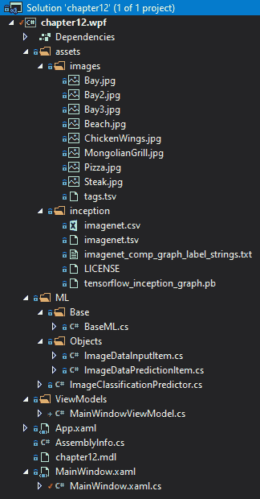
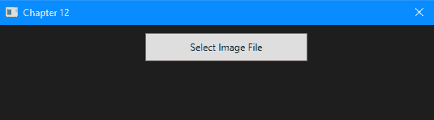
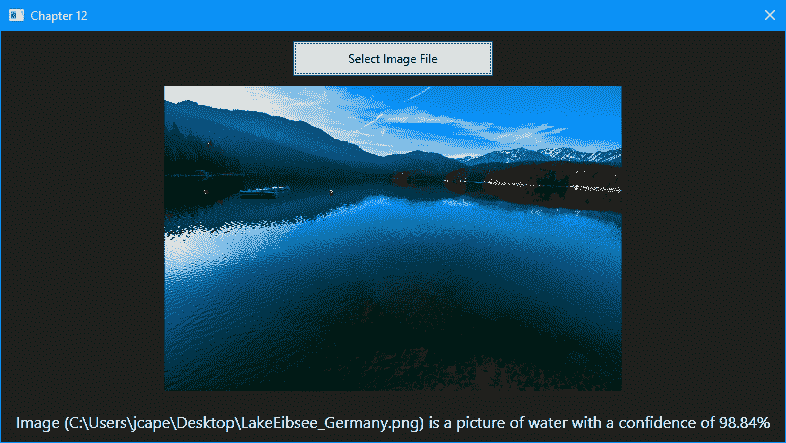

<title>Using TensorFlow with ML.NET</title> 

# 对 ML.NET 使用张量流

在这一章中，我们将使用一个预先训练好的 TensorFlow 模型，特别是 Inception 模型，我们将把这个模型集成到一个**Windows Presentation Foundation**(**WPF**)应用程序中。我们将采用预先训练的模型，并通过添加一些食物和水体的图片来应用迁移学习。在迁移学习完成后，我们允许用户选择他们自己的图像。到本章结束时，您应该已经牢牢掌握了如何将张量流模型集成到您的 model 应用程序中。

本章将涵盖以下主题:

*   打破谷歌的盗梦模式
*   创建影像分类桌面应用程序
*   探索其他生产应用程序增强功能

<title>Breaking down Google's Inception model</title> 

# 打破谷歌的盗梦模式

谷歌的盗梦空间模型([https://github.com/google/inception](https://github.com/google/inception))已经对数百万张图像进行了训练，以帮助解决我们社会中日益增长的一个问题——我的图像中有什么？想要回答这个问题的应用类型包括匹配面部、自动检测武器或不需要的物体、游戏图片中的体育品牌(例如运动鞋的品牌)以及为用户提供无需手动标签即可搜索的支持的图像归档器，等等。

这类问题通常用**物体识别**来回答。你可能已经熟悉的物体识别的一个应用是**光学** **字符** **识别** ( **OCR** )。OCR 是指字符图像可以被解释为文本，例如在微软的 OneNote 手写到文本功能中，或者在读取车牌的收费站中。我们将具体研究的对象识别的特定应用称为**图像分类**。

Inception 模型通过使用深度学习对图像进行分类来帮助解决这个问题。该模型在数百万张图像上以监督方式进行训练，输出为神经网络。这种方法的优点是，可以用更小的图像子集来增强预先构建的模型，这是我们将在本章的下一节中做的事情。这种添加额外数据和标签的方法被称为**转移** **学习**。这种方法在创建特定于客户的模型时也很有帮助。

把它想象成从你在 GitHub 中的主分支创建一个分支；您可能希望只添加一个类或修改一个元素，而不必重新创建整个代码库。关于模型，以汽车的图像分类器为例。让我们假设您获得了数百万张涵盖美国和外国汽车、卡车、货车等的图像。一位新客户找到您，要求您创建一个模型来帮助监控进入政府机构的车辆。以前的模式不应该被扔掉，也不需要完全重新培训，只是需要增加更多的商用(或军用)车辆的标签。

对于谷歌图像分类的更大和更深入的研究，一个很好的资源是他们的开发者文档，可以从[https://developers . Google . com/machine-learning/practica/image-classification/](https://developers.google.com/machine-learning/practica/image-classification/)找到。

<title>Creating the WPF image classification application</title> 

# 创建 WPF 影像分类应用程序

如前所述，我们将创建的应用程序是一个图像分类应用程序，特别允许用户选择图像并确定它是食物还是水。这是通过上述包含的预训练 TensorFlow 初始模型实现的。第一次运行应用程序时，模型的 ML.NET 版本使用图像和`tags.tsv`文件进行训练(将在下一节中回顾)。

和前面的章节一样，完整的项目代码、样本数据集和项目文件可以在这里下载:[https://github . com/packt publishing/Hands-On-Machine-Learning-With-ML。NET/tree/master/第十二章](https://github.com/PacktPublishing/Hands-On-Machine-Learning-With-ML.NET/tree/master/chapter12) [。](https://github.com/PacktPublishing/Hands-On-Machine-Learning-With-ML.NET/tree/master/chapter10)

<title>Exploring the project architecture</title> 

# 探索项目架构

在这一章中，我们将深入一个 WPF 桌面应用程序。正如本章第一节提到的，我们将使用 WPF 框架来创建我们的应用程序。你可能会问，为什么不是一个 UWP 应用程序，比如我们在第 10 章、*中使用 ML.NET 和 UWP* 创建的浏览器应用程序？原因是，至少在撰写本文时，TensorFlow 支持，特别是对图像分类的支持，在 UWP 应用程序中并不完全支持。也许，在 ML.NET 的未来版本中，这将被添加。对于其他非基于图像的应用程序，您可以在 UWP 应用程序中使用 TensorFlow。

那些以前做过 WPF 开发的人，如果仔细观察，会注意到这个项目利用了。网芯 3.1。英寸 NET Core 3.0，微软增加了对 WPF 和 WinForms 的支持，因此，你不再局限于 Windows。用于 GUI 开发的. NET 框架。相反，这种支持是通过`Microsoft.WindowsDesktop.App.WPF` NuGet 包添加的。

对于这个例子，我们将使用`Microsoft.ML` (1.3.1) NuGet 包——以及其他几个 NuGet 包——以便能够在我们的。NET 应用程序。其中包括以下内容:

*   `Microsoft.ML.ImageAnalytics` (1.3.1)
*   `Microsoft.ML.TensorFlow` (1.3.1)
*   `SciSharp.TensorFlow.Redist` (1.14.0)

当你读到这里的时候，很可能已经有了更新的版本，它们应该可以工作了，但是，上面提到的版本是我们将在这次深入研究中使用的版本，也是 GitHub 库中可用的版本。

在下面的屏幕截图中，您将找到该解决方案的 Visual Studio 解决方案资源管理器视图。由于 TensorFlow 支持对项目类型和 CPU 目标更为挑剔，我们回到了单个项目，而不是前几章中使用的三项目架构:



`tags.tsv`文件(位于代码库中的`assets\images`文件夹中)包含八行，将包含的图像映射到预分类:

```
ChickenWings.jpg food
Steak.jpg food
Pizza.jpg food
MongolianGrill.jpg food
Bay.jpg water
Bay2.jpg water
Bay3.jpg water
Beach.jpg water
```

如果您想尝试自己的分类，请删除包含的图像，复制您的图像，并用标签更新`tags.tsv`文件。我应该指出的是，所有包含在内的图片都是我在加州度假时拍摄的——你可以随意使用它们。

`assets/inception`文件夹中的文件包含所有 Google 预训练文件(和许可文件)。

<title>Diving into the WPF image classification application</title> 

# 深入 WPF 影像分类应用

正如在开始部分所讨论的，我们的桌面应用程序是一个 WPF 应用程序。对于这个例子的范围，正如在第十章、*使用 Model 和 UWP* 中所发现的，我们通过遵循**模型-视图-视图模型** ( **MVVM** )设计模式，使用标准方法来处理应用程序架构。

我们将在这一部分深入研究的文件如下:

*   `MainWindowViewModel`
*   `MainWindow.xaml`
*   `MainWindow.xaml.cs`
*   `BaseML`
*   `ImageDataInputItem`
*   `ImageDataPredictionItem`
*   `ImageClassificationPredictor`

WPF 项目中的其余文件在默认的 Visual Studio 中保持不变。NET Core 3.1 WPF 应用模板；例如，`App.xaml`和`AssemblyInfo.cs`文件。

<title>The MainWindowViewModel class</title> 

# MainWindowViewModel 类

`MainWindowViewModel`类的目的是包含我们的业务逻辑并控制视图，如下所示:

1.  我们做的第一件事是实例化我们之前讨论过的`ImageClassificationPredictor`类，以便它可以用于运行预测:

```
private readonly ImageClassificationPredictor _prediction = new ImageClassificationPredictor();
```

2.  下一个代码块处理分类字符串的 MVVM 能力，并存储选定的图像。对于这些属性中的每一个，我们在值发生变化时调用`OnPropertyChanged`,这将触发视图的绑定，以刷新绑定到这些属性的任何字段:

```
private string _imageClassification;

public string ImageClassification
{
    get => _imageClassification;

    set
    {
        _imageClassification = value;
        OnPropertyChanged();
    }
}

private ImageSource _imageSource;

public ImageSource SelectedImageSource
{
    get => _imageSource;

    set
    {
        _imageSource = value;
        OnPropertyChanged();
    }
}
```

3.  接下来，我们定义`Initialize`方法，它调用预测器的`Initialize`方法。该方法将返回一个元组，该元组指示模型是不能被加载还是没有找到，以及异常(如果抛出):

```
public (bool Success, string Exception) Initialize() => _prediction.Initialize();
```

4.  然后，我们处理当用户点击选择图像按钮时会发生什么。此方法打开一个对话框，提示用户选择图像。如果用户取消对话框，方法返回。否则，我们调用两个助手方法将图像加载到内存中并对图像进行分类:

```
public void SelectFile()
{
    var ofd = new OpenFileDialog
    {
        Filter = "Image Files(*.BMP;*.JPG;*.PNG)|*.BMP;*.JPG;*.PNG"
    };

    var result = ofd.ShowDialog();

    if (!result.HasValue || !result.Value)
    {
        return;
    }

    LoadImageBytes(ofd.FileName);

    Classify(ofd.FileName);
}
```

5.  `LoadImageBytes`方法获取文件名并将图像加载到我们基于 MVVM 的`ImageSource`属性中，因此，在选择之后，图像控件会自动更新为所选图像的视图:

```
private void LoadImageBytes(string fileName)
{
    var image = new BitmapImage();

    var imageData = File.ReadAllBytes(fileName);

    using (var mem = new MemoryStream(imageData))
    {
        mem.Position = 0;

        image.BeginInit();

        image.CreateOptions = BitmapCreateOptions.PreservePixelFormat;
        image.CacheOption = BitmapCacheOption.OnLoad;
        image.UriSource = null;
        image.StreamSource = mem;

        image.EndInit();
    }

    image.Freeze();

    SelectedImageSource = image;
}
```

6.  最后，`Classify`方法获取路径并将其传递给`Predictor`类。在返回预测时，分类和置信度被构建到我们的 MVVM `ImageClassification`属性中，因此，UI 被自动更新:

```
public void Classify(string imagePath)
{
 var result = _prediction.Predict(imagePath);

 ImageClassification = $"Image ({imagePath}) is a picture of {result.PredictedLabelValue} with a confidence of {result.Score.Max().ToString("P2")}";
}
```

`MainWindowViewModel`类的最后一个元素是我们在[第 10 章](9c105516-7e4f-4f99-b70f-8b0d6165d8c5.xhtml)、*中定义的相同的`OnPropertyChanged`方法，使用 ML.NET 和 UWP* ，这允许 MVVM 魔法发生。定义了我们的`ViewModel`类之后，让我们继续看一下`MainWindow` XAML 文件。

<title>The MainWindow.xaml class</title> 

# MainWindow.xaml 类

正如在第十章、*使用 ML.NET 和 UWP* 的*分解 UWP 架构*部分所讨论的，当描述开发时，XAML 标记用于定义你的用户界面。对于这个应用程序的范围，我们的 UI 相对简单:`Button`、`Image Control`和`TextBlock`。

我们现在来看看代码:

1.  我们首先定义的是网格。在 XAML，网格是一个类似于 web 开发中的`<div>`的容器。然后我们定义我们的行。类似于 Bootstrap(但在我看来更容易理解)，是对每行高度的预定义。将一行设置为`Auto`会自动将高度调整为内容的高度，而星号则表示使用基于主容器高度的所有剩余高度:

```
<Grid.RowDefinitions>
    <RowDefinition Height="Auto" />
    <RowDefinition Height="*" />
    <RowDefinition Height="Auto" />
</Grid.RowDefinitions>
```

2.  我们首先定义我们的`Button`对象，它将在我们的`ViewModel`类中触发前述的`SelectFile`方法:

```
<Button Grid.Row="0" Margin="0,10,0,0" Width="200" Height="35" Content="Select Image File" HorizontalAlignment="Center" Click="btnSelectFile_Click" />
```

3.  然后我们定义我们的`Image`控件，它被绑定到我们之前检查过的`SelectedImageSource`属性，该属性位于我们的`ViewModel`类中:

```
<Image Grid.Row="1" Margin="10,10,10,10" Source="{Binding SelectedImageSource}" />
```

4.  然后我们添加`TextBlock`控件来显示我们的分类:

```
<TextBlock Grid.Row="2" Text="{Binding ImageClassification, Mode=OneWay}" TextWrapping="Wrap" Foreground="White" Margin="10,10,10,10" HorizontalAlignment="Center" FontSize="16" />
```

定义了视图的 XAML 方面后，现在让我们深入研究一下`MainWindow`类背后的代码。

<title>The MainWindow.xaml.cs file</title> 

# MainWindow.xaml.cs 文件

`MainWindow.xaml.cs`文件包含 XAML 视图背后的代码，在这里讨论:

1.  我们定义的第一件事是围绕`DataContext`属性的一个包装器属性，它内置在基类`Window`中:

```
private MainWindowViewModel ViewModel => (MainWindowViewModel) DataContext;
```

2.  接下来，我们为`MainWindow`定义构造函数，以便将`DataContext`属性初始化为我们的`MainWindowViewModel`对象。如果初始化失败，我们不希望应用程序继续运行。此外，我们需要使用一个`MessageBox`对象让用户知道失败的原因:

```
public MainWindow()
{
    InitializeComponent();

    DataContext = new MainWindowViewModel();

    var (success, exception) = ViewModel.Initialize();

    if (success)
    {
        return;
    }

    MessageBox.Show($"Failed to initialize model - {exception}");

    Application.Current.Shutdown();
}
```

3.  最后，我们调用 ViewModel 的`SelectFile`方法来处理图像选择和分类:

```
private void btnSelectFile_Click(object sender, RoutedEventArgs e) => ViewModel.SelectFile();
```

有了`MainWindow`类的代码，WPF 组件就完成了。现在让我们关注例子中的机器学习部分。

<title>The BaseML class</title> 

# BaseML 类

前面大多数例子中使用的`BaseML`类为我们的 ML.NET 类公开了一个基类。在这个例子中，由于使用预先训练的模型，我们实际上简化了这个类。该类现在只需初始化`MLContext`属性:

```
public class BaseML
{
    protected MLContext MlContext;

    public BaseML()
    {
        MlContext = new MLContext(2020);
    }
}
```

回顾了 streamlined 的`BaseML`类之后，让我们深入研究一下`ImageDataInputItem`类。

<title>The ImageDataInputItem class</title> 

# ImageDataInputItem 类

`ImageDataInputItem`类包含我们要传入模型的类；基本属性是`ImagePath`属性:

```
public class ImageDataInputItem
{
    [LoadColumn(0)]
    public string ImagePath;

    [LoadColumn(1)]
    public string Label;
}
```

虽然比我们的大多数输入类都要小，但是 Inception 模型只需要这两个属性。现在，让我们深入到名为`ImageDataPredictionItem`的输出类。

<title>The ImageDataPredictionItem class</title> 

# ImageDataPredictionItem 类

`ImageDataPredictionItem`类包含预测响应，包括预测值字符串的置信度(在包含图像的情况下包含`Water`或`Food`):

```
public class ImageDataPredictionItem : ImageDataInputItem
{
    public float[] Score;

    public string PredictedLabelValue;
}
```

与输入类非常相似，输出类只有两个属性，类似于前面的例子。有了输入和输出类之后，让我们深入到`ImageClassificationPredictor`类，它使用这些类进行迁移学习和预测。

<title>The ImageClassificationPredictor class</title> 

# ImageClassificationPredictor 类

`ImageClassificationPredictor`类包含加载和预测初始张量流模型所需的所有代码:

1.  首先，我们需要定义几个助手变量来访问图像和`.tsv`文件:

```
// Training Variables
private static readonly string _assetsPath = Path.Combine(Environment.CurrentDirectory, "assets");
private static readonly string _imagesFolder = Path.Combine(_assetsPath, "images");
private readonly string _trainTagsTsv = Path.Combine(_imagesFolder, "tags.tsv");
private readonly string _inceptionTensorFlowModel = Path.Combine(_assetsPath, "inception", "tensorflow_inception_graph.pb");

private const string TF_SOFTMAX = "softmax2_pre_activation";
private const string INPUT = "input";

private static readonly string ML_NET_MODEL = Path.Combine(Environment.CurrentDirectory, "chapter12.mdl");
```

2.  接下来，我们定义预训练的先启模型需要的设置:

```
private struct InceptionSettings
{
    public const int ImageHeight = 224;
    public const int ImageWidth = 224;
    public const float Mean = 117;
    public const float Scale = 1;
    public const bool ChannelsLast = true;
}
```

3.  接下来，我们创建我们的`Predict`方法并重载它，它只接受图像文件路径。像前面的例子一样，我们通过调用我们的`MLContext`对象来创建`PredictionEngine`，传入我们的输入类(`ImageDataInputItem`)和输出类(`ImageDataPredictionItem`)，然后调用`Predict`方法来获得我们的模型预测:

```
public ImageDataPredictionItem Predict(string filePath) => 
    Predict(new ImageDataInputItem 
        {
            ImagePath = filePath 
        }
    );

public ImageDataPredictionItem Predict(ImageDataInputItem image)
{
    var predictor = MlContext.Model.CreatePredictionEngine<ImageDataInputItem, ImageDataPredictionItem>(_model);

    return predictor.Predict(image);
}
```

4.最后，我们用自己的样本初始化并扩展我们的预训练模型:

```
public (bool Success, string Exception) Initialize()
{
    try
    {
        if (File.Exists(ML_NET_MODEL))
        {
            _model = MlContext.Model.Load(ML_NET_MODEL, out DataViewSchema modelSchema);

            return (true, string.Empty);
        }

       ...
    }
    catch (Exception ex)
    {
        return (false, ex.ToString());
    }
} 
```

完整代码请参考以下 GitHub 资源库链接:[https://GitHub . com/packt publishing/Hands-On-Machine-Learning-With-ML。NET/blob/master/chapter 12/chapter 12 . wpf/ML/image classificationpredictor . cs](https://github.com/PacktPublishing/Hands-On-Machine-Learning-With-ML.NET/blob/master/chapter12/chapter12.wpf/ML/ImageClassificationPredictor.cs)。随着`Initialize`方法的完成，代码的深入研究也就结束了。让我们现在运行应用程序！

<title>Running the image classification application</title> 

# 运行影像分类应用程序

因为我们使用的是预先训练好的模型，所以我们可以直接从 Visual Studio 运行应用程序。运行应用程序时，您将看到一个几乎是空的窗口:



单击选择图像文件按钮，然后选择一个图像文件，将触发模型运行。在我的例子中，我选择了一张最近去德国度假的照片，照片的置信度为 98.84%。



请随意在您的机器上尝试各种文件，以查看置信度得分和分类——如果您开始注意到问题，请向 images 文件夹和`tags.tsv`文件添加更多样本，如前一节所述。在进行这些更改之前，请务必删除`chapter12.mdl`文件。

<title>Additional ideas for improvements</title> 

# 改进的其他想法

现在我们已经完成了我们的深入研究，有一些额外的元素可能会进一步增强应用程序。这里讨论几个想法。

<title>Self-training based on the end user's input</title> 

# 基于最终用户输入的自我培训

正如本章开头所提到的，优势之一是在动态应用中利用迁移学习的能力。与本书中讨论的之前的示例应用程序不同，该应用程序实际上允许最终用户选择一系列(或文件夹)图像，并通过一些代码更改，构建新的`.tsv`文件并训练新的模型。对于一个 web 应用程序或商业产品来说，这将提供很高的价值，也将减轻你的负担，例如，获取各种类型的图像——这是一个令人望而生畏的、很可能是徒劳的目标。

<title>Logging</title> 

# 记录

正如在[第十章](9c105516-7e4f-4f99-b70f-8b0d6165d8c5.xhtml)、*使用 ML.NET 搭配 UWP* 的*日志*部分提到的，拥有一个桌面应用有它的利弊。需要日志记录的最大缺点是，您的桌面应用程序可以安装在 Windows 7 到 Windows 10 的任意数量的配置上，几乎有无限数量的排列。如前所述，强烈推荐使用 NLog([https://nlog-project.org/](https://nlog-project.org/))或类似的开源项目进行日志记录，再加上 Loggly 之类的远程日志解决方案，这样就可以从用户的机器上获得错误数据。考虑到 GDPR 和最近的 CCPA，我们需要确保离开终端用户机器的数据被传送，并且这些日志不包括个人数据(或通过日志机制上传到远程服务器的实际图像)。

<title>Utilizing a database</title> 

# 利用数据库

类似于第 10 章、*中的性能优化建议，使用 ML.NET 和 UWP* ，如果用户不止一次选择相同的图像，特别是如果该应用程序正在 kiosk 中使用或转换为 web 应用程序，存储分类的性能优势可能相当显著。实现这一点的一个快速简单的方法是对映像执行 SHA256，并对照数据库检查该散列。根据用户数量以及用户是否并发，我建议选择以下两个选项之一:

*   如果用户一次访问一个，并且应用程序仍然是一个 WPF 应用程序，那么推荐使用前面提到的轻量级数据库 LiteDB([http://www.litedb.org/](http://www.litedb.org/))。
*   如果您正在使用产品启动一个大型 web 应用程序，那么建议使用 MongoDB 或一个水平可伸缩的数据库，比如微软的 CosmosDB，以确保数据库查找不会比简单地重新执行模型预测慢。

<title>Summary</title> 

# 摘要

在本章的课程中，我们深入探讨了如何使用预先训练好的 TensorFlow 模型创建 WPF 应用程序。我们还回顾并仔细研究了谷歌的图像分类初始模型。此外，我们还学习了如何采用该模型并整合它，以便对用户选择的图像执行图像分类。最后，我们还讨论了进一步增强示例应用程序的一些方法。

在下一章也是最后一章中，我们将重点介绍在 WPF 应用中使用预训练的 ONNX 模型进行对象检测。