# 实现机器学习算法

多年来，学习一直是一个学习的问题。人类是如何获取新知识的，从基本的生存技能到高级的抽象学科，在计算机世界里都是难以理解和复制的。机器通过比较例子并从中寻找相似之处来学习。

机器(也包括人类)学习的最简单方法是简化需要解决的问题。现实的一个简化版本，称为模型，对这个任务是有用的。要研究的一些相关问题是样本的最小数量、欠拟合和过拟合、相关特征以及模型可以学习到什么程度。不同类型的目标变量需要不同的算法。

本章将涵盖以下主题:

*   理解学习和模型
*   关注模型特征
*   在实践中研究机器学习模型
*   评估模型

# 技术要求

本章没有技术要求，因为它是介绍性的。各部分中显示的数据应输入到 Excel 电子表格中，以便能够遵循示例。

# 理解学习和模型

人类学习的方式已经被研究了几十年了。有一些心理学理论试图解释我们如何获取知识，使用知识，并归纳知识，以便将我们所知道的应用到全新的场景中。退一步，我们可以问自己:学习意味着什么？我们可以说，一旦我们学会了什么，我们就能以或多或少详细的方式重复它。事实上，学习不仅仅意味着模仿一种行为或者背诵一首诗。事实上，我们了解我们所学的东西，并能够概括这些知识，这有助于我们对新的人、地方和情况做出正确的反应。

长久以来，人们一直渴望创造一种能够模仿人类行为和智力的机器。数百年前，国王们对象棋机器、不需要人类玩家的乐器和回答各种问题的神秘盒子感到惊讶。这些很多时候都是假的发明表明，人类最伟大的梦想之一是创造一个智能生物，它能够复制通常由人完成的简单或困难的任务，即使智力是一个难以捉摸和不容易定义的东西。

许多年过去了，技术已经发展到我们现在可以创造出能够思考的机器，或者至少看起来能够。事实上，我们称之为*智能*的大多数系统仅仅能够执行重复的任务，或者根据我们通过例子展示给它们的任何东西对外部输入做出反应。随着本章的进展，我们将看到人类学习和智能的一些定义特征已经是现代机器学习系统的一部分，有些仍然是科幻小说的主题。

根据定义，机器学习意味着教会机器或算法执行任务。我们已经这样做了很多年——它被称为**编程**。我们给计算机一组指令，它们应该被执行的顺序，以及一些如何对有限数量的输入做出反应的选项。如果输入是未知的，或者如果我们要求计算机做一些不包含在程序中的事情，那么它将失败，显示一个错误。这种传统范式和机器学习的区别在于，我们永远不会告诉计算机到底要做什么。我们要么让它发现模式，要么给它看我们想要的样本。当然，我们将使用编程，但只是为了定义算法，让*按照之前描述的方式学习*。从寻找更好地代表一组点的直线到驾驶汽车，机器能做的一切都是通过这种方式学习的。

作为婴儿，我们开始探索我们周围的世界。由于我们太小，无法理解单词或例子，我们基本上是通过感官来体验世界的。我们知道硬和软、粗糙和光滑、热和冷的区别。当我们需要一些东西时，我们可以呼吁关注，我们甚至可以了解父母和宠物的耐心水平。在大多数情况下，没有人坐在我们旁边解释我们看到的、听到的、感觉到的、尝到的和闻到的。这是一个我们称之为*无监督学习*的例子。

在无监督学习中，训练数据是“未标记的”。没有我们的帮助或干预，算法(或程序)将在数据中找到所需的联系或未被怀疑的模式，并了解数据集的细节和属性。

后来，随着我们长大，我们理解了单词，并开始给事物命名。我们的父母告诉我们，当我们看到一只狗或一只猫时，我们会学习我们和它们的名字，我们会学习从其他孩子的玩具中识别出我们的玩具(并为它们打架)。我们甚至没有意识到，我们把物体、动物和人的一些特征和他们的名字联系起来。这些是所谓的监督学习的例子。在计算机的情况下，算法显示为一组代表问题属性的变量，然后它学习这些特征如何与标签的名称相关联。

科学向我们展示了我们周围世界的巨大复杂性。科学知识的每一个分支都需要先进的数学计算，甚至是全新的看待数据的方式。然而，我们所能解释的绝大多数只是现实世界的一小部分。每当我们描述一个物理现象、一个经济或金融事件，或者试图理解个人和群体的行为时，我们都依赖于真实问题的简化版本。这些被称为**模型**，它们使我们有可能对我们试图解释的任何事物建立一种心理表征。如果模型足够精确，我们将能够*预测*未来的某个事件，或者得到某个结果的近似值。你现在应该已经意识到了，这是非常强大的。例如，如果一个炮兵士兵能够精确地计算出炮弹将要击中的位置，那么他的军队在战斗中就比敌人有明显的优势。模型是现实的简化版本，用于理解问题并最终做出预测。理解你的对手忽略的东西总是代表着一种优势。

# 通过实例学习–线性回归模型

想象一下，你和一个朋友拥有一家小冰淇淋店。你们在讨论每天要生产多少**公斤** ( **公斤**)冰淇淋，你们都同意这样一个事实，天气越热，冰淇淋就会卖得越多。你补充说，这不是唯一要考虑的因素，但还有其他变量也会影响销售数量。作为理性的人和优秀的分析师，你决定做一个小实验，记录商店营业时间的平均温度和售出的冰淇淋数量。夏天特别多雨，温度变化很大，这有助于你获得一个很好的变量范围。最终数据集如下表所示:

| **平均温度(摄氏度)** | **售出的冰淇淋(公斤)** |
| Twenty-six | Forty-five |
| Twenty-three | Forty-two point five |
| Twenty-nine | Fifty-three point five |
| Twenty-three | Thirty-five point five |
| Fifteen | Thirty-two point five |
| Nineteen | Thirty-four point five |
| Twenty-one | Thirty-three point five |
| Eighteen | Thirty-five |
| Fifteen | Thirty-two point five |
| Twenty-five | Forty point five |
| Twenty-five | Thirty-nine point five |
| Sixteen | Thirty-two |
| Twenty-three | Forty-four point five |
| Twenty-three | Thirty-nine point five |
| Twenty | Thirty-three |
| Seventeen | Twenty-six point five |
| Twenty-one | Thirty-seven point five |
| Twenty-nine | Forty-nine point five |
| Twenty-five | Forty point five |
| Twenty-four | forty-four |

你的模型表明冰淇淋的销售量与平均温度成正比。为了检验这个假设，我们可以对收集的数据做一个散点图:

1.  选择包含表格的全部单元格，单击“插入”菜单，然后选择“图表”:

2.  现在，单击散点，如下所示:

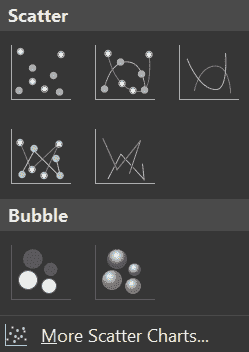

写完轴标题的名称后，您应该会得到一个类似于下图的图表:

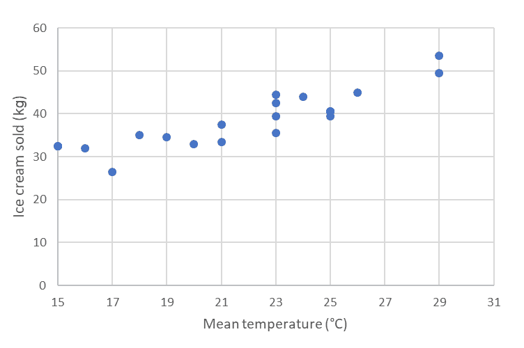

我们看到确实存在线性相关，而且是正相关(温度值越大，卖的冰淇淋越多)。然后，我们可以使用线性方程来表示该模型，如下所示:

*IC = a * T + b* (1)

这里， *IC* 是售出的冰淇淋数量， *T* 是平均温度， *a* 和 *b* 是通过线性回归计算的恒定值。

要获得 *a* 和 *b* 的值，我们可以使用 Excel 的分析工具箱数据分析插件*。*如果您尚未启用该功能，请参考 link[https://support . office . com/en-ie/article/use-the-analysis-toolbak-to-perform-complex-data-analysis-6 c 67 CCF 0-F4 a9-487 c-8 dec-BDB 5a 2 cefa b 6](https://support.office.com/en-ie/article/use-the-analysis-toolpak-to-perform-complex-data-analysis-6c67ccf0-f4a9-487c-8dec-bdb5a2cefab6)获取有关如何操作的说明。

3.  在工作表中选择数据区域，转到主菜单中的数据，然后选择数据分析:

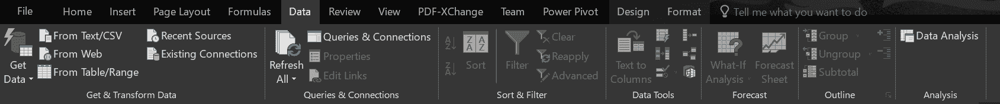

4.  在弹出菜单中，选择回归并单击确定:

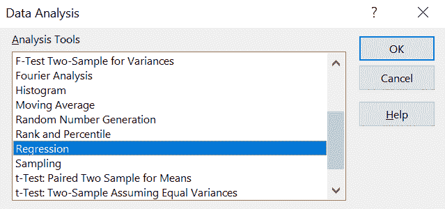

5.  确保 *x* 和 *y* 范围正确( *x* 为温度， *y* 为冰淇淋量)。选择直线拟合图以查看新图表中数据点顶部的回归线:

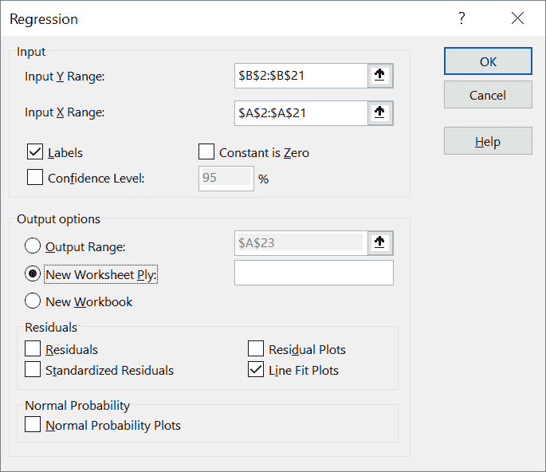

查看输出，我们看到最符合数据的行可以写成如下形式:

*IC = 1.5* T + 6* (2)

*的*a*0.2*，以及 *4* 的 *b* 都有一个标准误差。 *R ² 所以，你和你的朋友都是对的！*

下图显示了拟合线:

很明显，这条线很好地代表了数据，但有些点有点偏离，表明在预测冰淇淋消费量时，您需要考虑其他因素。在任何情况下，给定一天的平均预测温度，您可以使用等式 *(2)* 粗略估计生产多少冰淇淋来满足可能的需求。

准备好剩余的线性回归结果，因为我们将在接下来的章节中用到它们。

# 关注模型特征

作为现实的简化表示，模型还包括一组变量，这些变量包含描述我们所表示的问题的不同部分的相关信息。这些变量可以是像 1 公斤冰淇淋这样具体的东西，就像我们在前面的例子中看到的那样，也可以是抽象的数值，它表示文本文档中两个单词的意思有多相似。

在机器学习模型的特殊情况下，这些变量被称为**特征**T2。选择能够提供与我们试图解释或预测的现象相关的信息的重要特征至关重要。如果我们考虑无监督学习，那么相关特征是那些更好地表示数据集中信息的聚类或关联的特征。对于监督学习，最重要的特征是那些与目标变量高度相关的特征——也就是我们想要预测或解释的值。

从机器学习模型中获得的洞察力的质量取决于用作模型输入的特征。**特征选择**和**特征工程**是改善模型输入的常用技术。特征选择是选择相关特征的子集用于任何确定的模型构造的过程。它也可以被称为变量选择或属性选择。在建立任何机器学习模型时，特征选择和数据清洗应该是第一步，也是最重要的一步。特征工程被定义为使用已识别数据的领域知识来创建使机器学习算法工作的特征的过程。如果这一点做得正确，那么它将通过从输入该模型或系统的新数据中创建特征来提高机器学习算法的预测能力。

在我们之前的示例中，模型特征是平均温度和售出的冰淇淋数量。因为我们已经证明了涉及到更多的变量，我们可以添加一些额外的特征来更好地解释每天的冰淇淋消耗量。例如，我们可以考虑一周中的哪一天记录数据，并将该信息作为另一个特征包含在内。此外，任何其他相关信息都可以或多或少准确地表示到特征中。在监督学习中，习惯上称输入变量为*特征*，目标或预测变量为*标签。*

特征可以是数字的(比如我们前面例子中的温度)，也可以是分类的(比如一周中的某一天)。由于计算机中的一切都表示为数字数据，因此应该通过给数字分配类别来将分类数据转换为数字形式。一键编码是将分类变量转换成数字形式(或*编码*)的过程，以便它们可以输入到机器学习算法中。

按照我们的示例，我们可以将星期几转换为天数，如下所示:

| **星期几** | **日数** |
| 星期一 | one |
| 星期二 | Two |
| 星期三 | three |
| 星期四 | four |
| 星期五 | five |
| 星期六 | six |
| 星期日 | seven |

这种编码反映了一天的顺序，并将最高值保留在周末。

假设您想要更具体地预测您销售的每种口味的冰淇淋数量。为方便起见，我们假设你生产四种不同的口味:巧克力、草莓、柠檬和香草。你能给每种味道分配一个数字吗，就像你在星期编码中做的那样？正如我们将要看到的，答案是否定的。让我们试一试，看看有什么问题:

| 风味 | 风味指数 |
| 绍科拉特 | one |
| 草莓 | Two |
| 柠檬 | three |
| 香草 | four |

通过使用这种编码，我们含蓄地说巧克力更接近草莓而不是香草(1 个单位对 3 个单位)，这不是香料的真实属性。转换成数字的正确方法是创建二进制变量。这种方法称为一键编码，如下表所示:

| **风味** | 是巧克力吗？ | 是草莓吗？ | 是柠檬吗？ | 是香草吗？ |
| 绍科拉特 | one | Zero | Zero | Zero |
| 草莓 | Zero | one | Zero | Zero |
| 柠檬 | Zero | Zero | one | Zero |
| 香草 | Zero | Zero | Zero | one |

这种方法会产生一些开销，因为它通过为原始变量的每个可能值创建一个二进制变量来增加特性的数量。从积极的一面来看，它可以正确地计算特征的属性。我们将在下一章看到一些这样的例子。

根据目标变量的类型，我们可以将其分为*回归模型*(即连续目标变量)或*分类模型*(即离散目标变量)。例如，如果我们想预测一个实数或整数，我们使用回归，而如果我们试图预测一个有有限选项的标签，我们使用分类。

# 在实践中研究机器学习模型

我们已经看到了一个非常简单的例子，并用它来解释一些基本概念。在下一章，我们将探索更复杂的模型。为了清晰起见，我们将自己限制在一个非常小的数据集内，并通过一个简单的任务开始我们掌握机器学习的旅程。在使用机器学习模型来解决实际问题时，我们需要注意一些一般注意事项:

*   数据量通常非常大。事实上，更大的数据集有助于获得更准确的模型和更可靠的预测。超大型数据集，通常称为*大数据，*可能会带来存储和操作挑战。
*   数据从来都不是干净的，随时可以使用，所以数据清洗极其重要，而且需要花费大量时间。
*   正确表示现实问题所需的要素数量通常很大。前面提到的特征工程技术不可能手工完成，所以必须设计和应用自动方法。
*   评估输入特征组合的预测能力比评估每个输入特征的重要性重要得多。在第五章、*相关性和变量重要性*中给出了一些如何选择特征的简单示例。
*   我们应用的第一个模型不太可能获得非常好的结果。测试和评估许多不同的机器学习模型意味着多次重复相同的步骤，并且通常也需要自动化。

*   数据集应该足够大，以便将一部分数据用于训练目的(通常为 80%)，而将其余数据用于测试。仅根据训练数据评估模型的准确性会产生误导。模型可以非常精确地解释和预测训练数据集，但是当呈现新的、以前看不到的数据值时，它可能无法进行归纳并提供错误的结果。
*   应该从同一个完整的数据集中随机选择训练和测试数据。试图基于远离训练范围的输入进行预测不太可能给出好的结果。

监督机器学习模型通常使用一小部分输入数据进行训练，并在剩余部分进行测试。当输入新的未知特征值时，该模型可用于预测结果，如下图所示:

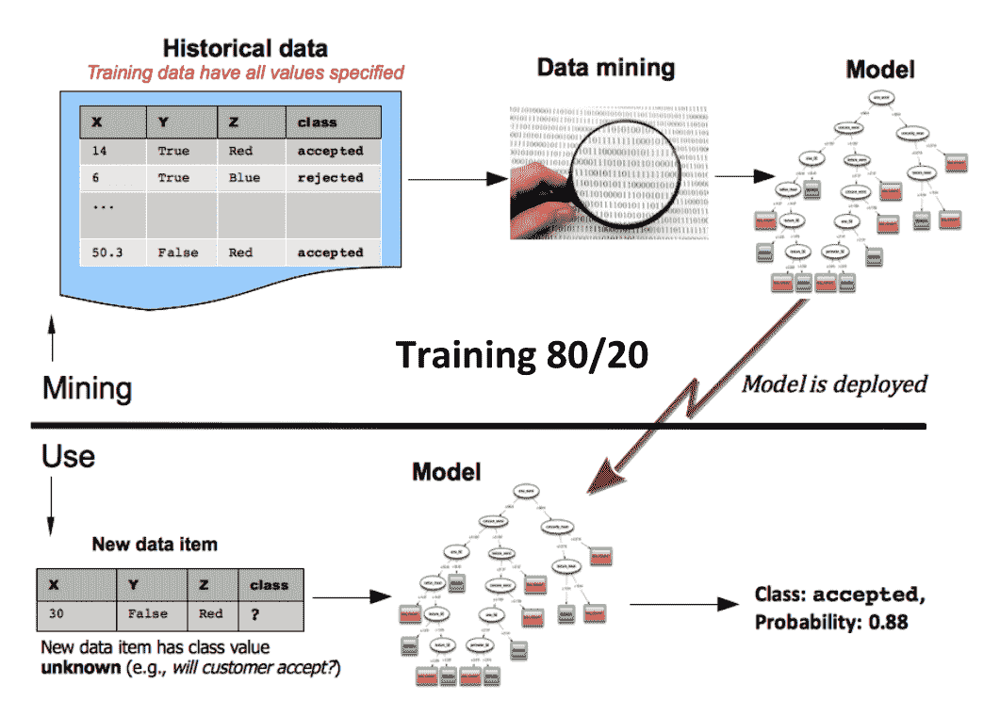

典型的监督机器学习项目包括以下步骤:

1.  获取数据并合并不同的数据源(在[第 3 章](146c3aff-32a3-4008-8985-c1fd7db22739.xhtml)、*将数据从不同的数据源导入 Excel】中有更多相关内容)*
2.  清理数据(可参考[第四章](f93bc229-5658-466c-a7e2-ad082617bca9.xhtml)、*数据清理和初步数据分析*)
3.  初步分析和特征工程(可以参考[第五章](0da64bd8-0bc9-491b-875c-7ec7c35c6165.xhtml)、*相关性和变量重要性*
4.  为每个数据集尝试不同的模型和参数，通过使用完整数据集的一部分来训练它们，并使用其余部分进行测试
5.  部署模型，以便它可以在连续的分析流程中使用，而不仅仅是在小的、孤立的测试中使用
6.  预测新输入数据的值

这一过程将在下一章的例子中变得清晰。

# 比较欠拟合和过拟合

在前面的列表中，步骤 *4* 意味着一个迭代过程，在这个过程中，我们尝试模型、参数和特性，直到我们得到我们能得到的最佳结果。现在让我们考虑一个分类问题，我们想把正方形和圆形分开，如下图所示。在这个过程的开始，我们可能会处于类似于第一个图表(在左手边)的情况。该模型未能有效地分离这两种形状，两边都是正方形和圆形的混合物。这被称为**欠拟合**，指的是未能代表数据集特征的模型:

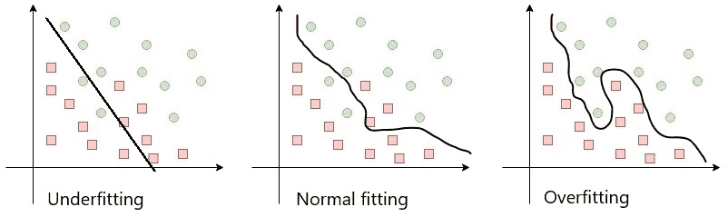

随着我们继续调整参数并根据训练数据集调整模型，我们可能会发现自己处于类似于第三个图表(在右侧)的情况。该模型精确地分割数据集，在边界线的每一侧只留下一个形状。即使这看起来是正确的，但它完全缺乏普遍性。结果对训练数据调整得如此之好，以至于我们用不同的数据集测试它是完全错误的。这个问题叫做**过拟合**。

为了解决我们模型中的过拟合问题，我们需要增加它的适应性。然而，使它过于灵活也会使它不擅长预测。为了避免这种情况，通常的解决方案是使用*正则化*技术。在专业文献中可以找到许多类似的技术，但它们超出了本书的范围。

中间的图表显示了一个更灵活的模型；它表示数据集，但是足够通用，可以处理新的、以前看不到的数据。为了建立一个好的机器学习模型，这通常很耗时，并且很难获得正确的平衡。

# 评估模型

无论何时我们获得一个结果，它都是和代表真实问题的模型一样精确。因此，了解哪些方法可以用来评估我们的模型的性能是极其重要的。

在处理*分类* *车型*时我们可以使用以下方法。

# 分析分类准确性

这是正确预测数 ( **CP** )与样本总数的比率:

这里， *CP* 是准确或正确预测的次数， *TP* 是已经做出的所有预测的总数。

# 构建混淆矩阵

现在让我们考虑一个二元分类问题。我们有一组属于两类的样本:*是*或*否*。我们可以建立一个机器学习模型，为每个输入变量集输出一个类。通过在 200 个样本上测试我们的模型，我们将得到以下结果:

| **N=200** | **预测不到** | **预测是** |
| **实际编号** | Sixty | Fifteen |
| **实际是** | Twenty-five | One hundred |

混淆矩阵有四个元素:

*   **真阳性(TP)** :模型预测为是，实际值为是的次数。在我们的例子中，这是 100 次。
*   **真阴性(TN)** :模型预测 NO 而实际值为 NO 的次数，在我们的例子中，这是 60 次。
*   **假阳性(FP)** :模型预测为是而实际值为否的次数，在我们的例子中，这是 15 次。
*   **假阴性(FN)** :模型预测为否而实际值为是的次数。在本例中，这是 25 次。

然后，我们在下面的等式中计算混淆矩阵:

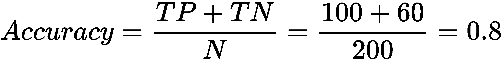

# 计算曲线下面积(AUC)

分类模型的 AUC 被定义为模型将随机正例排在随机负例之上的概率。

使用混淆矩阵，我们可以如下定义其他量:

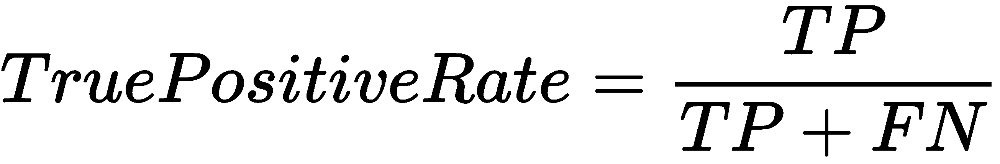

**真阳性率** ( **TPR** )或敏感度是正确预测为阳性的数据点相对于所有真值为*是*的数据点的比率:

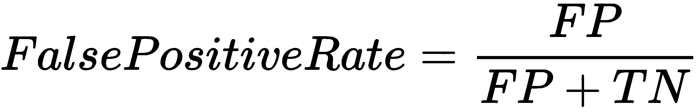

**假阳性率**(**)或特异性是被错误预测为*是*的*否*个数据点相对于所有*否*个数据点的比率。**

 **两个量的值都在[0，1]范围内。在不同的阈值下计算 FPR 和 TPR，并构建图表。该曲线称为**接收工作特性**(**ROC**)；AUC 是曲线下的面积，如下图所示:

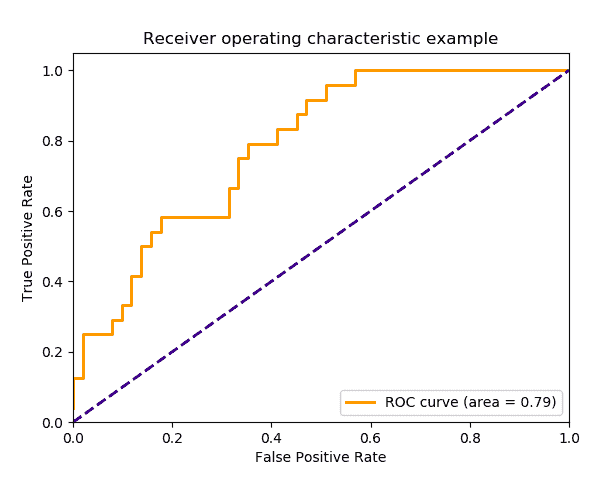

如果我们想评估回归模型，我们可以使用下面的技术。

# 计算平均绝对误差(MAE)

MAE 是实际值( *y [j]* )和预测值( *ŷ [j]* )的绝对差值的平均值。它不能告诉我们误差的方向，这意味着预测可能高于或低于真实值。如果我们总共有 *N* 个数据点，我们可以如下计算 MAE:

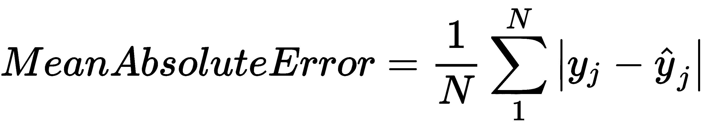

# 计算均方误差(MSE)

MSE 取实际值和预测值之差的平方的平均值:

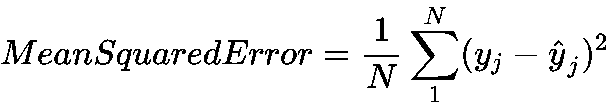

无论我们选择什么评估方法，考虑到问题的商业部分是极其重要的。最佳解决方案并不总是最准确的模型，而是更好地满足您的业务需求的模型。可能的情况是，一个不太精确但可以快速建立的模型比一个需要一年时间才能生产出来的完美模型要好。考虑数据集不平衡和业务需求对于微调模型以改善混淆矩阵值非常重要:

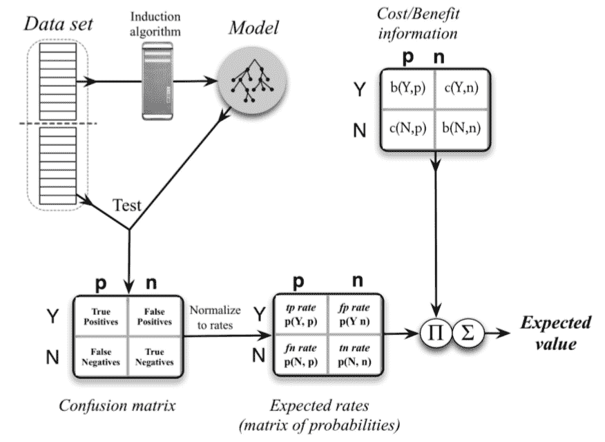

另一个要考虑的重要因素是，在分类问题的情况下，我们是否有一个平衡的数据集。一个占主导地位的类将导致一个每次都预测相同结果的模型。例如，具有 99% *是*标签的数据集将在训练后产生一个机器学习模型，该模型对 99%的输入预测*是*(并且它将是正确的！).有许多已知的技术用于平衡数据集和发现数据中的问题。

# 摘要

在本章中，我们简要讨论了机器的学习过程，在某种程度上，它模仿了人类的学习过程。我们描述了一个模型，它是我们想要解决的问题的简化表示，可以用来应用机器学习来找到解决方案。

使用线性回归模型，我们建立了一个简单的监督预测模型，并解释了如何使用它。然后，我们讨论了回归和分类之间的差异，并展示了输入变量和特征的属性。

训练机器学习模型时，欠拟合和过拟合是两个主要问题。我们解释了它们是什么，并提出了避免它们的方法。

最后，不同类型的目标变量需要不同的算法和评估方法来测试模型的质量——我们在最后几节中详细讨论了这一点。

在下一章中，我们将使用机器学习来解决一些现实生活中的问题，并探索一些监督和非监督模型是如何建立的。

# 问题

1.  经典计算机编程和机器学习的主要区别是什么？
2.  考虑到目标变量的类型，模型是如何分类的？
3.  有哪些不同类型的模型，取决于他们如何学习？
4.  创建和使用机器学习模型的主要步骤是什么？
5.  在 Excel 中执行的回归输出包含有关残差的信息。它们是什么，它们与 MAE 和 MSE 有什么关系？
6.  解释欠拟合和过拟合。
7.  如何将分类特征用于机器学习模型？

# 进一步阅读

*   *初学者机器学习*:[https://towards data science . com/Machine-Learning-For-初学者-d247a9420dab](https://towardsdatascience.com/machine-learning-for-beginners-d247a9420dab)
*   *机器学习基础知识——合你心意*:[https://hacker noon . com/Machine-Learning-basics-its-your-cup-of-tea-af 4 BAF 060 ace](https://hackernoon.com/machine-learning-basics-its-your-cup-of-tea-af4baf060ace)**