# 七、实现时间序列

时间演化现象是许多学科的基础。了解发生了什么，并预见不同的变量将如何演变，是做出正确、明智决策的关键知识。

时间序列分析是一个广泛的领域，有许多不同的方法来检测模式，预测行为，并将时间演变分解为已知的和以前研究过的形状。我们将讨论其中的一些，重点是那些使用 Excel 很容易解决的问题。像往常一样，这个想法是我们的机器学习数据中的细节，并可以提取关于过去和未来可能发展的有用知识。

在本章中，我们将讨论以下主题:

*   时间序列的建模和可视化
*   在 Excel 中自动预测时间序列
*   研究时间序列的平稳性

# 技术要求

为了完成本章，读者需要从 GitHub 资源库下载`AirPassengers_modified.csv`文件，网址为[https://GitHub . com/packt publishing/Hands-On-Machine-Learning-with-Microsoft-Excel-2019/tree/master/chapter 07](https://github.com/PacktPublishing/Hands-On-Machine-Learning-with-Microsoft-Excel-2019/tree/master/Chapter07)。

# 时间序列的建模和可视化

我们已经看到，做初步的数据分析和可视化数据集是任何机器学习项目的第一步。时间序列也不例外。因此，我们将从探索时间序列开始，了解它的不同特征。

在时间序列的情况下，初步分析意味着*建模*它；也就是说，了解它是否是周期性的，它是否显示出给定的趋势(随时间增加或减少)，或者它是否是稳定的(值的平均值和方差不随时间改变)，以及其他测量。可视化在这种分析中起着重要的作用，因为许多时间序列特征可以通过数据点的图形表示来推断，即使有数值方法来计算它们。

让我们使用一个流行的数据集来说明时间序列的建模和可视化。`AirPassengers_modified.csv`文件是一个非常受欢迎的数据集的简化版本，通常在教授时间序列分析时作为一个例子显示(来源: *Box，G. E. P .，Jenkins，G. M .和 Reinsel，G. C. (1976)时间序列分析、预测和控制。第三版。霍尔登日。G 系列*。我们的版本包含了 1949 年至 1961 年间乘飞机旅行的国际旅客数量(以千计)，按月份分组。以通常的方式(Data | From Text/CSV)加载文件后，我们可以在下图中直观显示时间序列，其中我们可以看到作为时间函数的乘客数量:

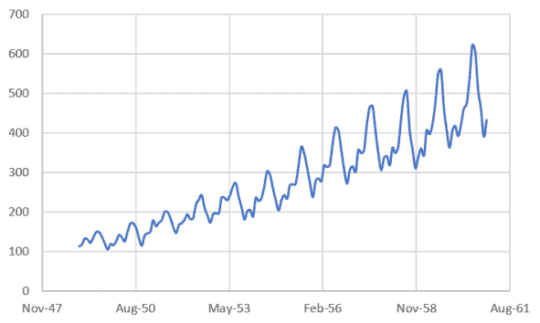

我们注意到的第一件事是乘客的数量随着时间的推移而增加。然后，如果我们仔细观察系列中的峰值，有一个 12 个月的模式似乎在重复。让我们用数据来证明这个观察。

获取趋势的最简单方法是使用 Excel 的内置功能来计算趋势。要使用它，请按照下列步骤操作:

1.  单击图表区域。
2.  选中趋势线框。
3.  点击`More Options...` *，*如下截图所示:

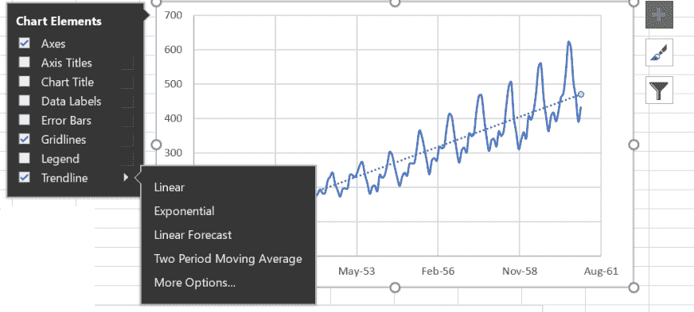

第一个选项将显示图表中的线条，然后，在选择更多选项后...，我们可以勾选这个方框来查看图表上的直线方程表达式。请注意，线性并不是趋势线的唯一选项，更复杂的回归也是可用的，如以下屏幕截图所示:

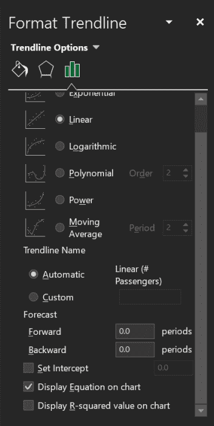

如图表所示，得出的等式如下:

*乘客= 0.0873 *旅行日期- 1472*

查看生成的图，我们看到一条直线没有正确地跟随系列的时间演变。正如您在下图中看到的那样，有些部分大部分位于线上，有些则位于线下:

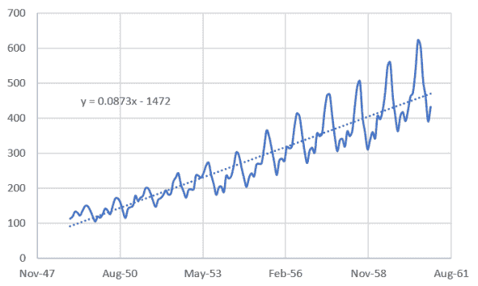

我们如何对数据集的一般行为进行建模？首先，我们可以认识到，我们可以将该系列视为由三部分组成:

*   周期性部分，每 12 个月重复一次(我们猜测这是因为峰值的周期性，并将这 12 个月称为*季节*
*   一个增加的部分，我们可以通过回归或平均序列来获得
*   一个*噪声*部分，我们基本上将其定义为隔离前两个部分后的剩余值

这个模型可以写成如下形式:

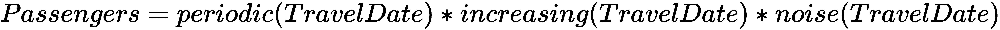

让我们通过使用移动平均线来改进*增加*部分的计算。这可以由 Excel 自动计算，但我们将手动计算，因为它很简单，我们可以准确理解它是如何工作的:

1.  首先计算前 12 个月的平均乘客人数:

*=平均值(B2:B13)*

2.  在右边的单元格中，计算标准差(我们将在下一节测试序列的平稳性时使用它):

*=STDEV。S(B2:B13)*

3.  把两个计算结果都抄到表格的末尾。

然后，我们得到每对细胞前 12 个月的平均值和标准偏差。在实践中，我们定义了一个移动的 12 个月窗口，并在数据中滑动。生成的表格类似于下面的屏幕截图:

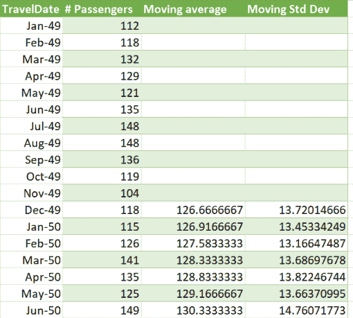

前 12 位显然是空的，因为我们至少需要 12 个值来开始平均。如果我们在同一个图表中显示所有内容，我们将看到类似于下图的图表:

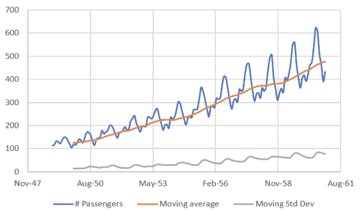

移动平均线更好地遵循序列的细节，我们将使用它作为*增加(TravelDate)* 的良好近似值。注意，移动标准差也随着时间增加，我们将在下一节中使用这个结果。

回到我们的时间序列模型，我们可以写:

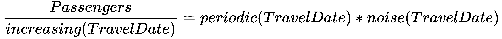

比率是列*乘客*和之前计算的移动平均值之间的比率。你会错过前 12 分，因为平均需要从某处开始，但这没关系。对于其余的行，您可以计算*乘客/移动平均值*，它近似于*乘客/增加(旅行日期)*。

4.  增加一个额外的列来计算这个比率。
5.  构建一个新图表来显示计算。您将看到类似下图的内容:

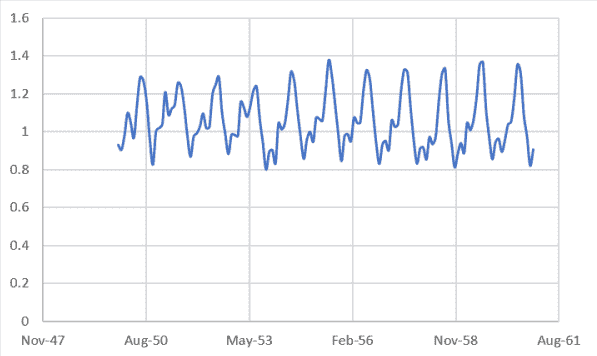

我们显然设法提取了增加的部分，但我们仍然有振荡和噪声的混合物。让我们通过依次重复前 12 个值来模拟*周期(旅行日期)。*

6.  在新列中，根据需要多次复制并粘贴前 12 个值，以填充相同数量的单元格。这些值将为您提供以下图表:

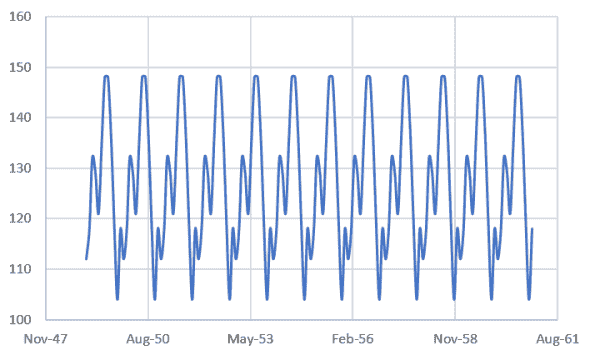

最后，我们将计算*噪声(TravelDate)* 。我们将再次从我们的模型中进行计算:

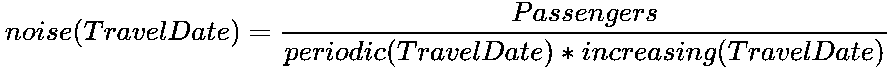

7.  在另一列中，使用前面的计算创建新图表:

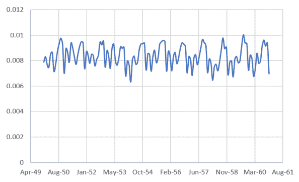

我们现在有了时间序列的完整模型，我们可以用它来预测未来的值！让我们一步一步来:

1.  打开一个新工作表。
2.  复制系列值并将时间段延长至`Dec-62`。
3.  在列`C`中，复制*周期(旅行日期)*值(两个相等系列的 24 个值，共 12 个值)。
4.  在`D`栏中，复制最近两年的噪声值。
5.  在列`E`，单元格 146 中，使用趋势线公式( *=0.0873*A146 - 1472* )计算*递增(旅行日期)*。
6.  把公式抄到表格的末尾。单元格`B1`如下所示:

*=C146*D146*E146*

然后同样的计算被复制下来。结果表如下所示:

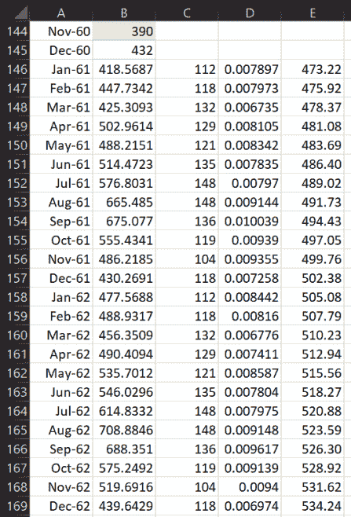

7.  插入一个新图表，包括原始数据系列和预测数据系列。

8.  在下图中，你可以看到预测相当不错！(或者说，至少它遵循了历史数据；预测质量的唯一真正衡量标准是将其与这些日期的真实数据进行比较):

我们遵循了必要的步骤，根据时间序列的特征并广泛使用计算和可视化来对其建模。我们将在下一节展示，这也可以通过使用 Excel 的内置功能自动实现。

# 在 Excel 中自动预测时间序列

既然我们已经艰难地预测了一个时间序列，理解了每一步，我们就可以用简单的方法了。我们将使用 Excel 的内置函数来预测未来的乘客数量。执行以下步骤:

1.  选择`TravelDate`、`Passengers`、*、*两列，对应时间和乘客数量。
2.  导航到主菜单中的数据。
3.  选择预测表(参见下面的截图以供参考):

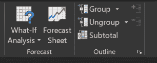

4.  将弹出一个窗口，显示预测预览，并让我们有机会通过单击选项来更改一些参数:

下图显示了包含可用选项的弹出窗口:

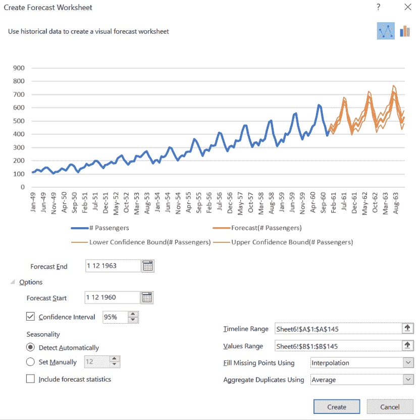

5.  时间轴范围和值范围是被选择的列(在我们的例子中是`TravelDate`和`Passenger`)。
6.  点击 Create *，*，我们获得三个新列:`Forecast`，`Lower Confidence Bounds (Passengers)`和`Upper Confidence Bounds (Passengers)`:

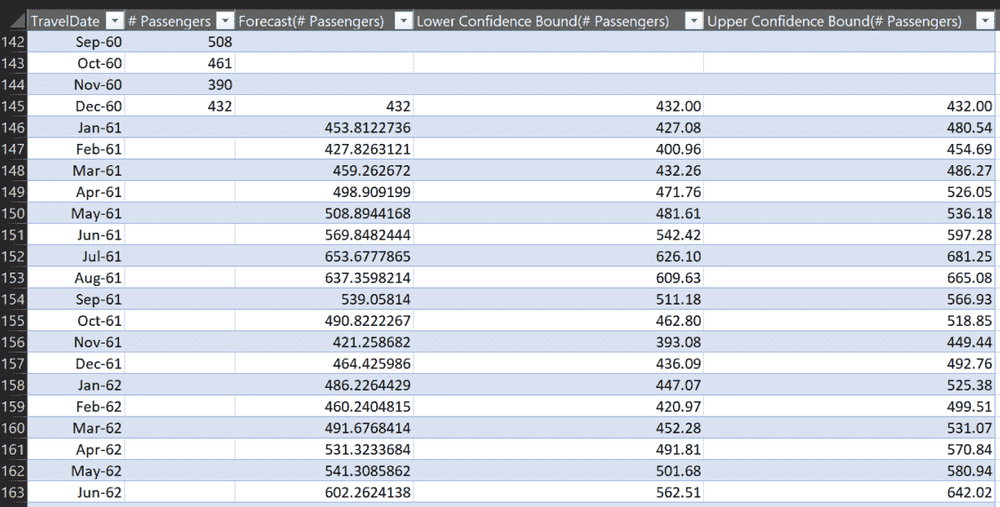

我们还将看到下图，显示了时间序列和预测值:

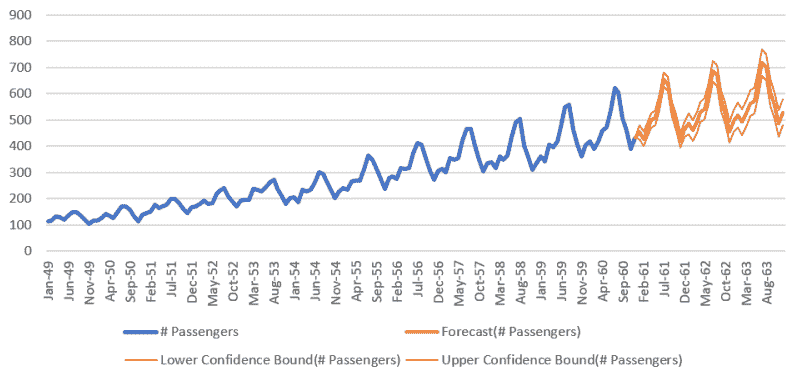

如果我们在弹出窗口中选择包括预测统计，我们将得到下表:

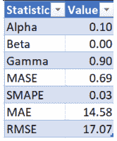

这些值对应于 Excel 内置的*预测。预测算法内部使用的 ETS.STAT* 函数。这些值的含义如下:

*   **Alpha** :测量数据点的权重。较高的值意味着我们对最近的数据点给予较高的权重。
*   **Beta** :衡量趋势的权重。较高的值意味着我们对最近的趋势给予较高的权重。
*   **Gamma** :这是衡量季节的权重。较高的值意味着我们对最近的季节周期给予较高的权重。
*   **平均绝对标度误差(MASE)** :测量预测的准确性。
*   **对称平均绝对百分比误差** **r (SMAPE)** :基于百分比误差测量精度。
*   **平均绝对百分比误差** **(AE)** :基于百分比误差测量精度。
*   **均方根误差(RMSE)** :测量预测值和观测值之间的差异。

我们已经解释了如何使用 Excel 的内置功能来分析和预测时间序列。在下一节中，我们将关注时间序列平稳性的重要性。

# 研究时间序列的平稳性

大多数时间序列预测方法依赖于序列是平稳的这一事实。这是有意义的，因为这增加了将来重复某种行为的可能性，并使预测更容易。

如何才能知道给定的时间序列是否平稳？有正式的统计方法来衡量这一点，但我们也可以看看这个系列的一些属性。实践中有三种主要的稳定性检查:

*   平均值是常数(不依赖于时间)。
*   方差是常数。
*   元素 *i* 和 *i+m* 的协方差是常数。

在我们之前的例子中，在*建模和可视化时间序列*部分，我们绘制了移动平均值和方差。如果重新查看图表，您会发现它们都不是随时间变化的常数，因此该序列是非平稳的，我们必须对其进行建模，以便能够预测值。

一个更正式的统计测试是 Dickey-Fuller 测试，这超出了本书的范围。这个测试不是由 Excel 自动完成的，但是有大量的外接程序可以执行它。手动操作毫无意义。

有两种方法可以消除季节性和趋势性:

*   将级数分解成噪声项、周期项和递增项的技术。
*   差分–也就是说，通过取值 *i* 和( *i+m* )之间的差来创建一个新的序列。位置差 *m* 称为**滞后**。

现在，您已经看到了基于对时间序列特征的详细理解，预测时间序列演变的不同方法。我们将展示更先进的预测方法，比如 ARIMA，当我们在[第十章](c4a815b7-95bc-4573-89cf-0399d293e3f6.xhtml)、 *Azure 和 Excel——云中的机器学习*中讨论使用来自 Excel 的 Azure 机器学习模型时。

可视化也是贯穿本章分析的一个关键要素。我们将在下一章看到不同的可视化技术，集中在它们特定的用例上。

# 摘要

我们已经看到了分解时间序列并预测其未来值的一步一步的方法。这可以帮助我们，至少在一般情况下，预测不同过程的结果。时间序列可以用图形和数字来研究，提取它们的特征，并利用它们来了解它们在未来的行为。我们还看到，这可以在 Excel 中自动完成，但存在将其用作黑盒的风险，并且不了解完整的预测方法。还有更高级的技术，我们将在以后的章节中讨论它们。

下一章将向您展示如何在 Excel 中构建一些基本的图表，以及如何使用它们来深入了解您的数据集。

# 问题

1.  在我们的预测中，我们使用 Excel 生成的趋势函数对时间序列的增长部分进行建模。我们也可以使用移动平均值。如何做到这一点？试试看，比较一下结果。
2.  更改季节性和置信区间的值，并研究预测图和参数如何变化。
3.  如何计算时间序列中两个值之间的协方差？
4.  使方差与时间无关的一种可能方法是取时间序列值的对数。在航空乘客系列中尝试这种方法，并检查方差的值。

# 进一步阅读

*   *时间序列分析及其应用*，作者 R.H. Shumway 和 D.S. Stoffer
*   *关于时间序列建模和预测的介绍性研究*，作者 Ratnadip Adhikari R. K. Agrawal