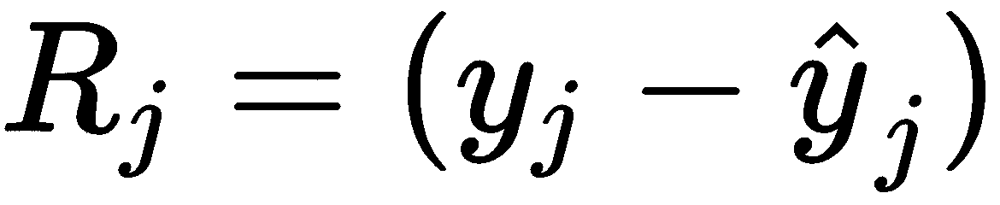
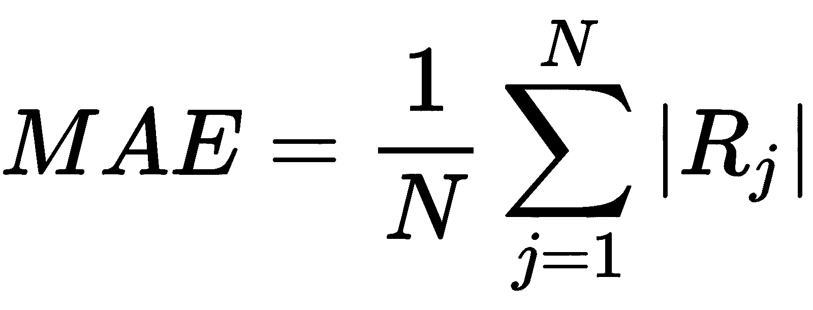
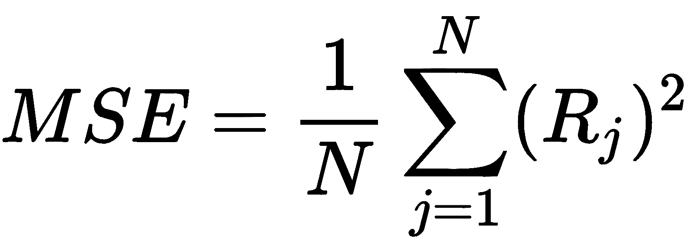
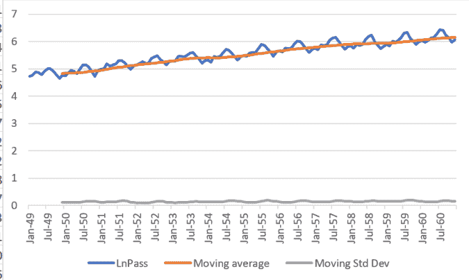

<title>Assessment</title> 

# 评价

<title>Chapter 1, Implementing Machine Learning Algorithms</title> 

# 第 1 章，实现机器学习算法

1.  在经典编程中，在计算机中开发和运行的代码是一组逐步的指令，告诉计算机做什么以及如何处理不同的选项。机器学习是向计算机展示数据的例子，或者通过例子教它做什么，或者让它学习隐藏在数据中的信息。
2.  机器学习模型可以是回归(如果目标变量是数值的和连续的)或分类(如果目标变量是分类的或离散的)。
3.  通过示例学习的模型，对标记的数据进行训练，被称为监督机器学习模型。相比之下，那些在未标记数据中找到信息的模型被称为无监督机器学习模型。
4.  以下是创建和使用机器学习模型时需要的主要步骤:
    1.  获取数据并合并不同的数据源
    2.  清理数据
    3.  初步分析和特征工程
    4.  为它们中的每一个尝试不同的模型和参数，通过使用完整数据集的一部分来训练它们，并使用其余部分进行测试
    5.  部署模型，以便它可以在连续的分析流程中使用，而不仅仅是在小的、孤立的测试中使用
    6.  预测新输入数据的值

4.  R [j] 残差是 *j* 数据点的 *y* 值与适合该点的回归线值之间的差值:

**平均绝对误差** ( **MAE** )定义如下:

**均方误差** ( **MSE** )定义如下:

4.  欠拟合是指模型不能代表数据集的特征。即使这看起来是正确的，但它完全缺乏普遍性。过度拟合指的是模型与训练数据拟合得如此之好，以至于它缺乏泛化能力，用不同的数据集测试它是错误的。
5.  首先需要将它们编码为二进制变量。

<title>Chapter 2, Hands-On Examples of Machine Learning Models</title> 

# 第 2 章，机器学习模型的实践例子

1.  编码准备分类特征，以便将它们馈送到机器学习模型中，并且不假设编码值之间的任何先验相关性。
2.  通过对树的长度设置限制或者通过定义最小熵值。
3.  `Temperature_hot`均分；两个值以`Train_outside` = yes 结尾，两个值以`Train_outside` = no 结尾，这代表最大熵值，这里没有明确的信息说明如果温度很热该怎么办。

4.  在决定是否进行户外训练时，将考虑以下`IF`陈述:
    *   如果天气晴朗，没有风，那就在户外训练。
    *   如果天气晴朗，有风，那就不要在户外训练。
    *   如果天气阴沉，那就在室外训练。
    *   如果天气潮湿多雨，就不要在室外训练。
    *   如果天气多雨，湿度正常，那么就在室外训练。

应该清楚的是，这个图只是一个例子，并没有涵盖从数据表中可以推导出的所有可能性。

5.  群集分布将取决于质心的初始选择。有更高级的构建集群的方法来避免这个问题。
6.  可视化聚类是基于二维图的，二维图只显示两个变量之间的关系。数值分析考虑了数据中的所有维度。

<title>Chapter 3, Importing Data into Excel from Different Data Sources</title> 

# 第 3 章，将不同数据源的数据导入 Excel

1.  不与文件内容混淆的任何字符。
2.  机器学习模型的结果会受到缺失或不正确的数据条目的影响，并且还应该使用正确的格式。
3.  导入 Excel 文件将打开电量查询界面，以便对数据进行预处理。
4.  表格形式的数据。
5.  详尽的列表可以在[https://gist . github . com/Geli Sam/13d 04 AC 5a 54 b 577 b 2492785 c 1084281 f](https://gist.github.com/gelisam/13d04ac5a54b577b2492785c1084281f)找到。
6.  一个例子可以在[https://stack overflow . com/questions/38120895/database-vs-file-system-storage](https://stackoverflow.com/questions/38120895/database-vs-file-system-storage)找到。

<title>Chapter 4, Data Cleansing and Preliminary Data Analysis</title> 

# 第 4 章，数据清理和初步数据分析

1.  与其手动构建决策树，不如深入研究示例内置的 Azure Machine Learning Studio，这在[第十章](c4a815b7-95bc-4573-89cf-0399d293e3f6.xhtml)、 *Azure 和 Excel -云中的机器学习*中有所展示。
2.  `cabin`和`fare`、`pclass`和`fare`、`home.dest`和`fare`就是一些例子。
3.  缺失值可以用变量的平均值来代替。
4.  数据集中的任何不平衡都被称为偏差。这将影响任何机器学习模型的结果，因为该模型将找到给定类别的更多示例或特定目标值的一些趋势。
5.  例如，您可以尝试使用散点图来查看变量之间的一些相关性。

<title>Chapter 5, Correlations and the Importance of Variables</title> 

# 第 5 章，相关性和变量的重要性

1.  例如，您可以用 x 轴上的分类值和 y 轴上的数值构建一个图表；从这张图中可以清楚地看出任何相互关系。
2.  读者应该很容易构建图表并理解变量之间的关系。
3.  不。这意味着当一个变量增加时，另一个变量减少。
4.  这种格式在第 6 章、*的[Excel 数据挖掘模型实践示例](f8d119b7-0a06-49f5-b1f6-7f0c220ff69c.xhtml)*中使用。
5.  我们将**的平方误差** ( **SSE** )计算为*(【@mpg]-[@prediction])^2*)。我们需要的另一笔款子是*SST =**(【@mpg]-average([@prediction]))^2】T9)。然后，我们计算 *R ² = 1-SSE/SST* 。*
6.  您可以尝试使用指数函数( *EXP()* )或其他类似形状的函数。R ² 值可能仍然远离 1，因为数据中的离差非常高。

<title>Chapter 6, Data Mining Models in Excel Hands-On Examples</title> 

# 第 6 章，Excel 中的数据挖掘模型动手示例

1.  利用之前对业务的了解来丢弃这些关联。
2.  不一定。这些类型的分析通常依赖于业务领域，甚至依赖于我们执行它们的特定地点。这意味着有些结果是可以推广的，但通常不是全部。
3.  这意味着没有客户在列中指示的时间之前开始购买产品，并且在行中显示的时间段之后继续购买。
4.  没有那么老的客户(就作为客户花费的时间而言)。
5.  例如，关注那些停止购买的人，并针对他们开展广告活动。

<title>Chapter 7, Implementing Time Series</title> 

# 第 7 章，实施时间序列

1.  通过将`increasing(TravelDate)`设置为计算中的移动平均值，并遵循相同的步骤。
2.  如果季节性与数据中的真实值相差太大，那么预测的准确性就会降低。如果我们增加置信区间，那么误差也会增加。
3.  使用 Excel 中的`COVARIANCE.P`函数。

4.  时序图，应用对数后，看起来会像下面的截图:

趋势仍在上升，但标准差看起来是平的，不依赖于时间。

<title>Chapter 8, Visualizing Data in Diagrams, Histograms, and Maps</title> 

# 第 8 章，在图表、直方图和地图中可视化数据

1.  很难区分不同的饼图切片。
2.  多个折线图。
3.  您可以从[https://openaddresses.io/](https://openaddresses.io/)获取数据，并按照本文中的说明进行操作:[https://www . rogue geographer . com/create-your-own-maps-using-excel-3d-maps/](https://www.roguegeographer.com/create-your-own-maps-using-excel-3d-maps/)。
4.  有可能做到，得到一个结果，但是精度会很差。选举的结果主要取决于数据没有考虑的外部因素，而不是过去选举的历史结果。

<title>Chapter 9, Artificial Neural Networks</title> 

# 第九章，人工神经网络

1.  结果将取决于人工神经网络的训练。你可以遵循[第一章](b0dde0bb-32ef-4535-9e19-7999e8e9a631.xhtml)、*实现机器学习算法*中*评估模型*小节的分步说明。
2.  数据集不平衡，这将影响结果。

<title>Chapter 10, Azure and Excel - Machine Learning in the Cloud</title> 

# 第 10 章，Azure 和 Excel——云中的机器学习

1.  成本、速度、全球规模、生产率、性能和安全性。
2.  云计算对许多不同的应用程序都很有用，事实上，它可以取代从数据库到可视化的内部构建的一切。
3.  Web 服务是托管在 internet 上的应用程序，它可以通过预定义的协议和数据格式与其他应用程序进行通信。使用 web 服务的优点是它们易于共享，并且独立于所使用的操作系统和编程语言。
4.  Azure Machine Learning Studio 需要输入数据格式，这是从输入数据模块获取的。
5.  训练流用于训练模型，然后保存它。然后在单独的流中使用相同的模型进行预测，而不需要在每次使用时重新训练模型。

<title>Chapter 11, The Future of Machine Learning</title> 

# 第 11 章，机器学习的未来

1.  数据挖掘取代了模型训练和测试，它试图从数据中获取有用的信息。
2.  新数据不断地被包含到数据流中，并且在将它馈送到机器学习模型之前，必须完成整个周期。
3.  在开始学习过程之前设置超参数值，并定义模型的一些特征(例如，人工神经网络训练模型中的周期数)。
4.  AutoML 可以自动执行以下步骤:
    *   数据预处理
    *   特征工程
    *   型号选择
    *   模型超参数的优化
    *   模型结果分析