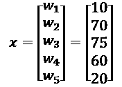
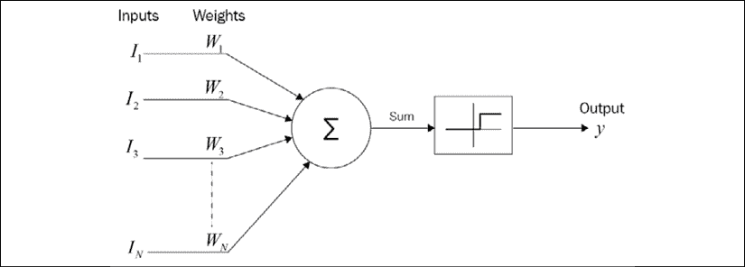
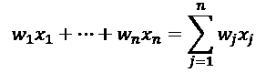
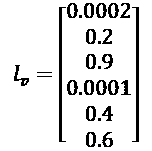
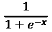
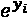
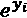
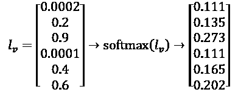

# 二、构建奖励矩阵——设计您的数据集

实验和实现是人工智能的两个主要途径。实验很大程度上需要尝试现成的数据集和黑盒、现成的 Python 示例。实现包括准备数据集、开发预处理算法，然后选择模型、合适的参数和超参数。

实现通常涉及白盒工作，需要确切了解算法如何工作，甚至能够修改它。

在*第一章*、*通过强化学习开始下一代人工智能*中，MDP 驱动的贝尔曼方程依赖于一个奖励矩阵。在这一章中，我们将通过白盒过程来创建奖励矩阵。

没有奖励矩阵，MDP 进程就无法运行。奖励矩阵决定了是否有可能从一个单元到另一个单元，从 A 到 b。例如，它就像一个城市的地图，告诉你是否允许你走一条街，或者这是一条单行道。它也可以设定一个目标，比如你想去的城市中的一个地方。

为了达到设计奖励矩阵的目的，其他系统、软件、传感器提供的原始数据需要经过**预处理**。如果数据没有经过**标准化**过程，机器学习程序将不会提供有效的结果。

奖励矩阵 *R* 将使用 TensorFlow 中的麦卡洛克-皮茨神经元构建。随着电子商务占据了许多营销领域，仓库管理已经呈指数级增长。本章介绍了自动导引车(AGVs)，它相当于仓库中的 SDC，用于存储和检索产品。

本章的挑战将是详细理解预处理阶段。经过处理的数据集的质量将直接影响任何机器学习算法的准确性。

本章涵盖以下主题:

*   麦卡洛克-皮茨神经元将获取原始数据并进行转换
*   逻辑分类器将开始神经网络过程
*   逻辑 sigmoid 会挤压这些值
*   softmax 函数将对这些值进行归一化
*   一键功能将为奖励矩阵选择目标
*   仓库中的 AGV 示例

这些主题形成了一系列工具，这些工具又形成了一个管道，将原始数据转化为奖励矩阵——MDP。

# 设计数据集——梦想停止、艰苦工作开始的地方

正如在前面的章节中一样，请记住现实生活中的项目会以某种形式经历三维方法。首先，重要的是思考和谈论需要解决的问题，而不是跳到笔记本电脑上。一旦做到这一点，请记住，机器学习和深度学习的基础依赖于数学。最后，一旦问题被讨论并以数学方式表达出来，就到了开发解决方案的时候了。

先想一个**自然语言**中的问题。然后，使成为一个问题的**数学描述**。只有这时你才应该开始**软件实现**。

## 设计数据集

第一章中描述的强化学习程序可以在无监督的决策过程中解决各种涉及无标签分类的问题。Q 函数可以应用于无人机、卡车或汽车交付。也可以应用于游戏或现实生活中的决策。

然而，在现实生活的案例研究问题中(例如，在仓库中为 AGV 定义奖励矩阵)，困难将是使用特有的**特征**产生一个有效的矩阵。

例如，AGV 需要来自不同来源的信息:每日预测和实时仓库流量。

该仓库管理着数千个位置和数十万个输入和输出。试图在模型中加入太多的特性会适得其反。删除功能和无价值的数据需要仔细考虑。

一个简单的神经元可以提供一种有效的方式来获得输入数据的**标准化**。

机器学习和深度学习经常用于预处理输入数据，以实现标准化、规范化和特征约简。

## 使用麦卡洛克-皮茨神经元

为了创建奖励矩阵， *R* ，用于处理仓库中大量输入的健壮模型必须减少到有限数量的特征。

例如，在一个模型中，成千上万的输入可以描述如下:

*   低优先级权重的预测产品到达: *w* [1] = 10
*   高优先级权重的已确认到达: *w* [2] = 70
*   销售部决定的非计划到货: *w* [3] = 75
*   具有高优先级权重的预测:*w*4= 60
*   已确认的到货，周转率低，因此重量轻: *w* [5] = 20

重量作为常数提供。麦卡洛克-皮茨神经元不修改权重。我们将从第八章、*开始看到感知器神经元使用前馈神经网络*解决异或问题。经验表明，修改权重并不总是必要的。

这些权重形成一个向量，如下所示:



向量的每个元素代表存储在最佳位置的产品特征的权重。该流程的最终阶段将为 MDP 生成一个奖励矩阵 *R* ，以优化仓库位置之间的路线。

让我们关注我们的神经元。通过这样的系统使用这些权重，每个神经元可以获得多达 50 个权重和参数。在这个例子中，实现了 5 个权重。然而，在实际情况下，许多其他参数也要考虑在内，例如未确认的到达、具有高优先级的未确认的到达、具有非常低优先级的已确认的到达、来自可能不符合安全标准的位置的到达、携带具有潜在危险并且需要特别注意的产品的到达等等。在这一点上，人类甚至经典软件都无法面对如此多样的参数。

奖励矩阵的大小为 6×6。它包含从 A 到 f 的六个位置。在本例中，`l1`到`l6`这六个位置是仓库存储和检索位置。

一个 6×6 的奖励矩阵代表了为六个地点实现的麦卡洛克-皮茨层的目标。

实验时，可以发明奖励矩阵 *R* ，用于测试目的。在实际实现中，您必须找到一种从头构建数据集的方法。奖励矩阵成为预处理阶段的输出。下面的源代码显示了第一章中使用的强化学习程序的输入。本章的目标是描述如何生成我们将在接下来的章节中构建的以下奖励矩阵。

```
# R is The Reward Matrix for each location in a warehouse (or any other problem)

R = ql.matrix([ [0,0,0,0,1,0],

                [0,0,0,1,0,1],

                [0,0,100,1,0,0],

                [0,1,1,0,1,0],

                [1,0,0,1,0,0],

                [0,1,0,0,0,0] ]) 
```

对于我们用于任何其他领域的仓库示例，麦卡洛克-皮茨神经元对之前描述的输入向量的权重求和，以填充奖励矩阵。

每个位置都需要它的神经元和它的权重。

*输入*->-*权重*->-*偏差*->-*值*

*   输入是仓库中的流程或任何形式的数据。
*   权重将在该模型中定义。
*   偏压用于稳定重量。偏见确实是它的意思。它会倾斜重物。这是非常有用的裁判，将保持重量在正确的轨道上。
*   值将是输出。

你可以想象出很多方法来创建奖励矩阵。本章描述了一种可行的方法。

## 麦卡洛克-皮茨神经元

麦卡洛克-皮茨神经元可以追溯到 1943 年。它包含输入、权重和激活函数。预处理阶段的一部分包括选择正确的模型。麦卡洛克-皮茨神经元可以有效地表示给定的位置。

下图显示了麦卡洛克-皮茨神经元模型:



图 2.1:麦卡洛克-皮茨神经元模型

该模型包含几个输入 *x* 权重，这些权重相加后要么达到一个阈值，该阈值将在变换后导致输出 *y* = 0，要么为 1。在这个模型中， *y* 将以更复杂的方式计算。

`MCP.py`用 TensorFlow 写的 2 将用来说明神经元。

在以下源代码中，TensorFlow 变量将包含输入值(`x`)、权重(`W`)和偏差(`b`)。变量代表图形的结构:

```
# The variables

x = tf.Variable([[0.0,0.0,0.0,0.0,0.0]], dtype = tf.float32)

W = tf.Variable([[0.0],[0.0],[0.0],[0.0],[0.0]], dtype =

    tf.float32)

b = tf.Variable([[0.0]]) 
```

在最初的麦卡洛克-皮茨人工神经元中，输入( *x* )乘以以下权重:



数学上的函数变成了神经元代码触发逻辑激活函数(sigmoid)的函数，这将在本章的第二部分解释。添加了 Bias ( `b`)，这使得这种神经元格式即使在今天也很有用，如下所示:

```
# The Neuron

def neuron(x, W, b):

    y1=np.multiply(x,W)+b

    y1=np.sum(y1)

    y = 1 / (1 + np.exp(-y1))

    return y 
```

在开始一个会话之前，麦卡洛克-皮茨神经元(1943)需要一个操作员来设置它的权重。这是麦卡洛克-皮茨神经元和感知器(1957 年)之间的主要区别，感知器是现代深度学习神经元的模型。感知器通过优化过程来优化其权重。*第 8 章*，*用前馈神经网络*解决异或问题，描述了为什么需要现代感知器。

现在提供了权重，以及每个输入值的数量，它们存储在位于*l*1 的 *x* 向量中，该仓库示例的六个位置之一:


权重值将除以 100，以给定位置的 0 到 1 的仓库流量值表示百分比。以下代码处理*一个*位置、*l*[1]**only**的选择、其值和参数:

```
# The data

x_1 = [[10, 2, 1., 6., 2.]]

w_t = [[.1, .7, .75, .60, .20]]

b_1 = [1.0] 
```

调用神经元函数，输入仓库流量的权重(`w_t`)和数量(`x_1`)。在该模式下，偏置被设置为`1`。没有需要初始化的会话；神经元的功能被称为:

```
# Computing the value of the neuron

value=neuron(x_1,w_t,b_1) 
```

神经元函数`neuron`将计算神经元的值。该程序返回以下值:

```
value for threshold calculation:0.99999 
```

该值表示位置*l*1 在给定日期和给定时间的活动。此示例仅代表要计算的六个位置中的一个。对于该位置，该值越高，越接近 1，该区域的可能饱和率越高。这意味着该位置几乎没有剩余空间来存放产品。这就是为什么仓库的强化学习程序正在寻找该模型中给定产品的**最小负载**区域。

每个位置都有一个可能的**可用性**:

*A* =可用性= 1–负载

给定存储点的负载概率介于 0 和 1 之间。

可用性的高值接近 1，低概率接近 0，如下例所示:

```
>>> print("Availability of location x:{0:.5f}".format(

...       round(availability,5)))

Availability of location x:0.00001 
```

例如， *l* [1] 的负载的大概取整负载为 0.99，其大概*可用性*最大为 0.002。AGV 的目标是搜索和找到最近和最可行的位置，以优化其轨迹。 *l* **负载**是生产或服务活动中的关键词。可用资源越少，负载率越高。

当麦卡洛克-皮茨神经元计算完所有六个位置的可用性时——每个位置都有各自的数量输入、权重和偏差——将产生该系统结果的位置向量。然后，需要实现该程序来运行所有六个位置，而不仅仅是通过递归使用一个神经元模型来运行一个位置:

*A*(*L*)= {*A*(*L*[1])，*A*(*L*[2])，*A*(*L*[3])， *a*

神经元的可用性，1–*输出值，构成一个六线向量。下面的向量， *l* [v] ，将通过在**所有**六个位置上运行之前的样本代码来获得。*



如前公式所示， *l* [v] 是包含给定 AGV 的每个位置值的向量，以供选择。向量中的值代表可用性。0.0002 表示可用性很小；0.9 表示高可用性。有了这个选择，MDP 强化学习程序将优化 AGV 的轨迹，以到达这个特定的仓库位置。

*l*v 是 AGV 的六个潜在位置的加权函数的结果。它也是转换输入的向量。

## Python-TensorFlow 架构

下图显示了麦卡洛克-皮茨神经元的实现:


图 2.2:麦卡洛克-皮茨神经元的实现

数据流图也有助于在经典计算出错时优化程序。

# 逻辑激活功能和分类器

既然 *L* = { *l* [1] ， *l* [2] ， *l* [3] ， *l* [4] ， *l* [5] ， *l* [6] 从那里，可以构建*第 1 章*、*通过强化学习开始下一代人工智能*中描述的 MDP 过程的奖励矩阵 *R* 。

## 整体架构

此时，整体架构包含两个主要组件:

1.  **第 1 章**:基于价值-行动 Q 函数的强化学习程序，使用奖励矩阵，将在本章中完成。奖励矩阵在第一章中作为实验提供，但是在实现阶段，您经常需要从头开始构建它。有时需要几个星期才能产生一个好的回报矩阵。
2.  **第二章**:设计一组 6×1 的神经元，代表给定时间内六个位置的产品流。输出是从 0 到 1 的可用性概率。最高值表示最高可用性。最低值表示最低的可用性。

此时，我们可以通过一个示例从这两个主要函数中获得一些实际信息:

*   AGV 在仓库中自动移动，并等待接收下一个位置，以使用 MDP 来计算其任务的最佳轨迹。
*   AGV 使用的是奖励矩阵， *R* ，它是在实验阶段给出的，但需要在实现过程中进行设计。
*   已经计算了六个神经元的系统，每个位置一个，对真实量和可能量进行加权以给出可用性向量*l*v。它几乎准备好为 AGV 提供必要的奖励矩阵。

为了计算该强化学习仓库模型中奖励矩阵的输入值，在*l*v[v]和奖励矩阵 *R* 之间缺少一个桥接函数。

该桥接功能是一个基于 *n* 个神经元的输出的逻辑分类器，这些神经元独立地或递归地执行相同的任务。

此时，系统:

*   拿走了公司数据
*   用 *n 个*神经元计算出权重
*   应用了激活功能

这个模型中的激活函数需要一个逻辑分类器，一个常用的分类器。

## 逻辑分类器

逻辑分类器将应用于*l*v[v](六个位置值)以找到 AGV 的最佳位置。这种方法可以应用到任何其他领域。它基于六个神经元的输出，如下所示:

*输入* × *重量* + *偏差*

什么是后勤职能？逻辑分类器的目标是为输出向量的每个值生成从 0 到 1 的概率分布。正如你到目前为止所看到的，人工智能应用程序使用具有可能值的应用数学，而不是原始输出。

主要原因是机器学习/深度学习对于可行的同质数据分布的标准化和规范化效果最好。否则，算法将经常产生欠拟合或过拟合的结果。

例如，在仓库模型中，AGV 需要选择最佳的、最有可能的位置， *l* [i] 。即使在一个组织良好的公司仓库中，许多不确定性(迟到、产品缺陷或一些计划外的问题)也会降低选择的概率。概率表示 0(低概率)和 1(高概率)之间的值。逻辑函数提供了将所有数字转换成 0 到 1 之间的概率的工具，以便*标准化*数据。

## 物流功能

逻辑 sigmoid 提供了一种最好的方法来标准化给定输出的权重。神经元的激活功能将是逻辑 s 形。阈值通常是一个值，高于该值，神经元具有 *y* = 1 的值；否则它的值为 *y* = 0。在这个模型中，最小值将是 0。

逻辑函数表示如下:



*   *e* 代表欧拉数，或 2.71828，自然对数。
*   *x* 是要计算的值。在这种情况下， *s* 是逻辑 sigmoid 函数的结果。

在下面的示例中，代码被重新排列，以显示产生神经元的输出`y`的推理过程:

```
 y1=np.multiply(x,W)+b

    y1=np.sum(y1)

    y = 1 / (1 + np.exp(-y1)) #logistic Sigmoid 
```

由于逻辑 sigmoid 函数，模型中第一个位置的值在 0 和 1 之间被压缩为 0.99，这表明该位置很有可能已满。

考虑到 0.99 的值后，为了计算位置的可用性，我们从总可用性(1)中减去负载，如下所示:

可用性= 1–满的概率(值)

或者

可用性= 1–价值

如前所述，一旦以这种方式计算了所有位置，就获得了最终的可用性向量，*l*v。


在分析*l*v 时，一个问题停止了进程。单独来看，每一行似乎都很好。通过将逻辑 sigmoid 应用于每个输出权重并将其从 1 中减去，每个位置将显示介于 0 和 1 之间的可能可用性。但是*l*v 中的行之和超过 1。这是不可能的。概率不能超过 1。程序需要解决这个问题。

每一行都产生一个[0，1]解，它满足有效概率的前提条件。

在这种情况下，向量*l*v 包含多个值，成为概率分布。*l*v 之和不能超过 1，需要归一化。

*softmax* 功能提供了一个极好的方法来标准化*l*v。Softmax 广泛应用于机器学习和深度学习。

记住*数学工具不是规则*。只要你的解决方案有效，你就可以根据你的问题调整它们。

## Softmax

softmax 函数出现在很多人工智能模型中，用来归一化数据。Softmax 可用于分类和回归。在我们的示例中，我们将使用它来查找 MDP 的优化目标。

在仓库示例的情况下，AGV 需要在*l*v[v]矢量中的六个位置之间做出可能的选择。然而，*l*v 值的总和超过 1。 *l* [v] 需要 softmax 函数的归一化， *S* 。在源代码中，*l*v 向量将被命名为`y`。


下面使用的代码是`SOFTMAX.py`。

1.  `y`代表了*l*v 矢量:

    ```
    # y is the vector of the scores of the lv vector in the warehouse example:  y = [0.0002, 0.2, 0.9,0.0001,0.4,0.6] 
    ```

2.  是`y` ( * l * [v] )中每个值的 *exp* ( *i* )结果，如下:

    ```
    y_exp = [math.exp(i) for i in y] 
    ```

3.  是的和，如下面的代码所示:

    ```
    sum_exp_yi = sum(y_exp) 
    ```

现在，向量的每个值通过应用以下函数进行归一化:

```
softmax = [round(i / sum_exp_yi, 3) for i in y_exp] 
```



soft max(*l*v)提供了一个和等于 1 的归一化向量，如这个压缩版本的代码所示。获得的向量通常被描述为包含逻辑。

以下代码显示了 softmax 函数的一个版本:

```
def softmax(x):

    return np.exp(x) / np.sum(np.exp(x), axis=0) 
```

*l*v 现在由 soft max(*l*v 归一化如下。


softmax 函数的最后一部分需要将 soft max(*l*v)四舍五入为 0 或 1。soft max(*l*v 中的值越高，可能性越大。在清晰的转换中，最大值接近 1，其他值接近 0。在决策过程中，最高价值需要建立如下:

```
print("7C.

Finding the highest value in the normalized y vector : ",ohot) 
```

输出值为`0.273`，已被选为最可能的位置。然后它被设置为 1，其他较低的值被设置为 0。这被称为一键功能。这个一键功能对于编码所提供的数据非常有帮助。现在可以将获得的向量应用于奖励矩阵。在 *R* 奖励矩阵中，值 1 概率将变为 100，如下所示:


softmax 功能现已完成。位置*l*3 或 **C** 是 AGV 的最佳方案。概率值乘以 100，奖励矩阵 *R* 现在可以接收输入了。

在继续之前，花些时间试验源代码中的值，并运行它以熟悉 softmax 函数。

我们现在有了奖励矩阵的数据。理解项目数学方面的最佳方式是使用从位置 **A** 到 **F** 的实际仓库布局在一张纸上画出结果。

```
Locations={l1-A, l2-B, l3-C, l4-D, l5-E, l6-F} 
```

奖励矩阵的行**C**= { 0，0，100，0，0，0}，其中 **C** (第三个值)现在是自动驾驶车辆的目标，在这种情况下，是仓库中的 AGV。


图 2.3:仓库运输问题的图示

我们得到下面的奖励矩阵， *R* ，在*第一章*，*通过强化学习开始下一代人工智能*中描述:

| **状态/值** | **答** | **B** | **C** | **D** | **E** | **F** |
| **答** | - | - | - | - | 一 | - |
| **B** | - | - | - | 一 | - | 一 |
| **C** | - | - | 100 | 一 | - | - |
| **D** | - | 一 | 一 | - | 一 | - |
| **E** | 一 | - | - | 一 | - | - |
| **F** | - | 一 | - | - | - | - |

这个奖励矩阵正是 Python 强化学习程序中使用的矩阵，它使用了第一章中的 Q 函数。因此，本章的输出是 *R* 矩阵的输入。0 值是为了让代理避开这些值。1 值表示可到达的小区。C×C 单元中的 100 是 softmax 输出的结果。该程序旨在接近具有正值的概率标准，如以下取自第 1 章的`mdp01.py`的 *R* 矩阵所示:

```
R = ql.matrix([ [0,0,0,0,1,0],

                [0,0,0,1,0,1],

                [0,0,100,1,0,0],

                [0,1,1,0,1,0],

                [1,0,0,1,0,0],

                [0,1,0,0,0,0] ]) 
```

此时:

*   本章中函数的输出生成了一个奖励矩阵， *R* ，这是第 1 章*通过强化学习开始下一代人工智能*中描述的 MDP 的输入。
*   《MDP 进程》在第一章中设定为 5 万集。
*   MDP 的输出有多种用途，正如我们在本章和第 1 章中看到的。

正如我们将在*第 3 章*、*机器智能-评估函数和数值收敛*中看到的，构建模块已经到位，可以开始评估强化学习程序的执行和性能。

# 摘要

在一层网络中使用具有逻辑激活函数的麦卡洛克-皮茨神经元来构建用于强化学习的奖励矩阵展示了预处理数据集的一种方式。

处理现实生活中的数据通常需要通过 softmax 函数对逻辑 sigmoid 函数进行一般化，并对 logits 应用一键函数对数据进行编码。

机器学习功能是工具，必须理解为能够使用它们的全部或部分来解决问题。有了这种实用的人工智能方法，整个世界的项目都在等着你。

这种神经元方法是多层感知器的母体，将在第 8 章、*开始介绍，用前馈神经网络*解决异或问题。

这一章从实验性的黑盒机器学习和深度学习到白盒实现。实现需要对机器学习算法的充分理解，而这些算法通常需要微调。

然而，人工智能超越了理解机器学习算法。机器学习或深度学习需要评估函数。如*第 3 章*、*机器智能-评估功能和数值收敛*中所述，没有评估功能就无法验证性能或结果。

在下一章中，将通过展示人类智能极限和机器力量崛起的例子来说明机器智能的评估过程。

# 问题

1.  原始数据可以是神经元的输入，并用权重进行转换。(是|否)
2.  神经元需要阈值吗？(是|否)
3.  逻辑 sigmoid 激活函数使得权重之和更大。(是|否)
4.  麦卡洛克-皮茨神经元对其输入的权重求和。(是|否)
5.  逻辑 sigmoid 函数是 log10 运算。(是|否)
6.  如果对向量应用逻辑 sigmoid 函数，则不需要逻辑 softmax。(是|否)
7.  概率是介于-1 和 1 之间的值。(是|否)

# 进一步阅读

*   最初的麦卡洛克-皮茨神经元 1943 年论文:[http://www.cse.chalmers.se/~coquand/AUTOMATA/mcp.pdf](http://www.cse.chalmers.se/~coquand/AUTOMATA/mcp.pdf)
*   TensorFlow变量:[https://www.tensorflow.org/beta/guide/variables](https://www.tensorflow.org/beta/guide/variables)