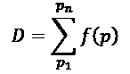
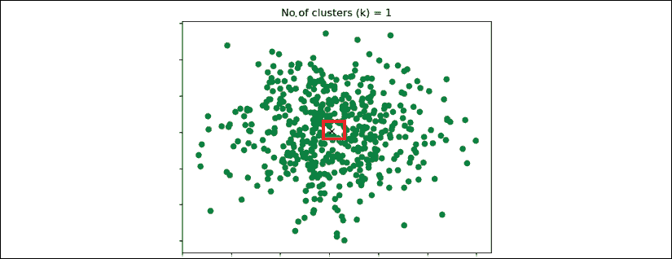
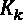
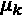
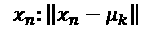
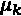
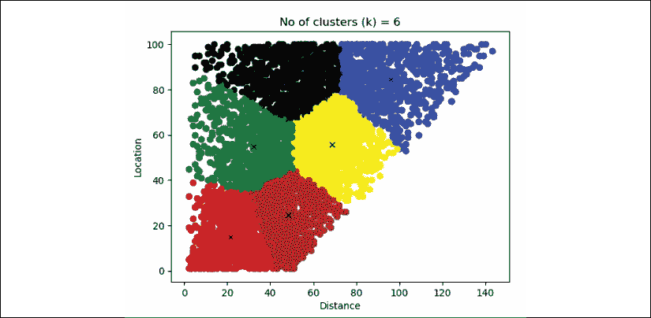
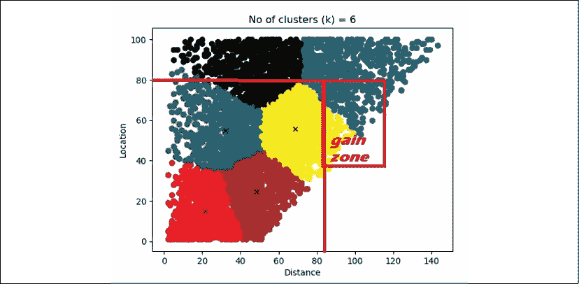

# 四、使用 K 均值聚类优化您的解决方案

不管我们知道多少，关键点是交付一个**人工智能** ( **AI** )解决方案的能力。实现一个**机器学习** ( **ML** )或**深度学习** ( **DL** )程序仍然很困难，并且随着技术以指数级的速度进步，将变得更加复杂。

没有简单或容易的方法来设计人工智能系统。一个系统不是有效率就是没有效率，不仅仅是简单或者不简单。要么设计的人工智能解决方案提供了现实生活中的实际用途，要么它构建成一个无法在超出其训练集范围的各种环境中工作的程序。

这一章不涉及如何建立最困难的系统来展示我们的知识和经验。它面对的是现实生活中分娩的硬道理和克服障碍的方法。例如，如果没有正确的数据集，您的项目将永远不会成功。即使是无人监管的 ML 程序也需要某种形式的可靠数据。

道路上、火车上、空中、仓库中以及越来越多的外层空间中的运输路线需要良好调整的 ML 算法。电子商务的惊人扩张产生了巨大的自动导引车(AGV)仓库运输需求，然后通过公路、火车或飞机运送产品。距离计算和优化现在是许多领域的核心目标。AGV 优化其仓库距离以装载或卸载卡车，这将使客户的存储和交付过程更快，他们希望他们的购买立即到达。

本章提供了使用 k-means 聚类(一种关键的 ML 算法)来克服日常 AI 项目障碍所需的方法和工具。

本章涵盖以下主题:

*   设计数据集
*   设计矩阵
*   降维
*   确定训练集的容量
*   k 均值聚类
*   无监督学习
*   训练数据集的数据调节管理
*   劳埃德算法
*   构建 Python k-means 聚类程序
*   超参数
*   测试数据集和预测
*   用 Pickle 保存和使用 ML 模型

我们将从讨论如何优化和管理数据集开始。

# 数据集优化和控制

在某种程度上，经理或客户不可避免地会向人工智能专家询问 ML 项目所需的确切数据，以及需要的格式。提供一个答案将需要一些艰苦的思考和工作。

有人可能会问为什么数据不开放，就像我们下载现成的数据集来学习人工智能算法一样。在企业生活中，有安全规则和流程。所需的数据通常位于一台或多台服务器上。你不会被允许做任何你想做的事。你必须具体说明你的需求和要求。以人工智能所需的方式获取数据对企业来说是有成本的。你必须证明你的要求是正当的。

从正确设计数据集和选择正确的 ML 模型开始。数据集和 ML 模型将满足优化 AGV 距离的基本要求。给定仓库中的每辆 AGV 都必须缩短从码头(船只可能在此卸货)到存储区、从一个存储区到另一个存储区(例如包装)以及从存储区到码头的距离。这将降低仓库的总成本，实现利润最大化。

## 设计数据集和选择 ML/DL 模型

理论上，为 AGV 找到一个好的模型可以归结为最小化从 A 点到 b 点的距离。让我们考虑一个场景，我们想把产品从仓库移到码头。距离的总和 *D* 可以是测量过程的一种方式:



*f* ( *p* )代表从仓库位置到码头的动作及其代表的距离。它把你从你在商店里买东西的地方带到你出去的时候商店的门口。你可以想象一下，如果你从那个位置直走，付钱，出门，那么那就是最短的路。但如果你拿起产品，先逛逛店铺，再出门，距离(和时间)就更长了。例如，在这家商店里闲逛的所有人的所有距离的总和是 *D* 。

在任何自引导 bot 系统中要解决的问题的概念可以总结如下:

**找到流浪者**

机器人怎么会游荡？它是自动的，通常由高效的 ML 程序指导。但是，像任何其他形式的交通工具一样，机器人经常会遇到障碍。

当机器人遇到障碍时，它要么停下来，等待，要么选择另一条路线。

我们现在有了一个研究和实现的范例:

*   探测流浪者
*   优化机器人的选择

我们都知道从位置 A 到位置 B 的最短点是一条直线。对吗？嗯，在仓库里，就像在生活中一样，它并不总是正确的！假设你正开车从 A 地直线前往 B 地，但是遇到了严重的交通堵塞。相对较短的距离可能需要很长时间。如果你向右转，绕过拥堵的路段，你可能会节省很多时间。你最终会消耗更多的汽油，从 A 地开车到 B 地的成本也会上升。你是一个流浪者。

在现实交通中，你能做的不多。您不能决定汽车只能在特定时间行驶在从 A 到 b 的道路上。您也不能决定将汽车发送到交通流量最小的位置。在现实生活中，这将意味着告诉司机去另一个商场，另一家餐馆，或任何其他类似的地方，以避免交通堵塞。那不行！

但是如果你是一个可以控制所有 AGV 的仓库经理，你可以做很多事情。您可以确保 AGV 在很短的距离内快速到达目的地，然后回来为其他 AGV 腾出空间，从而降低成本。你可以发现流浪者，并配置你的时间表和 AGV，使他们的成本最小化，利润最大化。无利不起仓。

### 设计矩阵的批准

计划是首先获得尽可能多的数据，然后选择一个 ML/DL 模型。该数据集必须包含机器人(AGV)在某一天前往码头途中的所有位置。这是从位置到码头的分析。他们的距离记录在他们的系统中，以提供一个优秀的设计矩阵的基础。设计矩阵每行包含一个不同的示例，每列是一个特征。以下格式符合需要:

| **指数** | **Bot #** **(AGV)** | **开始(从位置)** **时间戳:** **yyyy，mm，dd，hh，mm** | **结束(在码头)** **时间戳:** **yyyy，mm，dd，hh，mm** | **地点** | **桥墩编号** | **距离**米**米** |
| 001 | 一 | 年月日小时分 | 年月日小时分 | 80 | 七 | 92 |
| 002 | 2 |  |  |  |  |  |
| 003 | 3 |  |  |  |  |  |
| 004 | 四 |  |  |  |  |  |
| 005 | 5 |  |  |  |  |  |

设计矩阵是设计 ML 解决方案的最佳方式之一。在这种情况下:

*   **索引**:机器人的任务号
*   **机器人号**:识别车辆
*   **开始**:当机器人离开一个位置时的时间戳
*   **End** :当机器人到达一个码头，一辆卡车正在那里等待装货时的时间戳
*   **位置**:仓库中产品应该被取回的位置
*   **距离**:该位置到桥墩的距离，单位为米

在公制中，距离用米表示。公制是世界上最可靠的测量系统，因为它以 10 为基数，无需转换。

一码必须除以 3 才能得到英尺。一英尺必须分成 12 份才能得到英寸。为了在较小的单元中工作，1/16 英寸可能是必要的。

一米是 100 厘米，一厘米是 10 毫米，那么我们可以用 1/100 毫米，以此类推。

使用公制系统运行您的计算，即使您必须以其他测量单位生成报告。

#### 获得设计矩阵格式的批准

现实生活中的实现不同于实验现成的可下载数据集。信息在公司里不容易获得。

在这个例子中，在现实生活中，让我们假设:

*   机器人编号不是存储在主机中，而是存储在管理 AGV 的本地系统中。
*   在主机中，有一个开始时间，即 AGV 在该位置装载货物的时间，以及到达码头的结束时间。
*   该位置可以在主机和码头中获得。
*   没有记录距离。

有必要访问 AGV 本地系统中的数据，以检索 AGV 编号并将其与主机中的数据相关联。

然而，在一个大型组织中，事情并不那么简单。例如:

*   本财年可能无法从 AGV 导航系统中检索数据。那些车辆很贵，没有额外的预算可以分配。
*   没有人知道从一个地点到码头的距离。只要 AGV 能在正确的码头准时交付正确的产品，到目前为止还没有人对距离感兴趣。
*   主机中的 AGV 任务代码与本地 AGV 引导系统中的任务代码并不相同，因此在没有开发的情况下，它们无法合并成一个数据集。

一个人工智能项目，像任何其他项目一样，可以很快溜走。如果一个项目停滞不前，它可能会被搁置。设计数据集需要想象力和反应能力。

保持人工智能项目的活力意味着快速行动。

如果这个项目不能快速提升，它将会失去动力。该项目的参与者将转向对他们的公司和职业发展更快的其他项目。

假设您的项目停止了，因为没有人能提供您构建模型所需的距离。如果你有开始时间、结束时间和速度，那么你可以解决这个问题，自己计算距离。如果你的团队不能很快找到这个解决方案，那么这个项目将会停滞不前。最高管理层会说，团队花费太多，无法专注于一个没有进展的项目，无论如何。这个项目可以当场被搁置。

降维不仅对 AI 模型有帮助；这也将使收集信息变得更加容易。

#### 降维

维数减少可以用于减少例如图像中的特征数量。例如，3D 图像的每个像素都与一个神经元相关联，而神经元又通过某种形式的功能将图像呈现为 2D 视图。例如，将彩色图像转换成现在的灰色图像的阴影就可以做到这一点。一旦这样做了，简单地将值减少到例如 1(亮)或 0(暗)，使得网络更容易。使用转换为 0 和 1 像素的图像使一些分类过程更加有效，就像我们在路上躲避汽车一样。我们只是看到目标并避开它。

我们整天都在进行降维。当你从一个办公室走到同一层楼的另一个办公室时，不需要楼梯或电梯，你不会认为地球是圆的，你走的是一条轻微的曲线。

你已经完成了一次**维度缩减**。你也在执行**歧管**操作。这意味着在当地，在那一层，你不需要担心地球的全球圆度。你在降维表示中对地球的多维视角足以让你从你的办公室到那层的另一个办公室。

当你拿起你的咖啡时，你专注于不要错过它，瞄准它的边缘。你不会考虑杯子的每一个特征，比如它的大小、颜色、装饰、直径以及里面咖啡的确切体积。你辨认出杯子的边缘，然后拿起它。那就是降维。没有降维，什么都做不成。在这种情况下，你需要花 10 分钟来分析这杯咖啡并拿起它！

当你拿起那杯咖啡时，你试着看看它是太热、太冷，还是刚刚好。你不能把温度计放在杯子里来获得精确的温度。你再次对那杯咖啡的特征进行了降维。此外，当你拿起它时，你通过观察杯子周围的微小距离计算出一个流形表示，减少了你周围信息的维度。你不用担心桌子的形状，另一边是否脏，以及其他特征。

ML 和 DL 技术(如降维)可以被视为工具，可以用于任何领域，以加快计算时间。

虽然我们经常把降维和 ML、DL 联系在一起，但是降维和数学甚至人类一样古老！很久以前，有人去了海滩，看到了美丽的太阳。那个人，人类第一次，在沙地上画了一个圈。这个圆圈不像太阳那样是 3D 的，也没有颜色，但是那个人周围的人都很惊讶:

*   一群人正在看太阳
*   一个人类把颜色去掉了
*   人类也取出了 3D 视图
*   他们用一个小得多的维度空间中的圆来代表太阳
*   第一位数学家诞生了！

k-means 聚类算法提供了一种有效的方法来表示我们在本章中处理的 bot 示例。每个位置将形成一个集群，这将在下一节中解释。

缺失数据问题的解决方法是使用以下数据格式运行 k-means 聚类算法:

| **指数** | **地点** | **从位置开始:时间戳:yyyy，mm，dd，hh，mm** | **结束于位置:时间戳:yyyy，mm，dd，hh，mm** |
| 001 |  |  |  |

#### 训练数据集的容量

在这个模型中，我们将重点对六个地点进行分析。在主仓库中选择了六个位置，有一组卡车装载点。考虑到大约 5000 个例子，这应该代表了 AGI-艾**购买的所有 25 辆 AGV 一天 24 小时运行的工作。**

既然我们已经讨论了优化和控制数据集，让我们继续提出实际的解决方案。在下一节中，我们将讨论 k-means 聚类的实现。

# 实现 k 均值聚类解决方案

数据集需要预处理才能转换成原型，以证明项目的财务价值。

在不知道 ML 解决方案代表多少利润和完成工作的成本的情况下，永远不要在企业环境中实现 ML 解决方案。没有利润，公司就无法生存。像其他投资一样，ML 必须提供投资回报(ROI)。在我们的案例中，ML 将通过缩短 AGV 距离来降低仓库中的运输成本。

## 愿景

涉及机器人的 ML 项目的主要目标可以总结为一句话:通过优化机器人活动来寻找利润。实现这一目标将导致获得全面项目的预算。

提供的数据不包含距离。但是，可以对每个位置进行如下估计:

距离=(结束时间-开始时间)/机器人的平均速度

在这种特殊的仓库配置中，开始位置通常是码头附近的装载点。

### 数据

提供的数据包含开始时间*s*t，结束时间*end*t 以及交货地点。为了计算距离，我们可以使用以下等式:

*d*I(*ll*)=(*end*[t]–*s*[t])/*v*

*   *v*= AGV 每分钟的速度
*   *结束*t–*s*t[t]以分钟表示
*   *d*[I]= AGV 在给定时间内行驶的预计距离

预处理程序将读取初始文件格式和数据，并输出一个新文件`data.csv`，该文件采用以下降维格式，具有两个特征:

| **距离** | **位置** |
| 55 | 53 |
| 18 | 17 |

#### 条件管理

数据调节意味着准备将成为系统输入的数据。**调理不好**会有两种结果:

*   不良数据包含无影响的噪声(大量小错误)
*   包含影响结果的噪声的坏数据(无论数量多少，数据都会影响结果)

在这种特殊情况下，让我们假设在为数据集提供的 5，000 条记录中，有 25 条距离是不可靠的。0.005%的噪声水平应该不成问题。可接受的噪音量取决于每个项目。它不能是一个任意的数字。

有时候，噪音会产生深远的影响，有时候不会。假设 5000 条记录中有 2500 条包含噪声。也许剩下的 2500 份记录提供了足够多的样本来产生一个可靠的结果。在另一种情况下，也许，5000 个记录中的 10 个缺失的样本会停止一个项目，因为这 10 个样本是唯一一种特殊的样本，可能会严重改变计算。

你必须试验并确定一个给定项目可接受的噪音水平。

让我们动手分析数据。

位置编号从#1 开始。#1 靠近产品的装载点。机器人必须将产品带到这一点。更准确地说，在这个仓库配置中，机器人去取一箱(或一箱)产品，并将它们带回位置 1。在地点 1，人们检查产品并包装它们。之后，人们小心翼翼地将产品装入运输卡车。

从一个地方到下一个地方的距离大约是 1 米。例如，从位置 1 到位置 5 的距离约为 5 米，即 5 米。此外，由于在此模型中，AGV 的所有位置都通向位置 1，因此理论距离将从位置 1 开始计算。为了概括该规则并定义位置 *lj* 的距离*d*I，可以简化计算:

*d*I(*LJ*)=*LJ*

*d*I 以米表示。由于位置从 1 号到 *n* 号开始，位置号等于机器人离开的第一个位置的大概距离。

让我们假设，查看数据，很快就会发现许多距离比它们的位置数更好。这很奇怪，因为距离应该大约等于位置。因此，通过减少维度的数量和关注主要特征的近似值，可以表示关键概念。

是时候制定一个策略和计划了。

### 战略

在所有的 ML 项目中，有一些关键的标准公司指导方针是不应该避免的:

*   快速撰写概念证明(POC)。POC 将证明 ML 解决方案是有效的。在这种情况下，bot 活动将被可视化。
*   详细检查结果。
*   使用尚未找到的解决方案计算潜在的优化利润。利润会证明投资是合理的。成本可以是一个指标。但是，对于一个给定的公司来说，成本的降低必须足以大幅度增加利润。
*   用一个坚实的案例获得批准，并为项目获得绿灯。

既然我们的战略已经明确，我们可以选择一种模式。对于这个项目，k-means 聚类是一个很好的开始算法。它将创建几乎代表 AGV 应该位于的区域的集群。通过选择简单的尺寸，视觉表示足够接近用户理解计算的实际情况。

## k 均值聚类程序

k-means 聚类是一种强大的无监督学习算法。我们在生活中经常会进行 k-means 聚类。举个例子，你想为一个大约 50 人的团队组织一次午餐，地点是一个刚好能容纳这些人的开放空间。

你的朋友和另一个朋友首先决定在中间放一张桌子。你的朋友指出，那个房间的人会形成一个大集群 *k* ，在几何中心(或形心) *c* 只有一张桌子，就不实用了。靠近墙的人将无法访问主表，如下图所示。



图 4.1:人们试图聚集在一张桌子周围的场景

不靠近桌子(中间的矩形)的人不容易接近桌子。

你现在试试两个表(质心)*c*1 和*c*2 在各个地方给两个集群的人*k*1 和*k*2。

人*X*1 到*X*n 组成一个数据集 *X* 。想象 *X* 的时候，好像桌子没放对地方。

最好的方法是移动一张桌子 *c* ，然后估计人们(是 *X* 的子集)到桌子的平均距离在他们的组或群 *k* 中大约相同。另一个表也是如此。你用粉笔在地板上画一条线，以确保每个小组或集群距离其桌子的平均距离。

这种直观的 k 均值聚类方法可以总结如下:

*   **步骤 1** :你已经用粉笔画了线，通过查看表格 *c* 的平均距离来决定每个人 *x* 将在哪个组(集群 *k* )。
*   **步骤 2** :你已经相应地移动了表格，以优化步骤 1。

模拟使用 k-means 聚类计算的三表模型的 Python 程序将产生以下结果:


图 4.2:通过 k 均值聚类计算的三表模型

提供了一个直观的例子后，让我们来谈谈 k-means 聚类的数学定义。

### k-均值聚类的数学定义

数据集 *X* 提供 *N* 个点。这些点或数据点是通过将距离用作笛卡尔表示中的 *x* 轴，将位置用作笛卡尔表示中的 *y* 轴而形成的。这种低级表示是白盒方法，即使数据是由算法处理和转换的。白盒方法是当过程透明时，我们实际上可以看到算法在做什么。黑盒是当一个输入进入一个系统时，我们不能仅仅通过观察结果来理解这个系统做了什么。

然而，需要高级表示来通过聚类表示更多的特征。在这种情况下，将不可能看到实际意义和它们的 ML 表示之间的直接联系。我们将在接下来的章节中探讨这些高维表示。

如果在位置 1 中有一个 bot 作为文件的第一条记录，它将由黑点(即数据点)表示为 *x* 轴= 1 和 *y* 轴= 1，如下图所示:


图 4.3:笛卡尔坐标表示

在这个例子中，从`data.csv`加载了 5000 条记录，它与程序在同一个目录中。数据是未标记的，没有线性分隔。目标是将 *X* 个数据点分配给 *K* 个集群。聚类数是一个输入值。每个聚类都有其几何中心或质心。如果你决定有三个集群 *K* ，那么结果将如下:

*   三个集群 *K* 以三种颜色呈现在视觉上
*   三个几何中心或质心，代表该群集的 *x* 数据点的距离和的平均值的中心

如果你决定六个集群，那么你将获得六个质心，等等。

用数学术语描述，、的公式如下:


每个 *k* (簇)从 1 到簇数 *K* 的总和每个簇 *K* 的所有成员*x*I 到*x*n 从它们的位置到几何中心(质心)的距离之和必须最小。

每个构件 *x* 到质心的距离越小，系统越优化。请注意，每次距离都是平方的，因为在这个版本的算法中，这是一个欧几里德距离。

一维欧氏距离是两点之间的距离，例如 *x* 和 *y* ，表示如下:


以欧几里德距离表示的 *x* 和 *y* 之间的距离并不是 AGV 在仓库内实际行驶的真实距离。构建本章中的模型是为了使距离保持足够的真实性，以形成良好的聚类并改进仓库的组织。这就足够了，因为 AGV 通常会以近乎直线的方式从码头到达最近的通道，然后到达存储点。

为了计算实际距离，我们经常使用曼哈顿距离。曼哈顿距离是出租车到出租车的距离。你计算向上一个街区然后向左的距离，例如，另一个街区等等，加上沿途的距离。这是因为你不能开车穿过建筑物。

在我们的例子中，这就像是说出租车只能像公共汽车一样在给定的街道上上下行驶，而不能左右转弯。

我们将使用具有欧几里德距离的劳埃德算法来估计 AGV 将不得不停留在其中以避免漫游的集群。

#### 劳埃德算法

劳氏算法有几种变体。但是他们都遵循一个共同的哲学。

对于给定的 *x* [n] (数据点)，从其聚类中的质心到另一个中心的距离必须小于到另一个中心的距离，就像午餐示例中的一个人希望离一张桌子更近，而不是因为拥挤而不得不去很远的地方买三明治。

给定*x*n 的最佳质心如下:



对从*K*1 到 *K* 的所有集群中的所有(质心)进行该计算。

一旦每个*x*I 被分配给一个*K*K，该算法通过计算属于每个聚类的所有点的平均值来重新计算，并重新调整质心。

我们现在已经涵盖了开始编码所需的所有概念。让我们进入 Python 程序吧！

### Python 程序

`k-means_clustering_1.py`,Python 程序，使用`sklearn`库、`pandas`进行数据分析(仅用于导入该程序中的数据)，使用`matplotlib`将结果绘制为数据点(数据的坐标)和聚类(数据点在每个聚类中用颜色分类)。首先，导入以下模型:

```
from sklearn.cluster import KMeans

import pandas as pd

from matplotlib import pyplot as plt 
```

接下来，我们将经历实现 k 均值聚类的各个阶段。

#### 1–训练数据集

训练数据集由5000 行组成。第一行包含一个用于维护目的的标题(数据检查)，它是*而不是*使用的。k-means 聚类是一种**无监督学习**算法，这意味着它将未标记的数据分类为聚类标记的数据，以进行未来预测。下面的代码显示数据集:

```
#I. The training Dataset

dataset = pd.read_csv('data.csv')

print(dataset.head())

print(dataset) 
```

`print(dataset)`行对于在原型阶段或出于维护目的检查训练数据是有用的(尽管不是必需的)。以下输出确认数据已正确导入:

```
'''Output of print(dataset)

Distance location

0 80 53

1 18 8

2 55 38

...

''' 
```

#### 2–超参数

**超参数**决定计算方法的行为。在这种情况下，两个超参数是必要的:

*   `k`将被计算的聚类数。在案例研究会议期间，这个数字可以而且将会改变，以找出最佳的组织过程，这将在下一节中解释。运行几次后，我们会直观地将`k`设置为`6`。
*   *f*-将被考虑的特征数量。在这种情况下，有两个特征:距离和位置。

该程序实现了一个 k 均值函数，如下面的代码所示:

```
#II.Hyperparameters

# Features = 2

k = 6

kmeans = KMeans(n_clusters=k) 
```

注意`Features`超参数被注释。在这种情况下，要素的数量是隐式的，由包含两列的定型数据集的格式决定。

#### 3–k 均值聚类算法

`sklearn`现在使用以下代码行中的训练数据集和超参数执行工作:

```
#III.k-means clustering algorithm

kmeans = kmeans.fit(dataset) #Computing k-means clustering 
```

`gcenters`数组包含几何中心或质心，可以打印出来用于验证，如下面的代码片段所示:

```
gcenters = kmeans.cluster_centers_

print("The geometric centers or centroids:")

print(gcenters)

'''Ouput of centroid coordinates

[[ 48.7986755 85.76688742]

[ 32.12590799 54.84866828]

[ 96.06151645 84.57939914]

[ 68.84578885 55.63226572]

[ 48.44532803 24.4333996 ]

[ 21.38965517 15.04597701]]

''' 
```

为了决策的目的，这些几何中心需要用标签来可视化。

#### 4–定义结果标签

初始未标记的数据现在可以分类到簇标签中，如以下代码所示:

```
#IV.Defining the Result labels

labels = kmeans.labels_

colors = ['blue','red','green','black','yellow','brown','orange'] 
```

除了漂亮的显示标签，颜色还可以用于语义目的。例如，可以为每个顶级客户或主要产品分配一种颜色。

#### 5–显示结果–数据点和聚类

为了让团队或管理层理解，程序现在准备将结果显示为**数据点**和**集群**。数据将表示为坐标，聚类表示为带有**几何中心**或**质心**的颜色，如本代码中实现的:

```
#V.Displaying the results : datapoints and clusters

y = 0

for x in labels:

    plt.scatter(dataset.iloc[y,0], dataset.iloc[y,1],color=colors[x])

    y+=1

for x in range(k):

    lines = plt.plot(gcenters[x,0],gcenters[x,1],'kx')

title = ('No of clusters (k) = {}').format(k)

plt.title(title)

plt.xlabel('Distance')

plt.ylabel('Location')

plt.show() 
```

数据集现在可以进行分析了。数据已经被转换为数据点(笛卡尔点)和聚类(颜色)。 *x* 点代表几何中心或形心，如下图所示:



图 4.4:输出(数据点和聚类)

#### 测试数据集和预测

在这种情况下，测试数据集有两个主要功能。首先，一些测试数据证实了经过训练且现在被标记的数据集的**预测**水平。输入包含随机距离和位置。以下代码实现了预测数据点将属于哪个聚类的输出:

```
#VI.Test dataset and prediction

x_test = [[40.0,67],[20.0,61],[90.0,90],

          [50.0,54],[20.0,80],[90.0,60]]

prediction = kmeans.predict(x_test)

print("The predictions:")

print (prediction)

'''

Output of the cluster number of each example

[3 3 2 3 3 4]

''' 
```

第二个目的是在将来输入数据用于**决策**目的，这将在下一节中解释。

## 保存和加载模型

在本节中，`k-means_clustering_1.py`将使用 Pickle 保存模型。Pickle 是一个 Python 库，它将模型保存在一个序列化文件中，如程序结尾所示:

```
# save model

filename="kmc_model.sav"

pickle.dump(kmeans, open(filename, 'wb')) 
```

Python Pickle 模块被导入到程序的头文件中:

```
import pickle 
```

现在，这个模型`kmeans`被保存在一个名为`kmc_model.sav`的文件中。

为了测试该模型，我们现在将打开`k-means_clustering_2.py`来加载该模型，无需任何培训，并进行预测:

```
#load model

filename="kmc_model.sav"

kmeans = pickle.load(open(filename, 'rb')) 
```

`kmc_model.save`被加载并插入一个名为`kmeans`的分类器。

`x_test`与`k-means_clustering_1.py`中相同的测试数据:

```
#test data

x_test = [[40.0,67],[20.0,61],[90.0,90],

          [50.0,54],[20.0,80],[90.0,60]] 
```

我们现在运行并显示预测:

```
#prediction

prediction = kmeans.predict(x_test)

print("The predictions:")

print (prediction) 
```

预测与`k-means_clustering_1.py`中的预测相同:

```
The predictions:

[0 0 4 0 0 1] 
```

每个预测是作为输入的相应坐标的从 0 到 5 的输出簇号。例如，[40.0，67]是聚类#0 的一部分。

下一步是分析结果。

## 分析结果

下图显示了增益区。增益区是距离超过值 80 的区域。



图 4.5:增益区面积

增益区区域提供了有用的信息。

根据所做的计算，增益区显示了所显示位置上的损耗。它考虑了可能位置的样本。可以节省总距离的 10%。

原因是机器人没有直接到达正确的位置，而是在计划外的障碍物周围徘徊。

从一个地方到另一个地方的平均距离是 1 米。AGV 都从位置 0 或 1 开始。所以在这个例子中，距离与位置成正比。

例如，要找到一个位置的增益区，从位置 80 画一条红色水平线，从距离 80 画一条垂直线(添加几米以考虑小的差异)。

数据可视化使数据分析变得更加容易。可视化集群使管理层更容易理解输出并做出决策。

80 位置线上的数据点不应超过最大限值。极限是 80 米+几米的小方差。在这条线之外，在图的右边，是公司亏损的地方，必须采取措施来优化距离。这个损失区域就是项目的收益区域。k-means 聚类结果上的增益区显示 40 到 60 的一些位置超过了 80 米的距离。

### Bot 虚拟集群作为解决方案

规划者预测机器人任务。他们把他们送到可能的地点，从那里他们必须提取产品，并把它们带回卡车装载点。

在下面的例子中，我们将以分配到位置 40 到 60 的集群区域的 AGV 为例。例如，如果 AGV 更远，到达位置 70，其性能将增加 10 个虚拟(估计)米的损失。很容易检查。如果在位置 70 处检测到 AGV，则其不在其区域内。

分配给位置 40 至 60 的 AGV 的商业规则是它决不能超过位置 60。如果计划事件的软件运行良好，它将永远不会将 AGV 分配到超过位置 60 的区域。因此，必须向计划者提供业务规则。

其中一个解决方案是提供 AGV 虚拟集群作为业务规则，如下图所示:


图 4.6: AGV 虚拟集群

规则如下:

*   **规则 1** :中间那条线代表一条新的业务规则。在项目的第一阶段，用于位置 40 到 60 的 AGV 不能超过 60 米加上一条小的偏差线。
*   **规则 2** :一个集群将代表一辆 AGV 的搭载区域。质心现在将是它的停车区。距离将被优化，直到所有的聚类都遵守规则 1。如果不遵循规则 1，AGV 将行驶不必要的距离，增加仓库中运输货物的总成本。

### k-means 聚类算法实现的限制

本章探讨了一个例子。当数量增加，特征达到高级抽象表示，并且噪声污染数据时，人类面临几个问题:

*   我们如何分析一个超出人类分析能力的结果？
*   对于可能包含被忽略的要素的大型数据集，该算法可靠吗？

在*第五章*、*如何使用决策树来增强 k-Means 聚类*中，我们将探讨这些问题并找到解决方案。

# 摘要

到目前为止，我们已经用 NumPy、TensorFlow、scikit-learn、pandas 和 Matplotlib 库研究了 Python。在这本书里会用到更多的平台和库。在未来的几个月或几年里，市场上将会出现更多的语言、库、框架和平台。

*然而，AI 不仅仅是关于开发技术*。从头开始构建 k-means 聚类程序需要仔细规划。该程序依赖的数据很少如我们预期的那样可用。这就是我们的想象力在为数据集寻找合适的要素时派上用场的地方。

一旦定义了数据集，条件不佳会危及项目。数据中的一些小变化会导致不正确的结果。

从头开始准备训练数据集所花费的时间比我们最初预期的要多得多。人工智能旨在让生活变得更简单，但那是在一个项目成功实现之后。问题是构建解决方案需要大量的数据集工作和持续的监控。

接下来是编写 k-means 聚类解决方案的艰苦工作，必须向团队解释。劳埃德的算法通过减少开发时间来达到这个效果。

在下一章*何时以及如何使用人工智能*中，我们将通过数据集技术寻求 k-means 聚类问题极限的解决方案。我们还将探索随机森林，并进入集合元算法的世界，这将为人类提供辅助人工智能，以分析机器思维。

# 问题

1.  在企业环境中，可以用随机数据构建原型吗？(是|否)
2.  设计矩阵是否包含每个矩阵的一个例子？(是|否)
3.  AGV 永远不会普及。(是|否)
4.  k-means 聚类能否应用于无人机交通？(是|否)
5.  k-means 聚类可以应用于预测吗？(是|否)
6.  劳埃德算法是一个两步走的方法。(是|否)
7.  超参数控制算法的行为吗？(是|否)
8.  一旦一个程序工作了，它的呈现方式就无关紧要了。(是|否)
9.  k-means 聚类只是一种分类算法。这不是一个预测算法。(是|否)

# 进一步阅读

*   scikit-learn 网站包含有关 k 均值聚类的更多信息:[http://scikit learn . org/stable/modules/generated/sk learn . cluster . k means . html](http://scikitlearn.org/stable/modules/generated/sklearn.cluster.KMeans.html)
*   可以在这里找到 Python 的数据分析库:[https://pandas.pydata.org/](https://pandas.pydata.org/)