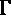
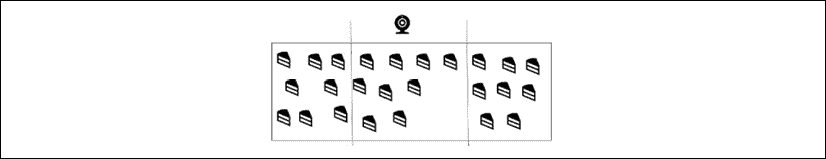

# 十、概念表示学习

了解前沿的机器学习和深度学习理论，只是标志着你冒险的开始。你所获得的知识应该会帮助你成为一个人工智能梦想家。把你看到的一切都当成机会，看看人工智能如何融入你的项目。达到极限并超越极限。

本章着重于通过视觉表示进行决策，并解释了导致**概念表示学习** ( **CRL** )和**元模型** ( **MM** )，它们形成**CRL MM**的动机。

概念学习是我们人类将世界从混沌分割成类别、类、集合和子集的能力。作为一个孩子和年轻人，我们获得许多种类的事物和概念。例如，一旦我们理解了“洞”是什么，我们就可以将它应用于我们看到的任何有点空的东西:黑洞、墙上的洞、银行账户上的洞(如果钱不见了或超支了)以及数百种其他情况。

通过执行概念学习，我们人类不必为每种情况一遍又一遍地学习相同的概念。比如洞就是洞。因此，当我们看到一个新的情况，如陨石坑，我们知道这只是一个“大”洞。我在职业生涯早期首次注册了 word2vector 专利。然后我很快将它应用于概念 2 向量算法。然后，我成功地为**自动计划和调度** ( **APS** )软件、认知聊天机器人等等设计和开发了 CRLMM 方法，我们将在接下来的章节中看到。元模型这个术语意味着我将一个单一的模型应用于许多不同的领域，就像我们人类一样。

概念表达也提供了概念的视觉形象。为了进行规划，人类需要将必要的信息(事件、位置等)和更关键的视觉维度(如图像概念)可视化。一个人在*精神图像中思考*。当我们思考时，脑海中的图像通过数字、声音、气味和感觉在我们的脑海中流动，将我们的环境转化为类似于视频剪辑的奇妙的多维表示。

本章将涵盖以下主题:

*   An approach to CRLMM in three steps:
    *   转移学习以避免为类似案例的每个变化开发新的程序
    *   领域学习，以避免每次领域改变时开发新的程序
    *   使用 CRLMM 的动机

    多年来，我已经成功地在公司网站上用 C++、Java 和逻辑编程(Prolog)以各种形式实现了 CRL。在本章中，我将使用 Python 来说明 TensorFlow 2.x 的方法，其中**卷积神经网络(CNN)** 内置于*第 9 章*、*卷积神经网络(CNN)*的抽象图像分类。

*   使用训练成一般化图像识别的 CNN 模型的迁移学习
*   领域学习将在一个领域中训练的图像识别扩展到另一个领域

我们将从迁移学习的好处以及概念学习如何促进这一过程开始这一章。

# 利用迁移学习创造利润

迁移学习意味着我们可以使用我们设计的模型，并在另一个类似的案例中进行训练。这将使模型非常有利可图，因为我们不必为每个新案例设计新模型和编写新程序。因此，您将通过降低您的培训模型的新实现的成本，为您的公司或客户创造利润。将一个好的人工智能模型视为一个可重用的工具，应用于类似的情况。这就是为什么概念学习，更一般和抽象，是有益的。这就是我们人类的适应方式。

当涉及到一般的推理和思考时，我们会使用一些单词的心理图像。我们的思想包含概念，在此基础上我们构建解决方案。

来自*第 9 章*、*卷积神经网络(CNN)抽象图像分类*的训练模型现在可以对某一类型的图像进行分类。在本节中，将加载训练好的模型，然后通过迁移学习进行泛化，以对相似图像进行分类。

你会注意到我没有在这个例子中使用很多图片。我的目标是解释这个过程，而不是构建大型数据集，这本身就是一项任务。主要目标是*理解*CNN 和概念学习表示。

## 迁移学习背后的动机

转移学习提供了一种在同一公司内将训练好的模型用于其他目的的经济有效的方法，例如在第九章*、*中描述的食品加工公司。

本章描述了食品加工公司如何将该模型用于其他类似目的。

成功做到这一点的公司将逐步推广该解决方案的使用。通过这样做，归纳抽象将发生，并导致其他人工智能项目，这将证明对公司的管理和提供解决方案的团队是令人满意的。

### 归纳思维

归纳法使用推论得出结论。例如，缺失产品的食品加工传送带会导致包装生产率问题。如果到达包装区的产品数量不足，将会减慢整个生产过程。

通过观察公司其他领域的类似问题，经理们会做出推论，例如*如果流程中的产品量不足，生产就会放缓*。

### 归纳抽象

任何公司中负责提高效率的项目团队都需要找到问题的抽象表示来通过组织或软件实现解决方案。这本书涉及解决问题的人工智能方面。组织过程需要定义人工智能将如何适应，需要召开几次现场会议。

### 人工智能需要解决的问题

在这个特定的例子中，工厂的每个部门都有一个**最佳生产率** ( **OPR** )，例如，每小时或每天。每小时 OPR 的公式可总结如下:

OPR:min(*p*(*s*)<= OPR<= max(*p*(*s*))

其中:

*   *p* 是给定部门(工厂的不同生产部门) *s* 的生产率。
*   *p* ( *s* )是该段的生产率。
*   min( *p* ( *s* ))是历史最小值(经过数月的反复试验分析)。在那个水平之下，整个生产过程会变慢。
*   max( *p* ( *s* ))为历史最大值。超过这个水平，整个生产过程也会变慢。
*   OPR 是最佳生产率。

有人第一次看到这个等式时，似乎很难理解。困难的出现是因为你必须将这个过程形象化，这是本章的目标。每个仓库、行业和服务都使用生产率作为达到盈利水平的约束。

可视化需要两个层次的表示:

*   确保如果包装部门没有收到足够的产品，它将不得不放慢甚至停止有时。
*   确保如果包装部门收到太多产品，它将无法包装它们。如果输入是没有中间存储的传送带(当前趋势)，那么它必须减速，在该点之前减慢或停止过程。

在这两种情况下，生产放缓都会导致糟糕的财务结果和严重的销售问题。

在这两种情况下， OPR 差距都是一个问题。为了解决这个问题，需要另一个层次的抽象。首先，让我们将 OPR 方程分成两部分:

OPR > = min(*p*(*s*))

OPR <= max( *p* ( *s* ))

现在让我们通过方差变量 *v* 找到一个更高的控制水平:

*v*[min]= | OPR–min(*p*(*s*)|

*v*[max]= | OPR–max(*p*(*s*)|

*v* [min] 和 *v* [max] 是两种情况下方差的绝对值(分别为生产的产品不够和生产的产品太多)。

最终的表现是通过单一的控制、检测和学习率(希腊字母 gamma):


公司给定部门的最佳生产率与其最低速度(每小时生产的产品数)之间的差异会降低下一个部门的生产速度。例如，如果生产的蛋糕(*v*min)太少，那么蛋糕包装部门将等待并不得不停止生产。如果生产的蛋糕太多(*v*max，那么该部分将不得不减速或停止。这两种差异都会给无法轻松管理中间存储的公司带来问题，食品加工业就是这种情况。

有了这个单一的概念，在*第 9 章*、*用卷积神经网络(CNN)进行抽象图像分类*中介绍，TensorFlow 2.x CNN 可以开始学习一个基本的生产概念:什么是物理间隙。让我们回到人类。一旦我们理解了间隙是某种洞或空白空间，我们就可以用一个间隙概念来识别和表示成千上万种情况，这个间隙概念在这里被转换成一个名为 gamma ( )的参数。让我们探索一下这个概念，然后实施它。

## 差距概念

向 CNN 教授 gap 概念将有助于它将其思维能力扩展到许多领域:

*   如前所述，生产中的缺口
*   车道上的缺口，供自动驾驶车辆驶入
*   任何不完整、有缺陷的区域
*   任何开口或窗户

让我们教 CNN 一个差距概念，或者简单的说，。gap 的符号是希腊字母“gamma”，所以简单读作“gamma”因此，我们要教 CNN 如何识别一个我们称之为 gamma ( )的间隙。目标是让 CNN 理解空白空间的抽象概念，一个由单词 *gap* 和希腊字母 gamma ( 表示的洞。

为了实现这个目标，在第 9 章、*用卷积神经网络(CNN)进行抽象图像分类*中训练和保存的 CNN 模型，现在需要被加载和使用。为了理解概念的含义，想象一下生产不出足够的客户订单或者到处都是成堆的未完成产品的成本。物理差距的财务转换是对设定目标的利润差异。我们都知道这些差异带来的痛苦。

## 加载训练好的 TensorFlow 2.x 模型

技术目标是加载并使用训练好的 CNN 模型，然后将相同的模型用于其他类似的区域。实际目标是教 CNN 如何使用 **概念**来增强调度、聊天机器人和其他应用程序的思维能力。

加载模型有两个主要功能:

*   加载模型以编译和分类新图像，而无需训练模型
*   逐层显示使用的参数，并显示在学习和训练阶段达到的权重

在下一节中，我们将加载并显示模型，而不对其进行训练。

### 加载和显示模型

有限数量的标题足以读取带有`READ_MODEL.py`的已保存模型，如以下代码行所示:

```
import tensorflow as tf

from tensorflow import keras

from tensorflow.keras import datasets, layers, models

import matplotlib.pyplot as plt

from keras.preprocessing.image import load_img

from keras.preprocessing.image import img_to_array

import numpy as np

from PIL import Image

#Directory

directory='dataset/'

print("directory",directory) 
```

保存的`model3.h5`模型现在从其文件中加载，如下所示:

```
#____________________LOAD MODEL____________________________

loaded_model = keras.models.load_model(directory+"model/model3.h5")

print(loaded_model.summary()) 
```

需要编译加载的模型:

```
# __________________compile loaded model

loaded_model.compile(loss='binary_crossentropy', optimizer='rmsprop', metrics=['accuracy']) 
```

阅读和展示模型不是一种形式。

打印结构提供了有用的信息:

```
print("GLOBAL MODEL STRUCTURE")

print(loaded_model.summary()) 
```

经过训练的模型可能适用于也可能不适用于所有数据集。在这种情况下，以下输出将指出可以通过其结构修复的问题，例如，如下所示:

```
MODEL STRUCTURE

Model: "sequential"

_________________________________________________________________

Layer (type)                 Output Shape              Param #   

=================================================================

conv2d (Conv2D)              (None, 62, 62, 32)        896       

_________________________________________________________________

max_pooling2d (MaxPooling2D) (None, 31, 31, 32)        0         

_________________________________________________________________

conv2d_1 (Conv2D)            (None, 29, 29, 32)        9248      

_________________________________________________________________

max_pooling2d_1 (MaxPooling2 (None, 14, 14, 32)        0         

_________________________________________________________________

flatten (Flatten)            (None, 6272)              0         

_________________________________________________________________

dense (Dense)                (None, 128)               802944    

_________________________________________________________________

dense_1 (Dense)              (None, 1)                 129       

=================================================================

Total params: 813,217

Trainable params: 813,217

Non-trainable params: 0 
```

一旦显示了全局结构，就可以查看每一层的结构。例如，我们可以窥视到`conv2d`层:

```
DETAILED MODEL STRUCTURE

{'name': 'conv2d', 'trainable': True, 'batch_input_shape': (None, 64, 64, 3), 'dtype': 'float32', 'filters': 32, 'kernel_size': (3, 3), 'strides': (1, 1), 'padding': 'valid', 'data_format': 'channels_last', 'dilation_rate': (1, 1), 'activation': 'relu', 'use_bias': True, 'kernel_initializer': {'class_name': 'GlorotUniform', 'config': {'seed': None}}, 'bias_initializer': {'class_name': 'Zeros', 'config': {}}, 'kernel_regularizer': None, 'bias_regularizer': None, 'activity_regularizer': None, 'kernel_constraint': None, 'bias_constraint': None}

{'name': 'max_pooling2d', 'trainable': True, 'dtype': 'float32', 'pool_size': (2, 2), 'padding': 'valid', 'strides': (2, 2), 'data_format': 'channels_last'} 
```

每个参数包含非常有用的信息。例如，`'padding':'valid'`表示尚未应用填充。在此模型中，内核的数量和大小在没有填充的情况下提供了令人满意的结果，并且形状减少到最终状态层(分类)，如下所示:

```
initial shape (570, 597, 4)

lay: 1 filters shape (568, 595, 3)

lay: 2 Pooling shape (113, 119, 3)

lay: 3 filters shape (111, 117, 3)

lay: 4 pooling shape (22, 23, 3)

lay: 5 flatten shape (1518,)

lay: 6 dense shape (128,)

lay: 7 dense shape (1,) 
```

但是，假设您想要控制图层的输出形状，以使空间尺寸不会以不必要的速度减小。一个原因可能是下一层将探索图像的边缘，我们需要用适合形状的内核来探索它们。

在这种情况下，大小为 1 的填充可以加上`0`值，如以下矩阵所示:

| 0 | 0 | 0 | 0 | 0 | 0 |
| 0 | **1** | **3** | **24** | **4** | 0 |
| 0 | **3** | **7** | **8** | **5** | 0 |
| 0 | **6** | **4** | **5** | **4** | 0 |
| 0 | **5** | **4** | **3** | **1** | 0 |
| 0 | 0 | 0 | 0 | 0 | 0 |

大小为 2 的填充将在初始形状周围添加两行和两列。

记住这一点，通过添加尽可能多的选项来微调您的训练模型将提高结果的质量。权重可以通过从保存的模型文件中逐层提取来查看，如下面的代码片段所示:

```
print("WEIGHTS")

for layer in loaded_model.layers:

    weights = layer.get_weights() # list of numpy arrays

    print(weights) 
```

分析程序使用的权重将提供关于程序执行优化过程方式的有用信息。有时，一个程序会被卡住，权重可能会偏离轨道。毕竟，像其他节目一样，CNN 也有不完美的地方。

例如，查看以下输出可以帮助理解系统哪里出错了:

```
WEIGHTS

[array([[ 6.25981949e-03,  2.35006157e-02, -1.28920656e-02, ...,

        -8.34930502e-03,  2.00010985e-02, -1.84428487e-02],

       [-1.01672988e-02,  1.87084991e-02,  2.49958578e-02, ...,

        -2.92361379e-02, -2.33592112e-02, -1.64737436e-03],

       [-2.71108598e-02,  2.53492035e-03, -2.90711448e-02, ..., 
```

我们现在可以使用加载和检查的模型。

### 加载模型以使用它

用`CNN_CONCEPT_STRATEGY.py`加载模型需要有限数量的头，如下所示:

```
import tensorflow as tf

from tensorflow import keras

from tensorflow.keras import datasets, layers, models

import matplotlib.pyplot as plt

from keras.preprocessing.image import load_img

from keras.preprocessing.image import img_to_array

import numpy as np

from PIL import Image 
```

加载模型是通过使用与前面描述的`READ_MODEL.py`中相同的代码来完成的。加载后，用`model.compile`函数编译模型，如下所示:

```
# __________________compile loaded model

loaded_model.compile(loss='binary_crossentropy', optimizer='rmsprop', metrics=['accuracy']) 
```

用于本示例的模型和图像识别功能已分两部分实施。首先，我们用下面的函数加载图像并调整其大小，例如:

```
def identify(target_image):

    filename = target_image

    original = load_img(filename, target_size=(64, 64))

    #print('PIL image size',original.size)

    if(display==1):

        plt.imshow(original)

        plt.show()

    numpy_image = img_to_array(original)

    inputarray = numpy_image[np.newaxis,...] # extra dimension to fit model

    arrayresized=np.resize(inputarray,(64,64))

    #print('Resized',arrayresized) 
```

该模型需要输入数组中的另一个维度进行预测，因此添加了一个维度来适应该模型。在这个例子中，一次需要识别一个图像。

我添加了下面两个预测方法，返回了一个:

```
#___PREDICTION___

    prediction = loaded_model.predict_proba(inputarray)

    return prediction 
```

有两种预测方法，因为基本上，在项目的实施阶段，每个组件都需要在 CNN 中检查，以选择最好和最快的方法。要测试`prediction2`，只需更改`return`指令。

一旦 CNN 开始运作，就很难找出哪里出了问题。一旦成熟的模型产生成千上万的结果，在构建网络时检查每个层和组件的输出可以节省微调时间。

以下示例检测食品加工厂传送带上的产品 **间隙**。程序加载存储在`classify`目录中的第一幅图像，以预测其值。程序描述了预测:

```
MS1='productive'

MS2='gap'

s=identify(directory+'classify/img1.jpg')

if (int(s)==0):

    print('Classified in class A')

    print(MS1) 
```

程序显示(可选)成形图像，如下所示，显示传送带在该点有足够数量的产品:


图 10.1:输出(成形图像)

然后程序做出并显示其预测`0`，这意味着在这条生产线的传送带上没有发现真正的间隙:

```
directory dataset/

Strategy model loaded from training repository.

image dataset/classify/img1.jpg predict_proba: [[ 0.]] predict: [[ 0.]]

Classified in class A

Productive

Seeking... 
```

`Seeking...`表示将在分类方向上分析第二幅图像。它加载、显示并预测其值，如下图所示:


图 10.2:输出(成形图像)

预测(*值* = 1)正确检测到传送带上的间隙，如以下输出所示:

```
image dataset/classify/img2.jpg predict_proba: [[ 1.]] predict: [[ 1.]]

Classified in class B

gap 
```

现在，CNN 的预测已经被证实，实施战略需要批准。CNN 包含了应用数学的奇迹。CNN 本身就是深度学习的缩影。一个研究人员可以很容易地花费数百个小时来研究它们。

然而，商业领域的应用数学需要盈利能力。因此，CNN 的组成部分似乎是不断发展的概念。添加的内核、激活功能、池化、扁平化、密集层以及编译和训练方法是架构的起点，而不是终点。

#### 利用迁移学习来获利或停止项目

在某个时候，一家公司会要求结果，如果没有交付结果，可能会搁置一个项目。如果一个电子表格代表了一个更快更充分的解决方案，深度学习项目将面临潜在的竞争和拒绝。许多学习人工智能的工程师在接触真正的 AI 项目之前，必须承担标准 SQL 报告专家的角色。迁移学习是一种有利可图的解决方案，可以提高 IT 部门的可信度。

迁移学习似乎是解决目前建设和培训 CNN 节目成本的一种方法。你的模型可能会有回报。这个想法是让一个基本的人工智能模型为你的客户和管理层带来快速的利润。然后，你会得到所有人的关注。为此，您必须定义一个策略。

### 定义战略

如果一个深度学习的 CNN 专家来找一个高层管理者，说这个 CNN 模型可以对狗、猫、汽车、植物等等的 CIFAR-10 图像进行分类，答案会是，*那又怎么样？我 3 岁的孩子也会。其实我家狗狗也可以！*

在会议中，IT 经理甚至可能会脱口而出类似这样的话，“我们现在已经拥有了所有需要的决策工具，而且我们的利润正在增加。我们为什么要投资 CNN？”

向现实世界的公司营销人工智能的核心问题是，它首先依赖于对 CNN 必要性的信念。电子表格、SQL 查询、标准自动化和软件完成了 99%的工作。很多时候，并不需要一个 CNN 就能取代很多工作；只需要一个自动化的电子表格、一个查询或标准、简单的软件就足够了。几十年来，工作一直被分割成简单的部分，足以用基本软件取代人类。

在介绍 CNN 之前，数据科学家必须了解公司使用它能赚多少钱。

理解、设计、建设和运营 CNN 对于商业来说并不意味着什么。如果我们不能证明一个解决方案会产生利润，那么我们为理解和运行这些复杂程序所付出的所有努力都将付之东流。没有利润，实施成本就无法收回，没有人会去听一个关于哪怕是一个很棒的项目的报告。

有效地应用模型意味着在公司的一个领域中实现它，然后在其他领域中实现它，以获得良好的投资回报。

#### 应用模型

例如，在一家食品加工公司，其中一条包装线存在性能问题。有时，传送带上会随机丢失一些蛋糕，如下图所示:



图 10.3:食品加工公司示例

为了启动一个具有成本效益的项目，可以在传送带上安装一个廉价的网络摄像头。它将每 10 秒钟随机拍摄一张样本图片，并对其进行处理，以找到图像中心间隔中显示的孔洞。我们可以清楚地看到一个空的空间，一个缺口，一个洞。如果检测到一个洞，这意味着一些蛋糕没有到达传送带(生产错误)。

当一些蛋糕丢失时，通过自动向生产机器人发送信号，生产率可以提高 2%到 5%。然后，生产机器人将向生产线发送信号，以增加产量，实时补偿缺失的单元。这种类型的自动控制已经存在于各种形式的自动化食品生产线中。然而，这提供了一种在生产线上开始实施的低成本方式。

### 通过将该模型用于另一个问题来使其有利可图

假设传送带上的食品加工实验证明，数据集类型 *d* [1] 和 CNN 模型 *M* 足够好地工作，以鼓励推广到同一公司的另一个数据集 *d* [2] 。

迁移学习包括从*M*(*d*[1])到*M*(*d*[2])使用相同的 CNN 模型 *M* ，进行一些有限的、具有成本效益的额外培训。将会出现变化，但可以通过移动一些参数并遵循一些基本数据集准备规则处理输入数据来解决这些变化:

*   **过拟合**:当模型以 100%的准确率快速拟合训练数据时，这可能是也可能不是问题。在对传送带上的孔进行分类的情况下，过度配合可能并不重要。形状总是一样的，环境保持稳定。然而，在各种不同图像或产品的不稳定情况下，过度拟合会限制系统的有效性。
*   **欠拟合**:如果精度下降到较低水平，如 20%，那么 CNN 将不工作。数据集和参数需要优化。可能需要增加*M*(*d*[2])的样本数量，或者减少，或者分成不同的组。
*   **正则化**:正则化，在一般情况下，涉及的是寻找如何修复*M*(*d*[2])的泛化问题的过程，而不是*M*(*d*[2])的训练错误。也许激活功能需要一些改进，或者权重的实现方式需要注意。

就像标准的软件程序改进一样，你可以应用无数的方法来寻找解决方案。

#### 迁移学习结束，领域学习开始

如上所述，在这个例子中，迁移学习可以用于相似类型的对象或图像。你可以在一家拥有相同模型的公司内部训练的相似图像越多，它产生的投资回报(ROI)就越多，这家公司就会要求你进行更多的 AI 创新。

领域学习采用一种模型，例如在*第 9 章*、*用卷积神经网络(CNN)进行抽象图像分类*中描述的模型，并且可以将其一般化。泛化过程将引导我们进行领域学习。

# 领域学习

关于领域学习的这一部分在经典迁移学习(如前所述)和领域学习的另一种应用(我发现它在公司项目中很有用)之间架起了一座桥梁:向机器教授一个概念(CRLMM)。在这一章中，我们将重点教机器学习如何在食品加工公司以外的情况下识别缺口。

## 如何使用这些程序

你可以先读完这一整章来掌握概念或者先玩程序。做你觉得对你最有利的事。在任何情况下，`CNN_TDC_STRATEGY.py`加载训练好的模型(在本章中您不必再次训练它们),而`CNN_CONCEPT_STRATEGY.py`训练模型。

### 本节中使用的训练模型

此部分使用`CNN_TDC_STRATEGY.py`将训练好的模型应用于目标概念图像。通过添加变量目录路径(用于`model3.h5`文件和图像)和分类消息，将`READ_MODEL.py`(如前所示)转换为`CNN_TDC_STRATEGY.py`，如以下代码所示:

```
#loads,traffic,food processing

A=['dataset_O/','dataset_traffic/','dataset/']

MS1=['loaded','jammed','productive']

MS2=['unloaded','change','gap']

#____________________LOAD MODEL____________________________

loaded_model = keras.models.load_model(directory+"model/model3.h5")....") 
```

加载的模型现在以要分类的图像为目标:

```
s=identify(directory+'classify/img1.jpg') 
```

模型的每个子目录包含四个子目录:

*   `classify`:包含要分类的图像
*   `model`:经过训练的`model3.h5`用于图像分类
*   `test_set`:概念图像的测试集
*   `training_set`:概念图像的训练集

现在我们已经探索了模型的目录结构，让我们看看如何在不同的情况下使用它。

### 经过训练的模型程序

对于这一章，你不需要来训练一个模型。它已经在*第 9 章*、*用卷积神经网络(CNN)*进行抽象图像分类中训练过。目录路径已经成为访问前面描述的子目录的变量。可以调用这些路径，如下面的代码所示:

```
A=['dataset_O/','dataset_traffic/','dataset/']

scenario=3 #reference to A

directory=A[scenario] #transfer learning parameter (choice of images)

print("directory",directory) 
```

您不需要运行本章的培训。模型被训练并自动存储在随书交付的虚拟机上它们各自的子目录中。这意味着，当您需要检测各种类型的图像的间隙时，您可以简单地更改场景，以适应您将从网络摄像头的帧中接收的图像类型:蛋糕、汽车、织物或抽象符号。

对于这一章，重点是理解概念。你可以在不运行程序的情况下阅读这一章，也可以在不运行程序的情况下打开它们，或者运行它们——只要你觉得舒服就行。主要目标是掌握概念，为后面的章节做准备。

我们已经加载了模型和场景。现在，我们将使用我们训练过的模型来检测生产线是否有负载或负载不足。

## 间隙-负载或负载不足

差距概念刚刚变成了一个多义词形象概念(多义词意味着不同的意思，如*第六章*、*用谷歌翻译创新人工智能*中所解释的)。

在蛋糕的情况下，间隙在其应用于 CNN 的*g*1 含义和概念子集上是负的，将其与负图像*n*+*g*[1]相关联:

*ng*

充满产品的图像是正面的，*p*+*g*[2]:

*pg*2= {良好的生产流程，没有缝隙}

在这个例子中，CNN 正在学习如何区分一个抽象的表示，而不是简单的图像，就像蛋糕一样。(概念差距数据集)的另一个子集被加载/欠载。“差距”不是一个具体的对象，而是一个可以应用于数百种不同情况的一般概念。这就是我使用“概念差距数据集”这个术语的原因

加载以下抽象图像。正方形代表生产机器，箭头代表装载时间。

这意味着 *x* 轴代表时间， *y* 轴代表机器生产资源；


图 10.4:抽象图像 1

CNN 模型运行并产生以下结果:

```
directory dataset_O/

Strategy model loaded from training repository.

image dataset_O/classify/img1.jpg predict_proba: [[ 0.]] predict: [[ 0.]]

Classified in class A

loaded

Seeking... 
```

CNN 认为这是一个正确加载的模型。这项任务不仅仅是分类。系统需要认识到这一点才能做出决定。

另一幅图像会产生不同的结果。在这种情况下，下面的屏幕截图中出现了一个欠载间隙:


图 10.5:抽象图像 2

CNN 有不同的输出，如下所示:

```
Seeking...

image dataset_O/classify/img2.jpg predict_proba: [[ 1.]] predict: [[ 1.]]

Classified in class

unloaded 
```

将“空载”读作“欠载”空载或欠载在任何情况下都代表空的空间。间隙概念向其数据集添加了另外两个子集*g*3 和*g*4。我们现在有:


的四个*g*1 到*g*4 子集是:

*ng*

*pg*[2]=*pg*[2]= {良好的生产流程，没有缝隙}

*g*3= { loaded }

*g*4= {卸载}

剩下的问题需要一段时间才能解决。 *g* [4] (gap)有时可以代表工作负荷不佳的机器有机会进行更多生产。在某些情况下， *g* [4] 变成了*pg*[4](*p*=正)。在其他情况下，如果生产率下降，它将变为*ng*[4](*n*=负数)。

在本节中，我们看到了如何识别生产线中的“差距”。如前所述，“间隙”是一个通用的概念，适用于任何地方的空间。我们现在将探索堵塞或“开放”的车道。

## 间隙-堵塞或开放的车道

本章中的模型可以扩展到其他领域。自动驾驶汽车需要识别是否处于交通堵塞状态。此外，自动驾驶汽车必须知道如何在检测到足够的空间(间隙)时改变车道。

这产生了两个新的子集:

*g*[5]= {交通堵塞，交通拥挤…交通太拥挤}

*g*[6]= {开放车道，轻交通……正常交通}

该模型现在检测到*g*5(交通堵塞)，如以下截图所示:


图 10.6:交通堵塞示例

以下输出正确显示:

```
directory dataset_traffic/

Strategy model loaded from training repository.

image dataset_traffic/classify/img1.jpg predict_proba: [[ 0.]] predict: [[ 0.]]

Classified in class A

jammed 
```

*g*


图 10.7:交通堵塞示例

如以下代码所检测到的，潜在的车道变更已成为可能:

```
Seeking...

image dataset_traffic/classify/img2.jpg predict_proba: [[ 1.]] predict: [[ 1.]]

Classified in class B

change 
```

我们已经将我们的 CNN“间隙”检测模型应用于几种类型的图像。我们现在可以使用“间隙”作为例子来更深入地研究概念数据集的理论。

## 差距数据集和子集

此时，(gap 概念数据集)已经开始学习几个子集:


其中:

*ng*

*pg*[2]=*pg*[2]= {良好的生产流程，没有缝隙}

*g*2= { loaded }

*g*3= {卸载}

*pg*[4]= {交通堵塞，交通拥挤…交通太拥挤}

*ng*[5]= {开放车道，轻交通……正常交通}

注意*g*2 和*g*3 还没有标签。食品加工环境提供了标签。概念检测需要一个上下文，CRLMMs 将提供这个上下文。

### 概括(gap 概念数据集)

(gap 概念数据集)的概括将为元模型提供一个概念工具。

(gap 概念数据集)指两个元素(物体、位置或生产线上的产品)之间的负的、正的或不确定的空间。

(伽马)也指时间上的差距:太长，不够长，太短，或者不够短。

代表两个位置之间的距离:太远或太近。

可以表示双方的误解或理解:意见分歧或一致。

所有这些例子都是指被视为空间的空间和时间的间隙。

## 概念表示学习元模型应用于维度的动机

CRLMM 将图像转换成概念。然后，这些抽象概念将被嵌入到矢量中，成为 softmax 函数的逻辑，并进而被转换为复杂人工智能程序的自动调度、认知聊天机器人等的参数。

一个概念的优点是它可以应用于许多不同的领域。仅用一个概念“间隙”(一个洞、空白空间等等)，就可以描述成百上千个案例。

在一些人工智能项目中，降维根本不会产生好的结果。例如，当安排飞机、火箭和卫星发射器的维护时，成千上万的功能进入系统，没有留下任何一个。火箭上的一颗螺丝钉丢失在错误的地方都可能导致灾难。飞机引擎的一个小小的错误就可能导致事故，卫星的一个部件就可能损害其精度。

必须考虑维度。有些人用“维度的诅咒”来表达，而我更喜欢“维度的祝福”。让我们来看看这两种方法。

### 维度的诅咒

给定项目的特性的数量可能会很大。以下示例包含 1，024 个维度:


图 10.8:维度的诅咒

上述表示中的每个点代表一个维度，例如可以是图像中的特征。

例如，让 CNN 分析一幅图像中的数千个特征，可能无法得出准确的结果。由于每一层都应该减少分析数据的大小以提取重要特征，过多的维度可能会使模型的训练无法进行。请记住，每个维度都可以包含一个需要训练权重的特征。如果太多，训练要么太长，要么太难计算。

遵循标准的 CNN 设计是一个很好的起点。当结果不符合预期时，这种方法就会受到限制，例如我们将在接下来的章节中看到的一些情况。在这些情况下，CRLMMs 将提高解决方案的生产率，提供一个有用的抽象模型。

当一个解决方案需要大量的未降维，核、池等降维方法无法应用时，CRLMMs 会为系统提供一副*眼镜*。这时候维度的“祝福”就派上用场了。

### 维度的祝福

在一些项目中，当模型达到构成项目的极限时，维度是一种祝福。

让我们用 CNN 模型举一个火箭制造的例子。我们想要识别表面上的间隙。这个表面包含瓷砖，以防止火箭在穿过大气层时过热。那些瓷砖上的缝隙可能会导致致命的事故。

如果我们取出一些瓦片，拍一张照片，然后用我们的 CNN 模型运行，它将*可能*检测出一个缺口。概率和误差之间的差异可能意味着火箭的严重故障。

这意味着我们可能不想减少特征的数量，而这反过来又需要重量和增加大量的维度。

我们可以决定不使用池，正如我们所看到的，池将几个维度组合成一个维度。这可能会产生计算问题，就像我们在上一段中看到的那样。要么要计算的权重太多，要么计算时间太长。

在这种情况下，我们可以将框架的尺寸缩小到我们正在检查的火箭组件的最小部分。我们可以决定我们的相机一次只扫描尽可能小的表面，向我们的 CNN 发送最小尺寸的帧。

在这种情况下，即使没有池，层将包含更多的数据，但计算将保持合理。

在这种情况下，维度的“祝福”在于这样一个事实，即通过避免汇集(分组)，我们正在检查更多的细节，这可以使我们的模型更可靠地检测小裂缝，因为我们将训练它看到非常小的间隙。

维数灾难通常会导致降维。但正如我们刚刚看到的，情况并不一定如此。

# 摘要

在本章中，在*第 9 章*、*使用卷积神经网络(CNN)*的抽象图像分类中构建的 CNN 架构被加载，以对一家食品加工公司中的物理间隙进行分类。该模型使用图像概念，将 CNN 带到另一个层面。神经网络可以挖掘其巨大的认知潜力，为人工智能的未来打开大门。

然后，通过识别相似类型的图像，将训练好的模型应用于迁移学习。其中一些图像代表的概念让受过训练的 CNN 发现了概念缺口。图像概念代表了将认知添加到神经网络的创新潜力的途径。

使用 CNN 作为领域学习中的训练和分类工具，将概念鸿沟应用于不同的领域。

概念间隙有两个主要性质:负 n 间隙和正 p 间隙。为了区分两者，CRLMM 提供了一个有用的附件。在一家食品加工公司，在正确的食品加工传送带上安装网络摄像头为系统提供了一个环境，以确定差距是积极的还是消极的。

记住这些概念，让我们在下一章为**高级计划和调度** ( **APS** )构建一个解决方案。

# 问题

1.  维数灾难导致机器学习算法中维数和特征的减少。(是|否)
2.  迁移学习决定了项目的盈利能力。(是|否)
3.  阅读`model.h5`并不能提供太多信息。(是|否)
4.  没有意义的数字足以代替人类。(是|否)
5.  聊天机器人证明肢体语言并没有那么重要。(是|否)
6.  当今的人工神经网络提供了足够的理论来解决所有人工智能的要求。(是|否)
7.  聊天机器人现在可以在所有情况下取代人类。(是|否)
8.  自动驾驶汽车已经被批准，不需要概念训练。(是|否)
9.  行业可以实现人工智能算法来满足他们的所有需求。(是|否)

# 进一步阅读

*   更多关于 Keras 层的信息:[https://keras.io/layers/about-keras-layers/](https://keras.io/layers/about-keras-layers/)
*   更多关于概念学习:[https://www . science direct . com/topics/psychology/concept-learning](https://www.sciencedirect.com/topics/psychology/concept-learning)
*   更多关于认知科学、大脑和概念模型思维的信息:[http://catalog . MIT . edu/schools/science/brain-cognitive-sciences/](http://catalog.mit.edu/schools/science/brain-cognitive-sciences/)，[https://symsys . Stanford . edu/undergates concentrations/cognitive-sci-cog sci-concentrations](https://symsys.stanford.edu/undergraduatesconcentrations/cognitive-science-cogsci-concentration)