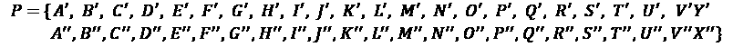
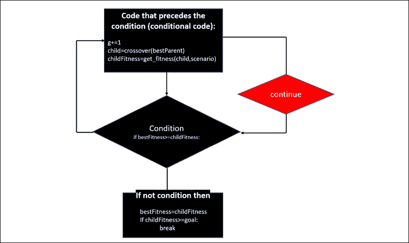
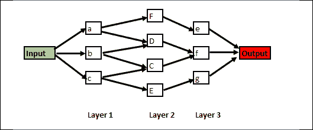

<title>Chapter_17</title>

# 17

# 混合神经网络中的遗传算法

在这一章和接下来的两章中，我们将探索我们内心的世界。首先，在这一章中，我们将使用我们的基因模型作为优化工具。在*第十八章*、*神经形态计算*中，我们将进入我们的生物大脑活动，创建神经形态网络。最后，在*第 19 章*、*量子计算*中，我们将更深入，使用我们体内的量子材料为量子计算建立量子力学模型。

我们体内这些微小实体(基因、神经元、量子比特)中任何一个微小的变化，都可以改变我们的整个存在。

在这一章中，我们将发现如何进入我们的染色体，找到我们的基因，并了解我们的生殖过程是如何工作的。从那里，我们将开始用 Python 实现一个进化算法，一个**遗传算法** ( **GA** )。

查尔斯·达尔文提出“适者生存”作为代表进化的模型。在某些方面，这种模式是有争议的。在 21 世纪的社会中，我们倾向于尽可能地为那些不是最合适的人提供支持。但是，在数学中，我们没有这个伦理问题。

在 AI 中，我们需要提供一个精确的解决方案。如果我们生成几个解，就可以把“适者生存”应用到抽象数字上。

在某些情况下，GAs 大大减少了寻找问题最优解所需的组合数量。通过生成数学后代，选择最合适的，并产生新的更强的抽象代，系统通常会达到比传播排列更优的解决方案。

设计良好的遗传算法可以优化神经网络的结构，从而产生混合神经网络。

本章将涵盖以下主题:

*   进化算法；遗传算法
*   将遗传算法的基因扩展到优化工具
*   混合神经网络
*   用遗传算法优化 LSTM

让我们从理解什么是进化算法开始。

# 理解进化算法

在这一节中，我们将从我们的遗传向下钻到我们的基因，以理解我们将在构建我们的 Python 程序时表示的过程。

一代又一代的人类激活了一些基因，而没有激活其他基因，产生了人类奇妙的多样性。一个人的一生是一长串几千代人中的一段插曲。我们都有双亲、四位祖父母和八位曾祖父母，这相当于 2 位长辈。假设我们将这条推理路线延伸到每个世纪四代人，然后在大约 12，000 年后，最后一个冰期结束，地球开始变暖。我们获得:

*   4 * 1 世纪* 10 世纪= 1000 年和 40 代
*   40 代* 12= 480
*   对今天生活在这个星球上的任何人来说，加起来有 2 个数学优势！

即使我们把自己限制在 1000 年，2 ^(40) 那加起来就是 1099511627776 个一千年前的祖先。但是有一个问题。这个数字是不可能的！今天，我们已经达到了人类人口的高度，只有 75 亿。所以，这意味着我们的祖先有很多孩子和他们所有等级的表亲结婚，使人类成为一个大家庭，不管我们的肤色或发色是什么！

## 人类的遗传

首先，当一个男性细胞与一个女性细胞结合时，男性使女性受精。受精卵生长，在经历了一段冒险之后，出生了，并成为我们中的一员，写下或阅读这本书。

为了从受精卵成长为成年人，我们必须收集、吸收和改造外部世界。

我们对食物和物质的这种转化，直到我们成长为或多或少像我们祖先的东西，这种转化叫做遗传。

如果生活是平静的，没有什么值得注意的事情会发生。然而，几百万年来，我们的环境对我们施加了无情的压力，回到我们只是漂浮在海洋某处的某种细菌的时候。这种压力带来了持续的自然选择；有效的将继续存在，无效的将消亡。

这种压力持续至今，迫使我们人类要么适应基因，要么消失。那些不能适应面对环境压力的人类灭绝了。我们今天活着的人幸存了下来。

进化可以被定义为一种不断冲突的状态。一方面，我们有无情的，往往是充满敌意的环境。另一方面，我们同样无情的基因；其中许多灭绝了，但其他的通过遗传变形、适应并继续——事实上，它们甚至现在还在这样做，谁知道接下来会发生什么？

### 我们的细胞

在我们的细胞中，细胞核以染色体的形式包含个人生物数据。我们的细胞每个细胞包含 46 条染色体，而每个细胞又由 23 对染色体组成。其中一对是决定我们性别的性细胞。

在染色体内部，我们有基因，特别是线粒体基因组，这是微小细胞中的 DNA，它接受我们的食物并将其转化为我们细胞的燃料。每个细胞都是一个微观繁忙的工厂，包含成千上万的基因！

人类基因组描述了包含在我们细胞的 23 条染色体中的一系列不可思议的序列。

### 遗传是如何工作的

除了性细胞，我们遗传了母亲四十六条染色体中的二十三条，父亲的二十三条。反过来，我们父母的细胞包含他们父母——我们的祖父母——的染色体，以各种比例依次类推。

让我们举一个例子来看看我们所面临的复杂情况。我们将带走父母中的一个，要么是母亲，要么是父亲。 *P* 代表那个亲本的染色体组。

带撇的字母将代表他们的父亲——我们的祖父——染色体，带双撇的字母将代表他们的母亲——我们的祖母——染色体。

在你父亲的性细胞里，我们可以这样描述他:



对你的母亲来说，第一组染色体中的最后一条将是她性细胞中的一个 *X* :


女性为 *X* - *X* 男性为 *X* - *Y* 。

想象一下可能性！

如果我们仅在我们父母的一个细胞中取 *A* 、 *B* 和 *C* ，我们已经获得了我们将继承的八个组合中的以下集合 *C* :


如果我们将这扩展到 23 条染色体，分布上升到 2 条，即 8，388，608 种可能性。

我们的进化过程包含了进化算法的潜力。

## 进化算法

在这一节，我们将进一步深入进化算法，更接近我们的 Python 程序。进化算法可以用于任何组合有用的领域:日程安排、DNA 医学研究、天气预报、神经网络架构优化和无限数量的领域。

*进化计算*是一套运用试错法技术重现生物进化的抽象数学版本的算法。这个数学模型并不认为已经解决了解释进化的困难任务，进化自然不能简化为几个方程。

然而，我们的生物环境产生了一些框架，这些框架虽然是我们想象力的成果，却使我们能够创建高效的抽象算法。

进化算法进入*进化计算*的范畴。进化算法包含变异、交叉和选择等过程。许多模型可以实现为进化过程设定的目标。

遗传算法引入了进化算法的范畴。

我们将首先定义 GA 中涉及的概念，它们是 Python 程序的构建块。

### 从生物模型到算法

有许多方法可以创建 GA 模型。您可以复制上一节中描述的人类模型的精确描述，您可以简化它，或者您可以创建另一个视图。

我们的模型将包含染色体中的一组基因和与之交互的群体:


图 17.1:基因中的染色体

例如，我们的模型是算法的抽象模型，而不是成对出现的人类染色体的实际表示。个体染色体中的一个基因会与群体的基因组相互作用。这个过程将在下面的章节中定义。

### 基本概念

让我们首先描述一下我们的 Python 程序的构造块的概念:

*   **Target**: Target defines the length and properties of the child we wish to obtain after *n* generations.

    在我们的模型中，目标可以是指定的，也可以是未指定的。

    指定的目标包含长度及其值:

    ```
     target = "Algorithm" # No space unless specified as a character in the gene set 
    ```

    在这种情况下，我们的环境需要一个精确的基因组来保持适应环境。参见下面的适应度函数。

    未指定的目标包含长度，但不包含其实际值，GA 必须在第 *n* 代后找到该值:

    ```
     target="AAAA" #unspecified target 
    ```

    在这种情况下，我们的环境并不需要一个精确的基因，而是需要一个具有在那个环境中保持合适的特征的基因。参见下面的适应度函数。

*   **Population**: Population first defines the selection of an individual at random we will call **parent** that will contain a certain length of its string of genes:

    ```
    def gen_parent(length) 
    ```

    群体还定义了父母可以与之交互以产生孩子的潜在个体。在我们的基因模拟中，群体的大小是用群体的基因集合来表示的(见下一点)。

*   **父代**的基因集合:父代的基因集合将首先是一个随机的基因集合。
*   **Gene set of the population**: This parent will then randomly encounter another person in the population with random gene choices. This population is represented by a gene set that we will draw genes from randomly:

    ```
    geneSet = "abcdefghijklmnopqrstuvwxyzABCDEFGHIJKLMNOPQRSTUVWXYZ!.-" 
    ```

    由于一个给定的群体可以拥有这些基因中的任何一个或几个，我们的群体从一开始就非常庞大。

*   **选择**:我们将从我们的基因集中随机选择基因来模拟我们的父母与另一个父母的相遇:

    ```
     index=random.randrange(0,len(parent)) 
    ```

*   **Crossover**: We will then form a child from the parent and the random gene taken from our population represented by the gene set.

    在我们的模型中，一旦进行了基因的随机选择，该基因将被取自群体的基因集合所代表的群体的随机基因替换:

    ```
     if(newGene!=oldGene):childGenes[index]=newGene; 
    ```

    请注意，在我们算法的交叉过程中，新基因必须不同于旧基因。因此，我们的算法避免了在复制阶段陷入局部组合。一个接一个的孩子，我们将产生新的一代。

*   **Mutation**: We will not accept the same gene from a parent to form a child. If we detect this, we will randomly change a gene to make sure each generation is different.

    如*交叉*段所述，我们不会接受基因相同的孩子作为父母。正如在这一章的遗传一节中所看到的，一个孩子不太可能完全继承父母的所有基因。多样性是培养一代又一代适应环境的孩子的关键。

    在我们的模型中，引入了强制变异的多样性规则:

    ```
     if(newGene==oldGene):childGenes[index]=alternate; 
    ```

    因此，我们引入了一个替代基因，我们将在构建 Python 程序时看到这一点。

*   **子代**:子代定义一组基因，包含与父代相同数量的基因，但有新的基因。子基因串的子代将被产生，然后用适应度函数完成选择过程。
*   **Fitness**: Fitness defines the value of the child as defined in a given model. The fittest will then be selected to be the parent for the next generation.

    在我们的模型中，我们有两个在场景变量中定义的适应度函数。

    如果`scenario=1`，那么指定的目标场景将被激活。目标将被指定为适合周围环境。

    例如，北极熊变成白色是为了融入周围的冰雪环境。在其他地区，熊通常是棕色的，例如，为了与周围的植被融为一体。

    因此，适应度函数具有要达到的目标。例如，在程序的一个实例中:

    ```
     target="FBDC" 
    ```

    正如我们将看到的，这个目标可能意味着许多事情。在熊的例子中，也许它们染色体中的这些基因触发了它们的颜色:白色或棕色。

    如果我们模拟自然的程序在给定的一代中没有产生正确的基因，这意味着熊没有正确突变，将无法生存。Python 程序的适应度函数通过仅保留使孩子向正确方向进化的基因串来模拟自然。

    在这种情况下，指定的目标是一个确定的基因串，它将决定生死。

    ```
    def get_fitness(this_choice,scenario):

        if(scenario==1): 
    ```

    正如我们将在后面看到的,`scenario==1`将确保达到生存所需要的确切的基因组。

    如果`scenario=0`，那么未指定的目标将被激活。未指定目标的长度。然而，特征集将定义群体的基因集的值。正如我们将在 Python 程序示例中看到的那样，该特性包含的数值为您希望解决的任何优化打开了大门。这个数值集称为 KPI 集，因为这些值是我们将在此模型中探索的系统的关键性能指标:

    ```
    KPIset ="0123456772012345674701234569980923456767012345671001234"   #KPI set 
    ```

    `KPIset`特征集与群体的基因集大小相匹配。

## 用 Python 构建遗传算法

我们现在将使用`GA.ipynb`从头开始构建一个 GA。

可以用`.py`版本。代码是相同的，尽管本章中的行号指的是`.ipynb`版本的 Jupyter 笔记本单元格。

在任何时候，你都可以回到上一节*基本概念*，查阅下面几节中用来描述 Python 程序的定义。

### 导入库

这个程序是从零开始构建的，没有更高级别的库来感受 GA。三行代码足以让一切正常工作:

```
import math

import random

import datetime 
```

### 调用算法

在本期节目中，我们将探索三种场景。两个场景生成指定的目标，一个生成未指定的目标。

我们将从一个指定的目标开始，然后转向更高级的未指定的目标，这将使我们为使用 g a 的混合网络做好准备。

我们将首先进入调用程序的算法单元的*。第一个任务是定义我们将在第 3 行使用哪种场景和类型的适应度函数:*

```
scenario=0   # 1=target provided at start, 0=no target, genetic optimizer 
```

如果`scenario=1`，程序从一个随机的种子父母开始，从几代人中为一个孩子生成正确的精确基因。

如果`scenario=0`，程序从一个随机的种子父母开始，从几代人中产生一个孩子的一种基因的最佳特征。

在第 4 行，`GA=2`定义了我们要处理的目标。

如果`GA=1`，群体和目标的基因集合被定义。主函数被称为:

```
if(GA==1):

    geneSet =

        "abcdefghijklmnopqrstuvwxyzABCDEFGHIJKLMNOPQRSTUVWXYZ!.-"

    # target with no space unless specified as a character in the geneSet

    target = "Algorithm"  # No space unless specified as a character in the geneSet

    print("geneSet:",geneSet,"\n","target:",target)

    ga_main() 
```

此时，群体的基因集与目标一起打印出来:

```
geneSet: abcdefghijklmnopqrstuvwxyzABCDEFGHIJKLMNOPQRSTUVWXYZ!.-

 target: Algorithm 
```

最后一行调用主函数`ga_main()`。

### 主要功能

代码在程序的`ga_main()`单元中。

`ga_main()`函数分为三个部分:父代、子代和摘要。

### 父代过程

父代从第 2 行运行到第 7 行:

```
 startTime=datetime.datetime.now()

    print("starttime",startTime)

    alphaParent=gen_parent(len(target))

    bestFitness=get_fitness(alphaParent,scenario)

    display(alphaParent,bestFitness,bestFitness,startTime) #no childFitness for generation 1 so default value sent 
```

*   `startTime`表示开始时间，打印出来:

    ```
    starttime 2019-10-12 10:32:28.294943 
    ```

*   `alphaParent`是将由`gen_parent`函数创建的第一个父对象，这将在下面的 Jupyter notebook 单元格中描述。
*   `bestFitness`是由`get_fitness`函数估计的适应度，这将在本章中描述。
*   `display`是描述该过程结果的函数。

我们现在有一个创建父节点的过程:`gen_parent`、`get_fitness`和`display`。

在恢复主函数之前，我们现在将研究父代函数。

### 生成父代

父代功能细胞从零基因开始，目标长度:

```
def gen_parent(length): 
```

`length` =目标的长度。目标是`"Algorithm"`，所以`length=9`。

在该过程开始时，父代没有基因，因为该函数的目标是随机产生包含与目标长度相等的一串基因的父代。

产生双亲的基因序列如下:

```
 genes=[]                        #genes array 
```

现在，一个`while`循环从单元格的第 3 行开始填充`genes[]`,直到它达到目标长度:

```
 while len(genes)<length:  #genes is constrained to the length

        #sampleSize: length of target constraint

        sampleSize=min(length-len(genes),len(geneSet))

        #extend genes with a random sample the size of sampleSize extracted from geneSet

        genes.extend(random.sample(geneSet,sampleSize)) 
```

*   `sampleSize`是基因集合`geneSet`中所需的基因样本，从中为亲本选择一个随机基因。
*   `genes.extend`从`geneSet`向`genes`数组添加一个随机基因。

一旦父代的基因集合`genes[]`达到目标的长度，`return`函数会将父代发送回主函数`ga_main()`，并在那里与`display`函数一起显示。在这次随机运行中，父进程的输出是:

```
aFJPKzYBD 
```

自然地，由于这是一个随机的过程，父代在每次运行时将是不同的。

这串基因现在被返回到`ga_main()`函数:

```
 return ''.join(genes) 
```

现在，我们来探讨一下健身功能和`display`功能。

### 健康

在`ga_main()`功能中的点，开始时间被打印出来，父项被创建:

```
#I PARENT GENERATION

    startTime=datetime.datetime.now()

    print("starttime",startTime)

    alphaParent=gen_parent(len(target)) 
```

在创造后代之前，我们需要评估父代的适应性:

```
 bestFitness = get_fitness(alphaParent,scenario) 
```

在这一段中，我们将只描述指定的目标案例，这是`scenario=1`的一部分。我们将创建一个以给定选择为目标的适应度函数。在这种情况下，只计算正确基因的总和:

```
def get_fitness(this_choice,scenario):

    if(scenario==1):

        fitness = sum(1 for expected,

            actual in zip(target,this_choice) if expected==actual) 
```

*   `this_choice`是由前面代码片段中描述的`gen_parent`函数产生的父基因串。
*   `scenario`表示该函数是计算适合基因的总和还是评估基因的特征。在这种情况下，计算正确基因的总和。
*   适应度是在比较目标值、期望值和实际值`this_choice`变量时找到的正确基因的数量。
*   如果`expected==actual`，总和增加。
*   `zip`，在 Python 中，是一个高效的特性，可以同时遍历两个列表。

一旦计算出适合度，适合度基因的总和，该函数将该值返回给`ga_main()`函数:

```
 return fitness 
```

父代现在将由`main_ga()`中调用的函数显示。

### 显示父项

此时，`ga_main()`已经打印了开始时间，创建了一个父对象，并评估了它的适合度:

```
def ga_main():

    #I PARENT GENERATION

    startTime=datetime.datetime.now()

    print("starttime",startTime)

    alphaParent=gen_parent(len(target))

    bestFitness=get_fitness(alphaParent,scenario) 
```

程序现在将显示关于第一代的基本信息:从`main_ga()`第 7 行调用`display`函数的父代:

```
 display(alphaParent,bestFitness,bestFitness,startTime) 
```

*   `alphaParent`是亲本的基因串
*   `bestFitness`是它的适合度
*   由于还没有孩子，`bestFitness`作为孩子适应度的默认值发送
*   `startTime`

在显示父单元格第 2 行中，`display`函数接收`main_ga()`发送的数据:

```
def display(selection,bestFitness,childFitness,startTime): 
```

`display`函数计算花费的时间，并打印几行信息:

```
 timeDiff=datetime.datetime.now()-startTime

    print("Selection:",selection,"Fittest:",bestFitness,

          "This generation Fitness:",childFitness,

          "Time Difference:",timeDiff) 
```

*   `selection`就是这一代人的那串基因。
*   `bestFitness`是到目前为止创建的最佳基因串的值。
*   `childFitness`是这一代的健身值。第一代是目前拥有最适合基因的父母的价值。该父代是另一个父代的子代，尽管该父代是我们考虑的第一代。
*   `timeDiff`是处理较大基因集时的一个重要值。这将有助于检测算法是否运行良好或达到其极限。

将为父代和更接近目标定义的最合适代的每一代显示输出:

```
Selection: BnVYkFcRK Fittest: 0 This generation Fitness: 0 Time Difference: 0:00:00.000198 
```

该输出将在程序的每次运行中变化，因为这是一个随机算法，模拟在我们的自然和人工环境中发生的随机事件。

在探索创建无限代的循环之前，让我们构建交叉函数。

### 交叉和变异

我们的模型包含一个带有变异规则的`crossover`函数，以确保多样性。

`crossover`功能从父项开始。

```
def crossover(parent): 
```

每一代的每个孩子都将成为另一个孩子的父母。

在自然界中，父母基因中的随机基因将被选择替换:

```
 index=random.randrange(0,len(parent))#producing a random position of the parent gene 
```

`index`表示将被替换的基因的确切位置:


图 17.2:基因中的染色体

我们可以看到染色体中的基因 **D** 会被种群中某个个体的基因 **z** 所取代。

现在，我们模拟繁殖阶段。孩子继承了父母的基因:

```
 childGenes=list(parent) 
```

用`list`函数将父代的基因串转换成一个列表。

该算法在变量中存储要替换的父代基因:

```
 oldGene=childGenes[index]        # for diversity check 
```

`oldGene`将与生成的新基因进行比较，以确保多样性得到尊重，从而避免陷入局部循环。

在群体的基因集中随机选择一个新基因，以模拟孩子与不确定数量的人中给定的人的相互作用:

```
 newGene,alternate=random.sample(geneSet,2) 
```

注意，与此同时，新基因`newGene`被随机选择，而替代基因`alternate`也被选择。选择`alternate`代替`newGene`是为了避免做出错误的选择。

如果新基因`newGene`不等于旧基因`oldGene`，那么孩子可以继承:

```
 if(newGene!=oldGene):childGenes[index]=newGene;  #natural crossover 
```

新基因成为孩子基因链的一部分。

然而，如果`newGene`与`oldGene`相同，这可能会危及整个遗传过程，后代不会进化。此外，算法可能会卡住或浪费相当多的时间来做出正确的选择。

这就是替代基因出现的地方，它成为孩子基因串的一部分。这个交叉规则和这个交替规则模拟了这个模型的变异过程。

```
 if(newGene==oldGene):childGenes[index]=alternate;  #mutation introduced to ensure diversity to avoid to get stuck in a local minima 
```

多样性得到了验证！

该函数现在返回孩子的新基因串，以便可以计算其适应值:

```
 return ''.join(childGenes) 
```

### 产生一代又一代的孩子

至此，我们已经生成了父节点，并探索了基本概念和功能。

我们已经为世代循环做好了准备。首先，我们将查看代码，然后用流程图表示它，然后描述代码行。

一旦创建了父代，我们就进入了模拟多代进化过程的循环:

```
 while True:

        g+=1

        child=crossover(bestParent)        #mutation

        childFitness=get_fitness(child,scenario) #number of correct genes

        if bestFitness>=childFitness:#

            continue

        display(child,bestFitness,childFitness,startTime)

        bestFitness=childFitness

        bestParent=child

        if scenario==1: goal=len(alphaParent);#number of good genes=parent length

        if scenario==0: goal=threshold;

        if childFitness>=goal:

            break 
```

该循环最好用流程图来表示:



图 17.3:遗传算法流程图

流程图的过程基于 Python 的`continue`方法:

1.  条件前面的代码:

    ```
     g+=1 
    ```

    ```
     child=crossover(bestParent) 
    ```

    ```
     childFitness=get_fitness(child,scenario) #number of correct genes 
    ```

    *   递增世代计数器:
    *   调用`crossover`函数产生一个子节点:
    *   调用适应度函数以获得适应度值:
2.  查看`childFitness`是否高于获得的`bestFitness`的条件:

    ```
     if bestFitness>=childFitness: 
    ```

    *   如果条件是`True`，那么进化必须继续，直到子代比其父代更健康。这将使流程返回到`while`循环的顶部。
    *   如果条件是`False`，这意味着子代比父代更适合，然后代码将超出条件。
3.  超越条件的代码和`continue`方法:

    ```
     display(child,bestFitness,childFitness,startTime)          bestFitness=childFitness          bestParent=child 
    ```

    ```
     if scenario==1: goal=len(alphaParent);          if scenario==0: goal=threshold; 
    ```

    *   代码显示子节点，`bestFitness`变为`childFitness`，而`bestParent`现在是子节点:
    *   我们的模型的两个场景的目标是明确的。`scenario==1`的目标是用正确的基因达到目标的长度。`scenario==0`的目标是达到我们将在下一节定义的阈值:
4.  The `break` condition of the loop:

    当经过几代包含符合目标的基因的最适合的孩子被创造出来时，进化过程将停止:

    ```
     if childFitness>=goal:

                break 
    ```

第 *n* 代的输出将显示如下:

```
Genetic Algorithm

geneSet: abcdefghijklmnopqrstuvwxyzABCDEFGHIJKLMNOPQRSTUVWXYZ!.-

 target: Algorithm

starttime 2019-10-12 20:47:03.232931

Selection: Xe!bMSRzV Fittest: 0 This generation Fitness: 0 Time Difference: 0:00:00.000953

Selection: Xe!bMSRhV Fittest: 0 This generation Fitness: 1 Time Difference: 0:00:00.002404

Selection: Xl!bMSRhV Fittest: 1 This generation Fitness: 2 Time Difference: 0:00:00.004391

Selection: XlgbMSRhV Fittest: 2 This generation Fitness: 3 Time Difference: 0:00:00.006860

Selection: XlgoMSRhV Fittest: 3 This generation Fitness: 4 Time Difference: 0:00:00.009525

Selection: AlgoMSRhV Fittest: 4 This generation Fitness: 5 Time Difference: 0:00:00.011954

Selection: AlgorSRhV Fittest: 5 This generation Fitness: 6 Time Difference: 0:00:00.013745

Selection: AlgorSthV Fittest: 6 This generation Fitness: 7 Time Difference: 0:00:00.016339

Selection: AlgorithV Fittest: 7 This generation Fitness: 8 Time Difference: 0:00:00.019031

Selection: Algorithm Fittest: 8 This generation Fitness: 9 Time Difference: 0:00:00.022239 
```

我们可以看到所有代的显示，如本章*显示父代*一节中的`display`功能所述。

### 汇总代码

一旦进化过程结束，一个总结代码就接管了:

```
#III. SUMMARY

    print("Summary---------------------------------------------------")

    endTime=datetime.datetime.now()

    print("endtime",endTime)

    print("geneSet:",geneSet);print("target:",target)

    print("geneSet length:",len(geneSet))

    print("target length:",len(target))

    print("generations:",g)

    print("Note: the process is stochastic so the number of generations will vary") 
```

为进化循环显示的示例的输出是:

```
Summary---------------------------------------------------

endtime 2019-10-12 20:47:03.257112

geneSet: abcdefghijklmnopqrstuvwxyzABCDEFGHIJKLMNOPQRSTUVWXYZ!.-

target: Algorithm

geneSet length: 55

target length: 9

generations: 782

Note: the process is stochastic so the number of generations will vary 
```

在我们继续之前，重要的是要注意，使用 55 个元素中的 9 个元素的排列，将需要 10 ** 15.36 次计算才能达到目标，而不是本例中的 782 代。因此，气体是产生排列的有效方式。

我们现在已经探索了进化过程的核心和 Python 代码。我们现在将构建未指定的目标和优化代码，这将引导我们进入混合神经网络。

## 用遗传算法优化神经网络结构的未指定目标

在本节中，我们将通过混合神经网络为优化神经网络的架构奠定基础和动机。遗传算法将优化物理神经网络的架构。

我们将研究一个物理神经网络，然后看看如何用我们的遗传算法优化它的结构。

### 物理神经网络

我们将从名为 S-FNN 的物理网络开始，这是一个**前馈神经网络** ( **FNN** )。请仔细观察下图，尽可能花时间理解其架构:



图 17.4:神经网络的架构

这个物理网络有一些重要的特性:

*   这是一个 FNN
*   有三层。
*   The neurons in each layer are not fully connected to the neurons of the next layer. The connections between the neurons of the three layers are not based on all of the possibilities. The connections between the layers are based upon statistics of the best connections in the past when running this network.

    这些连接是这个网络多次运行的结果，以确定哪些是最好的。

*   所示的连接是最高效的连接，导致输出`1`而不是`0`。`1`的输出是成功的，而`0`的输出是失败的。
*   输入是数据集的随机值，如果成功则必须分类为`1`，如果失败则分类为`0`。
*   在仔细研究了这个网络过去的运行之后，已经发现，在这个例子中，网络的生产率完全依赖于第 2 层中神经元的数量和质量。

让我们利用我们所学的知识，将其应用到足球队的架构中。

### 这个神秘的 FNN 的本质是什么？

S-FNN 是一支足球队的建筑！它代表了足球队在特定比赛前的 3-4-3 阵型。

就像抽象神经网络一样，我们选择的每层神经元的数量和质量都很关键。在我们抽象的人工神经网络世界里，我们有许多问题需要解决。我们应该保留多少？我们应该通过池层消除多少？我们应该通过辍学层放弃多少？我们如何真正知道？对大型数据集和网络进行反复试验需要多长时间？

现在，让我们回到图中，阅读下面的解释，并开始寻找一种方法来解决神经网络的架构复杂性:

*   **输入**表示基于过去的游戏统计，在游戏中输入球的最佳可能选择的目标。
*   **层 1** 是以三个神经元为代表的三个玩家的防御层。
*   **第二层**是中间场，第一层的活跃度转化的结果，过往游戏显示适者生存的统计，人脉。最初的输入球现在已经一场接一场地流过这些层。
*   **第三层**是攻击层，会导致输出分类的那一层；1 表示成功，表示已经进球，0 表示失败。第 2 层和第 3 层之间的连接显示了一个又一个游戏中发现的最合适的结果。

**要解决的问题**:在我们的示例中，第 2 层已经被确定为这个团队中的关键层。多年来，它一直是一个弱点。让我们看看我们的遗传算法将如何帮助找到最适合这一层的球员。

我们可以使用目标`ga==3`运行`scenario==1`(指定目标)，如下所示:

```
if(scenario==1 and GA==3):

    target="FBDC"  # No space unless specified as a character in the geneSet

    print("geneSet:",geneSet,"\n","target:",target)

    ga_main() 
```

`geneSet`是足球市场上可用球员的数量，`target`是我们物理网络第二层所需的一串基因:

```
Genetic Algorithm

geneSet: abcdefghijklmnopqrstuvwxyzABCDEFGHIJKLMNOPQRSTUVWXYZ!.-

target: FBDC 
```

在这次运行中，目标在 851 代之后被找到。

然而，我们希望 GA 能够根据没有指定目标的特性自己找到玩家。让我们一步一步，一个细胞一个细胞地探索。

### 调用算法单元

从第 7 行到第 12 行，我们为网络的第 2 层定义了目标架构的参数:

*   `geneSet`是我们网络第 2 层所有可用玩家的集合，无论他们是在团队中还是在市场上:

    ```
    geneSet="abcdefghijklmnopqrstuvwxyzABCDEFGHIJKLMNOPQRSTUVWXYZ!.-"   #gene set 
    ```

*   `KPIset`, or the key performance indicator set, is a performance score per player on the market for middle field. Each integer of the set contains a score between 0 and 9 based on the statistics of a player when playing as a midfielder:

    ```
    KPIset ="0123456772012345674701234569980923456767012345671001234"   #KPI set 
    ```

    KPI 集匹配基因集的每个成员。

*   `threshold`是我们需要达到的中场球员表现的总和，以便在球队中拥有一个强大的中场。

    ```
    threshold=35 
    ```

我们的目标是根据基因的特征和 KPI 属性找到一串基因。

目标是达到门槛。

我们在第 23 行称我们的进化函数为:

```
if(scenario==0 and GA==2):

    target="AAAA"                         #unspecified target

    print("geneSet:",geneSet,"\n","target:",target)

    ga_main() 
```

正如你所看到的，`target`被设置为一个无意义的值，它将会快速进化。GA 必须找到一个合适的序列。

我们可以跳过上一节描述的中间适应度函数，而专注于适应度单元中的场景。

### 健身细胞

我们已经在前面的章节中描述了健身单元的健身功能。我们将关注未指定目标的代码`scenario==0`。

场景的第一部分计算每个基因(潜在中场)的表现总和:

```
 if(scenario==0):

        cc=list(this_choice) # cc= this choice

        gs=list(geneSet)     # gene set

        cv=list(KPIset)      # value of each KPI in the set

        fitness=0

        for op1 in range(0,len(geneSet)): #2.first find parent gene in gene set

            for op in range(0,len(target)):

                if cc[op]==gs[op1]:       #3.gene identified in gene set

                    vc=int(cv[op1])       #4.value of critical path constraint

                    fitness+=vc 
```

基因序列(中场球员)的集体适应度包含在`fitness`变量中。

然而，我们不能接受相同的基因两次，这意味着我们在球场上有一个中场的克隆！因此，我们添加了一些安全代码，在这种情况下将`fitness`设置为`0`:

```
 for op in range(0,len(target)):

                for op1 in range(0,len(target)):

                    if op!=op1 and cc[op]==cc[op1]:

                        fitness=0    # no repetitions allowed, mutation enforcement 
```

现在，我们可以回到到`ga_main()`并完成我们的过程。

### ga_main()单元格

我们已经在前面的章节中描述了健身单元。现在，我们将关注未指定目标的代码，`scenario==0`。

在`ga_main()`单元格中，我们只需要检查第 22 到 24 行:

```
 if scenario==0: goal=threshold;

        if childFitness>=goal:

            break 
```

如果`scenario==0`，`childFitness`必须是`>=goal`(KPI 之和)。

我们已经找到我们的中场球员了！

我们现在将显示结果:

```
Genetic Algorithm

geneSet: abcdefghijklmnopqrstuvwxyzABCDEFGHIJKLMNOPQRSTUVWXYZ!.-

 target: AAAA

starttime 2019-10-13 09:08:21.043754

Selection: PNVx Fittest: 18 This generation Fitness: 18 Time Difference: 0:00:00.001252

Selection: LNVx Fittest: 18 This generation Fitness: 24 Time Difference: 0:00:00.004130

Selection: LNVq Fittest: 24 This generation Fitness: 27 Time Difference: 0:00:00.004708

Selection: LNFq Fittest: 27 This generation Fitness: 29 Time Difference: 0:00:00.010362

Selection: LBFq Fittest: 29 This generation Fitness: 31 Time Difference: 0:00:00.015797

Selection: CBFq Fittest: 31 This generation Fitness: 33 Time Difference: 0:00:00.024712

Selection: CBFt Fittest: 33 This generation Fitness: 34 Time Difference: 0:00:00.032680

Selection: CBFD Fittest: 34 This generation Fitness: 35 Time Difference: 0:00:00.048524

Summary---------------------------------------------------

endtime 2019-10-13 09:08:21.094005

geneSet: abcdefghijklmnopqrstuvwxyzABCDEFGHIJKLMNOPQRSTUVWXYZ!.-

target: AAAA

geneSet length: 55

target length: 4

generations: 154

Note: the process is stochastic so the number of generations will vary 
```

在这种情况下， GA 选择了中场 C、B、F 和 d。

我们现在拥有理解人工混合神经网络所需的所有成分、概念和知识。

# 人工混合神经网络

在上一节中，我们使用 GA 来优化物理神经网络。

在本节中，我们将把我们刚刚探索的*混合*的概念扩展到人工神经网络。原理是一样的，所以有了这些概念，直观地理解我们将在本节中优化的 RNN 就相对容易了。

AI 在社会中的未来在于人类(多样性)、机器(AI 和 IoT)、自然(我们生存的可持续项目)的集体智慧。

在人工智能中，这种多样性存在于集成算法、元算法和混合系统中。深度学习已经证明了它的观点。我们可以用 TensorFlow 2.x 用几行代码创建一个神经网络。然而，通常需要几天、几周甚至几个月的时间来微调依赖大量数据来提供可靠模型的人工神经网络模型。这就是混合神经网络的必要性。

深度学习网络可以使用任何形式的另一种类型的算法来成为更有效的系统。在我们的案例中，我们选择了可用于深度学习的进化算法:

*   通过提取符合我们正在寻找的模式的数据序列来改进输入，使用数据的特征来找到最合适的数据点
*   优化网络各层的权重，以提高传统优化器的速度和能力
*   通过选择作为基因序列处理的最合适的解决方案来改进网络输出的分类阶段
*   为了改进定义网络体系结构的繁琐任务

在本节中，我们将重点介绍一个通过 GA 优化网络架构的示例:

*   创造 RNN
*   引入将优化网络架构的 g a

**注**:关于遗传算法表示的信息，请随时回到前面的章节来刷新进化算法的过程。也请回到前面的章节去查阅一个神经网络的结构，特别是*第十六章*、*改善聊天机器人的情商缺陷*，里面描述了一个 RNN。

## 建造 LSTM

在您的机器上的 Google Colaboratory 或 Jupyter 中打开`Genetic_Algorithm_LSTM.ipynb`或`genetic_algorithm_lstm.py`。

这个教育例子的模型是一个 LSTM。

目标是使用 GA 生成的窗口大小，并使用该窗口大小运行 LSTM。**均方根误差** ( **RMSE** )将用于测量配置的适用性。

简而言之，RMSE 首先计算训练数据和测试数据之差的平方，就像许多类似的公式一样。然后，计算结果的根。请记住，RMSE 会将我们期望得到的与我们实际得到的进行比较，并产生一个值。

现在，让我们探索一下该程序的主要单元:

*   **Importing required packages cell**: `Genetic_Algorithm_LSTM.ipynb` starts by installing DEAP, an evolutionary computation framework:

    ```
    !pip install deap 
    ```

    在前面的部分中，我们从头开始构建了一个 GA。这次我们不需要从零开始，因为这个程序使用了一个框架。

    然后，程序安装`bitstring`，帮助处理二进制数据。

*   **Loading the data cell**: The data wind power forecast data in `train.csv` comes from [https://www.kaggle.com/c/GEF2012-wind-forecasting/data](https://www.kaggle.com/c/GEF2012-wind-forecasting/data).

    `wp1`到`wp7`列提供了从七个风力发电场的风力测量中收集的标准化数据。LSTM 的目标将是获取数据序列并进行风力预测。

*   **定义基本功能单元**:该单元准备数据集，并在标准流程中训练模型。我们将关注第 14 行:

    ```
     window_size = window_size_bits.uint 
    ```

*   **进化模型单元**:该模型使用了 DEAP 框架函数，但是我们很容易识别出我们在前面章节中探索过的概念，这些概念被初始化如下:

    ```
    population_size = 4  num_generations = 2  gene_length = 10 
    ```

代码都设置了一个现成的 GA 来优化我们网络的窗口大小。

## 模型的目标

正如我们在前面的章节中一样，的目标是为该网络找到最佳的窗口大小，正如我们在前面的章节中寻找最佳的第 2 层一样。

该模型完成了以下任务:

*   安装软件包，加载数据，并找到 LSTM 的窗口大小
*   然后，它运行 GA 模型来测试 LSTM 的可能窗口大小
*   为每个世代和世代的产生提供 RMSE 测量

该程序需要一些时间来运行，但我运行的结果保存在笔记本中，以便您可以查看。这里有一个结果来查看该系统是如何工作的:

```
Epoch 1/5

17200/17200 [==============================] - 207s 12ms/sample - loss: 0.0096

Epoch 2/5

17200/17200 [==============================] - 202s 12ms/sample - loss: 0.0059

Epoch 3/5

17200/17200 [==============================] - 202s 12ms/sample - loss: 0.0058

Epoch 4/5

17200/17200 [==============================] - 200s 12ms/sample - loss: 0.0057

Epoch 5/5

17200/17200 [==============================] - 200s 12ms/sample - loss: 0.0057

Test RMSE: 0.0926447226146452 
```

如前一节所述，遗传算法优化了人工神经网络的一个部分。您可以将 GA 用于人工神经网络的其他组件。天空才是极限！其实是没有限制的。混合神经网络使用遗传算法或其他算法优化其架构或过程的潜力将您的项目带到了另一个层次！

# 摘要

进化算法为人工智能的优化潜力带来了新的曙光。在这一章中，我们研究了遗传如何深刻地影响人口分布。我们环境的影响可以通过基因突变来衡量。

进一步深入研究，我们关注于一类气体，它实现了对经过许多代的遗传转化的模拟。我们探索了父母如何传递一些基因，但从基因群体中选择不同的基因将如何产生变异。一条染色体会遗传一些基因，但不会遗传另一些基因。

自然和我们环境的压力将会接管。适应度函数评估一串基因。只有适者生存。最适合的遗传物质会产生一个交叉和突变的孩子，使它更适合它的环境。

GAs 可以用来表示任何类型的数据串以及这些数据的特征。优化过程可以应用于仓库、运输和神经网络。

毫无疑问，混合网络将在未来几年不断扩展，将 DL 推向新的高度。使用遗传算法优化 RNN 的架构为优化任何 DL、ML 或 AutoML 架构铺平了道路。例如，混合神经网络可以使用遗传算法来优化具有特征减少的输入，或者作为网络的权重优化函数。

大自然为我们提供了无价的工具来应用于我们的人工网络模型。这一章讲述了我们内心看不见的建筑材料。在下一章*神经形态计算*中，我们将探索使我们能够适应环境的其他组件:神经元。我们将探索使用生物模型的神经网络如何解决复杂的问题。

# 问题

1.  一个细胞包含 42 条染色体。(是|否)
2.  遗传算法是确定性的，而不是随机的。(是|否)
3.  进化算法意味着程序代码进化。(是|否)
4.  即使经过许多代，孩子最好与父母中的一个有相同的基因。(是|否)
5.  多样性使基因组变弱。(是|否)
6.  构建一个神经网络只需要几行代码，架构总是有效的。(是|否)
7.  使用遗传算法构建神经网络有助于优化各层的架构。(是|否)
8.  混合神经网络没有用，因为深度学习会不断进步。(是|否)
9.  你会相信遗传算法会为你做决定吗？(是|否)
10.  你会信任一个混合神经网络来优化你的网络架构吗？(是|否)

# 进一步阅读

*   [https://github.com/DEAP/deap](https://github.com/DEAP/deap)
*   https://pypi.org/project/bitstring/