# 一、使用矩阵

在这一章中，我们将探索一种基本而优雅的数学数据结构——矩阵**。大多数计算机科学和数学专业的毕业生应该已经熟悉了矩阵及其应用。在机器学习的背景下，矩阵用于实现几种类型的机器学习技术，例如线性回归和分类。我们将在后面的章节中更多地研究这些技术。**

**虽然这一章一开始看起来可能主要是理论性的，但是我们很快就会看到矩阵对于快速组织和索引多维数据是一个非常有用的抽象。机器学习技术使用的数据包含多个维度的大量样本值。因此，矩阵可以用来存储和操作这些样本数据。**

**使用矩阵的一个有趣的应用是谷歌搜索，它建立在 **PageRank** 算法之上。尽管对这种算法的详细解释超出了本书的范围，但值得一提的是，谷歌搜索本质上是在一个极其庞大的数据矩阵中找到*特征向量*(有关更多信息，请参考*大规模超文本网络搜索引擎的剖析*)。矩阵在计算中有多种应用。虽然我们在本书中没有讨论 Google 搜索使用的特征向量矩阵运算，但我们在实现机器学习算法时会遇到各种各样的矩阵运算。在这一章中，我们将描述可以在矩阵上执行的有用操作。**

# **介绍雷宁根**

**在本书的整个过程中，我们将使用 Leiningen([http://leiningen.org/](http://leiningen.org/))来管理第三方库和依赖项。Leiningen，或`lein`，是标准的 Clojure 包管理和自动化工具，有几个强大的特性用于管理 Clojure 项目。**

**要获得如何安装 Leiningen 的说明，请访问位于[http://leiningen.org/](http://leiningen.org/)的项目现场。第一次运行`lein`程序可能需要一段时间，因为它第一次运行时会下载并安装 Leiningen 二进制文件。我们可以使用`lein`的`new`子命令创建一个新的 Leiningen 项目，如下所示:**

```py
**$ lein new default my-project** 
```

**前面的命令创建了一个新目录`my-project`，它将包含 Clojure 项目的所有源文件和配置文件。该文件夹包含`src`子目录中的源文件和一个单独的`project.clj`文件。在该命令中，`default`是用于新项目的项目模板类型。本书中的所有例子都使用前面的`default`项目模板。**

**`project.clj`文件包含与项目相关的所有配置，其结构如下:**

```py
(defproject my-project "0.1.0-SNAPSHOT"
  :description "FIXME: write description"
  :url "http://example.com/FIXME"
  :license 
  {:name "Eclipse Public License"
   :url "http://www.eclipse.org/legal/epl-v10.html"}
  :dependencies [[org.clojure/clojure "1.5.1"]])
```

### **提示**

****下载示例代码****

**你可以从你在[http://www.packtpub.com](http://www.packtpub.com)的账户下载你购买的所有 Packt 书籍的示例代码文件。如果你在别处购买了这本书，你可以访问 http://www.packtpub.com/support 并注册，文件会直接通过电子邮件发送给你。**

**通过使用`:dependencies`键将声明添加到 vector 中，可以将第三方 Clojure 库包含在项目中。例如，clo jars([https://clojars.org/net.mikera/core.matrix](https://clojars.org/net.mikera/core.matrix))上的 core.matrix Clojure 库包给了我们包声明`[net.mikera/core.matrix "0.20.0"]`。我们只需将该声明粘贴到`:dependencies`向量中，以添加 core.matrix 库包作为 Clojure 项目的依赖项，如以下代码所示:**

```py
 :dependencies [[org.clojure/clojure "1.5.1"]
                 [net.mikera/core.matrix "0.20.0"]])
```

**要下载在`project.clj`文件中声明的所有依赖项，只需运行下面的`deps`子命令:**

```py
**$ lein deps** 
```

**Leiningen 还提供了一个 **REPL** ( **读取-评估-打印-循环**)，它只是一个包含所有在`project.clj`文件中声明的依赖关系的交互式解释器。这个 REPL 还将引用我们在项目中定义的所有 Clojure 名称空间。我们可以使用下面的`lein`的`repl`子命令来启动 REPL。这将启动一个新的 REPL 会话:**

```py
**$ lein repl** 
```

**

# 代表矩阵

矩阵只是一个按行和列排列的矩形数据阵列。大多数编程语言，如 C#和 Java，都直接支持矩形数组，而其他语言，如 Clojure，则对矩形数组使用异构数组的数组表示。请记住，Clojure 不直接支持处理数组，惯用的 Clojure 代码使用*向量*来存储和索引元素数组。我们将在后面看到，矩阵被表示为一个向量，其元素是 Clojure 中的其他向量。

矩阵还支持几种算术运算，如加法和乘法，它们构成了被称为**线性代数** 的重要数学领域。几乎每种流行的编程语言都至少有一个线性代数库。Clojure 让我们从几个这样的库中进行选择，所有这些库都有一个标准化的 API 接口，可以处理矩阵。

*core.matrix* 库是一个通用的 Clojure 库，用于处理矩阵。Core.matrix 还包含一个处理矩阵的规范。关于 core.matrix 的一个有趣的事实是，虽然它提供了该规范的默认实现，但它也支持多种实现。core.matrix 库在 http://github.com/mikera/core.matrix 的 GitHub 上托管和开发。

### 注意

通过向`project.clj`文件添加以下依赖项，可以将 core.matrix 库添加到 Leiningen 项目中:

```py
[net.mikera/core.matrix "0.20.0"]
```

对于接下来的示例，命名空间声明应该类似于以下声明:

```py
(ns my-namespace
  (:use clojure.core.matrix))
```

注意，通常不鼓励在 Clojure 中使用`:import`来包含库名称空间。相反，最好使用带有`:require`形式的别名名称空间。但是，对于下一节中的示例，我们将使用前面的名称空间声明。

在 Clojure 中，矩阵只是向量的向量。这意味着矩阵被表示为其元素是其他向量的向量。vector 是一个元素数组，它需要接近常数的时间来检索一个元素，不像 list 有线性查找时间。然而，在矩阵的数学上下文中，向量只是具有单行或单列的矩阵。

为了从向量的向量中创建一个矩阵，我们使用下面的`matrix`函数，并向其传递向量的向量或引用列表。请注意，矩阵的所有元素都在内部表示为`double`数据类型(`java.lang.Double`)，以增加精确度。

```py
user> (matrix [[0 1 2] [3 4 5]])    ;; using a vector
[[0 1 2] [3 4 5]]
user> (matrix '((0 1 2) (3 4 5)))   ;; using a quoted list
[[0 1 2] [3 4 5]]
```

在前面的示例中，矩阵有两行三列，或者更简洁地说，是一个 2×3 的矩阵。应该注意，当矩阵由向量的向量表示时，表示矩阵的各个行的所有向量应该具有相同的长度。

创建的矩阵被打印为向量，这不是可视化表示它的最佳方式。我们可以使用`pm`功能打印如下矩阵:

```py
user> (def A (matrix [[0 1 2] [3 4 5]]))
#'user/A
user> (pm A)
[[0.000 1.000 2.000]
 [3.000 4.000 5.000]]
```

这里我们定义一个矩阵 *A* ，数学上表示如下。注意，使用大写变量名只是为了举例说明，因为所有的 Clojure 变量通常都是小写的。


矩阵 *A* 由元素 a [i，j] 组成，其中 *i* 是矩阵的行索引， *j* 是矩阵的列索引。我们可以使用括号在数学上表示矩阵 *A* ，如下所示:


我们可以使用`matrix?`函数来检查一个符号或变量实际上是否是一个矩阵。对于所有实现 core.matrix 规范的矩阵,`matrix?`函数将返回`true`。有趣的是，`matrix?`函数也将返回普通向量的`true`。

core.matrix 的默认实现是用纯 Clojure 编写的，在处理大型矩阵时确实会影响性能。core.matrix 规范有两个流行的 contrib 实现，即使用纯 Java 实现的**vectorz-clj**([http://github.com/mikera/vectorz-clj](http://github.com/mikera/vectorz-clj))和通过本地库实现的**c latrix**【http://github.com/tel/clatrix】()。虽然还有其他几个实现 core.matrix 规范的库，但这两个库被认为是最成熟的。

### 注

Clojure 有三种库，即核心库、贡献库和第三方库。Core 和 contrib 库是标准 Clojure 库的一部分。核心库和贡献库的文档都可以在 http://clojure.github.io/找到。核心库和 contrib 库之间唯一的区别是 contrib 库没有附带 Clojure 语言，必须单独下载。

第三方库可以由任何人开发，并通过 clo jars([https://clojars.org/](https://clojars.org/))提供。Leiningen 支持所有以前的库，并且在它们之间没有太大的区别。

contrib 库通常最初是作为第三方库开发的。有趣的是，core.matrix 最初是作为第三方库开发的，后来被提升为 contrib 库。

clatrix 库使用**基本线性代数子程序** ( **BLAS** )规范来连接它所使用的本地库。BLAS 也是本地语言常用的矩阵和向量的线性代数运算的稳定规范。实际上，clatrix 的性能明显优于 core.matrix 的其他实现，并且还定义了几个用于处理矩阵的实用函数。您应该注意到，与习惯上将矩阵视为不可变类型的 core.matrix 规范的其他实现相反，矩阵被 clatrix 库视为可变对象。

在本章的大部分时间里，我们将使用 clatrix 来表示和操作矩阵。但是，我们可以有效地重用 core.matrix 中的函数，这些函数对通过 clatrix 创建的矩阵执行矩阵运算(如加法和乘法)。唯一的区别是，我们应该使用 clatrix 库中定义的函数，而不是使用来自`core.matrix`名称空间的`matrix`函数来创建矩阵。

### 注意

通过向`project.clj`文件添加以下依赖项，可以将 clatrix 库添加到 Leiningen 项目中:

```py
[clatrix "0.3.0"]
```

对于接下来的示例，命名空间声明应该类似于以下声明:

```py
(ns my-namespace
  (:use clojure.core.matrix)
  (:require [clatrix.core :as cl]))
```

请记住，我们可以在同一个源文件中同时使用`clatrix.core`和`clojure.core.matrix`名称空间，但是一个好的做法是将这两个名称空间都导入到别名名称空间中，以防止命名冲突。

我们可以使用`cl/matrix`函数后面的从 clatrix 库中创建一个矩阵。请注意，与 core.matrix 相比，clatrix 生成的矩阵表示略有不同，但信息量更大。如前所述，`pm`函数可用于将矩阵打印为矢量中的矢量:

```py
user> (def A (cl/matrix [[0 1 2] [3 4 5]]))
#'user/A
user> A
 A 2x3 matrix
 -------------
 0.00e+00  1.00e+00  2.00e+00 
 3.00e+00  4.00e+00  5.00e+00 
user> (pm A)
[[0.000 1.000 2.000]
 [3.000 4.000 5.000]]
nil
```

我们也可以使用一个重载版本的`matrix`函数，它将一个矩阵实现名作为第一个参数，后面是通常的定义的矩阵向量，来创建一个矩阵。实现名被指定为关键字。例如，默认的持久向量实现被指定为`:persistent-vector`，而网格实现被指定为`:clatrix`。我们可以通过指定这个关键字参数来调用`matrix`函数，以创建不同实现的矩阵，如下面的代码所示。在第一次调用中，我们用关键字`:persistent-vector`调用`matrix`函数来指定默认的持久向量实现。类似地，我们用关键字`:clatrix`调用`matrix`函数来创建一个 clatrix 实现。

```py
user> (matrix :persistent-vector [[1 2] [2 1]])
[[1 2] [2 1]]
user> (matrix :clatrix [[1 2] [2 1]])
 A 2x2 matrix
 -------------
 1.00e+00  2.00e+00 
 2.00e+00  1.00e+00
```

有趣的一点是，向量和数字的向量都被 clatrix 当作`matrix`函数的有效参数，这与 core.matrix 的处理方式不同。例如，`[0 1]`产生 2×1 矩阵，而`[[0 1]]`产生 1×2 矩阵。core.matrix 中的`matrix`函数没有这个功能，它总是期望传递给它一个矢量向量。然而，用`[0 1]`或`[[0 1]]`调用`cl/matrix`函数将创建以下矩阵，不会有任何错误:

```py
user> (cl/matrix [0 1])
 A 2x1 matrix
 -------------
 0.00e+00 
 1.00e+00 
user> (cl/matrix [[0 1]])
 A 1x2 matrix
 -------------
 0.00e+00  1.00e+00 
```

类似于`matrix?`函数，我们可以使用`cl/clatrix?`函数来检查一个符号或变量是否是来自网格库中的矩阵。虽然`matrix?`实际上检查 core.matrix 规范或协议的实现，但是`cl/clatrix?`函数检查特定的类型。如果`cl/clatrix?`函数为特定变量返回`true`，那么`matrix?`也应该返回`true`；然而，这个公理的逆命题并不成立。如果我们在使用`matrix`函数而不是`cl/matrix`函数创建的矩阵上调用`cl/clatrix?`，它将返回`false`；这显示在以下代码中:

```py
user> (def A (cl/matrix [[0 1]]))
#'user/A
user> (matrix? A)
true
user> (cl/clatrix? A)
true
user> (def B (matrix [[0 1]]))
#'user/B
user> (matrix? B)
true
user> (cl/clatrix? B)
false
```

大小是矩阵的一个重要属性，经常需要计算。我们可以使用`row-count`函数找到矩阵中的行数。它实际上只是组成矩阵的向量的长度，因此，我们也可以使用标准的`count`函数来确定矩阵的行数。类似地，`column-count`函数返回矩阵中的列数。考虑到矩阵包含等长向量的事实，列的数量应该是矩阵的任何内部向量的长度，或者更确切地说是任何行的长度。我们可以在 REPL 中的以下样本矩阵上检查`count`、`row-count`和`column-count`函数的返回值:

```py
user> (count (cl/matrix [0 1 2]))
3
user> (row-count (cl/matrix [0 1 2]))
3
user> (column-count (cl/matrix [0 1 2]))
1
```

使用矩阵的行和列索引从矩阵中检索元素，使用下面的`cl/get`函数。除了要对其执行操作的矩阵之外，该函数还接受两个参数作为矩阵的索引。请注意，在 Clojure 代码中，所有元素都是相对于 *0* 进行索引的，这与将 *1* 视为矩阵中第一个元素的位置的数学符号相反。

```py
user> (def A (cl/matrix [[0 1 2] [3 4 5]]))
#'user/A
user> (cl/get A 1 1)
4.0
user> (cl/get A 3)
4.0
```

如前面的示例所示，`cl/get`函数也有另一种形式，其中只接受一个索引值作为函数参数。在这种情况下，通过行优先遍历对元素进行索引。例如，`(cl/get A 1)`返回`3.0`，`(cl/get A 3)`返回`4.0`。我们可以使用下面的`cl/set`函数来改变一个矩阵的元素。该函数接受类似于`cl/get`的参数——一个矩阵、一个行索引、一个列索引，最后是要在矩阵中指定位置设置的新元素。`cl/set`函数实际上变异或修改了提供给它的矩阵。

```py
user> (pm A)
[[0.000 1.0002.000]
 [3.000 4.0005.000]]
nil
user> (cl/set A 1 2 0)
#<DoubleMatrix [0.000000, 1.000000, … , 0.000000]>
user> (pm A)
[[0.000 1.000 2.000]
 [3.000 4.000 0.000]]
nil
```

clatrix 库还提供了两个方便的函数组合功能:`cl/map`和`cl/map-indexed`。这两个函数都接受一个函数和一个矩阵作为参数，并将传递的函数应用于矩阵中的每个元素，其方式类似于标准的`map`函数。此外，这两个函数都返回新的矩阵，并且不会改变作为参数提供的矩阵。注意，传递给`cl/map-indexed`的函数应该接受三个参数——行索引、列索引和元素本身:

```py
user> (cl/map-indexed 
      (fn [i j m] (* m 2)) A)
 A 2x3 matrix
 -------------
 0.00e+00  2.00e+00  4.00e+00 
 6.00e+00  8.00e+00  1.00e+01 
user> (pm (cl/map-indexed (fn [i j m] i) A))
[[0.000 0.000 0.000]
 [1.000 1.000 1.000]]
nil
user> (pm (cl/map-indexed (fn [i j m] j) A))
[[0.000 1.000 2.000]
 [0.000 1.000 2.000]]
nil
```


# 生成矩阵

如果一个矩阵的行数和列数相等，那么我们称这个矩阵为方阵。通过使用`repeat`函数重复一个元素，我们可以轻松生成一个简单的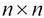大小的方阵，如下所示:

```py
(defn square-mat
  "Creates a square matrix of size n x n 
  whose elements are all e"
  [n e]
  (let [repeater #(repeat n %)]
    (matrix (-> e repeater repeater))))
```

在前面的例子中，我们定义了一个闭包来重复一个值 *n 次*，显示为`repeater`。然后我们使用*线程*宏(`->`)通过闭包传递元素`e`两次，最后将`matrix`函数应用于线程宏的结果。我们可以扩展这个定义，以允许我们指定用于生成矩阵的矩阵实现；这是按如下方式完成的:

```py
(defn square-mat
  "Creates a square matrix of size n x n whose 
  elements are all e. Accepts an option argument 
  for the matrix implementation."
  [n e & {:keys [implementation] 
          :or {implementation :persistent-vector}}]
  (let [repeater #(repeat n %)]
    (matrix implementation (-> e repeater repeater))))
```

`square-mat`函数被定义为函数，接受可选的关键字参数，指定生成矩阵的矩阵实现。我们将 core.matrix 的默认`:persistent-vector`实现指定为`:implementation`关键字的默认值。

现在，我们可以使用该函数创建方阵，并根据需要指定矩阵实现:

```py
user> (square-mat 2 1)
[[1 1] [1 1]]
user> (square-mat 2 1 :implementation :clatrix)
 A 2x2 matrix
 -------------
 1.00e+00  1.00e+00
 1.00e+00  1.00e+00
```

经常使用的一种特殊类型的矩阵是单位矩阵。一个 **单位矩阵** 是一个对角元素为 *1* ，其他元素均为 *0* 的方阵。我们正式定义一个单位矩阵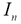如下:

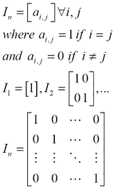

我们可以使用前面提到的、中的`cl/map-indexed`函数实现一个函数来创建一个单位矩阵，如下面的代码片段所示。我们首先使用之前定义的`square-mat`函数创建一个大小的方阵`init`，然后使用`cl/map-indexed`将所有对角元素映射到`1`:

```py
(defn id-mat
  "Creates an identity matrix of n x n size"
  [n]
  (let [init (square-mat :clatrix n 0)
       identity-f (fn [i j n]
                     (if (= i j) 1 n))]
    (cl/map-indexed identity-f init)))
```

core.matrix 库也有自己的函数版本，名为`identity-matrix`:

```py
user> (id-mat 5)
 A 5x5 matrix
 -------------
 1.00e+00  0.00e+00 0.00e+00 0.00e+00 0.00e+00
 0.00e+00  1.00e+00 0.00e+00 0.00e+00 0.00e+00
 0.00e+00  0.00e+00 1.00e+00 0.00e+00 0.00e+00
 0.00e+00  0.00e+00 0.00e+00 1.00e+00 0.00e+00 
 0.00e+00  0.00e+00 0.00e+00 0.00e+00 1.00e+00 
user> (pm (identity-matrix 5))
[[1.000 0.000 0.000 0.000 0.000]
 [0.000 1.000 0.000 0.000 0.000]
 [0.000 0.000 1.000 0.000 0.000]
 [0.000 0.000 0.000 1.000 0.000]
 [0.000 0.000 0.000 0.000 1.000]]
nil
```

我们将遇到的另一个常见场景是需要用随机数据生成一个矩阵。让我们实现下面的函数来生成一个随机矩阵，就像之前定义的`square-mat`函数一样，使用`rand-int`函数。注意，`rand-int`函数接受一个参数`n`，并返回一个在`0`和`n`之间的随机整数:

```py
(defn rand-square-mat 
  "Generates a random matrix of size n x n"
  [n]
  ;; this won't work
  (matrix (repeat n (repeat n (rand-int 100))))) 
```

但是这个函数产生的是一个元素都是单随机数的矩阵，用处不大。例如，如果我们调用`rand-square-mat`函数并将任意整数作为其参数，那么它将返回一个具有单一独特随机数的矩阵，如以下代码片段所示:

```py
user> (rand-square-mat 4)
[[94 94] [94 94] [94 94] [94 94]]
```

相反，我们应该使用`rand-int`函数映射由`square-mat`函数生成的方阵的每个元素，为每个元素生成一个随机数。不幸的是，`cl/map`只适用于由 clatrix 库创建的矩阵，但是我们可以很容易地在 Clojure 中使用一个惰性序列复制这种行为，正如由`repeatedly`函数返回的那样。注意，`repeatedly`函数接受一个延迟生成序列的长度和一个用作该序列生成器的函数作为参数。因此，我们可以使用 clatrix 和 core.matrix 库实现函数来生成随机矩阵，如下所示:

```py
(defn rand-square-clmat
  "Generates a random clatrix matrix of size n x n"
  [n]
  (cl/map rand-int (square-mat :clatrix n 100)))

(defn rand-square-mat
  "Generates a random matrix of size n x n"
  [n]
  (matrix
   (repeatedly n #(map rand-int (repeat n 100)))))
```

这个实现按预期工作，新矩阵的每个元素现在是一个独立生成的随机数。我们可以在 REPL 中通过调用以下修改后的`rand-square-mat`函数来验证这一点:

```py
user> (pm (rand-square-mat 4))
[[97.000 35.000 69.000 69.000]
 [50.000 93.000 26.000  4.000]
 [27.000 14.000 69.000 30.000]
 [68.000 73.000 0.0007 3.000]]
nil
user> (rand-square-clmat 4)
 A 4x4 matrix
 -------------
 5.30e+01  5.00e+00  3.00e+00  6.40e+01 
 6.20e+01  1.10e+01  4.10e+01  4.20e+01 
 4.30e+01  1.00e+00  3.80e+01  4.70e+01 
 3.00e+00  8.10e+01  1.00e+01  2.00e+01
```

我们还可以使用 clatrix 库中的`cl/rnorm`函数生成一个随机元素的矩阵。此功能生成一个正态分布随机元素矩阵，具有可选的指定平均值和标准偏差。矩阵是正态分布的，即所有元素围绕指定的平均值均匀分布，分布范围由标准偏差指定。因此，低标准偏差会产生一组几乎等于平均值的值。

`cl/rnorm`功能有几个重载。让我们来看看 REPL 的一些例子:

```py
user> (cl/rnorm 10 25 10 10)
 A 10x10 matrix
 ---------------
-1.25e-01  5.02e+01 -5.20e+01  .  5.07e+01  2.92e+01  2.18e+01 
-2.13e+01  3.13e+01 -2.05e+01  . -8.84e+00  2.58e+01  8.61e+00 
 4.32e+01  3.35e+00  2.78e+01  . -8.48e+00  4.18e+01  3.94e+01 
 ... 
 1.43e+01 -6.74e+00  2.62e+01  . -2.06e+01  8.14e+00 -2.69e+01 
user> (cl/rnorm 5)
 A 5x1 matrix
 -------------
 1.18e+00 
 3.46e-01 
-1.32e-01 
 3.13e-01 
-8.26e-02 
user> (cl/rnorm 3 4)
 A 3x4 matrix
 -------------
-4.61e-01 -1.81e+00 -6.68e-01  7.46e-01 
 1.87e+00 -7.76e-01 -1.33e+00  5.85e-01 
 1.06e+00 -3.54e-01  3.73e-01 -2.72e-02 
```

在前面的示例中，第一个调用指定了平均值、标准偏差以及行数和列数。第二个调用指定了一个参数 *n* 并产生一个大小为的矩阵。最后，第三个调用指定矩阵的行数和列数。

core.matrix 库还提供了一个`compute-matrix`函数来生成矩阵，对于 Clojure 程序员来说会感觉很习惯。该函数需要一个表示矩阵大小的向量，以及一个接受与矩阵的维数相等的参数的函数。事实上，`compute-matrix`足够灵活，可以实现单位矩阵的生成，以及随机生成元素的矩阵。

我们可以实现以下函数来创建一个单位矩阵，以及一个使用`compute-matrix`函数的随机元素矩阵:

```py
(defn id-computed-mat
  "Creates an identity matrix of size n x n 
  using compute-matrix"
  [n]
  (compute-matrix [n n] #(if (= %1 %2) 1 0)))

(defn rand-computed-mat
  "Creates an n x m matrix of random elements 
  using compute-matrix"
  [n m]
  (compute-matrix [n m] 
   (fn [i j] (rand-int 100))))
```


# 添加矩阵

Clojure 语言不直接支持矩阵上的操作，而是通过 core.matrix 规范来实现。尝试在 REPL 中添加两个矩阵，如下面的代码片段所示，只会引发一个错误，指出在应该是整数的地方找到了一个向量:

```py
user> (+ (matrix [[0 1]]) (matrix [[0 1]]))
ClassCastException clojure.lang.PersistentVector cannot be cast to java.lang.Number  clojure.lang.Numbers.add (Numbers.java:126)
```

这是因为`+`函数对数字而不是矩阵进行操作。要添加矩阵，我们应该使用来自`core.matrix.operators`名称空间的函数。在我们包含了`core.matrix.operators`之后，名称空间声明应该看起来像下面的代码片段:

```py
(ns my-namespace
  (:use clojure.core.matrix)
  (:require [clojure.core.matrix.operators :as M]))
```

请注意，这些函数实际上是被导入到一个别名名称空间中的，因为像`+`和`*`这样的函数名与默认 Clojure 名称空间中的相冲突。在实践中，我们应该总是试图通过`:require`和`:as`过滤器使用别名名称空间，并避免使用`:use`过滤器。或者，我们可以通过在名称空间声明中使用`:refer-clojure`过滤器来简单地不引用冲突的函数名，如下面的代码所示。但是，这应该谨慎使用，只作为最后的手段。

对于本节中的代码示例，为了清楚起见，我们将使用前面的声明:

```py
(ns my-namespace
  (:use clojure.core.matrix)
  (:require clojure.core.matrix.operators)
  (:refer-clojure :exclude [+ - *])) 
```

我们可以使用`M/+`函数来执行两个或多个矩阵的矩阵加法。为了检查任意数量矩阵的相等性，我们使用`M/==`函数:

```py
user> (def A (matrix [[0 1 2] [3 4 5]]))
#'user/A
user> (def B (matrix [[0 0 0] [0 0 0]]))
#'user/B
user> (M/== B A)
false
user> (def C (M/+ A B))
#'user/C
user> C
[[0 1 2] [3 4 5]]
user> (M/== C A)
true
```

如果以下等式成立，则两个矩阵 *A* 和 *B* 相等:

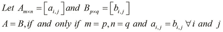

因此，前面的等式解释了当且仅当满足以下条件时，两个或多个矩阵相等:

*   每个矩阵都有相同数量的行和列
*   具有相同行和列索引的所有元素都是相等的

下面是矩阵等式的一个简单而优雅的实现。它基本上是使用标准的`reduce`和`map`函数来比较向量等式:

```py
(defn mat-eq
  "Checks if two matrices are equal"
  [A B]
  (and (= (count A) (count B))
       (reduce #(and %1 %2) (map = A B))))
```

我们首先使用`count`和`=`函数比较两个矩阵的行长度，然后使用`reduce`函数比较内部向量元素。本质上，`reduce`函数重复应用函数，该函数接受序列中连续元素的两个参数，并在序列中的所有元素都被应用的函数*减少*时返回最终结果。

或者，我们可以使用类似的组合，使用`every?`和`true?` Clojure 函数。使用表达式`(every? true? (map = A B))`，我们可以检查两个矩阵是否相等。请记住，`true?`函数如果传递了`true`则返回`true`(否则返回`false`)，如果给定的谓词函数为给定序列中的所有值返回`true`，则`every?`函数返回`true`。

要将两个矩阵相加，它们必须具有相等的行数和列数，和本质上是由具有相同行和列索引的元素的和组成的矩阵。两个矩阵 *A* 和 *B* 的和正式定义如下:

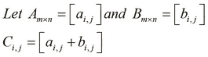

使用标准的`mapv`函数实现矩阵加法几乎是微不足道的，它只是返回向量的`map`函数的一个变体。我们将`mapv`应用于矩阵的每一行以及整个矩阵。注意，这个实现是针对向量中的向量的，尽管它可以很容易地与 core.matrix 的`matrix`和`as-vec`函数一起使用来操作矩阵。我们可以使用标准的`mapv`函数实现以下函数来执行矩阵加法:

```py
(defn mat-add
  "Add two matrices"
  [A B]
  (mapv #(mapv + %1 %2) A B))
```

通过使用`reduce`函数，我们可以很容易地将`mat-add`函数扩展到任意数量的矩阵。如以下代码所示，我们可以使用`reduce`函数扩展前面的`mat-add`定义，将其应用于任意数量的矩阵:

```py
(defn mat-add
  "Add two or more matrices"
  ([A B]
     (mapv #(mapv + %1 %2) A B))
  ([A B & more]
     (let [M (concat [A B] more)]
       (reduce mat-add M))))
```

对一个矩阵 *A* 的一个有趣的一元运算是一个矩阵的迹，表示为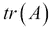。矩阵的迹本质上是其对角元素的和:


如前所述，使用`cl/map-indexed`和`repeatedly`函数实现矩阵的跟踪功能相当简单。我们在这里跳过它，作为您的练习。


# 乘法矩阵

乘法是矩阵上另一个重要的二元运算。在更广泛的意义上，术语**矩阵乘法**指的是将矩阵相乘以产生新矩阵的几种技术。

让我们在 REPL 中定义三个矩阵， *A* 、 *B* 和 *C* 以及单个值 *N* 。矩阵具有以下值:


我们可以使用 core.matrix 库中的`M/*`函数将矩阵相乘。除了用来乘两个矩阵之外，这个函数还可以用来乘任意数量的矩阵，以及标量值。我们可以尝试使用下面的`M/*`函数将 REPL 中的两个给定矩阵相乘:

```py
user> (pm (M/* A B))
[[140.000 200.000]
 [320.000 470.000]]
nil
user> (pm (M/* A C))
RuntimeException Mismatched vector sizes  clojure.core.matrix.impl.persistent-vector/... 
user> (def N 10)
#'user/N
user> (pm (M/* A N))
[[10.000 20.000 30.000]
 [40.000 50.000 60.000]]
nil
```

首先，我们计算两个矩阵的乘积。这个操作被称为**矩阵-矩阵乘法** 。然而，矩阵 *A* 和 *C* 相乘不起作用，因为矩阵的大小不兼容。这就给我们带来了矩阵相乘的第一条规则:要将两个矩阵 *A* 和 *B* 相乘， *A* 中的列数必须等于 *B* 中的行数。结果矩阵具有与 *A* 相同的行数和与 *B* 相同的列数。这就是为什么 REPL 不同意将 A 和 C 相乘，而只是抛出了一个例外。

对于大小为的矩阵 *A* ，大小为的矩阵 *B* ，两个矩阵的乘积只有在存在，并且 *A* 和 *B* 的乘积是大小为的新矩阵。

矩阵 *A* 和 *B* 的乘积是通过将 *A* 中的行元素与 *B* 中的相应列元素相乘，然后将结果值相加，从而为 *A* 中的每一行和 *B* 中的每一列生成一个值。因此，最终产品的行数与 *A* 相同，列数与 *B* 相同。

我们可以将两个大小兼容的矩阵的乘积定义如下:

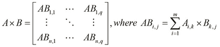

以下是如何使用来自 *A* 和 *B* 的元素来计算两个矩阵的乘积的说明:

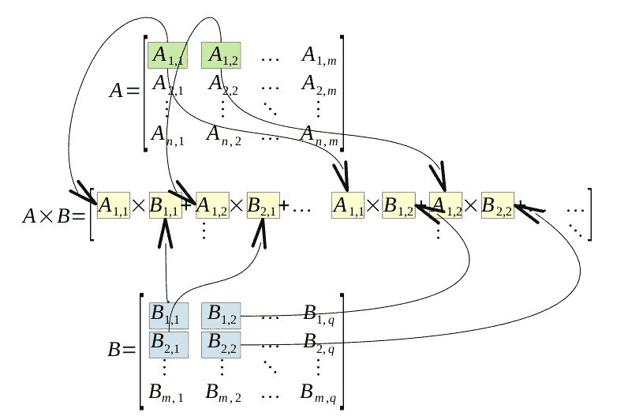

这看起来有点复杂，所以让我们用一个例子来演示前面的定义，使用我们之前定义的矩阵 *A* 和 *B* 。事实上，以下计算与 REPL 产生的价值相符:

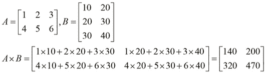

请注意，矩阵相乘不是一种交换运算。然而，这种运算确实表现出函数的关联性质。对于产品兼容尺寸的矩阵 *A* 、 *B* 和 *C* ，以下属性始终为真，只有一个例外，我们将在后面揭示:

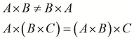

一个显而易见的推论是，一个方阵与另一个相同大小的方阵相乘，会产生一个与两个原始矩阵大小相同的合成矩阵。此外，方阵的平方、立方和其他次方会产生相同大小的矩阵。

方阵的另一个有趣的性质是，它们有一个用于乘法的单位元，即乘积兼容大小的单位矩阵。但是，一个单位矩阵本身就是一个方阵，这使我们得出结论*一个方阵与一个单位矩阵的乘法是一个交换运算*。因此，当一个矩阵是单位矩阵而另一个是方阵时，矩阵的交换规则，即矩阵乘法不可交换，实际上是不成立的。这可以用下面的等式来概括:

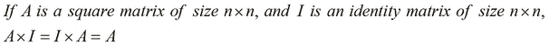

矩阵乘法的简单实现将具有的时间复杂度，并且对于一个矩阵需要八次乘法运算。所谓时间复杂度，我们指的是特定算法运行到完成所花费的时间。因此，线性代数库使用更高效的算法，比如 *Strassen 的算法*，来实现矩阵乘法，只需要 7 次乘法运算，将复杂度降低到。

矩阵乘法的 clatrix 库实现比默认的持久向量实现性能好得多，因为它与本地库接口。在实践中，我们可以使用一个基准库，比如用于 Clojure 的 criterium([http://github.com/hugoduncan/criterium](http://github.com/hugoduncan/criterium))来执行这个比较。或者，我们也可以简单地比较这两种实现的性能，方法是定义一个简单的函数将两个矩阵相乘，然后使用我们之前定义的函数`rand-square-mat`和`rand-square-clmat`将不同实现的大矩阵传递给它。我们可以定义一个函数来度量两个矩阵相乘所需的时间。

此外，我们可以定义两个函数来乘以使用我们之前定义的`rand-square-mat`和`rand-square-clmat`函数创建的矩阵，如下所示:

```py
(defn time-mat-mul
  "Measures the time for multiplication of two matrices A and B"
  [A B]
  (time (M/* A B)))

(defn core-matrix-mul-time []
  (let [A (rand-square-mat 100)
        B (rand-square-mat 100)]
    (time-mat-mul A B)))

(defn clatrix-mul-time []
  (let [A (rand-square-clmat 100)
        B (rand-square-clmat 100)]
    (time-mat-mul A B)))
```

我们可以看到，core.matrix 实现计算两个随机生成的矩阵的乘积平均需要一秒钟。然而，clatrix 实现平均花费不到一毫秒，尽管第一次调用通常需要 35 到 40 毫秒来加载本机 BLAS 库。当然，根据计算它的硬件，这个值可能会略有不同。然而，当处理大型矩阵时，除非有合理的理由，如硬件不兼容或避免额外的依赖性，否则最好使用 clatrix。

接下来，我们来看看*标量乘法*，简单来说就是将单个值 *N* 或者一个标量乘以一个矩阵。结果矩阵的大小与原始矩阵的大小相同。对于 2 x 2 矩阵，我们可以将标量乘法定义如下:


对于矩阵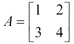和，以下是乘积:


注意，我们还可以使用 core.matrix 库中的`scale`函数来执行标量乘法:

```py
user> (pm (scale A 10))
[[10.000 20.000 30.000]
 [40.000 50.000 60.000]]
nil
user> (M/== (scale A 10) (M/* A 10))
true
```

最后，我们将简要地看一下矩阵乘法的一种特殊形式，称为矩阵向量乘法。向量只是一个单行矩阵，与乘积兼容大小的方阵相乘产生一个与原始向量大小相同的新向量。在将大小为的矩阵 *A* 与大小为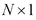的向量 *V* 的转置*V’*相乘后，产生大小为的新向量 *V"* 。如果 *A* 是一个方阵，那么 *V"* 与转置矩阵 *V'* 的大小相同。


# 转置和反转矩阵

另一种常用的初等矩阵运算是矩阵的*转置*。矩阵 *A* 的转置表示为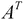或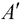。定义矩阵转置的一个简单方法是通过矩阵的*主对角线*来反映矩阵。对于素对角线，我们指的是包含行和列索引相等的元素的对角线。我们也可以通过交换矩阵的行和列来描述矩阵的转置。我们可以使用 core.matrix 中的以下`transpose`函数来执行该操作:

```py
user> (def A (matrix [[1 2 3] [4 5 6]]))
#'user/A
user> (pm (transpose A))
[[1.000 4.000]
 [2.000 5.000]
 [3.000 6.000]]
nil
```

我们可以定义以下三种可能的方式来获得矩阵的转置:

*   原始矩阵反映在其主对角线上
*   矩阵的行成为转置矩阵的列
*   矩阵的列成为其转置矩阵的行

因此，矩阵中的每个元素在其转置中都交换了行和列，反之亦然。这可以用下面的公式正式表示:


这给我们带来了可逆矩阵的概念。如果存在另一个方阵是一个矩阵的逆矩阵，并且当与原矩阵相乘时产生一个单位矩阵，则称该方阵是可逆的。如果以下等式成立，则大小为的矩阵 *A* 被称为具有逆矩阵 *B* :


让我们使用 core.matrix 中的`inverse`函数来测试这个等式。注意，core.matrix 库的默认持久实现不实现逆运算，所以我们使用 clatrix 库中的矩阵来代替。在下面的例子中，我们使用`cl/matrix`函数从网格库中创建一个矩阵，使用`inverse`函数确定其逆矩阵，并使用`M/*`函数将这两个矩阵相乘:

```py
user> (def A (cl/matrix [[2 0] [0 2]]))
#'user/A
user> (M/* (inverse A) A)
 A 2x2 matrix
 -------------
 1.00e+00  0.00e+00 
 0.00e+00  1.00e+00
```

在前面的例子中，我们首先定义了一个矩阵 *A* ，然后将其与其逆矩阵相乘以产生相应的单位矩阵。当我们对矩阵中的元素使用双精度数值类型时，一个有趣的观察是，并不是所有的矩阵在与它们的逆矩阵相乘时都会产生一个单位矩阵。

对于一些矩阵，可以观察到少量的误差，这是由于使用浮点数的 32 位表示的限制而发生的；这显示如下:

```py
user> (def A (cl/matrix [[1 2] [3 4]]))
#'user/A
user> (inverse A)
 A 2x2 matrix
 -------------
-2.00e+00  1.00e+00 
 1.50e+00 -5.00e-01
```

为了求一个矩阵的逆矩阵，我们必须首先定义那个矩阵的*行列式* ，它只是从一个给定的矩阵中确定的另一个值。首先，行列式只存在于方阵中，因此，逆矩阵只存在于行数和列数相等的矩阵中。矩阵的行列式表示为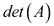或。行列式为零的矩阵称为 *奇异矩阵*。对于矩阵 *A* ，我们将其行列式定义如下:


我们可以用前面的定义来表示任意大小的矩阵的行列式。一个有趣的观察是单位矩阵的行列式总是 *1* 。作为一个例子，我们将找到一个给定矩阵的行列式如下:


对于一个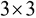矩阵，我们可以使用*萨鲁斯法则* 作为计算矩阵行列式的替代手段。为了使用这种方案找到矩阵的行列式，我们首先将矩阵的前两列写出到第三列的右边，这样一行有五列。接下来，我们将从上到下的对角线的乘积相加，并从底部减去对角线的乘积。这个过程可以用下图来说明:


通过使用萨鲁斯法则，我们将矩阵 *A* 的行列式正式表示如下:

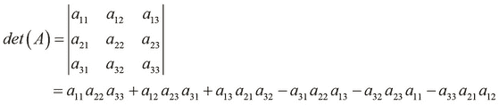

我们可以从 core.matrix 使用下面的`det` 函数计算 REPL 中矩阵的行列式，注意这个操作不是由 core.matrix 的默认持久向量实现来实现的

```py
user> (def A (cl/matrix [[-2 2 3] [-1 1 3] [2 0 -1]]))
#'user/A
user> (det A)
6.0
```

现在我们已经定义了矩阵的行列式，让我们用它来定义矩阵的逆矩阵。我们已经讨论了可逆矩阵的概念；求一个矩阵的逆矩阵就是简单地确定一个矩阵，使得它与原矩阵相乘时产生一个单位矩阵。

矩阵的逆矩阵要存在，它的行列式必须非零。接下来，对于原始矩阵中的每一个元素，我们在不包含所选元素的行和列的情况下，找到矩阵的行列式。这产生一个与原始矩阵大小相同的矩阵(称为原始矩阵的*余因子矩阵*)。余因子矩阵的转置称为原矩阵的*伴随*。伴随矩阵产生除以原矩阵行列式的逆。现在，让我们正式定义一个矩阵的逆 *A* 。我们将矩阵 *A* 的逆表示为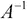，它可以形式化地表示如下:


作为一个例子，让我们找到一个样本矩阵的逆。我们实际上可以验证当与原始矩阵相乘时，逆矩阵会产生一个单位矩阵，如下例所示:


类似地，我们将矩阵的逆矩阵定义如下:

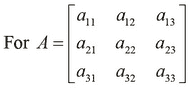

现在，让我们计算一个矩阵的逆矩阵:

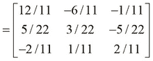

我们已经提到奇异和非方矩阵没有逆矩阵，我们可以看到当提供这样的矩阵时，`inverse`函数抛出一个错误。如下面的 REPL 输出所示，如果给定矩阵不是方阵，或者给定矩阵是奇异的，则`inverse`函数将抛出错误:

```py
user> (def A (cl/matrix [[1 2 3] [4 5 6]]))
#'user/A
user> (inverse A)
ExceptionInfo throw+: {:exception "Cannot invert a non-square matrix."}  clatrix.core/i (core.clj:1033)
user> (def A (cl/matrix [[2 0] [2 0]]))
#'user/A
user> (M/* (inverse A) A)
LapackException LAPACK DGESV: Linear equation cannot be solved because the matrix was singular.  org.jblas.SimpleBlas.gesv (SimpleBlas.java:274)
```


# 使用矩阵插值

让我们尝试一个例子来演示我们如何使用矩阵。本例使用矩阵在给定的一组点之间插入一条曲线。假设我们有一组给定的点来代表一些数据。目标是在点之间追踪一条平滑的线，以便产生一条估计数据形状的曲线。虽然这个例子中的数学公式可能看起来很难，但我们应该知道，这种技术实际上只是线性回归模型的一种正则化形式，被称为 **Tichonov 正则化** 。现在，我们将关注如何在这种技术中使用矩阵，我们将在[第 2 章](ch02.html "Chapter 2. Understanding Linear Regression")、*了解线性回归*中深入讨论正则化。

我们将首先定义一个插值矩阵 *L* ，它可以用来确定给定数据点的估计曲线。它本质上是向量 *[-1，2，-1]* 对角移动矩阵的列。这种矩阵称为 **带状矩阵**:


我们可以使用下面的`compute-matrix`函数简洁地定义矩阵 *L* 。注意，对于给定的尺寸 *n* ，我们生成一个尺寸为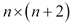的矩阵:

```py
(defn lmatrix [n]
  (compute-matrix :clatrix [n (+ n 2)]
                  (fn [i j] ({0 -1, 1 2, 2 -1} (- j i) 0))))
```

前面示例中的匿名闭包使用映射来决定指定行和列索引处的元素值。例如，行索引 *2* 和列索引 *3* 处的元素是 *2* ，因为`(- j i)`是 *1* 并且映射中的键 *1* 的值是 *2* 。我们可以通过 REPL 验证生成的矩阵与矩阵`lmatrix`的结构相似，如下所示:

```py
user> (pm (lmatrix 4))
[[-1.000 2.000 -1.000  0.000  0.000  0.000]
[ 0.000 -1.000  2.000 -1.000  0.000  0.000]
[ 0.000  0.000 -1.000  2.000 -1.000  0.000]
[ 0.000  0.000  0.000 -1.000  2.000 -1.000]]
nil
```

接下来，我们定义如何表示我们打算插值的数据点。每个点都有一个观察值 *x* 传递给某个函数，以产生另一个观察值 *y* 。对于这个例子，我们简单地为 *x* 选择一个随机值，为 *y* 选择另一个随机值。我们重复执行这个过程来产生数据点。

为了用一个大小兼容的 *L* 矩阵来表示数据点，我们定义了下面这个名为`problem`的简单函数来返回问题定义的映射。这包括 *L* 矩阵、 *x* 的观察值、 *x* 的隐藏值，我们必须估计 *y* 的值来创建曲线，以及 *y* 的观察值。

```py
(defn problem
  "Return a map of the problem setup for a
  given matrix size, number of observed values 
  and regularization parameter"
  [n n-observed lambda]
  (let [i (shuffle (range n))]
    {:L (M/* (lmatrix n) lambda)
     :observed (take n-observed i)
     :hidden (drop n-observed i)
     :observed-values (matrix :clatrix
                              (repeatedly n-observed rand))}))
```

该函数的前两个参数是 *L* 矩阵中的行数`n`，以及观察值 *x* 的数量`n-observed`。该函数接受第三个参数`lambda`，它实际上是我们模型的正则化参数。这个参数决定了估计的曲线有多精确，我们将在后面的章节中更多地研究它与这个模型的关系。在前面函数返回的图中， *x* 和 *y* 的观察值有关键字`:observed`和`:observed-values`，而 *x* 的隐藏值有关键字`:hidden`。类似地，关键字`:L`被映射到兼容大小的 *L* 矩阵。

现在我们已经定义了我们的问题(或模型)，我们可以在给定点上绘制一条平滑的曲线。通过*平滑*，我们的意思是曲线中的每个点都是其紧邻点的平均值，还有一些高斯噪声。因此，该噪声曲线上的所有点具有高斯分布，其中所有值围绕某个平均值以及由某个标准偏差指定的分布分散。

如果我们将矩阵 *L* 分别在观察点和隐藏点上划分为和，我们可以定义一个公式来确定曲线，如下所示。下面的等式可能看起来有点令人生畏，但是如前所述，我们将在接下来的章节中研究这个等式背后的推理。使用矩阵 *L* ，该曲线可由如下计算的矩阵表示:


我们将 *x* 的隐藏值的观测值估计为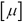，使用 *y* 的原始观测值，即和插值矩阵 *L* 计算出的两个矩阵。这两个矩阵仅使用矩阵的转置和反函数来计算。由于该等式右侧的所有值都是矩阵或向量，因此我们使用矩阵乘法来计算这些值的乘积。

前一个等式可以使用我们之前探索过的函数来实现。事实上，代码只包含这个等式，它是我们之前定义的函数`problem`返回的映射的前缀表达式。我们现在定义以下函数来解决由`problem`函数返回的问题:

```py
(defn solve
  "Return a map containing the approximated value 
y of each hidden point x"
  [{:keys [L observed hidden observed-values] :as problem}]
  (let [nc  (column-count L)
        nr  (row-count L)
        L1  (cl/get L (range nr) hidden)
        L2  (cl/get L (range nr) observed)
        l11 (M/* (transpose L1) L1)
        l12 (M/* (transpose L1) L2)]
    (assoc problem :hidden-values
      (M/* -1 (inverse l11) l12 observed-values))))
```

前面的函数计算y 的估计值，并简单地使用`assoc`函数将它们添加到带有关键字`:hidden-values`的原始地图中。

很难想象曲线的计算值，所以我们现在将使用*咒语*库([http://github.com/liebke/incanter](http://github.com/liebke/incanter))来绘制估计的曲线和原始点。这个库本质上提供了一个简单且惯用的 API 来创建和查看各种类型的绘图和图表。

### 注意

通过向`project.clj`文件添加以下依赖项，可以将咒语库添加到 Leiningen 项目中:

```py
[incanter "1.5.4"]
```

对于接下来的示例，命名空间声明应该类似于以下内容:

```py
(ns my-namespace
  (:use [incanter.charts :only [xy-plot add-points]]
        [incanter.core   :only [view]])
  (:require [clojure.core.matrix.operators :as M]
            [clatrix.core :as cl]))
```

我们现在定义一个简单的函数，该函数将使用函数绘制给定数据的图形，例如来自 Incanter 库的`xy-plot`和`view`:

```py
(defn plot-points
  "Plots sample points of a solution s"
  [s]
  (let [X (concat (:hidden s) (:observed s))
        Y (concat (:hidden-values s) (:observed-values s))]
    (view
     (add-points
      (xy-plot X Y) (:observed s) (:observed-values s)))))
```

因为这是我们第一次接触咒语库，所以让我们来讨论一些用来实现`plot-points`的函数。我们首先将 *x* 轴上的所有值绑定到`X`，将 *y* 轴上的所有值绑定到`Y`。然后，我们使用`xy-plot`函数将这些点绘制成曲线，该函数将两组值作为参数绘制在 *x* 和 *y* 轴上，并返回一个图表或图形。接下来，我们使用`add-points`函数将最初观察到的点添加到图中。`add-points`函数需要三个参数:原始图形、 *x* 轴分量的所有值的向量和 *y* 轴分量的所有值的向量。该函数还返回一个图，如`xy-plot`函数，我们可以使用`view`函数查看该图。注意，我们可以等效地使用线程宏(`->`)来组成`xy-plot`、`add-points`和`view`函数。

现在，我们可以在一些随机数据上使用`plot-points`函数直观地显示估计曲线，如以下函数所示:

```py
(defn plot-rand-sample []
  (plot-points (solve (problem 150 10 30))))
```

当我们执行`plot-rand-sample`功能时，显示以下数值图:


# 总结

在本章中，我们通过 core.matrix 和 clatrix 库介绍了矩阵。以下是我们讨论的要点:

*   我们已经讨论了如何通过 core.matrix 和 clatrix 从矩阵中表示、打印和获取信息。我们还讨论了如何用一些随机数据生成矩阵。
*   我们已经讨论了矩阵的一些基本运算，如等式、加法、乘法、转置和求逆。
*   我们还通过一个使用矩阵的例子介绍了用于可视化数据图表的多功能咒语库。

接下来，我们将研究一些使用线性回归进行预测的基本技术。正如我们将看到的，这些技术中的一些，事实上，是基于简单的矩阵运算。线性回归实际上是一种监督学习，我们将在下一章讨论。**