# 二、了解线性回归

在这一章，我们开始探索机器学习模型和技术。机器学习的最终目标是*从一些经验样本数据中归纳出*事实。这被称为**概括**、，本质上是使用这些推断的事实以准确的速度对新的、看不见的数据进行准确处理的能力。机器学习的两大类是**监督**学习和**非监督**学习。术语**监督学习** 用于描述机器学习的任务，其中从一些标记的数据中形成理解或模型。通过标记，我们意味着样本数据与一些观察值相关联。从基本意义上说，模型是对数据以及数据如何随不同参数变化的统计描述。监督机器学习技术用来创建模型的初始数据被称为模型的**训练数据** 。另一方面，无监督学习技术通过在未标记数据中寻找模式来估计模型。由于无监督学习技术使用的数据是未标记的，因此通常没有明确的基于是或否的奖励系统来确定估计的模型是否准确和正确。

我们现在将检查*线性回归*，这是一个可以用于预测的有趣模型。作为一种监督学习，回归模型是从一些数据中创建的，其中许多参数以某种方式组合在一起，以产生几个目标值。该模型实际上描述了目标值和模型参数之间的关系，并且当提供有模型参数的值时，可以用于预测目标值。

我们将首先研究单变量和多变量的线性回归，然后描述可用于从一些给定数据制定机器学习模型的算法。我们将研究这些模型背后的推理，同时演示如何在 Clojure 中实现创建这些模型的算法。

# 了解单变量线性回归

我们经常遇到需要从一些样本数据中创建一个近似模型的情况。当提供了所需参数时，该模型可用于预测更多此类数据。例如，我们可能想要研究某个特定城市某一天的降雨频率，我们将假设降雨频率随当天的湿度而变化。如果我们知道某一天的湿度，一个公式化的模型可以用来预测该天降雨的可能性。我们从一些数据开始公式化模型，首先在这些数据上拟合一条带有一些参数和系数的直线(即方程)。这类模型被称为**线性回归**模型。如果我们假设样本数据只有一个维度，我们可以将线性回归视为在样本数据上拟合直线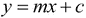的一种方式。

线性回归模型简单描述为表示模型的**回归和**或**因变量**的线性方程。公式化的回归模型可以有一个到几个参数，取决于可用的数据，模型的这些参数也被称为模型的**回归变量**、**特征**或**自变量**。我们将首先探索单个独立变量的线性回归模型。

使用单变量线性回归的一个示例问题是预测特定一天的降雨概率，这取决于当天的湿度。该训练数据可以用下面的表格形式表示:


对于单变量线性模型，因变量必须根据单个参数而变化。因此，我们的样本数据本质上由两个向量组成，即，一个是因变量 *Y* 的值，另一个是自变量 *X* 的值。两个向量长度相同。该数据可以正式表示为两个向量或单列矩阵，如下所示:


让我们快速定义 Clojure 中两个矩阵后的， *X* 和 *Y* ，来表示一些样本数据:

```
(def X (cl/matrix [8.401 14.475 13.396 12.127 5.044
                      8.339 15.692 17.108 9.253 12.029]))

(def Y (cl/matrix [-1.57 2.32  0.424  0.814 -2.3
           0.01 1.954 2.296 -0.635 0.328]))
```

这里，我们定义 10 个点的数据；使用下面的咒语`scatter-plot`功能，这些点可以很容易地绘制在散点图上:

```
(def linear-samp-scatter
  (scatter-plot X Y))

(defn plot-scatter []
  (view linear-samp-scatter))

(plot-scatter)
```

前面的代码显示了我们数据的散点图:


之前的散点图是我们在`X`和`Y`中定义的 10 个数据点的简单表示。

### 注意

`scatter-plot`函数可以在咒语库的`charts`命名空间中找到。使用此函数的文件的命名空间声明应类似于以下声明:

```
(ns my-namespace
  (:use [incanter.charts :only [scatter-plot]]))
```

现在我们有了数据的可视化，让我们在给定的数据点上估计一个线性模型。我们可以使用咒语库中的`linear-model`函数生成任意数据的线性模型。这个函数返回一个描述公式化模型的映射，以及许多关于这个模型的有用数据。首先，我们可以通过使用该图中的`:fitted`键值对，在之前的散点图上绘制线性模型。我们首先从返回的地图中获取`:fitted`键的值，并使用`add-lines`函数将其添加到散点图中；这显示在以下代码中:

```
(def samp-linear-model
  (linear-model Y X))
(defn plot-model []
  (view (add-lines samp-scatter-plot 
          X (:fitted linear-samp-scatter))))

(plot-model)
```

这段代码在我们之前定义的散点图上生成了线性模型的如下不言自明的图:


前面的图将线性模型`samp-linear-model`描绘为在我们在`X`和`Y`中定义的 10 个数据点上绘制的直线。

### 注

`linear-model`函数可以在咒语库的`stats`命名空间中找到。使用`linear-model`的文件的名称空间声明应该类似于下面的声明:

```
(ns my-namespace
  (:use [incanter.stats :only [linear-model]]))
```

嗯，看起来好像咒语的`linear-model`功能为我们做了大部分工作。本质上，该函数通过使用**普通最小二乘法** ( **OLS** )曲线拟合算法来创建我们数据的线性模型。我们将很快深入这个算法的细节，但是让我们首先理解一条曲线如何精确地拟合到一些给定的数据上。

我们先来定义一条直线是如何表示的。在坐标几何中，直线只是独立变量 *x* 的函数，它具有给定的斜率 *m* 和截距 *c* 。线 *y* 的作用可以正式写成。线条的斜率代表当 *x* 的值变化时 *y* 的值变化多少。该方程的截距正好是直线与图中的 *y* 轴相交的地方。请注意，等式 *y* 与 *Y* 不同，后者实际上代表我们已经获得的等式的值。

类似于坐标几何中直线的定义，我们使用矩阵 *X* 和 *Y* 的定义正式定义了单变量线性回归模型，如下所示:


单变量线性模型的这种定义实际上非常通用，因为我们可以使用同一个方程来定义多变量线性模型；我们将在本章后面看到这一点。在前面的定义中，术语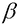是表示 *y* 相对于 *x* 的线性比例的系数。就几何学而言，它只是符合矩阵 *X* 和 *Y* 中给定数据的直线的斜率。由于 *X* 是一个矩阵或向量，也可以被认为是矩阵 *X* 的缩放因子。

另外，术语是解释当 *x* 为零时 *y* 的值的另一个系数。换句话说，它是等式的 *y* 截距。公式化模型的系数称为线性模型的**回归系数**或**效应**，系数称为模型的**误差项**或**偏差**。一个模型甚至可能有几个回归系数，我们将在本章后面看到。原来，误差实际上只是另一个回归系数，可以按照惯例与模型的其他影响一起提及。有趣的是，这种误差通常决定了数据的分散性或方差。

使用前面例子中的`linear-model`函数返回的映射，我们可以很容易地检查生成的模型的系数。返回的映射有一个`:coefs`键，它映射到一个包含模型系数的向量。按照惯例，误差项也包含在这个向量中，只是作为另一个系数:

```
user> (:coefs samp-linear-model)
[-4.1707801647266045 0.39139682427040384]
```

现在我们已经定义了数据的线性模型。很明显，并不是所有的点都在一条代表公式化模型的直线上。在 *y* 轴上，每个数据点都与线性模型图有一些偏差，这种偏差可以是正的，也可以是负的。为了表示模型与给定数据的总体偏差，我们使用*残差平方和*、*均方误差*和*均方根误差*函数。这三个函数的值表示公式化模型中误差量的标量测量。

术语*误差*和*残差*之间的区别在于，误差是对观察值与其期望值的差异量的度量，而残差是对不可观察统计误差的估计，我们使用的统计模型无法对其建模或理解。我们可以说，在一组观察值中，一个观察值与所有值的平均值之间的差是一个残差。公式化模型中残差的数量必须等于样本数据中因变量的观察值的数量。

我们可以使用`:residuals`关键字从由`linear-model`函数生成的线性模型中获取残差，如下面的代码所示:

```
user> (:residuals samp-linear-model)
[-0.6873445559690581 0.8253111334125092 -0.6483716931997257 0.2383108767994172 -0.10342541689331242 0.9169220471357067 -0.01701880172457293 -0.22923670489146497 -0.08581465024744239 -0.20933223442208365]
```

**预测的误差平方和** ( **SSE** ) 就是公式化模型中的误差之和。注意，在下面的等式中，误差项的符号并不重要，因为我们对该差值求平方；因此，它总是产生正值。SSE 也被称为**残差平方和** ( **RSS** )。

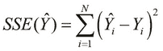

`linear-model`函数也计算公式化模型的 SSE，这个值可以使用`:sse`关键字检索；下面几行代码说明了这一点:

```
user> (:sse samp-linear-model)
2.5862250345284887
```

**均方误差** ( **MSE** )测量公式化模型中误差的平均大小，而不考虑误差的方向。我们可以通过对因变量的所有给定值与其在公式化线性模型上的相应预测值的差值求平方，并计算这些平方误差的平均值来计算该值。MSE 也称为模型的**均方预测误差**。如果公式化模型的 MSE 为零，那么我们可以说该模型完全符合给定的数据。当然，这对于真实数据实际上是不可能的，尽管我们可以找到一组理论上 MSE 为零的值。

对于因变量的一组给定的 *N* 值和从公式化模型计算的一组估计值，我们可以正式表示公式化模型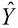的 MSE 函数如下:


**均方根误差** ( **RMSE** ) 或**均方根偏差**就是 MSE 的平方根，而通常用于测量公式化线性模型的偏差。RMSE 偏向于较大的误差，因此与尺度相关。这意味着当不希望出现大误差时，RMSE 特别有用。

我们可以正式定义公式化模型的 RMSE 如下:


公式化线性模型精度的另一个度量是**决定系数** ，写为。决定系数表示公式化模型与给定样本数据的拟合程度，定义如下。该系数根据样本数据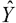中观察值的平均值、SSE 和误差总和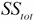来定义。


我们可以使用`:r-square`关键字从`linear-model`函数生成的模型中检索出的计算值，如下所示:

```
user> (:r-square samp-linear-model)
0.8837893226172282
```

为了建立一个最适合样本数据的模型，我们应该努力使前面描述的值最小化。对于一些给定的数据，我们可以制定几个模型，并计算每个模型的总误差。该计算误差可用于确定哪个公式化模型最适合数据，从而为给定数据选择最佳线性模型。

基于公式化模型的 MSE，该模型被称为具有 **成本函数** 。在一些数据上拟合线性模型的问题等价于最小化公式化线性模型的成本函数的问题。表示为的的成本函数可以简单地认为是公式化模型的参数的函数。通常，这个成本函数转化为模型的 MSE。因为 RMSE 随着模型的公式化参数而变化，所以模型的以下成本函数是这些参数的函数:

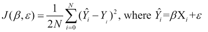

这给我们带来了对线性模型的估计效应和的一些数据拟合线性回归模型的问题的以下正式定义:


该定义规定，我们可以通过确定这些参数的值来估计由参数和表示的线性模型，对于这些参数，成本函数采用最小可能值，理想地为零。

### 注意

在上式中，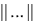表达式表示成本函数的标准范数 *N* 维欧几里德空间。术语*范数*，我们指的是在 N*维空间中只有正值的函数。*

让我们想象公式化的模型的成本函数的欧几里德空间如何相对于模型的参数变化。为此，我们假设代表常值误差的参数为零。在参数上的线性模型的成本函数的曲线将理想地表现为抛物线，类似于下面的曲线:


对于单个参数，我们可以绘制前面的二维图表。类似地，对于公式化模型的两个参数和，产生三维图。该图呈碗状或具有凸面，如下图所示。此外，我们可以将其推广到公式化模型的 *N* 个参数，并绘制出个维度的图。


# 了解梯度下降

梯度下降算法是最简单的技术之一，虽然不是最有效的技术，但可以形成成本函数或模型误差可能值最小的线性模型。该算法本质上是为公式化的线性模型寻找成本函数的局部最小值。

如前所述，单变量线性回归模型的成本函数的三维图将显示为具有*全局最小值*的凸面或碗状表面。所谓最小值，我们是指成本函数在图面上的这一点上具有最小的可能值。梯度下降算法本质上是从曲面上的任意点开始，并执行一系列步骤来逼近曲面的局部最小值。

这个过程可以想象成把一个球扔进山谷或两座相邻的小山之间，结果球慢慢地滚向海拔最低的地方。重复该算法，直到表面上当前点的表观成本函数值收敛到零，这象征性地意味着滚下山的球停止，如我们前面所述。

当然，如果图面上有多个局部最小值，梯度下降可能不会真正起作用。然而，对于一个适当缩放的单变量线性回归模型，图的表面总是有一个单一的全局最小值，正如我们前面所说明的。因此，在这种情况下，我们仍然可以使用梯度下降算法来找到绘图表面的全局最小值。

这个算法的要点是，我们从曲面上的某个点开始，然后向最低点走几步。我们可以用下面的等式来正式表示这一点:

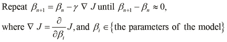

这里，我们从成本函数 *J* 的图上由表示的点开始，并递增地减去成本函数的一阶偏导数的乘积，该乘积是相对于公式化模型的参数导出的。这意味着我们在曲面上朝着局部最小值缓慢向下移动，直到我们在曲面上找不到更低的点。术语决定了我们走向局部最小值的步长有多大，被称为梯度下降算法的步*步*。我们重复这个迭代，直到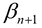和之间的差收敛到零，或者至少减小到接近零的阈值。

下图显示了向成本函数图表面的局部最小值下降的过程:


上图是图面的等高线图，其中圆形线连接高度相等的点。我们从点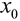开始，执行梯度下降算法的单次迭代，将表面向下步进到点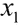。我们重复这个过程，直到我们到达相对于初始起点的表面的局部最小值。注意，通过每次迭代，步长减小，因为当我们接近局部最小值时，该表面的切线斜率也趋于零。

对于误差常数等于零的单变量线性回归模型，我们可以简化梯度下降算法的偏导数分量。当模型只有一个参数时，一阶偏导数就是图面上该点处切线的斜率。因此，我们计算这条切线的斜率，并在这个斜率的方向上前进一步，这样我们就到达了 *y* 轴上方的一个高程点。这显示在下面的公式中:

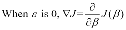

我们可以实现梯度下降算法的简化版本，如下所示:

```
(def gradient-descent-precision 0.001)

(defn gradient-descent
  "Find the local minimum of the cost function's plot"
  [F' x-start step]
  (loop [x-old x-start]
    (let [x-new (- x-old
                   (* step (F' x-old)))
          dx (- x-new x-old)]
      (if (< dx gradient-descent-precision)
        x-new
        (recur x-new)))))
```

在前面的函数中，我们从点`x-start`开始，递归应用梯度下降算法，直到值`x-new`收敛。注意，这个过程是使用`loop`形式作为尾部递归函数实现的。

使用偏导数，我们可以正式表示如何使用梯度下降算法计算参数和，如下所示:


# 了解多变量线性回归

多变量线性回归模型可以有多个变量或特征，这与我们之前研究的只有一个变量的线性回归模型相反。有趣的是，单变量线性模型的定义本身可以通过矩阵扩展到多个变量。

我们可以通过在样本数据中包含更多独立变量，如最低和最高温度，将我们之前预测特定日期降雨概率的示例扩展到一个多变量模型。因此，多变量线性回归模型的定型数据将类似于下图:

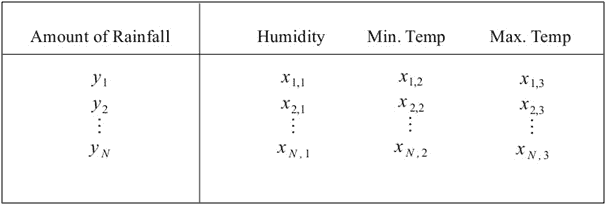

对于多变量线性回归模型，训练数据由两个矩阵定义， *X* 和 *Y* 。这里， *X* 是一个矩阵，其中 *P* 是模型中自变量的个数。矩阵 *Y* 是一个长度为 *N* 的向量，就像单变量的线性模型一样。该模型如下所示:

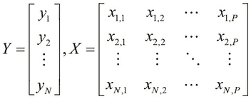

对于下面这个 Clojure 中多变量线性回归的例子,我们不会通过代码生成样本数据，而是使用来自 Incanter 库中的样本数据。我们可以使用咒语库的 `get-dataset`函数获取任何数据集。

### 注意

在接下来的例子中，来自咒语库中的`sel`、`to-matrix`和`get-dataset`函数可以导入到我们的名称空间中，如下所示:

```
(ns my-namespace
  (:use [incanter.datasets :only [get-dataset]]
        [incanter.core :only [sel to-matrix]]))
```

我们可以通过使用`:iris`关键字参数调用`get-dataset`函数来获取**虹膜**数据集；这显示如下:

```
(def iris
  (to-matrix (get-dataset :iris)))

(def X (sel iris :cols (range 1 5)))
(def Y (sel iris :cols 0))
```

我们首先使用`to-matrix`和`get-dataset`函数将变量`iris`定义为一个矩阵，然后定义两个矩阵`X`和`Y`。这里，`Y`实际上是一个 150 值的向量，或者说是一个大小为的矩阵，而`X`是一个大小为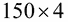的矩阵。因此，`X`可以用来表示四个自变量的值，`Y`表示因变量的值。注意，`sel`函数用于从`iris`矩阵中选择一组列。事实上，我们可以从`iris`数据矩阵中选择更多这样的列，但是为了简单起见，我们在下面的例子中只使用四列。

### 注

我们在前面的代码示例中使用的数据集是*虹膜*数据集，它可以在咒语库中找到。这个数据集具有相当多的历史意义，因为它被罗纳德·费雪爵士用来首次开发用于分类的**线性判别分析** ( **LDA** )方法(有关更多信息，请参考“Iris 中的物种问题”)。该数据集包含鸢尾属植物三个不同物种的 50 个样本，即 *Setosa* 、 *Versicolor* 和 *Virginica* 。在每个样品中测量这些物种的花的四个特征，即花瓣宽度、花瓣长度、萼片宽度和萼片长度。请注意，在本书的过程中，我们会多次遇到这个数据集。

有趣的是，`linear-model`函数接受具有多列的矩阵，因此我们可以使用该函数拟合一个针对单变量和多变量数据的线性回归模型，如下所示:

```
(def iris-linear-model
  (linear-model Y X))
(defn plot-iris-linear-model []
  (let [x (range -100 100)
        y (:fitted iris-linear-model)]
    (view (xy-plot x y :x-label "X" :y-label "Y"))))

(plot-iris-linear-model)
```

在前面的代码示例中，我们使用`xy-plot`函数绘制线性模型，同时提供可选参数来指定定义绘图中的轴标签。此外，我们通过使用`range`函数生成一个矢量来指定 *x* 轴的范围。`plot-iris-linear-model`功能生成以下图形:

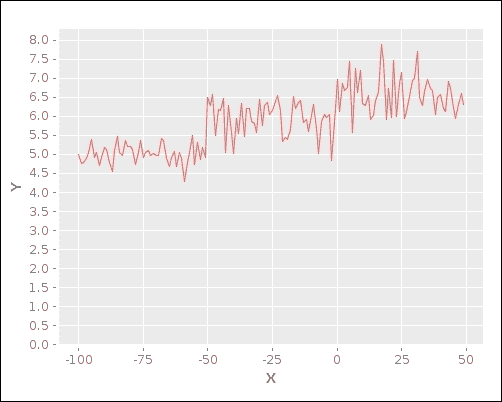

尽管从上一个示例中生成的曲线图中的曲线似乎没有任何确定的形状，我们仍然可以通过向公式化模型提供自变量的值，使用这个生成的模型来估计或预测因变量的值。为了做到这一点，我们必须首先定义具有多个特征的线性回归模型的因变量和自变量之间的关系。

独立变量 *P* 的线性回归模型产生回归系数，因为我们包括了误差常数以及模型的其他系数，并且还定义了一个额外的变量，它总是 *1* 。

`linear-model`函数符合公式模型中系数 *P* 的个数总是比样本数据中自变量总数 *N* 多 1 的命题；这显示在以下代码中:

```
user> (= (count (:coefs iris-linear-model)) 
         (+ 1 (column-count X)))
true
```

我们将多变量回归模型的因变量和自变量之间的关系正式表示如下:

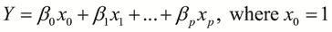

由于变量在上式中始终为 *1* ，因此的值类似于单变量线性模型定义的误差常数。

我们可以定义一个向量来表示前面方程的所有系数为。这个向量被称为公式化回归模型的 **参数向量** 。此外，模型的独立变量可以用向量表示。因此，我们可以将回归变量 *Y* 定义为参数向量转置和模型自变量向量的乘积:

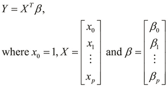

多项式函数也可以通过用单个变量代替多项式方程中的每个高阶变量来简化为标准形式。例如，考虑下面的多项式方程:


我们可以用变量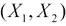代替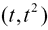，从而将方程简化为多变量线性回归模型的标准形式。

这将我们带到具有多个变量的线性模型的成本函数的以下形式定义，其仅仅是具有单个变量的线性模型的成本函数的定义的扩展:

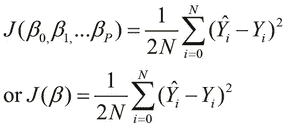

注意，在前面的定义中，我们可以将模型的各个系数与参数向量互换使用。

类似于我们的问题在某些给定数据上用单个变量拟合模型的定义，我们可以将制定多变量线性模型的问题定义为最小化前面的成本函数的问题:


## 多变量梯度下降

我们可以应用梯度下降算法来寻找具有多个变量的模型的局部最小值。当然，由于模型中有多个系数，我们必须对所有这些系数应用该算法，而不是在只有一个变量的回归模型中只有两个系数。

因此，梯度下降算法可用于寻找多变量线性回归模型的参数向量中所有系数的值，并且形式上定义如下:


在前面的定义中，术语仅指公式化模型中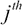自变量的样本值。同样，变量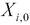总是 *1* 。因此，该定义可以仅应用于两个系数，这两个系数对应于我们先前对具有单个变量的线性回归模型的梯度下降算法的定义。

正如我们前面所看到的，梯度下降算法可以应用于具有单变量和多变量的线性回归模型。然而，对于某些模型，梯度下降算法实际上可能需要大量迭代，或者更确切地说，需要大量时间来收敛模型系数的估计值。有时，算法也会发散，因此在这种情况下我们将无法计算模型的系数。让我们来看看影响该算法的行为和性能的一些因素:

*   样本数据的所有特征必须相对于彼此进行缩放。通过缩放，我们的意思是样本数据中所有独立变量的值都具有相似的取值范围。理想情况下，所有独立变量的观测值必须在 *-1* 和 *1* 之间。这可以正式表述为:
*   我们可以将独立变量的观察值标准化到这些值的平均值。我们可以通过使用观察值的标准偏差来进一步标准化该数据。总之，我们将这些值替换为减去这些值的平均值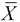，然后将结果表达式除以标准偏差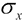所得的值。这在下面的公式中显示: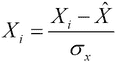
*   步进率或学习率是另一个重要因素，它决定了算法收敛到公式化模型参数值的速度。理想情况下，应选择步进率，以使模型参数的新旧迭代值之间的差异在每次迭代中具有最佳变化量。一方面，如果这个值太大，算法甚至会在每次迭代后产生模型参数的发散值。因此，在这种情况下，算法永远不会找到全局最小值。另一方面，该速率的较小值可能会导致算法因不必要的大量迭代而变慢。


# 理解普通最小二乘法

另一种估计线性回归模型参数向量的技术是**普通最小二乘法** ( **OLS** )方法。OLS 方法本质上是通过最小化线性回归模型中的误差平方和来工作的。

线性回归模型的预测误差平方和(SSE)可以根据模型的实际值和期望值定义如下:


SSE 的上述定义可以使用矩阵乘积进行分解，如下所示:


我们可以通过使用全局最小值的定义来求解用于估计参数向量的前述方程。由于该方程是二次方程的形式，并且项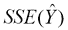总是大于零，因此成本函数的表面的全局最小值可以被定义为在该点处表面的切线斜率的变化率为零的点。此外，该图是线性模型参数的函数，因此表面图的方程应通过估计的参数向量进行微分。因此，我们可以为公式化模型的最佳参数向量求解该方程，如下所示:

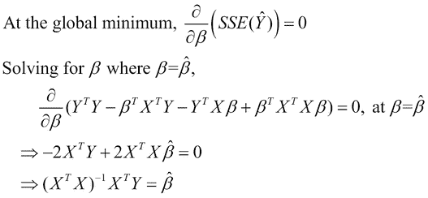

上述推导中的最后一个等式给出了最佳参数向量的定义，其形式表示如下:


我们可以使用 core.matrix 库的`transpose`和`inverse`函数以及 Incanter 库的`bind-columns`函数，通过 OLS 方法实现参数向量的上述定义:

```
(defn linear-model-ols
  "Estimates the coefficients of a multi-var linear
  regression model using Ordinary Least Squares (OLS) method"
  [MX MY]
  (let [X (bind-columns (repeat (row-count MX) 1) MX)
        Xt (cl/matrix (transpose X))
        Xt-X (cl/* Xt X)]
    (cl/* (inverse Xt-X) Xt MY)))

(def ols-linear-model
  (linear-model-ols X Y))

(def ols-linear-model-coefs
  (cl/as-vec ols-linear-model))
```

这里，我们首先添加一列，其中每个元素都是`1`，因为矩阵`MX`的第一列使用了`bind-columns`函数。我们添加的额外一列代表自变量，其值始终为`1`。然后，我们使用`transpose`和`inverse`函数为矩阵`MX`和`MY`中的数据计算线性回归模型的估计系数。

### 注意

对于当前的例子，来自 Incanter 库的`bind-columns`函数可以导入到我们的名称空间中，如下所示:

```
(ns my-namespace
  (:use [incanter.core :only [bind-columns]]))
```

先前定义的函数可应用于我们先前定义的矩阵( *X* 和 *Y* )，如下所示:

```
(def ols-linear-model
  (linear-model-ols X Y))

(def ols-linear-model-coefs
  (cl/as-vec ols-linear-model))
```

在前面的代码中，`ols-linear-model-coefs`只是一个变量，`ols-linear-model`是一个只有一列的矩阵，用向量表示。我们使用 clatrix 库中的`as-vec`函数来执行这种转换。

我们可以实际验证由`ols-linear-model`函数估计的系数实际上等于由咒语库的`linear-model`函数生成的系数，如下图所示:

```
user> (cl/as-vec (ols-linear-model X Y))
[1.851198344985435 0.6252788163253274 0.7429244752213087 -0.4044785456588674 -0.22635635488532463]
user> (:coefs iris-linear-model)
[1.851198344985515 0.6252788163253129 0.7429244752213329 -0.40447854565877606 -0.22635635488543926]
user> (every? #(< % 0.0001) 
                      (map - 
                         ols-linear-model-coefs 
                         (:coefs iris-linear-model)))
true
```

在前面代码示例的最后一个表达式中，我们找到了由`ols-linear-model`函数产生的系数之间的差值，由`linear-model`函数产生的差值，并检查这些差值是否都小于`0.0001`。


# 使用线性回归进行预测

一旦我们确定了线性回归模型的系数，我们就可以使用这些系数来预测模型的因变量的值。线性回归模型将预测值定义为每个系数与其对应自变量的值的乘积之和。

我们可以很容易地定义以下通用函数，当提供自变量的系数和值时，该函数预测给定公式化线性回归模型的因变量的值:

```
(defn predict [coefs X]
  {:pre [(= (count coefs)
            (+ 1 (count X)))]}
  (let [X-with-1 (conj X 1)
        products (map * coefs X-with-1)]
    (reduce + products)))
```

在前面的函数中，我们使用一个前提条件来断言系数的数量和独立变量的值。该函数期望自变量的值的数量比模型的系数的数量少一个，因为我们添加了一个额外的参数来表示自变量，该自变量的值总是 *1* 。然后，该函数使用`map`函数计算相应系数和独立变量值的乘积，然后使用`reduce`函数计算这些乘积项的总和。


# 了解正规化

线性回归使用线性方程估计一些给定的训练数据；这种解决方案可能并不总是最适合给定的数据。当然，这在很大程度上取决于我们试图建模的问题。**正则化** 是为数据提供更好拟合的常用技术。通常，通过减少模型的一些独立变量的影响来正则化给定的模型。或者，我们可以将其建模为高阶多项式。正则化并不排斥线性回归，大多数机器学习算法都使用某种形式的正则化，以便从给定的训练数据中创建更准确的模型。

当模型没有将因变量估计为接近训练数据中因变量观察值的值时，称该模型为**欠拟合**或**高偏差**。另一方面，当估计的模型完全符合数据，但不够普遍，无法用于预测时，模型也可以被称为**过度拟合**，或者说具有**高方差**。过度拟合模型通常描述训练数据中的随机误差或噪声，而不是模型的因变量和自变量之间的潜在关系。最佳拟合回归模型通常位于由欠拟合和过拟合模型创建的模型之间，并且可以通过正则化过程获得。

欠拟合或过拟合模型正则化的常用方法是 **Tikhnov 正则化** 。在统计学上，这种方法也叫**岭回归**。我们可以将 Tikhnov 正则化的一般形式描述如下:

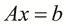

假设 *A* 表示从自变量向量 *x* 到因变量 *y* 的映射。值 *A* 类似于回归模型的参数向量。向量 *x* 与因变量观测值的关系，记为 *b* ，可表示如下。

欠拟合模型相对于实际数据有很大的误差，或者说是偏差。我们应该努力减少这种错误。这可以正式表示如下，并且基于估计模型的残差的总和:


Tikhnov 正则化将一个惩罚最小平方项添加到前面的方程中，以防止过拟合，其正式定义如下:

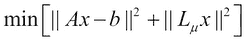

前面等式中的项被称为正则化矩阵。在最简单的 Tikhnov 正则化形式中，这个矩阵取值，其中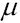是一个常数。尽管将该方程应用于回归模型超出了本书的范围，但我们可以使用 Tikhnov 正则化生成一个线性回归模型，其成本函数如下:

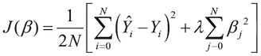

在前面的等式中，项被称为模型的正则化参数。必须适当选择该值，因为该参数的较大值可能会产生欠拟合模型。

使用之前定义的成本函数，我们可以应用梯度下降来确定参数向量，如下所示:

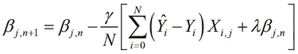

我们还可以将正则化应用于确定参数向量的 OLS 方法，如下所示:

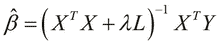

在上式中， *L* 被称为平滑矩阵，并且可以采用以下形式。注意，我们在第 1 章[、*使用矩阵*中使用了 *L* 的后一种定义形式。](ch01.html "Chapter 1. Working with Matrices")

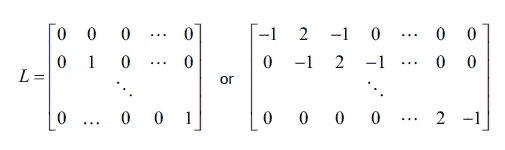

有趣的是，当前面等式中的正则化参数为 *0* 时，正则化解使用 OLS 方法还原为原始解。


# 总结

在这一章中，我们学习了线性回归和一些算法，这些算法可用于从一些样本数据中建立最佳的线性回归模型。以下是我们讨论的一些其他要点:

*   我们讨论了单变量和多变量的线性回归
*   我们实现了梯度下降算法来制定一个一元线性回归模型
*   我们实现了**普通最小二乘法** ( **OLS** )方法来寻找最优线性回归模型的系数
*   我们介绍了正则化以及如何将其应用于线性回归

在下一章中，我们将研究机器学习的一个不同领域，即分类。分类也是回归的一种形式，用于将数据归类到不同的类或组中。