# 五、选择和评估数据

在前一章中，我们研究了**人工神经网络**(**ann**)以及它们如何有效地用于非线性样本数据建模。到目前为止，我们已经讨论了几种可以用来对给定的训练数据集进行建模的机器学习技术。在本章中，我们将探讨以下主题，这些主题侧重于如何从样本数据中选择适当的特征:

*   我们将研究评估或量化公式化模型与所提供的训练数据吻合程度的方法。当我们必须扩展或调试现有模型时，这些技术会很有用。
*   我们还将探索如何使用`clj-ml`库在给定的机器学习模型上执行这个过程。
*   在本章的最后，我们将实现一个包含模型评估技术的垃圾邮件分类器。

术语**机器学习诊断**然后，由诊断生成的信息可用于改进给定模型的性能。通常，当设计机器学习模型时，建议并行地为模型制定诊断。为给定的模型实现诊断可能需要与制定模型本身相同的时间，但是实现诊断是一项很好的时间投资，因为它将有助于快速确定模型中需要更改的内容，以便对其进行改进。因此，机器学习诊断有助于节省调试或改进公式化学习模型的时间。

机器学习的另一个有趣的方面是，如果不知道我们试图拟合的数据的性质，我们就无法假设我们可以使用哪种机器学习模型来拟合样本数据。这个公理被称为**没有免费的午餐**定理，可以总结如下:

> 如果没有对学习算法本质的预先假设，任何学习算法都不会优于或劣于任何其他算法(甚至是随机猜测)

# 了解欠拟合和过拟合

在前面的章节中，我们已经讨论了最小化公式化机器学习模型的误差或成本函数。估计模型的总体误差往往较低，但是较低的误差通常不足以确定模型与提供的训练数据的拟合程度。在本节中，我们将重温*过拟合*和*欠拟合*的概念。

如果一个估计模型在预测中表现出较大的误差，则称其为**欠拟合** 。理想情况下，我们应该努力在模型中最小化这个误差。然而，具有低误差或成本函数的公式化模型也可能表明该模型不理解模型的给定特征之间的潜在关系。更确切地说，模型正在*记忆*提供的数据，这甚至可能导致模拟随机噪声。在这种情况下，模型被称为**过拟合** 。过度拟合模型的一个普遍症状是无法从看不见的数据中正确预测输出变量。一个欠拟合模型也被认为表现出 **高偏差**，而一个过拟合模型被认为具有 **高方差**。

假设我们在我们的模型中建模一个单独的因变量和自变量。理想情况下，模型应该符合训练数据，同时对训练数据中尚未观察到的数据进行归纳。

在欠拟合模型中，因变量与自变量的方差可以用下图表示:

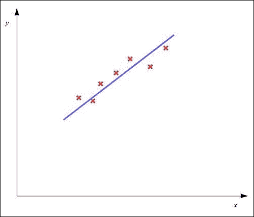

在上图中，红叉代表样本数据中的数据点。如图所示，欠拟合模型将呈现出较大的整体误差，我们必须通过为我们的模型选择合适的特征并使用正则化来减少这种误差。

另一方面，模型也可能是过拟合的，其中模型中的总误差具有低值，但是估计的模型未能从以前看不见的数据中正确地预测因变量。过度拟合模型可以使用以下图来描述:

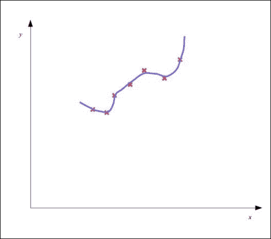

如上图所示，估计的模型图与训练数据非常接近，但不适合，因此总体误差较低。但是，该模型未能正确响应新数据。

描述与样本数据良好拟合的模型将具有较低的总体误差，并且可以根据我们模型中独立变量的先前未知值正确预测因变量。一个合适的模型应该有一个类似于下图的图:

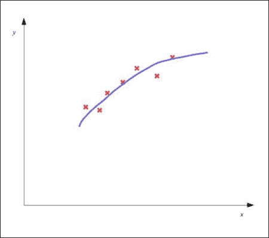

人工神经网络也可能对所提供的样本数据欠拟合或过拟合。例如，具有几个隐藏节点和层的人工神经网络可能是欠拟合模型，而具有大量隐藏节点和层的人工神经网络可能表现出过拟合。

## 评估模型

我们可以绘制一个模型的因变量和自变量的方差，以确定该模型是欠拟合还是过拟合。但是，对于大量的特征，我们需要一种更好的方法来可视化模型在训练数据上概括模型的因变量和自变量的关系的程度。

我们可以通过在一些不同的数据上确定模型的成本函数来评估经过训练的机器学习模型。因此，我们需要将可用的样本数据分成两个子集，一个用于训练模型，另一个用于测试模型。后一个子集也被称为我们模型的**测试集** 。

然后为测试集中的样本计算成本函数。这给了我们一个在以前看不到的数据上使用时，模型中总误差的度量。该值由估计模型的项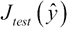表示，也称为公式化模型的**测试误差** 。训练数据中的总误差被称为模型的**训练误差** ，用术语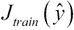表示。线性回归模型的测试误差可以计算如下:


类似地，二元分类模型中的测试误差可以正式表示如下:

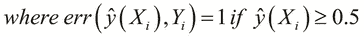

确定模型的特征使得测试误差低的问题被称为**模型选择**或**特征选择**。此外，为了避免过度拟合，我们必须衡量模型对训练数据的概括程度。测试误差本身是对模型中训练数据的泛化误差的乐观估计。然而，我们还必须测量模型尚未发现的数据中的泛化误差。如果模型对看不见的数据也有很低的误差，我们可以确定模型没有过度拟合数据。这个过程被称为**交叉验证**。

因此，为了确保模型能够在看不见的数据上表现良好，我们将需要一组额外的数据，称为**交叉验证集** 。交叉验证组中的样本数用术语表示。通常，样本数据被划分为训练集、测试集和交叉验证集，使得训练数据中的样本数量显著大于测试集和交叉验证集中的样本数量。泛化误差，或者更确切地说是交叉验证误差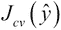，表明了估计模型与未知数据的吻合程度。请注意，当我们在评估模型上使用交叉验证和测试集时，我们不会修改它。我们将在本章的以下几节中更多地研究交叉验证。正如我们将在后面看到的，我们还可以使用交叉验证从一些样本数据中确定模型的特征。

例如，假设我们的训练数据中有 100 个样本。我们将这个样本数据分成三组。前 60 个样本将用于估计一个适合数据的模型。在剩余的 40 个样本中，20 个将用于交叉验证估计的模型，另外 20 个将用于最终测试交叉验证的模型。

在分类的上下文中，给定分类器的准确性的良好表示是*混淆矩阵*。这种表示通常用于可视化基于监督机器学习算法的给定分类器的性能。该矩阵中的每一列表示由给定分类器预测的属于特定类别的样本数量。混淆矩阵的行代表样本的实际类别。混淆矩阵也被称为训练分类器的**关联矩阵**或**误差矩阵**。

例如，假设我们在给定的分类模型中有两个类。该模型的混淆矩阵可能如下所示:

|   | 

预测类别

 |
| --- | --- |
| 

A

 | 

B

 |
| --- | --- |
| **实际类** | A | 45 | 15 |
| B | 30 | 10 |

在混淆矩阵中，我们模型中的预测类由垂直列表示，实际类由水平行表示。在前面的混淆矩阵的例子中，总共有 100 个样本。其中，来自 A 类的 45 个样本和来自 B 类的 10 个样本被预测为具有正确的类别。然而，15 个 A 类样品被归类为 B 类，类似地，30 个 B 类样品被预测为 A 类

让我们考虑不同分类器的以下混淆矩阵，该分类器使用与前一示例相同的数据:

|   | 

预测类别

 |
| --- | --- |
| 

A

 | 

B

 |
| --- | --- |
| **实际类别** | A | 45 | 5 |
| B | 0 | 50 |

在前面的混淆矩阵中，分类器正确地分类了 B 类的所有样本。此外，只有 5 个 A 类样品分类错误。因此，与前一示例中使用的分类器相比，该分类器更好地理解了两类数据之间的区别。在实践中，我们必须努力训练一个分类器，使其对于混淆矩阵中除对角线元素之外的所有元素都具有接近于 *0* 的值。

## 了解特征选择

正如我们之前提到的，我们需要从样本数据中确定一组适当的特征，我们的模型必须基于这些特征。我们可以使用交叉验证来确定从训练数据中使用哪组特征，这可以解释如下。

对于每一组特征变量或特征变量的组合，我们基于所选择的一组特征来确定模型的训练和交叉验证误差。例如，我们可能想要添加从我们的模型的独立变量派生的多项式特征。我们根据用于对训练数据建模的多项式的最高次数来评估每组特征的训练和交叉验证误差。我们可以绘制这些误差函数在所用多项式次数上的方差，如下图所示:

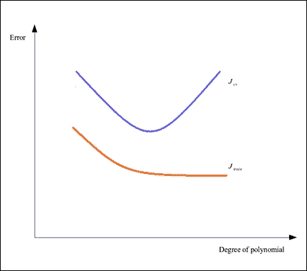

根据上图，我们可以确定哪组要素会产生欠拟合或过拟合的估计模型。如果所选模型的训练和交叉验证误差值都很高，即位于图的左侧，则该模型对所提供的训练数据拟合不足。另一方面，低训练误差和高交叉验证误差，如图表右侧所示，表明模型过拟合。理想情况下，我们必须选择具有最低可能值的训练和交叉验证误差的特征集。


# 改变正则化参数

为了更好地拟合训练数据，我们可以使用正则化来避免数据过度拟合的问题。给定模型的值必须根据模型的行为适当选择。注意，高正则化参数可能导致高训练误差，这是不期望的效果。我们可以改变公式化机器学习模型中的正则化参数，以产生我们的模型中正则化参数值上的误差值的以下曲线图:


因此，如前图所示，我们还可以通过改变正则化参数来最小化模型中的训练和交叉验证误差。如果模型显示这两个误差值都很高，我们必须考虑减小正则化参数的值，直到这两个误差值对于所提供的样本数据都非常低。


# 了解学习曲线

另一种可视化机器学习模型性能的有用方法是使用学习曲线。一条**学习曲线**本质上是一个模型中误差值在样本数量上的曲线，通过它进行训练和交叉验证。例如，对于训练和交叉验证错误，模型可能具有以下学习曲线:


学习曲线可以用于诊断欠拟合和过拟合模型。例如，可以观察到训练误差快速增加，并收敛到接近与提供给模型的样本数量交叉验证的值。此外，我们模型中的两个误差值都非常高。表现出这种随样本数量变化的误差方差的模型是欠拟合的，其学习曲线类似于下图:


另一方面，可以观察到模型的训练误差随着提供给模型的样本数量而缓慢增加，并且模型中的训练误差和交叉验证误差之间也可能存在很大差异。该模型被称为过度拟合，其学习曲线类似于下图:


因此，学习曲线是一个很好的辅助工具，用于交叉验证，以确定在给定的机器学习模型中什么不起作用，什么需要改变。


# 改进模型

一旦我们确定了一个模型对于给定的样本数据是欠拟合还是过拟合，我们必须决定如何提高模型对模型中自变量和因变量之间关系的理解。让我们简要讨论其中的一些技术，如下所示:

*   添加或删除一些功能。正如我们将在后面探讨的，这种技术可以用来改善欠拟合和过拟合模型。
*   改变正则化参数的值。像添加或删除特征一样，该方法可以应用于欠拟合和过拟合模型。
*   收集更多的训练数据。这种方法对于改进过拟合模型来说是一个相当明显的解决方案，因为它需要制定一个更一般化的模型来拟合训练数据。
*   添加模型中其他特征的多项式特征。该方法可用于改进欠拟合模型。例如，如果我们正在对两个独立特征变量和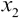进行建模，我们可以添加术语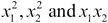作为附加特征来改进模型。多项式项甚至可以是更高的次数，例如和，尽管这可能导致过拟合训练数据。


# 使用交叉验证

正如我们之前简要提到的，交叉验证是一种常见的验证技术，可用于评估机器学习模型。交叉验证本质上衡量的是估计模型对某些给定数据的概括程度。该数据与提供给我们模型的训练数据不同，被称为我们模型的**交叉验证集**、或简称为**验证集**。给定模型的交叉验证也称为**旋转估计**。

如果一个估计模型在交叉验证期间表现良好，我们可以假设该模型能够理解其各种自变量和因变量之间的关系。交叉验证的目的是提供一个测试来确定一个公式化的模型是否过度适合训练数据。从实现的角度来看，交叉验证是机器学习系统的一种单元测试。

一轮交叉验证通常包括将所有可用的样本数据分成两个子集，然后对一个子集进行训练，对另一个子集进行验证和/或测试。必须使用不同的数据集进行几轮这样的交叉验证，以减少给定模型的整体交叉验证误差的方差。交叉验证误差的任何特定测量值应计算为交叉验证中不同折叠的误差平均值。

对于给定的机器学习模型或系统，我们可以实现几种类型的交叉验证作为诊断。让我们简要探讨其中的几个，如下所示:

*   一种常见的类型是 *k 重*交叉验证，其中我们将交叉验证数据划分为 *k 个*相等的子集。然后对数据的子集进行模型训练，并对单个子集进行交叉验证。
*   *k 重*交叉验证的一个简单变体是*二重*交叉验证，也称为*维持方法*。在*二重*交叉验证中，数据的训练和交叉验证子集在比例上几乎相等。
*   **重复随机二次抽样** 是交叉验证的另一个简单变体，其中样本数据首先被随机化或混洗，然后被用作训练和交叉验证数据。值得注意的是，该方法不依赖于用于交叉验证的折叠数。
*   *k 重*交叉验证的另一种形式是**留一**交叉验证，其中仅使用可用样本数据中的单个记录进行交叉验证。留一交叉验证本质上是 *k 重*交叉验证，其中 *k* 等于样本数据中的样本数或观察数。

交叉验证基本上把估计的模型当做黑盒，也就是说，它对模型的实现不做任何假设。我们还可以使用交叉验证来选择给定模型中的特征，通过使用交叉验证来确定在给定样本数据上产生最佳拟合模型的特征集。当然，分类有一些限制，可以总结如下:

*   如果一个给定的模型需要在内部执行特性选择，我们必须为给定模型中每个选择的特性集执行交叉验证。根据可用样本数据的数量，这在计算上可能很昂贵。
*   如果样本数据包含完全相同或几乎相同的样本，交叉验证就没有多大用处。

总之，对我们构建的任何机器学习系统实现交叉验证都是一个很好的实践。此外，我们可以根据我们试图建模的问题以及收集的样本数据的性质，选择适当的交叉验证技术。

### 注意

对于下面的示例，命名空间声明应该类似于下面的声明:

```
(ns my-namespace
  (:use [clj-ml classifiers data]))
```

我们可以使用`clj-ml`库来交叉验证我们在[第 3 章](ch03.html "Chapter 3. Categorizing Data")、*分类数据*中为鱼类包装厂构建的分类器。本质上，我们使用`clj-ml`库构建了一个分类器来确定一条鱼是鲑鱼还是海鲈鱼。概括地说，一条鱼被表示为一个包含鱼的类别和鱼的各种特征的值的向量。鱼的特征是它的长度、宽度和皮肤的亮度。我们还描述了一个样本鱼的模板，定义如下:

```
(def fish-template
  [{:category [:salmon :sea-bass]}
   :length :width :lightness])
```

在前面的代码中定义的`fish-template`向量可以用来用一些样本数据训练一个分类器。目前，我们不会考虑使用哪种分类算法对给定的训练数据进行建模。我们只能假设分类器是使用`clj-ml`库中的`make-classifier`函数创建的。该分类器存储在`*classifier*`变量中，如下所示:

```
(def *classifier* (make-classifier ...))
```

假设用一些样本数据训练分类器。我们现在必须评估这个经过训练的分类模型。为此，我们必须首先创建一些样本数据来进行交叉验证。为了简单起见，我们将在这个例子中使用随机生成的数据。我们可以使用`make-sample-fish`函数生成这个数据，我们在[第 3 章](ch03.html "Chapter 3. Categorizing Data")、*分类数据*中定义了这个函数。这个函数简单地创建了一个新的代表一条鱼的随机值的向量。当然，我们不能忘记,`make-sample-fish`函数有一个固有的偏好，所以我们在使用该函数创建的许多样本中创建了一个有意义的模式，如下所示:

```
(def fish-cv-data
  (for [i (range 3000)] (make-sample-fish)))
```

我们将需要使用来自`clj-ml`库中的数据集，我们可以使用`make-dataset`函数创建一个数据集，如下面的代码所示:

```
(def fish-cv-dataset
  (make-dataset "fish-cv" fish-template fish-cv-data))
```

为了交叉验证分类器，我们必须使用来自`clj-ml.classifiers`名称空间的`classifier-evaluate`函数。该函数实质上是对给定的数据进行 *k 重*交叉验证。除了分类器和交叉验证数据集之外，该函数还要求将我们必须对数据执行的折叠次数指定为最后一个参数。同样，我们首先需要使用`dataset-set-class`函数设置`fish-cv-dataset`中记录的 class 字段。我们可以定义一个函数来执行这些操作，如下所示:

```
(defn cv-classifier [folds]
  (dataset-set-class fish-cv-dataset 0)
  (classifier-evaluate *classifier* :cross-validation
                       fish-cv-dataset folds))
```

我们将在分类器上使用 10 次交叉验证。由于`classifier-evaluate`函数返回一个地图，我们将这个返回值绑定到一个变量以备后用，如下所示:

```
user> (def cv (cv-classifier 10))
#'user/cv
```

我们可以使用关键字`:summary`获取并打印前面交叉验证的摘要，如下所示:

```
user> (print (:summary cv))

Correctly Classified Instances        2986              99.5333 %
Incorrectly Classified Instances        14               0.4667 %
Kappa statistic                          0.9888
Mean absolute error                      0.0093
Root mean squared error                  0.0681
Relative absolute error                  2.2248 %
Root relative squared error             14.9238 %
Total Number of Instances             3000     
nil
```

如前面的代码所示，我们可以查看经过训练的分类器的几个性能统计指标。除了正确和错误分类的记录之外，该摘要还描述了分类器中的**均方根误差** ( **RMSE** )和其他几种误差度量。为了更详细地查看分类器中正确和错误分类的实例，我们可以使用`:confusion-matrix`关键字打印交叉验证的混淆矩阵，如下面的代码所示:

```
user> (print (:confusion-matrix cv))
=== Confusion Matrix ===

    a    b   <-- classified as
 2129    0 |    a = salmon
    9  862 |    b = sea-bass
nil
```

如前面的例子所示，我们可以使用`clj-ml`库的`classifier-evaluate`函数对任何给定的分类器执行 *k 倍*交叉验证。虽然在使用`classifier-evaluate`函数时，我们被限制使用来自`clj-ml`库的分类器，但我们必须努力在我们构建的任何机器学习系统中实现类似的诊断。


# 构建垃圾邮件分类器

现在我们已经熟悉了交叉验证，我们将构建一个包含交叉验证的工作机器学习系统。眼前的问题将是垃圾邮件分类的问题，其中我们必须确定给定电子邮件是垃圾邮件的可能性。本质上，这个问题可以归结为二进制分类，通过一些调整使机器学习系统对垃圾邮件更加敏感(有关更多信息，请参考*垃圾邮件计划*)。请注意，我们不会实现与电子邮件服务器集成的分类引擎，而是将重点放在用一些数据训练引擎和对给定的电子邮件进行分类上。

这在实践中的使用方式可以简要解释如下。用户将接收并阅读一封新邮件，并决定是否将该邮件标记为垃圾邮件。根据用户的决定，我们必须使用新的电子邮件作为数据来训练电子邮件服务的垃圾邮件引擎。

为了以更加自动化的方式训练我们的垃圾邮件分类器，我们将不得不简单地收集数据以输入分类器。我们将需要大量的数据来有效地用英语训练分类器。幸运的是，垃圾邮件分类的样本数据很容易在网上找到。对于这个实现，我们将使用来自**Apache SpamAssassin**项目的数据。

### 注意

Apache SpamAssassin 项目是一个用 Perl 实现的垃圾邮件分类引擎的开源实现。对于我们的实现，我们将使用这个项目的样本数据。你可以从 http://spamassassin.apache.org/publiccorpus/的[下载这些数据。对于我们的例子，我们使用了`spam_2`和`easy_ham_2`数据集。一个 Clojure Leiningen 项目包含了我们的垃圾邮件分类器实现，它要求提取这些数据集，并将其放在`corpus/`文件夹的`ham/`和`spam/`子目录中。`corpus/`文件夹应该放在 Leiningen 项目的根目录下，也就是与`project.clj`文件相同的文件夹下。](http://spamassassin.apache.org/publiccorpus/)

我们的垃圾邮件分类器的特征将是所有以前在垃圾邮件中遇到的单词的出现次数。术语“火腿”的意思是“不是垃圾邮件”。因此，在我们的模型中实际上有两个独立变量。此外，每个单词在电子邮件中都有一个相关的出现概率，这可以通过它在垃圾邮件和垃圾邮件中的出现次数以及分类器处理的电子邮件总数来计算。通过在电子邮件的标题和正文中找到所有已知单词，然后以某种方式组合这些单词在垃圾邮件和业余电子邮件中出现的概率，可以对新电子邮件进行分类。

对于我们分类器中的给定单词特征，我们必须通过考虑分类器分析的电子邮件总数来计算该单词出现的总概率(有关更多信息，请参考*更好的贝叶斯过滤*)。此外，一个看不见的术语是中性的，因为它既不是垃圾邮件也不是火腿。因此，任何单词在未训练的分类器中出现的初始概率是 0.5。因此，我们使用一个**贝叶斯概率**函数来模拟一个特定单词的出现。

为了对一封新邮件进行分类，我们还需要结合邮件中所有已知单词的出现概率。对于这个实现，我们将使用 **Fisher 的方法**或 **Fisher 的组合概率测试**来组合计算的概率。虽然这种测试的数学证明超出了本书的范围，但重要的是要知道，这种方法本质上是以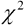(读作**卡方**)分布来估计给定模型中几个独立概率的概率(有关更多信息，请参考*研究人员统计方法*)。这种分布具有相关的数量的自由度。可以看出，自由度等于组合概率数量 *k* 两倍的分布可以正式表示如下:

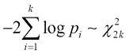

这意味着使用具有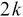自由度的分布，电子邮件是垃圾邮件或 ham 的概率的**累积分布函数** ( ** CDF ** ) 可以被组合，以反映当有大量值接近 1.0 的概率时高的总概率。因此，只有当电子邮件中的大部分单词先前在垃圾邮件中被发现时，该电子邮件才被分类为垃圾邮件。类似地，大量的 ham 关键字将表明该电子邮件实际上是一封 ham 电子邮件。另一方面，垃圾邮件关键字在电子邮件中的低出现次数将具有接近 0.5 的概率，在这种情况下，分类器将不能确定该电子邮件是垃圾邮件还是 ham。

### 注意

对于接下来的例子，我们将需要分别来自`clojure.java.io`和`Incanter`库的`file`和`cdf-chisq`函数。该示例的命名空间声明应类似于以下声明:

```
(ns my-namespace
  (:use [clojure.java.io :only [file]]
        [incanter.stats :only [cdf-chisq]])
```

如前所述，使用 Fisher 方法训练的分类器将对新的垃圾邮件非常敏感。我们用给定电子邮件是垃圾邮件的概率来表示模型的因变量。该概率也被称为电子邮件的**垃圾邮件分数** 。低分数表示电子邮件是垃圾邮件，而高分数表示电子邮件是垃圾邮件。当然，我们还必须包括第三个类来表示我们模型中的未知值。我们可以为这些类别的分数定义一些合理的限制，如下所示:

```
(def min-spam-score 0.7)
(def max-ham-score 0.4)

(defn classify-score [score]
  [(cond
    (<= score max-ham-score) :ham
    (>= score min-spam-score) :spam
    :else :unsure)
   score])
```

根据前面的定义，如果一封电子邮件的得分为 0.7 或更高，它就是垃圾邮件。0.5 或更低的分数指示该电子邮件是 ham。此外，如果分数介于这两个值之间，我们就无法有效地确定该电子邮件是否是垃圾邮件。我们用关键字`:ham`、`:spam`和`:unsure`来表示这三个类别。

垃圾邮件分类器必须读取几封电子邮件，确定电子邮件正文和标题中的所有单词或*标记*，并将这些信息存储为经验知识以备后用。我们需要存储特定单词在垃圾邮件和业余邮件中出现的次数。因此，分类器遇到的每个单词都代表一个特征。为了用一个单词来表示这些信息，我们将使用一个包含三个字段的记录，如下面的代码所示:

```
(defrecord TokenFeature [token spam ham])

(defn new-token [token]
  (TokenFeature. token 0 0))

(defn inc-count [token-feature type]
  (update-in token-feature [type] inc))
```

前面代码中定义的记录`TokenFeature`可用于存储垃圾邮件分类器所需的信息。`new-token`函数只是通过调用 records 构造函数为给定的令牌创建一个新记录。显然，一个单词在垃圾邮件和业余邮件中最初都没有出现过。我们还需要更新这些值，我们定义了`inc-count`函数来使用`update-in`函数更新记录。注意，`update-in`函数期望一个函数作为最后一个参数应用于记录中的特定字段。在我们的实现中，我们已经处理了少量的可变状态，所以让我们通过代理来委托对这个状态的访问。我们还想跟踪垃圾邮件的总数；因此，我们也将这些值包装在代理中，如下面的代码所示:

```
(def feature-db
  (agent {} :error-handler #(println "Error: " %2)))

(def total-ham (agent 0))
(def total-spam (agent 0))
```

前面代码中定义的`feature-db`代理将用于存储所有 word 特性。我们使用`:error-handler`关键字参数为这个代理定义了一个简单的错误处理程序。代理的`total-ham`和`total-spam`功能将分别跟踪垃圾邮件和恶意邮件的总数。我们现在将定义几个函数来访问这些代理，如下所示:

```
(defn clear-db []
  (send feature-db (constantly {}))
  (send total-ham  (constantly 0))
  (send total-spam (constantly 0)))

(defn update-feature!
  "Looks up a TokenFeature record in the database and
  creates it if it doesn't exist, or updates it."
  [token f & args]
  (send feature-db update-in [token]
        #(apply f (if %1 %1 (new-token token))
                args)))
```

如果您不熟悉 Clojure 中的代理，我们可以使用`send`函数来修改代理中包含的值。此函数需要一个参数，即应用于其封装值的函数。代理对其包含的值应用该函数，如果没有错误，则更新该值。`clear-db`函数简单地用初始值初始化我们定义的所有代理。这是通过使用`constantly`函数完成的，该函数将一个值包装在一个返回相同值的函数中。`update-feature!`函数修改`feature-db`图中给定令牌的值，如果所提供的令牌不在`feature-db`图中，则创建一个新令牌。因为我们只会增加给定令牌的出现次数，所以我们将把`inc-count`函数作为参数传递给`update-feature!`函数。

现在，让我们定义分类器如何从给定的电子邮件中提取单词。我们将使用正则表达式来做到这一点。如果我们想从给定的字符串中提取所有的单词，我们可以使用正则表达式`[a-zA-Z]{3,}`。我们可以在 Clojure 中使用文字语法来定义这个正则表达式，如下面的代码所示。注意，我们也可以使用`re-pattern`函数来创建一个正则表达式。我们还将定义所有 MIME 头字段，我们也应该从中提取令牌。我们将借助以下代码来完成所有这些工作:

```
(def token-regex #"[a-zA-Z]{3,}")

(def header-fields
  ["To:"
   "From:"
   "Subject:"
   "Return-Path:"])
```

为了将标记与由`token-regex`定义的正则表达式进行匹配，我们将使用`re-seq`函数，该函数将以字符串序列的形式返回给定字符串中所有匹配的标记。对于电子邮件的 MIME 头，我们需要使用不同的正则表达式来提取令牌。例如，我们可以从`"From"` MIME 头中提取标记，如下所示:

```
user> (re-seq #"From:(.*)\n"
              "From: someone@host.org\n")
(["From: someone@host.org\n" " someone@host.org"])
```

### 注意

请注意在正则表达式末尾使用的换行符，它用于指示电子邮件中 MIME 头的结尾。

然后，我们可以通过匹配前面代码中定义的正则表达式，从返回的值中提取单词。让我们定义以下几个函数，使用这个逻辑从给定的电子邮件头和正文中提取令牌:

```
(defn header-token-regex [f]
  (re-pattern (str f "(.*)\n")))

(defn extract-tokens-from-headers [text]
  (for [field header-fields]
    (map #(str field %1)  ; prepends field to each word from line
         (mapcat (fn [x] (->> x second (re-seq token-regex)))
                 (re-seq (header-token-regex field)
                         text)))))

(defn extract-tokens [text]
  (apply concat
         (re-seq token-regex text)
         (extract-tokens-from-headers text)))
```

前面代码中定义的`header-token-regex`函数为给定的头返回一个正则表达式，例如`"From"`头的`From:(.*)\n`。`extract-tokens-from-headers`函数使用这个正则表达式来确定电子邮件的各个标题字段中的所有单词，并将标题名称附加到标题文本中找到的所有标记上。`extract-tokens`函数对电子邮件的文本和标题应用正则表达式，然后使用`apply`和`concat`函数将结果列表展平为一个列表。注意，`extract-tokens-from-headers`函数为`header-fields`中定义的标题返回空列表，这些列表不在提供的电子邮件标题中。让我们在以下代码的帮助下，在 REPL 中尝试一下这个函数:

```
user> (def sample-text
        "From: 12a1mailbot1@web.de
         Return-Path: <12a1mailbot1@web.de>
         MIME-Version: 1.0")

user> (extract-tokens-from-headers sample-text)
(() ("From:mailbot" "From:web")
 () ("Return-Path:mailbot" "Return-Path:web"))
```

使用`extract-tokens-from-headers`函数和由`token-regex`定义的正则表达式，我们可以从电子邮件的标题和正文中提取由三个或更多字符组成的所有单词。现在，让我们定义一个函数，将`extract-tokens`函数应用到给定的电子邮件上，并使用`update-feature!`函数用电子邮件中找到的所有单词更新特征图。我们将借助以下代码来完成所有这些工作:

```
(defn update-features!
  "Updates or creates a TokenFeature in database
  for each token in text."
  [text f & args]
  (doseq [token (extract-tokens text)]
    (apply update-feature! token f args)))
```

使用前面代码中的`update-features!`函数，我们可以用给定的电子邮件训练我们的垃圾邮件分类器。为了跟踪垃圾邮件和恶意邮件的总数，我们必须根据给定的电子邮件是垃圾邮件还是恶意邮件，将`inc`函数发送给`total-spam`或`total-ham`代理。我们将借助以下代码来实现这一点:

```
(defn inc-total-count! [type]
  (send (case type
          :spam total-spam
          :ham total-ham)
        inc))

(defn train! [text type]
  (update-features! text inc-count type)
  (inc-total-count! type))
```

前面代码中定义的`inc-total-count!`函数更新我们的特征数据库中垃圾邮件和垃圾邮件的总数。`train!`函数简单地调用`update-features!`和`inc-total-count!`函数，用给定的电子邮件及其类型训练我们的垃圾邮件分类器。注意，我们将`inc-count`函数传递给了`update-features!`函数。现在，为了将新的电子邮件分类为垃圾邮件或 ham，我们必须首先定义如何使用经过训练的特征数据库从给定的电子邮件中提取已知特征。我们将借助以下代码来实现这一点:

```
(defn extract-features
  "Extracts all known tokens from text"
  [text]
  (keep identity (map #(@feature-db %1) (extract-tokens text))))
```

前面代码中定义的`extract-features`函数通过解引用`feature-db`中存储的映射并将其作为函数应用于`extract-tokens`函数返回的所有值，来查找给定电子邮件中的所有已知特征。由于映射闭包`#(@feature-db %1)`可以为`feature-db`代理中不存在的所有标记返回`()`或`nil`，我们需要从提取的特征列表中删除所有空值。为了做到这一点，我们将使用`keep`函数，它期望一个函数应用于集合中的非零值以及必须从中过滤掉所有零值的集合。因为我们不打算转换电子邮件中的已知特性，所以我们将传递`identity`函数，该函数将其参数本身作为第一个参数返回给`keep`函数。

既然我们已经从给定的电子邮件中提取了所有已知的特征，我们必须计算这些特征在垃圾邮件中出现的所有概率。然后，我们必须使用前面描述的 Fisher 方法将这些概率结合起来，以确定新电子邮件的垃圾邮件分数。让我们定义以下函数来实现贝叶斯概率和费希尔方法:

```
(defn spam-probability [feature]
  (let [s (/ (:spam feature) (max 1 @total-spam))
        h (/ (:ham feature) (max 1 @total-ham))]
      (/ s (+ s h))))

(defn bayesian-spam-probability
  "Calculates probability a feature is spam on a prior
  probability assumed-probability for each feature,
  and weight is the weight to be given to the prior
  assumed (i.e. the number of data points)."
  [feature & {:keys [assumed-probability weight]
              :or   {assumed-probability 1/2 weight 1}}]
  (let [basic-prob (spam-probability feature)
        total-count (+ (:spam feature) (:ham feature))]
    (/ (+ (* weight assumed-probability)
          (* total-count basic-prob))
       (+ weight total-count))))
```

上述代码中定义的`spam-probability`函数使用垃圾邮件和垃圾邮件中出现的单词数量以及分类器处理的垃圾邮件和垃圾邮件的总数，计算垃圾邮件中给定单词特征出现的概率。为了避免被零除的错误，我们确保在执行除法之前，垃圾邮件和业余电子邮件的数量至少为 1。`bayesian-spam-probability`函数使用`spam-probability`函数返回的这个概率计算一个初始概率为 0.5 或 *1/2* 的加权平均值。

我们现在将实现 Fisher 的方法，该方法将由`bayesian-spam-probability`函数返回的概率与电子邮件中发现的所有已知特征相结合。我们将借助以下代码来实现这一点:

```
(defn fisher
  "Combines several probabilities with Fisher's method."
  [probs]
  (- 1 (cdf-chisq
         (* -2 (reduce + (map #(Math/log %1) probs)))
         :df (* 2 (count probs)))))
```

前面代码中定义的`fisher`函数使用`Incanter`库中的`cdf-chisq`函数来计算由表达式转换的几个概率的 CDF。我们使用可选参数`:df`指定该函数的自由度。我们现在需要将`fisher`函数应用于组合的电子邮件是垃圾邮件或 ham 的贝叶斯概率，并将这些值组合成最终的垃圾邮件分数。这两种概率必须结合起来，只有高概率出现的次数多，才表明垃圾邮件或垃圾邮件的概率大。已经表明，最简单的方法是平均垃圾邮件的概率和垃圾邮件的负概率(或 1 减去垃圾邮件的概率)。我们将借助以下代码来实现这一点:

```
(defn score [features]
  (let [spam-probs (map bayesian-spam-probability features)
        ham-probs (map #(- 1 %1) spam-probs)
        h (- 1 (fisher spam-probs))
        s (- 1 (fisher ham-probs))]
     (/ (+ (- 1 h) s) 2)))
```

因此，`score`函数将返回给定电子邮件的最终垃圾邮件分数。让我们定义一个函数，从给定的电子邮件中提取已知的单词特征，结合这些特征出现的概率来产生电子邮件的垃圾邮件分数，并最终将该垃圾邮件分数分类为垃圾邮件或垃圾邮件，分别用关键字`:ham`和`:spam`表示，如下面的代码所示:

```
(defn classify
  "Returns a vector of the form [classification score]"
  [text]
   (-> text
       extract-features
       score
       classify-score))
```

到目前为止，我们已经实现了如何训练我们的垃圾邮件分类器，并使用它来分类新的电子邮件。现在，让我们定义一些函数来从项目的`corpus/`文件夹中加载样本数据，并使用这些数据来训练和交叉验证我们的分类器，如下所示:

```
(defn populate-emails
  "Returns a sequence of vectors of the form [filename type]"
  []
  (letfn [(get-email-files [type]
            (map (fn [f] [(.toString f) (keyword type)])
                 (rest (file-seq (file (str "corpus/" type))))))]
    (mapcat get-email-files ["ham" "spam"])))
```

在前面的代码中定义的`populate-emails`函数返回一个向量序列，表示我们的示例数据中来自`ham/`文件夹的所有垃圾邮件和来自`spam/`文件夹的所有垃圾邮件。这个返回序列中的每个向量都有两个元素。该向量中的第一个元素是给定电子邮件的相对文件路径，第二个元素是`:spam`或`:ham`，这取决于该电子邮件是垃圾邮件还是 ham。注意使用`file-seq`函数按顺序读取目录中的文件。

我们现在将使用`train!`函数将所有电子邮件的内容输入我们的垃圾邮件分类器。为此，我们可以使用`slurp`函数将文件内容作为字符串读取。对于交叉验证，我们将使用`classify`函数对提供的交叉验证数据中的每封电子邮件进行分类，并返回一个表示交叉验证测试结果的映射列表。我们将借助以下代码来实现这一点:

```
(defn train-from-corpus! [corpus]
  (doseq [v corpus]
    (let [[filename type] v]
      (train! (slurp filename) type))))

(defn cv-from-corpus [corpus]
  (for [v corpus]
    (let [[filename type] v
          [classification score] (classify (slurp filename))]
      {:filename filename
       :type type
       :classification classification
       :score score})))
```

前面代码中定义的`train-from-corpus!`函数将使用在`corpus/`文件夹中找到的所有电子邮件来训练我们的垃圾邮件分类器。`cv-from-corpus`函数使用经过训练的分类器将提供的电子邮件分类为垃圾邮件或垃圾邮件，并返回一系列指示交叉验证过程结果的映射。由`cv-from-corpus`函数返回的序列中的每个图包含电子邮件的文件、电子邮件的实际类型(垃圾邮件或 ham)、电子邮件的预测类型以及电子邮件的垃圾邮件分数。现在，我们需要对样本数据的两个适当分区的子集调用这两个函数，如下所示:

```
(defn test-classifier! [corpus cv-fraction]
  "Trains and cross-validates the classifier with the sample
  data in corpus, using cv-fraction for cross-validation.
  Returns a sequence of maps representing the results
  of the cross-validation."
    (clear-db)
    (let [shuffled (shuffle corpus)
          size (count corpus)
          training-num (* size (- 1 cv-fraction))
          training-set (take training-num shuffled)
          cv-set (nthrest shuffled training-num)]
      (train-from-corpus! training-set)
      (await feature-db)
      (cv-from-corpus cv-set)))
```

前面代码中定义的`test-classifier!`函数将随机打乱样本数据，并选择该随机数据的指定部分作为我们分类器的交叉验证集。然后，`test-classifier!`函数调用`train-from-corpus!`和`cv-from-corpus`函数来训练和交叉验证数据。注意，`await`函数的用途是等待，直到`feature-db`代理应用完通过`send`函数发送给它的所有函数。

现在我们需要分析交叉验证的结果。我们必须首先从由`cv-from-corpus`函数返回的给定电子邮件的实际和预期类别中确定错误分类和错过的电子邮件的数量。我们将借助以下代码来实现这一点:

```
(defn result-type [{:keys [filename type classification score]}]
  (case type
    :ham  (case classification
            :ham :correct
            :spam :false-positive
            :unsure :missed-ham)
    :spam (case classification
            :spam :correct
            :ham :false-negative
            :unsure :missed-spam)))
```

`result-type`功能将确定交叉验证过程中错误分类和遗漏的电子邮件数量。现在，我们可以将`result-type`函数应用于由`cv-from-corpus`函数返回的结果中的所有映射，并借助以下代码打印交叉验证结果的摘要:

```
(defn analyze-results [results]
  (reduce (fn [map result]
            (let [type (result-type result)]
              (update-in map [type] inc)))
          {:total (count results) :correct 0 :false-positive 0
           :false-negative 0 :missed-ham 0 :missed-spam 0}
          results))

(defn print-result [result]
  (let [total (:total result)]
    (doseq [[key num] result]
      (printf "%15s : %-6d%6.2f %%%n"
              (name key) num (float (* 100 (/ num total)))))))
```

前面代码中定义的`analyze-results`函数简单地将`result-type`函数应用于由`cv-from-corpus`函数返回的序列中的所有 map 值，同时保持错误分类和错过的电子邮件的总数。`print-result`函数只是将分析结果打印成一个字符串。最后，让我们定义一个函数来使用`populate-emails`函数加载所有的电子邮件，然后使用这些数据来训练和交叉验证我们的垃圾邮件分类器。由于`populate-emails`函数将返回一个空列表，或者当没有电子邮件时返回`nil`，我们将检查这个条件以避免在我们程序的稍后阶段失败:

```
(defn train-and-cv-classifier [cv-frac]
  (if-let [emails (seq (populate-emails))]
    (-> emails
        (test-classifier! cv-frac)
        analyze-results
        print-result)
    (throw (Error. "No mails found!"))))
```

在前面代码所示的`train-and-cv-classifier`函数中，我们首先调用`populate-emails`函数，并使用`seq`函数将结果转换为序列。如果序列有任何元素，我们训练和交叉验证分类器。如果没有找到电子邮件，我们就抛出一个错误。注意`if-let`函数用于检查`seq`函数返回的序列是否有元素。

我们拥有创建和训练垃圾邮件分类器所需的所有部件。最初，由于分类器没有看到任何电子邮件，任何电子邮件或文本是垃圾邮件的概率是 0.5。这可以通过使用`classify`函数来验证，如下面的代码所示，它最初将任何文本分类为`:unsure`类型:

```
user> (classify "Make money fast")
[:unsure 0.5]
user> (classify "Job interview today! Programmer job position for GNU project")
[:unsure 0.5]
```

我们现在训练分类器，并使用`train-and-cv-classifier`函数交叉验证它。我们将使用所有可用样本数据的五分之一作为交叉验证集。这显示在以下代码中:

```
user> (train-and-cv-classifier 1/5)
          total : 600   100.00 %
        correct : 585    97.50 %
 false-positive : 1       0.17 %
 false-negative : 1       0.17 %
     missed-ham : 9       1.50 %
    missed-spam : 4       0.67 %
nil
```

交叉验证我们的垃圾邮件分类器断言它对电子邮件进行了适当的分类。当然，还是有少量的误差，可以通过使用更多的训练数据来修正。现在，让我们尝试使用经过训练的垃圾邮件分类器对一些文本进行分类，如下所示:

```
user> (classify "Make money fast")
[:spam 0.9720416490829515]
user> (classify "Job interview today! Programmer job position for GNU project")
[:ham 0.19095646757667556]
```

有趣的是，文本`"Make money fast"`被归类为垃圾邮件，而文本`"Job interview … GNU project"`被归类为火腿，如前面的代码所示。让我们看看训练好的分类器如何使用`extract-features`函数从一些文本中提取特征。由于分类器最初没有读取任何标记，当分类器未经训练时，该函数显然会返回一个空列表或`nil`，如下所示:

```
user> (extract-features "some text to extract")
(#clj_ml5.spam.TokenFeature{:token "some", :spam 91, :ham 837}
 #clj_ml5.spam.TokenFeature{:token "text", :spam 907, :ham 1975}
 #clj_ml5.spam.TokenFeature{:token "extract", :spam 3, :ham 5})
```

如前面的代码所示，每个`TokenFeature`记录将包含给定单词在垃圾邮件和业余爱好者邮件中出现的次数。此外，单词`"to"`不被识别为特征，因为我们只考虑由三个或更多字符组成的单词。

现在，让我们检查一下垃圾邮件分类器对垃圾邮件的敏感度。我们首先要选择一些既不被归类为垃圾邮件也不被归类为火腿的文本或特定术语。对于为这个例子选择的训练数据，单词`"Job"`符合这个要求，如下面的代码所示。让我们用单词`"Job"`训练分类器，同时将文本的类型指定为 ham。我们可以使用`train!`函数来实现，如下所示:

```
user> (classify "Job")
[:unsure 0.6871002132196162]
user> (train! "Job" :ham)
#<Agent@1f7817e: 1993>
user> (classify "Job")
[:unsure 0.6592140921409213]
```

在用给定文本作为 ham 训练分类器之后，观察到该术语是垃圾邮件的概率有少量降低。如果术语`"Job"`出现在几封更多的是 ham 的电子邮件中，分类器最终会将这个单词归类为 ham。因此，分类器不会对新的 ham 电子邮件表现出太多的反应。相反，观察到分类器对垃圾邮件非常敏感，如以下代码所示:

```
user> (train! "Job" :spam)
#<Agent@1f7817e: 1994>
user> (classify "Job")
[:spam 0.7445135045480734]
```

观察到特定单词在单个垃圾电子邮件中的出现大大增加了分类器对给定术语属于垃圾电子邮件的预测概率。术语`"Job"`随后将被我们的分类器分类为垃圾邮件，至少直到它出现在足够多的垃圾邮件中。这是由于我们正在建模的卡方分布的性质。

我们还可以通过提供更多的训练数据来改善垃圾邮件分类器的整体误差。为了证明这一点，让我们仅用十分之一的样本数据来交叉验证分类器。因此，将使用十分之九的可用数据有效地训练分类器，如下所示:

```
user> (train-and-cv-classifier 1/10)
          total : 300   100.00 %
        correct : 294    98.00 %
 false-positive : 0       0.00 %
 false-negative : 1       0.33 %
     missed-ham : 3       1.00 %
    missed-spam : 2       0.67 %
nil
```

如前面的代码所示，当我们使用更多的训练数据时，可以观察到未命中和错误分类的电子邮件的数量减少了。当然，这只是一个示例，我们应该收集更多的电子邮件作为训练数据输入分类器。使用大量样本数据进行交叉验证是一个很好的做法。

总之，我们已经有效地建立了一个垃圾邮件分类器，它是使用 Fisher 的方法训练的。我们还实现了交叉验证诊断，作为我们的分类器的一种单元测试。

### 注

请注意，`train-and-cv-classifier`函数产生的确切值会因用作训练数据的垃圾邮件和业余邮件而异。


# 总结

在这一章中，我们探讨了可用于诊断和改进给定机器学习模型的技术。以下是我们讨论过的一些其他要点:

*   我们重新讨论了样本数据的欠拟合和过拟合问题，还讨论了如何评估一个公式化模型来诊断它是欠拟合还是过拟合。
*   我们探索了交叉验证，以及如何使用它来确定公式化模型对以前未见过的数据的响应程度。我们还看到，我们可以使用交叉验证来选择模型的特征和正则化参数。我们还研究了几种可以为给定模型实现的交叉验证。
*   我们简要地探讨了学习曲线以及如何用它们来诊断欠拟合和过拟合模型。
*   我们已经探索了由`clj-ml`库提供的交叉验证给定分类器的工具。
*   最后，我们构建了一个可操作的垃圾邮件分类器，它结合了交叉验证，以确定分类器是否正确地将电子邮件分类为垃圾邮件。

在接下来的章节中，我们将继续探索更多的机器学习模型，我们还将详细研究**支持向量机** ( **支持向量机**)。