# 第六章。构建支持向量机

本章我们将探讨**支持向量机** ( **SVMs** )。我们将研究 Clojure 中的几个 SVM 实现，这些实现可用于使用一些给定的训练数据来构建和训练 SVM。

支持向量机是监督学习模型，用于回归和分类。然而，在这一章中，我们将集中讨论支持向量机环境中的分类问题。支持向量机在文本挖掘、化学分类、图像和手写识别中有应用。当然，我们不应该忽视这样一个事实，即机器学习模型的整体性能主要取决于训练数据的数量和性质，并且还受到我们用来对可用数据建模的机器学习模型的影响。

在最简单的形式中，SVM 通过估计在向量空间中表示的这两类之间的最优向量平面或**超平面** 来分离和预测两类数据。**超平面**可以简单地定义为比周围空间少一个维度的平面。对于三维空间，我们将得到一个二维超平面。

基本 SVM 是一种使用线性分类的非概率二元分类器。除了线性分类之外，支持向量机还可以用于对多个类别执行非线性分类。支持向量机的一个有趣的方面是，估计的向量平面将在输入值的类别之间具有相当大且明显的差距。由于这一点，支持向量机通常具有良好的泛化性能，并且还实现了一种自动复杂度控制以避免过拟合。因此，支持向量机也被称为**大间隔分类器** 。在这一章中，我们还将研究与其他分类器相比，支持向量机如何在输入数据的类别之间获得如此大的差距。关于支持向量机的另一个有趣的事实是，它们可以很好地适应建模的特征数量，因此，支持向量机通常用于处理大量特征的机器学习问题。

# 了解大幅度分类

正如我们之前提到的，支持向量机对大范围的输入数据进行分类。让我们来看看这是如何实现的。我们使用逻辑分类模型的定义，我们之前在第 3 章、*分类数据*中描述过，作为支持向量机推理的基础。

我们可以使用 logistic 或 *sigmoid* 函数来分离两类输入值，正如我们在[第 3 章](ch03.html "Chapter 3. Categorizing Data")、*分类数据*中所描述的。该函数可正式定义为输入变量 *X* 的函数，如下所示:

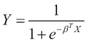

在上式中，输出变量不仅取决于变量，还取决于系数。变量类似于我们模型中输入值的向量，术语是模型的参数向量。对于二进制分类， *Y* 的值必须在 0 到 1 的范围内。此外，一组输入值的类别由输出变量更接近 0 还是 1 来确定。对于 *Y* 的这些值，项要么远大于 0，要么远大于 0。这可以正式表示如下:

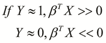

对于具有输入值和输出值的样本，我们将成本函数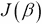定义如下:


### 注意

注意术语代表从估计模型计算的输出变量。

对于逻辑分类模型，是应用于一组输入值时的逻辑函数值。我们可以简化并扩展前面等式中定义的成本函数中的求和项，如下所示:

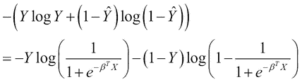

很明显，前面表达式中显示的成本函数取决于表达式中的两个对数项。因此，我们可以将成本函数表示为这两个对数项的函数，由项和表示。现在，让我们假设这两项如下式所示:


函数和都是使用逻辑函数组成的。必须训练模拟逻辑函数的分类器，使得这两个函数在参数向量的所有可能值上最小化。我们可以使用**铰链损失**函数来逼近使用逻辑函数的线性分类器的期望行为(更多信息，请参考“损失函数都一样吗？”).我们现在将通过与逻辑函数的比较来研究铰链损失函数。下图描述了函数相对于术语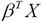必须如何变化，以及如何使用逻辑和铰链损失函数对其建模:

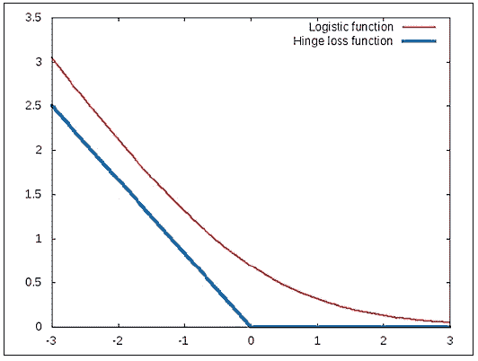

在上图所示的图中，逻辑函数表示为一条平滑曲线。可以看到，该函数在给定点之前迅速减小，然后以较低的速率减小。在这个例子中，发现逻辑函数的速率发生变化的点是 *x = 0* 。铰链损耗函数通过使用在点 *x = 0* 处相交的两条线段来近似这个值。有趣的是，这两个函数都模拟了以与输入值 *x* 成反比的速率变化的行为。类似地，我们可以使用铰链损失函数近似估算函数的影响，如下所示:


注意，函数与项成正比。因此，我们可以通过模拟铰链损失函数来实现逻辑函数的分类能力，并且使用铰链损失函数构建的分类器将与使用逻辑函数的分类器表现得一样好。

如上图所示，铰链损失函数仅在点改变其值。这适用于功能和。因此，我们可以根据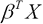的值是大于还是小于 0，使用铰链损失函数来分离两类数据。在这种情况下，这两个类别之间几乎没有界限。为了提高分类的裕度，我们可以修改铰链损失函数，使得其值仅在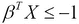或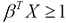时大于 0。

对于两类数据，修正的铰链损失函数可以绘制如下。以下图描述了的情况:

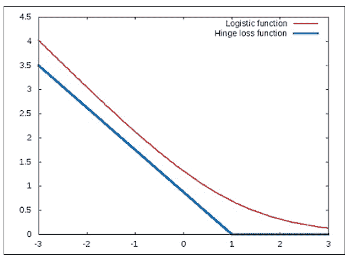

类似地，情况的修正铰链损失函数可由以下图表说明:

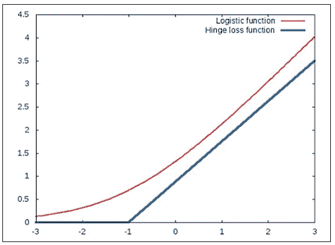

注意*铰链*在的情况下出现在 *-1* 处。

如果我们用铰链损失函数代替和函数，我们就得到一个支持向量机的优化问题(更多信息，请参考“支持向量网络”)，可以正式写成如下:

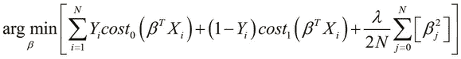

在前一等式中，项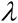是正则化参数。同样，当时，SVM 的行为受功能的影响大于受功能的影响，反之亦然。在一些上下文中，模型的正则化参数作为常数 *C* 添加到优化问题中，其中 *C* 类似于。优化问题的这种表示可以正式表达如下:


由于我们只处理两类数据，其中为 0 或 1，我们可以重写前面描述的优化问题，如下所示:


让我们尝试在一些训练数据上可视化 SVM 的行为。假设我们的训练数据中有两个输入变量和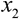。输入值及其类别可由以下图表表示:

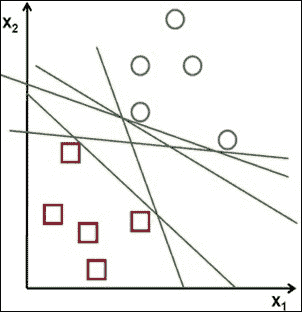

在前面的图中，训练数据中的两个类表示为圆形和方形。线性分类器会尝试将这些样本值划分为两个不同的类，并会产生一个判定边界，该边界可以由前面的曲线图中的任何一条线来表示。当然，分类器应该努力使公式化模型的总体误差最小化，同时也找到一个很好地概括数据的模型。一个 SVM 也将尝试把样本数据分成两类，就像任何其他分类模型一样。然而，SVM 设法确定分离的超平面，该超平面被观察到在两类输入数据之间具有最大可能的余量。

SVM 的这种行为可以用下面的图来说明:


如前面的曲线图所示，SVM 将确定分隔两个数据类的最佳超平面，这两个类之间具有最大可能的余量。从我们之前描述的 SVM 的优化问题，我们可以证明由 SVM 估计的分离超平面的方程如下:


### 注

注意，在前面的等式中，常数就是超平面的 y 截距。

为了更好地理解 SVM 是如何实现如此大的分离幅度的，我们需要使用一些基本的矢量运算。首先，我们可以如下定义给定向量的长度:

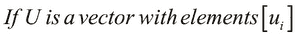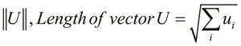

另一种经常用来描述支持向量机的运算是两个向量的内积。两个给定向量的内积可以正式定义如下:


### 注

注意，只有当两个向量长度相同时，这两个向量的内积才存在。

如上式所示，两个矢量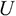和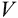的内积等于的转置和矢量的点积。另一种表示两个向量内积的方法是将一个向量投影到另一个向量上，如下所示:


请注意，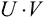项相当于矢量 V 和矢量 u 的转置的矢量积。由于表达式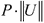相当于矢量的积，我们可以重写优化问题，我们之前已经根据输入变量到输出变量的投影描述过该问题。这可以正式表示如下:


因此，SVM 试图最小化参数向量中元素的平方和，同时确保分隔两个类数据的最佳超平面存在于两个平面和和之间。这两个平面被称为 SVM 的**支持向量**。因为我们必须最小化参数向量中元素的值，所以投影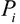必须足够大以确保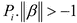和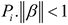:


因此，SVM 将确保输入变量在输出变量上的投影尽可能大。这意味着 SVM 将在训练数据中找到两类输入值之间的最大可能差值。

## 支持向量机的替代形式

我们现在将描述代表 SVM 的几个可选形式。本节的剩余部分可以安全地跳过，但是建议读者了解这些形式，因为它们也是广泛使用的支持向量机的符号。

如果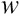是由 SVM 估计的超平面的法线，我们可以使用下面的等式表示这个分离超平面:

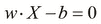

### 注

注意，在前面的方程中，项是超平面的 y 截距，类似于我们之前描述的超平面方程中的项。

该超平面的两个外围支持向量具有以下等式:

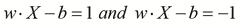

我们可以使用表达式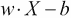来确定给定输入值集合的类别。如果这个表达式的值小于或等于-1，那么我们可以说输入值属于两类数据中的一类。类似地，如果表达式的值大于或等于 1，则预测输入值属于第二类。这可以正式表示如下:

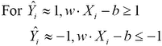

上式中描述的两个不等式可以合并成一个不等式，如下所示:

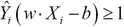

因此，我们可以简明地将支持向量机的优化问题重写如下:


在前面等式中定义的约束问题中，我们使用参数向量的法线而不是来参数化优化问题。通过使用拉格朗日乘数，我们可以将优化问题表达如下:


这种形式的 SVM 优化问题被称为**原始形式** 。请注意，在实践中，只有少数拉格朗日乘数的值会大于 0。此外，该解可以用输入向量和输出变量的线性组合表示，如下所示:

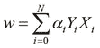

我们还可以用*对偶形式*来表达 SVM 的优化问题，这是一种约束表示，可描述如下:

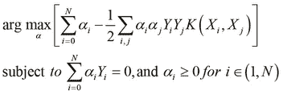

在前面的方程中描述的约束问题中，函数被称为**核函数** ，我们将在本章的后面部分讨论更多关于这个函数在支持向量机中的作用。


# 使用支持向量机的线性分类

如前所述，支持向量机可用于对两个不同的类别进行线性分类。SVM 将试图找到一个分离这两个类别的超平面，使得估计的超平面描述在我们的模型中这两个类别之间的最大可实现分离裕度。

例如，两类数据之间的估计超平面可以使用以下曲线图来可视化:

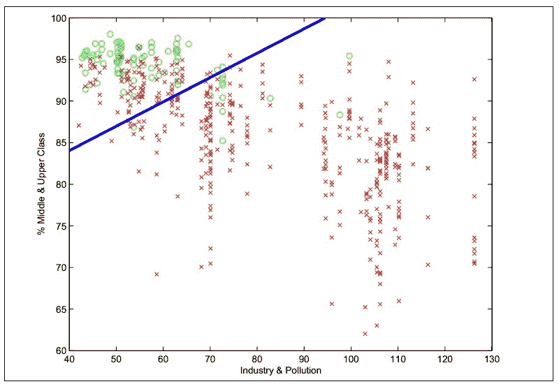

如前面的曲线图所示，圆圈和十字用于表示样本数据中的两类输入值。这条线表示 SVM 的估计超平面。

实际上，使用实现的 SVM 比实现我们自己的 SVM 更有效。有几个库实现了移植到多种编程语言的 SVM。一个这样的库是**LibLinear**([http://www.csie.ntu.edu.tw/~cjlin/liblinear/](http://www.csie.ntu.edu.tw/~cjlin/liblinear/))，它使用 SVM 实现了一个线性分类器。LibLinear 的 Clojure 包装器是`clj-liblinear`([https://github.com/lynaghk/clj-liblinear](https://github.com/lynaghk/clj-liblinear))，我们现在将探索如何使用这个库来轻松构建一个线性分类器。

### 注意

通过向`project.clj`文件添加以下依赖关系，可以将`clj-liblinear`库添加到 Leiningen 项目中:

```
[clj-liblinear "0.1.0"]
```

对于下面的示例，命名空间声明应该类似于下面的声明:

```
(ns my-namespace
  (:use [clj-liblinear.core :only [train predict]]))
```

首先，让我们生成一些训练数据，这样我们就有两类输入值。对于本例，我们将模拟两个输入变量，如下所示:

```
(def training-data
  (concat
   (repeatedly
    500 #(hash-map :class 0
                   :data {:x (rand)
                          :y (rand)}))
   (repeatedly
    500 #(hash-map :class 1
                   :data {:x (- (rand))
                          :y (- (rand))}))))
```

使用前面代码中所示的`repeatedly`函数，我们生成两个地图序列。这两个序列中的每个地图都包含关键字`:class`和`:data`。`:class`键的值代表输入值的类别，而`:data`键的值本身是另一个带有`:x`和`:y`键的映射。键`:x`和`:y`的值代表我们训练数据中的两个输入变量。这些输入变量的值是使用`rand`功能随机生成的。生成训练数据，使得如果两个输入值都是正的，则一组输入值的类别是`0`，如果两个输入值都是负的，则一组输入值的类别是`1`。如前面的代码所示，使用`repeatedly`函数为两个类生成总共 1000 个样本作为两个序列，然后使用`concat`函数将其组合成一个序列。我们可以在 REPL 中检查这些输入值，如下所示:

```
user> (first training-data)
{:class 0,
 :data {:x 0.054125811753944264, :y 0.23575052637986382}}
user> (last training-data)
{:class 1,
 :data {:x -0.8067872409710037, :y -0.6395480020409928}}
```

我们可以使用生成的训练数据来创建和训练 SVM。为此，我们使用`train`功能。`train`函数接受两个参数，包括一系列输入值和一系列输出值。假设两个序列的顺序相同。出于分类的目的，可以将输出变量设置为一组给定输入值的类，如以下代码所示:

```
(defn train-svm []
  (train
   (map :data training-data)
   (map :class training-data)))
```

前面代码中定义的`train-svm`函数将用`training-data`序列实例化和训练一个 SVM。现在，我们可以使用训练好的 SVM 通过`predict`函数进行分类，如下面的代码所示:

```
user> (def svm (train-svm))
#'user/svm
user> (predict svm {:x 0.5 :y 0.5})
0.0
user> (predict svm {:x -0.5 :y 0.5})
0.0
user> (predict svm {:x -0.4 :y 0.4})
0.0
user> (predict svm {:x -0.4 :y -0.4})
1.0
user> (predict svm {:x 0.5 :y -0.5})
1.0
```

`predict`函数需要两个参数，它们是一个 SVM 的实例和一组输入值。

如前面的代码所示，我们使用`svm`变量来表示一个经过训练的 SVM。然后，我们将`svm`变量传递给`predict`函数，同时传递的还有一组新的输入值，我们打算预测这些值的类别。观察到`predict`函数的输出与训练数据一致。有趣的是，只要输入值`:y`是正的，分类器就将任意一组输入值的类预测为`0`，反之`:y`特征为负的一组输入值的类预测为`1`。

在前面的示例中，我们使用了 SVM 来执行分类。然而，经过训练的 SVM 的输出变量总是一个数字。因此，我们也可以像前面代码中描述的那样使用`clj-liblinear`库来训练一个回归模型。

`clj-liblinear`库还支持更复杂的 SVM 要素类型，如矢量、地图和集合。我们现在将演示如何训练一个使用集合作为输入变量的分类器，而不是像前面的例子中所示的普通数字。假设我们有一个来自给定用户的 Twitter feed 的 tweets 流。假设用户将手动将这些推文分类到特定的类别中，该类别是从一组预定义的类别中选择的。这个经过处理的 tweets 序列可以表示如下:

```
(def tweets
  [{:class 0 :text "new lisp project released"}
   {:class 0 :text "try out this emacs package for common lisp"}
   {:class 0 :text "a tutorial on guile scheme"}

   {:class 1 :text "update in javascript library"}
   {:class 1 :text "node.js packages are now supported"}
   {:class 1 :text "check out this jquery plugin"}

   {:class 2 :text "linux kernel news"}
   {:class 2 :text "unix man pages"}
   {:class 2 :text "more about linux software"}])
```

前面代码中定义的 tweets 向量包含几个映射，每个映射都有键`:class`和`:text`。`:text`关键字包含一条推文的文本，我们将使用`:text`关键字包含的值训练一个 SVM。但是我们不能逐字使用文本，因为一些单词可能会在 tweet 中重复。此外，我们需要一些方法来处理本文中字母的大小写。让我们定义一个函数来将这个文本转换成一个集合，如下所示:

```
(defn extract-words [text]
  (->> #" "
       (split text)
       (map lower-case)
       (into #{})))
```

前面代码中定义的`extract-words`函数会将参数`text`表示的任何字符串转换成一组全部为小写的单词。为了创建一个集合，我们使用`(into #{})`表单。根据定义，这个集合不会包含任何重复的值。注意`->>`线程宏在`extract-words`功能定义中的使用。

### 注意

在`extract-words`函数中，`->>`形式可以等价地写成`(into #{} (map lower-case (split text #" ")))`。

我们可以检查 REPL 中`extract-words`函数的行为，如下所示:

```
user> (extract-words "Some text to extract some words")
#{"extract" "words" "text" "some" "to"}
```

使用`extract-words`函数，我们可以用一组字符串作为特征变量有效地训练一个 SVM。如前所述，这可以通过使用`train`功能来完成，如下所示:

```
(defn train-svm []
  (train (->> tweets
              (map :text)
              (map extract-words))
         (map :class tweets)))
```

前面代码中定义的`train-svm`函数将使用`train`和`extract-word` s 函数，使用 tweets 变量中经过处理的训练数据创建并训练一个 SVM。我们现在需要在下面的代码中编写`predict`和`extract-words`函数，这样我们就可以预测给定 tweet 的类别:

```
(defn predict-svm [svm text]
  (predict
    svm (extract-words text)))
```

前面代码中定义的`predict-svm`函数可以用来对给定的 tweet 进行分类。我们可以为 REPL 的一些任意推文验证预测的 SVM 的类，如下所示:

```
user> (def svm (train-svm))
#'user/svm
user> (predict-svm svm "a common lisp tutorial")
0.0
user> (predict-svm svm "new javascript library")
1.0
user> (predict-svm svm "new linux kernel update")
2.0
```

总之，`clj-liblinear`库允许我们用大多数 Clojure 数据类型轻松构建和训练 SVM。这个库施加的唯一限制是，训练数据必须可以线性分离到我们模型的类中。我们将在本章接下来的部分研究如何构建更复杂的分类器。


# 使用内核支持向量机

在某些情况下，可用的训练数据不是线性可分的，我们无法使用线性分类对数据建模。因此，我们需要使用不同的模型来拟合非线性数据。如第 4 章[、*构建神经网络*中所述，人工神经网络可用于对此类数据建模。在本节中，我们将介绍如何使用核函数拟合非线性数据的 SVM。包含核函数的 SVM 被称为**核支持向量机**。请注意，在本节中，术语 SVM 和内核 SVM 可以互换使用。核 SVM 将基于非线性决策边界对数据进行分类，决策边界的性质取决于 SVM 使用的核函数。为了说明这种行为，内核 SVM 将训练数据分为两类，如下图所示:](ch04.html "Chapter 4. Building Neural Networks")

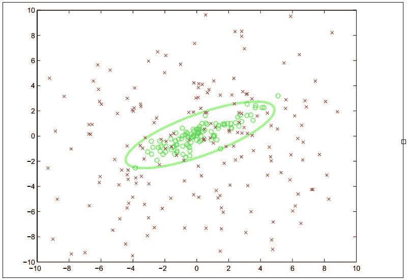

在支持向量机中使用核函数的概念实际上是基于数学变换。SVM 内核函数的作用是转换训练数据中的输入变量，使转换后的特征可线性分离。由于 SVM 根据较大的裕量对输入数据进行线性划分，因此在非线性空间中也可以观察到两类数据之间的这种较大差距。

内核函数被写成，其中是来自训练数据的输入值的向量，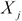是的变换向量。函数表示这两个向量的相似度，等价于这两个向量在变换空间中的内积。如果输入向量有给定的类，那么当这两个向量的核函数值接近 1 时，即时，向量的类与向量的类相同。核函数可以用数学方法表示如下:

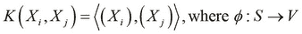

在上式中，函数执行从非线性空间到线性空间的变换。注意不需要的显式表示，知道是内积空间就够了。尽管我们可以自由选择任意核函数来模拟给定的训练数据，但我们必须努力减少最小化公式化 SVM 模型的成本函数的问题。因此，通常选择核函数，使得计算 SVM 判决边界仅需要确定变换特征空间中的矢量的点积。

SVM 的核函数的常见选择是**多项式核函数** ，也称为**多项式核函数**、，其将训练数据建模为原始特征变量的多项式。读者可能会从[第 5 章](ch05.html "Chapter 5. Selecting and Evaluating Data")、*选择和评估数据*中回忆起，我们已经讨论了多项式特征如何能够极大地提高给定机器学习模型的性能。多项式核函数可以被认为是应用于支持向量机的这一概念的扩展。该函数可以正式表示如下。

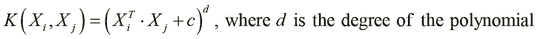

在上式中，术语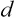代表多项式特征的最高次数。此外，当(常数)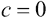时，内核被称为 **同质**。

另一个广泛使用的核函数是**高斯核函数** 。大多数精通线性代数的读者不需要介绍高斯函数。要知道这个函数代表数据的正态分布，其中的数据点更接近数据的平均值，这一点很重要。

在支持向量机的上下文中，高斯核函数可用于表示一个模型，在该模型中，训练数据中的两个类之一具有接近任意平均值的输入变量值。高斯核函数可以正式表示如下:


在上式中定义的高斯核函数中，项代表训练数据的方差，并代表高斯核的*宽度*。

内核函数的另一个流行选择是对字符串值执行操作的**字符串内核函数** 。对于术语*字符串*，我们指的是有限的符号序列。字符串核函数本质上是测量两个给定字符串之间的相似性。如果传递给字符串内核函数的两个字符串相同，那么这个函数返回的值将是`1`。因此，字符串核函数对于将要素表示为字符串的数据建模非常有用。

## 序列最小优化

SVM 的优化问题可以用**序贯最小优化** ( **SMO** )来解决。SVM 的优化问题是跨越几个维度的成本函数的数值优化，以便减少训练的 SVM 的总体误差。在实践中，这必须通过数值优化技术来完成。对 SMO 算法的完整讨论超出了本书的范围。但是，我们必须注意到，该算法通过*分治*技术来解决优化问题。本质上，SMO 将多维度的优化问题分成几个更小的二维问题，这些问题可以解析求解(更多信息，请参考*序列最小优化:一种训练支持向量机的快速算法*)。

**LibSVM** 是一个流行的库，它实现了 SMO 来训练一个 SVM。`svm-clj`库是 LibSVM 的 Clojure 包装器，现在我们将探索如何使用这个库来构建 SVM 模型。

### 注意

通过向`project.clj`文件添加以下依赖关系，可以将`svm-clj`库添加到 Leiningen 项目中:

```
[svm-clj "0.1.3"]
```

对于下面的示例，命名空间声明应该类似于下面的声明:

```
(ns my-namespace
  (:use svm.core))
```

本例将使用简化版本的 **SPECT 心脏**数据集([http://archive.ics.uci.edu/ml/datasets/SPECT+Heart](http://archive.ics.uci.edu/ml/datasets/SPECT+Heart))。该数据集描述了使用**单质子发射计算机断层扫描** ( **SPECT** )图像对几名心脏病患者的诊断。原始数据集总共包含 267 个样本，其中每个样本有 23 个特征。数据集的输出变量描述了给定患者的阳性或阴性诊断，分别用+1 或-1 表示。

对于这个例子，训练数据存储在一个名为`features.dat`的文件中。这个文件必须放在 Leiningen 项目的`resources/`目录中才能使用。该文件包含几个输入要素和这些输入值的类别。让我们看看该文件中的以下示例值之一:

```
+1 2:1 3:1 4:-0.132075 5:-0.648402 6:1 7:1 8:0.282443 9:1 10:0.5 11:1 12:-1 13:1
```

如前面的代码行所示，第一个值`+1`表示样本的类别，其他值表示输入变量。请注意，输入变量的索引也已给出。此外，前面示例中第一个特性的值是`0`，因为没有使用`1:`键提及它。从前面一行可以清楚地看出，每个样本最多有 12 个特性。按照 LibSVM 的规定，所有样本值必须符合这种格式。

我们可以使用这个样本数据来训练 SVM。为此，我们使用了`svm-clj`库中的`train-model`函数。此外，由于我们必须首先从文件中加载样本数据，我们将需要首先使用以下代码调用`read-dataset`函数:

```
(def dataset (read-dataset "resources/features.dat"))

(def model (train-model dataset))
```

由前面代码中定义的模型变量表示的已训练 SVM 现在可用于预测一组输入值的类别。`predict`功能可用于此目的。为简单起见，我们将使用数据集变量本身的一个样本值，如下所示:

```
user> (def feature (last (first dataset)))
#'user/feature
user> feature
{1 0.708333, 2 1.0, 3 1.0, 4 -0.320755, 5 -0.105023,
 6 -1.0, 7 1.0, 8 -0.4198, 9 -1.0, 10 -0.2258, 12 1.0, 13 -1.0}
user> (feature 1)
0.708333
user> (predict model feature)
1.0
```

如前面代码中的 REPL 输出所示，`dataset`可以被视为一系列地图。每个映射包含一个代表样本中输出变量的值的键。在`dataset`图中这个键的值是另一个图，代表给定样本的输入变量。由于`feature`变量代表一个地图，我们可以将其作为一个函数调用，如前面代码中的`(feature 1)`调用所示。

预测值与一组给定输入值的输出变量或类的实际值一致。总之，`svm-clj`库为我们提供了一个简单明了的 SVM 实现。

## 使用内核函数

正如我们之前提到的，当我们需要拟合一些非线性数据时，我们可以为 SVM 选择一个核函数。我们现在将演示如何使用`clj-ml`库在实践中实现这个。由于这个库已经在前面的章节中讨论过了，我们将不会关注 SVM 的完整训练，而是关注如何创建一个使用内核函数的 SVM。

### 注

对于下面的示例，命名空间声明应该类似于下面的声明:

```
(ns my-namespace
  (:use [clj-ml classifiers kernel-functions]))
```

来自`clj-ml.kernel-functions`名称空间的函数`make-kernel-function`用于创建可用于 SVM 的内核函数。例如，我们可以通过向这个函数传递:`polynomic`关键字来创建一个多项式核函数，如下所示:

```
(def K (make-kernel-function :polynomic {:exponent 3}))
```

如前一行所示，由变量`K`定义的多项式核函数的多项式次数为`3`。类似地，我们也可以使用`:string`关键字创建一个字符串内核函数，如下所示:

```
(def K (make-kernel-function :string))
```

在`clj-ml`库中有几个这样的内核函数，我们鼓励读者在这个库中探索更多的内核函数。这个名称空间的文档可以在[http://antoniogarrote . github . io/clj-ml/clj-ml . kernel-functions-API . html](http://antoniogarrote.github.io/clj-ml/clj-ml.kernel-functions-api.html)上找到。我们可以通过指定`:support-vector-machine`和`:smo`关键字，使用`make-classifier`函数创建一个 SVM；以及带有关键字选项`:kernel-function`的内核函数，如下所示:

```
(def classifier
  (make-classifier :support-vector-machine :smo
                   :kernel-function K))
```

我们现在可以训练由变量分类器表示的 SVM ，就像我们在前面章节中所做的那样。因此，`clj-ml`库允许我们创建展示给定内核函数的 SVM。


# 总结

在这一章中，我们探讨了支持向量机以及如何用它们来拟合线性和非线性数据。以下是我们讨论过的其他主题:

*   我们已经研究了支持向量机如何能够进行大范围分类，以及支持向量机优化问题的各种形式
*   我们已经讨论了如何使用核函数和 SMO 来训练具有非线性样本数据的 SVM
*   我们还展示了如何使用几个 Clojure 库来构建和训练 SVM

我们将在下一章把重点转移到无监督学习，我们将探索聚类技术来模拟这些类型的机器学习问题。