<title>Chapter 7. Clustering Data</title>

# 第七章。聚类数据

我们现在将把注意力转移到**无监督学习**。在这一章中，我们将研究几种**聚类**算法，或**聚类器** ，以及我们如何在 Clojure 中实现它们。我们还将演示几个 Clojure 库，它们提供了集群算法的实现。在这一章的结尾，我们将探索 will**dimensionality****reduction**以及如何使用它来提供所提供的样本数据的可理解的可视化。

聚类或**聚类分析**基本上是一种将数据或样本分组在一起的方法。作为无监督学习的一种形式，聚类模型是使用未标记的数据来训练的，这意味着训练数据中的样本将不包含输入值的类或类别。相反，训练数据不描述给定输入集的输出变量值。聚类分析模型必须确定几个输入值之间的相似性，并自己推断这些输入值的类别。因此，可以使用这种模型将样本值划分成多个聚类。

聚类在现实世界的问题中有几个实际应用。聚类通常用于图像分析、图像分割、软件进化系统和社会网络分析。在计算机科学领域之外，聚类算法用于生物分类、基因分析和犯罪分析。

到目前为止，已经公布了几种聚类算法。对于如何定义聚类以及如何将输入值合并到新的聚类中，每种算法都有独特的概念。不幸的是，对于任何聚类问题都没有给定的解决方案，每个算法都必须在反复试验的基础上进行评估，以确定哪个模型最适合所提供的训练数据。当然，这是无监督学习的一个方面，在这个意义上，没有明确的方法可以说给定的解决方案最适合任何给定的数据。

这是因为输入数据是未标记的，并且不能容易地从输出变量或输入值类别未知的数据中推断出简单的基于是/否的奖励系统来训练。

在这一章中，我们将描述一些可以应用于未标记数据的聚类技术。

# 使用 K 均值聚类

**K 均值聚类**算法是一种基于矢量量化的聚类技术(有关更多信息，请参考“算法 AS 136: A K 均值聚类算法”)。该算法将多个样本向量划分成 *K* 个簇，并因此得名。在这一节中，我们将研究 K-means 算法的本质和实现。

**量化**，在信号处理中，是将一大组数值映射成一组较小数值的过程。例如，模拟信号可以量化为 8 位，信号可以用 256 级量化来表示。假设位代表 0 到 5 伏范围内的值，8 位量化允许每位 5/256 伏的分辨率。在群集环境中，输入或输出的量化可基于以下原因进行:

*   将聚类限制到有限的聚类集。
*   以容纳样本数据中的一系列值，这些值在执行聚类时需要具有一定程度的容差。这种灵活性对于将未知或意外的样本值分组至关重要。

该算法的要点可以简明地描述如下。首先随机初始化 *K* 平均值，或*质心*。然后计算每个样本值离每个质心的距离。根据哪个质心与给定样本的距离最小，样本值被分组到给定质心的簇中。在多个特征或输入值的多维空间中，样本输入向量的距离由输入向量和给定质心之间的欧几里德距离来测量。该算法的这个阶段被称为**分配步骤**。

*K* -means 算法的下一阶段是**更新步骤** 。基于前一步骤生成的分区输入值来调整质心的值。然后重复这两个步骤，直到两次连续迭代中的质心值之间的差异变得可以忽略。因此，算法的最终结果是给定训练数据中每组输入值的聚类或类。

由 *K* -means 算法执行的迭代可以使用下面的图来说明:


每个图描绘了对于给定的一组输入值，由算法的每次迭代产生的质心和分区样本值。给定迭代中的分类在每个图中以不同的颜色显示。最终图表示由 *K* 均值算法产生的最终分割输入值集。

*K* 均值聚类算法的优化目标可以形式化定义如下:

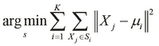

在前一等式中定义的优化问题中，术语代表*K*-输入值围绕其聚集的平均值。 *K* -means 算法最小化聚类的大小，并确定这些聚类的大小可以最小化的平均值。

该算法需要样本值和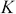初始平均值作为输入。在分配步骤中，输入值被分配给提供给算法的初始平均值周围的聚类。在后续更新步骤中，从输入值计算新的平均值。在大多数实现中，新平均值是作为属于给定聚类的所有输入值的平均值来计算的。

大多数实现将初始平均值初始化为一些随机选择的输入值。这种技术被称为随机初始化的 **Forgy 方法** 。

当聚类数 *K* 或输入数据 *d* 中的维数未绑定时， *K* 均值算法是 NP 难的。当这两个值都固定时， *K* -means 算法的时间复杂度为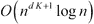。该算法有几种变体，它们在新平均值的计算方式上有所不同。

我们现在将演示如何在不使用外部库的情况下，在纯 Clojure 中实现 *K* -means 算法。我们首先定义算法的各个部分，然后将它们组合起来，提供一个基本的 *K* 均值算法的可视化。

我们可以说两个数字之间的距离是它们的值之间的绝对差，这可以作为一个`distance`函数来实现，如下面的代码所示:

```
(defn distance [a b]
  (if (< a b) (- b a) (- a b)))
```

如果给我们一些平均值，我们可以通过使用`distance`和`sort-by`函数的组合来计算给定数字的最接近平均值，如下面的代码所示:

```
(defn closest [point means distance]
  (first (sort-by #(distance % point) means)))
```

为了演示前面代码中定义的`closest`函数，我们首先需要定义一些数据，即一系列数字和几个平均值，如下面的代码所示:

```
(def data '(2 3 5 6 10 11 100 101 102))
(def guessed-means '(0 10))
```

我们现在可以将`data`和`guessed-means`变量与`closest`函数和任意数字一起使用，如以下 REPL 输出所示:

```
user> (closest 2 guessed-means distance)
0
user> (closest 9 guessed-means distance)
10
user> (closest 100 guessed-means distance)
10
```

给定均值`0`和`10`，函数`closest`返回`0`作为最接近`2`的均值，返回`10`作为`9`和`100`的均值。因此，一组数据点可以按照最接近它们的平均值进行分组。我们可以使用`closest`和`group-by`函数实现一个函数来实现这个分组操作，如下所示:

```
(defn point-groups [means data distance]
  (group-by #(closest % means distance) data))
```

前面代码中定义的`point-groups`函数需要三个参数，即初始平均值、要分组的点的集合，以及最后一个返回一个点到给定平均值的距离的函数。请注意，`group-by`函数将作为第一个参数传递的函数应用到一个集合，然后该集合作为第二个参数传递。

我们可以在由`data`变量表示的数字列表上应用`point-groups`函数，根据给定值与由`guessed-means`表示的猜测平均值的距离对其进行分组，如以下代码所示:

```
user> (point-groups guessed-means data distance)
{0 [2 3 5], 10 [6 10 11 100 101 102]}
```

如前面的代码所示，`point-groups`函数将序列`data`分成两组。为了从这些组输入值中计算出新的一组平均值，我们必须计算它们的平均值，这可以使用`reduce`和`count`函数来实现，如下面的代码所示:

```
(defn average [& list]
  (/ (reduce + list)
     (count list)))
```

我们实现了一个函数，将前面代码中定义的`average`函数应用于之前的平均值和函数返回的组映射。我们将借助以下代码来实现这一点:

```
(defn new-means [average point-groups old-means]
  (for [m old-means]
    (if (contains? point-groups m)
      (apply average (get point-groups m)) 
      m)))
```

在前面代码中定义的`new-means`函数中，对于前面平均值中的每个值，我们将`average`函数应用于按平均值分组的点。当然，`average`函数必须应用于给定平均值的点，前提是该平均值有任何按其分组的点。使用`new-means`功能中的`contains?`功能进行检查。我们可以在 REPL 的样本数据上检查由`new-means`函数返回的值，如下面的输出所示:

```
user> (new-means average
        (point-groups guessed-means data distance)
                 guessed-means)
(10/3 55)
```

如前面的输出所示，新的平均值是根据初始平均值`(0 10)`计算出来的`(10/3 55)`。为了实现 *K* -means 算法，我们必须对其返回的新平均值迭代应用`new-means`函数。这个迭代可以使用`iterate`函数来执行，它需要一个接受传递给它的单个参数的函数。

我们可以定义一个函数与`iterate`函数一起使用，方法是将`new-means`函数转换为传递给它的旧平均值，如以下代码所示:

```
(defn iterate-means [data distance average]
  (fn [means]
    (new-means average
               (point-groups means data distance)
               means)))
```

前面代码中定义的`iterate-means`函数返回一个函数，该函数根据一组给定的初始平均值计算新的平均值，如以下输出所示:

```
user> ((iterate-means data distance average) '(0 10))
(10/3 55)
user> ((iterate-means data distance average) '(10/3 55))
(37/6 101)
```

如前面的输出所示，在应用由`iterate-means`函数返回的函数几次后，观察到平均值发生了变化。这个返回的函数可以传递给`iterate`函数，我们可以使用`take`函数检查迭代的平均值，如下面的代码所示:

```
user> (take 4 (iterate (iterate-means data distance average)
                       '(0 10)))
((0 10) (10/3 55) (37/6 101) (37/6 101))
```

据观察，平均值仅在前三次迭代中变化，并收敛于我们定义的样本数据的值`(37/6 10)`。 *K* -means 算法的终止条件是平均值的收敛，因此我们必须迭代`iterate-means`函数返回的值，直到返回的平均值与之前返回的平均值没有不同。由于`iterate`函数延迟返回一个无限序列，我们必须实现一个函数，通过序列中元素的收敛来限制这个序列。这种行为可以通过使用`lazy-seq`和`seq`函数的延迟实现来实现，如以下代码所示:

```
(defn take-while-unstable
  ([sq] (lazy-seq (if-let [sq (seq sq)]
                    (cons (first sq)
                          (take-while-unstable 
                           (rest sq) (first sq))))))
  ([sq last] (lazy-seq (if-let [sq (seq sq)]
                         (if (= (first sq) last)
                           nil
                           (take-while-unstable sq))))))
```

在前面的代码中定义的`take-while-unstable`函数将一个惰性序列拆分为头项和尾项，然后将序列的第一个元素与序列尾部的第一个元素进行比较，以返回一个空列表，如果两个元素相等，则返回`nil`。然而，如果它们不相等，则在序列的尾部再次调用`take-while-unstable`功能。注意`if-let`宏的使用，它只是一个`let`表单，以一个`if`表达式为主体来检查序列`sq`是否为空。我们可以检查 REPL 中`take-while-unstable`函数返回的值，如下图所示:

```
user> (take-while-unstable
       '(1 2 3 4 5 6 7 7 7 7))
(1 2 3 4 5 6 7)
user> (take-while-unstable 
       (iterate (iterate-means data distance average)
                '(0 10)))
((0 10) (10/3 55) (37/6 101))
```

使用我们计算的最终平均值，我们可以在由`point-groups`函数返回的地图上使用`vals`函数来确定输入值的聚类，如以下代码所示:

```
(defn k-cluster [data distance means]
  (vals (point-groups means data distance)))
```

注意，`vals`函数以序列形式返回给定映射中的所有值。

前面代码中定义的`k-cluster`函数产生由 *K* -means 算法返回的输入值的最终聚类。我们可以对最终平均值`(37/6 101)`应用`k-cluster`函数，以返回输入值的最终聚类，如以下输出所示:

```
user> (k-cluster data distance '(37/6 101))
([2 3 5 6 10 11] [100 101 102])
```

为了可视化输入值聚类中的变化，我们可以对通过组合`iterate`和`iterate-means`函数返回的值序列应用`k-cluster`函数。我们必须通过收敛所有聚类中的值来限制该序列，这可以使用`take-while-unstable`函数来完成，如以下代码所示:

```
user> (take-while-unstable
       (map #(k-cluster data distance %)
            (iterate (iterate-means data distance average)
             '(0 10))))
(([2 3 5] [6 10 11 100 101 102])
 ([2 3 5 6 10 11] [100 101 102]))
```

我们可以将前面的表达式重构为一个函数，通过将`iterate-means`函数绑定到样本数据，该函数只需要猜测平均值的初始集合。用于计算给定输入值与平均值的距离以及一组输入值的平均平均值的函数如以下代码所示:

```
(defn k-groups [data distance average]
  (fn [guesses]
    (take-while-unstable
     (map #(k-cluster data distance %)
          (iterate (iterate-means data distance average)
                   guesses)))))
```

我们可以将前面代码中定义的`k-groups`函数与我们的示例数据以及`distance`和`average`函数绑定，它们对数值进行操作，如下面的代码所示:

```
(def grouper
  (k-groups data distance average))
```

现在，我们可以对任意一组平均值应用`grouper`函数来可视化在 *K* -means 算法的各次迭代中聚类的变化，如以下代码所示:

```
user> (grouper '(0 10))
(([2 3 5] [6 10 11 100 101 102])
 ([2 3 5 6 10 11] [100 101 102]))
user> (grouper '(1 2 3))
(([2] [3 5 6 10 11 100 101 102])
 ([2 3 5 6 10 11] [100 101 102])
 ([2 3] [5 6 10 11] [100 101 102])
 ([2 3 5] [6 10 11] [100 101 102])
 ([2 3 5 6] [10 11] [100 101 102]))
user> (grouper '(0 1 2 3 4))
(([2] [3] [5 6 10 11 100 101 102])
 ([2] [3 5 6 10 11] [100 101 102])
 ([2 3] [5 6 10 11] [100 101 102])
 ([2 3 5] [6 10 11] [100 101 102])
 ([2] [3 5 6] [10 11] [100 101 102])
 ([2 3] [5 6] [10 11] [100 101 102]))
```

正如我们前面提到的，如果平均值的数量大于输入值的数量，我们最终得到的聚类数量等于输入值的数量，其中每个聚类包含一个输入值。这可以在 REPL 中使用`grouper`函数进行验证，如以下代码所示:

```
user> (grouper (range 200))
(([2] [3] [100] [5] [101] [6] [102] [10] [11]))
```

我们可以通过改变`distance`和`average`距离(它们是`k-groups`函数的参数)来扩展前面的实现，以应用于向量值而不仅仅是数值。我们可以为向量值实现这两个函数，如下所示:

```
(defn vec-distance [a b]
  (reduce + (map #(* % %) (map - a b))))

(defn vec-average [& list]
  (map #(/ % (count list)) (apply map + list)))
```

前面代码中定义的`vec-distance`函数将两个向量值之间的平方欧几里德距离实现为两个向量中相应元素之间的平方差之和。我们还可以计算一些向量值的平均值，方法是将它们加在一起，然后将每个结果元素除以加在一起的向量的数量，如前面代码中定义的`vec-average`函数所示。我们可以检查 REPL 中这些函数的返回值，如下图所示:

```
user> (vec-distance [1 2 3] [5 6 7])
48
user> (vec-average  [1 2 3] [5 6 7])
(3 4 5)
```

现在，我们可以定义以下一些向量值，用作聚类算法的样本数据:

```
(def vector-data
  '([1 2 3] [3 2 1] [100 200 300] [300 200 100] [50 50 50]))
```

我们现在可以使用带有`vector-data`、`vec-distance`和`vec-average`变量的`k-groups`函数来打印各种经过迭代的聚类，以产生最终的聚类集，如下面的代码所示:

```
user> ((k-groups vector-data vec-distance vec-average)
       '([1 1 1] [2 2 2] [3 3 3]))
(([[1 2 3] [3 2 1]] [[100 200 300] [300 200 100] [50 50 50]])

 ([[1 2 3] [3 2 1] [50 50 50]]
  [[100 200 300] [300 200 100]])

 ([[1 2 3] [3 2 1]]
  [[100 200 300] [300 200 100]]
  [[50 50 50]]))
```

我们可以添加到这个实现中的另一个改进是通过`new-means`函数更新相同的平均值。如果我们向`new-means`函数传递相同平均值的列表，两个平均值都将被更新。然而，在经典的 *K* -means 算法中，仅更新两个相同平均值中的一个平均值。可以在 REPL 中验证这种行为，方法是将一系列相同的方法(如`'(0 0)`传递给`new-means`函数，如以下代码所示:

```
user> (new-means average 
                 (point-groups '(0 0) '(0 1 2 3 4) distance) 
                 '(0 0))
(2 2)
```

我们可以通过检查一组平均值中给定平均值的出现次数来避免这个问题，如果发现一个平均值出现多次，则只更新该平均值。我们可以使用`frequencies`函数来实现这一点，该函数返回一个 map，其中键作为传递给`frequencies`函数的原始集合中的元素，值作为这些元素出现的频率。因此，我们可以重新定义`new-means`函数，如以下代码所示:

```
(defn update-seq [sq f]
  (let [freqs (frequencies sq)]
    (apply concat
     (for [[k v] freqs]
       (if (= v 1) 
         (list (f k))
         (cons (f k) (repeat (dec v) k)))))))
(defn new-means [average point-groups old-means]
  (update-seq
   old-means
   (fn [o]
     (if (contains? point-groups o)
       (apply average (get point-groups o)) o))))
```

前面代码中定义的函数`update-seq`将函数`f`应用于序列`sq`中的元素。如果元素在序列中重复，函数`f`仅适用于单个元素。我们现在可以观察到，当我们对相同平均值序列`'(0 0)`应用重新定义的`new-means`函数时，只有一个平均值发生变化，如以下输出所示:

```
user> (new-means average
                 (point-groups '(0 0) '(0 1 2 3 4) distance)
                 '(0 0))
(2 0)
```

前面对`new-means`函数重新定义的结果是，当`k-groups`函数应用于不同且相同的初始平均值时，例如`'(0 1)`和`'(0 0)`，它现在会产生相同的聚类，如以下代码所示:

```
user> ((k-groups '(0 1 2 3 4) distance average)
       '(0 1))
(([0] [1 2 3 4]) ([0 1] [2 3 4]))
user> ((k-groups '(0 1 2 3 4) distance average)
       '(0 0))
(([0 1 2 3 4]) ([0] [1 2 3 4]) ([0 1] [2 3 4]))
```

对于相同的初始平均值，`new-means`函数的这一新行为也扩展到了向量值，如以下输出所示:

```
user> ((k-groups vector-data vec-distance vec-average)
       '([1 1 1] [1 1 1] [1 1 1]))
(([[1 2 3] [3 2 1] [100 200 300] [300 200 100] [50 50 50]])
 ([[1 2 3] [3 2 1]] [[100 200 300] [300 200 100] [50 50 50]])
 ([[1 2 3] [3 2 1] [50 50 50]] [[100 200 300] [300 200 100]])
 ([[1 2 3] [3 2 1]] [[100 200 300] [300 200 100]] [[50 50 50]]))
```

总之，上例中定义的的`k-cluster`和`k-groups`函数描述了如何在惯用的 Clojure 中实现 *K* 均值聚类。

## 使用 clj-ml 对数据进行聚类

`clj-ml`库提供了几个从 Java Weka 库派生的集群算法的实现。我们现在将演示如何使用`clj-ml`库来构建一个 *K* -means clusterer。

### 注意

通过向`project.clj`文件添加以下依赖关系，可将`clj-ml`和咒语库添加到 Leiningen 项目中:

```
[cc.artifice/clj-ml "0.4.0"]
[incanter "1.5.4"]

```

对于下面的示例，命名空间声明应该类似于下面的声明:

```
(ns my-namespace
 (:use [incanter core datasets]
 [clj-ml data clusterers]))

```

对于本章中使用`clj-ml library`的示例，我们将使用来自咒语库的**虹膜**数据集作为我们的训练数据。该数据集本质上是 150 朵花的样本和为这些样本测量的四个特征变量。在虹膜数据集中测量的花的特征是花的花瓣和萼片的宽度和长度。样本值分布在三个物种或类别中，即海滨锦鸡儿、刚毛锦鸡儿和云芝。数据以大小的矩阵形式提供，其中给定花卉的种类表示为该矩阵的最后一列。

我们可以从 Iris 数据集中选择特征作为向量，使用来自 Incanter 库的`get-dataset`、`sel`和`to-vector`函数，如下面的代码所示。然后我们可以使用`clj-ml`库中的`make-dataset`函数将这个向量转换成一个`clj-ml`数据集。这是通过将特征值的关键字名称作为模板传递给`make-dataset`函数来实现的，如以下代码所示:

```
(def features [:Sepal.Length
               :Sepal.Width
               :Petal.Length
               :Petal.Width])

(def iris-data (to-vect (sel (get-dataset :iris)
                             :cols features)))

(def iris-dataset
  (make-dataset "iris" features iris-data))
```

我们可以在 REPL 中打印前面代码中定义的变量`iris-dataset`，以给出一些关于的信息，如下面的代码和输出所示:

```
user> iris-dataset
#<ClojureInstances @relation iris

@attribute Sepal.Length numeric
@attribute Sepal.Width numeric
@attribute Petal.Length numeric
@attribute Petal.Width numeric

@data
5.1,3.5,1.4,0.2
4.9,3,1.4,0.2
4.7,3.2,1.3,0.2
...
4.7,3.2,1.3,0.2
6.2,3.4,5.4,2.3
5.9,3,5.1,1.8>
```

我们可以使用来自`clj-ml.clusterers`名称空间的`make-clusterer`函数创建一个集群器。我们可以指定要创建的集群类型作为`make-cluster`函数的第一个参数。第二个可选参数是用于创建指定集群器的选项映射。我们可以使用`clj-ml`库中的`cluster-build`函数训练一个给定的集群器。在下面的代码中，我们使用带有`:k-means`关键字的`make-clusterer`函数创建了一个新的 *K* -means clusterer，并定义了一个简单的 helper 函数来帮助使用任何给定的数据集训练该 clusterer:

```
(def k-means-clusterer
  (make-clusterer :k-means
                  {:number-clusters 3}))

(defn train-clusterer [clusterer dataset]
  (clusterer-build clusterer dataset)
  clusterer)
```

`train-clusterer`函数可以应用于`k-means-clusterer`变量和变量所代表的样本数据所定义的 clusterer 实例，如下面的代码和输出所示:

```
user> (train-clusterer k-means-clusterer iris-dataset)
#<SimpleKMeans
kMeans
======

Number of iterations: 6
Within cluster sum of squared errors: 6.982216473785234
Missing values globally replaced with mean/mode

Cluster centroids:
                            Cluster#
Attribute       Full Data          0          1          2
                    (150)       (61)       (50)       (39)
==========================================================
Sepal.Length       5.8433     5.8885      5.006     6.8462
Sepal.Width        3.0573     2.7377      3.428     3.0821
Petal.Length        3.758     4.3967      1.462     5.7026
Petal.Width        1.1993      1.418      0.246     2.0795
```

如前面的输出所示，训练好的聚类器包含第一个聚类中的`61`值(聚类`0`)、第二个聚类中的`50`值(聚类`1`)和第三个聚类中的`39`值(聚类`2`)。前面的输出还为我们提供了一些有关训练数据中单个特征的平均值的信息。我们现在可以使用训练好的聚类器和`clusterer-cluster`函数来预测输入数据的类别，如以下代码所示:

```
user> (clusterer-cluster k-means-clusterer iris-dataset)
#<ClojureInstances @relation 'clustered iris'

@attribute Sepal.Length numeric
@attribute Sepal.Width numeric
@attribute Petal.Length numeric
@attribute Petal.Width numeric
@attribute class {0,1,2}

@data
5.1,3.5,1.4,0.2,1
4.9,3,1.4,0.2,1
4.7,3.2,1.3,0.2,1
...
6.5,3,5.2,2,2
6.2,3.4,5.4,2.3,2
5.9,3,5.1,1.8,0>
```

`clusterer-cluster`函数使用经过训练的聚类器返回一个新的数据集，该数据集包含一个附加的第五个属性，该属性表示给定样本值的类别。如前面的代码所示，这个新属性具有值`0`、`1`和`2`，样本值也包含这个新特性的有效值。总之，`clj-ml`库为使用聚类算法提供了一个很好的框架。在前面的例子中，我们使用`clj-ml`库创建了一个 *K* -means clusterer。

<title>Using hierarchical clustering</title>

# 使用层次聚类

**层次聚类** 是聚类分析的另一种方法，其中来自训练数据的输入值被分组到一个层次中。创建层次结构的过程可以采用自上而下的方法，其中所有的观察首先是单个聚类的一部分，然后被划分成更小的聚类。或者，我们可以使用自下而上的方法对输入值进行分组，其中每个分类最初是来自训练数据的样本值，然后将这些分类组合在一起。前一种自顶向下的方法称为**分裂聚类** ，后一种自底向上的方法称为**聚集聚类** 。

因此，在凝聚聚类中，我们将聚类组合成更大的聚类，而在分裂聚类中，我们将聚类分成更小的聚类。在性能方面，凝聚聚类算法的现代实现具有时间复杂度，而分裂聚类的实现具有高得多的复杂度。

假设我们的训练数据中有六个输入值。在下图中，假设这些输入值根据某个二维度量进行定位，以测量给定输入值的总体值:

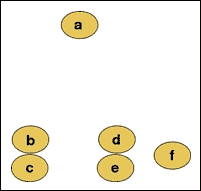

我们可以对这些输入值应用聚合聚类来生成以下聚类层次结构:


观察到值 *b* 和 *c* 在空间分布中彼此最接近，因此被分组成一个群。类似地，节点 *d* 和 *e* 也被分组到另一个集群中。对输入值进行分层聚类的最终结果是样本值的单个二叉树或**树形图** 。实际上，像 *bc* 和 *def* 这样的集群作为值或其他集群的二进制子树被添加到层次结构中。尽管这一过程在二维空间中似乎非常简单，但当应用于要素的几个维度时，确定输入值之间的距离和等级的问题的解决方案就不那么简单了。

在凝聚和分裂聚类技术中，必须计算来自样本数据的输入值之间的相似性。这可以通过测量两组输入值之间的距离，使用计算出的距离将它们分组到聚类中，然后确定两个输入值聚类之间的联系或相似性来实现。

分层聚类算法中距离度量的选择将决定该算法产生的聚类的形状。两个输入向量和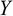之间的距离的两个常用度量是欧几里德距离和欧几里德距离的平方，它们可以正式表示如下:


输入值之间距离的另一个常用度量是最大距离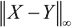，它计算两个给定向量中相应元素的最大绝对差。该函数可以表示如下:


层次聚类算法的第二个方面是链接标准，它是两个输入值聚类之间相似性或不相似性的有效度量。确定两个输入值之间连锁关系的两种常用方法是**完全连锁聚类** 和**单一连锁聚类** 。这两种方法都是凝聚聚类的形式。

在凝聚聚类中，具有最短距离度量的两个输入值或聚类被组合成一个新的聚类。当然，“最短距离”的定义在任何聚集聚类技术中都是独一无二的。在完全关联聚类中，使用彼此相距最远的输入值来确定分组。因此，这种方法也被称为**最远邻居聚类** 。两个值之间的距离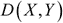的度量可以正式表示如下:

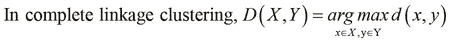

在前面的等式中，函数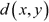是两个输入向量之间距离的选定度量。完整的关联聚类实质上将具有距离度量最大值的值或聚类组合在一起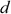。重复这种将群集组合在一起的操作，直到产生单个群集。

在单一关联聚类中，彼此最接近的值被分组在一起。因此，单连锁聚类也被称为**最近邻聚类**。这可以用下面的表达式来正式表述:

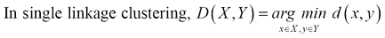

另一种流行的层次聚类技术是 **蛛网算法** 。该算法是**概念聚类** 的一种形式，其中为使用的聚类方法产生的每个聚类创建一个概念。对于术语“概念”，我们指的是对聚集在一起的数据的简明的正式描述。有趣的是，概念聚类与决策树学习密切相关，我们已经在[第 3 章](ch03.html "Chapter 3. Categorizing Data")、*分类数据*中讨论过。蛛网算法将所有聚类分组到一个**分类树**中，其中每个节点都包含作为其子节点的值或聚类的正式摘要。然后，此信息可用于确定和预测具有某些缺失要素的输入值的类别。从这个意义上说，当测试数据中的一些样本缺少或未知特征时，可以使用这种技术。

我们现在演示一个简单的分层集群实现。在这个实现中，我们采用了一种稍微不同的方法，将部分所需功能嵌入到 Clojure 语言提供的标准向量数据结构中。

### 注意

对于接下来的例子，我们需要可以通过向`project.clj`文件添加以下依赖项来添加到 Leiningen 项目的`clojure.math.numeric-tower`库:

```
[org.clojure/math.numeric-tower "0.0.4"]
```

该示例的命名空间声明应类似于以下声明:

```
(ns my-namespace
  (:use [clojure.math.numeric-tower :only [sqrt]]))
```

对于这个实现，我们将使用两点之间的欧几里德距离作为距离度量。我们可以通过输入向量中元素的平方和来计算这个距离，可以使用如下的`reduce`和`map`函数的组合来计算:

```
(defn sum-of-squares [coll]
  (reduce + (map * coll coll)))
```

前面代码中定义的`sum-of-squares`函数将用于确定距离度量。我们将定义两个协议，抽象我们对特定数据类型执行的操作。从工程角度来看，这两个协议可以合并成一个协议，因为这两个协议将组合使用。

然而，为了清楚起见，我们在本例中使用了以下两种协议:

```
(defprotocol Each
  (each [v op w]))

(defprotocol Distance
  (distance [v w]))
```

在`Each`协议中定义的`each`函数对两个集合`v`和`w`中的相应元素应用给定的操作`op`。`each`函数与标准的`map`函数非常相似，但是`each`允许`v`的数据类型决定如何应用函数`op`。在`Distance`协议中定义的`distance`函数计算任意两个集合`v`和`w`之间的距离。注意，我们使用通用术语“集合”,因为我们处理的是抽象协议，而不是这些协议功能的具体实现。对于这个例子，我们将把前面的协议作为 vector 数据类型的一部分来实现。当然，这些协议也可以扩展到其他数据类型，比如集合和映射。

在本例中，我们将实现单一链接聚类作为链接标准。首先，我们必须定义一个函数来从一组向量值中确定两个最近的向量。为此，我们可以在 vector 上应用`min-key`函数，该函数返回集合中关联值最少的键。有趣的是，这在 Clojure 中是可能的，因为我们可以将一个向量视为一个映射，将向量中各种元素的索引值作为它的键。我们将借助以下代码来实现这一点:

```
(defn closest-vectors [vs]
  (let [index-range (range (count vs))]
    (apply min-key
           (fn [[x y]] (distance (vs x) (vs y)))
           (for [i index-range
                 j (filter #(not= i %) index-range)]
             [i j]))))
```

前面代码中定义的`closest-vectors`函数使用`for`形式确定矢量`vs`索引的所有可能组合。注意，向量`vs`是向量的向量。然后将`distance`函数应用于可能的索引组合的值，然后使用`min-key`函数比较这些距离。该函数最终返回彼此距离最小的两个内部向量值的索引值，从而实现单链聚类。

我们还需要计算两个必须聚集在一起的向量的平均值。我们可以使用之前在`Each`协议中定义的`each`函数和`reduce`函数来实现，如下所示:

```
(defn centroid [& xs]
  (each
   (reduce #(each %1 + %2) xs)
   *
   (double (/ 1 (count xs)))))
```

前面代码中定义的`centroid`函数将计算一系列向量值的平均值。注意使用`double`函数来确保`centroid`函数返回的值是一个双精度数。

我们现在将`Each`和`Distance`协议实现为 vector 数据类型的一部分，它完全符合`clojure.lang.PersistentVector`的要求。使用`extend-type`功能完成，如下所示:

```
(extend-type clojure.lang.PersistentVector
  Each
  (each [v op w]
    (vec
     (cond
      (number? w) (map op v (repeat w))
      (vector? w) (if (>= (count v) (count w))
                    (map op v (lazy-cat w (repeat 0)))
                    (map op (lazy-cat v (repeat 0)) w)))))
  Distance 
  ;; implemented as Euclidean distance
  (distance [v w] (-> (each v - w)
                      sum-of-squares
                      sqrt)))
```

`each`函数的实现方式是将`op`运算应用于`v`向量中的每个元素和第二个参数`w`。`w`参数可以是向量或数字。如果`w`是一个数字，我们只需将函数`op`映射到`v`和数字`w`的重复值。如果`w`是一个向量，我们使用`lazy-cat`函数用`0`值填充较小的向量，并将`op`映射到两个向量上。此外，我们将整个表达式包装在一个`vec`函数中，以确保返回值始终是一个向量。

使用我们之前定义的`sum-of-squares`函数和来自`clojure.math.numeric-tower`名称空间的`sqrt`函数，将`distance`函数实现为两个向量值`v`和`w`之间的欧几里德距离。

我们已经拥有了实现对向量值执行层次聚类的函数所需的所有部分。我们可以主要使用我们之前定义的质心和`closest-vectors`函数来实现层次聚类，如下所示:

```
(defn h-cluster
  "Performs hierarchical clustering on a
  sequence of maps of the form { :vec [1 2 3] } ."
  [nodes]
  (loop [nodes nodes]
    (if (< (count nodes) 2)
      nodes
      (let [vectors    (vec (map :vec nodes))
            [l r]      (closest-vectors vectors)
            node-range (range (count nodes))
            new-nodes  (vec
                        (for [i node-range
                              :when (and (not= i l)
                                         (not= i r))]
                          (nodes i)))]
        (recur (conj new-nodes
                     {:left (nodes l) :right (nodes r)
                      :vec (centroid
                            (:vec (nodes l))
                            (:vec (nodes r)))}))))))
```

我们可以将一个映射向量传递给前面代码中定义的`h-cluster`函数。这个向量中的每个地图都包含一个向量作为关键字`:vec`的值。`h-cluster`函数组合这些地图中来自`:vec`关键词的所有矢量值，并使用`closest-vectors`函数确定两个最近的矢量。由于`closest-vectors`函数返回的值是两个索引值的向量，所以我们确定所有向量的索引都不同于`closest-vectors`函数返回的两个索引值。这是通过使用特殊形式的`for`宏来完成的，该宏允许用`:when`键参数指定条件子句。然后使用`centroid`函数计算两个最近向量的平均值。使用平均值创建新的图，然后将其添加到原始向量中，以替换两个最接近的向量值。使用`loop`形式，重复该过程，直到向量包含单个簇。我们可以检查 REPL 中`h-cluster`函数的行为，如以下代码所示:

```
user> (h-cluster [{:vec [1 2 3]} {:vec [3 4 5]} {:vec [7 9 9]}])
[{:left {:vec [7 9 9]},
  :right {:left {:vec [1 2 3]},
          :right {:vec [3 4 5]},
          :vec [2.0 3.0 4.0]},
  :vec [4.5 6.0 6.5] }]
```

当应用于三个向量值`[1 2 3]`、`[3 4 5]`和`[7 9 9]`时，如前面的代码所示，`h-cluster`函数将向量`[1 2 3]`和`[3 4 5]`分组为一个簇。该集群具有从矢量`[1 2 3]`和`[3 4 5]`计算出的平均值`[2.0 3.0 4.0]`。然后，在下一次迭代中，该新聚类与向量`[7 9 9]`分组，从而产生具有平均值`[4.5 6.0 6.5]`的单个聚类。总之，`h-cluster`函数可用于将向量值分层聚类成一个层次。

`clj-ml`库提供了蛛网层次聚类算法的实现。我们可以使用带有`:cobweb`参数的`make-clusterer`函数实例化这样一个集群器。

```
(def h-clusterer (make-clusterer :cobweb))
```

由前面代码中所示的`h-clusterer`变量定义的聚类器可以使用我们之前定义的`train-clusterer`函数和`iris-dataset`数据集进行训练，如下所示:`train-clusterer`函数和`iris-dataset`可以如下面代码所示实现:

```
user> (train-clusterer h-clusterer iris-dataset)
#<Cobweb Number of merges: 0
Number of splits: 0
Number of clusters: 3

node 0 [150]
|   leaf 1 [96]
node 0 [150]
|   leaf 2 [54]
```

如前面的 REPL 输出所示，蛛网聚类算法将输入数据划分为两个聚类。一个聚类有 96 个样本，另一个聚类有 54 个样本，与我们之前使用的 *K* -means clusterer 相比，这是一个非常不同的结果。总之，`clj-ml`库提供了一个易于使用的蛛网聚类算法实现。

<title>Using Expectation-Maximization</title>

# 使用期望值最大化

**期望最大化** ( **EM** )算法是一种概率方法，用于确定适合所提供的训练数据的聚类模型。该算法确定公式化聚类模型参数的**最大似然估计** ( **MLE** ) (有关更多信息，请参考*最大似然理论和观察指数族变量函数时生成的分布应用*)。

假设我们想确定抛硬币是正面还是反面的概率。如果我们抛硬币次，我们最终得到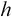次正面和次反面。我们可以使用下面的等式来估计人头出现的实际概率，即人头出现的次数与投掷硬币的总次数之比:


上式中定义的概率是概率的最大似然估计。在机器学习的背景下，MLE 可以被最大化以确定给定类或类别的出现概率。然而，这种估计的概率可能不会在可用的训练数据上以明确定义的方式统计分布，这使得很难有效地确定 MLE。通过引入一组隐藏值来解释训练数据中未观察到的值，可以简化问题。隐藏值不是直接从数据中测量的，而是由影响数据的因素决定的。给定一组观察值和一组隐藏值的参数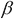的似然函数被定义为给定一组参数的和出现的概率。可能性在数学上写成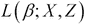，可以表示如下:


EM 算法包括两步——期望步骤和最大化步骤。在期望步骤中，我们计算**对数似然**函数的期望值。该步骤确定了一个度量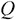，该度量必须在下一步骤中被最大化，即算法的最大化步骤。这两个步骤可以概括如下:


在前面的等式中，迭代计算使函数 *Q* 的值最大化的的值，直到它收敛到特定值。术语代表算法的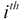迭代中的估计参数。另外，项是对数似然函数的期望值。

`clj-ml`库也提供了一个 EM 集群器。我们可以使用`make-clusterer`函数并以`:expectation-maximization`关键字作为参数来创建一个 EM clusterer，如下面的代码所示:

```
(def em-clusterer (make-clusterer :expectation-maximization
                                  {:number-clusters 3}))
```

注意，我们还必须指定要生成的集群数量，作为`make-clusterer`函数的一个选项。

我们可以使用之前定义的`train-clusterer`函数和`iris-dataset`数据集，训练前面代码中由`em-clusterer` 变量定义的聚类器，如下所示:

```
user> (train-clusterer em-clusterer iris-dataset)
#<EM
EM
==

Number of clusters: 3

               Cluster
Attribute            0       1       2
                (0.41)  (0.25)  (0.33)
=======================================
Sepal.Length
  mean           5.9275  6.8085   5.006
  std. dev.      0.4817  0.5339  0.3489

Sepal.Width
  mean           2.7503  3.0709   3.428
  std. dev.      0.2956  0.2867  0.3753

Petal.Length
  mean           4.4057  5.7233   1.462
  std. dev.      0.5254  0.4991  0.1719

Petal.Width
  mean           1.4131  2.1055   0.246
  std. dev.      0.2627  0.2456  0.1043
```

如前面的输出所示，EM clusterer 将给定的数据集划分为三个聚类，其中聚类大约占训练数据中样本的 41%、25%和 35%。

<title>Using SOMs</title>

# 使用 SOMs

正如我们之前在[第四章](ch04.html "Chapter 4. Building Neural Networks")、*构建神经网络*中提到的，SOMs 可以用于建模无监督的机器学习问题，如聚类(有关更多信息，请参考*自组织映射作为 K 均值聚类的替代*)。简单回顾一下，SOM 是一种将高维输入值映射到低维输出空间的人工神经网络。这种映射保留了输入值之间的模式和拓扑关系。对于空间上彼此接近的输入值，SOM 的输出空间中的神经元将具有更高的激活值。因此，SOMs 是对具有大量维度的输入数据进行聚类的良好解决方案。

咒语库提供了一个简洁的 SOM 实现，我们可以用它来对来自 Iris 数据集的输入变量进行聚类。在接下来的例子中，我们将演示如何使用这个 SOM 实现进行集群。

### 注

通过向`project.clj`文件添加以下依赖项，可以将咒语库添加到 Leiningen 项目中:

```
[incanter "1.5.4"]
```

对于接下来的示例，命名空间声明应该类似于以下声明:

```
(ns my-namespace
  (:use [incanter core som stats charts datasets]))
```

我们首先使用 Incanter 库中的`get-dataset`、`sel`和`to-matrix`函数定义样本数据进行聚类，如下所示:

```
(def iris-features (to-matrix (sel (get-dataset :iris)
                                   :cols [:Sepal.Length
                                          :Sepal.Width
                                          :Petal.Length
                                          :Petal.Width])))
```

前面代码中定义的`iris-features`变量实际上是一个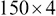大小的矩阵，代表我们从 Iris 数据集中选择的四个输入变量的值。现在，我们可以使用来自`incanter.som`名称空间的`som-batch-train`函数来使用这些选择的特性创建和训练 SOM，如下所示:

```
(def som (som-batch-train
          iris-features :cycles 10))
```

定义的`som`变量实际上是一个有几个键值对的映射。此映射中的`:dims`键包含一个向量，该向量表示经过训练的 SOM 中神经元网格的维度，如以下代码和输出所示:

```
user> (:dims som)
[10.0 2.0]
```

因此，我们可以说经过训练的 SOM 的神经网格是一个矩阵。由`som`变量表示的映射的`:sets`键为我们提供了 SOM 神经元网格中输入值的各种索引的位置分组，如以下输出所示:

```
user> (:sets som)
{[4 1] (144 143 141 ... 102 100),
 [8 1] (149 148 147 ... 50),
 [9 0] (49 48 47 46 ... 0)}
```

如前面的 REPL 输出所示，输入数据被划分为三个聚类。我们可以使用来自`incanter.stats`名称空间的`mean`函数计算每个特征的平均值，如下所示:

```
(def feature-mean
  (map #(map mean (trans
                   (sel iris-features :rows ((:sets som) %))))
       (keys (:sets som))))
```

我们可以使用咒语库中的`xy-plot`、`add-lines`和`view`函数实现一个函数来绘制这些平均值，如下所示:

```
(defn plot-means []
  (let [x (range (ncol iris-features))
        cluster-name #(str "Cluster " %)]
    (-> (xy-plot x (nth feature-mean 0)
                 :x-label "Feature"
                 :y-label "Mean value of feature"
                 :legend true
                 :series-label (cluster-name 0))
        (add-lines x (nth feature-mean 1)
                   :series-label (cluster-name 1))
        (add-lines x (nth feature-mean 2)
                   :series-label (cluster-name 2))
        view)))
```

调用前面代码中定义的`plot-means`函数会产生以下线性图:

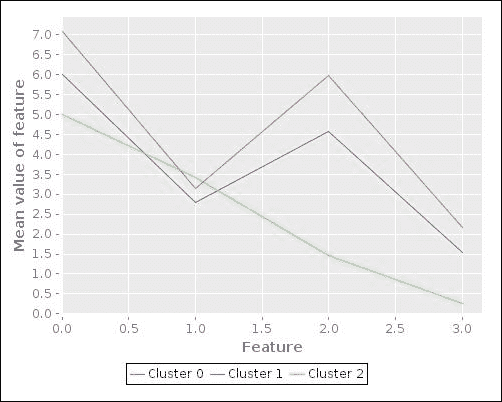

前面的图让我们了解了由 SOM 确定的三个聚类中各种特征的平均值。该图显示两个群集(*群集 0* 和*群集 1* )具有相似的特征。然而，第三个聚类对于这些特征集具有显著不同的平均值，因此在图中显示为不同的形状。当然，这个图并没有给我们多少关于这些平均值周围的输入值的分布或方差的信息。为了可视化这些特征，我们需要以某种方式将输入数据的维数转换为二维或三维，这很容易可视化。我们将在本章的下一节详细讨论减少训练数据中特征数量的概念。

我们还可以使用`frequencies`和`sel`函数打印输入值的分类和实际类别，如下所示:

```
(defn print-clusters []
  (doseq [[pos rws] (:sets som)]
    (println pos \:
             (frequencies
              (sel (get-dataset :iris) 
                   :cols :Species :rows rws)))))
```

我们可以调用前面代码中定义的函数`print-clusters`来产生以下 REPL 输出:

```
user> (print-clusters)
[4 1] : {virginica 23}
[8 1] : {virginica 27, versicolor 50}
[9 0] : {setosa 50}
nil
```

如前面的输出所示，`virginica`和`setosa`物种似乎被适当地分为两个集群。然而，包含`versicolor`物种的输入值的聚类也包含`virginica`物种的 27 个样本。这个问题可以通过使用更多的样本数据来训练 SOM 或者通过建模更多的特征来解决。

总之，Incanter 库为我们提供了 SOM 的简洁实现，我们可以使用 Iris 数据集对其进行训练，如前面的示例所示。

<title>Reducing dimensions in the data</title>

# 减少数据中的维度

为了容易地可视化一些输入值具有多个维度的未标记数据的分布，我们必须将特征维度的数量减少到两个或三个。一旦我们将输入数据的维数减少到二维或三维，我们就可以轻松地绘制数据，以提供更易于理解的可视化。这个减少输入数据维数的过程被称为**降维** 。由于此过程减少了用于表示样本数据的总维数，因此它对于数据压缩也很有用。

**主成分分析** ( **PCA** ) 是将样本数据中的输入变量转化为线性不相关变量的一种降维形式(更多信息请参考*主成分分析*)。这些变换后的特征被称为样本数据的**主成分**。

PCA 使用一个协方差矩阵和一个称为**奇异值分解** ( **SVD** )的矩阵运算来计算一组给定输入值的主分量。表示为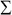的协方差矩阵可以从具有样本的一组输入向量中确定，如下所示:


协方差矩阵通常根据均值归一化后的输入值计算得出，这只是为了确保每个特征的均值为零。此外，可以在确定协方差矩阵之前对特征进行缩放。接下来，协方差矩阵的 SVD 确定如下:


SVD 可以被认为是将一个大小为的矩阵分解成三个矩阵、和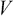。矩阵的大小为，矩阵的大小为，矩阵的大小为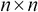。矩阵实际上代表样本数据中具有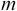维度的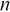输入向量。矩阵是对角矩阵，称为矩阵的**奇异值** ，矩阵和分别称为的**左右奇异向量**。在 PCA 的上下文中，矩阵被称为样本数据的**缩减分量** ，矩阵被称为样本数据的**旋转分量** 。

将输入向量中的维度减少到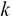维度的 PCA 算法可使用以下步骤进行总结:

1.  从输入向量计算协方差矩阵。
2.  通过对协方差矩阵应用 SVD 来计算矩阵、和。
3.  从矩阵中选择前列生成矩阵，称为矩阵的**约化左奇异向量**或**约化旋转矩阵** 。该矩阵表示样本数据的主成分，大小为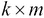。
4.  计算尺寸为的向量，用表示，如下:

注意，PCA 算法的输入是来自均值归一化和特征缩放后的样本数据的一组输入向量。

由于前面步骤中计算的矩阵具有列，矩阵将具有的大小，这表示维度中的输入向量。我们应该注意到，维数的值越小，数据的方差损失越大。因此，我们应该选择，这样只有一小部分方差会丢失。

原始输入向量可以从矩阵和简化的左奇异向量中重新创建，如下所示:

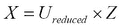

咒语库包括一些执行 PCA 的函数。在接下来的例子中，我们将使用 PCA 来提供虹膜数据集的更好的可视化。

### 注

下一个示例的命名空间声明应类似于以下声明:

```
(ns my-namespace
  (:use [incanter core stats charts datasets]))
```

我们首先使用`get-dataset`、`to-matrix`和`sel`函数定义训练数据，如下面的代码所示:

```
(def iris-matrix (to-matrix (get-dataset :iris)))
(def iris-features (sel iris-matrix :cols (range 4)))
(def iris-species (sel iris-matrix :cols 4))
```

与前面的示例类似，我们将使用 Iris 数据集的前四列作为训练数据的输入变量的样本数据。

PCA 由来自`incanter.stats`名称空间的`principal-components`函数执行。该函数返回一个包含旋转矩阵和来自 PCA的缩减矩阵的映射，我们之前已经描述过。我们可以使用`sel`函数从输入数据的约简矩阵中选择列，如以下代码所示:

```
(def pca (principal-components iris-features))

(def U (:rotation pca))
(def U-reduced (sel U :cols (range 2)))
```

如前面的代码所示，可以使用`principal-components`函数返回的值上的`:rotation`关键字获取输入数据的 PCA 的旋转矩阵。我们现在可以使用简化的旋转矩阵和由`iris-features`变量表示的原始特征矩阵来计算简化的特征 *Z* ，如以下代码所示:

```
(def reduced-features (mmult iris-features U-reduced))
```

然后，通过选择`reduced-features`矩阵的前两列并使用`scatter-plot`函数绘制它们，可以可视化减少的特征，如以下代码所示:

```
(defn plot-reduced-features []
  (view (scatter-plot (sel reduced-features :cols 0)
                      (sel reduced-features :cols 1)
                      :group-by iris-species
                      :x-label "PC1"
                      :y-label "PC2")))
```

调用前面代码中定义的`plot-reduced-features`函数会生成以下图形:

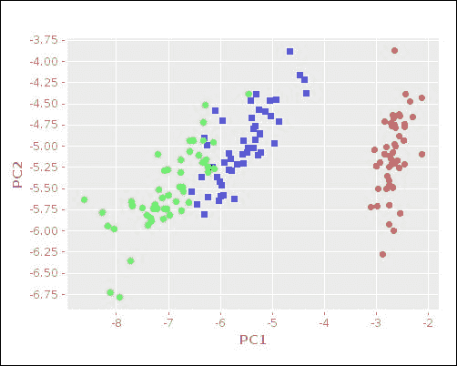

上图中展示的散点图为我们提供了输入数据分布的直观形象。对于给定的一组特征，前面图中的蓝色和绿色聚类显示具有相似的值。总之，Incanter 库支持 PCA，这使得一些样本数据很容易可视化。

<title>Summary</title>

# 总结

在这一章中，我们探讨了几种可用于对一些未标记数据建模的聚类算法。以下是我们讨论过的一些其他要点:

*   我们探索了 K 均值算法和层次聚类技术，同时在纯 Clojure 中提供了这些方法的示例实现。我们还描述了如何通过`clj-ml`库利用这些技术。
*   我们讨论了 EM 算法，这是一种概率聚类技术，还描述了我们如何使用`clj-ml`库来构建 EM 聚类器。
*   我们还探索了如何使用 SOMs 来处理高维聚类问题。我们还演示了如何使用 Incanter 库来构建可用于集群的 SOM。
*   最后，我们研究了降维和主成分分析，以及如何使用主成分分析通过咒语库提供虹膜数据集的更好的可视化。

在下一章中，我们将探索使用机器学习技术的异常检测和推荐系统的概念。