# 八、异常检测和推荐

在这一章中，我们将研究几种现代形式的应用机器学习。我们将首先探讨*异常检测*的问题，我们将在本章稍后讨论*推荐系统*。

**异常检测**异常检测有多种应用，例如检测制造中的结构和操作缺陷、网络入侵检测系统、系统监控和医疗诊断。

**推荐系统** 本质上是寻求预测给定用户对给定项目的喜好或偏好的信息系统。近年来，出现了大量的推荐系统，或称**推荐系统**，它们被构建用于一些商业和社交应用，为它们的用户提供更好的体验。这种系统可以根据用户先前已经评级或喜欢的项目向用户提供有用的推荐。今天，大多数现有的推荐系统向用户提供关于在线产品、音乐和社交媒体的推荐。Web 上也有大量使用推荐系统的金融和商业应用程序。

有趣的是，异常检测和推荐系统都是机器学习问题的应用形式，我们以前在本书中遇到过。异常检测实际上是二元分类的扩展，推荐实际上是线性回归的扩展形式。我们将在本章中更多地研究这些相似之处。

# 检测异常

*异常检测*本质上是识别不符合预期模式的项目或观察值(更多信息，请参考“异常值检测方法概述”)。该模式可以由先前观察到的值来确定，或者由输入值可以变化的一些限制来确定。在机器学习的背景下，异常检测可以在监督和非监督环境中执行。无论哪种方式，异常检测的问题是找到与其他输入值显著不同的输入值。这种技术有多种应用，从广义上来说，我们可以出于以下原因使用异常检测:

*   发现问题
*   发现一种新现象
*   监控异常行为

被发现与其他值不同的观察值被称为异常值、异常值或例外值。更正式的说法是，我们将异常值**定义为分布总体模式之外的观察值。所谓*在*之外，我们指的是与其余数据有很大数值或统计距离的观察结果。**

**异常值的一些例子可以用下面的图来描述，其中红叉标记正常观察值，绿叉标记异常观察值:**

****

**一种可能的异常检测方法是使用 *概率分布模型*，该模型是根据训练数据构建的，以检测异常。使用这种方法的技术被称为异常检测的统计方法。在这种方法中，异常相对于样本数据的其余的总体概率分布具有低概率。因此，我们试图将模型拟合到可用的样本数据上，并使用这个公式化的模型来检测异常。这种方法的主要问题是很难找到随机数据的标准分布模型。**

**另一种可用于检测异常的方法是基于*邻近度的方法*。在这种方法中，我们确定一组观察值相对于样本数据中其余值的接近度或接近度。例如，我们可以使用**K-最近邻** ( **KNN** )算法来确定给定观察值到其 *k* 最近值的距离。这种技术比估计样本数据的统计模型简单得多。这是因为确定单个测量值(即观察值的近似值)比根据可用的训练数据拟合标准模型更容易。但是，对于较大的数据集，确定一组输入值的接近度可能效率较低。例如，KNN 算法具有时间复杂度，并且计算给定的一组值与其 *k* 个最近值的接近度对于 *k* 的大值可能是低效的。此外，KNN 算法可能对邻居的值敏感 *k* 。如果 *k* 的值太大，具有小于 *k* 个输入值集合的值的聚类可能被错误地分类为异常。另一方面，如果 *k* 太小，一些具有低接近度的几个邻居的异常可能检测不到。**

**我们还可以根据一组给定的观察值周围的数据密度来确定它是否是异常值。这种方法被称为 **基于密度的异常检测方法** 。如果给定值周围的数据较低，则给定的一组输入值可被归类为异常。在异常检测中，基于密度的方法和基于邻近度的方法密切相关。事实上，数据密度通常是根据给定的一组值相对于其余数据的接近度或距离来定义的。例如，如果我们使用 KNN 算法来确定给定的一组值与其余数据的接近程度或距离，我们可以将密度定义为到最近的 *k* 个值的平均距离的倒数，如下所示:**

****

***基于聚类的方法*也可用于检测异常。本质上，聚类可用于确定样本数据中值的组或聚类。可以假设聚类中的项目密切相关，异常是不能与样本数据的聚类中先前遇到的值相关的值。因此，我们可以确定样本数据中的所有聚类，然后将最小的聚类标记为异常。或者，我们可以从样本数据中形成聚类，并确定给定的一组以前看不见的值的聚类(如果有的话)。**

**如果一组输入值不属于任何聚类，这肯定是一个异常观察。聚类技术的优势在于，它们可以与我们之前讨论的其他机器学习技术结合使用。另一方面，这种方法的问题是大多数聚类技术对所选择的聚类的数量很敏感。此外，聚类技术的算法参数，例如一个聚类中的平均项目数和聚类数，也不容易确定。例如，如果我们使用 KNN 算法对一些未标记的数据进行建模，那么聚类数 *K* 将不得不通过试错法或仔细检查样本数据中明显的聚类来确定。然而，这两种技术都不能保证在看不见的数据上表现良好。**

**在假设样本值都符合某个平均值且具有某个容许公差的模型中，通常使用**高斯**或**正态分布** 作为分布模型来训练异常检测器。这个模型有两个参数——平均值和方差。这种分布模型通常用于异常检测的统计方法中，其中输入变量通常在统计上接近某个预定的平均值。**

****概率密度函数** ( **PDF** )是基于密度的异常检测方法经常使用的。该函数本质上描述了输入变量取给定值的可能性。对于随机变量 *x* ，我们可以将 PDF 正式定义如下:**

**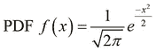**

**PDF 还可以与正态分布模型结合使用，用于异常检测。正态分布的 PDF 由分布的均值和方差来参数化，并且可以正式表示如下:**

**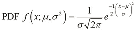**

**我们现在将演示clo jure 中一个异常检测器的简单实现，它基于我们之前讨论过的正态分布的 PDF。对于这个例子，我们将使用 Clojure 原子来维护模型中的所有状态。在 Clojure 中，原子用来表示一个原子状态。所谓*原子*，我们的意思是底层状态完全改变或者根本不改变——状态的改变因此是*原子*。**

**我们现在定义一些函数来帮助我们操作模型的特性。本质上，我们打算将这些特征及其值表示为地图。为了管理这个映射的状态，我们使用了一个原子。每当异常检测器被提供一组特征值时，它必须首先检查新的一组值中关于特征的任何先前信息，然后在必要时，它应该开始维护任何新特征的状态。由于 Clojure 中的函数本身不能包含任何外部状态，我们将使用闭包将状态和函数绑定在一起。在这个实现中，几乎所有的函数都返回其他函数，产生的异常检测器也将像函数一样使用。总之，我们将使用原子对异常检测器的状态进行建模，然后使用闭包将这个原子绑定到一个函数。**

**我们首先定义一个用某种状态初始化模型的函数。这个状态本质上是一个通过使用`atom`函数包装在原子中的映射，如下所示:**

```
(defn update-totals [n]
  (comp #(update-in % [:count] inc)
        #(update-in % [:total] + n)
        #(update-in % [:sq-total] + (Math/pow n 2))))

(defn accumulator []
  (let [totals (atom {:total 0, :count 0, :sq-total 0})]
    (fn [n]
      (let [result (swap! totals (update-totals n))
            cnt (result :count)
            avg (/ (result :total) cnt)]
        {:average avg
         :variance (- (/ (result :sq-total) cnt)
                      (Math/pow avg 2))}))))
```

**前面代码中定义的`accumulator`函数初始化一个 atom，并返回一个将`update-totals`函数应用到值`n`的函数。值`n`表示我们模型中一个输入变量的值。`update-totals`函数也返回一个接受单个参数的函数，然后它通过使用`update-in`函数更新原子中的状态。由`accumulator`函数返回的函数将使用`update-totals`函数来更新模型的均值和方差的状态。**

**我们现在实现以下正态分布的 PDF 函数，可用于监控模型特征值的突然变化:**

```
(defn density [x average variance]
  (let [sigma (Math/sqrt variance)
        divisor (* sigma (Math/sqrt (* 2 Math/PI)))
        exponent (/ (Math/pow (- x average) 2)
                    (if (zero? variance) 1
                        (* 2 variance)))]
    (/ (Math/exp (- exponent))
       (if (zero? divisor) 1
           divisor))))
```

**前面代码中定义的`density`函数是正态分布的 PDF 函数的直接转换。它使用来自`Math`名称空间的函数和常量，例如`sqrt`、`exp`和`PI`，通过使用模型的累积平均值和方差来查找模型的 PDF。我们将定义`density-detector`函数，如以下代码所示:**

```
 (defn density-detector []
  (let [acc (accumulator)]
    (fn [x]
      (let [state (acc x)]
        (density x (state :average) (state :variance))))))
```

**前面代码中定义的`density-detector`函数使用`accumulator`函数初始化我们的异常检测器的状态，它使用`density`函数对累加器维护的状态进行处理，以确定模型的 PDF。**

**由于我们处理的是包装在原子中的映射，我们可以通过使用`contains?`、`assoc-in`和`swap!`函数实现几个函数来执行这种检查，如下面的代码所示:**

```
 (defn get-or-add-key [a key create-fn]
  (if (contains? @a key)
    (@a key)
    ((swap! a #(assoc-in % [key] (create-fn))) key)))
```

**前面代码中定义的`get-or-add-key`函数使用`contains?`函数在包含 map 的原子中查找给定的键。注意使用了`@`操作符将原子解引用到它的包装值中。如果在 map 中找到了这个键，我们就简单地把map 作为函数调用为`(@a key)`。如果没有找到键，我们使用`swap!`和`assoc-in`函数向原子中的映射添加一个新的键-值对。这个键值对的值由传递给 g `et-or-add-key`函数的`create-fn`参数生成。**

**使用我们已经定义的`get-or-add-key`和`density-detector`函数，我们可以实现以下函数，这些函数在检测样本数据中的异常时返回函数，从而在这些函数本身内产生维持模型的 PDF 分布状态的效果:**

```
(defn atom-hash-map [create-fn]
  (let [a (atom {})]
    (fn [x]
      (get-or-add-key a x create-fn))))

(defn get-var-density [detector]
  (fn [kv]
    (let [[k v] kv]
      ((detector k) v))))

(defn detector []
  (let [detector (atom-hash-map density-detector)]
    (fn [x]
      (reduce * (map (get-var-density detector) x)))))
```

**前面代码中定义的`atom-hash-map`函数使用带有任意初始化函数`create-fn`的`get-key`函数来维护原子中 map 的状态。检测器函数使用我们之前定义的`density-detector`函数来初始化输入值中每个新特征的状态。请注意，此函数返回一个函数，该函数将接受一个以键值参数作为特征的地图。我们可以检查在 REPL 中实现的异常检测器的行为，如以下代码和输出所示:**

```
user> (def d (detector))
#'user/d
user> (d {:x 10 :y 10 :z 10})
1.0
user> (d {:x 10 :y 10 :z 10})
1.0
```

**如前面的代码和输出所示，我们通过使用`detector`函数创建了一个异常检测器的新实例。`detector`函数返回一个接受键值对特性映射的函数。当我们用`{:x 10 :y 10 :z 10}`输入地图时，异常检测器返回一个`1.0`的 PDF，因为到目前为止数据中的所有样本都有相同的特征值。只要特征的数量和这些特征的值在馈送给它的所有样本输入中保持相同，异常检测器将总是返回这个值。**

**当我们向异常检测器提供一组具有不同值的特征时，可以观察到 PDF 变为一个有限的数字，如以下代码和输出所示:**

```
user> (d {:x 11 :y 9 :z 15})
0.0060352535208831985
user> (d {:x 10 :y 10 :z 14})
0.07930301229115849
```

**当特征表现出很大程度的变化时，检测器的分布模型的 PDF 会突然大幅下降，如以下代码和输出所示:**

```
user> (d {:x 100 :y 10 :z 14})
1.9851385000301642E-4
user> (d {:x 101 :y 9 :z 12})
5.589934974999084E-4
```

**总之，当由先前描述的异常检测器返回的正态分布模型的 PDF 与其先前值有很大差异时，可以检测到异常样本值。我们可以扩展这个实现来检查某种阈值，以便量化结果。因此，系统仅在越过 PDF 的阈值时检测到异常。在处理真实世界的数据时，我们所要做的就是以某种方式将我们正在建模的特征值表示为地图，并通过试错法确定要使用的阈值。**

**异常检测可以在有监督和无监督的机器学习环境中使用。在监督学习中，样本数据将被标记。有趣的是，在其他监督学习技术中，我们也可以使用二进制分类来建模这种数据。我们可以通过使用以下准则，在异常检测和分类之间进行选择，以对标记数据进行建模:**

*   **当样本数据中的正反例数量几乎相等时，选择二元分类。相反，如果训练数据中的正例或反例非常少，则选择异常检测。**
*   **当训练数据中有很多稀疏类和少数密集类时，选择异常检测。**
*   **当训练模型可能遇到的正样本与模型已经看到的正样本相似时，选择监督学习技术，如分类。**

**

# 建立推荐系统

推荐系统是信息过滤系统，其目标是向用户提供有用的推荐。为了确定这些推荐，推荐系统可以使用关于用户活动的历史数据，或者可以使用其他用户喜欢的推荐(有关更多信息，请参考“互联网上推荐代理的分类”)。这两种方法是推荐系统使用的两种算法的基础——基于内容的过滤(T1)和协同过滤(T3)。有趣的是，一些推荐系统甚至使用这两种技术的组合来为用户提供推荐。这两种技术都旨在向用户推荐由以用户为中心的应用程序管理或交换的项目或领域对象。这种应用包括向用户提供在线内容和信息的几个网站，例如在线购物和媒体。

在*基于内容的过滤*，推荐是通过使用特定用户的评级找到相似的项目来确定的。每个项目都被表示为一组离散的特征或特性，并且每个项目也由几个用户来评定。因此，对于每个用户，我们有几组输入变量来表示每个项目的特征，还有一组输出变量来表示用户对该项目的评级。该信息可用于推荐与用户先前评级的项目具有相似特征或特性的项目。

*协同过滤*方法基于收集关于给定用户的行为、活动或偏好的数据，并使用这些信息向用户推荐项目。推荐是基于一个用户的行为与其他用户的行为有多相似。实际上，用户的建议是基于她过去的行为以及系统中其他用户的决定。协作过滤技术将使用相似用户的偏好来确定系统中所有可用项目的特征，然后它将推荐具有相似特征的项目作为给定用户集合被观察到喜欢的项目。


# 基于内容的过滤

正如我们前面提到的，基于内容的过滤系统根据用户过去的行为以及给定用户积极评价或喜欢的项目的特征向用户提供推荐。我们还可以考虑给定用户不喜欢的项目。一个项目通常由几个离散的属性来表示。这些属性类似于基于机器学习模型的分类或线性回归的输入变量或特征。

例如，假设我们想要构建一个推荐系统，它使用基于内容的过滤向用户推荐在线产品。每个产品都可以通过几个已知的特征来表示和识别，用户可以为每个产品的每个特征提供一个等级。产品的特征值可以具有 0 到 10 之间的值，并且用户为产品提供的评级将具有 0 到 5 范围内的值。我们可以用表格的形式显示这个推荐系统的样本数据，如下所示:


在上表中，系统有产品和用户。每个产品由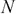特性定义，每个特性的值在 0 到 10 的范围内，每个产品也由用户评分。让用户对每个产品的评分表示为。使用输入值，或者更确切地说是输入向量，以及用户的评级，我们可以估计一个参数向量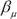，我们可以用它来预测用户的评级。因此，基于内容的过滤实际上将线性回归的副本应用于每个用户的评级和每个产品的特征值，以估计回归模型，该回归模型又可用于估计一些未评级产品的用户评级。实际上，我们使用自变量和因变量来学习参数并为系统的所有用户学习。使用估计的参数和独立变量的一些给定值，我们可以预测任何给定用户的因变量的值。因此，基于内容的过滤的优化问题可以表达如下:

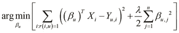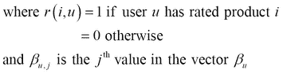

上式中定义的优化问题可以应用于系统的所有用户，从而为 U 个用户产生以下优化问题:

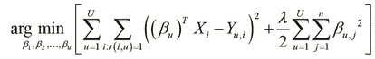

简单来说，参数向量试图缩放或转换输入变量，以匹配模型的输出变量。添加的第二个术语是针对*正规化*。有趣的是，在后退方程中定义的优化问题类似于线性回归的优化问题，因此基于内容的过滤可以被认为是线性回归的扩展。

基于内容的过滤的关键问题是一个给定的推荐系统是否能从用户的偏好或评级中学习。可以通过询问系统中他们喜欢的项目的评级来使用直接反馈，尽管这些评级也可以从用户过去的行为中得到暗示。此外，针对一组用户和特定项目类别训练的基于内容的过滤系统不能用于预测同一用户对不同项目类别的评级。比如用一个用户对新闻的偏好来预测用户对网购商品的喜好，这是一个很难的问题。


# 协同过滤

另一种主要的推荐形式是*协同过滤*，其中关于几个具有相似兴趣的用户的行为的数据被分析并用于预测对这些用户的推荐。这种技术的主要优点是系统不依赖于其项目的特征变量值，因此这种系统不需要知道由它提供的项目的特征。项目的特征实际上是使用用户对这些项目的评级和系统用户的行为来动态确定的。我们将在本节的后半部分详细讨论这一优势。

协同过滤所使用的模型的一个重要部分取决于其用户的行为。为了构建模型的这一部分，我们可以使用以下方法以显式方式确定用户对模型中项目的评分:

*   要求用户以特定的等级对项目进行评级
*   要求用户将项目标记为收藏夹
*   向用户展示少量商品，并要求他们根据喜欢或不喜欢这些商品的程度来排序
*   要求用户创建他们喜欢的项目或项目种类的列表。

或者，该信息也可以以隐含的方式从用户的活动中收集。用一组给定的项目或产品对系统用户的行为进行建模的这种方法的例子如下:

*   观察用户查看的项目
*   分析特定用户查看的次数
*   分析用户的社交网络并发现具有相似兴趣的用户

例如，考虑我们在上一节中讨论的在线购物示例的推荐系统。我们可以使用协同过滤来动态确定可用产品的特征值，并预测用户感兴趣的产品。这种使用协作过滤的系统的样本数据可以通过使用下表来可视化:


在上表所示的数据中，产品的特性是未知的。唯一可用的数据是用户的评级和用户的行为模型。

协同过滤和产品用户的优化问题可以表达如下:

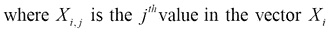

前面的等式被视为我们为基于内容的过滤定义的优化问题的逆问题。协同过滤不是估计参数的向量，而是寻求确定产品特征的价值。类似地，我们可以将多个用户的优化问题定义如下:

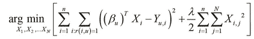

使用协同过滤，我们可以估计产品的特征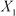，，然后使用这些特征值来改进用户的行为模型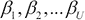。然后，改进的用户行为模型可以再次用于产生项目的更好的特征值。然后重复这个过程，直到特征值和行为模型收敛到某个适当的值。

### 注意

注意，在这个过程中，算法从来不需要知道其项目的初始特征值，只需要初步估计用户的行为模型，为用户提供有用的推荐。

协同过滤在一些特殊情况下也可以和基于内容的过滤结合使用。这样的方法被称为推荐的**混合方法** 。我们可以通过多种方式将这两种推荐模式结合或混合，具体如下:

*   来自两个模型的结果可以以加权的方式在数字上组合
*   这两个模型中的任何一个都可以在给定的时间内被适当地选择
*   向用户显示来自两个模型的综合推荐结果


# 使用斜率一算法

我们现在将研究用于协同过滤的 Slope One 算法。此外，我们将演示如何在 Clojure 中简洁地实现它。

Slope One 算法是*基于项目的协作过滤*的最简单形式之一，本质上是一种协作过滤技术，其中用户显式地对他们喜欢的每个项目进行评级(有关更多信息，请参考*基于在线评级的协作过滤的 Slope One 预测器*)。通常，基于项目的协同过滤技术将使用用户的评级和用户的过去行为来为每个用户估计简单的回归模型。因此，我们为系统中的所有用户估计一个函数。

Slope One 算法使用更简单的预测器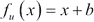来模拟用户行为的回归模式，因此计算成本更低。参数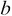可以通过计算两个项目之间的用户评分差异来估计。由于 Slope One 算法的定义很简单，因此它可以简单有效地实现。有趣的是，这种算法比其他协同过滤技术更不容易过度拟合。

考虑一个有两个项目和两个用户的简单推荐系统。我们可以用下表来直观显示这个样本数据:


在上表所示的数据中，利用**用户 1** 提供的评分可以发现**A 项**和**B 项**评分的差异。这个差异被发现是。因此，我们可以将此差异与**用户 2** 对**项目 A** 的评分相加，以预测他/她对**项目 B** 的评分，等于。

让我们将前面的例子扩展到三个项目和三个用户。该数据的表格可以如下所示:

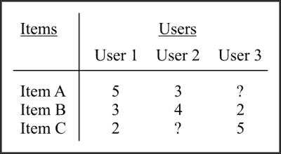

在本例中，**用户 2** (-1)和**用户 1** (+2)的**项目 A** 和**项目 B** 之间的平均评分差为。因此，平均而言，对**项目 A** 的评分高于**项目 B** 。同样，**A 项**和**C 项**的平均评分差为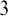。我们可以通过**用户 3** 对**项目 A** 的评分以及**项目 A** 和**项目 B** 评分的平均差值来预测他/她对**项目 B** 的评分。这个值出来就是。

我们现在将描述 Clojure 中 Slope One 算法的简明实现。首先，我们需要定义样本数据。这可以使用嵌套映射来完成，如以下代码所示:

```
(def ? nil)
(def data
  {"User 1" {"Item A" 5 "Item B" 3 "Item C" 2 "Item D" ?}
   "User 2" {"Item A" 3 "Item B" 4 "Item C" ? "Item D" 4}
   "User 3" {"Item A" ? "Item B" 2 "Item C" 5 "Item D" 3}
   "User 4" {"Item A" 4 "Item B" ? "Item C" 3 "Item D" ?}})
```

在前面显示的代码中，我们将值`nil`绑定到符号`?`，并使用它来定义一个嵌套映射`data`，其中每个键代表一个用户，其值代表一个用户评级映射，项目名称作为键。我们将定义以下一些实用方法来帮助我们操作由`data`表示的嵌套地图:

```
(defn flatten-to-vec [coll]
  (reduce #(apply conj %1 %2)
          []
          coll))
```

前面代码中定义的`flatten-to-vec`函数使用`reduce`和`conj`函数简单地将地图转换成平面矢量。我们也可以通过使用标准`vec`、`flatten`和`seq`函数的函数组合，将`flatten-to-vec`定义为`(def flatten-to-vec (comp vec flatten seq))`。因为我们处理的是映射，所以我们可以定义下面的一些函数来将任何函数映射到这些映射的值:

```
(defn map-vals [f m]
  (persistent!
    (reduce (fn [m [k v]]
              (assoc! m k (f k v)))
            (transient m) m)))

(defn map-nested-vals [f m]
  (map-vals
   (fn [k1 inner-map]
     (map-vals
      (fn [k2 val] (f [k1 k2] val)) inner-map)) m))
```

前面代码中定义的`map-vals`函数可用于改变给定地图的值。该函数使用`assoc!`函数替换映射中给定键存储的值，并使用`reduce`函数组合和应用`assoc!`函数到映射中的所有键-值对。在 Clojure 中，包括地图在内的大多数集合都是持久的，并且是不可变的。请注意使用`transient`函数将持久和不可变的映射转换为可变映射，使用`persistent!`函数将瞬时可变集合转换为持久集合。通过隔离突变，该函数的性能得到了提高，同时保证了使用该函数的代码的不变性。前面代码中定义的`map-nested-vals`函数只是将`map-vals`函数应用于嵌套映射中的第二层值。

我们可以检查 REPL 中的`map-vals`和`map-nested-vals`函数的行为，如下所示:

```
user> (map-vals #(inc %2) {:foo 1 :bar 2})
{:foo 2, :bar 3}

user> (map-nested-vals (fn [keys v] (inc v)) {:foo {:bar 2}})
{:foo {:bar 3}}
```

如前面的 REPL 输出所示，`inc`函数应用于映射`{:foo 1 :bar 2}`和`{:foo {:bar 3}}`的值。我们现在定义一个函数，通过使用 Slope One 算法从样本数据中生成一个训练模型，如下所示:

```
(defn train [data]
  (let [diff-map      (for [[user preferences] data]
                        (for [[i u-i] preferences
                              [j u-j] preferences
                              :when (and (not= i j)
                                         u-i u-j)]
                          [[i j] (- u-i u-j)]))
        diff-vec      (flatten-to-vec diff-map)
        update-fn     (fn [[freqs-so-far diffs-so-far]
                           [item-pair diff]]
                        [(update-in freqs-so-far
                                    item-pair (fnil inc 0))
                         (update-in diffs-so-far
                                    item-pair (fnil + 0) diff)])
        [freqs
         total-diffs] (reduce update-fn
                              [{} {}] diff-vec)
        differences   (map-nested-vals
                       (fn [item-pair diff]
                         (/ diff (get-in freqs item-pair)))
                       total-diffs)]
    {:freqs freqs
     :differences differences}))
```

前面代码中定义的 train 函数首先使用`for`宏找到模型中所有项目评分之间的差异，然后使用`update-fn`闭包将项目评分的频率及其评分差异相加。

### 注

函数和宏的主要区别在于，宏在执行时不会计算其参数。此外，宏在编译时被解析和扩展，函数在运行时被调用。

`update-fn`函数使用`update-in`函数来替换地图中的键值。注意`fnil`函数的使用，它本质上返回一个检查值`nil`并用第二个参数替换它的函数。这用于处理嵌套地图数据中值为`nil`的`?`符号所代表的值。最后，`train`函数将`map-nested-vals`和`get-in`函数应用于上一步返回的评级差异图。最后，它返回一个带有关键字`:freqs`和`:differences`的映射，这些映射分别表示项目的频率和相对于模型中其他项目的评分差异。我们现在可以使用这个经过训练的模型来预测不同用户对给定项目的评级。为此，我们将在下面的代码中实现一个函数，该函数使用前面代码中定义的`train`函数返回的值:

```
(defn predict [{:keys [differences freqs]
                :as model}
               preferences
               item]
  (let [get-rating-fn (fn [[num-acc denom-acc]
                           [i rating]]
                        (let [freqs-ji (get-in freqs [item i])]
                          [(+ num-acc
                              (* (+ (get-in differences [item i])
                                    rating)
                                 freqs-ji))
                           (+ denom-acc freqs-ji)]))]
    (->> preferences
         (filter #(not= (first %) item))
         (reduce get-rating-fn [0 0])
         (apply /))))
```

前面代码中定义的`predict`函数使用`get-in`函数检索`train`函数返回的地图中每个项目的频率和差异的总和。然后，该函数通过使用`reduce`和`/`(除法)函数的组合来平均这些等级差异。可以在 REPL 中检查`predict`函数的行为，如以下代码所示:

```
user> (def trained-model (train data))
#'user/trained-model
user> (predict trained-model {"Item A" 2} "Item B")
3/2
```

如前面的 REPL 输出所示，`predict`函数使用`train`函数返回的值来预测给`Item A`评分`2`的用户对`Item B`的评分。`predict`函数将`Item B`的等级估计为`3/2`。我们现在可以在下面的代码中实现一个函数，该函数包装了`predict` 函数，以查找模型中所有项目的评级:

```
(defn mapmap
  ([vf s]
     (mapmap identity vf s))
  ([kf vf s]
     (zipmap (map kf s)
             (map vf s))))

(defn known-items [model]
  (-> model :differences keys))

(defn predictions
  ([model preferences]
     (predictions
      model
      preferences
      (filter #(not (contains? preferences %))
              (known-items model))))
  ([model preferences items]
     (mapmap (partial predict model preferences)
             items)))
```

前面代码中定义的`mapmap`函数简单地将两个函数应用于给定的序列，并返回一个映射，该映射包含使用第一个函数`kf`创建的键和第二个函数`vf`生成的值。如果只有一个函数被传递给`mapmap`函数，它将使用`identity`函数在其返回的映射中生成键。前面代码中定义的`known-items`函数将使用由`train`函数返回值中的:`differences`键表示的映射上的 keys 函数来确定模型中的所有项目。最后，`predictions`函数使用`train`和`known-items`函数返回的值来确定模型中的所有项目，然后预测特定用户的所有未评级项目。该函数还采用可选的第三个参数，该参数是要预测其评级的项目名称的向量，以便返回名称出现在向量`items`中的所有项目的预测。

现在，我们可以检查 REPL 中上述函数的行为，如下所示:

```
user> (known-items trained-model)
("Item D" "Item C" "Item B" "Item A")
```

如前面的输出所示，`known-items`函数返回模型中所有项目的名称。我们现在可以尝试预测函数，如下所示:

```
user> (predictions trained-model {"Item A" 2} ["Item C" "Item D"])
{"Item D" 3, "Item C" 0}
user> (predictions trained-model {"Item A" 2})
{"Item B" 3/2, "Item C" 0, "Item D" 3}
```

请注意，当我们跳过`predictions`函数的最后一个可选参数时，该函数返回的地图将包含特定用户之前未评级的所有项目。这可以通过使用`keys`功能在 REPL 中声明，如下所示:

```
user> (keys  (predictions trained-model {"Item A" 2}))
("Item B" "Item C" "Item D")
```

最后，我们展示了如何使用嵌套映射和标准 Clojure 函数实现 Slope One 算法。


# 总结

在本章中，我们讨论了异常检测和建议。我们还实现了一个简单的异常检测器和推荐引擎。本章涵盖的主题可总结如下:

*   我们探讨了异常检测以及如何使用 Clojure 中的 PDF 实现异常检测器。
*   我们研究了使用基于内容和协同过滤技术的推荐系统。我们还研究了这些技术中的各种优化问题。
*   我们还研究了 Slope One 算法，它是协同过滤的一种形式，并描述了该算法的一个简明实现。

在下一章中，我们将讨论机器学习技术的更多应用，这些技术可以应用于大型和复杂的以数据为中心的应用。**