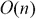
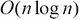
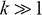
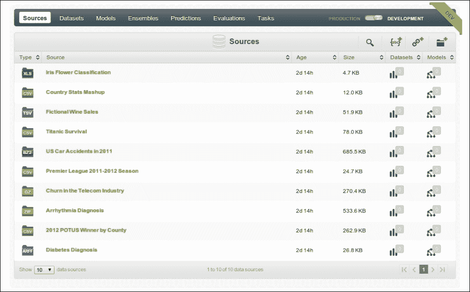
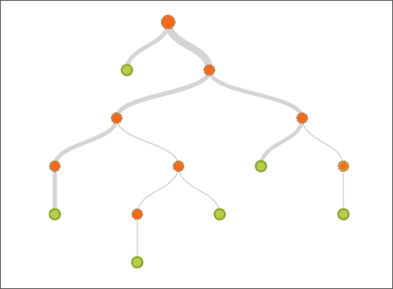

# 第九章。大规模机器学习

在本章中，我们将探索一些处理大量数据以训练机器学习模型的方法。在本章的后一节，我们还将演示如何使用基于云的服务进行机器学习。

# 使用 MapReduce

在数据并行环境中经常遇到的一种数据处理方法是 **MapReduce** 。该技术受函数式编程中的**映射**和**减少**功能的启发。尽管这些函数是理解算法的基础，但 MapReduce 的实际实现更侧重于数据处理的缩放和分布。MapReduce 目前有几个活跃的实现，比如 Apache Hadoop 和 Google Bigtable。

MapReduce 引擎或程序由一个函数组成，该函数对潜在的大型数据集中的给定记录执行一些处理(有关更多信息，请参考“多核机器学习的 Map-Reduce”)。该函数代表算法的`Map()`步骤。该函数应用于数据集中的所有记录，然后合并结果。提取结果的后一步骤被称为算法的`Reduce()`步骤。为了在巨大的数据集上扩展这个过程，提供给`Map()`步骤的输入数据首先被分区，然后在不同的计算节点上处理。这些节点可能在单独的机器上，也可能不在单独的机器上，但是由给定节点执行的处理独立于系统中其他节点的处理。

一些系统遵循不同的设计，其中代码或查询被发送到包含数据的节点，而不是相反。这个划分输入数据然后将查询或数据转发到不同节点的步骤被称为算法的`Partition()`步骤。总之，这种处理大型数据集的方法与传统的尽可能快速地迭代整个数据的方法有很大的不同。

MapReduce 比其他方法具有更好的伸缩性，因为输入数据的分区可以在物理上不同的机器上独立处理，然后再组合起来。这种可伸缩性的提高不仅是因为输入被划分到几个节点上，还因为复杂性的内在降低。一个 NP-hard 问题对于一个大的问题空间是无法解决的，但是如果问题空间比较小就可以解决。

对于算法复杂度为或的问题，划分问题空间实际上会增加解决给定问题所需的时间。但如果算法复杂度为，其中，划分问题空间会减少求解问题所需的时间。遇到 NP 难问题，。因此，MapReduce 通过划分问题空间来减少解决 NP 难问题所需的时间(更多信息，请参考*评估 MapReduce 用于多核和多处理器系统*)。

MapReduce 算法可以使用下图进行说明:


在上图中，输入数据首先被分区，每个分区在`Map()`步骤中被独立处理。最后，在`Reduce()`步骤中组合结果。

我们可以用 Clojure 伪代码简洁地定义 MapReduce 算法，如下面的代码所示:

```
(defn map-reduce [f partition-size coll]
  (->> coll
       (partition-all partition-size)   ; Partition
       (pmap f)                         ; Parallel Map
       (reduce concat)))                ; Reduce
```

前面代码中定义的`map-reduce`函数使用标准的`pmap`(并行映射的缩写)函数在几个处理器(或线程)之间分配函数`f`的应用。由集合`coll`表示的输入数据首先使用`partition-all`函数进行分区，然后使用`pmap`函数将函数`f`并行应用于每个分区。然后使用标准`reduce`和`concat`函数的组合来组合该`Map()`步骤的结果。请注意，在 Clojure 中这是可能的，因为数据的每个分区都是一个序列，因此`pmap`函数将返回一个分区序列，可以将这些分区连接或串联成一个序列来产生计算结果。

当然，这只是对 MapReduce 算法核心的理论解释。实际的实现往往更侧重于在几台机器之间分配处理，而不是像前面代码中定义的`map-reduce`函数所示的那样在几个处理器或线程之间分配。


# 查询和存储数据集

当处理大型数据集时，能够基于任意条件查询数据是很有用的。此外，将数据存储在数据库中比存储在平面文件或内存资源中更可靠。咒语库为我们提供了几个有用的函数来执行这些操作，我们将在下面的代码示例中演示。

### 注意

通过向`project.clj`文件添加以下依赖项，可以将下一个示例中使用的 Incanter 库和 MongoDB 驱动程序添加到 Leiningen 项目中:

```
[congomongo "0.4.1"]
[incanter "1.5.4"]
```

对于接下来的示例，命名空间声明应该类似于以下声明:

```
(ns my-namespace
  (:use incanter.core
        [incanter.mongodb   :only [insert-dataset
                                   fetch-dataset]]
        [somnium.congomongo :only [mongo!]]
        [incanter.datasets  :only [get-dataset]]))
```

此外，这个示例要求安装并运行 MongoDB。

对于这个例子，我们将使用 Iris 数据集，它可以使用`get-dataset`函数从`incanter.datasets`名称空间中获取。代码如下:

```
(def iris (get-dataset :iris))
```

如前面的代码所示，我们简单地将 Iris 数据集绑定到一个变量`iris`。我们可以使用`with-data`函数对这个数据集执行各种操作。为了查看数据，我们可以使用`view`函数和`with-data`函数来提供数据集的表格表示，如以下代码所示:

```
user> (with-data iris
        (view (conj-cols (range (nrow $data)) $data)))
```

`$data`变量是一个特殊的绑定，可以用来表示`with-data`函数范围内的整个数据集。在前面的代码中，我们使用`conj-cols`、`nrows`和`range`函数的组合向数据中添加了一个额外的列来表示 a 记录的行号。然后使用`view`功能将数据显示在类似电子表格的表格中。前面的代码生成了表示数据集的下表:


我们还可以在`with-data`函数的范围内使用函数`$`从原始数据集中选择我们感兴趣的列，如下面的代码所示:

```
user> (with-data iris ($ [:Species :Sepal.Length]))

|   :Species | :Sepal.Length |
|------------+---------------|
|     setosa |           5.1 |
|     setosa |           4.9 |
|     setosa |           4.7 |
  ...
|  virginica |           6.5 |
|  virginica |           6.2 |
|  virginica |           5.9 |
```

在前面显示的代码示例中，`$`函数从`iris`数据集中选择`:Species`和`:Sepal.Length`列。我们还可以使用`$where`函数根据条件过滤数据，如以下代码所示:

```
user> (with-data iris ($ [:Species :Sepal.Length]
                         ($where {:Sepal.Length 7.7})))

|  :Species | :Sepal.Length |
|-----------+---------------|
| virginica |           7.7 |
| virginica |           7.7 |
| virginica |           7.7 |
| virginica |           7.7 |
```

前面的示例使用`$where`函数查询`iris`数据集中`:Sepal.Length`列等于`7.7`的记录。我们还可以使用传递给`$where`函数的映射中的`:$gt`和`:$lt`符号来指定要比较列的值的下限或上限，如下面的代码所示:

```
user> (with-data iris ($ [:Species :Sepal.Length]
                         ($where {:Sepal.Length {:$gt 7.0}})))

|  :Species | :Sepal.Length |
|-----------+---------------|
| virginica |           7.1 |
| virginica |           7.6 |
| virginica |           7.3 |
  ...
| virginica |           7.2 |
| virginica |           7.2 |
| virginica |           7.4 |
```

前面的例子检查具有值大于`7`的`:Sepal.Length`属性的记录。为了检查列的值是否在给定的范围内，我们可以在传递给`$where`函数的映射中指定`:$gt`和`:$lt`键，如下面的代码所示:

```
user> (with-data iris ($ [:Species :Sepal.Length]
                         ($where {:Sepal.Length
                                  {:$gt 7.0 :$lt 7.5}})))

|  :Species  |:Sepal.Length |
|------------+--------------|
| virginica  |          7.1 |
| virginica  |          7.3 |
| virginica  |          7.2 |
| virginica  |          7.2 |
| virginica  |          7.2 |
| virginica  |          7.4 |
```

前面的示例检查在`7.0`和`7.5`范围内具有`:Sepal.Length`属性的记录。我们也可以使用`$:in`键指定一组离散的值，比如在表达式`{:$in #{7.2 7.3 7.5}}`中。咒语库还提供了其他几个函数，比如`$join`和`$group-by`，可以用来表达更复杂的查询。

Incanter 库提供了函数来与 MongoDB 一起操作，以持久化和获取数据集。MongoDB 是一个非关系文档数据库，允许用动态模式存储 JSON 文档。为了连接到 MongoDB 实例，我们使用了`mongo!`函数，如下面的代码所示:

```
user> (mongo! :db "sampledb")
true
```

在前面的代码中，数据库名`sampledb`被指定为关键字参数，其中是`mongo!`函数的关键字`:db`。我们还可以分别使用`:host`和`:post`关键字参数指定要连接的实例的主机名和端口。

我们可以使用来自`incanter.mongodb`名称空间的`insert-dataset`函数将数据集存储在连接的 MongoDB 实例中。不幸的是，MongoDB 不支持使用点字符(。)作为列名，因此我们必须更改`iris`数据集中的列名，以便使用`insert-dataset`函数成功地存储它。使用`col-names`函数可以替换列名，如下面的代码所示:

```
user> (insert-dataset
:iris (col-names iris [:SepalLength
:SepalWidth
:PetalLength
:PetalWidth
:Species]))
```

在替换列名中的点字符后，前面的代码将`iris`数据集存储在 MongoDB 实例中。

### 注意

请注意，数据集将存储在数据库`sampledb`中名为`iris`的集合中。此外，MongoDB 将为存储在数据库中的数据集中的每条记录分配一个基于散列的 ID。可以使用`:_id`关键字引用该列。

为了从数据库取回数据集，我们使用了`fetch-dataset`函数，如下面的代码所示。该函数返回的值可以直接被`with-data`函数用来查询和查看所取的数据集。

```
user> (with-data (fetch-dataset :iris) ($ [:Species :_id]
                                          ($where {:SepalLength
                                                   {:$gt 7}})))

|  :Species |                     :_id |
|-----------+--------------------------|
| virginica | 52ebcc1144ae6d6725965984 |
| virginica | 52ebcc1144ae6d6725965987 |
| virginica | 52ebcc1144ae6d6725965989 |
  ...
| virginica | 52ebcc1144ae6d67259659a0 |
| virginica | 52ebcc1144ae6d67259659a1 |
| virginica | 52ebcc1144ae6d67259659a5 |
```

我们还可以在存储数据集后使用`mongo`客户端检查数据库，如下面的代码所示。正如我们提到的我们的数据库名称是`sampledb`，我们必须使用`use`命令选择这个数据库，如下面的终端输出所示:

```
$ mongo
MongoDB shell version: 2.4.6
connecting to: test
Server has startup warnings:
...

> use sampledb
switched to db sampledb
```

我们可以使用`show collections`命令查看数据库中的所有集合。可以对变量`db`实例中的适当属性使用`find()`函数来执行查询，如以下代码所示:

```
> show collections
iris
system.indexes
>
> db.iris.find({ SepalLength: 5})

{ "_id" : ObjectId("52ebcc1144ae6d6725965922"),
  "Species" : "setosa",
  "PetalWidth" : 0.2,
  "PetalLength" : 1.4,
  "SepalWidth" : 3.6,
  "SepalLength" : 5 }
{ "_id" : ObjectId("52ebcc1144ae6d6725965925"),
  "Species" : "setosa",
  "PetalWidth" : 0.2,
  "PetalLength" : 1.5,
  "SepalWidth" : 3.4,
  "SepalLength" : 5 }

...
```

总之，咒语库为我们提供了一套足够的工具来查询和存储数据集。此外，MongoDB 可以很容易地通过咒语库来存储数据集。


# 云中的机器学习

在当今基于网络和云服务的时代，将数据集和机器学习模型保存到在线云存储中也是可能的。当处理大量数据时，这是一个很好的解决方案，因为云解决方案负责大量数据的存储和处理。

**BigML**([http://bigml.com/](http://bigml.com/))是机器学习资源的云提供商。BigML 内部使用**分类和回归树** ( **CARTs** )、作为机器学习模型，它们是决策树的一种专门化(更多信息，请参考*决策树分类器的自顶向下归纳-综述*)。

BigML 为开发人员提供了一个简单的 REST API，可以用来处理来自任何语言或平台的可以发送 HTTP 请求的服务。该服务支持多种文件格式，如 **CSV** ( **逗号分隔值** ) 、Excel 电子表格和 Weka 库的 ARFF 格式，还支持多种数据压缩格式，如 TAR 和 GZIP。除了通过在线 web 界面使用模型进行预测之外，该服务还采用白盒方法，即可以下载模型供本地使用。

BigML 有几种语言的绑定，我们将在这一节演示 BigML 的 Clojure 客户端库。与其他云服务一样，BigML 的用户和开发者必须首先注册一个帐户。然后，他们可以使用这个帐户和提供的 API 密钥从客户端库访问 BigML 。一个新的 BigML 帐户提供了几个示例数据集进行实验，包括我们在本书中经常遇到的 Iris 数据集。

BigML 帐户的仪表板为帐户可用的所有资源提供了一个简单的基于 web 的用户界面。



BigML 资源包括源、数据集、模型、预测和评估。我们将在接下来的代码示例中讨论这些资源。

### 注意

BigML Clojure 库可以通过向`project.clj`文件添加以下依赖项来添加到 Leiningen 项目中:

```
[bigml/clj-bigml "0.1.0"]
```

对于接下来的示例，命名空间声明应该类似于以下声明:

```
(ns my-namespace
  (:require [bigml.api [core :as api]
             [source :as source]
             [dataset :as dataset]
             [model :as model]
             [prediction :as prediction]
             [evaluation :as evaluation]]))
```

首先，我们必须为 BigML 服务提供认证细节。这是使用来自`bigml.api`名称空间的`make-connection`函数完成的。我们必须向`make-connection`函数提供一个用户名、一个 API 键和一个标志，表明我们使用的是开发数据集还是生产数据集，如下面的代码所示。请注意，这个用户名和 API 密钥将显示在您的 BigML 帐户页面上。

```
(def default-connection
  (api/make-connection
   "my-username"                               ; username
   "a3015d5fa2ee19604d8a69335a4ac66664b8b34b"  ; API key
   true))
```

要使用前面代码中定义的连接`default-connection`，我们必须使用`with-connection`函数。通过使用简单的宏，我们可以避免重复使用带有`default-connection`变量的`with-connection`函数，如以下代码所示:

```
(defmacro with-default-connection [& body]
  '(api/with-connection default-connection
     ~@body))
```

实际上，使用`with-default-connection`和使用带有`default-connection`绑定的`with-connection`函数一样好，从而帮助我们避免重复代码。

BigML 有源的概念来表示可以转换成训练数据的资源。BigML 支持本地文件、远程文件和内联代码资源作为源，还支持多种数据类型。要创建资源，我们可以使用来自`bigml.source`名称空间的`create`函数，如下面的代码所示:

```
(def default-source
  (with-default-connection
    (source/create [["Make"  "Model"   "Year" "Weight" "MPG"]
                    ["AMC"   "Gremlin" 1970   2648     21]
                    ["AMC"   "Matador" 1973   3672     14]
                    ["AMC"   "Gremlin" 1975   2914     20]
                    ["Honda" "Civic"   1974   2489     24]
                    ["Honda" "Civic"   1976   1795     33]])))
```

在前面的代码中，我们使用一些内联数据定义了一个源。这些数据实际上是各种汽车型号的一组特征，例如它们的制造年份和总重量。最后一个特征就是车型的里程或者 MPG。按照惯例，BigML 源将最后一列视为机器学习模型的输出或目标变量。

我们现在必须将源转换成 BigML 数据集，它是来自源的原始数据的结构化和索引化表示。数据集中的每个要素都被分配了一个唯一的整数 ID。这个数据集然后可以用来训练机器学习购物车模型，在 BigML 行话中简称为模型。我们可以分别使用`dataset/create`和`model/create`函数创建数据集和模型，如下面的代码所示。此外，我们将不得不使用`api/get-final`函数来完成一个已经发送到 BigML 云服务进行处理的资源。

```
(def default-dataset
  (with-default-connection
    (api/get-final (dataset/create default-source))))

(def default-model
  (with-default-connection
    (api/get-final (model/create default-dataset))))
```

BigML 还提供了经过训练的购物车模型的交互式可视化。对于我们的训练数据，生成了以下可视化:


我们现在可以使用训练好的模型来预测输出变量的值。每个预测都存储在 BigML 云服务中，并显示在仪表板的**预测**选项卡中。这是使用来自`bigml.prediction`名称空间的`create`函数完成的，如下面的代码所示:

```
(def default-remote-prediction
  (with-default-connection
    (prediction/create default-model [1973 3672])))
```

在前面的代码中，我们试图通过向`prediction/create`函数提供制造年份和汽车重量的值来预测汽车型号的 MPG(每加仑英里数，里程的一种度量方式)。该函数返回的值是一个映射，其中包含一个键`:prediction`，表示输出变量的预测值。这个键的值是另一个映射，它包含作为键的列 id 和作为映射中的值的它们的预测值，如下面的代码所示:

```
user> (:prediction default-remote-prediction)
{:000004 33}
```

MPG 列的 ID 为`000004`，根据训练好的模型预测它的值为`33`，如前面的代码所示。`prediction/create`函数创建一个在线或远程预测，并在 BigML 服务被调用时向其发送数据。或者，我们可以从 BigML 服务下载一个函数，使用函数`prediction/predictor`和函数在本地执行预测，如下面的代码所示:

```
(def default-local-predictor
  (with-default-connection
    (prediction/predictor default-model)))
```

我们现在可以使用下载的函数`default-local-predictor`来执行本地预测，如下面的 REPL 输出所示:

```
user> (default-local-predictor [1983])
22.4
user> (default-local-predictor [1983] :details true)
{:prediction {:000004 22.4},
:confidence 24.37119,
:count 5, :id 0,
:objective_summary
 {:counts [[14 1] [20 1] [21 1] [24 1] [33 1]]}}
```

如前面的代码所示，本地预测函数预测在`1983`制造的汽车的 MPG 为`22.4`。我们还可以将`:details`关键字参数传递给`default-local-predictor`函数，以提供关于预测的更多信息。

BigML 还允许我们评估经过训练的购物车模型。我们现在将使用 Iris 数据集训练一个模型，然后交叉验证它。BigML 库中的`evaluation/create`函数将使用经过训练的模型和一些交叉验证数据创建一个评估。该函数返回一个映射，其中包含模型的所有交叉验证信息。

在前面的代码片段中，我们在训练模型的几乎所有阶段都使用了`api/get-final`函数。在下面的代码示例中，我们将尝试通过使用宏来避免重复使用该函数。我们首先定义一个函数，将`api/get-final`和`with-default-connection`函数应用于任意一个接受任意数量参数的函数。

```
(defn final-with-default-connection [f & xs]
  (with-default-connection
    (api/get-final (apply f xs))))
```

使用前面代码中定义的`final-with-default-connection`函数，我们可以定义一个宏，将它映射到一个值列表，如下面的代码所示:

```
(defmacro get-final-> [head & body]
  (let [final-body (map list
                        (repeat 'final-with-default-connection)
                        body)]
    '(->> ~head
          ~@final-body)))
```

前面代码中定义的的`get-final->`宏基本上使用`->>`线程宏通过`body`参数中的函数传递`head`参数中的值。同样，前面的宏交错了`final-with-default-connection`函数的应用，以最终确定`body`参数中函数返回的值。我们现在可以使用`get-final->`宏在单个表达式中创建一个源、数据集和模型，然后使用`evaluation/create`函数评估模型，如以下代码所示:

```
(def iris-model
  (get-final-> "https://static.bigml.com/csv/iris.csv"
               source/create
               dataset/create
               model/create))

(def iris-evaluation
  (with-default-conection
    (api/get-final
     (evaluation/create iris-model (:dataset iris-model)))))
```

在前面的代码片段中，我们使用一个包含虹膜样本数据的远程文件作为源，并使用我们之前定义的`get-final->`宏将其依次传递给`source/create`、`dataset/create`和`model/create`函数。

然后使用`api/get-final`和`evaluation/create`函数的组合对公式化模型进行评估，结果存储在变量`iris-evaluation`中。请注意，我们使用训练数据本身来交叉验证模型，这并没有真正实现任何有用的东西。然而，在实践中，我们应该使用看不见的数据来评估一个经过训练的机器学习模型。显然，当我们使用训练数据来交叉验证模型时，会发现模型的准确性为 100%或 1，如以下代码所示:

```
user> (-> iris-evaluation :result :model :accuracy)
1
```

BigML 仪表板还将提供一个可视化的模型(如下图所示),该模型是根据上一个示例中的数据制定的。此图描述了根据 Iris 样本数据集制定的 CART 决策树。



总之，BigML 云服务为我们提供了几个灵活的选项，以可伸缩和独立于平台的方式从大型数据集估计购物车。BigML 只是在线提供的众多机器学习服务之一，鼓励读者探索其他机器学习云服务提供商。


# 总结

在本章中，我们探索了一些处理大量样本数据的有用技术。我们还描述了如何通过 BigML 等在线服务使用机器学习模型，如下所示:

*   我们描述了 MapReduce，以及它是如何使用并行和分布式计算来处理大量数据的
*   我们探索了如何使用 Incanter 库和 MongoDB 查询和持久化数据集
*   我们简要研究了 BigML 云服务提供商，以及我们如何使用该服务从样本数据中制定和评估购物车

总之，我们在本书中描述了几种可以用来实现机器学习系统的技术和工具。Clojure 通过利用 JVM 和同样强大的库，帮助我们以简单和可伸缩的方式构建这些系统。我们还研究了如何评估和改进机器学习系统。程序员和架构师可以使用这些工具和技术来建模并从他们的用户数据中学习，以及构建机器学习系统，为用户提供更好的体验。

你可以通过本书中使用的各种引用和参考资料来探索机器学习的学术和研究。关于机器学习的新学术论文和文章提供了对机器学习前沿的更多见解，我们鼓励您找到并探索它们。