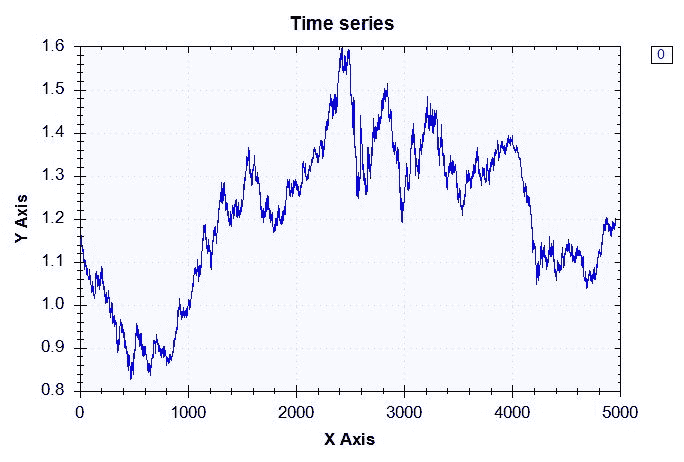
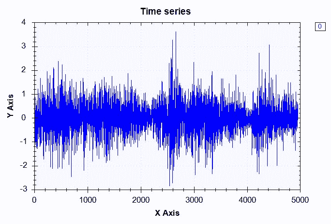
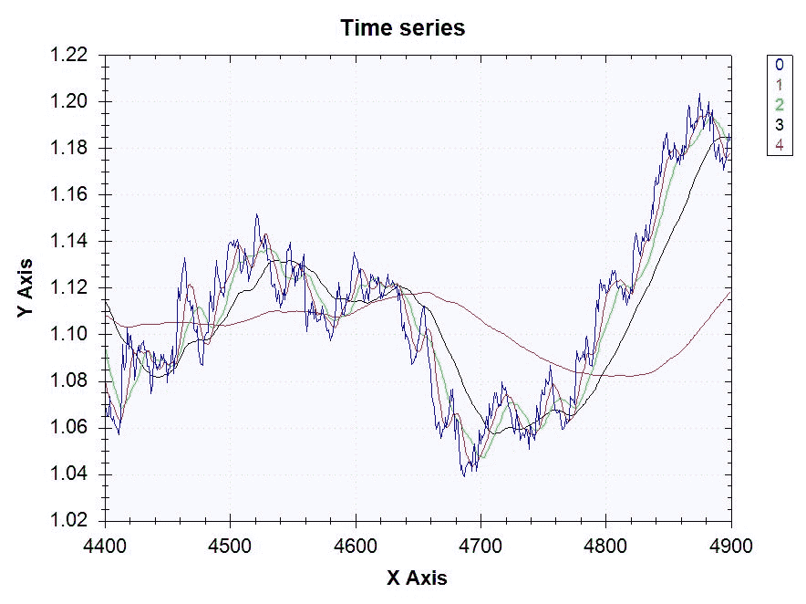
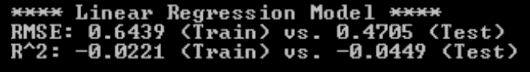
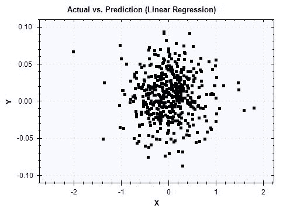
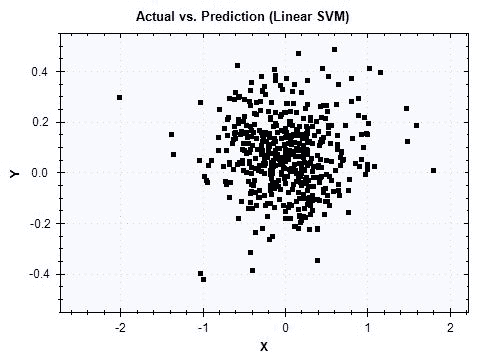

<title>Foreign Exchange Rate Forecast</title> 

# 外汇汇率预测

在本章中，我们将开始用 C#构建回归模型。到目前为止，我们已经建立了**机器学习** ( **ML** )模型，目标是使用逻辑回归、朴素贝叶斯和随机森林学习算法将数据分类到二进制或多个桶中。然而，我们现在要改变思路，开始建立预测连续结果的模型。在本章中，我们将探索一个金融数据集，更具体地说是一个外汇汇率市场数据集。我们将使用欧元(EUR)和美元(USD)之间每日汇率的历史数据来构建预测未来汇率的回归模型。我们将从问题定义开始，然后转到数据准备和数据分析。在数据准备和分析步骤中，我们将探讨如何管理时间序列数据并分析每日回报的分布。然后，我们将在功能工程步骤中开始构建可以预测货币汇率的功能。我们将讨论几个金融市场中常用的技术指标，如移动平均线、布林线和滞后变量。使用这些技术指标，我们将使用线性回归和**支持向量机**(**)学习算法来构建回归 ML 模型。在构建此类模型时，我们还将探索一些方法来微调 SVM 模型的超参数。最后，我们将讨论一些评估回归模型的验证指标和方法。我们将讨论如何使用**均方根误差** ( **RMSE** )、R ² 以及观察值与拟合值图来评估我们模型的性能。本章结束时，你将拥有预测欧元/美元每日汇率的回归模型。**

 **在本章中，我们将介绍以下步骤:

*   外汇汇率(欧元对美元)预测项目的问题定义
*   使用 Deedle 框架中的时间序列功能进行数据准备
*   时间序列数据分析
*   在外汇交易中使用各种技术指标的特征工程
*   线性回归与 SVM
*   使用 RMSE、R ² 和实际与预测图进行模型验证

<title>Problem definition</title> 

# 问题定义

让我们从定义我们在这个项目中试图解决的问题开始这一章。你可能听说过术语*算法交易*或*量化金融/交易*。这是数据科学和 ML 与金融相遇的金融行业众所周知的领域之一。算法交易或量化金融指的是一种策略，其中你使用从大量历史数据中建立的统计学习模型来预测未来的金融市场运动。各种交易者和投资者广泛使用这种策略和技术来预测各种金融资产的未来价格。外汇市场是最大和最具流动性的金融市场之一，大量的交易者和投资者参与其中。这是一个独特的市场，一天 24 小时，一周 5 天开放，来自世界各地的交易者在这里买卖特定的货币对。由于这种优势和独特性，外汇市场对于算法和量化交易者来说也是一个有吸引力的金融市场，他们可以建立 ML 模型来预测未来汇率，并使他们的交易自动化，以利用计算机可以做出的快速决策和执行。

为了了解我们如何将 ML 知识应用于金融市场和回归模型，我们将使用从 1999 年 1 月 1 日到 2017 年 12 月 31 日的每日欧元/美元汇率的历史数据。我们将使用一个公开可用的数据集，可以从这个链接下载:[http://www . global-view . com/forex-trading-tools/forex-history/index . html](http://www.global-view.com/forex-trading-tools/forex-history/index.html)。有了这些数据，我们将通过使用常用的技术指标来构建特征，如移动平均线、布林线和滞后变量。然后，我们将使用线性回归和 SVM 学习算法建立回归模型，预测欧元/美元货币对的未来每日汇率。一旦我们建立了这些模型，我们将使用 RMSE，R ^([2]) ，以及观察值与预测值的关系图来评估我们的模型。

总结一下我们对外汇汇率预测项目的问题定义:

*   有什么问题？我们需要一个回归模型来预测欧元和美元之间的未来汇率；更具体地说，我们希望建立一个预测欧元/美元汇率每日变化的 ML 模型。
*   为什么会有问题？由于外汇市场的快节奏和易变的环境，具有能够预测和自主决定何时买入和何时卖出特定货币对的 ML 模型是有利的。
*   解决这个问题的方法有哪些？我们将使用欧元和美元之间每日汇率的历史数据。有了这个数据集，我们将使用常用的技术指标构建金融特征，如移动平均线、布林线和滞后变量。我们将探索线性回归和 SVM 学习算法作为回归模型的候选算法。然后，我们将查看 RMSE，R ² ，并使用观察到的与预测到的图来评估我们构建的模型的性能。
*   成功的标准是什么？我们希望低 RMSE，因为我们希望我们的预测尽可能接近实际值。我们想要高 R ² ，因为它表明我们的模型的适合度。最后，我们希望在观察与预测图中看到数据点紧密排列成对角线。

<title>Data preparation</title> 

# 数据准备

现在我们知道了本章要解决的是什么样的问题，让我们开始研究数据。与前两章不同，在这两章中，我们预编译和预标记数据，我们将从原始欧元/美元汇率数据开始。点击此链接:[http://www . global-view . com/forex-trading-tools/forex-history/index . html](http://www.global-view.com/forex-trading-tools/forex-history/index.html)选择**欧元/美元收盘**、**欧元/美元高位**和**欧元/美元低位**。如果您想探索不同的数据集，也可以选择不同的货币对。选择所需的数据点后，您可以选择开始和结束日期，还可以选择是否要下载每日、每周或每月数据。对于本章，我们选择 **01/01/1999** 作为**开始日期**和 **12/31/2017** 作为**结束日期**，我们下载包含欧元/美元货币对的收盘价、最高价和最低价的每日数据集。

一旦你下载了数据，我们需要做一些工作来为将来的数据分析、特征工程和 ML 建模做准备。首先，我们需要定义目标变量。正如我们在问题定义步骤中所讨论的，我们的目标变量将是欧元/美元汇率的每日变化。为了计算日回报率，我们需要用今天的收盘价减去前一天的收盘价，然后除以前一天的收盘价。计算每日回报的公式如下:


我们可以使用 Deedle 的数据框中的`Diff`方法来计算前一个价格和当前价格之间的差异。您实际上可以使用`Diff`方法来计算任意时间点的数据点与当前数据点之间的差异。例如，以下代码显示了如何计算当前数据点与向前一步、向前三步和向前五步的数据点之间的差异:

```
rawDF["DailyReturn"].Diff(1)
rawDF["DailyReturn"].Diff(3)
rawDF["DailyReturn"].Diff(5)
```

上述代码的输出如下:


使用这个`Diff`方法，下面的代码是我们如何计算欧元/美元汇率的每日回报:

```
// Compute Daily Returns
rawDF.AddColumn(
    "DailyReturn", 
    rawDF["Close"].Diff(1) / rawDF["Close"] * 100.0
);
```

在这段代码中，我们取前一天和当天的收盘价之差，然后除以前一天的收盘价。通过将它们乘以`100`，我们可以得到百分比形式的日回报率。最后，我们通过使用 Deedle 的数据框架中的`AddColumn`方法，将这个日收益率序列添加回具有列名`DailyReturn`的原始数据框架中。

然而，我们还没有完全完成构建目标变量。由于我们正在建立一个预测模型，我们需要将第二天的回报作为目标变量。我们可以使用 Deedle 的数据框中的`Shift`方法将每条记录与第二天的退货关联起来。类似于`Diff`方法，您可以使用`Shift`方法将一个系列来回移动到任意时间点。以下代码显示了如何通过`1`、`3`和`5`步骤移动`DailyReturn`列:

```
rawDF["DailyReturn"].Shift(1)
rawDF["DailyReturn"].Shift(3)
rawDF["DailyReturn"].Shift(5)
```

上述代码的输出如下:


从这个例子中可以看出，`DailyReturn`列或系列已经向前移动了`1`、`3`和`5`步，这取决于您输入到`Shift`方法中的参数。使用这个`Shift`方法，我们将把每日回报向后移一步，这样每条记录都有第二天的回报作为目标变量。下面的代码是我们如何创建一个目标变量列，`Target`:

```
// Encode Target Variable - Predict Next Daily Return
rawDF.AddColumn(
    "Target",
    rawDF["DailyReturn"].Shift(-1)
);
```

既然我们已经对目标变量进行了编码，我们还需要采取一个步骤来为将来的任务准备数据。当你在处理金融数据时，你会经常听到术语 *OHLC 图表*或 *OHLC 价格*。OHLC 代表开盘价、最高价、最低价和收盘价，通常用于显示价格随时间的变化。如果您查看我们下载的数据，您会注意到数据集中缺少公开价格。然而，我们将需要为我们未来的功能工程步骤开放价格。我们将假设某一天的开盘价是前一天的收盘价，因为外汇市场是 24 小时运行的，流动性很强，交易量很大。为了将之前的收盘价作为开盘价，我们将使用`Shift`方法。以下代码显示了我们如何创建开放价格并将其添加到数据框中:

```
// Assume Open prices are previous Close prices
rawDF.AddColumn(
    "Open",
    rawDF["Close"].Shift(1)
);
```

以下代码是我们用于数据准备步骤的完整代码:

```
using Deedle;
using System;
using System.Collections.Generic;
using System.IO;
using System.Linq;
using System.Text;
using System.Threading.Tasks;

namespace DataPrep
{
    class Program
    {
        static void Main(string[] args)
        {
            Console.SetWindowSize(100, 50);

            // Read in the raw dataset
            // TODO: change the path to point to your data directory
            string dataDirPath = @"\\Mac\Home\Documents\c-sharp-machine-
learning\ch.4\input-data";

            // Load the data into a data frame
            string rawDataPath = Path.Combine(dataDirPath, "eurusd-daily.csv");
            Console.WriteLine("Loading {0}\n", rawDataPath);
            var rawDF = Frame.ReadCsv(
                rawDataPath,
                hasHeaders: true,
                schema: "Date,float,float,float",
                inferTypes: false
            );

            // Rename & Simplify Column Names
            rawDF.RenameColumns(c => c.Contains("EUR/USD ") ? c.Replace("EUR/USD ", "") : c);

            // Assume Open prices are previous Close prices
            rawDF.AddColumn(
                "Open",
                rawDF["Close"].Shift(1)
            );

            // Compute Daily Returns
            rawDF.AddColumn(
                "DailyReturn", 
                rawDF["Close"].Diff(1) / rawDF["Close"] * 100.0
            );

            // Encode Target Variable - Predict Next Daily Return
            rawDF.AddColumn(
                "Target",
                rawDF["DailyReturn"].Shift(-1)
            );

            rawDF.Print();

            // Save OHLC data
            string ohlcDataPath = Path.Combine(dataDirPath, "eurusd-daily-ohlc.csv");
            Console.WriteLine("\nSaving OHLC data to {0}\n", rawDataPath);
            rawDF.SaveCsv(ohlcDataPath);

            Console.WriteLine("DONE!!");
            Console.ReadKey();
        }
    }
}
```

当您运行这段代码时，它会将结果输出到一个名为`eurusd-daily-ohlc.csv`的文件中，该文件包含 OHLC 价格、每日回报和目标变量。我们将在未来的数据分析和特征工程步骤中使用该文件。

这个代码也可以在下面的资源库中找到:[https://github . com/Yoon hwang/c-sharp-machine-learning/blob/master/ch . 4/data prep . cs](https://github.com/yoonhwang/c-sharp-machine-learning/blob/master/ch.4/DataPrep.cs)。

<title>Time series data analysis</title> 

# 时间序列数据分析

让我们开始研究数据。我们将从前面的数据准备步骤中获取输出，并开始查看每日回报的分布。不像前几章，我们主要处理分类变量，我们正在处理连续和时间序列变量。我们将以几种不同的方式来看待这些数据。首先，让我们看看时间序列收盘价图。以下代码显示了如何使用 Accord.NET 框架构建折线图:

```
// Time-series line chart of close prices
DataSeriesBox.Show(
    ohlcDF.RowKeys.Select(x => (double)x),
    ohlcDF.GetColumn<double>("Close").ValuesAll
);
```

有关显示折线图的各种其他方法，请参考 Accord.NET 文档`DataSeriesBox.Show`方法。在本例中，我们构建了一个折线图，其中数据框的整数指数作为 *x* 轴的值，收盘价作为 *y* 轴的值。以下是运行代码时您将看到的时间序列折线图:



这张图表向我们展示了从 1999 年到 2017 年欧元/美元汇率的整体走势。从 1.18 左右开始，2000 年和 2001 年降到 1.0 以下。然后，它在 2008 年高达 1.6，然后在 2017 年结束于 1.20 左右。现在让我们看看历史日收益率。以下代码显示了如何构建历史每日回报率的折线图:

```
// Time-series line chart of daily returns
DataSeriesBox.Show(
    ohlcDF.RowKeys.Select(x => (double)x),
    ohlcDF.FillMissing(0.0)["DailyReturn"].ValuesAll
);
```

这里需要注意的一点是`FillMissing`方法的用法。如果您还记得前面的数据准备步骤，那么`DailyReturn`系列是通过获取前期和本期之间的差值构建的。因此，我们的第一个数据点缺少值，因为第一条记录没有前期数据点。`FillMissing`方法帮助您用自定义值对缺失值进行编码。根据您的数据集和假设，您可以用不同的值对缺失值进行编码，Deedle 的数据框中的`FillMissing`方法将会派上用场。

当您运行前面的代码时，它将显示如下图表:



从这张图可以看出，日收益率在 **0** 附近震荡，大多在-2.0%到+2.0%之间。让我们更仔细地看看日收益率的分布。我们将看看最小，最大，平均和标准偏差值。然后，我们要看看每日回报的四分位数，我们将在看完代码后更详细地讨论。计算这些数字的代码如下:

```
// Check the distribution of daily returns
double returnMax = ohlcDF["DailyReturn"].Max();
double returnMean = ohlcDF["DailyReturn"].Mean();
double returnMedian = ohlcDF["DailyReturn"].Median();
double returnMin = ohlcDF["DailyReturn"].Min();
double returnStdDev = ohlcDF["DailyReturn"].StdDev();

double[] quantiles = Accord.Statistics.Measures.Quantiles(
    ohlcDF.FillMissing(0.0)["DailyReturn"].ValuesAll.ToArray(),
    new double[] {0.25, 0.5, 0.75}
);

Console.WriteLine("-- DailyReturn Distribution-- ");

Console.WriteLine("Mean: \t\t\t{0:0.00}\nStdDev: \t\t{1:0.00}\n", returnMean, returnStdDev);

Console.WriteLine(
    "Min: \t\t\t{0:0.00}\nQ1 (25% Percentile): \t{1:0.00}\nQ2 (Median): \t\t{2:0.00}\nQ3 (75% Percentile): \t{3:0.00}\nMax: \t\t\t{4:0.00}", 
    returnMin, quantiles[0], quantiles[1], quantiles[2], returnMax
);
```

从这段代码中可以看出，Deedle 框架有许多用于计算基本统计数据的内置方法。如代码的前六行所示，您可以使用 Deedle 框架中的`Max`、`Mean`、`Median`、`Min`和`StdDev`方法来获得每日回报的相应统计数据。

为了得到四分位数，我们需要使用 Accord.NET 框架的`Accord.Statistics.Measures`模块中的`Quantiles`方法。分位数是将有序分布分成等长区间的点。例如，十个分位数将有序分布分成十个大小相等的子集，因此第一个子集代表分布的底部 10%,最后一个子集代表分布的顶部 10%。类似地，四分位数将有序分布分成四个大小相等的子集，其中第一个子集代表分布的底部 25%，最后一个子集代表分布的顶部 25%。四分位数通常被称为**四分位数**，十分位数被称为**十分位数**，100 分位数被称为**百分位数**。正如你可以从这些定义中推断出的，第 1 ^(个四分位数与第 0.25 ^个个十分位数和第 25 ^个个百分位数相同。同样，第 2 个^第和第 3 个^第四分位数与第 0.50 个^第和第 0.75 个^第十分位数以及第 50 个^第和第 75 个^第百分位数相同。由于我们对四分位数感兴趣，我们使用 25%、50%和 75%作为`Quantiles`方法中`percentiles`参数的输入。下面显示了运行此代码时的输出:)


类似于我们从每日回报时间序列折线图中注意到的，平均值和中值约为 0，表明每日回报在 0%左右波动。从 1999 年到 2017 年，历史上最大的负日收益率为-2.86%，最大的正日收益率为 3.61%。第一个四分位数是最小值和中值之间的中间数，为-0.36%，第三个四分位数是中值和最大值之间的中间数，为 0.35%。从这些汇总统计数据中，我们可以看到，每日回报从 0%开始几乎对称分布。为了更直观地展示这一点，现在让我们来看看日收益率的直方图。绘制日收益率直方图的代码如下:

```
var dailyReturnHistogram = HistogramBox
.Show(
    ohlcDF.FillMissing(0.0)["DailyReturn"].ValuesAll.ToArray()
)
.SetNumberOfBins(20);
```

我们在 Accord.NET 框架中使用了`HistogramBox`来构建每日回报的直方图。这里，我们将箱的数量设置为`20`。您可以增加或减少容器的数量，以显示更多或更少的粒度桶。当您运行此代码时，您将看到下面的图表:


与我们在汇总统计中观察到的类似，日收益率从 0%开始几乎对称分布。这张日收益率直方图显示了一条清晰的钟形曲线，表明日收益率服从正态分布。

我们为这个数据分析步骤运行的完整代码可以在以下链接中找到:[https://github . com/Yoon hwang/c-sharp-machine-learning/blob/master/ch . 4/data analyzer . cs](https://github.com/yoonhwang/c-sharp-machine-learning/blob/master/ch.4/DataAnalyzer.cs)。

<title>Feature engineering</title> 

# 特征工程

现在，我们对每日回报的分布有了更好的理解，让我们开始为 ML 建模构建特性。在这一步，我们将讨论外汇市场交易者经常使用的几个技术指标，以及我们如何使用这些技术指标为我们的 ML 模型构建特征。

<title>Moving average</title> 

# 移动平均数

我们要构建的第一组特征是移动平均线。移动平均线是预定义周期数的滚动平均线，是一种常用的技术指标。均线有助于消除价格波动，并显示价格变动的总体趋势。关于均线如何用于交易金融资产的深入讨论超出了本书的范围，但简而言之，观察不同时间框架的多条均线有助于交易者确定趋势以及交易的支撑位和阻力位。在本章中，我们将使用四条移动平均线，其中回顾期为 10 天、20 天、50 天和 200 天。以下代码显示了我们如何使用`Window`方法计算移动平均值:

```
// 1\. Moving Averages
ohlcDF.AddColumn("10_MA", ohlcDF.Window(10).Select(x => x.Value["Close"].Mean()));
ohlcDF.AddColumn("20_MA", ohlcDF.Window(20).Select(x => x.Value["Close"].Mean()));
ohlcDF.AddColumn("50_MA", ohlcDF.Window(50).Select(x => x.Value["Close"].Mean()));
ohlcDF.AddColumn("200_MA", ohlcDF.Window(200).Select(x => x.Value["Close"].Mean()));
```

Deedle 框架中的`Window`方法帮助我们轻松计算移动平均线。`Window`方法获取一个数据帧并构建一系列数据帧，其中每个数据帧包含预定义数量的记录。例如，如果您对`Window`方法的输入是`10`，那么它将构建一系列数据帧，其中第一个数据帧包含从第 0 个索引到第 9 个^(索引的记录，第二个数据帧包含从第 1 个^(索引到第 11 个^(索引的记录，依此类推。使用这种方法，我们可以很容易地计算不同时间窗口的移动平均值，如代码所示。现在，让我们用这些移动平均线绘制一个时间序列收盘价图:)))



正如你从图表中看到的，均线消除了价格的波动。红线显示 10 天的移动平均线，绿线显示 20 天的移动平均线，黑线显示 50 天，粉线显示 200 天。正如你从这张图表中看到的，时间窗口越短，价格波动越剧烈，图表越不平滑。我们用来生成该图表的代码如下:

```
// Time-series line chart of close prices & moving averages
var maLineChart = DataSeriesBox.Show(
    ohlcDF.Where(x => x.Key > 4400 && x.Key < 4900).RowKeys.Select(x => (double)x),
    ohlcDF.Where(x => x.Key > 4400 && x.Key < 4900).GetColumn<double>("Close").ValuesAll,
    ohlcDF.Where(x => x.Key > 4400 && x.Key < 4900).GetColumn<double>("10_MA").ValuesAll,
    ohlcDF.Where(x => x.Key > 4400 && x.Key < 4900).GetColumn<double>("20_MA").ValuesAll,
    ohlcDF.Where(x => x.Key > 4400 && x.Key < 4900).GetColumn<double>("50_MA").ValuesAll,
    ohlcDF.Where(x => x.Key > 4400 && x.Key < 4900).GetColumn<double>("200_MA").ValuesAll
);
```

利用我们刚刚计算的这些移动平均线，我们将在模型中使用的实际特征是收盘价和移动平均线之间的距离。如前所述，移动平均线通常作为支撑位和阻力位，通过观察每个价格点离每个移动平均线有多远，我们可以判断我们是否正在接近支撑线和阻力线。计算收盘价和移动平均线之间距离的代码如下:

```
// Distance from moving averages
ohlcDF.AddColumn("Close_minus_10_MA", ohlcDF["Close"] - ohlcDF["10_MA"]);
ohlcDF.AddColumn("Close_minus_20_MA", ohlcDF["Close"] - ohlcDF["20_MA"]);
ohlcDF.AddColumn("Close_minus_50_MA", ohlcDF["Close"] - ohlcDF["50_MA"]);
ohlcDF.AddColumn("Close_minus_200_MA", ohlcDF["Close"] - ohlcDF["200_MA"]);
```

<title>Bollinger Bands</title> 

# 布林线

我们要关注的第二个技术指标是布林线。布林线包括一条移动平均线和与它使用的移动平均线相同的时间窗口的移动标准差。然后，布林线在价格时间序列图上的移动平均线上下绘制两个标准差。我们将使用 20 天的时间窗口来计算布林线。计算布林线的代码如下:

```
// 2\. Bollinger Band
ohlcDF.AddColumn("20_day_std", ohlcDF.Window(20).Select(x => x.Value["Close"].StdDev()));
ohlcDF.AddColumn("BollingerUpperBound", ohlcDF["20_MA"] + ohlcDF["20_day_std"] * 2);
ohlcDF.AddColumn("BollingerLowerBound", ohlcDF["20_MA"] - ohlcDF["20_day_std"] * 2);
```

从这段代码中可以看出，我们使用了`Window`和`StdDev`方法来计算移动标准差。然后，我们通过 20 日均线加减两个标准差来计算布林线的上下边界。当您用价格序列绘制布林线时，结果如下所示:


蓝线显示价格走势，绿线显示 20 日均线，红线显示布林线的上边界，在均线以上两个标准差，黑线显示布林线的下边界，在均线以下两个标准差。正如你从这张图表中看到的，布林线围绕价格运动形成波段。显示该图表的代码如下:

```
// Time-series line chart of close prices & bollinger bands
var bbLineChart = DataSeriesBox.Show(
    ohlcDF.Where(x => x.Key > 4400 && x.Key < 4900).RowKeys.Select(x => (double)x),
    ohlcDF.Where(x => x.Key > 4400 && x.Key < 4900).GetColumn<double>("Close").ValuesAll,
    ohlcDF.Where(x => x.Key > 4400 && x.Key < 4900).GetColumn<double>("BollingerUpperBound").ValuesAll,
    ohlcDF.Where(x => x.Key > 4400 && x.Key < 4900).GetColumn<double>("20_MA").ValuesAll,
    ohlcDF.Where(x => x.Key > 4400 && x.Key < 4900).GetColumn<double>("BollingerLowerBound").ValuesAll
);
```

类似于前面的移动平均线，我们将使用收盘价和布林线之间的距离。由于大多数交易是在上下波段之间进行的，价格和波段之间的距离可以作为我们 ML 模型的特征。计算距离的代码如下:

```
// Distance from Bollinger Bands
ohlcDF.AddColumn("Close_minus_BollingerUpperBound", ohlcDF["Close"] - ohlcDF["BollingerUpperBound"]);
ohlcDF.AddColumn("Close_minus_BollingerLowerBound", ohlcDF["Close"] - ohlcDF["BollingerLowerBound"]);
```

<title>Lagged variables</title> 

# 滞后变量

最后，我们要使用的最后一组特征是滞后变量。滞后变量包含以前期间的信息。例如，如果我们使用前一天的每日回报值作为我们模型的一个特征，那么它就是一个滞后一个周期的滞后变量。我们还可以使用当前日期前两天的每日回报作为我们模型的一个特征。这些类型的变量被称为**滞后变量**，通常用于时间序列建模。我们将使用每日回报和以前建立的特征作为滞后变量。在这个项目中，我们回顾了五个时期，但是您可以尝试更长或更短的回顾时期。为每日回报创建滞后变量的代码如下:

```
// 3\. Lagging Variables
ohlcDF.AddColumn("DailyReturn_T-1", ohlcDF["DailyReturn"].Shift(1));
ohlcDF.AddColumn("DailyReturn_T-2", ohlcDF["DailyReturn"].Shift(2));
ohlcDF.AddColumn("DailyReturn_T-3", ohlcDF["DailyReturn"].Shift(3));
ohlcDF.AddColumn("DailyReturn_T-4", ohlcDF["DailyReturn"].Shift(4));
ohlcDF.AddColumn("DailyReturn_T-5", ohlcDF["DailyReturn"].Shift(5));
```

同样，我们可以使用以下代码为移动平均线和收盘价之间的差异创建滞后变量:

```
ohlcDF.AddColumn("Close_minus_10_MA_T-1", ohlcDF["Close_minus_10_MA"].Shift(1));
ohlcDF.AddColumn("Close_minus_10_MA_T-2", ohlcDF["Close_minus_10_MA"].Shift(2));
ohlcDF.AddColumn("Close_minus_10_MA_T-3", ohlcDF["Close_minus_10_MA"].Shift(3));
ohlcDF.AddColumn("Close_minus_10_MA_T-4", ohlcDF["Close_minus_10_MA"].Shift(4));
ohlcDF.AddColumn("Close_minus_10_MA_T-5", ohlcDF["Close_minus_10_MA"].Shift(5));

ohlcDF.AddColumn("Close_minus_20_MA_T-1", ohlcDF["Close_minus_20_MA"].Shift(1));
ohlcDF.AddColumn("Close_minus_20_MA_T-2", ohlcDF["Close_minus_20_MA"].Shift(2));
ohlcDF.AddColumn("Close_minus_20_MA_T-3", ohlcDF["Close_minus_20_MA"].Shift(3));
ohlcDF.AddColumn("Close_minus_20_MA_T-4", ohlcDF["Close_minus_20_MA"].Shift(4));
ohlcDF.AddColumn("Close_minus_20_MA_T-5", ohlcDF["Close_minus_20_MA"].Shift(5));

ohlcDF.AddColumn("Close_minus_50_MA_T-1", ohlcDF["Close_minus_50_MA"].Shift(1));
ohlcDF.AddColumn("Close_minus_50_MA_T-2", ohlcDF["Close_minus_50_MA"].Shift(2));
ohlcDF.AddColumn("Close_minus_50_MA_T-3", ohlcDF["Close_minus_50_MA"].Shift(3));
ohlcDF.AddColumn("Close_minus_50_MA_T-4", ohlcDF["Close_minus_50_MA"].Shift(4));
ohlcDF.AddColumn("Close_minus_50_MA_T-5", ohlcDF["Close_minus_50_MA"].Shift(5));

ohlcDF.AddColumn("Close_minus_200_MA_T-1", ohlcDF["Close_minus_200_MA"].Shift(1));
ohlcDF.AddColumn("Close_minus_200_MA_T-2", ohlcDF["Close_minus_200_MA"].Shift(2));
ohlcDF.AddColumn("Close_minus_200_MA_T-3", ohlcDF["Close_minus_200_MA"].Shift(3));
ohlcDF.AddColumn("Close_minus_200_MA_T-4", ohlcDF["Close_minus_200_MA"].Shift(4));
ohlcDF.AddColumn("Close_minus_200_MA_T-5", ohlcDF["Close_minus_200_MA"].Shift(5));
```

最后，我们可以使用以下代码为布林线指标创建滞后变量:

```
ohlcDF.AddColumn("Close_minus_BollingerUpperBound_T-1", ohlcDF["Close_minus_BollingerUpperBound"].Shift(1));
ohlcDF.AddColumn("Close_minus_BollingerUpperBound_T-2", ohlcDF["Close_minus_BollingerUpperBound"].Shift(2));
ohlcDF.AddColumn("Close_minus_BollingerUpperBound_T-3", ohlcDF["Close_minus_BollingerUpperBound"].Shift(3));
ohlcDF.AddColumn("Close_minus_BollingerUpperBound_T-4", ohlcDF["Close_minus_BollingerUpperBound"].Shift(4));
ohlcDF.AddColumn("Close_minus_BollingerUpperBound_T-5", ohlcDF["Close_minus_BollingerUpperBound"].Shift(5));
```

从这些代码片段中可以看出，创建这样的滞后变量非常简单明了。我们可以简单地使用 Deedle 框架中的`Shift`方法，并根据回望期改变方法的输入。

在本节中，我们要做的最后一件事是删除缺失的值。因为我们构建了许多时间序列特性，所以我们创建了许多缺失值。例如，当我们计算 200 天的移动平均线时，前 199 条记录没有移动平均线，因此会有缺失值。当您的数据集中碰巧有缺失值时，有两种方法可以处理它们-您可以用某些值对它们进行编码，或者从数据集中删除缺失值。因为我们有足够的数据，所以我们将删除所有缺少值的记录。从数据框中删除缺失值的代码如下:

```
Console.WriteLine("\n\nDF Shape BEFORE Dropping Missing Values: ({0}, {1})", ohlcDF.RowCount, ohlcDF.ColumnCount);
ohlcDF = ohlcDF.DropSparseRows();
Console.WriteLine("\nDF Shape AFTER Dropping Missing Values: ({0}, {1})\n\n", ohlcDF.RowCount, ohlcDF.ColumnCount);
```

从这段代码中可以看出，Deedle 框架有一个方便的函数，我们可以用它来删除丢失的值。我们可以使用`DropSparseRows`方法来删除所有丢失的值。当您运行此代码时，您的输出将如下所示:


从这个输出中可以看出，它丢弃了 250 条缺少值的记录。从头到尾运行数据分析步骤的完整代码可以在以下链接找到:[https://github . com/Yoon hwang/c-sharp-machine-learning/blob/master/ch . 4/feature engineer . cs](https://github.com/yoonhwang/c-sharp-machine-learning/blob/master/ch.4/FeatureEngineer.cs)。

<title>Linear regression versus SVM</title> 

# 线性回归与 SVM

在这一节中，我们将建立与前几章完全不同的模型。我们将建立预测连续变量的模型，并提供欧元/美元汇率的每日回报，我们将使用两种新的学习算法，线性回归和 SVM。线性回归模型试图找到目标变量和特征之间的线性关系，而 SVM 模型试图建立超平面，以最大化不同类之间的距离。对于这个外汇汇率预测项目，我们将讨论如何使用 Accord.NET 框架在 C#中建立线性回归和回归问题的 SVM 模型。

在我们建立模型之前，我们必须将样本集分成两个子集——一个用于训练，另一个用于测试。在前一章中，我们在 Accord.NET 框架中使用了`SplitSetValidation` ，以预定义的比例将一个样本集随机分成训练集和测试集。然而，我们不能在本章中应用同样的方法。由于我们处理的是时间序列数据，我们不能随机选择记录并将其分为训练集和测试集。如果我们随机分割样本集，那么我们将会遇到用未来事件训练 ML 模型，用过去事件测试模型的情况。因此，我们希望在某个时间点分割样本集，将该点之前的记录放入训练集，将该点之后的记录放入测试集。以下代码显示了我们如何将样本集分为训练集和测试集:

```
// Read in the file we created in the previous step
// TODO: change the path to point to your data directory
string dataDirPath = @"<path-to-data-dir>";

// Load the data into a data frame
Console.WriteLine("Loading data...");
var featuresDF = Frame.ReadCsv(
    Path.Combine(dataDirPath, "eurusd-features.csv"),
    hasHeaders: true,
    inferTypes: true
);

// Split the sample set into train and test sets
double trainProportion = 0.9;

int trainSetIndexMax = (int)(featuresDF.RowCount * trainProportion);

var trainSet = featuresDF.Where(x => x.Key < trainSetIndexMax);
var testSet = featuresDF.Where(x => x.Key >= trainSetIndexMax);

Console.WriteLine("\nTrain Set Shape: ({0}, {1})", trainSet.RowCount, trainSet.ColumnCount);
Console.WriteLine("Test Set Shape: ({0}, {1})", testSet.RowCount, testSet.ColumnCount);
Where method to filter records in the sample set by index. The next thing we need to do before training our ML models is select the features that we want to train our models with. Since we are only interested in using lagged variables and the distances between the prices and moving averages or Bollinger Bands, we do not want to include raw moving average or Bollinger Band numbers into our feature space. The following code snippet shows how we define the feature set for our models:
```

```
string[] features = new string[] {
    "DailyReturn", 
    "Close_minus_10_MA", "Close_minus_20_MA", "Close_minus_50_MA",
    "Close_minus_200_MA", "20_day_std", 
    "Close_minus_BollingerUpperBound", "Close_minus_BollingerLowerBound",
    "DailyReturn_T-1", "DailyReturn_T-2",
    "DailyReturn_T-3", "DailyReturn_T-4", "DailyReturn_T-5",
    "Close_minus_10_MA_T-1", "Close_minus_10_MA_T-2", 
    "Close_minus_10_MA_T-3", "Close_minus_10_MA_T-4",
    "Close_minus_10_MA_T-5", 
    "Close_minus_20_MA_T-1", "Close_minus_20_MA_T-2",
    "Close_minus_20_MA_T-3", "Close_minus_20_MA_T-4", "Close_minus_20_MA_T-5",
    "Close_minus_50_MA_T-1", "Close_minus_50_MA_T-2", "Close_minus_50_MA_T-3",
    "Close_minus_50_MA_T-4", "Close_minus_50_MA_T-5", 
    "Close_minus_200_MA_T-1", "Close_minus_200_MA_T-2", 
    "Close_minus_200_MA_T-3", "Close_minus_200_MA_T-4",
    "Close_minus_200_MA_T-5",
    "Close_minus_BollingerUpperBound_T-1",
    "Close_minus_BollingerUpperBound_T-2", "Close_minus_BollingerUpperBound_T-3",
    "Close_minus_BollingerUpperBound_T-4", "Close_minus_BollingerUpperBound_T-5"
};
```

现在我们准备开始构建模型对象并训练我们的 ML 模型。我们先来看看如何实例化一个线性回归模型。我们用来定型线性回归模型的代码如下:

```
Console.WriteLine("\n**** Linear Regression Model ****");

// OLS learning algorithm
var ols = new OrdinaryLeastSquares()
{
    UseIntercept = true
};

// Fit a linear regression model
MultipleLinearRegression regFit = ols.Learn(trainX, trainY);

// in-sample predictions
double[] regInSamplePreds = regFit.Transform(trainX);

// out-of-sample predictions
double[] regOutSamplePreds = regFit.Transform(testX);
OrdinaryLeastSquares as a learning algorithm and MultipleLinearRegression as a model. Ordinary Least Squares (OLS) is a way of training a linear regression model by minimizing and optimizing on the sum of squares of errors. A multiple linear regression model is a model where the number of input features is larger than 1\. Lastly, in order to make predictions on data, we are using the Transform method of the MultipleLinearRegression object. We will be making predictions on both the train and test sets for our model validations in the following section.
```

现在让我们来看看我们将在本章中使用的另一种学习算法和模型。以下代码显示了如何为回归问题构建和定型 SVM 模型:

```
Console.WriteLine("\n**** Linear Support Vector Machine ****");
// Linear SVM Learning Algorithm
var teacher = new LinearRegressionNewtonMethod()
{
    Epsilon = 2.1,
    Tolerance = 1e-5,
    UseComplexityHeuristic = true
};

// Train SVM
var svm = teacher.Learn(trainX, trainY);

// in-sample predictions
double[] linSVMInSamplePreds = svm.Score(trainX);

// out-of-sample predictions
double[] linSVMOutSamplePreds = svm.Score(testX);
```

从这段代码中可以看出，我们使用`LinearRegressionNewtonMethod`作为学习算法来训练 SVM 模型。`LinearRegressionNewtonMethod` 是 SVM 使用线性核的一种学习算法。简而言之，核是一种将数据点投影到另一个空间的方式，在另一个空间中，数据点比原始空间中的数据点更容易分离。在训练 SVM 模型时，也经常使用其他核，例如多项式核和高斯核。我们将在下一章实验并进一步讨论这些其他内核，但是你当然可以在这个项目的其他内核上实验模型性能。当使用经过训练的 SVM 模型进行预测时，可以使用`Score`方法，如代码片段所示。

我们用来训练和验证线性回归和 SVM 模型的完整代码可以在这里找到:[https://github . com/Yoon hwang/c-sharp-machine-learning/blob/master/ch . 4/modeling . cs](https://github.com/yoonhwang/c-sharp-machine-learning/blob/master/ch.4/Modeling.cs)。

<title>Model validations </title> 

# 模型验证

现在，您已经为本章的外汇汇率预测项目建立并训练了回归模型，让我们开始看看我们的模型表现如何。在本节中，我们将讨论两个常用的基本指标，RMSE 和 R ² ，以及一个诊断图，即实际值或观察值与预测值的对比图。在我们深入研究这些指标和诊断图之前，让我们先简单讨论一下如何从线性回归模型中提取系数和截距值。

```
MultipleLinearRegressionobject:
```

```
Console.WriteLine("\n* Linear Regression Coefficients:");

for (int i = 0; i < features.Length; i++)
{
    Console.WriteLine("\t{0}: {1:0.0000}", features[i], regFit.Weights[i]);
}

Console.WriteLine("\tIntercept: {0:0.0000}", regFit.Intercept);
```

当您运行此代码时，您将看到如下所示的输出:


查看拟合的线性回归模型的系数和截距有助于我们理解模型，并深入了解每个特征如何影响预测结果。事实上，我们可以准确地理解和可视化特征和目标变量之间的关系是如何形成的，以及它们如何相互作用，这使得线性回归模型仍然具有吸引力，即使其他黑盒模型，如随机森林模型或支持向量机，通常优于线性回归模型。正如您从这个输出中看到的，您可以很容易地判断出哪些特性对每日回报预测产生了积极或消极的影响，以及它们的影响程度。

现在让我们看看本章中用于回归模型验证的第一个指标。您可能已经熟悉 RMSE，它测量预测值和实际值之间的误差的平方根。RMSE 值越低，模型拟合越好。以下代码显示了如何计算模型拟合的 RMSE:

```
// RMSE for in-sample 
double regInSampleRMSE = Math.Sqrt(new SquareLoss(trainX).Loss(regInSamplePreds));

// RMSE for out-sample 
double regOutSampleRMSE = Math.Sqrt(new SquareLoss(testX).Loss(regOutSamplePreds));

Console.WriteLine("RMSE: {0:0.0000} (Train) vs. {1:0.0000} (Test)", regInSampleRMSE, regOutSampleRMSE);
```

从这段代码中可以看出，我们在 Accord.NET 框架中使用了`SquareLoss`类，它计算预测值和实际值之间的差值的平方值。为了得到 RMSE，我们需要取这个值的平方根。

我们要看的下一个指标是 R ² 。R ^(*2*) 经常被用作拟合优度的指标。该值越接近 1，模型拟合得越好。下面的代码显示了我们如何计算 R ² 的值:

```
// R^2 for in-sample 
double regInSampleR2 = new RSquaredLoss(trainX[0].Length, trainX).Loss(regInSamplePreds);

// R^2 for out-sample 
double regOutSampleR2 = new RSquaredLoss(testX[0].Length, testX).Loss(regOutSamplePreds);

Console.WriteLine("R^2: {0:0.0000} (Train) vs. {1:0.0000} (Test)", regInSampleR2, regOutSampleR2);
```

从这段代码中可以看出，我们在 Accord.NET 框架中使用了`RSquaredLoss`类。我们为样本内预测(对训练集的预测)计算一次，为样本外预测(对测试集的预测)计算一次。这两个值越接近，模型的过度拟合程度就越低。

当您为线性回归模型运行 RMSE 和 R ² 的代码时，您将获得以下输出:



对于 SVM 模型，您将看到如下输出:


从这些输出中，我们可以看到 SVM 模型大大优于线性回归模型。与线性回归模型相比，SVM 模型的 RMSE 要低得多。此外，SVM 模型比线性回归模型具有高得多的 R ² 值。注意线性回归模型的 R ² 值。当模型的拟合比简单的水平线差时，就会出现这种情况，这表明我们的线性回归模型拟合不好。另一方面，SVM 模型的 R ² 约为 0.26，这表明该模型可以解释 26%的目标变量方差。

最后，我们要看一个诊断图；实际值与预测值的对比。该诊断图是直观查看模型拟合度的好方法。理想情况下，我们希望所有的点都在一条对角线上。例如，如果实际值是 1.0，那么我们希望预测值接近 1.0。这些点离对角线越近，模型拟合得越好。您可以使用以下代码绘制实际值与预测值的对比图:

```
// Scatter Plot of expected and actual
ScatterplotBox.Show(
    String.Format("Actual vs. Prediction ({0})", modelName), testY, regOutSamplePreds
);
```

我们使用 Accord.NET 框架中的`ScatterplotBox`类来构建实际值与预测值的散点图。当您对线性回归模型结果运行此代码时，您将看到以下诊断图:



对 SVM 模型结果运行相同的代码时，诊断图如下所示:



从这些图中可以看出，线性回归模型的预测在 0 附近更为阻塞，而 SVM 模型的预测则分布在更大的范围内。虽然线性回归和 SVM 模型结果的两个图现在都显示了完美的对角线，但 SVM 模型的图显示了更好的结果，并且与我们从 RMSE 和 R ² 指标中看到的结果一致。

我们编写并用于运行模型验证的方法如下:

```
private static void ValidateModelResults(string modelName, double[] regInSamplePreds, double[] regOutSamplePreds, double[][] trainX, double[] trainY, double[][] testX, double[] testY)
{
    // RMSE for in-sample 
    double regInSampleRMSE = Math.Sqrt(new SquareLoss(trainX).Loss(regInSamplePreds));

    // RMSE for in-sample 
    double regOutSampleRMSE = Math.Sqrt(new SquareLoss(testX).Loss(regOutSamplePreds));

    Console.WriteLine("RMSE: {0:0.0000} (Train) vs. {1:0.0000} (Test)", regInSampleRMSE, regOutSampleRMSE);

    // R^2 for in-sample 
    double regInSampleR2 = new RSquaredLoss(trainX[0].Length, trainX).Loss(regInSamplePreds);

    // R^2 for in-sample 
    double regOutSampleR2 = new RSquaredLoss(testX[0].Length, testX).Loss(regOutSamplePreds);

    Console.WriteLine("R^2: {0:0.0000} (Train) vs. {1:0.0000} (Test)", regInSampleR2, regOutSampleR2);

    // Scatter Plot of expected and actual
    ScatterplotBox.Show(
        String.Format("Actual vs. Prediction ({0})", modelName), testY, regOutSamplePreds
    );
}
```

<title>Summary</title> 

# 摘要

在这一章中，我们建立并训练了我们的第一个回归模型。我们使用了一个时间序列数据集，其中包含 1999 年至 2017 年欧元与美元之间的历史每日汇率。我们首先讨论了如何从一个未标记的原始数据集创建一个目标变量，以及如何在 Deedle 框架中应用`Shift`和`Diff`方法，以便计算每日回报并创建目标变量，该目标变量是未来一段时间的每日回报。我们进一步以几种不同的方式研究了每日回报的分布，例如时间序列折线图、使用平均值、标准差和分位数的汇总统计数据。我们也看了每日回报的直方图，看到了一个很好的服从正态分布的钟形曲线。然后，我们介绍了外汇市场中一些常用的技术指标，以及如何将它们应用到我们的功能构建过程中。使用技术指标，如移动平均线、布林线和滞后变量，我们建立了各种功能，帮助我们的学习算法学习如何预测未来的每日回报。利用我们在特征工程步骤中构建的这些特征，我们构建了线性回归和 SVM 模型来预测欧元/美元汇率。我们学习了如何从`MultipleLinearRegression` 对象中提取系数和截距，以深入了解和更好地理解每个特征如何影响预测的结果。我们简要讨论了核在建立 SVM 模型中的用法。最后，我们回顾了回归模型的两个常用指标，RMSE 和 R ² ，以及实际值与预测值的诊断图。从这个模型验证步骤中，我们观察到 SVM 模型如何大大优于线性回归模型。我们还讨论了与其他黑盒模型(如随机森林和 SVM 模型)相比，使用线性回归模型可以获得的可解释性的比较优势。

在下一章，我们将通过使用 Accord.NET 框架在 C#中构建回归模型来扩展我们的知识和经验。我们将使用包含连续变量和分类变量的房价数据集，并学习如何为这样一个复杂的数据集构建回归模型。我们还将讨论我们可以用于支持向量机的各种其他内核，以及它们如何影响我们的 SVM 模型的性能。**