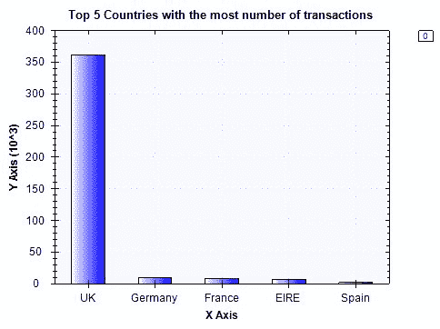
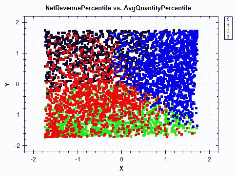
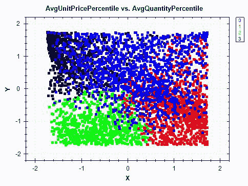

<title>Customer Segmentation</title> 

# 客户细分

在本章中，我们将学习无监督学习模型，以及如何使用它们从数据中提取洞察力。到目前为止，我们一直专注于监督学习，其中我们的**机器学习** ( **ML** )模型已经知道他们试图预测的目标变量。我们已经为垃圾邮件过滤和 Twitter 情感分析建立了分类模型。我们还建立了回归模型，用于外汇汇率预测和预测房价的公允价值。到目前为止，我们建立的所有这些 ML 模型都是监督学习算法，其中模型学习将给定的输入映射到预期的结果。然而，在有些情况下，我们更感兴趣的是找到隐藏的见解，并从数据集进行推断，我们可以使用无监督学习算法来完成这种任务。

在本章中，我们将使用一个在线零售数据集，该数据集包含客户购买的商品的价格和数量信息。我们将通过观察购买订单的商品价格和数量的分布与取消订单的商品价格和数量的分布有何不同来研究这些数据。我们还将了解在线商店活动在不同国家的分布情况。然后，我们将获取这些交易级别的数据，并将其转换和聚合为客户级别的数据。当我们将这些数据转换为以客户为中心的视图时，我们将讨论如何为无监督学习算法构建与规模无关的特征。有了这个特性集，我们将使用 k-means 聚类算法来构建客户细分，并提取每个细分中客户行为的洞察力。我们将引入一个新的验证度量，轮廓系数，来评估聚类结果。

在本章中，我们将讨论以下主题:

*   客户细分项目的问题定义
*   在线零售数据集的数据分析
*   特征工程和聚合
*   使用 k-均值聚类算法的无监督学习
*   使用剪影系数的聚类模型验证

<title>Problem definition</title> 

# 问题定义

让我们更详细地讨论一下我们要解决什么问题，为什么问题建立聚类模型。无论您是想向客户发送营销电子邮件，还是仅仅想更好地了解客户及其在线商店行为，您都需要分析和识别不同类型和细分的客户。一些顾客可能会一次购买很多物品(大宗购买者)，一些顾客可能主要购买昂贵或奢侈品(奢侈品购买者)，或者一些顾客可能已经购买了一两件物品，并且再也不会回来(非参与顾客)。根据这些行为模式，你的营销活动应该有所不同。例如，发送关于奢侈品促销的电子邮件可能会促使奢侈品买家登录在线商店并购买某些商品，但这样的电子邮件活动对大宗买家来说不会很好。另一方面，就经常批量购买的商品发送促销电子邮件，如办公用品的笔和记事本，可能会促使批量购买者登录在线商店并下订单，但这可能对奢侈品购买者没有吸引力。通过根据客户的行为模式识别客户群并使用定制的营销活动，您可以优化您的营销渠道。

为了构建客户细分模型，我们将使用一个在线零售数据集，其中包含一家英国在线零售店在 2010 年 1 月 12 日至 2011 年 9 月 12 日之间发生的所有交易。这个数据集可以在 http://archive.ics.uci.edu/ml/datasets/online+retail#的 UCI 机器学习库中找到，也可以从这个链接下载。有了这些数据，我们将构建包含净收入、平均商品价格和每个客户的平均购买数量等信息的特性。利用这些特性，我们将使用 **k 均值聚类算法**构建一个聚类模型，将客户群划分为不同的细分市场。我们将使用**轮廓系数**指标来评估聚类的质量，并推断出要构建的最佳客户群数量。

总结一下我们对客户细分项目的问题定义:

*   有什么问题？我们需要一个聚类模型，将客户划分为不同的聚类，这样我们就可以更好地理解和洞察客户的行为模式。
*   为什么会有问题？没有适合所有不同类型客户的通用营销活动。我们需要分别为大宗购买者和奢侈品购买者定制营销活动。此外，我们必须将未参与的客户与其他类型的客户区别开来，让他们重新参与到产品中来。营销信息越个性化，客户就越有可能参与进来。如果我们有一个 ML 模型，根据客户在网上商店的行为模式将我们的客户群分为不同的部分，这将是一个很大的优势。
*   解决这个问题的方法有哪些？我们将使用包含 2010 年至 2011 年年中所有交易的在线零售数据集来汇总关键特征，如净收入、平均单价和每位客户的平均购买数量。然后，我们将使用 k-means 聚类算法来建立聚类模型，并使用轮廓系数来评价聚类的质量和选择最佳的聚类数目。
*   成功的标准是什么？我们不希望有太多的集群，因为这会增加解释和理解不同客户模式的难度。我们将使用轮廓系数得分来告诉我们用于客户细分的最佳聚类数。

<title>Data analysis for the online retail dataset</title> 

# 在线零售数据集的数据分析

现在是研究数据集的时候了。可以关注这个链接:【http://archive.ics.uci.edu/ml/datasets/online+retail#[，点击左上角的`Data Folder`链接，下载`Online Retail.xlsx`文件。您可以将文件保存为 CSV 格式，并将其加载到 Deedle 数据框中。](http://archive.ics.uci.edu/ml/datasets/online+retail#)

<title>Handling missing values</title> 

# 处理缺失值

由于我们将汇总每个客户的交易数据，我们需要检查在`CustomerID`列中是否有任何缺失的值。下面的截图显示了一些没有`CustomerID`的记录:


我们将从`CustomerID`、`Description`、`Quantity`、`UnitPrice`和`Country`列中删除那些缺少值的记录。下面的代码片段显示了我们如何删除那些列中缺少值的记录:

```
// 1\. Missing CustomerID Values
ecommerceDF
    .Columns[new string[] { "CustomerID", "InvoiceNo", "StockCode", "Quantity", "UnitPrice", "Country" }]
    .GetRowsAt(new int[] { 1440, 1441, 1442, 1443, 1444, 1445, 1446 })
    .Print();
Console.WriteLine("\n\n* # of values in CustomerID column: {0}", ecommerceDF["CustomerID"].ValueCount);

// Drop missing values
ecommerceDF = ecommerceDF
    .Columns[new string[] { "CustomerID", "Description", "Quantity", "UnitPrice", "Country" }]
    .DropSparseRows();

// Per-Transaction Purchase Amount = Quantity * UnitPrice
ecommerceDF.AddColumn("Amount", ecommerceDF["Quantity"] * ecommerceDF["UnitPrice"]);

Console.WriteLine("\n\n* Shape (After dropping missing values): {0}, {1}\n", ecommerceDF.RowCount, ecommerceDF.ColumnCount);
Console.WriteLine("* After dropping missing values and unnecessary columns:");
ecommerceDF.GetRowsAt(new int[] { 0, 1, 2, 3, 4 }).Print();
// Export Data
ecommerceDF.SaveCsv(Path.Combine(dataDirPath, "data-clean.csv"));
```

我们使用 Deedle 数据框的`DropSparseRows`方法来删除我们感兴趣的列中所有缺少值的记录。然后，我们向数据帧添加一个额外的列`Amount`，这是给定交易的总价。我们可以用单价乘以数量来计算这个值。

正如您在前面的图像中看到的，在删除缺失值之前，我们有 541，909 条记录。从我们感兴趣的列中删除缺少值的记录后，数据帧中的记录数最终为 406，829。现在，我们有了一个数据帧，其中包含所有交易的`CustomerID`、`Description`、`Quantity`、`UnitPrice`和`Country`的信息。

<title>Variable distributions</title> 

# 可变分布

让我们开始看看数据集中的分布。首先，我们来看看交易额排名前五的国家。我们用于按国家汇总记录并计算每个国家发生的交易数量的代码如下:

```
// 2\. Number of transactions by country
var numTransactionsByCountry = ecommerceDF
    .AggregateRowsBy<string, int>(
        new string[] { "Country" },
        new string[] { "CustomerID" },
        x => x.ValueCount
    ).SortRows("CustomerID");

var top5 = numTransactionsByCountry
    .GetRowsAt(new int[] {
        numTransactionsByCountry.RowCount-1, numTransactionsByCountry.RowCount-2,
        numTransactionsByCountry.RowCount-3, numTransactionsByCountry.RowCount-4,
        numTransactionsByCountry.RowCount-5 });
top5.Print();

var topTransactionByCountryBarChart = DataBarBox.Show(
    top5.GetColumn<string>("Country").Values.ToArray().Select(x => x.Equals("United Kingdom") ? "UK" : x),
    top5["CustomerID"].Values.ToArray()
);
topTransactionByCountryBarChart.SetTitle(
    "Top 5 Countries with the most number of transactions"
 );
AggregateRowsBy method in the Deedle data frame to group the records by country and count the total number of transactions for each country. Then, we sort the resulting data frame using the SortRows method and take the top five countries. When you run this code, you will see the following bar chart:
```



前五个国家/地区的交易数量如下:


不出所料，最大数量的交易发生在英国。德国和法国分别是交易数量第二和第三多的国家。

让我们开始看看我们将用于聚类模型的特性的分布——购买数量、单价和净额。我们将从三个方面来看这些分布。首先，我们将获得每个特性的总体分布，不管交易是购买还是取消。其次，我们将只查看采购订单，不包括取消订单。第三，我们将只查看取消订单的分布。

获取交易数量分布的代码如下:

```
// 3\. Per-Transaction Quantity Distributions
Console.WriteLine("\n\n-- Per-Transaction Order Quantity Distribution-- ");
double[] quantiles = Accord.Statistics.Measures.Quantiles(
    ecommerceDF["Quantity"].ValuesAll.ToArray(),
    new double[] { 0, 0.25, 0.5, 0.75, 1.0 }
);
Console.WriteLine(
    "Min: \t\t\t{0:0.00}\nQ1 (25% Percentile): \t{1:0.00}\nQ2 (Median): \t\t{2:0.00}\nQ3 (75% Percentile): \t{3:0.00}\nMax: \t\t\t{4:0.00}",
    quantiles[0], quantiles[1], quantiles[2], quantiles[3], quantiles[4]
);

Console.WriteLine("\n\n-- Per-Transaction Purchase-Order Quantity Distribution-- ");
quantiles = Accord.Statistics.Measures.Quantiles(
    ecommerceDF["Quantity"].Where(x => x.Value >= 0).ValuesAll.ToArray(),
    new double[] { 0, 0.25, 0.5, 0.75, 1.0 }
);
Console.WriteLine(
    "Min: \t\t\t{0:0.00}\nQ1 (25% Percentile): \t{1:0.00}\nQ2 (Median): \t\t{2:0.00}\nQ3 (75% Percentile): \t{3:0.00}\nMax: \t\t\t{4:0.00}",
    quantiles[0], quantiles[1], quantiles[2], quantiles[3], quantiles[4]
);

Console.WriteLine("\n\n-- Per-Transaction Cancel-Order Quantity Distribution-- ");
quantiles = Accord.Statistics.Measures.Quantiles(
    ecommerceDF["Quantity"].Where(x => x.Value < 0).ValuesAll.ToArray(),
    new double[] { 0, 0.25, 0.5, 0.75, 1.0 }
);
Console.WriteLine(
    "Min: \t\t\t{0:0.00}\nQ1 (25% Percentile): \t{1:0.00}\nQ2 (Median): \t\t{2:0.00}\nQ3 (75% Percentile): \t{3:0.00}\nMax: \t\t\t{4:0.00}",
    quantiles[0], quantiles[1], quantiles[2], quantiles[3], quantiles[4]
);
```

和上一章一样，我们使用`Quantiles`方法来计算`quartiles`—最小值、25%百分点值、中值、75%百分点值和最大值。一旦我们获得了每笔交易的订单数量的总体分布，我们就可以查看购买订单和取消订单的分布。在我们的数据集中，取消订单在`Quantity`列中用负数编码。为了将取消订单与采购订单分开，我们可以简单地从我们的数据框架中过滤出正数量和负数量，如下面的代码所示:

```
// Filtering out cancel orders to get purchase orders only
ecommerceDF["Quantity"].Where(x => x.Value >= 0)
// Filtering out purchase orders to get cancel orders only
ecommerceDF["Quantity"].Where(x => x.Value < 0)
```

为了获得每笔交易单价的`quartiles`,我们使用以下代码:

```
// 4\. Per-Transaction Unit Price Distributions
Console.WriteLine("\n\n-- Per-Transaction Unit Price Distribution-- ");
quantiles = Accord.Statistics.Measures.Quantiles(
    ecommerceDF["UnitPrice"].ValuesAll.ToArray(),
    new double[] { 0, 0.25, 0.5, 0.75, 1.0 }
);
Console.WriteLine(
    "Min: \t\t\t{0:0.00}\nQ1 (25% Percentile): \t{1:0.00}\nQ2 (Median): \t\t{2:0.00}\nQ3 (75% Percentile): \t{3:0.00}\nMax: \t\t\t{4:0.00}",
    quantiles[0], quantiles[1], quantiles[2], quantiles[3], quantiles[4]
);
```

类似地，我们可以使用下面的代码计算每笔交易总额的`quartiles`:

```
// 5\. Per-Transaction Purchase Price Distributions
Console.WriteLine("\n\n-- Per-Transaction Total Amount Distribution-- ");
quantiles = Accord.Statistics.Measures.Quantiles(
    ecommerceDF["Amount"].ValuesAll.ToArray(),
    new double[] { 0, 0.25, 0.5, 0.75, 1.0 }
);
Console.WriteLine(
    "Min: \t\t\t{0:0.00}\nQ1 (25% Percentile): \t{1:0.00}\nQ2 (Median): \t\t{2:0.00}\nQ3 (75% Percentile): \t{3:0.00}\nMax: \t\t\t{4:0.00}",
    quantiles[0], quantiles[1], quantiles[2], quantiles[3], quantiles[4]
);

Console.WriteLine("\n\n-- Per-Transaction Purchase-Order Total Amount Distribution-- ");
quantiles = Accord.Statistics.Measures.Quantiles(
    ecommerceDF["Amount"].Where(x => x.Value >= 0).ValuesAll.ToArray(),
    new double[] { 0, 0.25, 0.5, 0.75, 1.0 }
);
Console.WriteLine(
    "Min: \t\t\t{0:0.00}\nQ1 (25% Percentile): \t{1:0.00}\nQ2 (Median): \t\t{2:0.00}\nQ3 (75% Percentile): \t{3:0.00}\nMax: \t\t\t{4:0.00}",
    quantiles[0], quantiles[1], quantiles[2], quantiles[3], quantiles[4]
);

Console.WriteLine("\n\n-- Per-Transaction Cancel-Order Total Amount Distribution-- ");
quantiles = Accord.Statistics.Measures.Quantiles(
    ecommerceDF["Amount"].Where(x => x.Value < 0).ValuesAll.ToArray(),
    new double[] { 0, 0.25, 0.5, 0.75, 1.0 }
);
Console.WriteLine(
    "Min: \t\t\t{0:0.00}\nQ1 (25% Percentile): \t{1:0.00}\nQ2 (Median): \t\t{2:0.00}\nQ3 (75% Percentile): \t{3:0.00}\nMax: \t\t\t{4:0.00}",
    quantiles[0], quantiles[1], quantiles[2], quantiles[3], quantiles[4]
);
```

当您运行代码时，您将看到每笔交易的订单数量、单价和总金额分布的以下输出:


如果您查看此输出中总订单数量的分布，您会注意到从第一个四分位数(25%百分点)开始，数量为正。这表明取消订单远远少于购买订单，这对在线零售店来说实际上是一件好事。让我们看看在我们的数据集中购买订单和取消订单是如何划分的。

使用下面的代码，您可以绘制一个条形图来比较采购订单数和取消订单数:

```
// 6\. # of Purchase vs. Cancelled Transactions
var purchaseVSCancelBarChart = DataBarBox.Show(
    new string[] { "Purchase", "Cancel" },
    new double[] {
        ecommerceDF["Quantity"].Where(x => x.Value >= 0).ValueCount ,
        ecommerceDF["Quantity"].Where(x => x.Value < 0).ValueCount
    }
);
purchaseVSCancelBarChart.SetTitle(
    "Purchase vs. Cancel"
 );
```

运行此代码时，您将看到下面的条形图:


正如前面的分发输出中所预期和显示的那样，取消订单的数量远远少于采购订单的数量。有了这些分析结果，我们将在下一节开始为客户细分的聚类模型构建功能。

这个数据分析步骤的完整代码可以通过下面这个链接找到:[https://github . com/Yoon hwang/c-sharp-machine-learning/blob/master/ch . 6/data analyzer . cs](https://github.com/yoonhwang/c-sharp-machine-learning/blob/master/ch.6/DataAnalyzer.cs)。

<title>Feature engineering and data aggregation</title> 

# 特征工程和数据聚合

我们现在拥有的数据集中的记录表示单个事务。但是，我们希望构建一个聚类模型，将客户分为不同的细分市场。为了做到这一点，我们需要按客户转换和聚合我们的数据。换句话说，我们需要通过求和、计数或取平均值，将属于每个客户的所有交易按`CustomerID`和`aggregate`分组。我们先来看一个例子。以下代码按`CustomerID`对交易级别数据进行分组，并计算净收入、交易总数、取消订单总数、平均单价和平均订单数量:

```
// 1\. Net Revenue per Customer
var revPerCustomerDF = ecommerceDF.AggregateRowsBy<double, double>(
    new string[] { "CustomerID" },
    new string[] { "Amount" },
    x => x.Sum()
);
// 2\. # of Total Transactions per Customer
var numTransactionsPerCustomerDF = ecommerceDF.AggregateRowsBy<double, double>(
    new string[] { "CustomerID" },
    new string[] { "Quantity" },
    x => x.ValueCount
);
// 3\. # of Cancelled Transactions per Customer
var numCancelledPerCustomerDF = ecommerceDF.AggregateRowsBy<double, double>(
    new string[] { "CustomerID" },
    new string[] { "Quantity" },
    x => x.Select(y => y.Value >= 0 ? 0.0 : 1.0).Sum()
);
// 4\. Average UnitPrice per Customer
var avgUnitPricePerCustomerDF = ecommerceDF.AggregateRowsBy<double, double>(
    new string[] { "CustomerID" },
    new string[] { "UnitPrice" },
    x => x.Sum() / x.ValueCount
);
// 5\. Average Quantity per Customer
var avgQuantityPerCustomerDF = ecommerceDF.AggregateRowsBy<double, double>(
    new string[] { "CustomerID" },
    new string[] { "Quantity" },
    x => x.Sum() / x.ValueCount
);
```

从这段代码中可以看出，我们在 Deedle 数据帧中使用了`AggregateRowsBy`方法，并为每个聚合传递了一个自定义的`aggFunc`。在第一个示例中，我们计算每个客户的净收入，并对每个客户的所有购买金额求和。对于第二个特性，我们对交易数量进行计数，以计算每个客户的订单总数。为了计算每个客户的平均订单数量，我们将所有订单数量相加，然后除以交易数量。从这个案例中可以看出，当您需要使用自定义的`aggregation`函数转换和聚合数据帧时，`AggregateRowsBy`方法就派上了用场。

一旦我们计算了所有这些特征，我们需要将所有的数据合并到一个地方。我们创建了一个新的空数据框，并将这些聚合要素作为单独的列添加到新数据框中。以下代码显示了我们如何创建要素数据框:

```
// Aggregate all results
var featuresDF = Frame.CreateEmpty<int, string>();
featuresDF.AddColumn("CustomerID", revPerCustomerDF.GetColumn<double>("CustomerID"));
featuresDF.AddColumn("Description", ecommerceDF.GetColumn<string>("Description"));
featuresDF.AddColumn("NetRevenue", revPerCustomerDF.GetColumn<double>("Amount"));
featuresDF.AddColumn("NumTransactions", numTransactionsPerCustomerDF.GetColumn<double>("Quantity"));
featuresDF.AddColumn("NumCancelled", numCancelledPerCustomerDF.GetColumn<double>("Quantity"));
featuresDF.AddColumn("AvgUnitPrice", avgUnitPricePerCustomerDF.GetColumn<double>("UnitPrice"));
featuresDF.AddColumn("AvgQuantity", avgQuantityPerCustomerDF.GetColumn<double>("Quantity"));
featuresDF.AddColumn("PercentageCancelled", featuresDF["NumCancelled"] / featuresDF["NumTransactions"]);

Console.WriteLine("\n\n* Feature Set:");
featuresDF.Print();
PercentageCancelled, while we were appending those aggregated features to the new data frame. The PercentageCancelled feature simply holds information about how many of the transactions or orders were cancelled.
```

为了更仔细地查看这些特性的分布，我们编写了一个助手函数来计算给定特性的`quartiles`并打印出结果。这个助手函数的代码如下:

```
private static void PrintQuartiles(Frame<int, string> df, string colname)
{
    Console.WriteLine("\n\n-- {0} Distribution-- ", colname);
    double[] quantiles = Accord.Statistics.Measures.Quantiles(
        df[colname].ValuesAll.ToArray(),
        new double[] { 0, 0.25, 0.5, 0.75, 1.0 }
    );
    Console.WriteLine(
        "Min: \t\t\t{0:0.00}\nQ1 (25% Percentile): \t{1:0.00}\nQ2 (Median): \t\t{2:0.00}\nQ3 (75% Percentile): \t{3:0.00}\nMax: \t\t\t{4:0.00}",
        quantiles[0], quantiles[1], quantiles[2], quantiles[3], quantiles[4]
    );
}
quartiles for the features we just created:
```

```
// NetRevenue feature distribution
PrintQuartiles(featuresDF, "NetRevenue");
// NumTransactions feature distribution
PrintQuartiles(featuresDF, "NumTransactions");
// AvgUnitPrice feature distribution
PrintQuartiles(featuresDF, "AvgUnitPrice");
// AvgQuantity feature distribution
PrintQuartiles(featuresDF, "AvgQuantity");
// PercentageCancelled feature distribution
PrintQuartiles(featuresDF, "PercentageCancelled");
```

这段代码的输出如下所示:


如果你仔细看，有一件事是值得关注的。有少数客户的净收入为负，平均数量为负。这表明一些客户的取消订单多于采购订单。然而，这很奇怪。要取消订单，首先需要有采购订单。这表明我们的数据集不完整，并且有一些孤立的取消订单没有匹配的以前的采购订单。由于我们无法及时返回并为那些具有孤立取消订单的客户提取更多数据，因此处理此问题的最简单方法是删除那些具有孤立取消订单的客户。下面的代码显示了我们可以用来丢弃这些客户的一些标准:

```
// 1\. Drop Customers with Negative NetRevenue
featuresDF = featuresDF.Rows[
    featuresDF["NetRevenue"].Where(x => x.Value >= 0.0).Keys
];
// 2\. Drop Customers with Negative AvgQuantity
featuresDF = featuresDF.Rows[
    featuresDF["AvgQuantity"].Where(x => x.Value >= 0.0).Keys
];
// 3\. Drop Customers who have more cancel orders than purchase orders
featuresDF = featuresDF.Rows[
    featuresDF["PercentageCancelled"].Where(x => x.Value < 0.5).Keys
];
```

从这个代码片段中可以看出，我们删除了任何净收入为负、平均数量为负、取消订单百分比超过 50%的客户。删除这些客户后，结果分布如下:


从这些分布图中可以看出，每个特征的比例有很大的不同。`NetRevenue`从 0 到 279489.02 不等，`PercentageCancelled`从 0 到 0.45 不等。我们将把这些特征转换成百分位数，这样我们可以在 0 到 1 的相同范围内拥有我们所有的特征。以下代码显示了如何计算每个特性的百分位数:

```
// Create Percentile Features
featuresDF.AddColumn(
    "NetRevenuePercentile",
    featuresDF["NetRevenue"].Select(
        x => StatsFunctions.PercentileRank(featuresDF["NetRevenue"].Values.ToArray(), x.Value)
    )
);
featuresDF.AddColumn(
    "NumTransactionsPercentile",
    featuresDF["NumTransactions"].Select(
        x => StatsFunctions.PercentileRank(featuresDF["NumTransactions"].Values.ToArray(), x.Value)
    )
);
featuresDF.AddColumn(
    "AvgUnitPricePercentile",
    featuresDF["AvgUnitPrice"].Select(
        x => StatsFunctions.PercentileRank(featuresDF["AvgUnitPrice"].Values.ToArray(), x.Value)
    )
);
featuresDF.AddColumn(
    "AvgQuantityPercentile",
    featuresDF["AvgQuantity"].Select(
        x => StatsFunctions.PercentileRank(featuresDF["AvgQuantity"].Values.ToArray(), x.Value)
    )
);
featuresDF.AddColumn(
    "PercentageCancelledPercentile",
    featuresDF["PercentageCancelled"].Select(
        x => StatsFunctions.PercentileRank(featuresDF["PercentageCancelled"].Values.ToArray(), x.Value)
    )
);
Console.WriteLine("\n\n\n* Percentile Features:");
featuresDF.Columns[
    new string[] { "NetRevenue", "NetRevenuePercentile", "NumTransactions", "NumTransactionsPercentile" }
].Print();
StatsFunctions.PercentileRank method, which is part of the CenterSpace.NMath.Stats package. You can easily install this package using the following command in the Package Manager console:
```

```
Install-Package CenterSpace.NMath.Stats
```

使用`StatsFunctions.PercentileRank`方法，我们可以计算每条记录的百分比。以下输出显示了`NetRevenue`和`NumTransactions`功能的结果:


正如您从这个输出中看到的，这两个特性的值现在的范围在 0 和 1 之间，而不是一个很宽的范围。在下一节构建聚类模型时，我们将使用这些百分点特征。

这个功能工程步骤的完整代码可以在这个链接找到:[https://github . com/Yoon hwang/c-sharp-machine-learning/blob/master/ch . 6/feature engineering . cs](https://github.com/yoonhwang/c-sharp-machine-learning/blob/master/ch.6/FeatureEngineering.cs)。

<title>Unsupervised learning – k-means clustering</title> 

# 无监督学习–k 均值聚类

现在是时候开始构建我们的聚类模型了。在这个项目中，我们将尝试根据以下三个特征将客户分为不同的类别:`NetRevenuePercentile`、`AvgUnitPricePercentile`和`AvgQuantityPercentile`，这样我们就可以根据客户的消费习惯来分析商品选择。在我们开始将 k-means 聚类算法用于我们的特征集之前，我们需要采取一个重要的步骤。我们需要规范化我们的特征，以便我们的聚类模型不会对某些特征赋予比其他特征更大的权重。如果特征的方差不同，那么聚类算法可以将更多的权重放在那些具有小方差的特征上，并且可以倾向于将它们聚类在一起。以下代码显示了如何规范化每个功能:

```
string[] features = new string[] { "NetRevenuePercentile", "AvgUnitPricePercentile", "AvgQuantityPercentile" };
Console.WriteLine("* Features: {0}\n\n", String.Join(", ", features));

var normalizedDf = Frame.CreateEmpty<int, string>();
var average = ecommerceDF.Columns[features].Sum() / ecommerceDF.RowCount;
foreach(string feature in features)
{
    normalizedDf.AddColumn(feature, (ecommerceDF[feature] - average[feature]) / ecommerceDF[feature].StdDev());
}
```

既然我们已经规范化了变量，让我们开始构建聚类模型。为了建立 k-means 聚类模型，我们需要事先知道我们想要的聚类数。由于我们不知道最佳聚类数是多少，因此我们将尝试几种不同的聚类数，并依靠验证指标(轮廓得分)来告诉我们最佳聚类数是多少。以下代码显示了如何构建使用 k-means 聚类分析算法的聚类分析模型:

```
int[] numClusters = new int[] { 4, 5, 6, 7, 8 };
List<string> clusterNames = new List<string>();
List<double> silhouetteScores = new List<double>();
for(int i = 0; i < numClusters.Length; i++)
{
    KMeans kmeans = new KMeans(numClusters[i]);
    KMeansClusterCollection clusters = kmeans.Learn(sampleSet);
    int[] labels = clusters.Decide(sampleSet);

    string colname = String.Format("Cluster-{0}", numClusters[i]);
    clusterNames.Add(colname);

    normalizedDf.AddColumn(colname, labels);
    ecommerceDF.AddColumn(colname, labels);

    Console.WriteLine("\n\n\n##################### {0} ###########################", colname);

    Console.WriteLine("\n\n* Centroids for {0} clusters:", numClusters[i]);

    PrintCentroidsInfo(clusters.Centroids, features);
    Console.WriteLine("\n");

    VisualizeClusters(normalizedDf, colname, "NetRevenuePercentile", "AvgUnitPricePercentile");
    VisualizeClusters(normalizedDf, colname, "AvgUnitPricePercentile", "AvgQuantityPercentile");
    VisualizeClusters(normalizedDf, colname, "NetRevenuePercentile", "AvgQuantityPercentile");

    for (int j = 0; j < numClusters[i]; j++)
    {
        GetTopNItemsPerCluster(ecommerceDF, j, colname);
    }

    double silhouetteScore = CalculateSilhouetteScore(normalizedDf, features, numClusters[i], colname);
    Console.WriteLine("\n\n* Silhouette Score: {0}", silhouetteScore.ToString("0.0000"));

    silhouetteScores.Add(silhouetteScore);
    Console.WriteLine("\n\n##############################################################\n\n\n");
}
4, 5, 6, 7, and 8 clusters. We can instantiate a k-means clustering algorithm object using the KMeans class in the Accord.NET framework. Using the Learn method, we can train a k-means clustering model with the feature set we have. Then, we can use the Decide method to get the cluster labels for each record.
```

当您运行此代码时，它将输出每个聚类的质心。以下是 4 簇聚类模型的簇质心输出:


从这个输出可以看出，标签为 3 的分类是一个具有高净收入、中高平均单价和中高平均数量的客户分类。因此，这些客户是高价值客户，他们带来最多的收入，并以高于平均水平的数量购买价格高于平均水平的商品。相比之下，标记为 1 的聚类是净收入低、平均单价高、平均数量中低的客户的聚类。所以，这些顾客平均购买昂贵的商品，并没有给网上商店带来多少收入。从这个例子中您可能会注意到，您已经可以看到不同集群之间的一些模式。现在让我们来看看每个细分市场中哪些顾客购买得最多。以下是在 4-cluster 聚类模型的每个细分市场中购买的前 10 件商品:


这份每个细分市场的 10 大商品清单让你大致了解每个细分市场的顾客购买最多的商品种类。这超出了本章的范围，但是您可以更进一步，分析项目描述中的单个单词，并使用词频分析，例如我们在[第 2 章](part0028.html#QMFO0-5ebdf09927b7492888e31e8436526470)、*垃圾邮件过滤*和[第 3 章](part0036.html#12AK80-5ebdf09927b7492888e31e8436526470)、 *Twitter 情绪分析*中所做的。可视化聚类结果的另一种方法是为段绘制散点图。下图显示了 4-cluster 集群模型的`NetRevenuePercentile`与`AvgQuantityPercentile`的散点图:



下图显示了 4-cluster 集群模型的`AvgUnitPricePercentile `与`AvgQuantityPercentile`的散点图:



下图显示了 4-cluster 集群模型的`NetRevenuePercentile`与`AvgUnitPricePercentile`的散点图:


从这些图中可以看出，散点图是一种很好的方式，可以直观地显示每个集群是如何形成的，以及每个集群的边界是什么样子的。例如，如果您查看`NetRevenuePercentile`对`AvgUnitPricePercentile`的散点图，集群 1 的平均单价高，净收入低。这与我们观察星团质心的发现一致。对于更高的维度和更大数量的集群，使用散点图进行可视化变得更加困难。然而，通常情况下，在图表中可视化有助于更容易地从这些聚类分析中获得洞察力。让我们开始看看如何评估聚类质量，并使用轮廓系数选择最佳聚类数。

k-means 聚类步骤中使用的完整代码可以在以下链接中找到:[https://github . com/Yoon hwang/c-sharp-machine-learning/blob/master/ch . 6/clustering . cs](https://github.com/yoonhwang/c-sharp-machine-learning/blob/master/ch.6/Clustering.cs)。

<title>Clustering model validations using the Silhouette Coefficient</title> 

# 使用剪影系数的聚类模型验证

**剪影系数**或**剪影分数**提供了一种评估聚类质量的简单方法。轮廓系数衡量一个对象与其自己的聚类相对于其他聚类的紧密程度。计算轮廓系数的方法如下:对于每条记录，`i`，计算该记录与同一聚类中所有其他记录之间的平均距离，并将该数字称为`a[i]`。然后，对于所有其他聚类，计算该记录与每个其他聚类中的所有记录之间的平均距离，取最小的平均距离，并将该数字称为`b[i]`。一旦你有了这两个数字，从`b[i]`中减去`a[i]`，然后除以`a[i]`和`b[i]`之间的最大数。对数据集中的所有记录重复这个过程，并计算平均值以获得轮廓系数。以下是计算单个数据点轮廓系数的公式:


为了获得最终的轮廓值，您需要迭代数据点，并取轮廓值的平均值。轮廓系数的范围在-1 和 1 之间。越接近 1，聚类质量越好。以下代码显示了我们是如何实现这个公式的:

```
private static double CalculateSilhouetteScore(Frame<int, string> df, string[] features, int numCluster, string clusterColname)
{
    double[][] data = BuildJaggedArray(df.Columns[features].ToArray2D<double>(), df.RowCount, features.Length);

    double total = 0.0;
    for(int i = 0; i < df.RowCount; i++)
    {
        double sameClusterAverageDistance = 0.0;
        double differentClusterDistance = 1000000.0;

        double[] point = df.Columns[features].GetRowAt<double>(i).Values.ToArray();
        double cluster = df[clusterColname].GetAt(i);

        for(int j = 0; j < numCluster; j++)
        {
            double averageDistance = CalculateAverageDistance(df, features, clusterColname, j, point);

            if (cluster == j)
            {
                sameClusterAverageDistance = averageDistance;
            } else
            {
                differentClusterDistance = Math.Min(averageDistance, differentClusterDistance);
            }
        }

        total += (differentClusterDistance - sameClusterAverageDistance) / Math.Max(sameClusterAverageDistance, differentClusterDistance);
    }

    return total / df.RowCount;
}
```

计算数据点和聚类中所有点之间的平均距离的辅助函数如下:

```
private static double CalculateAverageDistance(Frame<int, string> df, string[] features, string clusterColname, int cluster, double[] point)
{
    var clusterDF = df.Rows[
        df[clusterColname].Where(x => (int)x.Value == cluster).Keys
    ];
    double[][] clusterData = BuildJaggedArray(
        clusterDF.Columns[features].ToArray2D<double>(),
        clusterDF.RowCount,
        features.Length
    );

    double averageDistance = 0.0;
    for (int i = 0; i < clusterData.Length; i++)
    {
        averageDistance += Math.Sqrt(
            point.Select((x, j) => Math.Pow(x - clusterData[i][j], 2)).Sum()
        );
    }
    averageDistance /= (float)clusterData.Length;

    return averageDistance;
}
```

从代码中可以看出，我们遍历每个数据点，并开始计算给定数据点和不同聚类中所有其他记录之间的平均距离。然后，我们取不同聚类的最低平均距离与同一聚类内的平均距离之差，并除以这两个数字中的最大值。一旦我们遍历了所有的数据点，我们取这个剪影值的平均值，并将其作为聚类模型的剪影系数返回。

当您对具有不同分类数的分类模型运行此代码时，您将看到类似于以下内容的输出:


正如您从这个输出中看到的，随着我们将聚类数量增加到某个点，轮廓分数会增加，然后它会下降。在我们的例子中，具有六个聚类的 k-means 聚类模型表现最佳，并且六个聚类似乎是我们数据集的最佳选择。

通常，仅仅查看轮廓系数不足以决定最佳的聚类数。例如，具有大量聚类的聚类模型可以有很高的轮廓分数，但它不会帮助我们从这样的聚类模型中获得任何洞察力。由于聚类分析主要用于解释性分析，以从数据中获得洞察力并识别隐藏模式，因此能够解释聚类结果非常重要。将剪影分数与二维或三维散点图配对将有助于您得出最佳聚类数，以选择和决定对数据集和项目最有意义的聚类。

<title>Summary</title> 

# 摘要

在这一章中，我们探讨了无监督学习以及如何使用它来获得洞察力和识别数据中的隐藏模式。不像我们到目前为止从事的其他项目，我们没有特定的目标变量，我们的 ML 模型可以从中学习。我们只有一个原始的在线零售数据集，其中包含客户在网上商店购买的商品、数量和单价的信息。有了这个给定的数据集，我们将交易级别的数据转换成客户级别的数据，并创建了许多聚合特性。我们了解了如何利用 Deedle 数据框中的`AggregateRowsBy`方法来创建聚合要素，并将数据集转换为以客户为中心的视图。然后我们简要讨论了一个新的库，`CenterSpace.NMath.Stats`，我们可以用它来进行各种统计计算。更具体地说，我们使用了`StatsFunctions.PercentileRank`方法来计算给定特性的每个记录的百分位数。

我们介绍了如何使用`Accord.NET`框架来适应 k-means 聚类算法。使用 k-means 聚类算法，我们能够用不同的聚类数构建一些聚类模型。我们讨论了如何使用 4-cluster 聚类模型获得洞察力，以及如何将客户分为不同的客户群，其中一个客户群的客户特征是高净收入、高于平均单价和高于平均数量，另一个客户群的客户特征是低净收入、高平均单价和低于平均数量，等等。然后，我们查看了每个客户群最常购买的前 10 种商品，并在我们的特征空间上创建了不同客户群的散点图。

最后，我们使用了**S**T2【ilhouette】系数来评估聚类质量，并了解了如何使用它作为选择最佳聚类数的标准之一。

从下一章开始，我们将开始为音频和图像数据集建立模型。在下一章中，我们将讨论如何使用音乐音频数据集建立音乐流派推荐模型。我们将学习如何建立一个排名系统，其输出是各个类别的可能性排名。我们还将学习使用什么类型的指标来评估这样的排名模型。