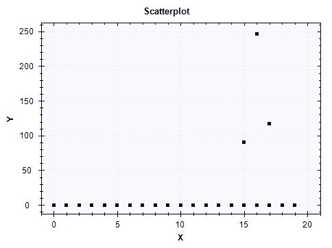
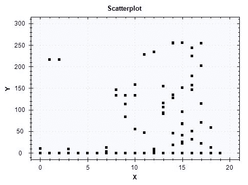
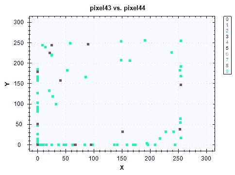
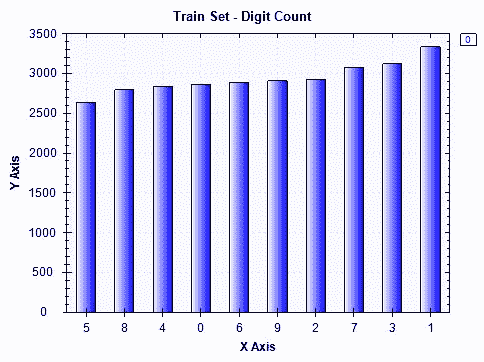
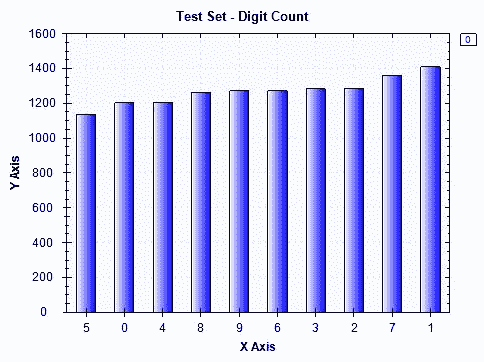
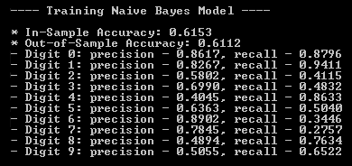
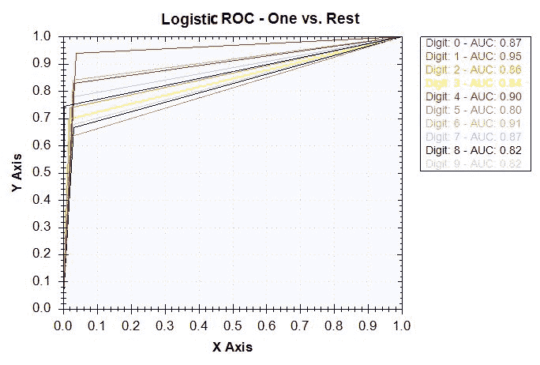
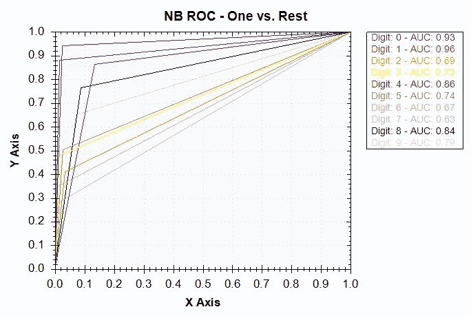
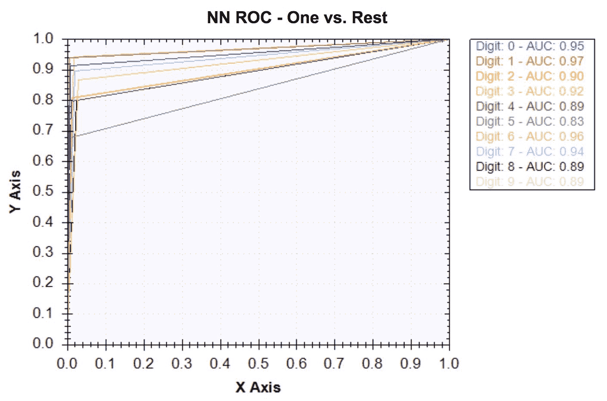

<title>Handwritten Digit Recognition</title> 

# 手写数字识别

我们已经了解了如何使用多类分类模型来构建推荐模型。在本章中，我们将扩展我们在使用影像数据集构建多类分类模型方面的知识和经验。图像识别是一个众所周知的**机器学习** ( **ML** )问题，也是正在积极研究的课题之一。一个对我们的生活具有高度适用性的图像识别问题是识别手写字母和数字。应用手写图像识别系统的一个很好的例子是在邮局使用的地址识别系统。使用这种技术，邮局现在可以更快地自动识别手写的地址，并加快和改善整体邮寄服务。

在这一章中，我们将为手写数字识别建立机器学习模型。我们将从包含超过 40，000 张手写数字图像的逐像素灰度信息的数据集开始。我们将查看每个像素中的值的分布，并讨论这个灰度图像数据集有多稀疏。然后，我们将讨论何时以及如何应用降维技术，更具体地说是**主成分分析** ( **PCA** ，以及我们如何从我们的图像识别项目中受益于这种技术。我们将探索不同的学习算法，如逻辑回归和朴素贝叶斯，还将涵盖如何使用 Accord.NET 框架建立一个**人工神经网络** ( **ANN** )，它构成了深度学习技术的主干。然后，我们将通过查看各种评估度量来比较这些 ML 模型的预测性能，并讨论哪个模型对于手写数字识别项目表现得最好。

在本章中，我们将讨论以下主题:

*   手写数字识别项目的问题定义
*   图像数据集的数据分析
*   特征工程和降维
*   手写数字识别的 ML 模型
*   评估多类分类模型

<title>Problem definition</title> 

# 问题定义

图像识别技术可以应用到我们的日常生活中，并且在日常生活中很容易找到。在邮局，图像识别系统用于以编程方式理解手写的地址。社交网络服务，如脸书，使用图像识别技术自动给人加标签，例如，当你想给照片中的人加标签时。此外，正如本书第一章中简要提到的，微软的 Kinect 将图像识别技术用于其动作感应游戏。在这些现实生活的应用中，我们将尝试建立一个手写数字识别系统。可以想象，这种数字图像识别模型和系统可以用于邮局的自动手写地址识别。在我们有能力教会机器识别和理解手写数字之前，人们必须仔细检查并查看每个字母，以找出每个字母的目的地和来源。然而，现在我们可以训练机器理解手写地址，邮寄过程变得更加容易和快速。

为了建立一个手写数字识别模型，我们将使用 **MNIST** 数据集，它有超过 60，000 个手写数字图像。 **MNIST** 数据集包含 28 x 28 的灰度图像。你可以在这个链接找到更多信息:【http://yann.lecun.com/exdb/mnist/[。对于这个项目，我们将使用一个经过清理和处理的 MNIST 数据集，可以在这个链接找到:](http://yann.lecun.com/exdb/mnist/)[https://www.kaggle.com/c/digit-recognizer/data](https://www.kaggle.com/c/digit-recognizer/data)。有了这些数据，我们将首先了解数字在数据集中的分布情况，以及特征集的稀疏程度。然后，我们将使用主成分分析进行降维，并可视化不同类别之间的特征分布差异。利用这种 PCA 转换的数据，我们将训练几个 ML 模型来比较它们的预测性能。在逻辑回归和朴素贝叶斯分类算法的基础上，我们将对人工神经网络进行实验，因为众所周知它对图像数据集非常有效。我们将考察准确度、精确度与召回率以及曲线 ( **AUC** )下的**面积，以比较不同机器学习模型之间的预测性能。**

总结一下我们对于手写数字识别项目的问题定义:

*   有什么问题？我们需要一个手写数字识别模型，它可以将每个手写图像分类到相应的数字类中，以便它可以用于诸如地址识别系统之类的应用。
*   为什么会有问题？如果没有这样的模型，按照地址识别和组织信件需要大量的人力。如果我们有一种技术可以识别写在字母上的手写数字，它可以大大减少完成同样任务所需的人力。
*   解决这个问题的方法有哪些？我们将使用包含大量手写数字图像示例的公开数据。有了这些数据，我们将建立机器学习模型，可以将每张图像分类为 10 位数字中的一位。
*   成功的标准是什么？我们想要一个机器学习模型，用相应的数字准确地对每张图像进行分类。由于这种模型最终将用于地址识别，我们希望获得高准确率，即使我们不得不牺牲召回率。

<title>Data analysis for the image dataset</title> 

# 图像数据集的数据分析

让我们开始研究这个图像数据集。正如前面提到的，我们将使用来自这个链接的数据:[https://www.kaggle.com/c/digit-recognizer/data](https://www.kaggle.com/c/digit-recognizer/data)。您可以从该链接下载`train.csv`数据，并将其存储在一个您可以将其加载到 C#环境中的地方。

<title>Target variable distribution</title> 

# 目标变量分布

我们首先要看的是目标变量的分布。我们的目标变量编码在`label`列中，它可以取 0 到 9 之间的值，并表示图像所属的数字。以下代码片段显示了我们如何通过目标变量聚合数据，并计算每个数字的示例数:

```
var digitCount = featuresDF.AggregateRowsBy<string, int>(
    new string[] { "label" },
    new string[] { "pixel0" },
    x => x.ValueCount
).SortRows("pixel0");

digitCount.Print();

var barChart = DataBarBox.Show(
    digitCount.GetColumn<string>("label").Values.ToArray(),
    digitCount["pixel0"].Values.ToArray()
).SetTitle(
    "Digit Count"
);
```

和其他章节一样，我们在 Deedle 的数据框架中使用了`AggregateRowsBy`方法，通过目标变量`label`聚集数据，计算每个标签中的记录数，并根据计数进行排序。与前几章相似，我们使用`DataBarBox`类来显示数据集中目标变量分布的条形图。以下是运行此代码时您将看到的条形图:


在控制台输出中，您将看到以下内容:


从柱状图和控制台输出可以看出，数字`1`在数据集中出现的次数最多，而数字`5`出现的次数最少。然而，没有一个类可以处理数据集中的大部分示例，目标变量平衡得很好，分布在不同的类中。

<title>Handwritten digit images</title> 

# 手写数字图像

在我们开始研究这个特性集之前，让我们先来看看手写数字的实际图像。在数据集的每条记录中，28 x 28 的每张图像都有 784 个像素的灰度值。为了从这个展平的数据集构建图像，我们需要首先将每个 784 像素值的数组转换成一个二维数组。以下代码显示了我们编写的帮助器函数，用于从展平数组创建图像:

```
private static void CreateImage(int[] rows, string digit)
{
    int width = 28;
    int height = 28;
    int stride = width * 4;
    int[,] pixelData = new int[width, height];

    for (int i = 0; i < width; ++i)
    {
        for (int j = 0; j < height; ++j)
        {
            byte[] bgra = new byte[] { (byte)rows[28 * i + j], (byte)rows[28 * i + j], (byte)rows[28 * i + j], 255 };
            pixelData[i, j] = BitConverter.ToInt32(bgra, 0);
        }
    }

    Bitmap bitmap;
    unsafe
    {
        fixed (int* ptr = &pixelData[0, 0])
        {
            bitmap = new Bitmap(width, height, stride, PixelFormat.Format32bppRgb, new IntPtr(ptr));
        }
    }
    bitmap.Save(
        String.Format(@"\\Mac\Home\Documents\c-sharp-machine-learning\ch.8\input-data\{0}.jpg", digit)
    );
}
```

从这段代码中可以看出，它首先初始化一个二维整数数组`pixelData`，这个数组将存储像素数据。因为我们知道每个图像都是 28 x 28 的图像，所以我们将取展平数据中的前 28 个像素作为二维整数数组中的第一行，第二组 28 个像素作为第二行，依此类推。在`for`循环中，我们将每个像素的值转换成一个**蓝-绿-红-阿尔法** ( **BGRA** )字节数组，命名为`bgra`。因为我们知道图像是灰度的，所以我们可以对蓝色、绿色和红色分量使用相同的值。一旦我们将展平的像素数据转换成 28×28 的二维整数数组，我们现在就可以构建手写数字图像的图像。我们使用`Bitmap`类来重建这些手写数字图像。下面的代码显示了我们如何使用这个帮助器函数为每个数字构建图像:

```
ISet<string> exportedLabels = new HashSet<string>();
for(int i = 0; i < featuresDF.RowCount; i++)
{
    exportedLabels.Add(featuresDF.Rows[i].GetAs<string>("label"));

    CreateImage(
        featuresDF.Rows[i].ValuesAll.Select(x => (int)x).Where((x, idx) => idx > 0).ToArray(),
        featuresDF.Rows[i].GetAs<string>("label")
    );

    if(exportedLabels.Count() >= 10)
    {
        break;
    }
}
```

当您运行此代码时，您将看到以下图像存储在您的本地驱动器上:


您可以使用相同的代码生成更多的图像，这将有助于您更好地理解手写数字的原始图像是什么样的。

<title>Image features - pixels</title> 

# 图像特征-像素

现在让我们看看图像特征。在我们的数据集中，每个图像中的每个像素都有表示灰度值的整数值。这将有助于了解每个像素可以取值的范围，以及我们是否可以在不同的手写数字类别中找到该像素数据分布的任何显著差异。

我们首先来看看像素数据的个体分布。以下代码片段显示了如何计算数据集中每个像素的四分位数:

```
List<string> featureCols = new List<string>();
foreach (string col in featuresDF.ColumnKeys)
{
    if (featureCols.Count >= 20)
    {
        break;
    }

    if (col.StartsWith("pixel"))
    {
        if (featuresDF[col].Max() > 0)
        {
            featureCols.Add(col);

            Console.WriteLine(String.Format("\n\n-- {0} Distribution -- ", col));
            double[] quantiles = Accord.Statistics.Measures.Quantiles(
                featuresDF[col].ValuesAll.ToArray(),
                new double[] { 0, 0.25, 0.5, 0.75, 1.0 }
            );
            Console.WriteLine(
                "Min: \t\t\t{0:0.00}\nQ1 (25% Percentile): \t{1:0.00}\nQ2 (Median): \t\t{2:0.00}\nQ3 (75% Percentile): \t{3:0.00}\nMax: \t\t\t{4:0.00}",
                quantiles[0], quantiles[1], quantiles[2], quantiles[3], quantiles[4]
            );
        }

    }
}
```

与前几章的情况相似，我们使用了`Accord.Statistics.Measures`中的`Quantiles`方法来获得每个像素的四分位数。您可能还记得前面的章节，四分位数是将数据分成四个部分的值。换句话说，第一个四分位数(`Q1`)代表 25%的百分位数，即最小值和中值的中间点。第二个四分位数(`Q2`)代表中值，第三个四分位数(`Q3`)代表 75%的百分位数，即中值和最大值的中间点。在这个代码示例中，我们只计算值不为 0 的前 20 个像素的四分位数，如第 4-7 行和第 11 行所示。当您运行这段代码时，您将得到如下所示的输出:


这里，我们只显示了前五个分布。从这个输出可以看出，大多数像素值都是 0。如果您查看我们在上一节中重建的图像，图像中的大多数像素是黑色的，只有一部分像素用于显示数字。这些黑色的像素在我们的像素数据中被编码为`0`,因此预期许多像素对于相应的图像具有 0 值。

我们来建立一些散点图，这样可以更直观的理解这个数据。以下代码为每个手写数字构建前 20 个非零像素特征的分布散点图:

```
string[] featureColumns = featureCols.ToArray();

foreach (string label in digitCount.GetColumn<string>("label").Values)
{
    var subfeaturesDF = featuresDF.Rows[
        featuresDF.GetColumn<string>("label").Where(x => x.Value == label).Keys
    ].Columns[featureColumns];

    ScatterplotBox.Show(
        BuildXYPairs(
            subfeaturesDF.Columns[featureColumns].ToArray2D<double>(),
            subfeaturesDF.RowCount,
            subfeaturesDF.ColumnCount
        )
    ).SetTitle(String.Format("Digit: {0} - 20 sample Pixels", label));
}
```

如果仔细观察这段代码，我们首先从`featureCols`、`List`对象构建一个`featureColumns`字符串数组。`List`对象`featureCols`是值不为 0 的前 20 个像素的列表，这是在我们计算四分位数时根据前面的代码构建的。我们使用与前一章相同的辅助函数`BuildXYPairs`，将数据帧转换为 x-y 对的数组，其中`x`值是每个像素的索引，`y`值是实际的像素值。使用这个辅助函数，我们使用`ScatterplotBox`类来显示一个散点图，它显示了 20 个样本像素中每一个的像素分布。

以下是 0 位数的散点图:



对于 0 数字类中的所有图像，前 20 个像素的大部分具有 0 值。在我们在散点图中显示的 20 个像素中，只有三个像素的值不是 0。让我们看看不同数字类别的这些像素的分布。

以下散点图适用于 1 位数类别:


与 0 数字类的情况类似，在我们这里显示的 20 个像素中，大多数像素的值为 0，只有三个像素的值不为 0。与之前 0 位类的散点图相比，1 位类的像素数据分布略有不同。

以下内容适用于 2 位数类别:



这张散点图显示了我们在这里展示的 20 个像素的完全不同的分布。这 20 个像素中的大部分具有范围在 0 和 255 之间的值，只有少数像素对于所有图像具有 0 值。特征集分布的这种差异将帮助我们的 ML 模型学习如何正确分类手写数字。

最后，我们将再看一个散点图，在这里我们将看到目标变量是如何分布在两个不同的像素上的。我们使用以下代码生成一个二维散点图示例:

```
double[][] twoPixels = featuresDF.Columns[
    new string[] { featureColumns[15], featureColumns[16] }
].Rows.Select(
    x => Array.ConvertAll<object, double>(x.Value.ValuesAll.ToArray(), o => Convert.ToDouble(o))
).ValuesAll.ToArray();

ScatterplotBox.Show(
    String.Format("{0} vs. {1}", featureColumns[15], featureColumns[16]), 
    twoPixels,
    featuresDF.GetColumn<int>("label").Values.ToArray()
);
```

为了便于说明，我们选择了第十五个和第十六个索引特征，结果是`pixel43`和`pixel44`。运行此代码时，您将看到以下散点图:



我们可以看到不同类别之间的一些区别，但是由于`pixel43`和`pixel44`的大多数像素值都是 0，所以通过查看这个散点图很难在不同的目标类别之间画出清晰的区别。在下一节中，我们将了解如何使用 PCA 及其主要成分来创建此散点图的另一个版本，它可以帮助我们在可视化数据时更清楚地区分不同的目标类。

这个数据分析步骤的完整代码可以在这个链接找到:[https://github . com/Yoon hwang/c-sharp-machine-learning/blob/master/ch . 8/data analyzer . cs](https://github.com/yoonhwang/c-sharp-machine-learning/blob/master/ch.8/DataAnalyzer.cs)。

<title>Feature engineering and dimensionality reduction</title> 

# 特征工程和降维

到目前为止，我们已经查看了目标变量和像素数据的分布。在本节中，我们将开始讨论为 ML 建模步骤构建训练集和测试集，然后讨论如何使用 PCA 进行降维，并使用主成分可视化数据。

<title>Splitting the sample set into train versus test sets</title> 

# 将样本集分为训练集和测试集

在这一步中，我们要做的第一项任务是将数据集随机分为训练集和测试集。让我们先来看看代码:

```
double trainSetProportiona = 0.7;

var rnd = new Random();
var trainIdx = featuresDF.RowKeys.Where((x, i) => rnd.NextDouble() <= trainSetProportiona);
var testIdx = featuresDF.RowKeys.Where((x, i) => !trainIdx.Contains(i));

var trainset = featuresDF.Rows[trainIdx];
var testset = featuresDF.Rows[testIdx];

var trainLabels = trainset.GetColumn<int>("label").Values.ToArray();

string[] nonZeroPixelCols = trainset.ColumnKeys.Where(x => trainset[x].Max() > 0 && !x.Equals("label")).ToArray();

double[][] data = trainset.Columns[nonZeroPixelCols].Rows.Select(
    x => Array.ConvertAll<object, double>(x.Value.ValuesAll.ToArray(), o => Convert.ToDouble(o))
).ValuesAll.ToArray();
```

从前面的代码中可以看出，我们将大约 70%的数据用于训练，其余的用于测试。这里，我们使用`Random`类生成随机数，使用记录的索引将样本集分成训练集和测试集。一旦我们建立了训练集和测试集，我们将删除所有图像中值为 0 的列或像素(第 12 行)。这是因为如果一个特性在不同的目标类之间没有变化，它就没有任何关于这些目标类的信息供 ML 模型学习。

现在我们有了训练集和测试集，让我们检查一下目标类在训练集和测试集中的分布。以下代码可用于聚合:

```
var digitCount = trainset.AggregateRowsBy<string, int>(
    new string[] { "label" },
    new string[] { "pixel0" },
    x => x.ValueCount
).SortRows("pixel0");

digitCount.Print();

var barChart = DataBarBox.Show(
    digitCount.GetColumn<string>("label").Values.ToArray(),
    digitCount["pixel0"].Values.ToArray()
).SetTitle(
    "Train Set - Digit Count"
);

digitCount = testset.AggregateRowsBy<string, int>(
    new string[] { "label" },
    new string[] { "pixel0" },
    x => x.ValueCount
).SortRows("pixel0");

digitCount.Print();

barChart = DataBarBox.Show(
    digitCount.GetColumn<string>("label").Values.ToArray(),
    digitCount["pixel0"].Values.ToArray()
).SetTitle(
    "Test Set - Digit Count"
);
```

运行此代码时，您将看到训练集中目标变量分布的如下图:



下面是我们在测试集中看到的内容:



这些分布看起来与我们在数据分析步骤中看到的相似，当时我们分析了整个数据集中的目标变量分布。现在让我们开始讨论如何将 PCA 应用于我们的训练集。

<title>Dimensionality reduction by PCA</title> 

# 主成分分析降维

当我们分析数据时，我们看到我们的许多特征或像素值都是 0。在这种情况下，应用主成分分析有助于降低数据的维数，同时最大限度地减少维数降低后的信息损失。简而言之，PCA 用于通过原始特征的线性组合来解释数据集及其结构。所以，每个主成分都是这些特征的线性组合。让我们开始看看如何使用 Accord.NET 框架在 C#中运行 PCA。

以下是初始化和训练 PCA 的方法:

```
var pca = new PrincipalComponentAnalysis(
    PrincipalComponentMethod.Standardize
);
pca.Learn(data);
```

一旦用数据训练了一个`PrincipalComponentAnalysis`,它就包含了关于每个主成分的线性组合的所有信息，并可用于转换其他数据。在应用 PCA 之前，我们使用`PrincipalComponentMethod.Standardize`来标准化我们的数据。这是因为 PCA 对每个特征的尺度很敏感。因此，我们希望在应用 PCA 之前标准化我们的数据集。

为了对其他数据进行 PCA 转换，可以使用`Transform`方法，如下面的代码片段所示:

```
double[][] transformed = pca.Transform(data);
```

既然我们已经了解了如何将 PCA 应用于我们的数据集，让我们来看看前两个主成分，看看我们是否可以在目标变量分布中找到任何值得注意的模式。下面的代码显示了我们如何使用颜色编码的目标类构建前两个组件的散点图:

```
double[][] first2Components = transformed.Select(x => x.Where((y, i) => i < 2).ToArray()).ToArray();

ScatterplotBox.Show("Component #1 vs. Component #2", first2Components, trainLabels);
```

运行此代码后，您将看到以下散点图:


当您将此图表与我们在数据分析步骤中查看的`pixel43`和`pixel44`之间的图表进行比较时，这看起来非常不同。从前两个主成分的散点图中，我们可以看到目标类更容易辨别。尽管它与这两个组件并不完全分离，但我们可以看到，如果我们将更多的组件结合到我们的分析和建模中，将一个目标类与另一个目标类分离将变得更加容易。

主成分分析的另一个重要方面是每个主成分解释的方差。让我们来看看下面的代码:

```
DataSeriesBox.Show(
    pca.Components.Select((x, i) => (double)i),
    pca.Components.Select(x => x.CumulativeProportion)
).SetTitle("Explained Variance");

System.IO.File.WriteAllLines(
    Path.Combine(dataDirPath, "explained-variance.csv"),
    pca.Components.Select((x, i) => String.Format("{0},{1:0.0000}", i, x.CumulativeProportion))
);
```

我们可以通过使用`CumulativeProportion`属性来检索由每个 PCA 成分解释的数据中方差的累积比例。为了得到每个 PCA 分量解释的个体比例，可以使用每个 PCA 分量的`Proportion`属性。然后，我们将使用`DataSeriesBox`类来绘制一个折线图，以显示由每个组件解释的方差的累积比例。

当你运行这段代码时，它会产生如下的情节:


从这个图中可以看出，数据集中大约 90%的差异可以用前 200 个成分来解释。有了 600 个组件，我们可以解释我们数据集中几乎 100%的差异。与原始数据集中作为特征的总共 784 个像素相比，这大大减少了数据的维度。根据您想要为您的 ML 模型获取多少差异，您可以使用此图表来决定最适合您的建模过程的组件数量。

最后，我们需要导出训练集和测试集，以便我们可以在接下来的模型构建步骤中使用它们。您可以使用以下代码导出 PCA 转换的训练集和测试集:

```
Console.WriteLine("exporting train set...");
var trainTransformed = pca.Transform(
    trainset.Columns[nonZeroPixelCols].Rows.Select(
        x => Array.ConvertAll<object, double>(x.Value.ValuesAll.ToArray(), o => Convert.ToDouble(o))
    ).ValuesAll.ToArray()
);

System.IO.File.WriteAllLines(
    Path.Combine(dataDirPath, "pca-train.csv"),
    trainTransformed.Select((x, i) => String.Format("{0},{1}", String.Join(",", x), trainset["label"].GetAt(i)))
);

Console.WriteLine("exporting test set...");
var testTransformed = pca.Transform(
    testset.Columns[nonZeroPixelCols].Rows.Select(
        x => Array.ConvertAll<object, double>(x.Value.ValuesAll.ToArray(), o => Convert.ToDouble(o))
    ).ValuesAll.ToArray()
);
System.IO.File.WriteAllLines(
    Path.Combine(dataDirPath, "pca-test.csv"),
    testTransformed.Select((x, i) => String.Format("{0},{1}", String.Join(",", x), testset["label"].GetAt(i)))
);
```

这个特征工程和降维步骤的完整代码可以在这个链接找到:[https://github . com/Yoon hwang/c-sharp-machine-learning/blob/master/ch . 8/feature engineering . cs](https://github.com/yoonhwang/c-sharp-machine-learning/blob/master/ch.8/FeatureEngineering.cs)。

<title>ML models for handwritten digit recognition</title> 

# 手写数字识别的 ML 模型

现在我们已经为构建 ML 模型做好了一切准备，让我们开始构建这些模型。在本节中，我们将介绍如何基于 PCA 结果对特征进行子选择，然后讨论如何为手写数字识别模型构建逻辑回归和朴素贝叶斯分类器。我们将介绍一个新的学习模型，神经网络，并解释如何使用 Accord.NET 框架为这个项目建立一个。

<title>Loading data</title> 

# 加载数据

为手写数字识别构建 ML 模型的第一步是加载我们在上一节中构建的数据。您可以使用下面的代码来加载我们之前创建的训练集和测试集:

```
// Load the data into a data frame
string trainDataPath = Path.Combine(dataDirPath, "pca-train.csv");
Console.WriteLine("Loading {0}\n\n", trainDataPath);
var trainDF = Frame.ReadCsv(
    trainDataPath,
    hasHeaders: false,
    inferTypes: true
);

string testDataPath = Path.Combine(dataDirPath, "pca-test.csv");
Console.WriteLine("Loading {0}\n\n", testDataPath);
var testDF = Frame.ReadCsv(
    testDataPath,
    hasHeaders: false,
    inferTypes: true
);

string[] colnames = trainDF.ColumnKeys.Select(
    (x, i) => i < trainDF.ColumnKeys.Count() - 1 ? String.Format("component-{0}", i + 1) : "label"
).ToArray();

trainDF.RenameColumns(colnames);
testDF.RenameColumns(colnames);
```

对于本章中我们对不同模型的实验，我们将使用主成分来累计解释我们数据集中约 70%的方差。看看下面的代码，看看我们是如何筛选出我们感兴趣的组件的:

```
// Capturing 70% of the variance
string[] featureCols = colnames.Where((x, i) => i <= 90).ToArray();

double[][] trainInput = BuildJaggedArray(
    trainDF.Columns[featureCols].ToArray2D<double>(), trainDF.RowCount, featureCols.Length
);
int[] trainOutput = trainDF.GetColumn<int>("label").ValuesAll.ToArray();

double[][] testInput = BuildJaggedArray(
    testDF.Columns[featureCols].ToArray2D<double>(), testDF.RowCount, featureCols.Length
);
int[] testOutput = testDF.GetColumn<int>("label").ValuesAll.ToArray();
```

正如您在代码的第一行所看到的，我们将前 91 个组件(直到第 90 个索引)作为我们模型的特性。如果您回忆一下上一步，或者查看由组件解释的累积方差比例图，您将会看到前 91 个组件捕获了我们数据集中大约 70%的方差。然后，我们创建一个二维 doubles 数组，用于训练和测试我们的 ML 模型。下面的代码展示了我们编写的助手函数`BuildJaggedArray`，用于将数据帧转换为二维数组:

```
private static double[][] BuildJaggedArray(double[,] ary2d, int rowCount, int colCount)
{
    double[][] matrix = new double[rowCount][];
    for(int i = 0; i < rowCount; i++)
    {
        matrix[i] = new double[colCount];
        for(int j = 0; j < colCount; j++)
        {
            matrix[i][j] = double.IsNaN(ary2d[i, j]) ? 0.0 : ary2d[i, j];
        }
    }
    return matrix;
}
```

<title>Logistic regression classifier</title> 

# 逻辑回归分类器

我们将要试验的用于手写数字识别的第一个学习算法是逻辑回归。我们编写了一个名为`BuildLogitModel`的方法，它接受模型的输入和输出，训练一个逻辑回归分类器，然后评估性能。下面的代码显示了如何编写此方法:

```
private static void BuildLogitModel(double[][] trainInput, int[] trainOutput, double[][] testInput, int[] testOutput)
{
    var logit = new MultinomialLogisticLearning<GradientDescent>()
    {
        MiniBatchSize = 500
    };
    var logitModel = logit.Learn(trainInput, trainOutput);

    int[] inSamplePreds = logitModel.Decide(trainInput);
    int[] outSamplePreds = logitModel.Decide(testInput);

    // Accuracy
    double inSampleAccuracy = 1 - new ZeroOneLoss(trainOutput).Loss(inSamplePreds);
    double outSampleAccuracy = 1 - new ZeroOneLoss(testOutput).Loss(outSamplePreds);
    Console.WriteLine("* In-Sample Accuracy: {0:0.0000}", inSampleAccuracy);
    Console.WriteLine("* Out-of-Sample Accuracy: {0:0.0000}", outSampleAccuracy);

    // Build confusion matrix
    int[][] confMatrix = BuildConfusionMatrix(
        testOutput, outSamplePreds, 10
    );
    System.IO.File.WriteAllLines(
        Path.Combine(
            @"<path-to-dir>", 
            "logit-conf-matrix.csv"
        ),
        confMatrix.Select(x => String.Join(",", x))
    );

    // Precision Recall
    PrintPrecisionRecall(confMatrix);
    DrawROCCurve(testOutput, outSamplePreds, 10, "Logit");
}
```

与前一章相似，我们使用`MultinomialLogisticLearning`类来训练一个逻辑回归分类器。一旦该模型被训练，我们就开始通过各种评估指标进行评估，我们将在下一节中更详细地讨论这些评估指标。

<title>Naive Bayes classifier</title> 

# 朴素贝叶斯分类器

我们要试验的第二个模型是朴素贝叶斯分类器。与前面涉及逻辑回归分类器的情况类似，我们编写了一个助手函数`BuildNBModel`，它接受输入和输出，训练一个朴素贝叶斯分类器，然后评估训练好的模型。代码如下所示:

```
private static void BuildNBModel(double[][] trainInput, int[] trainOutput, double[][] testInput, int[] testOutput)
{
    var teacher = new NaiveBayesLearning<NormalDistribution>();
    var nbModel = teacher.Learn(trainInput, trainOutput);

    int[] inSamplePreds = nbModel.Decide(trainInput);
    int[] outSamplePreds = nbModel.Decide(testInput);

    // Accuracy
    double inSampleAccuracy = 1 - new ZeroOneLoss(trainOutput).Loss(inSamplePreds);
    double outSampleAccuracy = 1 - new ZeroOneLoss(testOutput).Loss(outSamplePreds);
    Console.WriteLine("* In-Sample Accuracy: {0:0.0000}", inSampleAccuracy);
    Console.WriteLine("* Out-of-Sample Accuracy: {0:0.0000}", outSampleAccuracy);

    // Build confusion matrix
    int[][] confMatrix = BuildConfusionMatrix(
        testOutput, outSamplePreds, 10
    );
    System.IO.File.WriteAllLines(
        Path.Combine(
            @"<path-to-dir>",
            "nb-conf-matrix.csv"
        ),
        confMatrix.Select(x => String.Join(",", x))
    );

    // Precision Recall
    PrintPrecisionRecall(confMatrix);
    DrawROCCurve(testOutput, outSamplePreds, 10, "NB");
}
```

您可能还记得上一章，我们正在使用`NaiveBayesLearning`类来训练一个朴素贝叶斯分类器。我们使用`NormalDistribution`，因为我们的 ML 模型的所有特征都是来自前面 PCA 步骤的主要成分，并且这些成分的值是连续值。

<title>Neural network classifier</title> 

# 神经网络分类器

我们要试验的最后一个学习算法是人工神经网络。正如你可能已经知道的，神经网络模型是所有深度学习技术的支柱。众所周知，神经网络模型对影像数据集的性能很好，因此我们将比较此模型与其他模型的性能，以了解与其他分类模型相比，使用神经网络可以获得多大的性能提升。为了使用 Accord.NET 框架在 C#中构建神经网络模型，您需要首先安装`Accord.Neuro`包。您可以在 **NuGet 软件包管理器控制台**中使用以下命令安装`Accord.Neuro`软件包:

```
Install-Package Accord.Neuro
```

现在，让我们来看看如何使用 Accord.NET 框架，用 C#构建一个神经网络模型。代码如下所示:

```
private static void BuildNNModel(double[][] trainInput, int[] trainOutput, double[][] testInput, int[] testOutput)
{
    double[][] outputs = Accord.Math.Jagged.OneHot(trainOutput);

    var function = new BipolarSigmoidFunction(2);
    var network = new ActivationNetwork(
        new BipolarSigmoidFunction(2), 
        91, 
        20,
        10
    );

    var teacher = new LevenbergMarquardtLearning(network);

    Console.WriteLine("\n-- Training Neural Network");
    int numEpoch = 10;
    double error = Double.PositiveInfinity;
    for (int i = 0; i < numEpoch; i++)
    {
        error = teacher.RunEpoch(trainInput, outputs);
        Console.WriteLine("* Epoch {0} - error: {1:0.0000}", i + 1, error);
    }
    Console.WriteLine("");

    List<int> inSamplePredsList = new List<int>();
    for (int i = 0; i < trainInput.Length; i++)
    {
        double[] output = network.Compute(trainInput[i]);
        int pred = output.ToList().IndexOf(output.Max());
        inSamplePredsList.Add(pred);
    }

    List<int> outSamplePredsList = new List<int>();
    for (int i = 0; i < testInput.Length; i++)
    {
        double[] output = network.Compute(testInput[i]);
        int pred = output.ToList().IndexOf(output.Max());
        outSamplePredsList.Add(pred);
    }
}
```

让我们仔细看看这段代码。我们首先将训练标签从一维数组转换为二维数组，其中列是目标类，如果给定的记录属于给定的目标类，则值为 1，否则为 0。我们使用`Accord.Math.Jagged.OneHot`方法对训练标签进行一次性编码。然后，我们通过使用`ActivationNetwork`类构建一个神经网络。`ActivationNetwork`类有三个参数:激活函数、输入计数和关于层的信息。对于激活函数，我们使用一个 sigmoid 函数，`BipolarSigmoidFunction`。输入计数很简单，因为它是我们将用来训练该模型的特征的数量，即 91。对于这个模型，我们只用了一个有 20 个神经元的隐藏层。对于更深层次的神经网络，您可以使用多个隐藏层，也可以在每个隐藏层中试验不同数量的神经元。最后，`ActivationNetwork`构造函数的最后一个参数表示输出计数。由于目标变量是 digit 类，它可以取 0 到 9 之间的值，因此我们需要的输出神经元的数量是 10。一旦建立了这个网络，我们就可以使用`LevenbergMarquardtLearning`学习算法来训练网络。

一旦我们建立了网络和学习算法，我们就可以开始训练神经网络模型了。正如您可能已经知道的，神经网络模型需要在其学习阶段通过数据集运行多次(历元),以获得更好的可预测性。你可以用`RunEpoch`的方法在每个历元训练和更新神经网络模型。为了节省时间，我们只运行 10 个时期来训练我们的神经网络模型。但是，我们建议您尝试增加该值，因为它可以提高神经网络模型的性能。下面示出了当我们在每个时期中训练和更新神经网络模型时，误差测量如何减小:


从这个输出可以看出，误差测量在每个时期都显著降低。这里要注意的一点是，误差测量的减少量在每个额外的时期中减少。当您建立具有大量时期的类神经网路模型时，您可以监视每次执行的增益量，并决定在没有更显著的效能增益时停止执行。

我们用于模型构建步骤的完整代码可以在以下链接中找到:[https://github . com/Yoon hwang/c-sharp-machine-learning/blob/master/ch . 8/modeling . cs](https://github.com/yoonhwang/c-sharp-machine-learning/blob/master/ch.8/Modeling.cs)。

<title>Evaluating multi-class classification models</title> 

# 评估多类分类模型

在本节中，我们将评估我们在上一节中构建的三个模型。我们将重新审视之前用于分类模型的验证指标，并将每个模型的性能与其他模型进行比较。

<title>Confusion matrices</title> 

# 混淆矩阵

首先，让我们看看混淆矩阵。以下代码显示了如何使用预测输出和实际输出构建混淆矩阵:

```
private static int[][] BuildConfusionMatrix(int[] actual, int[] preds, int numClass)
{
    int[][] matrix = new int[numClass][];
    for (int i = 0; i < numClass; i++)
    {
        matrix[i] = new int[numClass];
    }

    for (int i = 0; i < actual.Length; i++)
    {
        matrix[actual[i]][preds[i]] += 1;
    }

    return matrix;
}
```

这个方法类似于我们在上一章写的方法，除了它返回一个二维数组，而不是一个字符串数组。在下一节中，我们将使用这个二维数组输出来计算精度和召回率。

逻辑回归分类器的混淆矩阵如下所示:


对于朴素贝叶斯分类器，您将获得类似于下表的混淆矩阵:


最后，对于神经网络模型，混淆矩阵如下所示:


从这些混淆矩阵来看，神经网络模型优于其他两个模型，逻辑回归模型似乎排在第二位。

<title>Accuracy and precision/recall</title> 

# 准确度和精确度/召回率

我们要看的第二个指标是精确度。我们使用`ZeroOneLoss`来计算损失，然后从`1`中减去损失，得到精确值。计算精度度量的代码如下:

```
// Accuracy
double inSampleAccuracy = 1 - new ZeroOneLoss(trainOutput).Loss(inSamplePreds);
double outSampleAccuracy = 1 - new ZeroOneLoss(testOutput).Loss(outSamplePreds);
Console.WriteLine("* In-Sample Accuracy: {0:0.0000}", inSampleAccuracy);
Console.WriteLine("* Out-of-Sample Accuracy: {0:0.0000}", outSampleAccuracy);
```

我们要考察的第三和第四个指标是准确率和召回率。与以前不同，我们有 10 个目标预测类。因此，我们需要分别计算每个目标类的准确率和召回率。代码如下所示:

```
private static void PrintPrecisionRecall(int[][] confMatrix)
{
    for (int i = 0; i < confMatrix.Length; i++)
    {
        int totalActual = confMatrix[i].Sum();
        int correctPredCount = confMatrix[i][i];

        int totalPred = 0;
        for(int j = 0; j < confMatrix.Length; j++)
        {
            totalPred += confMatrix[j][i];
        }

        double precision = correctPredCount / (float)totalPred;
        double recall = correctPredCount / (float)totalActual;

        Console.WriteLine("- Digit {0}: precision - {1:0.0000}, recall - {2:0.0000}", i, precision, recall);
    }

}
```

正如您从这段代码中看到的，这个`PrintPrecisionRecall`方法的输入是我们从上一节构建的混淆矩阵。在这个方法中，它遍历每个目标类，并计算精度和召回率。

以下是我们在计算逻辑回归模型的准确度、精确度和召回率时得到的输出:


对于朴素贝叶斯模型，我们得到以下度量结果:



最后，对于神经网络模型，性能结果如下所示:


从这些结果中您可能会注意到，神经网络模型优于其他两个模型。与逻辑回归和朴素贝叶斯模型相比，神经网络模型的总体准确性和精确度/召回率都是最高的。逻辑回归模型似乎是我们建立的三个模型中第二好的模型。

<title>One versus Rest AUC</title> 

# 一对其余 AUC

我们要看的最后一个评估指标是**受试者工作特征** ( **ROC** )曲线和 AUC。在本章中，当我们构建 ROC 曲线和 AUC 时，我们需要做的一件不同的事情是，我们需要为每个目标类构建一个 ROC 曲线和 AUC。让我们先来看看代码:

```
private static void DrawROCCurve(int[] actual, int[] preds, int numClass, string modelName)
{
    ScatterplotView spv = new ScatterplotView();
    spv.Dock = DockStyle.Fill;
    spv.LinesVisible = true;

    Color[] colors = new Color[] {
        Color.Blue, Color.Red, Color.Orange, Color.Yellow, Color.Green,
        Color.Gray, Color.LightSalmon, Color.LightSkyBlue, Color.Black, Color.Pink
    };

    for (int i = 0; i < numClass; i++)
    {
        // Build ROC for Train Set
        bool[] expected = actual.Select(x => x == i ? true : false).ToArray();
        int[] predicted = preds.Select(x => x == i ? 1 : 0).ToArray();

        var trainRoc = new ReceiverOperatingCharacteristic(expected, predicted);
        trainRoc.Compute(1000);

        // Get Train AUC
        double auc = trainRoc.Area;
        double[] xVals = trainRoc.Points.Select(x => 1 - x.Specificity).ToArray();
        double[] yVals = trainRoc.Points.Select(x => x.Sensitivity).ToArray();

        // Draw ROC Curve
        spv.Graph.GraphPane.AddCurve(
            String.Format(
                "Digit: {0} - AUC: {1:0.00}",
                i, auc
            ),
            xVals, yVals, colors[i], SymbolType.None
        );
        spv.Graph.GraphPane.AxisChange();
    }

    spv.Graph.GraphPane.Title.Text = String.Format(
        "{0} ROC - One vs. Rest",
        modelName
    );

    Form f1 = new Form();
    f1.Width = 700;
    f1.Height = 500;
    f1.Controls.Add(spv);
    f1.ShowDialog();
}
```

正如您从我们编写的这个`DrawROCCurve`方法中看到的，我们在一个`for`循环中遍历每个目标类，如果每个标签与目标类匹配，通过编码`1`重新格式化预测和实际标签，如果不匹配，则为 0。完成编码后，我们可以使用`ReceiverOperatingCharacteristic`类来计算 AUC 并构建 ROC 曲线。

以下是逻辑回归模型的 ROC 曲线:



对于朴素贝叶斯模型，ROC 曲线如下所示:



最后，神经网络模型的 ROC 曲线如下所示:



正如我们之前看到的指标所预期的那样，神经网络模型的结果看起来最好，逻辑回归模型次之。对于朴素贝叶斯模型，有一些数字它没有计算好。例如，朴素贝叶斯模型很难很好地分类数字 6 和 7。然而，对于神经网络，所有目标类的 AUC 数都接近 1，这表明该模型被很好地训练以识别手写图像的数字。

通过查看混淆矩阵、准确度、精确度和召回率以及 ROC 曲线，我们可以得出结论，在本章训练的三个分类器中，神经网络模型的效果最好。这再次证实了神经网络在图像数据集和图像识别问题上工作良好的事实。

<title>Summary</title> 

# 摘要

在这一章中，我们建立了第一个图像识别模型，可以识别灰度图像中的手写数字。本章一开始，我们讨论了这种类型的模型如何在现实生活中广泛使用，以及我们计划如何构建一个手写数字识别模型。然后，我们开始研究数据集。我们首先查看目标类的分布，看看样本集是否是一个平衡的集合。当我们分析像素数据时，我们注意到大多数像素值为 0，我们可以通过从像素数据重建图像来直观地理解它。在特征工程步骤中，我们讨论了如何使用 PCA 进行降维。

有了这些 PCA 转换的特征，我们就开始构建各种机器学习模型。在我们已经熟悉的逻辑回归和朴素贝叶斯模型之上，我们引入了一个新的 ML 模型，神经网络。我们学习了如何用`BipolarSigmoidFunction`作为激活函数来初始化`ActivationNetwork`模型。然后，我们开始用`LevenbergMarquardtLearning`学习算法在 10 个时期内训练神经网络。我们看到了误差度量如何在每个额外的时期中减少，并讨论了误差率的增加量如何在额外的时期中减少收益。在模型评估步骤中，我们为分类模型组合了多个验证指标。对于我们在本章中建立的机器学习模型，我们查看了混淆矩阵、预测准确度、精确度和召回率，以及 ROC 曲线和 AUC。我们注意到神经网络模型如何优于其他两个模型，这再次证实了神经网络模型对于图像数据工作良好。

在下一章中，我们将改变思路，开始构建异常检测模型。我们将使用 PCA 进行网络攻击检测项目。通过网络入侵数据集，我们将讨论如何使用 PCA 来检测网络攻击，并运行多个实验来找到通知我们潜在网络攻击的最佳阈值。