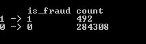
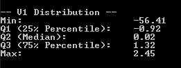
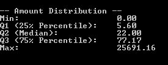
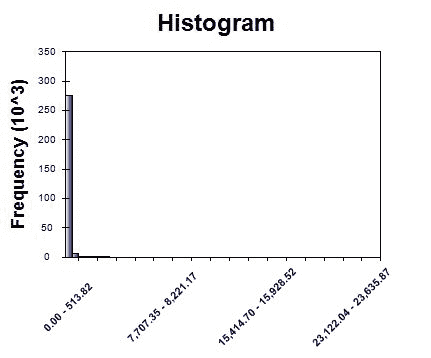
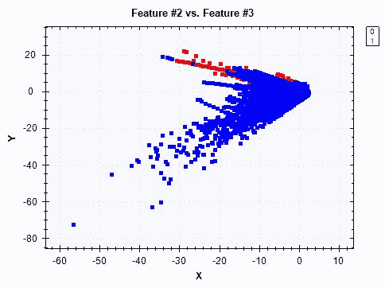
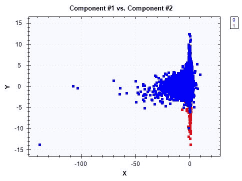
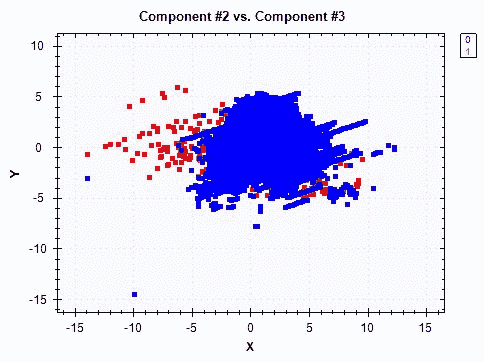
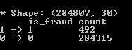
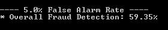

# 十、信用卡欺诈检测

在前一章中，我们使用**主成分分析** ( **PCA** )构建了第一个异常检测模型，并了解了如何使用主成分检测网络攻击。与网络攻击或网络入侵问题类似，异常检测模型经常用于欺诈检测。许多行业中的各种组织，如金融服务、保险公司和政府机构，经常会遇到欺诈案件。特别是在金融领域，欺诈与金钱损失直接相关，这些欺诈案件可能以多种不同的形式出现，如被盗信用卡、伪造会计账目或伪造支票。因为这些事件相对很少发生，所以很难发现这些欺诈案件。

在本章中，我们将讨论如何为信用卡欺诈检测建立一个异常检测模型。我们将使用一个匿名的信用卡数据集，其中包含大部分正常的信用卡交易和相对较少的欺诈性信用卡交易。我们将首先查看数据集的结构、目标类的分布以及各种匿名化特征的分布。然后，我们将开始应用 PCA 并构建标准化的主成分，这些主成分将用作我们欺诈检测模型的特征。在模型构建步骤中，我们将尝试两种不同的方法来构建欺诈检测模型——与我们在《T4》第九章、*网络攻击检测*中构建的方法类似的**主成分分类器** ( **PCC** ，以及从正常信用卡交易中学习并检测任何异常的单类**支持向量机** ( **SVM** )。随着这些模型的建立，我们将评估它们的异常检测率，并比较它们对信用卡欺诈检测的性能。

在本章中，我们将讨论以下主题:

*   信用卡欺诈检测项目的问题定义
*   匿名信用卡数据集的数据分析
*   特征工程和 PCA
*   一级 SVM 对 PCC
*   评估异常检测模型


# 问题定义

信用卡诈骗是其他诈骗事件中比较常见的，在我们的日常生活中也会发生。信用卡诈骗有多种方式。信用卡可能会丢失或被盗，然后被小偷使用。另一种可能发生信用卡欺诈的方式是，您的身份可能已经暴露给恶意的人，然后他们使用您的身份开设一个新的信用卡帐户，甚至接管您现有的信用卡帐户。骗子甚至可以利用电话钓鱼进行信用卡诈骗。由于信用卡欺诈有多种可能发生的方式，许多信用卡持有人都面临这种类型的欺诈风险，因此在我们的日常生活中，采取适当的方式来防止欺诈已经变得至关重要。许多信用卡公司采用各种措施来防止和检测这些类型的欺诈活动，使用各种**机器学习** ( **ML** )和异常检测技术。

在本章中，我们将通过使用和扩展我们关于构建异常检测模型的知识来构建一个信用卡欺诈检测模型。我们将使用匿名的信用卡数据集，可在以下链接找到:[https://www.kaggle.com/mlg-ulb/creditcardfraud/data](https://www.kaggle.com/mlg-ulb/creditcardfraud/data)。这个数据集有大约 285，000 笔信用卡交易，其中只有大约 0.17%的交易是欺诈交易，这很好地反映了现实生活中的一种情况。有了这些数据，我们将了解数据集的结构，然后开始了解目标和特征变量的分布。然后，我们将使用 PCA 构建特征，类似于我们在[第 9 章](part0116.html#3EK180-5ebdf09927b7492888e31e8436526470)、*网络攻击检测*中所做的。为了构建信用卡欺诈检测模型，我们将对 PCC(类似于我们在第 9 章、*网络攻击检测*中构建的 PCC)和单类 SVM 进行实验，后者从正常的信用卡交易中学习并决定新交易是否欺诈。最后，我们将考察误报率和欺诈检测率，以评估和比较这些模型的性能。

总结一下我们对信用卡欺诈检测项目的问题定义:

*   有什么问题？我们需要一个针对欺诈性信用卡交易的异常检测模型，它可以识别、预防和阻止潜在的欺诈性信用卡活动。
*   为什么会有问题？每个信用卡持有人都面临着成为信用卡欺诈受害者的风险，如果没有为这种恶意企图做好准备，信用卡欺诈受害者的数量将会增加。通过信用卡欺诈检测模型，我们可以预防和阻止潜在的欺诈性信用卡交易的发生。
*   解决这个问题的方法有哪些？我们将使用公开的匿名信用卡数据，这些数据包含大量正常的信用卡交易和少量欺诈交易。我们将对这些数据应用主成分分析，并用主成分分析和单类 SVM 模型进行欺诈检测实验。
*   成功的标准是什么？因为任何信用卡欺诈事件都会导致金钱损失，所以我们需要高欺诈检测率。即使有一些假阳性或假警报，最好标记任何可疑的信用卡活动，以防止任何欺诈交易通过。


# 匿名信用卡数据的数据分析

现在让我们开始查看信用卡数据集。如前所述，我们将使用可从以下链接获得的数据集:[https://www.kaggle.com/mlg-ulb/creditcardfraud/data](https://www.kaggle.com/mlg-ulb/creditcardfraud/data)。这是一个包含大约 285，000 条信用卡交易记录的数据集，其中一些是欺诈交易，大多数记录是正常的信用卡交易。由于保密性问题，数据集中的要素名称被匿名化。我们将使用`creditcard.csv`文件，可以通过链接下载。


# 目标变量分布

我们要检查的第一件事是欺诈性和非欺诈性信用卡交易在数据集中的分布。在数据集中，名为`Class`的列是目标变量，对于欺诈性信用卡交易用`1`编码，对于非欺诈性交易用`0`编码。您可以使用以下代码首先将数据加载到 Deedle 数据框中:

```py
// Read in the Credit Card Fraud dataset
// TODO: change the path to point to your data directory
string dataDirPath = @"<path-to-your-dir>";

// Load the data into a data frame
string dataPath = Path.Combine(dataDirPath, "creditcard.csv");
Console.WriteLine("Loading {0}\n\n", dataPath);
var df = Frame.ReadCsv(
    dataPath,
    hasHeaders: true,
    inferTypes: true
);
```

这个数据集有表示每个特性和目标类的头，所以我们用`hasHeaders: true`标志加载这个数据。现在我们已经加载了数据，您可以使用下面的代码来分析目标类的分布:

```py
// Target variable distribution
var targetVarCount = df.AggregateRowsBy<string, int>(
    new string[] { "Class" },
    new string[] { "V1" },
    x => x.ValueCount
).SortRows("V1");
targetVarCount.RenameColumns(new string[] { "is_fraud", "count" });

targetVarCount.Print();

DataBarBox.Show(
    targetVarCount.GetColumn<string>("is_fraud").Values.ToArray(),
    targetVarCount["count"].Values.ToArray()
).SetTitle(
    "Counts by Target Class"
);
```

您可能已经熟悉了这个函数，我们正在 Deedle 数据框中使用`AggregateRowsBy`函数按列`Class`对行进行分组，然后计算每个目标类中的记录数。由于列名`Class`不能很好地代表我们的目标类是什么以及它的含义，我们用另一个名称`is_fraud`对其进行了重命名。从这段代码中可以看出，可以使用带有新列名字符串数组的`RenameColumns`函数来重命名特征名。最后，我们使用 Accord.NET 框架中的`DataBarBox`类来显示条形图，直观地显示目标类的分布。

以下输出显示了目标类的分布:



从这个输出可以看出，欺诈性信用卡交易的数量和非欺诈性信用卡交易的数量之间有很大的差距。我们只有 492 条欺诈记录和超过 284，000 条非欺诈记录。

下面是代码生成的条形图，用于直观显示目标类的分布:


正如前面的输出所预期的，属于目标类的记录数 **1** 代表欺诈，属于目标类的记录数 **0** 代表非欺诈和正常的信用卡交易，两者之间有很大的差距。这种巨大的差距是意料之中的，因为与大量正常的日常信用卡交易相比，信用卡欺诈相对较少发生。这种巨大的类别不平衡使得大多数 ML 模型很难准确地学习如何识别欺诈和非欺诈。


# 特征分布

由于保密问题，除交易金额外，我们在该数据中的特征是匿名的。因为我们不知道每个特征代表什么，每个特征意味着什么，所以很难从特征分析中推导出任何直观的见解。但是，了解每个特性是如何分布的，每个特性的分布与其他特性的分布有何不同，以及我们是否可以从一组特性中得出任何值得注意的模式，仍然是很有帮助的。

我们先来看看代码。以下代码显示了我们如何计算和可视化特征的分布:

```py
// Feature distributions
foreach (string col in df.ColumnKeys)
{
    if (col.Equals("Class") || col.Equals("Time"))
    {
        continue;
    }

    double[] values = df[col].DropMissing().ValuesAll.ToArray();

    Console.WriteLine(String.Format("\n\n-- {0} Distribution -- ", col));
    double[] quartiles = Accord.Statistics.Measures.Quantiles(
        values,
        new double[] { 0, 0.25, 0.5, 0.75, 1.0 }
    );
    Console.WriteLine(
        "Min: \t\t\t{0:0.00}\nQ1 (25% Percentile): \t{1:0.00}\nQ2 (Median): \t\t{2:0.00}\nQ3 (75% Percentile): \t{3:0.00}\nMax: \t\t\t{4:0.00}",
        quartiles[0], quartiles[1], quartiles[2], quartiles[3], quartiles[4]
    );

    HistogramBox.Show(
        values,
        title: col
    )
    .SetNumberOfBins(50);
}
```

正如您从这段代码中所看到的，我们正在计算四分位数。您可能还记得，四分位数是将数据分成四个不同部分的点。第一个四分位数是最小值和中位值之间的中点，第二个四分位数是中位值，第三个四分位数是中位值和最大值之间的中点。使用`Accord.Statistics.Measures.Quantiles`函数可以很容易地计算出四分位数。在计算四分位数之后，我们使用 Accord.NET 框架中的`HistogramBox`类，为每个特征构建直方图以可视化分布。让我们看看这段代码的一些输出。

我们要看的第一个分布是针对`V1`特性的，而`V1`的四分位数如下所示:



看起来`V1`特征的分布向负方向倾斜。即使中位数约为 0，负值的范围也是从-56.41 到 0，而正值的范围只是从 0 到 2.45。以下是前面代码的直方图输出:


正如预期的那样，直方图显示了特征分布的左偏度，`V1`，而大多数值都在 0 左右。

接下来，让我们看看第二个特性`V2`的分布，其输出如下所示:


`V2`的直方图如下所示:


这些值似乎以 0 为中心，尽管在负方向和正方向有一些极值。与前面的特征`V1`相比，偏斜不太明显。

最后，让我们看看`amount`特性的分布，它可以告诉我们交易量的范围。以下是`amount`特征的四分位数:



似乎任何信用卡交易都可以将 0 到 25，691.16 之间的任何正数作为交易金额。以下是`amount`特征的直方图:



不出所料，我们可以看到右边有一条长尾巴。这在某种程度上是意料之中的，因为每个人的消费模式都不同于其他人。有些人可能通常会购买价格适中的商品，而有些人可能会购买非常昂贵的商品。

最后，让我们简单地看一下当前的功能集如何区分欺诈性信用卡交易和非欺诈性交易。让我们先来看看下面的代码:

```py
// Target Var Distributions on 2-dimensional feature space
double[][] data = BuildJaggedArray(
    df.ToArray2D<double>(), df.RowCount, df.ColumnCount
);
int[] labels = df.GetColumn<int>("Class").ValuesAll.ToArray();

double[][] first2Components = data.Select(
    x => x.Where((y, i) => i < 2
).ToArray()).ToArray();
ScatterplotBox.Show("Feature #1 vs. Feature #2", first2Components, labels);

double[][] next2Components = data.Select(
    x => x.Where((y, i) => i >= 1 && i <= 2).ToArray()
).ToArray();
ScatterplotBox.Show("Feature #2 vs. Feature #3", next2Components, labels);

next2Components = data.Select(
    x => x.Where((y, i) => i >= 2 && i <= 3).ToArray()
).ToArray();
ScatterplotBox.Show("Feature #3 vs. Feature #4", next2Components, labels);
```

从这段代码中可以看出，我们首先将 Deedle 数据帧变量`df`转换为二维数组变量`data`，以构建散点图。然后，我们采用前两个特性，并显示一个散点图，显示目标类在这两个特性中的分布。对于第二、第三和第四个特征，我们重复这个过程两次以上。

以下散点图显示了目标类在数据集中第一个和第二个要素中的分布情况:


从这个散点图中，很难(如果不是不可能的话)将欺诈(编码为 1)与非欺诈(编码为 0)区分开来。让我们看看接下来两个特性之间的散点图:



与前两个特征的情况类似，似乎没有明确的界线来区分欺诈和非欺诈。最后，下面是第三和第四个特征之间的目标类的散点图:


从这个散点图来看，很难画出一条清晰的线来区分这两个目标类别。欺诈性交易似乎更多地位于散点图的右下方，但模式不明显。在下一节中，我们将尝试构建能够更好地分离两个目标类的特性。

这个数据分析步骤的完整代码可以在以下链接找到:[https://github . com/Yoon hwang/c-sharp-machine-learning/blob/master/ch . 10/data analyzer . cs](https://github.com/yoonhwang/c-sharp-machine-learning/blob/master/ch.10/DataAnalyzer.cs)。


# 特征工程和 PCA

到目前为止，我们已经分析了目标和特征变量的分布情况。在这一章中，我们将重点放在使用主成分分析构建特征上。


# 特征工程的准备

为了适应主成分分析，我们必须首先准备我们的数据。让我们快速看一下下面的代码，将信用卡欺诈数据加载到 Deedle 的数据框中:

```py
// Read in the Credit Card Fraud dataset
// TODO: change the path to point to your data directory
string dataDirPath = @"<path-to-dir>";

// Load the data into a data frame
string dataPath = Path.Combine(dataDirPath, "creditcard.csv");
Console.WriteLine("Loading {0}\n\n", dataPath);
var df = Frame.ReadCsv(
    dataPath,
    hasHeaders: true,
    inferTypes: true
);

Console.WriteLine("* Shape: {0}, {1}\n\n", df.RowCount, df.ColumnCount);
```

现在我们已经将数据加载到一个名为`df`的变量中，我们将不得不将数据分成两组，一组用于正常的信用卡交易数据，另一组用于欺诈性交易数据，这样我们就可以将 PCA 仅用于正常交易。看看下面的代码，看看我们如何从原始数据集中分离出正常的事务:

```py
string[] featureCols = df.ColumnKeys.Where(
    x => !x.Equals("Time") && !x.Equals("Class")
).ToArray();

var noFraudData = df.Rows[
    df["Class"].Where(x => x.Value == 0.0).Keys
].Columns[featureCols];
double[][] data = BuildJaggedArray(
    noFraudData.ToArray2D<double>(), noFraudData.RowCount, featureCols.Length
);
```

如果您回忆一下前面的数据分析步骤，目标变量`Class`对于欺诈性交易编码为 1，对于非欺诈性交易编码为 0。从代码中可以看出，我们创建了一个数据帧`noFraudData`，其中只有正常的信用卡交易记录。然后，我们使用辅助函数`BuildJaggedArray`，将这个数据帧转换成一个二维双数组，用于拟合 PCA。这个助手函数的代码如下所示:

```py
private static double[][] BuildJaggedArray(double[,] ary2d, int rowCount, int colCount)
{
    double[][] matrix = new double[rowCount][];
    for (int i = 0; i < rowCount; i++)
    {
        matrix[i] = new double[colCount];
        for (int j = 0; j < colCount; j++)
        {
            matrix[i][j] = double.IsNaN(ary2d[i, j]) ? 0.0 : ary2d[i, j];
        }
    }
    return matrix;
}
```

这段代码看起来应该很熟悉，因为我们在前面几章中已经使用过它。

我们需要做的下一件事是将整个数据帧(包括非欺诈记录和欺诈记录)转换成一个二维数组。使用经过训练的 PCA，我们将转换这个新创建的二维数组，该数组稍后将用于构建信用卡欺诈检测模型。让我们来看看下面的代码:

```py
double[][] wholeData = BuildJaggedArray(
    df.Columns[featureCols].ToArray2D<double>(), df.RowCount, featureCols.Length
);
int[] labels = df.GetColumn<int>("Class").ValuesAll.ToArray();
df, into a two-dimensional array, wholeData, by using the BuildJaggedArray function.
```


# 安装 PCA

我们现在准备使用非欺诈性信用卡数据来拟合 PCA。类似于我们在[第 9 章](part0116.html#3EK180-5ebdf09927b7492888e31e8436526470)、*网络攻击检测*中所做的，我们将使用以下代码来拟合 PCA:

```py
var pca = new PrincipalComponentAnalysis(
    PrincipalComponentMethod.Standardize
);
pca.Learn(data);
```

从这段代码中可以看出，我们正在使用 Accord.NET 框架中的`PrincipalComponentAnalysis`类来训练 PCA。这里还有一点需要注意的是我们如何使用`PrincipalComponentMethod.Standardize`。由于 PCA 对特征的尺度很敏感，我们首先标准化特征值，然后拟合 PCA。使用这种经过训练的 PCA，我们可以转换包含欺诈性和非欺诈性交易的全部数据。对数据集应用 PCA 变换的代码如下所示:

```py
double[][] transformed = pca.Transform(wholeData);
```

现在，我们已经为下面的模型构建步骤准备好了所有的 PCA 特性。在我们移动一个之前，让我们看看是否可以找到任何明显的模式，这些模式可以用新的 PCA 特性来区分目标类。让我们先来看看下面的代码:

```py
double[][] first2Components = transformed.Select(x => x.Where((y, i) => i < 2).ToArray()).ToArray();
ScatterplotBox.Show("Component #1 vs. Component #2", first2Components, labels);

double[][] next2Components = transformed.Select(
    x => x.Where((y, i) => i >= 1 && i <= 2).ToArray()
).ToArray();
ScatterplotBox.Show("Component #2 vs. Component #3", next2Components, labels);

next2Components = transformed.Select(
    x => x.Where((y, i) => i >= 2 && i <= 3).ToArray()
).ToArray();
ScatterplotBox.Show("Component #3 vs. Component #4", next2Components, labels);

next2Components = transformed.Select(
    x => x.Where((y, i) => i >= 3 && i <= 4).ToArray()
).ToArray();
ScatterplotBox.Show("Component #4 vs. Component #5", next2Components, labels);
```

与我们在数据分析步骤中所做的类似，我们获取两个要素，并跨所选要素创建目标类的散点图。从这些图中，我们可以看到 PCA 转换数据中的主成分是否更有效地将欺诈性信用卡交易与非欺诈性交易区分开来。

以下散点图适用于第一和第二主成分之间:



欺诈(散点图中的红点)和非欺诈(散点图中的蓝点)之间有一个明显的分界点。从这个散点图来看，欺诈样本的 Y 值(第二主成分值)通常小于-5。

下面是第二和第三主成分之间的散点图:



与之前的散点图相比，此图中的模式似乎较弱，但似乎仍有一条明显的线将许多欺诈案件与非欺诈案件区分开来。

以下散点图位于第三和第四主成分之间:


最后，下面是第四个和第五个主成分之间的散点图:


在最后两个散点图中，我们找不到明显的模式来区分这两个目标类别。考虑到我们在查看前三个主成分及其散点图时可以找到一些可分离的线，我们用于信用卡欺诈检测的异常检测模型将能够学习如何对欺诈进行分类，当它从更高维度和多个主成分的数据中学习时。

最后，让我们看看由主成分解释的方差的比例。先看看下面的代码:

```py
DataSeriesBox.Show(
    pca.Components.Select((x, i) => (double)i),
    pca.Components.Select(x => x.CumulativeProportion)
).SetTitle("Explained Variance");
System.IO.File.WriteAllLines(
    Path.Combine(dataDirPath, "explained-variance.csv"),
    pca.Components.Select((x, i) => String.Format("{0},{1:0.0000}", i + 1, x.CumulativeProportion))
);
```

正如我们在[第 9 章](part0116.html#3EK180-5ebdf09927b7492888e31e8436526470)、*网络攻击检测*中所讨论的，我们可以使用`PrincipalComponentAnalysis`对象中的`Components`属性来提取每个组件所解释的方差的累积比例。从代码的第三行可以看出，我们遍历了`Components`属性并提取了`CumulativeProportion`值。然后，我们使用`DataSeriesBox`类显示一个折线图。运行此代码时，您将看到下面的图表，其中显示了由主成分解释的累积方差比例:


从这个图表可以看出，通过第二十个主成分，解释了数据中大约 80%的方差。在下一节构建异常检测模型时，我们将使用此图表来决定使用多少个主要组件。

最后，我们需要导出这些数据，因为我们刚刚在这个特征工程步骤中创建了一个新的 PCA 转换数据集，我们希望使用这些新数据来构建模型。您可以使用以下代码导出此数据:

```py
Console.WriteLine("exporting train set...");

System.IO.File.WriteAllLines(
    Path.Combine(dataDirPath, "pca-features.csv"),
    transformed.Select((x, i) => String.Format("{0},{1}", String.Join(",", x), labels[i]))
);
pca-features.csv. We will use this data to build anomaly detection models for credit card fraud detection in the following step.
```

在这个功能工程步骤中使用的完整代码可以在以下链接中找到:[https://github . com/Yoon hwang/c-sharp-machine-learning/blob/master/ch . 10/feature engineering . cs](https://github.com/yoonhwang/c-sharp-machine-learning/blob/master/ch.10/FeatureEngineering.cs)。


# 一级 SVM 对 PCC

我们现在准备为信用卡欺诈检测项目构建异常检测模型。在这一步中，我们将尝试两种不同的方法。我们将建立一个 PCC，类似于我们在[第 9 章](part0116.html#3EK180-5ebdf09927b7492888e31e8436526470)、*网络攻击检测*中所做的。此外，我们将引入一种新的学习算法，即单类 SVM，它从正常的信用卡交易数据中学习，并决定新的数据点是否与训练它的正常数据相似。


# 模型训练的准备

首先，我们需要加载我们在前面的特征工程步骤中创建的数据。您可以使用以下代码来加载数据:

```py
// Read in the Credit Card Fraud dataset
// TODO: change the path to point to your data directory
string dataDirPath = @"<path-to-dir>";

// Load the data into a data frame
string dataPath = Path.Combine(dataDirPath, "pca-features.csv");
Console.WriteLine("Loading {0}\n\n", dataPath);
var featuresDF = Frame.ReadCsv(
    dataPath,
    hasHeaders: false,
    inferTypes: true
);
featuresDF.RenameColumns(
    featuresDF.ColumnKeys
        .Select((x, i) => i == featuresDF.ColumnCount - 1 ? "is_fraud" : String.Format("component-{0}", i + 1))
);
```

如果您还记得前面的特征工程步骤，我们没有导出带有列名的数据。因此，我们将数据加载到一个 Deedle 数据帧`featuresDF`，其中`hasHeaders`标志设置为`false`。然后，我们通过使用`RenameColumns`方法为每个特性给出正确的列名。让我们使用下面的代码快速检查这个数据集中的目标类分布:

```py
Console.WriteLine("* Shape: ({0}, {1})", featuresDF.RowCount, featuresDF.ColumnCount);

var count = featuresDF.AggregateRowsBy<string, int>(
    new string[] { "is_fraud" },
    new string[] { "component-1" },
    x => x.ValueCount
).SortRows("component-1");
count.RenameColumns(new string[] { "is_fraud", "count" });
count.Print();
```

这段代码的输出如下所示:



如前所述，在数据分析步骤中，大多数样本属于非欺诈性交易，只有一小部分数据是欺诈性信用卡交易。


# 主成分分类器

我们将首先尝试使用主成分建立一个异常检测模型，类似于我们在[第 9 章](part0116.html#3EK180-5ebdf09927b7492888e31e8436526470)、*网络攻击检测*中所做的。为了训练和测试 PCC 模型，我们编写了一个助手函数，名为`BuildPCAClassifier`。这个 helper 函数的详细代码可以在下面的 repo 中找到:[https://github . com/Yoon hwang/c-sharp-machine-learning/blob/master/ch . 10/modeling . cs](https://github.com/yoonhwang/c-sharp-machine-learning/blob/master/ch.10/Modeling.cs)。让我们一步一步来看看这个助手函数。

当您查看`BuildPCAClassifier`方法的代码时，您会看到下面几行代码:

```py
// First 13 components explain about 50% of the variance
int numComponents = 13;
string[] cols = featuresDF.ColumnKeys.Where((x, i) => i < numComponents).ToArray();

// First, compute distances from the center/mean among normal events
var normalDF = featuresDF.Rows[
    featuresDF["is_fraud"].Where(x => x.Value == 0).Keys
].Columns[cols];

double[][] normalData = BuildJaggedArray(
    normalDF.ToArray2D<double>(), normalDF.RowCount, cols.Length
);
```

首先，我们选择前 13 个主成分来解释 50%的方差。然后，我们创建一个非欺诈性的信用卡交易组，`normalDF`和`normalData`，这样我们就可以使用这个子集来构建一个异常检测模型。

我们要做的下一件事是开始计算 **Mahalanobis 距离**指标，以测量数据点和非欺诈性信用卡交易分布之间的距离。如果您还记得，我们在[第 9 章](part0116.html#3EK180-5ebdf09927b7492888e31e8436526470)、*网络攻击检测*中使用了相同的距离度量，我们建议您查看[第 9 章](part0116.html#3EK180-5ebdf09927b7492888e31e8436526470)、*网络攻击检测*中的*模型构建*部分，以获得关于此距离度量的更详细解释。计算距离的代码如下所示:

```py
double[] normalVariances = ComputeVariances(normalData);
double[] rawDistances = ComputeDistances(normalData, normalVariances);

double[] distances = rawDistances.ToArray();

double meanDistance = distances.Average();
double stdDistance = Math.Sqrt(
    distances
    .Select(x => Math.Pow(x - meanDistance, 2))
    .Sum() / distances.Length
);

Console.WriteLine(
    "* Normal - mean: {0:0.0000}, std: {1:0.0000}",
    meanDistance, stdDistance
);
ComputeVariances and ComputeDistances, to compute the variances of feature values and the distances. The following is the code for the ComputeVariances method:
```

```py
private static double[] ComputeVariances(double[][] data)
{
    double[] componentVariances = new double[data[0].Length];

    for (int j = 0; j < data[0].Length; j++)
    {
        componentVariances[j] = data
            .Select((x, i) => Math.Pow(data[i][j], 2))
            .Sum() / data.Length;
    }

    return componentVariances;
}
```

这段代码看起来应该很熟悉，因为这与我们在第九章、*网络攻击检测*中使用的代码相同，用于构建网络攻击检测的 PCC 模型。此外，下面是`ComputeDistances`方法的代码:

```py
private static double[] ComputeDistances(double[][] data, double[] componentVariances)
{

    double[] distances = data.Select(
        (row, i) => Math.Sqrt(
            row.Select(
                (x, j) => Math.Pow(x, 2) / componentVariances[j]
            ).Sum()
        )
    ).ToArray();

    return distances;
}
```

这段代码看起来应该也很熟悉，因为我们在第 9 章[、*网络攻击检测*中也使用了相同的代码。使用这两种方法，我们计算了非欺诈交易数据中距离度量的均值和标准差。输出如下所示:](part0116.html#3EK180-5ebdf09927b7492888e31e8436526470)


计算了正常交易组内的距离度量后，我们现在计算欺诈性交易和非欺诈性交易分布之间的距离。以下是计算欺诈距离的部分`BuildPCAClassifier`代码:

```py
// Detection
var fraudDF = featuresDF.Rows[
    featuresDF["is_fraud"].Where(x => x.Value > 0).Keys
].Columns[cols];

double[][] fraudData = BuildJaggedArray(
    fraudDF.ToArray2D<double>(), fraudDF.RowCount, cols.Length
);
double[] fraudDistances = ComputeDistances(fraudData, normalVariances);
fraudData, which we use for distance-measuring calculations. Then, using the ComputeDistances function that we wrote, we can compute the distances between the fraudulent credit card transactions and the distribution of non-fraudulent transactions. With these distances measures, we then start analyzing the fraud detection rates for each of the target false-alarm rates. Take a look at the following code snippet:
```

```py
// 5-10% false alarm rate
for (int i = 0; i < 4; i++)
{
    double targetFalseAlarmRate = 0.05 * (i + 1);
    double threshold = Accord.Statistics.Measures.Quantile(
        distances,
        1 - targetFalseAlarmRate
    );

    int[] detected = fraudDistances.Select(x => x > threshold ? 1 : 0).ToArray();

    Console.WriteLine("\n\n---- {0:0.0}% False Alarm Rate ----", targetFalseAlarmRate * 100.0);
    double overallRecall = (double)detected.Sum() / detected.Length;
    Console.WriteLine("* Overall Fraud Detection: {0:0.00}%", overallRecall * 100.0);
}
Chapter 9, *Cyber Attack Detection*. One thing that is different here, however, is the fact that we only have two target classes (fraud versus non-fraud), whereas we had five target classes (normal versus four different types of cyber attack) in Chapter 9, *Cyber Attack Detection*. As you can see from this code, we experiment with five different target false alarm rates from 5% to 10%, and analyze the fraud detection rates for the given target false alarm rate. We will take a deeper look at this code in the following model evaluation step.
```


# 一级 SVM

我们要探索的下一种信用卡欺诈检测方法是训练一个单级 SVM。一类 SVM 是 SVM 的一个特例，其中 SVM 模型首先使用一个数据进行训练，然后，当它看到一个新的数据点时，SVM 模型可以确定新的数据点是否足够接近它训练时使用的数据。为了训练一个一类的 SVM 模型，我们编写了一个 helper 函数，`BuildOneClassSVM`，这个函数的完整代码可以在下面的 repo 中找到:[https://github . com/Yoon hwang/c-sharp-machine-learning/blob/master/ch . 10/modeling . cs](https://github.com/yoonhwang/c-sharp-machine-learning/blob/master/ch.10/Modeling.cs)。让我们一步一步地来看这个助手函数。

首先，让我们看一下子选择非欺诈性信用卡交易数据的代码部分，这些数据将用于训练一类 SVM。代码如下所示:

```py
// First 13 components explain about 50% of the variance
int numComponents = 13;
string[] cols = featuresDF.ColumnKeys.Where((x, i) => i < numComponents).ToArray();

var rnd = new Random(1);
int[] trainIdx = featuresDF["is_fraud"]
    .Where(x => x.Value == 0)
    .Keys
    .OrderBy(x => rnd.Next())
    .Take(15000)
    .ToArray();
var normalDF = featuresDF.Rows[
    trainIdx
].Columns[cols];

double[][] normalData = BuildJaggedArray(
    normalDF.ToArray2D<double>(), normalDF.RowCount, cols.Length
);
```

与我们之前构建的 PCC 模型类似，我们使用前十三个主成分来解释大约 50%的总方差。接下来，我们将从非欺诈性交易样本中选择部分记录，并构建一个训练集。从这段代码中可以看出，我们随机选择了 15，000 个非欺诈样本作为训练集。

现在我们有了一个训练集来训练一个一级 SVM 模型，让我们来看看下面的代码:

```py
var teacher = new OneclassSupportVectorLearning<Gaussian>();
var model = teacher.Learn(normalData);
```

我们正在使用 Accord.NET 框架中的`OneclassSupportVectorLearning`算法来训练一类 SVM 模型。正如你所看到的，在本章中我们用`Gaussian`内核构建了一个 SVM 模型，但是你可以用不同的内核进行实验。现在，剩下的唯一一步是测试我们刚刚训练的这个一级 SVM 模型。以下代码显示了我们如何构建测试集来评估该模型:

```py
int[] testIdx = featuresDF["is_fraud"]
    .Where(x => x.Value > 0)
    .Keys
    .Concat(
        featuresDF["is_fraud"]
        .Where(x => x.Value == 0 && !trainIdx.Contains(x.Key))
        .Keys
        .OrderBy(x => rnd.Next())
        .Take(5000)
        .ToArray()
    ).ToArray();

var fraudDF = featuresDF.Rows[
    testIdx
].Columns[cols];

double[][] fraudData = BuildJaggedArray(
    fraudDF.ToArray2D<double>(), fraudDF.RowCount, cols.Length
);

int[] fraudLabels = featuresDF.Rows[
    testIdx
].GetColumn<int>("is_fraud").ValuesAll.ToArray();
```

从这段代码中可以看出，我们将所有欺诈样本和 5，000 个随机选择的非欺诈样本作为测试集。通过这个测试集，我们将评估这个单类 SVM 模型在检测信用卡欺诈方面的表现。

我们将在下一节中更深入地研究评估代码，但让我们快速了解一下如何评估我们刚刚训练的单级 SVM 模型的性能。代码如下所示:

```py
for(int j = 0; j <= 10; j++)
{
    model.Threshold = -1 + j/10.0; 

    int[] detected = new int[fraudData.Length];
    double[] probs = new double[fraudData.Length];
    for (int i = 0; i < fraudData.Length; i++)
    {
        bool isNormal = model.Decide(fraudData[i]);
        detected[i] = isNormal ? 0 : 1;
    }

    Console.WriteLine("\n\n---- One-Class SVM Results ----");
    Console.WriteLine("* Threshold: {0:0.00000}", model.Threshold);
    double correctPreds = fraudLabels
        .Select((x, i) => detected[i] == 1 && x == 1 ? 1 : 0)
        .Sum();
    double precision = correctPreds / detected.Sum();
    double overallRecall = correctPreds / fraudLabels.Sum();
    Console.WriteLine("* Overall Fraud Detection: {0:0.00}%", overallRecall * 100.0);
    Console.WriteLine("* False Alarm Rate: {0:0.00}%", (1 - precision) * 100.0);
}
```

从这段代码中可以看出，我们迭代不同的阈值，类似于我们为前面的 PCC 模型设置不同的阈值。如代码的第三行所示，您可以使用模型的`Threshold`属性来获取或设置决定记录是正常还是异常的阈值。与我们评估 PCC 的方式类似，我们将考察欺诈检测率和模型验证的误报率。

我们在模型构建步骤中使用的完整代码可以在以下链接找到:[https://github . com/Yoon hwang/c-sharp-machine-learning/edit/master/ch . 10/modeling . cs](https://github.com/yoonhwang/c-sharp-machine-learning/edit/master/ch.10/Modeling.cs)。


# 评估异常检测模型

我们已经训练了两个异常检测模型——一个使用主成分，另一个使用一类 SVM 算法。在这一节中，我们将进一步了解用于评估这些模型的性能指标和代码。


# 主成分分类器

正如上一节中简要提到的，我们将查看每个目标误报率的信用卡欺诈检测率。评估 PCC 模型的代码如下所示:

```py
// 5-10% false alarm rate
for (int i = 0; i < 4; i++)
{
    double targetFalseAlarmRate = 0.05 * (i + 1);
    double threshold = Accord.Statistics.Measures.Quantile(
        distances,
        1 - targetFalseAlarmRate
    );

    int[] detected = fraudDistances.Select(x => x > threshold ? 1 : 0).ToArray();

    Console.WriteLine("\n\n---- {0:0.0}% False Alarm Rate ----", targetFalseAlarmRate * 100.0);
    double overallRecall = (double)detected.Sum() / detected.Length;
    Console.WriteLine("* Overall Fraud Detection: {0:0.00}%", overallRecall * 100.0);
}
```

与[第 9 章](part0116.html#3EK180-5ebdf09927b7492888e31e8436526470)、*网络攻击检测*类似，我们从 5%到 10%迭代目标虚警率，并检查给定虚警率的检测率。使用目标虚警率变量`targetFalseAlarmRate`，我们使用`Accord.Statistics.Measures.Quantile`方法计算阈值。利用这个计算出的阈值，我们将距离大于该阈值的所有记录标记为欺诈，而将其他记录标记为非欺诈。再来看评测结果。

以下是误报率为 5%时的欺诈检测率:



以下是 10%误报率下的欺诈检测率:


以下是 15%误报率下的欺诈检测率:


最后，以下是 20%误报率下的欺诈检测率:


从这些结果中可以看出，随着我们放宽和提高目标误报率，欺诈检测率会提高。在 5%的目标误报率下，我们只能检测到大约 59%的欺诈交易。然而，在 20%的目标错误警报率下，我们可以检测到超过 80%的欺诈性信用卡交易。


# 一级 SVM

现在让我们看看单类 SVM 模型在信用卡欺诈数据集上的表现。模型评估的代码如下所示:

```py
for(int j = 0; j <= 10; j++)
{
    model.Threshold = -1 + j/10.0; 

    int[] detected = new int[fraudData.Length];
    double[] probs = new double[fraudData.Length];
    for (int i = 0; i < fraudData.Length; i++)
    {
        bool isNormal = model.Decide(fraudData[i]);
        detected[i] = isNormal ? 0 : 1;
    }

    Console.WriteLine("\n\n---- One-Class SVM Results ----");
    Console.WriteLine("* Threshold: {0:0.00000}", model.Threshold);
    double correctPreds = fraudLabels
        .Select((x, i) => detected[i] == 1 && x == 1 ? 1 : 0)
        .Sum();
    double precision = correctPreds / detected.Sum();
    double overallRecall = correctPreds / fraudLabels.Sum();
    Console.WriteLine("* Overall Fraud Detection: {0:0.00}%", overallRecall * 100.0);
    Console.WriteLine("* False Alarm Rate: {0:0.00}%", (1 - precision) * 100.0);
}
```

从这段代码中可以看出，我们从-1.0 到 0.0 以 0.1 的增量迭代不同的阈值。您可以通过更新一类 SVM 模型对象的`Threshold`属性来设置模型的阈值。该阈值将指导模型如何确定哪些记录是欺诈性的，哪些不是。在决定最终的模型时，您需要试验不同的阈值值，以确定符合您要求的最佳阈值。让我们来看看一些性能结果。

下面显示了阈值为-0.4 时的性能指标:


下面显示了阈值为-0.3 时的性能指标:


下面显示了阈值为-0.2 时的性能指标:


最后，下面显示了阈值为-0.1 时的性能指标:


从这些结果中可以看出，随着阈值的提高，误报率会降低，但欺诈检测率也会降低。很明显，在更高的精确度和更高的欺诈检测率之间存在权衡。在阈值为-0.4 的情况下，该模型能够检测到大约 70%的欺诈性信用卡交易，误报率大约为 40%。另一方面，在阈值为-0.1 时，该模型只能检测到大约 57%的欺诈性信用卡交易，但错误警报率仅为大约 33%。


# 摘要

在这一章中，我们为信用卡欺诈检测建立了另一个异常检测模型。本章开始时，我们查看了匿名信用卡欺诈数据的结构，然后开始分析目标变量和特征变量的分布。当我们分析目标类的分布时，我们注意到欺诈类和非欺诈类之间存在很大的不平衡。当我们面对任何类型的异常检测项目时，这都是正常的，正常类远远超过了积极类。然后，我们开始分析匿名特征的分布。由于保密问题，这些特征被匿名化，我们无法从数据集中得出任何直觉。

然而，我们能够更好地理解分布，以及我们如何不能使用原始特征轻易地将欺诈与非欺诈区分开来。然后，我们应用 PCA 并为模型构建步骤导出 PCA 特征。我们尝试了两种方法来构建信用卡欺诈检测模型——主成分分类器和单类 SVM。我们通过查看不同误报率下的欺诈检测率来评估这些模型的性能。很明显，在提高误报率和提高欺诈检测率之间存在权衡。

这一章是关于用 C#构建 ML 模型的最后一章。在下一章中，我们将总结到目前为止我们在所有章节中所做的工作，以及在构建 ML 模型时还有哪些额外的现实挑战。此外，我们将讨论一些其他软件包，以及其他一些数据科学技术，它们可以用于您未来的 ML 项目。