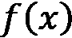
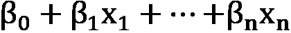
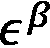
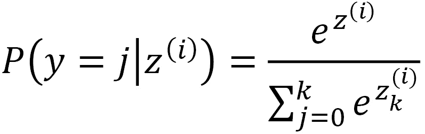
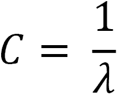
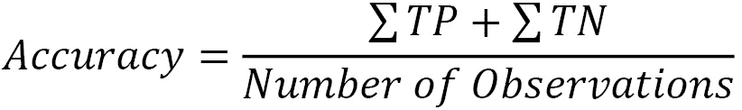
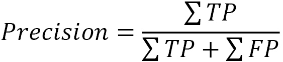

# 十、逻辑回归

在这一章和接下来的几章中，我们将探索分类的模型。这些包括具有两个或几个类值的目标，例如一个学生是否会通过一门课，或者一个顾客是否会在只有这三种选择的餐馆选择鸡肉、牛肉或豆腐。对于这类分类问题，有几种机器学习算法。我们将在这一章中看看一些最受欢迎的。

数十年来，逻辑回归一直用于建立二元目标模型。传统上，它被用来估计一个或多个独立变量对一分为二的结果的概率的影响。由于我们的重点是预测，而不是每个特征的影响，我们还将探索正则化技术，如套索回归。这些技术可以提高我们分类预测的准确性。我们还将研究预测多类目标的策略(当有两个以上可能的目标值时)。

在本章中，我们将讨论以下主题:

*   逻辑回归的关键概念
*   用逻辑回归进行二元分类
*   逻辑回归正则化
*   多项式逻辑回归

# 技术要求

在这一章中，我们将坚持使用 Python 的大多数科学发行版中可用的库:pandas、NumPy 和 scikit-learn。本章中的所有代码都可以在 scikit-learn 版本 0.24.2 和 1.0.2 中正常运行。

# 逻辑回归的关键概念

如果你熟悉线性回归，或者读过本书的第 7 章 、*线性回归模型*，你可能已经预料到我们将在本章讨论的一些问题——正则化、回归变量之间的线性以及正态分布残差。如果你在过去建立过有监督的机器学习模型，或者读过本书的最后几章，那么你也可能会预计到我们会花一些时间讨论偏差-方差权衡以及它如何影响我们对模型的选择。

我记得 35 年前在一次大学课程中，我被介绍了逻辑回归。在本科教材中，它通常几乎作为线性回归的一个特例出现；也就是说，二元因变量的线性回归与一些转换相结合，以保持预测值在 0 和 1 之间。

它与数字目标变量的线性回归有许多相似之处。逻辑回归相对容易训练和解释。线性和逻辑回归的优化技术都是有效的，可以产生低偏差的预测值。

也像线性回归一样，逻辑回归基于分配给每个特征的权重来预测目标。但是为了将预测概率限制在 0 到 1 之间，我们使用 sigmoid 函数。该函数接受任何值，并将其映射到 0 到 1 之间的值:


随着 *x* 接近无穷大，越来越接近 1。随着 *x* 接近负无穷大，越来越接近 0。

下图说明了一个 sigmoid 函数:


图 10.1–Sigmoid 函数

我们可以将熟悉的线性回归方程插入到 sigmoid 函数中，以预测类成员的概率:


这里是二元情况下类成员的预测概率。系数(贝塔系数)可以转换成比值比进行解释，如下所示:


这里， *r* 是比值比，β是系数。特性值每增加 1 个单位，职业成员的几率就会乘以。类似地，对于二元特征，真值的类成员概率是假值的倍，其他条件相同。

逻辑回归作为分类问题的算法有几个优点。要素可以是二分的、分类的或数值的，并且不需要正态分布。目标变量可以有两个以上的可能值，我们将在后面讨论，它可以是名义的或顺序的。另一个关键优点是，特征和目标之间的关系不被假定为线性的。

这里的术语有点混乱。为什么我们要对一个分类问题使用回归算法？嗯，逻辑回归预测类成员的概率。我们对这些概率应用决策规则来预测成员资格。对于二进制目标，默认阈值通常为 0.5。预测概率大于或等于 0.5 的实例得到正类或 1 或 True 小于 0.5 的被赋值为 0 或假。

## 逻辑回归扩展

本章我们将考虑逻辑回归的两个主要扩展。我们将探索多类模型——也就是那些目标有两个以上值的模型。我们还将研究逻辑模型的正则化，以改善(减少)方差。

构建多类模型时一个流行的选择是**多项式逻辑回归** ( **MLR** )。对于 MLR，预测概率分布是多项式概率分布。我们可以用 softmax 函数替换我们用于二元分类器的方程:



这里，。这将计算每个类标签的概率， *j* ，其中 *k* 是类的数量。

当我们有两个以上的类时，多项逻辑回归的替代方法是**一对其余的** ( **OVR** )逻辑回归。逻辑回归的这个扩展将多类问题转化为二元问题，估计类成员与所有其他类成员的概率。这里的关键假设是每个类中的成员是独立的。我们将在本章的一个例子中使用 MLR。与 OVR 相比，它的一个优势是预测的概率更可靠。

如前所述，逻辑回归与线性回归有一些相同的挑战，包括我们预测的低偏差伴随着高方差。当几个特征高度相关时，这更可能是一个问题。幸运的是，我们可以用正则化来处理这个问题，就像我们在第七章[](B17978_07_ePub.xhtml#_idTextAnchor091)**中看到的线性回归模型*。*

 *正则化增加了损失函数的惩罚。我们仍然寻求最小化误差，但是也约束我们的参数的大小。 **L1** 正则化，也简称拉索回归，惩罚权重(或系数)的绝对值:


这里， *p* 是特征的数量，λ决定正则化的强度。 **L2** 正则化，也被称为岭回归，惩罚权重的平方值:


L1 和 L2 正则化都将权重推向 0，尽管 L1 正则化更有可能导致模型稀疏。在 scikit-learn 中，我们使用 *C* 参数来调整λ的值，其中 *C* 正好是λ的倒数:



我们可以通过弹性净回归在 L1 和 L2 之间取得平衡。通过弹性净回归，我们调整了 L1 比率。值为 0.5 表示同等使用 L1 和 L2。我们可以使用超参数调整来选择 L1 比率的最佳值。

正则化可以产生一个方差更低的模型，当我们更关心预测而不是系数时，这是一个很好的权衡。

在使用正则化构建模型之前，我们将构建一个具有二元目标的相当简单的逻辑模型。我们还将花大量时间评估该模型。这将是我们在本书中构建的第一个分类模型，这些模型的模型评估看起来与回归模型非常不同。

# 用逻辑回归进行二元分类

逻辑回归通常用于对健康结果建模，当目标是二元时，例如一个人是否得病。在本节中，我们将通过一个例子来说明这一点。我们将建立一个模型，根据吸烟和饮酒习惯等个人特征来预测个人是否会患心脏病；健康特征，包括身体质量指数、哮喘、糖尿病和皮肤癌；和年龄。

注意

在这一章中，我们将专门研究可在[https://www . ka ggle . com/datasets/kamilpytlak/personal-key-indicators-of-heart-disease](https://www.kaggle.com/datasets/kamilpytlak/personal-key-indicators-of-heart-disease)上公开下载的心脏病数据。该数据集来自美国疾病控制中心 2020 年以来超过 40 万人的数据。数据栏包括受访者是否患有心脏病、体重指数、是否吸烟、酗酒、年龄、糖尿病和肾病。在本节中，我们将使用 30，000 个单独的样本来加快处理速度，但是完整的数据集可以在本书的 GitHub 存储库中的同一文件夹中获得。

在本章中，我们还将做比之前章节更多的预处理。我们将把这项工作的大部分整合到我们的管道中。这将使将来重用这些代码更加容易，并减少数据泄漏的可能性。请遵循以下步骤:

1.  我们将从导入在前几章中使用过的相同库开始。我们还将导入`LogisticRegression`和`metrics`模块。我们将使用 scikit-learn 中的`metrics`模块来评估本书这一部分中的每个分类模型。除了用于可视化的`matplotlib`，我们还将使用`seaborn` :

    ```
    import pandas as pd import numpy as np from sklearn.model_selection import train_test_split from sklearn.preprocessing import StandardScaler from sklearn.preprocessing import OneHotEncoder from sklearn.pipeline import make_pipeline from sklearn.impute import SimpleImputer from sklearn.compose import ColumnTransformer from sklearn.model_selection import StratifiedKFold from sklearn.feature_selection import RFECV from sklearn.linear_model import LogisticRegression import sklearn.metrics as skmet import matplotlib.pyplot as plt import seaborn as sns
    ```

2.  我们还需要几个自定义类来处理预处理。我们已经看到了`OutlierTrans`类。这里，我们添加了几个新的类——`MakeOrdinal`和`ReplaceVals` :

    ```
    import os import sys sys.path.append(os.getcwd() + "/helperfunctions") from preprocfunc import OutlierTrans,\   MakeOrdinal, ReplaceVals
    ```

`MakeOrdinal`类采用字符特征，并基于字母数字排序分配数值。例如，具有三个可能值(不好、好和很好)的要素将被转换为值分别为 0、1 和 2 的序数要素。

回想一下 scikit-learn 管道转换器必须有`fit`和`transform`方法，并且必须从`BaseEstimator`继承。他们通常也继承自`TransformerMixin`，尽管还有其他选择。

`MakeOrdinal`类中的所有动作都发生在`transform`方法中。我们遍历列转换器传递给它的所有列。对于每一列，我们找到所有的唯一值，并按字母数字顺序对它们进行排序，将唯一值存储在一个名为`cats`的 NumPy 数组中。然后，我们使用 lambda 函数和 NumPy 的`where`方法来查找与每个特征值相关联的`cats`的索引:

```
class MakeOrdinal(BaseEstimator,TransformerMixin):
  def fit(self,X,y=None):
    return self

  def transform(self,X,y=None):
    Xnew = X.copy()
    for col in Xnew.columns:
      cats = np.sort(Xnew[col].unique())
      Xnew[col] = Xnew.\
        apply(lambda x: int(np.where(cats==\
        x[col])[0]), axis=1)
    return Xnew.values
```

当字母数字顺序与有意义的顺序匹配时，`MakeOrdinal`将正常工作，就像前面的例子中的一样。当这不是真的，我们可以使用`ReplaceVals`来分配适当的序数值。该类根据传递给它的字典，用替代值替换任何特性中的值。

我们可以只使用 pandas `replace`方法，而不将它放入管道中，但是这样一来，就可以更容易地将我们的重新编码与其他管道步骤集成在一起，比如特性缩放:

```
class ReplaceVals(BaseEstimator,TransformerMixin):
  def __init__(self,repdict):
    self.repdict = repdict
  def fit(self,X,y=None):
    return self

  def transform(self,X,y=None):
    Xnew = X.copy().replace(self.repdict)
return Xnew.values
```

如果您还没有完全理解我们将如何使用这些类，请不要担心。当我们将它们添加到我们的列转换中时，情况会更清楚。

1.  接下来我们就加载心脏病数据，看几行。几个字符串特征在概念上是二元的，例如`alcoholdrinkingheavy`，当这个人酗酒时是`Yes`，否则是`No`。在运行模型之前，我们需要对这些特征进行编码。

`agecategory`特征是表示年龄区间的字符数据。我们需要将该特征转换成数字:

```
healthinfo = pd.read_csv("data/healthinfo.csv")
healthinfo.set_index("personid", inplace=True)
healthinfo.head(2).T
personid                    299391       252786
heartdisease                Yes          No
bmi                         28.48        25.24
smoking                     Yes          Yes
alcoholdrinkingheavy        No           No
stroke                      No           No
physicalhealthbaddays       7            0
mentalhealthbaddays         0            2
walkingdifficult            No           No
gender                      Male         Female
agecategory                 70-74        65-69
ethnicity                   White        White
diabetic    No, borderline diabetes      No
physicalactivity            Yes          Yes
genhealth                   Good         Very good
sleeptimenightly            8            8
asthma                      No           No
kidneydisease               No           No
skincancer                  No           Yes
```

1.  让我们看看数据帧的大小以及我们有多少缺失值。有 30，000 个实例，但是 18 个数据列中的任何一个都没有丢失。太好了。当我们构建管道时，我们不必担心这个问题:

    ```
    healthinfo.shape (30000, 18) healthinfo.isnull().sum() heartdisease                0 bmi                         0 smoking                     0 alcoholdrinkingheavy        0 stroke                      0 physicalhealthbaddays       0 mentalhealthbaddays         0 walkingdifficult            0 gender                      0 agecategory                 0 ethnicity                   0 diabetic                    0 physicalactivity            0 genhealth                   0 sleeptimenightly            0 asthma                      0 kidneydisease               0 skincancer                  0 dtype: int64
    ```

2.  让我们将目标变量`heartdisease`改为`0`和`1`变量。这个会让我们以后少担心一件事。马上要注意的一件事是，目标的价值观相当不平衡。在我们的观察中，不到 10%的人患有心脏病。这当然是个好消息，但是它也提出了一些我们需要解决的建模挑战:

    ```
    healthinfo.heartdisease.value_counts() No        27467 Yes       2533 Name: heartdisease, dtype: int64 healthinfo['heartdisease'] = \   np.where(healthinfo.heartdisease=='No',0,1).\      astype('int') healthinfo.heartdisease.value_counts() 0        27467 1        2533 Name: heartdisease, dtype: int64
    ```

3.  我们应该通过预处理来组织我们的特性。我们将对数字特征进行缩放，并对分类特征进行一次性编码。我们想把目前是字符串的`agecategory`和`genhealth`特性变成序数特性。

我们需要对`diabetic`特性做一个特别的清理。一些人表示没有，但他们处于边缘状态。出于我们的目的，我们将把它们视为第*号*。一些人只在怀孕期间患有糖尿病。我们会认为他们是*是的*。对于`genhealth`和`diabetic`，我们将建立一个字典，指示特征值应该如何被替换。我们将在管道的`ReplaceVals`转换器中使用该字典:

```
num_cols = ['bmi','physicalhealthbaddays',
   'mentalhealthbaddays','sleeptimenightly']
binary_cols = ['smoking','alcoholdrinkingheavy',
  'stroke','walkingdifficult','physicalactivity',
  'asthma','kidneydisease','skincancer']
cat_cols = ['gender','ethnicity']
spec_cols1 = ['agecategory']
spec_cols2 = ['genhealth']
spec_cols3 = ['diabetic']
rep_dict = {
  'genhealth': {'Poor':0,'Fair':1,'Good':2,
    'Very good':3,'Excellent':4},
  'diabetic': {'No':0,
    'No, borderline diabetes':0,'Yes':1,
    'Yes (during pregnancy)':1}           
}
```

1.  我们应该看看二元特征的一些频率，以及其他分类特征。很大一部分人(42%)报告说他们曾经吸烟。14%的人表示他们行走困难:

    ```
    healthinfo[binary_cols].\   apply(pd.value_counts, normalize=True).T                         No       Yes smoking                 0.58     0.42 alcoholdrinkingheavy    0.93     0.07 stroke                  0.96     0.04 walkingdifficult        0.86     0.14 physicalactivity        0.23     0.77 asthma                  0.87     0.13 kidneydisease           0.96     0.04 skincancer              0.91     0.09
    ```

2.  让我们看看其他分类特征的频率。男女人数几乎相等。大多数人报告健康状况极佳或非常好:

    ```
    for col in healthinfo[cat_cols +  ['genhealth','diabetic']].columns:   print(col, "----------------------",   healthinfo[col].value_counts(normalize=True).\       sort_index(), sep="\n", end="\n\n")
    ```

该产生以下输出:

```
gender
----------------------
Female   0.52
Male     0.48
Name: gender, dtype: float64
ethnicity
----------------------
American Indian/Alaskan Native   0.02
Asian                            0.03
Black                            0.07
Hispanic                         0.09
Other                            0.03
White                            0.77
Name: ethnicity, dtype: float64
genhealth
----------------------
Excellent   0.21
Fair        0.11
Good        0.29
Poor        0.04
Very good   0.36
Name: genhealth, dtype: float64
diabetic
----------------------
No                        0.84
No, borderline diabetes   0.02
Yes                       0.13
Yes (during pregnancy)    0.01
Name: diabetic, dtype: float64
```

1.  我们也应该看看一些描述性的统计数字特征。身体健康状况不佳和心理健康状况不佳天数的中值均为 0；也就是说，在过去的一个月中，至少一半的观察报告没有不良的身体健康日，至少一半的观察报告没有不良的精神健康日:

    ```
    healthinfo[num_cols].\   agg(['count','min','median','max']).T                        count    min    median  max bmi                    30,000   12     27      92 physicalhealthbaddays  30,000   0      0       30 mentalhealthbaddays    30,000   0      0       30 sleeptimenightly       30,000   1      7       24
    ```

我们将需要做一些缩放。我们还需要对分类特征进行一些编码。数字特征也有一些极值。24 的`sleeptimenightly`值似乎不太可能！对付他们可能是个好主意。

1.  现在，我们已经准备好建立我们的管道。让我们创建培训和测试数据框架:

    ```
    X_train, X_test, y_train, y_test =  \   train_test_split(healthinfo[num_cols +      binary_cols + cat_cols + spec_cols1 +     spec_cols2 + spec_cols3],\   healthinfo[['heartdisease']], test_size=0.2,     random_state=0)
    ```

2.  接下来，我们将设置列转换。我们将创建一个一次性编码器实例，用于所有分类特性。对于数字列，我们将使用`OutlierTrans`对象移除极值，然后估算中值。

我们将使用`MakeOrdinal`转换器将`agecategory`特征转换为有序特征，并使用`ReplaceVals`转换器对`genhealth`和`diabetic`特征进行编码。

在下一步中，我们将把列转换添加到管道中:

```
ohe = OneHotEncoder(drop='first', sparse=False)
standtrans = make_pipeline(OutlierTrans(3),
  SimpleImputer(strategy="median"),
  StandardScaler())
spectrans1 = make_pipeline(MakeOrdinal(),
  StandardScaler())
spectrans2 = make_pipeline(ReplaceVals(rep_dict),
  StandardScaler())
spectrans3 = make_pipeline(ReplaceVals(rep_dict))
bintrans = make_pipeline(ohe)
cattrans = make_pipeline(ohe)
coltrans = ColumnTransformer(
  transformers=[
    ("stand", standtrans, num_cols),
    ("spec1", spectrans1, spec_cols1),
    ("spec2", spectrans2, spec_cols2),
    ("spec3", spectrans3, spec_cols3),
    ("bin", bintrans, binary_cols),
    ("cat", cattrans, cat_cols),
  ]
)
```

1.  现在，我们已经准备好建立和安装我们的管道。首先，我们将实例化逻辑回归和分层 k-fold 对象，我们将使用递归特征消除。回想一下，递归特征消除需要一个估计器。我们使用分层的 k-fold 在每个 fold 中获得近似相同的目标值分布。

现在，我们必须为我们的模型创建另一个逻辑回归实例。我们将把`class_weight`参数设置为`balanced`。这应该会提高模型处理阶级不平衡的能力。然后，我们将向管道添加列转换、递归特性消除和逻辑回归实例，然后对其进行调整:

```
lrsel = LogisticRegression(random_state=1, 
  max_iter=1000)
kf = StratifiedKFold(n_splits=5, shuffle=True)
rfecv = RFECV(estimator=lrsel, cv=kf)
lr = LogisticRegression(random_state=1,
  class_weight='balanced', max_iter=1000)
pipe1 = make_pipeline(coltrans, rfecv, lr)
pipe1.fit(X_train, y_train.values.ravel())
```

1.  我们需要做一点工作，在拟合后从管道中恢复列名。我们可以对`bin`变压器和`cat`变压器使用一键编码器的`get_feature_names`方法。这为我们提供了编码后的二元和分类特性的列名。数字特征的名称保持不变。我们稍后将使用特性名称:

    ```
    new_binary_cols = \   pipe1.named_steps['columntransformer'].\   named_transformers_['bin'].\   named_steps['onehotencoder'].\   get_feature_names(binary_cols) new_cat_cols = \   pipe1.named_steps['columntransformer'].\   named_transformers_['cat'].\   named_steps['onehotencoder'].\   get_feature_names(cat_cols) new_cols = np.concatenate((np.array(num_cols +   spec_cols1 + spec_cols2 + spec_cols3),   new_binary_cols, new_cat_cols)) new_cols array(['bmi', 'physicalhealthbaddays',        'mentalhealthbaddays', 'sleeptimenightly',        'agecategory', 'genhealth', 'diabetic',        'smoking_Yes', 'alcoholdrinkingheavy_Yes',        'stroke_Yes', 'walkingdifficult_Yes',        'physicalactivity_Yes', 'asthma_Yes',        'kidneydisease_Yes', 'skincancer_Yes',        'gender_Male', 'ethnicity_Asian',        'ethnicity_Black', 'ethnicity_Hispanic',        'ethnicity_Other', 'ethnicity_White'],       dtype=object)
    ```

2.  现在，让我们看看递归特征消除的结果。我们可以使用`rfecv`对象的`ranking_`属性来获得每个特性的排名。排名为 *1* 的将被选为我们的模型。

如果我们使用`get_support`方法或者`rfecv`对象的`support_`属性，而不是`ranking_`属性，我们得到的只是那些将在我们的模型中使用的特性——也就是那些等级为 1 的特性。我们将在下一步中完成:

```
rankinglabs = \
 np.column_stack((pipe1.named_steps['rfecv'].ranking_,
 new_cols))
pd.DataFrame(rankinglabs,
 columns=['rank','feature']).\
 sort_values(['rank','feature']).\
 set_index("rank")
 feature
rank 
1                  agecategory
1     alcoholdrinkingheavy_Yes
1                   asthma_Yes
1                     diabetic
1              ethnicity_Asian
1              ethnicity_Other
1              ethnicity_White
1                  gender_Male
1                    genhealth
1            kidneydisease_Yes
1                  smoking_Yes
1                   stroke_Yes
1         walkingdifficult_Yes
2           ethnicity_Hispanic
3               skincancer_Yes
4                          bmi
5        physicalhealthbaddays
6             sleeptimenightly
7          mentalhealthbaddays
8         physicalactivity_Yes
9              ethnicity_Black
```

1.  我们可以从逻辑回归的系数中得到优势比。回想一下，比值比是指数系数。有 13 个系数，这是有意义的，因为我们在上一步中了解到，13 个特性的排名为 1。

我们将使用`rfecv`步骤的`get_support`方法来获取所选特性的名称，并用这些名称和比值比创建一个 NumPy 数组`oddswithlabs`。然后，我们创建一个熊猫数据框架，并按优势比降序排列。

毫不奇怪，那些患过中风的人和老年人更有可能患心脏病。如果一个人中风，在控制其他因素的情况下，他患心脏病的几率是常人的三倍。年龄组每增加一岁，患心脏病的几率增加 2.88 倍。另一方面，总体健康水平每提高一分，患心脏病的几率就会下降一半(57%)；从一般到好。令人惊讶的是，在控制其他因素的情况下，大量饮酒会降低患心脏病的几率:

```
oddsratios = np.exp(pipe1.\
  named_steps['logisticregression'].coef_)
oddsratios.shape
(1, 13)
selcols = new_cols[pipe1.\
  named_steps['rfecv'].get_support()]
oddswithlabs = np.column_stack((oddsratios.\
  ravel(), selcols))
pd.DataFrame(oddswithlabs, 
  columns=['odds','feature']).\
  sort_values(['odds'], ascending=False).\
  set_index('odds')
 feature
odds 
3.01                stroke_Yes
2.88               agecategory
2.12               gender_Male
1.97         kidneydisease_Yes
1.75                  diabetic
1.55               smoking_Yes
1.52                asthma_Yes
1.30      walkingdifficult_Yes
1.27           ethnicity_Other
1.22           ethnicity_White
0.72           ethnicity_Asian
0.61  alcoholdrinkingheavy_Yes
0.57                 genhealth
```

现在我们已经拟合了我们的逻辑回归模型，我们准备评估它。在下一节中，我们将花一些时间研究各种性能指标，包括准确性和灵敏度。我们将使用我们在第 6 章 、*准备模型评估*中介绍的许多概念。

## 评估逻辑回归模型

对分类模型性能最直观的衡量是它的准确性——也就是说，我们的预测有多准确。然而，在某些情况下，我们可能至少像关注准确性一样关注敏感性——我们正确预测的阳性病例的百分比；为了提高灵敏度，我们甚至愿意损失一点准确性。疾病的预测模型通常属于这一类。但是，每当出现类别不平衡时，诸如准确性和敏感性之类的衡量标准会给我们提供对模型性能的非常不同的估计。

除了担心准确性或灵敏度，我们可能还会担心模型的**特异性**或**精确度**。我们可能想要一个能够高度可靠地识别阴性病例的模型，即使这意味着它不能很好地识别阳性病例。特异性是由模型识别的所有阴性百分比的度量。

精确度是另一个重要的衡量标准，它是预测结果为阳性的百分比。对于某些应用，限制假阳性是很重要的，即使我们不得不容忍较低的灵敏度。苹果种植者使用图像识别来识别坏苹果，可能更喜欢高精度的模型而不是更灵敏的模型，不想不必要地丢弃苹果。

通过查看混淆矩阵，可以更清楚地了解这一点:


图 10.2–二元目标的实际值与预测值的混淆矩阵

混淆矩阵帮助我们概念化准确性、敏感性、特异性和精确性。准确性是我们的预测正确的观察值的百分比。这可以更精确地表述如下:



灵敏度是我们正确预测阳性的次数除以阳性的次数。再次浏览混淆矩阵并确认实际的正值可以是预测的正值(TP)或预测的负值(FN)可能会有所帮助。灵敏度也被称为**召回**或真阳性率**:**

**

特异性是我们正确预测负值的次数(TN)除以实际负值的次数(TN + FP)。特异性也称为真阴性率**:**

**

精度是我们正确预测正值(TP)的次数除以预测的正值数:



我们在第 6 章 、*准备* *模型评估*中更详细地讨论了这些概念。在本节中，我们将检验心脏病逻辑回归模型的准确性、敏感性、特异性和精确度:

1.  我们可以使用上一节中拟合的管道的`predict`方法，从我们的逻辑回归中生成预测。然后，我们可以生成一个混淆矩阵:

    ```
    pred = pipe1.predict(X_test) cm = skmet.confusion_matrix(y_test, pred) cmplot = skmet.ConfusionMatrixDisplay(confusion_matrix=cm, display_labels=['Negative', 'Positive']) cmplot.plot() cmplot.ax_.set(title='Heart Disease Prediction Confusion Matrix',    xlabel='Predicted Value', ylabel='Actual Value')
    ```

这会产生以下情节:


图 10.3–心脏病预测的混淆矩阵

这里要注意的第一件事是大部分动作都在左上角象限，在这里我们正确地预测了测试数据中的实际负值。这将有助于我们的准确性。尽管如此，我们还是有相当数量的误报。当没有心脏病时，我们预测心脏病的次数是 1，430 次(在 5，506 个阴性实例中)。我们似乎在识别阳性心脏病病例方面做得不错，正确分类了 392 例阳性病例(共 494 例)。

1.  让我们来计算准确度、灵敏度、特异性和精确度。整体准确率不是很大，74%。不过，敏感度相当不错，为 79%。(当然，如何*体面*的敏感性是取决于域和判断。对于心脏病等疾病，我们可能希望它更高。)这可以在下面的代码中看到:

    ```
    tn, fp, fn, tp = skmet.confusion_matrix(y_test.values.ravel(), pred).ravel() tn, fp, fn, tp (4076, 1430, 102, 392) accuracy = (tp + tn) / pred.shape[0] accuracy 0.7446666666666667 sensitivity = tp / (tp + fn) sensitivity 0.7935222672064778 specificity = tn / (tn+fp) specificity 0.7402833272793317 precision = tp / (tp + fp) precision 0.21514818880351264
    ```

2.  我们可以使用`metrics`模块以更直接的方式进行这些计算(在上一步中，我选择了一种更迂回的方法来说明计算是如何进行的):

    ```
    print("accuracy: %.2f, sensitivity: %.2f, specificity: %.2f, precision: %.2f"  %   (skmet.accuracy_score(y_test.values.ravel(), pred),   skmet.recall_score(y_test.values.ravel(), pred),   skmet.recall_score(y_test.values.ravel(), pred,   pos_label=0),   skmet.precision_score(y_test.values.ravel(), pred))) accuracy: 0.74, sensitivity: 0.79, specificity: 0.74, precision: 0.22
    ```

我们的模型最大的问题是精确度非常低——只有 22%。这是由于大量的假阳性。大多数时候，我们的模型预测是积极的，但它是错误的。

除了我们已经计算过的四个度量之外，得到假阳性率也是有帮助的。假阳性率是我们的模型在实际值为负时预测为正的倾向:


1.  我们来计算一下假阳性率:

    ```
    falsepositiverate = fp / (tn + fp) falsepositiverate 0.25971667272066834
    ```

因此，一个人有 26%的时间没有心脏病，我们预测他们有。虽然我们当然希望限制误报的数量，但这通常意味着牺牲一些灵敏度。我们将在本节的后面演示为什么会这样。

1.  我们应该仔细看看由我们的模型产生的预测概率。这里，正类预测的阈值是 0.5，这通常是逻辑回归的默认值。(回想一下逻辑回归预测阶级成员的概率。我们需要一个伴随的决策规则，比如 0.5 阈值，来预测类别。)这可以在下面的代码中看到:

    ```
    pred_probs = pipe1.predict_proba(X_test)[:, 1] probdf = \   pd.DataFrame(zip(pred_probs, pred,   y_test.values.ravel()),   columns=(['prob','pred','actual'])) probdf.groupby(['pred'])['prob'].\   agg(['min','max','count'])         min        max        count pred                  0       0.01       0.50       4178 1       0.50       0.99       1822
    ```

2.  我们可以使用**核密度估计** ( **KDE** )图来可视化这些概率。我们还可以看到不同的决策规则如何影响我们的预测。例如，我们可以将阈值从 0.5 移动到 0.25。乍一看，这有一些优点。两个可能的阈值之间的区域具有比没有心脏病的病例更多的心脏病病例。我们将会得到虚线之间的棕色区域，正确预测心脏病，而在 0.5 的阈值下我们不会。这是一个比两条线之间的绿色区域更大的区域，在这里，我们将一些在阈值为 0.5 的处的真阴性预测变成在阈值为 0.25 的

    ```
    sns.kdeplot(probdf.loc[probdf.actual==1].prob,   shade=True, color='red',label="Heart Disease") sns.kdeplot(probdf.loc[probdf.actual==0].prob,   shade=True,color='green',label="No Heart Disease") plt.axvline(0.25, color='black', linestyle='dashed',   linewidth=1) plt.axvline(0.5, color='black', linestyle='dashed',   linewidth=1) plt.title("Predicted Probability Distribution") plt.legend(loc="upper left")
    ```

    处的假阳性预测

这会生成以下图:


图 10.4–心脏病预测概率分布

让我们比目前更仔细地考虑一下精度和灵敏度之间的权衡。请记住，精度是我们预测正类值时正确的比率。敏感度，也称为回忆或真阳性率，是我们将实际阳性识别为阳性的比率。

1.  我们可以绘制精度和灵敏度曲线如下:

    ```
    prec, sens, ths = skmet.precision_recall_curve(y_test, pred_probs) sens = sens[1:-20] prec = prec[1:-20] ths  = ths[:-20] fig, ax = plt.subplots() ax.plot(ths, prec, label='Precision') ax.plot(ths, sens, label='Sensitivity') ax.set_title('Precision and Sensitivity by Threshold') ax.set_xlabel('Threshold') ax.set_ylabel('Precision and Sensitivity') ax.legend()
    ```

此生成以下图形:


图 10.5–阈值时的精度和灵敏度

当阈值增加到超过 0.2 时，灵敏度下降的幅度比精度增加的幅度更大。

1.  将假阳性率与敏感率一起看通常也是有帮助的。假阳性率是我们的模型在实际值为负时预测为正的倾向。一种观察这种关系的方法是使用 ROC 曲线:

    ```
    fpr, tpr, ths = skmet.roc_curve(y_test, pred_probs) ths = ths[1:] fpr = fpr[1:] tpr = tpr[1:] fig, ax = plt.subplots() ax.plot(fpr, tpr, linewidth=4, color="black") ax.set_title('ROC curve') ax.set_xlabel('False Positive Rate') ax.set_ylabel('Sensitivity')
    ```

这会产生以下情节:


图 10.6–ROC 曲线

这里，我们可以看到，假阳性率越高，增加假阳性率给我们带来的灵敏度增加就越少。超过 0.5 的假阳性率，根本没有多少回报。

1.  仅通过阈值

    ```
    fig, ax = plt.subplots() ax.plot(ths, fpr, label="False Positive Rate") ax.plot(ths, tpr, label="Sensitivity") ax.set_title('False Positive Rate and Sensitivity by Threshold') ax.set_xlabel('Threshold') ax.set_ylabel('False Positive Rate and Sensitivity') ax.legend()
    ```

    绘制假阳性率和灵敏度也是有帮助的

此产生以下情节:


图 10.7–灵敏度和假阳性率

在这里，我们可以看到，当我们将阈值降低到 0.25 以下时，假阳性率比灵敏度增加得更快。

这最后两个可视化暗示了找到最佳阈值的可能性——也就是说，在灵敏度和假阳性率之间具有最佳折衷的阈值；至少在数学上，忽略领域知识。

1.  我们将计算`argmax`函数。我们需要该指数的阈值。根据这种计算，最佳阈值是 0.46，这与缺省值

    ```
    jthresh = ths[np.argmax(tpr – fpr)] jthresh 0.45946882675453804
    ```

    相差不大
2.  我们可以基于这个备选阈值重做混淆矩阵:

    ```
    pred2 = np.where(pred_probs>=jthresh,1,0) cm = skmet.confusion_matrix(y_test, pred2) cmplot = skmet.ConfusionMatrixDisplay(   confusion_matrix=cm,    display_labels=['Negative', 'Positive']) cmplot.plot() cmplot.ax_.set(   title='Heart Disease Prediction Confusion Matrix',    xlabel='Predicted Value', ylabel='Actual Value')
    ```

这会产生以下情节:


图 10.8–心脏病预测的混淆矩阵

1.  这给了我们一个小的灵敏度提升:

    ```
    skmet.recall_score(y_test.values.ravel(), pred) 0.7935222672064778 skmet.recall_score(y_test.values.ravel(), pred2) 0.8380566801619433
    ```

这里的要点不是我们应该随意改变门槛。这通常是个坏主意。但是我们应该记住两点。首先，当我们有一个高度不平衡的班级时，0.5 的门槛可能没有意义。第二，这是学习领域知识的重要地方。对于一些分类问题，假阳性实质上没有假阴性重要。

在这一节中，我们重点关注灵敏度、精确度和假阳性率作为模型性能的度量。这部分是因为空间限制，但也是因为这个特定目标的问题——不平衡等级和对敏感性的可能偏好。我们将在接下来的几章中构建的其他模型中强调其他度量，例如准确性和特异性。在本章的其余部分，我们将看看逻辑回归的几个扩展，正则化和多项式逻辑回归。

# 用逻辑回归进行正则化

如果你已经阅读了第七章 、*线性回归模型*，并且阅读了本章的第一部分，你就已经对正则化的工作原理有了一个很好的概念。我们给估计器增加一个惩罚，最小化我们的参数估计。惩罚的大小通常基于模型性能的度量来调整。我们将在本节中解决这个问题。请遵循以下步骤:

1.  我们将加载在上一节中使用过的相同模块，以及进行必要的超参数调整所需的模块。我们将使用`RandomizedSearchCV`和`uniform`为我们的惩罚强度找到最佳值:

    ```
    import pandas as pd import numpy as np from sklearn.model_selection import train_test_split from sklearn.preprocessing import StandardScaler from sklearn.preprocessing import OneHotEncoder from sklearn.pipeline import make_pipeline from sklearn.impute import SimpleImputer from sklearn.compose import ColumnTransformer from sklearn.model_selection import RepeatedStratifiedKFold from sklearn.linear_model import LogisticRegression from sklearn.model_selection import RandomizedSearchCV from scipy.stats import uniform import os import sys sys.path.append(os.getcwd() + "/helperfunctions") from preprocfunc import OutlierTrans,\   MakeOrdinal, ReplaceVals
    ```

2.  接下来，我们将加载心脏病数据并做一点处理:

    ```
    healthinfo = pd.read_csv("data/healthinfosample.csv") healthinfo.set_index("personid", inplace=True) healthinfo['heartdisease'] = \   np.where(healthinfo.heartdisease=='No',0,1).\   astype('int')
    ```

3.  接下来，我们将组织我们的特性来促进我们将分两步进行的列转换:

    ```
    num_cols = ['bmi','physicalhealthbaddays',    'mentalhealthbaddays','sleeptimenightly'] binary_cols = ['smoking','alcoholdrinkingheavy',   'stroke','walkingdifficult','physicalactivity',   'asthma','kidneydisease','skincancer'] cat_cols = ['gender','ethnicity'] spec_cols1 = ['agecategory'] spec_cols2 = ['genhealth'] spec_cols3 = ['diabetic'] rep_dict = {   'genhealth': {'Poor':0,'Fair':1,'Good':2,     'Very good':3,'Excellent':4},   'diabetic': {'No':0,     'No, borderline diabetes':0,'Yes':1,     'Yes (during pregnancy)':1}            }
    ```

4.  现在，我们必须创建测试和训练数据框架:

    ```
    X_train, X_test, y_train, y_test =  \   train_test_split(healthinfo[num_cols +      binary_cols + cat_cols + spec_cols1 +     spec_cols2 + spec_cols3],\   healthinfo[['heartdisease']], test_size=0.2,     random_state=0)
    ```

5.  然后，我们必须设置列转换:

    ```
    ohe = OneHotEncoder(drop='first', sparse=False) standtrans = make_pipeline(OutlierTrans(3),   SimpleImputer(strategy="median"),   StandardScaler()) spectrans1 = make_pipeline(MakeOrdinal(),   StandardScaler()) spectrans2 = make_pipeline(ReplaceVals(rep_dict),   StandardScaler()) spectrans3 = make_pipeline(ReplaceVals(rep_dict)) bintrans = make_pipeline(ohe) cattrans = make_pipeline(ohe) coltrans = ColumnTransformer(   transformers=[     ("stand", standtrans, num_cols),     ("spec1", spectrans1, spec_cols1),     ("spec2", spectrans2, spec_cols2),     ("spec3", spectrans3, spec_cols3),     ("bin", bintrans, binary_cols),     ("cat", cattrans, cat_cols),   ] )
    ```

6.  现在，我们已经准备好运行我们的模型。我们将实例化逻辑回归和重复分层 k-fold 对象。然后，我们将使用上一步中的列转换和逻辑回归创建一个管道。

之后，我们将为我们的超参数创建一个字典列表，而不是像我们在本书前面所做的那样只有一个字典。这是因为不是所有的超参数都一起工作。例如，我们不能使用带有`newton-cg`解算器的 L1 罚函数。字典键名的前缀`logisticregression__`(注意双下划线)表示我们希望将值传递给管道的逻辑回归步骤。

我们将把随机网格搜索的`n_iter`参数设置为`20`，以对超参数进行 20 次采样。每次时，网格搜索将从一个字典中列出的超参数中进行选择。我们将指出，我们希望网格搜索评分基于 ROC 曲线下的面积:

```
lr = LogisticRegression(random_state=1, class_weight='balanced', max_iter=1000)
kf = RepeatedStratifiedKFold(n_splits=7, n_repeats=3, random_state=0)
pipe1 = make_pipeline(coltrans, lr)
reg_params = [
  {
    'logisticregression__solver': ['liblinear'],
    'logisticregression__penalty': ['l1','l2'],
    'logisticregression__C': uniform(loc=0, scale=10)
  },
  {
    'logisticregression__solver': ['newton-cg'],
    'logisticregression__penalty': ['l2'],
    'logisticregression__C': uniform(loc=0, scale=10)
  },
  {
    'logisticregression__solver': ['saga'],
    'logisticregression__penalty': ['elasticnet'],
    'logisticregression__l1_ratio': uniform(loc=0, scale=1),   
    'logisticregression__C': uniform(loc=0, scale=10)
  }
]
rs = RandomizedSearchCV(pipe1, reg_params, cv=kf, 
  n_iter=20, scoring='roc_auc')
rs.fit(X_train, y_train.values.ravel())
```

1.  在符合搜索之后，`best_params`属性给出了与最高分数相关的参数。L1 比率更接近 L1 而不是 L2 的弹性净回归表现最好:

    ```
    rs.best_params_ {'logisticregression__C': 0.6918282397356423,  'logisticregression__l1_ratio': 0.758705704020254,  'logisticregression__penalty': 'elasticnet',  'logisticregression__solver': 'saga'} rs.best_score_ 0.8410275986723489
    ```

2.  让我们看看网格搜索中的其他一些最高分。最好的三个模特分数差不多。一个使用弹性净回归，另一个 L1，另一个 L2。

网格搜索的`cv_results_`字典为我们提供了大量关于20 款试用车型的信息。字典中的`params`列表有一个稍微复杂的结构，因为一些键对于一些迭代是不存在的，比如`L1_ratio`。我们可以使用`json_normalize`来展平结构:

```
results = \
  pd.DataFrame(rs.cv_results_['mean_test_score'], \
    columns=['meanscore']).\
  join(pd.json_normalize(rs.cv_results_['params'])).\
  sort_values(['meanscore'], ascending=False)
results.head(3).T
 15          4      12
meanscore                     0.841       0.841  0.841
logisticregression__C         0.692       1.235  0.914
logisticregression__l1_ratio  0.759       NaN    NaN
logisticregression__penalty   elasticnet  l1     l2
logisticregression__solver  saga  liblinear  liblinear
```

1.  我们来看看混淆矩阵:

    ```
    pred = rs.predict(X_test) cm = skmet.confusion_matrix(y_test, pred) cmplot = \   skmet.ConfusionMatrixDisplay(confusion_matrix=cm,   display_labels=['Negative', 'Positive']) cmplot.plot() cmplot.ax_.\   set(title='Heart Disease Prediction Confusion Matrix',    xlabel='Predicted Value', ylabel='Actual Value')
    ```

这个产生了下面的情节:


图 10.9–心脏病预测的混淆矩阵

1.  让我们也来看看一些指标。我们的分数与没有正则化的模型相比基本没有变化:

    ```
    print("accuracy: %.2f, sensitivity: %.2f, specificity: %.2f, precision: %.2f"  %   (skmet.accuracy_score(y_test.values.ravel(), pred),   skmet.recall_score(y_test.values.ravel(), pred),   skmet.recall_score(y_test.values.ravel(), pred,     pos_label=0),   skmet.precision_score(y_test.values.ravel(), pred))) accuracy: 0.74, sensitivity: 0.79, specificity: 0.74, precision: 0.21
    ```

尽管正则化并没有为我们的模型提供明显的性能提升，但是很多时候确实如此。当使用 L1 正则化时，也没有必要担心特征选择，因为不太重要的特征的权重将是 0。

我们还没有处理如何处理目标有两个以上可能值的模型，尽管最后两节中几乎所有的讨论都适用于多类模型。在下一节中，我们将学习如何使用多项式逻辑回归来模拟多类目标。

# 多项逻辑回归

如果逻辑回归只适用于二元分类问题，它就不会那么有用。幸运的是，当我们的目标有两个以上的值时，我们可以使用多项式逻辑回归。

在本节中，我们将使用机器故障数据，这些数据是空气和过程温度、扭矩和转速的函数。

注意

该机器故障数据集可在[https://www . ka ggle . com/datasets/Shiva MB/machine-predictive-maintenance-classification](https://www.kaggle.com/datasets/shivamb/machine-predictive-maintenance-classification)上公开使用。有 10，000 个观察值、12 个特征和两个可能的目标。一种是二进制的——也就是说，机器失败了或者没有。另一种是失败的类型。该数据集中的实例是合成的，由旨在模拟机器故障率和原因的流程生成。

让我们了解一下如何使用多项式逻辑回归来模拟机器故障:

1.  首先，我们将导入现在熟悉的库。我们还将导入我们在第六章*准备* *模型评估*中首次使用的`cross_validate`，来帮助我们评估我们的模型:

    ```
    import pandas as pd import numpy as np from sklearn.model_selection import train_test_split from sklearn.preprocessing import StandardScaler from sklearn.preprocessing import OneHotEncoder from sklearn.pipeline import make_pipeline from sklearn.impute import SimpleImputer from sklearn.compose import ColumnTransformer from sklearn.model_selection import RepeatedStratifiedKFold from sklearn.linear_model import LogisticRegression from sklearn.model_selection import cross_validate import os import sys sys.path.append(os.getcwd() + "/helperfunctions") from preprocfunc import OutlierTrans
    ```

2.  我们将加载机器故障数据并查看其结构。我们没有任何失踪的数据。这是个好消息:

    ```
    machinefailuretype = pd.read_csv("data/machinefailuretype.csv") machinefailuretype.info() <class 'pandas.core.frame.DataFrame'> RangeIndex: 10000 entries, 0 to 9999 Data columns (total 10 columns):  #   Column              Non-Null Count      Dtype   ---  ------             --------------       ----    0   udi                 10000 non-null      int64    1   product             10000 non-null      object   2   machinetype         10000 non-null      object   3   airtemp             10000 non-null      float64  4   processtemperature  10000 non-null      float64  5   rotationalspeed     10000 non-null      int64    6   torque              10000 non-null      float64  7   toolwear            10000 non-null      int64    8   fail                10000 non-null      int64    9   failtype            10000 non-null      object  dtypes: float64(3), int64(4), object(3) memory usage: 781.4+ KB
    ```

3.  我们来看几排。`machinetype`的值为`L`、`M`和`H`。这些值分别代表低、中、高质量的机器:

    ```
    machinefailuretype.head()    udi product machinetype airtemp processtemperature\ 0  1   M14860  M           298     309  1  2   L47181  L           298     309  2  3   L47182  L           298     308  3  4   L47183  L           298     309  4  5   L47184  L           298     309     Rotationalspeed  torque  toolwear  fail  failtype   0   1551             43       0        0    No Failure 1   1408             46       3        0    No Failure 2   1498             49       5        0    No Failure 3   1433             40       7        0    No Failure 4   1408             40       9        0    No Failure
    ```

4.  我们还应该生成一些频率:

    ```
    machinefailuretype.failtype.value_counts(dropna=False).sort_index() Heat Dissipation Failure    112 No Failure                  9652 Overstrain Failure          78 Power Failure               95 Random Failures             18 Tool Wear Failure           45 Name: failtype, dtype: int64 machinefailuretype.machinetype.\   value_counts(dropna=False).sort_index() H    1003 L    6000 M    2997 Name: machinetype, dtype: int64
    ```

5.  让我们折叠`failtype`值并为它们创建数字代码。我们将结合随机故障和刀具磨损故障，因为随机故障的计数很低:

    ```
    def setcode(typetext):   if (typetext=="No Failure"):     typecode = 1   elif (typetext=="Heat Dissipation Failure"):     typecode = 2   elif (typetext=="Power Failure"):     typecode = 3   elif (typetext=="Overstrain Failure"):     typecode = 4   else:     typecode = 5   return typecode machinefailuretype["failtypecode"] = \   machinefailuretype.apply(lambda x: setcode(x.failtype), axis=1)
    ```

6.  我们应该确认`failtypecode`做了我们想要做的事情:

    ```
    machinefailuretype.groupby(['failtypecode','failtype']).size().\   reset_index()   failtypecode   failtype                     0 0     1          No Failure                   9652 1     2          Heat Dissipation Failure     112 2     3          Power Failure                95 3     4          Overstrain Failure           78 4     5          Random Failures              18 5     5          Tool Wear Failure            45
    ```

7.  让我们也得到一些描述性的统计:

    ```
    num_cols = ['airtemp','processtemperature','rotationalspeed',   'torque','toolwear'] cat_cols = ['machinetype'] machinefailuretype[num_cols].agg(['min','median','max']).T                       min      median    max airtemp               295      300       304 processtemperature    306      310       314 rotationalspeed       1,168    1,503     2,886 torque                4        40        77 toolwear              0        108       253
    ```

8.  现在，让我们创建测试和培训数据框架。我们还将设置列转换:

    ```
    X_train, X_test, y_train, y_test =  \   train_test_split(machinefailuretype[num_cols +   cat_cols], machinefailuretype[['failtypecode']],   test_size=0.2, random_state=0) ohe = OneHotEncoder(drop='first', sparse=False) standtrans = make_pipeline(OutlierTrans(3),   SimpleImputer(strategy="median"),   StandardScaler()) cattrans = make_pipeline(ohe) coltrans = ColumnTransformer(   transformers=[     ("stand", standtrans, num_cols),     ("cat", cattrans, cat_cols),   ] )
    ```

9.  现在，让用我们的列转换和多项式逻辑回归模型设置一个管道。我们只需要在实例化逻辑回归时将`multi_class`属性设置为多项式:

    ```
    lr = LogisticRegression(random_state=0,    multi_class='multinomial', solver='lbfgs',   max_iter=1000) kf = RepeatedStratifiedKFold(n_splits=10,   n_repeats=5, random_state=0) pipe1 = make_pipeline(coltrans, lr)
    ```

10.  现在，我们可以生成一个混淆矩阵:

    ```
    cm = skmet.confusion_matrix(y_test,     pipe1.fit(X_train, y_train.values.ravel()).\    predict(X_test)) cmplot = \    skmet.ConfusionMatrixDisplay(confusion_matrix=cm,    display_labels=['None', 'Heat','Power','Overstrain','Other']) cmplot.plot() cmplot.ax_.\   set(title='Machine Failure Type Confusion Matrix',    xlabel='Predicted Value', ylabel='Actual Value')
    ```

这会产生以下情节:


图 10.10-预测机器故障类型的混淆矩阵

混淆矩阵表明当出现故障时，我们的模型不能很好地预测故障类型，特别是电源故障或其他故障。

1.  我们可以用`cross_validate`来评价这个模型。我们主要在准确度、精确度和灵敏度(回忆)上获得优秀的分数。然而，这是一种误导。当类如此不平衡时(几乎所有的实例都有`no failure`)，加权分数会受到包含几乎所有值的类的严重影响。我们的模型可靠地得到了`no failure`的正确。

如果我们看一下`f1_macro`得分(回想一下第六章[](B17978_06_ePub.xhtml#_idTextAnchor078)*，*准备* *模型评估*，即`f1`是精度和灵敏度的调和平均值)，我们会发现我们的模型在`no failure`类之外的类中表现不佳。(`macro`分数只是一个简单的平均值。)*

 *我们可以在这里使用分类报告，就像我们在第 6 章*准备* *模型评估*中所做的那样，但是我有时发现有助于生成我需要的统计数据:

```
scores = cross_validate(
  pipe1, X_train, y_train.values.ravel(), \
  scoring=['accuracy', 'precision_weighted',
           'recall_weighted', 'f1_macro',
           'f1_weighted'], 
  cv=kf, n_jobs=-1)
accuracy, precision, sensitivity, f1_macro, f1_weighted = \
  np.mean(scores['test_accuracy']),\
  np.mean(scores['test_precision_weighted']),\
  np.mean(scores['test_recall_weighted']),\
  np.mean(scores['test_f1_macro']),\
  np.mean(scores['test_f1_weighted'])
accuracy, precision, sensitivity, f1_macro, f1_weighted
(0.9716499999999999,
 0.9541025493784612,
 0.9716499999999999,
 0.3820938909478524,
 0.9611411229222823)
```

在本节中，我们探讨了如何构建多项式逻辑回归模型。不管目标是名义的还是顺序的，这种方法都有效。在这种情况下，它是名义上的。我们还看到了如何扩展我们用于二元目标逻辑回归的模型评估方法。我们回顾了当我们有两个以上的类时，如何解释混淆矩阵和评分标准。

# 总结

多年来，当我需要预测一个分类目标时，逻辑回归一直是我的首选工具。这是一种低偏差的有效算法。它的一些缺点，如高方差和难以处理高度相关的预测，可以通过正则化和特征选择来解决。在这一章中，我们复习了这样做的例子。我们还研究了如何处理不平衡的类，这些目标对于结果的建模和解释意味着什么。

在下一章中，我们将会看到一个非常流行的分类逻辑回归的替代品——决策树。我们将看到决策树有许多优点，如果我们需要对复杂性建模，它们是一个特别好的选择，而不必像我们使用逻辑回归那样担心如何指定我们的特征。******