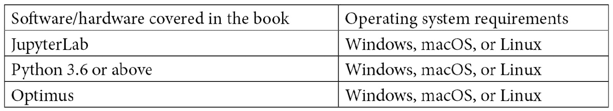

# 前言

Optimus 是一个 Python 库，它作为一个统一的 API 用于数据清理、处理和合并。它可以用于使用 CPU 或 GPU 的本地和大型集群上的小型和大型数据。使用 Optimus 进行数据处理向您展示如何使用该库来增强您的数据科学工作流程。

这本书首先介绍了 Optimus 的内部结构，并向您展示了它如何与现有技术协同工作来满足用户的数据处理需求。然后，您将使用 Optimus 加载和保存 CSV 和 JSON 文件等文本数据格式的数据，探索 Excel 等二进制文件，并使用 Parquet、Avro 和 OCR 进行列数据处理。接下来，您将了解 profiler 和 profiler 数据类型，这是 Optimus DataFrames 的一个独特功能，可以帮助您了解每一列的数据质量。您还将创建数据清理和转换函数，并添加一个假设的新数据处理引擎。稍后，您将探索 Optimus 中的图，如直方图和盒图，并了解 Optimus 如何让您连接到任何其他库，包括 Plotly 和 Altair。最后，您将了解 Optimus 的高级应用，如特征工程、机器学习和 NLP，并探索 Optimus 的进步。

到本书结束时，你将能够用 Optimus 轻松地改进你的数据科学工作流程。

# 这本书是给谁的

本书面向希望在 CPU 或 GPU 上使用 Spark 和 Dask 探索、转换和准备大数据以进行机器学习、分析和报告的 Python 开发人员。假设初级 Python 工作知识。

# 这本书涵盖了什么

[*第一章*](B17166_01_Final_SB_epub.xhtml#_idTextAnchor015) ，*嗨擎天柱！向我们展示了什么是 Optimus，为什么创建它，以及项目的目标。我们将很好地了解 Optimus 的内部工作方式，它与当前技术的不同之处，以及它如何与用户协同工作，以最佳的技术服务于用户的数据处理需求。*

[*第二章*](B17166_02_Final_SS_epub.xhtml#_idTextAnchor039) 、*数据* *加载、保存、文件格式*，都是关于如何使用 Optimus 从 CSV、JSON 等文本数据格式中加载、保存数据。此外，我们将探索二进制文件，如 Excel，以及一些针对列数据处理优化的文件，如 Parquet、Avro 和 OCR。最后，我们将学习如何连接到 SQLite 等数据库和 Redshift 等远程数据存储。

[*第 3 章*](B17166_03_Final_VK_epub.xhtml#_idTextAnchor064) ，*数据整理*，演示了如何按行和列连接数据，以及如何使用类似 SQL 的语法通过左、右、内、外方法合并数据。此外，我们将学习如何透视数据表，以便将数据放入数据管道中的下一步所需的形状中。

[*第 4 章*](B17166_04_Final_VK_epub.xhtml#_idTextAnchor085) ，*组合、整形和聚合数据*，教我们如何对数据列进行分组，并对每组数据应用汇总统计。从计数、最小和最大聚合到更高级的统计，如峰度和偏斜，我们将拥有计算任何所需统计的所有工具。

[像电子邮件、日期、URL、字符串和浮点这样的数据类型让用户可以像任何其他库一样轻松地标准化不匹配和缺失的数据。](B17166_05_Final_VK_epub.xhtml#_idTextAnchor099)

[*第六章*](B17166_06_Final_SB_epub.xhtml#_idTextAnchor112) ，*字符串* *聚类*，使用字符串聚类技术让我们轻松识别相似字符串的组，并用唯一值替换它们。

[*第七章*](B17166_07_Final_VK_epub.xhtml#_idTextAnchor124) ，*特征工程*，教我们如何创建新的特征供机器学习模型借鉴。我们将通过组合字段、从混乱的列中提取值或者对它们进行编码以获得更好的结果来生成它们。

[*第八章*](B17166_08_Final_SB_epub.xhtml#_idTextAnchor150) ，*机器学习*，向我们展示了如何轻松地创建机器学习模型，以及 Optimus 将如何处理实现细节，并在可能的情况下使特征工程工作，以及如何在训练后保存模型并加载供将来使用。

[*第九章*](B17166_09_Final_SB_epub.xhtml#_idTextAnchor168) ，*自然语言处理*，用例子向我们展示了如何轻松地准备数据以应用诸如词云、数据摘要、情感分析等技术。

[*第 10 章*](B17166_10_Final_SB_epub.xhtml#_idTextAnchor187) ， *Hacking Optimus* ，探讨了如何添加新的分析器数据类型来更好地处理质量问题。此外，我们将学习如何创建数据清理和转换功能，以及如何添加一个假设的新数据处理引擎。最后，我们将讨论 Optimus 社区，如何为项目做贡献，以及 Optimus 项目的下一步。

[*第十一章*](B17166_11_Final_SB_epub.xhtml#_idTextAnchor204) ， *Optimus 作为 web 服务*，演示了如何借助各种工具和插件将 Optimus 作为 Web 服务使用。

# 为了充分利用这本书



**如果你使用的是这本书的数字版，我们建议你自己输入代码或者从这本书的 GitHub 库中获取代码(下一节有链接)。这样做将帮助您避免任何与复制和粘贴代码相关的潜在错误。**

# 下载示例代码文件

您可以从 GitHub 的 https://GitHub . com/packt publishing/Data-Processing-with-Optimus 下载本书的示例代码文件。如果代码有更新，它会在 GitHub 库中更新。

我们在 https://github.com/PacktPublishing/也有丰富的书籍和视频目录中的其他代码包。看看他们！

# 下载彩色图片

我们还提供了一个 PDF 文件，其中有本书中使用的截图和图表的彩色图像。可以在这里下载:[https://static . packt-cdn . com/downloads/9781801079563 _ color images . pdf](_ColorImages.pdf)

# 习惯用法

本书通篇使用了许多文本约定。

`Code in text`:表示文本中的码字、数据库表名、文件夹名、文件名、文件扩展名、路径名、伪 URL、用户输入和 Twitter 句柄。下面是一个例子:“例如，在任何延迟的函数之后调用`df.display()`，都需要计算最终的数据。”

代码块设置如下:

```
from optimus import Optimus
op = Optimus("dask")
df = op.create.dataframe({"A":[0,1,2,3,4,5]})
df = df.cols.sqrt("A")
```

当我们希望将您的注意力吸引到代码块的特定部分时，相关的行或项目以粗体显示:

```
from optimus import Optimus
op = Optimus("dask")
df = op.create.dataframe({"A":[0,1,2,3,4,5]})
df = df.cols.sqrt("A")
```

任何命令行输入或输出都按如下方式编写:

```
coiled install optimus/default 
conda activate coiled-optimus-default
```

**粗体**:表示新术语、重要单词或您在屏幕上看到的单词。例如，菜单或对话框中的单词以**粗体**显示。下面是一个例子:通过启用**虚拟机平台**可选特性来启用 WSL 2。

提示或重要注意事项

像这样出现。

# 联系

我们随时欢迎读者的反馈。

**总体反馈**:如果你对这本书的任何方面有疑问，请发邮件到[customercare@packtpub.com](mailto:customercare@packtpub.com)给我们，并在邮件主题中提到书名。

**勘误表**:虽然我们已经尽力确保内容的准确性，但错误还是会发生。如果你在这本书里发现了一个错误，请告诉我们，我们将不胜感激。请访问 www.packtpub.com/support/errata 并填写表格。

**盗版**:如果您在互联网上遇到任何形式的我们作品的非法拷贝，如果您能提供我们的地址或网站名称，我们将不胜感激。请通过[copyright@packt.com](mailto:copyright@packt.com)联系我们，并提供材料链接。

**如果你有兴趣成为一名作家**:如果有一个你擅长的话题，你有兴趣写书或投稿，请访问[authors.packtpub.com](http://authors.packtpub.com)。

# 分享你的想法

一旦你阅读了 Optimus 的*数据处理，我们很想听听你的想法！请[点击这里直接进入亚马逊对这本书的评论页面](https://packt.link/r/1-801-07956-0)并分享你的反馈。*

您的评论对我们和技术社区非常重要，将有助于我们确保提供高质量的内容。