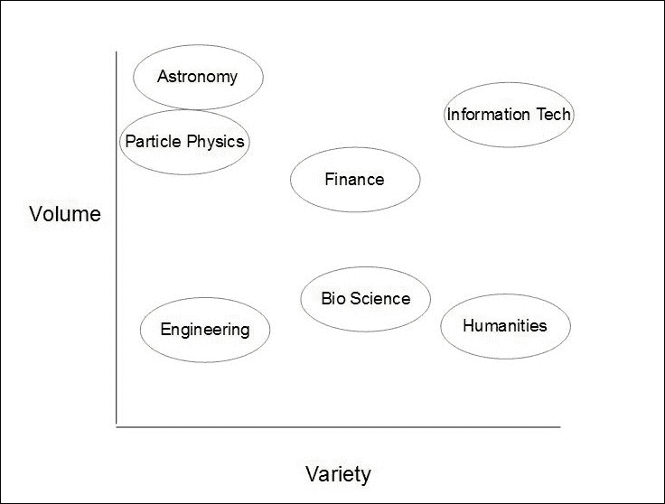
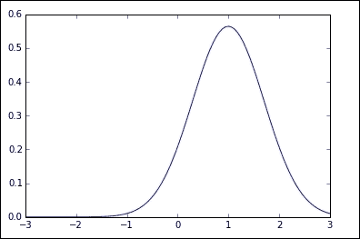
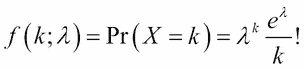
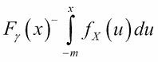
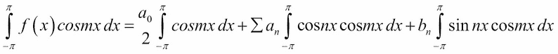
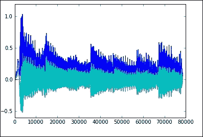

# 三、将数据转化为信息

原始数据可以有多种不同的格式，数量和质量也各不相同。有时，我们被数据淹没，有时我们努力从数据中获取每一滴信息。为了让数据变成信息，它需要某种有意义的结构。我们经常不得不处理不兼容的格式、不一致、错误和丢失的数据。能够访问数据集的不同部分或根据一些关系标准提取数据子集是很重要的。我们需要发现数据中的模式，并了解数据是如何分布的。我们可以使用许多工具来找到隐藏在可视化数据中的信息，运行算法，或者只是查看电子表格中的数据。

在本章中，我们将介绍以下广泛的主题:

*   大数据
*   数据属性
*   数据源
*   数据处理和分析

但首先，让我们来看看下面的解释:

# 什么是数据？

数据可以存储在硬盘上，通过网络传输，或者通过摄像机和麦克风等传感器实时捕捉。如果我们从物理现象中取样，如视频或录音，空间是连续的，实际上是无限的。一旦这个空间被采样，即被数字化，这个空间的有限子集就被创建，并且至少一些最小的结构被强加于其上。数据存储在硬盘上，以比特编码，并给出一些属性，如名称、创建日期等。除此之外，如果要在应用程序中使用数据，我们需要问:“数据是如何组织的，它有效地支持哪种查询？”

当面对一个未知的数据集时，第一阶段是探索。数据探索包括检查数据的组件和结构。它包含多少个样本，每个样本有多少个维度？每个维度的数据类型是什么？我们还应该了解变量之间的关系以及它们是如何分布的。我们需要检查数据值是否符合我们的预期。数据中是否有明显的错误或缺口？

数据探索一定要框在特定问题的范围内。显然，首先要弄清楚的是数据集是否可能提供有用的答案。是否值得我们继续下去，或者我们需要收集更多的数据？探索性的数据分析不一定是带着特定的假设进行的，但也许是带着对哪些假设可能提供有用信息的感觉。

数据是支持或否定假设的证据。这一证据只有在能与一个竞争假说相比较时才有意义。在任何科学过程中，我们都使用控制。为了检验一个假设，我们需要将它与一个等价系统进行比较，在这个系统中，我们感兴趣的变量集保持不变。我们应该试图用一种机制和解释来说明因果关系。我们需要一个合理的理由来解释我们的观察。我们还应该考虑到，现实世界是由多个相互作用的组件组成的，处理多元数据会导致复杂性呈指数级增长。

正是带着这些想法，我们试图探索的领域的草图，我们接近新的数据集。我们有一个目标，一个我们希望到达的点，我们的数据是一张穿越未知地形的地图。


# 大数据

全球范围内创建和存储的数据量几乎是不可思议的，而且还在持续增长。大数据是一个描述大量数据的术语，包括结构化和非结构化数据。现在，让我们更深入地探讨大数据，从大数据的挑战开始。

## 大数据的挑战

大数据的特点是面临三大挑战。它们如下:

*   数据量
*   数据的速度
*   数据的多样性

### 数据量

体积问题可以从三个不同的方向着手:**效率**、**可伸缩性**和**并行性**。效率是关于最小化算法处理一个信息单元所花费的时间。其中一个因素是硬件的底层处理能力。另一个因素，也是我们更能控制的因素，是确保我们的算法不会在不必要的任务上浪费宝贵的处理周期。

可伸缩性实际上是蛮力和尽可能多的硬件来解决问题。将考虑在内**摩尔定律**，该定律陈述了计算机能力每两年翻倍的趋势将持续到其极限；很明显，可伸缩性本身无法跟上不断增长的数据量。在许多情况下，简单地添加更多内存和更快的处理器并不是一个经济高效的解决方案。

并行是机器学习的一个增长领域，它包含了许多不同的方法，从利用多核处理器的能力，到许多不同平台上的大规模分布式计算。最常见的方法可能是在多台机器上运行相同的算法，每台机器使用不同的参数集。另一种方法是将学习算法分解成自适应的查询序列，并并行处理这些查询。这种技术的一个常见实现被称为 **MapReduce** ，或者它的开源版本 **Hadoop** 。

### 数据速度

速度问题通常从数据生产者和数据消费者的角度来处理。两者之间的数据传输速率称为速度，可以用交互响应时间来衡量。这是从发出查询到发送响应所花费的时间。响应时间受到延迟的限制，例如硬盘读写时间，以及通过网络传输数据所需的时间。

数据产生的速度越来越快，这在很大程度上是由移动网络和设备的快速扩张所推动的。越来越多的日常生活工具正在彻底改变产品和服务的交付方式。这种不断增加的数据流导致了**流处理**的想法。当输入数据的速度使其无法完整存储时，就需要对数据流进行一定程度的分析，从本质上决定哪些数据是有用的，应该存储哪些数据，哪些数据可以丢弃。一个极端的例子是欧洲粒子物理研究所的**大型强子对撞机**，在那里绝大多数数据被丢弃。一个复杂的算法必须在数据生成时扫描数据，在数据堆中寻找信息针。处理数据流可能很重要的另一个例子是当应用程序需要立即响应时。这越来越多地用于在线游戏和股票交易等应用中。

我们感兴趣的不仅仅是输入数据的速度；在许多应用程序中，尤其是在 web 上，系统输出的速度也很重要。考虑像这样的应用程序作为推荐系统，它们需要处理大量数据，并在网页加载时间内给出响应。

### 数据种类

从不同来源收集数据总是意味着处理错位的数据结构和不兼容的格式。这也经常意味着处理不同的语义，并且不得不理解一个可能建立在完全不同的逻辑前提上的数据系统。我们必须记住，通常情况下，数据被重新用于完全不同于其最初用途的应用程序。有大量不同的数据格式和底层平台。将数据转换成一种一致的格式会花费大量时间。即使这样做了，数据本身也需要对齐，以便每个记录包含相同数量的要素，并以相同的单位进行测量。

考虑从 web 页面获取数据这一相对简单的任务。数据已经通过使用标记语言(通常是 HTML 或 XML)进行了结构化，这可以帮助我们获得一些初始结构。然而，我们只需细读网络，就能发现没有一种标准的方式来以与信息相关的方式呈现和标记内容。XML 的目的是在标记标签中包含内容相关的信息，例如，通过使用作者标签或主题标签。然而，这种标签的使用远非通用和一致的。此外，网络是一个动态的环境，许多网站经历着频繁的结构变化。这些变化通常会破坏期望特定页面结构的 web 应用程序。

下图显示了大数据挑战的两个方面。我已经列举了几个例子，说明这些领域可能大致属于这个领域。例如，天文学的来源很少。它拥有相对较少的望远镜和天文台。然而天文学家处理的数据量是巨大的。另一方面，也许，让我们把它比作类似环境科学的东西，在环境科学中，数据来自各种来源，如遥感器、实地调查、经过验证的二手材料等等。



集成不同的数据集可能需要大量的开发时间；在某些案例中高达 90%。每个项目的数据需求都是不同的，设计过程的一个重要部分是根据这三个要素定位我们的数据集。

## 数据模型

数据科学家面临的一个基本问题是如何存储数据。我们可以谈论硬件，在这方面，我们指的是非易失性存储器，如计算机硬盘或闪存盘。解释这个问题的另一种方式(更符合逻辑的方式)是数据是如何组织的？在个人电脑中，数据存储最明显的方式是分层的，在嵌套的文件夹和文件中。数据也可以存储在表格或电子表格中。当我们思考结构时，我们感兴趣的是类别和类别类型，以及它们之间的关系。在一个表中，我们需要多少列，在关系数据库中，表是如何链接的？数据模型不应该试图给数据强加一种结构，而应该从数据中找到一种最自然的结构。

数据模型由三部分组成:

*   **结构**:表格由列和行组成；树形结构有节点和边，字典有键值对的结构。
*   **约束**:定义有效结构的类型。对于一个表，这将包括这样一个事实:所有的行都有相同数量的列，并且每一列包含每一行相同的数据类型。例如，`items sold`列只包含整数值。对于分层结构，约束是只能有一个直接父级的文件夹。
*   **操作**:这包括查找特定的值、给定一个键，或者查找所有销售额大于 100 的行。这有时被认为与数据模型分离，因为它通常是一个更高层次的软件层。然而，所有这三个组件都是紧密耦合的，因此将操作视为数据模型的一部分是有意义的。

为了用数据模型封装原始数据，我们创建了数据库。数据库解决了一些关键问题:

*   **它们允许我们共享数据**:它允许多个用户以不同的读写权限访问相同的数据。
*   他们实现一个数据模型:这不仅包括由结构强加的约束，比如层次结构中的父子关系，还包括更高层次的约束，比如只允许一个名为 *bob* 的用户，或者是一个 1 到 8 之间的数字。
*   **它们允许我们扩展**:一旦数据大于我们的易失性存储器的分配大小，就需要一些机制来促进数据的传输，并且允许大量行和列的有效遍历。
*   数据库允许灵活性:它们本质上试图隐藏复杂性，并提供与数据交互的标准方式。

## 数据分布

数据的一个关键特征是它的概率分布。最常见的分布是正态或高斯分布。这种分布见于许多(所有？)物理系统，它是任何随机过程的基础。正态函数可以根据**概率密度函数**来定义:


这里，**δ**(**σ**)为**标准差**，**(**μ**)为**均值**。这个等式简单地描述了随机变量 **x** 取给定值的相对可能性。我们可以将标准差解释为钟形曲线的宽度，平均值作为其中心。有时，术语**方差**被使用，这就是标准偏差的平方。标准偏差本质上是测量值的分布程度。根据一般经验，在正态分布中，68%的值在平均值的 1 个标准偏差内，95%的值在平均值的 2 个标准偏差内，99.7%在平均值的 3 个标准偏差内。**

**我们可以通过运行下面的代码并使用不同的均值和方差值调用`normal()`函数来感受这些术语的作用。在本例中，我们创建了一个正态分布图，平均值为`1`，方差为`0.5`:**

```
**import numpy as np**
**import matplotlib.pyplot as plt**
**import matplotlib.mlab as mlab**

**def normal(mean = 0, var = 1):**
 **sigma = np.sqrt(var)**
 **x = np.linspace(-3,3,100)**
 **plt.plot(x,mlab.normpdf(x,mean,sigma))**
 **plt.show()**

**normal(1,0.5)** 
```

****

**与高斯分布相关的是二项式分布。我们实际上是通过重复二项式过程来获得正态分布，比如扔硬币。随着时间的推移，有一半的投掷会正面朝上。**

****

**在这个公式中， **n** 是掷硬币的次数， **p** 是半数掷的是正面的概率， **q** 是半数掷的是反面的概率( *1-p* )。在一个典型的实验中，比方说确定一系列抛硬币的各种结果的概率， **n** ，我们可以进行多次这样的实验，显然我们进行实验的次数越多，我们对系统的统计行为的理解就越好:**

```
**from scipy.stats import binom**
**def binomial(x=10,n=10, p=0.5):**
 **fig, ax = plt.subplots(1, 1)**
 **x=range(x)**
 **rv = binom(n, p)**
 **plt.vlines(x, 0, (rv.pmf(x)), colors='k', linestyles='-')**
 **plt.show()**
**binomial()** 
```

**您将看到以下输出:**

****

**离散分布的另一个方面是了解特定空间和/或时间内发生给定数量事件的可能性。如果我们知道给定事件以平均速率发生，并且每个事件独立发生，我们可以将其描述为泊松分布。使用概率质量函数，我们可以更好地理解这种分布。这衡量的是给定事件在给定时间/空间点发生的概率。**

**泊松分布有两个相关的参数:**λ**、 **λ** ，一个大于 0 的实数，以及 *k* ，一个为 0、1、2 等等的整数。**

****

**这里，我们使用`scipy.stats`模块生成泊松分布图:**

```
**from scipy.stats import poisson**
**def pois(x=1000):**
 **xr=range(x)**
 **ps=poisson(xr)**
 **plt.plot(ps.pmf(x/2))**
**pois()** 
```

**上述命令的输出如下图所示:**

****

**我们可以使用概率密度函数描述连续数据分布。这描述了一个连续的随机变量取特定值的可能性。对于单变量分布，即只有一个随机变量的分布，在区间( *a，b* )上找到点 *X* 的概率由下式给出:**

****

**这描述了取样总体的分数，其值 **x** 位于 **a** 和 **b** 之间。密度函数只有在积分时才有意义，这将告诉我们某个值周围的人口分布有多密集。直观上，我们把这个理解为这两点之间其概率函数的图形下的面积。**累积密度函数** ( **CDF** )定义为其概率密度函数 **fx** 的积分:**

****

**CDF 描述了特定变量的值小于 **x** 的抽样人口的比例。下面的代码显示了一个离散(二项式)累积分布函数。 **s1** 和 **s2** 形状参数决定步长:**

```
**import scipy.stats as stats**
**def cdf(s1=50,s2=0.2):**

 **x = np.linspace(0,s2 * 100,s1 *2)**
 **cd = stats.binom.cdf**
 **plt.plot(x,cd(x, s1, s2))**
 **plt.show()** 
```

## **来自数据库的数据**

**我们通常通过查询语言与数据库进行交互。最流行的查询语言之一是 MySQL。Python 有一个数据库规范 PEP 0249，它创建了一种一致的方式来处理多种数据库类型。这使得我们编写的代码在数据库之间更具可移植性，并允许更大范围的数据库连接。为了说明这有多简单，我们将使用`mysql.connector`类作为例子。MySQL 是最流行的数据库格式之一，它有一种简单易懂的查询语言。为了练习使用这个类，您需要在您的机器上安装一个 MySQL 服务器。这可从[https://dev.mysql.com/downloads/mysql/](https://dev.mysql.com/downloads/mysql/)获得。**

**这也应该伴随着一个名为 **world** 的测试数据库，其中包括世界城市的统计数据。**

**确保 MySQL 服务器正在运行，并运行以下代码:**

```
**import mysql.connector**
**from mysql.connector import errorcode**

**cnx = mysql.connector.connect(user='root', password='password',**
 **database='world', buffered=True)**
**cursor=cnx.cursor(buffered=True)**
**query=("select * from city where population > 1000000 order by population")**
**cursor.execute(query)**
**worldList=[]**
**for (city) in cursor:**
 **worldList.append([city[1],city[4]])**
**cursor.close()**
**cnx.close()** 
```

## **来自网络的数据**

**web 上的信息被组织成 HTML 或 XML 文档。标记标签给了我们清晰的*钩子*让我们对数据进行采样。数字数据经常出现在表格中，这使得它相对容易使用，因为它已经以一种有意义的方式进行了结构化。让我们来看一段典型的 HTML 文档摘录:**

```
<table border="0" cellpadding="5" cellspacing="2" class="details" width="95%">
  <tbody>

  <th>Species</th>
  <th>Data1</th>
  <th>data2</th>
  </tr>

  <td>whitefly</td>
  <td>24</td>
  <td>76</td>
  </tr>
  </tbody>
</table>
```

**这显示了表格的前两行，一个标题和一行包含两个值的数据。Python 有一个优秀的库`Beautiful Soup`，用于从 HTML 和 XML 文档中提取数据。在这里，我们将一些测试数据读入一个数组，并将其转换成一种适合输入机器学习算法的格式，比如线性分类器:**

```
**import urllib**
**from bs4 import BeautifulSoup**
**import numpy as np**

**url = urllib.request.urlopen("http://interthing.org/dmls/species.html");**
**html = url.read()**
**soup = BeautifulSoup(html, "lxml")**
**table = soup.find("table")**

**headings = [th.get_text() for th in table.find("tr").find_all("th")]**

**datasets = []**
**for row in table.find_all("tr")[1:]:**
 **dataset = list(zip(headings, (td.get_text() for td in row.find_all("td"))))**
 **datasets.append(dataset)**

**nd=np.array(datasets)**
**features=nd[:,1:,1].astype('float')**
**targets=(nd[:,0,1:]).astype('str')**
**print(features)**
**print(targets)** 
```

**正如我们所看到的，这是相对直接的。我们需要意识到的是，我们依赖于我们的源网页保持不变，至少在它的整体结构方面。以这种方式从网上获取数据的主要困难之一是，如果网站的所有者决定改变他们页面的布局，这很可能会破坏我们的代码。**

**你可能遇到的另一种数据格式是 JSON 格式。JSON 最初用于序列化 JavaScript 对象，但是并不依赖于 Javascript。它仅仅是一种编码格式。JSON 很有用，因为它可以表示层次化和多元的数据结构。它基本上是键值对的集合:**

```
{"Languages":[{"Language":"Python","Version":"0"},{"Language":"PHP","Version":"5"}],
"OS":{"Microsoft":"Windows 10", "Linux":"Ubuntu 14"},
"Name":"John\"the fictional\" Doe",
"location":{"Street":"Some Street", "Suburb":"Some Suburb"},
"Languages":[{"Language":"Python","Version":"0"},{"Language":"PHP","Version":"5"}]
}
```

**如果我们将前面的 JSON 保存到一个名为`jsondata.json`的文件中:**

```
**import json**
**from pprint import pprint**

**with open('jsondata.json') as file:** 
 **data = json.load(file)**

**pprint(data)** 
```

## **来自自然语言的数据**

**自然语言处理是机器学习中比较难做的事情之一，因为它专注于目前机器不太擅长的事情:理解复杂现象中的结构。**

**作为起点，我们可以对我们正在考虑的问题空间做一些陈述。与特定对话中使用的单词子集相比，任何语言中的单词数量通常都非常大。我们的数据与其存在的空间相比是稀疏的。此外，单词往往以预先定义的顺序出现。某些单词更有可能一起出现。句子有一定的结构。不同的社交场合，如工作、家庭或外出社交；或者在正式场合，如与管理机构、政府和官僚机构交流时，都需要使用词汇的重叠子集。除了肢体语言、语调、眼神交流等线索外，社交环境可能是从自然语言中提取意义的最重要因素。**

**为了在 Python 中使用自然语言，我们可以使用**自然语言工具包** ( **NLTK** )。如果没有安装，可以执行`pip install -U nltk`命令。**

**NLTK 也有一个大的词汇资源库。您需要单独下载这些文件，NLTK 有一个下载管理器，可以通过下面的代码访问:**

```
**import nltk**
**nltk.download()** 
```

**应该会打开一个窗口，您可以在其中浏览各种文件。这包括一系列的书籍和其他书面材料，以及各种词汇模型。要开始，你可以下载这个包，`Book`。**

**文本语料库是由许多单独的文本文件组成的大量文本。NLTK 带有来自各种来源的**语料库** ，例如古典文学(古腾堡语料库)、网络和聊天文本、路透社新闻，以及包含按新闻、社论、宗教、小说等类型分类的文本的语料库。您还可以使用以下代码加载任何文本文件集合:**

```
**from nltk.corpus import PlaintextCorpusReader**
**corpusRoot= 'path/to/corpus'**
**yourCorpus=PlaintextCorpusReader(corpusRoot, '.*')** 
```

**`PlaintextCorpusReader`方法的第二个参数是一个正则表达式，表示要包含的文件。在这里，它只是表示包含了该目录中的所有文件。第二个参数也可以是文件位置列表，比如`['file1', 'dir2/file2']`。**

**让我们来看一个现有的语料库，作为一个例子，我们将加载 Brown 语料库:**

```
**from nltk.corpus import brown**
**cat=brown.categories()**
**print(cat)**

**['adventure', 'belles_lettres', 'editorial', 'fiction', 'government', 'hobbies', 'humor', 'learned', 'lore', 'mystery', 'news', 'religion', 'reviews', 'romance', 'science_fiction']** 
```

**布朗语料库是有用的，因为它使我们能够研究体裁之间的系统差异。这里有一个例子:**

```
**from nltk.corpus import brown**
**cats=brown.categories()**
**for cat in cats:**
 **text=brown.words(categories=cat)**
 **fdist = nltk.FreqDist(w.lower() for w in text)**
 **posmod = ['love', 'happy', 'good', 'clean']**
 **negmod = ['hate', 'sad', 'bad', 'dirty']

    pcount=[]**
 **ncount=[]** 
 **for m in posmod:**
 **pcount.append(fdist[m])**
 **for m in negmod:**
 **ncount.append(fdist[m])**

 **print(cat + ' positive: ' + str(sum(pcount)))**
 **print(cat + ' negative: ' + str(sum(ncount)))**
 **rat=sum(pcount)/sum(ncount)**
 **print('ratio= %s'%rat )**
 **print()** 
```

**在这里，我们通过比较四个正面情感词和它们的反义词的出现次数，从不同的体裁中提取了情感数据。**

## **来自图像的数据**

**图像是一种丰富且容易获得的数据源，对于学习应用非常有用，例如对象识别、分组、对象分级以及图像增强。当然，图像可以作为一个时间序列放在一起。动画图像对于演示和分析都很有用；例如，我们可以使用视频来研究轨迹、监控环境和学习动态行为。**

**图像数据被结构化为网格或矩阵，每个像素被赋予颜色值。我们可以通过使用 Python 图像库来感受一下这是如何工作的。对于本例，您需要执行以下几行:**

```
**from PIL import Image**
**from matplotlib import pyplot as plt**
**import numpy as np**
**image= np.array(Image.open('data/sampleImage.jpg'))**
**plt.imshow(image, interpolation='nearest')**
**plt.show()**
**print(image.shape)**

**Out[10]: (536, 800, 3)** 
```

**我们可以看到这张图片宽 536 像素，高 800 像素。每个像素有 3 个值，分别代表红色、绿色和蓝色的 0 到 255 之间的颜色值。注意坐标系的原点( *0，0* )在左上角。一旦我们有了 NumPy 数组形式的图像，我们就可以开始以有趣的方式使用它们，例如，拍摄切片:**

```
**im2=image[0:100,0:100,2]** 
```

## **来自应用编程接口的数据**

**许多社交网络平台都有应用编程接口(API ),让程序员可以访问各种功能。这些接口可以生成大量的流数据。这些 API 中有许多对 Python 3 和其他一些操作系统有不同的支持，所以要准备好做一些关于系统兼容性的研究。**

**获得对平台 API 的访问通常包括向供应商注册应用程序，然后使用提供的安全凭证(如公钥和私钥)来验证应用程序。**

**让我们来看看 Twitter API，它相对容易访问，并且有一个开发良好的 Python 库。首先，我们需要加载 Twitter 库。如果您还没有它，只需在 Python 命令提示符下执行`pip install twitter`命令。**

**你需要一个 Twitter 账户。登录并前往[apps.twitter.com](http://apps.twitter.com)。点击**创建新应用**按钮，并在**创建应用**页面上填写详细信息。提交后，您可以通过在应用程序管理页面点击您的应用程序，然后点击**密钥和访问令牌**选项卡来访问您的凭证信息。**

**这里我们感兴趣的四个项目是 API 密钥、API 秘密、访问令牌和访问令牌秘密。现在，创建我们的`Twitter`对象:**

```
**from twitter import Twitter, OAuth**
**#create our twitter object**
**t = Twitter(auth=OAuth(accesToken, secretToken, apiKey, apiSecret))**

**#get our home time line**
**home=t.statuses.home_timeline()**

**#get a public timeline**
**anyone= t.statuses.user_timeline(screen_name="abc730")**

**#search for a hash tag** 
**pycon=t.search.tweets(q="#pycon")**

**#The screen name of the user who wrote the first 'tweet'**
**user=anyone[0]['user']['screen_name']**

**#time tweet was created**
**created=anyone[0]['created_at']**

**#the text of the tweet**
**text= anyone[0]['text']** 
```

**当然，您需要填写之前从 Twitter 获得的授权凭证。请记住，在一个可公开访问的应用程序中，您永远不会以人类可读的形式拥有这些凭证，当然也不会在文件本身中，最好在公共目录之外加密。**

**

# 信号

在初级科学研究中经常遇到的一种数据形式是各种二进制流。视频和音频传输和存储有特定的编解码器，通常，我们会寻找更高级的工具来处理每种特定的格式。我们可能会考虑各种信号源，例如射电望远镜、摄像机传感器或麦克风的电脉冲。基于波动力学和谐波运动，信号都有相同的基本原理。

通常使用时间频率分析来研究信号。这里的中心概念是，时间和空间中的连续信号可以分解成频率分量。我们使用所谓的傅立叶变换在时域和频域之间移动。这利用了一个有趣的事实，即任何给定的函数，包括非周期函数，都可以用一系列正弦和余弦函数来表示。下面的例子说明了这一点:


为了让这个有用，我们需要找到*a[n]和*b[n]的值。我们通过将等式两边的余弦、 *mx* 相乘并积分来实现。这里的 *m* 是一个整数。**



这被称为**正交函数，类似于我们认为 *x* 、 *y* 和 *z* 在向量空间中是正交的。现在，如果你能记住你所有的三角函数，你就会知道整数系数的*正弦*乘以*余弦*在负 *pi* 和 *pi* 之间永远为零。如果我们做计算，结果是左手边的中项是零，除了当 *n* 等于 *m* 的时候。在这种情况下，该项等于 *pi* 。知道了这一点，我们可以写出如下内容:**

****

**所以，第一步，如果我们乘以 *sin mx* 而不是*余弦 mx* ，那么我们就可以推导出*b[n]的值。***

****

**我们可以看到，我们已经将一个信号分解成一系列的*正弦*值和*余弦*值。这使我们能够分离信号的频率成分。**

## **数据来自声音**

**音频是最常见也最容易学习的信号之一。我们将使用`soundfile`模块。如果没有，可以通过`pip`安装。`soundfile`模块有一个`wavfile.read`类，它将`.wav`文件数据作为 NumPy 数组返回。要尝试下面的代码，您需要一个名为 `audioSamp.wav`的 16 位短 wave 文件。这个可以从[davejulian.net/mlbook](http://davejulian.net/mlbook)下载。将它保存在您的数据目录中，在您的工作目录中:**

```
**import soundfile as sf**
**import matplotlib.pyplot as plt**
**import numpy as np**

**sig, samplerate = sf.read('data/audioSamp.wav')**
**sig.shape** 
```

**我们看到声音文件由许多样本表示，每个样本有两个值。这实际上是一个向量函数，描述了`.wav`文件。当然，我们可以创建声音文件的片段:**

```
**slice=sig[0:500,:]** 
```

**这里，我们对前 500 个样本进行切片。让我们计算切片的傅立叶变换，并绘制它:**

```
**ft=np.abs(np.fft.fft(slice))**
**Finally lets plot the result**
**plt.plot(ft)**
**plt.plot(slice)** 
```

**上述命令的输出如下:**

******

# 清洗数据

为了了解特定数据集可能需要哪些清理操作，我们需要考虑数据是如何收集的。一个主要的清理操作包括处理丢失的数据。我们在上一章检查温度数据时已经遇到过这样的例子。在这种情况下，数据有一个质量参数，所以我们可以简单地排除不完整的数据。然而，对于许多应用程序来说，这可能不是最佳解决方案。可能需要填写缺失的数据。我们如何决定使用什么数据？对于我们的温度数据，我们可以用一年中那个时间的平均值来填充缺失值。注意，我们预先假定了一些领域知识，例如，数据或多或少是周期性的；符合季节循环。因此，这是一个公平的假设，我们可以采取平均的特定日期，每年我们有一个可靠的记录。然而，考虑到我们正试图找到一个代表由于气候变化而导致的温度升高的信号。在这种情况下，取所有年份的平均值会扭曲数据，并可能隐藏可能表明变暖的信号。同样，这需要额外的知识，并且具体到我们实际上想从数据中学到什么。

另一个考虑因素是，缺失数据可能是以下三种类型之一:

*   `empty`
*   `zero`
*   `null`

不同的编程环境对此的处理可能略有不同。三者之中，只有零是可测量的量。我们知道零可以放在一个数轴上，在 1，2，3 之前，以此类推，我们可以将其他数与零进行比较。因此，通常零被编码为数字数据。空不一定是数字，尽管是空的，但它们可能传达信息。例如，如果表单中有一个用于*中间名*的字段，而填写表单的人没有一个*中间名*，那么一个`empty`字段准确地表示一种特定的情况，即没有中间名。同样，这取决于域。在我们的温度数据中，一个`empty`字段表示缺少数据，因为没有最高温度的某一天是没有意义的。另一方面，在计算中，空值的含义与其日常用法略有不同。对于计算机科学家来说，null 与没有值或零不是一回事。空值不能与任何其他值进行比较；它们表示某个字段有合法的理由不包含条目。空值不同于空值。在我们的中间名示例中，空值表示不知道这个人是否有中间名。

另一个常见的数据清理任务是将数据转换成特定的格式。在这里，我们感兴趣的最终数据格式是 Python 数据结构，比如 NumPy 数组。我们已经看到了从 JSON 和 HTML 格式转换数据，这相当简单。

我们可能会遇到的另一种格式是 Acrobats 的可移植文档格式。从 PDF 文件导入数据可能相当困难，因为 PDF 文件是基于页面布局原语构建的，与 HTML 或 JSON 不同，它们没有有意义的标记标签。有几个非 Python 工具可以将 pdf转换成文本，比如**pdf text**。这是一个命令行工具，包含在许多 Linux 发行版中，也可用于 Windows。一旦我们将 PDF 文件转换成文本，我们仍然需要提取数据，文档中嵌入的数据决定了我们如何提取它。如果数据与文档的其余部分分离，比如在一个表中，那么我们可以使用 Python 的文本解析工具来提取它。或者，我们可以使用 Python 库来处理 PDF 文档，如 **pdfminer3k** 。

另一个常见的清理任务是数据类型之间的转换。在类型之间转换时，总是有丢失数据的风险。当目标类型存储的数据比源少时，就会发生这种情况，例如，从 float 32 转换到 float 16。有时，我们需要在文件级别转换数据。当文件具有隐式类型结构(例如电子表格)时，会出现这种情况。这通常在创建文件的应用程序中完成。例如，可以将 Excel 电子表格保存为逗号分隔的文本文件，然后导入 Python 应用程序。


# 可视化数据

我们为什么可视化地表示数据有很多原因。在数据探索阶段，我们可以立即了解数据属性。视觉表示用于突出数据中的模式并建议建模策略。探索性图表通常制作迅速且数量庞大。我们不太关心美学或风格问题，但我们只是想看看数据看起来像什么。

除了使用图表来探索数据，它们还是交流数据信息的主要方式。视觉呈现有助于阐明数据属性，刺激观众参与。人类视觉系统是通往大脑的最高带宽通道，可视化是呈现大量信息的最有效方式。通过创建可视化，我们可以立即了解重要的参数，例如数据中可能出现的最大值、最小值和趋势。当然，这些信息可以通过统计分析从数据中提取，但是，分析可能无法揭示数据中的特定模式，而可视化可以。目前，人类视觉模式识别系统明显优于机器。除非我们有关于我们在寻找什么的线索，否则算法可能不会挑出人类视觉系统会挑出的重要模式。

数据可视化的核心问题是将数据元素映射到可视属性。为此，我们首先将数据类型分为名义数据、顺序数据或数量数据，然后确定哪些可视属性最有效地代表了每种数据类型。名义或分类数据指的是一个名称，如物种、雄性或雌性等等。名义数据没有特定的顺序或数值。有序数据具有内在的顺序，如街道上的门牌号码，但它不同于定量数据，因为它并不意味着数学区间。比如门牌号相乘或者相除，没有太大意义。定量数据有一个数值，如大小或体积。显然，某些视觉属性不适用于名义数据，例如大小或位置；它们意味着序数或数量信息。

有时，并不清楚特定数据集中的每种数据类型是什么。消除这种歧义的一种方法是找出适用于每种数据类型的操作。例如，当我们比较名义数据时，我们可以使用 equals，例如，物种**粉虱**不是等于物种**蓟马**。但是，我们不能使用诸如大于或小于这样的运算。从顺序的意义上说，一个物种比另一个物种更伟大是没有意义的。对于顺序数据，我们可以应用大于或小于等操作。序数数据有一个隐含的顺序，我们可以把它映射到数字线上。对于定量数据，它由一个区间组成，比如一个日期范围，我们可以对其应用额外的操作，比如减法。例如，我们不仅可以说一个特定的日期发生在另一个日期之后，而且我们还可以计算两个日期之间的差异。对于有固定轴的定量数据，即某个固定量与区间的比率，我们可以使用除法之类的运算。我们可以说一个特定的目标是另一个目标的两倍重或两倍长。

一旦我们明确了数据类型，我们就可以开始将它们映射到属性。这里，我们将考虑六个视觉属性。它们是位置、大小、纹理、颜色、方向和形状。其中，只有位置和大小可以准确地表示所有三种类型的数据。另一方面，纹理、颜色、方向和形状只能准确地表示名义数据。我们不能说一种形状或颜色比另一种更好。然而，我们可以将特定的颜色或纹理与名称联系起来。

另一个要考虑的是这些视觉属性的感知属性。心理学和心理物理学的研究已经证实，视觉属性可以根据感知的准确程度进行排序。位置感知最准确，其次是长度、角度、坡度、面积、体积，最后是颜色和密度，感知最不准确。因此，给最重要的量化数据分配位置和长度是有意义的。最后，还应该提到，在某种程度上，我们可以用颜色值(从暗到亮)对顺序数据进行编码，或者用颜色渐变对连续数据进行编码。我们通常不能用色调来编码这些数据。例如，没有理由认为蓝色比红色更重要，除非你提到它的频率。


表示序数数据的颜色渐变

接下来要考虑的是我们需要显示的维度数量。对于单变量数据，也就是说，我们只需要显示一个变量，我们有许多选择，如点，线或盒图。对于双变量数据，我们需要显示两个维度，最常见的是散点图。对于三变量数据，可以使用 3D 绘图，此可用于绘制几何函数，如流形。然而，3D 绘图对于许多数据类型都有一些缺点。在三维图上计算出相对距离可能是一个问题。例如，在下图中，很难测量每个元素的确切位置。然而，如果我们将 *z* 尺寸编码为大小，相对值会变得更加明显:


三维编码

将数据编码成可视化属性的设计空间很大。面临的挑战是为我们的特定数据集和目的找到最佳映射。起点应该是以最准确的感知方式对最重要的信息进行编码。有效的视觉编码将描述所有的数据，而不是暗示数据中没有的任何东西。例如，长度意味着定量数据，因此将非定量数据编码为长度是不正确的。另一个要考虑的方面是一致性。我们应该选择对每种数据类型最有意义的属性，并使用一致且定义良好的视觉样式。


# 总结

您已经了解到有大量的数据源、格式和结构。希望您已经对如何开始使用其中一些工具有了一些了解。重要的是要指出，在任何机器学习项目中，在这个基础级别上处理数据可能会占整个项目开发时间的很大一部分。

在下一章中，我们将通过探索最常见的机器学习模型来研究如何将我们的数据投入使用。****