<title>Chapter 7. Features – How Algorithms See the World</title>

# 第七章。特征——算法如何看待世界

到目前为止，在本书中，我们提出了创建、提取或操作特征的许多方法和原因。在这一章中，我们将正面讨论这个话题。正确的特征，有时被称为**属性**，是机器学习模型的核心组件。功能错误的复杂模型毫无价值。功能是我们的应用程序看待世界的方式。对于除了最简单的任务之外的所有任务，我们将在将特征输入模型之前对其进行处理。我们可以用许多有趣的方式来做到这一点，这是一个如此重要的主题，以至于用整整一章来讨论它是合适的。

只是在最近十年左右，机器学习模型才例行公事地使用数万个或更多的特征。这使我们能够处理许多不同的问题，例如那些与样本数量相比我们的特征集很大的问题。两个典型的应用是基因分析和文本分类。对于遗传分析，我们的变量是一组**基因表达系数**。这些是基于样本中存在的 mRNA 数量的，例如，取自组织活检。可以执行分类任务来预测患者是否患有癌症。训练样本和测试样本的总数可以小于 100。另一方面，原始数据中变量的数量可以在 6000 到 60000 的范围内。这不仅会转化为大量的特性，还意味着特性之间的值的范围也相当大。在本章中，我们将讨论以下主题:

*   特征类型
*   运营和统计
*   结构化特征
*   转换功能
*   主成分分析

# 特征类型

有三种不同类型的特征:数量特征、顺序特征和分类特征。我们还可以考虑第四种类型的特征——布尔型——因为这种类型确实有一些独特的性质，尽管它实际上是一种分类特征。这些特征类型可以根据它们传达的信息量来排序。数量特征具有最高的信息容量，其次是序数、分类和布尔。

让我们来看看表格分析:

| 

特征类型

 | 

命令

 | 

规模

 | 

趋势

 | 

散布

 | 

形状

 |
| --- | --- | --- | --- | --- | --- |
| **定量** | 是 | 是 | 平均 | 范围、方差和标准差 | 偏斜度，峰度 |
| **序数** | 是 | 不 | 中位数 | 分位数 | 钠 |
| **分类** | 不 | 不 | 方式 | 钠 | 钠 |

上表显示了三种类型的要素、它们的统计数据和属性。每个要素都继承了表中下一行要素的统计数据。例如，对数量特征的集中趋势的测量包括中位数和众数。

## 数量特征

数量特征的显著特征是它们是连续的，并且它们通常涉及到将它们映射成实数。通常，特征值可以映射到实数的子集，例如，用年表示年龄；但是，在计算统计数据时，必须注意使用满量程，例如平均值或标准差。因为定量特征具有有意义的数值范围，所以它们通常用于几何模型中。当在树模型中使用它们时，它们会导致二进制分割，例如，使用阈值，其中高于阈值的值会进入一个子节点，而等于或低于阈值的值会进入另一个子节点。树模型对尺度的单调变换不敏感，也就是说，变换不改变特征值的排序。例如，如果我们用厘米或英寸来测量长度，或者使用对数或线性标度，对树模型来说并不重要，我们只需将阈值改变到相同的标度。树模型忽略数量特征的尺度，将它们视为序数。对于基于规则的模型也是如此。对于概率模型，如朴素贝叶斯分类器，定量特征需要离散化到有限数量的箱中，并因此转换为分类特征。

## 序数特征

序数特征是具有明显顺序但没有标度的特征。它们可以被编码为整数值；然而，这样做并不意味着任何规模。一个典型的例子是门牌号。在这里，我们可以通过门牌号辨别出街道上房子的位置。我们假设 1 号房屋将在 20 号房屋之前，10 号和 11 号房屋将会彼此靠近。然而，数字的大小并不意味着任何规模；例如，没有理由相信 20 号门牌会比 1 号门牌大。序数特征的域是一个完全有序的集合，例如一组字符或字符串。因为序数特征缺乏线性标度，所以对它们进行加减是没有意义的；因此，诸如对序号要素求平均值之类的操作通常没有意义，也不会产生关于要素的任何信息。类似于树模型中的数量特征，序数特征导致二进制分割。一般来说，序数特征不容易在大多数几何模型中使用。例如，线性模型假设欧几里得实例空间，其中特征值被视为笛卡尔坐标。对于基于距离的模型，如果我们将它们编码为整数，并且它们之间的距离就是它们的差，那么我们可以使用序数特征。这有时被称为 **海明距离**。

## 分类特征

分类特征，有时被称为**名义特征**，没有任何排序或标度，因此，除了指示一个值最频繁出现的模式之外，它们不允许任何统计汇总。分类特征通常最好由概率模型处理；但是，也可以在基于距离的模型中使用汉明距离，将距离设置为 0 表示值相等，设置为 1 表示值不相等。分类特征的一个子类型是**布尔特征，**映射为布尔值真或假。

<title>Operations and statistics</title>

# 操作和统计

特征可由可对其执行的允许操作来定义。考虑两个特征:一个人的年龄和他们的电话号码。尽管这两个特征都可以用整数来描述，但它们实际上代表了两种截然不同的信息类型。当我们看到我们可以对它们有效地执行哪些操作时，这就很清楚了。比如计算一群人的平均年龄，会给我们一个有意义的结果；计算平均电话号码不会。

我们可以将可以对某个特征执行的可能计算的范围称为其统计数据。这些统计描述了数据的三个不同方面。这就是——它的**中心倾向**，它的 **分散**，它的 **形状**。

为了计算数据的中心趋势，我们通常使用以下一种或多种统计方法:均值(或平均值)、中位数(或有序列表中的中间值)和模式(或所有值的多数)。模式是唯一可以应用于所有数据类型的统计信息。为了计算中值，我们需要可以以某种方式排序的特征值，即序数或数量。为了计算平均值，数值必须用某种标度来表示，例如线性标度。换句话说，它们必须是定量特征。

最常见的计算离差的方法是通过方差或标准差的统计。这两者实际上是相同的测量值，但比例不同，标准差非常有用，因为它与要素本身的比例相同。此外，请记住，平均值和中位数之间的绝对差异永远不会大于标准差。测量离差的一个更简单的统计量是范围，即最小值和最大值之间的差值。当然，从这里，我们可以通过计算中点来估计特征的集中趋势。测量离差的另一种方法是使用单位(如百分位数或十分位数)来测量低于特定值的实例的比率。例如， *p ^(th)* 百分位数是实例的 *p* 百分比低于的值。

测量形状统计稍微复杂一点，可以使用样本的 **中心矩**的概念来理解。其定义如下:


这里， *n* 为样本数， *μ* 为样本均值， *k* 为整数。当 *k = 1* 时，第一个中心矩为 *0* ，因为这只是平均值的平均偏差，平均值始终为 *0* 。第二个中心矩是均值的平均方差，也就是方差。我们可以定义**偏斜度**如下:


这里的 *ơ* 是标准差。如果该公式给出一个正值，那么有更多实例的值高于平均值而不是低于平均值。数据在绘制时向右倾斜。当偏斜为负时，反之亦然。

我们可以将**峰度**定义为第四中心矩的类似关系:


可以看出，正态分布的峰度为 3。在这个值以上，分布将更加*见顶*。峰度值低于 3 时，分布将*变平*。

我们之前讨论了三种类型的数据，即分类数据、顺序数据和数量数据。

机器学习模型将以截然不同的方式对待不同的数据类型。例如，在分类特征上的决策树分裂将产生与值一样多的子代。对于序数和数量特征，分割将是二进制的，每个父代产生两个基于阈值的子代。因此，树模型将数量特征视为序数，忽略特征尺度。当我们将这样的概率模型视为**贝叶斯分类器**时，我们可以看到，它实际上将序数特征视为分类特征，并且它处理数量特征的唯一方式是将它们转换为有限数量的离散值，从而将它们转换为分类数据。

一般来说，几何模型需要量化的特征。例如，线性模型在欧几里得实例空间中操作，特征充当笛卡尔坐标。每个特征值都被视为与其他特征值的标量关系。基于距离的模型(如 k-最近邻)可以通过将距离设置为 0(对于相等的值)和 1(对于不相等的值)来合并分类特征。类似地，我们可以通过计算两个值之间的值的数量来将序数特征合并到基于距离的模型中。如果我们将特征值编码为整数，那么距离就是数字差。通过选择适当的距离度量，可以将有序和分类特征合并到基于距离的模型中。

<title>Structured features</title>

# 结构化特征

我们假设每个实例可以表示为一个特征值向量，并且所有相关方面都由这个向量表示。这有时被称为 **抽象**，因为我们过滤掉了不必要的信息，用向量来表示现实世界的现象。例如，将列夫·托尔斯泰的全部作品表示为词频向量是一种抽象。我们并不认为这种抽象将服务于一个非常特殊的有限的应用。我们可以学到一些关于托尔斯泰使用语言的知识，也许可以引出一些关于托尔斯泰作品的情感和主题的信息。然而，我们不太可能对这些作品中描绘的 19 世纪俄罗斯的广阔背景有任何深刻的了解。一个人类读者，或者一个更复杂的算法，将不会从每个单词的计数中获得这些洞察力，而是通过这些单词的结构。

我们可以用类似于数据库编程语言(如 SQL)中的查询的方式来考虑结构化特性。SQL 查询可以表示变量的集合，以完成诸如查找特定短语或查找包含特定字符的所有段落之类的任务。我们在机器学习环境中所做的是用这些集合属性创建另一个特征。

结构化特征可以在构建模型之前创建，也可以作为模型本身的一部分创建。在第一种情况下，这个过程可以理解为从一阶逻辑到命题逻辑的转换。这种方法的一个问题是，由于与现有功能的组合，它可能会导致潜在功能的数量激增。另一个要点是，在 SQL 中，一个子句可以覆盖另一个子句的子集，同样地，结构特性也可以是逻辑相关的。这是在机器学习的分支中开发的，它特别适合自然语言处理，被称为**归纳逻辑编程**。

<title>Transforming features</title>

# 转换功能

当我们转换特征时，我们的目标显然是让它们对我们的模型更有用。这可以通过添加、删除或更改特征所代表的信息来实现。一个常见特征转换是改变特征类型。典型的例子是**二值化**，即将一个分类特征转化为一组二值特征。另一个例子是将序数特征改变成分类特征。在这两种情况下，我们都会丢失信息。在第一种情况下，单个分类特征的值是互斥的，并且这不是由二进制表示传达的。在第二种情况下，我们丢失了订购信息。这些类型的转换可以被认为是归纳性的，因为它们由定义明确的逻辑过程组成，除了首先决定执行这些转换之外，不涉及客观的选择。

使用`sklearn.preprocessing.Binarizer`模块可以轻松实现二值化。让我们来看看以下命令:

```
from sklearn.preprocessing import Binarizer
from random import randint
bin=Binarizer(5)
X=[randint(0,10) for b in range(1,10)]
print(X)
print(bin.transform(X))

```

以下是上述命令的输出:


分类特征通常需要编码成整数。考虑一个非常简单的数据集，它只有一个分类特征，即城市，有三个可能的值，悉尼、珀斯和墨尔本，我们决定将这三个值分别编码为 0、1 和 2。如果这个信息在线性分类器中使用，那么我们将约束写成带有权重参数的线性不等式。然而，问题是这个权重不能编码为三路选择。假设我们有两个类，东海岸和西海岸，我们需要我们的模型来提供一个决策函数，该函数将反映珀斯在西海岸，而悉尼和墨尔本都在东海岸的事实。对于简单的线性模型，当要素以这种方式编码时，决策函数无法得出将悉尼和墨尔本归入同一类的规则。解决方案是将特征空间扩大为三个特征，每个特征都有自己的权重。这个叫做**一个热编码**。Sciki-learn 实现了`OneHotEncoder()`函数来执行这个任务。这是一个估计器，它将每个具有 *m* 个可能值的分类特征转换为 *m* 个二进制特征。假设我们正在使用一个模型，其中的数据包含前面示例中描述的城市特征和另外两个特征，即性别(可以是男性或女性)和职业(可以有三个值，即医生、律师或银行家)。因此，例如，*一位来自悉尼的女银行家*将被表示为*【1，2，0】*。为以下示例添加了另外三个示例:

```
from sklearn.preprocessing import OneHotEncoder
enc = OneHotEncoder()
enc.fit([[1,2,0], [1, 1, 0], [0, 2, 1], [1, 0, 2]])
print(enc.transform([1,2,0]).toarray())

```

我们将获得以下输出:


由于我们在这个数据集中有两种性别、三个城市和三份工作，所以转换数组中的前两个数字代表性别，接下来的三个数字代表城市，最后的三个数字代表职业。

## 离散化

我已经简要地提到了与决策树相关的阈值化的想法，其中我们通过找到合适的特征值进行分割，将序数或数量特征转换为二进制特征。有许多监督和非监督的方法可用于在连续数据中找到适当的分割，例如，使用集中趋势(监督)的统计，如平均值或中值，或基于信息增益等标准优化目标函数。

我们可以更进一步，创建多个阈值，将一个定量特征转化为一个有序特征。这里，我们将一个连续的数量特征分成许多离散的序数值。这些值中的每一个都被称为**箱**，并且每个箱代表原始定量特征上的一个区间。许多机器学习模型需要离散值。使用离散值创建基于规则的模型变得更加容易和易于理解。离散化也使得特征更紧凑，并且可以使我们的算法更有效。

最常见的方法之一是选择库，使得每个库具有大约相同数量的实例。这被称为**等频率离散化**，如果我们仅将它应用于两个仓，那么这与使用中值作为阈值是一样的。这种方法非常有用，因为可以用表示分位数的方式来设置容器边界。例如，如果我们有 100 个箱，那么每个箱代表一个百分点。

或者，我们可以选择边界，使每个箱具有相同的间隔宽度。这被称为**等宽离散化**。计算该容器宽度间隔值的一种方法是简单的将特征范围除以容器的数量。有时，特征没有上限或下限，我们无法计算它的范围。在这种情况下，可以使用高于和低于平均值的标准偏差的整数。宽度和频率离散化都是无监督的。它们不需要任何类别标签的知识就可以工作。

现在让我们把注意力转向监督离散化。基本上有两种方法:自上而下的或**分裂的**，以及**聚集的**或自下而上的方法。顾名思义，divider的工作原理是首先假设所有样本都属于同一个箱，然后逐步分割箱。凝聚的方法从每个实例的一个 bin 开始，并逐步合并这些 bin。这两种方法都需要一些停止标准来决定是否需要进一步拆分。

通过阈值处理递归分割特征值的过程是除法离散化的一个例子。要做到这一点，我们需要一个评分函数，为特定的特征值找到最佳阈值。一种常见的方法是计算分裂的信息增益或其熵。通过确定特定分割覆盖了多少正样本和负样本，我们可以基于该标准逐步分割特征。

简单的离散化操作可以通过 Pandas **cut** 和 **qcut** 方法进行。考虑下面的例子:

```
import pandas as pd
import numpy as np
print(pd.cut(np.array([1,2,3,4]), 3, retbins = True, right = False))

```

下面是观察到的输出:


## 正常化

阈值化和离散化都去除了定量特征的比例，并且根据应用，这可能不是我们想要的。或者，我们可能想给序数或分类特征增加一个尺度的度量。在无监督的设置中，我们称之为**规范化**。这通常用于处理在不同尺度上测量的定量特征。近似正态分布的特征值可以转换为 *z* 分数。这只是高于或低于平均值的标准偏差的有符号数。正的 *z* 分数表示高于平均值的标准偏差数，负的 *z* 分数表示低于平均值的标准偏差数。对于某些特征，使用方差可能比标准差更方便。

更严格的标准化形式表示 0 到 1 范围内的特征。如果我们知道一个特征范围，我们可以简单地使用线性缩放，即，用最低值和最高值之间的差除以原始特征值和最低值之间的差。这表现在以下方面:


这里，*f[n]为归一化特征， *f* 为原始特征， *l* 和 *h* 分别为最低值和最高值。很多情况下，我们可能要猜测范围。如果我们对某个特定分布有所了解，例如，在正态分布中，超过 99%的值可能落在平均值的+3 或-3 标准偏差范围内，那么我们可以编写一个线性标度，如下所示:*


这里， *μ* 是平均值， *ơ* 是标准差。

## 校准

有时，我们需要向有序或分类特征添加标度信息。这叫做特性校准 T3。这是一种有监督的特征变换，具有许多重要的应用。例如，它允许需要缩放特征的模型(如线性分类器)处理分类和顺序数据。它还为模型提供了将特征视为有序、分类或定量的灵活性。对于二元分类，我们可以使用给定特征值的正类的后验概率来计算尺度。对于许多概率模型，如朴素贝叶斯，这种校准方法具有额外的优势，因为一旦校准了特征，模型就不需要任何额外的训练。对于分类特征，我们可以通过简单地从训练集中收集相对频率来确定这些概率。

有些情况下我们可能需要将数量或顺序特征转变为分类特征，同时保持一个顺序。我们这样做的主要方式之一是通过**逻辑校准**的过程。如果我们假设特征正态分布，具有相同的方差，那么我们可以表示一个似然比，即给定一个特征值 *v* 的正类和负类的比率，如下所示:

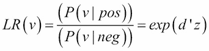

其中 d prime 是两个类别的平均值之差除以标准偏差:

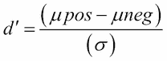

另外， *z* 是 *z* 的分数:

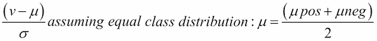

为了中和不均匀类别分布的效应，我们可以使用以下公式计算校准特征:

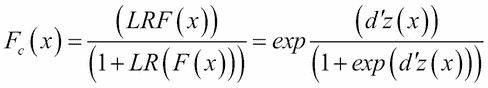

你可能会注意到，这正是我们用于逻辑回归的 sigmoid 激活函数。总结逻辑校准，我们主要使用三个步骤:

1.  估计正类和负类的类均值。
2.  将特征转换成 *z* 分数。
3.  应用 sigmoid 函数给出校准概率。

有时，我们可能会跳过最后一步，特别是当我们使用基于距离的模型时，我们希望比例是可加的，以便计算欧几里德距离。您可能会注意到，我们最终校准的功能在规模上是倍增的。

另一种校准技术**等渗校准**用于定量和顺序特征。这使用了所谓的 **ROC** 曲线(代表**接收器操作员特性**)，类似于[第 4 章](ch04.html "Chapter 4. Models – Learning from Information")、*模型-从信息中学习*中讨论逻辑模型时使用的覆盖图。不同的是，对于 ROC 曲线，我们将轴归一化为*【0，1】*。

我们可以使用`sklearn`包来创建 ROC 曲线:

```
import matplotlib.pyplot as plt
from sklearn import svm, datasets
from sklearn.metrics import roc_curve, auc
from sklearn.cross_validation import train_test_split
from sklearn.preprocessing import label_binarize
from sklearn.multiclass import OneVsRestClassifier

X, y = datasets.make_classification(n_samples=100,n_classes=3,n_features=5, n_informative=3, n_redundant=0,random_state=42)
# Binarize the output
y = label_binarize(y, classes=[0, 1, 2])
n_classes = y.shape[1]
X_train, X_test, y_train, y_test = train_test_split(X, y, test_size=.5)
classifier = OneVsRestClassifier(svm.SVC(kernel='linear', probability=True, ))
y_score = classifier.fit(X_train, y_train).decision_function(X_test)
fpr, tpr, _ = roc_curve(y_test[:,0], y_score[:,0]) 
roc_auc = auc(fpr, tpr)
plt.figure()
plt.plot(fpr, tpr, label='ROC AUC %0.2f' % roc_auc)
plt.plot([0, 1], [0, 1], 'k--')
plt.xlim([0.0, 1.0])
plt.ylim([0.0, 1.05])
plt.xlabel('False Positive Rate')
plt.ylabel('True Positive Rate')
plt.title('Receiver operating characteristic')
plt.legend(loc="best")
plt.show()

```

下面是观察到的输出:

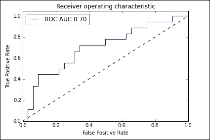

ROC 曲线绘制了不同阈值的真阳性率和假阳性率。在上图中，这由虚线表示。一旦我们构建了 ROC 曲线，我们就计算凸壳的每一段中的阳性的数量，*m[I]，以及实例的总数，*n[I]。然后，使用以下公式计算校准后的特征值:**

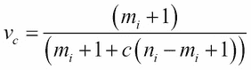

在这个公式中， *c* 是先验赔率，即正类概率与负类概率之比。

到目前为止，在我们关于特性转换的讨论中，我们假设我们知道每个特性的所有值。在现实世界中，情况往往并非如此。如果我们使用概率模型，我们可以通过对所有特征值进行加权平均来估计缺失特征的值。一个重要的考虑是缺失特征值的存在可能与目标变量相关。例如，个人病史中的数据反映了所进行的测试类型，而这又与对某些疾病风险因素的评估相关。

如果我们使用一个树模型，我们可以随机选择一个缺失的值，允许模型在其上分裂。然而，这不适用于线性模型。在这种情况下，我们需要通过**插补**的过程来填充缺失值。对于分类，我们可以简单地使用观察到的特征的平均值、中值和众数来估算缺失的值。如果我们想考虑特征相关性，我们可以为每个不完整的特征构建一个预测模型来预测缺失值。

因为 scikit-learn 估算器总是假设数组中的所有值都是数字，所以丢失的值(编码为空格、n an 或其他占位符)将会产生错误。此外，由于我们可能不想丢弃整个行或列，因为它们可能包含有价值的信息，我们需要使用插补策略来完成数据集。在下面的代码片段中，我们将使用`Imputer`类:

```
from sklearn.preprocessing import Binarizer, Imputer, OneHotEncoder
imp = Imputer(missing_values='NaN', strategy='mean', axis=0)
print(imp.fit_transform([[1, 3], [4, np.nan], [5, 6]]))

```

以下是输出:

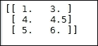

许多机器学习算法要求特征**标准化**。这意味着，当单个要素看起来或多或少像具有接近零的平均值和单位方差的正态分布数据时，它们将发挥最佳作用。最简单的方法是从每个特征中减去平均值，然后除以标准偏差进行缩放。这可以通过`sklearn.preprocessing()`功能中的`scale()`功能或`standardScaler()`功能来实现。尽管这些函数可以接受稀疏数据，但在这种情况下可能不应该使用它们，因为将稀疏数据居中可能会破坏其结构。在这些情况下，建议使用`MacAbsScaler()`或`maxabs_scale()`功能。前者根据每个特征的最大绝对值分别对其进行缩放和平移。后者将每个特征分别缩放到范围 *[-1，1】*。另一个具体的例子是当数据中有异常值时。在这些情况下，建议使用`robust_scale()`或`RobustScaler()`功能。

通常，我们可能希望通过添加多项式项来增加模型的复杂性。这可以使用`PolynomialFeatures()`功能来完成:

```
from sklearn.preprocessing import PolynomialFeatures
X=np.arange(9).reshape(3,3)
poly=PolynomialFeatures(degree=2)
print(X)
print(poly.fit_transform(X))

```

我们将观察到以下输出:

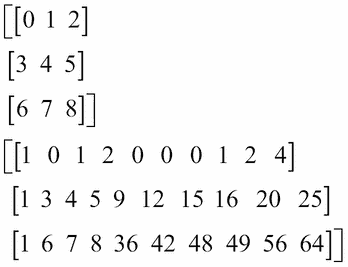<title>Principle component analysis</title>

# 主成分分析

**主成分分析** ( **PCA** )是我们可以应用于特征的最常见的降维形式。考虑由两个要素组成的数据集的示例，我们希望将二维数据转换为一维数据。一种自然的方法是绘制一条最接近的直线，并将每个数据点投影到这条直线上，如下图所示:

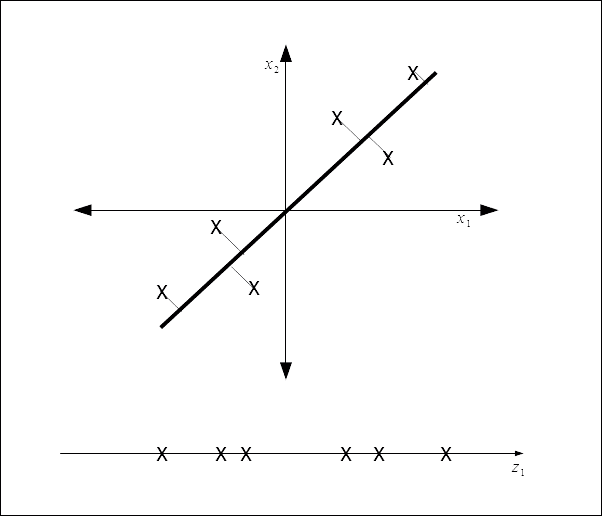

PCA 试图通过最小化数据点和我们试图将数据投影到的线之间的距离来找到一个投影数据的表面。对于更一般的情况，我们有 n 个维度，我们想把这个空间减少到 k 个维度，我们找到 k 个向量。...，u(k) 将数据投影到其上，以便最小化投影误差。也就是说，我们试图找到一个 k 维表面来投影数据。

这表面上看起来像线性回归，但它在几个重要方面是不同的。利用线性回归，我们试图在给定一个输入变量的情况下预测某个输出变量的值。在 PCA 中，我们并不试图预测一个输出变量，而是试图找到一个子空间来投影我们的输入数据。如上图所示，误差距离不是点和线之间的垂直距离，这与线性回归的情况不同，而是点和线之间最近的正交距离。因此，误差线与轴成一定角度，并与我们的投影线成直角。

重要的一点是，在大多数情况下，PCA 要求对特征进行缩放和均值归一化，也就是说，特征的均值为零，并且具有可比较的值范围。我们可以使用以下公式计算平均值:

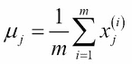

通过替换以下内容来计算总和:

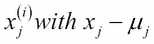

如果特征具有明显不同的比例，我们可以使用以下方法重新调整比例:


这些功能在`sklearn.preprocessing`模块中可用。

计算低维向量和这些向量上我们投影原始数据的点的数学过程包括首先计算协方差矩阵，然后计算该矩阵的特征向量。从第一原理计算这些值是一个相当复杂的过程。幸运的是,`sklearn`包有一个库来做这件事:

```
from sklearn.decomposition import PCA
import numpy as np
X = np.array([[-1, -1], [-2, -1], [-3, -2], [1, 1], [2, 1], [3, 2]])
pca = PCA(n_components=1)
pca.fit(X)
print(pca.transform(X))

```

我们将获得以下输出:

<title>Summary</title>

# 总结

我们可以通过多种方式来转换和构建新的要素，以使我们的模型更有效地工作并给出更准确的结果。一般来说，没有硬性的规则来决定对特定模型使用哪种方法。这在很大程度上取决于您正在使用的要素类型(数量型、序数型或分类型)。第一个好的方法是标准化和缩放特征，如果模型需要，将特征转换为适当的类型，就像我们通过离散化所做的那样。如果模型表现不佳，可能需要应用进一步的预处理，如 PCA。在下一章中，我们将探讨如何通过使用集成来组合不同类型的模型，以提高性能并提供更强的预测能力。