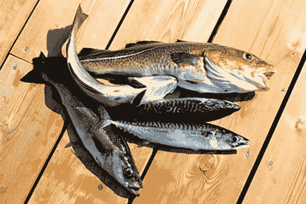
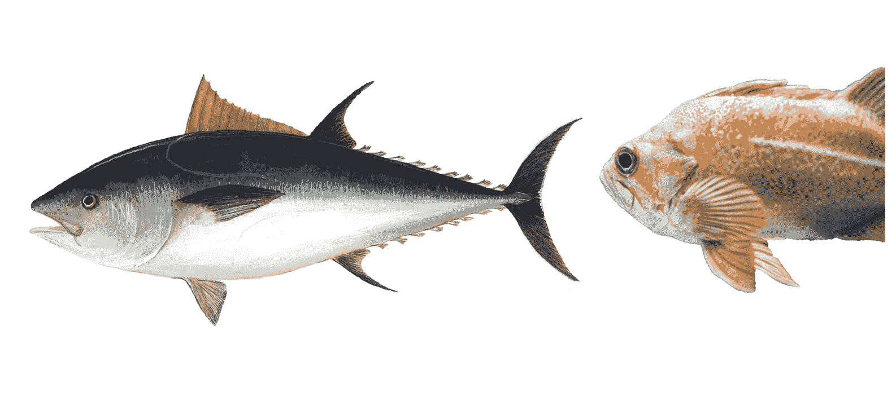
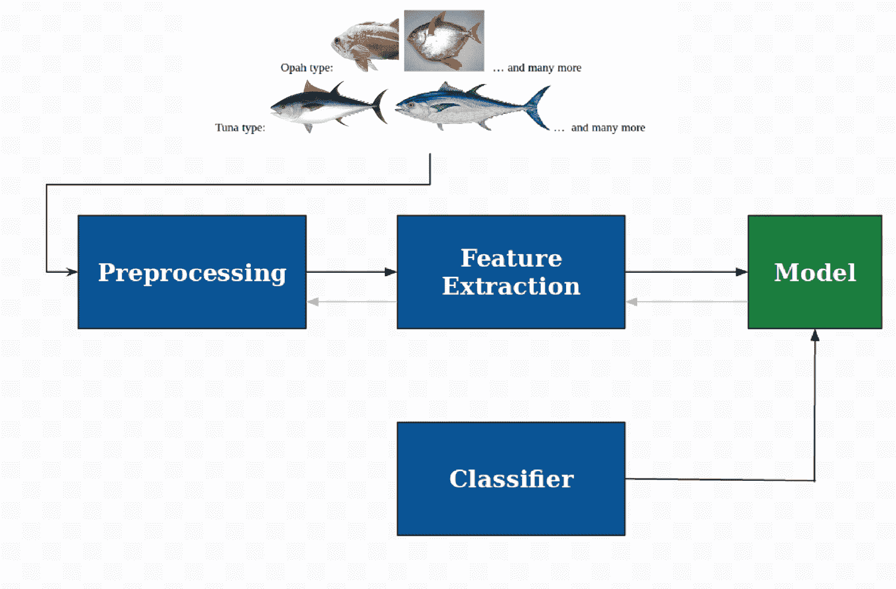
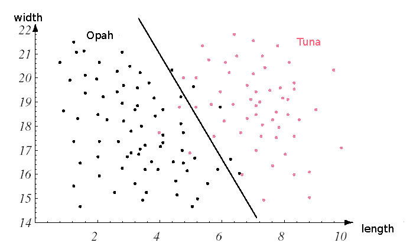
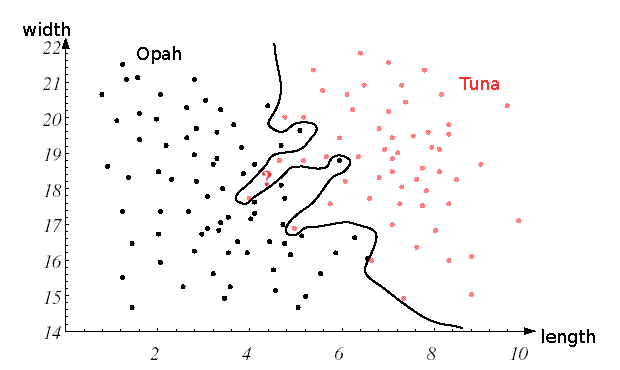

# 数据科学-鸟瞰

数据科学或机器学习是在没有被告知或编程的情况下赋予机器从数据集学习的能力的过程。例如，很难编写一个程序，它可以将手写的数字作为输入图像，并根据所写的图像输出 0-9 之间的值。这同样适用于将收到的电子邮件分类为垃圾邮件或非垃圾邮件的任务。为了解决这类任务，数据科学家使用数据科学或机器学习领域的学习方法和工具，通过赋予计算机一些可以区分数字的解释性特征，来教会计算机如何自动识别数字。同样对于垃圾邮件/非垃圾邮件问题，我们可以通过特定的学习算法教会计算机如何区分垃圾邮件和非垃圾邮件，而不是使用正则表达式和编写数百条规则来分类收到的电子邮件。

对于垃圾邮件过滤应用程序，您可以通过基于规则的方法对其进行编码，但它不能很好地用于生产，就像您的邮件服务器中的应用程序一样。建立一个学习系统是一个理想的解决方案。

您可能每天都在使用数据科学的应用程序，但却常常不自知。例如，您的国家可能会使用一个系统来检测您邮寄的信件的邮政编码，以便自动将其转发到正确的区域。如果你在使用亚马逊，他们通常会推荐你购买的东西，他们通过学习你经常搜索或购买的东西来做到这一点。

构建一个经过学习/训练的机器学习算法将需要一个历史数据样本库，它将从中学习如何区分不同的例子，并从这些数据中得出一些知识和趋势。之后，学习/训练的算法可以用于对看不见的数据进行预测。学习算法将使用原始历史数据，并试图从这些数据中得出一些知识和趋势。

在这一章中，我们将鸟瞰数据科学，它如何作为黑盒工作，以及数据科学家每天面临的挑战。我们将讨论以下主题:

*   通过一个例子理解数据科学
*   数据科学算法的设计程序
*   开始学习
*   实现鱼类识别/检测模型
*   不同的学习类型
*   数据大小和行业需求


# 通过一个例子理解数据科学

为了说明为特定数据构建学习算法的生命周期和挑战，让我们考虑一个真实的例子。大自然保护协会正与其他渔业公司和合作伙伴一起监控渔业活动，为未来保护渔业。因此，他们希望在未来使用摄像机来扩大这一监控过程。手动处理部署这些摄像机产生的大量数据将会非常麻烦且非常昂贵。因此，保护协会希望开发一种学习算法，自动检测和分类不同种类的鱼，以加快视频审查过程。

*图 1.1* 显示了保护组织部署的摄像机拍摄的图像样本。这些图像将用于构建系统。



图 1.1:保护组织部署的摄像机输出示例

因此，我们在这个例子中的目的是分离不同的物种，如金枪鱼、鲨鱼和渔船捕获的更多物种。作为一个说明性的例子，我们可以把问题限制在两类，金枪鱼和 opah。



图 1.2:金枪鱼类(左)和乌鳢类(右)

在将我们的问题限制为仅包含两种类型的鱼之后，我们可以从我们的收集中随机抽取一些图像样本，并开始注意这两种类型之间的一些物理差异。例如，考虑以下物理差异:

*   **长度**:你可以看到，和欧帕鱼相比，金枪鱼更长
*   **宽度**:欧巴比金枪鱼宽
*   你可以看到欧巴鱼更倾向于红色，而金枪鱼更倾向于蓝色和白色，等等

我们可以使用这些物理差异作为特征，帮助我们的学习算法(分类器)区分这两种类型的鱼。

物体的解释性特征是我们在日常生活中用来区分我们周围物体的东西。甚至婴儿也利用这些解释性特征来了解周围的环境。数据科学也是一样，为了建立一个可以区分不同对象的学习模型(例如鱼的类型)，我们需要给它一些解释性的特征来学习(例如鱼的长度)。为了使模型更加确定，减少混淆误差，我们可以(在一定程度上)增加对象的解释特征。

鉴于这两种鱼之间存在物理差异，这两种不同的鱼类种群具有不同的模型或描述。因此，我们分类任务的最终目标是让分类器学习这些不同的模型，然后给出这两种类型之一的图像作为输入。分类器将通过选择最符合该图像的模型(tuna 模型或 opah 模型)对其进行分类。

在这种情况下，金枪鱼和 opah 鱼的集合将作为我们的分类器的知识库。最初，知识库(训练样本)将被标注/标记，对于每张图像，您将事先知道它是金枪鱼还是乌鳢。因此，分类器将使用这些训练样本来模拟不同类型的鱼，然后我们可以使用训练阶段的输出来自动标记分类器在训练阶段没有看到的未标记/未标记的鱼。这种未标记的数据通常被称为**看不见的**数据。下图显示了生命周期的培训阶段:

监督数据科学完全是从具有已知目标或输出的历史数据中学习，例如鱼的类型，然后使用这种学习的模型来预测案例或数据样本，对于这些案例或数据样本，我们不知道目标/输出。



图 1.3:培训阶段生命周期

让我们看看分类器的训练阶段是如何工作的:

*   **预处理**:在这一步，我们将尝试使用相关的分割技术将鱼从图像中分割出来。
*   **特征提取**:通过减去背景将鱼从图像中分割出来后，我们将测量每张图像的物理差异(长度、宽度、颜色等)。最后你会得到类似*图 1.4* 的东西。

最后，我们将把这些数据输入到分类器中，以便对不同的鱼类型进行建模。

正如我们已经看到的，我们可以根据我们提出的物理差异(特征)，如长度、宽度和颜色，在视觉上区分金枪鱼和乌鳢。

我们可以使用长度特征来区分这两种鱼。所以我们可以通过观察它们的长度来区分它们，看看它是否超过了某个值(`length*`)。

因此，基于我们的训练样本，我们可以推导出以下规则:

```
If length(fish)> length* then label(fish) = Tuna
Otherwise label(fish) = Opah 
```

为了找到这个`length*`,我们可以基于训练样本进行长度测量。因此，假设我们获得这些长度测量值，并获得如下直方图:


图 1.4:两种鱼的长度测量直方图

在这种情况下，我们可以基于长度特征导出一个规则，并区分金枪鱼和欧帕鱼。在这个特殊的例子中，我们可以看出`length*`是`7`。因此，我们可以将前面的规则更新为:

```
If length(fish)> 7 then label(fish) = Tuna
Otherwise label(fish) = Opah
```

正如您可能注意到的，由于两个直方图之间的重叠，这不是一个有希望的结果，因为长度特征不是一个完全用于区分两种类型的特征。所以我们可以尝试加入更多的特征，比如宽度，然后将它们结合起来。因此，如果我们设法测量训练样本的宽度，我们可能会得到如下的直方图:


图 5:两种鱼的宽度测量直方图

如您所见，仅依赖一个特征不会给出准确的结果，输出模型会产生大量错误分类。相反，我们可以以某种方式将这两个特征结合起来，想出一些看起来合理的东西。

因此，如果我们将这两种功能结合起来，我们可能会得到如下图所示的结果:



图 1.6:两种鱼的长宽尺寸子集的组合

结合**长度**和**宽度**特征的读数，我们将得到一个散点图，如上图所示。我们用红点代表金枪鱼，绿点代表欧帕鱼，我们可以用这条黑线作为区分这两种鱼的标准或决策界限。

例如，如果一条鱼的读数高于这个决定界限，那么它就是一条金枪鱼；否则会被预测为 opah 鱼。

我们可以设法增加规则的复杂性，以避免任何错误，并获得如下图所示的决策边界:



图 1.7:增加决策边界的复杂性以避免对训练数据的错误分类

这个模型的优点是我们在训练样本上几乎没有错误分类。但实际上这不是使用数据科学的目的。数据科学的目标是建立一个模型，该模型能够对看不见的数据进行归纳并表现良好。为了确定我们是否建立了一个可以扩展的模型，我们将引入一个称为**测试阶段**的新阶段，在这个阶段中，我们给训练好的模型一个未标记的图像，并期望模型给它分配正确的标签( **Tuna** 和 **Opah** )。

数据科学的最终目标是建立一个能在生产中很好工作的模型，而不是在训练集上。所以，当你看到你的模型在训练集上表现良好时，不要高兴，如图 1.7 所示。大多数情况下，这种模型无法很好地识别图像中的鱼的类型。这种让你的模型只在训练集上工作良好的事件被称为**过拟合**，大多数从业者都落入了这个陷阱。

您可以驱动一个不太复杂的模型，在测试阶段进行归纳，而不是提出一个如此复杂的模型。下图显示了如何使用不太复杂的模型来减少错误分类错误，并对未知数据进行概化:


图 1.8:使用一个不太复杂的模型来概括测试样本(看不见的数据)


# 数据科学算法的设计程序

不同的学习系统通常遵循相同的设计程序。他们首先获取知识库，从数据中选择相关的解释特征，仔细检查一系列候选学习算法，同时关注每个算法的性能，最后是评估过程，评估过程衡量训练过程的成功程度。

在本节中，我们将更详细地介绍所有这些不同的设计步骤:


图 1.11:模型学习过程概要


# 数据预处理

学习周期的这个组成部分代表了我们算法的知识库。因此，为了帮助学习算法对看不见的数据做出准确的决策，我们需要以最好的形式提供这个知识库。因此，我们的数据可能需要大量的清理和预处理(转换)。


# 数据清理

大多数数据集都需要这一步，在这一步中，您可以消除错误、噪声和冗余。我们需要我们的数据准确、完整、可靠和公正，因为使用不良知识库可能会产生许多问题，例如:

*   不准确和有偏见的结论
*   误差增大
*   概化能力降低，概化能力是指模型在之前没有训练过的未知数据上表现良好的能力


# 数据预处理

在这一步中，我们对数据进行了一些转换，以使其一致和具体。预处理数据时，您可以考虑许多不同的转换:

*   **重命名** ( **重新标记**):这意味着将分类值转换为数字，因为分类值如果与一些学习方法一起使用是危险的，而且数字会在值之间强加一个顺序
*   **重缩放** ( **归一化**):将连续值变换/定界到某个范围，通常为 *[-1，1】*或 *[0，1]*
*   **新功能**:从现有功能中组合出新功能。例如，*肥胖因子=体重/身高*


# 特征选择

样本的解释特征(输入变量)的数量可以是巨大的，其中你得到*x[I]=(x[I]1，x[I]2，x[I]3，...，x[I]d)*作为训练样本(观察/例子)而 *d* 非常大。这方面的一个例子可以是文档分类任务 3，其中您得到 10，000 个不同的单词，输入变量将是不同单词的出现次数。

这种巨大数量的输入变量可能是有问题的，有时甚至是一种诅咒，因为我们有许多输入变量和很少的训练样本来帮助我们学习。为了避免这种拥有大量输入变量的灾难(维数灾难)，数据科学家使用降维技术从输入变量中选择一个子集。例如，在文本分类任务中，他们可以执行以下操作:

*   提取相关输入(例如，互信息度量)
*   **主成分分析** ( **PCA** )
*   分组(群集)相似的单词(这使用相似性度量)


# 型号选择

这一步是在使用任何降维技术选择输入变量的适当子集之后进行的。选择输入变量的适当子集将使学习过程的其余部分变得非常简单。

在这一步中，您将尝试找出要学习的正确模型。

如果您之前有任何数据科学和将学习方法应用于不同领域和不同类型的数据的经验，那么您会发现这一步很容易，因为它需要预先了解您的数据的外观以及哪些假设可能符合您的数据的性质，并基于此选择适当的学习方法。如果您没有任何先验知识，这也没关系，因为您可以通过猜测和尝试不同参数设置的不同学习方法来完成这一步，并选择一种在测试集上提供更好性能的方法。

此外，初始数据分析和可视化将帮助您对数据的分布形式和性质做出正确的猜测。


# 学习过程

通过学习，我们指的是您将用来选择最佳模型参数的优化标准。为此有各种优化标准:

*   **均方误差** ( **MSE** )
*   **最大似然** ( **ML** )准则
*   **最大后验概率** ( **图**)

优化问题可能很难解决，但正确选择模型和误差函数会有所不同。


# 评估您的模型

在这一步，我们试图衡量我们的模型对未知数据的泛化误差。由于我们只有特定的数据，而事先不知道任何看不见的数据，所以我们可以从数据中随机选择一个测试集，并且从不在训练过程中使用它，以便它像有效的看不见的数据一样工作。有不同的方法可以评估所选模型的性能:

*   简单的维持方法，即将数据分为训练集和测试集
*   基于交叉验证和随机二次抽样的其他复杂方法

在这一步中，我们的目标是比较在相同数据上训练的不同模型的预测性能，并选择具有更好(更小)测试误差的模型，这将为我们提供比未知数据更好的泛化误差。您还可以通过使用统计方法来测试结果的显著性，从而更加确定概化误差。


# 开始学习

构建机器学习系统伴随着一些挑战和问题；我们将在本节中尝试解决这些问题。这些问题中有许多是特定于领域的，而另一些则不是。


# 学习的挑战

下面是你在试图建立一个学习系统时通常会面临的挑战和问题的概述。


# 特征提取–特征工程

特征提取是建立学习系统的关键步骤之一。如果你在这个挑战中选择了合适的功能，那么剩下的学习过程将会很容易。此外，特征提取是依赖于领域的，并且它需要先验知识来了解什么特征对于特定任务可能是重要的。例如，我们的鱼类识别系统的功能将不同于垃圾邮件检测或识别指纹的功能。

特征提取步骤从您拥有的原始数据开始。然后构建派生变量/值(特征),这些变量/值可以提供关于学习任务的信息，并有助于下一步的学习和评估(概括)。

一些任务将具有大量的特征和较少的训练样本(观察值),以便于后续的学习和泛化过程。在这种情况下，数据科学家使用降维技术将大量特征减少到一个较小的集合。


# 噪音

在鱼识别任务中，您可以看到鱼的长度、重量、颜色以及船的颜色可能会有所不同，并且图像中可能有阴影、低分辨率图像和其他对象。所有这些问题都影响了建议的解释性特征的重要性，这些特征应该是关于我们的鱼类分类任务的信息。

在这种情况下，变通办法会有帮助。例如，有人可能会想到检测船的 ID，并屏蔽掉船的某些部分，这些部分很可能不包含我们的系统要检测的任何鱼。这种变通办法会限制我们的搜索空间。


# 过度拟合

正如我们在鱼识别任务中所看到的，我们试图通过增加模型复杂性和对训练样本的每个实例进行完美分类来增强模型的性能。正如我们将在后面看到的，这样的模型不能处理看不见的数据(比如我们将用来测试模型性能的数据)。拥有在训练样本上完美工作但在测试样本上表现不佳的训练模型被称为**过拟合**。

如果你仔细阅读这一章的后半部分，你会发现我们建立了一个学习系统，目的是使用训练样本作为我们模型的知识库，以便从中学习，并对看不见的数据进行归纳。对于训练数据，我们对训练模型的性能误差不感兴趣；相反，我们感兴趣的是经过训练的模型在测试样本上的性能(泛化)误差，这些测试样本还没有包含在训练阶段中。


# 机器学习算法的选择

有时，您对用于特定任务的模型的执行不满意，您需要一个替代类的模型。每一种学习策略都有它自己的关于它将用作学习基础的信息的假设。作为一名信息研究者，你必须发现哪些怀疑最符合你的信息；这样，你就有能力承认尝试一类模式，拒绝另一类模式。


# 先验知识

正如在模型选择和特征提取的概念中所讨论的，如果您事先了解以下内容，这两个问题是可以解决的:

*   适当的特征
*   型号选择零件

预先知道鱼识别系统中的解释性特征使我们能够区分不同类型的鱼。我们可以通过努力想象我们的信息来进行扩展，并对不同鱼类分类的信息类型有所了解。基于这种先验知识，可以选择合适的模型族。


# 缺少值

缺少特征主要是因为缺少数据或选择了不告诉选项。在学习过程中如何处理这样的案例？例如，设想我们发现某一种鱼的宽度由于某种原因不见了。有许多方法可以处理这些缺失的功能。


# 实现鱼类识别/检测模型

为了特别介绍机器学习和深度学习的能力，我们将实现鱼识别示例。不需要理解代码的内部细节。这一部分的重点是给你一个典型的机器学习管道的概述。

我们这项任务的知识库将是一堆图像，每一张都被标记为 opah 或 tuna。对于这个实现，我们将使用在成像和计算机视觉领域取得突破的深度学习架构之一。这种架构被称为**卷积神经网络**(**CNN**)。它是一系列深度学习架构，使用图像处理的卷积运算从图像中提取可以解释我们想要分类的对象的特征。现在，你可以把它想象成一个神奇的盒子，它将拍摄我们的图像，从中学习如何区分我们的两个类别(opah 和 tuna)，然后我们将通过向它提供未标记的图像来测试这个盒子的学习过程，看看它是否能够分辨图像中是哪种类型的鱼。

不同类型的学习将在后面的章节中讨论，因此您稍后将理解为什么我们的鱼识别任务属于监督学习类别。

在本例中，我们将使用 Keras。目前，你可以将 Keras 视为一个 API，它使构建和使用深度学习比平常更容易。所以让我们开始吧！从 Keras 网站上我们可以看到:

Keras 是一种高级神经网络 API，用 Python 编写，能够在 TensorFlow、CNTK 或 Theano 之上运行。它的开发重点是支持快速实验。*能够以尽可能少的延迟从想法到结果是做好研究的关键。* 


# 知识库/数据集

正如我们前面提到的，我们需要一个历史数据基础，它将被用来教导学习算法关于它以后应该做的任务。但是我们还需要另一个数据集来测试它在学习过程之后执行任务的能力。总而言之，在学习过程中，我们需要两种类型的数据集:

1.  第一个是知识库，其中有输入数据及其相应的标签，如鱼的图像及其相应的标签(opah 或 tuna)。该数据将被馈送到学习算法以从中学习，并试图发现将有助于稍后对未标记图像进行分类的模式/趋势。
2.  第二个主要是测试模型将从知识库中学到的知识应用于未标记的图像或未看到的数据的能力，一般来说，看看它是否工作良好。

如您所见，我们只有将用作我们学习方法知识库的数据。我们手头的所有数据都会有与之相关的正确输出。因此，我们需要以某种方式弥补没有任何正确输出的数据(我们将对其应用模型)。

在执行数据科学时，我们将执行以下操作:

*   **训练阶段**:我们展示我们知识库中的数据，并通过将输入数据及其正确输出提供给模型来训练我们的学习方法/模型。
*   **验证/测试阶段**:在这个阶段，我们将测量训练好的模型做得有多好。我们还使用不同的模型属性技术，以便通过使用(回归的 R 平方分数、分类器的分类误差、IR 模型的召回率和精确度等)来测量我们的训练模型的性能。

验证/测试阶段通常分为两个步骤:

1.  在第一步中，我们使用不同的学习方法/模型，并根据我们的验证数据选择表现最佳的方法/模型(验证步骤)
2.  然后，我们基于测试集测量并报告所选模型的准确性(测试步骤)

现在，让我们看看我们如何获得这些数据，我们将应用该模型，并看看它的训练有多好。

由于我们没有任何没有正确输出的训练样本，我们可以从我们将使用的原始训练样本中构造一个。因此，我们可以将数据样本分成三个不同的集合(如图*图 1.9* 所示):

*   **训练集**:这将作为我们模型的知识库。通常，会有 70%来自原始数据样本。
*   **验证集**:用于从一组模型中选择性能最佳的模型。通常这将是原始数据样本的 10%。
*   **测试集**:用于测量和报告所选模型的准确性。通常，它会和验证集一样大。


图 1.9:将数据分为训练集、验证集和测试集

如果您只有一种正在使用的学习方法，您可以取消验证集，并将数据重新拆分为训练集和测试集。通常，数据科学家使用 75/25 作为百分比，或者 70/30。


# 数据分析预处理

在本节中，我们将分析和预处理输入图像，并使其成为我们的学习算法(这里是卷积神经网络)可以接受的格式。

因此，让我们从导入该实现所需的包开始:

```
import numpy as np
np.random.seed(2018)
```

```
import os
import glob
import cv2
import datetime
import pandas as pd
import time
import warnings
warnings.filterwarnings("ignore")
```

```
from sklearn.cross_validation import KFold
from keras.models import Sequential
from keras.layers.core import Dense, Dropout, Flatten
from keras.layers.convolutional import Convolution2D, MaxPooling2D, ZeroPadding2D
from keras.optimizers import SGD
from keras.callbacks import EarlyStopping
from keras.utils import np_utils
from sklearn.metrics import log_loss
from keras import __version__ as keras_version
```

为了使用数据集中提供的图像，我们需要让它们具有相同的大小。OpenCV 是一个很好的选择，OpenCV 网站:

OpenCV(开源计算机视觉库)是在 BSD 许可下发布的，因此学术和商业使用都是免费的。它有 C++，C，Python 和 Java 接口，支持 Windows，Linux，Mac OS，iOS 和 Android。OpenCV 是为计算效率而设计的，非常注重实时应用。该库用优化的 C/C++编写，可以利用多核处理。借助 OpenCL，它可以利用底层异构计算平台的硬件加速。

您可以使用 python 包管理器通过发出`pip install` `opencv-python`来安装 OpenCV

```
# Parameters
# ----------
# img_path : path
#    path of the image to be resized
def rezize_image(img_path):
   #reading image file
   img = cv2.imread(img_path)
   #Resize the image to to be 32 by 32
   img_resized = cv2.resize(img, (32, 32), cv2.INTER_LINEAR)
return img_resized
```

现在，我们需要加载数据集的所有训练样本，并根据前面的函数调整每个图像的大小。因此，我们将实现一个函数，该函数将从我们针对每种鱼类型的不同文件夹中加载训练样本:

```
# Loading the training samples and their corresponding labels
def load_training_samples():
    #Variables to hold the training input and output variables
    train_input_variables = []
    train_input_variables_id = []
    train_label = []
    # Scanning all images in each folder of a fish type
    print('Start Reading Train Images')
    folders = ['ALB', 'BET', 'DOL', 'LAG', 'NoF', 'OTHER', 'SHARK', 'YFT']
    for fld in folders:
       folder_index = folders.index(fld)
       print('Load folder {} (Index: {})'.format(fld, folder_index))
       imgs_path = os.path.join('..', 'input', 'train', fld, '*.jpg')
       files = glob.glob(imgs_path)
       for file in files:
           file_base = os.path.basename(file)
           # Resize the image
           resized_img = rezize_image(file)
           # Appending the processed image to the input/output variables of the classifier
           train_input_variables.append(resized_img)
           train_input_variables_id.append(file_base)
           train_label.append(folder_index)
     return train_input_variables, train_input_variables_id, train_label
```

正如我们所讨论的，我们有一个测试集，它将作为看不见的数据来测试我们的模型的泛化能力。所以我们需要对测试图像做同样的事情；加载它们并进行调整大小处理:

```
def load_testing_samples():
    # Scanning images from the test folder
    imgs_path = os.path.join('..', 'input', 'test_stg1', '*.jpg')
    files = sorted(glob.glob(imgs_path))
    # Variables to hold the testing samples
    testing_samples = []
    testing_samples_id = []
    #Processing the images and appending them to the array that we have
    for file in files:
       file_base = os.path.basename(file)
       # Image resizing
       resized_img = rezize_image(file)
       testing_samples.append(resized_img)
       testing_samples_id.append(file_base)
    return testing_samples, testing_samples_id
```

现在我们需要将前面的函数调用到另一个使用`load_training_samples()`函数的函数中，以便加载和调整训练样本的大小。此外，它还将添加几行代码来将训练数据转换为 NumPy 格式，对该数据进行整形以适合我们的分类器，并最终将其转换为 float:

```
def load_normalize_training_samples():
    # Calling the load function in order to load and resize the training samples
    training_samples, training_label, training_samples_id = load_training_samples()
    # Converting the loaded and resized data into Numpy format
    training_samples = np.array(training_samples, dtype=np.uint8)
    training_label = np.array(training_label, dtype=np.uint8)
    # Reshaping the training samples
    training_samples = training_samples.transpose((0, 3, 1, 2))
    # Converting the training samples and training labels into float format
    training_samples = training_samples.astype('float32')
    training_samples = training_samples / 255
    training_label = np_utils.to_categorical(training_label, 8)
    return training_samples, training_label, training_samples_id
```

我们还需要对测试做同样的事情:

```
def load_normalize_testing_samples():
    # Calling the load function in order to load and resize the testing samples
    testing_samples, testing_samples_id = load_testing_samples()
    # Converting the loaded and resized data into Numpy format
    testing_samples = np.array(testing_samples, dtype=np.uint8)
    # Reshaping the testing samples
    testing_samples = testing_samples.transpose((0, 3, 1, 2))
    # Converting the testing samples into float format
    testing_samples = testing_samples.astype('float32')
    testing_samples = testing_samples / 255
    return testing_samples, testing_samples_id
```


# 模型结构

现在是创建模型的时候了。正如我们提到的，我们将使用一种叫做 CNN 的深度学习架构作为这项鱼类识别任务的学习算法。同样，您不需要理解本章中之前或即将推出的任何代码，因为我们只是在演示如何在 Keras 和 TensorFlow 作为深度学习平台的帮助下，通过仅使用几行代码来解决复杂的数据科学任务。

还要注意，CNN 和其他深度学习架构将在后面的章节中更详细地解释:


图 1.10: CNN 架构

因此，让我们继续创建一个负责创建 CNN 架构的函数，该架构将用于我们的鱼类识别任务:

```
def create_cnn_model_arch():
    pool_size = 2 # we will use 2x2 pooling throughout
    conv_depth_1 = 32 # we will initially have 32 kernels per conv. layer...
    conv_depth_2 = 64 # ...switching to 64 after the first pooling layer
    kernel_size = 3 # we will use 3x3 kernels throughout
    drop_prob = 0.5 # dropout in the FC layer with probability 0.5
    hidden_size = 32 # the FC layer will have 512 neurons
    num_classes = 8 # there are 8 fish types
    # Conv [32] -> Conv [32] -> Pool
    cnn_model = Sequential()
    cnn_model.add(ZeroPadding2D((1, 1), input_shape=(3, 32, 32), dim_ordering='th'))
    cnn_model.add(Convolution2D(conv_depth_1, kernel_size, kernel_size, activation='relu', 
      dim_ordering='th'))
    cnn_model.add(ZeroPadding2D((1, 1), dim_ordering='th'))
    cnn_model.add(Convolution2D(conv_depth_1, kernel_size, kernel_size, activation='relu',
      dim_ordering='th'))
    cnn_model.add(MaxPooling2D(pool_size=(pool_size, pool_size), strides=(2, 2),
      dim_ordering='th'))
    # Conv [64] -> Conv [64] -> Pool
    cnn_model.add(ZeroPadding2D((1, 1), dim_ordering='th'))
    cnn_model.add(Convolution2D(conv_depth_2, kernel_size, kernel_size, activation='relu',
      dim_ordering='th'))
    cnn_model.add(ZeroPadding2D((1, 1), dim_ordering='th'))
    cnn_model.add(Convolution2D(conv_depth_2, kernel_size, kernel_size, activation='relu',
      dim_ordering='th'))
    cnn_model.add(MaxPooling2D(pool_size=(pool_size, pool_size), strides=(2, 2),
     dim_ordering='th'))
    # Now flatten to 1D, apply FC then ReLU (with dropout) and finally softmax(output layer)
    cnn_model.add(Flatten())
    cnn_model.add(Dense(hidden_size, activation='relu'))
    cnn_model.add(Dropout(drop_prob))
    cnn_model.add(Dense(hidden_size, activation='relu'))
    cnn_model.add(Dropout(drop_prob))
    cnn_model.add(Dense(num_classes, activation='softmax'))
    # initiating the stochastic gradient descent optimiser
    stochastic_gradient_descent = SGD(lr=1e-2, decay=1e-6, momentum=0.9, nesterov=True)    cnn_model.compile(optimizer=stochastic_gradient_descent,  # using the stochastic gradient descent optimiser
                  loss='categorical_crossentropy')  # using the cross-entropy loss function
    return cnn_model
```

在开始训练模型之前，我们需要使用一种模型评估和验证方法来帮助我们评估我们的模型，并查看其泛化能力。为此，我们将使用一种叫做**的方法进行 k 倍交叉验证**。同样，你不需要理解这个方法或者它是如何工作的，因为我们将在后面详细解释这个方法。

让我们开始创建一个函数，帮助我们评估和验证模型:

```
def create_model_with_kfold_cross_validation(nfolds=10):
    batch_size = 16 # in each iteration, we consider 32 training examples at once
    num_epochs = 30 # we iterate 200 times over the entire training set
    random_state = 51 # control the randomness for reproducibility of the results on the same platform
    # Loading and normalizing the training samples prior to feeding it to the created CNN model
    training_samples, training_samples_target, training_samples_id = 
      load_normalize_training_samples()
    yfull_train = dict()
    # Providing Training/Testing indices to split data in the training samples
    # which is splitting data into 10 consecutive folds with shuffling
    kf = KFold(len(train_id), n_folds=nfolds, shuffle=True, random_state=random_state)
    fold_number = 0 # Initial value for fold number
    sum_score = 0 # overall score (will be incremented at each iteration)
    trained_models = [] # storing the modeling of each iteration over the folds
    # Getting the training/testing samples based on the generated training/testing indices by 
      Kfold
    for train_index, test_index in kf:
       cnn_model = create_cnn_model_arch()
       training_samples_X = training_samples[train_index] # Getting the training input variables
       training_samples_Y = training_samples_target[train_index] # Getting the training output/label variable
       validation_samples_X = training_samples[test_index] # Getting the validation input variables
       validation_samples_Y = training_samples_target[test_index] # Getting the validation output/label variable
       fold_number += 1
       print('Fold number {} from {}'.format(fold_number, nfolds))
       callbacks = [
           EarlyStopping(monitor='val_loss', patience=3, verbose=0),
       ]
       # Fitting the CNN model giving the defined settings
       cnn_model.fit(training_samples_X, training_samples_Y, batch_size=batch_size,
         nb_epoch=num_epochs,
             shuffle=True, verbose=2, validation_data=(validation_samples_X,
               validation_samples_Y),
             callbacks=callbacks)
       # measuring the generalization ability of the trained model based on the validation set
       predictions_of_validation_samples = 
         cnn_model.predict(validation_samples_X.astype('float32'), 
         batch_size=batch_size, verbose=2)
       current_model_score = log_loss(Y_valid, predictions_of_validation_samples)
       print('Current model score log_loss: ', current_model_score)
       sum_score += current_model_score*len(test_index)
       # Store valid predictions
       for i in range(len(test_index)):
           yfull_train[test_index[i]] = predictions_of_validation_samples[i]
       # Store the trained model
       trained_models.append(cnn_model)
    # incrementing the sum_score value by the current model calculated score
    overall_score = sum_score/len(training_samples)
    print("Log_loss train independent avg: ", overall_score)
    #Reporting the model loss at this stage
    overall_settings_output_string = 'loss_' + str(overall_score) + '_folds_' + str(nfolds) + 
      '_ep_' + str(num_epochs)
    return overall_settings_output_string, trained_models
```

现在，在构建模型并使用 k-fold 交叉验证方法来评估和验证模型之后，我们需要报告测试集上训练模型的结果。为了做到这一点，我们还将使用 k-fold 交叉验证，但这次是通过测试来查看我们训练的模型有多好。

因此，让我们定义一个函数，该函数将接受训练好的 CNN 模型作为输入，然后使用我们拥有的测试集来测试它们:

```
def test_generality_crossValidation_over_test_set( overall_settings_output_string, cnn_models):
    batch_size = 16 # in each iteration, we consider 32 training examples at once
    fold_number = 0 # fold iterator
    number_of_folds = len(cnn_models) # Creating number of folds based on the value used in the training step
    yfull_test = [] # variable to hold overall predictions for the test set
    #executing the actual cross validation test process over the test set
    for j in range(number_of_folds):
       model = cnn_models[j]
       fold_number += 1
       print('Fold number {} out of {}'.format(fold_number, number_of_folds))
       #Loading and normalizing testing samples
       testing_samples, testing_samples_id = load_normalize_testing_samples()
       #Calling the current model over the current test fold
       test_prediction = model.predict(testing_samples, batch_size=batch_size, verbose=2)
       yfull_test.append(test_prediction)
    test_result = merge_several_folds_mean(yfull_test, number_of_folds)
    overall_settings_output_string = 'loss_' + overall_settings_output_string \ + '_folds_' +
      str(number_of_folds)
    format_results_for_types(test_result, testing_samples_id, overall_settings_output_string)
```


# 模型训练和测试

现在，我们准备通过调用主函数`create_model_with_kfold_cross_validation()`开始模型训练阶段，使用 10 重交叉验证来构建和训练 CNN 模型；然后我们可以调用测试函数来测量模型扩展到测试集的能力:

```
if __name__ == '__main__':
  info_string, models = create_model_with_kfold_cross_validation()
  test_generality_crossValidation_over_test_set(info_string, models)
```


# 鱼类识别——一切尽在掌握

在解释了我们的鱼识别示例的主要构建块之后，我们可以看到所有的代码片段连接在一起，并看到我们如何设法用几行代码构建这样一个复杂的系统。完整的代码放在本书的*附录*部分。


# 不同的学习类型

根据亚瑟·萨缪尔([https://en.wikipedia.org/wiki/Arthur_Samuel](https://en.wikipedia.org/wiki/Arthur_Samuel))*的说法，数据科学赋予计算机学习的能力，而无需明确编程*。因此，任何一款软件，如果不通过显式编程，而是利用训练样本来对看不见的数据做出决策，都被认为是学习。数据科学或学习有三种不同的形式。

图 1.12 显示了数据科学/机器学习的常用类型:


图 1.12:不同类型的数据科学/机器学习。


# 监督学习

大多数数据科学家使用监督学习。在监督学习中，你有一些解释性特征，称为输入变量( *X* )，你有与训练样本相关联的标签，称为输出变量( *Y* )。任何监督学习算法的目标都是学习从输入变量( *X* )到输出变量( *Y* )的映射函数:


因此，监督学习算法将尝试近似地学习从输入变量( *X* )到输出变量( *Y* )的映射，以便稍后可以使用它来预测未知样本的 *Y* 值。

*图 1.13* 显示了任何监督数据科学系统的典型工作流程:


图 1.13:典型的监督学习工作流程/管道。顶部显示了训练过程，从将原始数据输入特征提取模块开始，我们将选择有意义的解释性特征来表示我们的数据。之后，提取/选择的解释性特征与训练集相结合，我们将其提供给学习算法，以便从中学习。然后，我们进行一些模型评估，以调整参数，并获得学习算法，以获得最佳的数据样本。

这种学习被称为**监督学习**，因为你正在获得与之相关的每个训练样本的标签/输出。在这种情况下，我们可以说学习过程是由一个监督者监督的。该算法对训练样本作出决定，并根据数据的正确标签由管理者进行校正。当监督学习算法达到可接受的精度水平时，学习过程将停止。

监督学习任务有两种不同的形式；回归和分类:

*   **分类**:分类任务是当标签或输出变量是一个类别时，如*金枪鱼*或 *Opah* 或*垃圾邮件*和*非垃圾邮件*
*   **回归**:回归任务是当输出变量是一个实值时，如*房价*或*身高*


# 无监督学习

无监督学习被视为信息研究人员使用的第二种最常见的学习方式。在这种类型的学习中，只给出解释特征或输入变量( *X* )，没有任何对应的标签或输出变量。

无监督学习算法的目标是获取信息中隐藏的结构和实例。鉴于没有与训练样本相关的标记，这种学习称为**无监督**。所以这是一个没有修正的学习过程，算法会试图自己找到基本结构。

无监督学习可以进一步分为两种形式——聚类和关联任务:

*   **聚类**:聚类任务是您希望发现相似的训练样本组，并将它们分组在一起，例如按主题对文档进行分组
*   **关联**:关联规则学习任务是你想在你的训练样本中发现一些描述关系的规则，比如看电影 *X* 的人也倾向于看电影 *Y*

*图 1.14* 显示了一个无监督学习的简单例子，我们得到了分散的文档，我们试图将*相似的*文档组合在一起:


图 1.14:显示了无监督的如何使用相似性度量，如欧几里德距离，将相似的文档组合在一起，并为它们画出判定边界


# 半监督学习

半监督学习是一种介于监督学习和非监督学习之间的学习类型，其中您已经获得了带有输入变量( *X* )的训练样本，但只有其中一些样本被输出变量( *Y* )标记/标注。

这种学习的一个很好的例子是 Flickr([https://www.flickr.com/](https://www.flickr.com/))，你可以从用户那里得到很多图片，但是只有其中的一些被标记了(比如日落、海洋和狗)，其余的都没有标记。

要解决属于这种学习类型的任务，您可以使用以下方法之一或它们的组合:

*   **监督学习**:学习/训练学习算法，给出关于未标记数据的预测，然后反馈整个训练样本，从中学习并预测未知数据
*   **无监督学习**:使用无监督学习算法来学习解释性特征或输入变量的底层结构，就好像你没有任何带标签的训练样本一样


# 强化学习

机器学习中的最后一种学习是强化学习，在这种学习中，没有监督者，只有奖励信号。

因此，强化学习算法会尝试做出一个决定，然后会有一个奖励信号来判断这个决定是对还是错。此外，这种监督反馈或奖励信号可能不会立即出现，而是会延迟几个步骤。例如，算法现在将做出决定，但只有在许多步骤之后，奖励信号才会告诉决策是好是坏。


# 数据大小和行业需求

数据是我们学习计算的信息基础；如果没有信息，任何令人振奋和富有想象力的想法都将毫无意义。因此，如果您有一个包含正确信息的像样的信息科学应用程序，那么您就已经准备好了。

尽管你的信息的结构不同，但有能力从你的信息中调查和提取动机是显而易见的，然而，由于大量的信息正在成为当今的口号，那么我们需要信息科学设备和进步，它们可以在明确无误的学习时间内与这种巨大的信息度量成比例。如今，一切都在产生信息，有没有能力适应这些信息是一个考验。大型组织，例如，谷歌、脸书、微软、IBM 等等，制造他们自己的适应性信息科学安排，牢记处理他们的客户每天产生的大量信息的最终目标。

TensorFlow，是一个机器智能/数据科学平台，由谷歌于 2016 年 11 月 9 日作为开源库发布。它是一个可扩展的分析平台，使数据科学家能够在可见的时间内用大量数据构建复杂的系统，还使他们能够使用需要大量数据才能获得良好性能的贪婪学习方法。


# 摘要

在这一章中，我们经历了为鱼识别建立一个学习系统；我们还看到了如何在 TensorFlow 和 Keras 的帮助下，使用几行代码构建复杂的应用程序，比如鱼识别。这个编码示例并不意味着从您的角度来理解，而是为了展示构建复杂系统的可见性，以及数据科学(尤其是深度学习)如何成为一种易于使用的工具。

我们看到了作为一名数据科学家，您在构建学习系统的日常生活中可能会遇到的挑战。

我们还研究了构建学习系统的典型设计周期，并解释了这个周期中涉及的每个组件的总体思想。

最后，我们经历了不同的学习类型，让大公司和小公司每天生成大数据，以及这些海量数据如何引发红色警报，以构建可扩展的工具来分析和提取这些数据的价值。

此时，读者可能会被迄今为止提到的所有信息淹没，但我们在本章中解释的大部分内容将在其他章节中解决，包括数据科学挑战和鱼类识别示例。本章的全部目的是对数据科学及其开发周期有一个总体的了解，而不需要对挑战和编码示例有任何深刻的理解。本章中提到的编码示例是为了打破大多数数据科学领域新手的恐惧，并向他们展示如何用几行代码完成复杂的系统，如鱼识别。

接下来，我们将通过一个示例来阐述数据科学的基本概念，从而开始我们的*示例*之旅。下一部分将主要通过著名的泰坦尼克号的例子，让你为后面的高级章节做准备。课程将涉及许多概念，包括回归和分类的不同学习方法、不同类型的性能错误以及最需要关注的问题，以及更多关于应对一些数据科学挑战和处理不同形式的数据样本的内容。