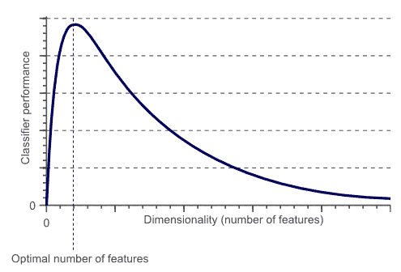

<title>Feature Engineering and Model Complexity – The Titanic Example Revisited</title>  

# 特征工程和模型复杂性——重温泰坦尼克号的例子

模型复杂性和评估是构建成功的数据科学系统的必经步骤。有很多工具可以用来评估和选择你的模型。在本章中，我们将介绍一些工具，通过添加更多描述性要素和从现有要素中提取有意义的信息，帮助您提高数据的价值。我们还将讨论与最佳数量特征相关的其他工具，并了解为什么拥有大量特征和较少训练样本/观测值会成为一个问题。

以下是本章将要解释的主题:

*   特征工程
*   维度的诅咒
*   重温泰坦尼克号的例子——一起
*   偏差-方差分解
*   学习可视性

<title>Feature engineering</title>  

# 特征工程

特征工程是影响模型性能的关键因素之一。具有正确特征的简单模型比具有较差特征的复杂模型性能更好。您可以将特征工程过程视为决定预测模型成败的最重要步骤。如果你理解了数据，特征工程就会容易得多。

任何使用机器学习来解决一个问题的人都广泛使用特征工程，这个问题是:**如何充分利用数据样本进行预测建模**？这是特征工程的过程和实践所解决的问题，而你的数据科学技能的成功是从知道如何很好地表示你的数据开始的。

预测建模是将一系列特征或输入变量( *x* [1] ， *x* [2] ，...， *x* [n] )转换成感兴趣的输出/目标(y)。那么，什么是特征工程呢？它是创建新的输入变量或特征的过程( *z* [1] ， *z* [2] ，...、*z*n 从已有的输入变量(*x*1、*x*2，...、*x*n)。我们不只是创造任何新功能；新创建的特征应该有助于模型的输出，并且与模型的输出相关。利用领域知识(如市场营销、医疗等)，创建与模型输出相关的特性将是一个简单的过程。即使机器学习实践者在这个过程中与一些领域专家进行了交互，特征工程过程的结果也会好得多。

在给定一组输入变量/特征(温度、风速和云量百分比)的情况下，领域知识可以发挥作用的一个例子是对降雨的可能性进行建模。对于这个具体的例子，我们可以构造一个新的二元特征，称为**多云**，其中每当云覆盖的百分比小于 20%时，它的值等于 1 或否，否则等于 0 或是。在这个例子中，领域知识对于指定阈值或截止百分比是必不可少的。输入的信息越多，越有用，模型的可靠性和预测性就越好。

<title>Types of feature engineering</title>  

# 特征工程的类型

特征工程作为一种技术有三个主要的子类。作为深度学习实践者，你有在它们之间进行选择或者以某种方式组合它们的自由。

<title>Feature selection</title>  

# 特征选择

有时称为**特征重要性**，这是根据输入变量对目标/输出变量的贡献对其进行排序的过程。此外，该过程可以被认为是根据输入变量在模型预测能力中的值对输入变量进行排序的过程。

一些学习方法将这种特征排序或重要性作为其内部过程的一部分(如决策树)。这类方法大多使用熵来过滤掉价值较低的变量。在某些情况下，深度学习实践者使用这样的学习方法来选择最重要的特征，然后将它们馈入更好的学习算法。

<title>Dimensionality reduction</title>  

# 降维

降维有时是特征提取，它是将现有的输入变量组合成一组新的数量大大减少的输入变量的过程。这种类型的特征工程最常用的方法之一是**主成分分析** ( **PCA** )，它利用数据中的方差来得出数量减少的输入变量，这些变量看起来不像原始输入变量。

<title>Feature construction</title>  

# 特征构造

特征构造是特征工程的一种常用类型，人们在谈论特征工程时通常会提到它。这项技术是从原始数据手工制作或构建新要素的过程。在这种类型的特征工程中，领域知识对于从现有特征中手动组成其他特征是非常有用的。与其他特征工程技术一样，特征构造的目的是提高模型的可预测性。要素构造的一个简单示例是使用日期戳要素生成两个新要素，例如 AM 和 PM，这可能有助于区分白天和夜晚。我们还可以通过计算噪声特征的平均值，然后确定给定行是否大于或小于该平均值，将噪声数字特征转换为更简单的标称特征。

<title>Titanic example revisited</title>  

# 重温泰坦尼克号的例子

在这一节中，我们将使用特征工程工具，从不同的角度再次回顾泰坦尼克号的例子。如果你跳过了[第 2 章](6e292a27-8ff3-4d9c-9186-433455cb380c.xhtml)，*活动中的数据建模——泰坦尼克号的例子*，泰坦尼克号的例子是一个 Kaggle 比赛，目的是预测特定乘客是否幸存。

在这次重访 Titanic 示例的过程中，我们将使用 scikit-learn 和 pandas 库。首先，让我们从读取训练集和测试集开始，并获得一些关于数据的统计数据:

```
# reading the train and test sets using pandas
train_data = pd.read_csv('data/train.csv', header=0)
test_data = pd.read_csv('data/test.csv', header=0)

# concatenate the train and test set together for doing the overall feature engineering stuff
df_titanic_data = pd.concat([train_data, test_data])

# removing duplicate indices due to coming the train and test set by re-indexing the data
df_titanic_data.reset_index(inplace=True)

# removing the index column the reset_index() function generates
df_titanic_data.drop('index', axis=1, inplace=True)

# index the columns to be 1-based index
df_titanic_data = df_titanic_data.reindex_axis(train_data.columns, axis=1)
```

我们需要指出前面代码片段的一些内容:

*   如图所示，我们使用了 pandas 的`concat`函数来组合训练集和测试集的数据帧。这对特征工程任务很有用，因为我们需要输入变量/特征分布的完整视图。
*   合并两个数据帧后，我们需要对输出数据帧进行一些修改。

<title>Missing values</title>  

# 缺少值

从客户那里获得新数据集后，首先要考虑的就是这一步，因为几乎每个数据集中都会有缺失/不正确的数据。在接下来的章节中，你会看到一些学习算法能够处理缺失值，而其他的需要你来处理缺失数据。在本例中，我们将使用 scikit-learn 的随机森林分类器，它需要单独处理丢失的数据。

有不同的方法可以用来处理丢失的数据。

<title>Removing any sample with missing values in it</title>  

# 移除任何含有缺失值的样本

如果您有一个包含大量缺失值的小数据集，那么这种方法不是一个好的选择，因为移除包含缺失值的样本会产生无用的数据。如果您有大量数据，这可能是一个快速而简单的选择，并且删除它不会对原始数据集产生太大影响。

<title>Missing value inputting</title>  

# 缺失值输入

当您有分类数据时，这种方法很有用。这种方法背后的直觉是，丢失的值可能与其他变量相关，删除它们将导致信息丢失，从而对模型产生重大影响。
例如，如果我们有一个二进制变量，它有两个可能的值，-1 和 1，我们可以添加另一个值(0)来指示缺少的值。您可以使用以下代码将**舱**特征的空值替换为`U0`:

```
# replacing the missing value in cabin variable "U0"
df_titanic_data['Cabin'][df_titanic_data.Cabin.isnull()] = 'U0'
```

<title>Assigning an average value</title>  

# 分配平均值

由于简单，这也是常用的方法之一。在数字特征的情况下，您可以用平均值或中值替换缺失值。对于分类变量，也可以使用这种方法，将模式(出现次数最多的值)分配给缺失值。

以下代码将`Fare`特征的非缺失值的中值分配给缺失值:

```
# handling the missing values by replacing it with the median fare
df_titanic_data['Fare'][np.isnan(df_titanic_data['Fare'])] = df_titanic_data['Fare'].median()
```

或者，您可以使用以下代码来查找在`Embarked`特性中出现次数最多的值，并将其分配给缺失的值:

```
# replacing the missing values with the most common value in the variable
df_titanic_data.Embarked[df_titanic_data.Embarked.isnull()] = df_titanic_data.Embarked.dropna().mode().values
```

<title>Using a regression or another simple model to predict the values of missing variables</title>  

# 使用回归或其他简单模型来预测缺失变量的值

这是我们将用于泰坦尼克号的`Age`特征的方法。`Age`特征是预测乘客生存的重要一步，通过取平均值来应用之前的方法会使我们丢失一些信息。

```
Age feature:
```

```
# Define a helper function that can use RandomForestClassifier for handling the missing values of the age variable
def set_missing_ages():
    global df_titanic_data

    age_data = df_titanic_data[
        ['Age', 'Embarked', 'Fare', 'Parch', 'SibSp', 'Title_id', 'Pclass', 'Names', 'CabinLetter']]
    input_values_RF = age_data.loc[(df_titanic_data.Age.notnull())].values[:, 1::]
    target_values_RF = age_data.loc[(df_titanic_data.Age.notnull())].values[:, 0]

    # Creating an object from the random forest regression function of sklearn<use the documentation for more details>
    regressor = RandomForestRegressor(n_estimators=2000, n_jobs=-1)

    # building the model based on the input values and target values above
    regressor.fit(input_values_RF, target_values_RF)

    # using the trained model to predict the missing values
    predicted_ages = regressor.predict(age_data.loc[(df_titanic_data.Age.isnull())].values[:, 1::])

```

```
    # Filling the predicted ages in the original titanic dataframe
    age_data.loc[(age_data.Age.isnull()), 'Age'] = predicted_ages
```

<title>Feature transformations</title>  

# 特征转换

在前两节中，我们介绍了如何读取训练集和测试集，以及如何组合它们。我们还处理了一些丢失的值。现在，我们将使用 scikit-learn 的随机森林分类器来预测乘客的存活率。随机森林算法的不同实现接受不同类型的数据。随机森林的 scikit-learn 实现只接受数字数据。因此，我们需要将分类特征转换成数字特征。

有两种类型的功能:

*   **量化**:量化特征以数值尺度来衡量，可以有意义的排序。在 Titanic 数据样本中，`Age`特征是定量特征的一个例子。

*   **定性**:定性变量，也称为**分类变量**，是非数值变量。它们描述符合类别的数据。在 Titanic 数据样本中，`Embarked`(表示出发港口的名称)特征是定性特征的一个例子。

我们可以对不同的变量应用不同的变换。下面是一些可以用来转换定性/分类特征的方法。

<title>Dummy features</title>  

# 虚拟特征

这些变量也称为分类或二元特征。如果要转换的要素只有少量不同的值，这种方法将是一个不错的选择。在 Titanic 数据样本中，`Embarked`特征只有三个频繁出现的不同值(`S`、`C`和`Q`)。因此，我们可以将`Embarked`特性转换成三个虚拟变量，(`'Embarked_S'`、`'Embarked_C'`和`'Embarked_Q'`)，以便能够使用随机森林分类器。

以下代码将向您展示如何进行这种转换:

```
# constructing binary features
def process_embarked():
    global df_titanic_data

    # replacing the missing values with the most common value in the variable
    df_titanic_data.Embarked[df.Embarked.isnull()] = df_titanic_data.Embarked.dropna().mode().values

    # converting the values into numbers
    df_titanic_data['Embarked'] = pd.factorize(df_titanic_data['Embarked'])[0]

    # binarizing the constructed features
    if keep_binary:
        df_titanic_data = pd.concat([df_titanic_data, pd.get_dummies(df_titanic_data['Embarked']).rename(
            columns=lambda x: 'Embarked_' + str(x))], axis=1)
```

<title>Factorizing</title>  

# 因式分解

这种方法用于从任何其他特征创建数字分类特征。在熊猫中，`factorize()`函数就是这样做的。如果您的要素是字母数字分类变量，则这种类型的变换非常有用。在 Titanic 数据样本中，我们可以将`Cabin`特征转换为分类特征，表示船舱的字母:

```
# the cabin number is a sequence of of alphanumerical digits, so we are going to create some features
# from the alphabetical part of it
df_titanic_data['CabinLetter'] = df_titanic_data['Cabin'].map(lambda l: get_cabin_letter(l))
df_titanic_data['CabinLetter'] = pd.factorize(df_titanic_data['CabinLetter'])[0]
```

```
def get_cabin_letter(cabin_value):
    # searching for the letters in the cabin alphanumerical value
    letter_match = re.compile("([a-zA-Z]+)").search(cabin_value)

    if letter_match:
        return letter_match.group()
    else:
        return 'U'
```

我们还可以通过使用以下方法之一将转换应用于定量特征。

<title>Scaling</title>  

# 缩放比例

这种变换只能应用于数字特征。

比如泰坦尼克号数据中，`Age`特征可以达到 100，但家庭收入可能以百万计。一些模型对值的大小很敏感，因此缩放这些特征将有助于这些模型更好地执行。此外，缩放可用于将变量值压缩到特定范围内。

以下代码将通过从每个值中移除其平均值来缩放`Age`特征，并缩放至单位方差:

```
# scale by subtracting the mean from each value
```

```
scaler_processing = preprocessing.StandardScaler()
```

```
df_titanic_data['Age_scaled'] = scaler_processing.fit_transform(df_titanic_data['Age'])
```

<title>Binning</title>  

# 扔掉

这种定量转换用于创建分位数。在这种情况下，定量特征值将是转换后的有序变量。对于线性回归来说，这种方法并不是一个好的选择，但是对于在使用有序/分类变量时能够有效响应的学习算法来说，这种方法可能很有效。

以下代码将这种转换应用于`Fare`特征:

```
# Binarizing the features by binning them into quantiles
df_titanic_data['Fare_bin'] = pd.qcut(df_titanic_data['Fare'], 4)

if keep_binary:
    df_titanic_data = pd.concat(
        [df_titanic_data, pd.get_dummies(df_titanic_data['Fare_bin']).rename(columns=lambda x: 'Fare_' + str(x))],
        axis=1)
```

<title>Derived features</title>  

# 衍生特征

在上一节中，我们对 Titanic 数据应用了一些转换，以便能够使用 scikit-learn 的随机森林分类器(它只接受数字数据)。在本节中，我们将定义另一种类型的变量，它是从一个或多个其他特征中派生出来的。

在这个定义下，我们可以说上一节的一些变换也叫做**派生特征**。在这一节中，我们将研究其他复杂的转换。

在前面的部分中，我们提到了您需要使用您的特征工程技能来派生新的特征，以增强模型的预测能力。我们还讨论了特性工程在数据科学管道中的重要性，以及为什么您应该花费大部分时间和精力来开发有用的特性。领域知识在这一部分会很有帮助。

衍生特征的非常简单的例子是从电话号码中提取国家代码和/或地区代码。您也可以从 GPS 坐标中提取国家/地区。

Titanic 数据非常简单，不包含很多变量，但我们可以尝试从文本特征中获取一些特征。

<title>Name</title>  

# 名字

对于大多数数据集来说，`name`变量本身是无用的，但是它有两个有用的属性。第一个是你名字的长度。例如，你名字的长度可能反映了你的身份，从而反映了你登上救生艇的能力:

```
# getting the different names in the names variable
df_titanic_data['Names'] = df_titanic_data['Name'].map(lambda y: len(re.split(' ', y)))
```

第二个有趣的属性是`Name`头衔，它也可以用来表示身份和/或性别:

```
# Getting titles for each person
df_titanic_data['Title'] = df_titanic_data['Name'].map(lambda y: re.compile(", (.*?)\.").findall(y)[0])

# handling the low occurring titles
df_titanic_data['Title'][df_titanic_data.Title == 'Jonkheer'] = 'Master'
df_titanic_data['Title'][df_titanic_data.Title.isin(['Ms', 'Mlle'])] = 'Miss'
df_titanic_data['Title'][df_titanic_data.Title == 'Mme'] = 'Mrs'
df_titanic_data['Title'][df_titanic_data.Title.isin(['Capt', 'Don', 'Major', 'Col', 'Sir'])] = 'Sir'
df_titanic_data['Title'][df_titanic_data.Title.isin(['Dona', 'Lady', 'the Countess'])] = 'Lady'

# binarizing all the features
if keep_binary:
    df_titanic_data = pd.concat(
        [df_titanic_data, pd.get_dummies(df_titanic_data['Title']).rename(columns=lambda x: 'Title_' + str(x))],
        axis=1)
```

你也可以试着从`Name`功能中想出其他有趣的功能。例如，您可能会想到使用姓氏功能来找出泰坦尼克号上家庭成员的大小。

<title>Cabin</title>  

# 小木屋

在泰坦尼克号的数据中，`Cabin`特征由一个表示甲板的字母和一个表示房间号的数字表示。房间号朝着船的后部增加，这将提供乘客位置的一些有用的测量。我们还可以从不同的甲板上获得乘客的状态，这将有助于确定谁上了救生艇:

```
# repllacing the missing value in cabin variable "U0"
df_titanic_data['Cabin'][df_titanic_data.Cabin.isnull()] = 'U0'

# the cabin number is a sequence of of alphanumerical digits, so we are going to create some features
# from the alphabetical part of it
df_titanic_data['CabinLetter'] = df_titanic_data['Cabin'].map(lambda l: get_cabin_letter(l))
df_titanic_data['CabinLetter'] = pd.factorize(df_titanic_data['CabinLetter'])[0]

# binarizing the cabin letters features
if keep_binary:
    cletters = pd.get_dummies(df_titanic_data['CabinLetter']).rename(columns=lambda x: 'CabinLetter_' + str(x))
    df_titanic_data = pd.concat([df_titanic_data, cletters], axis=1)

# creating features from the numerical side of the cabin
df_titanic_data['CabinNumber'] = df_titanic_data['Cabin'].map(lambda x: get_cabin_num(x)).astype(int) + 1

```

<title>Ticket</title>  

# 票

`Ticket`特性的代码现在还不清楚，但是我们可以做一些猜测，并尝试将它们分组。在查看票证功能后，您可能会得到以下线索:

*   几乎四分之一的彩票以一个字符开头，而其余的仅由数字组成。
*   机票代码的数字部分似乎表明了乘客的等级。例如，以 1 开头的数字通常是头等票，2 通常是二等票，3 是三等票。我说*通常是*，因为它适用于大多数例子，但不是所有例子。也有 4-9 开头的票号，那些比较少见，几乎都是三等舱。
*   几个人可以共享一个票号，这可能表明一个家庭或亲密的朋友一起旅行，表现得像一个家庭。

以下代码尝试分析票据特征码，以找出前面的线索:

```
# Helper function for constructing features from the ticket variable
def process_ticket():
    global df_titanic_data

    df_titanic_data['TicketPrefix'] = df_titanic_data['Ticket'].map(lambda y: get_ticket_prefix(y.upper()))
    df_titanic_data['TicketPrefix'] = df_titanic_data['TicketPrefix'].map(lambda y: re.sub('[\.?\/?]', '', y))
    df_titanic_data['TicketPrefix'] = df_titanic_data['TicketPrefix'].map(lambda y: re.sub('STON', 'SOTON', y))

    df_titanic_data['TicketPrefixId'] = pd.factorize(df_titanic_data['TicketPrefix'])[0]

    # binarzing features for each ticket layer
    if keep_binary:
        prefixes = pd.get_dummies(df_titanic_data['TicketPrefix']).rename(columns=lambda y: 'TicketPrefix_' + str(y))
        df_titanic_data = pd.concat([df_titanic_data, prefixes], axis=1)

    df_titanic_data.drop(['TicketPrefix'], axis=1, inplace=True)

    df_titanic_data['TicketNumber'] = df_titanic_data['Ticket'].map(lambda y: get_ticket_num(y))
    df_titanic_data['TicketNumberDigits'] = df_titanic_data['TicketNumber'].map(lambda y: len(y)).astype(np.int)
    df_titanic_data['TicketNumberStart'] = df_titanic_data['TicketNumber'].map(lambda y: y[0:1]).astype(np.int)

    df_titanic_data['TicketNumber'] = df_titanic_data.TicketNumber.astype(np.int)

    if keep_scaled:
        scaler_processing = preprocessing.StandardScaler()
        df_titanic_data['TicketNumber_scaled'] = scaler_processing.fit_transform(
            df_titanic_data.TicketNumber.reshape(-1, 1))

def get_ticket_prefix(ticket_value):
    # searching for the letters in the ticket alphanumerical value
    match_letter = re.compile("([a-zA-Z\.\/]+)").search(ticket_value)
    if match_letter:
        return match_letter.group()
    else:
        return 'U'

def get_ticket_num(ticket_value):
    # searching for the numbers in the ticket alphanumerical value
    match_number = re.compile("([\d]+$)").search(ticket_value)
    if match_number:
        return match_number.group()
    else:
        return '0'

```

<title>Interaction features</title>  

# 交互功能

交互特征通过对特征集执行数学运算来获得，并且指示变量之间的关系的效果。我们对数字特征使用基本的数学运算，并观察变量之间关系的影响:

```
# Constructing features manually based on  the interaction between the individual features
numeric_features = df_titanic_data.loc[:,
                   ['Age_scaled', 'Fare_scaled', 'Pclass_scaled', 'Parch_scaled', 'SibSp_scaled',
                    'Names_scaled', 'CabinNumber_scaled', 'Age_bin_id_scaled', 'Fare_bin_id_scaled']]
print("\nUsing only numeric features for automated feature generation:\n", numeric_features.head(10))

new_fields_count = 0
for i in range(0, numeric_features.columns.size - 1):
    for j in range(0, numeric_features.columns.size - 1):
        if i <= j:
            name = str(numeric_features.columns.values[i]) + "*" + str(numeric_features.columns.values[j])
            df_titanic_data = pd.concat(
                [df_titanic_data, pd.Series(numeric_features.iloc[:, i] * numeric_features.iloc[:, j], name=name)],
                axis=1)
            new_fields_count += 1
        if i < j:
            name = str(numeric_features.columns.values[i]) + "+" + str(numeric_features.columns.values[j])
            df_titanic_data = pd.concat(
                [df_titanic_data, pd.Series(numeric_features.iloc[:, i] + numeric_features.iloc[:, j], name=name)],
                axis=1)
            new_fields_count += 1
        if not i == j:
            name = str(numeric_features.columns.values[i]) + "/" + str(numeric_features.columns.values[j])
            df_titanic_data = pd.concat(
                [df_titanic_data, pd.Series(numeric_features.iloc[:, i] / numeric_features.iloc[:, j], name=name)],
                axis=1)
            name = str(numeric_features.columns.values[i]) + "-" + str(numeric_features.columns.values[j])
            df_titanic_data = pd.concat(
                [df_titanic_data, pd.Series(numeric_features.iloc[:, i] - numeric_features.iloc[:, j], name=name)],
                axis=1)
            new_fields_count += 2

print("\n", new_fields_count, "new features constructed")
```

这种特征工程可以产生大量的特征。在前面的代码片段中，我们使用了 9 个特性来生成 176 个交互特性。

我们还可以移除高度相关的特征，因为这些特征的存在不会向模型添加任何信息。我们可以使用 Spearman 相关性来识别和去除高度相关的特征。Spearman 方法的输出中有一个等级系数，可用于识别高度相关的要素:

```
# using Spearman correlation method to remove the feature that have high correlation

# calculating the correlation matrix
df_titanic_data_cor = df_titanic_data.drop(['Survived', 'PassengerId'], axis=1).corr(method='spearman')

# creating a mask that will ignore correlated ones
mask_ignore = np.ones(df_titanic_data_cor.columns.size) - np.eye(df_titanic_data_cor.columns.size)
df_titanic_data_cor = mask_ignore * df_titanic_data_cor

features_to_drop = []

# dropping the correclated features
for column in df_titanic_data_cor.columns.values:

    # check if we already decided to drop this variable
    if np.in1d([column], features_to_drop):
        continue

    # finding highly correlacted variables
    corr_vars = df_titanic_data_cor[abs(df_titanic_data_cor[column]) > 0.98].index
    features_to_drop = np.union1d(features_to_drop, corr_vars)

print("\nWe are going to drop", features_to_drop.shape[0], " which are highly correlated features...\n")
df_titanic_data.drop(features_to_drop, axis=1, inplace=True)
```

<title>The curse of dimensionality</title>  

# 维度的诅咒

为了更好地解释维数灾难和过度拟合的问题，我们将通过一个例子来说明我们有一组图像。每张图片里都有一只猫或一只狗。因此，我们想建立一个模型，可以区分猫和狗的图像。就像 *[第一章](c6be0d67-2ba9-45ac-b6dd-116518853f42.xhtml)* 、*数据科学-鸟瞰图*中的鱼识别系统一样，我们需要找到一个学习算法可以用来区分两类(猫和狗)的解释性特征。在这个例子中，我们可以说颜色是用来区分猫和狗的一个很好的描述符。因此，平均红色、平均蓝色和平均绿色可用作区分这两个类别的解释性特征。

然后，该算法将以某种方式组合这三个特征，以形成两个类别之间的决策边界。

这三个特征的简单线性组合如下所示:

```
If 0.5*red + 0.3*green + 0.2*blue > 0.6 : return cat;
```

```
else return dog;
```

这些描述性特征不足以获得一个性能良好的分类器，因此我们可以决定添加更多的特征来增强模型的预测能力，以区分猫和狗。比如，我们可以考虑通过计算图像在 X 和 y 两个维度上的平均边缘或梯度强度来增加一些特征比如图像的纹理，增加这两个特征后，模型精度会提高。我们甚至可以通过添加越来越多的基于颜色、纹理直方图、统计矩等的特征来使模型/分类器获得更准确的分类能力。我们可以很容易地添加几百个这样的特征来增强模型的预测性。但是在增加特性超过一定限度后，反直觉的结果会更糟。通过查看*图 1* ，您会更好地理解这一点:



图 1:模型性能与特性数量的关系

*图 1* 显示，随着特征数量的增加，分类器的性能也会提高，直到我们达到最佳特征数量。基于相同大小的训练集添加更多特征将会降低分类器的性能。

<title>Avoiding the curse of dimensionality</title>  

# 避免维数灾难

在前面的章节中，我们展示了当特征的数量超过某个最佳点时，分类器的性能会降低。理论上，如果你有无限个训练样本，维数灾难就不存在了。因此，最佳的要素数量完全取决于数据的大小。

有一种方法可以帮助你避免这种诅咒的危害，那就是从大量的特性 *N* 中挑选出 *M* 个特性，其中*M<N*。来自 *M* 的每个特征可以是 *N* 中的一些特征的组合。有一些算法可以帮你做到这一点。这些算法试图找到原始 *N* 特征的有用的、不相关的和线性的组合。一种常用的技术是**主成分分析** ( **PCA** )。PCA 试图找到较少数量的特征来捕捉原始数据的最大变化。你可以在这个有趣的博客上找到更多关于 PCA 的见解和完整解释:[http://www . vision dummy . com/2014/05/feature-extraction-using-PCA/](http://www.visiondummy.com/2014/05/feature-extraction-using-pca/)。

将 PCA 应用于原始训练特征的一种有用且简单的方法是使用以下代码:

```
# minimum variance percentage that should be covered by the reduced number of variables
variance_percentage = .99

# creating PCA object
pca_object = PCA(n_components=variance_percentage)

# trasforming the features
input_values_transformed = pca_object.fit_transform(input_values, target_values)

# creating a datafram for the transformed variables from PCA
pca_df = pd.DataFrame(input_values_transformed)

print(pca_df.shape[1], " reduced components which describe ", str(variance_percentage)[1:], "% of the variance")
```

在 Titanic 示例中，我们尝试在对原始特征应用和不应用 PCA 的情况下构建分类器。因为我们在最后使用了随机森林分类器，我们发现应用主成分分析没有太大帮助；随机森林在没有任何特征转换的情况下工作得非常好，甚至相关的特征也不会对模型产生太大的影响。

<title>Titanic example revisited – all together</title>  

# 重温泰坦尼克号的例子——一起

在这一节中，我们将把特征工程和降维的所有细节放在一起:

```
import re
import numpy as np
import pandas as pd
import random as rd
from sklearn import preprocessing
from sklearn.cluster import KMeans
from sklearn.ensemble import RandomForestRegressor
from sklearn.decomposition import PCA

# Print options
np.set_printoptions(precision=4, threshold=10000, linewidth=160, edgeitems=999, suppress=True)
pd.set_option('display.max_columns', None)
pd.set_option('display.max_rows', None)
pd.set_option('display.width', 160)
pd.set_option('expand_frame_repr', False)
pd.set_option('precision', 4)

# constructing binary features
def process_embarked():
    global df_titanic_data

    # replacing the missing values with the most common value in the variable
    df_titanic_data.Embarked[df.Embarked.isnull()] = df_titanic_data.Embarked.dropna().mode().values

    # converting the values into numbers
    df_titanic_data['Embarked'] = pd.factorize(df_titanic_data['Embarked'])[0]

    # binarizing the constructed features
    if keep_binary:
        df_titanic_data = pd.concat([df_titanic_data, pd.get_dummies(df_titanic_data['Embarked']).rename(
            columns=lambda x: 'Embarked_' + str(x))], axis=1)

# Define a helper function that can use RandomForestClassifier for handling the missing values of the age variable
def set_missing_ages():
    global df_titanic_data

    age_data = df_titanic_data[
        ['Age', 'Embarked', 'Fare', 'Parch', 'SibSp', 'Title_id', 'Pclass', 'Names', 'CabinLetter']]
    input_values_RF = age_data.loc[(df_titanic_data.Age.notnull())].values[:, 1::]
    target_values_RF = age_data.loc[(df_titanic_data.Age.notnull())].values[:, 0]

    # Creating an object from the random forest regression function of sklearn<use the documentation for more details>
    regressor = RandomForestRegressor(n_estimators=2000, n_jobs=-1)

    # building the model based on the input values and target values above
    regressor.fit(input_values_RF, target_values_RF)

    # using the trained model to predict the missing values
    predicted_ages = regressor.predict(age_data.loc[(df_titanic_data.Age.isnull())].values[:, 1::])

    # Filling the predicted ages in the original titanic dataframe
    age_data.loc[(age_data.Age.isnull()), 'Age'] = predicted_ages

# Helper function for constructing features from the age variable
def process_age():
    global df_titanic_data

    # calling the set_missing_ages helper function to use random forest regression for predicting missing values of age
    set_missing_ages()

    # # scale the age variable by centering it around the mean with a unit variance
    # if keep_scaled:
    # scaler_preprocessing = preprocessing.StandardScaler()
    # df_titanic_data['Age_scaled'] = scaler_preprocessing.fit_transform(df_titanic_data.Age.reshape(-1, 1))

    # construct a feature for children
    df_titanic_data['isChild'] = np.where(df_titanic_data.Age < 13, 1, 0)

    # bin into quartiles and create binary features
    df_titanic_data['Age_bin'] = pd.qcut(df_titanic_data['Age'], 4)

    if keep_binary:
        df_titanic_data = pd.concat(
            [df_titanic_data, pd.get_dummies(df_titanic_data['Age_bin']).rename(columns=lambda y: 'Age_' + str(y))],
            axis=1)

    if keep_bins:
        df_titanic_data['Age_bin_id'] = pd.factorize(df_titanic_data['Age_bin'])[0] + 1

    if keep_bins and keep_scaled:
        scaler_processing = preprocessing.StandardScaler()
        df_titanic_data['Age_bin_id_scaled'] = scaler_processing.fit_transform(
            df_titanic_data.Age_bin_id.reshape(-1, 1))

    if not keep_strings:
        df_titanic_data.drop('Age_bin', axis=1, inplace=True)

# Helper function for constructing features from the passengers/crew names
def process_name():
    global df_titanic_data

    # getting the different names in the names variable
    df_titanic_data['Names'] = df_titanic_data['Name'].map(lambda y: len(re.split(' ', y)))

    # Getting titles for each person
    df_titanic_data['Title'] = df_titanic_data['Name'].map(lambda y: re.compile(", (.*?)\.").findall(y)[0])

    # handling the low occurring titles
    df_titanic_data['Title'][df_titanic_data.Title == 'Jonkheer'] = 'Master'
    df_titanic_data['Title'][df_titanic_data.Title.isin(['Ms', 'Mlle'])] = 'Miss'
    df_titanic_data['Title'][df_titanic_data.Title == 'Mme'] = 'Mrs'
    df_titanic_data['Title'][df_titanic_data.Title.isin(['Capt', 'Don', 'Major', 'Col', 'Sir'])] = 'Sir'
    df_titanic_data['Title'][df_titanic_data.Title.isin(['Dona', 'Lady', 'the Countess'])] = 'Lady'

    # binarizing all the features
    if keep_binary:
        df_titanic_data = pd.concat(
            [df_titanic_data, pd.get_dummies(df_titanic_data['Title']).rename(columns=lambda x: 'Title_' + str(x))],
            axis=1)

    # scaling
    if keep_scaled:
        scaler_preprocessing = preprocessing.StandardScaler()
        df_titanic_data['Names_scaled'] = scaler_preprocessing.fit_transform(df_titanic_data.Names.reshape(-1, 1))

    # binning
    if keep_bins:
        df_titanic_data['Title_id'] = pd.factorize(df_titanic_data['Title'])[0] + 1

    if keep_bins and keep_scaled:
        scaler = preprocessing.StandardScaler()
        df_titanic_data['Title_id_scaled'] = scaler.fit_transform(df_titanic_data.Title_id.reshape(-1, 1))

# Generate features from the cabin input variable
def process_cabin():
    # refering to the global variable that contains the titanic examples
    global df_titanic_data

    # repllacing the missing value in cabin variable "U0"
    df_titanic_data['Cabin'][df_titanic_data.Cabin.isnull()] = 'U0'

    # the cabin number is a sequence of of alphanumerical digits, so we are going to create some features
    # from the alphabetical part of it
    df_titanic_data['CabinLetter'] = df_titanic_data['Cabin'].map(lambda l: get_cabin_letter(l))
    df_titanic_data['CabinLetter'] = pd.factorize(df_titanic_data['CabinLetter'])[0]

    # binarizing the cabin letters features
    if keep_binary:
        cletters = pd.get_dummies(df_titanic_data['CabinLetter']).rename(columns=lambda x: 'CabinLetter_' + str(x))
        df_titanic_data = pd.concat([df_titanic_data, cletters], axis=1)

    # creating features from the numerical side of the cabin
    df_titanic_data['CabinNumber'] = df_titanic_data['Cabin'].map(lambda x: get_cabin_num(x)).astype(int) + 1

    # scaling the feature
    if keep_scaled:
        scaler_processing = preprocessing.StandardScaler() # handling the missing values by replacing it with the median feare
    df_titanic_data['Fare'][np.isnan(df_titanic_data['Fare'])] = df_titanic_data['Fare'].median()
    df_titanic_data['CabinNumber_scaled'] = scaler_processing.fit_transform(df_titanic_data.CabinNumber.reshape(-1, 1))

def get_cabin_letter(cabin_value):
    # searching for the letters in the cabin alphanumerical value
    letter_match = re.compile("([a-zA-Z]+)").search(cabin_value)

    if letter_match:
        return letter_match.group()
    else:
        return 'U'

def get_cabin_num(cabin_value):
    # searching for the numbers in the cabin alphanumerical value
    number_match = re.compile("([0-9]+)").search(cabin_value)

    if number_match:
        return number_match.group()
    else:
        return 0

# helper function for constructing features from the ticket fare variable
def process_fare():
    global df_titanic_data

    # handling the missing values by replacing it with the median feare
    df_titanic_data['Fare'][np.isnan(df_titanic_data['Fare'])] = df_titanic_data['Fare'].median()

    # zeros in the fare will cause some division problems so we are going to set them to 1/10th of the lowest fare
    df_titanic_data['Fare'][np.where(df_titanic_data['Fare'] == 0)[0]] = df_titanic_data['Fare'][
                                                                             df_titanic_data['Fare'].nonzero()[
                                                                                 0]].min() / 10

    # Binarizing the features by binning them into quantiles
    df_titanic_data['Fare_bin'] = pd.qcut(df_titanic_data['Fare'], 4)

    if keep_binary:
        df_titanic_data = pd.concat(
            [df_titanic_data, pd.get_dummies(df_titanic_data['Fare_bin']).rename(columns=lambda x: 'Fare_' + str(x))],
            axis=1)

    # binning
    if keep_bins:
        df_titanic_data['Fare_bin_id'] = pd.factorize(df_titanic_data['Fare_bin'])[0] + 1

    # scaling the value
    if keep_scaled:
        scaler_processing = preprocessing.StandardScaler()
        df_titanic_data['Fare_scaled'] = scaler_processing.fit_transform(df_titanic_data.Fare.reshape(-1, 1))

    if keep_bins and keep_scaled:
        scaler_processing = preprocessing.StandardScaler()
        df_titanic_data['Fare_bin_id_scaled'] = scaler_processing.fit_transform(
            df_titanic_data.Fare_bin_id.reshape(-1, 1))

    if not keep_strings:
        df_titanic_data.drop('Fare_bin', axis=1, inplace=True)

# Helper function for constructing features from the ticket variable
def process_ticket():
    global df_titanic_data

    df_titanic_data['TicketPrefix'] = df_titanic_data['Ticket'].map(lambda y: get_ticket_prefix(y.upper()))
    df_titanic_data['TicketPrefix'] = df_titanic_data['TicketPrefix'].map(lambda y: re.sub('[\.?\/?]', '', y))
    df_titanic_data['TicketPrefix'] = df_titanic_data['TicketPrefix'].map(lambda y: re.sub('STON', 'SOTON', y))

    df_titanic_data['TicketPrefixId'] = pd.factorize(df_titanic_data['TicketPrefix'])[0]

    # binarzing features for each ticket layer
    if keep_binary:
        prefixes = pd.get_dummies(df_titanic_data['TicketPrefix']).rename(columns=lambda y: 'TicketPrefix_' + str(y))
        df_titanic_data = pd.concat([df_titanic_data, prefixes], axis=1)

    df_titanic_data.drop(['TicketPrefix'], axis=1, inplace=True)

    df_titanic_data['TicketNumber'] = df_titanic_data['Ticket'].map(lambda y: get_ticket_num(y))
    df_titanic_data['TicketNumberDigits'] = df_titanic_data['TicketNumber'].map(lambda y: len(y)).astype(np.int)
    df_titanic_data['TicketNumberStart'] = df_titanic_data['TicketNumber'].map(lambda y: y[0:1]).astype(np.int)

    df_titanic_data['TicketNumber'] = df_titanic_data.TicketNumber.astype(np.int)

    if keep_scaled:
        scaler_processing = preprocessing.StandardScaler()
        df_titanic_data['TicketNumber_scaled'] = scaler_processing.fit_transform(
            df_titanic_data.TicketNumber.reshape(-1, 1))

def get_ticket_prefix(ticket_value):
    # searching for the letters in the ticket alphanumerical value
    match_letter = re.compile("([a-zA-Z\.\/]+)").search(ticket_value)
    if match_letter:
        return match_letter.group()
    else:
        return 'U'

def get_ticket_num(ticket_value):
    # searching for the numbers in the ticket alphanumerical value
    match_number = re.compile("([\d]+$)").search(ticket_value)
    if match_number:
        return match_number.group()
    else:
        return '0'

# constructing features from the passenger class variable
def process_PClass():
    global df_titanic_data

    # using the most frequent value(mode) to replace the messing value
    df_titanic_data.Pclass[df_titanic_data.Pclass.isnull()] = df_titanic_data.Pclass.dropna().mode().values

    # binarizing the features
    if keep_binary:
        df_titanic_data = pd.concat(
            [df_titanic_data, pd.get_dummies(df_titanic_data['Pclass']).rename(columns=lambda y: 'Pclass_' + str(y))],
            axis=1)

    if keep_scaled:
        scaler_preprocessing = preprocessing.StandardScaler()
        df_titanic_data['Pclass_scaled'] = scaler_preprocessing.fit_transform(df_titanic_data.Pclass.reshape(-1, 1))

# constructing features based on the family variables subh as SibSp and Parch
def process_family():
    global df_titanic_data

    # ensuring that there's no zeros to use interaction variables
    df_titanic_data['SibSp'] = df_titanic_data['SibSp'] + 1
    df_titanic_data['Parch'] = df_titanic_data['Parch'] + 1

    # scaling
    if keep_scaled:
        scaler_preprocessing = preprocessing.StandardScaler()
        df_titanic_data['SibSp_scaled'] = scaler_preprocessing.fit_transform(df_titanic_data.SibSp.reshape(-1, 1))
        df_titanic_data['Parch_scaled'] = scaler_preprocessing.fit_transform(df_titanic_data.Parch.reshape(-1, 1))

    # binarizing all the features
    if keep_binary:
        sibsps_var = pd.get_dummies(df_titanic_data['SibSp']).rename(columns=lambda y: 'SibSp_' + str(y))
        parchs_var = pd.get_dummies(df_titanic_data['Parch']).rename(columns=lambda y: 'Parch_' + str(y))
        df_titanic_data = pd.concat([df_titanic_data, sibsps_var, parchs_var], axis=1)

# binarzing the sex variable
def process_sex():
    global df_titanic_data
    df_titanic_data['Gender'] = np.where(df_titanic_data['Sex'] == 'male', 1, 0)

# dropping raw original
def process_drops():
    global df_titanic_data
    drops = ['Name', 'Names', 'Title', 'Sex', 'SibSp', 'Parch', 'Pclass', 'Embarked', \
             'Cabin', 'CabinLetter', 'CabinNumber', 'Age', 'Fare', 'Ticket', 'TicketNumber']
    string_drops = ['Title', 'Name', 'Cabin', 'Ticket', 'Sex', 'Ticket', 'TicketNumber']
    if not keep_raw:
        df_titanic_data.drop(drops, axis=1, inplace=True)
    elif not keep_strings:
        df_titanic_data.drop(string_drops, axis=1, inplace=True)

# handling all the feature engineering tasks
def get_titanic_dataset(binary=False, bins=False, scaled=False, strings=False, raw=True, pca=False, balanced=False):
    global keep_binary, keep_bins, keep_scaled, keep_raw, keep_strings, df_titanic_data
    keep_binary = binary
    keep_bins = bins
    keep_scaled = scaled
    keep_raw = raw
    keep_strings = strings

    # reading the train and test sets using pandas
    train_data = pd.read_csv('data/train.csv', header=0)
    test_data = pd.read_csv('data/test.csv', header=0)

    # concatenate the train and test set together for doing the overall feature engineering stuff
    df_titanic_data = pd.concat([train_data, test_data])

    # removing duplicate indices due to coming the train and test set by re-indexing the data
    df_titanic_data.reset_index(inplace=True)

    # removing the index column the reset_index() function generates
    df_titanic_data.drop('index', axis=1, inplace=True)

    # index the columns to be 1-based index
    df_titanic_data = df_titanic_data.reindex_axis(train_data.columns, axis=1)

    # processing the titanic raw variables using the helper functions that we defined above
    process_cabin()
    process_ticket()
    process_name()
    process_fare()
    process_embarked()
    process_family()
    process_sex()
    process_PClass()
    process_age()
    process_drops()

    # move the survived column to be the first
    columns_list = list(df_titanic_data.columns.values)
    columns_list.remove('Survived')
    new_col_list = list(['Survived'])
    new_col_list.extend(columns_list)
    df_titanic_data = df_titanic_data.reindex(columns=new_col_list)

    print("Starting with", df_titanic_data.columns.size,
          "manually constructing features based on the interaction between them...\n", df_titanic_data.columns.values)

    # Constructing features manually based on the interaction between the individual features
    numeric_features = df_titanic_data.loc[:,
                       ['Age_scaled', 'Fare_scaled', 'Pclass_scaled', 'Parch_scaled', 'SibSp_scaled',
                        'Names_scaled', 'CabinNumber_scaled', 'Age_bin_id_scaled', 'Fare_bin_id_scaled']]
    print("\nUsing only numeric features for automated feature generation:\n", numeric_features.head(10))

    new_fields_count = 0
    for i in range(0, numeric_features.columns.size - 1):
        for j in range(0, numeric_features.columns.size - 1):
            if i <= j:
                name = str(numeric_features.columns.values[i]) + "*" + str(numeric_features.columns.values[j])
                df_titanic_data = pd.concat(
                    [df_titanic_data, pd.Series(numeric_features.iloc[:, i] * numeric_features.iloc[:, j], name=name)],
                    axis=1)
                new_fields_count += 1
            if i < j:
                name = str(numeric_features.columns.values[i]) + "+" + str(numeric_features.columns.values[j])
                df_titanic_data = pd.concat(
                    [df_titanic_data, pd.Series(numeric_features.iloc[:, i] + numeric_features.iloc[:, j], name=name)],
                    axis=1)
                new_fields_count += 1
            if not i == j:
                name = str(numeric_features.columns.values[i]) + "/" + str(numeric_features.columns.values[j])
                df_titanic_data = pd.concat(
                    [df_titanic_data, pd.Series(numeric_features.iloc[:, i] / numeric_features.iloc[:, j], name=name)],
                    axis=1)
                name = str(numeric_features.columns.values[i]) + "-" + str(numeric_features.columns.values[j])
                df_titanic_data = pd.concat(
                    [df_titanic_data, pd.Series(numeric_features.iloc[:, i] - numeric_features.iloc[:, j], name=name)],
                    axis=1)
                new_fields_count += 2

    print("\n", new_fields_count, "new features constructed")

    # using Spearman correlation method to remove the feature that have high correlation

    # calculating the correlation matrix
    df_titanic_data_cor = df_titanic_data.drop(['Survived', 'PassengerId'], axis=1).corr(method='spearman')

    # creating a mask that will ignore correlated ones
    mask_ignore = np.ones(df_titanic_data_cor.columns.size) - np.eye(df_titanic_data_cor.columns.size)
    df_titanic_data_cor = mask_ignore * df_titanic_data_cor

    features_to_drop = []

    # dropping the correclated features
    for column in df_titanic_data_cor.columns.values:

        # check if we already decided to drop this variable
        if np.in1d([column], features_to_drop):
            continue

        # finding highly correlacted variables
        corr_vars = df_titanic_data_cor[abs(df_titanic_data_cor[column]) > 0.98].index
        features_to_drop = np.union1d(features_to_drop, corr_vars)

    print("\nWe are going to drop", features_to_drop.shape[0], " which are highly correlated features...\n")
    df_titanic_data.drop(features_to_drop, axis=1, inplace=True)

    # splitting the dataset to train and test and do PCA
    train_data = df_titanic_data[:train_data.shape[0]]
    test_data = df_titanic_data[test_data.shape[0]:]

    if pca:
        print("reducing number of variables...")
        train_data, test_data = reduce(train_data, test_data)
    else:
        # drop the empty 'Survived' column for the test set that was created during set concatenation
        test_data.drop('Survived', axis=1, inplace=True)

    print("\n", train_data.columns.size, "initial features generated...\n") # , input_df.columns.values

    return train_data, test_data

# reducing the dimensionality for the training and testing set
def reduce(train_data, test_data):
    # join the full data together
    df_titanic_data = pd.concat([train_data, test_data])
    df_titanic_data.reset_index(inplace=True)
    df_titanic_data.drop('index', axis=1, inplace=True)
    df_titanic_data = df_titanic_data.reindex_axis(train_data.columns, axis=1)

    # converting the survived column to series
    survived_series = pd.Series(df_titanic_data['Survived'], name='Survived')

    print(df_titanic_data.head())

    # getting the input and target values
    input_values = df_titanic_data.values[:, 1::]
    target_values = df_titanic_data.values[:, 0]

    print(input_values[0:10])

    # minimum variance percentage that should be covered by the reduced number of variables
    variance_percentage = .99

    # creating PCA object
    pca_object = PCA(n_components=variance_percentage)

    # trasforming the features
    input_values_transformed = pca_object.fit_transform(input_values, target_values)

    # creating a datafram for the transformed variables from PCA
    pca_df = pd.DataFrame(input_values_transformed)

    print(pca_df.shape[1], " reduced components which describe ", str(variance_percentage)[1:], "% of the variance")

    # constructing a new dataframe that contains the newly reduced vars of PCA
    df_titanic_data = pd.concat([survived_series, pca_df], axis=1)

    # split into separate input and test sets again
    train_data = df_titanic_data[:train_data.shape[0]]
    test_data = df_titanic_data[test_data.shape[0]:]
    test_data.reset_index(inplace=True)
    test_data.drop('index', axis=1, inplace=True)
    test_data.drop('Survived', axis=1, inplace=True)

    return train_data, test_data

# Calling the helper functions
if __name__ == '__main__':
    train, test = get_titanic_dataset(bins=True, scaled=True, binary=True)
    initial_drops = ['PassengerId']
    train.drop(initial_drops, axis=1, inplace=True)
    test.drop(initial_drops, axis=1, inplace=True)

    train, test = reduce(train, test)

    print(train.columns.values)
```

<title>Bias-variance decomposition</title>  

# 偏差-方差分解

在上一节中，我们知道了如何为我们的模型选择最佳的超参数。这组最佳超参数是基于最小化交叉验证误差的度量来选择的。现在，我们需要了解模型如何处理看不见的数据，即所谓的样本外数据，即在模型训练阶段没有看到的新数据样本。

考虑以下示例:我们有一个大小为 10，000 的数据样本，我们将使用不同的训练集大小训练相同的模型，并绘制每一步的测试误差。比如我们准备拿出 1000 个作为测试集，另外 9000 个用于训练。因此，在第一轮训练中，我们将从这 9000 个项目中随机选择一个大小为 100 的训练集。我们将基于*最佳*选定的超参数集训练模型，用测试集测试模型，最后绘制训练(样本内)误差和测试(样本外)误差。我们对不同的列车规模重复这种训练、测试和绘图操作(例如，从 9，000 个中选择 500 个，然后从 9，000 个中选择 1，000 个，以此类推)。

在完成所有这些训练、测试和绘图之后，我们将得到两条曲线的图形，代表使用相同模型但跨不同训练集大小的训练和测试误差。从这个图表中，我们可以知道我们的模型有多好。

输出图将包含两条代表训练和测试误差的曲线，是图 2 中*所示的四种可能形状之一。这种不同形状的来源是吴恩达在 Coursera 上的机器学习课程([https://www.coursera.org/learn/machine-learning](https://www.coursera.org/learn/machine-learning))。对于机器学习新手来说，这是一门很棒的课程，包含许多见解和最佳实践:*


图 2:不同训练集大小的训练和测试误差的可能图形

那么，我们应该什么时候接受我们的模型并将其投入生产呢？我们什么时候知道我们的模型在测试集上表现不好，因此不会有严重的泛化错误？这些问题的答案取决于绘制不同训练集大小的训练误差与测试误差的关系图时得到的形状:

*   如果你的形状看起来像左上方的*形状，它代表一个较低的训练误差，并且在测试集上推广得很好。这种形状很受欢迎，您应该继续在生产中使用这种模型。*
*   如果您的形状与右上方的*形状相似，则表示训练误差较大(模型未能从训练样本中学习)，甚至在测试集上具有更差的泛化性能。这个形状是一个彻底的失败，你需要回去看看你的数据，选择的学习算法，和/或选择的超参数有什么问题。*
*   如果您的形状与左下方的*形状相似，则表示存在严重的训练错误，因为模型未能捕捉到数据的底层结构，这也符合新的测试数据。*
*   如果你的形状与右下方的*相似，则代表高偏差和方差。这意味着您的模型没有很好地计算出训练数据，因此没有很好地概括测试集。*

偏差和方差是我们可以用来判断我们的模型有多好的部分。在监督学习中，有两个相反的错误来源，使用*图 2* 中的学习曲线，我们可以找出我们的模型受到哪个(哪些)组件的影响。具有高方差和低偏差的问题被称为**过拟合**，这意味着该模型在训练样本上表现良好，但在测试集上推广不好。另一方面，具有高偏差和低方差的问题被称为**欠拟合**，这意味着模型没有利用数据，也没有设法根据输入特征估计输出/目标。有不同的方法可以用来避免陷入这些问题之一。但通常，增强其中一个会以牺牲第二个为代价。

我们可以通过添加模型可以学习的更多特征来解决高方差的情况。这种解决方案很可能会增加偏差，因此您需要在它们之间进行某种权衡。

<title>Learning visibility</title>  

# 学习可视性

有许多伟大的数据科学算法可以用来解决不同领域的问题，但使学习过程可见的关键因素是拥有足够的数据。你可能会问，学习过程需要多少数据才是可见的和值得做的。根据经验，研究人员和机器学习实践者同意，你需要的数据样本至少是你的模型中自由度**的 10 倍。**

例如，在线性模型的情况下，自由度表示数据集中的要素数量。如果数据中有 50 个解释性要素，那么数据中至少需要 500 个数据样本/观测值。

<title>Breaking the rule of thumb</title>  

# 打破经验法则

在实践中，您可以摆脱这一规则，用少于 10 倍的数据特征进行学习；如果你的模型很简单，并且你正在使用一种叫做**正则化**的东西(在下一章中讨论)，这种情况会经常发生。

Jake Vanderplas 写了一篇文章([https://jakevdp . github . io/blog/2015/07/06/model-complexity-myth/](https://jakevdp.github.io/blog/2015/07/06/model-complexity-myth/))来说明一个人即使数据的参数比例子多也是可以学习的。为了证明这一点，他使用了正则化。

<title>Summary</title>  

# 摘要

在这一章中，我们讨论了机器学习实践者使用的最重要的工具，以便理解他们的数据，并获得学习算法来充分利用他们的数据。

特征工程是数据科学中第一个常用的工具；这是任何数据科学管道中的必备组件。此工具的目的是更好地表示数据并提高模型的预测能力。

我们看到了大量的特征是如何成为问题并导致更差的分类器性能的。我们还看到，应该使用最佳数量的特征来获得最大的模型性能，该最佳数量的特征是您获得的数据样本/观测值数量的函数。

随后，我们介绍了一个最强大的工具，这就是偏差-方差分解。该工具广泛用于测试模型在测试集上的表现。

最后，我们讨论了学习可见性，它回答了我们需要多少数据才能开展业务和进行机器学习的问题。经验法则表明，我们需要的数据样本/观测值至少是数据中要素数量的 10 倍。然而，这个经验法则可以通过使用另一个叫做正则化的工具来打破，这将在下一章中更详细地讨论。

接下来，我们将继续增加我们的数据科学工具，我们可以使用这些工具从我们的数据中进行有意义的分析，并面临一些应用机器学习的日常问题。