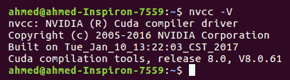
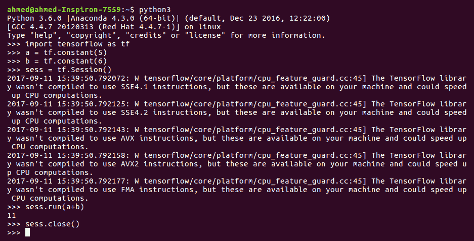
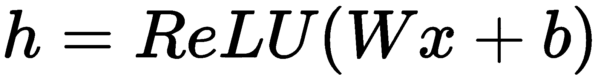
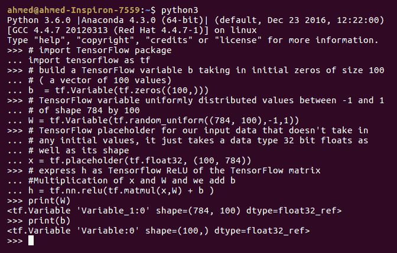
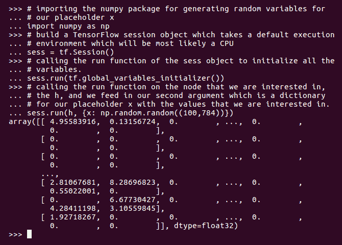

# 使用 TensorFlow 开始运行

在这一章中，我们将概述一个最广泛使用的深度学习框架。TensorFlow 拥有每天都在增长的大型社区支持，这使它成为构建复杂的深度学习应用程序的一个好选择。来自 TensorFlow 网站:

<q class="calibre52">"TensorFlow is an open source software library for numerical computation using data flow graphs. Nodes in the graph represent mathematical operations, while the graph edges represent the multidimensional data arrays (tensors) communicated between them. The flexible architecture allows you to deploy computation to one or more CPUs or GPUs in a desktop, server, or mobile device with a single API. TensorFlow was originally developed by researchers and engineers working on the Google Brain Team within Google's Machine Intelligence research organization for the purposes of conducting machine learning and deep neural networks research, but the system is general enough to be applicable in a wide variety of other domains as well."</q>

本章将涵盖以下主题:

*   张量流装置
*   张量流环境
*   计算图形
*   张量流数据类型、变量和占位符
*   从 TensorFlow 获取输出
*   tensor board——可视化学习


# 张量流装置

TensorFlow 安装自带两种模式:CPU 和 GPU。我们将通过在 GPU 模式下安装 TensorFlow 来开始安装教程。


# 适用于 Ubuntu 16.04 的 TensorFlow GPU 安装

TensorFlow 的 GPU 模式安装需要安装最新的 NVIDIA 驱动程序，因为 TensorFlow 的 GPU 版本目前仅支持 CUDA。以下部分将带您一步一步地安装 NVIDIA 驱动程序和 CUDA 8。


# 安装 NVIDIA 驱动程序和 CUDA 8

首先，你需要根据你的 GPU 安装正确的 NVIDIA 驱动。我有一个 GeForce GTX 960M GPU，所以我会继续安装`nvidia-375`(如果你有不同的 GPU，你可以使用英伟达搜索工具[http://www.nvidia.com/Download/index.aspx](http://www.nvidia.com/Download/index.aspx)来帮助你找到正确的驱动程序版本)。如果您想知道您机器的 GPU，您可以在终端中发出以下命令:

```
lspci | grep -i nvidia
```

您应该在终端中得到以下输出:


接下来，我们需要添加一个专有的 NVIDIA 驱动程序库，以便能够使用`apt-get`安装驱动程序:

```
sudo add-apt-repository ppa:graphics-drivers/ppa
sudo apt-get update
sudo apt-get install nvidia-375
```

成功安装 NVIDIA 驱动程序后，重新启动机器。要验证驱动程序是否安装正确，请在终端中发出以下命令:

```
cat /proc/driver/nvidia/version
```

您应该在终端中得到以下输出:


接下来，我们需要安装 CUDA 8。打开以下 CUDA 下载链接:[https://developer.nvidia.com/cuda-downloads](https://developer.nvidia.com/cuda-downloads)。按照下面的屏幕截图选择您的操作系统、架构、发行版、版本，最后是安装程序类型:


安装程序文件大约有 2 GB。您需要发出以下安装说明:

```
sudo dpkg -i cuda-repo-ubuntu1604-8-0-local-ga2_8.0.61-1_amd64.deb
sudo apt-get update
sudo apt-get install cuda
```

接下来，我们需要通过发出以下命令将库添加到`.bashrc`文件中:

```
echo 'export PATH=/usr/local/cuda/bin:$PATH' >> ~/.bashrc
```

```
echo 'export LD_LIBRARY_PATH=/usr/local/cuda/lib64:$LD_LIBRARY_PATH' >> ~/.bashrc
```

```
source ~/.bashrc
```

接下来，您需要通过发出以下命令来验证 CUDA 8 的安装:

```
nvcc -V
```

您应该在终端中得到以下输出:



最后，在这一节，我们需要安装 cuDNN 6.0。 **NVIDIA CUDA 深度神经网络库** ( **cuDNN** )是一个 GPU 加速的深度神经网络原语库。你可以从 NVIDIA 的网页上下载。发出以下命令来提取和安装 cuDNN:

```
cd ~/Downloads/
```

```
tar xvf cudnn*.tgz
```

```
cd cuda
```

```
sudo cp */*.h /usr/local/cuda/include/
```

```
sudo cp */libcudnn* /usr/local/cuda/lib64/
```

```
sudo chmod a+r /usr/local/cuda/lib64/libcudnn*
```

为了确保安装成功，您可以使用终端中的`nvidia-smi`工具。如果你有一个成功的安装，这个工具将为你提供一个监测信息，如内存和你的 GPU 运行过程。


# 安装 TensorFlow

为 TensorFlow 准备好 GPU 环境后，我们现在准备在 GPU 模式下安装 TensorFlow。但是对于 TensorFlow 安装过程，您可以首先安装几个有用的 Python 包，它们将在接下来的章节中帮助您，并使您的开发环境更容易。

我们可以通过发出以下命令来安装一些数据操作、分析和可视化库:

```
sudo apt-get update && apt-get install -y python-numpy python-scipy python-nose python-h5py python-skimage python-matplotlib python-pandas python-sklearn python-sympy
```

```
sudo apt-get clean && sudo apt-get autoremove
```

```
sudo rm -rf /var/lib/apt/lists/*
```

接下来，您可以安装更多有用的库，如虚拟环境、Jupyter 笔记本等等:

```
sudo apt-get update
```

```
sudo apt-get install git python-dev python3-dev python-numpy python3-numpy build-essential  python-pip python3-pip python-virtualenv swig python-wheel libcurl3-dev
```

```
sudo apt-get install -y libfreetype6-dev libpng12-dev
```

```
pip3 install -U matplotlib ipython[all] jupyter pandas scikit-image
```

最后，我们可以通过发出以下命令开始在 GPU 模式下安装 TensorFlow:

```
pip3 install --upgrade tensorflow-gpu
```

您可以使用 Python 验证 TensorFlow 的成功安装:

```
python3
>>> import tensorflow as tf
>>> a = tf.constant(5)
>>> b = tf.constant(6)
>>> sess = tf.Session()
>>> sess.run(a+b)
// this should print bunch of messages showing device status etc. // If everything goes well, you should see gpu listed in device
>>> sess.close()
```

您应该在终端中得到以下输出:


# 适用于 Ubuntu 16.04 的 TensorFlow CPU 安装

在本节中，我们将安装 CPU 版本，它在安装之前不需要任何驱动程序。因此，让我们从安装一些用于数据操作和可视化的有用包开始:

```
sudo apt-get update && apt-get install -y python-numpy python-scipy python-nose python-h5py python-skimage python-matplotlib python-pandas python-sklearn python-sympy
```

```
sudo apt-get clean && sudo apt-get autoremove
```

```
sudo rm -rf /var/lib/apt/lists/*
```

接下来，您可以安装更多有用的库，如虚拟环境、Jupyter 笔记本等等:

```
sudo apt-get update
```

```
sudo apt-get install git python-dev python3-dev python-numpy python3-numpy build-essential  python-pip python3-pip python-virtualenv swig python-wheel libcurl3-dev
```

```
sudo apt-get install -y libfreetype6-dev libpng12-dev
```

```
pip3 install -U matplotlib ipython[all] jupyter pandas scikit-image
```

最后，您可以通过发出以下命令在 CPU 模式下安装最新的 TensorFlow:

```
pip3 install --upgrade tensorflow
```

您可以通过运行以下 TensorFlow 语句来检查 TensorFlow 是否安装成功:

```
python3
>>> import tensorflow as tf
>>> a = tf.constant(5)
>>> b = tf.constant(6)
>>> sess = tf.Session()
>>> sess.run(a+b)
>> sess.close()
```

您应该在终端中得到以下输出:



# macOS X 的 TensorFlow CPU 安装

在本节中，我们将使用`virtualenv`为 macOS X 安装 TensorFlow。因此，让我们通过发出以下命令来安装`pip`工具:

```
sudo easy_install pip
```

接下来，我们需要安装虚拟环境库:

```
sudo pip install --upgrade virtualenv
```

安装虚拟环境库后，我们需要创建一个容器或虚拟环境来托管 TensorFlow 的安装以及您可能希望安装的任何软件包，而不会影响底层主机系统:

```
virtualenv --system-site-packages targetDirectory # for Python 2.7
```

```
virtualenv --system-site-packages -p python3 targetDirectory # for Python 3.n
```

这里假设`targetDirectory`是`~/tensorflow`。

现在您已经创建了虚拟环境，您可以通过发出以下命令来访问它:

```
source ~/tensorflow/bin/activate 
```

发出此命令后，您将可以访问刚刚创建的虚拟机，并且可以安装任何只在此环境中安装的软件包，这些软件包不会影响您正在使用的底层或主机系统。

为了从环境中退出，您可以发出以下命令:

```
deactivate
```

注意，现在，我们确实想在虚拟环境中，所以现在把它打开。一旦你玩完 TensorFlow，你应该停用它:

```
source bin/activate
```

为了安装 TensorFlow 的 CPU 版本，您可以发出以下命令，这也将安装 TensorFlow 需要的任何相关库:

```
(tensorflow)$ pip install --upgrade tensorflow      # for Python 2.7
```

```
(tensorflow)$ pip3 install --upgrade tensorflow     # for Python 3.n
```


# 用于 Windows 的 TensorFlow GPU/CPU 安装

我们假设您的系统上已经安装了 Python 3。要安装 TensorFlow，请以管理员身份启动终端，如下所示。打开开始菜单，搜索 cmd，然后右键单击它，并单击以管理员身份运行:


打开命令窗口后，可以发出以下命令在 GPU 模式下安装 TensorFlow:

在发出下一个命令之前，您需要安装`pip`或`pip3`(取决于您的 Python 版本)。

```
C:\> pip3 install --upgrade tensorflow-gpu
```

发出以下命令，在 CPU 模式下安装 TensorFlow:

```
C:\> pip3 install --upgrade tensorflow
```


# 张量流环境

TensorFlow 是谷歌的另一个深度学习框架，正如名称 **TensorFlow** 所暗示的那样，它源于神经网络对多维数据阵列或张量执行的操作！它实际上是一个张量流。

但是首先，为什么我们要在本书中使用深度学习框架？

*   **它缩放机器学习代码**:大部分对深度学习和机器学习的研究都可以应用/归因于这些深度学习框架。它们允许数据科学家极快地迭代，并使深度学习和其他 ML 算法更容易为从业者所用。谷歌、脸书等大公司正在使用这样的深度学习框架来扩展到数十亿用户。
*   **它计算梯度**:深度学习框架也可以自动计算梯度。如果你一步一步地进行梯度计算，你会发现梯度计算并不简单，而且自己实现一个没有错误的版本是很棘手的。
*   **它规范了机器学习应用的分享**:还有，预训练的模型在网上有，可以跨不同的深度学习框架使用，这些预训练的模型帮助了在 GPU 方面资源有限的人，让他们不用每次都从头开始。我们可以站在巨人的肩膀上，从那里开始。
*   **有许多深度学习框架可用**，它们具有不同的优势、范例、抽象级别、编程语言等等。
*   **与 GPU 接口进行并行处理**:使用 GPU 进行计算是一项迷人的功能，因为由于内核数量和并行化，GPU 比 CPU 更快地加速您的代码。

这就是为什么 Tensorflow 几乎是必要的，以便在深度学习方面取得进展，因为它可以促进您的项目。

那么，简单来说，什么是张量流？

*   TensorFlow 是 Google 的深度学习框架，是使用数据流图进行数值计算的开源框架
*   它最初是由谷歌大脑团队开发的，以促进他们的机器学习研究
*   TensorFlow 是用于表达机器学习算法的接口和用于执行这种算法的实现

张量流是如何工作的，底层范式是什么？


# 计算图形

关于 TensorFlow 的所有重要想法中，最重要的想法是将数值计算表示为计算图，如下图所示。因此，任何 TensorFlow 程序的主干都将是一个计算图，以下情况为真:

*   图节点是具有任意数量的输入和输出的操作
*   我们节点之间的图边将会是在这些操作之间流动的张量，在实践中思考张量是什么的最好方式是 n 维数组

使用这样的流程图作为深度学习框架的主干的优势在于，它允许你根据小而简单的操作来建立复杂的模型。此外，这将使梯度计算变得极其简单，我们将在后面的部分讨论这一点:


另一种思考张量流图的方式是，每一个操作都是一个可以在该点进行求值的函数。


# 张量流数据类型、变量和占位符

对计算图的理解将帮助我们从小的子图和操作的角度来考虑复杂的模型。

让我们看一个只有一个隐藏层的神经网络示例，以及它在 TensorFlow 中的计算图:



因此，我们有一些隐藏层，我们试图计算，因为一些参数矩阵的重新激活 *W* 乘以一些输入 *x* 加上一个偏置项 *b* 。ReLU 函数取输出的最大值和零。

下图显示了该图形在 TensorFlow 中的外观:


在这个图中，我们有变量为我们的 *b* 和 *W* ，我们有一个东西叫做占位符为*x*；在我们的图表中，每个操作都有节点。那么，让我们更详细地了解这些节点类型。


# 变量

变量将成为有状态的节点，输出它们的当前值。在这个例子中，只有 *b* 和 *W* 。我们所说的变量是有状态的，是指它们在多次执行中保持其当前值，并且很容易将保存的值恢复到变量中:


此外，变量还有其他有用的特性；例如，它们可以在培训期间和之后保存到您的磁盘上，这有助于我们前面提到的使用，它允许来自不同公司和团体的人保存、存储和发送他们的模型参数给其他人。此外，变量是您想要调整以最小化损失的东西，我们将很快看到如何做到这一点。

重要的是要知道图中的变量，比如 *b* 和 *W* ，仍然是操作，因为根据定义，图中的所有节点都是操作。因此，当您在运行时评估这些保存了 *b* 和 *W* 的值的操作时，您将获得这些变量的值。

我们可以使用 TensorFlow 的`Variable()`函数来定义一个变量，并赋予它一些初始值:

```
var = tf.Variable(tf.random_normal((0,1)),name='random_values')
```

这行代码将定义一个 2 乘 2 的变量，并从标准正态分布初始化它。您也可以给变量起一个名字。


# 占位符

下一类节点是占位符。占位符是在执行时输入值的节点:


如果您的计算图中有依赖于一些外部数据的输入，这些是我们将在训练期间添加到计算中的值的占位符。因此，对于占位符，我们不提供任何初始值。我们只是指定了张量的数据类型和形状，所以图形仍然知道要计算什么，即使它还没有任何存储的值。

我们可以使用 TensorFlow 的占位符函数来创建一个占位符:

```
ph_var1 = tf.placeholder(tf.float32,shape=(2,3))
ph_var2 = tf.placeholder(tf.float32,shape=(3,2))
result = tf.matmul(ph_var1,ph_var2)
```

这些代码行定义了特定形状的两个占位符变量，然后定义了将这两个值相乘的运算(见下一节)。


# 数学运算

第三种类型的节点是数学运算，这将是我们的矩阵乘法(MatMul)，加法(Add)和 ReLU。所有这些都是张量流图中的节点，它非常类似于 NumPy 运算:


让我们看看这个图在代码中会是什么样子。

我们执行以下步骤来生成上图:

1.  创建权重 *W* 和 *b* ，包括初始化。我们可以通过从均匀分布 *W ~均匀(-1，1)* 采样来初始化权重矩阵 *W* ，并将 *b* 初始化为 0。
2.  创建输入占位符 *x* ，其形状为 *m * 784* 输入矩阵。
3.  建立一个流程图。

让我们继续按照这些步骤来构建流程图:

```
# import TensorFlow package
import tensorflow as tf
# build a TensorFlow variable b taking in initial zeros of size 100
# ( a vector of 100 values)
b  = tf.Variable(tf.zeros((100,)))
# TensorFlow variable uniformly distributed values between -1 and 1
# of shape 784 by 100
W = tf.Variable(tf.random_uniform((784, 100),-1,1))
# TensorFlow placeholder for our input data that doesn't take in
# any initial values, it just takes a data type 32 bit floats as
# well as its shape
x = tf.placeholder(tf.float32, (100, 784))
# express h as Tensorflow ReLU of the TensorFlow matrix
#Multiplication of x and W and we add b
h = tf.nn.relu(tf.matmul(x,W) + b )
h and see its value until we run this graph. So, this code snippet is just for building a backbone for our model. If you try to print the value of *W* or *b* in the preceding code, you should get the following output in Python:
```



到目前为止，我们已经定义了我们的图表，现在，我们需要实际运行它。


# 从 TensorFlow 获取输出

在上一节中，我们知道了如何构建计算图，但是我们需要实际运行它并获得它的值。

我们可以用一个叫做会话的东西来部署/运行该图，它只是一个到特定执行上下文(比如 CPU 或 GPU)的绑定。因此，我们将利用我们构建的图表，将其部署到 CPU 或 GPU 环境中。

为了运行该图，我们需要定义一个名为`sess`的会话对象，我们将调用函数`run`，它有两个参数:

```
sess.run(fetches, feeds)
```

这里:

*   `fetches`是返回节点输出的图节点列表。这些是我们有兴趣计算其值的节点。
*   `feeds`我们将在模型中运行一个从图节点到实际值的字典映射。所以，这是我们实际填充占位符的地方，我们之前讨论过。

那么，让我们继续运行我们的图表:

```
# importing the numpy package for generating random variables for
# our placeholder x
import numpy as np
# build a TensorFlow session object which takes a default execution
# environment which will be most likely a CPU
sess = tf.Session()
# calling the run function of the sess object to initialize all the
# variables.
sess.run(tf.global_variables_initializer())
# calling the run function on the node that we are interested in,
# the h, and we feed in our second argument which is a dictionary
# for our placeholder x with the values that we are interested in.
sess.run(h, {x: np.random.random((100,784))})   
```

在通过`sess`对象运行我们的图表后，我们应该得到类似如下的输出:



```
lazy evaluation. It means that the evaluation of your graph only ever happens at runtime, and runtime in TensorFlow means the session. So, calling this function, global_variables_initializer(), will actually initialize anything called variable in your graph, such as *W* and *b* in our case.
```

我们还可以在 with 块中使用会话变量，以确保它在执行图形后关闭:

```
ph_var1 = tf.placeholder(tf.float32,shape=(2,3))
ph_var2 = tf.placeholder(tf.float32,shape=(3,2))
result = tf.matmul(ph_var1,ph_var2)
with tf.Session() as sess:
    print(sess.run([result],feed_dict={ph_var1:[[1.,3.,4.],[1.,3.,4.]],ph_var2:[[1., 3.],[3.,1.],[.1,4.]]}))

Output:
[array([[10.4, 22\. ],
       [10.4, 22\. ]], dtype=float32)]

```


# tensor board–可视化学习

您将使用 TensorFlow 进行的计算-例如训练大规模深度神经网络-可能会很复杂，令人困惑，其相应的计算图也会很复杂。为了更容易理解、调试和优化 TensorFlow 程序，TensorFlow 团队提供了一套名为 TensorBoard 的可视化工具，这是一套可以通过浏览器运行的 web 应用程序。TensorBoard 可用于可视化您的 TensorFlow 图表，绘制有关图表执行的量化指标，并显示其他数据，如通过它的图像。TensorBoard 完全配置后，看起来像这样:


为了理解 TensorBoard 如何工作，我们将构建一个计算图，作为 MNIST 数据集的分类器，该数据集是手写图像的数据集。

你不必了解这个模型的所有细节，但它会向你展示一个在 TensorFlow 中实现的机器学习模型的大致流水线。

因此，让我们从导入 TensorFlow 开始，并使用 TensorFlow 辅助函数加载所需的数据集；这些帮助函数将检查您是否已经下载了数据集，否则它将为您下载:

```
import tensorflow as tf

# Using TensorFlow helper function to get the MNIST dataset
from tensorflow.examples.tutorials.mnist import input_data
mnist_dataset = input_data.read_data_sets("/tmp/data/", one_hot=True)

Output:
Extracting /tmp/data/train-images-idx3-ubyte.gz
Extracting /tmp/data/train-labels-idx1-ubyte.gz
Extracting /tmp/data/t10k-images-idx3-ubyte.gz
Extracting /tmp/data/t10k-labels-idx1-ubyte.gz
```

接下来，我们需要定义超参数(可以用来微调模型性能的参数)和模型的输入:

```
# hyperparameters of the the model (you don't have to understand the functionality of each parameter)
learning_rate = 0.01
num_training_epochs = 25
train_batch_size = 100
display_epoch = 1
logs_path = '/tmp/tensorflow_tensorboard/'

# Define the computational graph input which will be a vector of the image pixels
# Images of MNIST has dimensions of 28 by 28 which will multiply to 784
input_values = tf.placeholder(tf.float32, [None, 784], name='input_values')

# Define the target of the model which will be a classification problem of 10 classes from 0 to 9
target_values = tf.placeholder(tf.float32, [None, 10], name='target_values')

# Define some variables for the weights and biases of the model
weights = tf.Variable(tf.zeros([784, 10]), name='weights')
biases = tf.Variable(tf.zeros([10]), name='biases')
```

现在，我们需要构建模型，并定义要优化的成本函数:

```
# Create the computational graph and encapsulating different operations to different scopes
# which will make it easier for us to understand the visualizations of TensorBoard
with tf.name_scope('Model'):
 # Defining the model
 predicted_values = tf.nn.softmax(tf.matmul(input_values, weights) + biases)

with tf.name_scope('Loss'):
 # Minimizing the model error using cross entropy criteria
 model_cost = tf.reduce_mean(-tf.reduce_sum(target_values*tf.log(predicted_values), reduction_indices=1))

with tf.name_scope('SGD'):
 # using Gradient Descent as an optimization method for the model cost above
 model_optimizer = tf.train.GradientDescentOptimizer(learning_rate).minimize(model_cost)

with tf.name_scope('Accuracy'):
 #Calculating the accuracy
 model_accuracy = tf.equal(tf.argmax(predicted_values, 1), tf.argmax(target_values, 1))
 model_accuracy = tf.reduce_mean(tf.cast(model_accuracy, tf.float32))

# TensorFlow use the lazy evaluation strategy while defining the variables
# So actually till now none of the above variable got created or initialized
init = tf.global_variables_initializer()
```

我们将定义汇总变量，用于监控特定变量的变化，如损失以及在整个培训过程中如何改善:

```
# Create a summary to monitor the model cost tensor
tf.summary.scalar("model loss", model_cost)

# Create another summary to monitor the model accuracy tensor
tf.summary.scalar("model accuracy", model_accuracy)

# Merging the summaries to single operation
merged_summary_operation = tf.summary.merge_all()
```

最后，我们将通过定义一个会话变量来运行模型，该变量将用于执行我们构建的计算图:

```
# kick off the training process
with tf.Session() as sess:

 # Intialize the variables 
 sess.run(init)

 # operation to feed logs to TensorBoard
 summary_writer = tf.summary.FileWriter(logs_path, graph=tf.get_default_graph())

 # Starting the training cycle by feeding the model by batch at a time
 for train_epoch in range(num_training_epochs):

 average_cost = 0.
 total_num_batch = int(mnist_dataset.train.num_examples/train_batch_size)

 # iterate through all training batches
 for i in range(total_num_batch):
 batch_xs, batch_ys = mnist_dataset.train.next_batch(train_batch_size)

 # Run the optimizer with gradient descent and cost to get the loss
 # and the merged summary operations for the TensorBoard
 _, c, summary = sess.run([model_optimizer, model_cost, merged_summary_operation],
 feed_dict={input_values: batch_xs, target_values: batch_ys})

 # write statistics to the log et every iteration
 summary_writer.add_summary(summary, train_epoch * total_num_batch + i)

 # computing average loss
 average_cost += c / total_num_batch

 # Display logs per epoch step
 if (train_epoch+1) % display_epoch == 0:
 print("Epoch:", '%03d' % (train_epoch+1), "cost=", "{:.9f}".format(average_cost))

 print("Optimization Finished!")

 # Testing the trained model on the test set and getting the accuracy compared to the actual labels of the test set
 print("Accuracy:", model_accuracy.eval({input_values: mnist_dataset.test.images, target_values: mnist_dataset.test.labels}))

 print("To view summaries in the Tensorboard, run the command line:\n" \
 "--> tensorboard --logdir=/tmp/tensorflow_tensorboard " \
"\nThen open http://0.0.0.0:6006/ into your web browser")
```

培训过程的输出应该类似于以下内容:

```
Epoch: 001 cost= 1.183109128
Epoch: 002 cost= 0.665210275
Epoch: 003 cost= 0.552693334
Epoch: 004 cost= 0.498636444
Epoch: 005 cost= 0.465516675
Epoch: 006 cost= 0.442618381
Epoch: 007 cost= 0.425522513
Epoch: 008 cost= 0.412194222
Epoch: 009 cost= 0.401408134
Epoch: 010 cost= 0.392437336
Epoch: 011 cost= 0.384816745
Epoch: 012 cost= 0.378183398
Epoch: 013 cost= 0.372455584
Epoch: 014 cost= 0.367275238
Epoch: 015 cost= 0.362772711
Epoch: 016 cost= 0.358591895
Epoch: 017 cost= 0.354892231
Epoch: 018 cost= 0.351451424
Epoch: 019 cost= 0.348337946
Epoch: 020 cost= 0.345453095
Epoch: 021 cost= 0.342769080
Epoch: 022 cost= 0.340236065
Epoch: 023 cost= 0.337953151
Epoch: 024 cost= 0.335739001
Epoch: 025 cost= 0.333702818
Optimization Finished!
Accuracy: 0.9146
To view summaries in the Tensorboard, run the command line:
--> tensorboard --logdir=/tmp/tensorflow_tensorboard 
Then open http://0.0.0.0:6006/ into your web browser
```

要在 TensorBoard 中查看汇总的统计数据，我们将在终端中发出以下命令，以跟踪输出末尾的消息:

```
tensorboard --logdir=/tmp/tensorflow_tensorboard
```

然后，在网络浏览器中打开`http://0.0.0.0:6006/`。

当你打开 TensorBoard 的时候，你应该会得到类似下面的截图:


这显示了我们正在监控的变量，例如模型准确性及其如何变高，以及模型损失及其如何在整个训练过程中变低。所以，你观察到我们在这里有一个正常的学习过程。但有时你会发现准确性和模型损失是随机变化的，或者你想跟踪一些变量以及它们在整个会话中是如何变化的，TensorBoard 将非常有用，可以帮助你发现任何随机性或错误。

此外，如果切换到 TensorBoard 中的 GRAPHS 选项卡，您将看到我们在前面的代码中构建的计算图形:


# 摘要

在本章中，我们介绍了 Ubuntu 和 Mac 的安装过程，概述了 TensorFlow 编程模型，并解释了可用于构建复杂操作的不同类型的简单节点，以及如何使用会话对象从 TensorFlow 获取输出。此外，我们还介绍了 TensorBoard，以及它为什么有助于调试和分析复杂的深度学习应用程序。

接下来，我们将对神经网络和拥有多层神经网络背后的直觉进行基本解释。我们还将介绍张量流的一些基本例子，并演示它如何用于回归和分类问题。