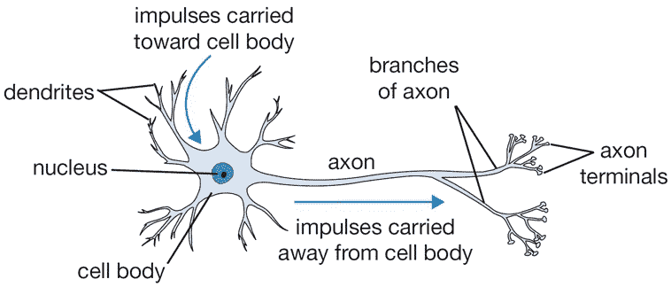
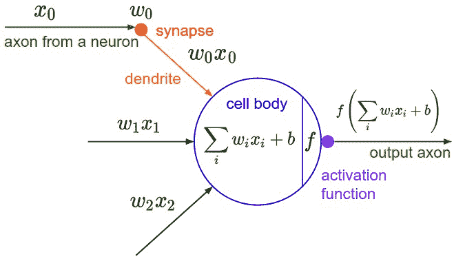
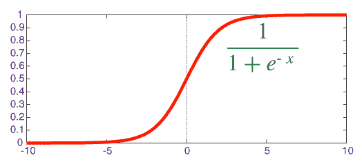
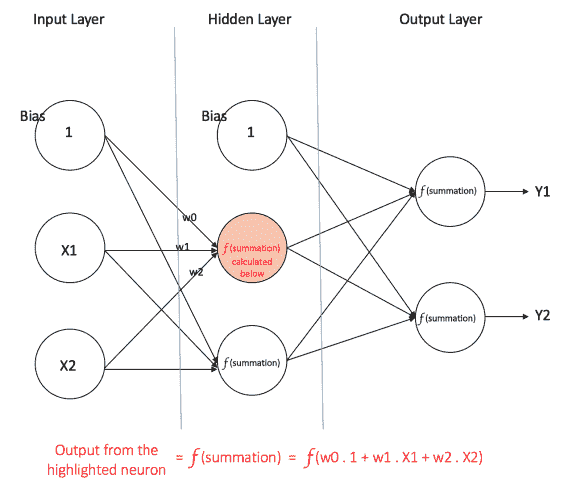
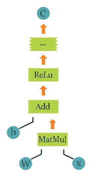
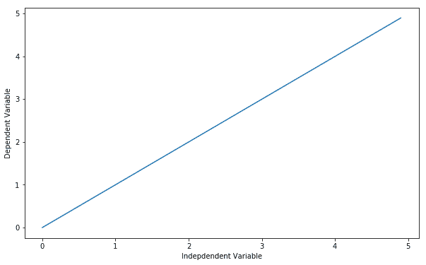
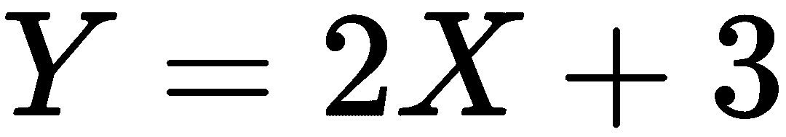
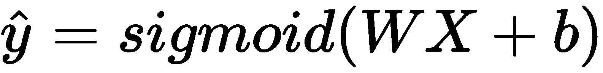

# 张量流的作用-一些基本的例子

在本章中，我们将解释 TensorFlow 背后的主要计算概念，即计算图模型，并演示如何通过实现线性回归和逻辑回归来让您步入正轨。

本章将涵盖以下主题:

*   单个神经元的容量和激活函数
*   激活功能
*   前馈神经网络
*   对多层网络的需求
*   张量流术语—概述
*   线性回归模型—建立和训练
*   逻辑回归模型——建立和训练

我们将从解释单个神经元实际上可以做什么/建模开始，基于此，对多层网络的需求将会出现。接下来，我们将详细阐述 TensorFlow 中使用/可用的主要概念和工具，以及如何使用这些工具构建简单的示例，如线性回归和逻辑回归。


# 单个神经元的容量

**神经网络**是一种计算模型，主要受人脑的生物神经网络处理输入信息的方式的启发。神经网络在机器学习研究(特别是深度学习)和工业应用方面取得了巨大突破，如在计算机视觉、语音识别和文本处理方面的突破性成果。在这一章中，我们将试图发展对一种叫做**多层感知器**的特殊类型的神经网络的理解。


# 生物动机和联系

我们大脑的基本计算单元被称为**神经元**，我们的神经系统中大约有 860 亿个神经元，它们通过大约到突触连接在一起。

*图 1* 显示了一个生物神经元。*图 2* 显示了相应的数学模型。在生物神经元的图中，每个神经元从其树突接收输入信号，然后沿着其轴突产生输出信号，轴突在轴突上分裂并通过突触连接到其他神经元。

在神经元的相应数学计算模型中，沿着轴突传播的信号基于突触处的突触强度与系统中另一个神经元的树突的乘法运算相互作用，由表示。这个想法是突触权重/强度被网络学习，它们是控制特定神经元对另一个神经元的影响的那些。

此外，在图 2 的*的基本计算模型中，树突将信号传送到主细胞体，并在那里将所有信号相加。如果最终结果高于某个阈值，神经元可以在计算模型中触发。*

此外，值得一提的是，我们需要控制沿着轴突的输出尖峰的频率，所以我们使用一种叫做**激活函数**的东西。实际上，激活函数的常见选择是 sigmoid 函数σ，因为它接受实值输入(求和后的信号强度),并将其压缩到 0 和 1 之间。我们将在下一节中详细介绍这些激活功能:



图 1:大脑的计算单位(http://cs231n.github.io/assets/nn1/neuron.png)

生物模型有相应的基本数学模型:



图 2:大脑计算单元的数学模型(http://cs231n.github.io/assets/nn1/neuron_model.jpeg)

神经网络中的基本计算单元是神经元，通常称为**节点**或**单元**。它从一些其他节点或外部源接收输入，并计算输出。每个输入都有一个相关的**权重** ( **w** )，根据其相对于其他输入的重要性来分配。该节点将函数 *f* (我们稍后定义)应用于其输入的加权和。

所以，神经网络的基本计算单元一般称为**神经元** / **节点** / **单元。**

这个神经元从先前的神经元甚至外部来源接收输入，然后对这个输入进行一些处理，产生所谓的激活。该神经元的每个输入都与其自身的权重相关联，该权重代表了这种连接的强度以及该输入的重要性。

因此，神经网络的这一基本构建模块的最终输出是通过重要性加权的输入的总和版本 *w* ，然后神经元通过激活函数传递总和输出。


图 3:单个神经元


# 激活功能

如图*图 3* 所示计算神经元的输出，并通过一个激活函数将非线性引入输出。这个 *f* 被称为**激活功能**。激活功能的主要目的是:

*   在神经元的输出中引入非线性。这很重要，因为大多数真实世界的数据是非线性的，我们希望神经元学习这些非线性表示。
*   将输出压缩到特定范围内。

每个激活函数(或非线性)都取一个数字，并对其执行某个固定的数学运算。在实践中，您可能会遇到几种激活功能。

因此，我们将简要介绍最常见的激活功能。


# 乙状结肠的

历史上，sigmoid 激活函数在研究人员中被广泛使用。该函数接受实值输入，并将其压缩到 0 到 1 之间的范围，如下图所示:

*σ(x) = 1 / (1 + exp(−x))*

图 4:乙状结肠激活功能


# 双曲正切

Tanh 是另一个允许一些负值的激活函数。Tanh 接受一个实值输入并将它们压缩到[-1，1]:

*tanh(x) = 2σ(2x) − 1*

图 5: Tanh 激活函数


# 热卢

**整流线性单元** ( **ReLU** )不容许负值，因为它接受实值输入并将其阈值设为零(用零代替负值):

*f(x) = max(0, x)*

图 6: Relu 激活功能

**偏置的重要性**:偏置的主要功能是为每个节点提供一个可训练的常数值(除了节点接收的正常输入)。请参见[https://stack overflow . com/questions/2480650/role-of-bias-in-neural-networks](https://stackoverflow.com/questions/2480650/role-of-bias-in-neural-networks)中的链接，以了解更多关于神经元中偏差的作用。


# 前馈神经网络

前馈神经网络是设计的第一种也是最简单的人工神经网络。它包含多个分层排列的神经元(节点)。相邻层的节点之间有连接或边。所有这些连接都有与之相关的权重。

图 7 显示了一个前馈神经网络的例子:


图 7:一个前馈神经网络的例子

在前馈网络中，信息仅在一个方向上移动，即从输入节点向前移动，通过隐藏节点(如果有)到达输出节点。网络中没有循环或回路(前馈网络的这一属性不同于递归神经网络，在递归神经网络中，节点之间的连接形成一个循环)。


# 对多层网络的需求

一个**多层感知器** ( **MLP** )包含一个或多个隐藏层(除了一个输入和一个输出层)。虽然单层感知器只能学习线性函数，但 MLP 也可以学习非线性函数。

*图 7* 显示了一个单一隐藏层的 MLP。注意，所有连接都有与之相关的权重，但是图中只显示了三个权重( *w0* 、 *w1* 和 *w2* )。

**输入层**:输入层有三个节点。偏置节点的值为 1。其他两个节点将 X1 和 X2 作为外部输入(它们是取决于输入数据集的数值)。如前所述，**输入层**不进行任何计算，因此**输入层**节点的输出分别为 **1** 、 **X1** 和 **X2** ，并送入**隐藏层**。

**隐层**:**隐层**也有三个节点，偏置节点输出为 1。**隐藏层**中其他两个节点的输出取决于**输入层** ( **1** 、 **X1** 和 **X2** )的输出以及与连接(边)相关的权重。记住 *f* 是指激活功能。这些输出然后被馈送到**输出层**中的节点。



图 8:具有一个隐藏层的多层感知器

**输出层:****输出层**有两个节点；它们从**隐藏层**获取输入，并对高亮显示的隐藏节点执行类似的计算。作为这些计算结果的计算值( **Y1** 和 **Y2** )充当多层感知器的输出。

给定一组特征 *X = (x1，x2，…)* 和一个目标 *y* ，多层感知器可以学习特征和目标之间的关系，用于分类或回归。

让我们举个例子来更好地理解多层感知器。假设我们有以下学生成绩数据集:

**表 1–样本学生成绩数据集**

| **学时学了** | **中期成绩** | **期末成绩** |
| 35 | 67 | 及格 |
| 12 | 75 | 失败 |
| 16 | 89 | 及格 |
| 45 | 56 | 及格 |
| 10 | 90 | 失败 |

两个输入栏显示学生学习的小时数和学生获得的期中成绩。**期末成绩**栏可以有两个值， **1** 或 **0** ，表示学生在期末是否通过。例如，我们可以看到，如果学生学习了 35 个小时，并在期中获得了 67 分，他/她最终通过了期末考试。

现在，假设我们想预测一个学了 25 个小时，期中得了 70 分的学生是否能通过期末考试:

**表 2–期末成绩未知的样本学生**

| **学习时间** | **中期标志** | **期末成绩** |
| 26 | 70 | ？ |

这是一个二元分类问题，其中 MLP 可以从给定的示例(训练数据)中学习，并在给定新数据点的情况下做出明智的预测。我们很快就会看到 MLP 是如何学习这种关系的。


# 训练我们的 MLP——反向传播算法

多层感知器学习的过程称为**反向传播**算法。我推荐读一下赫曼思·库马尔的这篇 Quora 回答，[https://www . Quora . com/How-do-you-explain-back-propagation-algorithm-to-a-beginner-in-neural-network/answer/赫曼思-库马尔-曼特里](https://www.quora.com/How-do-you-explain-back-propagation-algorithm-to-a-beginner-in-neural-network/answer/Hemanth-Kumar-Mantri)(后面引用)，里面对反向传播解释得很清楚。

**误差反向传播**，通常缩写为反向传播，是人工神经网络(ANN)训练的几种方式之一。这是一个有监督的训练方案，这意味着，它从标记的训练数据中学习(有一个监督器，来指导它的学习)。
简单来说，BackProp 就像“**从错误中学习”**。每当人工神经网络出错时，主管就进行纠正。一个人工神经网络由不同层的节点组成；输入层、中间隐藏层和输出层。相邻层的节点之间的连接具有与其相关联的“权重”。学习的目标是为这些边分配正确的权重。给定一个输入向量，这些权重决定了输出向量是什么。
在监督学习中，对训练集进行标注。这意味着，对于某些给定的输入，我们知道期望的/预期的输出(标签)。
反向投影算法:
最初所有的边缘权重都是随机分配的。对于训练数据集中的每个输入，激活人工神经网络并观察其输出。将该输出与我们已知的期望输出进行比较，误差被“传播”回前一层。此错误会被记录下来，并相应地“调整”权重。重复该过程，直到输出误差低于预定阈值。一旦上述算法终止，我们就有了一个“学习过的”ANN，我们认为它已经准备好处理“新的”输入。据说这个 ANN 已经从几个例子(标记的数据)和它的错误(错误传播)中学习了。”
——赫曼思·库马尔。

现在我们已经知道了反向传播是如何工作的，让我们回到我们的学生成绩数据集。

图 8 中*所示的 MLP 在输入层有两个节点，用于输入学习小时数和中期分数。它还有一个带有两个节点的隐藏层。输出层也有两个节点；上层节点输出*通过*的概率，而下层节点输出*失败*的概率。*

在分类应用中，我们广泛使用 softmax 函数([http://cs231n.github.io/linear-classify/#softmax](http://cs231n.github.io/linear-classify/#softmax))作为 MLP 输出层的激活函数，以确保输出是概率，并且它们加起来等于 1。softmax 函数获取一个任意实值分数的向量，并将其压缩为一个介于 0 和 1 之间的值的向量，这些值的总和为 1。所以，在这种情况下:


# 步骤 1-正向传播

网络中的所有权重都是随机初始化的。让我们考虑一个具体的隐藏层节点，称之为 *V* 。假设从输入到该节点的连接的权重是 **w1** 、 **w2** 和 **w3** (如图所示)。

然后，网络将第一个训练样本作为输入(我们知道，对于输入 35 和 67，通过的概率是 1):

*   网络的输入= [35，67]
*   网络的期望输出(目标)= [1，0]

然后，从所考虑的节点输出 *V* ，可以计算如下(f 是激活函数，例如 sigmoid):

*V = f (1*w1 + 35*w2 + 67*w3)*

类似地，也计算隐藏层中另一个节点的输出。隐藏层中两个节点的输出充当输出层中两个节点的输入。这使我们能够计算输出层中两个节点的输出概率。

假设输出层中两个节点的输出概率分别为 0.4 和 0.6(因为权重是随机分配的，所以输出也将是随机的)。我们可以看到，计算出的概率(0.4 和 0.6)与期望的概率(分别为 1 和 0)相差甚远；因此，网络被称为具有*不正确的输出*。


# 步骤 2–反向传播和权重更新

我们计算输出节点处的总误差，并使用反向传播通过网络传播这些误差，以计算梯度。然后，我们使用诸如梯度下降的优化方法来调整网络中的所有权重，目的是减少输出层的误差。

假设与考虑中的节点相关联的新权重是 *w4* 、 *w5* 和 *w6* (在反向传播和调整权重之后)。

如果我们现在将相同的样本作为输入馈送到网络，网络应该比初始运行表现得更好，因为权重现在已经被优化以最小化预测中的误差。与之前的[0.6，-0.4]相比，输出节点的误差现在减少到[0.2，-0.2]。这意味着我们的网络已经学会正确分类我们的第一个训练样本。

我们对数据集中的所有其他训练样本重复这个过程。然后，我们的网络据说学习了那些例子。

如果我们现在想预测一个学习了 25 个小时、期中成绩为 70 分的学生是否能通过期末考试，我们就要通过正向传播步骤，找到通过和失败的输出概率。

我在这里避免了数学方程和梯度下降等概念的解释，而是试图发展算法的直觉。关于反向传播算法的更多数学上的讨论，请参考这个链接:[http://home.agh.edu.pl/%7Evlsi/AI/backp_t_en/backprop.html](http://home.agh.edu.pl/%7Evlsi/AI/backp_t_en/backprop.html)。


# TensorFlow 术语——概述

在本节中，我们将概述 TensorFlow 库以及基本 TensorFlow 应用程序的结构。TensorFlow 是一个开源库，用于创建大规模的机器学习应用；它可以在各种硬件上模拟计算，从 android 设备到异构多 gpu 系统。

TensorFlow 使用一种特殊的结构，以便在不同的设备(如 CPU 和 GPU)上执行代码。计算被定义为一个图，每个图由操作组成，也称为 **ops** ，所以每当我们使用 TensorFlow 时，我们都在图中定义一系列操作。

要运行这些操作，我们需要将图形启动到一个会话中。会话翻译操作，并将它们传递给设备执行。

例如，下图显示了 TensorFlow 中的一个图表。 *W* 、 *x* 和 *b* 是该图边上的张量。 *MatMul* 是对张量 *W* 和 *x* 的运算；之后，调用 *Add* ，我们用 *b* 将前一个运算符的结果相加。每个操作的合成张量与下一个交叉，直到最后，在那里有可能得到想要的结果。



图 9:示例张量流计算图

为了使用 TensorFlow，我们需要导入库；我们将把它命名为`tf`，这样我们就可以通过写`tf`点然后写模块名来访问模块:

```
import tensorflow as tf
```

为了创建我们的第一个图，我们将从使用源操作开始，它不需要任何输入。这些源操作将把它们的信息传递给其他操作，这些操作将实际运行计算。

让我们创建两个将输出数字的源操作。我们将它们定义为`A`和`B`，您可以在下面的代码中看到:

```
A = tf.constant([2])
```

```
B = tf.constant([3])
```

之后，我们将定义一个简单的计算操作`tf.add()`，用于对两个元素求和。您也可以使用`C = A + B`，如下代码所示:

```
C = tf.add(A,B)
```

```
#C = A + B is also a way to define the sum of the terms
```

因为图形需要在会话的上下文中执行，所以我们需要创建一个会话对象:

```
session = tf.Session()
```

为了观察图表，让我们运行会话，从先前定义的`C`操作中获得结果:

```
result = session.run(C)
print(result)
```

```
Output:
[5]
```

你可能会想，仅仅把两个数字相加就要做很多工作，但是理解张量流的基本结构是非常重要的。一旦你这样做了，你可以定义任何你想要的计算；同样，TensorFlow 的结构允许它在不同的设备(CPU 或 GPU)上处理计算，甚至在集群中处理。如果你想了解更多，你可以运行方法`tf.device()`。

也可以随意试验 TensorFlow 的结构，以便更好地了解它的工作原理。如果您想要 TensorFlow 支持的所有数学运算的列表，可以查看文档。

现在，您应该了解 TensorFlow 的结构以及如何创建基本的应用程序。


# 使用张量流定义多维数组

现在我们将尝试使用 TensorFlow 来定义这样的数组:

```
salar_var = tf.constant([4])
vector_var = tf.constant([5,4,2])
matrix_var = tf.constant([[1,2,3],[2,2,4],[3,5,5]])
tensor = tf.constant( [ [[1,2,3],[2,3,4],[3,4,5]] , [[4,5,6],[5,6,7],[6,7,8]] , [[7,8,9],[8,9,10],[9,10,11]] ] )
with tf.Session() as session:
    result = session.run(salar_var)
    print "Scalar (1 entry):\n %s \n" % result
    result = session.run(vector_var)
    print "Vector (3 entries) :\n %s \n" % result
    result = session.run(matrix_var)
    print "Matrix (3x3 entries):\n %s \n" % result
    result = session.run(tensor)
    print "Tensor (3x3x3 entries) :\n %s \n" % result
```

```
Output:
Scalar (1 entry):
 [2] 

Vector (3 entries) :
 [5 6 2] 

Matrix (3x3 entries):
 [[1 2 3]
 [2 3 4]
 [3 4 5]] 

Tensor (3x3x3 entries) :
 [[[ 1  2  3]
  [ 2  3  4]
  [ 3  4  5]]

 [[ 4  5  6]
  [ 5  6  7]
  [ 6  7  8]]

 [[ 7  8  9]
  [ 8  9 10]
  [ 9 10 11]]]
```

现在，您已经理解了这些数据结构，我鼓励您使用前面的一些函数来试验它们，看看它们将如何根据它们的结构类型进行操作:

```
Matrix_one = tf.constant([[1,2,3],[2,3,4],[3,4,5]])
Matrix_two = tf.constant([[2,2,2],[2,2,2],[2,2,2]])
first_operation = tf.add(Matrix_one, Matrix_two)
second_operation = Matrix_one + Matrix_two
with tf.Session() as session:
    result = session.run(first_operation)
    print "Defined using tensorflow function :"
    print(result)
    result = session.run(second_operation)
    print "Defined using normal expressions :"
    print(result)
```

```
Output:
Defined using tensorflow function :
[[3 4 5]
 [4 5 6]
 [5 6 7]]
Defined using normal expressions :
[[3 4 5]
 [4 5 6]
 [5 6 7]]
```

使用常规符号定义和`tensorflow`函数，我们能够得到一个元素级乘法，也称为**哈达玛乘积**。但是如果我们想要正规的矩阵乘积呢？我们需要使用另一个名为`tf.matmul()`的张量流函数:

```
Matrix_one = tf.constant([[2,3],[3,4]])
Matrix_two = tf.constant([[2,3],[3,4]])
first_operation = tf.matmul(Matrix_one, Matrix_two)
with tf.Session() as session:
    result = session.run(first_operation)
    print "Defined using tensorflow function :"
    print(result)
```

```
Output:
Defined using tensorflow function :
[[13 18]
 [18 25]]
```

我们也可以自己定义这个乘法，但是已经有一个函数可以做到这一点，所以没有必要重新发明轮子！


# 为什么是张量？

张量结构通过给我们以我们想要的方式塑造数据集的自由来帮助我们。

由于图像中的信息是如何编码的，这在处理图像时特别有用。

想想图像，很容易理解它有高度和宽度，因此用二维结构(矩阵)表示其中包含的信息是有意义的...直到你记得图像是有颜色的。为了增加关于颜色的信息，我们需要另一个维度，这时张量变得特别有用。

图像被编码到颜色通道中；图像数据在给定点以颜色通道中每种颜色的强度表示，最常见的是 RGB(即红色、蓝色和绿色)。图像中包含的信息是图像的宽度和高度中每个通道颜色的强度，就像这样:


图 10:特定图像的不同颜色通道

所以，红色通道在每个点的强度与宽度和高度可以用一个矩阵来表示；蓝色和绿色通道也是如此。所以，我们最终有三个矩阵，当它们结合在一起，就形成了一个张量。


# 变量

现在我们更熟悉数据的结构，我们将看看 TensorFlow 如何处理变量。

为了定义变量，我们使用命令`tf.variable()`。为了能够在计算图形中使用变量，有必要在会话中运行图形之前初始化它们。这是通过运行`tf.global_variables_initializer()`来完成的。

要更新变量的值，我们只需运行一个赋值操作，为变量赋值:

```
state = tf.Variable(0)
```

让我们首先创建一个简单的计数器，一个每次增加一个单位的变量:

```
one = tf.constant(1)
new_value = tf.add(state, one)
update = tf.assign(state, new_value)
```

启动图形后，必须通过运行初始化操作来初始化变量。我们首先必须将初始化操作添加到图形中:

```
init_op = tf.global_variables_initializer()
```

然后，我们启动一个会话来运行图表。

我们首先初始化变量，然后打印状态变量的初始值，最后运行更新状态变量的操作，并在每次更新后打印结果:

```
with tf.Session() as session:
 session.run(init_op)
 print(session.run(state))
 for _ in range(3):
    session.run(update)
    print(session.run(state))
```

```
Output:
0
1
2
3
```


# 占位符

现在，我们知道了如何在 TensorFlow 内部操纵变量，但是如何在 TensorFlow 模型之外提供数据呢？

如果要从模型外部向 TensorFlow 模型提供数据，需要使用占位符。

那么，这些占位符是什么，它们有什么作用？占位符可以被看作是模型中的*孔*，数据将被传递到的*孔*。您可以使用`tf.placeholder(datatype)`来创建它们，其中`datatype`指定数据的类型(整数、浮点、字符串和布尔值)及其精度(8、16、32 和 64)位。

具有各自 Python 语法的每种数据类型的定义如下:

**表 3–不同张量流数据类型的定义**

| **数据类型** | **Python 类型** | **描述** |
| `DT_FLOAT` | `tf.float32` | 32 位浮点。 |
| `DT_DOUBLE` | `tf.float64` | 64 位浮点 |
| `DT_INT8` | `tf.int8` | 8 位有符号整数。 |
| `DT_INT16` | `tf.int16` | 16 位有符号整数。 |
| `DT_INT32` | `tf.int32` | 32 位有符号整数。 |
| `DT_INT64` | `tf.int64` | 64 位有符号整数。 |
| `DT_UINT8` | `tf.uint8` | 8 位无符号整数。 |
| `DT_STRING` | `tf.string` | 可变长度字节数组。张量的每个元素都是一个字节数组。 |
| `DT_BOOL` | `tf.bool` | 布尔型。 |
| `DT_COMPLEX64` | `tf.complex64` | 由两个 32 位浮点组成的复数:实部和虚部。 |
| `DT_COMPLEX128` | `tf.complex128` | 由两个 64 位浮点组成的复数:实部和虚部。 |
| `DT_QINT8` | `tf.qint8` | 量化运算中使用的 8 位有符号整数。 |
| `DT_QINT32` | `tf.qint32` | 量化运算中使用的 32 位有符号整数。 |
| `DT_QUINT8` | `tf.quint8` | 量化运算中使用的 8 位无符号整数。 |

让我们创建一个占位符:

```
a=tf.placeholder(tf.float32)
```

并定义一个简单乘法运算:

```
b=a*2
```

现在，我们需要定义并运行会话，但是因为我们在模型中创建了一个*孔*来传递数据，所以当我们初始化会话时。我们不得不用数据来传递一个论点；否则我们会得到一个错误。

为了将数据传递给模型，我们使用一个额外的参数`feed_dict`调用会话，其中我们应该传递一个字典，每个占位符名称后面跟有其各自的数据，就像这样:

```
with tf.Session() as sess:
    result = sess.run(b,feed_dict={a:3.5})
    print result
```

```
Output:
7.0
```

由于 TensorFlow 中的数据是以多维数组的形式传递的，因此我们可以通过占位符传递任何类型的张量，以获得简单乘法运算的答案:

```
dictionary={a: [ [ [1,2,3],[4,5,6],[7,8,9],[10,11,12] ] , [ [13,14,15],[16,17,18],[19,20,21],[22,23,24] ] ] }
with tf.Session() as sess:
    result = sess.run(b,feed_dict=dictionary)
    print result
```

```
Output:
[[[  2\.   4\.   6.]
  [  8\.  10\.  12.]
  [ 14\.  16\.  18.]
  [ 20\.  22\.  24.]]

 [[ 26\.  28\.  30.]
  [ 32\.  34\.  36.]
  [ 38\.  40\.  42.]
  [ 44\.  46\.  48.]]]
```


# 操作

运算是表示图上张量的数学运算的节点。这些操作可以是任何类型的函数，比如增加和减少张量，或者可能是激活函数。

`tf.matmul`、`tf.add`、`tf.nn.sigmoid`是 TensorFlow 中的一些操作。这些类似于 Python 中的函数，但是直接在张量上操作，每个函数做一件特定的事情。

其他操作可在[https://www.tensorflow.org/api_guides/python/math_ops](https://www.tensorflow.org/api_guides/python/math_ops)轻松找到。

让我们尝试一下这些操作:

```
a = tf.constant([5])
b = tf.constant([2])
c = tf.add(a,b)
d = tf.subtract(a,b)
with tf.Session() as session:
    result = session.run(c)
    print 'c =: %s' % result
    result = session.run(d)
    print 'd =: %s' % result
```

```
Output:
c =: [7]
d =: [3]
```

`tf.nn.sigmoid`是一个激活函数:稍微复杂一点，但是这个函数帮助学习模型评估什么样的信息是好的还是不好的。


# 线性回归模型–构建和培训

根据我们在[第 2 章](6e292a27-8ff3-4d9c-9186-433455cb380c.xhtml)、*数据建模中对线性回归的解释——泰坦尼克号的例子*我们将依靠这个定义建立一个简单的线性回归模型。

让我们从导入实现所需的包开始:

```
import numpy as np
import tensorflow as tf
import matplotlib.patches as mpatches
import matplotlib.pyplot as plt
plt.rcParams['figure.figsize'] = (10, 6)
```

让我们定义一个独立变量:

```
input_values = np.arange(0.0, 5.0, 0.1)
input_values
```

```
Output:
array([ 0\. ,  0.1,  0.2,  0.3,  0.4,  0.5,  0.6,  0.7,  0.8,  0.9,  1\. ,
        1.1,  1.2,  1.3,  1.4,  1.5,  1.6,  1.7,  1.8,  1.9,  2\. ,  2.1,
        2.2,  2.3,  2.4,  2.5,  2.6,  2.7,  2.8,  2.9,  3\. ,  3.1,  3.2,
        3.3,  3.4,  3.5,  3.6,  3.7,  3.8,  3.9,  4\. ,  4.1,  4.2,  4.3,
        4.4,  4.5,  4.6,  4.7,  4.8,  4.9])
```

```
##You can adjust the slope and intercept to verify the changes in the graph
weight=1
bias=0
output = weight*input_values + bias
plt.plot(input_values,output)
plt.ylabel('Dependent Variable')
plt.xlabel('Indepdendent Variable')
plt.show()
Output:
```



图 11:因变量和自变量的可视化

现在，让我们看看这是如何被解释成张量流代码的。


# 张量流线性回归

对于第一部分，我们将生成随机数据点，并定义一个线性关系；我们将使用 TensorFlow 来调整并获得正确的参数:

```
input_values = np.random.rand(100).astype(np.float32)
```

本例中使用的模型方程为:



这个等式没有什么特别的，它只是一个我们用来生成数据点的模型。事实上，您可以将参数更改为您想要的任何值，稍后您将会这样做。我们在这些点上添加了一些高斯噪声，让它变得更有趣一些:

```
output_values = input_values * 2 + 3
output_values = np.vectorize(lambda y: y + np.random.normal(loc=0.0, scale=0.1))(output_values)
```

下面是一个数据示例:

```
list(zip(input_values,output_values))[5:10]
```

```
Output:
[(0.25240293, 3.474361759429548), 
(0.946697, 4.980617375175061), 
(0.37582186, 3.650345806087635), 
(0.64025956, 4.271037640404975), 
(0.62555283, 4.37001850440196)]
```

首先，我们用任何随机猜测初始化变量和，然后我们定义线性函数:

```
weight = tf.Variable(1.0)
bias = tf.Variable(0.2)
predicted_vals = weight * input_values + bias
```

在典型的线性回归模型中，我们最小化要调整的方程的平方误差减去目标值(我们拥有的数据)，因此我们将要最小化的方程定义为损失。

为了找到损失的价值，我们使用`tf.reduce_mean()`。该函数求多维张量的平均值，结果可以有不同的维数:

```
model_loss = tf.reduce_mean(tf.square(predicted_vals - output_values))
```

然后，我们定义优化器方法。这里，我们将使用一个简单的梯度下降，学习率为 0.5。

现在，我们将定义我们的图的训练方法，但是我们将使用什么方法来最小化损失？是`tf.train.GradientDescentOptimizer`。

`.minimize()`函数将最小化我们的优化器的误差函数，从而产生一个更好的模型:

```
model_optimizer = tf.train.GradientDescentOptimizer(0.5)
train = model_optimizer.minimize(model_loss)
```

在执行图形之前，不要忘记初始化变量:

```
init = tf.global_variables_initializer()
sess = tf.Session()
sess.run(init)
```

现在，我们准备开始优化并运行图表:

```
train_data = []
for step in range(100):
    evals = sess.run([train,weight,bias])[1:]
    if step % 5 == 0:
       print(step, evals)
       train_data.append(evals)
```

```
Output:
(0, [2.5176678, 2.9857566])
(5, [2.4192538, 2.3015416])
(10, [2.5731843, 2.221911])
(15, [2.6890132, 2.1613526])
(20, [2.7763696, 2.1156814])
(25, [2.8422525, 2.0812368])
(30, [2.8919399, 2.0552595])
(35, [2.9294133, 2.0356679])
(40, [2.957675, 2.0208921])
(45, [2.9789894, 2.0097487])
(50, [2.9950645, 2.0013444])
(55, [3.0071881, 1.995006])
(60, [3.0163314, 1.9902257])
(65, [3.0232272, 1.9866205])
(70, [3.0284278, 1.9839015])
(75, [3.0323503, 1.9818509])
(80, [3.0353084, 1.9803041])
(85, [3.0375392, 1.9791379])
(90, [3.039222, 1.9782581])
(95, [3.0404909, 1.9775947])
```

让我们将训练过程形象化，以符合数据点:

```
print('Plotting the data points with their corresponding fitted line...')
converter = plt.colors
cr, cg, cb = (1.0, 1.0, 0.0)

for f in train_data:

    cb += 1.0 / len(train_data)
    cg -= 1.0 / len(train_data)

    if cb > 1.0: cb = 1.0

    if cg < 0.0: cg = 0.0

    [a, b] = f
    f_y = np.vectorize(lambda x: a*x + b)(input_values)
    line = plt.plot(input_values, f_y)
    plt.setp(line, color=(cr,cg,cb))

plt.plot(input_values, output_values, 'ro')
green_line = mpatches.Patch(color='red', label='Data Points')
plt.legend(handles=[green_line])
plt.show()
```

```
Output:
```


图 12:由回归线拟合的数据点的可视化


# 逻辑回归模型——构建和培训

同样基于我们在[第 2 章](6e292a27-8ff3-4d9c-9186-433455cb380c.xhtml)、*数据建模在行动-泰坦尼克号示例*中对逻辑回归的解释，我们将在 TensorFlow 中实现逻辑回归算法。简而言之，逻辑回归通过逻辑/sigmoid 传递输入，然后将结果视为概率:


图 13:区分两个线性可分的类，0 和 1


# 在 TensorFlow 中使用逻辑回归

为了在 TensorFlow 中使用逻辑回归，我们首先需要导入将要使用的库。为此，您可以运行以下代码单元格:

```
import tensorflow as tf

import pandas as pd

import numpy as np
import time
from sklearn.datasets import load_iris
from sklearn.cross_validation import train_test_split
import matplotlib.pyplot as plt
```

接下来，我们将加载我们将要使用的数据集。在这种情况下，我们使用的是内置的虹膜数据集。因此，没有必要做任何预处理，我们可以直接操作它。我们将数据集分成 *x* 和 *y* ，然后随机地(伪)训练 *x* 和 *y* 并测试 *x* 和 *y* :

```
iris_dataset = load_iris()
iris_input_values, iris_output_values = iris_dataset.data[:-1,:], iris_dataset.target[:-1]
iris_output_values= pd.get_dummies(iris_output_values).values
train_input_values, test_input_values, train_target_values, test_target_values = train_test_split(iris_input_values, iris_output_values, test_size=0.33, random_state=42)
```

现在，我们定义 *x* 和 *y* 。这些占位符将保存我们的虹膜数据(包括特征和标签矩阵)，并帮助将它们传递给算法的不同部分。您可以将占位符视为我们用来插入数据的空壳。我们还需要赋予它们与数据形状相对应的形状。稍后，我们将通过一个`feed_dict`(输入字典)向占位符输入数据，从而将数据插入到这些占位符中:


# 为什么要使用占位符？

TensorFlow 的这个功能允许我们创建一个算法，它接受数据，并在不知道数据量的情况下了解数据的形状。当我们在训练中插入*批*数据时，我们可以在不改变整个算法的情况下，轻松调整单步训练的样本数量:

```
# numFeatures is the number of features in our input data.
# In the iris dataset, this number is '4'.
num_explanatory_features = train_input_values.shape[1]

# numLabels is the number of classes our data points can be in.
# In the iris dataset, this number is '3'.
num_target_values = train_target_values.shape[1]

# Placeholders
# 'None' means TensorFlow shouldn't expect a fixed number in that dimension
input_values = tf.placeholder(tf.float32, [None, num_explanatory_features]) # Iris has 4 features, so X is a tensor to hold our data.
output_values = tf.placeholder(tf.float32, [None, num_target_values]) # This will be our correct answers matrix for 3 classes.

```


# 设置模型权重和偏差

与线性回归非常相似，我们需要一个共享的可变权重矩阵用于逻辑回归。我们将 *W* 和 *b* 都初始化为充满零的张量。既然要学习 *W* 和 *b* ，那么它们的初始值就没有太大关系了。这些变量是定义我们的回归模型结构的对象，我们可以在它们被训练后保存它们，以便我们以后可以重用它们。

我们定义两个张量流变量作为我们的参数。这些变量将包含我们的逻辑回归的权重和偏差，它们将在训练期间不断更新。

请注意， *W* 的形状为[4，3],因为我们希望将 4 维输入向量乘以它，以生成差异类的 3 维证据向量。 *b* 有一个【3】的形状，我们可以把它加到输出上。此外，与我们的占位符(本质上是等待输入数据的空壳)不同，TensorFlow 变量需要用值初始化，比如用零初始化:

```
#Randomly sample from a normal distribution with standard deviation .01

weights = tf.Variable(tf.random_normal([num_explanatory_features,num_target_values],
                                      mean=0,
                                      stddev=0.01,
                                      name="weights"))

biases = tf.Variable(tf.random_normal([1,num_target_values],
                                   mean=0,
                                   stddev=0.01,
                                   name="biases"))
```


# 逻辑回归模型

我们现在定义我们的操作，以便正确地运行逻辑回归。逻辑回归通常被认为是一个单一的方程:



然而，为了清楚起见，我们可以将其分为三个主要部分:

*   一种加权乘特征矩阵乘法运算
*   加权特征和偏差项的总和
*   最后，应用一个 sigmoid 函数

因此，您会发现这些组件被定义为三个独立的操作:

```
# Three-component breakdown of the Logistic Regression equation.
# Note that these feed into each other.
apply_weights = tf.matmul(input_values, weights, name="apply_weights")
add_bias = tf.add(apply_weights, biases, name="add_bias")
activation_output = tf.nn.sigmoid(add_bias, name="activation")
```

正如我们之前看到的，我们要使用的函数是逻辑函数，它在应用权重和偏差后被输入数据。在 TensorFlow 中，这个函数被实现为`nn.sigmoid`函数。实际上，它将有偏差的加权输入拟合成 0-100%的曲线，这就是我们想要的概率函数。


# 培养

学习算法就是我们如何搜索最佳权重向量( *w* )。这种搜索是寻找优化误差/成本测量的假设的优化问题。

所以，模型的成本或损失函数会告诉我们，我们的模型不好，我们需要最小化这个函数。您可以遵循不同的损失或成本标准。在这个实现中，我们将使用**均值** **平方误差** ( **MSE** )作为损失函数。

为了完成最小化损失函数的任务，我们将使用梯度下降算法。


# 价值函数

在定义我们的成本函数之前，我们需要定义我们要训练多长时间，以及我们应该如何定义学习率:

```
#Number of training epochs
num_epochs = 700
# Defining our learning rate iterations (decay)
learning_rate = tf.train.exponential_decay(learning_rate=0.0008,
                                          global_step=1,
                                          decay_steps=train_input_values.shape[0],
                                          decay_rate=0.95,
                                          staircase=True)

# Defining our cost function - Squared Mean Error
model_cost = tf.nn.l2_loss(activation_output - output_values, name="squared_error_cost")
# Defining our Gradient Descent
model_train = tf.train.GradientDescentOptimizer(learning_rate).minimize(model_cost)
```

现在，是时候通过会话变量来执行我们的计算图了。

首先，我们需要使用`tf.initialize_all_variables()`用零或随机值初始化我们的权重和偏差。这个初始化步骤将成为我们计算图形中的一个节点，当我们将图形放入会话时，操作将运行并创建变量:

```
# tensorflow session
sess = tf.Session()

# Initialize our variables.
init = tf.global_variables_initializer()
sess.run(init)

#We also want some additional operations to keep track of our model's efficiency over time. We can do this like so:
# argmax(activation_output, 1) returns the label with the most probability
# argmax(output_values, 1) is the correct label
correct_predictions = tf.equal(tf.argmax(activation_output,1),tf.argmax(output_values,1))

# If every false prediction is 0 and every true prediction is 1, the average returns us the accuracy
model_accuracy = tf.reduce_mean(tf.cast(correct_predictions, "float"))

# Summary op for regression output
activation_summary = tf.summary.histogram("output", activation_output)

# Summary op for accuracy
accuracy_summary = tf.summary.scalar("accuracy", model_accuracy)

# Summary op for cost
cost_summary = tf.summary.scalar("cost", model_cost)

# Summary ops to check how variables weights and biases are updating after each iteration to be visualized in TensorBoard
weight_summary = tf.summary.histogram("weights", weights.eval(session=sess))
bias_summary = tf.summary.histogram("biases", biases.eval(session=sess))

merged = tf.summary.merge([activation_summary, accuracy_summary, cost_summary, weight_summary, bias_summary])
writer = tf.summary.FileWriter("summary_logs", sess.graph)

#Now we can define and run the actual training loop, like this:
# Initialize reporting variables

inital_cost = 0
diff = 1
epoch_vals = []
accuracy_vals = []
costs = []

# Training epochs
for i in range(num_epochs):
    if i > 1 and diff < .0001:
       print("change in cost %g; convergence."%diff)
       break

    else:
       # Run training step
       step = sess.run(model_train, feed_dict={input_values: train_input_values, output_values: train_target_values})

       # Report some stats evert 10 epochs
       if i % 10 == 0:
           # Add epoch to epoch_values
           epoch_vals.append(i)

           # Generate the accuracy stats of the model
           train_accuracy, new_cost = sess.run([model_accuracy, model_cost], feed_dict={input_values: train_input_values, output_values: train_target_values})

           # Add accuracy to live graphing variable
           accuracy_vals.append(train_accuracy)

           # Add cost to live graphing variable
           costs.append(new_cost)
>
           # Re-assign values for variables
           diff = abs(new_cost - inital_cost)
           cost = new_cost

           print("Training step %d, accuracy %g, cost %g, cost change %g"%(i, train_accuracy, new_cost, diff))
```

```
Output:
Training step 0, accuracy 0.343434, cost 34.6022, cost change 34.6022
Training step 10, accuracy 0.434343, cost 30.3272, cost change 30.3272
Training step 20, accuracy 0.646465, cost 28.3478, cost change 28.3478
Training step 30, accuracy 0.646465, cost 26.6752, cost change 26.6752
Training step 40, accuracy 0.646465, cost 25.2844, cost change 25.2844
Training step 50, accuracy 0.646465, cost 24.1349, cost change 24.1349
Training step 60, accuracy 0.646465, cost 23.1835, cost change 23.1835
Training step 70, accuracy 0.646465, cost 22.3911, cost change 22.3911
Training step 80, accuracy 0.646465, cost 21.7254, cost change 21.7254
Training step 90, accuracy 0.646465, cost 21.1607, cost change 21.1607
Training step 100, accuracy 0.666667, cost 20.677, cost change 20.677
Training step 110, accuracy 0.666667, cost 20.2583, cost change 20.2583
Training step 120, accuracy 0.666667, cost 19.8927, cost change 19.8927
Training step 130, accuracy 0.666667, cost 19.5705, cost change 19.5705
Training step 140, accuracy 0.666667, cost 19.2842, cost change 19.2842
Training step 150, accuracy 0.666667, cost 19.0278, cost change 19.0278
Training step 160, accuracy 0.676768, cost 18.7966, cost change 18.7966
Training step 170, accuracy 0.69697, cost 18.5867, cost change 18.5867
Training step 180, accuracy 0.69697, cost 18.3951, cost change 18.3951
Training step 190, accuracy 0.717172, cost 18.2191, cost change 18.2191
Training step 200, accuracy 0.717172, cost 18.0567, cost change 18.0567
Training step 210, accuracy 0.737374, cost 17.906, cost change 17.906
Training step 220, accuracy 0.747475, cost 17.7657, cost change 17.7657
Training step 230, accuracy 0.747475, cost 17.6345, cost change 17.6345
Training step 240, accuracy 0.757576, cost 17.5113, cost change 17.5113
Training step 250, accuracy 0.787879, cost 17.3954, cost change 17.3954
Training step 260, accuracy 0.787879, cost 17.2858, cost change 17.2858
Training step 270, accuracy 0.787879, cost 17.182, cost change 17.182
Training step 280, accuracy 0.787879, cost 17.0834, cost change 17.0834
Training step 290, accuracy 0.787879, cost 16.9895, cost change 16.9895
Training step 300, accuracy 0.79798, cost 16.8999, cost change 16.8999
Training step 310, accuracy 0.79798, cost 16.8141, cost change 16.8141
Training step 320, accuracy 0.79798, cost 16.732, cost change 16.732
Training step 330, accuracy 0.79798, cost 16.6531, cost change 16.6531
Training step 340, accuracy 0.808081, cost 16.5772, cost change 16.5772
Training step 350, accuracy 0.818182, cost 16.5041, cost change 16.5041
Training step 360, accuracy 0.838384, cost 16.4336, cost change 16.4336
Training step 370, accuracy 0.838384, cost 16.3655, cost change 16.3655
Training step 380, accuracy 0.838384, cost 16.2997, cost change 16.2997
Training step 390, accuracy 0.838384, cost 16.2359, cost change 16.2359
Training step 400, accuracy 0.848485, cost 16.1741, cost change 16.1741
Training step 410, accuracy 0.848485, cost 16.1141, cost change 16.1141
Training step 420, accuracy 0.848485, cost 16.0558, cost change 16.0558
Training step 430, accuracy 0.858586, cost 15.9991, cost change 15.9991
Training step 440, accuracy 0.858586, cost 15.944, cost change 15.944
Training step 450, accuracy 0.858586, cost 15.8903, cost change 15.8903
Training step 460, accuracy 0.868687, cost 15.8379, cost change 15.8379
Training step 470, accuracy 0.878788, cost 15.7869, cost change 15.7869
Training step 480, accuracy 0.878788, cost 15.7371, cost change 15.7371
Training step 490, accuracy 0.878788, cost 15.6884, cost change 15.6884
Training step 500, accuracy 0.878788, cost 15.6409, cost change 15.6409
Training step 510, accuracy 0.878788, cost 15.5944, cost change 15.5944
Training step 520, accuracy 0.878788, cost 15.549, cost change 15.549
Training step 530, accuracy 0.888889, cost 15.5045, cost change 15.5045
Training step 540, accuracy 0.888889, cost 15.4609, cost change 15.4609
Training step 550, accuracy 0.89899, cost 15.4182, cost change 15.4182
Training step 560, accuracy 0.89899, cost 15.3764, cost change 15.3764
Training step 570, accuracy 0.89899, cost 15.3354, cost change 15.3354
Training step 580, accuracy 0.89899, cost 15.2952, cost change 15.2952
Training step 590, accuracy 0.909091, cost 15.2558, cost change 15.2558
Training step 600, accuracy 0.909091, cost 15.217, cost change 15.217
Training step 610, accuracy 0.909091, cost 15.179, cost change 15.179
Training step 620, accuracy 0.909091, cost 15.1417, cost change 15.1417
Training step 630, accuracy 0.909091, cost 15.105, cost change 15.105
Training step 640, accuracy 0.909091, cost 15.0689, cost change 15.0689
Training step 650, accuracy 0.909091, cost 15.0335, cost change 15.0335
Training step 660, accuracy 0.909091, cost 14.9987, cost change 14.9987
Training step 670, accuracy 0.909091, cost 14.9644, cost change 14.9644
Training step 680, accuracy 0.909091, cost 14.9307, cost change 14.9307
Training step 690, accuracy 0.909091, cost 14.8975, cost change 14.8975

```

现在，是时候看看我们的训练模型在`iris`数据集上的表现了，所以让我们针对测试集测试我们的训练模型:

```
# test the model against the test set
print("final accuracy on test set: %s" %str(sess.run(model_accuracy,
                                                    feed_dict={input_values: test_input_values,
                                                               output_values: test_target_values}))
```

```
Output:
final accuracy on test set: 0.9
```

在测试集上获得 0.9 的准确度真的很好，你可以通过改变历元的数量来尝试获得更好的结果。


# 摘要

在本章中，我们对神经网络和多层神经网络的必要性进行了基本解释。我们还用一些基本的例子介绍了 TensorFlow 计算图模型，比如线性回归和逻辑回归。

接下来，我们将通过更高级的示例，演示如何使用 TensorFlow 来构建类似手写字符识别的东西。我们还将处理架构工程的核心思想，它已经取代了传统机器学习中的特征工程。