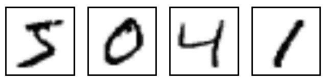
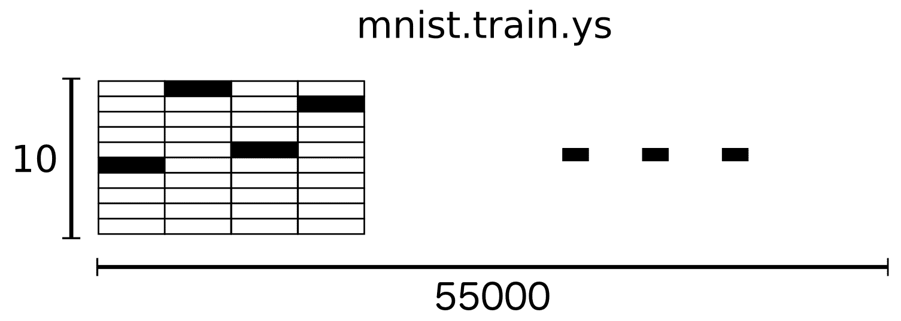
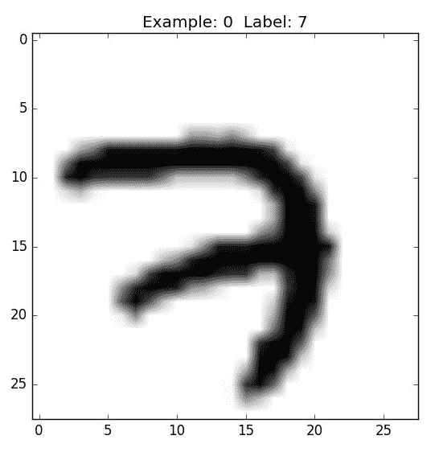
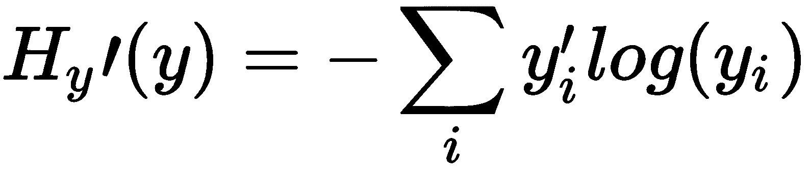

# 深度前馈神经网络——实现数字分类

**前馈神经网络** ( **FNN** )是一种特殊类型的神经网络，其中神经元之间的链接/连接不形成循环。因此，它不同于我们将在本书后面研究的神经网络的其他结构(递归型神经网络)。FNN 是一种广泛使用的体系结构，它是第一种也是最简单的神经网络。

在本章中，我们将浏览一个典型的架构；FNN，我们将使用张量流库。在介绍完这些概念后，我们将给出一个数字分类的实际例子。这个例子的问题是，*给定一组包含手写数字的图像，你如何将这些图像分成 10 个不同的类别(0-9)* ？

本章将涵盖以下主题:

*   隐藏单元与建筑设计
*   MNIST 数据集分析
*   数字分类-模型建立和训练


# 隐藏单元与建筑设计

在下一节中，我们将回顾人工神经网络；他们可以很好地完成分类任务，例如对手写数字进行分类。

假设我们有图 1 所示的网络:


图 1:带有一个隐藏层的简单 FNN

如前所述，这个网络中最左边的一层称为**输入层**，层内的神经元称为**输入神经元**。最右边的层或输出层包含输出神经元，或者如本例所示，包含单个输出神经元。中间层被称为**隐藏层**，因为这一层中的神经元既不是输入也不是输出。“隐藏”这个词听起来可能有点神秘——我第一次听到这个词时，我认为它一定有某种深刻的哲学或数学意义——但它真正的意思是*不是输入，也不是输出*。没别的意思。前面的网络只有一个隐藏层，但有些网络有多个隐藏层。例如，以下四层网络有两个隐藏层:


图 2:具有更多隐藏层的人工神经网络

输入层、隐藏层和输出层的组织结构非常简单。例如，让我们通过一个实际的例子来看看一个特定的手写图像中是否有数字 9。

所以首先，我们将输入图像的像素馈入输入层；例如，在 MNIST 数据集中，我们有单色图像。它们每一个都是 28 乘 28，所以我们需要在输入层有 28 × 28 = 784 个神经元来接收这个输入图像。

在输出层，我们将只需要 1 个神经元，它产生该图像中是否有数字 9 的概率(或分数)。例如，大于 0.5 的输出值意味着该图像有数字 9，如果小于 0.5，则意味着输入图像中没有数字 9。

因此，这类网络被称为模糊神经网络，其中一层的输出作为下一层的输入。层中的这种顺序性意味着层中没有循环。


# MNIST 数据集分析

在这一节中，我们将通过实现一个手写图像分类器来尝试一下。这种实现可以被认为是 *Hello world！*神经网络。

MNIST 是一个广泛用于机器学习技术基准测试的数据集。数据集包含一组手写数字，如下所示:



图 3:来自 MNIST 数据集的样本数字

因此，数据集包括手写图像及其相应的标签。

在这一节中，我们将在这些图像上训练一个基本模型，目标是辨别输入图像中的哪个数字是手写的。

此外，您会发现我们将能够使用很少的代码行来完成这一分类任务，但这一实现背后的想法是理解构建神经网络解决方案的基本点点滴滴。此外，我们将在这个实现中涵盖神经网络的主要概念。


# MNIST 的数据

Yann LeCun 的网站上有 MNIST 的数据([http://yann.lecun.com/exdb/mnist/](http://yann.lecun.com/exdb/mnist/))。幸运的是，TensorFlow 提供了一些助手函数来下载数据集，所以让我们从使用下面两行代码下载数据集开始:

```
from tensorflow.examples.tutorials.mnist import input_data
mnist_dataset = input_data.read_data_sets("MNIST_data/", one_hot=True)
```

MNIST 数据被分成三部分:55000 个数据点的训练数据(`mnist.train`)、10000 个数据点的测试数据(`mnist.test`)和 5000 个数据点的验证数据(`mnist.validation`)。这种分裂非常重要；在机器学习中，我们有独立的数据是很重要的，我们不从这些数据中学习，这样我们就可以确保我们所学的东西实际上是一般化的！

如前所述，每个 MNIST 样本都有两个部分:一个手写数字的图像及其对应的标签。训练集和测试集都包含图像及其对应的标签。例如，训练图像是`mnist.train.images`，训练标签是`mnist.train.labels`。

每个图像是 28 像素乘 28 像素。我们可以把这解释为一个大的数字阵列:


图 4:矩阵表示中的 MNIST 数字(强度值)

为了将这个像素值矩阵提供给神经网络的输入层，我们需要将这个矩阵展平成一个 784 个值的向量。因此，数据集的最终形状将是一堆 784 维的向量空间。

结果是`mnist.train.images`是一个形状为`(55000, 784)`的张量。第一维是图像列表的索引，第二维是每个图像中每个像素的索引。张量中的每个条目是特定图像中特定像素的 0 到 1 之间的像素强度:


图 5: MNIST 数据分析

正如我们之前提到的，数据集中的每个图像都有其对应的标签，范围从 0 到 9。

出于实现的目的，我们将把标签编码为一个热点向量。独热向量是除了该向量所代表的数字的索引之外全为零的向量。例如，3 将是[0，0，0，1，0，0，0，0，0，0]。因此，`mnist.train.labels`是一个`(55000, 10)`浮点数组:



图 6: MNIST 数据分析


# 数字分类–模型构建和训练

现在，让我们继续构建我们的模型。因此，我们在数据集 0-9 中有 10 个类，目标是将任何输入图像分类到这些类中的一个。我们将产生一个 10 个可能值的向量(因为我们有 10 个类)，而不是通过只说它可能属于哪个类来给出关于输入图像的艰难决定。它将表示从 0 到 9 的每个数字是输入图像的正确类别的概率。

例如，假设我们为模型提供了一个特定的图像。模型可能 70%确定这个图像是 9，10%确定这个图像是 8，等等。因此，我们将在这里使用 softmax 回归，它将产生介于 0 和 1 之间的值。

softmax 回归有两个步骤:首先，我们将输入在特定类中的证据相加，然后我们将该证据转换为概率。

为了总结给定图像属于特定类别的证据，我们对像素强度进行加权求和。如果具有高强度像素被证明不属于该类图像，则权重是负的，如果被证明是有利的，则权重是正的。

*图 7* 显示了一个模型为每个类别学习的权重。红色代表负重量，而蓝色代表正重量:


图 7:为每个 MNIST 类学习的一个模型的权重

我们还添加了一些被称为**偏差**的额外证据。基本上，我们希望能够说，有些东西更有可能独立于输入。结果是，给定输入 *x* ，类 *i* 的证据是:


其中:

*   *W[I]是砝码*
*   *b[I]为类 *i* 的偏差*
*   *j* 是用于对我们的输入图像 *x* 中的像素求和的索引。

然后，我们使用 softmax 函数将证据记录转换为我们的预测概率 *y* :

*y = softmax(证据)*

在这里，softmax 充当激活或链接函数，将我们的线性函数的输出塑造成我们想要的形式，在这种情况下，是 10 种情况下的概率分布(因为我们有从 0 到 9 的 10 个可能的类)。你可以把它想成是把证据的记录转换成我们的输入在每一类中的概率。它被定义为:

*soft max(evidence)= normalize(exp(evidence))*

如果你展开这个等式，你会得到:


但是，用第一种方式来考虑 softmax 通常更有帮助:对其输入求幂，然后对它们进行归一化。指数运算意味着多一个单位的证据会以指数方式增加任何假设的权重。相反，少一个单位的证据意味着一个假设得到了它之前权重的一小部分。任何假设都没有零权重或负权重。然后 Softmax 将这些权重归一化，使它们加起来等于 1，形成有效的概率分布。

你可以把我们的 softmax 回归描绘成如下图，尽管有更多的*x*’*s*。对于每个输出，我们计算一个 *x* 的加权和，加上一个偏差，然后应用 softmax:


图 softmax 回归的可视化

如果我们把它写成方程式，我们会得到:


图 softmax 回归的方程表示

在这个过程中，我们可以使用向量符号。这意味着我们将把它变成一个矩阵乘法和向量加法。这对计算效率和可读性非常有帮助:


图 10:soft max 回归方程的矢量化表示

更简洁地说，我们可以这样写:

*y = soft max(W[x]+b)*

现在，让我们把它变成 TensorFlow 可以使用的东西。


# 数据分析

所以，让我们开始实现我们的分类器。让我们从导入该实现所需的包开始:

```
import tensorflow as tf
import matplotlib.pyplot as plt
import numpy as np
import random as ran
```

接下来，我们将定义一些帮助函数，使我们能够从已下载的原始数据集中提取子集:

```
#Define some helper functions 
# to assign the size of training and test data we will take from MNIST dataset
def train_size(size):
    print ('Total Training Images in Dataset = ' + str(mnist_dataset.train.images.shape))
    print ('############################################')
    input_values_train = mnist_dataset.train.images[:size,:]
    print ('input_values_train Samples Loaded = ' + str(input_values_train.shape))
    target_values_train = mnist_dataset.train.labels[:size,:]
    print ('target_values_train Samples Loaded = ' + str(target_values_train.shape))
    return input_values_train, target_values_train

def test_size(size):
    print ('Total Test Samples in MNIST Dataset = ' + str(mnist_dataset.test.images.shape))
    print ('############################################')
    input_values_test = mnist_dataset.test.images[:size,:]
    print ('input_values_test Samples Loaded = ' + str(input_values_test.shape))
    target_values_test = mnist_dataset.test.labels[:size,:]
    print ('target_values_test Samples Loaded = ' + str(target_values_test.shape))
    return input_values_test, target_values_test
```

此外，我们将定义两个助手函数，用于显示数据集中的特定数字，甚至显示图像子集的展平版本:

```
#Define a couple of helper functions for digit images visualization
def visualize_digit(ind):
    print(target_values_train[ind])
    target = target_values_train[ind].argmax(axis=0)
    true_image = input_values_train[ind].reshape([28,28])
    plt.title('Sample: %d Label: %d' % (ind, target))
    plt.imshow(true_image, cmap=plt.get_cmap('gray_r'))
    plt.show()

def visualize_mult_imgs_flat(start, stop):
    imgs = input_values_train[start].reshape([1,784])
    for i in range(start+1,stop):
        imgs = np.concatenate((imgs, input_values_train[i].reshape([1,784])))
    plt.imshow(imgs, cmap=plt.get_cmap('gray_r'))
    plt.show()
```

现在，让我们言归正传，开始摆弄数据集。因此，我们将定义希望从原始数据集中加载的训练和测试示例。

现在，我们将开始构建和训练我们的模型。首先，我们用我们想要加载多少训练和测试示例来定义变量。现在，我们将加载所有数据，但我们将在以后更改该值以节省资源:

```
input_values_train, target_values_train = train_size(55000)

Output:
Total Training Images in Dataset = (55000, 784)
############################################
input_values_train Samples Loaded = (55000, 784)
target_values_train Samples Loaded = (55000, 10)
```

所以现在，我们有一个 55，000 个手写数字样本的训练集，每个样本都是 28 乘 28 像素的图像，被展平为 784 维向量。我们也有相应的标签在一个热编码格式。

`target_values_train`数据是所有`input_values_train`样本的相关标签。在下面的示例中，数组以一个热码编码格式表示 7:


图 11:数字 7 的一种热编码

让我们从数据集中可视化一个随机图像，看看它看起来是什么样子，所以我们将使用前面的帮助器函数来显示数据集中的一个随机数字:

```
visualize_digit(ran.randint(0, input_values_train.shape[0]))

Output:
```



图 display _ digit 方法的输出数字

我们还可以使用之前定义的辅助函数来可视化一组展平的图像。展平向量中的每个值代表一个像素强度，因此可视化像素将如下所示:

```
visualize_mult_imgs_flat(0,400)
```


图 13:前 400 个训练示例


# 构建模型

到目前为止，我们还没有开始为这个分类器构建计算图。让我们从创建负责执行我们将要构建的计算图的会话变量开始:

```
sess = tf.Session()
```

接下来，我们将定义模型的占位符，这些占位符将用于将数据输入计算图形:

```
input_values = tf.placeholder(tf.float32, shape=[None, 784]
```

当我们在占位符的第一个维度中指定`None`时，这意味着占位符可以被输入我们喜欢的任意多个示例。在这种情况下，我们的占位符可以输入任意数量的示例，其中每个示例都有一个`784`值。

现在，我们需要定义另一个占位符来输入图像标签。此外，我们稍后将使用此占位符来比较模型预测和图像的实际标签:

```
output_values = tf.placeholder(tf.float32, shape=[None, 10])
```

接下来，我们将定义`weights`和`biases`。这两个变量将是我们的网络的可训练参数，并且它们将是对看不见的数据进行预测所需的唯一两个变量:

```
weights = tf.Variable(tf.zeros([784,10]))
biases = tf.Variable(tf.zeros([10]))
```

我喜欢把这些`weights`想象成每个号码 10 张小抄。这类似于老师如何使用小抄来评分选择题考试。

我们现在将定义我们的 softmax 回归，它是我们的分类器函数。这个特殊的分类器被称为**多项式逻辑回归**，我们通过将数字的变平版本乘以权重，然后加上偏差来进行预测:

```
softmax_layer = tf.nn.softmax(tf.matmul(input_values,weights) + biases)
```

首先，让我们忽略 softmax，看看 softmax 函数内部有什么。`matmul`是矩阵相乘的张量流函数。如果你知道矩阵乘法([https://en.wikipedia.org/wiki/Matrix_multiplication](https://en.wikipedia.org/wiki/Matrix_multiplication))，你会明白这种运算是正确的，而且:


将得到若干训练样本馈( **m** ) ×类数( **n** )矩阵:


图 13:简单的矩阵乘法。

你可以通过评测`softmax_layer`来确认:

```
print(softmax_layer)
Output:
Tensor("Softmax:0", shape=(?, 10), dtype=float32)
```

现在，让我们用训练集中的三个样本来试验我们之前定义的计算图，看看它是如何工作的。为了执行计算图，我们需要使用我们之前定义的会话变量。我们需要使用`tf.global_variables_initializer()`初始化变量。

让我们继续，只给计算图提供三个样本:

```
input_values_train, target_values_train = train_size(3)
sess.run(tf.global_variables_initializer())
#If using TensorFlow prior to 0.12 use:
#sess.run(tf.initialize_all_variables())
print(sess.run(softmax_layer, feed_dict={input_values: input_values_train}))
```

```
Output:

[[ 0.1  0.1  0.1  0.1  0.1  0.1  0.1  0.1  0.1  0.1]
 [ 0.1  0.1  0.1  0.1  0.1  0.1  0.1  0.1  0.1  0.1]
 [ 0.1  0.1  0.1  0.1  0.1  0.1  0.1  0.1  0.1  0.1]]
```

在这里，您可以看到提供给它的三个训练样本的模型预测。目前，模型对我们的任务一无所知，因为我们还没有完成训练过程，所以它只输出每个数字是输入样本的正确类别的 10%的概率。

正如我们之前提到的，softmax 是一个激活函数，它将输出压缩到 0 和 1 之间，softmax 的 TensorFlow 实现确保单个输入样本的所有概率总和为 1。

让我们尝试一下 TensorFlow 的 softmax 函数:

```
sess.run(tf.nn.softmax(tf.zeros([4])))
sess.run(tf.nn.softmax(tf.constant([0.1, 0.005, 2])))

Output:
array([0.11634309, 0.10579926, 0.7778576 ], dtype=float32)
```

接下来，我们需要为这个模型定义我们的损失函数，它将测量我们的分类器的好坏，同时尝试为输入图像分配一个类别。我们的模型的准确性是通过比较数据集中的实际值和从模型中获得的预测值来计算的。

目标是减少实际值和预测值之间的任何错误分类。

交叉熵被定义为:



其中:

*   y 是我们预测的概率分布
*   *y'* 是真实分布(带数字标签的独热向量)

从某种粗略的意义上来说，交叉熵衡量了我们的预测在描述实际输入方面的低效程度。

我们可以实现交叉熵函数:

```
model_cross_entropy = tf.reduce_mean(-tf.reduce_sum(output_values * tf.log(softmax_layer), reduction_indices=[1]))
```

该函数从`softmax_layer`(其值范围从 0 到 1)获取我们所有预测的日志，并将它们按元素方式([https://en . Wikipedia . org/wiki/hada mard _ product _ % 28 matrices % 29](https://en.wikipedia.org/wiki/Hadamard_product_%28matrices%29))乘以示例的真实值`output_values`。如果每个值的`log`函数接近于零，它会使该值成为大负数(`-np.log(0.01) = 4.6`)，如果接近于一，它会使该值成为小负数(`-np.log(0.99) = 0.1`):


图 15:Y = log(x)的可视化

如果预测确实不正确，我们实质上是用一个非常大的数字来惩罚分类器，如果预测确实正确，则用一个非常小的数字来惩罚分类器。

下面是一个简单的 softmax 预测的 Python 示例，它非常确信该数字是 3:

```
j = [0.03, 0.03, 0.01, 0.9, 0.01, 0.01, 0.0025,0.0025, 0.0025, 0.0025]
```

让我们创建一个数组标签 3 作为基础事实，与我们的 softmax 函数进行比较:

```
k = [0,0,0,1,0,0,0,0,0,0]
```

你能猜出我们的损失函数给了我们什么值吗？你能看出`j`的日志是如何惩罚一个大负数的错误答案的吗？试着理解一下:

```
-np.log(j)
-np.multiply(np.log(j),k)
```

这将返回 9 个 0 和值 0.1053；当它们都被总结时，我们可以认为这是一个很好的预测。请注意，当我们对实际上是 2:

```
k = [0,0,1,0,0,0,0,0,0,0]
np.sum(-np.multiply(np.log(j),k))
```

现在，我们的`cross_entropy`函数给出了 4.6051，这显示了一个严重的、糟糕的预测。由于分类器非常自信地认为它是一个 3，而实际上它是一个 2，所以它受到了严重的惩罚。

接下来，我们开始训练我们的分类器。为了训练它，我们必须为 W 和 b 开发适当的值，这将使我们的损失尽可能最小。

如果我们愿意，现在可以在下面为训练分配自定义变量。以下所有大写的值都是被设计来改变和篡改的。其实我是鼓励的！首先，使用这些值，然后注意当使用的训练示例太少或者学习率太高或太低时会发生什么:

```
input_values_train, target_values_train = train_size(5500)
input_values_test, target_values_test = test_size(10000)
learning_rate = 0.1
num_iterations = 2500
```

我们现在可以初始化所有变量，以便它们可以用于我们的张量流图:

```
init = tf.global_variables_initializer()
#If using TensorFlow prior to 0.12 use:
#init = tf.initialize_all_variables()
sess.run(init)
```

接下来，我们需要使用梯度下降算法来训练分类器。因此，我们首先定义我们的训练方法和一些用于测量模型准确性的变量。变量`train`将以选定的学习率执行梯度下降优化器，以最小化模型损失函数`model_cross_entropy`:

```
train = tf.train.GradientDescentOptimizer(learning_rate).minimize(model_cross_entropy)
model_correct_prediction = tf.equal(tf.argmax(softmax_layer,1), tf.argmax(output_values,1))
model_accuracy = tf.reduce_mean(tf.cast(model_correct_prediction, tf.float32))
```


# 模特培训

现在，我们将定义一个迭代`num_iterations`次的循环。对于每个循环，它运行训练，使用`feed_dict`输入来自`input_values_train`和`target_values_train`的值。

为了计算准确性，它将根据`input_values_test`中的未知数据测试模型:

```
for i in range(num_iterations+1):
    sess.run(train, feed_dict={input_values: input_values_train, output_values: target_values_train})
    if i%100 == 0:
        print('Training Step:' + str(i) + ' Accuracy = ' + str(sess.run(model_accuracy, feed_dict={input_values: input_values_test, output_values: target_values_test})) + ' Loss = ' + str(sess.run(model_cross_entropy, {input_values: input_values_train, output_values: target_values_train})))

Output:
Training Step:0 Accuracy = 0.5988 Loss = 2.1881988
Training Step:100 Accuracy = 0.8647 Loss = 0.58029664
Training Step:200 Accuracy = 0.879 Loss = 0.45982164
Training Step:300 Accuracy = 0.8866 Loss = 0.40857208
Training Step:400 Accuracy = 0.8904 Loss = 0.37808096
Training Step:500 Accuracy = 0.8943 Loss = 0.35697535
Training Step:600 Accuracy = 0.8974 Loss = 0.34104997
Training Step:700 Accuracy = 0.8984 Loss = 0.32834956
Training Step:800 Accuracy = 0.9 Loss = 0.31782663
Training Step:900 Accuracy = 0.9005 Loss = 0.30886236
Training Step:1000 Accuracy = 0.9009 Loss = 0.3010645
Training Step:1100 Accuracy = 0.9023 Loss = 0.29417014
Training Step:1200 Accuracy = 0.9029 Loss = 0.28799513
Training Step:1300 Accuracy = 0.9033 Loss = 0.28240603
Training Step:1400 Accuracy = 0.9039 Loss = 0.27730304
Training Step:1500 Accuracy = 0.9048 Loss = 0.27260992
Training Step:1600 Accuracy = 0.9057 Loss = 0.26826677
Training Step:1700 Accuracy = 0.9062 Loss = 0.2642261
Training Step:1800 Accuracy = 0.9061 Loss = 0.26044932
Training Step:1900 Accuracy = 0.9063 Loss = 0.25690478
Training Step:2000 Accuracy = 0.9066 Loss = 0.2535662
Training Step:2100 Accuracy = 0.9072 Loss = 0.25041154
Training Step:2200 Accuracy = 0.9073 Loss = 0.24742197
Training Step:2300 Accuracy = 0.9071 Loss = 0.24458146
Training Step:2400 Accuracy = 0.9066 Loss = 0.24187621
Training Step:2500 Accuracy = 0.9067 Loss = 0.23929419
```

请注意，在接近结束时，损失仍在减少，但我们的精确度略有下降！这表明我们仍然可以最小化我们的损失，从而最大化我们的训练数据的准确性，但这可能不会帮助我们预测用于测量准确性的测试数据。这也被称为**过拟合**(不概括)。使用默认设置，我们得到了大约 91%的准确率。如果我想通过作弊来获得 94%的准确率，我可以将测试示例设置为 100。这表明没有足够的测试示例会给你一种有偏见的准确性。

请记住，这是一种非常不准确的方法来计算我们的分类器的性能。然而，我们这样做是为了学习和实验。理想情况下，当使用大型数据集进行训练时，您可以一次使用小批量的训练数据进行训练，而不是一次全部使用。

这是有趣的部分。现在我们已经计算了我们的重量备忘单，我们可以用下面的代码创建一个图表:

```
for i in range(10):
    plt.subplot(2, 5, i+1)
    weight = sess.run(weights)[:,i]
    plt.title(i)
    plt.imshow(weight.reshape([28,28]), cmap=plt.get_cmap('seismic'))
    frame = plt.gca()
    frame.axes.get_xaxis().set_visible(False)
    frame.axes.get_yaxis().set_visible(False)
```


图 15:我们的体重从 0 到 9 的可视化

上图显示了从 0 到 9 的模型权重，这是我们的分类器最重要的一面。所有这些机器学习的工作都是为了找出最佳权重。一旦它们根据优化标准计算出来，你就有了**备忘单**，并且可以使用学到的权重轻松找到你的答案。

学习模型通过比较输入数字样本与红色和蓝色权重的相似或不同程度来进行预测。红色越深，命中越好；白色表示中立，蓝色表示失误。

现在，让我们使用备忘单，看看我们的模型是如何执行的:

```
input_values_train, target_values_train = train_size(1)
visualize_digit(0)

Output:
Total Training Images in Dataset = (55000, 784)
############################################
input_values_train Samples Loaded = (1, 784)
target_values_train Samples Loaded = (1, 10)
[0\. 0\. 0\. 0\. 0\. 0\. 0\. 1\. 0\. 0.]
```


让我们看看我们的 softmax 预测值:

```
answer = sess.run(softmax_layer, feed_dict={input_values: input_values_train})
print(answer)
```

前面的代码将给出一个 10 维向量，每一列包含一个概率:

```
[[2.1248012e-05 1.1646927e-05 8.9631692e-02 1.9201526e-02 8.2086492e-04
  1.2516821e-05 3.8538201e-05 8.5374612e-01 6.9188857e-03 2.9596921e-02]]
```

我们可以使用`argmax`函数找出最有可能成为输入图像正确分类的数字:

```
answer.argmax()

Output:
7
```

现在，我们从我们的网络中得到一个正确的分类。

让我们用我们的知识来定义一个助手函数，它可以从数据集中选择一个随机图像，并根据它来测试模型:

```
def display_result(ind):

    # Loading a training sample
    input_values_train = mnist_dataset.train.images[ind,:].reshape(1,784)
    target_values_train = mnist_dataset.train.labels[ind,:]

    # getting the label as an integer instead of one-hot encoded vector
    label = target_values_train.argmax()

    # Getting the prediction as an integer
    prediction = sess.run(softmax_layer, feed_dict={input_values: input_values_train}).argmax()
    plt.title('Prediction: %d Label: %d' % (prediction, label))
    plt.imshow(input_values_train.reshape([28,28]), cmap=plt.get_cmap('gray_r'))
    plt.show()
```

现在试一试:

```
display_result(ran.randint(0, 55000))

Output:
```


我们又有了正确的分类！


# 摘要

在本章中，我们介绍了数字分类任务的 FNN 的基本实现。我们还回顾了神经网络环境中使用的术语。

接下来，我们将使用一些现代最佳实践和一些提示和技巧来构建数字分类模型的复杂版本，以增强模型的性能。