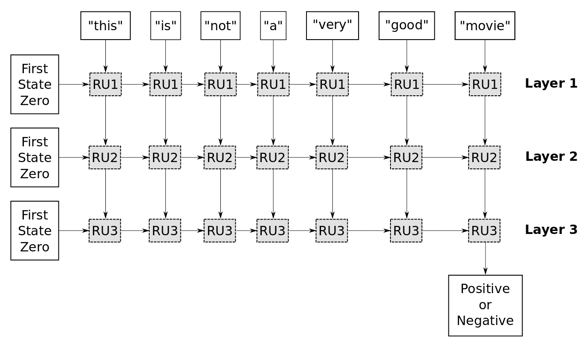

# 十二、神经情感分析

在这一章中，我们将讨论自然语言处理中最热门、最流行的应用之一，称为**情感分析**。如今，大多数人都通过社交媒体平台表达他们对某些事情的看法，利用这些大量的文本来跟踪客户对某些事情的满意度对公司甚至政府来说都非常重要。

在这一章中，我们将使用循环神经网络来构建一个情感分析解决方案。本章将讨论以下主题:

*   通用情感分析架构
*   情感分析—模型实现


# 通用情感分析架构

在这一部分，我们将重点关注可用于情感分析的通用深度学习架构。下图显示了构建情感分析模型所需的处理步骤。

所以，首先，我们要处理自然人类语言:


图 1:情感分析解决方案甚至基于序列的自然语言解决方案的通用管道

我们将使用电影评论来构建这个情感分析应用程序。这个应用程序的目标是根据输入的原始文本产生正面和负面的评论。例如，如果原始文本是这样的，**这部电影很好**，那么我们需要模型为它产生积极的情绪。

情感分析应用程序将带我们经历许多处理步骤，这些步骤是在神经网络中使用自然人类语言所需要的，例如嵌入。

所以在这种情况下，我们有一个 raw text，比如**这不是一部好电影！我们最终想知道这是一种消极还是积极的情绪。**

在这种类型的应用中有几个困难:

*   其中之一是序列可能有**不同的长度**。这是一个很短的例子，但是我们会看到超过 500 个单词的例子。
*   另一个问题是，如果我们只看单个单词(例如，good)，这表明一种积极的情绪。然而，它前面是单词**而不是**，所以现在它是一个负面情绪。这可能会变得更加复杂，我们稍后会看到一个例子。

正如我们在前一章中了解到的，神经网络不能处理原始文本，所以我们需要首先将它转换成所谓的**标记**。这些基本上都是整数值，所以我们遍历整个数据集，统计每个单词被使用的次数。然后，我们制作一个词汇表，每个单词在这个词汇表中都有一个索引。所以单词**这个**有一个整数 ID 或者令牌 **11** ，单词**是**有一个令牌 **6** ，**不是**有一个令牌 **21** 等等。所以现在，我们已经将原始文本转换成一个称为令牌的整数列表。

神经网络仍然无法对这些数据进行操作，因为如果我们有一个 10，000 个单词的词汇量，标记可以取 0 到 9，999 之间的值，它们可能根本不相关。因此，单词 998 可能具有与单词 999 完全不同的语义。

因此，我们将使用我们在前一章中学习过的表示学习或嵌入的概念。这个嵌入层把整数 token 转换成实值向量，所以 token **11** 变成了向量[0.67，0.36，...，0.39]，如图*图 1* 所示。这同样适用于下一个令牌号 6。

快速回顾一下我们在前一章所学的内容:上图中的嵌入层学习了记号和它们对应的实值向量之间的映射。此外，嵌入层学习单词的语义，使得具有相似含义的单词在这个嵌入空间中以某种方式彼此接近。

从输入的原始文本中，我们得到一个二维矩阵，或张量，现在可以输入到**循环神经网络** ( **RNN** )。这可以处理任意长度的序列，并且该网络的输出然后被馈送到具有 sigmoid 激活函数的全连接或密集层。因此，输出介于 0 和 1 之间，其中 0 值表示负面情绪。但是如果 sigmoid 函数的值既不是 0 也不是 1 呢？然后，我们需要在中间引入一个截止值或阈值，以便如果该值低于 0.5，则相应的输入被视为负面情绪，而高于该阈值的值被视为正面情绪。


# RNNs–情感分析上下文

现在，让我们回顾一下 RNNs 的基本概念，并在情感分析应用程序的上下文中讨论它们。正如我们在 RNN 章节中提到的，RNN 的基本构造块是一个循环单元，如下图所示:


图 2:RNN 单位的抽象概念

这个图是对循环单元内部发生的事情的抽象。我们这里有输入，所以这是一个单词，例如， **good** 。当然还得转换成嵌入向量。然而，我们现在将忽略它。此外，该单元具有一种存储器状态，并且根据该**状态**和**输入**的内容，我们将更新该状态并将新数据写入该状态。比如，假设我们之前在输入中看到了单词**而不是**；我们将其写入状态，以便当我们在以下输入之一上看到单词 **good** 时，我们从状态中得知我们刚刚看到的是单词**而不是**。现在，我们看到了字**好**。因此，我们必须写入我们已经一起看到单词**不好**的状态，以便这可能指示整个输入文本可能具有负面情绪。

从旧状态到状态的新内容的映射是通过所谓的**门**来完成的，并且这些实现的方式在不同版本的递归单元中是不同的。它基本上是一个带有激活函数的矩阵运算，但是我们马上会看到，反向传播梯度有一个问题。因此，RNN 必须以一种特殊的方式设计，这样梯度就不会失真太多。

在一个循环单元中，我们有一个类似的门来产生输出，同样，循环单元的输出依赖于状态的当前内容和我们看到的输入。所以我们可以尝试和做的是展开循环单元的处理过程:


图 3:循环神经网络的展开版本

现在，我们这里只有一个循环单元，但是流程图显示了在不同的时间点发生了什么。所以:

*   在时间步骤 1 中，我们将字 **this** 输入到递归单元，它首先将其内存状态初始化为零。每当我们开始处理新的数据序列时，TensorFlow 都会这样做。所以，我们看到单词**这个**和递归单元状态是 0。因此，我们使用内部门来更新存储器状态，然后在第二个时间步骤中使用来更新**，在第二个时间步骤中，我们输入单词**为**；现在，内存状态有一些内容。单词**这个**没有太多的意义，所以状态可能还在 0 左右。**
*   并且**中的**也没有太多的意义，所以状态可能还是 0。
*   在下一个时间步骤中，我们看到单词**而不是**，这具有我们最终想要预测的含义，即整个输入文本的情感。这一个是我们需要存储在内存中的，这样循环单元内部的门就可以看到状态可能已经包含了接近 0 的值。但是现在它想存储我们刚刚看到的字**而不是**，所以它在这个状态下保存了一些非零值。
*   然后，我们继续下一个时间步骤，这里我们有单词**a**；这个也没有太多信息，大概就是忽略了。它只是在全州范围内复制。
*   现在，我们有了单词 **very** ，这表明无论存在什么情绪都可能是强烈的情绪，所以循环单元现在知道我们已经看到了**而不是**和 **very** 。它以某种方式把这个存储在它的记忆状态中。
*   在下一个时间步骤中，我们看到单词**好**，所以现在网络知道**不太好**并且它认为，*哦，这很可能是一种负面情绪！因此，它将该值存储在内部状态中。*
*   然后，在最后的时间步骤中，我们看到了**电影**，这实际上并不相关，所以可能只是被忽略了。
*   接下来，我们使用递归单元内部的另一个门来输出内存状态的内容，然后用 sigmoid 函数对其进行处理(这里不展示)。我们得到 0 到 1 之间的输出值。

接下来的想法是，我们希望根据互联网电影数据库中成千上万的电影评论来训练这个网络，其中，对于每个输入文本，我们给它正面或负面的真实情感值。然后，我们希望 TensorFlow 找出循环单元内部的门应该是什么，以便它们将输入文本准确地映射到正确的情感:



图 4:用于本章实现的架构

我们将在这个实现中使用的 RNN 的架构是一个具有三层的 RNN 型架构。在第一层，我们刚刚解释的事情发生了，除了现在我们需要在每个时间步输出来自递归单元的值。然后，我们收集一个新的数据序列，这是第一个递归层的输出。接下来，我们可以将它输入到第二递归层，因为递归单元需要输入数据序列(我们从第一层获得的输出和我们希望输入到第二递归层的输出是一些浮点值，我们并不真正理解它们的含义)。这在 RNN 内部是有意义的，但这不是我们人类所能理解的。然后，我们在第二个递归层中进行类似的处理。

所以，首先，我们把这个递归单元的内存状态初始化为 0；然后，我们从第一个递归层获取第一个输出并输入它。我们用这个循环单元内部的门来处理它，更新状态，将第二个字**的第一层循环单元的输出作为**，并将其用作输入以及内部存储器状态。我们继续这样做，直到我们处理了整个序列，然后我们收集第二循环层的所有输出。我们在第三个递归层中使用它们作为输入，在那里我们进行类似的处理。但是在这里，我们只想要最后一个时间步的输出，这是对到目前为止已经输入的所有内容的一种总结。然后，我们将其输出到一个完全连接的层，这里没有显示。最后，我们有 sigmoid 激活函数，所以我们得到一个介于 0 和 1 之间的值，分别代表消极情绪和积极情绪。


# 爆炸和消失渐变-概述

正如我们在前一章提到的，有一种现象叫做渐变值的**爆炸**和**消失**，这在 RNNs 中非常重要。我们回过头来看看*图 1*；那个流程图解释了这个现象是什么。

假设我们在这个数据集中有一个 500 个单词的文本，我们将使用它来实现我们的情感分析分类器。在每个时间步，我们以递归方式应用递归单元中的内部门；所以如果有 500 个单词，我们将应用这些门 500 次来更新递归单元的内存状态。

正如我们所知，训练神经网络的方式是通过使用所谓的梯度反向传播，因此我们有一些损失函数来获得神经网络的输出，然后是给定输入文本的真实输出。然后，我们希望最小化这个损失值，以便神经网络的实际输出对应于这个特定输入文本的期望输出。所以，我们需要得到这个损失函数相对于这些循环单元内部的权重的梯度，这些权重用于更新内部状态并最终输出值的门。

现在，这个门可能被应用了 500 次，如果它有一个乘法运算，我们得到的基本上是一个指数函数。所以，如果你把一个值乘以 500 倍，如果这个值稍微小于 1，那么它会很快消失或者丢失。类似地，如果一个略大于 1 的值与自身相乘 500 次，它就会爆炸。

能经受 500 次乘法运算的值只有 0 和 1。它们将保持不变，所以递归单元实际上比你在这里看到的要复杂得多。这是一个抽象的想法，我们希望以某种方式映射内部存储器状态和输入，以更新内部存储器状态并输出一些值，但实际上，我们需要非常小心地通过这些门反向传播梯度，这样我们就不会在许多时间步长上出现这种指数乘法。我们也鼓励你去看一些关于递归单位的数学定义的教程。


# 情绪分析–模型实现

我们已经了解了如何实现 RNNs 的 LSTM 变体的堆栈版本。为了让事情变得更令人兴奋，我们将使用一个叫做`Keras`的高级 API。


# 克拉斯

“Keras 是一种高级神经网络 API，用 Python 编写，能够在 TensorFlow、CNTK 或 Theano 之上运行。它的开发重点是支持快速实验。能够以尽可能少的延迟从想法到结果是做好研究的关键。”–Keras 网站

所以，Keras 只是 TensorFlow 和其他深度学习框架的包装器。这对于原型设计和快速构建非常有用，但另一方面，它让您对代码的控制更少。我们将有机会在 Keras 中实现这个情感分析模型，这样您就可以在 TensorFlow 和 Keras 中亲自动手实现。您可以使用 Keras 进行快速原型开发，使用 TensorFlow 开发生产就绪的系统。

对你来说更有趣的消息是，你不必切换到一个完全不同的环境。现在，您可以在 TensorFlow 中将 Keras 作为模块访问，并导入包，如下所示:

```py
from tensorflow.python.keras.models 
import Sequential
from tensorflow.python.keras.layers 
import Dense, GRU, Embedding
from tensorflow.python.keras.optimizers 
import Adam
from tensorflow.python.keras.preprocessing.text 
import Tokenizer
from tensorflow.python.keras.preprocessing.sequence 
import pad_sequences
```

因此，让我们继续使用我们现在可以称为 TensorFlow 内部更抽象的模块，它将帮助我们非常快速地构建深度学习解决方案的原型。这是因为我们将能够只用几行代码编写完整的深度学习解决方案。


# 数据分析和预处理

现在，让我们转到需要加载数据的实际实现。Keras 实际上有一个功能，可以用来从 IMDb 加载这个情感数据集，但问题是它已经将所有的单词映射到整数标记。这是使用自然人类语言洞察神经网络的一个非常重要的部分，我真的想告诉你怎么做。

此外，如果您想使用此代码对其他语言中的任何数据进行情感分析，您需要自己完成此操作，因此我们刚刚快速实现了一些用于下载此数据集的函数。

让我们从导入一些必需的包开始:

```py
%matplotlib inline
import matplotlib.pyplot as plt
import tensorflow as tf
import numpy as np
from scipy.spatial.distance import cdist
from tensorflow.python.keras.models import Sequential
from tensorflow.python.keras.layers import Dense, GRU, Embedding
from tensorflow.python.keras.optimizers import Adam
from tensorflow.python.keras.preprocessing.text import Tokenizer
from tensorflow.python.keras.preprocessing.sequence import pad_sequences
```

然后我们加载数据集:

```py
import imdb
imdb.maybe_download_and_extract()

Output:
- Download progress: 100.0%
Download finished. Extracting files.
Done.
```

```py
input_text_train, target_train = imdb.load_data(train=True)
input_text_test, target_test = imdb.load_data(train=False)
```

```py
print("Size of the trainig set: ", len(input_text_train))
print("Size of the testing set:  ", len(input_text_test))

Output:
Size of the trainig set: 25000
Size of the testing set: 25000
```

如你所见，它在训练集和测试集中有 25，000 个文本。

让我们来看看训练集中的一个示例及其外观:

```py
#combine dataset
text_data = input_text_train + input_text_test
input_text_train[1]

Output:
'This is a really heart-warming family movie. It has absolutely brilliant animal training and "acting" (if you can call it like that) as well (just think about the dog in "How the Grinch stole Christmas"... it was plain bad training). The Paulie story is extremely well done, well reproduced and in general the characters are really elaborated too. Not more to say except that this is a GREAT MOVIE!<br /><br />My ratings: story 8.5/10, acting 7.5/10, animals+fx 8.5/10, cinematography 8/10.<br /><br />My overall rating: 8/10 - BIG FAMILY MOVIE AND VERY WORTH WATCHING!'

target_train[1]

Output:
1.0
```

这是一个相当短的电影，情感值是`1.0`，这意味着它是一个积极的情感，所以这是对这部电影的积极评价。

现在，我们到了分词器，这是处理原始数据的第一步，因为神经网络不能处理文本数据。Keras 已经实现了所谓的**记号赋予器**，用于构建词汇表和从单词到整数的映射。

此外，我们可以说我们想要最多 10，000 个单词，因此它将只使用数据集中最常用的 10，000 个单词:

```py
num_top_words = 10000
tokenizer_obj = Tokenizer(num_words=num_top_words)
```

现在，我们从数据集中取出所有文本，并在文本上调用这个函数`fit`:

```py
tokenizer_obj.fit_on_texts(text_data)
```

记号赋予器需要大约 10 秒钟，然后它将建立词汇。看起来是这样的:

```py
tokenizer_obj.word_index

Output:
{'britains': 33206,
 'labcoats': 121364,
 'steeled': 102939,
 'geddon': 67551,
 "rossilini's": 91757,
 'recreational': 27654,
 'suffices': 43205,
 'hallelujah': 30337,
 'mallika': 30343,
 'kilogram': 122493,
 'elphic': 104809,
 'feebly': 32818,
 'unskillful': 91728,
 "'mistress'": 122218,
 "yesterday's": 25908,
 'busco': 85664,
 'goobacks': 85670,
 'mcfeast': 71175,
 'tamsin': 77763,
 "petron's": 72628,
 "'lion": 87485,
 'sams': 58341,
 'unbidden': 60042,
 "principal's": 44902,
 'minutiae': 31453,
 'smelled': 35009,
 'history\x97but': 75538,
 'vehemently': 28626,
 'leering': 14905,
 'kýnay': 107654,
 'intendend': 101260,
 'chomping': 21885,
 'nietsze': 76308,
 'browned': 83646,
 'grosse': 17645,
 "''gaslight''": 74713,
 'forseeing': 103637,
 'asteroids': 30997,
 'peevish': 49633,
 "attic'": 120936,
 'genres': 4026,
 'breckinridge': 17499,
 'wrist': 13996,
 "sopranos'": 50345,
 'embarasing': 92679,
 "wednesday's": 118413,
 'cervi': 39092,
 'felicity': 21570,
 "''horror''": 56254,
 'alarms': 17764,
 "'ol": 29410,
 'leper': 27793,
 'once\x85': 100641,
 'iverson': 66834,
 'triply': 117589,
 'industries': 19176,
 'brite': 16733,
 'amateur': 2459,
 "libby's": 46942,
 'eeeeevil': 120413,
 'jbc33': 51111,
 'wyoming': 12030,
 'waned': 30059,
 'uchida': 63203,
 'uttter': 93299,
 'irector': 123847,
 'outriders': 95156,
 'perd': 118465,
.
.
.}
```

所以，每个单词现在都与一个整数相关联；因此，`the`这个词就有了数字`1`:

```py
tokenizer_obj.word_index['the']

Output:
1
```

在这里，`and`有编号`2`:

```py
tokenizer_obj.word_index['and']

Output:
2
```

单词`a`有`3`:

```py
tokenizer_obj.word_index['a']

Output:
3
```

诸如此类。我们看到`movie`的编号为`17`:

```py
tokenizer_obj.word_index['movie']

Output:
17
```

并且`film`的编号为`19`:

```py
tokenizer_obj.word_index['film']

Output:
19
```

这意味着`the`是数据集中使用次数最多的单词，而`and`是数据集中第二多的单词。所以，每当我们想把单词映射成整数记号的时候，我们就会得到这些数字。

让我们试着以单词数字`743`为例，这是单词`romantic`:

```py
tokenizer_obj.word_index['romantic']

Output:
743
```

因此，每当我们在输入文本中看到单词`romantic`时，我们就将它映射到标记整数`743`。我们再次使用记号赋予器将训练集中文本中的所有单词转换成整数记号:

```py
input_text_train[1]
Output:
'This is a really heart-warming family movie. It has absolutely brilliant animal training and "acting" (if you can call it like that) as well (just think about the dog in "How the Grinch stole Christmas"... it was plain bad training). The Paulie story is extremely well done, well reproduced and in general the characters are really elaborated too. Not more to say except that this is a GREAT MOVIE!<br /><br />My ratings: story 8.5/10, acting 7.5/10, animals+fx 8.5/10, cinematography 8/10.<br /><br />My overall rating: 8/10 - BIG FAMILY MOVIE AND VERY WORTH WATCHING!
```

当我们将文本转换成整数标记时，它就变成了一个整数数组:

```py
np.array(input_train_tokens[1])

Output:
array([ 11, 6, 3, 62, 488, 4679, 236, 17, 9, 45, 419,
        513, 1717, 2425, 2, 113, 43, 22, 67, 654, 9, 37,
         12, 14, 69, 39, 101, 42, 1, 826, 8, 85, 1,
       6418, 3492, 1156, 9, 13, 1042, 74, 2425, 1, 6419, 64,
          6, 568, 69, 221, 69, 2, 8, 825, 1, 102, 23,
         62, 96, 21, 51, 5, 131, 556, 12, 11, 6, 3,
         78, 17, 7, 7, 56, 2818, 64, 723, 447, 156, 113,
        702, 447, 156, 1598, 3611, 723, 447, 156, 633, 723, 156,
          7, 7, 56, 437, 670, 723, 156, 191, 236, 17, 2,
         52, 278, 147])
```

因此，单词`this`变成了数字 11，单词`is`变成了数字 59，以此类推。

我们还需要转换文本的其余部分:

```py
input_test_tokens = tokenizer_obj.texts_to_sequences(input_text_test)
```

现在，还有另一个问题，因为根据原始文本的长度，标记序列具有不同的长度，即使递归单元可以处理任意长度的序列。但是 TensorFlow 的工作方式是，一个批处理中的所有数据需要具有相同的长度。

因此，我们可以确保整个数据集中的所有序列都具有相同的长度，或者编写一个自定义数据生成器来确保单个批处理中的序列具有相同的长度。现在，确保数据集中的所有序列都具有相同的长度要简单得多，但问题是存在一些异常值。我想，我们有些句子有 2200 多字长。如果把 2200 字以上的*短句*都有了，会很伤我们的记忆。所以我们要做的是妥协。首先，我们需要计算所有的单词，或者每个输入序列中的标记数。我们看到的是，一个序列中的平均字数约为 221:

```py
total_num_tokens = [len(tokens) for tokens in input_train_tokens + input_test_tokens]
total_num_tokens = np.array(total_num_tokens)

#Get the average number of tokens
np.mean(total_num_tokens)

Output:
221.27716
```

我们看到最大字数超过了 2200 字:

```py
np.max(total_num_tokens)

Output:
2208
```

现在，平均值和最大值之间有巨大的差异，如果我们只是填充数据集中的所有句子，使它们都有`2208`标记，我们将再次浪费大量内存。如果您有一个包含数百万个文本序列的数据集，这尤其是个问题。

所以我们要做的是做一个妥协，我们将填充所有的序列，并截断那些太长的序列，这样它们就有了`544`单词。我们的计算方法是这样的——我们取数据集中所有序列的平均字数，然后加上两个标准差:

```py
max_num_tokens = np.mean(total_num_tokens) + 2 * np.std(total_num_tokens)
max_num_tokens = int(max_num_tokens)
max_num_tokens

Output:
544
```

我们能从中得到什么？我们覆盖了数据集中大约 95%的文本，所以只有大约 5%的文本比`544`的单词长:

```py
np.sum(total_num_tokens < max_num_tokens) / len(total_num_tokens)

Output:
0.94532
```

现在，我们在 Keras 中调用这些函数。他们要么填充太短的序列(所以他们只会添加零)，要么截断太长的序列(如果文本太长，基本上只是截掉一些单词)。

现在，这里有一件重要的事情:我们可以在前置或后置模式下进行填充和截断。假设我们有一个整数符号序列，我们想填充它，因为它太短了。我们可以:

*   要么在开头填充所有这些零，这样我们在结尾就有了真正的整数标记。
*   或者以相反的方式做，这样我们在开始时有所有这些数据，然后在结束时有所有的零。但是如果我们回过头来看看前面的 RNN 流程图，记住它是一步一步地处理序列，所以如果我们开始处理零，它可能没有任何意义，内部状态可能会保持为零。因此，每当它最终看到一个特定单词的整数标记时，它就会知道现在我们开始处理数据了。

然而，如果所有的零都在末尾，我们就会开始处理所有的数据；然后我们会在循环单元中有一些内部状态。现在，我们看到很多零，所以这可能会破坏我们刚刚计算的内部状态。这就是为什么在开头填充零可能是个好主意。

但是另一个问题是当我们截断一个文本时，所以如果文本很长，我们将截断它以适应`544`单词，或者任何数字。现在，想象我们在中间的某个地方抓住了这个句子，它说**这部非常好的电影**或者**这不是**。当然，你知道我们只对很长的序列这样做，但是我们有可能丢失正确分类文本的重要信息。所以这是我们在截断输入文本时所做的妥协。更好的方法是创建一个批处理，然后在该批处理中填充文本。因此，当我们看到一个非常长的序列时，我们会填充其他序列，使其具有相同的长度。但是我们不需要将所有这些数据存储在内存中，因为大部分数据都被浪费了。

让我们回过头来转换整个数据集，使其被截断和填充；因此，这是一个巨大的数据矩阵:

```py
seq_pad = 'pre'

input_train_pad = pad_sequences(input_train_tokens, maxlen=max_num_tokens,
 padding=seq_pad, truncating=seq_pad)

input_test_pad = pad_sequences(input_test_tokens, maxlen=max_num_tokens,
 padding=seq_pad, truncating=seq_pad)
```

我们检查这个矩阵的形状:

```py
input_train_pad.shape

Output:
(25000, 544)

input_test_pad.shape

Output:
(25000, 544)
```

因此，让我们来看看填充前后的具体示例标记:

```py
np.array(input_train_tokens[1])

Output:
array([ 11, 6, 3, 62, 488, 4679, 236, 17, 9, 45, 419,
        513, 1717, 2425, 2, 113, 43, 22, 67, 654, 9, 37,
         12, 14, 69, 39, 101, 42, 1, 826, 8, 85, 1,
       6418, 3492, 1156, 9, 13, 1042, 74, 2425, 1, 6419, 64,
          6, 568, 69, 221, 69, 2, 8, 825, 1, 102, 23,
         62, 96, 21, 51, 5, 131, 556, 12, 11, 6, 3,
         78, 17, 7, 7, 56, 2818, 64, 723, 447, 156, 113,
        702, 447, 156, 1598, 3611, 723, 447, 156, 633, 723, 156,
          7, 7, 56, 437, 670, 723, 156, 191, 236, 17, 2,
         52, 278, 147])
```

填充后，该示例将如下所示:

```py
input_train_pad[1]

Output:
array([ 0, 0, 0, 0, 0, 0, 0, 0, 0, 0, 0,
          0, 0, 0, 0, 0, 0, 0, 0, 0, 0, 0,
          0, 0, 0, 0, 0, 0, 0, 0, 0, 0, 0,
          0, 0, 0, 0, 0, 0, 0, 0, 0, 0, 0,
          0, 0, 0, 0, 0, 0, 0, 0, 0, 0, 0,
          0, 0, 0, 0, 0, 0, 0, 0, 0, 0, 0,
          0, 0, 0, 0, 0, 0, 0, 0, 0, 0, 0,
          0, 0, 0, 0, 0, 0, 0, 0, 0, 0, 0,
          0, 0, 0, 0, 0, 0, 0, 0, 0, 0, 0,
          0, 0, 0, 0, 0, 0, 0, 0, 0, 0, 0,
          0, 0, 0, 0, 0, 0, 0, 0, 0, 0, 0,
          0, 0, 0, 0, 0, 0, 0, 0, 0, 0, 0,
          0, 0, 0, 0, 0, 0, 0, 0, 0, 0, 0,
          0, 0, 0, 0, 0, 0, 0, 0, 0, 0, 0,
          0, 0, 0, 0, 0, 0, 0, 0, 0, 0, 0,
          0, 0, 0, 0, 0, 0, 0, 0, 0, 0, 0,
          0, 0, 0, 0, 0, 0, 0, 0, 0, 0, 0,
          0, 0, 0, 0, 0, 0, 0, 0, 0, 0, 0,
          0, 0, 0, 0, 0, 0, 0, 0, 0, 0, 0,
          0, 0, 0, 0, 0, 0, 0, 0, 0, 0, 0,
          0, 0, 0, 0, 0, 0, 0, 0, 0, 0, 0,
          0, 0, 0, 0, 0, 0, 0, 0, 0, 0, 0,
          0, 0, 0, 0, 0, 0, 0, 0, 0, 0, 0,
          0, 0, 0, 0, 0, 0, 0, 0, 0, 0, 0,
          0, 0, 0, 0, 0, 0, 0, 0, 0, 0, 0,
          0, 0, 0, 0, 0, 0, 0, 0, 0, 0, 0,
          0, 0, 0, 0, 0, 0, 0, 0, 0, 0, 0,
          0, 0, 0, 0, 0, 0, 0, 0, 0, 0, 0,
          0, 0, 0, 0, 0, 0, 0, 0, 0, 0, 0,
          0, 0, 0, 0, 0, 0, 0, 0, 0, 0, 0,
          0, 0, 0, 0, 0, 0, 0, 0, 0, 0, 0,
          0, 0, 0, 0, 0, 0, 0, 0, 0, 0, 0,
          0, 0, 0, 0, 0, 0, 0, 0, 0, 0, 0,
          0, 0, 0, 0, 0, 0, 0, 0, 0, 0, 0,
          0, 0, 0, 0, 0, 0, 0, 0, 0, 0, 0,
          0, 0, 0, 0, 0, 0, 0, 0, 0, 0, 0,
          0, 0, 0, 0, 0, 0, 0, 0, 0, 0, 0,
          0, 0, 0, 0, 0, 0, 0, 0, 0, 0, 0,
          0, 0, 0, 0, 0, 0, 0, 0, 0, 0, 0,
          0, 0, 0, 0, 0, 0, 0, 0, 0, 0, 0,
          0, 0, 11, 6, 3, 62, 488, 4679, 236, 17, 9,
         45, 419, 513, 1717, 2425, 2, 113, 43, 22, 67, 654,
          9, 37, 12, 14, 69, 39, 101, 42, 1, 826, 8,
         85, 1, 6418, 3492, 1156, 9, 13, 1042, 74, 2425, 1,
       6419, 64, 6, 568, 69, 221, 69, 2, 8, 825, 1,
        102, 23, 62, 96, 21, 51, 5, 131, 556, 12, 11,
          6, 3, 78, 17, 7, 7, 56, 2818, 64, 723, 447,
        156, 113, 702, 447, 156, 1598, 3611, 723, 447, 156, 633,
        723, 156, 7, 7, 56, 437, 670, 723, 156, 191, 236,
         17, 2, 52, 278, 147], dtype=int32)
```

此外，我们需要一个向后映射的功能，以便它从整数令牌映射回文本单词；我们只是需要这个。这是一个非常简单的助手函数，所以让我们继续实现它:

```py
index = tokenizer_obj.word_index
index_inverse_map = dict(zip(index.values(), index.keys()))
```

```py
def convert_tokens_to_string(input_tokens):

 # Convert the tokens back to words
 input_words = [index_inverse_map[token] for token in input_tokens if token != 0]

 # join them all words.
 combined_text = " ".join(input_words)

return combined_text
```

例如，现在数据集中的原始文本是这样的:

```py
input_text_train[1]
Output:

input_text_train[1]

'This is a really heart-warming family movie. It has absolutely brilliant animal training and "acting" (if you can call it like that) as well (just think about the dog in "How the Grinch stole Christmas"... it was plain bad training). The Paulie story is extremely well done, well reproduced and in general the characters are really elaborated too. Not more to say except that this is a GREAT MOVIE!<br /><br />My ratings: story 8.5/10, acting 7.5/10, animals+fx 8.5/10, cinematography 8/10.<br /><br />My overall rating: 8/10 - BIG FAMILY MOVIE AND VERY WORTH WATCHING!'
```

如果我们使用一个辅助函数将标记转换回文本单词，我们将得到以下文本:

```py
convert_tokens_to_string(input_train_tokens[1])

'this is a really heart warming family movie it has absolutely brilliant animal training and acting if you can call it like that as well just think about the dog in how the grinch stole christmas it was plain bad training the paulie story is extremely well done well and in general the characters are really too not more to say except that this is a great movie br br my ratings story 8 5 10 acting 7 5 10 animals fx 8 5 10 cinematography 8 10 br br my overall rating 8 10 big family movie and very worth watching'
```

除了标点和其他符号基本一样。


# 构建模型

现在，我们需要创建 RNN，我们将在 Keras 中完成，因为这非常简单。我们用所谓的`sequential`模型来做这件事。

这个架构的第一层是所谓的**嵌入**。如果我们回头看看图 1 中的流程图，我们刚才所做的是将原始输入文本转换成整数标记。但是我们仍然不能把它输入到 RNN 中，所以我们必须把它转换成嵌入向量，也就是介于-1 和 1 之间的值。它们可以超过一定程度，但通常在-1 和 1 之间，这是我们可以在神经网络中处理的数据。

这有点神奇，因为这个嵌入层与 RNN 同时训练，它看不到原始单词。它能看到整数符号，但学会识别单词在一起使用时有某种模式。所以它可以，某种程度上，推断出一些单词或者一些整数符号有相似的意思，然后它把这个编码在看起来有些相似的嵌入向量中。

因此，我们需要决定的是每个向量的长度，例如，令牌“11”被转换成一个实值向量。在这个例子中，我们将使用长度 8，这实际上是非常短的(正常情况下，它在 100 到 300 之间)。尝试更改嵌入向量中的元素数量，然后重新运行这段代码，看看结果如何。

因此，我们将嵌入大小设置为 8，然后使用 Keras 将此嵌入层添加到 RNN。这必须是网络的第一层:

```py
embedding_layer_size = 8

rnn_type_model.add(Embedding(input_dim=num_top_words,
                    output_dim=embedding_layer_size,
                    input_length=max_num_tokens,
                    name='embedding_layer'))
```

然后，我们可以添加第一个循环层，我们将使用所谓的**门控循环单元** ( **GRU** )。通常，你会看到人们使用所谓的 **LSTM** ，但其他人似乎认为 GRU 更好，因为 LSTM 内有多余的门。事实上，更简单的代码使用更少的门也能很好地工作。你可以给 LSTM 增加一千个大门，但这并不意味着它会变得更好。

因此，让我们定义我们的 GRU 架构；我们说我们想要 16 的输出维数，并且我们需要返回序列:

```py
rnn_type_model.add(GRU(units=16, return_sequences=True))
```

如果我们查看图 4 中的流程图，我们想要添加第二个循环层:

```py
rnn_type_model.add(GRU(units=8, return_sequences=True))
```

然后，我们有第三个也是最后一个递归层，它不会输出一个序列，因为它后面会有一个密集层；它应该只给出 GRU 的最终输出，而不是整个输出序列:

```py
rnn_type_model.add(GRU(units=4))
```

然后，这里的输出将被馈送到一个完全连接的或密集的层中，该层应该为每个输入序列输出一个值。这是用 sigmoid 激活函数处理的，因此它输出 0 到 1 之间的值:

```py
rnn_type_model.add(Dense(1, activation='sigmoid'))
```

然后，我们说我们希望使用具有此学习率的 Adam 优化器，损失函数应该是 RNN 的输出和训练集的实际类值之间的二进制交叉熵，该值将是 0 或 1:

```py
model_optimizer = Adam(lr=1e-3)

rnn_type_model.compile(loss='binary_crossentropy',
              optimizer=model_optimizer,
              metrics=['accuracy'])
```

现在，我们可以打印模型的概要:

```py
rnn_type_model.summary()

_________________________________________________________________
Layer (type) Output Shape Param # 
=================================================================
embedding_layer (Embedding) (None, 544, 8) 80000 
_________________________________________________________________
gru_1 (GRU) (None, None, 16) 1200 
_________________________________________________________________
gru_2 (GRU) (None, None, 8) 600 
_________________________________________________________________
gru_3 (GRU) (None, 4) 156 
_________________________________________________________________
dense_1 (Dense) (None, 1) 5 
=================================================================
Total params: 81,961
Trainable params: 81,961
Non-trainable params: 0
_________________________
```

如你所见，我们有嵌入层，第一个循环单元，第二个，第三个和密集层。注意这没有很多参数。


# 模型训练和结果分析

现在，是时候开始训练过程了，这里非常简单:

```py
Output:
rnn_type_model.fit(input_train_pad, target_train,
          validation_split=0.05, epochs=3, batch_size=64)

Output:
Train on 23750 samples, validate on 1250 samples
Epoch 1/3
23750/23750 [==============================]23750/23750 [==============================] - 176s 7ms/step - loss: 0.6698 - acc: 0.5758 - val_loss: 0.5039 - val_acc: 0.7784

Epoch 2/3
23750/23750 [==============================]23750/23750 [==============================] - 175s 7ms/step - loss: 0.4631 - acc: 0.7834 - val_loss: 0.2571 - val_acc: 0.8960

Epoch 3/3
23750/23750 [==============================]23750/23750 [==============================] - 174s 7ms/step - loss: 0.3256 - acc: 0.8673 - val_loss: 0.3266 - val_acc: 0.8600
```

让我们对照测试集测试训练好的模型:

```py
model_result = rnn_type_model.evaluate(input_test_pad, target_test)

Output:
25000/25000 [==============================]25000/25000 [==============================] - 60s 2ms/step

print("Accuracy: {0:.2%}".format(model_result[1]))
Output:
Accuracy: 85.26%
```

现在，让我们看看一些错误分类的文本的例子。

因此，首先，我们计算测试集中前 1000 个序列的预测类，然后我们获取实际类值。我们对它们进行比较，得到一个存在这种不匹配的指数列表:

```py
target_predicted = rnn_type_model.predict(x=input_test_pad[0:1000])
target_predicted = target_predicted.T[0]
```

使用截止阈值表示所有高于`0.5`的值将被视为正值，其他值将被视为负值:

```py
class_predicted = np.array([1.0 if prob>0.5 else 0.0 for prob in target_predicted])
```

现在，让我们得到这 1000 个序列的实际类:

```py
class_actual = np.array(target_test[0:1000])
```

让我们从输出中得到不正确的样本:

```py
incorrect_samples = np.where(class_predicted != class_actual)
incorrect_samples = incorrect_samples[0]
len(incorrect_samples)

Output:
122
```

所以，我们看到有 122 篇文章被错误地分类了。这是我们计算的 1000 条短信的 12.1%。让我们看看第一个错误分类的文本:

```py
index = incorrect_samples[0]
index
```

```py
Output:
9

incorrectly_predicted_text = input_text_test[index]
incorrectly_predicted_text
```

```py
Output:

'I am not a big music video fan. I think music videos take away personal feelings about a particular song.. Any song. In other words, creative thinking goes out the window. Likewise, Personal feelings aside about MJ, toss aside. This was the best music video of alltime. Simply wonderful. It was a movie. Yes folks it was. Brilliant! You had awesome acting, awesome choreography, and awesome singing. This was spectacular. Simply a plot line of a beautiful young lady dating a man, but was he a man or something sinister. Vincent Price did his thing adding to the song and video. MJ was MJ, enough said about that. This song was to video, what Jaguars are for cars. Top of the line, PERFECTO. What was even better about this was, that we got the real MJ without the thousand facelifts. Though ironically enough, there was more than enough makeup and costumes to go around. Folks go to Youtube. Take 14 mins. out of your life and see for yourself what a wonderful work of art this particular video really is.'
```

让我们看看这个示例和实际类的模型输出:

```py
target_predicted[index]
```

```py
Output:
0.1529513

class_actual[index]
Output:
1.0
```

现在，让我们针对一组新的数据样本测试我们的训练模型，并查看其结果:

```py
test_sample_1 = "This movie is fantastic! I really like it because it is so good!"
test_sample_2 = "Good movie!"
test_sample_3 = "Maybe I like this movie."
test_sample_4 = "Meh ..."
test_sample_5 = "If I were a drunk teenager then this movie might be good."
test_sample_6 = "Bad movie!"
test_sample_7 = "Not a good movie!"
test_sample_8 = "This movie really sucks! Can I get my money back please?"
test_samples = [test_sample_1, test_sample_2, test_sample_3, test_sample_4, test_sample_5, test_sample_6, test_sample_7, test_sample_8]
```

现在，让我们把它们转换成整数记号:

```py
test_samples_tokens = tokenizer_obj.texts_to_sequences(test_samples)
```

然后填充它们:

```py
test_samples_tokens_pad = pad_sequences(test_samples_tokens, maxlen=max_num_tokens,
                           padding=seq_pad, truncating=seq_pad)
test_samples_tokens_pad.shape

Output:
(8, 544)
```

最后，让我们针对他们运行模型:

```py
rnn_type_model.predict(test_samples_tokens_pad)

Output:
array([[0.9496784 ],
 [0.9552593 ],
 [0.9115685 ],
 [0.9464672 ],
 [0.87672734],
 [0.81883633],
 [0.33248223],
 [0.15345531 ]], dtype=float32)
```

所以，接近 0 的值意味着消极情绪，接近 1 的值意味着积极情绪；最后，每次训练模型时，这些数字都会有所不同。


# 摘要

在这一章中，我们介绍了一个有趣的应用，即情感分析。不同的公司使用情感分析来跟踪客户对他们产品的满意度。甚至政府也使用情绪分析解决方案来跟踪公民对他们未来想要做的事情的满意度。

接下来，我们将重点关注一些高级深度学习架构，这些架构可用于半监督和非监督应用。