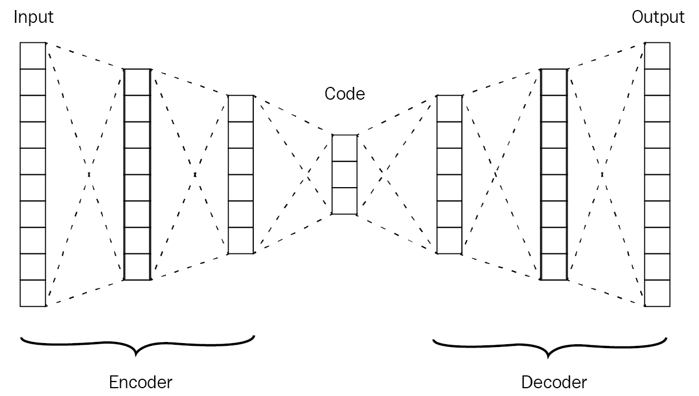
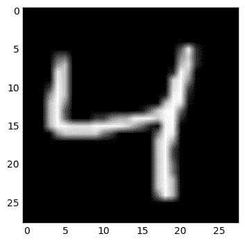
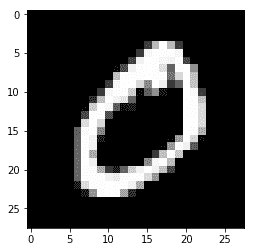
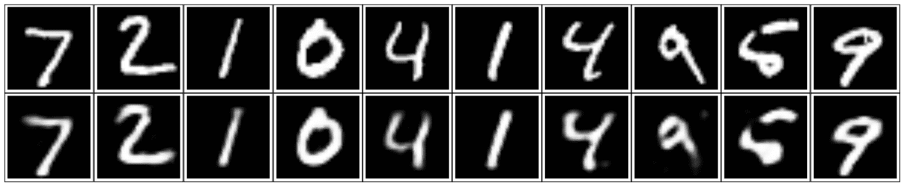
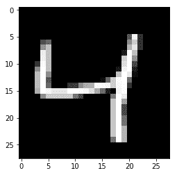
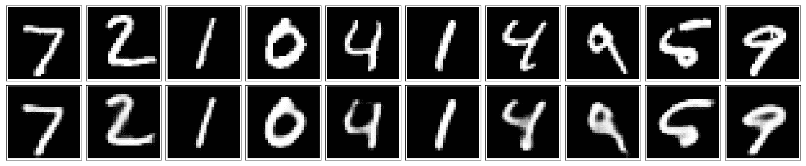
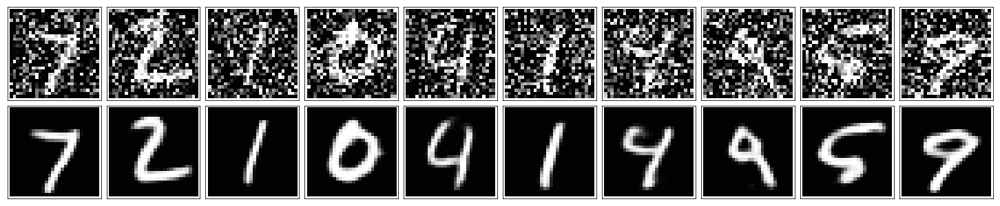
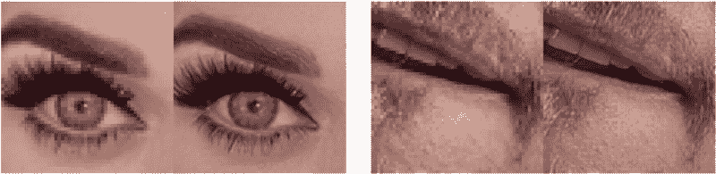

# 自动编码器–特征提取和去噪

自动编码器网络是目前广泛使用的深度学习架构之一。它主要用于高效解码任务的无监督学习。通过学习特定数据集的编码或表示，它还可以用于降维。使用本章中的自动编码器，我们将展示如何通过构建另一个具有相同维度但噪声更少的数据集来对数据集进行降噪。为了在实践中使用这一概念，我们将从 MNIST 数据集中提取重要的特征，并尝试了解性能将如何因此得到显著提高。

本章将涵盖以下主题:

*   自动编码器简介
*   自动编码器的例子
*   自动编码器架构
*   压缩 MNIST 数据集
*   卷积自动编码器
*   降噪自动编码器
*   自动编码器的应用


# 自动编码器简介

自动编码器是另一种深度学习架构，可用于许多有趣的任务，但它也可以被视为普通前馈神经网络的变体，其中输出与输入具有相同的维度。如图*图 1* 所示，自动编码器的工作方式是通过输入数据样本 *(x [1] ，...，x [6] )* 到网络。它将尝试在层 *L2* 中学习该数据的较低表示，这可以称为以较低表示对数据集进行编码的一种方式。然后，网络的第二部分，你可以称之为解码器，负责从这个表示构造一个输出。您可以将网络从输入数据中学习到的中间较低表示视为其压缩版本。

与我们迄今为止看到的所有其他深度学习架构没有太大不同，自动编码器使用反向传播算法。

自动编码器神经网络是一种无监督学习算法，它应用反向传播，将目标值设置为等于输入值:


图 1:通用自动编码器架构


# 自动编码器的例子

在这一章中，我们将使用 MNIST 数据集演示自动编码器的不同变体的一些例子。作为具体的例子，假设输入 *x* 是来自 28×28 图像(784 像素)的像素强度值；因此输入数据样本的数量为 *n=784* 。 *L2* 层有 *s2=392* 个隐藏单元。并且由于输出将具有与输入数据样本相同的维数， *y ∈ R784* 。输入层神经元数量将为 *784* ，中间层 *392* 神经元*L2*；因此，网络将是一个较低的表示，这是输出的压缩版本。然后，网络将把输入 *a(L2) ∈ R392* 的这个压缩的下表示馈送到网络的第二部分，该第二部分将尽力从这个压缩的版本中重构输入像素 *784* 。

自动编码器依赖于由图像像素表示的输入样本将以某种方式相关的事实，然后它将使用该事实来重建它们。因此，自动编码器有点类似于降维技术，因为它们也学习输入数据的较低表示。

总而言之，典型的自动编码器将由三部分组成:

1.  编码器部分，负责将输入压缩成较低的表示形式
2.  该代码是编码器的中间结果
3.  解码器，负责使用该代码重建原始输入

下图显示了典型自动编码器的三个主要组件:


图 2:编码器如何作用于图像

正如我们提到的，自动编码器部分学习输入的压缩表示，然后馈送给第三部分，第三部分试图重建输入。重新构建的输入将类似于输出，但不会与原始输出完全相同，因此自动编码器不能用于压缩任务。


# 自动编码器架构

正如我们提到的，典型的自动编码器由三部分组成。让我们更详细地探讨这三个部分。为了激励你，我们不打算在这一章中重新发明轮子。编码器-解码器部分只是一个完全连接的神经网络，而代码部分是另一个神经网络，但不是完全连接的。该代码部分的维数是可控的，我们可以将其视为超参数:



图 3:自动编码器的通用编码器-解码器架构

在开始使用自动编码器压缩 MNIST 数据集之前，我们将列出一组可以用来微调自动编码器模型的超参数。主要有四个超参数:

1.  **代码部分大小**:这是中间层的单元数。这一层中的单元数量越少，我们得到的输入表示就越压缩。
2.  **编码器和解码器的层数**:正如我们提到的，编码器和解码器只不过是一个完全连接的神经网络，我们可以通过增加更多的层来尽可能地深入。
3.  **每层的单位数量**:我们也可以在每层使用不同的单位数量。编码器和解码器的形状非常类似于 DeconvNets，其中编码器的层数随着接近代码部分而减少，然后随着接近解码器的最后一层而开始增加。
4.  **模型损失函数**:我们也可以使用不同的损失函数，比如 MSE 或者交叉熵。

在定义这些超参数并给它们初始值之后，我们可以使用反向传播算法来训练网络。


# 压缩 MNIST 数据集

在这一部分，我们将构建一个简单的自动编码器，可用于压缩 MNIST 数据集。因此，我们将把这个数据集的图像馈送到编码器部分，编码器部分将尝试为它们学习较低的压缩表示；然后，我们将尝试在解码器部分再次构建输入图像。


# MNIST 数据集

我们将通过使用 TensorFlow 的帮助函数获取 MNIST 数据集来开始实现。

让我们为这个实现导入必要的包:

```
%matplotlib inline

import numpy as np
import tensorflow as tf
import matplotlib.pyplot as plt
```

```

from tensorflow.examples.tutorials.mnist import input_data
mnist_dataset = input_data.read_data_sets('MNIST_data', validation_size=0)

Output:
Extracting MNIST_data/train-images-idx3-ubyte.gz
Extracting MNIST_data/train-labels-idx1-ubyte.gz
Extracting MNIST_data/t10k-images-idx3-ubyte.gz
Extracting MNIST_data/t10k-labels-idx1-ubyte.gz
```

让我们从绘制 MNIST 数据集中的一些示例开始:

```
# Plotting one image from the training set.
image = mnist_dataset.train.images[2]
plt.imshow(image.reshape((28, 28)), cmap='Greys_r')
```

```
Output:
```



图 4:来自 MNIST 数据集的示例图像

```
# Plotting one image from the training set.
image = mnist_dataset.train.images[2]
plt.imshow(image.reshape((28, 28)), cmap='Greys_r')

Output:
```



图 5:来自 MNIST 数据集的示例图像


# 构建模型

为了构建编码器，我们需要计算出每个 MNIST 图像有多少像素，这样我们就可以计算出编码器输入层的大小。MNIST 数据集中的每幅图像都是 28 x 28 像素，因此我们将把这个矩阵整形为 28 x 28 = 784 像素值的向量。我们不需要标准化 MNIST 的图像，因为它们已经被标准化了。

让我们开始构建模型的三个组件。在这个实现中，我们将使用一个非常简单的单一隐藏层架构，然后是 ReLU 激活，如下图所示:


图 6:MNIST 实现的编码器-解码器架构

让我们根据前面的解释来实现这个简单的编码器-解码器架构:

```
# The size of the encoding layer or the hidden layer.
encoding_layer_dim = 32 

img_size = mnist_dataset.train.images.shape[1]

# defining placeholder variables of the input and target values
inputs_values = tf.placeholder(tf.float32, (None, img_size), name="inputs_values")
targets_values = tf.placeholder(tf.float32, (None, img_size), name="targets_values")

# Defining an encoding layer which takes the input values and incode them.
encoding_layer = tf.layers.dense(inputs_values, encoding_layer_dim, activation=tf.nn.relu)

# Defining the logit layer, which is a fully-connected layer but without any activation applied to its output
logits_layer = tf.layers.dense(encoding_layer, img_size, activation=None)

# Adding a sigmoid layer after the logit layer
decoding_layer = tf.sigmoid(logits_layer, name = "decoding_layer")

# use the sigmoid cross entropy as a loss function
model_loss = tf.nn.sigmoid_cross_entropy_with_logits(logits=logits_layer, labels=targets_values)

# Averaging the loss values accross the input data
model_cost = tf.reduce_mean(model_loss)

# Now we have a cost functiont that we need to optimize using Adam Optimizer
model_optimizier = tf.train.AdamOptimizer().minimize(model_cost)
```

现在，我们已经定义了我们的模型，并使用了二元交叉熵，因为图像，像素已经标准化。


# 模特培训

在这一部分，我们将开始培训过程。我们将使用`mnist_dataset`对象的 helper 函数，以便从数据集中随机获取一批特定大小的数据；然后，我们将对这批图像运行优化程序。

让我们从创建会话变量开始这一部分，它将负责执行我们前面定义的计算图:

```
# creating the session
 sess = tf.Session()
```

接下来，让我们开始培训流程:

```
num_epochs = 20
train_batch_size = 200

sess.run(tf.global_variables_initializer())
for e in range(num_epochs):
    for ii in range(mnist_dataset.train.num_examples//train_batch_size):
        input_batch = mnist_dataset.train.next_batch(train_batch_size)
        feed_dict = {inputs_values: input_batch[0], targets_values: input_batch[0]}
        input_batch_cost, _ = sess.run([model_cost, model_optimizier], feed_dict=feed_dict)

        print("Epoch: {}/{}...".format(e+1, num_epochs),
              "Training loss: {:.3f}".format(input_batch_cost))
```

```
Output:
.
.
.
Epoch: 20/20... Training loss: 0.091
Epoch: 20/20... Training loss: 0.091
Epoch: 20/20... Training loss: 0.093
Epoch: 20/20... Training loss: 0.093
Epoch: 20/20... Training loss: 0.095
Epoch: 20/20... Training loss: 0.095
Epoch: 20/20... Training loss: 0.089
Epoch: 20/20... Training loss: 0.095
Epoch: 20/20... Training loss: 0.095
Epoch: 20/20... Training loss: 0.096
Epoch: 20/20... Training loss: 0.094
Epoch: 20/20... Training loss: 0.093
Epoch: 20/20... Training loss: 0.094
Epoch: 20/20... Training loss: 0.093
Epoch: 20/20... Training loss: 0.095
Epoch: 20/20... Training loss: 0.094
Epoch: 20/20... Training loss: 0.096
Epoch: 20/20... Training loss: 0.092
Epoch: 20/20... Training loss: 0.093
Epoch: 20/20... Training loss: 0.091
Epoch: 20/20... Training loss: 0.093
Epoch: 20/20... Training loss: 0.091
Epoch: 20/20... Training loss: 0.095
Epoch: 20/20... Training loss: 0.094
Epoch: 20/20... Training loss: 0.091
Epoch: 20/20... Training loss: 0.096
Epoch: 20/20... Training loss: 0.089
Epoch: 20/20... Training loss: 0.090
Epoch: 20/20... Training loss: 0.094
Epoch: 20/20... Training loss: 0.088
Epoch: 20/20... Training loss: 0.094
Epoch: 20/20... Training loss: 0.093
Epoch: 20/20... Training loss: 0.091
Epoch: 20/20... Training loss: 0.095
Epoch: 20/20... Training loss: 0.093
Epoch: 20/20... Training loss: 0.091
Epoch: 20/20... Training loss: 0.094
Epoch: 20/20... Training loss: 0.090
Epoch: 20/20... Training loss: 0.091
Epoch: 20/20... Training loss: 0.095
Epoch: 20/20... Training loss: 0.095
Epoch: 20/20... Training loss: 0.094
Epoch: 20/20... Training loss: 0.092
Epoch: 20/20... Training loss: 0.092
Epoch: 20/20... Training loss: 0.093
Epoch: 20/20... Training loss: 0.093
```

在运行前面的代码片段 20 个时期后，我们将获得一个经过训练的模型，它能够从 MNIST 数据的测试集中生成或重建图像。请记住，如果我们提供的图像与模型被训练的图像不相似，那么重建过程就不会工作，因为自动编码器是特定于数据的。

让我们通过输入来自测试集的一些图像来测试已训练的模型，并查看模型如何能够在解码器部分重建它们:

```
fig, axes = plt.subplots(nrows=2, ncols=10, sharex=True, sharey=True, figsize=(20,4))

input_images = mnist_dataset.test.images[:10]
reconstructed_images, compressed_images = sess.run([decoding_layer, encoding_layer], feed_dict={inputs_values: input_images})

for imgs, row in zip([input_images, reconstructed_images], axes):
    for img, ax in zip(imgs, row):
        ax.imshow(img.reshape((28, 28)), cmap='Greys_r')
        ax.get_xaxis().set_visible(False)
        ax.get_yaxis().set_visible(False)

fig.tight_layout(pad=0.1)
```

输出:



图 7:原始测试图像(第一行)和它们的构造(第二行)的例子

如您所见，重建图像非常接近输入图像，但我们可能会在编码器-解码器部分使用卷积层来获得更好的图像。


# 卷积自动编码器

之前的简单实现在尝试从 MNIST 数据集重建输入图像时做得很好，但我们可以通过自动编码器的编码器和解码器部分中的卷积层获得更好的性能。这种替换的结果网络被称为**卷积自动编码器** ( **CAE** )。这种能够替换层的灵活性是自动编码器的一大优势，并使它们适用于不同的领域。

我们将用于 CAE 的架构将在网络的解码器部分包含上采样层，以获得图像的重建版本。


# 资料组

在这个实现中，我们可以使用任何类型的成像数据集，看看卷积版本的自动编码器会有什么不同。为此，我们仍将使用 MNIST 数据集，因此让我们从使用 TensorFlow 辅助工具获取数据集开始:

```
%matplotlib inline

import numpy as np
import tensorflow as tf
import matplotlib.pyplot as plt
```

```
from tensorflow.examples.tutorials.mnist import input_data
mnist_dataset = input_data.read_data_sets('MNIST_data', validation_size=0)

Output:
from tensorflow.examples.tutorials.mnist import input_data

mnist_dataset = input_data.read_data_sets('MNIST_data', validation_size=0)

Extracting MNIST_data/train-images-idx3-ubyte.gz
Extracting MNIST_data/train-labels-idx1-ubyte.gz
Extracting MNIST_data/t10k-images-idx3-ubyte.gz
Extracting MNIST_data/t10k-labels-idx1-ubyte.gz
```

让我们展示数据集中的一个数字:

```
# Plotting one image from the training set.
image = mnist_dataset.train.images[2]
plt.imshow(image.reshape((28, 28)), cmap='Greys_r')
```

输出:



图 8:来自 MNIST 数据集的示例图像


# 构建模型

在此实现中，我们将使用步长为 1 的卷积层，填充参数设置为相同。这样，我们不会改变图像的高度或宽度。此外，我们正在使用一套最大池层，以减少图像的宽度和高度，从而建立一个压缩的图像较低的代表。

因此，让我们继续构建我们网络的核心:

```
learning_rate = 0.001

# Define the placeholder variable sfor the input and target values
inputs_values = tf.placeholder(tf.float32, (None, 28,28,1), name="inputs_values")
targets_values = tf.placeholder(tf.float32, (None, 28,28,1), name="targets_values")

# Defining the Encoder part of the netowrk
# Defining the first convolution layer in the encoder parrt
# The output tenosor will be in the shape of 28x28x16
conv_layer_1 = tf.layers.conv2d(inputs=inputs_values, filters=16, kernel_size=(3,3), padding='same', activation=tf.nn.relu)

# The output tenosor will be in the shape of 14x14x16
maxpool_layer_1 = tf.layers.max_pooling2d(conv_layer_1, pool_size=(2,2), strides=(2,2), padding='same')

# The output tenosor will be in the shape of 14x14x8
conv_layer_2 = tf.layers.conv2d(inputs=maxpool_layer_1, filters=8, kernel_size=(3,3), padding='same', activation=tf.nn.relu)

# The output tenosor will be in the shape of 7x7x8
maxpool_layer_2 = tf.layers.max_pooling2d(conv_layer_2, pool_size=(2,2), strides=(2,2), padding='same')

# The output tenosor will be in the shape of 7x7x8
conv_layer_3 = tf.layers.conv2d(inputs=maxpool_layer_2, filters=8, kernel_size=(3,3), padding='same', activation=tf.nn.relu)

# The output tenosor will be in the shape of 4x4x8
encoded_layer = tf.layers.max_pooling2d(conv_layer_3, pool_size=(2,2), strides=(2,2), padding='same')

# Defining the Decoder part of the netowrk
# Defining the first upsampling layer in the decoder part
# The output tenosor will be in the shape of 7x7x8
upsample_layer_1 = tf.image.resize_images(encoded_layer, size=(7,7), method=tf.image.ResizeMethod.NEAREST_NEIGHBOR)

# The output tenosor will be in the shape of 7x7x8
conv_layer_4 = tf.layers.conv2d(inputs=upsample_layer_1, filters=8, kernel_size=(3,3), padding='same', activation=tf.nn.relu)

# The output tenosor will be in the shape of 14x14x8
upsample_layer_2 = tf.image.resize_images(conv_layer_4, size=(14,14), method=tf.image.ResizeMethod.NEAREST_NEIGHBOR)

# The output tenosor will be in the shape of 14x14x8
conv_layer_5 = tf.layers.conv2d(inputs=upsample_layer_2, filters=8, kernel_size=(3,3), padding='same', activation=tf.nn.relu)

# The output tenosor will be in the shape of 28x28x8
upsample_layer_3 = tf.image.resize_images(conv_layer_5, size=(28,28), method=tf.image.ResizeMethod.NEAREST_NEIGHBOR)

# The output tenosor will be in the shape of 28x28x16
conv6 = tf.layers.conv2d(inputs=upsample_layer_3, filters=16, kernel_size=(3,3), padding='same', activation=tf.nn.relu)

# The output tenosor will be in the shape of 28x28x1
logits_layer = tf.layers.conv2d(inputs=conv6, filters=1, kernel_size=(3,3), padding='same', activation=None)

# feeding the logits values to the sigmoid activation function to get the reconstructed images
decoded_layer = tf.nn.sigmoid(logits_layer)

# feeding the logits to sigmoid while calculating the cross entropy
model_loss = tf.nn.sigmoid_cross_entropy_with_logits(labels=targets_values, logits=logits_layer)

# Getting the model cost and defining the optimizer to minimize it
model_cost = tf.reduce_mean(model_loss)
model_optimizer = tf.train.AdamOptimizer(learning_rate).minimize(model_cost)
```

现在我们可以走了。我们构建了卷积神经网络的解码器-解码器部分，同时展示了如何在解码器部分重建输入图像的维度。


# 模特培训

现在我们已经建立了模型，我们可以通过从 MNIST 数据集生成随机批次并将其提供给前面定义的优化器来开始学习过程。

让我们从创建会话变量开始；它将负责执行我们之前定义的计算图:

```
sess = tf.Session()
num_epochs = 20
train_batch_size = 200
sess.run(tf.global_variables_initializer())

for e in range(num_epochs):
    for ii in range(mnist_dataset.train.num_examples//train_batch_size):
        input_batch = mnist_dataset.train.next_batch(train_batch_size)
        input_images = input_batch[0].reshape((-1, 28, 28, 1))
        input_batch_cost, _ = sess.run([model_cost, model_optimizer], feed_dict={inputs_values: input_images,targets_values: input_images})

        print("Epoch: {}/{}...".format(e+1, num_epochs),
              "Training loss: {:.3f}".format(input_batch_cost))
```

```
Output:
.
.
.
Epoch: 20/20... Training loss: 0.102
Epoch: 20/20... Training loss: 0.099
Epoch: 20/20... Training loss: 0.103
Epoch: 20/20... Training loss: 0.102
Epoch: 20/20... Training loss: 0.100
Epoch: 20/20... Training loss: 0.101
Epoch: 20/20... Training loss: 0.098
Epoch: 20/20... Training loss: 0.103
Epoch: 20/20... Training loss: 0.104
Epoch: 20/20... Training loss: 0.103
Epoch: 20/20... Training loss: 0.098
Epoch: 20/20... Training loss: 0.102
Epoch: 20/20... Training loss: 0.098
Epoch: 20/20... Training loss: 0.099
Epoch: 20/20... Training loss: 0.103
Epoch: 20/20... Training loss: 0.104
Epoch: 20/20... Training loss: 0.101
Epoch: 20/20... Training loss: 0.105
Epoch: 20/20... Training loss: 0.102
Epoch: 20/20... Training loss: 0.102
Epoch: 20/20... Training loss: 0.100
Epoch: 20/20... Training loss: 0.099
Epoch: 20/20... Training loss: 0.102
Epoch: 20/20... Training loss: 0.102
Epoch: 20/20... Training loss: 0.104
Epoch: 20/20... Training loss: 0.101
Epoch: 20/20... Training loss: 0.099
Epoch: 20/20... Training loss: 0.098
Epoch: 20/20... Training loss: 0.100
Epoch: 20/20... Training loss: 0.101
Epoch: 20/20... Training loss: 0.100
Epoch: 20/20... Training loss: 0.100
Epoch: 20/20... Training loss: 0.101
Epoch: 20/20... Training loss: 0.098
Epoch: 20/20... Training loss: 0.101
Epoch: 20/20... Training loss: 0.103
Epoch: 20/20... Training loss: 0.103
Epoch: 20/20... Training loss: 0.102
Epoch: 20/20... Training loss: 0.101
Epoch: 20/20... Training loss: 0.100
Epoch: 20/20... Training loss: 0.101
Epoch: 20/20... Training loss: 0.102
Epoch: 20/20... Training loss: 0.103
Epoch: 20/20... Training loss: 0.103
Epoch: 20/20... Training loss: 0.103
Epoch: 20/20... Training loss: 0.099
Epoch: 20/20... Training loss: 0.101
Epoch: 20/20... Training loss: 0.096
Epoch: 20/20... Training loss: 0.104
Epoch: 20/20... Training loss: 0.104
Epoch: 20/20... Training loss: 0.103
Epoch: 20/20... Training loss: 0.103
Epoch: 20/20... Training loss: 0.104
Epoch: 20/20... Training loss: 0.099
Epoch: 20/20... Training loss: 0.101
Epoch: 20/20... Training loss: 0.101
Epoch: 20/20... Training loss: 0.099
Epoch: 20/20... Training loss: 0.100
Epoch: 20/20... Training loss: 0.102
Epoch: 20/20... Training loss: 0.100
Epoch: 20/20... Training loss: 0.098
Epoch: 20/20... Training loss: 0.100
Epoch: 20/20... Training loss: 0.097
Epoch: 20/20... Training loss: 0.102
```

在运行前面的代码片段 20 个时期后，我们将得到一个训练有素的 CAE，所以让我们继续通过输入来自 MNIST 数据集的类似图像来测试这个模型:

```
fig, axes = plt.subplots(nrows=2, ncols=10, sharex=True, sharey=True, figsize=(20,4))
input_images = mnist_dataset.test.images[:10]
reconstructed_images = sess.run(decoded_layer, feed_dict={inputs_values: input_images.reshape((10, 28, 28, 1))})

for imgs, row in zip([input_images, reconstructed_images], axes):
    for img, ax in zip(imgs, row):
        ax.imshow(img.reshape((28, 28)), cmap='Greys_r')
        ax.get_xaxis().set_visible(False)
        ax.get_yaxis().set_visible(False)

fig.tight_layout(pad=0.1)

Output:
```



图 9:使用卷积自动编码器的原始测试图像(第一行)及其构造(第二行)的示例


# 降噪自动编码器

我们可以通过迫使自动编码器学习关于输入数据的更重要的特征来进一步发展它的架构。通过向输入图像添加噪声并将原始图像作为目标，该模型将尝试去除该噪声并学习关于它们的重要特征，以便在输出中得出有意义的重建图像。这种 CAE 架构可用于从输入图像中去除噪声。自动编码器的这种特殊变化称为**去噪自动编码器**:


图 10:原始图像和添加一点高斯噪声后的相同图像的示例

因此，让我们从实现下图中的架构开始。我们在去噪自动编码器架构中增加的唯一额外内容是原始输入图像中的一些噪声:


图 11:自动编码器的一般去噪架构


# 构建模型

在这种实现中，我们将在编码器和解码器部分使用更多层，原因是我们给输入增加了新的复杂性。

下一个模型与之前的 CAE 完全相同，但增加了额外的层，这将帮助我们从有噪声的图像中重建无噪声的图像。

让我们继续构建这个架构:

```
learning_rate = 0.001

# Define the placeholder variable sfor the input and target values
inputs_values = tf.placeholder(tf.float32, (None, 28, 28, 1), name='inputs_values')
targets_values = tf.placeholder(tf.float32, (None, 28, 28, 1), name='targets_values')

# Defining the Encoder part of the netowrk
# Defining the first convolution layer in the encoder parrt
# The output tenosor will be in the shape of 28x28x32
conv_layer_1 = tf.layers.conv2d(inputs=inputs_values, filters=32, kernel_size=(3,3), padding='same', activation=tf.nn.relu)

# The output tenosor will be in the shape of 14x14x32
maxpool_layer_1 = tf.layers.max_pooling2d(conv_layer_1, pool_size=(2,2), strides=(2,2), padding='same')

# The output tenosor will be in the shape of 14x14x32
conv_layer_2 = tf.layers.conv2d(inputs=maxpool_layer_1, filters=32, kernel_size=(3,3), padding='same', activation=tf.nn.relu)

# The output tenosor will be in the shape of 7x7x32
maxpool_layer_2 = tf.layers.max_pooling2d(conv_layer_2, pool_size=(2,2), strides=(2,2), padding='same')

# The output tenosor will be in the shape of 7x7x16
conv_layer_3 = tf.layers.conv2d(inputs=maxpool_layer_2, filters=16, kernel_size=(3,3), padding='same', activation=tf.nn.relu)

# The output tenosor will be in the shape of 4x4x16
encoding_layer = tf.layers.max_pooling2d(conv_layer_3, pool_size=(2,2), strides=(2,2), padding='same')

# Defining the Decoder part of the netowrk
# Defining the first upsampling layer in the decoder part
# The output tenosor will be in the shape of 7x7x16
upsample_layer_1 = tf.image.resize_images(encoding_layer, size=(7,7), method=tf.image.ResizeMethod.NEAREST_NEIGHBOR)

# The output tenosor will be in the shape of 7x7x16
conv_layer_4 = tf.layers.conv2d(inputs=upsample_layer_1, filters=16, kernel_size=(3,3), padding='same', activation=tf.nn.relu)

# The output tenosor will be in the shape of 14x14x16
upsample_layer_2 = tf.image.resize_images(conv_layer_4, size=(14,14), method=tf.image.ResizeMethod.NEAREST_NEIGHBOR)

# The output tenosor will be in the shape of 14x14x32
conv_layer_5 = tf.layers.conv2d(inputs=upsample_layer_2, filters=32, kernel_size=(3,3), padding='same', activation=tf.nn.relu)

# The output tenosor will be in the shape of 28x28x32
upsample_layer_3 = tf.image.resize_images(conv_layer_5, size=(28,28), method=tf.image.ResizeMethod.NEAREST_NEIGHBOR)

# The output tenosor will be in the shape of 28x28x32
conv_layer_6 = tf.layers.conv2d(inputs=upsample_layer_3, filters=32, kernel_size=(3,3), padding='same', activation=tf.nn.relu)

# The output tenosor will be in the shape of 28x28x1
logits_layer = tf.layers.conv2d(inputs=conv_layer_6, filters=1, kernel_size=(3,3), padding='same', activation=None)

# feeding the logits values to the sigmoid activation function to get the reconstructed images
decoding_layer = tf.nn.sigmoid(logits_layer)

# feeding the logits to sigmoid while calculating the cross entropy
model_loss = tf.nn.sigmoid_cross_entropy_with_logits(labels=targets_values, logits=logits_layer)

# Getting the model cost and defining the optimizer to minimize it
model_cost = tf.reduce_mean(model_loss)
model_optimizer = tf.train.AdamOptimizer(learning_rate).minimize(model_cost)
```

现在我们有了一个更复杂或更深入的卷积模型。


# 模特培训

是时候开始训练这个更深层次的网络了，这反过来将需要更多的时间通过从有噪输入中重建无噪图像来收敛。

因此，让我们从创建会话变量开始:

```
sess = tf.Session()
```

接下来，我们将开始培训过程，但更多的时代:

```
num_epochs = 100
train_batch_size = 200

# Defining a noise factor to be added to MNIST dataset
mnist_noise_factor = 0.5
sess.run(tf.global_variables_initializer())

for e in range(num_epochs):
    for ii in range(mnist_dataset.train.num_examples//train_batch_size):
        input_batch = mnist_dataset.train.next_batch(train_batch_size)

        # Getting and reshape the images from the corresponding batch
        batch_images = input_batch[0].reshape((-1, 28, 28, 1))

        # Add random noise to the input images
        noisy_images = batch_images + mnist_noise_factor * np.random.randn(*batch_images.shape)

        # Clipping all the values that are above 0 or above 1
        noisy_images = np.clip(noisy_images, 0., 1.)

        # Set the input images to be the noisy ones and the original images to be the target
        input_batch_cost, _ = sess.run([model_cost, model_optimizer], feed_dict={inputs_values: noisy_images,
                                                         targets_values: batch_images})

        print("Epoch: {}/{}...".format(e+1, num_epochs),
              "Training loss: {:.3f}".format(input_batch_cost))
```

```
Output:
.
.
.
Epoch: 100/100... Training loss: 0.098
Epoch: 100/100... Training loss: 0.101
Epoch: 100/100... Training loss: 0.103
Epoch: 100/100... Training loss: 0.098
Epoch: 100/100... Training loss: 0.102
Epoch: 100/100... Training loss: 0.102
Epoch: 100/100... Training loss: 0.103
Epoch: 100/100... Training loss: 0.101
Epoch: 100/100... Training loss: 0.098
Epoch: 100/100... Training loss: 0.099
Epoch: 100/100... Training loss: 0.096
Epoch: 100/100... Training loss: 0.100
Epoch: 100/100... Training loss: 0.100
Epoch: 100/100... Training loss: 0.103
Epoch: 100/100... Training loss: 0.100
Epoch: 100/100... Training loss: 0.101
Epoch: 100/100... Training loss: 0.099
Epoch: 100/100... Training loss: 0.096
Epoch: 100/100... Training loss: 0.102
Epoch: 100/100... Training loss: 0.099
Epoch: 100/100... Training loss: 0.098
Epoch: 100/100... Training loss: 0.102
Epoch: 100/100... Training loss: 0.100
Epoch: 100/100... Training loss: 0.100
Epoch: 100/100... Training loss: 0.099
Epoch: 100/100... Training loss: 0.098
Epoch: 100/100... Training loss: 0.100
Epoch: 100/100... Training loss: 0.099
Epoch: 100/100... Training loss: 0.102
Epoch: 100/100... Training loss: 0.099
Epoch: 100/100... Training loss: 0.102
Epoch: 100/100... Training loss: 0.100
Epoch: 100/100... Training loss: 0.101
Epoch: 100/100... Training loss: 0.102
Epoch: 100/100... Training loss: 0.098
Epoch: 100/100... Training loss: 0.103
Epoch: 100/100... Training loss: 0.100
Epoch: 100/100... Training loss: 0.098
Epoch: 100/100... Training loss: 0.100
Epoch: 100/100... Training loss: 0.097
Epoch: 100/100... Training loss: 0.099
Epoch: 100/100... Training loss: 0.100
Epoch: 100/100... Training loss: 0.101
Epoch: 100/100... Training loss: 0.101
```

现在，我们已经训练该模型能够产生无噪声的图像，这使得自动编码器适用于许多领域。

在下一段代码中，我们不会将 MNIST 测试集的行图像提供给模型，因为我们需要首先向这些图像添加噪声，以查看经过训练的模型如何能够生成无噪声的图像。

在这里，我将噪声添加到测试图像中，并让它们通过自动编码器。它在消除噪音方面做得非常出色，尽管有时很难辨别原始数字是多少:

```
#Defining some figures
fig, axes = plt.subplots(nrows=2, ncols=10, sharex=True, sharey=True, figsize=(20,4))

#Visualizing some images
input_images = mnist_dataset.test.images[:10]
noisy_imgs = input_images + mnist_noise_factor * np.random.randn(*input_images.shape)

#Clipping and reshaping the noisy images
noisy_images = np.clip(noisy_images, 0., 1.).reshape((10, 28, 28, 1))

#Getting the reconstructed images
reconstructed_images = sess.run(decoding_layer, feed_dict={inputs_values: noisy_images})

#Visualizing the input images and the noisy ones
for imgs, row in zip([noisy_images, reconstructed_images], axes):
    for img, ax in zip(imgs, row):
        ax.imshow(img.reshape((28, 28)), cmap='Greys_r')
        ax.get_xaxis().set_visible(False)
        ax.get_yaxis().set_visible(False)

fig.tight_layout(pad=0.1)
```

```

Output:
```



图 12:具有一些高斯噪声的原始测试图像的例子(顶行)以及它们基于训练的去噪自动编码器的构造


# 自动编码器的应用

在前面从较低表示构建图像的示例中，我们看到它与原始输入非常相似，我们还看到了 CANs 在对噪声数据集进行去噪时的优势。我们在上面实现的这种示例对于图像构建应用程序和数据集去噪非常有用。因此，您可以将上述实现扩展到您感兴趣的任何其他示例。

此外，在本章中，我们已经看到了 autoencoder 架构的灵活性，以及我们如何对其进行不同的更改。我们甚至测试了它来解决从输入图像中去除噪声的困难问题。这种灵活性为 auoencoders 非常适合的更多应用打开了大门。


# 图像彩色化

自动编码器——尤其是卷积版本——可以用于更困难的任务，如图像着色。在下面的示例中，我们为模型提供了一个没有任何颜色的输入图像，该图像的重建版本将由自动编码器模型进行着色:


图 13:CAE 被训练来给图像着色


图 14:彩色纸张架构

既然我们的 autoencoder 已经训练好了，我们就可以用它来给我们从未见过的图片着色了！

这种应用程序可以用来为早期相机拍摄的非常旧的图像着色。


# 更多应用

另一个有趣的应用是生成更高分辨率的图像，或神经图像增强，如下图所示。

这些图显示了张曦轲的图像彩色化的更真实的版本:


图 15:张曦轲、菲利普·伊索拉和阿列克谢·埃夫罗斯的彩色图像

此图显示了自动编码器增强图像的另一个应用:



图 16:Alex JC(https://github.com/alexjc/neural-enhance)的神经增强


# 摘要

在这一章中，我们介绍了一个全新的架构，可以用于许多有趣的应用。自动编码器非常灵活，所以在图像增强、着色或构造方面，您可以随意提出自己的问题。此外，还有更多自动编码器的变体，称为**变体自动编码器**。它们也用于非常有趣的应用，例如图像生成。