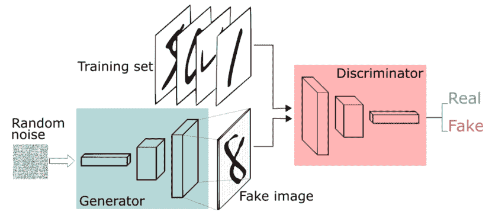
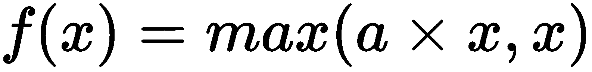
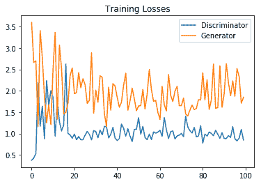
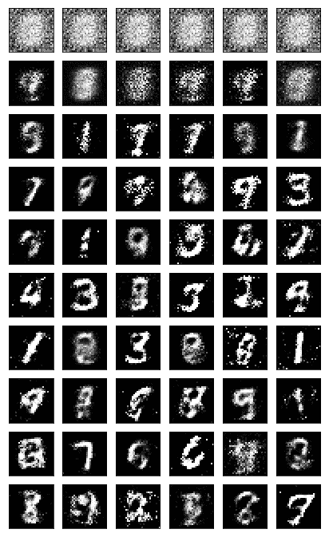

# 生成对抗网络

**生成对抗网络** ( **GANs** )是深度神经网络架构，由两个相互对抗的网络组成(因此得名**对抗**)。

2014 年，伊恩·古德菲勒和包括约舒阿·本吉奥在内的其他研究人员在蒙特利尔大学的一篇论文([https://arxiv.org/abs/1406.2661](https://arxiv.org/abs/1406.2661))中介绍了 gan。提到 GANs，脸书人工智能研究主任 Yann LeCun 称**对抗性训练**是过去 10 年机器学习中最有趣的想法。

GANs 的潜力是巨大的，因为它们可以学习模仿任何数据分布。也就是说，甘人可以被训练创造出与我们的世界在任何领域都极其相似的世界:图像、音乐、演讲或散文。他们在某种意义上是机器人艺术家，他们的作品令人印象深刻([https://www . nytimes . com/2017/08/14/arts/design/Google-how-ai-creates-new-music-and-new-artists-project-magenta . html](https://www.nytimes.com/2017/08/14/arts/design/google-how-ai-creates-new-music-and-new-artists-project-magenta.html))——也令人心酸。

本章将涵盖以下主题:

*   直观的介绍
*   GANs 的简单实现
*   深度卷积 GANs


# 直观的介绍

在本节中，我们将以非常直观的方式介绍 GANs。为了了解 GANs 是如何工作的，我们将采用一个获得一张聚会门票的假场景。

故事以某地正在举行的一个非常有趣的聚会或活动开始，你非常有兴趣参加。你很晚才听说这个活动，所有的票都卖完了，但你会想尽一切办法进入派对。所以你想出了一个主意！你会试着伪造一张需要和原来一模一样，或者非常非常相似的票。但是因为生活不容易，所以还有另一个挑战:你不知道原始的票是什么样的。所以从你参加这种聚会的经验来看，你开始想象票可能是什么样子，并开始根据你的想象来设计票。

你将尝试设计门票，然后去活动现场，向安保人员展示门票。希望他们会被说服，让你加入。但是你不想在保安面前多次露脸，所以你决定向你的朋友求助，他会把你对原始票的最初猜测拿给保安看。如果他们不让他进去，他会根据看到一些人拿着实际的票进去，为你提供一些关于票可能是什么样子的信息。你会根据你朋友的评论来细化罚单，直到保安让他进去。在这一点上——也只有在这一点上——你将设计另一个完全相同的外观，并让自己进去。

确实，想多了这个故事有多不切实际，但是 GANs 的工作方式和这个故事很像。GANs 现在非常流行，人们正在计算机视觉领域的许多应用中使用它们。

有许多有趣的应用可以使用 GANs，我们将实现并提到其中的一些。

在 GANs 中，有两个主要组件在许多计算机视觉领域取得了突破。第一个组件称为**发生器**，第二个组件称为**鉴别器**:

*   生成器将尝试从特定的概率分布中生成数据样本，这与试图复制活动门票的人非常相似
*   鉴别器将判断(就像试图在票证中寻找缺陷以确定它是原始还是伪造的安全人员一样)它的输入是来自原始训练集(原始票证)还是来自生成器部分(由试图复制原始票证的人员设计):



图 1:GANs-总体架构


# GANs 的简单实现

从假票到某活动的故事，甘斯的想法似乎很直观。因此，为了清楚地理解 GAN 如何工作以及如何实现它们，我们将在 MNIST 数据集上演示一个 GAN 的简单实现。

首先，我们需要构建 GAN 网络的核心，它由两个主要组件组成:生成器和鉴别器。我们说过，生成器会试图从特定的概率分布中想象或伪造数据样本；可以访问并看到实际数据样本的鉴别器将判断发生器的输出是否在设计上有任何缺陷，或者它是否非常接近原始数据样本。与事件的场景类似，生成器的整个目的是试图说服鉴别者，生成的图像来自真实的数据集，从而试图愚弄他。

训练过程有一个类似于事件故事的结尾；生成器将最终设法生成看起来与原始数据样本非常相似的图像:


图 2:MNIST 数据集的 GAN 通用架构

任何 GAN 的典型结构如图*图 2* 所示，将在 MNIST 数据集上进行训练。该图中的`Latent sample`部分是一个随机的想法或向量，生成器使用它来用假图像复制真实图像。

正如我们提到的，鉴别器作为一个法官工作，它会试图将真实的图像与生成器设计的虚假图像分开。所以这个网络的输出会是二进制的，可以用一个 sigmoid 函数来表示，0(表示输入是假图像)和 1(表示输入是真图像)。

让我们开始实施这一架构，看看它在 MNIST 数据集上的表现如何。

让我们从导入实现所需的库开始:

```
%matplotlib inline

import matplotlib.pyplot as plt
import pickle as pkl

import numpy as np
import tensorflow as tf
```

我们将使用 MNIST 数据集，因此我们将使用 TensorFlow 助手来获取数据集并将其存储在某个位置:

```
from tensorflow.examples.tutorials.mnist import input_data
mnist_dataset = input_data.read_data_sets('MNIST_data')
```

```
Output:
Extracting MNIST_data/train-images-idx3-ubyte.gz
Extracting MNIST_data/train-labels-idx1-ubyte.gz
Extracting MNIST_data/t10k-images-idx3-ubyte.gz
Extracting MNIST_data/t10k-labels-idx1-ubyte.gz
```


# 模型输入

在深入构建由生成器和鉴别器表示的 GAN 核心之前，我们将定义计算图的输入。如图*图 2* 所示，我们需要两个输入。第一个将是真实图像，它将被馈送到鉴别器。另一个输入被称为**潜在空间**，它将被馈送到生成器并用于生成其假图像:

```
# Defining the model input for the generator and discrimator
def inputs_placeholders(discrimator_real_dim, gen_z_dim):
    real_discrminator_input = tf.placeholder(tf.float32, (None, discrimator_real_dim), name="real_discrminator_input")
    generator_inputs_z = tf.placeholder(tf.float32, (None, gen_z_dim), name="generator_input_z")

    return real_discrminator_input, generator_inputs_z
```


图 3:MNIST GAN 实施的架构

现在是时候开始构建我们架构的两个核心组件了。我们将从构建发电机部分开始。如图*图 3* 所示，发生器将由至少一个隐藏层组成，它将作为一个近似器工作。此外，我们将使用一种称为泄漏 ReLU 的东西，而不是使用正常的 ReLU 激活函数。这将允许梯度值不受任何限制地流过图层(更多内容将在下一节介绍)。


# 变量作用域

变量作用域是 TensorFlow 的一个特性，它可以帮助我们完成以下任务:

*   确保我们有一些命名约定，以便稍后检索它们，例如，让它们以单词生成器或鉴别器开始，这将在网络训练期间帮助我们。我们本来可以使用名称范围特性，但是这个特性对我们的第二个目的没有帮助。
*   能够重用或重新训练相同的网络，但具有不同的输入。例如，我们将对生成器中的假图像进行采样，以查看生成器在复制原始图像方面有多好。此外，鉴别器将可以访问真实和虚假的图像，这将使我们在构建计算图时可以轻松地重用变量，而不是创建新的变量。

以下语句将展示如何使用 TensorFlow 的可变范围功能:

```
with tf.variable_scope('scopeName', reuse=False):
    # Write your code here
```

你可以在[https://www . tensor flow . org/programmers _ guide/variable _ scope # the _ problem](https://www.tensorflow.org/programmers_guide/variable_scope#the_problem)了解更多关于使用可变范围特性的好处。


# 泄漏 ReLU

我们提到，我们将使用一个不同于 ReLU 激活函数的版本，它被称为 leaky ReLU。传统版本的 ReLU 激活函数将只取输入值和零之间的最大值，通过其他方式将负值截断为零。Leaky ReLU 是我们将要使用的版本，它允许一些负值存在，因此得名 **leaky ReLU** 。

有时，如果我们使用传统的 ReLU 激活函数，网络会陷入一种流行的状态，称为垂死状态，这是因为网络对所有输出只产生零。

使用 leaky ReLU 的想法是通过允许一些负值通过来防止这种垂死状态。

让生成器工作的整个想法是从鉴别器接收梯度值，如果网络陷入垂死的境地，学习过程就不会发生。

下图说明了传统 ReLU 与其泄漏版本之间的差异:


图 4: ReLU 函数


图 5:泄漏的 ReLU 激活函数

TensorFlow 中没有实现 leaky ReLU 激活功能，需要我们自己实现。如果输入为正，则该激活函数的输出为正，如果输入为负，则该激活函数的输出为受控的负值。我们将通过一个名为 **alpha** 的参数来控制负值，该参数将通过允许一些负值通过来引入网络的容差。

下面的等式代表了我们将要实现的泄漏 ReLU:



# 发电机

MNIST 图像在 0 和 1 之间归一化，此时`sigmoid`激活功能可以发挥最佳作用。但是在实践中，我们发现`tanh`激活函数比其他任何函数都有更好的性能。因此，为了使用`tanh`激活功能，我们需要将这些图像的像素值范围调整到-1 到 1:

```
def generator(gen_z, gen_out_dim, num_hiddern_units=128, reuse_vars=False, leaky_relu_alpha=0.01):

    ''' Building the generator part of the network

        Function arguments
        ---------
        gen_z : the generator input tensor
        gen_out_dim : the output shape of the generator
        num_hiddern_units : Number of neurons/units in the hidden layer
        reuse_vars : Reuse variables with tf.variable_scope
        leaky_relu_alpha : leaky ReLU parameter

        Function Returns
        -------
        tanh_output, logits_layer: 
    '''
    with tf.variable_scope('generator', reuse=reuse_vars):

        # Defining the generator hidden layer
        hidden_layer_1 = tf.layers.dense(gen_z, num_hiddern_units, activation=None)

        # Feeding the output of hidden_layer_1 to leaky relu
        hidden_layer_1 = tf.maximum(hidden_layer_1, leaky_relu_alpha*hidden_layer_1)

        # Getting the logits and tanh layer output
        logits_layer = tf.layers.dense(hidden_layer_1, gen_out_dim, activation=None)
        tanh_output = tf.nn.tanh(logits_layer)

        return tanh_output, logits_layer
```

现在我们已经准备好了发电机部分。让我们继续定义网络的第二个组件。


# 鉴别器

接下来，我们将构建生成性对抗网络中的第二个主要组件，即鉴别器。鉴别器与生成器非常相似，但是我们将使用`sigmoid`激活函数，而不是使用`tanh`激活函数；它将产生一个二进制输出，代表鉴别器对输入图像的判断:

```
def discriminator(disc_input, num_hiddern_units=128, reuse_vars=False, leaky_relu_alpha=0.01):
    ''' Building the discriminator part of the network

        Function Arguments
        ---------
        disc_input : discrminator input tensor
        num_hiddern_units : Number of neurons/units in the hidden layer
        reuse_vars : Reuse variables with tf.variable_scope
        leaky_relu_alpha : leaky ReLU parameter

        Function Returns
        -------
        sigmoid_out, logits_layer: 
    '''
    with tf.variable_scope('discriminator', reuse=reuse_vars):

        # Defining the generator hidden layer
        hidden_layer_1 = tf.layers.dense(disc_input, num_hiddern_units, activation=None)

        # Feeding the output of hidden_layer_1 to leaky relu
        hidden_layer_1 = tf.maximum(hidden_layer_1, leaky_relu_alpha*hidden_layer_1)

        logits_layer = tf.layers.dense(hidden_layer_1, 1, activation=None)
        sigmoid_out = tf.nn.sigmoid(logits_layer)

        return sigmoid_out, logits_layer
```


# 构建 GAN 网络

在定义了构建生成器和鉴别器部分的主要函数之后，是时候将它们堆叠起来，并为这个实现定义模型损耗和优化器了。


# 模型超参数

我们可以通过更改以下一组超参数来微调 GANs:

```
# size of discriminator input image
#28 by 28 will flattened to be 784
input_img_size = 784 

# size of the generator latent vector
gen_z_size = 100

# number of hidden units for the generator and discriminator hidden layers
gen_hidden_size = 128
disc_hidden_size = 128

#leaky ReLU alpha parameter which controls the leak of the function
leaky_relu_alpha = 0.01

# smoothness of the label 
label_smooth = 0.1
```


# 定义生成器和鉴别器

在定义了我们的架构的两个主要部分之后，这两个部分将用于生成假的 MNIST 图像(看起来与真的图像完全一样)，现在是时候使用我们到目前为止定义的函数来构建网络了。为了构建网络，我们将遵循以下步骤:

1.  为我们的模型定义输入，它将由两个变量组成。这些变量中的一个是将被馈送到鉴别器的真实图像，第二个是生成器用来复制原始图像的潜在空间。
2.  调用已定义的生成器函数来构建网络的生成器部分。
3.  调用定义的鉴别器函数来构建网络的鉴别器部分，但是我们要调用这个函数两次。一个调用是对真实数据的调用，第二个调用是对来自生成器的虚假数据的调用。
4.  通过重用变量来保持真实和虚假图像的权重相同:

```
tf.reset_default_graph()

# creating the input placeholders for the discrminator and generator
real_discrminator_input, generator_input_z = inputs_placeholders(input_img_size, gen_z_size)

#Create the generator network
gen_model, gen_logits = generator(generator_input_z, input_img_size, gen_hidden_size, reuse_vars=False, leaky_relu_alpha=leaky_relu_alpha)

# gen_model is the output of the generator
#Create the generator network
disc_model_real, disc_logits_real = discriminator(real_discrminator_input, disc_hidden_size, reuse_vars=False, leaky_relu_alpha=leaky_relu_alpha)
disc_model_fake, disc_logits_fake = discriminator(gen_model, disc_hidden_size, reuse_vars=True, leaky_relu_alpha=leaky_relu_alpha)
```


# 鉴频器和发电机损耗

在这一部分，我们需要定义鉴频器和发电机损耗，这可能是实现中最棘手的部分。

我们知道生成器试图复制原始图像，鉴别器作为一个法官工作，接收来自生成器的图像和原始输入图像。因此，在设计每个零件的损耗时，我们需要针对两件事。

首先，我们需要网络的鉴别器部分能够区分生成器生成的假图像和来自原始训练样本的真实图像。在训练期间，我们将把一批分为两类的产品送入鉴别器部分。第一类是原始输入的图像，第二类是生成器生成的假图像。

所以鉴别器的最终总损失将是它接受真的为真的和检测假的为假的能力的总和；那么最终的总损失将是:


```
tf.reduce_mean(tf.nn.sigmoid_cross_entropy_with_logits(logits=logits_layer, labels=labels))
```

因此，我们需要计算两个损耗，以得出最终的鉴频器损耗。

第一个损失`disc_loss_real`将基于我们将从鉴别器和`labels`获得的`logits`值来计算，在这种情况下，它们都是 1，因为我们知道这个小批量中的所有图像都来自 MNIST 数据集的真实输入图像。为了增强模型在测试集上的概括能力并给出更好的结果，人们发现实际上将值 1 改变为 0.9 更好。这种对标签的改变引入了一种叫做**标签平滑**的东西:

```
 labels = tf.ones_like(tensor) * (1 - smooth)
```

对于鉴别器损失的第二部分，即鉴别器检测伪图像的能力，损失将在我们将从鉴别器和标签获得的 logits 值之间；所有这些都是零，因为我们知道这个小批量中的所有图像都来自生成器，而不是来自原始输入。

既然我们已经讨论了鉴频器损耗，我们还需要计算发电机损耗。发生器损耗将被称为`gen_loss`，它将是`disc_logits_fake`(伪图像鉴别器的输出)和标签(由于发生器试图用其伪图像的设计来说服鉴别器，所以标签将全部为 1)之间的损耗:

```

# calculating the losses of the discrimnator and generator
disc_labels_real = tf.ones_like(disc_logits_real) * (1 - label_smooth)
disc_labels_fake = tf.zeros_like(disc_logits_fake)

disc_loss_real = tf.nn.sigmoid_cross_entropy_with_logits(labels=disc_labels_real, logits=disc_logits_real)
disc_loss_fake = tf.nn.sigmoid_cross_entropy_with_logits(labels=disc_labels_fake, logits=disc_logits_fake)

#averaging the disc loss
disc_loss = tf.reduce_mean(disc_loss_real + disc_loss_fake)

#averaging the gen loss
gen_loss = tf.reduce_mean(
    tf.nn.sigmoid_cross_entropy_with_logits(
        labels=tf.ones_like(disc_logits_fake), 
        logits=disc_logits_fake))
```


# 优化者

最后，优化部分！在本节中，我们将定义在培训过程中使用的优化标准。首先，我们将分别更新生成器和鉴别器的变量，因此我们需要能够检索每个部分的变量。

对于第一个优化器，generator one，我们将从计算图的可训练变量中检索所有以名称`generator`开始的变量；然后我们可以通过引用它的名字来检查哪个变量是哪个。

我们也将对鉴别器变量做同样的事情，让所有以`discriminator`开头的变量进入。之后，我们可以将希望优化的变量列表传递给优化器。

TensorFlow 的变量范围特性使我们能够检索以某个字符串开头的变量，然后我们可以有两个不同的变量列表，一个用于生成器，另一个用于鉴别器:

```

# building the model optimizer

learning_rate = 0.002

# Getting the trainable_variables of the computational graph, split into Generator and Discrimnator parts
trainable_vars = tf.trainable_variables()
gen_vars = [var for var in trainable_vars if var.name.startswith("generator")]
disc_vars = [var for var in trainable_vars if var.name.startswith("discriminator")]

disc_train_optimizer = tf.train.AdamOptimizer().minimize(disc_loss, var_list=disc_vars)
gen_train_optimizer = tf.train.AdamOptimizer().minimize(gen_loss, var_list=gen_vars)
```


# 模特培训

现在让我们开始训练过程，看看 GANs 将如何设法生成类似于 MNIST 的图像:

```
train_batch_size = 100
num_epochs = 100
generated_samples = []
model_losses = []

saver = tf.train.Saver(var_list = gen_vars)

with tf.Session() as sess:
    sess.run(tf.global_variables_initializer())

    for e in range(num_epochs):
        for ii in range(mnist_dataset.train.num_examples//train_batch_size):
            input_batch = mnist_dataset.train.next_batch(train_batch_size)

            # Get images, reshape and rescale to pass to D
            input_batch_images = input_batch[0].reshape((train_batch_size, 784))
            input_batch_images = input_batch_images*2 - 1

            # Sample random noise for G
            gen_batch_z = np.random.uniform(-1, 1, size=(train_batch_size, gen_z_size))

            # Run optimizers
            _ = sess.run(disc_train_optimizer, feed_dict={real_discrminator_input: input_batch_images, generator_input_z: gen_batch_z})
            _ = sess.run(gen_train_optimizer, feed_dict={generator_input_z: gen_batch_z})

        # At the end of each epoch, get the losses and print them out
        train_loss_disc = sess.run(disc_loss, {generator_input_z: gen_batch_z, real_discrminator_input: input_batch_images})
        train_loss_gen = gen_loss.eval({generator_input_z: gen_batch_z})

        print("Epoch {}/{}...".format(e+1, num_epochs),
              "Disc Loss: {:.3f}...".format(train_loss_disc),
              "Gen Loss: {:.3f}".format(train_loss_gen)) 

        # Save losses to view after training
        model_losses.append((train_loss_disc, train_loss_gen))

        # Sample from generator as we're training for viegenerator_inputs_zwing afterwards
        gen_sample_z = np.random.uniform(-1, 1, size=(16, gen_z_size))
        generator_samples = sess.run(
                       generator(generator_input_z, input_img_size, reuse_vars=True),
                       feed_dict={generator_input_z: gen_sample_z})

        generated_samples.append(generator_samples)
        saver.save(sess, './checkpoints/generator_ck.ckpt')

# Save training generator samples
with open('train_generator_samples.pkl', 'wb') as f:
    pkl.dump(generated_samples, f)
```

```
Output:
.
.
.
Epoch 71/100... Disc Loss: 1.078... Gen Loss: 1.361
Epoch 72/100... Disc Loss: 1.037... Gen Loss: 1.555
Epoch 73/100... Disc Loss: 1.194... Gen Loss: 1.297
Epoch 74/100... Disc Loss: 1.120... Gen Loss: 1.730
Epoch 75/100... Disc Loss: 1.184... Gen Loss: 1.425
Epoch 76/100... Disc Loss: 1.054... Gen Loss: 1.534
Epoch 77/100... Disc Loss: 1.457... Gen Loss: 0.971
Epoch 78/100... Disc Loss: 0.973... Gen Loss: 1.688
Epoch 79/100... Disc Loss: 1.324... Gen Loss: 1.370
Epoch 80/100... Disc Loss: 1.178... Gen Loss: 1.710
Epoch 81/100... Disc Loss: 1.070... Gen Loss: 1.649
Epoch 82/100... Disc Loss: 1.070... Gen Loss: 1.530
Epoch 83/100... Disc Loss: 1.117... Gen Loss: 1.705
Epoch 84/100... Disc Loss: 1.042... Gen Loss: 2.210
Epoch 85/100... Disc Loss: 1.152... Gen Loss: 1.260
Epoch 86/100... Disc Loss: 1.327... Gen Loss: 1.312
Epoch 87/100... Disc Loss: 1.069... Gen Loss: 1.759
Epoch 88/100... Disc Loss: 1.001... Gen Loss: 1.400
Epoch 89/100... Disc Loss: 1.215... Gen Loss: 1.448
Epoch 90/100... Disc Loss: 1.108... Gen Loss: 1.342
Epoch 91/100... Disc Loss: 1.227... Gen Loss: 1.468
Epoch 92/100... Disc Loss: 1.190... Gen Loss: 1.328
Epoch 93/100... Disc Loss: 0.869... Gen Loss: 1.857
Epoch 94/100... Disc Loss: 0.946... Gen Loss: 1.740
Epoch 95/100... Disc Loss: 0.925... Gen Loss: 1.708
Epoch 96/100... Disc Loss: 1.067... Gen Loss: 1.427
Epoch 97/100... Disc Loss: 1.099... Gen Loss: 1.573
Epoch 98/100... Disc Loss: 0.972... Gen Loss: 1.884
Epoch 99/100... Disc Loss: 1.292... Gen Loss: 1.610
Epoch 100/100... Disc Loss: 1.103... Gen Loss: 1.736
```

在运行模型 100 个时期后，我们有了一个经过训练的模型，它将能够生成与我们提供给鉴别器的原始输入图像相似的图像:

```
fig, ax = plt.subplots()
model_losses = np.array(model_losses)
plt.plot(model_losses.T[0], label='Disc loss')
plt.plot(model_losses.T[1], label='Gen loss')
plt.title("Model Losses")
plt.legend()
```

输出:



图 6:鉴频器和发电机损耗

如上图所示，您可以看到由鉴频器和发生器线表示的模型损耗正在收敛。


# 来自培训的生成器样本

让我们测试模型的性能，甚至看看在培训过程接近尾声时，生成器的生成技能(设计活动门票)是如何得到增强的:

```
def view_generated_samples(epoch_num, g_samples):
    fig, axes = plt.subplots(figsize=(7,7), nrows=4, ncols=4, sharey=True, sharex=True)

    print(gen_samples[epoch_num][1].shape)

    for ax, gen_image in zip(axes.flatten(), g_samples[0][epoch_num]):
        ax.xaxis.set_visible(False)
        ax.yaxis.set_visible(False)
        img = ax.imshow(gen_image.reshape((28,28)), cmap='Greys_r')

    return fig, axes

```

在绘制来自训练过程中最后一个时期的一些生成图像之前，我们需要加载包含训练过程中每个时期生成的样本的持久化文件:

```
# Load samples from generator taken while training
with open('train_generator_samples.pkl', 'rb') as f:
    gen_samples = pkl.load(f)
```

现在，让我们绘制从训练过程的最后一个时期生成的 16 幅图像，并查看生成器如何能够生成有意义的数字，如 3、7 和 2:

```
_ = view_generated_samples(-1, gen_samples)
```


图 7:来自最终训练时期的样本

我们甚至可以看到不同时代的发电机设计技巧。让我们想象一下它每 10 个时期产生的图像:

```
rows, cols = 10, 6
fig, axes = plt.subplots(figsize=(7,12), nrows=rows, ncols=cols, sharex=True, sharey=True)

for gen_sample, ax_row in zip(gen_samples[::int(len(gen_samples)/rows)], axes):
    for image, ax in zip(gen_sample[::int(len(gen_sample)/cols)], ax_row):
        ax.imshow(image.reshape((28,28)), cmap='Greys_r')
        ax.xaxis.set_visible(False)
        ax.yaxis.set_visible(False)
```



图 8:网络训练时生成的图像，每 10 个时期

正如你所看到的，生成器的设计技巧和它生成假图像的能力在一开始是非常有限的，然后在训练过程的最后得到了增强。


# 从发电机取样

在上一节中，我们介绍了在这种 GAN 架构的培训过程中产生的一些示例。我们还可以从生成器生成全新的图像，方法是加载我们保存的检查点，并为生成器提供一个新的潜在空间，它可以使用该空间来生成新的图像:

```
# Sampling from the generator
saver = tf.train.Saver(var_list=g_vars)

with tf.Session() as sess:

    #restoring the saved checkpints
    saver.restore(sess, tf.train.latest_checkpoint('checkpoints'))
    gen_sample_z = np.random.uniform(-1, 1, size=(16, z_size))
    generated_samples = sess.run(
                   generator(generator_input_z, input_img_size, reuse_vars=True),
                   feed_dict={generator_input_z: gen_sample_z})
view_generated_samples(0, [generated_samples])
```


图 9:来自生成器的样本

在实现这个示例时，您可以得出一些观察结果。在训练过程的第一个时期，生成器没有任何技能来生成与真实图像相似的图像，因为它不知道它们看起来像什么。即使是鉴别者也不知道如何区分由生成器和。在训练开始时，会出现两种有趣的情况。首先，生成器不知道如何创建像我们最初提供给网络的真实图像那样的图像。第二，鉴别者不知道真假图像的区别。

稍后，生成器开始伪造在某种程度上有意义的图像，这是因为生成器将了解原始输入图像来自的数据分布。与此同时，鉴别器将能够区分真假图像，并在训练过程结束时被愚弄。


# 摘要

如今，gan 正被用于许多有趣的应用。GANs 可用于不同的设置，如半监督和非监督任务。此外，由于大量研究人员在研究 GANs，这些模型每天都在进步，它们生成图像或视频的能力也越来越好。

这些类型的模型可以用于许多有趣的商业应用，例如在 Photoshop 中添加一个插件，可以接受像`make my smile more appealing`这样的命令。它们也可以用于图像去噪。