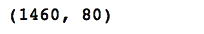
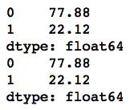
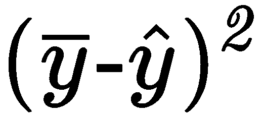
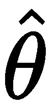
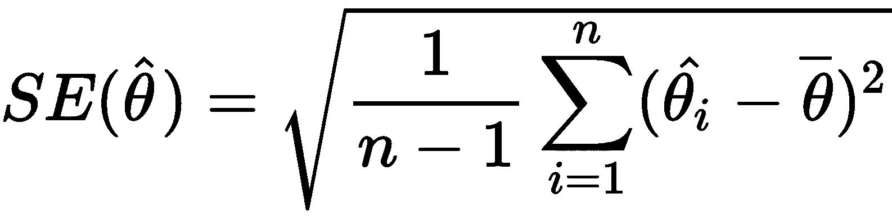
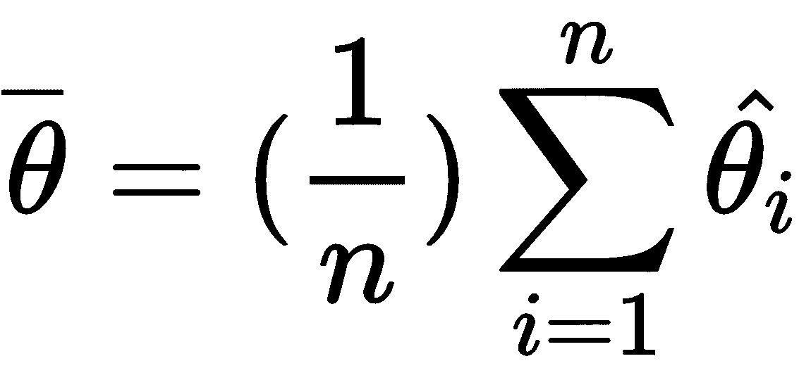
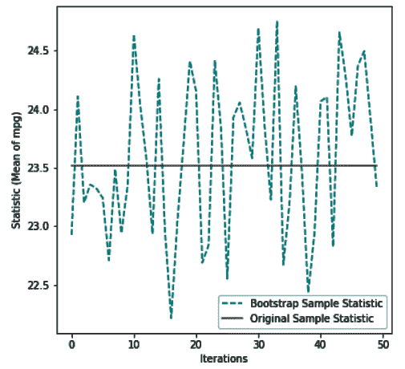

<title>Resampling Methods</title>  

# 重采样方法

在这一章中，我们将介绍抽样的基本概念。我们还将了解重采样及其重要性。

抽样是从总体中选择一个观察值子集的过程，目的是估计总体的某些参数。另一方面，重采样方法被用于改进总体参数的估计。

在本章中，我们将介绍以下配方:

*   取样介绍
*   k 折留一交叉验证
*   自助抽样

<title>Introduction to sampling</title>  

# 取样介绍

采样技术可以大致分为非概率采样技术和概率采样技术。非概率抽样技术是基于用户的判断，而在概率抽样中，观察值是随机选择的。

概率抽样通常包括**简单随机抽样(SRS)** 、分层抽样和系统抽样:

*   **SRS** :在 SRS 中，总体中的每个观察值被选作样本的概率相等。
*   **分层抽样**:在分层抽样中，人口数据被分成单独的组，称为**阶层**。然后从每组中抽取一个概率样本。
*   **系统抽样**:在这种方法中，通过定期选择观察值从总体中抽取一个样本。

如果样本太小或太大，可能会导致不正确的结果。出于这个原因，我们得到正确的样本量是很重要的。设计良好的样本有助于识别可能扭曲预期结果的准确性和可靠性的偏差因素。

由于各种原因，我们的样品可能会出现误差。例如，由于随机采样，可能会出现误差，这被称为**采样误差**，或者由于绘制观察结果的方法导致样本偏斜，这被称为**样本偏差**。

<title>Getting ready</title>  

# 做好准备

在第 1 章、*的*、*、*中，我们操作并准备了来自`HousePrices.csv`文件的数据，并处理了缺失值。在本例中，我们将使用最终数据集来演示这些采样和重采样技术。

您可以从 GitHub 获得准备好的数据集。

我们将导入所需的库。我们将读取数据并查看数据集的维度:

```
# import os for operating system dependent functionalities
import os

# import other required libraries
import pandas as pd
from sklearn.model_selection import train_test_split

# Set your working directory according to your requirement
os.chdir(".../Chapter 3/Resampling Methods")
os.getcwd()
```

让我们读一下我们的数据。我们将在数据帧名称前加上前缀`df_`以便于理解:

```
df_housingdata = pd.read_csv("Final_HousePrices.csv")
```

在下一节中，我们将看看如何使用来自`sklean.model_selection`的`train_test_split()`将我们的数据分成随机的训练和测试子集。

<title>How to do it...</title>  

# 怎么做...

现在我们已经阅读了数据集，让我们看看如何进行采样:

1.  我们检查数据帧的尺寸，如下所示:

```
df_housingdata.shape
```

我们可以看到数据帧的维度:



2.  然后，我们查看我们的数据帧是否有任何缺失值:

```
df_housingdata.isnull().sum()
```

我们注意到在`df_housingdata`中没有丢失的值

3.  我们将预测变量和响应变量分成两个不同的数据框架，如下所示:

```
# create feature & response variables
X = df_housingdata.iloc[:,0:79]
Y = df_housingdata['SalePrice']
```

4.  我们使用`train_test_split()`将预测器和响应数据集分成训练和测试子集:

```
# Create train & test sets
X_train, X_test, Y_train, Y_test = train_test_split(X, Y, train_size=0.7, test_size=0.3)
```

5.  我们可以找到每个子集中的观察值和列数，如下所示:

```
print(X_train.shape)
print(Y_train.shape)
print(X_test.shape)
print(Y_test.shape)
```

我们可以看到，70%的数据分配给了训练数据集，30%分配给了测试数据集:


<title>How it works...</title>  

# 它是如何工作的...

在*步骤 1* 和*步骤 2* 中，我们查看了数据帧的维度，发现我们的数据集没有缺失值。在*步骤 3* 中，我们分离出特征和响应变量。在*步骤 4* 中，我们使用`sklearn.model_selection`中的`train_test_split()`函数来分割我们的数据，并创建训练和测试子集。注意，我们传递了两个参数，`train_size`和`test_size`，并将值分别设置为`0.7`和`0.3`。`train_size`和`test_size`可以取 0.0 到 1.0 之间的值，代表数据集分配给各自的比例。如果提供了整数值，则该数字表示观察的绝对数量。

我们可以选择不提供这两个参数中的任何一个，即`train_size`或`test_size`。如果我们将`train_size`的值设置为`None`或者我们根本不提供它，该值会自动设置为补充测试大小。类似地，如果未指定`test_size`或我们将其值设置为`None`，该值将自动设置为补充列车尺寸。

在*步骤 5* 中，我们查看了由`train_test_split()`函数创建的子集的形状。

<title>There's more...</title>  

# 还有更多...

在本例中，我们将使用一个数据集来测量一个二分分类目标变量。重要的是要理解，在训练和测试子集中，我们的两类目标变量的分布是相似的:

1.  我们从读取数据集并查看其维度开始:

```
df_creditcarddata = pd.read_csv("creditcarddefault.csv")
df_creditcarddata.shape
```

我们有 30，000 个观察值和 25 个变量。最后一个变量，下个月的默认付款，是我们的目标变量，它的值或者是 *0* 或者是 *1* 。

2.  我们将数据分为一个功能集和一个响应变量，并使用以下代码将其分为训练和测试子集:

```
# create feature & response set
X = df_creditcarddata.iloc[:,0:24]
Y = df_creditcarddata['default payment next month']

# Create train & test sets
X_train, X_test, Y_train, Y_test = train_test_split(X, Y, train_size=0.7, test_size=0.3, stratify=Y)
```

注意，这一次，我们在`train_test_split()`函数中使用了一个参数`stratify`。`stratify`参数进行分割，以便产生的样本中值的比例等于提供给它的变量中值的比例。还要注意，我们已经将响应变量`Y`赋给了`stratify`参数。

我们现在可以看到我们的二分类在训练和测试子集的目标变量中的分布:

```
print(pd.value_counts(Y_train.values)*100/Y_train.shape)
print(pd.value_counts(Y_test.values)*100/Y_test.shape)
```

在下面的输出中，我们可以看到两个子集中两个类的分布是相同的:



我们还可以将另一个参数`shuffle`传递给`train_test_split()`。这需要一个布尔值，`True`或`False`，来指示在分割数据之前是否要对其进行洗牌。如果`shuffle=False`，那么`stratify`一定是`None`。

<title>See also</title>  

# 请参见

*   sci kit-学习指南`sklearn.model_selection`:[https://bit.ly/2px08Ii](https://bit.ly/2px08Ii)

<title>k-fold and leave-one-out cross-validation</title>  

# k 折留一交叉验证

当机器学习模型应用于看不见的数据进行预测时，它们经常面临泛化的问题。为了避免这个问题，不使用完整的数据集来训练模型。相反，数据集被分成训练和测试子集。该模型根据训练数据进行训练，并根据测试集进行评估，这在训练过程中是看不到的。这是交叉验证背后的基本思想。

最简单的交叉验证是维持法，我们在前面的配方*采样介绍*中看到过。在维持方法中，当我们将数据分成训练和测试子集时，由于数据的高维数，测试集可能与训练集不太相似。这可能会导致结果不稳定。出于这个原因，我们高效地对数据进行采样是非常重要的。我们可以使用其他交叉验证方法来解决这个问题，如**留一交叉验证** ( **LOOCV** )或 **k 重交叉验证** ( **k 重 CV** )。

k-fold CV 是一种广泛使用的方法，用于估计测试误差。具有 *N* 个观测值的原始数据集被分成 *K* 个子集，并且保持方法被重复 *K* 次。在每次迭代中， *K-1 个*子集作为训练集，其余作为测试集。误差计算如下:


在 LOOCV，子集的数量 *K* 等于数据集中的观测值数量 *N* 。LOOCV 使用原始数据集中的一个观察值作为验证集，剩余的 *N-1* 个观察值作为训练集。这被迭代 *N* 次，因此样本中的每个观察值被用作每次迭代中的验证数据。这与 K 倍 CV 相同，其中 *K* 等于 *N* ，即集合中的数据点数。由于需要大量的迭代，LOOCV 通常需要大量的计算能力。

在 LOOCV，每个折叠的估计值是高度相关的，它们的平均值可能有很高的方差。

对测试误差的估计是基于单次观察，表示为 *MSE =* 。我们可以计算所有褶皱的平均均方差，如下所示:


这个计算和 k 倍 CV 中涉及的计算没什么区别。我们将使用 scikit-learn 库来看看诸如 k-fold CV 和 LOOCV 这样的技术是如何实现的。

<title>Getting ready</title>  

# 做好准备

在下面的代码块中，我们可以看到如何导入所需的库:

```
import pandas as pd

from sklearn.model_selection import train_test_split
from sklearn.linear_model import LinearRegression
from sklearn.metrics import mean_squared_error, r2_score
from sklearn.model_selection import KFold 
import matplotlib.pyplot as plt
```

我们读取数据，将特征和响应变量分开:

```
# Let's read our data. 
df_autodata = pd.read_csv("autompg.csv")

# Fill NAs with the median value
df_autodata['horsepower'].fillna(df_autodata['horsepower'].median(), inplace=True)

# Drop carname variable
df_autodata.drop(['carname'], axis=1, inplace=True)

X = df_autodata.iloc[:,1:8]
Y = df_autodata.iloc[:,0]
X=np.array(X)
Y=np.array(Y)
```

<title>How to do it...</title>  

# 怎么做...

k-folds 交叉验证器为我们提供了训练和测试索引，以便将数据分成训练和测试子集:

1.  我们将把数据集分成 *K 个*连续的折叠(默认情况下没有洗牌)，其中 *K=10* :

```
kfoldcv = KFold(n_splits=10)
kf_ytests = []
kf_predictedvalues = []
mean_mse = 0.0

for train_index, test_index in kfoldcv.split(X):
    X_train, X_test = X[train_index], X[test_index] 
    Y_train, Y_test = Y[train_index], Y[test_index]

    model = LinearRegression()
    model.fit(X_train, Y_train) 
    Y_pred = model.predict(X_test)

    # there is only one y-test and y-pred per iteration over the kfoldcv.split, 
    # so we append them to the respective lists.

    kf_ytests += list(Y_test)
    kf_predictedvalues += list(Y_pred)
    mse = mean_squared_error(kf_ytests, kf_predictedvalues)
    r2score = r2_score(kf_ytests, kf_predictedvalues)
    print("R^2: {:.2f}, MSE: {:.2f}".format(r2score, mse))
    mean_mse += mse   
```

2.  我们可以使用`r2_score()`来查看我们的决定系数，使用`mse()`来查看均方差:

```
print("Average CV Score :" ,mean_mse/10) 
```

上述代码的结果如下:


3.  我们根据响应变量的实际值绘制预测值:

```
## Let us plot the model
plt.scatter(kf_ytests, kf_predictedvalues)
plt.xlabel('Reported mpg')
plt.ylabel('Predicted mpg')
```

上述代码生成的图如下:


<title>How it works...</title>  

# 它是如何工作的...

在*步骤 1* 中，k-fold 交叉验证器将数据集分成 *K* 个连续的折叠，其中 *K* =10。k-fold 交叉验证器为我们提供了训练和测试索引，然后将数据分成训练和测试子集。在*步骤* 2 中，我们使用`r2_score()`查看了决定系数，使用`mse()`查看了均方差。决定系数和均方差分别为 79%和 12.85。在*步骤 3* 中，我们绘制了响应变量`mpg`的预测值和实际值。

<title>There's more...</title>  

# 还有更多...

我们现在用`sklearn.model_selection`中的`LeaveOneOut`对 LOOCV 做同样的练习:

1.  我们将再次读取数据，并将其分为特征和响应集:

```
# Let's read our data. 
df_autodata = pd.read_csv("autompg.csv")

# Fill NAs with the median value
df_autodata['horsepower'].fillna(df_autodata['horsepower'].median(), inplace=True)

# Drop carname variable
df_autodata.drop(['carname'], axis=1, inplace=True)

X = df_autodata.iloc[:,1:8]
Y = df_autodata.iloc[:,0]
X=np.array(X)
Y=np.array(Y)
```

2.  我们用 LOOCV 来建立我们的模型:

```
from sklearn.model_selection import LeaveOneOut 
loocv = LeaveOneOut()

loo_ytests = []
loo_predictedvalues = []
mean_mse = 0.0

for train_index, test_index in loocv.split(X):
    # the below requires arrays. So we converted the dataframes to arrays
    X_train, X_test = X[train_index], X[test_index] 
    Y_train, Y_test = Y[train_index], Y[test_index]

    model = LinearRegression()
    model.fit(X_train, Y_train) 
    Y_pred = model.predict(X_test)

    # there is only one y-test and y-pred per iteration over the loo.split, 
    # so we append them to the respective lists.

    loo_ytests += list(Y_test)
    loo_predictedvalues += list(Y_pred)

    mse = mean_squared_error(loo_ytests, loo_predictedvalues)
    r2score = r2_score(loo_ytests, loo_predictedvalues)
    print("R^2: {:.2f}, MSE: {:.2f}".format(r2score, mse))
    mean_mse += mse 
```

3.  我们可以使用`r2_score()`查看我们的决定系数，使用`mse()`查看均方差:

```
print("Average CV Score :" ,mean_mse/X.shape[0]) 
```

我们可以看看 LOOCV 结果的决定系数和均方误差:


4.  我们可以根据响应变量的实际值绘制预测值:

```
## Let us plot the model
plt.scatter(kf_ytests, kf_predictedvalues)
plt.xlabel('Reported mpg')
plt.ylabel('Predicted mpg')
```

由上述代码生成的图给出了以下输出:


在 LOOCV，拆分方法没有随机性，所以它总是给你提供相同的结果。

分层 k-fold CV 方法常用于分类问题。这是返回分层褶皱的 k-fold CV 方法的变体。每个数据集包含的每个目标类的样本百分比与原始数据集相似。`startifiedShuffleSplit`是洗牌拆分的一种变体，它通过为每个目标职业保持相同的百分比来创建拆分。

<title>See also</title>  

# 请参见

*   其他交叉验证方法的 scikit-learn 指南:[https://bit.ly/2px08Ii](https://bit.ly/2px08Ii)

<title>Bootstrapping</title>  

# 拔靴带

Bootstrapping 基于刀切法，该方法由 Quenouille 在 1949 年提出，然后由 Tukey 在 1958 年完善。刀切法用于检验假设和估计置信区间。它是通过在忽略每个观察值后计算估计值，然后计算这些计算值的平均值而得到的。对于大小为 *N* 的样本，重叠估计值可以通过合计每个 *N-1* 大小的子样本的估计值得到。它类似于 bootstrap 样本，但是 bootstrap 方法是带替换的采样，而刀切方法是不带替换的采样。

Bootstrapping 是一种强大的非参数重采样技术，用于评估估计量的不确定性。在自举中，从一个原始样本中重复抽取大量相同大小的样本。这允许给定的观察结果包含在多个样本中，这被称为**替换采样**。在 bootstrap 方法中， *n* 个样本是通过替换采样从原始数据中创建的。每个样本的大小都一样。 *n* 越大，样本集就越接近理想的引导样本。

“bootstrapping 的本质是这样一种思想，即在缺乏关于总体的任何其他知识的情况下，从总体中大小为 n 的随机样本中找到的值的分布是总体中分布的最佳指南。因此，为了估计如果对总体进行重新采样会发生什么，对样本进行重新采样是明智的。换句话说，由 n 个观测样本值组成的无限总体，每个样本值的概率为 1/n，用于对未知的真实总体进行建模。”

布莱恩·f·j·曼利

引导示例的图示如下:


正如我们在上图中看到的，在 **S1** 子集中的一些数据点也出现在 **S2** 和 **S4** 中。

假设我们有来自原始样本的 *n* 个引导样本。表示 *n* 个自助样本的估计值，其中 *i=1，2，3...，n* 。如果表示原始样本的参数估计值，则的标准误差如下所示:



给出如下:



是跨越 *n 个*引导样本的估计值的平均值。

<title>Getting ready</title>  

# 做好准备

我们需要像往常一样导入所需的库。这一次，我们将使用来自`sklean.utils`的`resample`类，这是我们以前没有使用过的:

```
import pandas as pd
import numpy as np

from sklearn.model_selection import train_test_split
from sklearn.linear_model import SGDRegressor
from sklearn.metrics import mean_squared_error, r2_score
import matplotlib.pyplot as plt

from sklearn.utils import resample
```

我们加载数据，并用`horsepower`变量的中值填充缺失值。我们还删除了`carname`变量:

```
# Let's read our data. We prefix the data frame name with "df_" for easier understanding.
df_autodata = pd.read_csv("autompg.csv")
df_autodata['horsepower'].fillna(df_autodata['horsepower'].median(), inplace=True)
df_autodata.drop(['carname'], axis=1, inplace=True)
```

<title>How to do it...</title>  

# 怎么做...

现在我们已经读取了数据，让我们看看如何执行自举采样:

1.  我们编写一个自定义函数`create_bootstrap_oob()`，它将一个数据帧作为参数，并使用`sklearn.utils`中的`resample()`函数创建一个包含 100 个观察值的引导样本:

```
# This custom function takes a dataframe as an argument
def create_bootstrap_oob(df):
    global df_OOB
    global df_bootstrap_sample 

    # creating the bootstrap sample
    df_bootstrap_sample = resample(df, replace=True, n_samples=100)

    # creating the OOB sample 
    bootstrap_sample_index = tuple(df_bootstrap_sample.index)
    bootstrap_df = df.index.isin(bootstrap_sample_index)
    df_OOB = df[~bootstrap_df]
```

2.  我们循环 50 次迭代，并通过传递`df_autodata`数据帧来调用自定义函数。我们获取每个 bootstrap 样本的`mpg`变量的平均值，我们将根据原始数据框架中`mpg`变量的平均值(即`df_autodata`)对其进行测量:

```
iteration=50
bootstap_statistics=list()
originalsample_statistics=list()

for i in range(iteration):
    # Call custom function create_bootstrap_oob(). Pass df_autodata
    create_bootstrap_oob(df_autodata)

    # Capture mean value of mpg variable for all bootstrap samples
    bootstap_statistics.append(df_bootstrap_sample.iloc[:,0].mean())

    originalsample_statistics.append(df_autodata['mpg'].mean())
```

3.  我们绘制了每次迭代的`mpg`变量的平均值，考虑了一个单独的引导样本。我们在每次迭代中获取每个引导样本的`mpg`变量的平均值:

```
import matplotlib.pyplot as plt
f, ax= plt.subplots(figsize=(6,6))

plt.plot(bootstap_statistics, 'c--', label='Bootstrap Sample Statistic')
plt.plot(originalsample_statistics, 'grey', label='Original Sample Statistic')
plt.xlabel('Iterations')
plt.ylabel('Statistic (Mean of mpg)')
plt.legend(loc=4)
plt.show()
```

最后，我们绘制出每次迭代的`mpg`变量的平均值，如下图所示:



<title>How it works...</title>  

# 它是如何工作的...

在*步骤 1* 中，我们创建了一个定制函数`create_bootstrap_oob( )`，并使用`sklearn.utils`中的`resample()`函数创建了一个有 100 个观察值的 bootstrap 样本。`create_bootstrap_oob( )`自定义函数将数据帧作为输入参数，并创建自举和**随机** ( **OOB** )样本。

我们提到过 bootstrap 抽样是有替换的抽样。这意味着任何给定的观察值都可以在单个样本中出现多次。

在*步骤 2* 中，我们循环了 50 次迭代，并通过传递`df_autoframe`调用了`create_bootstrap_oob( )`自定义函数。我们获取了每个引导样本的`mpg`变量的平均值。在*步骤 3* 中，我们考虑了每次迭代的独立引导样本。我们获取了每次迭代的`mpg`变量的平均值，然后绘制了每次迭代的`mpg`变量的平均值。

<title>See also</title>  

# 请参见

*   sci kit-学习指南`sklearn.cross_validation.Bootstrap`:[https://bit.ly/2RC5MYv](https://bit.ly/2RC5MYv)