# 统计和机器学习算法

在本章中，我们将介绍以下配方:

*   多元线性回归
*   逻辑回归
*   朴素贝叶斯
*   决策树
*   支持向量机


# 技术要求

本章的技术要求与我们在[第 1 章](2dbc8735-7eef-42ba-8b19-5644632c3197.xhtml)中详述的相同，*更接近您的数据*。

访问 GitHub 存储库以获取数据集和代码。这些是按照章节和主题的名称排列的。例如，对于线性回归数据集和代码，请访问`.../Chapter 3/Linear regression`。


# 多元线性回归

多元线性回归是一种用于训练线性模型的技术，它假设多个预测变量()和一个连续目标变量()之间存在线性关系。具有 m 个预测变量的多元线性回归的一般方程如下:

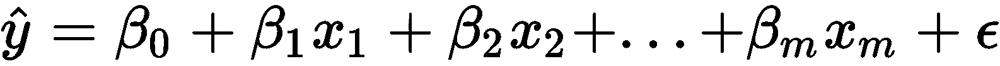


训练线性回归模型包括估计字母表示的每个预测变量的系数值。在前面的等式中，表示误差项，其正态分布，并且具有零均值和恒定方差。这表现为:

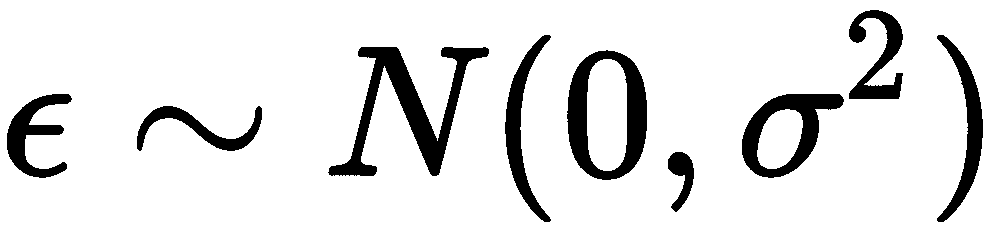

可以使用各种技术来建立线性回归模型。最常用的是**普通最小二乘** ( **OLS** )估计。OLS 方法用于产生线性回归线，该线性回归线寻求最小化误差平方和。误差是从实际数据点到回归线的距离。误差平方和衡量的是训练实例(即我们的每个数据点)与回归线预测值之间的平方差总和。这可以表示如下:


在上式中，是实际训练实例，是回归线预测的值。

在机器学习的背景下，梯度下降是一种常见的技术，可用于通过多次迭代最小化模型的训练误差来优化预测变量的系数。梯度下降从将系数初始化为零开始。然后，以最小化误差为目的更新系数。更新系数是一个迭代过程，直到达到最小平方误差。

在梯度下降技术中，一个称为**学习率**的超参数被提供给算法，用表示
。此参数决定了算法向系数最佳值移动的速度。如果非常大，算法可能会跳过最优解。然而，如果它太小，该算法可能有太多的迭代来收敛到最佳系数值。因此，为使用正确的值非常重要。

在这个食谱中，我们将使用梯度下降法来训练我们的线性回归模型。


# 做好准备

在第 1 章[中，*走近您的数据*，我们拿起`HousePrices.csv`文件，看看如何操作和准备我们的数据。我们还分析和处理了数据集中的缺失值。我们现在将使用这个最终数据集，通过线性回归进行建模练习:](2dbc8735-7eef-42ba-8b19-5644632c3197.xhtml)

在下面的代码块中，我们将从导入所需的库开始:

```
# import os for operating system dependent functionalities
import os

# import other required libraries
import pandas as pd
import numpy as np
import seaborn as sns 
import matplotlib.pyplot as plt
```

我们用`os.chdir()`命令设置我们的工作目录:

```
# Set your working directory according to your requirement
os.chdir(".../Chapter 4/Linear Regression")
os.getcwd()
```

让我们读一下我们的数据。我们用`df_`作为数据帧名称的前缀，以便于理解:

```
df_housingdata = pd.read_csv("Final_HousePrices.csv")
```


# 怎么做...

让我们继续构建我们的模型。我们将从识别数字和分类变量开始。我们使用相关矩阵和相关图来研究相关性。

1.  首先，我们来看看变量和变量类型:

```
# See the variables and their data types
df_housingdata.dtypes
```

2.  然后，我们将查看相关矩阵。`corr()`方法计算列的成对相关性:

```
# We pass 'pearson' as the method for calculating our correlation
df_housingdata.corr(method='pearson')
```

3.  除此之外，我们还想研究预测变量和响应变量之间的相关性:

```
# we store the correlation matrix output in a variable
pearson = df_housingdata.corr(method='pearson')

# assume target attr is the last, then remove corr with itself
corr_with_target = pearson.iloc[-1][:-1]

# attributes sorted from the most predictive
corr_with_target.sort_values(ascending=False)
```

我们可能还想按绝对值对相关性进行排序。为了做到这一点，我们可以使用下面的命令:`corr_with_target[abs(corr_with_target).argsort()[::-1]]`

4.  我们可以使用`seaborn`包中的`heatmap()`函数来查看相关图:

```
f, ax = plt.subplots(figsize=(11, 11))

# Generate a mask for the upper triangle
# np.zeros_like - Return an array of zeros with the same shape and type as a given array
# In this case we pass the correlation matrix
# we create a variable “mask” which is a 14 X 14 numpy array

mask = np.zeros_like(pearson, dtype=np.bool)
tt = np.triu_indices_from(mask)

# We create a tuple with triu_indices_from() by passing the “mask” array
# k is used to offset diagonal
# with k=0, we offset all diagnoals
# If we put k=13, means we offset 14-13=1 diagonal

# triu_indices_from() Return the indices for the upper-triangle of arr.
mask[np.triu_indices_from(mask, k=0)] = True

# First 2 param - anchor hues for negative and positive extents of the map.
# 3rd param - Anchor saturation for both extents of the map
# If true, return a matplotlib colormap object rather than a list of colors.

cmap = sns.diverging_palette(10, 129, s=50, as_cmap=True)

# Adjust size of the legend bar with cbar_kws={“shrink”: 0.5}
# cmap=“YlGnBu” gives the color from Yellow-Green-Blue palette

sns.heatmap(pearson, mask=mask, cmap="YlGnBu", vmax=.3, center=0,
           square=True, linewidths=.1, cbar_kws={"shrink": 0.5})
```

以下截图为关联图。请注意，我们已经使用`np.zeros_like()`和`np.triu_indices_from()`函数移除了热图的上方三角形:

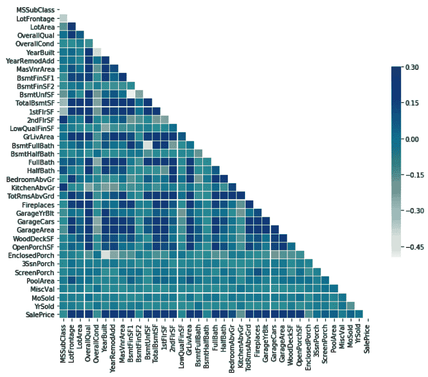

让我们通过可视化其他变量来探索我们的数据。

5.  我们可以使用带核密度估计器的直方图来查看目标变量`SalePrice`的分布，如下所示:

```
# Setting the plot size
plt.figure(figsize=(8, 8))

sns.distplot(df_housingdata['SalePrice'], bins=50, kde=True)
```

下面的截图给出了`SalePrice`变量的分布图:

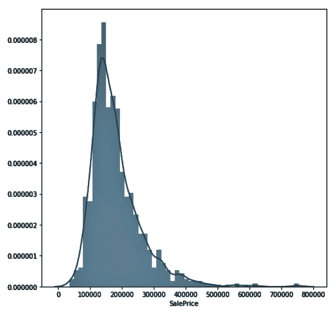

在统计学中，**核密度估计** ( **KDE** )是一种估计随机变量概率密度函数的非参数方法。核密度估计是一个基本的数据平滑问题，其中关于总体的推断是基于有限的数据样本。KDE 是一种在给定一组数据的情况下为你提供平滑曲线的技术。如果您想要可视化一些数据的形状，作为直方图中绘制的离散值的一种连续替代，这可能会很方便。

6.  我们也可以使用我们的`seaborn`包中的`JointGrid()`来绘制一个组合图:

```
from scipy import stats
g = sns.JointGrid(df_housingdata['YearBuilt'], df_housingdata['SalePrice'])
g = g.plot(sns.regplot, sns.distplot)
g = g.annotate(stats.pearsonr)
```

使用前面的代码，我们可以绘制 GarageArea 和 SalePrice 的散点图，同时还可以在每个轴上绘制这些变量的直方图:


7.  现在让我们使用最小-最大归一化来缩放数值变量。为此，我们首先需要从数据集中只选择数字变量:

```
# create a variable to hold the names of the data types viz int16, in32 and so on
num_cols = ['int16', 'int32', 'int64', 'float16', 'float32', 'float64']

# Filter out variables with numeric data types
df_numcols_only = df_housingdata.select_dtypes(include=num_cols)
```

8.  我们现在将最小-最大比例应用于数值变量:

```
# Importing MinMaxScaler and initializing it
from sklearn.preprocessing import MinMaxScaler
min_max=MinMaxScaler()

# Scaling down the numeric variables
# We exclude SalePrice using iloc() on df_numcols_only DataFrame
df_housingdata_numcols=pd.DataFrame(min_max.fit_transform(df_numcols_only.iloc[:,0:36]), columns=df_numcols_only.iloc[:,0:36].columns.tolist())
```

在下表中，我们可以看到我们的数字变量已经缩小:

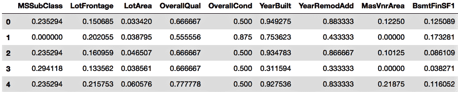

9.  现在，我们将对分类变量执行一次性编码:

```
# We exclude all numeric columns
df_housingdata_catcol = df_housingdata.select_dtypes(exclude=num_cols)

# Steps to one-hot encoding:
# We iterate through each categorical column name
# Create encoded variables for each categorical columns
# Concatenate the encoded variables to the DataFrame
# Remove the original categorical variable
for col in df_housingdata_catcol.columns.values:
   one_hot_encoded_variables = pd.get_dummies(df_housingdata_catcol[col],prefix=col)
   df_housingdata_catcol = pd.concat([df_housingdata_catcol,one_hot_encoded_variables],axis=1)
   df_housingdata_catcol.drop([col],axis=1, inplace=True)
```

10.  现在，我们已经创建了一个数据框架，其中仅包含经过缩放的数字变量。我们还创建了一个数据框架，其中只包含已编码的分类变量。让我们将两个数据帧合并成一个数据帧:

```
df_housedata = pd.concat([df_housingdata_numcols, df_housingdata_catcol], axis=1)
```

11.  然后，我们可以将`SalePrice`变量连接到我们的`df_housedata`数据帧:

```
# Concatenate SalePrice to the final DataFrame
df_housedata_final = pd.concat([df_housedata, df_numcols_only.iloc[:,36]], axis=1)
```

12.  我们可以使用来自`sklearn.model_selection`的`train_test_split`类创建我们的训练和测试数据集:

```
# Create feature and response variable set
# We create train & test sample from our dataset
from sklearn.model_selection import train_test_split

# create feature & response variables
X = df_housedata_final.iloc[:,0:302]
Y = df_housedata_final['SalePrice']

# Create train & test sets
X_train, X_test, Y_train, Y_test = \
train_test_split(X, Y, test_size=0.30, random_state=1)
```

13.  我们现在可以使用`SGDRegressor()`来建立一个线性模型。我们通过用 SGD 最小化正则化的经验损失来拟合这个线性模型:

```
import numpy as np
from sklearn.linear_model import SGDRegressor

lin_model = SGDRegressor()

# We fit our model with train data
lin_model.fit(X_train, Y_train)

# We use predict() to predict our values
lin_model_predictions = lin_model.predict(X_test)

# We check the coefficient of determination with score()
print(lin_model.score(X_test, Y_test))

# We can also check the coefficient of determination with r2_score() from sklearn.metrics
from sklearn.metrics import r2_score
print(r2_score(Y_test, lin_model_predictions))
```

通过运行前面的代码，我们发现决定系数大约是 0.81。

注意`r2_score()`有两个参数。第一个参数应该是真实值，而不是预测值，否则将返回不正确的结果。

14.  我们检查测试数据上的**均方根误差** ( **RMSE** ):

```
from sklearn.metrics import mean_squared_error
mse = mean_squared_error(Y_test, lin_model_predictions)
rmse = np.sqrt(mse)
print(rmse)
```

运行上面的代码将输出 RMSE 等于 36459.44 的结果。

15.  我们现在使用`matplotlib.pyplot`绘制实际值和预测值:

```
plt.figure(figsize=(8, 8))
plt.scatter(Y_test, lin_model_predictions)
plt.xlabel('Actual Median value of house prices ($1000s)')
plt.ylabel('Predicted Median value of house prices ($1000s)')
plt.tight_layout()
```

实际值和预测值的结果图如下所示:


因为图表在大约 45 度的对角线上显示了大多数值，所以我们的预测值与实际值非常接近，只有少数例外。


# 它是如何工作的...

在*步骤 1* 中，我们查看了变量类型。我们看到数据集既有数字变量也有非数字变量。在*步骤 2* 中，我们使用`Pearson`方法计算所有数值变量之间的成对相关性。之后，在*步骤 3* 中，我们看到了所有预测变量是如何与目标变量相关联的。我们还研究了如何根据绝对值对相关系数进行排序。

在*步骤 4* 中，我们绘制了一个热图来可视化变量之间的相关性。然后，我们从 NumPy 库中引入了两个函数:`zeros_like()`和`triu_indices_from()`。`zeros_like()`函数将相关矩阵作为输入，并返回与给定数组具有相同形状和类型的零数组。`triu_indices_from()`返回数组上部三角形的索引。我们使用这两个函数来掩盖相关图的上三角部分。我们从`seaborn`库中调用了`heatmap()`函数来绘制关联热图，并将关联矩阵传递给它。我们还使用`cmap="YlGnBu"`设置矩阵的颜色，使用`cbar_kws={"shrink": 0.5}`设置图例条的大小。

`numpy.tril_indices_from()` returns the indices for the lower triangle of the array. 

在*步骤 5* 中，我们查看了目标变量`SalePrice`的分布。在*步骤 6* 中，我们使用了`seaborn`库中的`JointGrid()`来展示如何用回归线绘制两个数值变量的散点图，以及在同一图表的轴上绘制两个变量的分布。在*第 7 步*和*第 8 步*中，我们仅选择了数字变量，并使用最小-最大归一化来缩放变量。这会将值缩放到 0 到 1 之间的数据数值范围。这也称为特征缩放，使用以下公式执行:

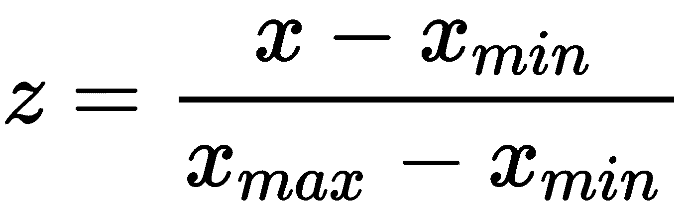

在*步骤 9* 、*步骤* *10* 和*步骤* *11* 中，我们对分类变量进行了一次热编码，并将编码后的变量添加到数据帧中。我们也放弃了最初的分类变量。在*步骤 12* 中，我们将数据集分为训练集和测试集。在*步骤 13* 中，我们使用`SGDRegressor()`建立了我们的线性回归模型，并打印了决定系数。最后，在*步骤 14* 中，我们绘制了预测值和实际值，以观察我们的模型表现如何。


# 还有更多...

考虑一个线性回归模型，给定以下假设函数:


在这种情况下，的成本函数是**均方误差** ( **MSE** )。

公式如下:


在该公式中，表示训练实例的数量。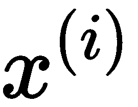和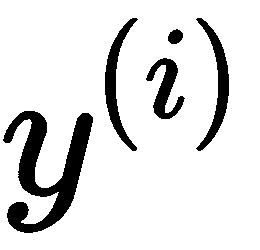分别是第 I 个^(到第)训练实例的输入向量和目标向量，而代表每个输入变量的参数或系数。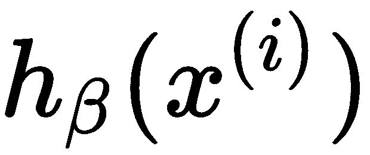是使用参数的第一个^(训练实例的预测值。MSE 总是非负的，越接近零越好。)

当模型在训练数据上表现不佳时，MSE 更高。因此，学习算法的目的是找到 **** 的值，使得 MSE 最小化。这可以表示如下:


随机梯度下降法找到使成本函数最小的的值。为了最小化成本函数，它通过计算成本函数的导数的斜率来不断改变参数。首先将 **** 参数初始化为零。 **** 参数在梯度下降的每一步都会更新:


算法收敛所需的更新次数将随着训练数据的增加而增加。然而，随着训练数据变得越来越大，该算法很可能在训练数据中的每个实例被学习之前就收敛了很多。换句话说，训练数据大小的增加不需要增加训练测试误差最小的最佳可能模型所需的训练时间。

每个培训实例都会修改 **** 。算法对这些 **** 值进行平均，计算出最终的 **。**

是学习率，它告诉算法以多快的速度向最小值移动。大的可能错过最小误差，而小的可能需要更长的时间让算法运行。

在前面的小节中，我们使用了一个`SGDRegressor()`函数，但是我们选择了超参数的默认值。我们现在要将更改为 0.0000001，并将`max_iter`值更改为 2000:

```
lin_model = SGDRegressor(alpha=0.0000001, max_iter=2000)
```

`max_iter` is an integer value that tells the algorithm the maximum number of passes it can make over the training data. This is also known as the number of epochs.

在我们的例子中，前面的代码给出的结果是 RMSE 从 36，459 下降到 31，222，决定系数从 0.81 提高到 0.86。这些结果在每次迭代中都会有所不同。


# 请参见

*   关于回归度量的 scikit-learn 文档:[https://bit.ly/2D6Wn8s](https://bit.ly/2D6Wn8s)
*   sci kit-密度估计学习指南:[https://bit.ly/2RlnlMj](https://bit.ly/2RlnlMj)


# 逻辑回归

在上一节中，我们注意到当目标变量是连续的时，线性回归是一个很好的选择。我们现在将继续研究二项式逻辑回归模型，该模型可以根据一个或多个预测变量来预测观察值落入两类二分目标变量之一的概率。二项式逻辑回归通常被称为逻辑回归。

逻辑回归类似于线性回归，除了因变量是在二分尺度上测量的。逻辑回归允许我们对多个预测变量和一个二分目标变量之间的关系进行建模。然而，与线性回归不同，在逻辑回归的情况下，线性函数被用作另一个函数的输入，例如:

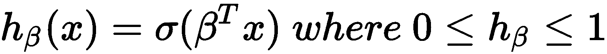

这里，是 sigmoid 或逻辑函数。sigmoid 函数如下所示:


下图表示一条 s 形曲线，其中 y 轴的值介于 0 和 1 之间。它在 0.5 处穿过轴。：


位于 0 和 1 之间的输出是正类的概率。如果返回值是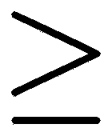 0.5，我们可以将假设函数的输出解释为正。否则，我们将其解读为负面的。

在逻辑回归的情况下，我们使用一个称为交叉熵的成本函数。二进制分类采用以下形式:

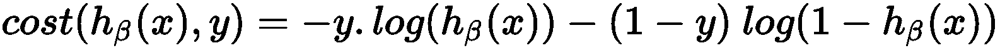

对于 *y=1* 和 *y=0* ，我们得到以下结果:


交叉熵随着预测概率偏离实际标签而增加。更高的散度导致更高的交叉熵值。在线性回归的情况下，我们看到我们可以使用梯度下降来最小化成本。在逻辑回归的情况下，我们还可以使用梯度下降来更新系数并最小化成本函数。

在这个菜谱中，我们将使用 scikit-learn 的`SGDClassfier()`实现。`SGDClassifier()`使用随机梯度下降实现正则化线性模型，对于大型数据集，这比梯度下降快得多。这是因为梯度下降考虑整个训练数据集，而随机梯度下降在更新权重时只考虑一个随机点。

默认情况下，`SGDClassifier`的表现可能不如逻辑回归。很可能需要超参数调整。


# 做好准备

在本节中，我们将使用一个数据集，该数据集包含从 2005 年 4 月到 2005 年 9 月台湾信用卡客户的违约付款、人口统计数据、信用数据、付款历史和账单等信息。该数据集取自 UCI ML 资源库，可从 GitHub 获得:

我们将从导入所需的库开始:

```
# import os for operating system dependent functionalities
import os

# import other required libraries
import pandas as pd
from sklearn.preprocessing import StandardScaler
from sklearn.model_selection import train_test_split
from sklearn.linear_model import SGDClassifier
from sklearn.metrics import roc_curve
from sklearn.metrics import auc
import matplotlib.pyplot as plt
```

我们用`os.chdir()`命令设置我们的工作目录:

```
# Set your working directory according to your requirement
os.chdir(".../Chapter 4/Logistic Regression")
os.getcwd()
```

让我们读一下我们的数据。我们将在数据帧的名称前加上`df_`，以便于阅读:

```
df_creditdata = pd.read_csv("UCI_Credit_Card.csv")
```

我们现在将继续看使用`SGDClassifier()`构建我们的模型。


# 怎么做...

让我们先来看看变量和数据类型:

1.  首先，我们将使用`read_csv()`函数来查看我们的数据集:

```
print(df_creditdata.shape)
print(df_creditdata.head())
```

2.  我们将使用`dtypes`来看看数据类型:

```
df_creditdata.dtypes
```

3.  我们将删除 ID 列，因为这里不需要它:

```
df_creditdata.drop(["ID"],axis=1,inplace=True)
```

4.  在上一节中，我们看到了如何探索变量之间的相关性。我们将在这里跳过这一点，但建议读者检查相关性，因为多重共线性可能会对模型产生影响。
5.  但是，我们将检查是否有空值，如下所示:

```
df_creditdata.isnull().sum()
```

6.  然后我们将把预测变量和响应变量分开。我们还将拆分我们的培训和测试数据:

```
# split features & response variable
X = df_creditdata.iloc[:,0:23]
Y = df_creditdata['default.payment.next.month']

# Create train & test sets
X_train, X_test, Y_train, Y_test = train_test_split(X, Y, test_size=0.30, random_state=1)
```

7.  我们使用`StandardScaler()`标准化我们的预测变量:

```
scaler = StandardScaler().fit(X_train)
X_train = scaler.transform(X_train)
X_test = scaler.transform(X_test)
```

8.  然后我们使用`SGDClassifier()`移动我们的模型:

```
# We create an instance of SGDClassifier()
logistic_model = SGDClassifier(alpha=0.000001, loss=‘log’, max_iter=100000, penalty=‘l2’)

# We fit our model to the data
fitted_model = logistic_model.fit(X_train, Y_train)

# We use predict_proba() to predict the probabilities
predictedvalues = fitted_model.predict_proba(X_test)

# We print the probabilities to take a glance
predictedvalues
```

9.  我们分离出一类概率。在这种情况下，我们将查看类 1:

```
# We take the predicted values of class 1
Y_predicted = predictedvalues[:, 1]

# We check to see if the right values have been considered from the predicted values
print(Y_predicted)
```

10.  我们根据训练数据检查模型的准确性:

```
# Check for accuracy
logistic_model.score(X_test,Y_test)
```

11.  然后我们可以看到**受试者工作特性** ( **ROC** )曲线的**曲线下面积** ( **AUC** )值:

```
# We use roc_curve() to generate fpr & tpr values
fpr, tpr, thresholds = roc_curve(Y_test, Y_predicted)

# we pass the fpr & tpr values to auc() to calculate the area under curve
roc_auc = auc(fpr, tpr)
print(roc_auc)
```

12.  我们绘制 ROC 曲线如下:

```
plt.figure()
plt.plot(fpr,tpr, color=‘orange’, lw=2, label=‘ROC curve (area under curve = %0.2f)’ % roc_auc)
plt.plot([0, 1], [0, 1], color=‘darkgrey’, lw=2, linestyle=‘--’)
plt.xlim([0.0, 1.0])
plt.ylim([0.0, 1.0])
plt.xlabel(‘False Positive Rate (1-Specificity)’)
plt.ylabel(‘True Positive Rate (Sensitivity)’)
plt.title(‘ROC Curve’)
plt.legend(loc=“upper left”)
plt.show()
```

下图显示了标有 AUC 值的 ROC 曲线:

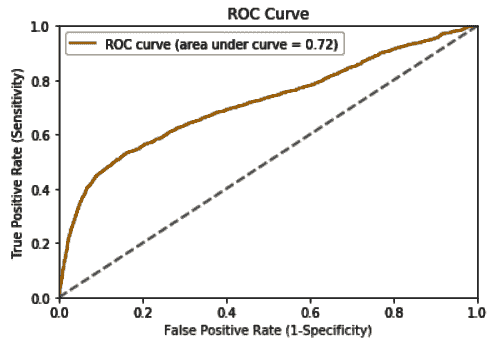

可以通过调整超参数来改进该模型。也可以通过特征选择来改善。


# 它是如何工作的...

在*步骤 1* 中，我们查看了数据集的维度。在*步骤 2* 中，我们瞥了一眼变量的数据类型，注意到我们所有的变量本质上都是数字。在步骤 3 中，我们删除了 ID 列，因为它对我们的练习没有用。我们跳过了变量之间的相关性，但是建议读者增加这一步，以便充分理解和分析数据。

在*步骤 4* 中，我们继续检查我们的数据集中是否有任何缺失值。我们注意到，在这种情况下，我们的数据集没有缺失值。在*步骤 5* 中，我们分离了预测变量和响应变量，并将我们的数据集分为训练数据集和测试数据集，前者占数据的 70%，后者占数据的 30%。在*步骤 6 中，*我们使用`sklearn.metrics`中的`StandardScaler()`来标准化训练和测试数据集中的预测变量。

之后，在*步骤 7* 中，我们使用`sklearn.linear_model`中的`SGDClassifier()`通过随机梯度下降法建立我们的逻辑回归模型。我们设置我们的超参数，如阿尔法、损失、`max_iter`和惩罚。我们设置`loss='log'`是为了使用 SGD 分类器进行逻辑回归。我们使用`predict_proba()`来预测我们的测试观察的概率，这为我们提供了所有测试观察的两个类的概率。

当`loss`设置为`hinge`时，`SGDClassifier()`提供线性 SVM。(我们将在下一节中介绍 SVM)。损失可以设置为其他值，如`squared_hinge`，它与`hinge`相同，但为二次方损失。

在*步骤 8* 和 *9* 中，我们过滤掉类别 1 的概率，并查看我们的模型得分。在*步骤 10* 和*步骤 11* 中，我们查看了 AUC 值并绘制了我们的 ROC 曲线。我们将在接下来的章节中探讨每种技术的超参数调优。


# 请参见

*   您可能已经注意到，在*步骤 7* 中，我们使用了`l2`的超参数损失。惩罚是正则项，`l2`是默认值。超参数惩罚也可以设置为`l1`；然而，这可能会导致稀疏解决方案，将大多数系数推到零。关于这个话题的更多信息可以在以下链接找到:[https://bit.ly/2RjbSwM](https://bit.ly/2RjbSwM)
*   分类标准的 scikit-learn 指南:【https://bit.ly/2NUJl2C 


# 朴素贝叶斯

**朴素贝叶斯算法**是一种概率学习方法。它之所以被称为**幼稚**是因为它假设这个词中的所有事件都是独立的，这其实是相当罕见的。然而，尽管有这样的假设，朴素贝叶斯算法已经随着时间的推移被证明在其预测准确性方面提供了很好的性能。

贝叶斯概率理论基于这样一个原则，即一个事件或潜在结果的估计可能性应该基于手头的多个试验的证据。贝叶斯定理提供了一种计算给定类的概率的方法，给定一些关于先前观察的知识。

这可以这样写:


这个定理的不同要素可以解释如下:

*   **p(类|观察)**:这是给定观察时类持有的概率。
*   **P(观察)**:这是训练数据被观察到的先验概率。
*   **p(类)**:这是类的先验概率。
*   **p(观察|类)**:这是假设类成立时观察的概率。

换句话说，如果 *H* 是可能假设的空间，那么最可能的假设，类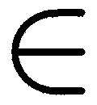 H，就是最大化 *p(类|观察)*的那个。

给定一个具有属性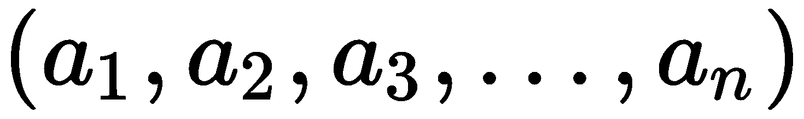的新观察值，贝叶斯算法将其分类为最可能的值:


给定条件独立性假设，我们有以下内容:


朴素贝叶斯分类器的预测如下:

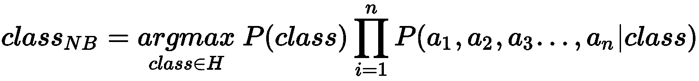


# 做好准备

朴素贝叶斯分类器是可以应用于文本分类问题的最基本的算法之一。

在这个食谱中，我们将使用`spam.csv`文件，它可以从 GitHub 下载。

这个`spam.csv`数据集有两列。一列保存消息，另一列保存消息类型，表明它是垃圾消息还是 ham 消息。我们将应用朴素贝叶斯技术来预测邮件是否可能是垃圾邮件或垃圾邮件。

我们将从导入所需的库开始:

```
# import os for operating system dependent functionalities
import os
import pandas as pd
import numpy as np
import matplotlib.pyplot as plt
import seaborn as sns

from sklearn.model_selection import train_test_split
from sklearn.feature_extraction.text import CountVectorizer
from sklearn.naive_bayes import MultinomialNB
```

我们用`os.chdir()`命令设置你的工作目录:

```
os.chdir(".../Chapter 4/Naive Bayes")
os.getcwd()
```

让我们读一下我们的数据。正如我们在前面几节中所做的那样，我们将在 DataFrame 的名称前加上前缀`df_`，以便于阅读:

```
df_messages = pd.read_csv('spam.csv', encoding='latin-1', \
                          sep=',', names=['labels','message'])
```


# 怎么做...

现在让我们继续看看如何构建我们的模型。

1.  读完数据后，我们用`head()`函数来看一下吧:

```
 df_messages.head(3)
```

在下面的截图中，我们可以看到有两列:标签和消息。输出如下所示:

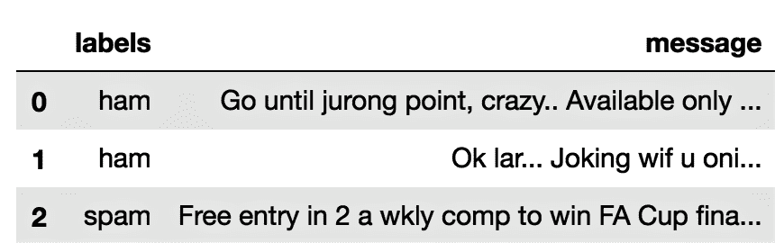

2.  然后，我们使用`describe()`函数查看每一列中的一些指标:

```
df_messages.describe()
```

这为我们提供了以下指标:

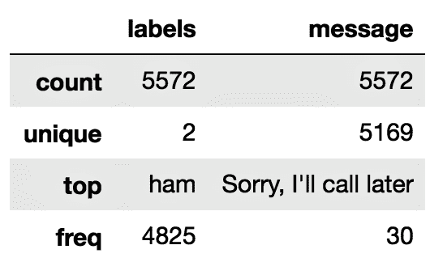

对于对象数据类型，`describe()`的结果将提供`metrics`、`count`、`unique`、`top`和`freq`。`top`是指最常见的值，而`freq`是这个值出现的频率。

3.  我们还可以按消息类型查看指标，如下所示:

```
df_messages.groupby('labels').describe()
```

使用前面的命令，我们可以看到每个目标变量类的计数、唯一值的数量和频率:

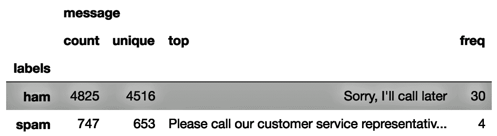

4.  为了进一步分析我们的数据集，让我们看看每封邮件的字数和字符数:

```
df_messages['word_count'] = df_messages['message'].apply(lambda x: len(str(x).split(" ")))
df_messages['character_count'] = df_messages['message'].str.len() 

df_messages[['message','word_count', 'character_count']].head()
```

`lambda`函数用于在 Python 中创建小型匿名函数。一个`lambda`函数可以接受任意数量的参数，但是只能有一个表达式。该功能作为参数传递给其他功能，如`map`、`apply`、`reduce`或`filter`。

上述代码的输出将如下所示:


5.  在这种情况下，`labels`是我们的目标变量。我们有两个班:`spam`和`ham`。我们可以使用条形图来查看垃圾邮件和非垃圾邮件的分布情况:

```
labels_count = pd.DataFrame(df_messages.groupby('labels')['message'].count())
labels_count.reset_index(inplace = True)
plt.figure(figsize=(4,4))
sns.barplot(labels_count['labels'], labels_count['message'])
plt.ylabel('Frequency', fontsize=12)
plt.xlabel('Labels', fontsize=12)
plt.show()
```

以下是上述代码的输出:


6.  在下面的代码块中，我们将把`spam`标记为`1`，把`ham`标记为`0`:

```
# create a variable that holds a key-value pair for ham and spam
class_labels = {"ham":0,"spam":1}

# use the class_labels variable with map()
df_messages['labels']=df_messages['labels'].map(class_labels)
df_messages.head()
```

请注意，在下面的截图中，在`labels`变量下，所有的垃圾邮件消息现在分别标记为 0 和 1:


7.  我们现在将把数据分成训练样本和测试样本:

```
# Split your data into train & test set
X_train, X_test, Y_train, Y_test = train_test_split(df_messages[‘message’],\
                                 df_messages[‘labels’],test_s=0.2,random_state=1)
```

8.  我们需要将消息集合转换成令牌计数矩阵。这可以通过使用`CountVectorizer()`来完成:

```
# Creating an instance of the CountVectorizer class
# If ‘english’, a built-in stop word list for English is used.
# There are known issues with ‘english’ and you should consider an alternative
vectorizer = CountVectorizer(lowercase=True, stop_words=‘english’, analyzer=‘word’)

# Learn a vocabulary from one or more message using the fit_transform() function
vect_train = vectorizer.fit_transform(X_train)
```

9.  我们继续用朴素贝叶斯算法构建我们的模型:

```
# Create an instance of MultinomialNB()
model_nb = MultinomialNB()

# Fit your data to the model
model_nb.fit(vect_train,Y_train)

# Use predict() to predict target class
predict_train = model_nb.predict(vect_train)
```

10.  我们加载评估指标所需的库，如下所示:

```
from sklearn.metrics import accuracy_score
from sklearn.metrics import precision_score
from sklearn.metrics import recall_score
from sklearn.metrics import f1_score
```

11.  现在，我们通过使用训练数据评估模型来检查我们的准确性:

```
# Calculate Train Accuracy
print(‘Accuracy score: {}’.format(accuracy_score(Y_train, predict_train)))

# Calculate other metrics on your train results
print(‘Precision score: {}’.format(precision_score(Y_train, predict_train)))
print(‘Recall score: {}’.format(recall_score(Y_train, predict_train)))
print(‘F1 score: {}’.format(f1_score(Y_train, predict_train)))
```

其输出如下所示:

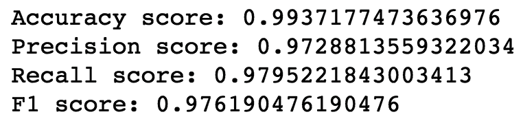

12.  现在，我们通过用看不见的测试数据评估模型来检查测试数据的准确性:

```
# We apply the model into our test data
vect_test = vectorizer.transform(X_test)
prediction = model_nb.predict(vect_test)

# Calculate Test Accuracy
print(‘Accuracy score: {}’.format(accuracy_score(Y_test, prediction)))

# Calculate other metrics on your test data
print(‘Precision score: {}’.format(precision_score(Y_test, prediction)))
print(‘Recall score: {}’.format(recall_score(Y_test, prediction)))
print(‘F1 score: {}’.format(f1_score(Y_test, prediction)))
```

在前面的代码块中，我们打印了如下性能指标:


这些结果可能因不同的样本和超参数而异。


# 它是如何工作的...

在*步骤 1 中，*我们查看了数据集。在*步骤 2* 和*步骤* *3* 中，我们查看了`ham`和垃圾邮件类别标签的统计数据。在*步骤 4* 中，我们通过查看数据集中每条消息的字数和字符数来扩展我们的分析。在*步骤 5* 中，我们看到了目标变量(火腿和垃圾邮件)的分布，而在*步骤 6* 中，我们用数字`1`和`0`对目标变量的类标签进行了编码。在步骤 7 中，我们将数据集分成训练样本和测试样本。在*步骤 8* 中，我们使用来自`sklearn.feature_extraction.text`的`CountVectorizer()`将消息集合转换为令牌计数矩阵。

如果您没有提前提供字典，也没有使用进行某种特征选择的分析器，那么特征的数量将等于通过分析数据找到的词汇量。有关这方面的更多信息，请参见以下内容:[https://bit.ly/1pBh3T1](https://bit.ly/1pBh3T1)。

在*第 9 步*和*第*步*第 10* 中，我们构建了我们的模型，并从`sklearn.metrics`导入了所需的类，以分别测量各种分数。在*步骤 11* 和 *12* 中，我们检查了我们的训练和测试数据集的准确性。


# 还有更多...

朴素贝叶斯算法有多种变体。这些算法包括多元伯努利朴素贝叶斯、多项式朴素贝叶斯和高斯多项式朴素贝叶斯算法。这些变化可以用来解决不同的问题。

*   **多元伯努利朴素贝叶斯**:当特征向量提供单词或特征是否出现在文档中的二进制表示时，使用该算法。文档的特征向量中的每个标记都与`1`或`0`值相关联。`1`表示单词出现的令牌，`0`表示单词不出现的令牌。多元伯努利朴素贝叶斯算法可用于缺少特定单词的情况，例如检测垃圾邮件内容。
*   **多项朴素贝叶斯**:在分类问题中需要考虑单词的多次出现时使用。在这个变体中，文本文档的特征是术语的频率，而不是二进制值。频率是一个离散的计数，它指的是给定的单词或标记在文档中出现的次数。多项式朴素贝叶斯算法可用于主题建模，这是一种在文档语料库中找到最能代表关键信息的一组单词的方法。
*   **高斯多项式朴素贝叶斯** : 在我们拥有连续特征的场景中，在朴素贝叶斯分类中处理连续数据的一种方法是将特征离散化。或者，我们可以应用高斯多项式朴素贝叶斯算法。这假设特征遵循正态分布，并使用高斯核来计算类别概率。


# 请参见

*   在 scikit-learn 中，`CountVectorizer()`统计一个单词在文档中出现的次数，并使用该值作为其权重。您还可以使用`TfidfVectorizer()`，其中分配给每个标记的权重取决于它在文档中的出现频率以及该术语在整个语料库中出现的频率。你可以在以下链接找到更多关于`TfidfVectorizer`的信息:[https://bit.ly/2sJCoVN](https://bit.ly/2sJCoVN)。
*   关于多元伯努利模型的朴素贝叶斯分类器的 scikit-learn 文档:[https://bit.ly/2y3fASv](https://bit.ly/2y3fASv)。
*   关于多项式模型的朴素贝叶斯分类器的 scikit-learn 文档:[https://bit.ly/2P4Ohic](https://bit.ly/2P4Ohic)。


# 决策树

决策树是一种非参数监督学习方法，是用于预测建模的流行算法。最著名的决策树算法包括**迭代二分法** ( **ID3** )、C4.5、CART 和 C5.0，ID3 只适用于分类特征。C4.5 是对 ID3 的改进，能够处理缺失值和连续属性。树生长过程包括使用信息增益在每个节点找到最佳分裂。但是，C4.5 算法通过在能够产生最大信息增益的合适阈值处进行分割，将连续属性转换为二分分类属性。

杰出的统计学家 Leo Breiman 介绍了一种决策树算法，叫做**分类和回归树** ( **CART** )。与 ID3 和 C4.5 不同，CART 可以生成决策树，用于分类和回归问题。该算法也构成了重要的随机森林算法的基础。

决策树是使用递归分区构建的，递归分区基于几个二分独立属性将数据分成子集。该递归过程可以多次分割数据，直到分割过程在达到特定停止标准后终止。最佳分割是使分割标准最大化的分割。对于分类学习，用作分裂标准的技术是熵和信息增益、基尼指数和增益比率。然而，对于回归任务，使用标准偏差减少。

C4.5 和 C5.0 算法使用熵(也称为**香农熵**)和信息增益来识别最佳属性并决定分割标准。熵是不确定性或随机性的概率度量。

数学上，熵可以表示如下:

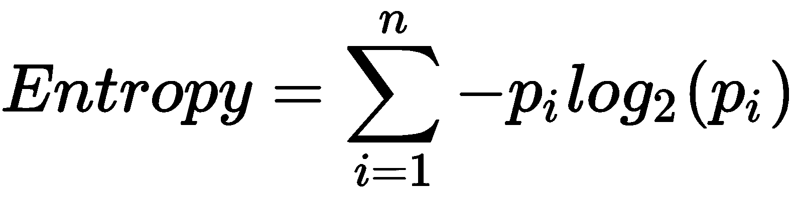

在两类属性的情况下，熵的范围可以从 0 到 1。对于 n 类属性，熵可以取 0 到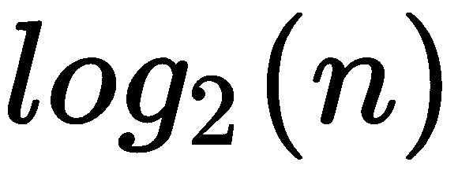之间的值。对于只有一个类的齐次变量，熵将为零，因为该类为零的概率是 1 和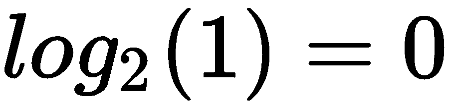。

为了使用熵来识别最容易识别的要分割的属性，该算法计算由每个可能属性的分割所导致的同质性的变化。这种变化被称为信息增益。构建决策树就是要找到返回最高信息增益的属性。这种信息增益是基于在属性处分割数据集后熵的减少。

信息增益计算为分割前的熵和分割后的熵之差:

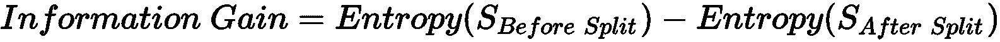

信息增益越高，特征越好。计算所有特征的信息增益。该算法选择具有最高信息增益的特征来创建根节点。在每个节点计算信息增益，以便为该节点选择最佳特征。

信息增益也被称为 Kullback-Leibler 散度。这衡量的是同一变量的两个概率分布之间的差异。简单地说，如果你有两个概率分布，KL 散度衡量两个分布的相似性。如果 KL 散度为 0，则两个分布相等。

基尼指数是杂质程度的一种量度，也可以用来确定分裂标准的最佳属性。其计算方法如下:

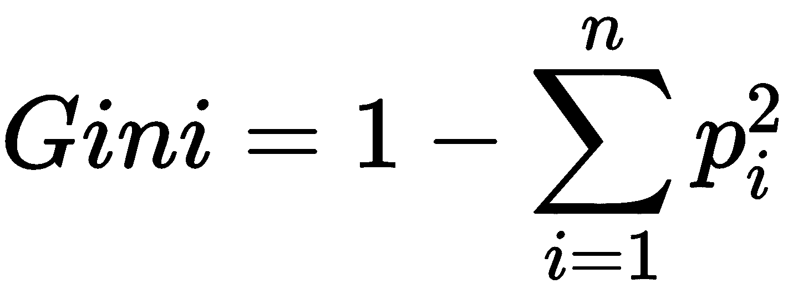

在前面的公式中， *p* 是训练实例属于特定类的概率。关于基尼指数，杂质越低越好。


# 做好准备

为了用 q 决策树算法构建我们的模型，我们将使用`backorders.csv`文件，该文件可以从下面的 GitHub 下载。

这个数据集有 23 列。目标变量是`went_on_backorder`。这表明产品是否延期交货。其他 22 个变量是预测变量。本书附带的代码中提供了对数据的描述:

我们将从导入所需的库开始:

```
# import os for operating system dependent functionalities
import os

# import other required libraries
import pandas as pd
import numpy as np
from sklearn.preprocessing import StandardScaler
from sklearn.model_selection import train_test_split
from sklearn.metrics import accuracy_score
from sklearn.metrics import confusion_matrix, roc_curve, auc
import itertools
from sklearn import tree

import seaborn as sns
import matplotlib.pyplot as plt
```

我们用`os.chdir()`命令设置我们的工作目录:

```
# Set your working directory according to your requirement
os.chdir(".../Chapter 4/Decision Tree")

# Check Working Directory 
os.getcwd()
```

让我们读一下我们的数据。正如我们之前所做的，我们将在数据帧的名称前加上前缀`df_`，以便于理解:

```
df_backorder = pd.read_csv("BackOrders.csv")
```


# 怎么做...

现在让我们继续构建我们的模型:

1.  首先，我们想使用`shape`和`head()`函数查看数据集和数据的维度。我们还使用`describe()`来看看数字变量的统计数据:

```
df_backorder.shape
df_backorder.head()
df_backorder.describe()
```

如果您以科学记数法得到您的输出，您可以通过执行以下命令改为以标准形式查看它:`pd.options.display.float_format = ‘{:.2f}’.format`

2.  使用`dtypes`，我们可以看到每个变量的数据类型:

```
df_backorder.dtypes
```

3.  我们可以看到`sku`是一个标识符，对我们的建模练习没有任何用处。因此，我们将从数据帧中删除`sku`,如下所示:

```
df_backorder.drop('sku', axis=1, inplace=True)
```

4.  我们可以用`isnull().sum()`命令检查是否有任何缺失值:

```
df_backorder.isnull().sum()
```

我们来看看下面的截图:

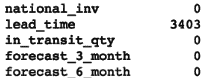

5.  由于`lead_time`变量中缺失值的数量约为 5%,我们将移除初始分析中`lead_time`缺失的所有观察值:

```
df_backorder = df_backorder.dropna(axis=0)
```

6.  我们现在需要对我们的分类变量进行编码。我们只选择分类变量，并调用`pd.get_dummies()`对非数字变量进行虚拟编码:

```
non_numeric_attributes = df_backorder.select_dtypes(include=['object']).columns
df_backorder = pd.get_dummies(columns=non_numeric_attributes, data=df_backorder, prefix=non_numeric_attributes, prefix_sep="_",drop_first=True)
df_backorder.dtypes
```

通过前面的代码，我们可以看到数据类型。我们注意到伪编码变量都是无符号整数(`uint8`)类型:


7.  然后，我们将按如下方式查看我们的目标变量分布:

```
# Target variable distribution
pd.value_counts(df_backorder['went_on_backorder_Yes'].values)
```

我们可以看到，我们的数据分布相当均衡，大约 81%的观察值属于 0 类，19%属于 1 类:


8.  现在，我们将数据分为训练数据集和测试数据集:

```
#Performing train test split on the data
X, Y = df_backorder.loc[:,df_backorder.columns!=‘went_on_backorder_Yes’].values, df_backorder.loc[:,‘went_on_backorder_Yes’].values

# Split our dataset into train & test set
X_train, X_test, Y_train, Y_test = train_test_split(X, Y, test_size=0.2, random_state=1)
```

9.  我们将用`DecisionTreeClassifier()`构建我们的第一个模型:

```
# Create an instance of DecisionTreeClassifier()
classifier = tree.DecisionTreeClassifier(random_state=1)

# Fit our model to the data
model_DT_Gini = classifier.fit(X_train, Y_train)
model_DT_Gini
```

通过`model_DT_Gini`，我们可以看到已经使用的超参数的默认值:

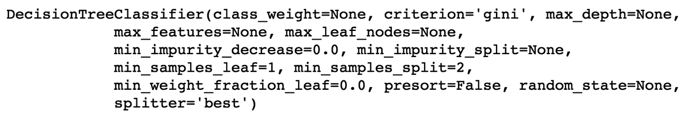

10.  我们可以使用模型通过训练和测试数据集来预测我们的类标签:

```
# Predict with our test data
test_predictedvalues = model_DT_Gini.predict(X_test)

# Check accuracy
acc = accuracy_score(Y_test, test_predictedvalues)
print("Accuracy is", acc)

# Check TP, TN, FP, FN
tn, fp, fn, tp = confusion_matrix(Y_test, test_predictedvalues).ravel()
print("TN:",tn, " FP:",fp, " FN:",fn, " TP:",tp)
```

这为我们提供了准确性以及对**真阴性** ( **TN** )、**假阳性** ( **FP** )、**假阴性** ( **FN** )和**真阳性** ( **TP** )值的计数:

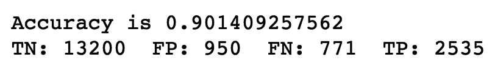

11.  我们现在将使用一个`plot_confusion_matrix`函数来绘制我们的混淆矩阵。这个函数取自[http://scikit-learn.org](http://scikit-learn.org)，在那里很容易得到，这里就不展示这个函数了。不过，书中提供了代码供您参考:

```
target_names = [ ‘No’, ‘Yes’]

#Pass Actual & Predicted values to confusion_matrix()
cm = confusion_matrix(Y_test, test_predictedvalues)

plt.figure()
plot_confusion_matrix(cm, classes=target_names, normalize=False)
plt.show()
```

然后，我们可以在混淆矩阵图中看到 TNs、FPs、FNs 和 TPs 的数量:


12.  我们可以改变超参数来调整我们的模型。我们还可以执行网格搜索来找到提供最佳结果的超参数值。我们可以使用下面的代码来设置超参数值:

```
# set the parameters for grid search
grid_search_parameters = {“criterion”: [“gini”, “entropy”],
             “min_samples_split”: [2],
             “max_depth”: [None, 2, 3],
             “min_samples_leaf”: [1, 5],
             “max_leaf_nodes”: [None],
             }
```

13.  我们将使用`GridSearchCV()`网格搜索参数:

```
from sklearn.model_selection import GridSearchCV

# Create an instance of DecisionTreeClassifier()
classifier = tree.DecisionTreeClassifier()

# Use GridSearchCV(), pass the values you have set for grid search
model_DT_Grid = GridSearchCV(classifier, grid_search_parameters, cv=10)
model_DT_Grid.fit(X_train, Y_train)
```

14.  运行前面的命令后，我们可以看到使用`best_params_`提供的参数值中的最佳值:

```
model_DT_Grid.best_params_ 
```

15.  您可以使用通过`GridSearchCV()`功能选择的型号:

```
test_predictedvalues = model_DT_Grid.predict(X_test)

cc = accuracy_score(Y_test, test_predictedvalues)
print("Accuracy is", acc)

tn, fp, fn, tp = confusion_matrix(Y_test, test_predictedvalues).ravel()
print("TN:",tn, " FP:",fp, " FN:",fn, " TP:",tp)

cm = confusion_matrix(Y_test, test_predictedvalues)

plt.figure()
plot_confusion_matrix(cm, classes=target_names, normalize=False)
plt.show()
```

16.  为了查看每个标签的指标，我们还可以使用`classification_report`，如下所示:

```
from sklearn.metrics import classification_report

target_names = [ 'No', 'Yes']
print(classification_report(Y_test, test_predictedvalues, target_names=target_names))
```

这一步为我们提供了以下输出:


这些结果会因使用的样品和超参数调整而异。


# 它是如何工作的...

在*步骤 1* 中，我们查看了数据集的维度。我们也看到了数字变量的统计数据。在*步骤 2* 中，我们查看了每个变量的数据类型。在*步骤 3* 中，我们删除了`sku`属性，因为它是一个对我们的模型没有用处的标识符。在*步骤 4* 中，我们检查了缺失值，注意到`lead_time`属性有 3403 个缺失值，这大约是观察总数的 5%。在*步骤 5* 中，我们删除了`lead_time`中缺失值的观察值。请注意，有各种各样的策略来估算缺失值，但我们在本练习中没有考虑这些策略。

在*步骤 6* 中，我们使用 pandas 库中的`get_dummies()`和`drop_first=True`作为参数之一，对分类变量执行 k-1 虚拟编码。在*步骤 7* 中，我们看了一下目标变量的分布。我们看到分类标签 0 和 1 的比例大约为 19%-81%，这不是很平衡。然而，我们对这两个类都有足够的观察来继续我们的下一步。在*步骤 8* 中，我们分离了预测变量和响应变量。我们还分割数据集以创建训练数据集和测试数据集。在*步骤 9* 中，我们使用了一个`DecisionTreeClassifier()`来构建我们的模型。我们注意到了默认的超参数值，并且注意到，默认情况下，`DecisionTreeClassifier()`使用基尼系数作为分割标准。

在*第 10 步*中，我们使用模型来预测我们的测试样本。我们记下了我们获得的总准确度以及 TP、TN、FP 和 FN 值的数量。在*步骤 11* 中，我们使用`plot_confusion_matrix()`以混淆矩阵的形式绘制这些值。请注意`plot_confusion_matrix()`可在[https://bit.ly/2MdyDU9](https://bit.ly/2MdyDU9)获得，也可在本章代码文件夹中的书中找到。

然后，我们考虑改变超参数值来微调我们的模型。我们进行了网格搜索，以找到最佳的超参数值。在*步骤 12* 中，我们定义了想要应用于网格搜索算法的超参数值的组合。在*步骤 13* 和 *14* 中，我们使用`GridSearchCV()`寻找最佳超参数。在*步骤 15* 中，我们使用网格搜索返回的模型来预测我们的测试观察。最后，在*步骤 16* 中，我们使用`sklearn.metrics`中的`classification_report()`来生成包括`precision`、`recall`、`f1-score`、`support`在内的各种分数。


# 还有更多...

有时，模型可以完美地对训练数据进行分类，但在处理新数据时会遇到困难。这个问题被称为**过度配合**。该模型未能扩展到新的测试数据。

我们允许递归分割过程重复，直到我们终止叶节点，因为我们不能进一步分割数据。该模型将完美地拟合训练数据，但是导致较差的性能。由于这个原因，基于树的模型容易过度拟合。为了克服这一点，我们需要控制决策树的深度。

有多种方法可以避免过度拟合。一种方法是在对训练数据进行完美分类之前终止增长。可以采用以下方法来实现这种停止方法:

*   当树达到最大层数时停止
*   当子集包含的训练实例少于定义的数量时停止
*   当达到最小信息增益时停止

另一种方法是允许数据过度拟合，然后在构造好树后对其进行修剪。这包括消除不明显相关的节点，这也最小化了决策树的大小。


# 请参见

*   关于决策树分类器的 scikit-learn 文档:[https://bit.ly/1Ymrzjw](https://bit.ly/1Ymrzjw)
*   关于决策树回归器的 scikit-learn 文档:【https://bit.ly/2xMNSua 


# 支持向量机

一种**支持向量机** ( **SVM** )是一种用于监督学习的流行机器学习算法。它可用于分类和回归问题。在分类学习中，SVM 通过找到区分两类观察值的最佳分离超平面来执行分类。如果数据是线性可分的，并且是一维的，我们可能会有一个点来分隔数据。在二维空间中，数据可以用一条直线隔开，而在三维空间中，数据用一个平面隔开。当我们有三个以上的维度时，这叫做超平面。

对于线性 SVM，具有 *n* 个特征向量的数据集 *X* 表示如下:


双极目标变量 *Y* 写如下:


超平面由下式给出:


对于 SVM，这两个类表示为-1 和+1，而不是 1 和 0。因此，超平面可以写成如下形式:

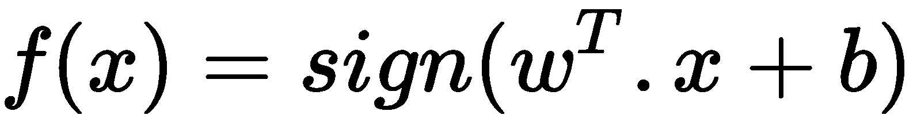

为了对数据进行分类，我们有以下两条规则:


然而，很有可能存在许多对训练数据进行正确分类的超平面。对于前面的规则来说，可能有无限多种解决方案适用于 w 和 b*的情况。诸如感知器学习算法的算法将只找到任何线性分类器。然而，SVM 找到了最佳超平面，它与任何数据点的距离都是最大的。数据点离超平面越远，我们就越确信它们已经被正确分类。因此，我们希望数据点尽可能远离超平面，同时仍然能够正确地对它们进行分类。最佳超平面是在两个类之间具有最大间隔的超平面。这就是所谓的最大利润超平面。*

SVM 有可能从训练数据中选择定义分离超平面的最重要的向量。这些是最接近超平面的数据点，称为支持向量。支持向量是最难分类的数据点。同时，这些代表了高质量的数据。如果您删除所有其他数据点，并且仅使用支持向量，您可以使用相同的 SVM 模型来获得准确的决策超平面和余量。数据点的数量并不重要，重要的是支持向量。

我们归一化权重 *w* 和 *b* ，使得支持向量满足以下条件:


因此，分类规则更改为以下内容:


前面的等式可以组合并表示如下:


最初的 SVM 算法只能用于线性可分数据的情况。这些被称为硬边界支持向量机。然而，硬间隔支持向量机只有在数据完全线性可分并且没有任何噪声的情况下才能工作。在有噪声或异常值的情况下，硬边际 SVM 可能会失败。

Vladimir Vapnik 提出了软间隔支持向量机，通过使用松弛变量来处理非线性可分的数据。松弛变量允许在将模型拟合到训练数据集时出现错误。在硬边界分类中，我们将得到一个具有小边界的决策边界。在软间隔分类中，我们将得到一个具有较大间隔的决策边界:


使用一种叫做核技巧的东西，支持向量机也可以很好地执行非线性分类。这指的是预测变量隐式映射到高维特征空间的变换。流行的内核类型包括以下几种:

*   线性核
*   多项式核
*   径向基函数(RBF)核
*   Sigmoid 核

不同的核函数可用于不同的决策函数。我们可以一起添加核函数来实现更复杂的平面。


# 做好准备

在本章中，我们将使用`bank.csv`文件，该文件基于银行营销数据，您可以从 GitHub 下载。该数据与一家葡萄牙银行通过电话开展的直接营销活动有关。目标是预测客户是否会认购定期存款:

我们将从导入所需的库开始:

```
# import os for operating system dependent functionalities
import os

# import other required libraries
import pandas as pd
import numpy as np
from sklearn.svm import SVC
from sklearn.metrics import accuracy_score, confusion_matrix, roc_curve, auc
from sklearn.model_selection import train_test_split
```

我们用`os.chdir()`命令设置我们的工作目录:

```
# Set your working directory according to your requirement
os.chdir(".../Chapter 4/Support Vector Machine")
os.getcwd()
```

让我们读一下我们的数据。为了更容易理解，我们将再次在数据帧的名称前加上`df_`:

```
df_bankdata = pd.read_csv("bank.csv")
```


# 怎么做...

在本节中，我们将研究检查空值、标准化数值和一次性编码分类变量:

1.  使用以下命令，我们可以看到数据集中有 10 个分类变量和 7 个数值变量:

```
df_bankdata.dtypes
```

2.  使用以下命令，我们注意到没有丢失值，因此我们可以继续下一步:

```
df_bankdata.isnull().sum()
```

3.  我们可以检查目标变量中的类平衡，如下所示:

```
print("Total number of class labels: {}".format(df_bankdata.shape[0]))
print("Number of people opted for Term Deposit: {}".format(df_bankdata[df_bankdata.y == 'yes'].shape[0]))
print("Number of people not opted for Term Deposit: {}".format(df_bankdata[df_bankdata.y == 'no'].shape[0]))
```

4.  我们可以使用以下命令将目标类转换为二进制值 1 和 0:

```
df_bankdata['y'] = (df_bankdata['y']=='yes').astype(int)
```

5.  我们现在可以对分类变量执行一键编码。我们只选择本质上明确的变量。在下面的代码中，我们使用`category_column_names`来提供非数字变量的名称:

```
# Using select_dtypes() to select only the non-numerical type variable
column_type = ['object']
df_bank_data_category_cols = df_bankdata.select_dtypes(column_type)

# This will give you the names of the non-numerical variables
category_column_names = df_bank_data_category_cols.columns.values.tolist()
category_column_names
```

6.  我们在每个非数值变量上运行一个循环，对它们执行一键编码，并将它们添加回数据帧。我们还将在执行一键编码后删除原始的非数字变量:

```
for each_col in category_column_names:
   dummy_var = pd.get_dummies(df_bank_data_category_cols[each_col], prefix=each_col)
   df_joindata = df_bankdata.join(dummy_var)
   df_joindata.drop([each_col], axis=1, inplace=True)
   df_bankdata = df_joindata
```

7.  我们将预测变量和响应变量分离如下:

```
# Separate features & response variable
X=df_bankdata.iloc[:, :-1]
Y=df_bankdata['y']
```

8.  我们还将数据分为训练和测试数据集:

```
X_train, X_test, Y_train, Y_test = train_test_split(X, Y, test_size=0.2, random_state=1)
```

9.  然后，我们使用 SVC 和默认内核**径向基函数** ( **RBF** )构建我们的第一个模型:

```
# Note, you need not pass kernel='rbf' to the SVC() because its the default
svc_model = SVC(kernel='rbf') 
svc_model.fit(X_train, Y_train)
```

10.  我们通过使用 RBF 内核构建的 SVC 模型来检查我们的训练和测试准确性:

```
train_predictedvalues=svc_model.predict(X_train)
test_predictedvalues=svc_model.predict(X_test)

print('Train Accuracy Score:')
print(metrics.accuracy_score(Y_train,train_predictedvalues))

print('Test Accuracy Score:')
print(metrics.accuracy_score(Y_test,test_predictedvalues))
```

我们得到以下输出:


11.  我们可以用多项式内核重建 SVC 模型，如下所示:

```
svc_model =SVC(kernel='poly') 
svc_model.fit(X_train, Y_train)

train_predictedvalues=svc_model.predict(X_train)
test_predictedvalues=svc_model.predict(X_test)

print('Train Accuracy Score:')
print(metrics.accuracy_score(Y_train,train_predictedvalues))

print('Test Accuracy Score:')
print(metrics.accuracy_score(Y_test,test_predictedvalues))
```

使用多项式内核，我们得到以下输出:


12.  我们也可以用线性核建立 SVC 模型。在前面的代码中，我们可以用`kernel='linear'`代替`kernel='ploy'`:

```
svc_model =SVC(kernel='linear') 
```

使用线性核，我们得到以下精度:


我们的结果将根据不同类型的核和其他使用的超参数值而有所不同。


# 它是如何工作的...

在*步骤 1* 中，我们查看了变量的数据类型。我们注意到我们有十个类别和七个数字变量。在*步骤 2* 中，我们检查了缺失值，发现数据集中没有缺失值。在*步骤 3* 中，我们检查了目标变量的类平衡，发现它具有值`yes`和`no`。在*步骤 4* 中，我们将目标变量转换为 1 和 0，分别代表`yes`和`no`。在*步骤 5* 和*步骤 6* 中，我们对非数字变量进行了一键编码。

在*步骤 7* 中，我们将预测变量和响应变量分开，在*步骤 8* 中，我们将数据集分为训练数据集和测试数据集。之后，在*步骤 9* 中，我们使用来自`sklearn.svm`的`SVC()`和默认的 RBF 内核来构建我们的模型。我们将它应用于我们的训练和测试数据来预测类。在*步骤 10* 中，我们检查了培训和测试数据的准确性。在*步骤 11* 中，我们更改了超参数，将内核设置为多项式。我们注意到，训练精度基本保持不变，但是测试精度提高了。

对于多项式核，默认阶数为 3。您可以将多项式次数更改为更高的次数，并注意模型性能的变化。

在*步骤 12* 中，我们将内核更改为线性，以查看结果是否比多项式内核有所改善。然而，我们没有看到任何显著的改善。


# 还有更多...

在本练习中，我们看到了如何在代码中使用各种内核。核函数必须是对称的。优选地，它们应该具有正(半)定的 gram 矩阵。gram 矩阵是 V 的所有可能内积的矩阵，其中 V 是 m 个向量的集合。为了方便起见，我们不加区别地考虑半正定和正定函数。实际上，核矩阵的正定性确保了核算法收敛到唯一的解。

线性内核是所有可用内核中最简单的。它可以很好地处理文本分类问题。

线性核表示如下:


这里， **c** 是常数项。

一个**多项式内核**有两个参数:一个常数和次数。没有常数且次数为 1 的多项式核只是线性核。随着多项式核的次数增加，决策函数变得更加复杂。使用更高的次数，可以获得良好的训练精度，但是模型可能无法扩展到看不见的数据，从而导致过度拟合。多项式核表示如下:


这里，是斜率，d 是核的次数，c 是常数项。

**径向基函数核(RBF)** ，也称为高斯核，是一种更复杂的核，性能优于多项式核。RBF 核如下所示:


可以调整参数来提高内核的性能。这一点很重要:由于高估了，内核可能会失去其非线性能力，表现得更加线性。另一方面，如果被低估，决策函数可能对训练数据中的噪声高度敏感。

并非所有的核都是严格正定的。虽然 sigmoid 核函数被广泛使用，但它不是正定的。sigmoid 函数如下所示:

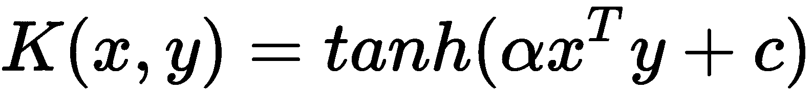

这里，是斜率， **c** 是常数项。注意，具有 sigmoid 内核的 SVM 与两层感知器神经网络相同。

给 SVM 模型增加一个内核技巧可以给我们带来新的模型。我们如何选择使用哪个内核？第一种方法是尝试 RBF 内核，因为它在大多数时候都工作得很好。然而，使用其他内核并验证您的结果是一个好主意。使用正确的内核和正确的数据集可以帮助您构建最佳的 SVM 模型。


# 请参见

*   更多关于正定矩阵的内容可以在这里找到:[https://bit.ly/2NnGeLK](https://bit.ly/2NnGeLK)。
*   正定核是正定矩阵的扩展。你可以在这里找到更多相关信息:[https://bit.ly/2NlsIs1](https://bit.ly/2NlsIs1)。

*   关于支持向量回归的 scikit-learn 文档:[https://bit.ly/2OFZ8ix](https://bit.ly/2OFZ8ix)。