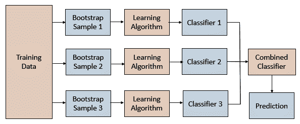
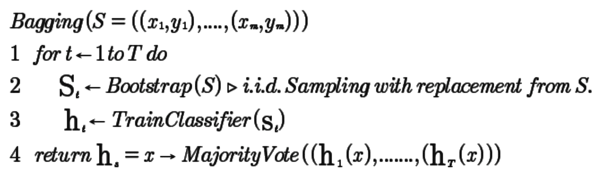
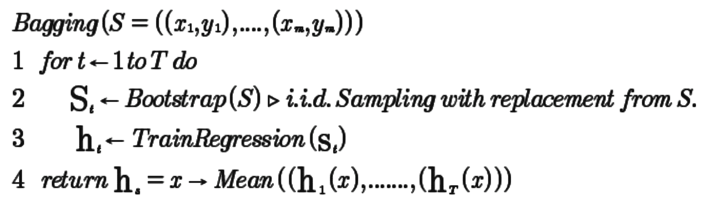
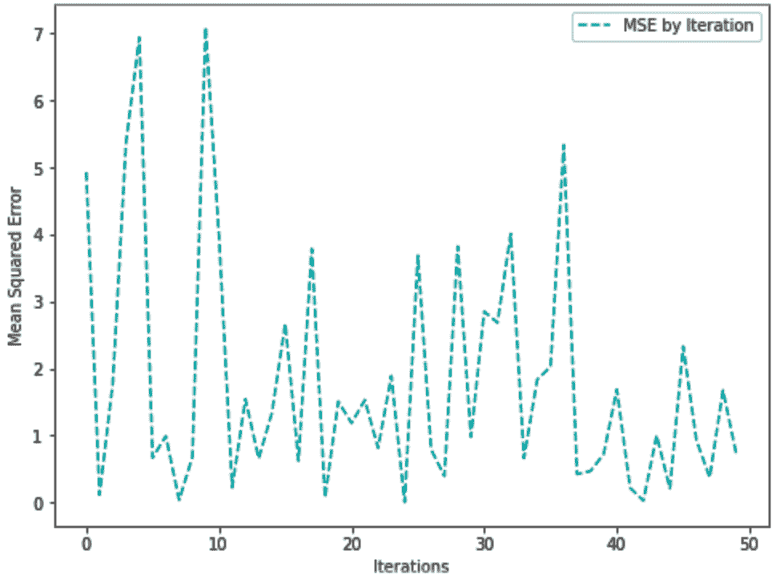
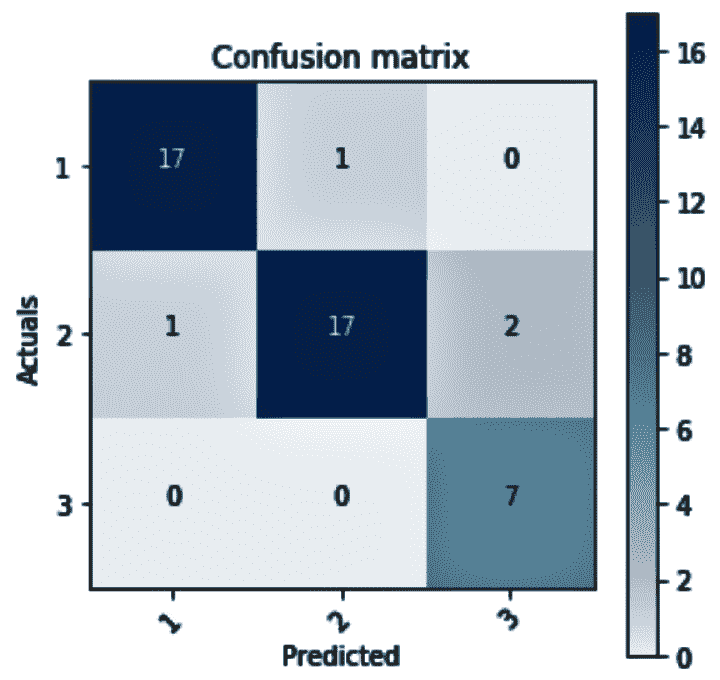
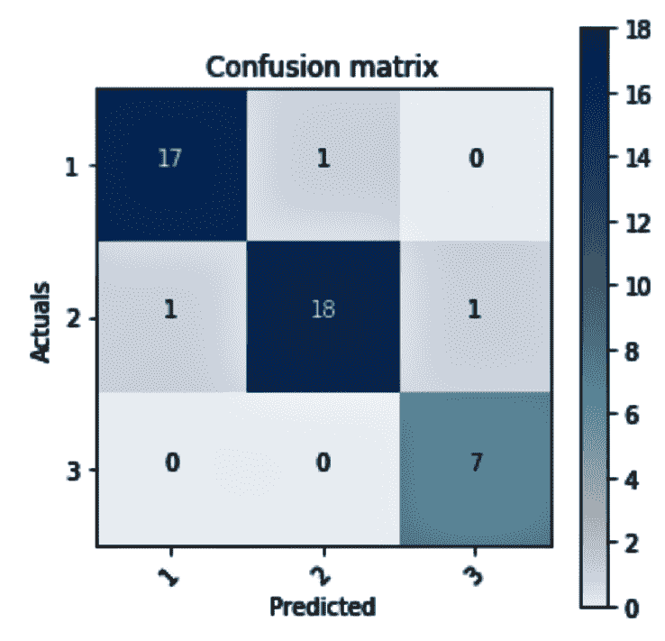
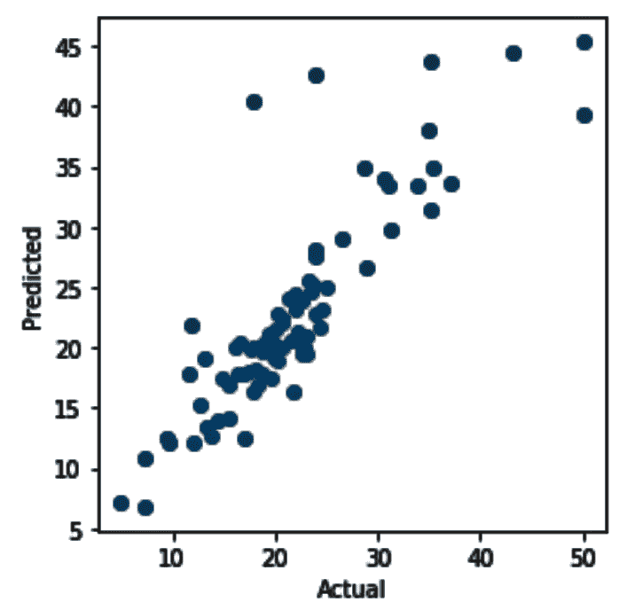
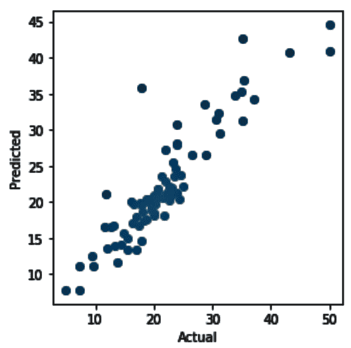

# 用袋子将模型装袋

在本章中，我们将讨论以下配方:

*   自举聚合
*   集成元估计量
*   装袋回归量


# 介绍

分类器的组合有助于大大减少误分类错误。许多研究证明，这种集成方法可以显著降低预测模型的方差。已经提出了几种技术来实现方差减小。例如，在许多情况下，自举聚集(bagging)分类树已经显示出比单个分类树具有更高的准确性。Bagging 可以应用于基于树的算法，以提高预测的准确性，尽管它也可以与基于树的方法之外的方法一起使用。


# 自举聚合

**Bootstrap aggregation** ，也称为 **bagging** ，是 Leo Breiman 在 1994 年提出的一种强大的集成方法，用于防止过拟合。bagging 背后的概念是结合几个基础学习者的预测，以创建一个更准确的输出。

Breiman 表明，bagging 可以在**不稳定的**学习算法中成功实现预期的结果，其中训练数据的微小变化会导致预测的巨大变化。Breiman 证明了神经网络和决策树等算法是不稳定学习算法的例子。Bootstrap 聚合在小型数据集上非常有效。

装袋的一般过程有助于减少那些具有高方差的算法的方差。Bagging 还支持分类和回归问题。下图显示了引导聚合流的工作方式:



使用具有训练数据集 *X* **，**的自举，我们生成 N 个自举样本 *X1* ， *X2，.....，XN* 。

对于每个引导样本，我们训练一个分类器。组合分类器将对所有这些单独分类器的输出进行平均，如下所示:


在上式中， *N* 代表样本数。

在 bagging 分类器中，投票用于进行最终预测。Breiman 提出的 bagging 分类器的伪代码如下:



在 bagging 回归器的情况下，最终预测是在每个 bootstrap 样本上建立的模型预测的平均值。以下伪代码描述了 bagging 回归器:




# 做好准备

我们首先导入所需的库并读取我们的文件。我们使用`warnings`库中的`warnings.filterwarnings()`函数来抑制任何警告:

```
import warnings
warnings.filterwarnings('ignore')

import os
import pandas as pd
import numpy as np

from sklearn.model_selection import train_test_split
from sklearn.linear_model import SGDRegressor
from sklearn.metrics import mean_squared_error, r2_score
from sklearn.utils import resample

import matplotlib.pyplot as plt

```

我们现在已经设置了工作文件夹。从 GitHub 下载`autompg.csv`文件，并复制到你的工作文件夹，如下所示:

```
os.chdir('.../.../Chapter 5')
os.getcwd()
```

我们用`read_csv()`读取数据，并在数据帧的名称前加上`df_`，这样更容易理解:

```
df_autodata = pd.read_csv("autompg.csv")
```

我们检查数据集是否有任何缺失值，如下所示:

```
# The below syntax returns the column names which has any missing value
columns_with_missing_values=df_autodata.columns[df_autodata.isnull().any()]

# We pass the column names with missing values to the dataframe to count the number
# of missing values
df_autodata[columns_with_missing_values].isnull().sum()
```

我们注意到`horsepower`变量有六个缺失值。我们可以用下面的代码使用`horsepower`变量现有值的中值来填充缺失值:

```
df_autodata['horsepower'].fillna(df_autodata['horsepower'].median(), inplace=True)
```

我们注意到`carname`变量是一个标识符，在我们的建模练习中没有用，所以我们可以像下面这样删除它:

```
df_autodata.drop(['carname'], axis=1, inplace=True)
```

我们可以用`dataframe.head()`命令查看数据:

```
df_autodata.head()
```


# 怎么做...

在本节中，我们将了解如何使用引导示例构建模型:

1.  我们从创建引导示例开始。在[第 3 章](6a5a73fc-dba9-4903-a54a-6c79a8ee57b4.xhtml)、*重采样方法*中，我们编写了一个自定义函数`create_bootstrap_oob()`，用于创建引导和**开箱** ( **OOB** )样本。

在下面的代码块中，我们看到了如何创建引导和 OOB 示例:

```
def create_bootstrap_oob(df):
    global df_OOB
    global df_bootstrap_sample 
    # creating the bootstrap sample
    df_bootstrap_sample = resample(df, replace=True, n_samples=100)

    # creating the OOB sample 
    bootstrap_sample_index = tuple(df_bootstrap_sample.index)
    bootstrap_df = df.index.isin(bootstrap_sample_index)

    df_OOB = df[~bootstrap_df]
```

2.  我们使用 bootstrap 样本构建模型，并对所有模型的成本函数进行平均。我们在每个引导样本上使用`SGDRegressor()`。在下面的代码块中，我们重用之前编写的自定义函数`create_bootstrap_oob()`，来创建引导和 OOB 错误示例:

```
iteration=50
mse_each_iterations = list()
lm=SGDRegressor()
total_mse=0
average_mse= list()

for i in range(iteration):
    create_bootstrap_oob(df_autodata)

    # Bootstrap sample features set
    X_BS = df_bootstrap_sample.iloc[:,1:8] 

    # bootstrap sample response variable
    Y_BS = df_bootstrap_sample.iloc[:,0] 

    X_OOB = df_OOB.iloc[:,1:8] #OOB sample features
    Y_OOB = df_OOB.iloc[:,0] #OOB sample response variable 

    # fit your model with bootstrap sample
    lm=SGDRegressor()
    lm.fit(X_BS, Y_BS)

    # test your model on out-of-bag sample 
    predictedvalues = lm.predict(X_OOB)

    # capture MSE for the predicted values against OOB actuals
    mse = mean_squared_error(Y_OOB, predictedvalues)

    # create a list of mse values
    mse_each_iterations.append(mse) 
```

3.  我们现在将绘制每个模型的 MSE:

```
import matplotlib.pyplot as plt
f, ax= plt.subplots(figsize=(8,6))

plt.plot(mse_each_iterations, 'c--', label='MSE by Iteration')

plt.xlabel('Iterations')
plt.ylabel('Mean Squared Error')
plt.legend(loc=1)
plt.show()
```

该图将如下所示:




# 它是如何工作的...

在*步骤 1* 中，我们执行了自定义函数代码来创建`create_bootstrap_oob()`函数，该函数为我们创建了引导程序和 OOB 样本。在*步骤 2* 中，我们执行了以下步骤:

1.  我们决定进行 50 次迭代，因此我们将变量`iteration`设置为`50`。
2.  在每次迭代中，`create_bootstrap_oob()`函数返回两个 DataFrame 对象`df_bootstrap_sample`和`df_OOB`。
3.  我们分别使用`df_bootstrap_sample`和`df_OOB`作为我们的自举样本和 OOB 样本。
4.  我们将`df_bootstrap_sample`和`df_OOB`样本分成特征集和响应变量。
5.  我们将`SGDRegressor()`与我们的 bootstrap 样本相匹配来构建我们的模型。
6.  我们将 OOB 样本传递给模型来预测我们的值。

7.  我们将预测值与 OOB 样本中的响应变量进行了比较。
8.  我们计算了每次迭代的 MSE。

在*步骤 3* 中，我们创建了一个图来显示从第 50 次迭代到每次迭代的 MSE。由于随机性，这个结果可能会有所不同。


# 请参见

*   利奥·布雷曼于 1994 年 9 月发表的《装袋预测》


# 集成元估计量

bagging 分类器和 bagging 回归器是集合元估计器，它们分别在原始数据集的随机子集上拟合基本分类器和回归器模型。来自每个模型的预测被组合以创建最终预测。这些元估计量将随机化引入模型构建过程，并汇总结果。该聚集对数值目标变量的迭代求平均值，并执行多次投票以达到分类结果。


# 袋装分类器

Bagging 分类器在原始训练集的随机子集上训练每个分类器模型，并聚集预测，然后对分类结果执行多元投票。在下面的食谱中，我们将研究一个带有引导样本的装袋分类器的实现。


# 怎么做...

1.  我们从`scikit-learn`库中导入`BaggingClassifier`和`DecisionTreeClassifier`。我们还导入其他所需的库，如下所示:

```
from sklearn.ensemble import BaggingClassifier
from sklearn.tree import DecisionTreeClassifier
from sklearn.model_selection import train_test_split
```

2.  接下来，我们读出数据并查看尺寸:

```
df_winedata = pd.read_csv('winedata.csv')
df_winedata.shape
```

3.  我们将特征和响应集分开。我们还将数据分成训练和测试子集。

```
X = df_winedata.iloc[:,1:14]
Y = df_winedata.iloc[:,0]

X_train, X_test, Y_train, Y_test = train_test_split(X, Y, random_state=1)
```

4.  我们创建了一个`DecisionTreeClassifier`类的实例，并将其传递给`BaggingClassifier()`:

```
dt_model = DecisionTreeClassifier(criterion='entropy')
bag_dt_model = BaggingClassifier(dt_model, max_features=1.0, n_estimators=5, \
                                 random_state=1, bootstrap=True)
```

注意，在前面的代码块中，我们声明了`bootstrap=True`。这是默认值，表示使用替换绘制样本。

5.  我们将模型拟合到训练数据，如下所示:

```
bag_dt_model.fit(X_train, Y_train)
```

6.  我们可以在将测试数据传递给模型后看到分数:

```
bag_dt_model.score(X_test, Y_test)
```

7.  我们使用`predict`函数预测响应变量，如下所示:

```
predictedvalues = bag_dt_model.predict(X_test)
```

8.  我们现在将使用一个代码来绘制混淆矩阵。请注意，这段代码来自 scikit-learn.org。我们执行下面的代码来创建`plot_confusion_matrix()`函数:

```
# code from 
# http://scikit-learn.org/stable/auto_examples/model_selection/plot_confusion_matrix.html
def plot_confusion_matrix(cm, classes,
                          normalize=False,
                          title='Confusion matrix',
                          cmap=plt.cm.Blues):
    """
    This function prints and plots the confusion matrix.
    """
    plt.imshow(cm, interpolation='nearest', cmap=cmap)
    plt.title(title)
    plt.colorbar()
    tick_marks = np.arange(len(classes))
    plt.xticks(tick_marks, classes, rotation=45)
    plt.yticks(tick_marks, classes)

    thresh = cm.max() / 2.
    for i, j in itertools.product(range(cm.shape[0]), range(cm.shape[1])):
        plt.text(j, i, cm[i, j],
                 horizontalalignment="center",
                 color="white" if cm[i, j] > thresh else "black")

    plt.tight_layout()
    plt.ylabel('Actuals')
    plt.xlabel('Predicted')
```

9.  我们使用前面的`plot_confusion_matrix()`函数来绘制混淆矩阵:

```
# This variable holds the class labels of our target variable
target_names = [ '1', '2', '3']

import itertools
from sklearn.metrics import confusion_matrix

# Constructing the Confusion Matrix
cm = confusion_matrix(Y_test, predictedvalues)

# Plotting the confusion matrix
plt.figure(figsize=(3,3))
plot_confusion_matrix(cm, classes=target_names, normalize=False)
plt.show()
```

混淆矩阵图如下所示:




# 它是如何工作的...

在*步骤 1* 中，我们使用 bagging 分类器导入了所需的库来构建决策树分类器模型。在*步骤 2* 中，我们读取我们的数据集，即`winedata.csv`。在*步骤 3* 中，我们分离了我们的特征集和目标变量。我们还将数据分成训练和测试子集。在*步骤 4* 中，我们创建了一个决策树分类器模型，并将其传递给`BaggingClassifier()`。在`DecisionTreeClassifier()`中，`criterion`参数的默认值是`gini`，但是我们将其更改为`entropy`。然后，我们将决策树模型传递给`BaggingClassfier()`。在`BaggingClassfier()`中，我们有包括`n_estimators`和`bootstrap`的参数。`n_estimators`是集合中基本估计量的数量，默认值为`10`。`bootstrap`参数表示是否用替换抽取样品，默认设置为`True`。

在*步骤 5* 和*步骤* *6* 中，我们将我们的模型拟合到训练数据中，并查看测试集的分数。在*步骤 7* 中，我们调用了`predict()`方法并通过了测试特性集。在*步骤 8* 中，我们添加了来自[http://scikit-learn.org](http://scikit-learn.org)的`plot_confusion_matrix()`的代码，它将混淆矩阵作为其输入参数之一，并绘制混淆矩阵。在*步骤 9* 中，我们通过传递混淆矩阵来调用`plot_confusion_matrix()`函数，以生成混淆矩阵图。


# 还有更多...

我们也可以使用`sklearn.model_selection`中的`GridSearchCV()`来网格搜索最佳参数，并在`BaggingClassifier`中使用它们:

1.  首先，我们导入所需的库:

```
from sklearn.model_selection import GridSearchCV
```

2.  然后，我们设置参数值:

```
param_values = {'n_estimators': [10, 20, 25, 30], 'base_estimator__max_leaf_nodes':[5, 10, 15, 20], 'base_estimator__max_depth':[3, 4, 5]}
```

3.  我们实例化我们的`DecisionTreeClassifier`类，并将其传递给`BaggingClassifier()`函数。请注意，我们将`oob_score`设置为`True`来评估基于 OOB 样本构建的模型:

```
dt_model = DecisionTreeClassifier()
bag_dt_model_grid = BaggingClassifier(base_estimator=dt_model, oob_score=True, random_state=1) 
```

4.  我们使用`GridSearchCV()`来确定最佳参数:

```
bc_grid = GridSearchCV(estimator=bag_dt_model_grid, param_grid=param_values, cv=20, n_jobs=-1)
bc_grid.fit(X_train, Y_train)
best_params = bc_grid.best_params_
print(best_params)
```

前面的代码返回最佳参数:


5.  我们现在获取由`bc_grid.bestparams`返回的值，并使用`BaggingClassfier()`函数重建我们的决策树模型。我们为`max_leaf_nodes`传递`10`，为`max_depth`传递`3`，为`n_estimators`传递`20`:

```
best_dt_model = DecisionTreeClassifier(criterion='entropy', max_leaf_nodes=10, max_depth=3) 
final_bag_dt_model = BaggingClassifier(base_estimator=best_dt_model, n_estimators=150, bootstrap=True, random_state=1, oob_score=True)
```

我们在前面的代码块中将`n_estimators`设置为`150`。`n_estimators`参数表示我们想要构建的树的数量。我们将最终模型与训练数据进行拟合，并使用测试特征集进行预测。

6.  然后，我们可以在下面的代码块中查看我们的 OOB 样本的准确性:

```
final_bag_dt_model.fit(X_train, Y_train)
bag_predictedvalues = final_bag_dt_model.predict(X_test)

# See the OOB accuracy
acc_oob = final_bag_dt_model.oob_score_
print(acc_oob)
```

如果我们绘制我们的混淆矩阵，我们可以看到我们在错误分类的数量上有所改进。在前面的示例中，类别 2 的两个实例被错误地预测为类别 3，但是我们现在可以看到错误分类的数量已经减少到一个:




# 请参见

*   打包分类器的学习指南:[https://bit.ly/2zaq8lS](https://bit.ly/2zaq8lS)


# 装袋回归量

Bagging 回归元类似于 bagging 分类器。他们在原始训练集的随机子集上训练每个回归模型，并聚合预测。然后，因为目标变量是数字，所以聚合在迭代中求平均值。在下面的食谱中，我们将展示一个带有引导样本的装袋回归器的实现。


# 做好准备

我们将分别从`sklearn.ensemble`和`sklearn.tree`导入所需的库`BaggingRegressor`和`DecisionTreeRegressor`:

```
from sklearn.ensemble import BaggingRegressor
from sklearn.tree import DecisionTreeRegressor
```

我们读取数据集`bostonhousing.csv`，并查看数据帧的维度:

```
df_housingdata = pd.read_csv('bostonhousing.csv')
df_housingdata.shape
```

我们现在继续创建我们的特性集和目标变量集。


# 怎么做...

1.  我们首先分离我们的特征和响应集。我们还将在下面的代码块中把数据分成训练和测试子集:

```
X = df_housingdata.iloc[:,1:14]
Y = df_housingdata.iloc[:,-1]

X_train, X_test, Y_train, Y_test = train_test_split(X, Y, random_state=1)
```

2.  然后我们将创建一个`DecisionTreeClassifier`类的实例，并将其传递给`BaggingClassifier()`函数:

```
dt_model = DecisionTreeRegressor()
bag_dt_model = BaggingRegressor(dt_model, max_features=1.0, n_estimators=5, bootstrap=True, random_state=1, )
```

3.  我们将使我们的模型符合训练数据集，如下所示:

```
bag_dt_model.fit(X_train, Y_train)
```

4.  我们可以在下面的代码块中看到模型得分:

```
bag_dt_model.score(X_test, Y_test)
```

5.  我们使用`predict()`函数并通过测试数据集来预测我们的目标变量，如下所示:

```
predictedvalues = bag_dt_model.predict(X_test)
```

6.  我们使用以下代码绘制目标变量的实际值和预测值的散点图:

```
#We can plot the actuals and the predicted values 
plt.figure(figsize=(4, 4))
plt.scatter(Y_test, predictedvalues)
plt.xlabel('Actual')
plt.ylabel('Predicted')
plt.tight_layout()
```

执行前面的代码会得到下面的散点图:



`matplotlib.pyplot.tight_layout()`自动调整子情节参数以创建指定的填充。

7.  我们现在将以下代码中的`n_estimators`参数更改为 30，并重新执行从*步骤 3* 到*步骤 6* 的步骤:

```
bag_dt_model = BaggingRegressor(dt_model, max_features=1.0, n_estimators=30, bootstrap=True, random_state=1, )
```

这给了我们以下分数:


8.  实际值与预测值的关系如下图所示。这向我们展示了，当我们将`n_estimator`参数的值从`5`更改为`30`时，预测的值比之前的情况更准确:




# 它是如何工作的...

在*步骤 1* 中，我们分离了特征和目标变量集。我们还将数据分成训练和测试子集。在*步骤 2* 中，我们创建了一个决策树回归器模型，并将其传递给`BaggingRegressor()`函数。注意，我们还将`n_estimator=5`参数传递给了`BaggingRegressor()`函数。如前所述，`n_estimator`是我们希望算法构建的森林中的树的数量。在*步骤 3* 中，我们训练了我们的模型。

在*步骤 4* 中，我们看了一下模型得分，是 0.71。在*步骤 5* 中，我们使用`predict()`函数来预测测试子集的目标变量。之后，在*步骤 6* 中，我们绘制了散点图来探究实际目标值和预测目标值之间的关系。

在*步骤 7* 中，我们将`n_estimator`参数的值从`5`更改为`30`，并重新构建我们的模型。这一次，我们注意到模型得分提高到 0.82。在*步骤 8* 中，我们绘制了实际值和预测值，发现实际值和预测值之间的相关性比我们之前使用`n_estimators=5`的模型好得多。


# 请参见

*   sci kit-bagging 回归元学习指南:[https://bit.ly/2pZFmUh](https://bit.ly/2pZFmUh)
*   单一估计量与打包法:[https://bit.ly/2q08db6](https://bit.ly/2q08db6)